> 本文基于 [OpenJDK17](https://zhida.zhihu.com/search?content_id=244373259&content_type=Article&match_order=1&q=OpenJDK17&zhida_source=entity) 进行讨论


本文概要.png

## 1\. Reference 相关概念及其应用场景总览

Reference（引用）是 JVM 中非常核心且重要的一个概念，垃圾回收器判断一个对象存活与否都是围绕着这个 Reference 来的，JVM 将 Reference 又细分为几种具体的引用类型，它们分别是：StrongReference，SoftReference，WeakReference，PhantomReference，FinalReference。

谈到这些 Reference，可谓是既熟悉又陌生，因此笔者在本文中介绍 Reference 的思路也是从它熟悉的一面再到陌生的一面进行展开讨论。

我们在 JDK 以及一些 [中间件](https://zhida.zhihu.com/search?content_id=244373259&content_type=Article&match_order=1&q=%E4%B8%AD%E9%97%B4%E4%BB%B6&zhida_source=entity) 源码中或多或少见过他们的身影，对他们的应用场景以及概念非常熟悉。比如：

### 1.1 StrongReference

StrongReference： [强引用](https://zhida.zhihu.com/search?content_id=244373259&content_type=Article&match_order=1&q=%E5%BC%BA%E5%BC%95%E7%94%A8&zhida_source=entity) 关系不用多说，这个我们最熟悉了，大部分 Java 对象之间的关系都是强引用，只要对象与 [GcRoot](https://zhida.zhihu.com/search?content_id=244373259&content_type=Article&match_order=1&q=GcRoot&zhida_source=entity) 之间有强引用关系的存在，那么这个对象将永远不会被 [垃圾回收器](https://zhida.zhihu.com/search?content_id=244373259&content_type=Article&match_order=2&q=%E5%9E%83%E5%9C%BE%E5%9B%9E%E6%94%B6%E5%99%A8&zhida_source=entity) 回收。

```
Object gcRoot = new Object();
```

### 1.2 SoftReference

SoftReference：如果对象只有一条 [软引用](https://zhida.zhihu.com/search?content_id=244373259&content_type=Article&match_order=1&q=%E8%BD%AF%E5%BC%95%E7%94%A8&zhida_source=entity) 关联，那么当内存充足的时候，软引用和强引用一样，在发生 GC 的时候，只被软引用关联的对象是不会被回收掉的。当内存不足的时候也就是系统将要发生 OOM 之前，此时发生 GC，那么这些只被软引用所关联的对象将会被当做垃圾回收掉。

```
SoftReference gcRoot = new SoftReference<Object>(new Object());
```

上面这行代码展示的引用关系如下图所示：


image.png

gcRoot 强引用了 SoftReference 对象 ，然后 SoftReference 对象软引用了 Object 对象，那么此时对于 Object 对象来说就只存在一条软引用关系 —— `SoftReference对象 -> Object对象` ，当系统将要发生 OOM 之前，GC 就会将 Object 对象回收掉。后面我们通过 `SoftReference#get` 方法获取到的引用对象将会是 Null （Object 对象已被回收)。

根据 SoftReference 的这个特性，我们可以用它来引用持有一些 memory-sensitive caches 等有用但是非必须的对象。比如，Guava 中的 `CacheBuilder.softValues()` 就可以让 cache 使用 SoftReference 来引用持有 Values，当内存不足的时候回收掉就好了。

```
Cache<Object, Object> softCache = CacheBuilder.newBuilder().softValues().build();
```

还有在 [池化技术](https://zhida.zhihu.com/search?content_id=244373259&content_type=Article&match_order=1&q=%E6%B1%A0%E5%8C%96%E6%8A%80%E6%9C%AF&zhida_source=entity) 的实现中，比如对象池， [连接池](https://zhida.zhihu.com/search?content_id=244373259&content_type=Article&match_order=1&q=%E8%BF%9E%E6%8E%A5%E6%B1%A0&zhida_source=entity) 这些，我们也可以在池中用 SoftReference 来引用持有被池化的这些对象。比如一些 RPC 框架中例如 Dubbo，在从 Sokcet 中读取到 [网络传输](https://zhida.zhihu.com/search?content_id=244373259&content_type=Article&match_order=1&q=%E7%BD%91%E7%BB%9C%E4%BC%A0%E8%BE%93&zhida_source=entity) 进来的 [二进制数据](https://zhida.zhihu.com/search?content_id=244373259&content_type=Article&match_order=1&q=%E4%BA%8C%E8%BF%9B%E5%88%B6%E6%95%B0%E6%8D%AE&zhida_source=entity) 时，需要将这些网络二进制数据序列化成 Java 类，方便后续 [业务逻辑](https://zhida.zhihu.com/search?content_id=244373259&content_type=Article&match_order=1&q=%E4%B8%9A%E5%8A%A1%E9%80%BB%E8%BE%91&zhida_source=entity) 的处理。

当我们采用 Kryo [序列化框架](https://zhida.zhihu.com/search?content_id=244373259&content_type=Article&match_order=1&q=%E5%BA%8F%E5%88%97%E5%8C%96%E6%A1%86%E6%9E%B6&zhida_source=entity) 时，每一次的 [序列化](https://zhida.zhihu.com/search?content_id=244373259&content_type=Article&match_order=3&q=%E5%BA%8F%E5%88%97%E5%8C%96&zhida_source=entity) 都需要用到一个叫做 Kryo 类的实例，由于 Kryo 并不是 [线程安全](https://zhida.zhihu.com/search?content_id=244373259&content_type=Article&match_order=1&q=%E7%BA%BF%E7%A8%8B%E5%AE%89%E5%85%A8&zhida_source=entity) 的，再加上创建初始化一个 Kryo 实例代价比较高，所以在 [多线程](https://zhida.zhihu.com/search?content_id=244373259&content_type=Article&match_order=1&q=%E5%A4%9A%E7%BA%BF%E7%A8%8B&zhida_source=entity) 环境中，我们需要使用 ThreadLocal 来持有 Kryo 实例或者使用 [KryoPool](https://zhida.zhihu.com/search?content_id=244373259&content_type=Article&match_order=1&q=KryoPool&zhida_source=entity) 对象池来池化 Kryo 实例。

由于这里我们介绍的是 SoftReference 的使用场景，所以我们以 KryoPool 为例说明，在 KryoPool 的创建过程中，我们可以指定使用 softReferences 来持有这些 Kryo 实例，当内存不足的时候，GC 将会回收这些 Kryo 实例。

```
public class PooledKryoFactory extends AbstractKryoFactory {

    private KryoPool pool;

    public PooledKryoFactory() {
        pool = new KryoPool.Builder(this).softReferences().build();
    }

    @Override
    public Kryo getKryo() {
        return pool.borrow();
    }

    @Override
    public void returnKryo(Kryo kryo) {
        pool.release(kryo);
    }
}
```

后续多线程在遇到序列化任务时，直接从 KryoPool 中去获取 Kryo 实例，序列化完成之后再将 Kryo 实例归还到池中。当然了，Dubbo 使用的是另一种方式，通过 ThreadLocal 来持有 Kryo 实例也可以达到同样的目的。这里笔者就不深入写了。

```
public class ThreadLocalKryoFactory extends AbstractKryoFactory {

    private final ThreadLocal<Kryo> holder = new ThreadLocal<Kryo>() {
        @Override
        protected Kryo initialValue() {
            return create();
        }
    };

    @Override
    public void returnKryo(Kryo kryo) {
        // do nothing
    }

    @Override
    public Kryo getKryo() {
        return holder.get();
    }
}
```

### 1.3 WeakReference

WeakReference： [弱引用](https://zhida.zhihu.com/search?content_id=244373259&content_type=Article&match_order=1&q=%E5%BC%B1%E5%BC%95%E7%94%A8&zhida_source=entity) 是比 SoftReference 更弱的一种引用关系，如果被引用对象当前只存在一条弱 [引用链](https://zhida.zhihu.com/search?content_id=244373259&content_type=Article&match_order=1&q=%E5%BC%95%E7%94%A8%E9%93%BE&zhida_source=entity) 时，那么发生 GC 的时候，无论内存是否足够，只被弱引用所关联的对象都会被回收掉。

```
WeakReference gcRoot = new WeakReference<Object>(new Object());
```

上面这行代码展示的引用关系如下图所示：


image.png

gcRoot 强引用了 WeakReference 对象 ，然后 WeakReference 对象弱引用了 Object 对象，那么此时对于 Object 对象来说就只存在一条弱引用关系 —— `WeakReference对象 -> Object对象` 。当发生 GC 时， Object 对象就会被回收掉。后面我们通过 `WeakReference#get` 方法获取到的引用对象将会是 Null （Object 对象已被回收)。

和 SoftReference 一样，WeakReference 也经常被用在 [缓存框架](https://zhida.zhihu.com/search?content_id=244373259&content_type=Article&match_order=1&q=%E7%BC%93%E5%AD%98%E6%A1%86%E6%9E%B6&zhida_source=entity) 以及池化技术中，只不过引用强度更弱一些。比如，在 Guava 中，我们可以通过 `CacheBuilder.weakKeys()` 来指定由弱引用来持有缓存 Key，当系统中只有一条弱引用（缓存框架）来持有缓存 Key ，除此之外没有任何的强引用或者软引用持有 Key 时，那么在 GC 的时候，缓存 Key 就会被回收掉，随后 Guava 也会将这个 Key 对应的整个 entry 清理掉。

同样我们也可以通过 `CacheBuilder.weakValues()` 来指定由弱引用来持有缓存 Value，当系统中没有任何强引用或者软引用来持有缓存 Value 时，发生 GC 的时候，缓存的这条 entry 也是会被回收掉的。

```
Cache<Object,Object> weakCache = CacheBuilder.newBuilder().weakKeys().weakValues().build();
```

WeakReference 在池化技术中运用的更加广泛些，比如，在 [Netty](https://zhida.zhihu.com/search?content_id=244373259&content_type=Article&match_order=1&q=Netty&zhida_source=entity) 对象池 Recycler 的设计中：

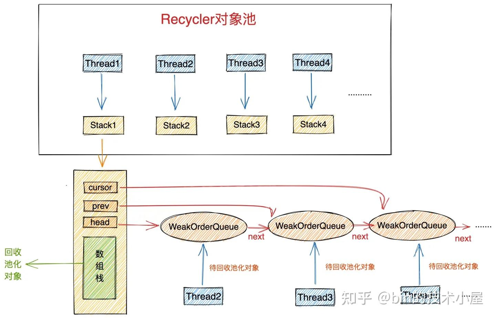

Recycler对象池.png

每个线程都会拥有一个属于自己的 Stack，Stack 中包含一个用数组实现的栈结构（图中绿色部分），这个栈结构正是对象池中真正用于存储池化对象的地方，我们每次从对象池中获取对象都会从这个栈结构中弹出 [栈顶元素](https://zhida.zhihu.com/search?content_id=244373259&content_type=Article&match_order=1&q=%E6%A0%88%E9%A1%B6%E5%85%83%E7%B4%A0&zhida_source=entity) 。同样我们每次将使用完的对象归还到对象池中也是将对象压入这个栈结构中

每个线程拥有一个独立 Stack，这样当多个线程并发从对象池中获取对象时，都是从自己线程中的 Stack 中获取，全程无锁化运行。大大提高了多线程从对象池中获取对象的效率。

线程与 Stack 是一对一的结构，我们看到在 Stack 结构中通过 WeakReference 持有了 Thread 的引用。

```
private static final class Stack<T> {
        final WeakReference<Thread> threadRef;
}
```

这是因为对象池的设计中存在这样一个引用关系： `池化对象 -> DefaultHandler（池化对象在池中的模型） -> stack -> threadRef` 。而池化对象是暴露给用户的，如果用户在某个地方持有了池化对象的强引用忘记清理，而 Stack 持有 Thread 的强引用的话，当线程挂掉的之后，因为这样一个强引用链的存在从而导致 Thread 一直不能被 GC 回收。

另外，为了使多线程回收对象的时候也能够无锁化的进行，每一个回收线程都对应一个 WeakOrderQueue 节点（上图黄色部分）， [回收线程](https://zhida.zhihu.com/search?content_id=244373259&content_type=Article&match_order=2&q=%E5%9B%9E%E6%94%B6%E7%BA%BF%E7%A8%8B&zhida_source=entity) 会将池化对象暂时回收到自己对应的 WeakOrderQueue 结构中，当对象池中的 Stack 没有对象时，就会由 Stack 弱引用关联的 Thread 将 WeakOrderQueue 结构中暂存的回收对象转移到 Stack 中。对象的申请只能从 Stack 中进行，整个申请，回收过程都是 [无锁化](https://zhida.zhihu.com/search?content_id=244373259&content_type=Article&match_order=3&q=%E6%97%A0%E9%94%81%E5%8C%96&zhida_source=entity) 进行的。

WeakOrderQueue 结构也是由 WeakReference 实现的，由于 WeakOrderQueue 与回收线程也是一对一的关系，所以在 WeakOrderQueue 中也是通过弱引用来持有回收线程的实例。

```
private static final class WeakOrderQueue extends WeakReference<Thread> {
}
```

目的也是为了当回收线程挂掉的时候，能够保证回收线程被 GC 及时的回收掉。如果 `WeakOrderQueue.get() == null` 说明当前 WeakOrderQueue 节点对应的回收线程已经挂掉了，此时如果当前节点还有待回收对象，则需要将节点中的所有待回收对象全部转移至 Stack 的数组栈中。

转移完成之后，将该 WeakOrderQueue 节点从 Stack 结构里的 WeakOrderQueue 链表中删除。保证被清理后的 WeakOrderQueue 节点可以被 GC 回收。

> 关于 Recycler 对象池相关的实现细节，感兴趣的同学可以回看下 [《详解Recycler对象池的精妙设计与实现》](https://link.zhihu.com/?target=https%3A//mp.weixin.qq.com/s%3F__biz%3DMzg2MzU3Mjc3Ng%3D%3D%26mid%3D2247484419%26idx%3D1%26sn%3D3a75a495f0f117cca1548da1e0f3e6e6%26chksm%3Dce77c244f9004b52d74b8ffce149ea64e5a8f0ba6713b105d003fdaef8eaa9ad3a5a65d20427%26scene%3D178%26cur_album_id%3D2217816582418956300%23rd)

在比如，Netty 中的资源泄露探测工具 [ResourceLeakDetector](https://zhida.zhihu.com/search?content_id=244373259&content_type=Article&match_order=1&q=ResourceLeakDetector&zhida_source=entity) 也是通过 WeakReference 来探测资源是否存在泄露的，默认是开启的，但我们也可以通过 `-Dio.netty.leakDetection.level=DISABLED` 来关闭资源泄露探测。

Netty 中的 ByteBuf 是一种内存资源，我们可以通过 ResourceLeakDetector 来探测我们的工程是否存在内存泄露的状况，这里面有一个非常重要的类 DefaultResourceLeak 就是一个弱引用 WeakReference。由它来弱引用 ByteBuf。

```
private static final class DefaultResourceLeak<T> extends WeakReference<Object> implements ResourceLeakTracker<T>, ResourceLeak {

    private final Set<DefaultResourceLeak<?>> allLeaks;

    DefaultResourceLeak(
                Object referent,
                ReferenceQueue<Object> refQueue,
                Set<DefaultResourceLeak<?>> allLeaks) {
            // 弱引用 ByteBuf
            super(referent, refQueue);
            // 将弱引用 DefaultResourceLeak 放入全局 allLeaks 集合中
            allLeaks.add(this);
            this.allLeaks = allLeaks;
    }
}
```

在每创建一个 ByteBuf 的时候， Netty 都会创建一个 DefaultResourceLeak 实例来弱引用 ByteBuf，并且会将这个 DefaultResourceLeak 实例放入到一个全局的 allLeaks 集合中。Netty 中的每个 ByteBuf 都会有一个 refCnt 来表示对这块内存的引用情况。

```
public abstract class AbstractReferenceCountedByteBuf extends AbstractByteBuf {
   // 引用计数
   private volatile int refCnt = updater.initialValue();
}
```

对于 ByteBuf 的每一次引用 —— `ByteBuf.retain()` ，都会增加一次引用计数 refCnt。对于 ByteBuf 的每一次释放 —— `ByteBuf.release()`,都会减少一次引用计数 refCnt。当引用计数 refCnt 为 0 时，Netty 就会将与 ByteBuf 弱引用关联的 DefaultResourceLeak 实例从 allLeaks 中删除。

由于 DefaultResourceLeak 只是用来追踪 ByteBuf 的资源泄露情况，它并不能影响 ByteBuf 是否存活，所以 Netty 这里只是让 DefaultResourceLeak 来弱引用一下 ByteBuf。当 ByteBuf 在系统中没有任何强引用或者软引用时，那么就只有一个 DefaultResourceLeak 实例在弱引用它了，发生 GC 的时候 ByteBuf 就会被回收掉。

Netty 判断是否发生 [内存泄露](https://zhida.zhihu.com/search?content_id=244373259&content_type=Article&match_order=2&q=%E5%86%85%E5%AD%98%E6%B3%84%E9%9C%B2&zhida_source=entity) 的时机就发生在 ByteBuf 被 GC 的时候，这时 Netty 会拿到被 GC 掉的 ByteBuf 对应的弱引用 DefaultResourceLeak 实例，然后检查它的 allLeaks 集合是否仍然包含这个 DefaultResourceLeak 实例，如果包含就说明 ByteBuf 有内存泄露的情况。

因为如果 ByteBuf 的引用计数 refCnt 为 0 时，Netty 就会将弱引用 ByteBuf 的 DefaultResourceLeak 实例从 allLeaks 中删除。ByteBuf 现在都被 GC 了，它的 DefaultResourceLeak 实例如果还存在 allLeaks 中，那说明我们就根本没有调用 `ByteBuf.release()` 去释放内存资源。

在探测到内存泄露发生之后，后续 Netty 就会通过 `reportLeak()` 将内存泄露的相关信息以 `error` 的日志级别输出到日志中。

除此之外，WeakReference 的应用场景还有很多，比如在无锁化的设计中频繁用到的 ThreadLocal ：

```
ThreadLocal<Object> gcRoot = new ThreadLocal<Object>(){
            @Override
            protected Object initialValue() {
                return new Object();
            }
   };
```

ThreadLocal 顾名思义是线程本地变量，当我们在程序中定义了一个 ThreadLocal 对象之后，那么在多线程环境中，每个线程都会拥有一个独立的 ThreadLocal 对象副本，这就使得多线程可以独立的操作这个 ThreadLocal 变量不需要加锁。

为了完成线程本地变量的语义，JDK 在 Thread 中添加了一个 ThreadLocalMap 对象，用来持有属于自己本地的 ThreadLocal 变量副本。

```
public class Thread implements Runnable {
        ThreadLocal.ThreadLocalMap threadLocals = null;
}
```

由于我们通常在程序中会定义多个 ThreadLocal 变量，所以 ThreadLocalMap 被设计成了一个 [哈希表](https://zhida.zhihu.com/search?content_id=244373259&content_type=Article&match_order=1&q=%E5%93%88%E5%B8%8C%E8%A1%A8&zhida_source=entity) 的结构 —— `Entry[] table` ，多个 ThreadLocal 变量的本地副本就保存在这个 table 中。

```
static class ThreadLocalMap {
        private Entry[] table;
}
```

table 中的每一个元素是一个 Entry 结构，Entry 被设计成了一个 WeakReference，由 Entry 来弱引用持有 ThreadLocal 对象（作为 key）, 强引用持有 value 。这样一来，ThreadLocal 对象和它所对应的 value 就被 Entry 关联起来了。

```
static class Entry extends WeakReference<ThreadLocal<?>> {
        Object value;
        Entry(ThreadLocal<?> k, Object v) {
                // 弱引用
                super(k);
                // 强引用
                value = v;
        }
}
```

当某一个线程开始调用 ThreadLocal 对象的 get 方法时：

```
ThreadLocal<Object> gcRoot = new ThreadLocal<Object>(){
            @Override
            protected Object initialValue() {
                return new Object();
            }
        };

        gcRoot.get();
```

JDK 首先会找到本地线程中保存的 ThreadLocal 变量副本 —— ThreadLocalMap，然后以 ThreadLocal 对象为 key —— 也就是上面 `gcRoot ` 变量引用的 ThreadLocal 对象，到哈希表 table 中查找对应的 Entry 结构（WeakReference），近而通过 `Entry. value ` 找到该 ThreadLocal 对象对应的 value 值返回。

```
public class ThreadLocal<T> {
    public T get() {
        Thread t = Thread.currentThread();
        // 获取本地线程中存储的 ThreadLocal 变量副本
        ThreadLocalMap map = getMap(t);
        if (map != null) {
            // 以 ThreadLocal 对象为 key，到哈希表 table 中查找对应的 Entry 结构
            ThreadLocalMap.Entry e = map.getEntry(this);
            if (e != null) {
                // 返回该 threadLocal 对象对应的 value。
                T result = (T)e.value;
                return result;
            }
        }
        // 如果 threadLocal 对象还未设置 value 值的话，则调用 initialValue 初始化 threadLocal 对象的值
        return setInitialValue();
    }
}
```

以上面这段示例代码为例，当前系统中的这个 ThreadLocal 对象 —— 也就是由 `gcRoot ` 变量指向的 ThreadLocal 对象，存在以下两条引用链：

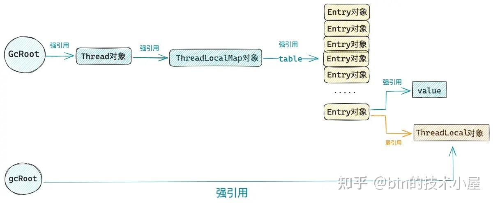

image.png

- 一条是 `Thead对象 -> ThreadLocalMap对象->Entry对象` 这条弱引用链。
- 另一条则是有 `gcRoot变量 -> ThreadLocal对象` 这条强引用链。

当我们通过 `gcRoot = null` 来断开 gcRoot 变量到 ThreadLocal 对象的强引用之后，ThreadLocal 对象在系统中就只剩下一条弱引用链存在了。

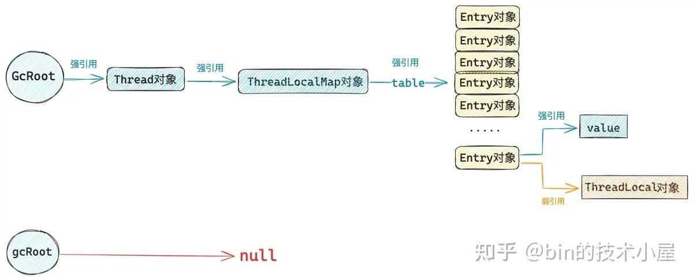

image.png

Entry 被设计成一个 WeakReference，由它来弱引用 ThreadLocal 对象的好处就是，当系统中不存在任何对这个 ThreadLocal 对象的强引用之后，发生 GC 的时候这个 ThreadLocal 对象就会被回收掉。后续我们在通过 `Entry.get()` 获取 Key（ThreadLocal 对象）的时候就会得到一个 Null 。

虽然现在 ThreadLocal 对象已经被 GC 掉了，但 JDK 对于 Reference 的处理流程还没有结束，事实上对于 Reference 的处理是需要 GC 线程以及 Java 业务线程相互配合完成的，这也是本文我们要重点讨论的主题。（唠叨了这么久，终于要引入主题了）

GC 线程负责回收被 WeakReference 引用的对象，也就是这里的 ThreadLocal 对象。但别忘了这里的 Entry 对象本身也是一个 WeakReference 类型的对象。被它弱引用的对象现在已经回收掉了，那么与其关联的 Entry 对象以及 value 其实也没啥用处了。

但如上图所示，Entry 对象以及 value 对象却还是存在一条强引用链，虽然他们没什么用了，但仍然无法被回收，如果 Java 业务线程不做任何处理的话就会导致内存泄露。

在 ThreadLocal 的设计中 ，Java 业务线程清理无用 Entry 的时机有以下三种：

1. 当我们在线程中通过 `ThreadLocal.get()` 获取任意 ThreadLocal [变量值](https://zhida.zhihu.com/search?content_id=244373259&content_type=Article&match_order=1&q=%E5%8F%98%E9%87%8F%E5%80%BC&zhida_source=entity) 的时候， **如果发生哈希冲突** ，随后采用开放定址解决冲突的过程中，如果发现 key 为 null 的 Entry，那么就将该 Entry以及与其关联的 vakue 设置为 null。最后以此 Entry 对象为起点遍历整个 ThreadLocalMap 清理所有无用的 Entry 对象。 **但这里需要注意的是如果 `ThreadLocal.get()` 没有发生哈希冲突（直接命中），或者在解决哈希冲突的过程中没有发现 key 为 null 的 Entry** ，那么就不会触发无用 Entry 的清理，仍然存在内存泄露的风险。

```
private int expungeStaleEntry(int staleSlot) {
            Entry[] tab = table;
            int len = tab.length;

            // 将当前遍历到的 Entry 以及与其关联的 value 设置为 null
            tab[staleSlot].value = null;
            tab[staleSlot] = null;
            size--;

            Entry e;
            int i;
            // 遍历整个 ThreadLocalMap，清理无用的 Entry
            for (i = nextIndex(staleSlot, len);
                 (e = tab[i]) != null;
                 i = nextIndex(i, len)) {
                ThreadLocal<?> k = e.get();
                if (k == null) {
                    e.value = null;
                    tab[i] = null;
                    size--;
                }
            }
            return i;
        }
```

1. 当我们在线程中通过 `ThreadLocal.set(value) ` 设置任意 ThreadLocal 变量值的时候，如果直接通过 ThreadLocal 变量定位到了 Entry 的位置，那么直接设置 value 返回，并不会触发无用 Entry 的清理。如果在定位 Entry 的时候发生哈希冲突，随后会通过开放定址在 ThreadLocalMap 中寻找到一个合适的 Entry 位置。并从这个位置开始向后扫描 `log2(size)` 个 Entry，如果在扫描的过程中发现有一个是无用的 Entry，那么就会遍历整个 ThreadLocalMap 清理所有无用的 Entry 对象。但如果恰好这 `log2(size)` 个 Entry 都是有用的，即使后面存在无用的 Entry 也不会再清理了，这也导致了内存泄露的风险。

```
// 参数 i 表示开发定址定位到的 Entry 位置
        // n 为当前 ThreadLocalMap 的 size
        private boolean cleanSomeSlots(int i, int n) {
            boolean removed = false;
            Entry[] tab = table;
            int len = tab.length;
            do {
                i = nextIndex(i, len);
                Entry e = tab[i];
                // 如果发现有一个是无用 Entry
                if (e != null && e.refersTo(null)) {
                    // 遍历整个 ThreadLocalMap 清理所有无用的 Entry 对象
                    i = expungeStaleEntry(i);
                }
            } while ( (n >>>= 1) != 0); // 向后扫描 log2(size) 个 Entry
            return removed;
        }
```

1. 前面介绍的 get, set 方法只是顺手清理一下 ThreadLocalMap 中无用的 Entry，但并不一定保证能够触发到清理动作，所以仍然面临内存泄露的风险。一个更加安全有效的方式是我们需要在使用完 ThreadLocal 对象的时候，手动调用它的 `remove` 方法，及时清理掉 Entry 对象并通过 `Entry.clear()` 断开 Entry 到 ThreadLocal 对象之间的弱引用关系，这样一来，当 ThreadLocal 对象被 GC 的时候，与它相关的 Entry 对象以及 value 也会被一并 GC ，这样就彻底杜绝了内存泄露的风险。

```
private void remove(ThreadLocal<?> key) {
            Entry[] tab = table;
            int len = tab.length;
            // 确定 key 在 table 中的起始位置
            int i = key.threadLocalHashCode & (len-1);
            for (Entry e = tab[i];
                 e != null;
                 e = tab[i = nextIndex(i, len)]) {
                if (e.refersTo(key)) {
                    // 断开 Entry  到 ThreadLocal 对象之间的弱引用关系
                    e.clear();
                    // 清理 key 为 null 的 Entry 对象。
                    expungeStaleEntry(i);
                    return;
                }
            }
        }
```

### 1.4 PhantomReference

PhantomReference： [虚引用](https://zhida.zhihu.com/search?content_id=244373259&content_type=Article&match_order=1&q=%E8%99%9A%E5%BC%95%E7%94%A8&zhida_source=entity) 其实和 WeakReference 差不多，他们共同的特点都是一旦发生 GC，PhantomReference 和 WeakReference 所引用的对象都会被 GC 掉，当然前提是这个对象没有其他的强引用或者软引用存在。不同的是 PhantomReference 无法像其他引用类型一样能够通过 get 方法获取到被引用的对象。

```
public class PhantomReference<T> extends Reference<T> {
    public T get() {
        return null;
    }
}
```

看上去这个 PhantomReference 好像是没啥用处，因为它既不能影响被引用对象的生命周期，也无法通过它来访问被引用对象。但其实不然，我们用 PhantomReference 来虚引用一个对象的目的其实为了能够在这个对象被 GC 之后，我们在 Java 业务线程中能够感知到，在感知到对象被 GC 之后，可以利用这个 PhantomReference 做一些资源清理的动作。

比如与 DirectByteBuffer 关联的 Cleaner 对象，其实就是一个 PhantomReference 的实现，当 DirectByteBuffer 被 GC 掉之后，由于其与 Cleaner 虚引用关联，所以我们可以在 Java 业务线程中感知到，随后可以利用 Cleaner 来释放 DirectByteBuffer 背后引用的 Native Memory。

### 1.5 FinalReference

FinalReference 只是和 Java 类中的 finalize 方法（OpenJDK9 中已被废弃）的执行机制有关，但笔者建议大家忘掉 JDK 中还有这么个玩意存在，因为 FinalReference 会使 Java 对象的回收过程变得磨磨唧唧，拖拖拉拉。可能需要等上好几轮 GC，对象才可以被回收掉。所以我们基本不会见到 FinalReference 的应用场景，因为这玩意磨磨唧唧的没啥卵用。不过笔者还是会在本文的最后介绍它，目的不是为了让大家使用它，而是在末尾利用它再次给大家串联一下 JVM 关于 Reference 的整个处理流程。

## 2\. Reference —— 最熟悉的陌生人

以上介绍的都是我们熟悉的 Reference，之所以说它熟悉，是因为上述 Reference 相关的处理逻辑都发生在 Java 的业务线程中，如果我们站在 JVM 全局视角上看，Reference 的完整处理流程是需要 Java 线程和 GC 线程一起相互配合完成的。

之所以说它陌生，是因为 GC 线程处理的过程对我们来说还是一个黑盒，这使得我们无法触达 Reference 的本质，如果我们只是从概念上去理解 Reference 的话，一定会有很多模棱两可，似是而非的感觉，相信大家在阅读第一小节的过程中都会伴随着这种感觉，比如：

1. 当内存不足的时候，那些只被 SoftReference 引用的对象将被 GC 回收掉，那么这个 “内存不足” 的概念就很模糊，如何定义内存不足 ？能不能量化出一个具体的回收时机 ？到底什么情况下会触发回收 ？
2. 当发生 GC 的时候，无论内存是否足够，那些只被 WeakReference 所引用的对象都会被回收掉。 **但大家别忘了这些 WeakReference 本身其实也是一个普通的 Java 对象** ，GC 在判断一个对象是否存活的依据，就是沿着 GcRoot 的引用关系链开始逐个遍历，遍历到的对象就标记为存活，没有遍历到的对象就不标记。后续将被标记的对象统一转移到新的内存区域，然后一股脑的清除没有被标记的对象。如果一个 GcRoot 引用了 WeakReference 对象。而 WeakReference 对象又引用了一个 Object 对象。那么按道理来说这个 Object 对象也在引用链上啊，应该也是能够被 GC 标记到的啊，那为什么就被 GC 给回收了呢 ？ JVM 到底是如何实现 WeakReference 弱引用语义的呢 ？
3. PhantomReference 既不能影响被引用对象的生命周期，也无法通过它来访问被引用对象，那我们要它干嘛 ？ 用 PhantomReference 来虚引用一个对象的目的就是为了跟踪被引用对象是否被 GC 回收了，当虚引用的对象被 GC 之后，我们在 Java 线程中可以感知到，近而做一些相关资源清理的动作。那么请问 Java 线程是如何感知到的 ？ GC 线程如何通知 ？ Java 线程如何收到这个通知，它们两者是如何配合的 ？
4. FinalReference 到底是如何让 Java 对象的回收过程变得磨磨唧唧，拖拖拉拉的呢 ？
5. PhantomReference 和 WeakReference 看起来好像都差不多，如果 PhantomReference 能够跟踪对象的回收状态，那么 WeakReference 可不可以 ？它们之间究竟有何不同 ？
6. 上面聊到的这些 Reference 类型：SoftReference，WeakReference，PhantomReference，FinalReference 其实本质上都是一个普通的 Java 类，由他们定义的对象也只是一个普通的 Java 对象。而当这些 Reference 对象引用的 Object 对象被 GC 回收掉之后，其实这些 Reference 对象也就没用了，但由于 GcRoot 还能关联到这些 Reference 对象，从而导致这些无用的 Reference 对象无法被 GC 回收。那么我们在 Java 业务线程中该如何处理这些无用的 Reference 对象 ？这些 Reference 对象又是在什么时候被回收的呢 ？
   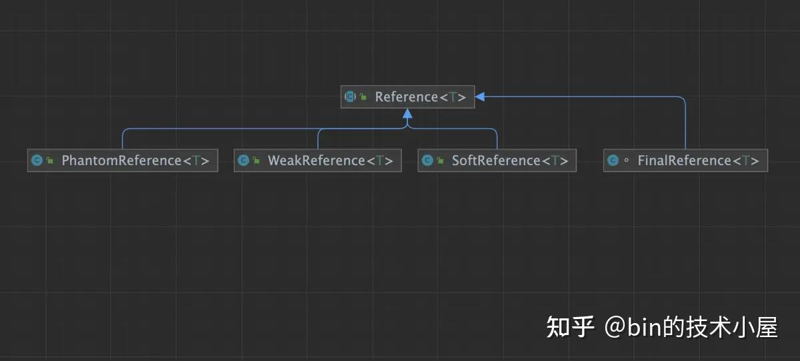

image.png

笔者将会在本文中为大家解答上述这六个问题，如果屏幕前的你是一个 Java 小白，那么恭喜你，接下来你可以无障碍地阅读本文的内容，因为你心中没有杂念，在探寻 Reference 本质的过程中不会被既定的思维模式所影响和误导。 **你只需要始终牢记一点，就是这些 Reference 只是一个普通的 Java 类，它们的对象也只是一个普通的 Java 对象** 。 笔者不断强调的这个概念看起来很傻，但是真的非常重要，因为它是我们探寻 Reference 本质的起点。

```
public abstract class Reference<T> {
}

public class SoftReference<T> extends Reference<T> {
}
public class WeakReference<T> extends Reference<T> {
}
public class PhantomReference<T> extends Reference<T> {
}
```

如果屏幕前的你是一个 Java 老司机，那么请你！现在！立刻！马上！忘掉所有关于 Reference 的既有概念和印象。就是把它当做一个普通的 Java 类来看待，重新以这个为起点，跟随笔者的思路一步一步探寻 Reference 的本质。


image.png

下面我们就从一个具体的问题开始，来正式开启本文的内容~~~

## 3\. JVM 如何回收 DirectBuffer 背后的 NativeMemory

NIO 中的 DirectByteBuffer 究其本质而言，其实只是 OS 中的 Native Memory 在 JVM 中的一种封装形式，DirectByteBuffer 本身非常具有迷惑性，因为 JVM 能够察觉到的只是 DirectByteBuffer 这个 Java 实例在 JVM 堆中占用的那么一点点的内存，而 DirectByteBuffer 背后所引用的大片 OS 中的 Native Memory，JVM 是察觉不到的。

所以人们将 DirectByteBuffer 实例形象的比喻为 “冰山对象”，DirectByteBuffer 实例就是冰山上的那一角，位于 JVM 堆中，内存占用非常小，它和普通的 Java 对象一样，当没有任何强引用或者软引用的时候，将会被 GC 回收掉。


image.png

但位于冰山下面的这一大片 Native Memory，GC 是管不到的。也就是说 GC 只能回收 DirectByteBuffer 实例占用的这一小部分 JVM [堆内存](https://zhida.zhihu.com/search?content_id=244373259&content_type=Article&match_order=1&q=%E5%A0%86%E5%86%85%E5%AD%98&zhida_source=entity) ，但 GC 无法回收 DirectByteBuffer 背后引用的这一大片 Native Memory。

难道就只能让 JVM 进程拿着这一大片 Native Memory 不放直到 OOM 吗？这样肯定是不行的，那 JVM 是如何回收 DirectByteBuffer 背后引用的这片 Native Memory 呢 ？接下来我们能不能试着看从 DirectByteBuffer 的创建过程中找到一些蛛丝马迹。

```
class DirectByteBuffer extends MappedByteBuffer implements DirectBuffer
{
    private final Cleaner cleaner;

    DirectByteBuffer(int cap) {                   // package-private

        ...... 省略 .....
        // 检查堆外内存整体用量是否超过了 -XX:MaxDirectMemorySize
        // 如果超过则尝试等待一下 JVM 回收堆外内存，回收之后还不够的话则抛出 OutOfMemoryError
        Bits.reserveMemory(size, cap);
        // 底层调用 malloc 申请虚拟内存
        base = UNSAFE.allocateMemory(size);

        ...... 省略 .....

        cleaner = Cleaner.create(this, new Deallocator(base, size, cap));
    }
}
```

DirectByteBuffer 的创建主要由下面的三大核心步骤来完成，JDK 会首先通过 `Bits.reserveMemory` 来检查当前 JVM 进程的堆外内存用量是否超过了 `-XX:MaxDirectMemorySize` 指定的最大堆外内存限制。

如果已经超过了，则会在这里进行一下补救，检查一下当前是否有其他的 DirectByteBuffer 被 GC 掉，如果有则等待一下 JDK 去释放这些被引用的 native memory。

如果释放之后堆外内存容量还是不够，那么就触发 `System.gc()` 尝试看能不能再尽量回收一些没用的 DirectByteBuffer，如果又回收了一些 DirectByteBuffer，则再次等待一下 JDK 去释放这些被引用的 native memory。在这一系列的补救措施施行完之后如果堆外内存容量还是不够，则触发 OOM。

> 这里只需要了解一下 Bits.reserveMemory 的核心逻辑即可，相关的 native memory 回收细节恰巧是本小节的主题，笔者后面会对这些细节进行介绍。

如果堆外内存容量足够，则通过 `UNSAFE.allocateMemory` 向 OS 申请 native memory 。

最后一步非常关键，我们看到 DirectByteBuffer 内部关联了一个 Cleaner 对象。这难道是巧合吗 ？我们恰巧正在讨论 native memory 回收的场景，从 Cleaner 的命名上来推测，顾名思义，这里难道就是释放 native memory 的地方吗 ？

下面我们来通过 `Cleaner.create` 方法进入到 Cleaner 的内部试着看寻找一下答案：

### 3.1 Cleaner 机制的设计与实现

```
public class Cleaner extends PhantomReference<Object>
{
        public static Cleaner create(Object ob, Runnable thunk) {
              if (thunk == null)
                  return null;
              return add(new Cleaner(ob, thunk));
        }
        // Deallocator
        private final Runnable thunk;
        // 忽略这个 dummyQueue，Cleaner 并不会用到它
        private static final ReferenceQueue<Object> dummyQueue = new ReferenceQueue<>();

        private Cleaner(Object referent, Runnable thunk) {
            // 调用 PhantomReference 类的构造函数
            super(referent, dummyQueue);
            // Deallocator
            this.thunk = thunk;
        }
}
```

关键的信息出现了，Cleaner 类原来继承自 PhantomReference 类型，这里要创建的 Cleaner 对象本质上其实就是一个 PhantomReference 对象。

JDK 首先会通过 Cleaner 类的私有构造方法构造出一个 PhantomReference 对象。构建参数 referent 就是我们创建好的 DirectByteBuffer，thunk 就是在 DirectByteBuffer 构造函数中传入的 Deallocator，Deallocator 我们先不用管，这里大家只需要记得 Cleaner 类中的 thunk 字段其实指向的是 Deallocator 对象就可以了。

在 Cleaner 的父类构造函数构建 PhantomReference 对象的时候又传入了一个 ReferenceQueue 类型的 dummyQueue，这个 ReferenceQueue 在 Reference 机制中是一个非常重要的概念，但本小节中我们不会用到它，不需要管。但大家需要记住这个 ReferenceQueue 很重要，笔者后面还会再次提起。

Reference 类中有一个很重要的字段 `referent` ，用来关联 Reference 所引用的对象，这里 referent 指向的是 DirectByteBuffer 对象。这里大家先不用管什么虚引用，弱引用，软引用的语义，只需要知道 PhantomReference 就是一个普通的对象，对象中有一个普通的字段 referent 现在指向了 DirectByteBuffer 对象。

```
public abstract class Reference<T> {
    // PhantomReference 虚引用的对象
    private T referent;
    // 暂时先不要管这个 ReferenceQueue，但它是非常重要的一个概念
    volatile ReferenceQueue<? super T> queue;

    Reference(T referent, ReferenceQueue<? super T> queue) {
        //  PhantomReference 虚引用了 DirectByteBuffer 对象
        this.referent = referent;
        this.queue = (queue == null) ? ReferenceQueue.NULL : queue;
    }
}
```

当 Cleaner 被创建出来之后，DirectByteBuffer 就与 PhantomReference（Cleaner）发生了关联。

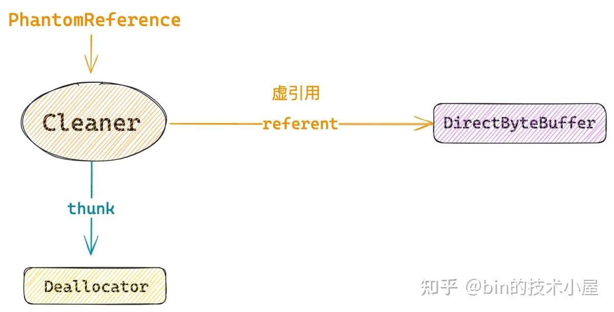

image.png

除此之外，在 Cleaner 的内部还有一个 [双向链表](https://zhida.zhihu.com/search?content_id=244373259&content_type=Article&match_order=1&q=%E5%8F%8C%E5%90%91%E9%93%BE%E8%A1%A8&zhida_source=entity) ，由 `first` 指针指向双向链表的 [头结点](https://zhida.zhihu.com/search?content_id=244373259&content_type=Article&match_order=1&q=%E5%A4%B4%E7%BB%93%E7%82%B9&zhida_source=entity) 。

```
public class Cleaner extends PhantomReference<Object>
{
    private static Cleaner first = null;

    private Cleaner next = null, prev = null;
}
```

每当一个 Cleaner 对象被创建出来之后，JDK 都会通过下面的 add 方法，将新的 Cleaner 对象采用头插法插入到双向链表中。

```
private static synchronized Cleaner add(Cleaner cl) {
        if (first != null) {
            cl.next = first;
            first.prev = cl;
        }
        first = cl;
        return cl;
    }
```

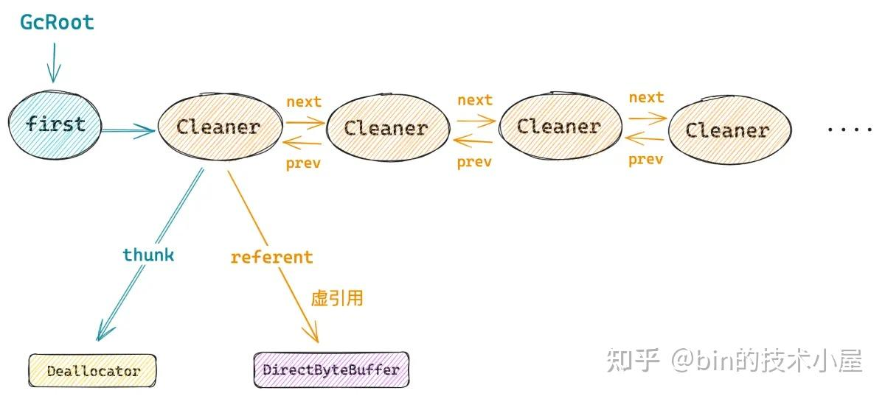

image.png

JDK 这里使用一个双向链表来始终持有系统中所有 Cleaner 对象的目的其实就是为了让这些 Cleaner 对象始终与 GcRoot 关联，始终保持一条强引用链的存在。

这样一来就可以保证被 Cleaner 对象虚引用的这个 DirectByteBuffer 对象，无论在它被 GC 回收之前还是回收之后，与它关联的这个 Cleaner 对象始终保持活跃不会被 GC 回收掉，因为我们最终要依靠这个 Cleaner 对象来释放 native memory 。

那么这个 Cleaner 是如何完成释放 native memory 的工作呢 ？我们来看它的 `clean()` 方法：

```
// 具体资源的释放逻辑封装在 thunk 中
    // Deallocator 对象
    private final Runnable thunk;

    public void clean() {
        // 将该 Cleaner 对象从双向链表中删除，目的是断开 Cleaner 对象的强引用链
        // 等到下一次 GC 的时候就可以回收这个 Cleaner 对象了
        if (!remove(this))
            return;
        try {
            // 进行资源清理
            thunk.run();
        } catch (final Throwable x) {
           .... 省略 ....
        }
    }
```

在执行 clean 方法的开始，JDK 首先会调用 `remove` 方法将当前 Cleaner 对象从其内部持有的这个全局双向链表中删除。目的是断开 Cleaner 对象的这个唯一的强引用链。

因为我们这里执行的是 Cleaner 的资源清理操作，当 Cleaner 清理完资源之后，它就没用了，所以要断开它的强引用链，等到下一次 GC 的时候这个 Cleaner 对象就可以被回收了。

资源清理的核心操作封装在 thunk 中，它是一个 Runnable 类型的对象，在 DirectByteBuffer 的构造函数中，我们传入的是 Deallocator，Deallocator 中封装了 native memory 的相关信息，在它的 run 方法中通过 `UNSAFE.freeMemory` 将 native memory 进行释放。

```
private static class Deallocator implements Runnable
   {
        // native memory 的起始内存地址
        private long address;
        // OS 实际申请的 native memory 大小
        private long size;
        // DirectByteBuffer 的容量
        private int capacity;

        public void run() {
            if (address == 0) {
                // Paranoia
                return;
            }
            // 底层调用 free 来释放 native memory
            UNSAFE.freeMemory(address);
            address = 0;
            // 更新 direct memory 的用量统计信息
            Bits.unreserveMemory(size, capacity);
        }
    }
```

到这里我们可以看出，Cleaner 为 JDK 提供了一种资源释放的机制，所有引用 OS 资源的 Java 类其实都可以用这里的 Cleaner 机制去完成 OS 资源的释放，不光光是 DirectByteBuffer 。

我们只需要将 OS 相关资源的释放动作封装到一个 Runnable 对象中，然后在需要释放资源的 Java 类的构造函数中通过 `Cleaner.create` 将自己的 this 指针与负责资源回收的 Runnable 对象传递进去构造一个 Cleaner 对象即可。

```
class DirectByteBuffer extends MappedByteBuffer implements DirectBuffer
{
    private final Cleaner cleaner;

    DirectByteBuffer(int cap) {                   // package-private

        ...... 省略 .....

        cleaner = Cleaner.create(this, new Deallocator(base, size, cap));
    }
}
```

类似的用法还有很多，比如，我们通过 `FileChannel#map` 将文件映射到 MappedByteBuffer 中的时候，JDK 会将 [内存映射](https://zhida.zhihu.com/search?content_id=244373259&content_type=Article&match_order=1&q=%E5%86%85%E5%AD%98%E6%98%A0%E5%B0%84&zhida_source=entity) 区的相关信息封装在 Unmapper 类中，Unmapper 类中的信息包括：

- mmap [系统调用](https://zhida.zhihu.com/search?content_id=244373259&content_type=Article&match_order=1&q=%E7%B3%BB%E7%BB%9F%E8%B0%83%E7%94%A8&zhida_source=entity) 在进程地址空间真实映射出来的虚拟内存区域起始地址 addr 。
- 虚拟内存区域真实的映射长度 mapSize 。
- MappedByteBuffer 的容量大小。
- 映射文件的 file descriptor
- MappedByteBuffer 的起始内存地址，等等。

```
public class FileChannelImpl extends FileChannel
{
   public MappedByteBuffer map(MapMode mode, long position, long size) throws IOException {

        Unmapper unmapper = mapInternal(mode, position, size, prot, isSync);

        return Util.newMappedByteBuffer((int)unmapper.cap,
                    unmapper.address + unmapper.pagePosition,
                    unmapper.fd,
                    unmapper, isSync);
    }
}
```

随后会通过 `Util.newMappedByteBuffer` 利用 Unmapper 中封装的文件映射区信息来创建 MappedByteBuffer，这里我们可以看到其实底层创建的是一个 DirectByteBuffer 实例，因为 MappedByteBuffer 也是 DirectByteBuffer 的一种，只不过它位于进程虚拟内存空间中的文件与匿名映射区域罢了。


image.png

```
class DirectByteBuffer extends MappedByteBuffer implements DirectBuffer
{
   protected DirectByteBuffer(int cap, long addr,
                                     FileDescriptor fd,
                                     Runnable unmapper,
                                     boolean isSync, MemorySegmentProxy segment)
    {
        super(-1, 0, cap, cap, fd, isSync, segment);
        address = addr;
        cleaner = Cleaner.create(this, unmapper);
        att = null;
    }
}
```

在 MappedByteBuffer 的创建过程中，也用到了 Cleaner，只不过这里传入的 thunk （Runnable）不是 Deallocator 而是 Unmapper。

```
private static abstract class Unmapper implements Runnable, UnmapperProxy {

    @Override
    public void run() {
            unmap();
    }

    public void unmap() {
            if (address == 0)
                return;
            // 底层调用 unmmap 系统调用，释放由 mmap 映射出来的虚拟内存以及物理内存
            unmap0(address, size);
            address = 0;

            // if this mapping has a valid file descriptor then we close it
            if (fd.valid()) {
                try {
                    nd.close(fd);
                } catch (IOException ignore) {
                    // nothing we can do
                }
            }
        }
  }
```

当与 MappedByteBuffer 相关联的 Cleaner 对象的 `clean()` 方法被调用的时候，就会触发 Unmapper 中的 `unmap()` 方法来释放由 mmap 映射出来的虚拟内存以及物理内存。

> 对 MappedByteBuffer 相关实现细节感兴趣的同学，可以回看下 [《从 Linux 内核角度探秘 JDK MappedByteBuffer》](https://link.zhihu.com/?target=https%3A//mp.weixin.qq.com/s%3F__biz%3DMzg2MzU3Mjc3Ng%3D%3D%26mid%3D2247489304%26idx%3D1%26sn%3D18e905f573906ecff411ebdcf9c1a9c5%26chksm%3Dce77d15ff9005849b022e4288e793e5036bda42916591a4a3d28f76554188c25cfbd35d951f9%26scene%3D178%26cur_album_id%3D2559805446807928833%23rd)

好了，现在整个 Cleaner 机制的设计笔者就为大家介绍完了，但最关键的问题是 Cleaner 中的这个 `clean()` 方法到底是在什么时候，又是被谁调用的呢 ？

我们还是先回归到 Cleaner 本身，Cleaner 其实是一个 PhantomReference，在 JVM 中有一个 system thread 负责专门处理这些 Reference 对象，这个 system thread 就是 ReferenceHandler 线程，它是一个后台守护线程，拥有最高的调度优先级。那么它在后台究竟默默地干了哪些事情呢 ？接下来我们就聊一聊这个 ReferenceHandler 线程。

### 3.2 ReferenceHandler 线程

ReferenceHandler 线程是在 Reference 类被加载的时候创建的，从下面的创建过程我们可以看到，ReferenceHandler 线程被创建成一个 system thread，拥有最高的调度优先级 —— `Thread.MAX_PRIORITY` ，这样可以尽最大可能保证 ReferenceHandler 线程被及时的调度到，目的是可以让它及时地去处理那些需要被处理的 Reference 对象。

```
public abstract class Reference<T> {

    static {
        ThreadGroup tg = Thread.currentThread().getThreadGroup();
        // 获取 system thread group
        for (ThreadGroup tgn = tg;
             tgn != null;
             tg = tgn, tgn = tg.getParent());
        // 创建 system thread : ReferenceHandler
        Thread handler = new ReferenceHandler(tg, "Reference Handler");
        // 设置 ReferenceHandler 线程的优先级为最高优先级
        handler.setPriority(Thread.MAX_PRIORITY);
        handler.setDaemon(true);
        handler.start();
    }
}
```

那么问题是 ReferenceHandler 线程怎么知道哪些 Reference 对象需要被它处理，哪些 Reference 对象暂时不需要它处理呢 ？也就是说我们平常在代码中定义的这些 Reference 对象，比如：PhantomReference，WeakReference，SoftReference，它们被 ReferenceHandler 线程处理的时机是什么 ？

笔者继续以 Cleaner 这个 PhantomReference 为例进行说明，Cleaner 被设计出来是干吗的 ？当然是用来释放被虚引用的 Java 对象背后所持有的 OS 资源，比如，本小节中介绍的 DirectByteBuffer 背后引用的大片 native memory。


image.png

那么什么时候需要这个 Cleaner 去清理资源呢 ？ 当然是这个 DirectByteBuffer 没有任何强引用或者软引用的时候，也就是 DirectByteBuffer 不会再被使用的时候。如果此时发生 GC，那么 JVM 将不会把这个 DirectByteBuffer 对象标记为 alive，不会被标记为 alive 的对象将会被 GC 清理。

在 GC 的标记阶段结束的时候，如果一个 Java 对象没有被标记为 alive，那么与其相关联的 Reference 对象，比如：PhantomReference ，WeakReference。就会被 JVM 采用头插法放入到一个叫做 `_reference_pending_list` 的内部链表中。

```
// zReferenceProcessor.cpp 文件
OopHandle Universe::_reference_pending_list;

// Create a handle for reference_pending_list
 _reference_pending_list = OopHandle(vm_global(), NULL);
```

\_reference_pending_list 链表中的 Reference 对象通过 Reference 类中的 `discovered` 字段相互连接。

```
public abstract class Reference<T> {
     private transient Reference<?> discovered;
}
```

当一个 Reference 对象被 JVM 放入 \_reference_pending_list 链表之后，JVM 就会将 Reference 对象中的 referent 字段设置为 null，清除它的引用关系（虚引用 or 弱引用 or 软引用）。

```
public abstract class Reference<T> {
     private T referent;
}
```

对于 WeakReference ， SoftReference 对象来说，此时如果我们调用它们的 get 方法将会得到一个 null 。

```
public T get() {
        return this.referent;
 }
```

对于 Cleaner 这个 PhantomReference 来说，此时 Cleaner 与 DirectByteBuffer 的虚引用关系就被 JVM 清除了。 GC 标记阶段结束之后，DirectByteBuffer 对象就会被清理掉。

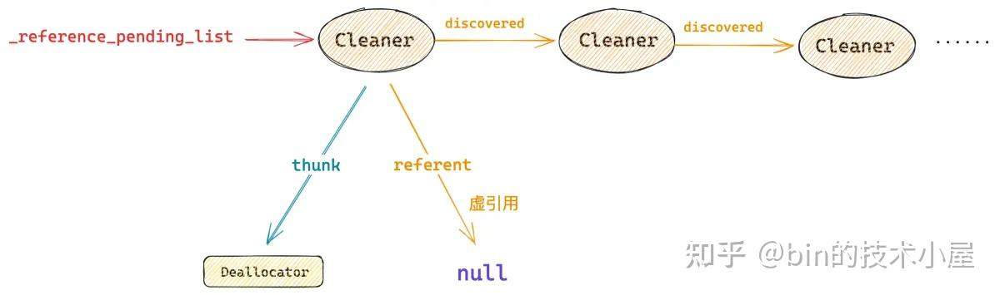

image.png

也就是说，当 GC 结束之后，\_reference_pending_list 链表中保存的这些 Cleaner 对象，它们虚引用的 DirectByteBuffer 就已经被回收掉了，此时我们就需要从这个 \_reference_pending_list 中把这些 Cleaner 对象一个一个的拿下来，然后调用它的 clean 方法，在 Deallocator 中将这些已经被回收掉的 DirectByteBuffer 背后引用的 native memory 释放掉就可以了。

这个正是 ReferenceHandler 线程所要干的事情，在它的 run 方法中会不停的调用 processPendingReferences，从 JVM 的 \_reference_pending_list 中不断地将 Cleaner 对象摘下来，调用它的 clean 方法释放 native memory。

> 当然了 \_reference_pending_list 链表中保存的不仅仅是 Cleaner 这个 PhantomReference，还有 WeakReference，SoftReference 对象，但它们共同的特点是这些 Reference 对象所引用的 Java 对象都已经被回收了。

```
private static class ReferenceHandler extends Thread {
        public void run() {
            while (true) {
                processPendingReferences();
            }
        }
    }
```

但是这个 \_reference_pending_list 它是 JVM 内部维护的一个链表，它只能在 JVM 内被 GC 线程操作，我们在外部是无法访问到的。

从 Reference 类中我们就可以看到，Reference 类的内部并没有一个叫做 pending_list 的字段去指向 JVM 内部的 \_reference_pending_list，在 JDK 中，所有针对 \_reference_pending_list 的访问都是通过 native 方法进行的。

```
public abstract class Reference<T> {
  /*
     * Atomically get and clear (set to null) the VM's pending-Reference list.
     */
    private static native Reference<?> getAndClearReferencePendingList();

    /*
     * Test whether the VM's pending-Reference list contains any entries.
     */
    private static native boolean hasReferencePendingList();

    /*
     * Wait until the VM's pending-Reference list may be non-null.
     */
    private static native void waitForReferencePendingList();
}
```

当 \_reference_pending_list 中没有 Reference 对象要处理的时候，ReferenceHandler 线程会通过 native 方法 —— waitForReferencePendingList ，在 \_reference_pending_list 上阻塞等待。

```
// Reference.c 文件
JNIEXPORT void JNICALL
Java_java_lang_ref_Reference_waitForReferencePendingList(JNIEnv *env, jclass ignore)
{
    JVM_WaitForReferencePendingList(env);
}

// jvm.cpp 文件
JVM_ENTRY(void, JVM_WaitForReferencePendingList(JNIEnv* env))
  MonitorLocker ml(Heap_lock);
  while (!Universe::has_reference_pending_list()) {
    // 如果 _reference_pending_list 还没有 Reference 对象，那么当前线程在 Heap_lock 上 wait
    ml.wait();
  }
JVM_END

// universe.cpp 文件
bool Universe::has_reference_pending_list() {
  assert_pll_ownership();
  // 检查 _reference_pending_list 是否为空
  return _reference_pending_list.peek() != NULL;
}
```

随后 GC 线程在标记阶段结束之后，会将那些需要被处理的 Reference 对象放到 \_reference_pending_list 中，然后唤醒 ReferenceHandler 线程去处理。

当 ReferenceHandler 线程被 JVM 唤醒之后，就会调用 native 方法 —— `getAndClearReferencePendingList` ，从 JVM 中获取 \_reference_pending_list，并保存到一个类型为 Reference 的 [局部变量](https://zhida.zhihu.com/search?content_id=244373259&content_type=Article&match_order=1&q=%E5%B1%80%E9%83%A8%E5%8F%98%E9%87%8F&zhida_source=entity) pendingList 中，最后将 JVM 中的 \_reference_pending_list 置为 null，方便 JVM 等到下一轮 GC 的时候处理其他 Reference 对象。

```
// Reference.c 文件
JNIEXPORT jobject JNICALL
Java_java_lang_ref_Reference_getAndClearReferencePendingList(JNIEnv *env, jclass ignore)
{
    return JVM_GetAndClearReferencePendingList(env);
}

// jvm.cpp 文件
JVM_ENTRY(jobject, JVM_GetAndClearReferencePendingList(JNIEnv* env))
  MonitorLocker ml(Heap_lock);
  // 从 JVM 中获取 _reference_pending_list
  oop ref = Universe::reference_pending_list();
  if (ref != NULL) {
    // 将 JVM 中的 _reference_pending_list 置为 null
    // 方便下一轮 GC 处理其他 reference 对象
    Universe::clear_reference_pending_list();
  }
  // 将 _reference_pending_list 返回给 ReferenceHandler 线程
  return JNIHandles::make_local(THREAD, ref);
JVM_END

// universe.cpp 文件
oop Universe::reference_pending_list() {
  if (Thread::current()->is_VM_thread()) {
    assert_pll_locked(is_locked);
  } else {
    assert_pll_ownership();
  }
  // 返回 _reference_pending_list
  return _reference_pending_list.resolve();
}

void Universe::clear_reference_pending_list() {
  assert_pll_ownership();
  // 将 _reference_pending_list 设置为 null
  _reference_pending_list.replace(NULL);
}
```

当我们熟悉了 ReferenceHandler 线程如何与 JVM 中的 \_reference_pending_list 交互之后，再回过头来看 `processPendingReferences()` 方法就很清晰了，这里正是 ReferenceHandler 线程的核心所在。


image.png

```
private static final Object processPendingLock = new Object();
    private static boolean processPendingActive = false;

    private static void processPendingReferences() {
        // ReferenceHandler 线程等待 JVM 向 _reference_pending_list 填充 Reference 对象
        // GC 之后，如果有 Reference 对象需要处理，JVM 则将 ReferenceHandler 线程 唤醒
        waitForReferencePendingList();
        // 用于指向 JVM 的 _reference_pending_list
        Reference<?> pendingList;
        synchronized (processPendingLock) {
            // 获取 _reference_pending_list，随后将 _reference_pending_list 置为 null
            // 方便 JVM 在下一轮 GC 处理其他 Reference 对象
            pendingList = getAndClearReferencePendingList();
            // true 表示 ReferenceHandler 线程正在处理 pendingList
            processPendingActive = true;
        }
        // 将 pendingList 中的 Reference 对象挨个从链表中摘下处理
        while (pendingList != null) {
            // 从 pendingList 中摘下 Reference 对象
            Reference<?> ref = pendingList;
            pendingList = ref.discovered;
            ref.discovered = null;

            // 如果该 Reference 对象是 Cleaner 类型，那么在这里就会调用它的 clean 方法
            if (ref instanceof Cleaner) {
                 // Cleaner 的 clean 方法就是在这里调用的
                ((Cleaner)ref).clean();

                synchronized (processPendingLock) {
                    // 将等待在 processPendingLock 上的其他 Java 业务线程唤醒
                    processPendingLock.notifyAll();
                }
            } else {
                // 这里处理除 Cleaner 之外的其他 Reference 对象
                // 比如，其他 PhantomReference，WeakReference，SoftReference，FinalReference
                // 将他们添加到对应的 ReferenceQueue 中
                ref.enqueueFromPending();
            }
        }
        // 本次 GC 收集到的 Reference 对象到这里就全部处理完了
        synchronized (processPendingLock) {
            // false 表示 ReferenceHandler 线程已经处理完毕 pendingList
            processPendingActive = false;
            // 唤醒其他等待在 processPendingLock 上 Java 线程。
            processPendingLock.notifyAll();
        }
    }
```

这里我们先聊一聊 processPendingLock 和 processPendingActive 的作用，它俩的目的是为了维护 ReferenceHandler 线程和 Java 业务线程对于 Reference 处理进度视图的一致性。

什么意思呢 ？我们还是拿 Cleaner 来说，对于 Cleaner 而言，ReferenceHandler 线程扮演的其实是一个资源回收的角色，Java 业务线程扮演的其实是一个资源申请的角色。

当 Java 线程申请资源的时候，如果资源不够了怎么办呢 ？首先应该想到的是先去看看当前系统中有没有正在被回收的资源，对吧。

- 如果 processPendingActive 为 true，表示 ReferenceHandler 线程正在处理 Cleaner 释放资源
- 如果 JVM 中的 \_reference_pending_list 不为空，说明当前系统中有正在等待回收的资源。

如果以上两个条件成立的话，那么 Java 线程就在 processPendingLock 上等一等，等待 ReferenceHandler 线程把该回收的资源回收完。当本次 GC 所收集到的所有 Cleaner 都已经被 ReferenceHandler 线程处理完之后，ReferenceHandler 线程就会 notify 在 processPendingLock 上等待的 Java 线程，随后 Java 线程再去尝试申请资源。

如果当前系统中并没有正在被回收的资源，比如下面两个条件：

- processPendingActive 为 false，表示 ReferenceHandler 线程已经将本次 GC 收集到的 Cleaner 全部处理完了。
- 如果 JVM 中的 \_reference_pending_list 为空，说明当前系统中没有可回收的资源。

这种情况下 Java 线程就不需要在 processPendingLock 上等待了，要么就直接触发 OOM，要么就调用 System.gc 尝试让 GC 在去收集一些需要被处理的 Cleaner。

明白了这些，我们接着来看 ReferenceHandler 线程处理 Reference 的主线流程。

首先 ReferenceHandler 线程会将 pendingList 中的 Reference 依次从链表上摘下，随后会判断一下这个 Reference 对象的具体类型，如果是 Cleaner 类型的话，ReferenceHandler 线程就会在这里调用它的 clean 方法。

```
public void clean() {
        if (!remove(this))
            return;
        try {
            // 进行资源清理
            thunk.run();
        } catch (final Throwable x) {
           .... 省略 ....
        }
    }
```

在 clean 方法中，会执行 thunk 的 run 方法，在创建 DiretByteBuffer 的时候会将 thunk 指向一个 Deallocator 实例。

```
private static class Deallocator implements Runnable
   {
        public void run() {
            // 底层调用 free 来释放 native memory
            UNSAFE.freeMemory(address);
        }
    }
```

当执行完 clean 方法之后，其实 Cleaner 的历史使命就完成了，但别忘了，Cleaner 内部有一个全局的双向链表，里边强引用着所有的 Cleaner 对象。

```
public class Cleaner extends PhantomReference<Object>
{
    private static Cleaner first = null;

    private Cleaner next = null, prev = null;
}
```


image.png

所以为了让 Cleaner 可以在下一轮 GC 中被回收掉，需要调用 remove 方法将这个 Cleaner 对象从双向链表中摘下，断开这个唯一的强引用。等到下次 GC 的时候，这个 Cleaner 对象就可以被回收了。

好了，现在关于 Cleaner 处理的完整生命周期，笔者就为大家介绍完了，但在 pendingList 中除了 Cleaner 之外还有其他类型的 Reference 对象，比如，其他 PhantomReference，WeakReference，SoftReference，FinalReference。

当 ReferenceHandler 线程发现 pendingList 中的 Reference 对象不是 Cleaner，那么就会调用 `enqueueFromPending` 方法，将这个 Reference 对象添加到与其对应的 ReferenceQueue 中。

```
public abstract class Reference<T> {

   volatile ReferenceQueue<? super T> queue;

   private void enqueueFromPending() {
        var q = queue;
        if (q != ReferenceQueue.NULL) q.enqueue(this);
    }
}
```

从这里我们可以看到，JVM 中的 \_reference_pending_list 链表中收集到的 Reference 对象最终是会被 ReferenceHandler 线程转移到这个 ReferenceQueue 中的。位于 ReferenceQueue 中的 Reference 对象会通过它的 `next` 字段串联起来。

```
public abstract class Reference<T> {
    volatile Reference next;
}
```

而这个 ReferenceQueue 我们是可以在 Java 业务线程中直接访问的，它是一个全局的队列。当被 Reference 对象引用的普通 Java 对象被回收之后， **如果我们想要在 Java 业务线程中处理这个 Reference 对象，那么就必须在创建 Reference 对象的时候，传入一个全局的 ReferenceQueue** 。

```
Reference(T referent, ReferenceQueue<? super T> queue) {
        // 被引用的普通 Java 对象
        this.referent = referent;
        // 全局 ReferenceQueue 实例
        this.queue = (queue == null) ? ReferenceQueue.NULL : queue;
    }
```

当 referent 对象被回收之后，那么与它关联的 Reference 对象随后就会被 ReferenceHandler 线程转移到这个 ReferenceQueue 中。JDK 提供了两种方式让我们能够在 Java 业务线程中从 ReferenceQueue 获取 Reference 对象。

一个是 `poll() ` 函数，它是一种非阻塞的方式，当 ReferenceQueue 中没有任何 Reference 对象的时候，调用 `poll() ` 就会返回 null 。

```
public Reference<? extends T> poll()
```

另一个是 `remove(long timeout)` 函数，它是一种阻塞的方式，当 ReferenceQueue 中没有任何 Reference 对象的时候，调用 `remove ` 的时候 Java 业务线程就会一直阻塞，直到 ReferenceQueue 中有 Reference 对象被添加进来。我们也可以传入 ` timeout (单位为：ms)` 来设置阻塞的超时时间。

```
public Reference<? extends T> remove(long timeout)
        throws IllegalArgumentException, InterruptedException
```

下面是 ReferenceQueue 的简单使用示例：

```
public static void main(String[] args) throws Exception{

        ReferenceQueue<Object> referenceQueue = new ReferenceQueue<>();

        Object phantomObject = new Object();
        Reference phantomReference = new  PhantomReference(phantomObject,referenceQueue);

        Object weakObject = new Object();
        Reference weakReference = new WeakReference(weakObject, referenceQueue);

        Object softObject = new Object();
        Reference softReference = new SoftReference(softObject, referenceQueue);

        phantomObject = null;
        weakObject = null;
        // 当内存不足的时候，softObject 才会被回收
        softObject = null;

        System.gc();

        Reference getReferenceByPoll = referenceQueue.poll();

        long timeout = 1000;
        Reference getReferenceByRemove = referenceQueue.remove(timeout);
    }
```

当 phantomReference 虚引用的 phantomObject 以及 weakReference 弱引用的 weakObject，softReference 软引用的 softObject 被 GC 回收掉的时候，ReferenceHandler 线程就会将这里的 phantomReference，weakReference，softReference 转移到 referenceQueue 中。

我们在 Java 业务线程通过调用 referenceQueue 的 `poll()` 方法或者 `remove(timeout)` 方法就可以将这些 reference 对象拿出来进行相关处理。

下面笔者继续以 WeakHashMap 为例，来说明一下 ReferenceQueue 的使用场景，首先 WeakHashMap 的内部包含了一个 ReferenceQueue 的实例 —— queue，WeakHashMap 的底层 [数据结构](https://zhida.zhihu.com/search?content_id=244373259&content_type=Article&match_order=1&q=%E6%95%B0%E6%8D%AE%E7%BB%93%E6%9E%84&zhida_source=entity) 是一个哈希表 —— table，table 中的元素类型为 Entry 结构。

```
public class WeakHashMap<K,V> extends AbstractMap<K,V>  implements Map<K,V> {
    Entry<K,V>[] table;
    private final ReferenceQueue<Object> queue = new ReferenceQueue<>();
}
```

Entry 是一个 WeakReference，弱引用了 key，强引用了 value，在构造 Entry 实例的时候需要传入一个 ReferenceQueue，当 key 被 GC 回收的时候，这个 Entry 实例就会被 ReferenceHandler 线程从 JVM 中的 \_reference_pending_list 转移到这里的 ReferenceQueue 中。

```
private static class Entry<K,V> extends WeakReference<Object> implements Map.Entry<K,V> {
        V value;
        final int hash;
        Entry<K,V> next;

        /**
         * Creates new entry.
         */
        Entry(Object key, V value,
              ReferenceQueue<Object> queue,
              int hash, Entry<K,V> next) {
            super(key, queue);
            this.value = value;
            this.hash  = hash;
            this.next  = next;
        }
}
```

从 WeakHashMap 的 put 方法实现中我们可以看到，构建 Entry 实例的时候传入的这个 ReferenceQueue 正是 WeakHashMap 内部的 queue 实例。

```
public V put(K key, V value) {
        Object k = maskNull(key);
        int h = hash(k);
        Entry<K,V>[] tab = getTable();
        int i = indexFor(h, tab.length);

        ...... 省略 ......

        Entry<K,V> e = tab[i];
        // 创建 Entry 的时候会传入 ReferenceQueue
        tab[i] = new Entry<>(k, value, queue, h, e);

        return null;
    }
```

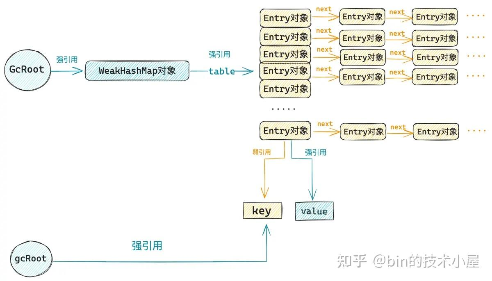

image.png

当 Entry 对象中的 key 在 WeakHashMap 之外存在强引用的时候，那么 key 是不会被 GC 回收的。当这个强引用被断开之后，发生 GC 的时候，这个 key 就会被 GC 回收掉，以此同时，与 key 关联的这个 Entry 对象（WeakReference）就会被 JVM 放入 \_reference_pending_list 中。

随后 ReferenceHandler 线程会将 Entry 对象从 \_reference_pending_list 中转移到 WeakHashMap 内部的这个 ReferenceQueue 中。

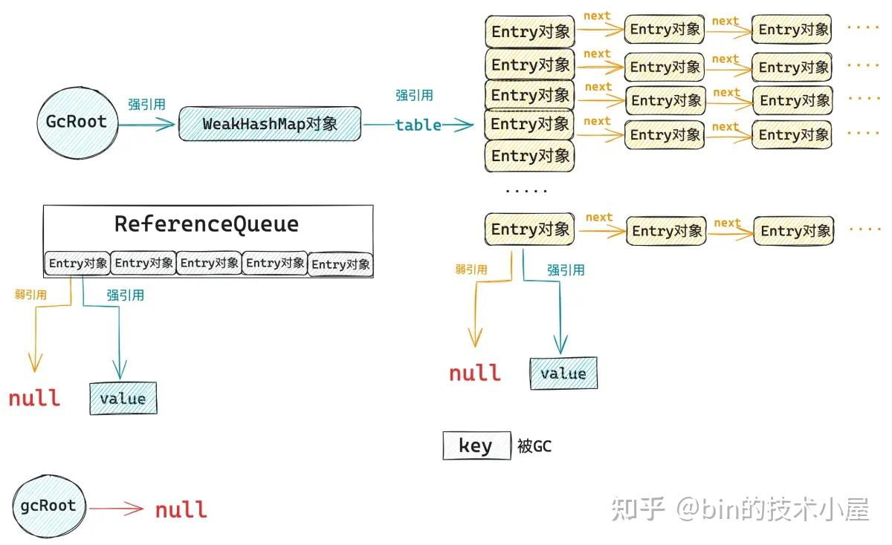

image.png

从这里我们也可以看到，ReferenceQueue 中保存的正是 WeakHashMap 所有已经被 GC 回收的 key 对应的 Entry 对象。key 都已经被回收了，那么这个 Entry 对象以及其中的 value 也没什么用了。

调用 WeakHashMap 的任意方法都会触发对 ReferenceQueue 的检测，遍历 ReferenceQueue，将队列中所有的 Entry 对象以及其中的 value 清除掉，当下一次 GC 的时候，这些 Entry 对象以及 value 就可以被回收了，防止内存泄露的发生。

```
private void expungeStaleEntries() {
        for (Object x; (x = queue.poll()) != null; ) {
            synchronized (queue) {

             ... 将 ReferenceQueue 中的 Entry 全部从 WeakHashMap 中删除 ...

            }
        }
    }
```

到现在，我们已经清楚了 Reference 对象的整个生命周期，并且也明白了 ReferenceHandler 线程的核心逻辑，最后我们在回过头来看一下在创建 DirectByteBuffer 的时候， `Bits.reserveMemory` 函数到底做了哪些事情 ？

### 3.3 Bits.reserveMemory

当我们使用 `ByteBuffer#allocateDirect` 来向 JVM 申请 direct memory 的时候，direct memory 的容量是受到 `-XX:MaxDirectMemorySize` 参数限制的，在 ZGC 中 `-XX:MaxDirectMemorySize` 默认为堆的最大容量（ `-Xmx` ）。

```
class DirectByteBuffer extends MappedByteBuffer implements DirectBuffer
{
    private final Cleaner cleaner;

    DirectByteBuffer(int cap) {                   // package-private

        ...... 省略 .....
        // 检查堆外内存整体用量是否超过了 -XX:MaxDirectMemorySize
        // 如果超过则尝试等待一下 JVM 回收堆外内存，回收之后还不够的话则抛出 OutOfMemoryError
        Bits.reserveMemory(size, cap);
        // 底层调用 malloc 申请虚拟内存
        base = UNSAFE.allocateMemory(size);

        ...... 省略 .....

        cleaner = Cleaner.create(this, new Deallocator(base, size, cap));
    }
}
```

所以在创建 DirectByteBuffer 之前，需要通过 `Bits.reserveMemory` 来检查一下当前 direct memory 的使用量是否已经超过了 `-XX:MaxDirectMemorySize` 的限制，如果超过了就需要进行一些补救的措施，尝试去回收一部分 direct memory 用以满足本次申请的容量需求。

检查当前 direct memory 使用量是否超过限制的逻辑在 `tryReserveMemory` 函数中完成：

```
// -XX:MaxDirectMemorySize 最大允许使用的 direct memory 容量
    private static volatile long MAX_MEMORY = VM.maxDirectMemory();
    // 向 OS 实际申请的内存，考虑到内存对齐的情况，实际向 OS 申请的内存会比指定的 cap 要多
    private static final AtomicLong RESERVED_MEMORY = new AtomicLong();
    // 已经使用的 direct memory 总量
    private static final AtomicLong TOTAL_CAPACITY = new AtomicLong();

    private static boolean tryReserveMemory(long size, long cap) {

        long totalCap;
        while (cap <= MAX_MEMORY - (totalCap = TOTAL_CAPACITY.get())) {
            if (TOTAL_CAPACITY.compareAndSet(totalCap, totalCap + cap)) {
                RESERVED_MEMORY.addAndGet(size);
                COUNT.incrementAndGet();
                return true;
            }
        }
        // 已经超过了最大 direct memory 容量的限制则返回 false
        return false;
    }
```

如果 tryReserveMemory 返回 `false` 表示当前系统中 direct memory 的使用量已经超过了 `-XX:MaxDirectMemorySize` 的限制，随后就会调用 `waitForReferenceProcessing` 检查一下当前系统中是否还有待处理的 Reference 对象（Cleaner）没有处理。

如果有的话，就让当前 Java 业务线程在 `processPendingLock` 上等待一下，目的是等待 ReferenceHandler 线程去调用 Cleaner 释放 direct memory。等到 ReferenceHandler 线程处理完这些 Cleaner 就会将当前业务线程从 `processPendingLock` 上唤醒。

随后 waitForReferenceProcessing 方法返回 `true` ，表示 \_reference_pending_list 中的的这些 Cleaner 已经被 ReferenceHandler 线程处理完了，又释放了一些 direct memory。

如果当前系统中没有待处理的 Cleaner, 那么就返回 false ，说明系统中已经没有任何可回收的 direct memory 了。

```
public abstract class Reference<T> {

    private static boolean waitForReferenceProcessing()
        throws InterruptedException
    {
        synchronized (processPendingLock) {
            // processPendingActive = true 表示 ReferenceHandler 线程正在处理 PendingList 中的 Cleaner，那么就等待 ReferenceHandler 处理完
            // hasReferencePendingList 检查 JVM 中的 _reference_pending_list 是否包含待处理的 Reference 对象
            // 如果还有待处理的 Reference，那么也等待一下
            if (processPendingActive || hasReferencePendingList()) {
                // 等待 ReferenceHandler 线程处理 Cleaner 释放 direct memory
                processPendingLock.wait();
                return true;
            } else {
                // 当前系统中没有待处理的 Reference，直接返回 false
                return false;
            }
        }
    }
}
```

当 Java 业务线程从 waitForReferenceProcessing 上唤醒之后，如果 ReferenceHandler 线程已经回收了一些 direct memory（返回 true），那么就尝试再次调用 `tryReserveMemory ` 检查一下当前系统中剩余的 direct memory 容量是否满足本次申请的需要。

如果还是不满足，那么就循环调用 waitForReferenceProcessing 持续查看当前系统是否有可回收的 direct memory，如果确实没有任何 direct memory 可以被回收了（返回 false）那么就退出循环。

退出循环之后，那么就说明当前系统中已经没有可回收的 direct memory 了，这种情况下 JDK 就会调用 `System.gc()` 来立即触发一次 `Full GC` ，尝试让 JVM 在去回收一些没有任何强引用的 directByteBuffer。

如果当前系统中确实存在一些没有任何强引用的 directByteBuffer，那么本轮 GC 就可以把它们回收掉，于此同时，与这些 directByteBuffer 关联的 Cleaner 也会被 JVM 放入 \_reference_pending_list 中。

那么 JDK 就会再次调用 waitForReferenceProcessing 去等待 ReferenceHandler 线程处理这些 Cleaner 释放 direct memory。等到 ReferenceHandler 线程处理完之后，再去调用 `tryReserveMemory ` 查看当前 direct memory 的容量是否满足本次申请的需要。

如果还是不满足，但本次 GC 回收的 Cleaner 已经全部被执行完了，系统中已经没有可回收的 direct memory 了，那该怎么办呢 ？

此时 JDK 再去调用 waitForReferenceProcessing 就会返回 false，最后的一个补救措施就是让当前 Java 业务线程在一个 `while (true)` 循环中睡眠 —— `Thread.sleep(sleepTime)`, 最多睡眠 9 次，每次睡眠时间按照 `1, 2, 4, 8, 16, 32, 64, 128, 256 ms` 依次递增，目的是等待其他线程触发 GC，尝试看看后面几次的 GC 是否能回收到一些 direct memory。

> 这里不让当前线程继续触发 System.gc 的目的是，我们刚刚已经触发一轮 GC 了，仍然没有回收到足够的 direct memory，那如果再次立即触发 GC,收效依然不会很大，所以这里选择等待其他线程去触发。

如果在睡眠了 9 次之后，也就是尝试等待 `511 ms` 之后，依然没有足够的 direct memory ，那么就抛出 OOM 异常。

JDK 这里选择连续睡眠的应对场景还有另外一种，如果 `System.gc()` 触发的是一次 `Concurrent Full GC` ，那么 Java 业务线程是可以与 GC 线程一起并发执行的。

此时 JDK 去调用 waitForReferenceProcessing 有很大可能会返回 false，因为 GC 线程可能还没有遍历标记到 Cleaner 对象，自然 JVM 中的 \_reference_pending_list 啥也没有。

连续睡眠应对的就是这种并发执行的情况，每次睡眠时间由短逐渐变长，尽可能及时的感知到 \_reference_pending_list 中的变化。

以上就是 Bits.reserveMemory 函数的核心逻辑，明白这些之后，在看源码的实现就很清晰了。

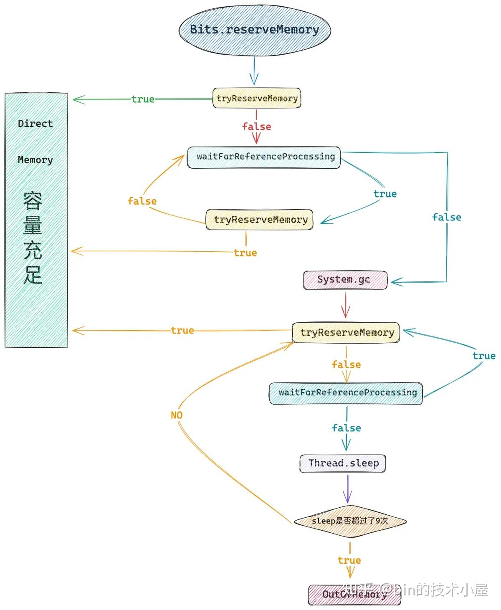

image.png

```
static void reserveMemory(long size, long cap) {
         // 首先检查一下 direct memory 的使用量是否已经超过了 -XX:MaxDirectMemorySize 的限制
        if (tryReserveMemory(size, cap)) {
            return;
        }

        final JavaLangRefAccess jlra = SharedSecrets.getJavaLangRefAccess();
        boolean interrupted = false;
        try {
            boolean refprocActive;
            do {
                try {
                    // refprocActive = true 表示 ReferenceHandler 线程又释放了一些 direct memory
                    // refprocActive = false 表示当前系统中没有待处理的 Cleaner，系统中已经没有任何可回收的 direct memory 了
                    refprocActive = jlra.waitForReferenceProcessing();
                } catch (InterruptedException e) {
                    // Defer interrupts and keep trying.
                    interrupted = true;
                    refprocActive = true;
                }
                // 再次检查 direct memory 的容量是否能够满足本次分配请求
                if (tryReserveMemory(size, cap)) {
                    return;
                }
            } while (refprocActive);

            // 此时系统中已经没有任何可回收的 direct memory 了
            // 只能触发 gc，尝试让 JVM 再去回收一些没有任何强引用的 directByteBuffer
            System.gc();

            // 下面开始睡眠等待 ReferenceHandler 线程调用 Cleaner 释放 direct memory
            // 初始睡眠时间, 单位 ms
            long sleepTime = 1;
            // 睡眠次数，最多睡眠 9 次
            int sleeps = 0;
            while (true) {
                if (tryReserveMemory(size, cap)) {
                    return;
                }
                // MAX_SLEEPS = 9
                if (sleeps >= MAX_SLEEPS) {
                    break;
                }
                try {
                    // 等待 ReferenceHandler 线程处理 Cleaner 释放 direct memory （返回 true）
                    // 当前系统中没有任何可回收的 direct memory，则 Thread.sleep 睡眠 (返回 false)
                    if (!jlra.waitForReferenceProcessing()) {
                        // 睡眠等待其他线程触发 gc，尝试看看后面几轮 gc 是否能够回收到一点 direct memory
                        // 最多睡眠 9 次，每次睡眠时间按照 1, 2, 4, 8, 16, 32, 64, 128, 256 ms 依次递增
                        Thread.sleep(sleepTime);
                        sleepTime <<= 1;
                        sleeps++;
                    }
                } catch (InterruptedException e) {
                    interrupted = true;
                }
            }

            // 在尝试回收 direct memory 511 ms 后触发 OOM
            throw new OutOfMemoryError
                ("Cannot reserve "
                 + size + " bytes of direct buffer memory (allocated: "
                 + RESERVED_MEMORY.get() + ", limit: " + MAX_MEMORY +")");

        } finally {
        }
    }
```

从上面 Bits.reserveMemory 的源码实现中我们可以体会到，监控当前 JVM 进程 direct memory 的使用量是非常重要的，如果 direct memory 的使用量达到了 `-XX:MaxDirectMemorySize` 的限制，那么此时我们再去通过 `ByteBuffer#allocateDirect ` 来向 JVM 申请 direct memory 的话，就会引起很大的阻塞延迟。

首先当前线程会阻塞在 processPendingLock 上去等待 ReferenceHandler 线程去处理 Cleaner 释放 direct memory。

如果当前系统中没有可回收的 direct memory，当前线程又会触发一次 Full GC，如果 Full GC 之后也没有回收足够的 direct memory 的话，当前线程还会去睡眠等待其他线程触发 GC，极端的情况下需要睡眠 9 次，也就是说在 `511 ms` 之后才会去触发 OOM。所以监控系统中 direct memory 的用量是非常非常重要的。

## 4\. JVM 如何实现 Reference 语义

在前面的几个小节中，笔者为大家全面且详细地介绍了 Reference 在各中间件以及 JDK 中的应用场景，相信大家现在对于在什么情况下该使用哪种具体的 Reference， JDK 又如何处理这些 Reference 的流程已经非常清晰了。

但这还远远不够，因为我们一直还没触达到 Reference 的本质，而在经过前面三个小节的内容铺垫之后，笔者将会在本小节中，带着大家深入到 JVM 内部，去看看 JVM 到底是如何实现 PhantomReference，WeakReference，SoftReference 以及 FinalReference 相关语义的。

在这个过程中，笔者会把之前在概念层面介绍的各种 Reference 语义，一一映射到源码级别的实现上，让大家从抽象层面再到具象层面彻底理解 Reference 的本质。大家对各种 Reference 的模糊理解，在后面的内容中都会得到清晰的解答。

> 哈哈，铺垫了这么久，终于和标题开始挂上钩了

但在本小节的内容开始之前，笔者想和大家明确两个概念，因为后面笔者不想在用大段的语言重复解释他们。JDK 对于引用类的设计层级有两层，PhantomReference，WeakReference，SoftReference 以及 FinalReference 都继承于 Reference 类中。


image.png

后续笔者将会用 Reference 这个概念来统称以上四种引用类型，除非遇到不同 Reference 的语义实现时，笔者才会特殊指明具体的 Reference 类型。而 Reference 所引用的普通 Java 对象，存放在 referent 字段中，后面我们将会用 referent 来统一指代被引用的 Java 对象。

```
public abstract class Reference<T> {
  private T referent;
}
```

好了，在我们明确了 Reference 和 referent 的概念之后，笔者先向大家抛一个问题出来，大家可以先自己思考下。我们都知道，只要一个 Java 对象存在从 GcRoot 到它的强引用链，那么这个 Java 对象就会被 JVM 标记为 alive，本轮 GC 就不会回收它。

这个强引用链是什么呢 ？其实就是 GC 根对象的所有非静态 [成员变量](https://zhida.zhihu.com/search?content_id=244373259&content_type=Article&match_order=1&q=%E6%88%90%E5%91%98%E5%8F%98%E9%87%8F&zhida_source=entity) ，而这些非静态的成员变量也会引用到其他 Java 对象，这些 Java 对象也会有自己的非静态成员变量，这些成员变量又会引用到其他 Java 对象，这就慢慢形成了从 GC 根对象出发的有向引用关系图，这个引用关系图就是强引用链。

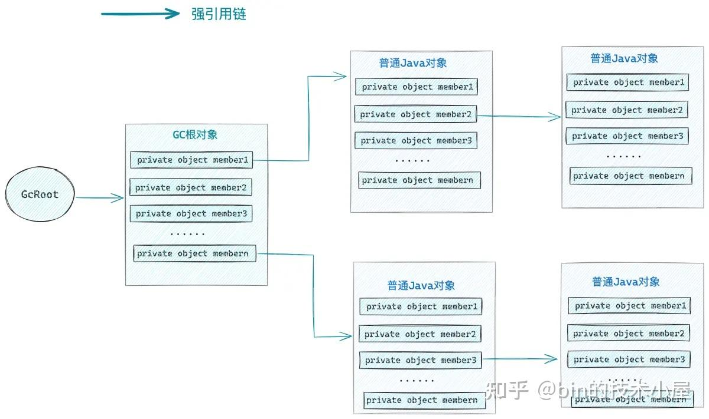

image.png

如果按照这种思路的话，那么从本质上来说 Reference 类也是一个普通的 Java 类，它的实例也是一个普通的对象实例，referent 也是它的一个成员变量，按理说，JVM 也可以从 GcRoot 开始遍历到 Reference 对象，近而通过它的成员变量 referent 遍历到被它引用的普通 Java 对象。

这里我们先不用考虑什么软引用，弱引用，虚引用的概念，我们只从本质上来说，JVM 是不是也可以通过这条引用链将 referent 标记为 alive 呢 ？那为什么在 GC 的时候，这个 referent 就被当做垃圾回收了呢 ？

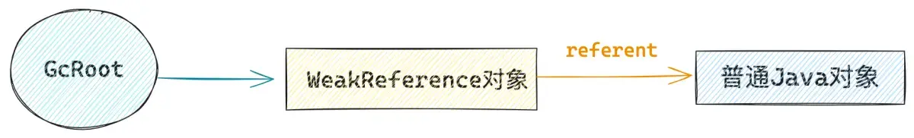

image.png

> 这里笔者先以 WeakReference 为例说明，事实上 JVM 对于 PhantomReference，WeakReference，SoftReference 以及 FinalReference 的处理总体上都是一样的，只不过对于 PhantomReference，SoftReference，FinalReference 会进行一些小小的特殊处理，这个笔者后面会放到单独的小节中讨论。我们先以 WeakReference 来说明 JVM 对于 Reference 的总体处理流程。

要明白这个问题，我们就需要弄明白 JVM 在 GC 的时候是如何遍历对象的引用关系图的，在处理普通 Java 对象的引用关系时和处理 Reference 对象的引用关系时有何不同 ？

### 4.1 JVM 如何遍历对象的引用关系图

这里笔者要再次提醒大家，现在请你立刻，马上忘掉脑海中关于软引用，弱引用，虚引用的所有概念，让我们回归 Reference 类的本质，它其实就是一个普通的 Java 类，Reference 相关的实例就是一个普通的 Java 对象。


image.png

看透了这一层，剩下的就好办了，现在这些所有的问题最终汇结成了 —— JVM 如何遍历普通 Java 对象的引用关系图。我们先从一个简单的例子开始~~

JVM 从 GcRoot 开始遍历，期间遇到的每一个对象，在 JVM 看来就是活跃的，当 GC 线程遍历到一个对象时，就会将这个对象标记为 alive，然后在看这个对象的非静态成员变量引用了哪些对象，顺藤摸瓜，沿着这些成员变量所引用的对象继续标记 alive，直到所有的引用关系图被遍历完。

现在问题的关键就是 JVM 如何找到对象中的这些成员变量，而对象的本质其实就是一段内存，当我们通过 `new` 关键字分配对象的时候，JVM 首先会为这个对象分配一段内存，然后根据 Java 的对象模型初始化这段内存。下图中展示的就是 Java 对象的内存模型，其中存放了对象的 MarkWord ， 类型信息，以及实例数据（下图中的蓝色区域）。

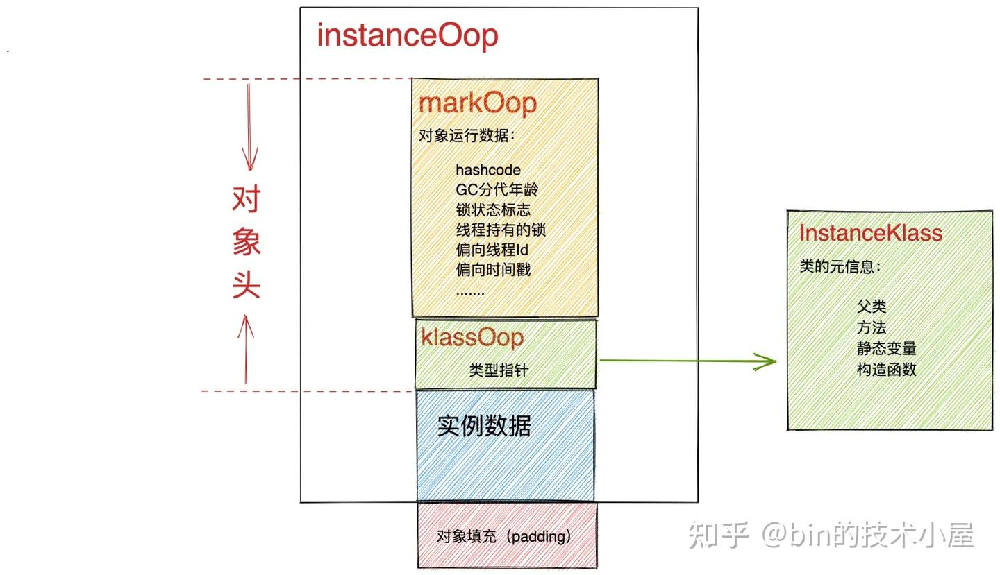

Java对象的内存布局.png

对象内存模型中的实例数据区中包含了对象中的基本类型字段还有引用类型字段，当 JVM 遍历到一个对象实例时，这个实例所占用的内存地址是不是就知道了，知道了对象所占内存的地址，那么实例数据区的地址也就知道了。

JVM 近而可以遍历这段实例数据内存区域，如果发现是基本类型的字段就跳过，如果是引用类型的字段，那么这就是我们要找的成员变量，该成员变量引用的对象地址是不是就知道了，最后根据引用类型的成员变量指向的对象地址，找到被引用的对象，然后标记为 alive，最后再次从这个对象出发，循环上述逻辑，慢慢的就找到了所有存活的对象。

当然了这只是一种可行的方案，实际上 JVM 并不会这么做，因为这样效率太低了，系统中有成千上万的对象实例，JVM 不可能每遍历一个对象，就到对象内存中的实例数据区去挨个寻找引用类型的成员变量。

那么有没有一种索引结构来提前记录对象中究竟有哪些引用类型的成员变量，并且这些成员变量在对象内存中的位置偏移呢 ？这个索引结构就是 JVM 中的 OopMapBlock 。

```
// Describes where oops are located in instances of this klass.
class OopMapBlock {
 public:
  // Byte offset of the first oop mapped by this block.
  int offset() const          { return _offset; }
  void set_offset(int offset) { _offset = offset; }

  // Number of oops in this block.
  uint count() const         { return _count; }
  void set_count(uint count) { _count = count; }

 private:
  int  _offset;
  uint _count;
};
```

OopMapBlock 结构用于描述对象中定义的那些引用类型的非静态成员变量在对象内存中的偏移位置，每个 OopMapBlock 中包含多个非静态成员变量的地址偏移索引，而且这些非静态成员变量的地址必须是连续的。

什么意思呢 ？ 比如我们在写代码的时候，在一个类中连续的定义了多个非静态成员变量（引用类型），那么这些成员变量的地址偏移就被封装到了一个 OopMapBlock 中。

但如果我们在类中定义成员变量的时候，中间插入了一个基本类型的成员变量，这么原本连续的引用类型的成员变量就不连续了，被分割成了两段。JVM 就会用两个 OopMapBlock 来索引他们的地址偏移。

除了由于被基本类型的成员变量分割而导致产生多个 OopMapBlock 之外，在对象类型的父类中也可能会定义非静态成员变量，父类中也会有多个 OopMapBlock。

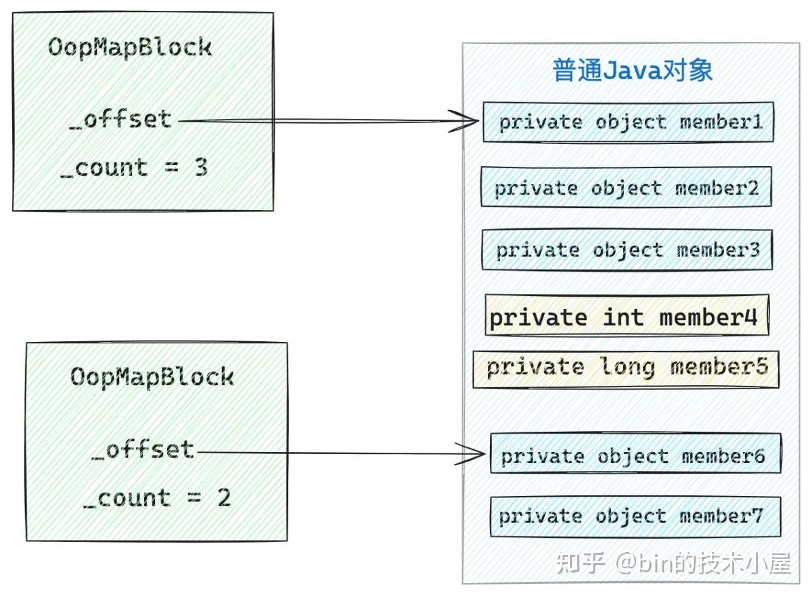

image.png

OopMapBlock 结构中的 `_offset` 用来指定第一个非静态引用类型的成员变量在对象内存地址中的偏移。 `_count` 表示 OopMapBlock 中地址连续的非静态成员变量个数。

另外还有字段与字段之间的字节填充，由于字节填充造成字段之间的地址不连续，也会产生多个 OopMapBlock。但是每个 OopMapBlock 中封装的非静态成员变量地址一定是连续的。

这样一来，一个 Java 类型在 JVM 中就会拥有多个 OopMapBlock，这些 OopMapBlock 被组织在一个叫做 `nonstatic_oop_maps` 的数组中，当 JVM 遍历到一个对象实例时，如果能找到这个 nonstatic_oop_maps，近而通过数组中的这些 OopMapBlock 是不是就能立马将对象实例中的所有非静态成员变量都找出来了。

好了，现在又有一个新的问题摆在我们面前了，这个 nonstatic_oop_maps 数组存放在哪里 ？JVM 如何找到这个 nonstatic_oop_maps ？

从 JVM 对于 Java 类型的设计层面来讲，nonstatic_oop_maps 属于 Java 类的元信息，我们比较熟悉的是，在 JDK 层面每一个 Java 类都会对应一个 Class 对象来描述 Java 类的元信息，而 JDK 层面上的这个 Class 对象，对应于 JVM 层面来说就是 InstanceKlass 实例。

JVM 在加载 Java 类的时候会为 Java 类构建 nonstatic_oop_maps，类加载完成之后，JVM 会为 Java 类创建一个 InstanceKlass 实例，nonstatic_oop_maps 就放在这个 InstanceKlass 实例里。

从 InstanceKlass 实例的内存布局中我们可以看出，nonstatic_oop_maps 是紧挨在 vtable，itable 之后的。

```
InstanceKlass* InstanceKlass::allocate_instance_klass(const ClassFileParser& parser, TRAPS) {
  // InstanceKlass 实例的内存布局
  const int size = InstanceKlass::size(parser.vtable_size(),
                                       parser.itable_size(),
                                       nonstatic_oop_map_size(parser.total_oop_map_count()),
                                       parser.is_interface());

  const Symbol* const class_name = parser.class_name();
  assert(class_name != NULL, "invariant");
  ClassLoaderData* loader_data = parser.loader_data();
  assert(loader_data != NULL, "invariant");

  InstanceKlass* ik;

  // Allocation
  if (REF_NONE == parser.reference_type()) {
    if (class_name == vmSymbols::java_lang_Class()) {
          ...... 省略 ....
    }
    else if (is_class_loader(class_name, parser)) {
          ...... 省略 ....
    } else {
      // 对于普通的 Java 类来说，这里创建的是 InstanceKlass 实例
      ik = new (loader_data, size, THREAD) InstanceKlass(parser, InstanceKlass::_kind_other);
    }
  } else {
    // 对于 Reference 类来说，这里创建的是 InstanceRefKlass 实例
    ik = new (loader_data, size, THREAD) InstanceRefKlass(parser);
  }
  return ik;
}
```

对于普通的 Java 类型来说，这里创建的是 InstanceKlass 实例，对于 Reference 类型来说，这里创建的是 InstanceRefKlass 实例，大家要牢记这一点。

了解了 InstanceKlass 实例的内存布局之后，获取 nonstatic_oop_maps 数组就很简单了，我们只需要跳过 vtable 和 itable 就得到了 nonstatic_oop_maps 的起始内存地址。

```
inline OopMapBlock* InstanceKlass::start_of_nonstatic_oop_maps() const {
  return (OopMapBlock*)(start_of_itable() + itable_length());
}

inline intptr_t* InstanceKlass::start_of_itable()   const { return (intptr_t*)start_of_vtable() + vtable_length(); }
```

但 JVM 遍历的是 Java 对象，那如何通过 Java 对象获取到其对应在 JVM 中的 InstanceKlass 呢 ？ 这就用到了前面笔者提到的 Java 对象的内存模型，在 JVM 中用 oopDesc 结构来描述 Java 对象的内存模型。

```
class oopDesc {
 private:
  volatile markWord _mark;
  union _metadata {
    Klass*      _klass;
    narrowKlass _compressed_klass;
  } _metadata;
}
```

我们在 Java 层面见到的对象，对应于 JVM 层面就是一个 oopDesc 实例，JVM 直接处理的就是这个 oopDesc 实例，在 oopDesc 中有一个 `_klass` 类型指针，指向的就是 Java 对象所属的 Java 类在 JVM 层面上对应的 InstanceKlass 实例，

我们可以通过 `klass()` 函数来获取 oopDesc 中的 \_klass：

```
Klass* oopDesc::klass() const {
  if (UseCompressedClassPointers) {
    // 开启压缩指针的情况
    return CompressedKlassPointers::decode_not_null(_metadata._compressed_klass);
  } else {
    return _metadata._klass;
  }
}
```

当 JVM 遍历到一个 oop （JVM 层面的 Java 对象）时，首先会将它标记位 alive，随后通过 `klass()` 函数获取它对应的 InstanceKlass 实例。

```
template <typename OopClosureType>
void oopDesc::oop_iterate(OopClosureType* cl) {
  // 遍历对象的所有非静态成员变量
  OopIteratorClosureDispatch::oop_oop_iterate(cl, this, klass());
}
```

JVM 遍历对象引用关系图的核心逻辑就封装在 InstanceKlass 中的 `oop_oop_iterate_oop_maps` 方法中：

```
template <typename T, class OopClosureType>
ALWAYSINLINE void InstanceKlass::oop_oop_iterate_oop_maps(oop obj, OopClosureType* closure) {
  // InstanceKlass 中有多个 OopMapBlock，它们在 InstanceKlass 实例内存中会放在一起
  // 获取首个 OopMapBlock 地址
  OopMapBlock* map           = start_of_nonstatic_oop_maps();
  // 获取 InstanceKlass 中包含的 OopMapBlock 个数，这些都是在类加载的时候决定的
  // class 文件中有字段表，在类加载的时候可以根据字段表建立 OopMapBlock
  OopMapBlock* const end_map = map + nonstatic_oop_map_count();
  // 挨个遍历 InstanceKlass 中所有的 OopMapBlock
  for (; map < end_map; ++map) {
    // OopMapBlock 中包含的是 java 类中非静态成员变量在对象地址中的偏移
    // 通过它直接可以获取到成员变量的指针
    oop_oop_iterate_oop_map<T>(map, obj, closure);
  }
}
```

在这里首先会通过 `start_of_nonstatic_oop_maps ` 在 InstanceKlass 实例中获取 nonstatic_oop_maps 数组的起始地址 `map ` ，然后根据 nonstatic_oop_maps 中包含的 OopMapBlock 个数，获取最后一个 OopMapBlock 的地址 `end_map ` 。

根据这些 OopMapBlock 索引好的非静态成员变量地址偏移，挨个获取这些成员变量的地址，并通过 `do_oop ` 逐个进行标记。

```
template <typename T, class OopClosureType>
ALWAYSINLINE void InstanceKlass::oop_oop_iterate_oop_map(OopMapBlock* map, oop obj, OopClosureType* closure) {
  // 通过成员变量在 obj 对象内存中的偏移获取成员变量指针
  T* p         = (T*)obj->obj_field_addr<T>(map->offset());
  // 获取该 OopMapBlock 所映射的成员变量个数
  T* const end = p + map->count();
  // 遍历成员变量挨个标记
  for (; p < end; ++p) {
    // 标记成员变量
    Devirtualizer::do_oop(closure, p);
  }
}
```

以上就是 JVM 如何遍历对象引用关系图的所有核心逻辑，主要依靠的就是这个 OopMapBlock，那么它是在什么时候被 JVM 构建出来的呢 ？

### 4.2 OopMapBlock 在何时 ？又是如何 ？被 JVM 构建出来

OopMapBlock 构建了 Java 类中定义的非静态成员变量在对象实例中的偏移地址索引，这些都属于类的元信息，在类加载的时候都可以确定下来。所以 nonstatic_oop_maps 自然也是在类加载的时候被构建出来的。

Java 类的元信息存放在.class 文件中，.class 文件是由 Java [编译器](https://zhida.zhihu.com/search?content_id=244373259&content_type=Article&match_order=1&q=%E7%BC%96%E8%AF%91%E5%99%A8&zhida_source=entity) 从.java 文件中编译而来。.class 文件中存放的是 [字节码](https://zhida.zhihu.com/search?content_id=244373259&content_type=Article&match_order=1&q=%E5%AD%97%E8%8A%82%E7%A0%81&zhida_source=entity) ，本质上是一个具有特定二进制格式的 [二进制流](https://zhida.zhihu.com/search?content_id=244373259&content_type=Article&match_order=1&q=%E4%BA%8C%E8%BF%9B%E5%88%B6%E6%B5%81&zhida_source=entity) 。里面将 Java 类的元信息按照特定格式组织在一起。

Java 类加载的过程就是 JVM 将.class 文件中的二进制流加载到内存，并对字节流中的数据进行校验，转换解析和初始化，最终形成可以被 [虚拟机](https://zhida.zhihu.com/search?content_id=244373259&content_type=Article&match_order=1&q=%E8%99%9A%E6%8B%9F%E6%9C%BA&zhida_source=entity) 直接使用的 Java 类型。

.class 文件中的二进制字节流可以来自于 JAR 包，也可以从数据库中读取，也可以通过动态代理在程序运行时生成。不管.class 文件中的二进制字节流是从哪里获取的，最终都是通过 ClassLoader 的 native 方法 `defineClass1` 加载这些二进制字节流到内存中并生成代表该类的 `java.lang.Class` 对象，作为这个类在 Metaspace 中的数据访问入口。

```
public abstract class ClassLoader {
    static native Class<?> defineClass1(ClassLoader loader, String name, byte[] b, int off, int len,
                                        ProtectionDomain pd, String source);
}
```

在 defineClass1 的 native 实现中，会调用到一个 `SystemDictionary::resolve_from_stream` 方法，在这里会完成类的加载，验证，解析等操作，在完成类的解析之后就会构建 nonstatic_oop_maps，创建 InstanceKlass 实例，最后将 nonstatic_oop_maps 填充到 InstanceKlass 实例中。

```
static jclass jvm_define_class_common(const char *name,
                                      jobject loader, const jbyte *buf,
                                      jsize len, jobject pd, const char *source,
                                      TRAPS) {
  // 将 class 文件的二进制字节流转换为 ClassFileStream
  ClassFileStream st((u1*)buf, len, source, ClassFileStream::verify);
  // 进行类的加载，验证，解析，随后为创建 InstanceKlass 实例
  Klass* k = SystemDictionary::resolve_from_stream(&st, class_name,
                                                   class_loader,
                                                   cl_info,
                                                   CHECK_NULL);
}

InstanceKlass* SystemDictionary::resolve_class_from_stream
  if (k == NULL) {
    k = KlassFactory::create_from_stream(st, class_name, loader_data, cl_info, CHECK_NULL);
  }
}
```

类的加载逻辑主要在 `KlassFactory::create_from_stream` 中进行：

```
InstanceKlass* KlassFactory::create_from_stream(ClassFileStream* stream,
                                                Symbol* name,
                                                ClassLoaderData* loader_data,
                                                const ClassLoadInfo& cl_info,
                                                TRAPS) {
  // 这里完成类的加载，验证，解析 以及 nonstatic_oop_maps 的构建
  ClassFileParser parser(stream,
                         name,
                         loader_data,
                         &cl_info,
                         ClassFileParser::BROADCAST, // publicity level
                         CHECK_NULL);
  // 分配 InstanceKlass 实例，并将构建好的 nonstatic_oop_maps 填充到 InstanceKlass 实例中
  InstanceKlass* result = parser.create_instance_klass(old_stream != stream, *cl_inst_info, CHECK_NULL);
  return result;
}
```

nonstatic_oop_maps 的构建主要是在类解析阶段之后，由 `post_process_parsed_stream ` 函数负责触发构建。

```
ClassFileParser::ClassFileParser(ClassFileStream* stream,
                                 Symbol* name,
                                 ClassLoaderData* loader_data,
                                 const ClassLoadInfo* cl_info,
                                 Publicity pub_level,
                                 TRAPS) :

  ........ 省略 加载，验证，解析逻辑 ......

  // 这里会构建 nonstatic_oop_maps
  post_process_parsed_stream(stream, _cp, CHECK);
}
```

在 post_process_parsed_stream 函数中会对 Java 类中定义的所有字段进行布局：

```
void ClassFileParser::post_process_parsed_stream(
  ..... 省略 .....

  // 对 Java 类中的字段信息进行布局
  _field_info = new FieldLayoutInfo();
  FieldLayoutBuilder lb(class_name(), super_klass(), _cp, _fields,
                        _parsed_annotations->is_contended(), _field_info);
  // 构建 nonstatic_oop_maps
  lb.build_layout();
}

void FieldLayoutBuilder::build_layout() {
  // 在对类中的字段完成布局之后，会调用一个 epilogue() 函数
  compute_regular_layout();
}

// nonstatic_oop_maps的构建逻辑就在这里
void FieldLayoutBuilder::epilogue() {
```

在字段布局完成之后，会在 `epilogue()` 函数中按照字段的布局信息，构建 nonstatic_oop_maps。

1. 首先继承来自其父类的 nonstatic_oop_maps。
2. 从 `_root_group->oop_fields()` 中获取类中的所有非静态成员变量，并将相邻的成员变量构建在同一个 OopMapBlock 中
3. 处理被 `@Contended` 标注过的非静态成员变量，属于同一个 `content group` 的成员变量在对象实例内存中必须连续存放，独占 CPU 缓存行。所以同一个 content group 下的成员变量会被构建在同一个 OopMapBlock 中。

```
void FieldLayoutBuilder::epilogue() {
  // 开始构建 nonstatic_oop_maps
  int super_oop_map_count = (_super_klass == NULL) ? 0 :_super_klass->nonstatic_oop_map_count();
  int max_oop_map_count = super_oop_map_count + _nonstatic_oopmap_count;

  OopMapBlocksBuilder* nonstatic_oop_maps =
      new OopMapBlocksBuilder(max_oop_map_count);
  // 继承父类的 nonstatic_oop_maps
  if (super_oop_map_count > 0) {
    nonstatic_oop_maps->initialize_inherited_blocks(_super_klass->start_of_nonstatic_oop_maps(),
    _super_klass->nonstatic_oop_map_count());
  }

  // 为非静态成员变量构建 nonstatic_oop_maps
  if (_root_group->oop_fields() != NULL) {
    for (int i = 0; i < _root_group->oop_fields()->length(); i++) {
      LayoutRawBlock* b = _root_group->oop_fields()->at(i);
      // 构建 OopMapBlock，相邻的字段构建在一个 OopMapBlock 中
      // 不相邻的字段分别构建在不同的 OopMapBlock 中
      nonstatic_oop_maps->add(b->offset(), 1);
    }
  }

  // 为 @Contended 标注的非静态成员变量构建 nonstatic_oop_maps
  // 在静态成员变量上标注 @Contended 将会被忽略
  if (!_contended_groups.is_empty()) {
    for (int i = 0; i < _contended_groups.length(); i++) {
      FieldGroup* cg = _contended_groups.at(i);
      if (cg->oop_count() > 0) {
        assert(cg->oop_fields() != NULL && cg->oop_fields()->at(0) != NULL, "oop_count > 0 but no oop fields found");
        // 构建 OopMapBlock，属于同一个 contended_groups 的成员变量在内存中要放在一起
        nonstatic_oop_maps->add(cg->oop_fields()->at(0)->offset(), cg->oop_count());
      }
    }
  }
  // 对相邻的  OopMapBlock 进行排序整理
  // 确保在内存中相邻排列的非静态成员变量被构建在一个 OopMapBlock 中
  nonstatic_oop_maps->compact();

  int nonstatic_field_end = align_up(_layout->last_block()->offset(), heapOopSize);

  // Pass back information needed for InstanceKlass creation
  _info->oop_map_blocks = nonstatic_oop_maps;
  _info->_nonstatic_field_size = (nonstatic_field_end - instanceOopDesc::base_offset_in_bytes()) / heapOopSize;
  _info->_has_nonstatic_fields = _has_nonstatic_fields;
}
```

JVM 在完成类的加载，解析，以及构建完 nonstatic_oop_maps 之后，就会为 Java 类在 JVM 中分配一个 InstanceKlass 实例。

```
InstanceKlass* ClassFileParser::create_instance_klass(bool changed_by_loadhook,
                                                      const ClassInstanceInfo& cl_inst_info,
                                                      TRAPS) {
  if (_klass != NULL) {
    return _klass;
  }
  // 分配 InstanceKlass 实例
  InstanceKlass* const ik =
    InstanceKlass::allocate_instance_klass(*this, CHECK_NULL);
  // 填充 InstanceKlass 实例
  fill_instance_klass(ik, changed_by_loadhook, cl_inst_info, CHECK_NULL);

  return ik;
}
```

`InstanceKlass::allocate_instance_klass` 只是分配了一个空的 InstanceKlass 实例 ，所以需要 `fill_instance_klass` 函数来填充 InstanceKlass 实例。在这里会将刚刚构建好的 nonstatic_oop_maps 填充到 InstanceKlass 实例中。

```
void ClassFileParser::fill_instance_klass(InstanceKlass* ik,
                                          bool changed_by_loadhook,
                                          const ClassInstanceInfo& cl_inst_info,
                                          TRAPS) {

  ik->set_nonstatic_field_size(_field_info->_nonstatic_field_size);
  ik->set_has_nonstatic_fields(_field_info->_has_nonstatic_fields);
  assert(_fac != NULL, "invariant");
  ik->set_static_oop_field_count(_fac->count[STATIC_OOP]);

  // 将构建好的 nonstatic_oop_maps 填充到 InstanceKlass 实例中
  OopMapBlocksBuilder* oop_map_blocks = _field_info->oop_map_blocks;
  if (oop_map_blocks->_nonstatic_oop_map_count > 0) {
    oop_map_blocks->copy(ik->start_of_nonstatic_oop_maps());
  }
}
```

好了，现在我们已经清楚了 JVM 如何利用这个 nonstatic_oop_maps 来高效的遍历对象的引用关系图，并且也知道了 JVM 在何时 ？又是如何 ？ 将 nonstatic_oop_maps 创建出来并填充到 InstanceKlass 实例中。

有了这些背景知识的铺垫之后，我们再来看 Reference 语义的实现逻辑就很简单了。

### 4.3 Reference 类型的 OopMapBlock 有何不同

前面我们提到，当 JVM 遍历到一个对象并将其标记为 alive 之后，随后就会从这个普通 Java 对象的内存模型中将 `_klass` 指针取出来，对于普通的 Java 类型来说，它的 \_klass 指针指向的是一个 InstanceKlass 实例，而对于 Reference 类型来说，它的 \_klass 指针指向的是一个 InstanceRefKlass 实例。

随后会从 InstanceKlass 实例中将 nonstatic_oop_maps 数组取出来，这个 nonstatic_oop_maps 是在类加载的时候被创建并填充到 InstanceKlass 实例中的。

根据 nonstatic_oop_maps 中构建的类中所有非静态成员变量在对象内存中的地址偏移，JVM 可以轻松的获取到对象中成员变量的地址，顺藤摸瓜，再将这些非静态成员变量引用到的对象全部标记为 alive，反复循环这个逻辑，最终会将整个引用关系图遍历标记完毕。

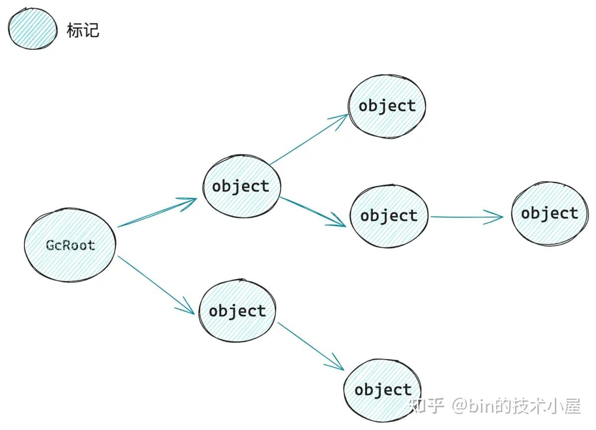

image.png

但是别忘了 Reference 类型本质上也是一个 Java 类，referent 也是 Reference 类中定义的一个非静态成员变量。

```
public abstract class Reference<T> {
  private T referent;
  volatile ReferenceQueue<? super T> queue;
  volatile Reference next;
  private transient Reference<?> discovered;
}
```

如果按照这个逻辑，JVM 是不是也可以通过 nonstatic_oop_maps 获取到 referent 的内存地址 ，近而将 Reference 引用的对象标记为 alive 呢 ？但是现实是，这个 referent 并没有被 JVM 标记到。

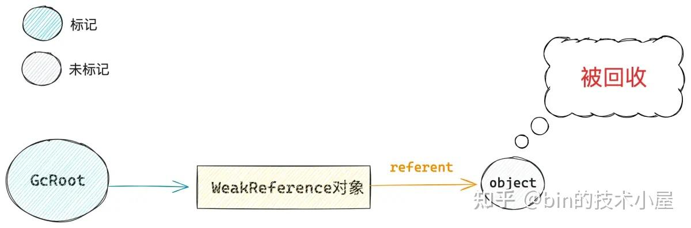

image.png

这就有点奇怪了是吧，JVM 是怎么做到的呢 ？Reference 的语义是如何实现的呢 ？

我们从头来捋一捋，现在的现象是什么 ？ 是 Reference 对象的非静态成员变量 referent 没有被标记到对吧。那么查找一个对象的非静态成员变量靠什么 ？ 靠的是不是就是我们前面花了大量篇幅介绍的 OopMapBlock ？那这个 OopMapBlock 从哪里来的 ？对于普通对象是不是在它的 InstanceKlass 实例中，对于 Reference 类型的对象是不是在它的 InstanceRefKlass 实例 中 ？

那为什么对于普通对象来说，可以通过 OopMapBlock 遍历到它的非静态成员变量，而对于 Reference 对象来说，就无法通过 OopMapBlock 遍历到它的 referent 呢 ？

难道是 JVM 对于 InstanceRefKlass 的 nonstatic_oop_maps 进行了一系列的魔改，压根就没有为 referent 在 OopMapBlock 中建立索引 ？这样自然就不会遍历到 referent，也无法将它标记为 alive 了。

事实上，JVM 就是这么干的，那么在哪里，又是如何对 InstanceRefKlass 进行魔改的呢 ？

在 JVM 启动的时候会对 SystemDictionary 进行初始化，SystemDictionary 在 JVM 中的角色是用于管理系统中已经加载的所有 class 类，在 SystemDictionary 初始化的时候会调用到一个重要的函数 `InstanceRefKlass::update_nonstatic_oop_maps` 。

```
void SystemDictionary::initialize(TRAPS) {
  // Resolve basic classes
  vmClasses::resolve_all(CHECK);
}

void vmClasses::resolve_all(TRAPS) {
    InstanceRefKlass::update_nonstatic_oop_maps(vmClasses::Reference_klass());
}
```

从函数命名上，我们就可以看出来，这里就是对 InstanceRefKlass 进行魔改的地方了。

```
void InstanceRefKlass::update_nonstatic_oop_maps(Klass* k) {

  // Reference 类中的 referent 字段和 discovered 字段的索引偏移从 OopMapBlock 中清除掉
  // 在后面通过 Reference 遍历标记成员变量的时候不需要遍历标记这两个字段
  InstanceKlass* ik = InstanceKlass::cast(k);

  OopMapBlock* map = ik->start_of_nonstatic_oop_maps();

  // Updated map starts at "queue", covers "queue" and "next".
  const int new_offset = java_lang_ref_Reference::queue_offset();
  const unsigned int new_count = 2; // queue and next

   assert(map->offset() == referent_offset, "just checking");
   assert(map->count() == count, "just checking");
   map->set_offset(new_offset);
   map->set_count(new_count);
}
```

在 JVM 启动的时候会对所有基础类进行加载当然也包含 Reference 类，和普通的 Java 类型一样，Reference 类被加载之后，JVM 也会为它构建一个全量的 nonstatic_oop_maps，里面确实也包含了所有的非静态成员变量（referent 字段也包括在内）。

随后就会在 `update_nonstatic_oop_maps ` 中对 InstanceRefKlass 进行魔改。

```
public abstract class Reference<T> {
  private T referent;
  volatile ReferenceQueue<? super T> queue;
  volatile Reference next;
  private transient Reference<?> discovered;
}
```

首先会通过 `java_lang_ref_Reference::queue_offset()` 将成员变量 `queue` 的地址偏移取出来 —— new_offset，然后将原来 OopMapBlock 的 \_count 设置为 2 ，用新的 new_offset，new_count 重新构建 OopMapBlock。

这里 new_count 设置为 2 的意思就是，只将 Reference 类中的非静态成员变量 queue 和 next 构建到 OopMapBlock 中。

也就是说，当 JVM 遍历到一个 Reference 对象时，只能通过它的 OopMapBlock 遍历到 queue 和 next，无法遍历到 referent 和 discovered。

经过这样的魔改之后，JVM 就巧妙地实现了 Reference 的语义。大家这里可以停下来回想回想 WeakReference 的语义，是不是就实现了当一个 Java 对象只存在一条弱引用链的时候，发生 GC 的时候，只被弱引用所关联的对象就会被回收掉。本质原因就是这个被 JVM 魔改之后的 OopMapBlock 产生了作用。

有同学可能会问了，你说的只是 WeakReference 的语义啊，Reference 又不只是 WeakReference 这一种，还有 SoftReference，PhantomReference，FinalReference 这些 Reference 类型，好像在这一小节中并没有看到他们的语义实现。

事实上，笔者在这一小节中只是为大家揭露 Reference 最为本质的面貌，SoftReference，PhantomReference，FinalReference 这些具体的语义都是在 WeakReference 语义的基础上进行了小小的魔改而已，等笔者把该铺垫的背景知识全部铺垫好，后面会有单独的小节专门为大家解释清楚其他 Reference 类型的语义实现。

## 5\. JVM 在 GC 的时候如何处理 Reference

在本文的第三小节中，我们主要在 JVM 的外围来讨论 JDK 如何通过 ReferenceHandler 线程来处理 Reference 对象，其中提到 JVM 内部有一个非常重要的 \_reference_pending_list 链表，当 Reference 的 referent 对象没有任何强引用链或者软引用链可达时，GC 线程就会回收这个 referent 对象。那么与之对应的 Reference 对象就会被 JVM 采用头插法的方式插入到这个 \_reference_pending_list 中。

```
// zReferenceProcessor.cpp 文件
OopHandle Universe::_reference_pending_list;

// Create a handle for reference_pending_list
 _reference_pending_list = OopHandle(vm_global(), NULL);
```

如果 \_reference_pending_list 中没有任何需要被处理的 Reference 对象时，ReferenceHandler 线程就会在一个 native 方法 —— `waitForReferencePendingList()` 上阻塞等待。

当发生 GC 的时候，JVM 就会从 GcRoot 开始挨个遍历整个引用关系图中的对象，并将遍历到的对象标记为 alive，没有被标记到的对象就会被 JVM 当做垃圾回收掉。

当 referent 对象没有被标记到，需要被 GC 线程回收的时候，JVM 就会将与它关联的 Reference 插入到 \_reference_pending_list 中，并唤醒 ReferenceHandler 线程去处理，后面的内容我们在第三小节中已经详细的讨论过了。


image.png

本小节中，笔者将带着大家深入到 JVM 内部，看看发生 GC 的时候，JVM 如何处理这些 Reference 对象 ？ 如何判断哪些 Reference 需要被插入到 \_reference_pending_list 中？ 和我们前面第三小节中的内容遥相呼应起来，这样一来我们就从 JDK 层面再到 JVM 层面将整个 Reference 的处理链路打通了。

下面笔者就以 ZGC 为例，带着大家看一看 JVM 内部到底是如何处理 Reference 的 ：

```
void ZDriver::gc(const ZDriverRequest& request) {
  ZDriverGCScope scope(request);

  // Phase 1: Pause Mark Start
  // 初始化 gc 相关的统计信息，清空 object alocator 的缓存页，切换地址视图，设置标记条带个数
  pause_mark_start();

  // Phase 2: Concurrent Mark
  // 标记 gc root, 标记普通对象，以及 Reference 对象
  // 经过主动刷新，被动刷新之后，如果标记栈中还有对象，也不会再进行标记了
  // 剩下的对象标记任务放到 pause_mark_end 中 STW 阶段执行
  concurrent(mark);

  // Phase 3: Pause Mark End 再标记阶段，标记上一阶段剩下的对象
  // zgc 低延迟的精髓，如果 1ms 内结束不了 STW 标记，那么就在发起一轮 concurrent 标记
  // 目的是降低应用线程的停顿控制在 1ms 以内
  while (!pause_mark_end()) {
    // 1ms 内没有标记完应用线程本地标记栈的内容，那么就重新开始一轮并发标记。
    // Phase 3.5: Concurrent Mark Continue
    concurrent(mark_continue);
  }

  // Phase 4: Concurrent Mark Free
  // 释放标记栈资源
  concurrent(mark_free);

  // Phase 5: Concurrent Process Non-Strong References
  // 这里就是本小节讨论的重点
  concurrent(process_non_strong_references);

  ....... 省略 .......
}
```

ZGC 整个 GC 过程分为 10 个阶段，其中只有四个阶段需要非常短暂的 STW，剩下的六个阶段全部是与 Java 应用线程并发执行的，阶段虽然比较多，整个 GC 过程也非常的复杂，但与本小节相关的阶段只有两个，分别是第二阶段的并发标记阶段 —— `Phase 2: Concurrent Mark` ，与第五阶段的并发处理非强引用 Reference 阶段 —— `Phase 5: Concurrent Process Non-Strong References` 。

其中 `Concurrent Mark` 主要的任务就是从 GcRoot 开始并发标记根对象，并沿着根对象遍历整个堆中的引用关系，在整个遍历的过程中会逐渐发现那些需要被 ReferenceHandler 线程处理的 Reference 对象，随后会将这些 Reference 对象插入到 \_discovered_list 中。

这里大家可能会有疑问，你刚才不是说 JVM 会将需要被处理的 Reference 对象插入到 \_reference_pending_list 中吗 ？怎么现在又变成 \_discovered_list 了 ？

事实上，大家可以将 \_discovered_list 理解为一个临时的 \_reference_pending_list，在 ZGC 的整个过程中会用到两个临时的 \_reference_pending_list，它们分别是 \_discovered_list，\_pending_list。

```
class ZReferenceProcessor : public ReferenceDiscoverer {
  ZPerWorker<oop>      _discovered_list;
  ZContended<oop>      _pending_list;
}
```

ZGC 有多个 GC 线程负责并发执行垃圾回收任务，\_discovered_list 是 `ZPerWorker` 类型的，每一个 GC 线程都有一个 \_discovered_list，负责临时存储由该 GC 线程在并发标记过程中发现的 Reference 对象。

在并发标记结束之后，这些 GC 线程就会将各自在 \_discovered_list 中收集到的 Reference 对象统一转移到 \_pending_list 中，\_pending_list 在所有 GC 线程中是共享的，负责汇总 ZGC 线程收集到的所有 Reference 对象。

在 `Concurrent Process Non-Strong References` 阶段的最后，JVM 会将 \_pending_list 中汇总的 Reference 对象再次统一转移到 \_reference_pending_list 中，\_reference_pending_list 是最终对外的发布形态，ReferenceHandler 线程只会和 \_reference_pending_list 打交道。

理解了这个背景，下面我们就来一起看下 Concurrent Mark 阶段是如何发现 Reference 对象的

### 5.1 Concurrent Mark

当 ZGC 遍历到一个对象 —— `oop obj` 并将其标记为 alive 之后，就会调用 `follow_object ` 方法，来遍历 obj 的所有非静态成员变量，然后将这些成员变量所引用的 obj 标记为 alive，然后再次调用 follow_object 继续遍历引用关系图，这样循环往复。 ZGC 就是靠着这个 follow_object 方法驱动着所有 GC 线程去遍历整个堆的引用关系图。

```
void ZMark::follow_object(oop obj, bool finalizable) {
  if (finalizable) {
    ZMarkBarrierOopClosure<true /* finalizable */> cl;
    obj->oop_iterate(&cl);
  } else {
    // 最终的标记逻辑是在这个闭包中完成的
    ZMarkBarrierOopClosure<false /* finalizable */> cl;
    // 遍历标记 obj 的所有非静态成员变量
    obj->oop_iterate(&cl);
  }
}
```

这里就来到了笔者在第四小节中介绍的内容，这个函数熟悉吗 ？没印象的话再去回顾下第四小节。

```
template <typename OopClosureType>
void oopDesc::oop_iterate(OopClosureType* cl) {
  OopIteratorClosureDispatch::oop_oop_iterate(cl, this, klass());
}
```

首先会通过 `klass()` 函数去获取 obj 中的 \_klass 指针，对于普通类型的 Java 对象来说，\_klass 指向的是 InstanceKlass 实例，对于 Reference 类型的对象来说，\_klass 指向的是 InstanceRefKlass 实例。

最终的遍历动作是在对应 Klass 中的 oop_oop_iterate 方法中进行的，本小节我们重点关注 InstanceRefKlass。

```
template <typename T, class OopClosureType>
void InstanceRefKlass::oop_oop_iterate(oop obj, OopClosureType* closure) {
  // 遍历 Reference 对象的非静态成员变量，注意这里 referent 字段和 discovered 字段是不会被遍历到的
  InstanceKlass::oop_oop_iterate<T>(obj, closure);
  // 判断该 Reference 对象是否需要加入到 _discovered_list 中
  oop_oop_iterate_ref_processing<T>(obj, closure);
}
```

首先会调用 `InstanceKlass::oop_oop_iterate` 函数，这个函数熟悉吗 ？我们在第四小节中重点介绍的就是这个函数。

在这个函数中获取 InstanceRefKlass 实例中的 nonstatic_oop_maps，通过 OopMapBlock 去遍历标记 Reference 对象非静态成员变量。

```
template <typename T, class OopClosureType>
ALWAYSINLINE void InstanceKlass::oop_oop_iterate_oop_maps(oop obj, OopClosureType* closure) {
  OopMapBlock* map           = start_of_nonstatic_oop_maps();
  OopMapBlock* const end_map = map + nonstatic_oop_map_count();

  for (; map < end_map; ++map) {
    oop_oop_iterate_oop_map<T>(map, obj, closure);
  }
}
```

但笔者前面介绍过，InstanceRefKlass 中的 nonstatic_oop_maps 是被 JVM 经过特殊魔改的，这里并不会遍历到 Reference 对象的 referent 字段和 discovered 字段。

```
public abstract class Reference<T> {
  private T referent;
  volatile ReferenceQueue<? super T> queue;
  volatile Reference next;
  private transient Reference<?> discovered;
}
```

在遍历标记完 Reference 对象的非静态成员变量之后，JVM 会调用 `oop_oop_iterate_ref_processing` 来判断该 Reference 对象是否应该插入到 \_discovered_list 中。

```
template <typename T, class OopClosureType, class Contains>
void InstanceRefKlass::oop_oop_iterate_ref_processing(oop obj, OopClosureType* closure, Contains& contains) {
  switch (closure->reference_iteration_mode()) {
    case OopIterateClosure::DO_DISCOVERY:
      // 执行这里的 discovery 逻辑，发现需要被处理的 Reference 对象
      oop_oop_iterate_discovery<T>(obj, reference_type(), closure, contains);
      break;

     ...... 省略 .....
  }
}

template <typename T, class OopClosureType, class Contains>
void InstanceRefKlass::oop_oop_iterate_discovery(oop obj, ReferenceType type, OopClosureType* closure, Contains& contains) {
  // Try to discover reference and return if it succeeds.
  if (try_discover<T>(obj, type, closure)) {
    // 走到这里说明 Reference 对象已经被加入到 _discovered_list 中了
    // 加入到 _discovered_list 的条件是：
    // 1. referent 没有被标记，说明不活跃
    // 2. Reference 对象之前没有被添加到 _discovered_list（第一次添加）
    return;
  }

}
```

在 try_discover 中，JVM 首先会通过 `load_referent` 从堆中加载 Reference 引用的 referent 对象。这里会判断 referent 对象是否已经被 GC 线程标记过了，如果已经被标记了，说明 referent 是 alive 的，那么这个 Reference 对象就不需要被放入 \_discovered_list 中，直接 return 掉。

如果 referent 没有被标记，则进入 `ZReferenceProcessor->discover_reference ` 函数中作进一步的 discover 逻辑判断。

```
template <typename T, class OopClosureType>
bool InstanceRefKlass::try_discover(oop obj, ReferenceType type, OopClosureType* closure) {

  //  ZReferenceProcessor
  ReferenceDiscoverer* rd = closure->ref_discoverer();
  if (rd != NULL) {
      // 从堆中加载 Reference 对象的 referent
    oop referent = load_referent(obj, type);
    if (referent != NULL) {
      if (!referent->is_gc_marked()) {
        // Only try to discover if not yet marked.
        // true 表示 reference 被加入到 discover-list 中了
        return rd->discover_reference(obj, type);
      }
    }
  }
  return false;
}
```

discover_reference 的逻辑很简单，主要分为两步：

1. 通过 `should_discover ` 判断该 Reference 对象是否需要被 ReferenceHandler 线程处理
2. 如果 Reference 对象需要被处理的话就通过 `discover ` 方法，将其插入到 \_discovered_list 中。

```
bool ZReferenceProcessor::discover_reference(oop reference, ReferenceType type) {

  // true : 表示 referent 还存活（被强引用或者软引用关联），那么就不能放到 _discovered_list
  // false ： 表示 referent 不在存活，那么就需要把 reference 放入 _discovered_list
  if (!should_discover(reference, type)) {
    // Not discovered
    return false;
  }
  // 将 reference 插入到  _discovered_list 中（头插法）
  discover(reference, type);

  // Discovered
  return true;
}
```

should_discover 判断是否将 Reference 添加到 \_discovered_list 中的逻辑依据主要有三个方面：

如果 Reference 对象的状态是 `inactive` ，那么 JVM 就不会将它放入 \_discovered_list 中。那么什么时候 Reference 对象会变为 `inactive` 呢 ？

比如，应用线程自己调用 `Reference.enqueue()` 方法，自己亲自将 Reference 对象添加到与其关联的 ReferenceQueue 中等待进一步的处理。那么这里 JVM 就不需要将 Reference 添加到 \_discovered_list 中了。

因为最终 ReferenceHandler 线程还是会从 \_reference_pending_list 中将 Reference 添加到 ReferenceQueue 中，这样一来就重复了。应用线程在调用 `Reference.enqueue()` 方法之后，Reference 的状态就变为了 `inactive` 。

还有一种变为 `inactive` 的情况就是应用线程直接调用 `Reference.clear()` 方法，表示应用线程自己已经处理过 Reference 对象了，JVM 就别管了，此时 Reference 的状态变为 inactive, 那么在下一轮 GC 的时候该 Reference 对象就会被回收，并且不会再次被添加到 \_discovered_list 中。

这也就解释了为什么 Reference 状态变为 `inactive` 之后，JVM 将不会再次将其放入 \_discovered_list 的原因了，因为它已经被处理过了。处于 `inactive` 状态的 Reference 有一个共同的特点就是它的 `referent = null` 。

第二个条件是如果它的 referent 仍然存在强引用链，那么这个 Reference 将不会被放入 \_discovered_list。

第三个条件是如果它的 referent 仍然存在软引用链，也就是还被软引用所关联，如果此时内存充足，软引用不会被回收的话，那么这个 Reference 也不会被放入 \_discovered_list。

```
bool ZReferenceProcessor::should_discover(oop reference, ReferenceType type) const {
  // 获取 referent 对象的地址视图
  volatile oop* const referent_addr = reference_referent_addr(reference);
  // 调整 referent 对象的地址视图为 remapped + mark0 也就是 weakgood 视图
  // 表示该 referent 对象目前只能通过弱引用链访问到，而不能通过强引用链访问到
  // 注意这里是调整 referent 的视图而不是调整 Reference 的视图
  const oop referent = ZBarrier::weak_load_barrier_on_oop_field(referent_addr);

  // 此时 Reference 的状态就是 inactive，那么这里将不会重复将 Reference 添加到 _discovered_list 重复处理
  if (is_inactive(reference, referent, type)) {
    return false;
  }
  // referent 还被强引用关联，那么 return false 也就是说不能被加入到 discover list 中
  if (is_strongly_live(referent)) {
    return false;
  }
  // referent 还被软引用有效关联，那么 return false 也就是说不能被加入到 discover list 中
  if (is_softly_live(reference, type)) {
    return false;
  }

  return true;
}
```

如果 Reference 对象的 referent 在当前堆中已经没有任何强引用或者软引用了，并且该 Reference 对象不是 `inactive` 状态的，那么 JVM 就会将该 Reference 对象通过下面的 `discover` 方法插入到 \_discovered_list 中（头插法）。

```
void ZReferenceProcessor::discover(oop reference, ReferenceType type) {
  // Add reference to discovered list
  // 确保 reference 不在 _discovered_list 中，不能重复添加
  assert(reference_discovered(reference) == NULL, "Already discovered");
  oop* const list = _discovered_list.addr();
  // 头插法，reference->discovered = *list
  reference_set_discovered(reference, *list);
  // reference 变为 _discovered_list 的头部
  *list = reference;
}
```

从以上过程我们可以看出，在 ZGC 的 Concurrent Mark 阶段， Reference 对象被 JVM 添加到 \_discovered_list 中需要同时符合下面四个条件：

1. Reference 对象引用的 referent 没有被 GC 标记过。
2. Reference 对象的状态不能是 `inactive`, 也就是说这个 Reference 还没有被应用线程处理过，Reference 之前没有加入过 \_discovered_list。
3. referent 不存在任何强引用链。
4. referent 不存在任何软引用链。
   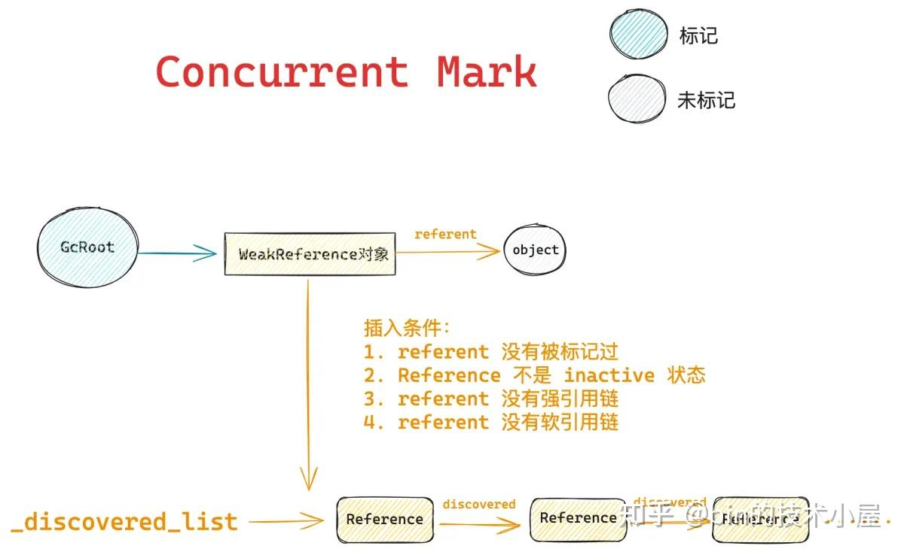

image.png

好了，现在 Reference 在 Concurrent Mark 阶段的处理过程，笔者就为大家介绍完了，这里需要注意的是，目前 \_discovered_list 中收集到的 Reference 都只是临时的，因为当前所处的阶段为并发标记阶段，应用线程和 GC 线程是并发执行的，再加上标记阶段还没有结束，所以 Reference 加入到 \_discovered_list 的条件可能随时会被应用线程和 GC 线程再次改变。

\_discovered_list 终态的确定需要等到并发标记阶段完全结束，在 ZGC 的第五阶段 —— Concurrent Process Non-Strong References 进行最终的处理。

### 5.2 Concurrent Process Non-Strong References

```
void ZHeap::process_non_strong_references() {
  // Process Soft/Weak/Final/PhantomReferences
  _reference_processor.process_references();
  // Enqueue Soft/Weak/Final/PhantomReferences
  _reference_processor.enqueue_references();
}
```

ZGC 在 `Concurrent Process Non-Strong References` 阶段对于 Reference 的最终处理是在 `ZReferenceProcessor` 中完成的，其中主要包括两个核心步骤：

首先在 `process_references()` 函数中，判断 ZGC 在 `Concurrent Mark` 阶段的 \_discovered_list 中收集到的临时 Reference 对象所引用的 referent 是否存活，如果这些 referent 仍然存活，那么就需要将对应的 Reference 对象从 \_discovered_list 中移除。

如果这些 referent 不再存活，那么就将与其关联的 Reference 对象继续保留在 \_discovered_list，最后将 \_discovered_list 中依然保留的 Reference 对象添加到 \_pending_list 中，然后清空 \_discovered_list。

第二个步骤就是在 `enqueue_references()` 函数中，将最终确定下来的 \_pending_list 再次添加到 `_reference_pending_list` 中，随后唤醒 ReferenceHandler 线程去处理 \_reference_pending_list 中的 Reference 对象，最后清空 \_pending_list，为下一轮 GC 做准备。

以上就是 ZGC 对于 `Non-Strong References` 的总体处理流程，下面我们就来看下这两个核心步骤中的具体处理细节：

```
void ZReferenceProcessor::process_references() {
        // Process discovered lists
        ZReferenceProcessorTask task(this);
        _workers->run(&task);
    }
```

process_references() 对于 \_discovered_list 的处理逻辑被封装在一个 `ZReferenceProcessorTask` 中，由所有 GC 线程来一起并发执行这个 Task。

```
void ZReferenceProcessor::work() {
  // Process discovered references
  oop* const list = _discovered_list.addr();
  oop* p = list;

  // 循环遍历 _discovered_list，检查之前收集到的 Reference 对象的 referent 是否存活
  while (*p != NULL) {
    const oop reference = *p;
    const ReferenceType type = reference_type(reference);
    // 如果该 reference 已经被应用程序处理过了 -> referent == NULL, 那么就不需要再被处理了，直接丢弃
    // 如果 referent 依然存活，那么也要丢弃，不能放入 _discovered_list 中
    if (should_drop(reference, type)) {
      // 如果 referent 是 alive 的或者在上一轮 GC 中已经被处理过，则将 reference 从 _discovered_list 中删除
      *p = drop(reference, type);
    } else {
      // 如果 referent 不是 alive 的，在并发标记阶段没有被标记，那么就让它继续留在 _discovered_list 中
      // 这里会调用 reference 的 clear 方法 -> referent 置为 null
      // 返回 reference 在 _discovered_list 中的下一个对象，继续 while 循环
      p = keep(reference, type);
    }
  }

  // 将 _discovered_list 原子地添加到 _pending_list 中
  if (*list != NULL) {
    *p = Atomic::xchg(_pending_list.addr(), *list);
    // 清空 _discovered_list
    *list = NULL;
  }
}
```

首先通过 `_discovered_list.addr()` 获取 GC 线程的本地 \_discovered_list，前面我们提到 \_discovered_list 是一个 `ZPerWorker` 类型的，每一个 GC 线程对应一个，用于在 Concurrent Mark 阶段并发 discover Reference。

循环遍历 \_discovered_list，挨个获取链表中收集到的临时 Reference，通过 `should_drop` 方法判断是否需要将 Reference 对象从 \_discovered_list 中移除。移除条件有两个：

1. 如果 Reference 对象的 referent 被置为 null, 那么就需要将这里的 Reference 对象移除掉。因为在 Reference 被放入到 \_pending_list 之前，JVM 会主动调用 Reference 对象的 clear 方法，将 referent 置空。 `referent = null ` 代表的语义是这个 Reference 之前已经被添加到 \_discovered_list 中了，比如在上一轮 GC 中就已经被处理了，本轮 GC 直接将 Reference 对象回收掉就好了，不需要再重复添加到 \_discovered_list。
2. 如果 Reference 对象在前几轮 GC 没有被处理过，是在本轮 GC 中新发现的，那么就继续判断它的 referent 是否还存活，如果仍然存活的话，就将 Reference 对象移除，因为 referent 还活着，自然也不需要被 ReferenceHandler 线程处理

```
bool ZReferenceProcessor::should_drop(oop reference, ReferenceType type) const {
  // 获取 Reference 所引用的 referent
  const oop referent = reference_referent(reference);
  // 如果 Reference 对象在上一轮 GC 中被处理过或者已经被应用线程自己处理了，那么本轮 GC 直接回收掉
  // 不会再将 Reference 对象重复添加到 _discovered_list
  if (referent == NULL) {
    return true;
  }

  // 如果 referent 仍然存活，那么也会将 Reference 对象移除，不需要被 ReferenceHandler 线程处理
  if (type == REF_PHANTOM) {
    // 针对 PhantomReference 对象的特殊处理，后面在专门的小节中讲解，这里先忽略
    return ZBarrier::is_alive_barrier_on_phantom_oop(referent);
  } else {
    // 本小节我们重点关注这个分支，主要就是判断这个 referent 是否被标记为 alive
    return ZBarrier::is_alive_barrier_on_weak_oop(referent);
  }
}
```

这里大家可能就有点懵了，因为笔者前面介绍过，在 ZGC 的 Concurrent Mark 阶段， Reference 对象被 JVM 添加到 \_discovered_list 中的条件就是这个 Reference 对象的 referent 没有被标记过。那为什么这里又要判断一下呢 ？我们来看一个这样的场景：

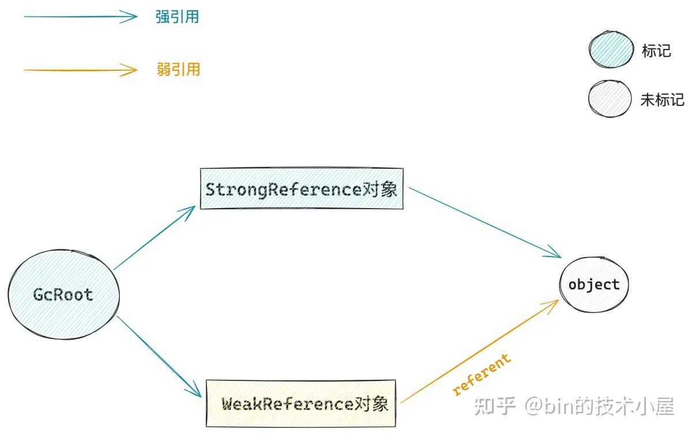

image.png

上图中展示的这个场景是，一个 object 对象在 JVM 堆中同时被一个 StrongReference 对象和一个 WeakReference 对象所引用。

假设在 ZGC 的 Concurrent Mark 阶段，GC 线程先遍历到 WeakReference 对象，注意此时还没有遍历到 StrongReference 对象。由于还没有遍历到 StrongReference ，所以这个 object 对象还没有被标记为 alive。

而对于 WeakReference 对象来说，GC 线程并不会遍历标记它的 referent，对吧，这是我们第四小节中的内容了。这时这个 WeakReference 对象就会被 JVM 添加到 \_discovered_list 中。

好的，我们继续 Concurrent Mark，后面 GC 线程最终是要遍历到 StrongReference 对象的，对吧。当 GC 线程遍历到 StrongReference 对象的时候首先会标记这个 StrongReference 对象为 alive，随后开始遍历它的所有非静态成员变量，逐个进行标记 alive，在这个过程中 object 对象最终也会被标记为 alive。

当 Concurrent Mark 结束之后，我们来到了本小节的 `Concurrent Process Non-Strong References` 阶段，那么对于此时被添加到 \_discovered_list 中的这个 WeakReference 对象是不是就不对了，因为它的 referent 后面又被标记为 alive 了，所以在 `should_drop ` 函数的最后还是要通过 `is_alive_barrier_on_weak_oop ` 判断一下 referent 是否被标记，如果被标记过了，那么就需要将这个 WeakReference 对象从 \_discovered_list 中移除。

了解了这个背景，我们再来看 `ZReferenceProcessor::work` 中的处理逻辑就很清晰了。首先 GC 线程会在 `while (*p != NULL)` 循环中不停的遍历 \_discovered_list 中临时存放的这些 Reference 对象。

然后通过 `should_drop` 判断这个 Reference 对象是否应该从 \_discovered_list 中移除，如果 should_drop 返回 true ，那么 JVM 就会通过 `drop ` 方法将 Reference 对象移除。很简单的链表操作，这里笔者就不展开了。

如果 should_drop 返回 false， JVM 就会让这个 Reference 对象继续保留在 \_discovered_list 中，并调用 `keep` 方法获取该 Reference 对象在 \_discovered_list 中的下一个元素，继续进行 `while` 循环重复上述的判断逻辑。

```
oop* ZReferenceProcessor::keep(oop reference, ReferenceType type) {

  // 入队计数加 1
  _enqueued_count.get()[type]++;

  // 将 referent 置为 null ，此后 Reference 就变为了 inactive
  make_inactive(reference, type);

  // 从 _discovered_list 中获取下一个 Reference 继续循环
  return reference_discovered_addr(reference);
}
```

在 `keep` 方法中会调用一个 make_inactive 方法，JVM 在这里会调用 Reference 对象的 clear 方法将 referent 置为 null 。

```
void ZReferenceProcessor::make_inactive(oop reference, ReferenceType type) const {
  if (type == REF_FINAL) {
      ..... 省略 FinalReference 的处理 ....
  } else {
    // 这里调用 Reference 对象的 clear 方法将，referent 置为 null
    reference_clear_referent(reference);
  }
}
```

那么此时如果我们在应用线程中调用这个 Reference 对象的 `get()` 方法的时候就会得到一个 null 值，referent 对象被 JVM 置为 null 的时机就是这个 Reference 对象确定要被添加到 \_pending_list 的时候。

```
WeakReference weakReference = new WeakReference<Object>(new Object());
weakReference.get();
```

当 \_discovered_list 中的那些所有需要被移除的 Reference 对象都已经被移除之后，JVM 就会将终态的 \_discovered_list 原子地添加到 \_pending_list 中。

在 ` Concurrent Process Non-Strong References` 阶段的最后，ZGC 就会调用 `enqueue_references` 方法将 `_pending_list` 中的 Reference 对象转移到 `_reference_pending_list ` 中。最后重置 pending list，为下一轮 GC 做准备。

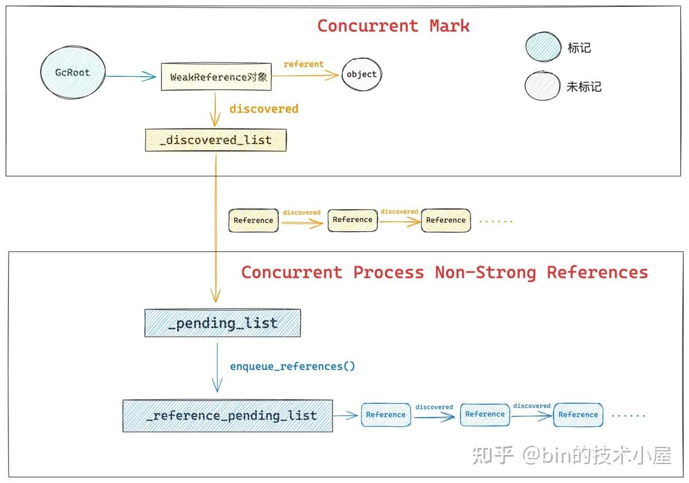

image.png

```
void ZReferenceProcessor::enqueue_references() {

        if (_pending_list.get() == NULL) {
            // Nothing to enqueue
            return;
        }

        {
            // Heap_lock protects external pending list
            MonitorLocker ml(Heap_lock);

            // 将 _pending_list 添加到 _reference_pending_list 中
            *_pending_list_tail = Universe::swap_reference_pending_list(_pending_list.get());

            // 唤醒 ReferenceHandler 线程
            ml.notify_all();
        }

        // 重置 pending list，为下一轮 GC 做准备
        _pending_list.set(NULL);
        _pending_list_tail = _pending_list.addr();
    }
```

这里我们看到 ZGC 在更新完 \_reference_pending_list 之后，会调用一个 `ml.notify_all()` ，那么这个操作是要唤醒谁呢 ？或者说谁会在 Heap_lock 上等待呢 ？

还记不记得笔者在第三小节中为大家介绍的 native 方法 —— `waitForReferencePendingList()`:

```
// Reference.c 文件
JNIEXPORT void JNICALL
Java_java_lang_ref_Reference_waitForReferencePendingList(JNIEnv *env, jclass ignore)
{
    JVM_WaitForReferencePendingList(env);
}

// jvm.cpp 文件
JVM_ENTRY(void, JVM_WaitForReferencePendingList(JNIEnv* env))
  MonitorLocker ml(Heap_lock);
  while (!Universe::has_reference_pending_list()) {
    // 如果 _reference_pending_list 还没有 Reference 对象，那么当前线程在 Heap_lock 上 wait
    ml.wait();
  }
JVM_END
```

那么谁会在这个方法上阻塞等待呢 ？答案就是 —— ReferenceHandler 线程。

```
private static class ReferenceHandler extends Thread {

  private static void processPendingReferences() {

        waitForReferencePendingList();

        ........ 省略 .....
  }
}
```

至于 ReferenceHandler 线程被唤醒之后干了什么 ？ 这不就是笔者在第三小节中详细为大家介绍的内容么，这样一来是不是就和前面的内容遥相呼应起来了~~~

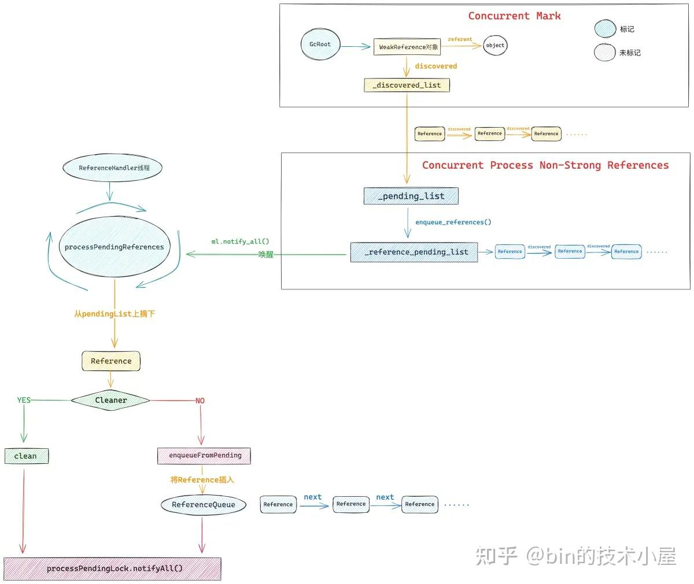

image.png

[所属专栏 · 2024-06-19 21:47 更新](https://zhuanlan.zhihu.com/c_1483528261305528320)

[](https://zhuanlan.zhihu.com/c_1483528261305528320)

[聊聊Jvm那些事儿](https://zhuanlan.zhihu.com/c_1483528261305528320)

[

bin的技术小屋

7 篇内容 · 65 赞同

](https://zhuanlan.zhihu.com/c_1483528261305528320)

[

最热内容 ·

System.gc 之后到底发生了什么 ？

](https://zhuanlan.zhihu.com/c_1483528261305528320)

编辑于 2024-06-13 10:36・广东[Java](https://www.zhihu.com/topic/19561132)[Java 虚拟机（JVM）](https://www.zhihu.com/topic/19566470)[java GC](https://www.zhihu.com/topic/20041701)[有了豆包学习搭子，作文、翻译、讲解，学习轻松无压力](http://www.doubao.com/download/desktop?ug_apk_token=LmYXY&ad_platform_id=zhihu_feed_lead&ug_callback_url=https%3A%2F%2Fsugar.zhihu.com%2Fplutus_adreaper_callback%3Fsi%3D462762d6-c4da-4558-a36a-475e2f1bd8dd%26os%3D3%26zid%3D1629%26zaid%3D3764983%26zcid%3D3766026%26cid%3D3766026%26event%3D__EVENTTYPE__%26value%3D__EVENTVALUE__%26score%3D__EVENTSCORE__%26ts%3D__TIMESTAMP__%26cts%3D__TS__%26mh%3D17156ba06675b54a36f061d6b208ffef%26adv%3D784532%26ocg%3D0%26cp%3D0%26ocs%3D0%26aic%3D0%26atp%3D0%26ct%3D0%26ed%3DGiBNJgVzfCMmUW9XFyEvRA8xBGxJICwkOhh0FlwxKw1ZY0gnWzUoISkYf1UXISFcCiIEeR4yNyw9GGJBRCUlVFZ0DngJcmN3ehFkUwBkfwNZY1YkXSo-fX4DPhIMZ3QGWHUOegFwTvnNPS8Upjg%3D&cb=https%3A%2F%2Fsugar.zhihu.com%2Fplutus_adreaper_callback%3Fsi%3D462762d6-c4da-4558-a36a-475e2f1bd8dd%26os%3D3%26zid%3D1629%26zaid%3D3764983%26zcid%3D3766026%26cid%3D3766026%26event%3D__EVENTTYPE__%26value%3D__EVENTVALUE__%26score%3D__EVENTSCORE__%26ts%3D__TIMESTAMP__%26cts%3D__TS__%26mh%3D17156ba06675b54a36f061d6b208ffef%26adv%3D784532%26ocg%3D0%26cp%3D0%26ocs%3D0%26aic%3D0%26atp%3D0%26ct%3D0%26ed%3DGiBNJgVzfCMmUW9XFyEvRA8xBGxJICwkOhh0FlwxKw1ZY0gnWzUoISkYf1UXISFcCiIEeR4yNyw9GGJBRCUlVFZ0DngJcmN3ehFkUwBkfwNZY1YkXSo-fX4DPhIMZ3QGWHUOegFwTvnNPS8Upjg%3D&ug_semver=v1.0.0&spu=biz%3D0%26ci%3D3766026%26si%3D4409bfa7-eaf1-4389-95e8-802b5f1b8472%26ts%3D1787017726%26zid%3D1629)

[

学生党学习搭子-豆包AI！不仅可以输出中英文作文、英语翻译、作文修改润色，还能有海量题目讲解

](http://www.doubao.com/download/desktop?ug_apk_token=LmYXY&ad_platform_id=zhihu_feed_lead&ug_callback_url=https%3A%2F%2Fsugar.zhihu.com%2Fplutus_adreaper_callback%3Fsi%3D462762d6-c4da-4558-a36a-475e2f1bd8dd%26os%3D3%26zid%3D1629%26zaid%3D3764983%26zcid%3D3766026%26cid%3D3766026%26event%3D__EVENTTYPE__%26value%3D__EVENTVALUE__%26score%3D__EVENTSCORE__%26ts%3D__TIMESTAMP__%26cts%3D__TS__%26mh%3D17156ba06675b54a36f061d6b208ffef%26adv%3D784532%26ocg%3D0%26cp%3D0%26ocs%3D0%26aic%3D0%26atp%3D0%26ct%3D0%26ed%3DGiBNJgVzfCMmUW9XFyEvRA8xBGxJICwkOhh0FlwxKw1ZY0gnWzUoISkYf1UXISFcCiIEeR4yNyw9GGJBRCUlVFZ0DngJcmN3ehFkUwBkfwNZY1YkXSo-fX4DPhIMZ3QGWHUOegFwTvnNPS8Upjg%3D&cb=https%3A%2F%2Fsugar.zhihu.com%2Fplutus_adreaper_callback%3Fsi%3D462762d6-c4da-4558-a36a-475e2f1bd8dd%26os%3D3%26zid%3D1629%26zaid%3D3764983%26zcid%3D3766026%26cid%3D3766026%26event%3D__EVENTTYPE__%26value%3D__EVENTVALUE__%26score%3D__EVENTSCORE__%26ts%3D__TIMESTAMP__%26cts%3D__TS__%26mh%3D17156ba06675b54a36f061d6b208ffef%26adv%3D784532%26ocg%3D0%26cp%3D0%26ocs%3D0%26aic%3D0%26atp%3D0%26ct%3D0%26ed%3DGiBNJgVzfCMmUW9XFyEvRA8xBGxJICwkOhh0FlwxKw1ZY0gnWzUoISkYf1UXISFcCiIEeR4yNyw9GGJBRCUlVFZ0DngJcmN3ehFkUwBkfwNZY1YkXSo-fX4DPhIMZ3QGWHUOegFwTvnNPS8Upjg%3D&ug_semver=v1.0.0&spu=biz%3D0%26ci%3D3766026%26si%3D4409bfa7-eaf1-4389-95e8-802b5f1b8472%26ts%3D1787017726%26zid%3D1629)
