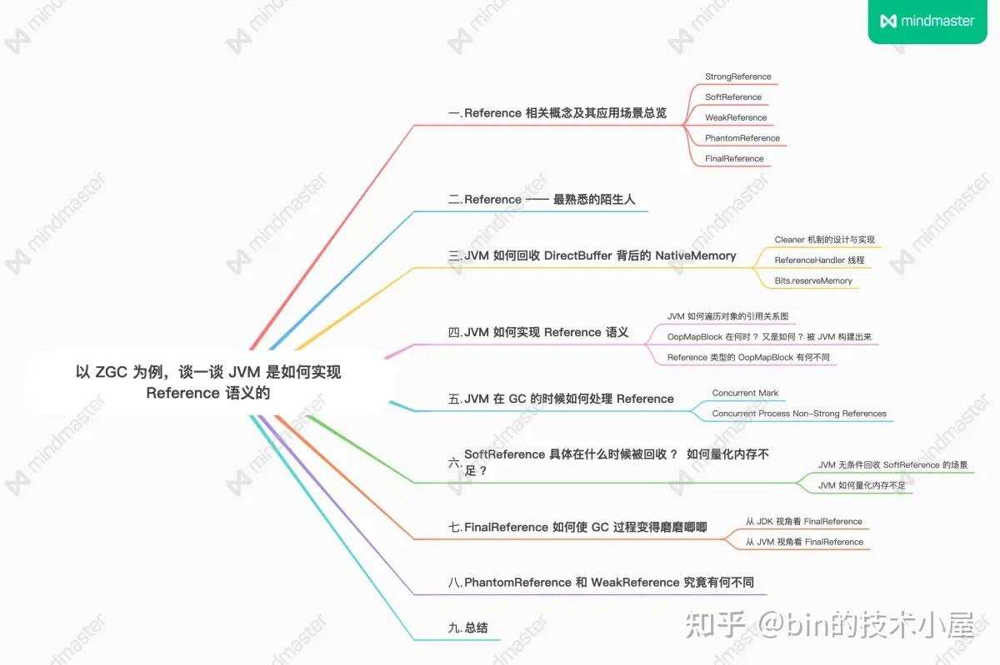
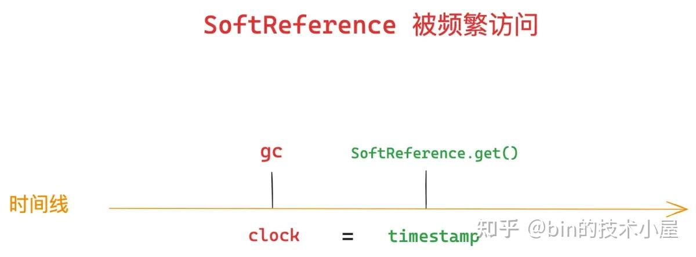
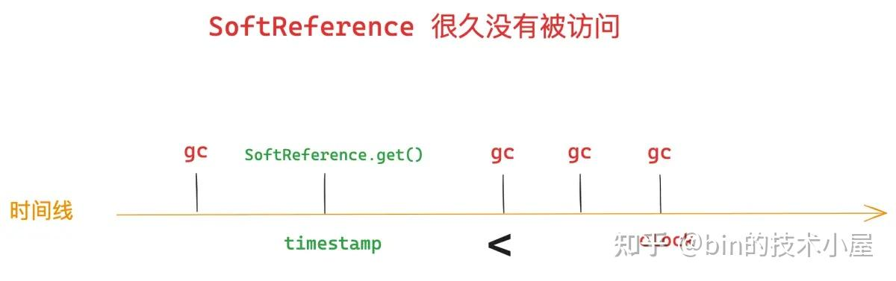
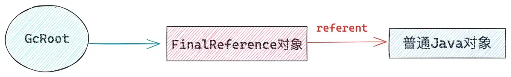
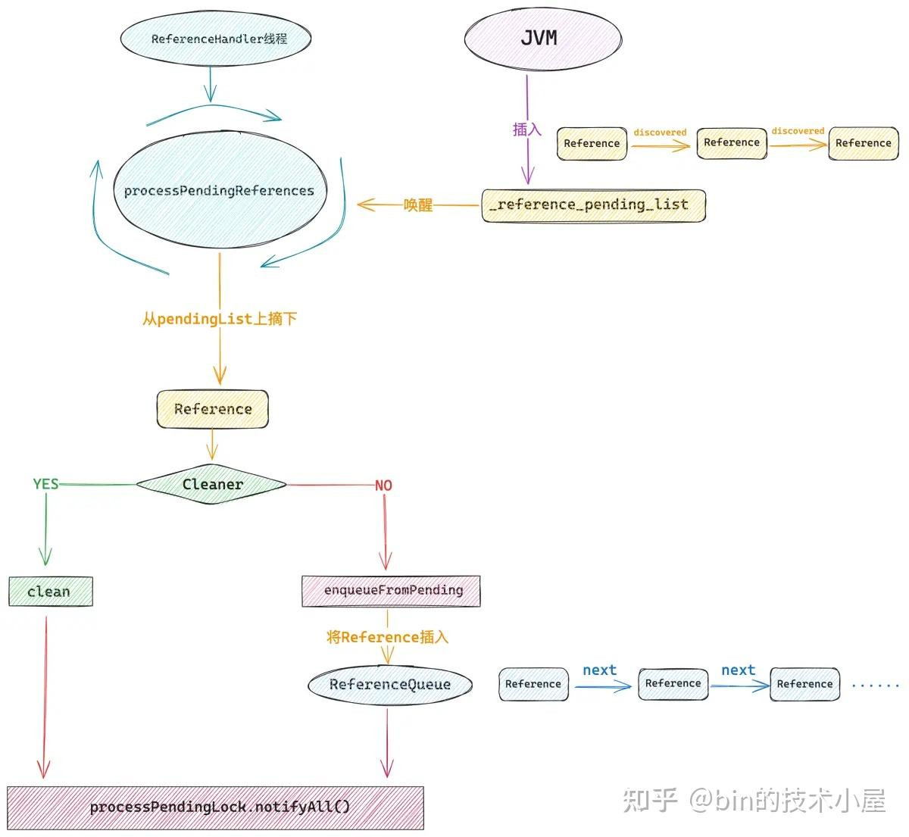
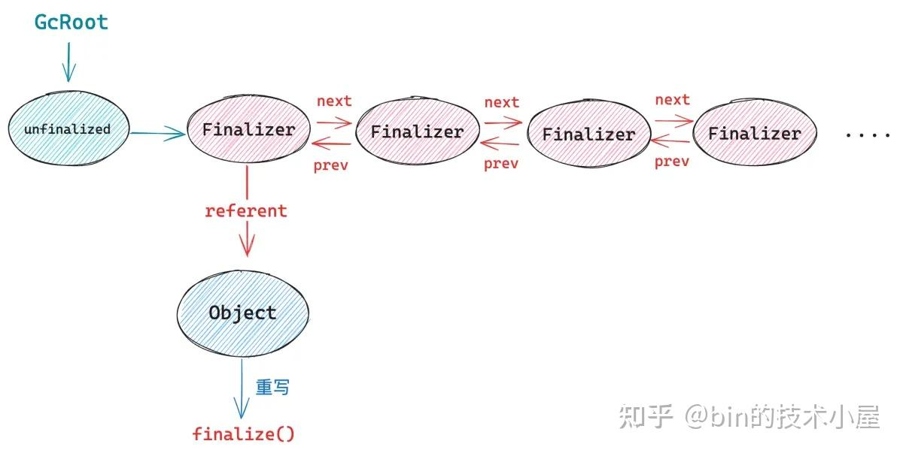
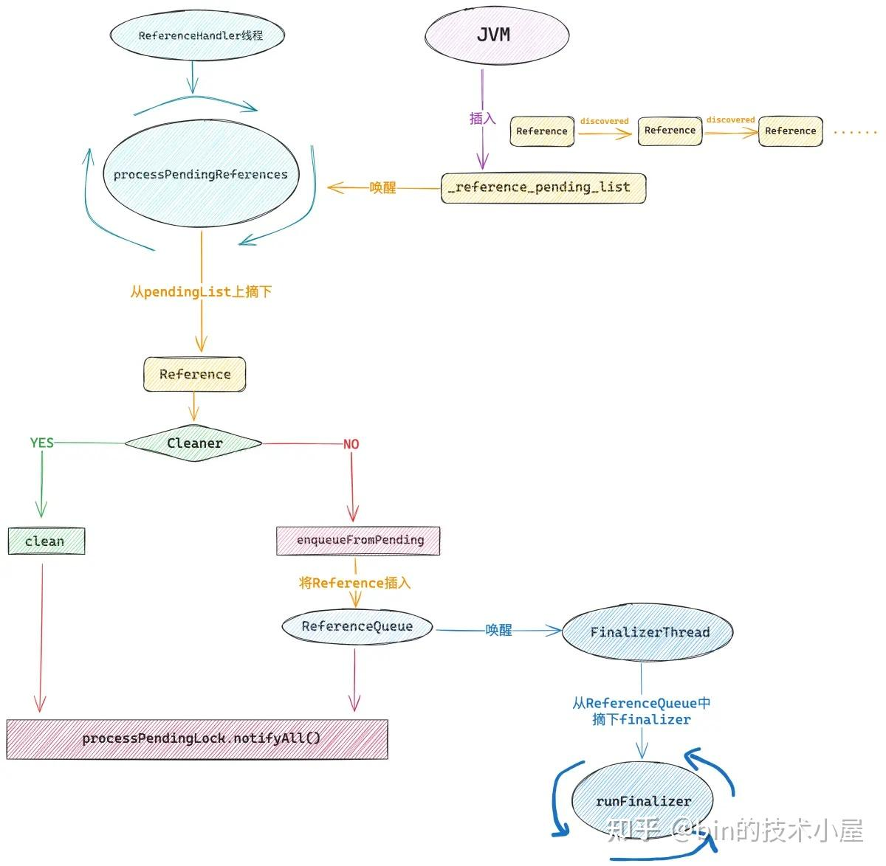
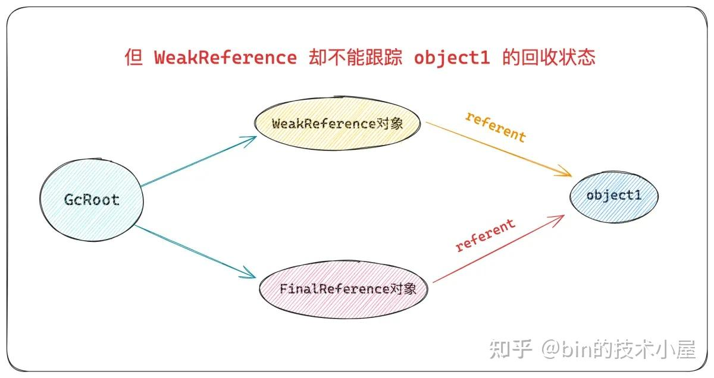
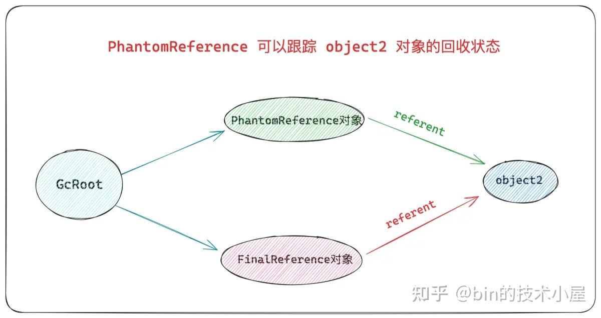

> 本文基于 [OpenJDK17](https://zhida.zhihu.com/search?content_id=244373273&content_type=Article&match_order=1&q=OpenJDK17&zhida_source=entity) 进行讨论



本文概要.png

## 6\. SoftReference 具体在什么时候被回收 ？ 如何量化内存不足 ？

大家在网上或者在其他讲解 JVM 的书籍中多多少少会看到这样一段关于 SoftReference 的描述 —— “当 SoftReference 所引用的 [referent](https://zhida.zhihu.com/search?content_id=244373273&content_type=Article&match_order=1&q=referent&zhida_source=entity) 对象在整个堆中没有其他强引用的时候，发生 GC 的时候，如果此时内存充足，那么这个 referent 对象就和其他强引用一样，不会被 GC 掉，如果此时内存不足，系统即将 OOM 之前，那么这个 referent 对象就会被当做垃圾回收掉”。


image.png

当然了，如果仅从概念上理解的话，这样描述就够了，但是如果我们从 JVM 的实现角度上来说，那这样的描述至少是不准确的，为什么呢 ？ 笔者先提两个问题出来，大家可以先思考下：

1. 内存充足的情况下，SoftReference 所引用的 referent 对象就一定不会被回收吗 ？
2. 什么是内存不足 ？这个概念如何量化，SoftReference 所引用的 referent 对象到底什么时候被回收 ？

下面笔者继续以 ZGC 为例，带大家深入到 JVM 内部去探寻下这两个问题的精确答案~~

### 6.1 JVM 无条件回收 SoftReference 的场景

经过前面第五小节的介绍，我们知道 ZGC 在 Concurrent Mark 以及 Concurrent Process Non-Strong References 阶段中处理 Reference 对象的关键逻辑都封装在 `ZReferenceProcessor` 中。

在 ZReferenceProcessor 中有一个关键的属性 —— \_soft_reference_policy，在 ZGC 的过程中，处理 SoftReference 的策略就封装在这里，本小节开头提出的那两个问题的答案就隐藏在 \_soft_reference_policy 中。

```
class ZReferenceProcessor : public ReferenceDiscoverer {
  // 关于 SoftReference 的处理策略
  ReferencePolicy*     _soft_reference_policy;
}
```

那下面的问题就是如果我们能够知道 \_soft_reference_policy 的初始化逻辑，那是不是关于 SoftReference 的一切疑惑就迎刃而解了 ？我们来一起看下 \_soft_reference_policy 的初始化过程。

在 ZGC 开始的时候，首先会创建一个 ZDriverGCScope 对象，这里主要进行一些 GC 的准备工作，比如更新 GC 的相关统计信息，设置并行 GC [线程](https://zhida.zhihu.com/search?content_id=244373273&content_type=Article&match_order=1&q=%E7%BA%BF%E7%A8%8B&zhida_source=entity) 个数，以及本小节的重点，初始化 SoftReference 的处理策略 —— \_soft_reference_policy。

```
void ZDriver::gc(const ZDriverRequest& request) {
  ZDriverGCScope scope(request);
  ..... 省略 ......
}

class ZDriverGCScope : public StackObj {
private:
  GCCause::Cause             _gc_cause;
public:
  ZDriverGCScope(const ZDriverRequest& request) :
      _gc_cause(request.cause()),
 {
    // Set up soft reference policy
    const bool clear = should_clear_soft_references(request);
    ZHeap::heap()->set_soft_reference_policy(clear);
  }
```

在 JVM 开始初始化 \_soft_reference_policy 之前，会调用一个重要的方法 —— should_clear_soft_references，本小节的答案就在这里，该方法就是用来判断，ZGC 是否需要无条件清理 SoftReference 所引用的 referent 对象。

- 返回 true 表示，在 GC 的过程中只要遇到 SoftReference 对象，那么它引用的 referent 对象就会被当做垃圾清理，SoftReference 对象也会被 JVM 加入到 \_reference_pending_list 中等待 ReferenceHandler 线程去处理。这里就和 WeakReference 的语义一样了。
- 返回 false 表示，内存充足的时候，JVM 就会把 SoftReference 当做普通的强引用一样处理，它所引用的 referent 对象不会被回收，但内存不足的时候，被 SoftReference 所引用的 referent 对象就会被回收，SoftReference 也会被加入到 \_reference_pending_list 中。

```
static bool should_clear_soft_references(const ZDriverRequest& request) {
  // Clear soft references if implied by the GC cause
  if (request.cause() == GCCause::_wb_full_gc ||
      request.cause() == GCCause::_metadata_GC_clear_soft_refs ||
      request.cause() == GCCause::_z_allocation_stall) {
    // 无条件清理 SoftReference
    return true;
  }

  // Don't clear
  return false;
}
```

这里我们看到，在 ZGC 的过程中，只要满足以下三种情况中的任意一种，那么在 GC 过程中就会无条件地清理 SoftReference 。

1. 引起 GC 的原因是 —— `_wb_full_gc ` ，也就是由 `WhiteBox` 相关 API 触发的 Full GC，就会无条件清理 SoftReference。
2. 引起 GC 的原因是 —— `_metadata_GC_clear_soft_refs` ，也就是在 [元数据](https://zhida.zhihu.com/search?content_id=244373273&content_type=Article&match_order=1&q=%E5%85%83%E6%95%B0%E6%8D%AE&zhida_source=entity) 分配失败的时候触发的 Full GC，元空间内存不足，情况就很严重了，所以要无条件清理 SoftReference。
3. 引起 GC 的原因是 —— `_z_allocation_stall` ，在 ZGC 采用阻塞模式分配 Zpage 页面的时候，如果内存不足无法分配，那么就会触发一次 GC，这时 GC 的触发原因就是 \_z_allocation_stall，这种情况下就会无条件清理 SoftReference。

ZGC 非阻塞模式分配 Zpage 的时候如果内存不足、就直接抛出 OutOfMemoryError，不会启动 GC 。

```
ZPage* ZPageAllocator::alloc_page(uint8_t type, size_t size, ZAllocationFlags flags) {
  EventZPageAllocation event;

retry:
  ZPageAllocation allocation(type, size, flags);
  // 判断是否进行阻塞分配 ZPage
  if (!alloc_page_or_stall(&allocation)) {
    // 如果非阻塞分配  ZPage 失败，直接 Out of memory
    return NULL;
  }
}
```

在我们了解了这个背景之后，在回头来看下 \_soft_reference_policy 的初始化过程 ：

> 参数 clear 就是 should_clear_soft_references 函数的返回值

```
void ZReferenceProcessor::set_soft_reference_policy(bool clear) {
  static AlwaysClearPolicy always_clear_policy;
  static LRUMaxHeapPolicy lru_max_heap_policy;

  if (clear) {
    log_info(gc, ref)("Clearing All SoftReferences");
    _soft_reference_policy = &always_clear_policy;
  } else {
    _soft_reference_policy = &lru_max_heap_policy;
  }

  _soft_reference_policy->setup();
}
```

ZGC 采用了两种策略来处理 SoftReference ：

1. always_clear_policy: 当 clear 为 true 的时候，ZGC 就会采用这种策略，在 GC 的过程中只要遇到 SoftReference，就会无条件回收其引用的 referent 对象，SoftReference 对象也会被 JVM 加入到 \_reference_pending_list 中等待 ReferenceHandler 线程去处理。
2. lru_max_heap_policy ：当 clear 为 false 的时候，ZGC 就会采用这种策略，这种情况下 SoftReference 的存活时间取决于 JVM 堆中剩余可用内存的总大小，也是我们下一小节中讨论的重点。

下面我们就来看一下 lru_max_heap_policy 的初始化过程，看看 JVM 是如何量化内存不足的 ~~

### 6.2 JVM 如何量化内存不足

LRUMaxHeapPolicy 的 `setup()` 方法主要用来确定被 SoftReference 所引用的 referent 对象最大的存活时间，这个存活时间是和堆的剩余空间大小有关系的，也就是堆的剩余空间越大 SoftReference 的存活时间就越长，堆的剩余空间越小 SoftReference 的存活时间就越短。

```
void LRUMaxHeapPolicy::setup() {
  size_t max_heap = MaxHeapSize;
  // 获取最近一次 gc 之后，JVM 堆的最大剩余空间
  max_heap -= Universe::heap()->used_at_last_gc();
  // 转换为 MB
  max_heap /= M;
  //  -XX:SoftRefLRUPolicyMSPerMB 默认为 1000 ，单位毫秒
  // 表示每 MB 的剩余内存空间中允许 SoftReference 存活的最大时间
  _max_interval = max_heap * SoftRefLRUPolicyMSPerMB;
  assert(_max_interval >= 0,"Sanity check");
}
```

JVM 首先会获取我们通过 ` -Xmx` 参数指定的最大堆 —— MaxHeapSize，然后在通过 `Universe::heap()->used_at_last_gc()` 获取上一次 GC 之后 JVM 堆占用的空间，两者相减，就得到了当前 JVM 堆的最大剩余内存空间，并将 [单位转换](https://zhida.zhihu.com/search?content_id=244373273&content_type=Article&match_order=1&q=%E5%8D%95%E4%BD%8D%E8%BD%AC%E6%8D%A2&zhida_source=entity) 为 `MB` 。

现在 JVM 堆的剩余空间我们计算出来了，那如何根据这个 `max_heap` 计算 SoftReference 的最大存活时间呢 ？

这里就用到了一个 JVM 参数 —— SoftRefLRUPolicyMSPerMB，我们可以通过 `-XX:SoftRefLRUPolicyMSPerMB` 来指定，默认为 1000 ， 单位为毫秒。

它表达的意思是每 MB 的堆剩余内存空间允许 SoftReference 存活的最大时长，比如当前堆中只剩余 1MB 的内存空间，那么 SoftReference 的最大存活时间就是 1000 ms，如果剩余内存空间为 2MB，那么 SoftReference 的最大存活时间就是 2000 ms 。

现在我们剩余 max_heap 的空间，那么在本轮 GC 中，SoftReference 的最大存活时间就是 —— `_max_interval  = max_heap * SoftRefLRUPolicyMSPerMB` 。

从这里我们可以看出 SoftReference 的最大存活时间 \_max_interval，取决于两个因素：

1. 当前 JVM 堆的最大剩余空间。
2. 我们指定的 `-XX:SoftRefLRUPolicyMSPerMB` 参数值，这个值越大 SoftReference 存活的时间就越久，这个值越小，SoftReference 存活的时间就越短。

在我们得到了这个 \_max_interval 之后，那么 JVM 是如何量化内存不足呢 ？被 SoftReference 引用的这个 referent 对象到底什么被回收 ？让我们再次回到 JDK 中，来看一下 SoftReference 的实现：

```
public class SoftReference<T> extends Reference<T> {
    // 由 JVM 来设置，每次 GC 发生的时候，JVM 都会记录一个时间戳到这个 clock 字段中
    private static long clock;
    // 表示应用线程最近一次访问这个 SoftReference 的时间戳（当前的 clock 值）
    // 在 SoftReference 的 get 方法中设置
    private long timestamp;

    public SoftReference(T referent) {
        super(referent);
        this.timestamp = clock;
    }

    public T get() {
        T o = super.get();
        if (o != null && this.timestamp != clock)
            // 将最近一次的 gc 发生时间设置到 timestamp 中
            // 用这个表示当前 SoftReference 最近被访问的时间戳
            // 注意这里的时间戳语义是 最近一次的 gc 时间
            this.timestamp = clock;
        return o;
    }
}
```

SoftReference 中有两个非常重要的字段，一个是 clock ，另一个是 timestamp。clock 字段是由 JVM 来设置的，在每一次发生 GC 的时候，JVM 都会去更新这个时间戳。具体一点的话，就是在 ZGC 的 Concurrent Process Non-Strong References 阶段处理完所有 Reference 对象之后，JVM 就会来更新这个 clock 字段。

```
void ZReferenceProcessor::process_references() {
  ZStatTimer timer(ZSubPhaseConcurrentReferencesProcess);

  // Process discovered lists
  ZReferenceProcessorTask task(this);
  // gc _workers 一起运行 ZReferenceProcessorTask
  _workers->run(&task);

  // Update SoftReference clock
  soft_reference_update_clock();
}
```

在 `soft_reference_update_clock() ` 中 ，JVM 会将 SoftReference 类中的 clock 字段更新为当前时间戳，单位为毫秒。

```
static void soft_reference_update_clock() {
  const jlong now = os::javaTimeNanos() / NANOSECS_PER_MILLISEC;
  java_lang_ref_SoftReference::set_clock(now);
}
```

而 timestamp 字段用来表示这个 SoftReference 对象有多久没有被访问到了，应用线程越久没有访问 SoftReference，JVM 就越倾向于回收它的 referent 对象。这也是 LRUMaxHeapPolicy 策略中 `LRU` 的语义体现。

应用线程在每次调用 SoftReference 的 get 方法时候，都会将最近一次的 GC 时间戳 clock 更新到 timestamp 中，这样一来，如果一个 SoftReference 被频繁的访问，那么 clock 和 timestamp 的值一直是相等的。



image.png

如果一个 SoftReference 已经很久没有被访问了，timestamp 就会远远落后于 clock，因为在没有被访问的这段时间内可能已经发生好几次 GC 了。



image.png

在我们了解了这些背景之后，再来看一下 JVM 对于 SoftReference 的回收过程，在本文 5.1 小节中介绍的 ZGC Concurrent Mark 阶段中，当 GC 遍历到一个 Reference 类型的对象的时候，会在 should_discover 方法中判断一下这个 Reference 对象所引用的 referent 是否被标记过。如果 referent 没有被标记为 alive, 那么接下来就会将这个 Reference 对象放入 \_discovered_list 中，等待后续被 ReferenHandler 处理，referent 也会在本轮 GC 中被回收掉。

```
bool ZReferenceProcessor::should_discover(oop reference, ReferenceType type) const {

  // 此时 Reference 的状态就是 inactive，那么这里将不会重复将 Reference 添加到 _discovered_list 重复处理
  if (is_inactive(reference, referent, type)) {
    return false;
  }
  // referent 还被强引用关联，那么 return false 也就是说不能被加入到 discover list 中
  if (is_strongly_live(referent)) {
    return false;
  }
  // referent 现在只被软引用关联，那么就需要通过 LRUMaxHeapPolicy
  // 来判断这个 SoftReference 所引用的 referent 是否应该存活
  if (is_softly_live(reference, type)) {
    return false;
  }

  return true;
}
```

如果当前遍历到的 Reference 对象是 SoftReference 类型的，那么就需要在 `is_softly_live` 方法中根据前面介绍的 LRUMaxHeapPolicy 来判断这个 SoftReference 引用的 referent 对象是否满足存活的条件。

```
bool ZReferenceProcessor::is_softly_live(oop reference, ReferenceType type) const {
  if (type != REF_SOFT) {
    // Not a SoftReference
    return false;
  }

  // Ask SoftReference policy
  // 获取 SoftReference 中的 clock 字段，这里存放的是上一次 gc 的时间戳
  const jlong clock = java_lang_ref_SoftReference::clock();
  // 判断是否应该清除这个 SoftReference
  return !_soft_reference_policy->should_clear_reference(reference, clock);
}
```

通过 `java_lang_ref_SoftReference::clock()` 获取到的就是前面介绍的 `SoftReference.clock ` 字段 —— timestamp_clock。

通过 `java_lang_ref_SoftReference::timestamp(p)` 获取到的就是前面介绍的 `SoftReference.timestamp ` 字段。

如果 SoftReference.clock 与 SoftReference.timestamp 的差值 —— interval， `小于等于` 前面介绍的 SoftReference 最大存活时间 —— \_max_interval，那么这个 SoftReference 所引用的 referent 对象在本轮 GC 中就不会被回收，SoftReference 对象也不会被放到 \_reference_pending_list 中被 ReferenceHandler 线程处理。

```
// The oop passed in is the SoftReference object, and not
// the object the SoftReference points to.
bool LRUMaxHeapPolicy::should_clear_reference(oop p,
                                             jlong timestamp_clock) {
  // 相当于 SoftReference.clock - SoftReference.timestamp
  jlong interval = timestamp_clock - java_lang_ref_SoftReference::timestamp(p);

  // The interval will be zero if the ref was accessed since the last scavenge/gc.
  // 如果 clock 与 timestamp 的差值小于等于 _max_interval （SoftReference 的最大存活时间）
  if(interval <= _max_interval) {
    // SoftReference 所引用的 referent 对象在本轮 GC 中就不会被回收
    return false;
  }
  // interval 大于 _max_interval，这个 SoftReference 所引用的 referent 对象就会被回收
  // SoftReference 也会被放到 _reference_pending_list 中等待 ReferenceHandler 线程去处理
  return true;
}
```

如果 interval `大于` \_max_interval，那么这个 SoftReference 所引用的 referent 对象在本轮 GC 中就会被回收，SoftReference 对象也会被 JVM 放到 \_reference_pending_list 中等待 ReferenceHandler 线程处理。

**从以上过程中我们可以看出，SoftReference 被 ZGC 回收的精确时机是** ，当一个 SoftReference 对象已经很久很久没有被应用线程访问到了，那么发生 GC 的时候这个 SoftReference 就会被回收掉。

具体多久呢? 就是 \_max_interval 指定的 SoftReference 最大存活时间，这个时间由当前 JVM 堆的最大剩余空间和 `-XX:SoftRefLRUPolicyMSPerMB` 共同决定。

比如，发生 GC 的时候，当前堆的最大剩余空间为 1MB，SoftRefLRUPolicyMSPerMB 指定的是 1000 ms ，那么当一个 SoftReference 对象超过 1000 ms 没有被应用线程访问的时候，就会被 ZGC 回收掉。

## 7\. FinalReference 如何使 GC 过程变得磨磨唧唧

FinalReference 对于我们来说是一种比较陌生的 Reference 类型，因为我们好像在各大 [中间件](https://zhida.zhihu.com/search?content_id=244373273&content_type=Article&match_order=1&q=%E4%B8%AD%E9%97%B4%E4%BB%B6&zhida_source=entity) 以及 JDK 中并没有见过它的应用场景，事实上，FinalReference 被设计出来的目的也不是给我们用的，而是给 JVM 用的，它和 Java 对象的 `finalize()` 方法执行机制有关。

```
public class Object {
    @Deprecated(since="9")
    protected void finalize() throws Throwable { }
}
```

我们看到 `finalize() ` 方法在 OpenJDK9 中已经被标记为 `@Deprecated` 了，并不推荐使用。笔者其实一开始也并不想提及它，但是思来想去，本文是主要介绍各类 Refernce 语义实现的，前面笔者已经非常详细的介绍了 SoftReference，WeakReference，PhantomReference 在 JVM 中的实现。

在文章的最后何不利用这个 FinalReference 将前面介绍的内容再次为大家串联一遍，加深一下大家对 Reference 整个处理 [链路](https://zhida.zhihu.com/search?content_id=244373273&content_type=Article&match_order=1&q=%E9%93%BE%E8%B7%AF&zhida_source=entity) 的理解，基于这个目的，才有了本小节的内容。但笔者的本意并不是为了让大家使用它。

下面我们还是按照老规矩，继续从 JDK 以及 JVM 这两个视角全方位的介绍一下 FinalReference 的实现机制，并为大家解释一下这个 FinalReference 如何使整个 GC 过程变得拖拖拉拉，磨磨唧唧~~~

### 7.1 从 JDK 视角看 FinalReference



image.png

FinalReference 本质上来说它也是一个 Reference，所以它的基本语义和 WeakReference 保持一致，JVM 在 GC 阶段对它的整体处理流程和 WeakReference 也是大致一样的。

唯一一点不同的是，由于 FinalReference 是和被它引用的 referent 对象的 `finalize()` 执行有关，当一个普通的 Java 对象在整个 JVM 堆中只有 FinalReference 引用它的时候，按照 WeakReference 的基础语义来讲，这个 Java 对象就要被回收了。

但是在这个 Java 对象被回收之前，JVM 需要保证它的 `finalize()` 被执行到，所以 FinalReference 会再次将这个 Java 对象重新标记为 alive，也就是在 GC 阶段重新复活这个 Java 对象。

后面的流程就和其他 Reference 一样了，FinalReference 也会被 JVM 加入到 \_reference_pending_list 链表中，ReferenceHandler 线程被唤醒，随后将这个 FinalReference 从 \_reference_pending_list 上摘下，并加入到与其关联的 ReferenceQueue 中，这个流程就是我们第三小节主要讨论的内容，大家还记得吗 ？



image.png

和 Cleaner 不同的是，对于 FinalReference 来说，在 JDK 中还有一个叫做 `FinalizerThread` 线程来专门处理它， `FinalizerThread` 线程会不断的从与 FinalReference 关联的 ReferenceQueue 中，将所有需要被处理的 FinalReference 摘下，然后挨个执行被它所引用的 referent 对象的 `finalize()` 方法。

随后在下一轮的 GC 中，FinalReference 对象以及它引用的 referent 对象才会被 GC 回收掉。

以上就是 FinalReference 被 JVM 处理的整个生命周期，下面让我们先回到最初的起点，这个 FinalReference 是怎么和一个 Java 对象关联起来的呢 ？

我们知道 FinalReference 是和 Java 对象的 `finalize()` 方法执行有关的，如果一个 Java 类没有重写 `finalize()` 方法，那么在创建这个 Java 类的实例对象的时候将不会和这个 FinalReference 有任何的瓜葛，它就是一个普通的 Java 对象。

但是如何一个 Java 类重写了 `finalize()` 方法 ，那么在创建这个 Java 类的实例对象的时候， JVM 就会将一个 FinalReference 实例和这个 Java 对象关联起来。

```
instanceOop InstanceKlass::allocate_instance(TRAPS) {
  // 判断这个类是否重写了 finalize() 方法
  bool has_finalizer_flag = has_finalizer();
  instanceOop i;
  // 创建实例对象
  i = (instanceOop)Universe::heap()->obj_allocate(this, size, CHECK_NULL);
  // 如果该对象重写了  finalize() 方法
  if (has_finalizer_flag && !RegisterFinalizersAtInit) {
    // JVM 这里就会调用 Finalizer 类的静态方法 register
    // 将这个 Java 对象与 FinalReference 关联起来
    i = register_finalizer(i, CHECK_NULL);
  }
  return i;
}
```

我们看到，在 JVM 创建对象实例的时候，会首先通过 `has_finalizer()` 方法判断这个 Java 类有没有重写 `finalize()` 方法，如果重写了就会调用 `register_finalizer` 方法，JVM 最终会调用 JDK 中的 Finalizer 类的静态方法 register。

```
final class Finalizer extends FinalReference<Object> {
    static void register(Object finalizee) {
        new Finalizer(finalizee);
    }
}
```

在这里 JVM 会将刚刚创建出来的普通 Java 对象 —— finalizee，与一个 Finalizer 对象关联起来， Finalizer 对象的类型正是 FinalReference 。 **这里我们可以看到，当一个 Java 类重写了 `finalize()` 方法的时候，每当创建一个该类的实例对象，JVM 就会自动创建一个对应的 Finalizer 对象** 。

Finalizer 的整体设计和之前介绍的 Cleaner 非常相似，不同的是 Cleaner 是一个 PhantomReference，而 Finalizer 是一个 FinalReference。

它们都有一个 ReferenceQueue，只不过 Cleaner 中的那个基本没啥用，但是 Finalizer 中的这个 ReferenceQueue 却有非常重要的作用。

它们内部都有一个 [双向链表](https://zhida.zhihu.com/search?content_id=244373273&content_type=Article&match_order=1&q=%E5%8F%8C%E5%90%91%E9%93%BE%E8%A1%A8&zhida_source=entity) ，里面包含了 JVM 堆中所有的 Finalizer 对象，用来确保这些 Finalizer 在执行 finalizee 对象的 `finalize()` 方法之前不会被 GC 回收掉。

```
final class Finalizer extends FinalReference<Object> {

    private static ReferenceQueue<Object> queue = new ReferenceQueue<>();

    // 双向链表，保存 JVM 堆中所有的 Finalizer 对象，防止 Finalizer 被 GC 掉
    private static Finalizer unfinalized = null;

    private Finalizer next, prev;

    private Finalizer(Object finalizee) {
        super(finalizee, queue);
        // push onto unfinalized
        synchronized (lock) {
            if (unfinalized != null) {
                this.next = unfinalized;
                unfinalized.prev = this;
            }
            unfinalized = this;
        }
    }
}
```

在创建 Finalizer 对象的时候，首先会调用父类方法，将被引用的 Java 对象以及 ReferenceQueue 关联注册到 FinalReference 中。

```
Reference(T referent, ReferenceQueue<? super T> queue) {
        // 被引用的普通 Java 对象
        this.referent = referent;
        //  Finalizer 中的 ReferenceQueue 实例（全局）
        this.queue = (queue == null) ? ReferenceQueue.NULL : queue;
    }
```

最后将这个 Finalizer 对象插入到双向链表 —— unfinalized 中。



image.png

这个结构是不是和第三小节中我们介绍的 Cleaner 非常相似。


image.png

而 Cleaner 最后是被 ReferenceHandler 线程执行的，那这个 Finalizer 最后是被哪个线程执行的呢 ？

这里就要引入另一个 system thread 了，在 Finalizer 类初始化的时候会创建一个叫做 FinalizerThread 的线程。

```
final class Finalizer extends FinalReference<Object> {
    static {
        ThreadGroup tg = Thread.currentThread().getThreadGroup();
        // 获取 system thread group
        for (ThreadGroup tgn = tg;
             tgn != null;
             tg = tgn, tgn = tg.getParent());
        // 创建 system thread : FinalizerThread
        Thread finalizer = new FinalizerThread(tg);
        finalizer.setPriority(Thread.MAX_PRIORITY - 2);
        finalizer.setDaemon(true);
        finalizer.start();
    }
}
```

FinalizerThread 的优先级被设置为 `Thread.MAX_PRIORITY - 2` ，还记得 ReferenceHandler 线程的优先级吗 ？

```
public abstract class Reference<T> {

    static {
        Thread handler = new ReferenceHandler(tg, "Reference Handler");
        // 设置 ReferenceHandler 线程的优先级为最高优先级
        handler.setPriority(Thread.MAX_PRIORITY);
        handler.setDaemon(true);
        handler.start();
    }
}
```

而一个普通的 Java 线程，它的默认优先级是多少呢 ？

```
/**
     * The default priority that is assigned to a thread.
     */
    public static final int NORM_PRIORITY = 5;
```

我们可以看出这三类线程的调度优先级为： `ReferenceHandler > FinalizerThread >  Java 业务 Thead` 。

FinalizerThread 线程在运行起来之后，会不停的从一个 queue 中获取 Finalizer 对象，然后执行 Finalizer 中的 runFinalizer 方法，这个逻辑是不是和 ReferenceHandler 线程不停的从 \_reference_pending_list 中获取 Cleaner 对象，然后执行 Cleaner 的 clean 方法非常相似。

```
private static class FinalizerThread extends Thread {

        public void run() {
            for (;;) {
                try {
                    Finalizer f = (Finalizer)queue.remove();
                    f.runFinalizer(jla);
                } catch (InterruptedException x) {
                    // ignore and continue
                }
            }
        }
    }
```

这个 queue 就是 Finalizer 中定义的 ReferenceQueue，在 JVM 创建 Finalizer 对象的时候，会将重写了 `finalize()` 方法的 Java 对象与这个 ReferenceQueue 一起注册到 FinalReference 中。

```
final class Finalizer extends FinalReference<Object> {
    private static ReferenceQueue<Object> queue = new ReferenceQueue<>();
    private Finalizer(Object finalizee) {
        super(finalizee, queue);
    }
}
```

那这个 ReferenceQueue 中的 Finalizer 对象是从哪里添加进来的呢 ？这就又和我们第三小节中介绍的内容遥相呼应起来了，就是 ReferenceHandler 线程添加进来的。

```
private static class ReferenceHandler extends Thread {
    private static void processPendingReferences() {
        // ReferenceHandler 线程等待 JVM 向 _reference_pending_list 填充 Reference 对象
        waitForReferencePendingList();
        // 用于指向 JVM 的 _reference_pending_list
        Reference<?> pendingList;
        synchronized (processPendingLock) {
            // 获取 _reference_pending_list，随后将 _reference_pending_list 置为 null
            // 方便 JVM 在下一轮 GC 处理其他 Reference 对象
            pendingList = getAndClearReferencePendingList();
        }
        // 将 pendingList 中的 Reference 对象挨个从链表中摘下处理
        while (pendingList != null) {
            // 从 pendingList 中摘下 Reference 对象
            Reference<?> ref = pendingList;
            pendingList = ref.discovered;
            ref.discovered = null;

            // 如果该 Reference 对象是 Cleaner 类型，那么在这里就会调用它的 clean 方法
            if (ref instanceof Cleaner) {
                 // Cleaner 的 clean 方法就是在这里调用的
                ((Cleaner)ref).clean();
            } else {
                // 这里处理除 Cleaner 之外的其他 Reference 对象
                // 比如，其他 PhantomReference，WeakReference，SoftReference，FinalReference
                // 将他们添加到各自注册的 ReferenceQueue 中
                ref.enqueueFromPending();
            }
        }
    }
}
```

当一个 Java 对象在 JVM 堆中只有 Finalizer 对象引用，除此之外没有任何强引用或者软引用之后，JVM 首先会将这个 Java 对象复活，在本次 GC 中并不会回收它，随后会将这个 Finalizer 对象插入到 JVM 内部的 \_reference_pending_list 中，然后从 `waitForReferencePendingList()` 方法上唤醒 ReferenceHandler 线程。

ReferenceHandler 线程将 \_reference_pending_list 中的 Reference 对象挨个摘下，注意 \_reference_pending_list 中保存的既有 Cleaner，也有其他的 PhantomReference，WeakReference，SoftReference，当然也有本小节的 Finalizer 对象。

如果摘下的是 Cleaner 对象那么就执行它的 clean 方法，如果是其他 Reference 对象，比如这里的 Finalizer，那么就通过 ` ref.enqueueFromPending()` ，将这个 Finalizer 对象插入到它的 ReferenceQueue 中。

当这个 ReferenceQueue 有了 Finalizer 对象之后，FinalizerThread 线程就会被唤醒，然后执行 Finalizer 对象的 runFinalizer 方法。



image.png

Finalizer 的内部有一个双向链表 —— unfinalized，它保存了当前 JVM 堆中所有的 Finalizer 对象，目的是为了避免在执行其引用的 referent 对象的 `finalize() ` 方法之前被 GC 掉。

在 runFinalizer 方法中首先要做的就是将这个 Finalizer 对象从双向链表 unfinalized 上摘下，然后执行 referent 对象的 `finalize() ` 方法。这里我们可以看到，大家在 Java 类中重写的 `finalize()` 方法就是在这里被执行的。

```
private void runFinalizer(JavaLangAccess jla) {
        synchronized (lock) {
            if (this.next == this)      // already finalized
                return;
            // 将 Finalizer 对象从双向链表 unfinalized 上摘下
            if (unfinalized == this)
                unfinalized = this.next;
            else
                this.prev.next = this.next;
            if (this.next != null)
                this.next.prev = this.prev;
            this.prev = null;
            this.next = this;           // mark as finalized
        }

        try {
            // 获取 Finalizer 引用的 Java 对象
            Object finalizee = this.get();

            if (!(finalizee instanceof java.lang.Enum)) {
                // 执行 java 对象的 finalize() 方法
                jla.invokeFinalize(finalizee);
            }
        } catch (Throwable x) { }
        // 调用 FinalReference 的 clear 方法，将其引用的 referent 对象置为 null
        // 下一轮 gc 的时候这个  FinalReference 以及它的 referent 对象就会被回收掉了。
        super.clear();
    }
```

最后调用 Finalizer 对象（FinalReference类型）的 clear 方法，将其引用的 referent 对象置为 null, 在下一轮 GC 的时候， 这个 Finalizer 对象以及它的 referent 对象就会被 GC 掉。

### 7.2 从 JVM 视角看 FinalReference

现在我们已经从 JVM 的外围熟悉了 JDK 处理 FinalReference 的整个流程，本小节，笔者将继续带着大家深入到 JVM 的内部，看看在 GC 的时候，JVM 是如何处理 FinalReference 的。

在本文 5.1 小节中，笔者为大家介绍了 ZGC 在 Concurrent Mark 阶段如何处理 Reference 的整个流程，只不过当时我们偏重于 Reference 基础语义的实现，还未涉及到 FinalReference 的处理。

但我们在明白了 Reference 基础语义的基础之上，再来看 FinalReference 的语义实现就很简单了，总体流程是一样的，只不过在一些地方做了些特殊的处理。


image.png

在 ZGC 的 Concurrent Mark 阶段，当 GC 线程遍历标记到一个 FinalReference 对象的时候，首先会通过 `should_discover` 方法来判断是否应该将这个 FinalReference 对象插入到 \_discovered_list 中。判断逻辑如下：

```
bool ZReferenceProcessor::should_discover(oop reference, ReferenceType type) const {
  // 获取 referent 对象的地址视图
  volatile oop* const referent_addr = reference_referent_addr(reference);
  // 调整 referent 对象的视图为 remapped + mark0 也就是 weakgood 视图
  // 获取 FinalReference 引用的 referent 对象
  const oop referent = ZBarrier::weak_load_barrier_on_oop_field(referent_addr);

  // 如果 Reference 的状态就是 inactive，那么这里将不会重复将 Reference 添加到 _discovered_list 重复处理
  if (is_inactive(reference, referent, type)) {
    return false;
  }
  // referent 还被强引用关联，那么 return false 也就是说不能被加入到 discover list 中
  if (is_strongly_live(referent)) {
    return false;
  }
  // referent 还被软引用有效关联，那么 return false 也就是说不能被加入到 discover list 中
  if (is_softly_live(reference, type)) {
    return false;
  }

  return true;
}
```

首先获取这个 FinalReference 对象所引用的 referent 对象，如果这个 referent 对象在 JVM 堆中已经没有任何强引用或者软引用了，那么就会将 FinalReference 对象插入到 \_discovered_list 中。

但是在插入之前还要通过 `is_inactive` 方法判断一下这个 FinalReference 对象是否在上一轮 GC 中被处理过了，

```
bool ZReferenceProcessor::is_inactive(oop reference, oop referent, ReferenceType type) const {
  if (type == REF_FINAL) {
    return reference_next(reference) != NULL;
  } else {
    return referent == NULL;
  }
}
```

对于 FinalReference 来说，inactive 的标志是它的 next 字段不为空。

```
public abstract class Reference<T> {
   volatile Reference next;
}
```

这里的 next 字段是干嘛的呢 ？比如说，这个 FinalReference 对象在上一轮的 GC 中已经被处理过了，那么在发生本轮 GC 之前，ReferenceHandler 线程就已经将这个 FinalReference 插入到一个 ReferenceQueue 中，这个 ReferenceQueue 是哪来的呢 ？

正是上小节中我们介绍的，JVM 创建 Finalizer 对象的时候传入的这个 queue。

```
final class Finalizer extends FinalReference<Object> {
    private static ReferenceQueue<Object> queue = new ReferenceQueue<>();
    private Finalizer(Object finalizee) {
        super(finalizee, queue);
    }
}
```

而 ReferenceQueue 中的 FinalReference 对象就是通过它的 next 字段链接起来的，当一个 FinalReference 对象被 ReferenceHandler 线程插入到 ReferenceQueue 中之后，它的 next 字段就不为空了，也就是说一个 FinalReference 对象一旦进入 ReferenceQueue，它的状态就变为 inactive 了。

那么在下一轮的 GC 中如果一个 FinalReference 对象的状态是 inactive，表示它已经被处理过了，那么就不在重复添加到 \_discovered_list 中了。

如果一个 FinalReference 对象之前没有被处理过，并且它引用的 referent 对象当前也没有任何强引用或者软引用关联，那么是不是说明这个 referent 就该被回收了 ？想想 FinalReference 的语义是什么 ？ 是不是就是在 referent 对象被回收之前还要调用它的 `finalize()` 方法 。

所以为了保证 referent 对象的 `finalize()` 方法得到调用，JVM 就会在 `discover` 方法中将其复活。随后会将 FinalReference 对象插入到 \_discovered_list 中，这样在 GC 之后 ，FinalizerThread 就会调用 referent 对象的 `finalize()` 方法了，这里是不是和上一小节的内容呼应起来了。

```
void ZReferenceProcessor::discover(oop reference, ReferenceType type) {
  // 复活 referent 对象
  if (type == REF_FINAL) {
    // 获取 referent 地址视图
    volatile oop* const referent_addr = reference_referent_addr(reference);
    // 如果是 FinalReference 那么就需要对 referent 进行标记，视图改为 finalizable 表示只能通过 finalize 方法才能访问到 referent 对象
    // 因为 referent 后续需要通过 finalize 方法被访问，所以这里需要对它进行标记，不能回收
    ZBarrier::mark_barrier_on_oop_field(referent_addr, true /* finalizable */);
  }

  // Add reference to discovered list
  // 确保 reference 不在 _discovered_list 中，不能重复添加
  assert(reference_discovered(reference) == NULL, "Already discovered");
  oop* const list = _discovered_list.addr();
  // 头插法，reference->discovered = *list
  reference_set_discovered(reference, *list);
  // reference 变为 _discovered_list 的头部
  *list = reference;
}
```

那么 JVM 如何将一个被 FinalReference 引用的 referent 对象复活呢 ？

```
uintptr_t ZBarrier::mark_barrier_on_finalizable_oop_slow_path(uintptr_t addr) {
  // Mark，这里的 Finalizable = true
  return mark<GCThread, Follow, Finalizable, Overflow>(addr);
}

template <bool gc_thread, bool follow, bool finalizable, bool publish>
uintptr_t ZBarrier::mark(uintptr_t addr) {
  uintptr_t good_addr;

  // Mark，在 _livemap 标记位图中将 referent 对应的 bit 位标记为 1
  if (should_mark_through<finalizable>(addr)) {
    ZHeap::heap()->mark_object<gc_thread, follow, finalizable, publish>(good_addr);
  }

  if (finalizable) {
    // 调整 referent 对象的视图为 finalizable
    return ZAddress::finalizable_good(good_addr);
  }

  return good_addr;
}
```

其实很简单，首先通过 `ZPage::mark_object` 将 referent 对应在标记位图 \_livemap 的 bit 位标记为 1。其次调整 referent 对象的地址视图为 finalizable，表示该对象在回收阶段被 FinalReference 复活。

```
inline bool ZPage::mark_object(uintptr_t addr, bool finalizable, bool& inc_live) {
  // Set mark bit， 获取 referent 对象在标记位图的索引 index
  const size_t index = ((ZAddress::offset(addr) - start()) >> object_alignment_shift()) * 2;
  // 将 referent 对应的 bit 位标记为 1
  return _livemap.set(index, finalizable, inc_live);
}
```

到现在 FinalReference 对象已经被加入到 \_discovered_list 中了，referent 对象也被复活了，随后在 ZGC 的 Concurrent Process Non-Strong References 阶段，JVM 就会将 \_discovered_list 中的所有 Reference 对象（包括这里的 FinalReference）统统转移到 \_reference_pending_list 中，并唤醒 ReferenceHandler 线程去处理。

随后 ReferenceHandler 线程将 \_reference_pending_list 中的 FinalReference 对象在添加到 Finalizer 中的 ReferenceQueue 中。随即 FinalizerThread 线程就会被唤醒，然后执行 Finalizer 对象的 runFinalizer 方法，最终就会执行到 referent 对象的 finalize() 方法。这是不是就和上一小节中的内容串起来了。


image.png

当 referent 对象的 finalize() 方法被 FinalizerThread 执行完之后，下一轮 GC 的这时候，这个 referent 对象以及与它关联的 FinalReference 对象就会一起被 GC 回收了。

从整个 JVM 对于 FinalReference 的处理过程可以看出，只要我们在一个 Java 类中重写了 finalize() 方法，那么当这个 Java 类对应的实例可以被回收的时候，它的 finalize() 方法是一定会被调用的。

调用的时机取决于 FinalizerThread 线程什么时候被 OS 调度到，但是从另外一个侧面也可以看出，由于 FinalReference 的影响，一个原本该被回收的对象，在 GC 的过程又会被 JVM 复活。而只有当这个对象的 finalize() 方法被调用之后，该对象以及与它关联的 FinalReference 只能等到下一轮 GC 的时候才能被回收。

如果 finalize() 方法执行的很久又或者是 FinalizerThread 没有被 OS 调度到，这中间可能已经发生好几轮 GC 了，那么在这几轮 GC 中，FinalReference 和他的 referent 对象就一直不会被回收，表现的现象就是 JVM 堆中存在大量的 Finalizer 对象。

## 8\. PhantomReference 和 WeakReference 究竟有何不同

PhantomReference 和 WeakReference 如果仅仅从概念上来说其实很难区别出他们之间究竟有何不同，比如， PhantomReference 是用来跟踪对象是否被垃圾回收的，如果对象被 GC ，那么其对应的 PhantomReference 就会被加入到一个 ReferenceQueue 中，这个 ReferenceQueue 是在创建 PhantomReference 对象的时候注册进去的。

我们在应用程序中可以通过检查这个 ReferenceQueue 中的 PhantomReference 对象，从而可以判断出其引用的 referent 对象已经被回收，随即可以做一些释放资源的工作。

```
public class PhantomReference<T> extends Reference<T> {
 public PhantomReference(T referent, ReferenceQueue<? super T> q) {
        super(referent, q);
    }
}
```

而 WeakReference 的概念是，如果一个对象在 JVM 堆中已经没有任何强引用链或者软引用链了，在只有一个 WeakReference 引用它的情况下，那么这个对象就会被 GC，与其对应的 WeakReference 也会被加入到其注册的 ReferenceQueue 中。后面的套路和 PhantomReference 一模一样。

既然两者在概念上都差不多，JVM 处理的过程也差不多，那么 PhantomReference 可以用来跟踪对象是否被垃圾回收，WeakReference 可不可以跟踪呢 ？

事实上，在大部分情况下 WeakReference 也是可以的，但是在一种特殊的情况下 WeakReference 就不可以了，只能由 PhantomReference 来跟踪对象的回收状态。



image.png

上图中，object1 对象在 JVM 堆中被一个 WeakReference 对象和 FinalReference 对象同时引用，除此之外没有任何强引用链和软引用链，根据 FinalReference 的语义，这个 object1 是不是就要被回收了，但为了执行它的 finalize() 方法所以 JVM 会将 object1 复活。

根据 WeakReference 的语义，此时发生了 GC，并且 object1 没有任何强引用链和软引用链，那么此时 JVM 是不是就会将 WeakReference 加入到 \_reference_pending_list 中，后面再由 ReferenceHandler 线程转移到 ReferenceQueue 中，等待应用程序的处理。

也就是说在这种情况下，FinalReference 和 WeakReference 在本轮 GC 中，都会被 JVM 处理，但是 object1 却是存活状态，所以 WeakReference 不能跟踪对象的垃圾回收状态。



image.png

object2 对象在 JVM 堆中被一个 PhantomReference 对象和 FinalReference 对象同时引用，除此之外没有任何强引用链和软引用链，根据 FinalReference 的语义， JVM 会将 object2 复活。

但根据 PhantomReference 的语义，只有在 object2 要被垃圾回收的时候，JVM 才会将 PhantomReference 加入到 \_reference_pending_list 中，但是此时 object2 已经复活了，所以 PhantomReference 这里就不会被加入到 \_reference_pending_list 中了。

也就是说在这种情况下，只有 FinalReference 在本轮 GC 中才会被 JVM 处理，随后 FinalizerThread 会调用 Finalizer 对象（FinalReference类型）的 runFinalizer 方法，最终就会执行到 object2 对象的 finalize() 方法。

当 object2 对象的 finalize() 方法被执行完之后，在下一轮 GC 中就会回收 object2 对象，那么根据 PhantomReference 的语义，PhantomReference 对象只有在下一轮 GC 中才会被 JVM 加入到 \_reference_pending_list 中，随后被 ReferenceHandler 线程处理。

所以在这种特殊的情况就只有 PhantomReference 才能用于跟踪对象的垃圾回收状态，而 WeakReference 却不可以。

**那 JVM 是如何实现 PhantomReference 和 WeakReference 的这两种语义的呢** ？


image.png

首先在 ZGC 的 Concurrent Mark 阶段，GC 线程会将 JVM 堆中所有需要被处理的 Reference 对象加入到一个临时的 \_discovered_list 中。

随后在 Concurrent Process Non-Strong References 阶段，GC 会通过 `should_drop` 方法再次判断 \_discovered_list 中存放的这些临时 Reference 对象所引用的 referent 是否存活 ？

如果这些 referent 仍然存活，那么就需要将对应的 Reference 对象从 \_discovered_list 中移除。

如果这些 referent 不再存活，那么就将对应的 Reference 对象继续保留在 \_discovered_list，最后将 \_discovered_list 中的 Reference 对象全部转移到 \_reference_pending_list 中，随后唤醒 ReferenceHandler 线程去处理。

PhantomReference 和 WeakReference 的核心区别就在这个 `should_drop` 方法中：

```
bool ZReferenceProcessor::should_drop(oop reference, ReferenceType type) const {
  // 获取 Reference 所引用的 referent
  const oop referent = reference_referent(reference);

  // 如果 referent 仍然存活，那么就会将 Reference 对象移除，不需要被 ReferenceHandler 线程处理
  if (type == REF_PHANTOM) {
    // 针对 PhantomReference 对象的特殊处理
    return ZBarrier::is_alive_barrier_on_phantom_oop(referent);
  } else {
    // 针对 WeakReference 对象的处理
    return ZBarrier::is_alive_barrier_on_weak_oop(referent);
  }
}
```

should_drop 方法主要是用来判断一个被 Reference 引用的 referent 对象是否存活，但是根据 Reference 类型的不同，比如这里的 PhantomReference 和 WeakReference，具体的判断逻辑是不一样的。

根据前面几个小节的内容，我们知道 ZGC 是通过一个 \_livemap 标记位图，来标记一个对象的存活状态的，ZGC 会将整个 JVM 堆划分成一个一个的 page，然后从 page 中一个一个的分配对象。每一个 page 结构中有一个 \_livemap，用来标记该 page 中所有对象的存活状态。

```
class ZPage : public CHeapObj<mtGC> {
private:
  ZLiveMap           _livemap;
}
```

在 ZGC 中 ZPage 共分为三种类型：

```
// Page types
const uint8_t     ZPageTypeSmall                = 0;
const uint8_t     ZPageTypeMedium               = 1;
const uint8_t     ZPageTypeLarge                = 2;
```

- ZPageTypeSmall 尺寸为 2M ， SmallZPage 中的对象尺寸按照 8 [字节对齐](https://zhida.zhihu.com/search?content_id=244373273&content_type=Article&match_order=1&q=%E5%AD%97%E8%8A%82%E5%AF%B9%E9%BD%90&zhida_source=entity) ，最大允许的对象尺寸为 256K。
- ZPageTypeMedium 尺寸和 MaxHeapSize 有关，一般会设置为 32 M，MediumZPage 中的对象尺寸按照 4K 对齐，最大允许的对象尺寸为 4M。
- ZPageTypeLarge 尺寸不定，但需要按照 2M 对齐。如果一个对象的尺寸超过 4M 就需要在 LargeZPage 中分配。

```
uintptr_t ZObjectAllocator::alloc_object(size_t size, ZAllocationFlags flags) {
  if (size <= ZObjectSizeLimitSmall) {
    // 对象 size 小于等于 256K ，在 SmallZPage 中分配
    return alloc_small_object(size, flags);
  } else if (size <= ZObjectSizeLimitMedium) {
    // 对象 size 大于 256K 但小于等于 4M ，在 MediumZPage 中分配
    return alloc_medium_object(size, flags);
  } else {
    // 对象 size 超过 4M ，在 LargeZPage 中分配
    return alloc_large_object(size, flags);
  }
}
```

那么 ZPage 中的这个 \_livemap 中的 bit 位个数，是不是就应该和一个 ZPage 所能容纳的最大对象个数保持一致，因为一个对象是否存活按理说是不是用一个 bit 就可以表示了 ？

- ZPageTypeSmall 中最大能容纳的对象个数为 `2M / 8B = 262144` ，那么对应的 \_livemap 中是不是只要 262144 个 bit 就可以了。
- ZPageTypeMedium 中最大能容纳的对象个数为 `32M / 4K = 8192` ，那么对应的 \_livemap 中是不是只要 8192 个 bit 就可以了。
- ZPageTypeLarge 只会容纳一个大对象。在 ZGC 中超过 4M 的就是大对象。

```
inline uint32_t ZPage::object_max_count() const {
  switch (type()) {
  case ZPageTypeLarge:
    // A large page can only contain a single
    // object aligned to the start of the page.
    return 1;

  default:
    return (uint32_t)(size() >> object_alignment_shift());
  }
}
```

但实际上 ZGC 中的 \_livemap 所包含的 bit 个数是在此基础上再乘以 2，也就是说一个对象需要用两个 bit 位来标记。

```
static size_t bitmap_size(uint32_t size, size_t nsegments) {
  return MAX2<size_t>(size, nsegments) * 2;
}
```

**那 ZGC 为什么要用两个 bit 来标记对象的存活状态呢** ？答案就是为了区分本小节中介绍的这种特殊情况，一个对象是否存活分为两种情况：

1. 对象被 FinalReference 复活，这样 ZGC 会标记第一个低位 bit —— `1` 。
2. 对象存在强引用链，人家原本就应该存活，这样 ZGC 会将两个 bit 位全部标记 —— `11` 。

而在本小节中我们讨论的就是对象在被 FinalReference 复活的情况下，PhantomReference 和 WeakReference 的处理有何不同，了解了这些背景知识之后，那么我们再回头来看 should_drop 方法的判断逻辑：

首先对于 PhantomReference 来说，在 ZGC 的 Concurrent Process Non-Strong References 阶段是通过 `ZBarrier::is_alive_barrier_on_phantom_oop` 来判断其引用的 referent 对象是否存活的。

```
inline bool ZHeap::is_object_live(uintptr_t addr) const {
  ZPage* page = _page_table.get(addr);
  // PhantomReference 判断的是第一个低位 bit 是否被标记
  // 而 FinalReference 复活 referent 对象标记的也是第一个 bit 位
  return page->is_object_live(addr);
}

inline bool ZPage::is_object_marked(uintptr_t addr) const {
  //  获取第一个 bit 位 index
  const size_t index = ((ZAddress::offset(addr) - start()) >> object_alignment_shift()) * 2;
  // 查看是否被 FinalReference 标记过
  return _livemap.get(index);
}
```

我们看到 PhantomReference 判断的是第一个 bit 位是否被标记过，而在 FinalReference 复活 referent 对象的时候标记的就是第一个 bit 位。所以 should_drop 方法返回 true，PhantomReference 从 \_discovered_list 中移除。

而对于 WeakReference 来说，却是通过 `Barrier::is_alive_barrier_on_weak_oop` 来判断其引用的 referent 对象是否存活的。

```
inline bool ZHeap::is_object_strongly_live(uintptr_t addr) const {
  ZPage* page = _page_table.get(addr);
  // WeakReference 判断的是第二个高位 bit 是否被标记
  return page->is_object_strongly_live(addr);
}

inline bool ZPage::is_object_strongly_marked(uintptr_t addr) const {

  const size_t index = ((ZAddress::offset(addr) - start()) >> object_alignment_shift()) * 2;
  //  获取第二个 bit 位 index
  return _livemap.get(index + 1);
}
```

我们看到 WeakReference 判断的是第二个高位 bit 是否被标记过，所以这种情况下，无论 referent 对象是否被 FinalReference 复活，should_drop 方法都会返回 false 。WeakReference 仍然会保留在 \_discovered_list 中，随后和 FinalReference 一起被 ReferenceHandler 线程处理。

所以总结一下他们的核心区别就是：

1. PhantomReference 对象只有在对象被回收的时候，才会被 ReferenceHandler 线程处理，它会被 FinalReference 影响。
2. WeakReference 对象只要是发生 GC, 并且它引用的 referent 对象没有任何强引用链或者软引用链的时候，都会被 ReferenceHandler 线程处理，不会被 FinalReference 影响。

## 总结

本文我们首先从中间件的角度，介绍了 SoftReference，WeakReference，PhantomReference，FinalReference 这些 Java 中定义的 Reference 的相关概念及其应用场景。

后面我们从中间件的视角转入到 JDK 中，介绍了 Cleaner，Finalizer，ReferenceHandler 线程，FinalizerThread 线程，ReferenceQueue 等在 JDK 层面处理 Reference 对象的重要设计。

最后我们又从 JDK 的视角转入到 JVM 内部，详细的介绍了 SoftReference，WeakReference，PhantomReference，FinalReference 在 JVM 中的实现，通过分析 JVM 的源码，我们清楚了 SoftReference 的准确回收时机，FinalReference 如何拖慢整个 GC 过程，以及 PhantomReference 与 WeakReference 的根本区别在哪里。

在看完本文的全部内容之后，笔者在第二小节中准备的那六个问题，大家现在可以回答了吗 ？

[所属专栏 · 2024-06-19 21:47 更新](https://zhuanlan.zhihu.com/c_1483528261305528320)

[](https://zhuanlan.zhihu.com/c_1483528261305528320)

[聊聊Jvm那些事儿](https://zhuanlan.zhihu.com/c_1483528261305528320)

[

bin的技术小屋

7 篇内容 · 65 赞同

](https://zhuanlan.zhihu.com/c_1483528261305528320)

[

最热内容 ·

System.gc 之后到底发生了什么 ？

](https://zhuanlan.zhihu.com/c_1483528261305528320)

发布于 2024-06-13 10:35・广东[Java 虚拟机（JVM）](https://www.zhihu.com/topic/19566470)[Java](https://www.zhihu.com/topic/19561132)[JVM垃圾回收](https://www.zhihu.com/topic/21850482)
