> 本文涉及到的内核源码版本为： 5.4 ， [JVM](https://zhida.zhihu.com/search?content_id=240973082&content_type=Article&match_order=1&q=JVM&zhida_source=entity) 源码为：OpenJDK17， [RocketMQ](https://zhida.zhihu.com/search?content_id=240973082&content_type=Article&match_order=1&q=RocketMQ&zhida_source=entity) 源码版本为：5.1.1

在之前的文章 [《一步一图带你深入剖析 JDK NIO ByteBuffer 在不同字节序下的设计与实现》](https://link.zhihu.com/?target=https%3A//mp.weixin.qq.com/s/Q4RzeWh7RtqSYO0JYFpdGA) 中，笔者为大家详细剖析了 JDK Buffer 的整个设计体系，从总体上来讲，JDK NIO 为每一种 Java 基本类型定义了对应的 Buffer 类（boolean 类型除外）。

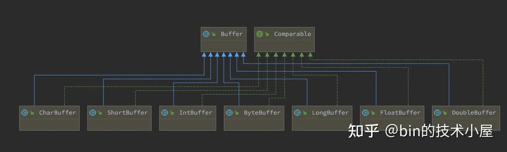

image.png

而 Buffer 本质上其实是 JDK 对 OS 中某一段内存在 Java 语言层面上的封装，当然了，这里的内存指的是 [虚拟内存](https://zhida.zhihu.com/search?content_id=240973082&content_type=Article&match_order=1&q=%E8%99%9A%E6%8B%9F%E5%86%85%E5%AD%98&zhida_source=entity) ，我们需要从之前文章中的内核空间视角切换到用户空间上来， **所以本文提到的内存如无特殊说明均是指虚拟内存** 。

JVM 在操作系统的视角来看其实就是一个普通的进程，而进程的虚拟内存空间我们通过前面 [Linux 内存管理系列文章](https://link.zhihu.com/?target=https%3A//mp.weixin.qq.com/mp/appmsgalbum%3F__biz%3DMzg2MzU3Mjc3Ng%3D%3D%26action%3Dgetalbum%26album_id%3D2559805446807928833%26scene%3D173%26from_msgid%3D%26from_itemidx%3D%26count%3D3%26nolastread%3D1%26scene%3D21%23wechat_redirect) 的洗礼，可以说是非常熟悉了。内核会根据进程在运行期间所需数据的功能特性不同，而为每一类数据专门开辟出一段虚拟内存区域出来。比如：

- 用于存放进程程序 [二进制文件](https://zhida.zhihu.com/search?content_id=240973082&content_type=Article&match_order=1&q=%E4%BA%8C%E8%BF%9B%E5%88%B6%E6%96%87%E4%BB%B6&zhida_source=entity) 中的机器指令以及只读常量的代码段
- 用于存放程序二进制文件中定义的 [全局变量](https://zhida.zhihu.com/search?content_id=240973082&content_type=Article&match_order=1&q=%E5%85%A8%E5%B1%80%E5%8F%98%E9%87%8F&zhida_source=entity) 和静态变量的数据段和 BSS 段。
- 用于在程序运行过程中动态申请内存的堆，这里指的是 OS 堆。
- 用于存放动态链接库以及 [内存映射](https://zhida.zhihu.com/search?content_id=240973082&content_type=Article&match_order=1&q=%E5%86%85%E5%AD%98%E6%98%A0%E5%B0%84&zhida_source=entity) 区域的 [文件映射](https://zhida.zhihu.com/search?content_id=240973082&content_type=Article&match_order=1&q=%E6%96%87%E4%BB%B6%E6%98%A0%E5%B0%84&zhida_source=entity) 与匿名映射区。
- 用于存放进程在函数调用过程中的局部变量和函数参数的栈。

而 JDK Buffer 也会根据其背后所依赖的虚拟内存在进程虚拟内存空间中具体所属的虚拟内存区域而演变出 [HeapByteBuffer](https://zhida.zhihu.com/search?content_id=240973082&content_type=Article&match_order=1&q=HeapByteBuffer&zhida_source=entity), MappedByteBuffer, [DirectByteBuffer](https://zhida.zhihu.com/search?content_id=240973082&content_type=Article&match_order=1&q=DirectByteBuffer&zhida_source=entity) 。这三种不同类型 ByteBuffer 的本质区别就是其背后依赖的虚拟内存在 JVM 进程虚拟内存空间中的布局位置不同。

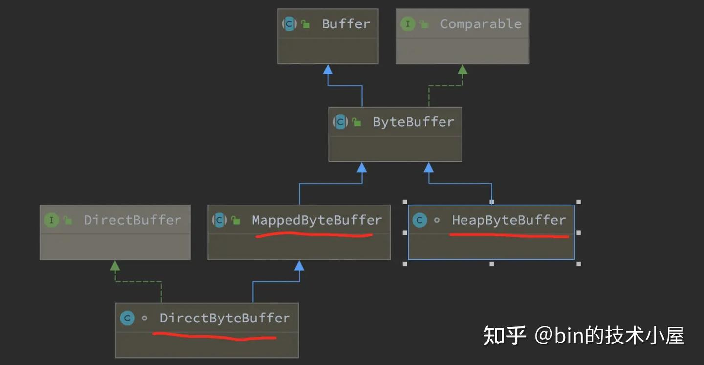

image.png

如下图所示，HeapByteBuffer 底层依赖的 [字节数组](https://zhida.zhihu.com/search?content_id=240973082&content_type=Article&match_order=1&q=%E5%AD%97%E8%8A%82%E6%95%B0%E7%BB%84&zhida_source=entity) 背后的内存位于 JVM 堆中：

```
public abstract class ByteBuffer extends Buffer implements Comparable<ByteBuffer> {
    // 所属内存位于 JVM 堆中
    final byte[] hb;
}
```

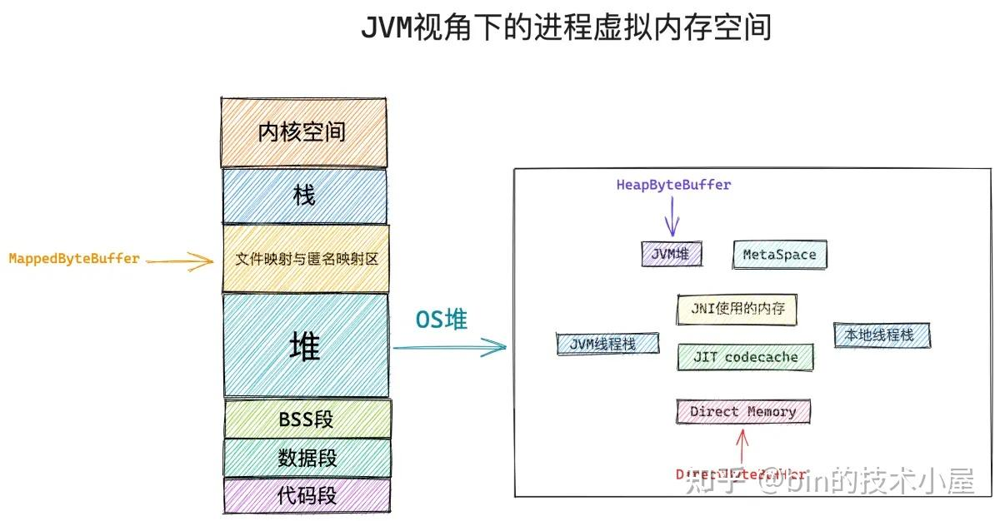

image.png

位于 JVM 堆之外的内存其实都可以归属到 DirectByteBuffer 的范畴中。比如，位于 OS 堆之内，JVM 堆之外的 [MetaSpace](https://zhida.zhihu.com/search?content_id=240973082&content_type=Article&match_order=1&q=MetaSpace&zhida_source=entity) ，即时编译(JIT) 之后的 [codecache](https://zhida.zhihu.com/search?content_id=240973082&content_type=Article&match_order=1&q=codecache&zhida_source=entity) ，JVM [线程栈](https://zhida.zhihu.com/search?content_id=240973082&content_type=Article&match_order=1&q=%E7%BA%BF%E7%A8%8B%E6%A0%88&zhida_source=entity) ，Native 线程栈，JNI 相关的内存，等等。

JVM 在 OS 堆中划分出的 Direct Memory （上图红色部分）特指受到参数 `-XX:MaxDirectMemorySize` 限制的直接内存区域，比如通过 `ByteBuffer#allocateDirect` 申请到的 Direct Memory 容量就会受到该参数的限制。

```
public abstract class ByteBuffer extends Buffer implements Comparable<ByteBuffer> {

   public static ByteBuffer allocateDirect(int capacity) {
        return new DirectByteBuffer(capacity);
    }
}
```

而通过 `Unsafe#allocateMemory` 申请到的 Direct Memory 容量则不会受任何 JVM 参数的限制，只会受操作系统本身对进程所使用内存容量的限制。也就是说 Unsafe 类会脱离 JVM 直接向操作系统进行内存申请。

```
public final class Unsafe {

    public long allocateMemory(long bytes) {
        return theInternalUnsafe.allocateMemory(bytes);
    }
}
```

MappedByteBuffer 背后所占用的内存位于 JVM 进程虚拟内存空间中的文件映射与匿名映射区中， [系统调用](https://zhida.zhihu.com/search?content_id=240973082&content_type=Article&match_order=1&q=%E7%B3%BB%E7%BB%9F%E8%B0%83%E7%94%A8&zhida_source=entity) mmap 映射出来的内存就是在这个区域中划分的。

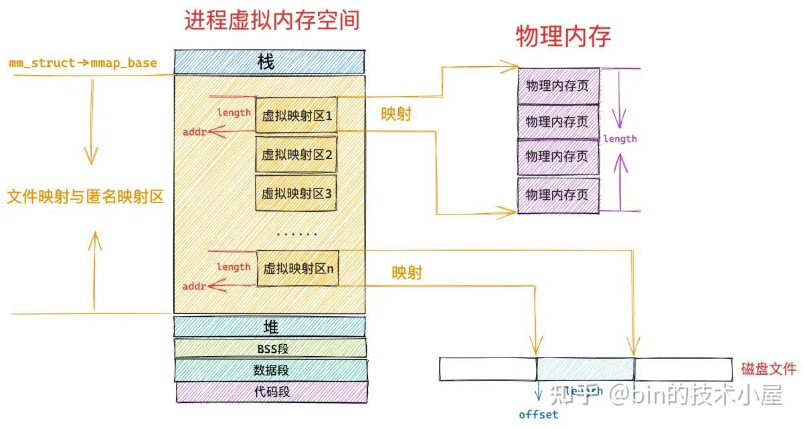

image.png

mmap 有两种映射方式，一种是匿名映射，常用于进程动态的向 OS 申请内存，比如，glibc 库里提供的用于动态申请内存的 malloc 函数，当申请的内存大于 128K 的时候，malloc 就会调用 mmap 采用匿名映射的方式来申请。

另一种就是文件映射，用于将磁盘文件中的某段区域与进程虚拟内存空间中文件映射与匿名映射区里的某段虚拟内存区域进行关联映射。后续我们针对这段 [映射内存](https://zhida.zhihu.com/search?content_id=240973082&content_type=Article&match_order=1&q=%E6%98%A0%E5%B0%84%E5%86%85%E5%AD%98&zhida_source=entity) 的读写就相当于是对磁盘文件的读写了，整个读写过程没有数据的拷贝，也没有切态的发生（这里特指在完成缺页处理之后）。

JDK 仅仅只是对 mmap 文件映射方式进行了封装，所以 MappedByteBuffer 的本质其实是对文件映射与匿名映射区中某一段 [虚拟映射](https://zhida.zhihu.com/search?content_id=240973082&content_type=Article&match_order=1&q=%E8%99%9A%E6%8B%9F%E6%98%A0%E5%B0%84&zhida_source=entity) 区域在 JVM 层面上的描述。这段虚拟映射区的起始内存地址 addr 以及映射长度 length 被封装在 MappedByteBuffer 中的 address ， capacity 属性中：

```
public abstract class Buffer {
    // 虚拟映射区域的起始地址
    long address;
    // 映射长度
    private int capacity;
}
```

好了，现在我们已经从总体上清楚了 JDK Buffer 体系在 JVM 进程虚拟内存空间中的布局情况，下面我们正式开始本文的主题，笔者会从 OS 内核，JVM ，中间件应用，这三个视角带大家深入拆解一下 MappedByteBuffer。

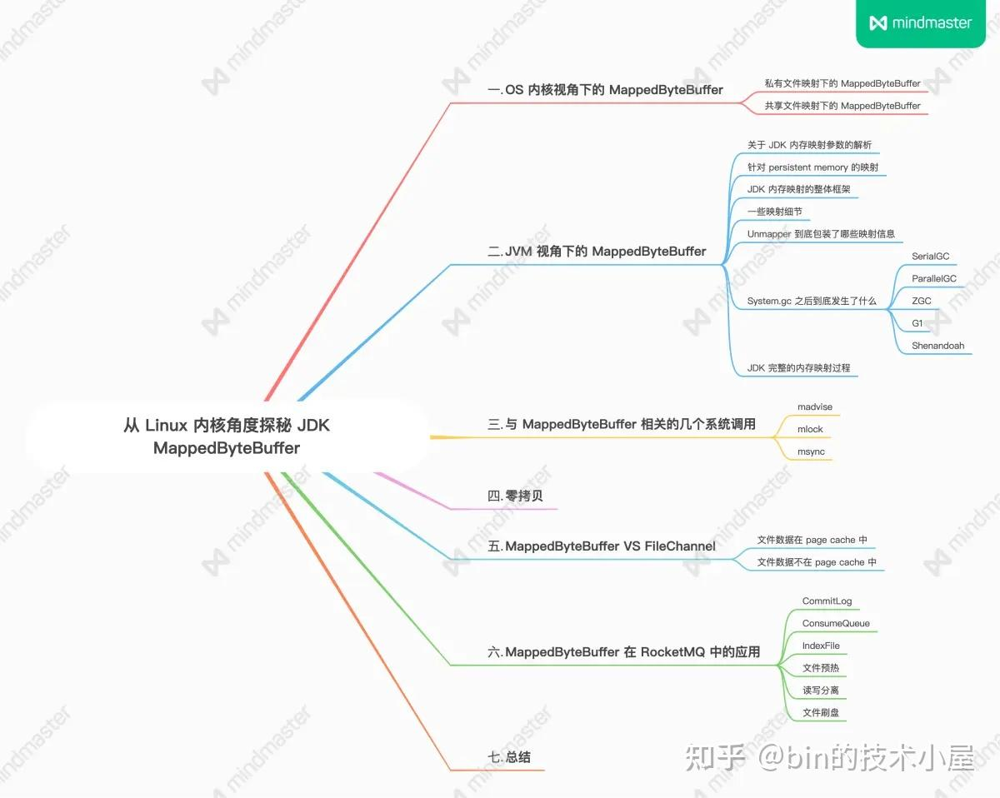

本文概要.png

## 1\. OS 内核视角下的 MappedByteBuffer

我们先从与 MappedByteBuffer 紧密相关的底层系统调用 mmap 开始切入 OS 内核的视角：

```
#include <sys/mman.h>
void* mmap(void* addr, size_t length, int prot, int flags, int fd, off_t offset);
```

mmap 的主要任务就是在文件映射与匿名映射区中为本次映射划分出一段 [虚拟内存区域](https://zhida.zhihu.com/search?content_id=240973082&content_type=Article&match_order=4&q=%E8%99%9A%E6%8B%9F%E5%86%85%E5%AD%98%E5%8C%BA%E5%9F%9F&zhida_source=entity) 出来，然后 JVM 将这段划分出来的虚拟内存区域在 Java 语言层面包装成 MappedByteBuffer 供程序员来使用。

那么内核该从文件映射与匿名映射区的哪个位置开始，以及划分多大的虚拟映射区呢 ？这就用到了 mmap 系统调用参数 addr 和 length。length 参数用于指定我们需要映射的虚拟内存区域大小。

如果我们指定了 addr，表示我们希望内核从这个地址开始划分虚拟映射区，但是这个参数只是给内核的一个暗示，内核并非一定得从我们指定的 addr 处划分虚拟内存区域。

内核在文件映射与匿名映射区中划分虚拟内存区域的时候会优先考虑我们指定的 addr，如果这个虚拟地址已经被使用或者是一个无效的地址，那么内核则会自动选取一个合适的虚拟内存地址开始映射。

如果我们需要强制内核从 addr 指定的虚拟内存地址处开始映射的话，就需要在 flags 参数中指定 `MAP_FIXED` 标志，这样一来无论这段虚拟内存区域 \[addr, addr + length\] 是否已经存在映射关系，内核都会强行进行映射，如果这块区域已经存在 [映射关系](https://zhida.zhihu.com/search?content_id=240973082&content_type=Article&match_order=2&q=%E6%98%A0%E5%B0%84%E5%85%B3%E7%B3%BB&zhida_source=entity) ，那么后续内核会把旧的映射关系覆盖掉。

```
unsigned long
arch_get_unmapped_area(struct file *filp, unsigned long addr,
        unsigned long len, unsigned long pgoff, unsigned long flags)
{
    if (flags & MAP_FIXED)
        return addr;
}
```

我们一般会将 addr 设置为 NULL，意思就是完全交由内核来帮我们决定虚拟映射区的起始地址。

通过 mmap 映射出来的这段虚拟内存区域相关访问权限由参数 prot 进行指定：

```
#define PROT_READ 0x1  /* page can be read */
#define PROT_WRITE 0x2  /* page can be written */
#define PROT_EXEC 0x4  /* page can be executed */
#define PROT_NONE 0x0  /* page can not be accessed */
```

PROT_READ 表示可读权限，PROT_WRITE 表示可写权限，PROT_EXEC 表示执行权限。PROT_NONE 表示这段虚拟内存区域是不能被访问的，既不可读写，也不可执行。

PROT_NONE 常用于中间件预先向操作系统一次性申请一批内存作为预留内存（reserve_memory），当用户使用的时候， [中间件](https://zhida.zhihu.com/search?content_id=240973082&content_type=Article&match_order=3&q=%E4%B8%AD%E9%97%B4%E4%BB%B6&zhida_source=entity) 再从这些预留内存中一点一点的分配。

比如，JVM 堆以及 MetaSpace 等 JVM 中的内存区域，JVM 在一开始的时候就会根据 `-Xmx`,`-XX:MaxMetaspaceSize` 指定的大小预先向操作系统申请一批内存作为 reserve_memory。这部分 reserve_memory 的权限就是 `PROT_NONE` ，是不可访问的。用于首先确定 JVM 堆和 MetaSpace 这些内存区域的地址范围（首先划分势力范围）。

```
// 文件：/hotspot/os/linux/os_linux.cpp
char* os::pd_reserve_memory(size_t bytes, bool exec) {
  return anon_mmap(NULL, bytes);
}

static char* anon_mmap(char* requested_addr, size_t bytes) {

  const int flags = MAP_PRIVATE | MAP_NORESERVE | MAP_ANONYMOUS;
  char* addr = (char*)::mmap(requested_addr, bytes, PROT_NONE, flags, -1, 0);
  return addr == MAP_FAILED ? NULL : addr;
}
```

这样一来，后续我们根据一个虚拟内存地址就可以定位到该内存地址究竟是属于 JVM 中哪一个内存区域，方便后续做近一步的处理。

当 JVM 真正需要内存的时候，就会从这部分 reserve_memory 中划分出一部分（commit_memory）来使用 —— JVM 通过 mmap 重新映射 commit_memory 大小的虚拟内存出来。

JVM 在调用 mmap 重新映射的时候，flags 参数指定了 `MAP_FIXED ` 标志，强制内核从之前的 reserve_memory 中重新映射。参数 prot 重新指定了 `PROT_READ | PROT_WRITE` 权限。

```
// 文件：/hotspot/os/linux/os_linux.cpp
bool os::pd_commit_memory(char* addr, size_t size, bool exec) {
  return os::Linux::commit_memory_impl(addr, size, exec) == 0;
}

int os::Linux::commit_memory_impl(char* addr, size_t size, bool exec) {
  int prot = exec ? PROT_READ|PROT_WRITE|PROT_EXEC : PROT_READ|PROT_WRITE;
  uintptr_t res = (uintptr_t) ::mmap(addr, size, prot,
                                     MAP_PRIVATE|MAP_FIXED|MAP_ANONYMOUS, -1, 0);
}
```

mmap 系统调用的映射方式由 flags 参数决定：

```
#define MAP_FIXED   0x10        /* Interpret addr exactly */
#define MAP_ANONYMOUS   0x20        /* don't use a file */

#define MAP_SHARED  0x01        /* Share changes */
#define MAP_PRIVATE 0x02        /* Changes are private */
```

MAP_ANONYMOUS 表示进行的是匿名映射，常用于向 OS 申请内存，比如上面的 JVM 源码，通过 mmap 系统调用申请内存的时候，flags 参数就指定了 MAP_ANONYMOUS 标志。

MAP_SHARED 表示共享映射，通过 mmap 映射出的这片内存区域（MappedByteBuffer）在多进程之间是共享的，一个进程修改了共享映射的内存区域，其他进程是可以看到的，用于多进程之间的通信。

MAP_PRIVATE 表示私有映射，通过 mmap 映射出的这片内存区域（MappedByteBuffer）是进程私有的，其他进程是看不到的。如果是私有文件映射，那么多进程针对同一映射文件的修改将不会回写到磁盘文件上。

如果我们想要通过 mmap 将文件映射到内存中，就需要指定参数 fd 以及 offset。fd 就是映射文件在 JVM 进程中的 file descriptor ，offset 表示我们要从文件中的哪个位置偏移处开始映射文件内容。

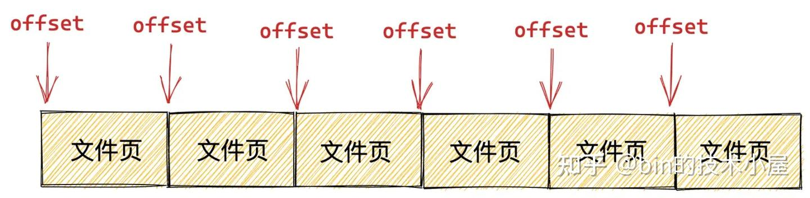

image.png

由于 JDK 只对用户开放了文件映射的方式，所以本小节的 OS 视角我们也只是聚焦在文件映射在内核的实现部分。

文件映射有私有文件映射和共享文件映射之分，我们在使用 mmap 系统调用的时候，通过将参数 flags 设置为 MAP_PRIVATE，然后指定参数 fd 为映射文件的 file descriptor 来实现对文件的私有映射。通过将参数 flags 设置为 MAP_SHARED 来实现对文件的共享映射。

无论是私有映射的方式还是共享映射的方式，内核在对文件进行内存映射之前，都需要通过 `get_unmapped_area` 函数在 JVM 进程虚拟内存空间中的文件映射与匿名映射区里寻找一段还没有被映射过的空闲虚拟内存区域。

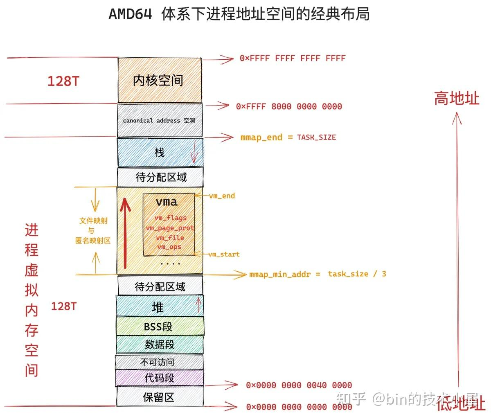

image.png

在拿到这段空闲的虚拟内存区域之后，通过 `mmap_region` 函数将文件映射到这块虚拟内存区域中来。

```
unsigned long do_mmap(struct file *file, unsigned long addr,
            unsigned long len, unsigned long prot,
            unsigned long flags, vm_flags_t vm_flags,
            unsigned long pgoff, unsigned long *populate,
            struct list_head *uf)
{

    // 首先在进程虚拟内存空间中的文件映射与匿名映射区中寻找一段还没有被映射过的空闲虚拟内存区域
    addr = get_unmapped_area(file, addr, len, pgoff, flags);

    // 将这段空闲虚拟内存区域与文件进行映射
    addr = mmap_region(file, addr, len, vm_flags, pgoff, uf);
}
```

这段被内核拿来用作文件映射的虚拟内存区域在 Java 层面的表现形式就是 JDK 中的 MappedByteBuffer，在 OS 内核中的表现形式是 vm_area_struct。

```
struct vm_area_struct {
   // MappedByteBuffer 在内核中的起始内存地址
   unsigned long vm_start;  /* Our start address within vm_mm. */
   // MappedByteBuffer 在内核中的结束内存地址
   unsigned long vm_end;  /* The first byte after our end address
        within vm_mm. */
   /*
    *  Access permissions of this VMA
    *  MappedByteBuffer 相关的操作权限（内核角度）
    *  通过 mmap 参数 prot 传递
   */
   pgprot_t vm_page_prot;
   // 相关映射方式，通过 mmap 参数 flags 传递
   unsigned long vm_flags;
   // 映射文件
   struct file * vm_file;  /* File we map to (can be NULL). */
   // 需要映射的文件内容在磁盘文件中的偏移
   unsigned long vm_pgoff;  /* Offset (within vm_file) in PAGE_SIZE
        units */

   /* Function pointers to deal with this struct. */
   // 内核层面针对这片虚拟内存区域 MappedByteBuffer 的相关操作函数
   const struct vm_operations_struct *vm_ops;
}
```

在 mmap_region 函数的开始，内核需要为这段虚拟内存区域分配 vma 结构，类比我们在 Java 语言层面创建一个 MappedByteBuffer 。随后会并根据具体的文件映射方式对 vma 结构相关的属性进行初始化，最后将这个 vma 结构通过 `vma_link ` 插入到进程的虚拟内存空间中。这样一来，我们在 Java 应用层面就拿到了一个完整的 MappedByteBuffer。

```
unsigned long mmap_region(struct file *file, unsigned long addr,
        unsigned long len, vm_flags_t vm_flags, unsigned long pgoff,
        struct list_head *uf)
{
    // 从 slab 内存池中申请一个新的 vma 结构
    vma = vm_area_alloc(mm);
    // 根据我们要映射的虚拟内存区域属性初始化 vma 结构中的相关属性
    vma->vm_start = addr;
    vma->vm_end = addr + len;
    vma->vm_flags = vm_flags;
    vma->vm_page_prot = vm_get_page_prot(vm_flags);
    vma->vm_pgoff = pgoff;

    // 针对文件映射的处理
    if (file) {
        // 将文件与虚拟内存 MappedByteBuffer 映射起来
        vma->vm_file = get_file(file);
        // 这一步中将虚拟内存区域 vma 的操作函数 vm_ops 映射成文件的操作函数（和具体文件系统有关）
        // ext4 文件系统中的操作函数为 ext4_file_vm_ops
        // 从这一刻开始，读写内存就和读写文件是一样的了
        error = call_mmap(file, vma);
    }

    // 将 vma 结构插入到当前 JVM 进程的地址空间中
    vma_link(mm, vma, prev, rb_link, rb_parent);
}
```

内存文件映射最关键的部分是下面两行内核代码：

```
vma->vm_file = get_file(file);
error = call_mmap(file, vma);
```

内核层面的 vm_area_struct（ vma ）对应于 Java 层面的 MappedByteBuffer，内核层面的 file 对应于 Java 层面的 FileChannel。

struct file 结构是内核用来描述被进程打开的磁盘文件的，它和进程是强相关的（ fd 的 [作用域](https://zhida.zhihu.com/search?content_id=240973082&content_type=Article&match_order=1&q=%E4%BD%9C%E7%94%A8%E5%9F%9F&zhida_source=entity) 也是和进程相关的），即使多个进程打开同一个文件，那么内核会为每一个进程创建一个 struct file 结构。struct file 中指向了一个非常重要的结构 —— struct inode。

```
struct file {
 struct inode  *f_inode;
}
```

每一个磁盘上的文件在内核中都会有一个唯一的 struct inode 结构，inode 结构和进程是没有关系的，一个文件在内核中只对应一个 inode，inode 结构用于描述文件的元信息，比如，文件的权限，文件中包含多少个磁盘块，每个磁盘块位于磁盘中的什么位置等等。

```
// ext4 文件系统中的 inode 结构
struct ext4_inode {
   // 文件权限
  __le16  i_mode;    /* File mode */
  // 文件包含磁盘块的个数
  __le32  i_blocks_lo;  /* Blocks count */
  // 存放文件包含的磁盘块
  __le32  i_block[EXT4_N_BLOCKS];/* Pointers to blocks */
};
```

在文件系统中，Linux 是按照磁盘块为单位对磁盘中的数据进行管理的，磁盘块的大小为 4K。找到了文件中的磁盘块，我们就可以寻址到文件在磁盘上的存储内容了。

内核通过将 `vma->vm_file` 与映射文件进行关联之后，就可以通过 `vm_file->f_inode` 找到映射文件的 struct inode 结构，近而找到到映射文件在磁盘中的磁盘块 i_block。这样一来，虚拟内存就与底层文件系统中的磁盘块发生了关联，这也是 mmap 内存文件映射的本质所在。

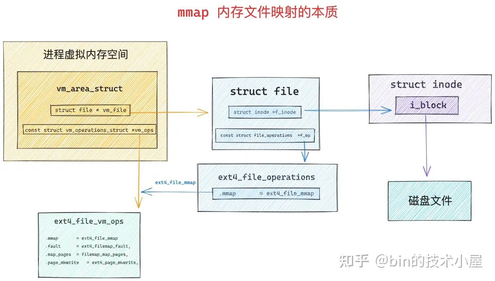

image.png

当虚拟内存与映射文件发生关联之后，内核会通过 call_mmap 函数，将虚拟内存 vm_area_struct 的相关操作函数 `vma->vm_ops` 映射成文件相关的操作函数（和底层文件系统的实现相关）—— `ext4_file_vm_ops` 。这样一来，进程后续对这段虚拟内存的读写就相当于是读写映射文件了。

```
static int ext4_file_mmap(struct file *file, struct vm_area_struct *vma)
{
      vma->vm_ops = &ext4_file_vm_ops;
}
```

到这里，mmap 系统调用的整个映射过程就结束了，从上面的内核处理过程中我们可以看到，当我们调用 mmap 之后，OS 内核只是会为我们分配一段虚拟内存，然后将虚拟内存与磁盘文件进行映射，整个过程都只是在和虚拟内存打交道，并未出现任何物理内存的身影。而这段虚拟内存在 Java 层面就是 MappedByteBuffer。

### 1.1 私有文件映射下的 MappedByteBuffer

下图展示的是当多个 JVM 进程通过 mmap 对同一个磁盘文件上的同一段文件区域进行内存映射之后，OS 内核中的内存文件映射结构图，我们先以私有文件映射进行说明：

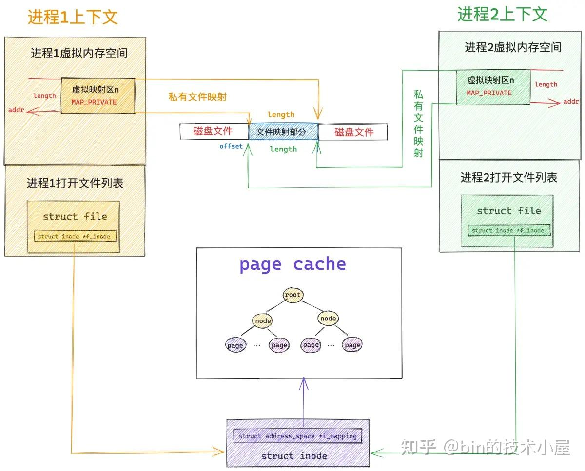

image.png

由于现在我们只是刚刚完成了文件映射，仅仅只是在 JVM 层面得到了一个 MappedByteBuffer，这个 MappedByteBuffer 背后所依赖的虚拟内存就是我们通过 mmap 映射出来的。

此时我们还未对文件进行读写操作，所以该映射文件对应的 page cache 里还是空，没有任何文件页（用于存储文件数据的物理内存页）。而虚拟内存（MappedByteBuffer）与物理内存之间的关联是通过进程页表来完成的，由于此时内核还未对 MappedByteBuffer 分配物理内存，所以 MappedByteBuffer 在 JVM 进程页表中对应的页表项 PTE 还是空的。

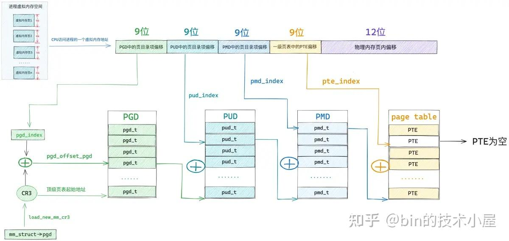

image.png

当我们开始访问这段 MappedByteBuffer 的时候， CPU 会将 MappedByteBuffer 背后的虚拟内存地址送到 MMU 地址翻译单元中进行地址翻译查找其背后的物理内存地址。

如果 MMU 发现 MappedByteBuffer 在 JVM 进程页表中对应的页表项 PTE 还是空的，这说明 MappedByteBuffer 是刚刚被 mmap 系统调用映射出来的，还没有分配物理内存。

于是 MMU 就会产生缺页中断，随后 JVM 进程切入到内核态，进行缺页处理，为 MappedByteBuffer 分配物理内存。

```
static vm_fault_t handle_pte_fault(struct vm_fault *vmf)
{
    // pte 是空的，表示 MappedByteBuffer 背后还从来没有映射过物理内存，接下来就要处理物理内存的映射
    if (!vmf->pte) {
        // 判断缺页的虚拟内存地址 address 所在的虚拟内存区域 vma 是否是匿名映射区
        if (vma_is_anonymous(vmf->vma))
            // 处理匿名映射区发生的缺页
            return do_anonymous_page(vmf);
        else
            // 处理文件映射区发生的缺页，JDK 的 MappedByteBuffer 属于文件映射区
            return do_fault(vmf);
    }
}
```

内核在 do_fault 函数中处理 MappedByteBuffer 缺页的时候，首先会调用 find_get_page 从映射文件的 page cache 中尝试获取文件页，前面已经说了，当 MappedByteBuffer 刚刚被映射出来的时候，映射文件的 page cache 还是空的，没有缓存任何文件页，需要映射到内存的文件内容此时还静静地躺在磁盘上。

当文件页不在 page cache 中，内核则会调用 do_sync_mmap_readahead 来同步预读，这里首先会分配一个物理内存页出来，然后将新分配的内存页加入到 page cache 中，并增加页 [引用计数](https://zhida.zhihu.com/search?content_id=240973082&content_type=Article&match_order=1&q=%E5%BC%95%E7%94%A8%E8%AE%A1%E6%95%B0&zhida_source=entity) 。

如果文件页已经缓存在 page cache 中了，则调用 do_async_mmap_readahead 启动异步预读机制，将相邻的若干文件页一起预读进 page cache 中。

随后会通过 address_space_operations （page cache 相关的操作函数集合）中定义的 readpage 激活 [块设备](https://zhida.zhihu.com/search?content_id=240973082&content_type=Article&match_order=1&q=%E5%9D%97%E8%AE%BE%E5%A4%87&zhida_source=entity) 驱动从磁盘中读取映射的文件内容并填充到 page cache 里的文件页中。

```
vm_fault_t filemap_fault(struct vm_fault *vmf)
{
    // 获取映射文件
    struct file *file = vmf->vma->vm_file;
    // 获取 page cache
    struct address_space *mapping = file->f_mapping;
    // 获取映射文件的 inode
    struct inode *inode = mapping->host;
    // 获取映射文件内容在文件中的偏移
    pgoff_t offset = vmf->pgoff;
    // 从 page cache 读取到的文件页，存放在 vmf->page 中返回
    struct page *page;

    // 根据文件偏移 offset，到 page cache 中查找对应的文件页
    page = find_get_page(mapping, offset);
    if (likely(page) && !(vmf->flags & FAULT_FLAG_TRIED)) {
        // 如果文件页在 page cache 中，则启动异步预读，预读后面的若干文件页到 page cache 中
        fpin = do_async_mmap_readahead(vmf, page);
    } else if (!page) {
        // 如果文件页不在 page cache，那么就需要启动 io 从文件中读取内容到 page cache
        // 启动同步预读，将所需的文件数据读取进 page cache 中并同步预读若干相邻的文件数据到 page cache
        fpin = do_sync_mmap_readahead(vmf);
retry_find:
        // 尝试到 page cache 中重新读取文件页，这一次就可以读到了
        page = pagecache_get_page(mapping, offset,
                      FGP_CREAT|FGP_FOR_MMAP,
                      vmf->gfp_mask);
        }
    }

    ..... 省略 ......
}
EXPORT_SYMBOL(filemap_fault);
```

经过 filemap_fault 函数的处理，此时 MappedByteBuffer 背后所映射的文件内容已经加载到 page cache 中了。

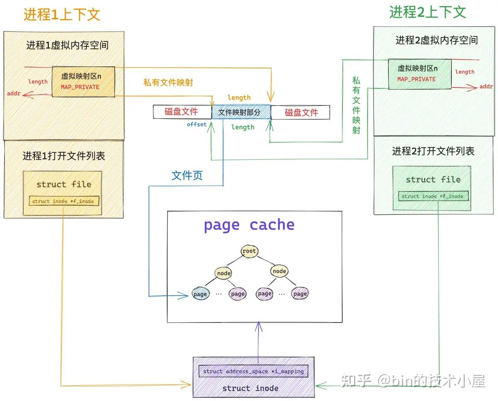

image.png

虽然现在 MappedByteBuffer 背后所需要的文件页已经加载到内存中了，但是还没有和 MappedByteBuffer 这段虚拟内存发生关联，缺页处理的最后一步就是通过 JVM 进程页表将 MappedByteBuffer（虚拟内存）与刚刚加载进来的文件页（物理内存）关联映射起来。

既然现在 MappedByteBuffer 在 JVM 进程页表中对应的 pte 是空的，内核就通过 mk_pte 创建一个 pte 出来，并将刚加载进来的文件页的物理内存地址，以及 MappedByteBuffer 相关的操作权限 vm_page_prot，设置到 pte 中。

随后通过 set_pte_at 函数将新初始化的这个 pte 塞到 JVM 页表中。但是这里要注意的是，这里的 MappedByteBuffer 是 mmap 私有映射出来的，所以这个 pte 是只读的。

```
vm_fault_t alloc_set_pte(struct vm_fault *vmf, struct mem_cgroup *memcg,
        struct page *page)
{
    // 根据之前分配出来的内存页 pfn 以及相关页属性 vma->vm_page_prot 构造一个 pte 出来
    // 对于私有文件映射来说，这里的 pte 是只读的
    entry = mk_pte(page, vma->vm_page_prot);
    // 将构造出来的 pte （entry）赋值给 MappedByteBuffer 在页表中真正对应的 vmf->pte
    // 现在进程页表体系就全部被构建出来了，文件页缺页处理到此结束
    set_pte_at(vma->vm_mm, vmf->address, vmf->pte, entry);
    // 刷新 mmu
    update_mmu_cache(vma, vmf->address, vmf->pte);
    return 0;
}
```

经过这一轮的处理，MappedByteBuffer 与文件页就发生了关联，并且映射的文件内容也已经加载到文件页中了。

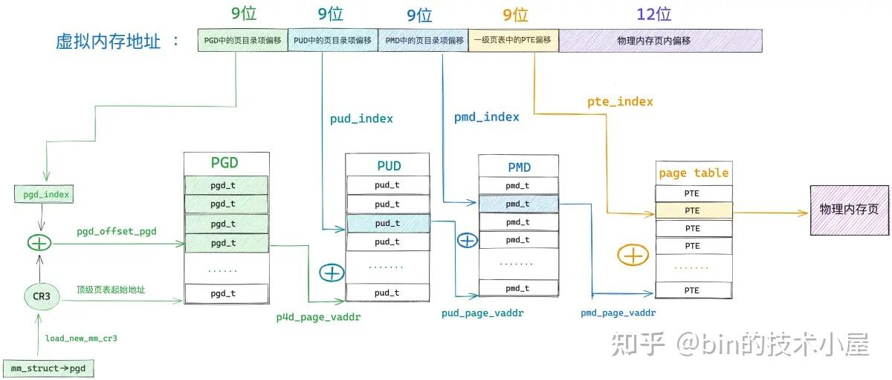

image.png

后续 JVM 进程在访问这段 MappedByteBuffer 的时候就相当于是直接访问映射文件的 page cache。整个过程是在用户态进行，不需要切态。

假设现在系统中有两个 JVM 进程同时通过 mmap 对同一个磁盘文件上的同一段文件区域进行私有内存映射，那么这两个 JVM 进程就会在各自的内存空间中获取到一段属于各自的 MappedByteBuffer（进程的虚拟内存空间是相互隔离的）。

现在第一个 JVM 进程已经访问过它的 MappedByteBuffer 了，并且已经完成了缺页处理，但是第二个 JVM 进程还没有访问过它的 MappedByteBuffer，所以 JVM 进程2 页表中相应的 pte 还是空的，它访问这段 MappedByteBuffer 的时候仍然会产生缺页中断。

但是 进程2 的缺页处理就很简单了，因为前面 进程1 已经通过缺页中断将映射的文件内容加载到 page cache 中了，所以 进程2 进入到内核中一下就在 page cache 中找到它所需要的文件页了，与属于它的 MappedByteBuffer 通过页表关联一下就可以了。同样是因为采用私有文件映射的原因，进程 2 的这个页表项 pte 也是只读的。

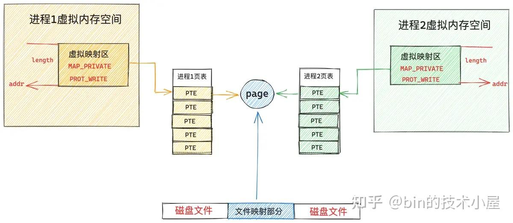

image.png

现在 进程1 和 进程2 各自的 MappedByteBuffer 都已经通过各自的页表直接映射到映射文件的 page cache 中了，后续 进程1 和 进程2 对各自的 MappedByteBuffer 进行读取的时候就相当于是直接读取 page cache, 整个过程都发生在用户态，不需要切态，更不需要拷贝。

由于私有文件映射的特点，进程1 和 进程2 各自通过 MappedByteBuffer 对文件的修改是不会回写到磁盘上的，所以现在 进程1 和 进程2 各自页表中对应的 pte 是只读的。

因为现在 MappedByteBuffer 背后直接映射的是 page cache，如果 pte 是可写的话，进程此时对 MappedByteBuffer 的写入操作就会直接反映到 page cache 上，而内核则会定期将 page cache 中的脏页回写到磁盘上，这样一来就违背了私有文件映射的特点了。

所以当这两个 JVM 进程试图对各自的 MappedByteBuffer 进行写入操作时，MMU 会发现 MappedByteBuffer 在进程页表中对应的 pte 是只读的，于是产生写保护类型的缺页中断。

当 JVM 进程进入内核开始缺页处理的时候，内核会发现 MappedByteBuffer 在内核中的权限 —— vma->vm_page_prot 是可写的，但 pte 是只读的，于是开始进行写时复制 —— Copy On Write ，COW 的过程会在 do_wp_page 函数中进行。

```
static vm_fault_t handle_pte_fault(struct vm_fault *vmf)
{
    // 判断本次缺页是否为写时复制引起的
    if (vmf->flags & FAULT_FLAG_WRITE) {
        // 这里说明 vma 是可写的，但是 pte 被标记为不可写，说明是写保护类型的中断
        if (!pte_write(entry))
            // 进行写时复制处理，cow 就发生在这里
            return do_wp_page(vmf);
    }
}
```

内核在写时复制的时候首先为缺页进程分配一个新的物理内存页 new_page，然后调用 cow_user_page 将 MappedByteBuffer 背后映射的文件页中的内容全部拷贝到新内存页中。

随后通过 mk_pte 创建一个新的临时页表项 entry，利用新的内存页以及之前映射的 MappedByteBuffer 操作权限 —— vma->vm_page_prot 初始化这个临时页表项 entry，让 entry 指向新的内存页，并将 entry 标记为可写。

最后通过 set_pte_at_notify 将 entry 值设置到 MappedByteBuffer 在页表中对应的 pte 中。这样一来，原来的 pte 就由只读变成可写了，而且重新映射到了新分配的内存页上。

```
static vm_fault_t wp_page_copy(struct vm_fault *vmf)
{
    // MappedByteBuffer 在内核中的表现形式
    struct vm_area_struct *vma = vmf->vma;
    // 当前进程地址空间
    struct mm_struct *mm = vma->vm_mm;
    // MappedByteBuffer 当前映射在 page cache 中的文件页
    struct page *old_page = vmf->page;
    // 用于写时复制的新内存页
    struct page *new_page = NULL;

    // 新申请一个物理内存页，用于写时复制
    new_page = alloc_page_vma(GFP_HIGHUSER_MOVABLE, vma,
                vmf->address);
    if (!new_page)
        goto oom;
    // 将原来内存页 old page 中的内容拷贝到新内存页 new page 中
    cow_user_page(new_page, old_page, vmf->address, vma);

    // 创建一个临时的 pte 映射到新内存页 new page 上
    entry = mk_pte(new_page, vma->vm_page_prot);
    // 设置 entry 为可写的，正是这里, pte 的权限由只读变为了可写
    entry = maybe_mkwrite(pte_mkdirty(entry), vma);
    // 将 entry 值重新设置到子进程页表 pte 中
    set_pte_at_notify(mm, vmf->address, vmf->pte, entry);
    // 更新 mmu
    update_mmu_cache(vma, vmf->address, vmf->pte);
}
```

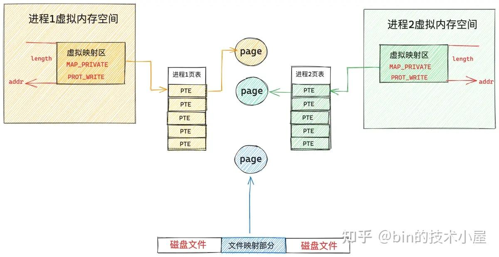

image.png

从此进程 1 和进程 2 各自的 MappedByteBuffer 就脱离了 page cache，重新映射到了各自专属的物理内存页上，这个新内存页中的内容和 page cache 中缓存的内容一模一样。

后续这两个 JVM 进程针对 MappedByteBuffer 的任何修改均只能发生在各自的专属物理内存页上，不会体现在 page cache 中，自然这些修改也不会同步到磁盘文件中了，而且各自的修改在进程之间是互不可见的。

### 1.2 共享文件映射下的 MappedByteBuffer

共享文件映射与私有文件映射的整个 mmap 映射过程其实是一样的，甚至在缺页处理的大致流程上也是一样的，都是首先要到 page cache 中查找是否有缓存相应的文件页（映射的磁盘块对应的文件页）。

如果文件页不在 page cache 中，内核则会在物理内存中分配一个内存页，然后将新分配的内存页加入到 page cache 中，随后启动磁盘 IO 将共享映射的文件内容 DMA 到新分配的这个内存页里

最后在缺页进程的页表中建立共享映射出来的 MappedByteBuffer 与 page cache 缓存的文件页之间的关联。


image.png

这里和私有文件映射不同的地方是，私有文件映射由于是私有的，所以在内核创建 PTE 的时候会将 PTE 设置为只读，目的是当进程写入的时候触发写保护类型的缺页中断进行写时复制 （copy on write）。

共享文件映射由于是共享的，PTE 被创建出来的时候就是可写的，后续进程在对 MappedByteBuffer 写入的时候不会触发缺页中断进行写时复制，而是直接写入 page cache 中，整个过程没有切态，没有数据拷贝。

所以对于共享文件映射来说，多进程读写都是共享的，由于多进程直接读写的是 page cache ，所以多进程对各自 MappedByteBuffer 的任何修改，最终都会通过内核回写线程 pdflush 刷新到磁盘文件中。

```
static vm_fault_t do_shared_fault(struct vm_fault *vmf)
{
    struct vm_area_struct *vma = vmf->vma;
    vm_fault_t ret, tmp;
    // 从 page cache 中读取文件页
    ret = __do_fault(vmf);

    if (vma->vm_ops->page_mkwrite) {
        unlock_page(vmf->page);
        // 将文件页变为可写状态，并为后续记录文件日志做一些准备工作
        tmp = do_page_mkwrite(vmf);
    }

    // 将文件页映射到 MappedByteBuffer 在页表中对应的 pte 上
    ret |= finish_fault(vmf);

    // 将 page 标记为脏页，记录相关文件系统的日志，防止数据丢失
    // 判断是否将脏页回写
    fault_dirty_shared_page(vma, vmf->page);
    return ret;
}
```

## 2\. JVM 视角下的 MappedByteBuffer

现在笔者已经从 OS 内核的视角将 MappedByteBuffer 最本质的内容给大家剖析完了，基于这个最底层的技术基座，我们把视角在往上移一移，看看 JVM 内部是如何把玩 MappedByteBuffer 的，无非就是对底层系统调用 mmap 的一层封装罢了。

OS 提供的 mmap 系统调用被 JVM 封装在 FileChannelImpl 实现类中的 native 方法 map0 中，在 map0 的底层 native 实现中会直接对 mmap 发起调用。

```
#include <sys/mman.h>
void* mmap(void* addr, size_t length, int prot, int flags, int fd, off_t offset);

public class FileChannelImpl extends FileChannel
{
    // Creates a new mapping
    private native long map0(int prot, long position, long length, boolean isSync)
        throws IOException;
}

// FileChannelImpl.c 中对 map0 的 native 实现
JNIEXPORT jlong JNICALL
Java_sun_nio_ch_FileChannelImpl_map0(JNIEnv *env, jobject this,
                                     jint prot, jlong off, jlong len, jboolean map_sync)
{
    mapAddress = mmap64(
        0,                    /* Let OS decide location */
        len,                  /* Number of bytes to map */
        protections,          /* File permissions */
        flags,                /* Changes are shared */
        fd,                   /* File descriptor of mapped file */
        off);                 /* Offset into file */

    return ((jlong) (unsigned long) mapAddress);
}
```

JDK 对用户提供的 mmap 接口封装在下面的 `FileChannel#map` 方法中，我们可以看到在调用参数的设置上与系统调用 mmap 是非常相似的，毕竟提供底层基座能力的是 mmap，JDK 的 `FileChannel#map` 只是提供了一层封装而已。

```
public abstract class FileChannel {

  public abstract MappedByteBuffer map(MapMode mode, long position, long size)
        throws IOException;
}
```

### 2.1 关于 JDK 内存映射参数的解析

FileChannel 中的参数 position 对应于 mmap 系统调用的参数 offset，表示我们要从文件中的哪个位置偏移处开始映射文件内容。

参数 size 对应于 mmap 中的 length ，用于指定我们需要映射的文件区域大小，也就是 MappedByteBuffer 的大小。

参数 MapMode 实际上是对 mmap 系统调用参数 prot 和 flags 的一层封装。

```
//A file-mapping mode.
    public static class MapMode {

        /**
         * Mode for a read-only mapping.
         */
        public static final MapMode READ_ONLY
            = new MapMode("READ_ONLY");

        /**
         * Mode for a read/write mapping.
         */
        public static final MapMode READ_WRITE
            = new MapMode("READ_WRITE");

        /**
         * Mode for a private (copy-on-write) mapping.
         */
        public static final MapMode PRIVATE
            = new MapMode("PRIVATE");
    }
```

`READ_ONLY ` 表示我们进行的是共享文件映射，不过映射出来的 MappedByteBuffer 是只读权限，JVM 在 native 实现中调用 mmap 的时候会将 prot 设置为 PROT_READ，将 flag 设置为 MAP_SHARED。

`READ_WRITE ` 也是进行共享文件映射，映射出来的 MappedByteBuffer 有读写权限，native 实现中会将 prot 设置为 `PROT_WRITE | PROT_READ` ，flag 仍然为 MAP_SHARED。

`PRIVATE ` 则表示进行的是私有文件映射，映射出来的 MappedByteBuffer 有读写权限，native 实现中将 flags 设置为 MAP_PRIVATE， prot 设置为 `PROT_WRITE | PROT_READ` 。

```
JNIEXPORT jlong JNICALL
Java_sun_nio_ch_FileChannelImpl_map0(JNIEnv *env, jobject this,
                                     jint prot, jlong off, jlong len, jboolean map_sync)
{
    if (prot == sun_nio_ch_FileChannelImpl_MAP_RO) { // READ_ONLY
        protections = PROT_READ;
        flags = MAP_SHARED;
    } else if (prot == sun_nio_ch_FileChannelImpl_MAP_RW) { // READ_WRITE
        protections = PROT_WRITE | PROT_READ;
        flags = MAP_SHARED;
    } else if (prot == sun_nio_ch_FileChannelImpl_MAP_PV) { // PRIVATE
        protections =  PROT_WRITE | PROT_READ;
        flags = MAP_PRIVATE;
    }

    ....... 省略 ........
}
```

除了以上几种常见的映射方式之外，在 JDK14 中又额外扩展了两种新的映射方式，分别为：READ_ONLY_SYNC 和 READ_WRITE_SYNC。

```
public class ExtendedMapMode {

    public static final MapMode READ_ONLY_SYNC = newMapMode("READ_ONLY_SYNC");

    public static final MapMode READ_WRITE_SYNC = newMapMode("READ_WRITE_SYNC");
}
```

我们注意到这两种新的映射方式在命名上只是比之前的映射方式多了一个 `_SYNC` 后缀。当 MapMode 设置了 READ_ONLY_SYNC 或者 READ_WRITE_SYNC 之后，底层的 native 实现中，会在 mmap 系统调用的 flags 参数中设置两个新的标志 `MAP_SYNC | MAP_SHARED_VALIDATE` 。

```
JNIEXPORT jlong JNICALL
Java_sun_nio_ch_FileChannelImpl_map0(JNIEnv *env, jobject this,
                                     jint prot, jlong off, jlong len, jboolean map_sync)
{
        ....... 省略 ........

    // should never be called with map_sync and prot == PRIVATE
    // 当 MapMode 被设置成了 READ_ONLY_SYNC 或者 READ_WRITE_SYNC 的时候，map_sync 为 true
    // map_sync 只能用于共享映射，不能用于私有映射。
    assert((prot != sun_nio_ch_FileChannelImpl_MAP_PV) || !map_sync);

    if (map_sync) {
        flags |= MAP_SYNC | MAP_SHARED_VALIDATE;
    }

        ....... 省略 ........
}

// 内核中扩展的相关 flag 标志
#define MAP_SHARED_VALIDATE 0x03 /* share + validate extension flags */
#define MAP_SYNC  0x080000 /* perform synchronous page faults for the mapping */
```

这两个新的 flags 标志是 Linux 内核在 4.15 版本之后新加入的两个扩展，主要用于对 non-volatile memory (persistent memory) 进行映射，mmap 的映射范围很广，不仅仅能够对文件进行映射，还能够对匿名的内存页进行映射（正如前面提到的匿名映射），除此之外，mmap 还可以直接对 IO 设备进行映射，比如这里通过 mmap 直接对 persistent memory 进行映射。

### 2.2 针对 persistent memory 的映射

那么什么是 persistent memory 呢 ？ 我们得先从计算机系统中的存储层次结构开始聊起~~~

> 以下相关图片以及数据来源于:[docs.pmem.io/persistent](https://link.zhihu.com/?target=https%3A//docs.pmem.io/persistent-memory/getting-started-guide/introduction)

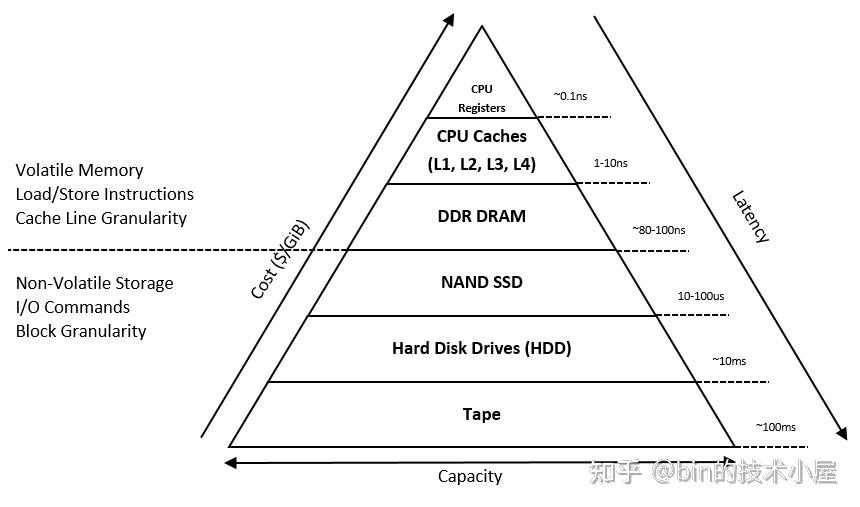

图片来源：https://docs.pmem.io/persistent-memory/getting-started-guide/introduction

由于 [摩尔定律](https://zhida.zhihu.com/search?content_id=240973082&content_type=Article&match_order=1&q=%E6%91%A9%E5%B0%94%E5%AE%9A%E5%BE%8B&zhida_source=entity) 的影响，CPU 中的核数越来越多，其处理速度也越来越快，而造价却越来越低，这就造成了提升 CPU 的运行速度比提升内存的运行速度要容易和便宜的多，所以就导致了 CPU 与内存之间的速度差距越来越大。

为了填补 CPU 与存储设备之间处理速度的巨大差异，提高 CPU 的处理效率和吞吐，计算机系统又根据 [局部性原理](https://zhida.zhihu.com/search?content_id=240973082&content_type=Article&match_order=1&q=%E5%B1%80%E9%83%A8%E6%80%A7%E5%8E%9F%E7%90%86&zhida_source=entity) 引入了上图所示的多级存储层次结构。这个存储层次金字塔结构有一个显著的特点就是，从金字塔的底部到顶部的方向来看的话，CPU 访问这些存储设备的速度会越来越快，但这些存储设备的造价也会越来越高，容量越来越小。

比如 CPU 访问速度最快的 Register [寄存器](https://zhida.zhihu.com/search?content_id=240973082&content_type=Article&match_order=1&q=%E5%AF%84%E5%AD%98%E5%99%A8&zhida_source=entity) ，访问延时为 0.1ns ，那些被 CPU 频繁访问到的数据最应该放到寄存器中，但是寄存器虽然访问速度快，但其造价昂贵，容量很小，所以又引入了 CPU Cache，它的访问延时为 1-10ns 作为寄存器的降级选择，同时也可以弥补一下 CPU 与 DRAM (内存) 速度上的差异。

DRAM 的访问速度是在 80 - 100 ns 这个量级，下面的 SSD 访问延时的量级跨越的就有点大了，直接从 ns 这个量级一下跨越到了 us，访问速度为 10 - 100 us，CPU 访问 SSD 的延时大概是访问 DRAM 延时的 1000 倍。

SSD 下面的 Hard Disk 访问延时量级跨度就更大了，来到了 ms 级，访问速度是 10 ms。而上图所展示的计算机系统存储体系又会根据存储数据的易失性（Volatile）分为两大类：

1. 第一类是 Volatile Memory，它包括寄存器，CPU Cache，DRAM，它们的特点是容量有限，CPU 访问的速度快，但是一旦遭遇到断电或者系统崩溃，这些存储设备里的内容就会丢失。
2. 第二类是 Non-Volatile Storage，它包括 SSD，Hard Disk。它们的特点是容量大，CPU 访问它们的速度相比于访问 Volatile Memory 会慢上几个数量级，但是遇到断电或者系统崩溃的时候，它们存储的数据不会丢失。

贪婪的成年世界往往喜欢选择既要又要，那么有没有一种存储设备既可以继承 Volatile Memory 访问速度快的特点又可以继承 Non-Volatile Storage 的大容量，且数据不会丢失的特点呢 ？ 答案就是 persistent memory （Non-Volatile Memory）。

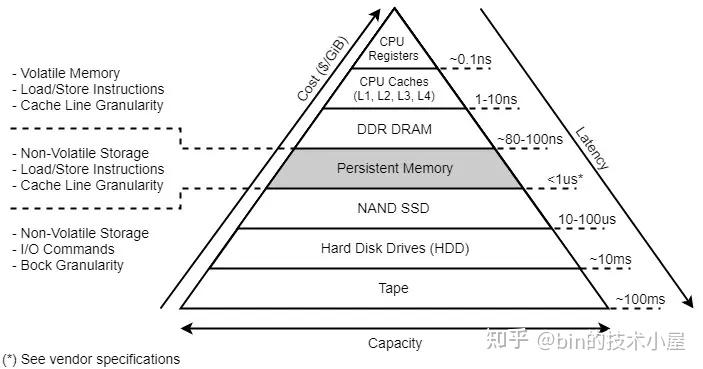

图片来源：https://docs.pmem.io/persistent-memory/getting-started-guide/introduction

persistent memory 提供了比 SSD, Hard Disk 更快的访问速度（1us），比 DRAM 更大的存储容量（TB 级），更关键的是 persistent memory 具有和 Hard Disk 一样的非易失特性（Non-Volatile），在断电或者系统崩溃之后，存储在 persistent memory 中的数据不会丢失。

从 IO 性能这个角度来对比的话，我们针对传统的磁盘 IO 操作都需要经历内核漫长的 IO 栈，数据首先要经过文件的 page cache，然后通过内核的回写策略或者通过手动调用 msync or fsync 等系统调用，启动磁盘块设备驱动将数据写入到磁盘设备（Non-Volatile Storage）中。整个链路经过了内核的 [虚拟文件系统](https://zhida.zhihu.com/search?content_id=240973082&content_type=Article&match_order=1&q=%E8%99%9A%E6%8B%9F%E6%96%87%E4%BB%B6%E7%B3%BB%E7%BB%9F&zhida_source=entity) ，page cache，文件系统，块设备驱动，Non-Volatile Storage。

而且我们对 Non-Volatile Storage 相关的读写，在内核的处理上是按照磁盘块为单位进行的，即使我们只读取几个字节，内核也会将整个磁盘块大小（4K）的数据读取进来，即使我们只写入了几个字节，内核在回写数据的时候也是将整个磁盘块大小的数据回写到磁盘中。

而针对 persistent memory 相关的 IO 操作就大不相同了，我们可以直接通过 CPU 的 load / store 指令来对 persistent memory 中存储的内容进行读写，直接绕过了 page cache, 块设备层等传统的 IO 路径。

一个是直接通过 CPU 指令来读写（persistent memory），一个是通过块设备驱动进行读写（Non-Volatile Storage），性能上的差异显而易见了。

由于我们是通过 CPU 指令来访问 persistent memory，这就使得我们可以按照字节为粒度（ byte level access）对 persistent memory 中存储的内容进行寻址，当我们读写 persistent memory 时，不再需要像传统的 Non-Volatile Storage 那样还需要对齐磁盘 block 的大小（4K）。

明明只是读写几个字节，却需要先从磁盘中读取整个 block 的数据，修改几个字节之后，又得把整个 block 回写到磁盘中，而对于具有 byte level access 特性的 persistent memory 来说，我们却可以自由的进行读写，极大的提升了 IO 性能以及减少了不必要的内存占用开销。

无论是 persistent memory 还是传统的 Non-Volatile Storage，当我们对其写完数据之后，也都是需要回写刷新的，否则都有可能面临数据丢失的风险。

比如，我们通过 mmap 系统调用对磁盘上的一个文件进行共享映射之后，针对映射出来的 MappedByteBuffer 进行写入的时候是直接写入到磁盘文件的 page cache 中，并没有写入到磁盘中，此时如果发生断电或者系统崩溃，数据是会丢失的。如果我们需要手动触发数据回写，就需要通过 msync 系统调用将文件中的元数据以及脏页数据通过磁盘块设备回写到磁盘中。

对于 persistent memory 来说也是一样，由于 CPU Cache 的存在，当我们通过 store 指令来向 persistent memory 写入数据的时候，数据会先缓存在 CPU Cache 中，此时的写入数据并没有 [持久化](https://zhida.zhihu.com/search?content_id=240973082&content_type=Article&match_order=1&q=%E6%8C%81%E4%B9%85%E5%8C%96&zhida_source=entity) 在 persistent memory 中，如果不巧发生断电或者系统崩溃，数据一样会丢失。

所以对于 persistent memory 来说在写入之后也是需要刷新的，不过这个刷新操作是通过 CLWK 指令（cache line writeback）将 cache line 中的数据 flush 到 persistent memory 中。而不需要像传统 Non-Volatile Storage 通过块设备来回写磁盘。

这也是 Linux 内核在 4.15 版本之后加入 `MAP_SYNC` 标志的原因，当我们使用 MAP_SYNC 标志通过 mmap 对 persistent memory 进行映射之后，映射出来的这段内存区域 —— MappedByteBuffer ，如果需要进行 force 刷新操作的时候，底层就是通过 CLWK 指令来刷新的，而不是传统的 msync 系统调用。

```
#define MAP_SYNC        0x080000 /* perform synchronous page faults for the mapping
```

被 MAP_SYNC 修饰的内存文件映射区会提供一个保证，就是当我们对这段映射出来的 MappedByteBuffer 进行写入操作之前，内核会保证映射文件的相关元数据 metadata 已经被持久化的到 persistent memory 中了。

这也就使得位于 persistent memory 中的文件 metadata 始终处于一致性的状态，在系统崩溃重启的前后，我们看到的文件 metadata 都是一样的。

被 MAP_SYNC 修饰的 MappedByteBuffer 当发生由写入操作引起的缺页中断时会产生一个 synchronous page faults，这也是后缀 `_SYNC` 要表达的语义，而 synchronous 的数据就是映射文件的 metadata。

如果我们使用 MAP_SYNC 通过 mmap 对 persistent memory 中的文件进行映射的时候，当文件的 metadata 产生 [脏数据](https://zhida.zhihu.com/search?content_id=240973082&content_type=Article&match_order=1&q=%E8%84%8F%E6%95%B0%E6%8D%AE&zhida_source=entity) 的时候，内核会将这段映射的 persistent memory 在进程页表中对应的页表项 PTE 改为只读的。

随后进程尝试对这段映射区域进行写入的时候，内核中就会产生一个 synchronous page faults，在这个 write page fault 的处理中，内核首先会同步地将文件的 dirty metadata 刷新，然后将 PTE 改为可写。这样就可以保证进程在写入被 MAP_SYNC 修饰的 MappedByteBuffer 之前，映射文件的相关 metadata 已经被刷新了，使得文件始终处于一致性的状态，随后进程就可以放心的写入数据了。

MAP_SYNC 必须和 MAP_SHARED_VALIDATE 一起配合使用：

```
#define MAP_SHARED_VALIDATE 0x03    /* share + validate extension flags */
```

MAP_SHARED_VALIDATE 提供的语义和 MAP_SHARED 是一样的，唯一不同的是 MAP_SHARED 会忽略掉所有后面扩展的 flags 标志，比如这里的 MAP_SYNC，而 MAP_SHARED_VALIDATE 会校验所有由 mmap 传入的 flags 标志，对于那些不被内核支持的 flags 标志会抛出 EOPNOTSUPP 异常，而 MAP_SHARED 则会直接选择忽略，不会有任何异常。

在实际使用的过程中，我们为了兼容之前老版本的内核，通常会将 `MAP_SHARED | MAP_SHARED_VALIDATE | MAP_SYNC` 一起设置到 mmap 的 flags 参数中。对于 4.15 之前的 [内核版本](https://zhida.zhihu.com/search?content_id=240973082&content_type=Article&match_order=1&q=%E5%86%85%E6%A0%B8%E7%89%88%E6%9C%AC&zhida_source=entity) 来说，这样设置的语义就相当于 `MAP_SHARED`, 对于 4.15 之后的内核版本来说，这样设置的语义就相当于是 `MAP_SYNC` 。

当我们调用 JDK 中的 `FileChannel#map` 方法来对 persistent memory 进行映射的时候，如果我们对 MapMode 设置了 READ_ONLY_SYNC 或者 READ_WRITE_SYNC ，那么在其 native 实现中调用 mmap 的时候，JVM 就会将 flags 参数设置为 `MAP_SHARED | MAP_SHARED_VALIDATE | MAP_SYNC` 。

在 JDK 中的体现是 MappedByteBuffer 的 isSync 属性会被设置为 true:

```
public abstract class MappedByteBuffer extends ByteBuffer
{
    // 当 MapMode 设置了 READ_WRITE_SYNC 或者 READ_ONLY_SYNC（这两个标志只适用于共享映射，不能用于私有映射），isSync 会为 true
    // isSync = true 表示 MappedByteBuffer 背后直接映射的是 non-volatile memory 而不是普通磁盘上的文件
    // isSync = true 提供的语义当 MappedByteBuffer 在 force 回写数据的时候是通过 CPU 指令完成的而不是 msync 系统调用
    // 并且可以保证在文件映射区 MappedByteBuffer 进行写入之前，文件的 metadata 已经被刷新，文件始终处于一致性的状态
    // isSync 的开启需要依赖底层 CPU 硬件体系架构的支持
    private final boolean isSync;
}

public class FileChannelImpl extends FileChannel
{
  private boolean isSync(MapMode mode) {
        // Do not want to initialize ExtendedMapMode until
        // after the module system has been initialized
        return !VM.isModuleSystemInited() ? false :
            (mode == ExtendedMapMode.READ_ONLY_SYNC ||
                mode == ExtendedMapMode.READ_WRITE_SYNC);
    }
}
```

persistent memory 之上也是需要构建文件系统来进行管理的， 支持 persistent memory 的文件系统有 ext2,ext4, xfs, btrfs 等，我们可以通过 `mkfs` 命令在 persistent memory 设备文件 —— `/dev/pmem0` 之上构建相应的 persistent memory filesystem 。

```
mkfs -t xfs /dev/pmem0
```

然后通过 `mount` 命令将 persistent memory filesystem 挂载到指定的目录 `/mnt/pmem/` 中，这样一来，我们就可以在应用程序中通过 mmap 系统调用映射 `/mnt/pmem/` 上的文件，映射出来的 MappedByteBuffer 背后就是 persistent memory 了，后续对 MappedByteBuffer 的读写就相当于是直接对 persistent memory 进行读写了，而且是 byte level access 。

```
mount -o dax /dev/pmem0 /mnt/pmem/
```

但这里需要注意一点的是，在我们挂载 persistent memory filesystem 时需要特别指定 `-o dax` ，这里的 dax 表示的是 direct access mode，dax 可以使应用程序绕过 page cache 直接去访问映射的 persistent memory。

> MAP_SYNC 只支持映射 dax 模式下挂载的 filesystem 上的文件

当我们通过 mmap 系统调用映射普通磁盘（Non-Volatile Storage）上的文件到进程空间中的 MappedByteBuffer 的时候，MappedByteBuffer 背后其实映射的是磁盘文件的 page cache 。

当我们通过 mmap 系统调用映射 persistent memory filesystem 上的文件到 MappedByteBuffer 的时候，MappedByteBuffer 背后直接映射的就是 persistent memory。

由于我们映射的是 persistent memory ，所以也就不再需要 page cache 来对映射内容重复再做一层拷贝了，我们直接访问 persistent memory 就可以。

### 2.3 JDK 内存映射的整体框架

到这里，关于 `FileChannelImpl#map` 方法中相关调用参数的信息笔者就为大家交代完了，通过以上内容的介绍，我们最起码对 JDK 如何封装 mmap 系统调用有了一个总体框架层面上的认识，下面笔者继续为大家补充一下封装的细节。

```
public class FileChannelImpl extends FileChannel
{
   public MappedByteBuffer map(MapMode mode, long position, long size) throws IOException {
        // 映射长度不能超过 Integer.MAX_VALUE，最大可以映射 2G 大小的内存
        if (size > Integer.MAX_VALUE)
            throw new IllegalArgumentException("Size exceeds Integer.MAX_VALUE");
        // 当 MapMode 设置了 READ_WRITE_SYNC 或者 READ_ONLY_SYNC（这两个标志只适用于共享映射，不能用于私有映射），isSync 会为 true
        // isSync = true 表示 MappedByteBuffer 背后直接映射的是 non-volatile memory 而不是普通磁盘上的文件
        // isSync = true 提供的语义是当 MappedByteBuffer 在 force 回写数据的时候是通过 CPU 指令完成的而不是 msync 系统调用
        // 并且可以保证在对文件映射区 MappedByteBuffer 进行写入之前，文件的 metadata 已经被刷新，文件始终处于一致性的状态
        // isSync 的开启需要依赖底层 CPU 硬件体系架构的支持
        boolean isSync = isSync(Objects.requireNonNull(mode, "Mode is null"));
        // MapMode 转换成相关 prot 常量
        int prot = toProt(mode);
        // 进行内存映射，映射成功之后，相关映射区的信息，比如映射起始地址，映射长度，映射文件等等会封装在 Unmapper 里返回
        // MappedByteBuffer 的释放也封装在 Unmapper中
        Unmapper unmapper = mapInternal(mode, position, size, prot, isSync);
        // 根据 Unmapper 中的信息创建  MappedByteBuffer
        // 当映射 size 指定为 0 时，unmapper = null，随后会返回一个空的 MappedByteBuffer
        if (unmapper == null) {
            // a valid file descriptor is not required
            FileDescriptor dummy = new FileDescriptor();
            if ((!writable) || (prot == MAP_RO))
                return Util.newMappedByteBufferR(0, 0, dummy, null, isSync);
            else
                return Util.newMappedByteBuffer(0, 0, dummy, null, isSync);
        } else if ((!writable) || (prot == MAP_RO)) {
            // 如果我们指定的是 read-only 的映射方式，这里就会创建一个只读的 MappedByteBufferR 出来
            return Util.newMappedByteBufferR((int)unmapper.cap,
                    unmapper.address + unmapper.pagePosition,
                    unmapper.fd,
                    unmapper, isSync);
        } else {
            return Util.newMappedByteBuffer((int)unmapper.cap,
                    unmapper.address + unmapper.pagePosition,
                    unmapper.fd,
                    unmapper, isSync);
        }
    }
}
```

在开始映射之前，JDK 首先会通过 toProt 方法将参数 MapMode 指定的相关枚举值转换成 `MAP_` 前缀的常量值，后续进入 native 实现的时候，JVM 会根据这个常量值来设置 mmap 系统调用参数 prot 以及 flags。

```
private static final int MAP_INVALID = -1;
    private static final int MAP_RO = 0;
    private static final int MAP_RW = 1;
    private static final int MAP_PV = 2;

    private int toProt(MapMode mode) {
        int prot;
        if (mode == MapMode.READ_ONLY) {
            // 共享只读
            prot = MAP_RO;
        } else if (mode == MapMode.READ_WRITE) {
            // 共享读写
            prot = MAP_RW;
        } else if (mode == MapMode.PRIVATE) {
            // 私有读写
            prot = MAP_PV;
        } else if (mode == ExtendedMapMode.READ_ONLY_SYNC) {
            // 共享 non-volatile memory 只读
            prot = MAP_RO;
        } else if (mode == ExtendedMapMode.READ_WRITE_SYNC) {
            // 共享 non-volatile memory 读写
            prot = MAP_RW;
        } else {
            prot = MAP_INVALID;
        }
        return prot;
    }
```

随后 JDK 调用 mapInternal 方法对文件进行内存映射，关于内存映射的细节全部都封装在这个方法中，之前介绍的 native 方法 map0 就是在这里被 JDK 调用的。

```
public class FileChannelImpl extends FileChannel
{
    // Creates a new mapping
    private native long map0(int prot, long position, long length, boolean isSync)
        throws IOException;
}
```

map0 会将 mmap 在进程地址空间中映射出来的虚拟内存区域的起始地址 addr 返回给 JDK 。

```
private Unmapper mapInternal(MapMode mode, long position, long size, int prot, boolean isSync) throws IOException
{
       addr = map0(prot, mapPosition, mapSize, isSync);

       Unmapper um = (isSync
                           ? new SyncUnmapper(addr, mapSize, size, mfd, pagePosition)
                           : new DefaultUnmapper(addr, mapSize, size, mfd, pagePosition));
}
```

最后 JDK 会将这块虚拟内存区域的相关信息，比如起始映射地址，映射长度等信息全部封装在 Unmapper 类中，随后根据这些封装在 Unmapper 类中的信息创建初始化 MappedByteBuffer 并返回给上层应用程序。

```
Util.newMappedByteBuffer((int)unmapper.cap,
                    unmapper.address + unmapper.pagePosition,
                    unmapper.fd,
                    unmapper, isSync);
```

具体这个 Unmapper 类是干什么的，里面封装的这些属性具体的含义我们先不用管，后面笔者在介绍到具体映射细节的时候会详细介绍。这里我们只需要知道 unmapper.fd 封装的是映射文件的 [文件描述符](https://zhida.zhihu.com/search?content_id=240973082&content_type=Article&match_order=1&q=%E6%96%87%E4%BB%B6%E6%8F%8F%E8%BF%B0%E7%AC%A6&zhida_source=entity) ，unmapper.address + unmapper.pagePosition 表示的是 MappedByteBuffer 的起始映射地址，unmapper.cap 表示的是 MappedByteBuffer 的总体容量 capacity。先记住这个结构，后面我们在讨论为什么。

```
public abstract class MappedByteBuffer extends ByteBuffer
{
    // unmapper.fd
    private final FileDescriptor fd;
    private final boolean isSync;
    // unmapper.address + unmapper.pagePosition
    long address;
    // unmapper.cap
    private int limit;
    // unmapper.cap
    private int capacity;
    private int mark = -1;
    private int position = 0;

}
```

上面出现的这些 MappedByteBuffer 相关属性的具体含义以及作用，笔者已经在 [《一步一图带你深入剖析 JDK NIO ByteBuffer 在不同字节序下的设计与实现》](https://link.zhihu.com/?target=https%3A//mp.weixin.qq.com/s/Q4RzeWh7RtqSYO0JYFpdGA) 一文中讲述 ByteBuffer 总体设计与实现的时候详细介绍过了，忘记的同学可以在回看下。

### 2.4 一些映射细节

下面的内容我们主要来聚焦一些映射的细节，顺便给大家解答一下 Unmapper 类中究竟封装了哪些信息。

### 2.4.1 Unmapper 到底包装了哪些映射信息

我们都知道， `FileChannel#map` 函数中的 position 参数指定的是我们期望从磁盘文件中的哪个位置偏移处开始映射，参数 size 用于指定我们期望的映射长度。

```
public abstract class FileChannel {

  public abstract MappedByteBuffer map(MapMode mode, long position, long size)
        throws IOException;
}
```

我们使用 `FileChannel#map` 函数得到的这个 MappedByteBuffer 背后其实是对 ` [position， position+size]` 这段文件区域的映射。

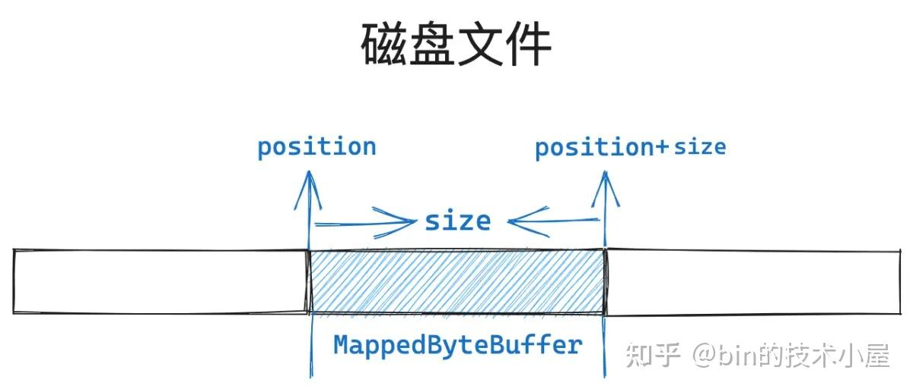

image.png

不过这只是我们站在 JVM 视角中观察到的现象，但站在 OS 内核的视角中却不一定是这样映射的，JDK 使用了一个障眼法将本质给隐藏了。

磁盘文件在文件系统中是按照磁盘块为单位组织管理的，当磁盘块加载到内存中就变成了文件页，它们的大小都是 4K，内核对于内存的管理也是按照内存页 page 为单位进行了，包括本文中介绍的内存映射，也是按照 page 为粒度进行映射的。

所以我们在应用程序中指定的相关映射参数，比如这里的 position 以及 size 都应该是按照内存页 page 尺寸对齐的，如果没有对齐，JDK 和内核都会默默的帮助我们进行对齐。


image.png

如上图所示，假设我们指定的 position 没有与文件页的尺寸进行对齐，那么内核则不会从一个没有对齐的位置处开始映射，而是会选择 position 所在文件页的起始位置处（ mapPosition）开始映射。

```
// position 距离其所在文件页起始位置的距离
 // allocationGranularity 表示内存映射的单位粒度，这里是 4K （内存页尺寸）
 pagePosition = (int)(position % allocationGranularity);
 // mapPosition 内核真正开始的映射位置，同 mmap 系统调用中的 offset 参数
 // 这里的 mapPosition 为 position 所属文件页的起始位置
 long mapPosition = position - pagePosition;
```


image.png

我们原本期望的是从文件的 position 处开始映射，并映射长度为 size 大小的文件区域，由于我们指定的 position 没有与文件页尺寸对齐，所以内核选择从文件的 mapPosition 位置处开始映射。

这样一来，如果我们继续按照原本的 size 大小进行映射的话，那么映射出来的文件区域肯定小了，所以这里需要调整映射的长度，在原来的映射长度 size 的基础上，多映射 pagePosition 大小的区域出来。总体映射长度为 mapSize。

```
// 映射位置 mapPosition 是通过 position 减去了 pagePosition 得到的
    // 所以这里的映射长度 mapSize 需要把 pagePosition 加回来
    mapSize = size + pagePosition;
```


image.png

上图中展示这段 `[position, position+size]` 蓝色文件区域是我们原本指定的文件映射区域， `FileChannel#map` 函数中返回的 MappedByteBuffer 背后映射的就是这段文件区域。

而内核真实映射的文件区域其实是从 mapPosition 开始，映射长度为 mapSize 的这段文件区域。

```
addr = map0(prot, mapPosition, mapSize, isSync);
```

addr 是通过 mmap 在进程虚拟内存空间中映射出来的虚拟内存区域的起始地址，这段虚拟内存区域的内存范围是 `[addr, addr+mapSize]` ，背后映射的文件区域范围是 `[mapPosition, mapPositionn+mapSize]` 。

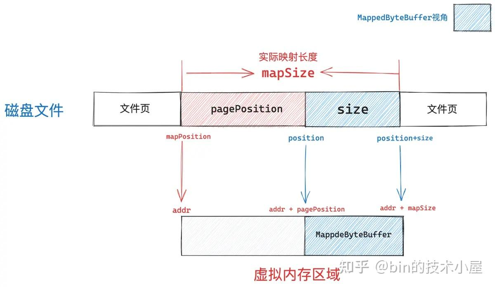

image.png

内核映射出来的虚拟内存区域是一个全集，而我们需要的映射区其实是 \[addr + pagePosition, addr + mapSize\] 这一段映射长度为 size 大小的子集。所以 MappedByteBuffer 的起始地址其实是 `addr + pagePosition` ，整个容量为 size 。

JDK 会将上述介绍的这些映射区域相关信息都封装在 Unmapper 类中。

```
Unmapper um = (isSync
                       ? new SyncUnmapper(addr, mapSize, size, mfd, pagePosition)
                       : new DefaultUnmapper(addr, mapSize, size, mfd, pagePosition));
```

- mmap 系统调用在进程地址空间真实映射出来的虚拟内存区域起始地址 addr 封装在 Unmapper 类的 address 属性中。
- 虚拟内存区域真实的映射长度 mapSize 封装在 Unmapper 类的 size 属性中。
- FileChannel#map 函数中指定的 size 参数其实就是 MappedByteBuffer 的真实容量，封装在 Unmapper 类的 cap 属性中。
- mfd 表示映射文件的 file descriptor，pagePosition 表示我们指定的 position 距离其所在文件页起始位置的距离。
- Unmapper 中封装的 address 与 pagePosition 一相加就得到了 MappedByteBuffer 的起始内存地址。

```
private static class DefaultUnmapper extends Unmapper {

        public DefaultUnmapper(long address, long size, long cap,
                               FileDescriptor fd, int pagePosition) {
            // 封装映射出来的虚拟内存区域 MappedByteBuffer 相关信息，比如，起始映射地址，映射长度 等等
            super(address, size, cap, fd, pagePosition);
            incrementStats();
        }
}

 private static abstract class Unmapper implements Runnable, UnmapperProxy {
        // 通过 mmap 系统调用在进程地址空间中映射出来的虚拟内存区域的起始地址
        private volatile long address;
        // mmap 映射出来的真实虚拟内存区域大小
        protected final long size;
        // MappedByteBuffer 的容量 cap （由 FileChannel#map 参数 size 指定）
        protected final long cap;
        private final FileDescriptor fd;
        private final int pagePosition;

        private Unmapper(long address, long size, long cap,
                         FileDescriptor fd, int pagePosition)
        {
            assert (address != 0);
            this.address = address;
            this.size = size;
            this.cap = cap;
            this.fd = fd;
            this.pagePosition = pagePosition;
        }
}
```

除此之外，Unmapper 中还封装了 JVM 进程对于内存映射的相关统计信息：

- count 用于记录 JVM 进程调用 mmap 进行内存文件映射的总次数
- totalSize 是站在内核的视角中，统计 mmap 映射出来的虚拟内存总大小，这个是虚拟内存占用的真实用量。
- totalCapacity 是站在 JVM 的视角中，统计所有 MappedByteBuffer 占用虚拟内存的总大小。

```
private static class DefaultUnmapper extends Unmapper {

        // keep track of non-sync mapped buffer usage
        // jvm 调用 mmap 进行内存文件映射的总次数
        static volatile int count;
        // jvm 在进程地址空间中映射出来的真实虚拟内存总大小（内核角度的虚拟内存占用）
        // 所有 mapSize 的总和
        static volatile long totalSize;
        // jvm 中所有 MappedByteBuffer 占用虚拟内存的总大小（jvm角度的虚拟内存占用）
        // 所有 size 的总和
        static volatile long totalCapacity;

        // 每一次映射都会调用该方法
        protected void incrementStats() {
            synchronized (DefaultUnmapper.class) {
                count++;
                totalSize += size;
                totalCapacity += cap;
            }
        }
    }
```

Unmapper 中的 unmap 方法用于释放本次通过 mmap 在进程地址空间中映射出来的真实虚拟内存区域，这里笔者还是要强调一下，mmap 映射出来的虚拟内存区域范围为 \[addr, addr + mapSize\]，这个是真实的虚拟内存用量。

我们在 Java 程序中看到的 MappedByteBuffer 只是这段虚拟内存的一个子集，范围为 \[addr + pagePosition, addr + mapSize\]。所以这里的 unmap 方法释放的是在内核中真实占用的虚拟内存 —— ` [addr, addr + mapSize]` 。

```
private static abstract class Unmapper implements Runnable, UnmapperProxy {

    public void unmap() {
            if (address == 0)
                return;
            // 底层调用 unmmap 系统调用，用于释放 [addr, addr+mapSize] 这段 mmap 映射出来的虚拟内存以及物理内存
            unmap0(address, size);
            address = 0;

            // if this mapping has a valid file descriptor then we close it
            if (fd.valid()) {
                try {
                    nd.close(fd);
                } catch (IOException ignore) {
                    // nothing we can do
                }
            }
            // incrementStats 的反向操作
            decrementStats();
        }
  }
```

### 2.4.2 System.gc 之后到底发生了什么

如果一切顺利的话，内存映射的流程本该到这里就结束了，但是现实中往往有很多异常情况的发生，比如在映射的过程中如果发现内存不足，mmap 系统调用就会返回 `ENOMEM` 错误，这个错误会被 JVM 在 native 层转换成 `OutOfMemoryError ` 抛出。

```
JNIEXPORT jlong JNICALL
Java_sun_nio_ch_FileChannelImpl_map0(JNIEnv *env, jobject this,
                                     jint prot, jlong off, jlong len, jboolean map_sync)
{
    mapAddress = mmap64(
        0,                    /* Let OS decide location */
        len,                  /* Number of bytes to map */
        protections,          /* File permissions */
        flags,                /* Changes are shared */
        fd,                   /* File descriptor of mapped file */
        off);                 /* Offset into file */

    if (mapAddress == MAP_FAILED) {
        // 虚拟内存不足
        if (errno == ENOMEM) {
            JNU_ThrowOutOfMemoryError(env, "Map failed");
            return IOS_THROWN;
        }
        return handle(env, -1, "Map failed");
    }

    return ((jlong) (unsigned long) mapAddress);
}
```

注意这里的 `OutOfMemoryError ` 指的是虚拟内存不足和物理内存没有关系，因为 mmap 系统调用只是在进程的虚拟内存空间中为本次映射分配出一段虚拟内存区域，并将这段虚拟内存区域与磁盘文件映射起来就结束了，整个过程并不涉及物理内存的分配。

如果 mmap 发现进程的虚拟内存空间不足以划分出我们指定映射长度的虚拟内存区域的话，内核就会返回 `ENOMEM` 错误给 JVM 进程。

当 JDK 捕获到 `OutOfMemoryError ` 异常的时候，就会意识到此时进程虚拟内存空间中的虚拟内存已经不足了，无法支持本次内存映射，于是就会调用 ` System.gc` 强制触发一次 GC,试图释放一些虚拟内存出来，然后再次尝试来 mmap 一把，如果进程地址空间中的虚拟内存还是不足，则抛出 `IOException ` 。

```
private Unmapper mapInternal(MapMode mode, long position, long size, int prot, boolean isSync)
        throws IOException
{
            try {
                    // If map0 did not throw an exception, the address is valid
                    addr = map0(prot, mapPosition, mapSize, isSync);
                } catch (OutOfMemoryError x) {
                    // An OutOfMemoryError may indicate that we've exhausted
                    // memory so force gc and re-attempt map
                    System.gc();
                    try {
                        Thread.sleep(100);
                    } catch (InterruptedException y) {
                        Thread.currentThread().interrupt();
                    }
                    try {
                        addr = map0(prot, mapPosition, mapSize, isSync);
                    } catch (OutOfMemoryError y) {
                        // After a second OOME, fail
                        throw new IOException("Map failed", y);
                    }
              }

}
```

通常情况下我们应当避免在应用程序中主动调用 `System.gc` ，因为这会导致 JVM 立即触发一次 Full GC，使得整个 JVM 进程陷入到 Stop The World 阶段，对性能会有很大的影响。

但是在本小节的场景中，调用 `System.gc` 却是有必要的，因为 NIO 中的 DirectByteBuffer 非常特殊，当然了 MappedByteBuffer 其实也属于 DirectByteBuffer 的一种。它们背后依赖的内存均属于 JVM 之外（Native Memory），因此不会受垃圾回收的控制。

前面我们多次提过，DirectByteBuffer 只是 OS 中的这些 Native Memory 在 JVM 中的封装形式，DirectByteBuffer 这个 Java 类的实例是分配在 JVM 堆中的，但是这个实例的背后可能会引用着一大片的 Native Memory ，这些 Native Memory 是不会被 JVM 察觉的。

当这些 DirectByteBuffer 实例（位于 JVM 堆中）没有任何引用的时候，如果又恰巧碰到 GC 的话，那么 GC 在回收这些 DirectByteBuffer 实例的同时，也会将与其关联的 Cleaner 放到一个 pending 队列中。

```
protected DirectByteBuffer(int cap, long addr,
                                     FileDescriptor fd,
                                     Runnable unmapper,
                                     boolean isSync, MemorySegmentProxy segment)
    {
        super(-1, 0, cap, cap, fd, isSync, segment);
        address = addr;
        // 对于 MappedByteBuffer 来说，在它被 GC 的时候，JVM 会调用这里的 cleaner
        // cleaner 近而会调用 Unmapper#unmap 释放背后的 native memory
        cleaner = Cleaner.create(this, unmapper);
        att = null;
    }
```

当 GC 结束之后，JVM 会唤醒 ReferenceHandler 线程去执行 pending 队列中的这些 Cleaner，在 Cleaner 中会释放其背后引用的 Native Memory。

但在现实的 NIO 使用场景中，DirectByteBuffer 却很难触发 GC，因为 DirectByteBuffer 的实例实在太小了（在 JVM 堆中的内存占用），而且通常情况下这些实例是被应用程序长期持有的，很容易就会晋升到老年代。

即使 DirectByteBuffer 实例已经没有任何引用关系了，由于它的实例足够的小，一时很难把老年代撑爆，所以需要等很久才能触发一次 Full GC，在这之前，这些没有任何引用关系的 DirectByteBuffer 实例将会持续在老年代中堆积，其背后所引用的大片 Native Memory 将一直不会得到释放。

DirectByteBuffer 的实例可以形象的比喻为冰山对象，JVM 可以看到的只是 DirectByteBuffer 在 JVM 堆中的内存占用，但这部分内存占用很小，就相当于是冰山的一角。


image.png

而位于冰山下面的大一片 Native Memory ，JVM 是察觉不到的， 这也是 Full GC 迟迟不会触发的原因，因此导致了大量的 DirectByteBuffer 实例的堆积，背后引用的一大片 Native Memory 一直得不到释放，严重的情况下可能会导致内核的 OOM，当前进程会被 kill 。

所以在 NIO 的场景下，这里调用 System.gc 去主动触发一次 Full GC 是有必要的。关于 System.gc ，网上的说法众多，其中大部分认为 —— “System.gc 只是给 JVM 的一个暗示或者是提示，但是具体 GC 会不会发生，以及什么时候发生都是不可预期的”。

这个说法以及 Java 标准库中关于 System.gc 的注释都是非常模糊的，那么在 System.gc 被调用之后具体会发生什么行为，我想还是应该到具体的 JVM 实现中去一探究竟，毕竟源码面前了无秘密，下面我们以 hotspot 实现进行说明。

```
public final class System {
   public static void gc() {
        Runtime.getRuntime().gc();
    }
}

public class Runtime {
   public native void gc();
}
```

System.gc 最终依赖的是 Runtime 类中定义的 gc 方法，该方法是一个 native 实现，定义在 Runtime.c 文件中。

```
// Runtime.c 文件
JNIEXPORT void JNICALL
Java_java_lang_Runtime_gc(JNIEnv *env, jobject this)
{
    JVM_GC();
}
// jvm.cpp 文件
JVM_ENTRY_NO_ENV(void, JVM_GC(void))
  // DisableExplicitGC 默认为 false，如果设置了 -XX:+DisableExplicitGC 则为 true
  if (!DisableExplicitGC) {
    EventSystemGC event;
    event.set_invokedConcurrent(ExplicitGCInvokesConcurrent);
    // 立即触发一次  full gc
    Universe::heap()->collect(GCCause::_java_lang_system_gc);
    event.commit();
  }
JVM_END
```

从 hotspot 的实现中我们可以看出，如果我们设置了 ` -XX:+DisableExplicitGC` ，那么调用 System.gc 则不会起任何作用，在默认情况下，System.gc 会立即触发一次 Full GC，这一点我们可以从 `Universe::heap()->collect` 方法的调用看得出来。而且会特殊注明引起本次 GC 的原因 GCCause 为 `_java_lang_system_gc` 。

JVM 堆的实例封装在 Universe 类中，我们可以通过 heap() 方法来获取 JVM 堆的实例，随后调用堆的 collect 方法在 JVM 堆中执行垃圾回收的动作。

```
// universe.hpp 文件
// jvm 堆实例
static CollectedHeap* _collectedHeap;
static CollectedHeap* heap() { return _collectedHeap; }
```

Java 堆在 JVM 源码中使用 CollectedHeap 类型来描述，该类型为整个 JVM 堆结构类型的基类，具体的实现类型取决于我们选择的垃圾回收器。比如，当我们选择 ZGC 作为垃圾回收器时，JVM 堆的类型是 ZCollectedHeap，选择 G1 作为垃圾回收器时，JVM 堆的类型则是 G1CollectedHeap。

JVM 在初始化堆的时候，会通过 `GCConfig::arguments()->create_heap()` 根据我们选择的具体垃圾回收器来创建相应的堆类型，具体的 JVM 堆实例会保存在 `_collectedHeap` 中，后续通过 `Universe::heap()` 即可获取。

```
// universe.cpp 文件
// jvm 堆实例
CollectedHeap*  Universe::_collectedHeap = NULL;

jint Universe::initialize_heap() {
  assert(_collectedHeap == NULL, "Heap already created");
  // 根据 JVM 参数  -XX: 指定的相关 gc 配置创建对应的 heap
  // 比如，设置了 -XX:+UseZGC，这里创建的就是 ZCollectedHeap
  _collectedHeap = GCConfig::arguments()->create_heap();

  log_info(gc)("Using %s", _collectedHeap->name());
  // 初始化 jvm 堆
  return _collectedHeap->initialize();
}
```

GCConfig 是 JVM 专门用于封装 GC 相关信息的类，具体创建堆的行为 —— create_heap()，则封装在 GCConfig 类中的 \_arguments 属性中（GCArguments 类型）。这里也是一样，不同的垃圾回收器对应不同的 GCArguments，比如，ZGC 对应的是 ZArguments，G1 对应的是 G1Arguments。典型工厂， [策略模式](https://zhida.zhihu.com/search?content_id=240973082&content_type=Article&match_order=1&q=%E7%AD%96%E7%95%A5%E6%A8%A1%E5%BC%8F&zhida_source=entity) 的应用，不同的 GCArguments 负责创建不用类型的 JVM 堆。

```
// gcConfig.cpp 文件
GCArguments* GCConfig::arguments() {
  assert(_arguments != NULL, "Not initialized");
  // 真正负责创建 jvm 堆的类
  return _arguments;
}
```

JVM 在启动的时候会对 GCConfig 进行初始化，通过 `select_gc()` 根据我们指定的 `-XX:` 相关 GC 配置选项来选择具体的 \_arguments，比如，我们设置了 `-XX:+UseZGC`, 这里的 select_gc 就会返回 ZArguments 实例，并保存在 \_arguments 属性中，随后我们就可以通过 `GCConfig::arguments()` 获取。

```
void GCConfig::initialize() {
  assert(_arguments == NULL, "Already initialized");
  _arguments = select_gc();
}
```

`select_gc()` 的逻辑其实非常简单，核心就是遍历一个叫做 `IncludedGCs ` 的数组，该数组里包含的是当前 JVM 版本中所支持的所有垃圾回收器集合。比如，当我们通过 command line 指定了 `-XX:+UseZGC` 的时候，相关的 GC 参数 UseZGC 就会为 true，其他的 GC 参数都为 false，如果 JVM 在遍历 `IncludedGCs ` 数组的时候发现，当前遍历元素的 GC 参数为 true，那么就会将对应的 \_arguments （zArguments）返回。

```
// gcConfig.cpp 文件
// Table of included GCs, for translating between command
// line flag, CollectedHeap::Name and GCArguments instance.
static const IncludedGC IncludedGCs[] = {
   EPSILONGC_ONLY_ARG(IncludedGC(UseEpsilonGC,       CollectedHeap::Epsilon,    epsilonArguments,    "epsilon gc"))
        G1GC_ONLY_ARG(IncludedGC(UseG1GC,            CollectedHeap::G1,         g1Arguments,         "g1 gc"))
  PARALLELGC_ONLY_ARG(IncludedGC(UseParallelGC,      CollectedHeap::Parallel,   parallelArguments,   "parallel gc"))
    SERIALGC_ONLY_ARG(IncludedGC(UseSerialGC,        CollectedHeap::Serial,     serialArguments,     "serial gc"))
SHENANDOAHGC_ONLY_ARG(IncludedGC(UseShenandoahGC,    CollectedHeap::Shenandoah, shenandoahArguments, "shenandoah gc"))
         ZGC_ONLY_ARG(IncludedGC(UseZGC,             CollectedHeap::Z,          zArguments,          "z gc"))
};
```

`IncludedGCs` 数组的元素类型为 IncludedGC，用于封装具体垃圾回收器的相关配置信息：

```
// gcConfig.cpp 文件
struct IncludedGC {
  // GCArgument，如果我们通过 command line 配置了具体的垃圾回收器
  // 那么对应的 IncludedGC 类型中的 _flag 就为 true。
  // -XX:+UseG1GC 对应 UseG1GC，-XX:+UseZGC 对应 UseZGC
  bool&               _flag;
  // 具体垃圾回收器的名称
  CollectedHeap::Name _name;
  // 对应的 GCArguments，后续用于 create_heap
  GCArguments&        _arguments;
  const char*         _hs_err_name;
};
```

`select_gc()` 就是遍历这个 IncludedGCs 数组，查找 \_flag 为 true 的数组项，然后返回其 \_arguments。

```
GCArguments* GCConfig::select_gc() {
  // 遍历 IncludedGCs 数组
  FOR_EACH_INCLUDED_GC(gc) {
    // GCArgument 为 true 则返回对应的 _arguments
    if (gc->_flag) {
      return &gc->_arguments;
    }
  }
  return NULL;
}

#define FOR_EACH_INCLUDED_GC(var)                                            \
  for (const IncludedGC* var = &IncludedGCs[0]; var < &IncludedGCs[ARRAY_SIZE(IncludedGCs)]; var++)
```

当我们通过设置 `-XX:+UseG1GC` 选择 G1 垃圾回收器的时候，对应在 GCConfig 中的 \_arguments 为 G1Arguments ，通过 `GCConfig::arguments()->create_heap()` 创建出来的 JVM 堆的类型为 G1CollectedHeap。

```
CollectedHeap* G1Arguments::create_heap() {
  return new G1CollectedHeap();
}
```

同理，当我们通过设置 `-XX:+UseZGC` 选择 ZGC 垃圾回收器的时候，JVM 堆的类型为 ZCollectedHeap。

```
CollectedHeap* ZArguments::create_heap() {
  return new ZCollectedHeap();
}
```

当我们通过设置 `-XX:+UseSerialGC` 选择 SerialGC 垃圾回收器的时候，JVM 堆的类型为 SerialHeap。

```
CollectedHeap* SerialArguments::create_heap() {
  return new SerialHeap();
}
```

当我们通过设置 `-XX:+UseParallelGC` 选择 ParallelGC 垃圾回收器的时候，JVM 堆的类型为 ParallelScavengeHeap。

```
CollectedHeap* ParallelArguments::create_heap() {
  return new ParallelScavengeHeap();
}
```

当我们通过设置 `-XX:+UseShenandoahGC` 选择 Shenandoah 垃圾回收器的时候，JVM 堆的类型为 ShenandoahHeap。

```
CollectedHeap* ShenandoahArguments::create_heap() {
  return new ShenandoahHeap(new ShenandoahCollectorPolicy());
}
```

现在我们已经明确了各个垃圾回收器对应的 JVM 堆类型，而 System.gc 本质上调用的其实就是具体 JVM 堆中的 collect 方法来立即触发一次 Full GC。

```
// jvm.cpp 文件
JVM_ENTRY_NO_ENV(void, JVM_GC(void))
  if (!DisableExplicitGC) {
    Universe::heap()->collect(GCCause::_java_lang_system_gc);
  }
JVM_END
```

下面我们就来结合具体的垃圾回收器看一下 System.gc 的行为，长话短说，先把结论抛出来：

- 如果我们在 command line 中设置了 `-XX:+DisableExplicitGC` ，那么调用 System.gc 则不会起任何作用。
- 如果我们选择的垃圾回收器是 SerialGC，ParallelGC，ZGC 的话，那么调用 System.gc 就会立即触发一次 Full GC，整个 JVM 进程会陷入 Stop The World 阶段，调用 System.gc 的线程会一直阻塞，直到整个 Full GC 结束才会返回。
- 如果我们选择的垃圾回收器是 CMS（已在 Java 9 中废弃），G1，Shenandoah，并且在 command line 中设置了 `-XX:+ExplicitGCInvokesConcurrent` 的话，那么在调用 System.gc 则会立即触发一次 **Concurrent Full GC** ，JVM 进程不会陷入 Stop The World 阶段，业务线程和 GC 线程可以 [并发运行](https://zhida.zhihu.com/search?content_id=240973082&content_type=Article&match_order=1&q=%E5%B9%B6%E5%8F%91%E8%BF%90%E8%A1%8C&zhida_source=entity) ，而且调用 System.gc 的线程在触发 **Concurrent Full GC** 之后就立即返回了，不需要等到 GC 结束。

### 2.4.2.1 SerialGC

对于 SerialGC 来说，在调用 System.gc 之后，JVM 背后其实直接调用的是 SerialHeap 的 collect 方法。

```
// serialHeap.hpp 文件
class SerialHeap : public GenCollectedHeap {

}
```

由于 SerialHeap 继承的是 GenCollectedHeap，collect 方法是在 GenCollectedHeap 中实现的。

```
// genCollectedHeap.cpp 文件
void GenCollectedHeap::collect(GCCause::Cause cause) {
    // GCCause 为 _java_lang_system_gc 的时候会调用到这里
    // Stop-the-world full collection.
    collect(cause, OldGen);
}

void GenCollectedHeap::collect(GCCause::Cause cause, GenerationType max_generation) {
  collect_locked(cause, max_generation);
}

void GenCollectedHeap::collect_locked(GCCause::Cause cause, GenerationType max_generation) {
    // 在这里会触发 Full Gc 的运行
    VM_GenCollectFull op(gc_count_before, full_gc_count_before,
                         cause, max_generation);
    // 提交给 VMThread 来执行 Full Gc
    VMThread::execute(&op);
}
```

这里需要注意的是执行这段代码的线程依然是调用 System.gc 的 Java 业务线程，而 JVM 内部的相关操作，比如这里的 GC 操作，均是由 JVM 中的 VMThread 来执行的。

所以这里 Java 业务线程需要将 Full Gc 的任务 —— VM_GenCollectFull 通过 `VMThread::execute(&op)` 提交给 VMThread 来执行。而 Java 业务线程一直会在这里阻塞等待，直到 VMThread 执行完 Full Gc 之后，Java 业务线程才会从 System.gc 调用中返回。

这样设计也是合理的，因为毕竟 Full Gc 会让整个 JVM 进程陷入 Stop The World 阶段，所有 Java 线程必须到达 SafePoint 之后 Full Gc 才会执行，而我们通过 JNI 进入到 Native 方法的实现之后，由于 Native 代码不会访问 Java 对象、不会调用 Java 方法，不再执行任何字节码指令，所以 Java 虚拟机的堆栈不会发生改变，因此 Native 方法本身就是一个 SafePoint。在 Full Gc 没有结束之前，Java 线程会一直停留在这个 SafePoint 中。

```
void VMThread::execute(VM_Operation* op) {
  // 获取当前执行线程
  Thread* t = Thread::current();

  if (t->is_VM_thread()) {
    // 如果当前线程是 VMThread 的话，直接执行 VM_Operation（Full Gc）
    ((VMThread*)t)->inner_execute(op);
    return;
  }

  // doit_prologue 为执行 VM_Operation 的前置回调函数，Full Gc 之前执行一些准备校验工作。
  // 返回 true 表示可以执行本次 GC 操作, 返回 false 表示忽略本次 GC
  // JVM 可能会触发多次 GC 请求，比如多个 java 线程遇到分配失败的时候
  // 但我们只需要执行一次 GC 就可以了，其他 GC 请求在这里就会被忽略
  // 另外执行 GC 之前需要给 JVM 堆加锁，heap lock 也是在这里完成的。
  if (!op->doit_prologue()) {
    return;   // op was cancelled
  }
  // java 线程将 Full Gc 的任务提交给 VMThread 执行
  // 并且会在这里一直阻塞等待，直到 Full Gc 执行完毕。
  wait_until_executed(op);
  // 释放 heap lock，唤醒 ReferenceHandler 线程去执行 pending 队列中的 Cleaner
  op->doit_epilogue();
}
```

注意这里的 `op->doit_epilogue()` 方法，在 GC 结束之后就会调用到这里，而与 DirectByteBuffer 相关联的 Cleaner 正是在这里被触发执行的。

```
void VM_GC_Operation::doit_epilogue() {

  if (Universe::has_reference_pending_list()) {
    // 通知 cleaner thread 执行 cleaner,release native memory
    Heap_lock->notify_all();
  }
  // Heap_lock->unlock()
  VM_GC_Sync_Operation::doit_epilogue();
}
```

### 2.4.2.2 ParallelGC

对于 ParallelGC 来说，在调用 System.gc 之后，JVM 背后其实直接调用的是 ParallelScavengeHeap 的 collect 方法。

```
// This method is used by System.gc() and JVMTI.
void ParallelScavengeHeap::collect(GCCause::Cause cause) {

  VM_ParallelGCSystemGC op(gc_count, full_gc_count, cause);
  VMThread::execute(&op);
}
```

我们通过下面的 `is_cause_full ` 方法可以知道 VM_ParallelGCSystemGC 执行的也是 Full Gc，同样也是需要将 Full Gc 任务提交给 VMThread 执行，Java 业务线程在这里阻塞等待直到 Full Gc 完成。

```
// Only used for System.gc() calls
VM_ParallelGCSystemGC::VM_ParallelGCSystemGC(uint gc_count,
                                             uint full_gc_count,
                                             GCCause::Cause gc_cause) :
  VM_GC_Operation(gc_count, gc_cause, full_gc_count, is_cause_full(gc_cause))
{
}
// 对于 System.gc  来说这里执行的是 full_gc
static bool is_cause_full(GCCause::Cause cause) {
  return (cause != GCCause::_gc_locker) && (cause != GCCause::_wb_young_gc)
         DEBUG_ONLY(&& (cause != GCCause::_scavenge_alot));
}
```

### 2.4.2.3 ZGC

对于 ZGC 来说，在调用 System.gc 之后，JVM 背后其实直接调用的是 ZCollectedHeap 的 collect 方法。JVM 会执行一个同步的 GC 操作，Java 业务线程仍然会在这里阻塞，直到 GC 完成才会返回。

```
// zCollectedHeap.cpp 文件
void ZCollectedHeap::collect(GCCause::Cause cause) {
  _driver->collect(cause);
}

// zDriver.cpp 文件
void ZDriver::collect(const ZDriverRequest& request) {
  switch (request.cause()) {
  // System.gc
  case GCCause::_java_lang_system_gc:
    // Start synchronous GC
    _gc_cycle_port.send_sync(request);
    break;

  ..... 省略 ,,,,,,
  }
}

template <typename T>
inline void ZMessagePort<T>::send_sync(const T& message) {
  Request request;

  {
    // Enqueue message
    // 随后 ZDriver 线程会异步从队列中取出 message，执行 gc
    MonitorLocker ml(&_monitor, Monitor::_no_safepoint_check_flag);
    request.initialize(message, _seqnum);
    _queue.insert_last(&request);
    // 唤醒 ZDriver 线程执行 gc
    ml.notify();
  }

  // java 业务线程在这里阻塞等待，直到 gc 完成
  request.wait();
}
```

### 2.4.2.4 G1

对于 G1 来说，在调用 System.gc 之后，JVM 背后其实直接调用的是 G1CollectedHeap 的 collect 方法。

```
// g1CollectedHeap.cpp 文件
void G1CollectedHeap::collect(GCCause::Cause cause) {
  try_collect(cause);
}
```

G1 这里首先会通过 `should_do_concurrent_full_gc` 方法判断是否发起一次 Concurrent Full GC，从下面的源码中可以看出，对于 System.gc 来说，该方法其实是对 ExplicitGCInvokesConcurrent 这个 GC 参数的判断。

当我们在 command line 中设置了 `-XX:+ExplicitGCInvokesConcurrent` 的话，ExplicitGCInvokesConcurrent 为 true，默认为 false。

```
bool G1CollectedHeap::should_do_concurrent_full_gc(GCCause::Cause cause) {
  switch (cause) {
    case GCCause::_g1_humongous_allocation: return true;
    case GCCause::_g1_periodic_collection:  return G1PeriodicGCInvokesConcurrent;
    case GCCause::_wb_breakpoint:           return true;
    // System.gc 会走这里的 default 分支
    default:                                return is_user_requested_concurrent_full_gc(cause);
  }
}

bool  G1CollectedHeap::is_user_requested_concurrent_full_gc(GCCause::Cause cause) {
  switch (cause) {
    // System.gc
    case GCCause::_java_lang_system_gc:                 return ExplicitGCInvokesConcurrent;

    ...... 省略 .....
  }
}
```

当我们设置了 `-XX:+ExplicitGCInvokesConcurrent` 的时候，System.gc 就会触发一次 Concurrent Full GC，GC 过程不需要经历 Stop The World 阶段，由 G1 相关的 Concurrent GC 线程来执行 Concurrent Full GC 而不是之前的 VMThread。

而且调用 System.gc 的 Java 业务线程在触发 Concurrent Full GC 之后就返回了，不需要等到 GC 执行完毕。

但在默认情况下，也就是没有设置 `-XX:+ExplicitGCInvokesConcurrent` 的时候，仍然会执行一次完整的 Full GC。

```
bool G1CollectedHeap::try_collect(GCCause::Cause cause) {
  assert_heap_not_locked();
  // -XX:+ExplicitGCInvokesConcurrent
  if (should_do_concurrent_full_gc(cause)) {
    // 由 Concurrent GC 线程来执行
    return try_collect_concurrently(cause,
                                    gc_count_before,
                                    old_marking_started_before);
  }  else {
    // Schedule a Full GC.
    VM_G1CollectFull op(gc_count_before, full_gc_count_before, cause);
    VMThread::execute(&op);
    return op.gc_succeeded();
  }
}
```

对于 CMS 来说，虽然它已经在 Java 9 中被废弃了，但从 Java 8 的源码中可以看出，CMS 这里的逻辑（System.gc ）和 G1 是一样的，首先都会通过 should_do_concurrent_full_gc 方法来判断是否执行一次 Concurrent Full GC，都是取决于是否设置了 `-XX:+ExplicitGCInvokesConcurrent ` ，否则执行完整的 Full GC。

### 2.4.2.5 Shenandoah

对于 Shenandoah 来说，在调用 System.gc 之后，JVM 背后其实直接调用的是 ShenandoahHeap 的 collect 方法。

```
void ShenandoahHeap::collect(GCCause::Cause cause) {
  control_thread()->request_gc(cause);
}
```

首先会通过 `is_user_requested_gc` 方法判断本次 GC 是否是由 System.gc 所触发的，如果是，则进入 handle_requested_gc 中处理，GCCause 为 java_lang_system_gc 。

```
// gcCause.hpp 文件
 inline static bool is_user_requested_gc(GCCause::Cause cause) {
    return (cause == GCCause::_java_lang_system_gc ||
            cause == GCCause::_dcmd_gc_run);
  }
```

如果我们在 command line 中设置了 `-XX:+DisableExplicitGC` ，那么这里的 System.gc 将不会起任何作用。

```
// shenandoahControlThread.cpp
void ShenandoahControlThread::request_gc(GCCause::Cause cause) {
  assert(GCCause::is_user_requested_gc(cause) || ....... ,"only requested GCs here");
  // System.gc
  if (is_explicit_gc(cause)) {
    if (!DisableExplicitGC) {
      // 没有设置 -XX:+DisableExplicitGC 的情况下会走这里
      handle_requested_gc(cause);
    }
  } else {
    handle_requested_gc(cause);
  }
}

bool ShenandoahControlThread::is_explicit_gc(GCCause::Cause cause) const {
  return GCCause::is_user_requested_gc(cause) ||
         GCCause::is_serviceability_requested_gc(cause);
}
```

调用 System.gc 的 Java 业务线程首先在 handle_requested_gc 方法中会设置 gc 请求标志 ` _gc_requested.set` ，ShenandoahControlThread 会定时检测这个 \_gc_requested 标志，如果被设置了，则进行后续的 GC 处理。

Java 业务线程最后会一直阻塞在 handle_requested_gc 方法中，如果进行的是 Concurrent Full GC 的话，那么 GC 任务在被提交给对应的 Concurrent GC 线程之后就会唤醒 Java 业务线程。如果执行的是 Full GC 的话，那么当 VMthread 执行完 Full GC 的时候才会唤醒阻塞在这里的 Java 业务线程，随后 Java 线程从 System.gc 调用中返回。

```
void ShenandoahControlThread::handle_requested_gc(GCCause::Cause cause) {

  MonitorLocker ml(&_gc_waiters_lock);

  while (current_gc_id < required_gc_id) {
    // 设置 gc 请求标志，后续会由 ShenandoahControlThread 来执行
    _gc_requested.set();
    // java_lang_system_gc
    _requested_gc_cause = cause;

    if (cause != GCCause::_wb_breakpoint) {
      // java 业务线程会在这里阻塞等待
      // 对于 Concurrent Full GC 来说，GC 在被触发的时候，java 线程就会被唤醒直接返回
      // 对于 Full GC 来说，java 线程需要等到 gc 被执行完才会被唤醒
      ml.wait();
    }
  }
}
```

ShenandoahControlThread 会根据一定的间隔时间来检测 \_gc_requested 标志是否被设置，如果被设置则继续后续的 GC 处理：

- 如果我们设置了 `-XX:+ExplicitGCInvokesConcurrent` ，Shenandoah 会触发一次 Concurrent Full GC ，否则进行的是 Full GC ，这一点和 G1 的处理方式是一样的。
- 最后通过 `notify_gc_waiters()` 唤醒在 handle_requested_gc 中阻塞等待的 java 线程。

```
void ShenandoahControlThread::run_service() {
  ShenandoahHeap* heap = ShenandoahHeap::heap();
  // 默认的一些设置，后面会根据配置修改
  GCMode default_mode = concurrent_normal;// 并发模式
  GCCause::Cause default_cause = GCCause::_shenandoah_concurrent_gc;

  while (!in_graceful_shutdown() && !should_terminate()) {
        // _gc_requested 如果被设置，后续则会处理  System.gc  的逻辑
        bool explicit_gc_requested = _gc_requested.is_set() &&  is_explicit_gc(_requested_gc_cause);
        // Choose which GC mode to run in. The block below should select a single mode.
        GCMode mode = none;

        if (explicit_gc_requested) {
             //  java_lang_system_gc
             cause = _requested_gc_cause;
             log_info(gc)("Trigger: Explicit GC request (%s)", GCCause::to_string(cause));
              // -XX:+ExplicitGCInvokesConcurrent
              if (ExplicitGCInvokesConcurrent) {
                    policy->record_explicit_to_concurrent();
                    // concurrent_normal 并发模式
                    mode = default_mode;
              } else {
                    policy->record_explicit_to_full();
                    mode = stw_full; // Full GC 模式
              }
        }

      switch (mode) {
        case concurrent_normal:
          // 由 concurrent gc 线程异步执行
          service_concurrent_normal_cycle(cause);
          break;
        case stw_full:
          // 触发 VM_ShenandoahFullGC ，由 VMthread 同步执行
          service_stw_full_cycle(cause);
          break;
        default:
          ShouldNotReachHere();
      }

      // If this was the requested GC cycle, notify waiters about it
      if (explicit_gc_requested || implicit_gc_requested) {
        // 唤醒在 handle_requested_gc 中阻塞等待的 java 线程
        notify_gc_waiters();
      }
  }
}
```

### 2.5 JDK 完整的内存映射过程

```
private Unmapper mapInternal(MapMode mode, long position, long size, int prot, boolean isSync)
        throws IOException
    {
        // 确保文件处于 open 状态
        ensureOpen();
        // 对相关映射参数进行校验
        if (mode == null)
            throw new NullPointerException("Mode is null");
        if (position < 0L)
            throw new IllegalArgumentException("Negative position");
        if (size < 0L)
            throw new IllegalArgumentException("Negative size");
        if (position + size < 0)
            throw new IllegalArgumentException("Position + size overflow");
        // 如果 mode 设置了 READ_ONLY，但文件并没有以读的模式打开，则会抛出 NonReadableChannelExceptio
        // 如果 mode 设置了 READ_WRITE 或者 PRIVATE ，那么文件必须要以读写的模式打开，否则会抛出 NonWritableChannelException
        // 如果 isSync 为 true，但是对应 CPU 体系架构不支持 cache line write back 指令，那么就会抛出 UnsupportedOperationException
        checkMode(mode, prot, isSync);
        long addr = -1;
        int ti = -1;
        try {
            // 这里不要被命名误导，beginBlocking 并不会阻塞当前线程，只是标记一下表示当前线程下面会执行一个 IO 操作可能会无限期阻塞
            // 而这个 IO 操作是可以被中断的，这里会设置中断的回调函数 interruptor，在线程被中断的时候回调
            beginBlocking();
            // threads 是一个 NativeThread 的集合，用于暂存阻塞在该 channel 上的 NativeThread，用于后续统一唤醒
            ti = threads.add();
            // 如果当前 channel 已经关闭，则不能进行 mmap 操作
            if (!isOpen())
                return null;
            // 映射文件大小，同 mmap 系统调用中的 length 参数
            long mapSize;
            // position 距离其所在文件页起始位置的距离,OS 内核以 page 为单位进行内存管理
            // 内存映射的单位也应该按照 page 进行，pagePosition 用于后续将 position,size 与 page 大小对齐
            int pagePosition;
            // 确保线程串行操作文件的 position
            synchronized (positionLock) {
                long filesize;
                do {
                    // 底层通过 fstat 系统调用获取文件大小
                    filesize = nd.size(fd);
                    // 如果系统调用被中断则一直重试
                } while ((filesize == IOStatus.INTERRUPTED) && isOpen());
                if (!isOpen())
                    return null;
                // 如果要映射的文件区域已经超过了 filesize 则需要扩展文件
                if (filesize < position + size) { // Extend file size
                    if (!writable) {
                        throw new IOException("Channel not open for writing " +
                            "- cannot extend file to required size");
                    }
                    int rv;
                    do {
                        // 底层通过 ftruncate 系统调用将文件大小扩展至 （position + size）
                        rv = nd.truncate(fd, position + size);
                    } while ((rv == IOStatus.INTERRUPTED) && isOpen());
                    if (!isOpen())
                        return null;
                }
                // 映射大小为 0 则直接返回 null，随后会创建一个空的 MappedByteBuffer
                if (size == 0) {
                    return null;
                }
                // OS 内核是按照内存页 page 为单位来对内存进行管理的，因此我们内存映射的粒度也应该按照 page 的单位进行
                // allocationGranularity 表示内存分配的粒度，这里是内存页的大小 4K
                // 我们指定的映射 offset 也就是这里的 position 应该是与 4K 对齐的，同理映射长度 size 也应该与 4K 对齐
                // position 距离其所在文件页起始位置的距离
                pagePosition = (int)(position % allocationGranularity);
                // mapPosition 为映射的文件内容在磁盘文件中的偏移，同 mmap 系统调用中的 offset 参数
                // 这里的 mapPosition 为 position 所属文件页的起始位置
                long mapPosition = position - pagePosition;
                // 映射位置 mapPosition 减去了 pagePosition，所以这里的映射长度 mapSize 需要把 pagePosition 加回来
                mapSize = size + pagePosition;
                try {
                    // If map0 did not throw an exception, the address is valid
                    // native 方法，底层调用 mmap 进行内存文件映射
                    // 返回值 addr 为 mmap 系统调用在进程地址空间真实映射出来的虚拟内存区域起始地址
                    addr = map0(prot, mapPosition, mapSize, isSync);
                } catch (OutOfMemoryError x) {
                    // An OutOfMemoryError may indicate that we've exhausted
                    // memory so force gc and re-attempt map
                    // 如果内存不足导致 mmap 失败，这里触发 Full GC 进行内存回收，前提是没有设置 -XX:+DisableExplicitGC
                    // 默认情况下在调用 System.gc() 之后，JVM 马上会执行 Full GC，并且等到 Full GC 完成之后才返回的。
                    // 只有使用 CMS ，G1，Shenandoah 时，并且配置 -XX:+ExplicitGCInvokesConcurrent 的情况下
                    // 调用 System.gc() 会触发 Concurrent Full GC，java 线程在触发了 Concurrent Full GC 之后立马返回
                    System.gc();
                    try {
                        // 这里不是等待 gc 结束，而是等待 cleaner thread 运行 directBuffer 的 cleaner,在 cleaner 中释放 native memory
                        Thread.sleep(100);
                    } catch (InterruptedException y) {
                        Thread.currentThread().interrupt();
                    }
                    try {
                        // 重新进行内存映射
                        addr = map0(prot, mapPosition, mapSize, isSync);
                    } catch (OutOfMemoryError y) {
                        // After a second OOME, fail
                        throw new IOException("Map failed", y);
                    }
                }
            } // synchronized

            // 检查 mmap 调用是否成功，失败的话错误信息会放在 addr 中
            assert (IOStatus.checkAll(addr));
            // addr 需要与文件页尺寸对齐
            assert (addr % allocationGranularity == 0);
            // Unmapper 用于调用 unmmap 释放映射出来的虚拟内存以及物理内存
            // 并统计整个 JVM 进程调用 mmap 的总次数以及映射的内存总大小
            // 本次 mmap 映射出来的内存区域信息都会封装在 Unmapper 中
            Unmapper um = (isSync
                           ? new SyncUnmapper(addr, mapSize, size, mfd, pagePosition)
                           : new DefaultUnmapper(addr, mapSize, size, mfd, pagePosition));
            return um;
        } finally {
            // IO 操作完毕，从 threads 集合中删除当前线程
            threads.remove(ti);
            // IO 操作完毕,清空线程的中断回调函数，如果此时线程已被中断则抛出 closedByInterruptException 异常
            endBlocking(IOStatus.checkAll(addr));
        }
    }
```

编辑于 2024-03-19 10:41・广东[Linux 内核](https://www.zhihu.com/topic/19614193)[Java 虚拟机（JVM）](https://www.zhihu.com/topic/19566470)[JDK](https://www.zhihu.com/topic/19619153)[为什么转行到嵌入式软件开发？](https://www.zhihu.com/question/616931763/answer/3256485494)

[

话不多说，直接上图好就业，岗位多种多样，待遇也不错，目前还没开始内卷。在“java盛行”的时候，嵌入式开发就像被“打入冷宫”了一样，不但待遇不如人家，还经常被人误以为是修电脑的。...

](https://www.zhihu.com/question/616931763/answer/3256485494)
