> 本文涉及到的内核源码版本为： 5.4 ，JVM 源码为：OpenJDK17，RocketMQ 源码版本为：5.1.1

[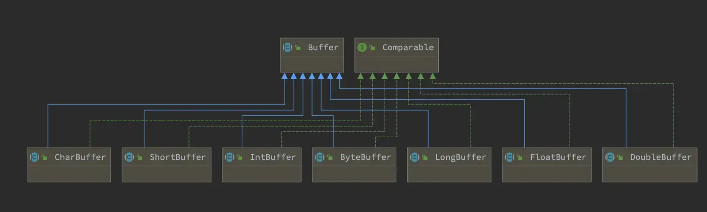](https://zhuanlan.zhihu.com/p/687793377)


## 3\. 与 MappedByteBuffer 相关的几个系统调用

从第一小节介绍的 mmap 在内核中的整个内存映射的过程我们可以看出，当调用 mmap 之后，OS 内核只是会为我们分配了一段 [虚拟内存](https://zhida.zhihu.com/search?content_id=240973675&content_type=Article&match_order=1&q=%E8%99%9A%E6%8B%9F%E5%86%85%E5%AD%98&zhida_source=entity) （MappedByteBuffer），然后将虚拟内存与磁盘文件进行映射，仅此而已。

我们映射的文件内容此时还静静地躺在磁盘中还未加载进内存，映射文件的 page cache 还是空的，由于还未发生物理内存的分配，所以 MappedByteBuffer 在 JVM 进程页表中相关的页表项 pte 也是空的。


image.png

当我们开始访问这段 MappedByteBuffer 的时候，由于此时还没有 [物理内存](https://zhida.zhihu.com/search?content_id=240973675&content_type=Article&match_order=2&q=%E7%89%A9%E7%90%86%E5%86%85%E5%AD%98&zhida_source=entity) 与之映射，于是会产生一个缺页中断，随后 JVM 进程进入 [内核态](https://zhida.zhihu.com/search?content_id=240973675&content_type=Article&match_order=1&q=%E5%86%85%E6%A0%B8%E6%80%81&zhida_source=entity) ，在内核 [缺页处理程序](https://zhida.zhihu.com/search?content_id=240973675&content_type=Article&match_order=1&q=%E7%BC%BA%E9%A1%B5%E5%A4%84%E7%90%86%E7%A8%8B%E5%BA%8F&zhida_source=entity) 中分配物理内存页，然后将刚刚分配的物理内存页加入到映射文件的 page cache。

最后将映射的文件内容从磁盘中读取到这个 [物理内存页](https://zhida.zhihu.com/search?content_id=240973675&content_type=Article&match_order=3&q=%E7%89%A9%E7%90%86%E5%86%85%E5%AD%98%E9%A1%B5&zhida_source=entity) 中并在页表中建立 MappedByteBuffer 与物理内存页的映射关系，后面我们在访问这段 MappedByteBuffer 的时候就是直接访问 page cache 了。

我们利用 MappedByteBuffer 去映射磁盘文件的目的其实就是为了通过 MappedByteBuffer 去直接访问磁盘文件的 page cache，不想切到内核态，也不想发生数据拷贝。

所以为了避免访问 MappedByteBuffer 可能带来的缺页中断产生的开销，我们通常会在调用 `FileChannel#map` 映射完磁盘文件之后，马上主动去触发一次 [缺页中断](https://zhida.zhihu.com/search?content_id=240973675&content_type=Article&match_order=3&q=%E7%BC%BA%E9%A1%B5%E4%B8%AD%E6%96%AD&zhida_source=entity) ，目的就是先把 MappedByteBuffer 背后映射的文件内容预先加载到 page cache 中，并在 JVM 进程页表中建立好 page cache 中的物理内存与 MappedByteBuffer 的映射关系。

后续我们对 MappedByteBuffer 的访问速度就变得非常快了，上述针对 MappedByteBuffer 的预热过程，JDK 封装在 `MappedByteBuffer#load` 方法中：

```
public abstract class MappedByteBuffer extends ByteBuffer
{
   public final MappedByteBuffer load() {
        if (fd == null) {
            return this;
        }
        try {
            // 最终会调用到 MappedMemoryUtils#load 方法
            SCOPED_MEMORY_ACCESS.load(scope(), address, isSync, capacity());
        } finally {
            Reference.reachabilityFence(this);
        }
        return this;
    }
}
```

MappedByteBuffer 预热的核心逻辑主要分为两个步骤：首先 JDK 会调用一个 native 方法 `load0` 将 MappedByteBuffer 背后映射的文件内容先预读进 page cache 中。

```
private static native void load0(long address, long length);

// MappedMemoryUtils.c 文件
JNIEXPORT void JNICALL
Java_java_nio_MappedMemoryUtils_load0(JNIEnv *env, jobject obj, jlong address,
                                     jlong len)
{
    char *a = (char *)jlong_to_ptr(address);
    int result = madvise((caddr_t)a, (size_t)len, MADV_WILLNEED);
    if (result == -1) {
        JNU_ThrowIOExceptionWithLastError(env, "madvise failed");
    }
}
```

这里我们看到 `load0` 方法在 native 层面调用了一个叫做 `madvise` 的系统调用：

```
#include <sys/mman.h>
int madvise(caddr_t addr, size_t len, int advice);
```

madvise 在各大 [中间件](https://zhida.zhihu.com/search?content_id=240973675&content_type=Article&match_order=1&q=%E4%B8%AD%E9%97%B4%E4%BB%B6&zhida_source=entity) 中应用还是非常广泛的，应用程序可以通过该系统调用告知内核，接下来我们将会如何使用 \[addr, addr + len\] 这段范围的虚拟内存，内核后续会根据我们提供的 `advice` 做针对性的处理，用以提高应用程序的性能。

比如，我们可以通过 madvise 系统调用告诉内核接下来我们将顺序访问这段指定范围的虚拟内存，那么内核将会增大对映射文件的预读页数。如果我们是随机访问这段虚拟内存，内核将会禁止对映射文件的预读。

这里我们用到的 advice 选项为 `MADV_WILLNEED ` ，该选项用来告诉内核我们将会马上访问这段虚拟内存，内核在收到这个建议之后，将会马上触发一次预读操作，尽可能将 MappedByteBuffer 背后映射的文件内容全部加载到 page cache 中。

但是 madvise 这里只是负责将 MappedByteBuffer 映射的文件内容加载到内存中（page cache），并不负责将 MappedByteBuffer（虚拟内存） 与 page cache 中的这些文件页（物理内存）进行关联映射，也就是说此时 MappedByteBuffer 在 JVM 进程页表中相关的页表项 PTE 还是空的。

所以 JDK 在调用完 `load0` 方法之后，还需要再次按照内存页的粒度对 MappedByteBuffer 进行访问，目的是触发缺页中断，在缺页 [中断处理](https://zhida.zhihu.com/search?content_id=240973675&content_type=Article&match_order=1&q=%E4%B8%AD%E6%96%AD%E5%A4%84%E7%90%86&zhida_source=entity) 中内核会将 MappedByteBuffer 与 page cache 通过 [进程页表](https://zhida.zhihu.com/search?content_id=240973675&content_type=Article&match_order=4&q=%E8%BF%9B%E7%A8%8B%E9%A1%B5%E8%A1%A8&zhida_source=entity) 关联映射起来。后续我们在对 MappedByteBuffer 进行访问就是直接访问 page cache 了，没有缺页中断也没有磁盘 IO 的开销。

关于 MappedByteBuffer 的 load 逻辑, JDK 封装在 `MappedMemoryUtils` 类中：

```
class MappedMemoryUtils {

    static void load(long address, boolean isSync, long size) {
        // no need to load a sync mapped buffer
        // isSync = true 表示 MappedByteBuffer 背后直接映射的是 non-volatile memory 而不是普通磁盘上的文件
        // MappedBuffer 背后映射的内容已经在 non-volatile memory 中了不需要 load
        if (isSync) {
            return;
        }
        if ((address == 0) || (size == 0))
            return;
        // 返回 pagePosition
        long offset = mappingOffset(address);
        // MappedBuffer 实际映射的内存区域大小 也就是调用 mmap 时指定的 mapSize
        long length = mappingLength(offset, size);
        // mappingAddress 用于获取实际的映射起始位置 mapPosition
        // madvise 也是按照内存页为粒度进行操作的，所以这里和 mmap 一样
        // 需要对指定的 address 和 length 按照内存页的尺寸对齐
        load0(mappingAddress(address, offset), length);

       // 对 MappedByteBuffer 进行访问，触发缺页中断
       // 目的是将 MappedByteBuffer 与 page cache 在进程页表中进行关联映射
        Unsafe unsafe = Unsafe.getUnsafe();
        // 获取内存页的尺寸，大小为 4K
        int ps = Bits.pageSize();
        // 计算 MappedByteBuffer 这片虚拟内存区域所包含的虚拟内存页个数
        long count = Bits.pageCount(length);
        // mmap 起始的映射地址，后面将基于这个地址挨个触发缺页中断
        long a = mappingAddress(address, offset);
        byte x = 0;
        for (long i=0; i<count; i++) {
            // 以内存页为粒度，挨个对 MappedByteBuffer 中包含的虚拟内存页触发缺页中断
            x ^= unsafe.getByte(a);
            a += ps;
        }
        if (unused != 0)
            unused = x;
    }
}
```

这里我们调用 load 方法的目的就是希望将 MappedByteBuffer 背后所映射的文件内容加载到物理内存中，在本文 《2.2 针对 persistent memory 的映射》 小节中，笔者介绍过，当我们调用 `FileChannel#map` 对文件进行内存映射的时候，如果参数 `MapMode` 设置了 READ_ONLY_SYNC 或者 READ_WRITE_SYNC 的话，那么这里的 `isSync = true ` 。

表示 MappedByteBuffer 背后直接映射的是 non-volatile memory 而不是普通磁盘上的文件，映射内容已经在 non-volatile memory 中了，因此就不需要加载了，直接 return 掉。

non-volatile memory 也是需要 filesystem 来进行管理的，这些 filesystem 会通过 dax（direct access mode）进行挂载，从后面相关的 madvise 系统调用源码中我们也会看出，如果映射文件是 DAX 模式的，那么内核也会直接 return，不需要加载。

```
if (IS_DAX(file_inode(file))) {
  return 0;
 }
```

本文 《2.4.1 Unmapper 到底包装了哪些映射信息》小节中我们介绍过，通过 mmap 系统调用真实映射出来的虚拟内存范围与 MappedByteBuffer 所表示的虚拟内存范围是不一样的，MappedByteBuffer 只是其中的一个子集而已。

因为我们在 `FileChannel#map` 函数中指定的映射起始位置 position 是需要与文件页尺寸进行对齐的，这也就是说底层 mmap 系统调用必须要从文件页的起始位置处开始映射。

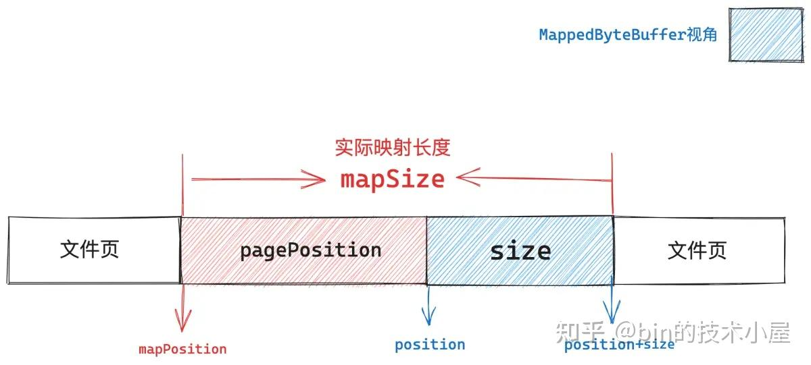

image.png

如果我们指定的 position 没有和文件页进行对齐，那么在 JDK 层面就需要找到 position 所在文件页的起始位置，也就是上图中的 `mapPosition` ，mmap 将会从这里开始映射，映射出来的虚拟内存范围为 `[mapPosition，mapPosition+mapSize]` 。最后 JDK 在从这段虚拟内存范围内划分出 MappedByteBuffer 所需要的范围，也就是我们在 `FileChannel#map` 参数中指定的 `[position，position+size] ` 这段区域。

而 madvise 和 mmap 都是内核层面的系统调用，不管你 JDK 内部如何划分，它们只关注内核层面实际映射出来的虚拟内存，所以我们在调用 madvise 指定虚拟内存范围的时候需要与 mmap 真实映射出来的范围保持一致。

native 方法 load0 中的参数 `address`,其实就是 mmap 的起始映射地址 mapPosition，参数 `length` 其实就是 mmap 真实的映射长度 mapSize。

```
private static native void load0(long address, long length);
```

而 `MappedMemoryUtils#load ` 方法中的参数 `address` 指的是 MappedByteBuffer 的起始地址也就是上面的 `position` ，参数 `size` 指的是 MappedByteBuffer 的容量也就是我们指定的映射长度（并不是实际的映射长度）。

```
static void load(long address, boolean isSync, long size) {
```

所以在进入 `load0` native 实现之前，需要做一些转换工作。首先通过 mappingOffset 根据 MappedByteBuffer 的起始地址 `address` 计算出 address 距离其所在文件页的起始地址的长度，也就是上图中的 pagePosition。该函数的计算逻辑比较简单且之前也已经介绍过了，这里不再赘述。

```
private static long mappingOffset(long address)
```

通过 mappingLength 计算出 mmap 底层实际映射出的虚拟内存大小 mapSize。

```
private static long mappingLength(long mappingOffset, long length) {
        // mappingOffset 即为 pagePosition
        // length 是之前指定的映射长度 size，也就是 MappedByteBuffer 的容量
        return length + mappingOffset;
    }
```

mappingAddress 用于获取 mmap 起始映射地址 mapPosition。

```
private static long mappingAddress(long address, long mappingOffset, long index) {
        // address 为 MappedByteBuffer 的起始地址
        // index 这里指定为 0
        long indexAddress = address + index;
        // mmap 映射的起始地址
        return indexAddress - mappingOffset;
    }
```

这样一来，我们通过 `load0` 方法进入 native 实现中调用 madvise 的时候，这里指定的参数 `addr` 就是上面 mappingAddress 方法返回的 `mapPosition ` ，参数 `len` 就是 mappingLength 方法返回的 `mapSize ` ，参数 `advice ` 指定为 MADV_WILLNEED，立即触发一次预读。

```
#include <sys/mman.h>
int madvise(caddr_t addr, size_t len, int advice);
```

### 3.1 madvise

```
// 文件：/mm/madvise.c
SYSCALL_DEFINE3(madvise, unsigned long, start, size_t, len_in, int, behavior)
{
    end = start + len;
    vma = find_vma_prev(current->mm, start, &prev);
    for (;;) {
        /* Here vma->vm_start <= start < tmp <= (end|vma->vm_end). */
        error = madvise_vma(vma, &prev, start, tmp, behavior);
    }
out:
    return error;
}
```

madvise 的作用其实就是在我们指定的虚拟内存范围 \[start, end\] 内包含的所有虚拟内存区域 vma 中依次根据我们指定的 behavior 触发 madvise_vma 执行相关的 behavior 处理逻辑。

find_vma_prev 的作用就是根据我们指定的映射起始地址 addr（start），在进程地址空间中查找出符合 `addr < vma->vm_end` 条件的第一个 vma 出来（下图中的蓝色部分）。

> 关于该函数的详细实现，感兴趣的读者可以回看下笔者之前的文章 [《从内核世界透视 mmap 内存映射的本质（源码实现篇）》](https://link.zhihu.com/?target=https%3A//mp.weixin.qq.com/s%3F__biz%3DMzg2MzU3Mjc3Ng%3D%3D%26mid%3D2247488879%26idx%3D1%26sn%3D4cbbabc648e1a29466c3309371a27a4f%26chksm%3Dce77d328f9005a3e7a0bb0b0ff7ad88b5a3f10c8ad850fb5b503d51001b63eeb2c909ba32a78%26scene%3D178%26cur_album_id%3D2559805446807928833%23rd)

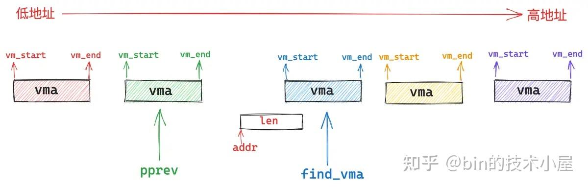

image.png

如果我们指定的起始虚拟 [内存地址](https://zhida.zhihu.com/search?content_id=240973675&content_type=Article&match_order=1&q=%E5%86%85%E5%AD%98%E5%9C%B0%E5%9D%80&zhida_source=entity) start 是一个无效的地址（未被映射），那么内核这里就会返回 `ENOMEM` 错误。

通过 find_vma_prev 查找出来的 vma 就是我们指定虚拟内存范围 \[start, end\] 内的第一个虚拟内存区域，后续内核会在一个 for 循环内从这个 vma 开始依次调用 madvise_vma，在指定虚拟内存范围内的所有 vma 中执行 behavior 相关的处理逻辑。

```
static long
madvise_vma(struct vm_area_struct *vma, struct vm_area_struct **prev,
       unsigned long start, unsigned long end, int behavior)
{
   switch (behavior) {
   case MADV_WILLNEED:
       return madvise_willneed(vma, prev, start, end);
   }
}
```

其中 `MADV_WILLNEED` 的处理逻辑被内核封装在 `madvise_willneed` 方法中：

```
static long madvise_willneed(struct vm_area_struct *vma,
                 struct vm_area_struct **prev,
                 unsigned long start, unsigned long end)
{
    // 获取映射文件
    struct file *file = vma->vm_file;
    // 映射内容在文件中的偏移
    loff_t offset;
    // 判断映射文件是否是 persistent memory filesystem 上的文件
    if (IS_DAX(file_inode(file))) {
        // 这里说明 mmap 映射的是 persistent memory 直接返回
        return 0;
    }
    // madvise 底层其实调用的是 fadvise
    vfs_fadvise(file, offset, end - start, POSIX_FADV_WILLNEED);
    return 0;
}
```

从这里我们可以看出，如果映射文件是 persistent memory filesystem （通过 DAX 模式挂载）中的文件，那么表示这段虚拟内存背后直接映射的是 persistent memory ，madvise 系统调用直接就返回了。

这也解释了为什么 JDK 会在 `MappedMemoryUtils#load ` 方法的一开始，就会判断如果 `isSync  = true` 就直接返回，因为映射的文件内容已经存在于 persistent memory 中了，不需要再次加载了。

最终内核关于 advice 的处理逻辑封装在 `vfs_fadvise ` 函数中，这里我们也可以看出 madvise 系统调用与 fadvise 系统调用本质上是一样的，最终都是通过这里的 vfs_fadvise 函数来处理。

```
// 文件：/mm/fadvise.c
int vfs_fadvise(struct file *file, loff_t offset, loff_t len, int advice)
{
    return generic_fadvise(file, offset, len, advice);
}

int generic_fadvise(struct file *file, loff_t offset, loff_t len, int advice)
{
    // 获取映射文件的 page cache
    mapping = file->f_mapping;
    switch (advice) {
    case POSIX_FADV_WILLNEED:
        // 将文件中范围为 [start_index, end_index] 的内容预读进 page cache 中
        start_index = offset >> PAGE_SHIFT;
        end_index = endbyte >> PAGE_SHIFT;
        // 计算需要预读的内存页数
        // 但内核不一定会按照 nrpages 指定的页数进行预读，还需要结合预读窗口来综合判断具体的预读页数
        nrpages = end_index - start_index + 1;

        // 强制进行预读，之后映射的文件内容就会加载进 page cache 中了
        // 如果预读失败的话，这里会忽略掉错误，所以在应用层面是感知不到预读成功或者失败了的
        force_page_cache_readahead(mapping, file, start_index, nrpages);
        break;
    }
    return 0;
}
EXPORT_SYMBOL(generic_fadvise);
```

内核对于 `MADV_WILLNEED ` 的处理其实就是通过 `force_page_cache_readahead` 立即触发一次预读，将之前通过 mmap 映射的文件内容全部预读进 page cache 中。

> 关于 force_page_cache_readahead 的详细内容，感兴趣的读者可以回看之前的文章 [《从 Linux 内核角度探秘 JDK NIO 文件读写本质》](https://link.zhihu.com/?target=https%3A//mp.weixin.qq.com/s%3F__biz%3DMzg2MzU3Mjc3Ng%3D%3D%26mid%3D2247486623%26idx%3D1%26sn%3D0cafed9e89b60d678d8c88dc7689abda%26chksm%3Dce77cad8f90043ceaaca732aaaa7cb692c1d23eeb6c07de84f0ad690ab92d758945807239cee%26scene%3D178%26cur_album_id%3D2559805446807928833%23rd)

但这里需要注意的是预读可能会失败，内核这里会忽略掉预读失败的错误，我们在应用层面调用 madvise 的时候是感知不到预读失败的。

还有一点就是 madvise 中的 MADV_WILLNEED 只是将虚拟内存（MappedByteBuffer）背后映射的文件内容加载到 page cache 中。

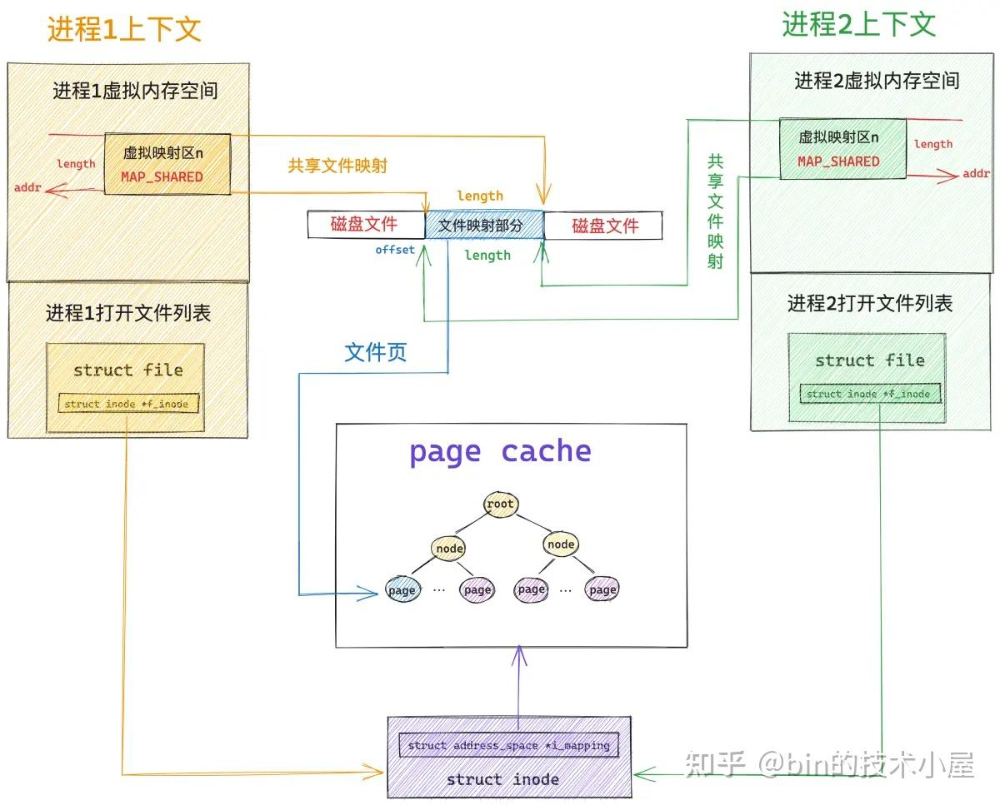

image.png

当 madvise 系统调用返回的时候，虽然此时映射的文件内容已经在 page cache 中了，但是这些刚刚被加载进 page cache 的文件页还没有与 MappedByteBuffer 进行关联，也就是说 MappedByteBuffer 在 JVM 进程页表中对应的页表项 pte 仍然还是空的。


image.png

后续我们访问这段 MappedByteBuffer 的时候仍然会触发缺页中断，但是这种情况下的缺页中断是轻量的，属于 VM_FAULT_MINOR 类型的缺页，因为之前映射的文件内容已经通过 madvise 加载到 page cache 中了，这里只需要通过进程页表将 MappedByteBuffer 与 page cache 中的文件页关联映射起来就可以了，不需要重新分配内存以及发生磁盘 IO 。

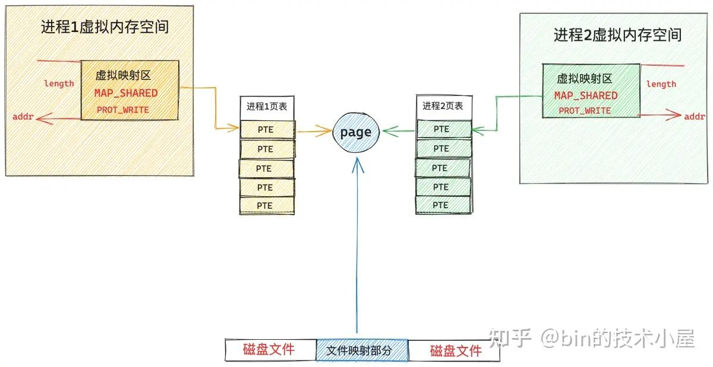

image.png

所以这也是为什么在 `MappedMemoryUtils#load ` 方法中，JDK 在调用完 native 方法 `load0 ` 之后，仍然需要以内存页为粒度再次访问一下 MappedByteBuffer 的原因，目的是通过缺页中断（VM_FAULT_MINOR）将 page cache 与 MappedByteBuffer 通过页表关联映射起来。

### 3.2 mlock

MappedByteBuffer 经过上面 `MappedByteBuffer#load` 函数的处理之后，现在 MappedByteBuffer 背后所映射的文件内容已经加载到 page cache 中了，并且在 JVM 进程页表中也已经建立好了 MappedByteBuffer 与 page cache 的映射关系。

从目前来看我们通过 MappedByteBuffer 就可以直接访问到 page cache 了，不需要经历缺页中断的开销。但 page cache 所占用的是物理内存，当系统中物理内存压力大的时候，内核仍然会将 page cache 中的文件页 swap out 出去。

这时如果我们再次访问 MappedByteBuffer 的时候，依然会发生缺页中断，当 MappedByteBuffer 被我们用来实现系统中的核心功能时，这就迫使我们要想办法让 MappedByteBuffer 背后映射的物理内存一直驻留在内存中，不允许内核 swap 。那么本小节要介绍的 mlock 系统调用就派上用场了。

```
#include <sys/mman.h>
int mlock(const void *addr, size_t len);
```

mlock 的主要作用是将 \[addr, addr+len\] 这段范围内的虚拟内存背后映射的物理内存锁定在内存中，当内存资源紧张的时候，这段物理内存将不会被 swap out 出去。

如果 \[addr, addr+len\] 这段虚拟内存背后还未映射物理内存，那么 mlock 也会立即在这段虚拟内存上主动触发缺页中断，为其分配物理内存，并在进程页表中建立映射关系。

```
// 文件：/mm/mlock.c
SYSCALL_DEFINE2(mlock, unsigned long, start, size_t, len)
{
 return do_mlock(start, len, VM_LOCKED);
}
```

do_mlock 的核心主要分为两个步骤：

1. 利用 apply_vma_lock_flags 函数在锁定范围内的虚拟内存区域内打上一个 `VM_LOCKED ` 标记，后续内核在 swap 的时候，如果遇到被 `VM_LOCKED ` 标记的虚拟内存区域，那么它背后映射的物理内存将不会被 swap out 出去，而是会一直驻留在内存中。
2. 如果指定锁定范围内的虚拟内存还未有物理内存与之映射，那么内核则调用 \_\_mm_populate 主动为其填充物理内存，并在进程页表中建立虚拟内存与物理内存的映射关系，从本文的视角上来说，就是建立 MappedByteBuffer 与 page cache 的映射关系。

```
static __must_check int do_mlock(unsigned long start, size_t len, vm_flags_t flags)
{
    // 本次需要锁定的内存页个数
    unsigned long locked;
    // 内核允许单个进程能够锁定的物理内存页个数
    unsigned long lock_limit;
    // 检查内核是否允许进行内存锁定
    if (!can_do_mlock())
        return -EPERM;
    // 进程的相关资源限制配额定义在 task_struct->signal_struct->rlim 数组中
    // rlimit(RLIMIT_MEMLOCK) 表示内核允许单个进程对物理内存锁定的限额，单位为字节
    lock_limit = rlimit(RLIMIT_MEMLOCK);
    // 转换为内存页个数
    lock_limit >>= PAGE_SHIFT;
    locked = len >> PAGE_SHIFT;
    // mm->locked_vm 表示当前进程已经锁定的物理内存页个数
    locked += current->mm->locked_vm;

    // 如果需要锁定的内存资源没有超过内核的限制
    // 并且内核允许进行内存锁定
    if ((locked <= lock_limit) || capable(CAP_IPC_LOCK))
        // 将 VM_LOCKED 标志设置到 [start, start + len] 这段虚拟内存范围内所有 vma 的属性 vm_flags 中
        error = apply_vma_lock_flags(start, len, flags);
    // 遍历 [start, start + len] 这段虚拟内存范围内所包含的所有虚拟内存页
    // 依次在每个虚拟内存页上进行缺页处理，将其背后映射的文件内容读取到 page cache 中
    // 并在进程页表中建立好虚拟内存到 page cache 的映射关系
    error = __mm_populate(start, len, 0);
    return 0;
}
```

一个进程能够允许锁定的内存资源在内核中是有限制的，内核对进程相关资源的限制配额保存在 `task_struct->signal_struct->rlim` 数组中：

```
struct task_struct {
  struct signal_struct *signal;
}

struct signal_struct {
  // 进程相关的资源限制，相关的资源限制以数组的形式组织在 rlim 中
  // RLIMIT_MEMLOCK 下标对应的是进程能够锁定的内存资源，单位为bytes
  struct rlimit rlim[RLIM_NLIMITS];
}

struct rlimit {
 __kernel_ulong_t rlim_cur;
 __kernel_ulong_t rlim_max;
};
```

我们可以通过修改 `/etc/security/limits.conf` 文件中的 memlock 相关配置项来调整能够被锁定的内存资源配额，设置为 unlimited 表示不对锁定内存进行限制。

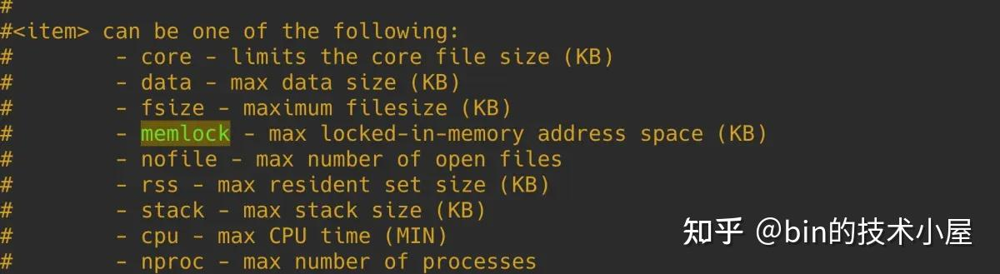

image.png

进程能够锁定的物理内存资源配额通过 `rlimit(RLIMIT_MEMLOCK)` 来获取，单位为字节。

```
// 定义在文件：/include/linux/sched/signal.h
static inline unsigned long rlimit(unsigned int limit)
{
    // 参数 limit 为相关资源的下标
    return task_rlimit(current, limit);
}

static inline unsigned long task_rlimit(const struct task_struct *task,
        unsigned int limit)
{
    return READ_ONCE(task->signal->rlim[limit].rlim_cur);
}
```

内核在对内存进行锁定之前，需要通过 can_do_mlock 函数判断一下是否允许本次锁定操作：

1. `rlimit(RLIMIT_MEMLOCK) != 0` 表示进程能够锁定的内存资源限额还没有用完，允许本次锁定操作。
2. 如果锁定内存资源的限额已经用完，但是 `capable(CAP_IPC_LOCK) = true` 表示当前进程拥有 `CAP_IPC_LOCK` 权限，那么即使在锁定资源配额用完的情况下，内核也是允许进程对内存资源进行锁定的。

```
bool can_do_mlock(void)
{
    // 内核会限制能够被锁定的内存资源大小，单位为bytes
    // 这里获取 RLIMIT_MEMLOCK 能够锁定的内存资源，如果为 0 ，则不能够锁定内存了。
    if (rlimit(RLIMIT_MEMLOCK) != 0)
        return true;
    // 检查内核是否允许 mlock ，mlockall 等内存锁定操作
    if (capable(CAP_IPC_LOCK))
        return true;
    return false;
}
```

如果当前进程已经锁定的内存资源没有超过内核的限制或者是当前进程拥有 `CAP_IPC_LOCK ` 权限，那么内核就调用 apply_vma_lock_flags 将 \[start, start + len\] 这段虚拟内存范围内映射的物理内存锁定在内存中。

```
if ((locked <= lock_limit) || capable(CAP_IPC_LOCK))
        error = apply_vma_lock_flags(start, len, flags);
```

内存锁定的逻辑其实非常简单，首先将 \[start, start + len\] 这段虚拟内存范围内的所有的虚拟内存区域 vma 查找出来，然后依次遍历这些 vma, 并将 `VM_LOCKED ` 标志设置到 vma 的 vm_flags 标志位中。

```
struct vm_area_struct {
 unsigned long vm_flags;
}
```

后续在物理内存资源紧张，内核开始 swap 的时候，当遇到 vm_flags 设置了 `VM_LOCKED` 的虚拟内存区域 vma 的时候，那么它背后映射的物理内存将不会被内核 swap out 出去。

从这里我们可以看出，所谓的内存锁定只不过是在指定锁定范围内的所有虚拟内存区域 vma 上打一个 `VM_LOCKED` 标记而已，但我们锁定的对象却是虚拟内存背后映射的物理内存。

所以接下来内核就会调用 \_\_mm_populate 为 \[start, start + len\] 这段虚拟内存分配物理内存。内核这里首先还是将 \[start, start + len\] 这段虚拟内存范围内的所有 vma 查找出来，并立即依次为每个 vma 填充物理内存。

```
int __mm_populate(unsigned long start, unsigned long len, int ignore_errors)
{
    end = start + len;
    // 依次遍历进程地址空间中 [start , end] 这段虚拟内存范围的所有 vma
    for (nstart = start; nstart < end; nstart = nend) {

              ........ 省略查找指定地址范围内 vma 的过程 ....

        // 为 vma 分配物理内存
        ret = populate_vma_page_range(vma, nstart, nend, &locked);
        // 继续为下一个 vma （如果有的话）分配物理内存
        nend = nstart + ret * PAGE_SIZE;
        ret = 0;
    }

    return ret; /* 0 or negative error code */
}
```

populate_vma_page_range 负责计算单个 vma 中包含的虚拟内存页个数，然后调用 `__get_user_pages` 函数在每一个虚拟内存页上依次主动触发缺页中断处理。

```
long populate_vma_page_range(struct vm_area_struct *vma,
        unsigned long start, unsigned long end, int *nonblocking)
{
    // 获取进程地址空间
    struct mm_struct *mm = vma->vm_mm;
    // 计算 vma 中包含的虚拟内存页个数，后续会按照 nr_pages 分配物理内存
    unsigned long nr_pages = (end - start) / PAGE_SIZE;
    int gup_flags;

    // 循环遍历 vma 中的每一个虚拟内存页，依次为其分配物理内存页
    return __get_user_pages(current, mm, start, nr_pages, gup_flags,
                NULL, NULL, nonblocking);
}
```

\_\_get_user_pages 函数首先会通过 `follow_page_mask` 在进程页表中检查一下每一个虚拟内存页是否已经映射了物理内存，如果已经有物理内存了，那么这里就不用分配了，直接跳过。

如果虚拟内存页还没有映射物理内存，那么内核就会调用 `faultin_page` 立即触发一次缺页中断，在缺页中断的处理中，内核就会将该虚拟内存页（MappedByteBuffer）背后所映射的文件内容读取到 page cache 中，并在进程页表中建立 MappedByteBuffer 与 page cache 的映射关系。

> 关于缺页中断的处理细节，感兴趣的读者可以回看下 [《一文聊透 Linux 缺页异常的处理 —— 图解 Page Faults》](https://link.zhihu.com/?target=https%3A//mp.weixin.qq.com/s%3F__biz%3DMzg2MzU3Mjc3Ng%3D%3D%26mid%3D2247489107%26idx%3D1%26sn%3D8380aea1178ff3b0b763fecc55feeb37%26chksm%3Dce77d014f90059020823e9f66c1377d6db5009a9e910c56cdca8d8c0b8d0cea2270a1faa5fcc%26scene%3D178%26cur_album_id%3D2559805446807928833%23rd)

```
static long __get_user_pages(struct task_struct *tsk, struct mm_struct *mm,
        unsigned long start, unsigned long nr_pages,
        unsigned int gup_flags, struct page **pages,
        struct vm_area_struct **vmas, int *nonblocking)
{
    // 循环遍历 vma 中的每一个虚拟内存页
    do {
        struct page *page;
        // 在进程页表中检查该虚拟内存页背后是否有物理内存页映射
        page = follow_page_mask(vma, start, foll_flags, &ctx);
        if (!page) {
            // 如果虚拟内存页在页表中并没有物理内存页映射，那么这里调用 faultin_page
            // 底层会调用到 handle_mm_fault 进入缺页处理流程 (write fault)，分配物理内存，在页表中建立好映射关系
            ret = faultin_page(tsk, vma, start, &foll_flags,
                    nonblocking);
    } while (nr_pages);

    return i ? i : ret;
}
```

到这里 mlock 系统调用就为大家介绍完了，接下来我们把上小节介绍的 madvise 系统调用与本小节的 mlock 放在一起对比一下，加深一下理解。

首先 madvise 系统调用中的 `MADV_WILLNEED ` 作用很简单，当我们在 MappedByteBuffer 身上运用 madvise 之后，内核只是会将 MappedByteBuffer 背后所映射的文件内容加载到 page cache 中而已。

但 madvise 不会将 page cache 与 MappedByteBuffer 在进程页表中映射，后面进程在访问 MappedByteBuffer 的时候仍然会产生缺页中断，在缺页中断处理中才会与 page cache 在进程页表中进行映射关联。

当内存资源紧张的时候，page cache 中的文件页可能会被内核 swap out 出去，这时访问 MappedByteBuffer 还是会触发缺页中断。

当我们在 MappedByteBuffer 身上运用 mlock 之后，情况就不一样了，首先 mlock 系统调用也会将 MappedByteBuffer 背后所映射的文件内容加载到 page cache 中，除此之外，mlock 还会将 MappedByteBuffer 与 page cache 在进程页表中映射起来，更重要的一点是，mlock 会将 page cache 中缓存的相关文件页锁定在内存中。

### 3.3 msync

我们都知道 MappedByteBuffer 在刚被 `FileChannel#map` 映射出来的时候，它只是一片虚拟内存而已，映射文件的 page cache 是空的，进程页表中对应的页表项也都是空的。

后续我们通过访问 MappedByteBuffer 直接触发缺页中断也好，亦或者是通过前面介绍的两个系统调用 madvise, mlock 也罢，它们解决的问题是负责将 MappedByteBuffer 背后映射的文件内容加载到物理内存中（page cache）,然后在进程页表中设置 MappedByteBuffer 与 page cache 的关联关系，以保证后续进程可以通过 MappedByteBuffer 直接访问 page cache。

但无论是通过 MappedByteBuffer 还是传统的 `FileChannel#read or write` ，它们在对文件进行读写的时候都是直接操作的 page cache。page cache 中被写入的文件页就会变成脏页，后续内核会根据自己的回写策略将脏页刷新到磁盘文件中。

但内核的回写策略是内核自己的行为，站在用户进程的角度来看属于被动回写，如果用户进程想要自己主动触发脏页的回写就需要用到一些相关的系统调用。

而负责脏页回写的系统调用有很多，比如：sync，fsync, fdatasync 以及本小节要介绍的 msync。其中 sync 主要负责回写整个系统内所有的脏页以及相关文件的 metadata。

而 fsync 和 fdatasync 主要是针对特定文件的脏页回写，其中 fsync 不仅会回写特定文件的脏页数据而且会回写文件的 metadata，fdatasync 就只会回写特定文件的脏页数据不会回写文件的 metadata。

FileChannel 中的 force 方法就是针对特定文件脏页的回写操作，参数 metaData 指定为 true 表示我们不仅需要对文件脏页内容进行回写还需要对文件的 metadata 进行回写，所以在 native 层调用的是 fsync。

参数 metaData 指定为 false 表示我们仅仅是需要回写文件的脏页内容，所以在 native 层调用的是 fdatasync 。

```
public class FileChannelImpl extends FileChannel
{
    public void force(boolean metaData) throws IOException {
            do {
                // metaData = true  调用 fsync
                // metaData = false 调用 fdatasync
                rv = nd.force(fd, metaData);
            } while ((rv == IOStatus.INTERRUPTED) && isOpen());
     }
}
```

但 MappedByteBuffer 的回写却不是针对整个文件的，而是针对其所映射的文件区域进行回写，这就用到了 msync 系统调用。

```
#include <sys/mman.h>
int msync(void *addr, size_t len, int flags);
```

msync 主要针对 \[addr, addr+ken\] 这段虚拟内存范围内所映射的文件区域进行回写，但 msync 只会回写脏页数据并不会回写文件的 metadata。参数 flags 用于指定回写的方式，最常用的是 `MS_SYNC ` ，它表示进程需要等到回写操作完成之后才会从该系统调用中返回。

除了 MS_SYNC 之外内核还提供了 MS_ASYNC，MS_INVALIDATE 这两个 flags 选项，但翻阅 msync 系统调用的源码你会发现，当我们设置了 MS_ASYNC 或者 MS_INVALIDATE 时，msync 不会做任何事情，相当于白白调用了一次。内核之所以会继续保留这两个选项，笔者这里猜测可能是为了兼容老版本内核关于脏页相关的处理逻辑，这里我们就不详细展开了。

`MappedByteBuffer#force` 方法用于对指定映射范围 \[index，index+len\] 内的文件内容进行回写：

```
public abstract class MappedByteBuffer extends ByteBuffer
{
   public final MappedByteBuffer force(int index, int length) {
        int capacity = capacity();
        if ((address != 0) && (capacity != 0)) {
            SCOPED_MEMORY_ACCESS.force(scope(), fd, address, isSync, index, length);
        }
        return this;
    }
}
```

关于 MappedByteBuffer 的核心回写逻辑 JDK 封装在 MappedMemoryUtils 类中：

```
class MappedMemoryUtils {
    static void force(FileDescriptor fd, long address, boolean isSync, long index, long length) {
        if (isSync) {
            //  如果 MappedByteBuffer 背后映射的是 persistent memory
            //  那么在 force 回写数据的时候是通过 CPU 指令完成的而不是 msync 系统调用
            Unsafe.getUnsafe().writebackMemory(address + index, length);
        } else {
            // force writeback via file descriptor
            long offset = mappingOffset(address, index);
            try {
                force0(fd, mappingAddress(address, offset, index), mappingLength(offset, length));
            } catch (IOException cause) {
                throw new UncheckedIOException(cause);
            }
        }
    }

    private static native void force0(FileDescriptor fd, long address, long length) throws IOException;
}
```

如果 MappedByteBuffer 背后映射的是 persistent memory（isSync = true）,那么这里的回写指的是将数据从 CPU 高速缓存 cache line 中刷新到 persistent memory 中。

不过这个刷新操作是通过 CLWK 指令（cache line writeback）将 cache line 中的数据 flush 到 persistent memory 中。不需要像传统磁盘文件那样需要启动 [块设备](https://zhida.zhihu.com/search?content_id=240973675&content_type=Article&match_order=1&q=%E5%9D%97%E8%AE%BE%E5%A4%87&zhida_source=entity) IO 来回写磁盘。

如果 MappedByteBuffer 背后映射的是普通磁盘文件的话，JDK 这里就会调用一个 native 方法 force0 将映射文件区域的脏页回写到磁盘中，我们在 force0 的 native 实现中可以看到，JVM 这里调用了 msync。

msync 和 mmap 也是需要配对使用的，mmap 负责映射，msync 负责将映射出来的文件区域相关的脏页回写到磁盘中，所以我们在调用 msync 的时候，指定的虚拟内存范围需要和 mmap 真实映射出来的虚拟内存范围保持一致。

通过 mappingAddress 函数获取 mmap 真实的起始映射地址 mapPosition，通过 mappingLength 获取真实映射出来的区域大小 mapSize，将这两个值作为要进行回写的文件映射范围传入 msync 系统调用中。

```
// 文件：MappedMemoryUtils.c
JNIEXPORT void JNICALL
Java_java_nio_MappedMemoryUtils_force0(JNIEnv *env, jobject obj, jobject fdo,
                                      jlong address, jlong len)
{
    void* a = (void *)jlong_to_ptr(address);
    int result = msync(a, (size_t)len, MS_SYNC);
    if (result == -1) {
        JNU_ThrowIOExceptionWithLastError(env, "msync failed");
    }
}
```

下面我们来看一下当 JVM 调用 msync 之后，在内核中到底发生了什么：

首先如果我们指定的这段 \[start, end\] 虚拟内存地址是无效的，也就是还未被映射过，那么内核就会返回 `ENOMEM ` 错误。

后面还是老套路，通过 `find_vma ` 函数在进程地址空间中查找出 \[start, end\] 这段虚拟内存范围内第一个 vma 出来，然后在一个 for 循环中依次遍历指定范围内的所有 vma，并通过 `vfs_fsync_range ` 将 vma 背后映射的文件区域内的脏页回写到磁盘中。

```
// 文件：/mm/msync.c
SYSCALL_DEFINE3(msync, unsigned long, start, size_t, len, int, flags)
{
    unsigned long end;
    struct mm_struct *mm = current->mm;
    struct vm_area_struct *vma;
    // [start,end] 这段虚拟内存范围内所映射的文件内容将会被回写到磁盘中
    end = start + len;
    // 在进程地址空间中查找第一个符合 start < vma->vm_end 的 vma 区域
    vma = find_vma(mm, start);
    // 遍历 [start,end] 区域内的所有 vma，依次回写脏页
    for (;;) {
        // 映射文件
        struct file *file;
        // MappedByteBuffer 映射的文件区域 [fstart,fend]
        loff_t fstart, fend;
        // 如果我们指定了一段无效的虚拟内存区域 [start,end]，那么内核会返回 ENOMEM 错误
        error = -ENOMEM;
        if (!vma)
            goto out_unlock;
        /* Here start < vma->vm_end. */
        if (start < vma->vm_start) {
            start = vma->vm_start;
            if (start >= end)
                goto out_unlock;
            unmapped_error = -ENOMEM;
        }

        file = vma->vm_file;
        // 映射的文件内容在磁盘文件中的起始偏移
        fstart = (start - vma->vm_start) +
             ((loff_t)vma->vm_pgoff << PAGE_SHIFT);
        // 映射的文件内容在文件中的结束偏移
        fend = fstart + (min(end, vma->vm_end) - start) - 1;
        if ((flags & MS_SYNC) && file &&
                (vma->vm_flags & VM_SHARED)) {
            // 回写 [fstart,fend] 这段文件区域内的脏页到磁盘中
            error = vfs_fsync_range(file, fstart, fend, 1);
        }
    }
out_unlock:
     // 释放进程地址空间锁
    up_read(&mm->mmap_sem);
out:
    return error ? : unmapped_error;
}
```

vfs_fsync_range 函数最后一个参数 `datasync` 表示是否回写映射文件的 metadata， `datasync = 0` 表示文件的 metadata 以及脏页内容都需要回写。 `datasync = 1` 表示只需要回写脏页内容。

这里我们看到 msync 系统调用将 datasync 设置为 1，只需要回写脏页内容即可。

```
int vfs_fsync_range(struct file *file, loff_t start, loff_t end, int datasync)
{
    struct inode *inode = file->f_mapping->host;
    // 映射文件所在的文件系统必须定义脏页回写函数 fsync
    if (!file->f_op->fsync)
        return -EINVAL;
    if (!datasync && (inode->i_state & I_DIRTY_TIME))
        // datasync = 0 表示不仅需要回写脏页数据而且还需要回写文件 metadata
        mark_inode_dirty_sync(inode);
    // 调用具体文件系统中实现的 fsync 函数，实现对指定文件区域内的脏页进行回写
    return file->f_op->fsync(file, start, end, datasync);
}
EXPORT_SYMBOL(vfs_fsync_range);
```

msync 系统调用最终会调用到文件相关的操作函数 fsync，它和具体的文件系统相关，不同的文件系统有不同的实现，但最终回写脏页的时候都需要启动磁盘块设备 IO 对脏页进行回写。

## 4\. 零拷贝

关于零拷贝这个话题，笔者原本不想再聊了，因为网上有太多讨论零拷贝的文章了，而且有些写的真挺不错的，可是大部分文章都在写 MappedByteBuffer 相较于传统 FileChannel 的优势，但好像很少有人来写一写 MappedByteBuffer 的劣势，所以笔者这里想写一点不一样的，来和大家讨论讨论 MappedByteBuffer 的劣势有哪些。

但在开始讨论这个话题之前，笔者想了想还是不能免俗，仍然需要把 MappedByteBuffer 和 FileChannel 放在一起从头到尾对比一下，基于这个思路，我们先来重新简要梳理一下 FileChannel 和 MappedByteBuffer 读写文件的流程。

在之前的文章 [《从 Linux 内核角度探秘 JDK NIO 文件读写本质》](https://link.zhihu.com/?target=https%3A//mp.weixin.qq.com/s%3F__biz%3DMzg2MzU3Mjc3Ng%3D%3D%26mid%3D2247486623%26idx%3D1%26sn%3D0cafed9e89b60d678d8c88dc7689abda%26chksm%3Dce77cad8f90043ceaaca732aaaa7cb692c1d23eeb6c07de84f0ad690ab92d758945807239cee%26scene%3D178%26cur_album_id%3D2559805446807928833%23rd) 中，由于当时我们还未介绍 DirectByteBuffer 以及 MappedByteBuffer，所以笔者以 HeapByteBuffer 为例来介绍 FileChannel 读写文件的整个源码实现逻辑。

当我们使用 HeapByteBuffer 传入 FileChannel 的 read or write 方法对文件进行读写时，JDK 会首先创建一个临时的 DirectByteBuffer，对于 `FileChannel#read` 来说，JDK 在 native 层会将 read 系统调用从文件中读取的内容首先存放到这个临时的 DirectByteBuffer 中，然后在拷贝到 HeapByteBuffer 中返回。

对于 `FileChannel#write` 来说，JDK 会首先将 HeapByteBuffer 中的待写入数据拷贝到临时的 DirectByteBuffer 中，然后在 native 层通过 write 系统调用将 DirectByteBuffer 中的数据写入到文件的 page cache 中。

```
public class IOUtil {

   static int read(FileDescriptor fd, ByteBuffer dst, long position,
                    NativeDispatcher nd)
        throws IOException
    {
        // 如果我们传入的 dst 是 DirectBuffer，那么直接进行文件的读取
        // 将文件内容读取到 dst 中
        if (dst instanceof DirectBuffer)
            return readIntoNativeBuffer(fd, dst, position, nd);

        // 如果我们传入的 dst 是一个 HeapBuffer，那么这里就需要创建一个临时的 DirectBuffer
        // 在调用 native 方法底层利用 read  or write 系统调用进行文件读写的时候
        // 传入的只能是 DirectBuffer
        ByteBuffer bb = Util.getTemporaryDirectBuffer(dst.remaining());
        try {
            // 底层通过 read 系统调用将文件内容拷贝到临时 DirectBuffer 中
            int n = readIntoNativeBuffer(fd, bb, position, nd);
            if (n > 0)
                // 将临时 DirectBuffer 中的文件内容在拷贝到 HeapBuffer 中返回
                dst.put(bb);
            return n;
        }
    }

    static int write(FileDescriptor fd, ByteBuffer src, long position,
                     NativeDispatcher nd) throws IOException
    {
        // 如果传入的 src 是 DirectBuffer，那么直接将 DirectBuffer 中的内容拷贝到文件 page cache 中
        if (src instanceof DirectBuffer)
            return writeFromNativeBuffer(fd, src, position, nd);
        // 如果传入的 src 是 HeapBuffer，那么这里需要首先创建一个临时的 DirectBuffer
        ByteBuffer bb = Util.getTemporaryDirectBuffer(rem);
        try {
            // 首先将 HeapBuffer 中的待写入内容拷贝到临时的 DirectBuffer 中
            // 随后通过 write 系统调用将临时 DirectBuffer 中的内容写入到文件 page cache 中
            int n = writeFromNativeBuffer(fd, bb, position, nd);
            return n;
        }
    }
}
```

当时有很多读者朋友给我留言提问说，为什么必须要在 DirectByteBuffer 中做一次中转，直接将 HeapByteBuffer 传给 native 层不行吗 ？

答案是肯定不行的，在本文开头笔者为大家介绍过 JVM 进程的虚拟内存空间布局，如下图所示：


image.png

HeapByteBuffer 和 DirectByteBuffer 从本质上来说均是 JVM 进程地址空间内的一段虚拟内存，对于 Java 程序来说 HeapByteBuffer 被用来特定表示 JVM 堆中的内存，而 DirectByteBuffer 就是一个普通的 C++ 程序通过 malloc 系统调用向 [操作系统](https://zhida.zhihu.com/search?content_id=240973675&content_type=Article&match_order=1&q=%E6%93%8D%E4%BD%9C%E7%B3%BB%E7%BB%9F&zhida_source=entity) 申请的一段 Native Memory 位于 JVM 堆之外。

既然 HeapByteBuffer 是位于 JVM 堆中的内存，那么它必然会受到 GC 的管理，当发生 GC 的时候，如果我们选择的垃圾回收器采用的是 Mark-Copy 或者 Mark-Compact 算法的时候（Mark-Swap 除外），GC 会来回移动存活的对象，这就导致了存活的 Java 对象比如这里的 HeapByteBuffer 在 GC 之后它背后的内存地址可能已经发生了变化。

而 JVM 中的这些 native 方法是处于 safepoint 之下的，执行 native 方法的线程由于是处于 safepoint 中，所以在执行 native 方法的过程中可能会有 GC 的发生。

如果我们把一个 HeapByteBuffer 传递给 native 层进行文件读写的时候不巧发生了 GC，那么 HeapByteBuffer 背后的内存地址就会变化，这样一来，如果我们在读取文件的话，内核将会把文件内容拷贝到另一个内存地址中。如果我们在写入文件的话，内核将会把另一个内存地址中的内存写入到文件的 page cache 中。

所以我们在通过 native 方法执行相关系统调用的时候必须要保证传入的内存地址是不会变化的，由于 DirectByteBuffer 背后所依赖的 Native Memory 位于 JVM 堆之外，是不会受到 GC 管理的，因此不管发不发生 GC，DirectByteBuffer 所引用的这些 Native Memory 地址是不会发生变化的。

所以我们在调用 native 方法进行文件读写的时候需要传入 DirectByteBuffer，如果我们用得是 HeapByteBuffer ，那么就需要一个临时的 DirectByteBuffer 作为中转。

这时可能有读者朋友又会问了，我们在使用 HeapByteBuffer 通过 `FileChannel#write` 对文件进行写入的时候，首先会将 HeapByteBuffer 中的内容拷贝到临时的 DirectByteBuffer 中，那如果在这个拷贝的过程中发生了 GC，HeapByteBuffer 背后引用内存的地址发生了变化，那么拷贝到 DirectByteBuffer 中的内容仍然是错的啊。

事实上在这个拷贝的过程中是不会发生 GC 的，因为 JVM 这里会使用 `Unsafe#copyMemory` 方法来实现 HeapByteBuffer 到 DirectByteBuffer 的拷贝操作，copyMemory 被 JVM 实现为一个 intrinsic 方法，中间是没有 safepoint 的，执行 copyMemory 的线程由于不在 safepoint 中，所以在拷贝的过程中是不会发生 GC 的。

```
public final class Unsafe {
  // intrinsic 方法
  public native void copyMemory(Object srcBase, long srcOffset,
                                  Object destBase, long destOffset,
                                  long bytes);
}
```

在交代完这个遗留的问题之后，下面我们就以 DirectByteBuffer 为例来重新简要回顾下传统 FileChannel 对文件的读写流程：

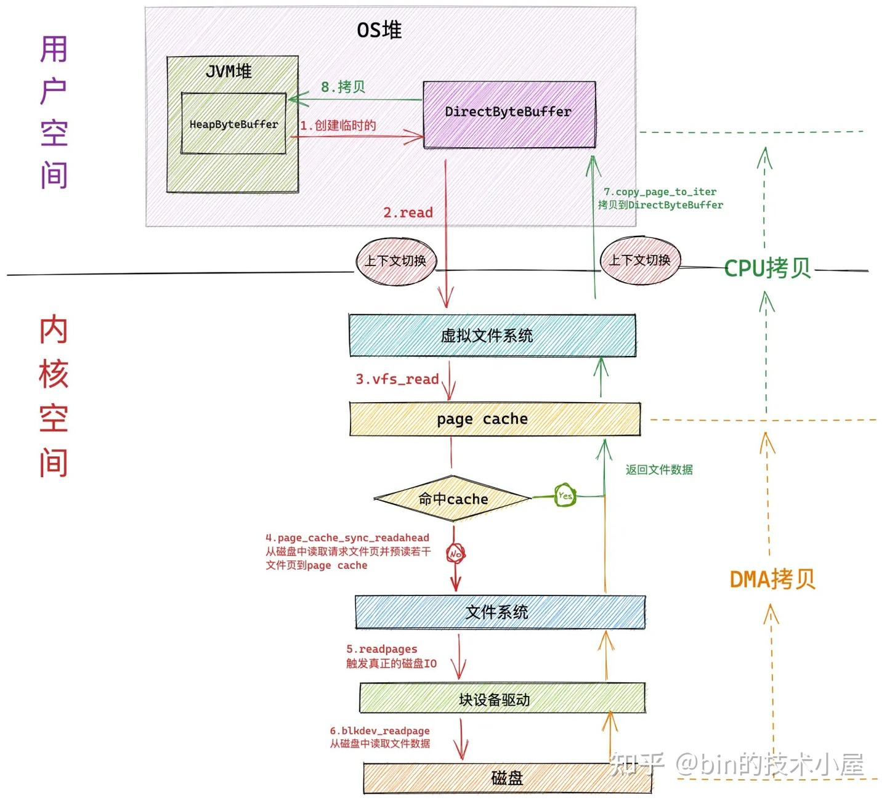

FileChannel#read.png

1. 当 JVM 在 native 层使用 read 系统调用进行文件读取的时候，JVM 进程会发生 **第一次 [上下文切换](https://zhida.zhihu.com/search?content_id=240973675&content_type=Article&match_order=1&q=%E4%B8%8A%E4%B8%8B%E6%96%87%E5%88%87%E6%8D%A2&zhida_source=entity)** ，从 [用户态](https://zhida.zhihu.com/search?content_id=240973675&content_type=Article&match_order=1&q=%E7%94%A8%E6%88%B7%E6%80%81&zhida_source=entity) 转为内核态。
2. 随后 JVM 进程进入 [虚拟文件系统](https://zhida.zhihu.com/search?content_id=240973675&content_type=Article&match_order=1&q=%E8%99%9A%E6%8B%9F%E6%96%87%E4%BB%B6%E7%B3%BB%E7%BB%9F&zhida_source=entity) 层，在这一层内核首先会查看读取文件对应的 page cache 中是否含有请求的文件数据，如果有，那么直接将文件数据 **拷贝** 到 DirectByteBuffer 中返回，避免一次磁盘 IO。并根据内核预读算法从磁盘中异步预读若干文件数据到 page cache 中
3. 如果请求的文件数据不在 page cache 中，则会进入具体的文件系统层，在这一层内核会启动磁盘块 [设备驱动](https://zhida.zhihu.com/search?content_id=240973675&content_type=Article&match_order=1&q=%E8%AE%BE%E5%A4%87%E9%A9%B1%E5%8A%A8&zhida_source=entity) 触发真正的磁盘 IO。并根据内核预读算法同步预读若干文件数据。请求的文件数据和预读的文件数据将被一起填充到 page cache 中。
4. 磁盘控制器 DMA 将从磁盘中读取的数据拷贝到页高速缓存 page cache 中。发生 **第一次数据拷贝** 。
5. 由于 page cache 是属于内核空间的，不能被 JVM 进程直接寻址，所以还需要 CPU 将 page cache 中的数据拷贝到位于用户空间的 DirectByteBuffer 中，发生 **第二次数据拷贝** 。
6. 最后 JVM 进程从系统调用 read 中返回，并从内核态切换回用户态。发生 **第二次上下文切换** 。

从以上过程我们可以看到，当使用 `FileChannel#read` 对文件读取的时候，如果文件数据在 page cache 中，涉及到的性能开销点主要有两次上下文切换，以及一次 CPU 拷贝。其中上下文切换是主要的性能开销点。

下面是通过 `FileChannel#write` 写入文件的整个过程：

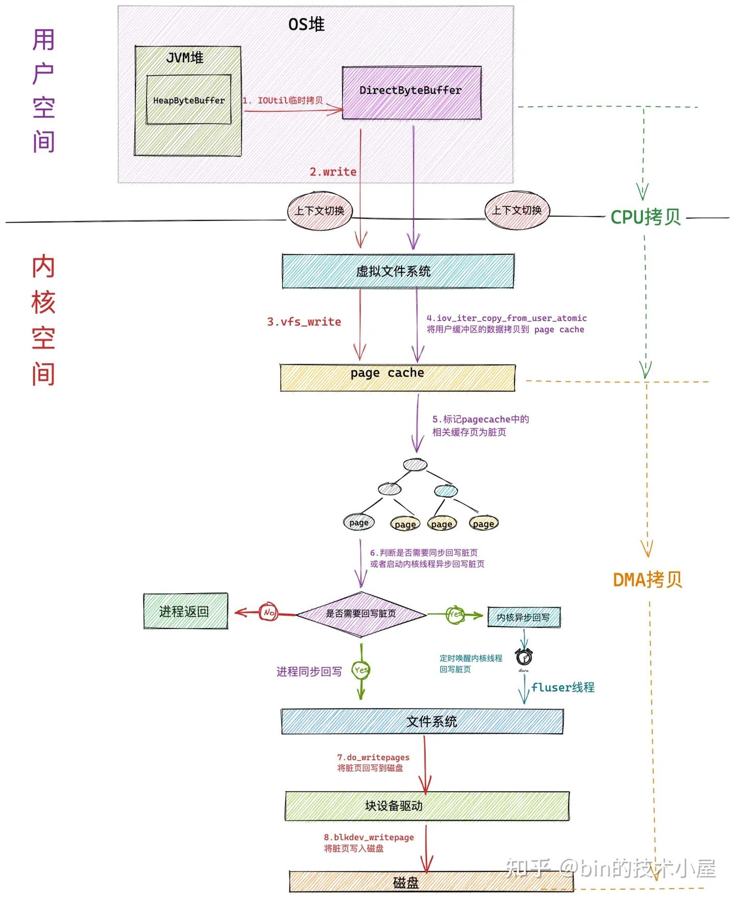

FileChannel#write.png

1. 当 JVM 在 native 层使用 write 系统调用进行文件写入的时候，JVM 进程会发生 **第一次上下文切换** ，从用户态转为内核态。
2. 进入内核态之后，JVM 进程在虚拟文件系统层调用 vfs_write 触发对 page cache 写入的操作。内核调用 iov_iter_copy_from_user_atomic 函数将 DirectByteBuffer 中的待写入数据拷贝到 page cache 中。发生 **第一次拷贝动作** （ CPU 拷贝）。
3. 当待写入数据拷贝到 page cache 中时，内核会将对应的文件页标记为脏页，内核会根据一定的阈值判断是否要对 page cache 中的脏页进行回写，如果不需要同步回写，进程直接返回。这里发生 **第二次上下文切换** 。
4. 脏页回写又会根据脏页数量在内存中的占比分为：进程同步回写和内核异步回写。当脏页太多了，进程自己都看不下去的时候，会同步回写内存中的脏页，直到回写完毕才会返回。在回写的过程中会发生 **第二次拷贝** （DMA 拷贝）。

从以上过程我们可以看到，当使用 `FileChannel#write` 对文件写入的时候，如果不考虑脏页回写的情况，单纯对于 JVM 这个进程来说涉及到的性能开销点主要有两次上下文切换，以及一次 CPU 拷贝。其中上下文切换仍然是主要的性能开销点。

下面我们来看下通过 MappedByteBuffer 对文件进行读写的过程：

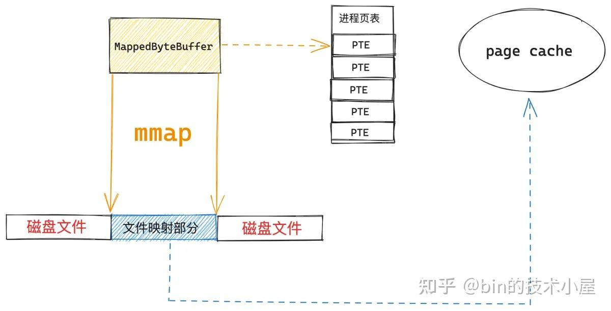

image.png

首先我们需要通过 `FileChannel#map` 将文件的某个区域映射到 JVM 进程的虚拟内存空间中，从而获得一段文件映射的虚拟内存区域 MappedByteBuffer。由于底层使用到了 mmap 系统调用，所以这个过程也涉及到了 **两次上下文切换** 。

如上图所示，当 MappedByteBuffer 在刚刚映射出来的时候，它只是进程地址空间中的一段虚拟内存，其对应在进程页表中的页表项还是空的，背后还没有映射物理内存。此时映射文件对应的 page cache 也是空的，我们要映射的文件内容此时还静静地躺在磁盘中。

当 JVM 进程开始对 MappedByteBuffer 进行读写的时候，就会触发缺页中断，内核会将映射的文件内容从磁盘中加载到 page cache 中，然后在进程页表中建立 MappedByteBuffer 与 page cache 的映射关系。由于这里涉及到了缺页中断的处理，因此也会有 **两次上下文切换** 的开销。

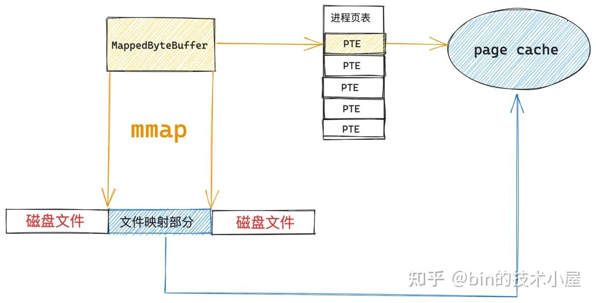

image.png

后面 JVM 进程对 MappedByteBuffer 的读写就相当于是直接读写 page cache 了，关于这一点，很多读者朋友会有这样的疑问：page cache 是内核态的部分，为什么我们通过用户态的 MappedByteBuffer 就可以直接访问内核态的东西了？

这里大家不要被内核态这三个字给唬住了，虽然 page cache 是属于内核部分的，但其本质上还是一块普通的物理内存，想想我们是怎么访问内存的 ？ 不就是先有一段虚拟内存，然后在申请一段物理内存，最后通过进程页表将虚拟内存和物理内存映射起来么，进程在访问虚拟内存的时候，通过页表找到其映射的物理内存地址，然后直接通过物理内存地址访问物理内存。

回到我们讨论的内容中，这段虚拟内存不就是 MappedByteBuffer 吗，物理内存就是 page cache 啊，在通过页表映射起来之后，进程在通过 MappedByteBuffer 访问 page cache 的过程就和访问普通内存的过程是一模一样的。

也正因为 MappedByteBuffer 背后映射的物理内存是内核空间的 page cache，所以它不会消耗任何用户空间的物理内存（JVM 的堆外内存），因此也不会受到 `-XX:MaxDirectMemorySize` 参数的限制。

现在我们已经清楚了 FileChannel 以及 MappedByteBuffer 进行文件读写的整个过程，下面我们就来把两种文件读写方式放在一起来对比一下，但这里有一个对比的前提：

- 对于 MappedByteBuffer 来说，我们对比的是其在缺页处理之后，读写文件的开销。
- 对于 FileChannel 来说，我们对比的是文件数据已经存在于 page cache 中的情况下读写文件的开销。

因为笔者认为只有基于这个前提来对比两者的性能差异才有意义。

- 对于 FileChannel 来说，无论是通过 read 方法对文件的读取，还是通过 write 方法对文件的写入，它们都需要 **两次上下文切换** ，以及 **一次 CPU 拷贝** ，其中上下文切换是其主要的性能开销点。
- 对于 MappedByteBuffer 来说，由于其背后直接映射的就是 page cache，读写 MappedByteBuffer 本质上就是读写 page cache，整个读写过程和读写普通的内存没有任何区别，因此 **没有上下文切换的开销，不会切态，更没有任何拷贝** 。

从上面的对比我们可以看出使用 MappedByteBuffer 来读写文件既没有上下文切换的开销，也没有数据拷贝的开销（可忽略），简直是完爆 FileChannel。

既然 MappedByteBuffer 这么屌，那我们何不干脆在所有文件的读写场景中全部使用 MappedByteBuffer，这样岂不省事 ？JDK 为何还保留了 FileChannel 的 read, write 方法呢 ？让我们来带着这个疑问继续下面的内容~~

## 5\. MappedByteBuffer VS FileChannel

到现在为止，笔者已经带着大家完整的剖析了 mmap，read，write 这些系统调用在内核中的源码实现，并基于源码对 MappedByteBuffer 和 FileChannel 两者进行了性能开销上的对比。

虽然祭出了源码，但毕竟还是 talk is cheap，本小节我们就来对两者进行一次 Benchmark，来看一下 MappedByteBuffer 与 FileChannel 对文件读写的实际性能表现如何 ？ 是否和我们从源码中分析的结果一致。

我们从两个方面来对比 MappedByteBuffer 和 FileChannel 的文件读写性能：

- 文件数据完全加载到 page cache 中，并且将 page cache 锁定在内存中，不允许 swap，MappedByteBuffer 不会有缺页中断，FileChannel 不会触发磁盘 IO 都是直接对 page cache 进行读写。
- 文件数据不在 page cache 中，我们加上了 缺页中断，磁盘IO，以及 swap 对文件读写的影响。

具体的测试思路是，用 MappedByteBuffer 和 FileChannel 分别以 64B,128B,512B,1K,2K,4K,8K,32K,64K,1M,32M,64M,512M 为单位依次对 1G 大小的文件进行读写，从以上两个方面对比两者在不同读写单位下的性能表现。

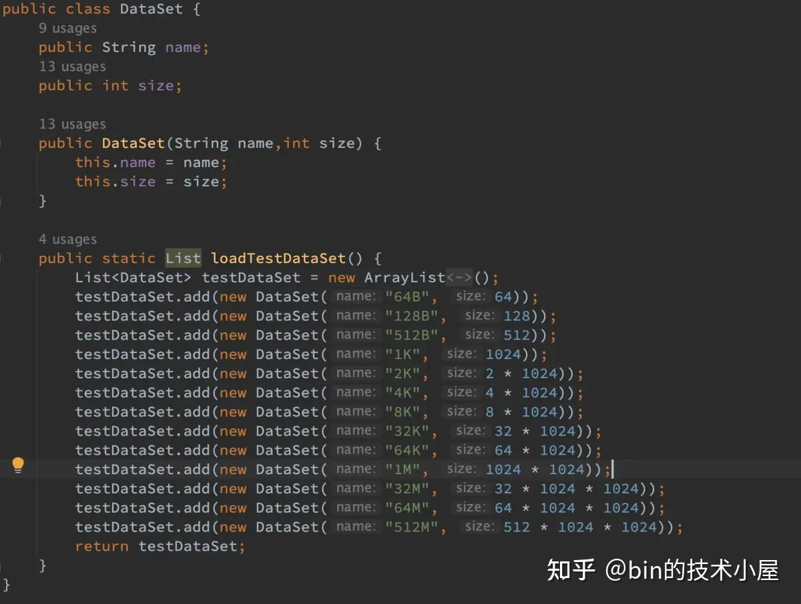

image.png

需要提醒大家的是本小节中得出的读写性能具体数值是没有参考价值的，因为不同 [软硬件环境](https://zhida.zhihu.com/search?content_id=240973675&content_type=Article&match_order=1&q=%E8%BD%AF%E7%A1%AC%E4%BB%B6%E7%8E%AF%E5%A2%83&zhida_source=entity) 下测试得出的具体性能数值都不一样，值得参考的是 MappedByteBuffer 和 FileChannel 在不同数据集大小下的读写性能趋势走向。笔者的软硬件测试环境如下：

- 处理器：2.5 GHz 四核Intel Core i7
- 内存：16 GB 1600 MHz DDR3
- SSD：APPLE SSD SM0512F
- 操作系统：macOS
- JVM：OpenJDK 17

> 测试代码： [github.com/huibinliupus](https://link.zhihu.com/?target=https%3A//github.com/huibinliupush/benchmark), 大家也可以在自己的测试环境中运行一下，然后将跑出的结果提交到这个仓库中。这样方便大家在不同的测试环境下对比两者的文件读写性能差异 —— 众人拾柴火焰高。

### 5.1 文件数据在 page cache 中

由于这里我们要测试 MappedByteBuffer 和 FileChannel 直接对 page cache 的读写性能，所以笔者让 MappedByteBuffer ，FileChannel 只针对同一个文件进行读写测试。

在对文件进行读写之前，首先通过 mlock 系统调用将文件数据提前加载到 page cache 中并主动触发缺页处理，在进程页表中建立好 MappedByteBuffer 和 page cache 的映射关系。最后将 page cache 锁定在内存中不允许 swap。

下面是 MappedByteBuffer 和 FileChannel 在不同数据集下对 page cache 的读取 [性能测试](https://zhida.zhihu.com/search?content_id=240973675&content_type=Article&match_order=1&q=%E6%80%A7%E8%83%BD%E6%B5%8B%E8%AF%95&zhida_source=entity) ：

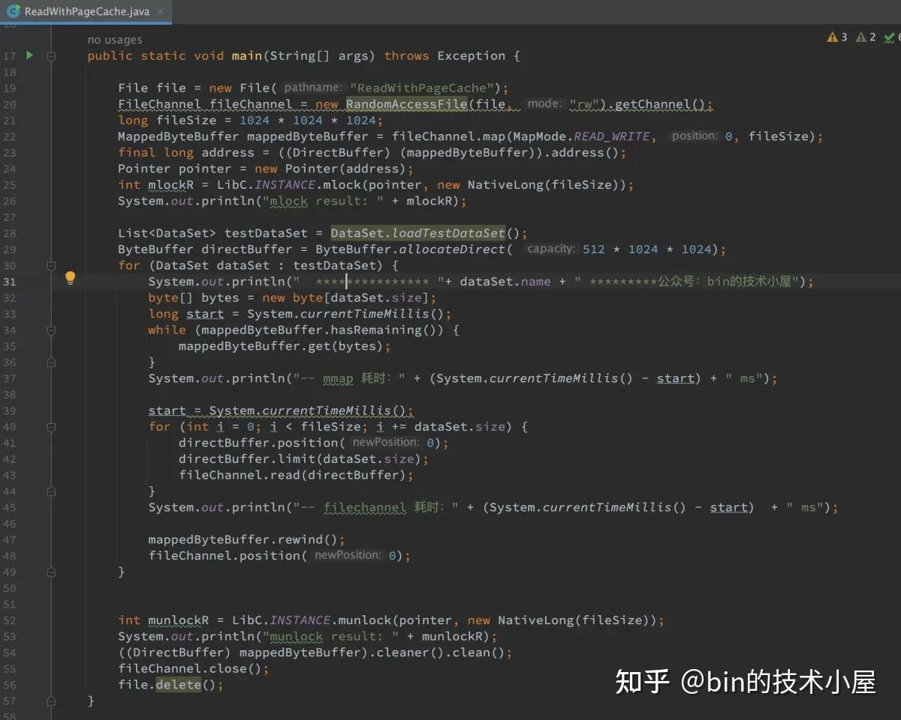

ReadWithPageCache.png

运行结果如下：

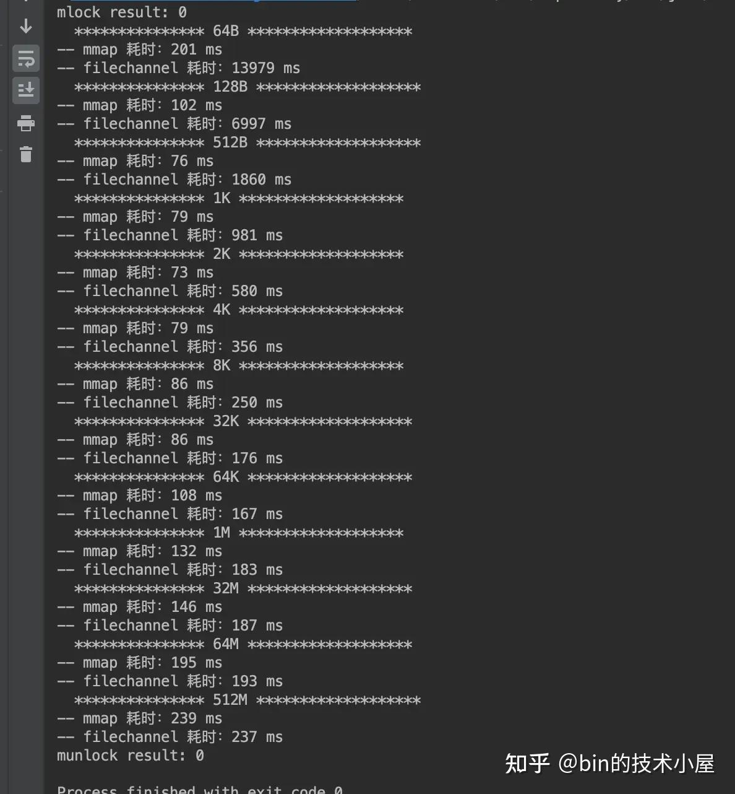

ReadWithPageCache.png

为了直观的让大家一眼看出 MappedByteBuffer 和 FileChannel 在对 page cache 读取的性能差异，笔者根据上面跑出的性能数据绘制成下面这幅柱状图，方便大家观察两者的性能趋势走向。

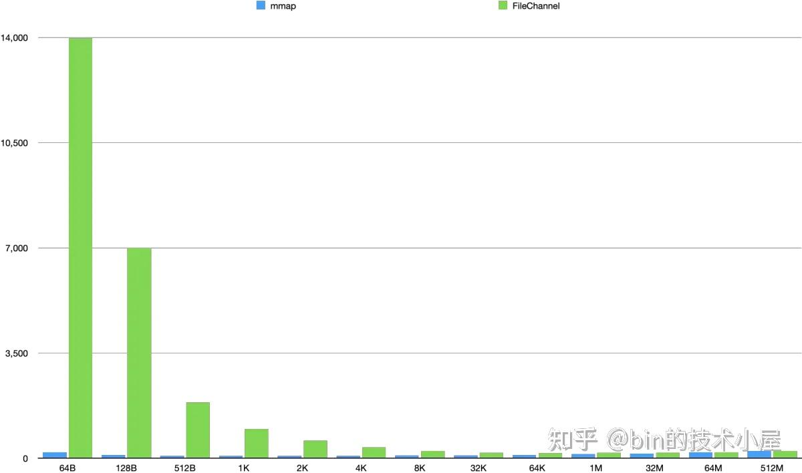

ReadWithPageCache.png

这里我们可以看出，MappedByteBuffer 在 4K 之前具有明显的压倒性优势，在 \[8K, 32M\] 这个区间内，MappedByteBuffer 依然具有优势但已经不是十分明显了，从 64M 开始 FileChannel 实现了一点点反超。

我们可以得到的性能趋势是，在 \[64B, 2K\] 这个单次读取数据量级范围内，MappedByteBuffer 读取的性能越来越快，并在 2K 这个数据量级下达到了性能最高值，仅消耗了 73 ms。从 4K 开始读取性能在一点一点的逐渐下降，并在 64M 这个数据量级下被 FileChannel 反超。

而 FileChannel 的读取性能会随着数据量的增大反而越来越好，并在某一个数据量级下性能会反超 MappedByteBuffer。FileChannel 的最佳读取性能点是在 64K 处，消耗了 167ms 。

因此 MappedByteBuffer 适合频繁读取小数据量的场景，具体多小，需要大家根据自己的环境进行测试，本小节我们得出的数据是 4K 以下。

FileChannel 适合大数据量的批量读取场景，具体多大，还是需要大家根据自己的环境进行测试，本小节我们得出的数据是 64M 以上。

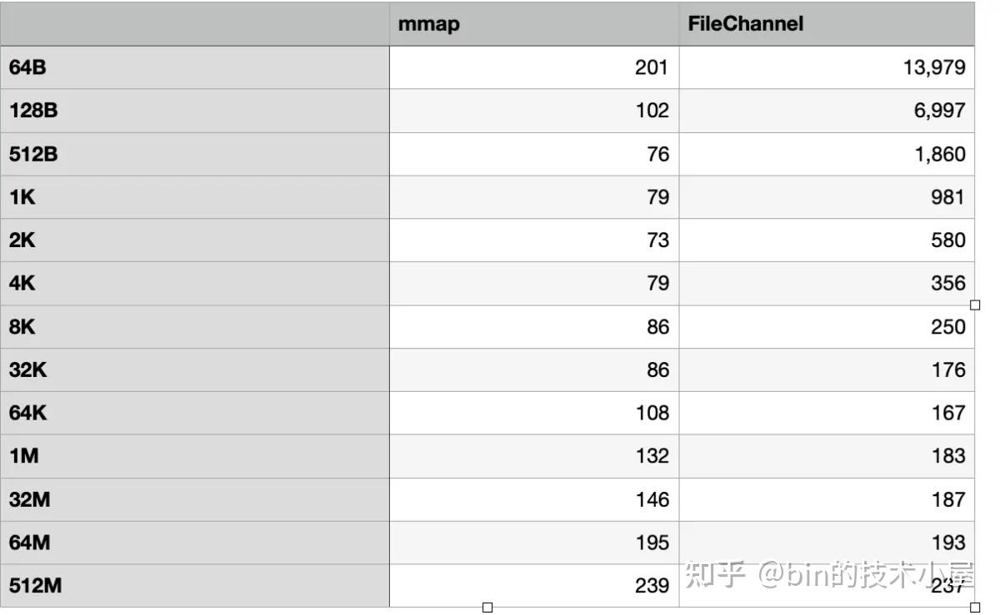

ReadWithPageCache.png

下面是 MappedByteBuffer 和 FileChannel 在不同数据集下对 page cache 的写入性能测试：

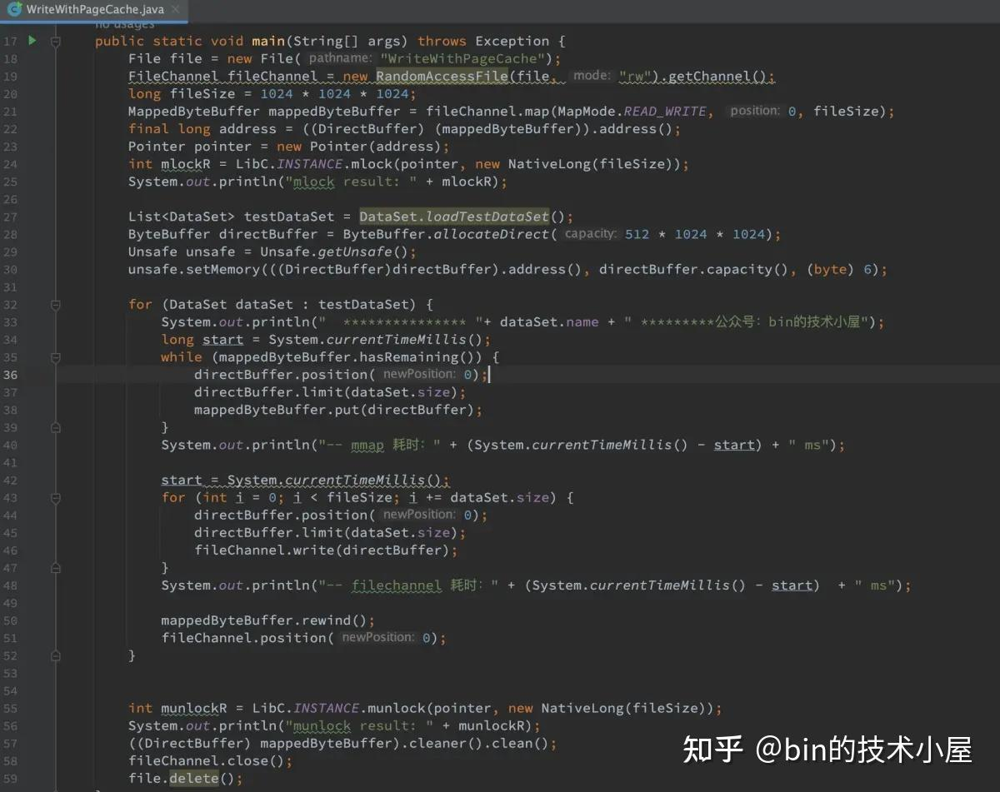

WriteWithPageCache.png

运行结果如下：

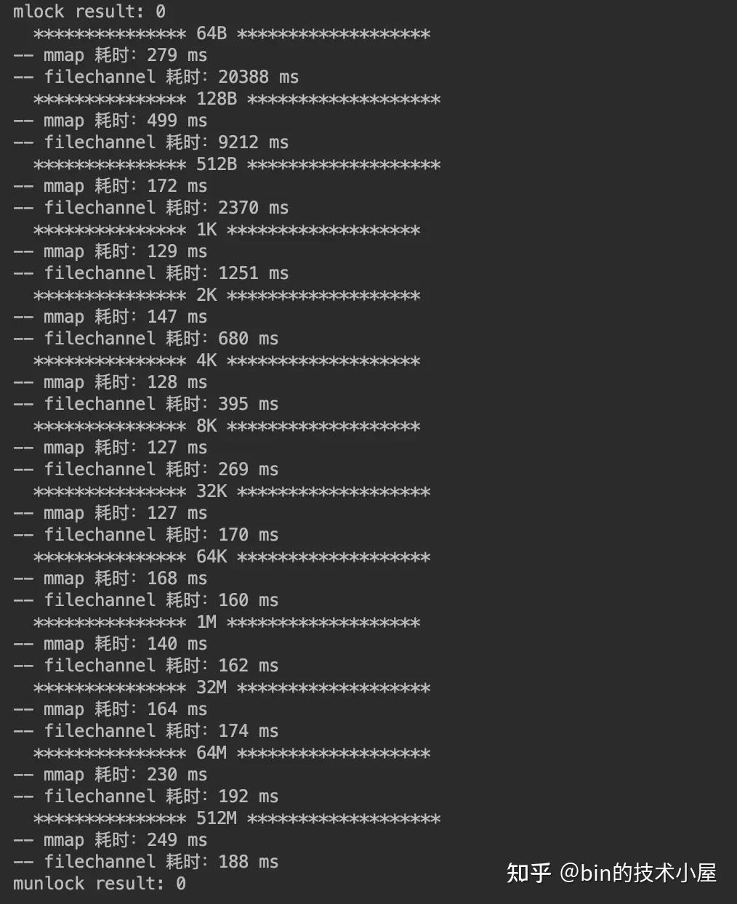

WriteWithPageCache.png

MappedByteBuffer 和 FileChannel 在不同数据集下对 page cache 的写入性能的趋势走向柱状图：


WriteWithPageCache.png

这里我们可以看到 MappedByteBuffer 在 8K 之前具有明显的写入优势，它的写入性能趋势是在 \[64B, 8K\] 这个数据集方位内，写入性能随着数据量的增大而越来越快，直到在 8K 这个数据集下达到了最佳写入性能。

而在 \[32K, 32M\] 这个数据集范围内，MappedByteBuffer 仍然具有优势，但已经不是十分明显了，最终在 64M 这个数据集下被 FileChannel 反超。

和前面的读取性能趋势一样，FileChannel 的写入性能也是随着数据量的增大反而越来越好，最佳的写入性能是在 64K 处，仅消耗了 160 ms 。

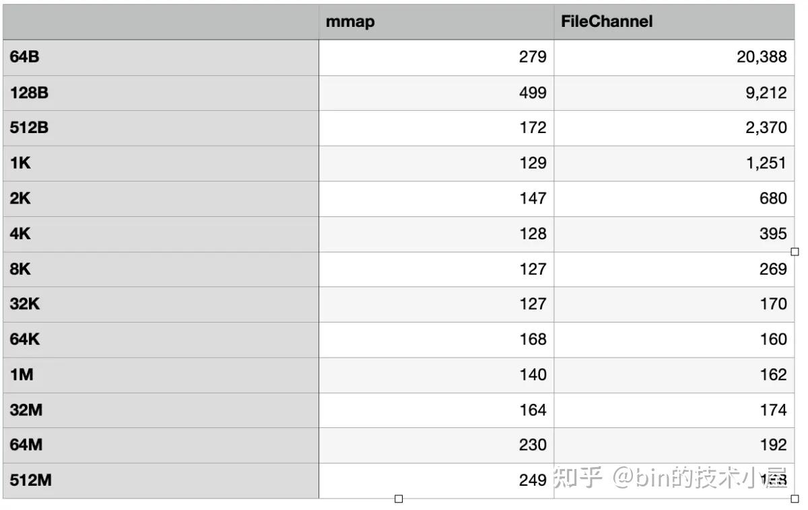

WriteWithPageCache.png

### 5.2 文件数据不在 page cache 中

在这一小节中，我们将缺页中断和磁盘 IO 的影响加入进来，不添加任何的优化手段纯粹地测一下 MappedByteBuffer 和 FileChannel 对文件读写的性能。

为了避免被 page cache 影响，所以我们需要在每一个测试数据集下，单独分别为 MappedByteBuffer 和 FileChannel 创建各自的测试文件。

下面是 MappedByteBuffer 和 FileChannel 在不同数据集下对文件的读取性能测试：

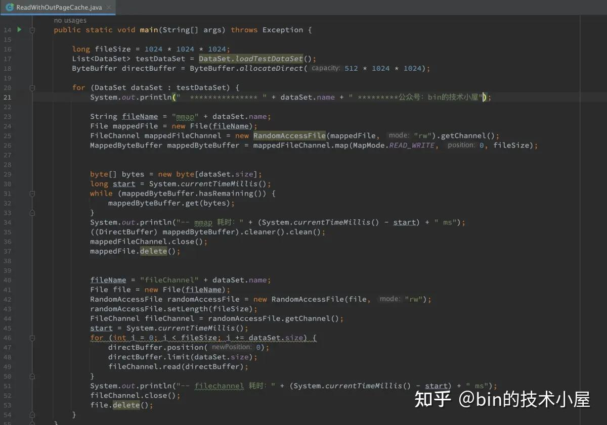

ReadWithOutPageCache.png

运行结果：

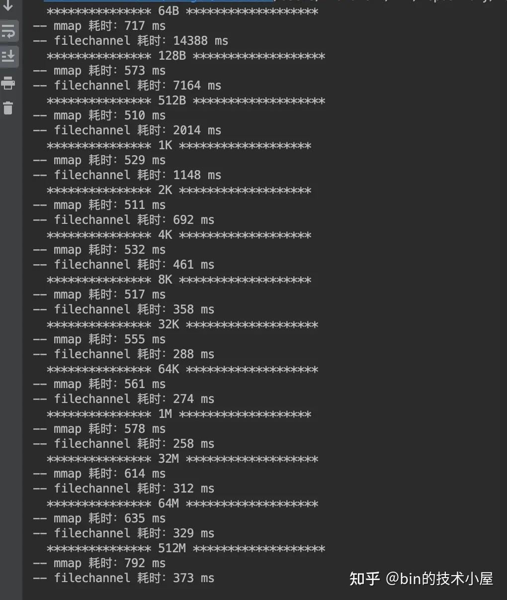

ReadWithOutPageCache.png

从这里我们可以看到，在加入了缺页中断和磁盘 IO 的影响之后，MappedByteBuffer 在缺页中断的影响下平均比之前多出了 500 ms 的开销。FileChannel 在磁盘 IO 的影响下在 \[64B, 512B\] 这个数据集范围内比之前平均多出了 1000 ms 的开销，在 \[1K, 512M\] 这个数据集范围内比之前平均多出了 100 ms 的开销。

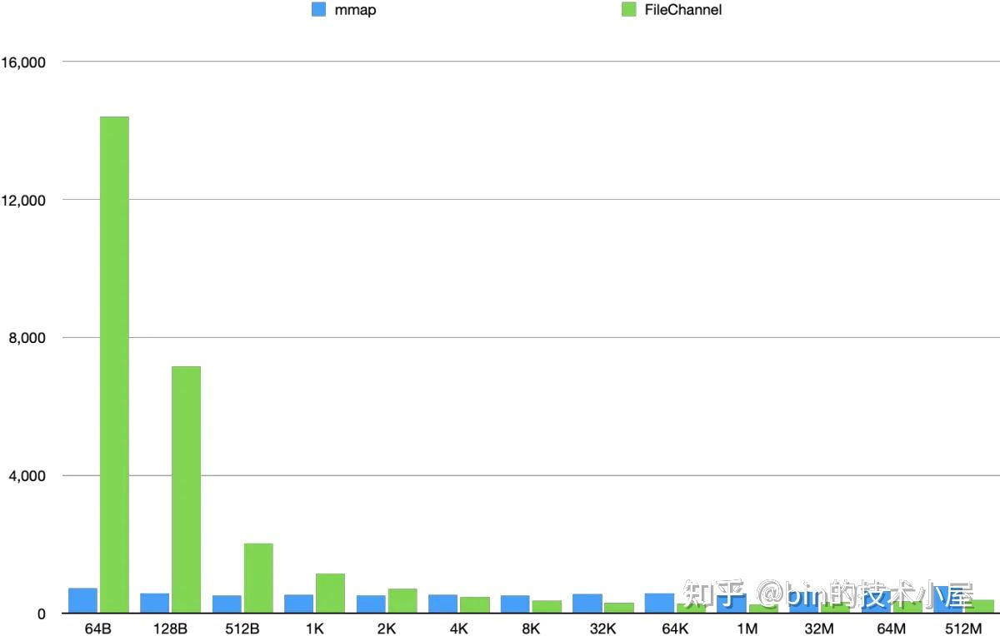

ReadWithOutPageCache.png

在 2K 之前， MappedByteBuffer 具有明显的读取性能优势，最佳的读取性能出现在 512B 这个数据集下，从 512B 往后，MappedByteBuffer 的读取性能趋势总体成下降趋势，并在 4K 这个地方被 FileChannel 反超。

FileChannel 则是在 \[64B, 1M\] 这个数据集范围内，读取性能会随着数据集的增大而提高，并在 1M 这个地方达到了 FileChannel 的最佳读取性能，仅消耗了 258 ms，在 \[32M ， 512M\] 这个范围内 FileChannel 的读取性能在逐渐下降，但是比 MappedByteBuffer 的性能高出了一倍。

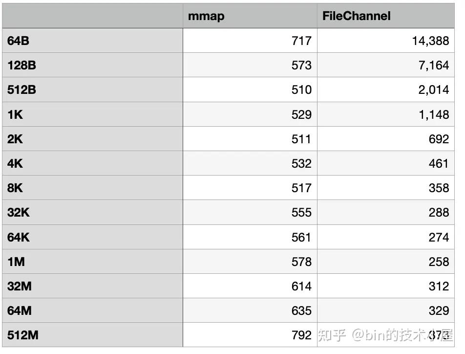

ReadWithOutPageCache.png

读到这里大家不禁要问了， **理论上来讲 MappedByteBuffer 应该是完爆 FileChannel 才对啊，因为 MappedByteBuffer 没有系统调用的开销，为什么性能在后面反而被 FileChannel 超越了近一倍之多呢?**

要明白这个问题，我们就需要分别把 MappedByteBuffer 和 FileChannel 在读写文件时候所涉及到的性能开销点一一列举出来，并对这些性能开销点进行详细对比，这样答案就有了。

首先 MappedByteBuffer 的主要性能开销是在缺页中断，而 FileChannel 的主要开销是在系统调用，两者都会涉及上下文的切换。

FileChannel 在读写文件的时候有磁盘IO，有预读。同样 MappedByteBuffer 的缺页中断也有磁盘IO 也有预读。目前来看他俩一比一打平。

但别忘了 MappedByteBuffer 是需要进程页表支持的， **在实际访问内存的过程中会遇到页表竞争以及 TLB shootdown 等问题** 。还有就是 MappedByteBuffer 刚刚被映射出来的时候，其在进程页表中对应的各级页表以及页目录可能都是空的。所以缺页中断这里需要做的一件非常重要的事情就是补齐完善 MappedByteBuffer 在进程页表中对应的各级页目录表和页表，并在页表项中将 page cache 映射起来，最后还要刷新 TLB 等硬件缓存。

> 想更多了解缺页中断细节的读者可以看下之前的文章—— [《一文聊透 Linux 缺页异常的处理 —— 图解 Page Faults》](https://link.zhihu.com/?target=https%3A//mp.weixin.qq.com/s%3F__biz%3DMzg2MzU3Mjc3Ng%3D%3D%26mid%3D2247489107%26idx%3D1%26sn%3D8380aea1178ff3b0b763fecc55feeb37%26chksm%3Dce77d014f90059020823e9f66c1377d6db5009a9e910c56cdca8d8c0b8d0cea2270a1faa5fcc%26scene%3D178%26cur_album_id%3D2559805446807928833%23rd)

而 FileChannel 并不会涉及上面的这些开销，所以 MappedByteBuffer 的缺页中断要比 FileChannel 的系统调用开销要大，这一点我们可以在上小节和本小节的读写性能对比中看得出来。

文件数据在 page cache 中与不在 page cache 中，MappedByteBuffer 前后的读取性能平均差了 500 ms，而 FileChannel 前后却只平均差了 100 ms。

MappedByteBuffer 的缺页中断是平均每 4K 触发一次，而 FileChannel 的系统调用开销则是每次都会触发。当两者单次按照小数据量读取 1G 文件的时候，MappedByteBuffer 的缺页中断较少触发，而 FileChannel 的系统调用却在频繁触发，所以在这种情况下，FileChannel 的系统调用是主要的 [性能瓶颈](https://zhida.zhihu.com/search?content_id=240973675&content_type=Article&match_order=1&q=%E6%80%A7%E8%83%BD%E7%93%B6%E9%A2%88&zhida_source=entity) 。

这也就解释了当我们在 **频繁读写小数据量的时候，MappedByteBuffer 的性能具有压倒性优势** 。当单次读写的数据量越来越大的时候，FileChannel 调用的次数就会越来越少， **这时候缺页中断就会成为 MappedByteBuffer 的性能瓶颈，到某一个点之后，FileChannel 就会反超 MappedByteBuffer。因此当我们需要高吞吐量读写文件的时候 FileChannel 反而是最合适的** 。

除此之外，内核的脏页回写也会对 MappedByteBuffer 以及 FileChannel 的文件写入性能有非常大的影响，无论是我们在用户态中调用 fsync 或者 msync 主动触发脏页回写还是内核通过 pdflush 线程异步脏页回写，当我们使用 MappedByteBuffer 或者 FileChannel 写入 page cache 的时候，如果恰巧遇到文件页的回写，那么写入操作都会有非常大的延迟，这个在 MappedByteBuffer 身上体现的更为明显。

为什么这么说呢 ？ 我们还是到内核源码中去探寻原因，先来看脏页回写对 FileChannel 的写入影响。下面是 FileChannel 文件写入在内核中的核心实现：

```
ssize_t generic_perform_write(struct file *file,
    struct iov_iter *i, loff_t pos)
{
   // 从 page cache 中获取要写入的文件页并准备记录文件元数据日志工作
  status = a_ops->write_begin(file, mapping, pos, bytes, flags,
      &page, &fsdata);
   // 将用户空间缓冲区 DirectByteBuffer 中的数据拷贝到 page cache 中的文件页中
  copied = iov_iter_copy_from_user_atomic(page, i, offset, bytes);
  // 将写入的文件页标记为脏页并完成文件元数据日志的写入
  status = a_ops->write_end(file, mapping, pos, bytes, copied,
      page, fsdata);
  // 判断是否需要同步回写脏页
  balance_dirty_pages_ratelimited(mapping);
}
```

首先内核会在 write_begin 函数中通过 grab_cache_page_write_begin 从文件 page cache 中获取要写入的文件页。

```
struct page *grab_cache_page_write_begin(struct address_space *mapping,
          pgoff_t index, unsigned flags)
{
  struct page *page;
  // 在 page cache 中查找写入数据的缓存页
  page = pagecache_get_page(mapping, index, fgp_flags,
      mapping_gfp_mask(mapping));
  if (page)
    wait_for_stable_page(page);
  return page;
}
```

在这里会调用一个非常重要的函数 wait_for_stable_page，这个函数的作用就是判断当前 page cache 中的这个文件页是否正在被回写，如果正在回写到磁盘，那么当前进程就会阻塞直到脏页回写完毕。

```
/**
 * wait_for_stable_page() - wait for writeback to finish, if necessary.
 * @page: The page to wait on.
 *
 * This function determines if the given page is related to a backing device
 * that requires page contents to be held stable during writeback.  If so, then
 * it will wait for any pending writeback to complete.
 */
void wait_for_stable_page(struct page *page)
{
 if (bdi_cap_stable_pages_required(inode_to_bdi(page->mapping->host)))
  wait_on_page_writeback(page);
}
EXPORT_SYMBOL_GPL(wait_for_stable_page);
```

等到脏页回写完毕之后，进程才会调用 iov_iter_copy_from_user_atomic 将待写入数据拷贝到 page cache 中，最后在 write_end 中调用 mark_buffer_dirty 将写入的文件页标记为脏页。

除了正在回写的脏页会阻塞 FileChannel 的写入过程之外，如果此时系统中的脏页太多了，超过了 `dirty_ratio` 或者 `dirty_bytes` 等内核参数配置的脏页比例，那么进程就会同步去回写脏页，这也对写入性能有非常大的影响。

我们接着再来看脏页回写对 MappedByteBuffer 的写入影响，在开始分析之前， **笔者先问大家一个问题：通过 MappedByteBuffer 写入 page cache 之后，page cache 中的相应文件页是怎么变脏的** ？

FileChannel 很好理解，因为 FileChannel 走的是系统调用，会进入到文件系统由内核进行处理，如果写入文件页恰好正在回写时，内核会调用 wait_for_stable_page 阻塞当前进程。在将数据写入文件页之后，内核又会调用 mark_buffer_dirty 将页面变脏。

MappedByteBuffer 就很难理解了，因为 MappedByteBuffer 不会走系统调用，直接读写的就是 page cache，而 page cache 也只是内核在软件层面上的定义，它的本质还是物理内存。另外脏页以及脏页的回写都是内核在软件层面上定义的概念和行为。

MappedByteBuffer 直接写入的是硬件层面的物理内存（page cache），硬件哪管你软件上定义的脏页以及脏页回写啊，没有内核的参与，那么在通过 MappedByteBuffer 写入文件页之后，文件页是如何变脏的呢 ？还有就是 MappedByteBuffer 如何探测到对应文件页正在回写并阻塞等待呢 ？

既然我们涉及到了软件的概念和行为，那么一定就会有内核的参与，我们回想一下整个 MappedByteBuffer 的生命周期，唯一一次和内核打交道的机会就是缺页中断，我们看看能不能在缺页中断中发现点什么~

当 MappedByteBuffer 刚刚被 mmap 映射出来的时候它还只是一段普通的虚拟内存，背后什么都没有，其在进程页表中的各级页目录项以及页表项都还是空的。

当我们立即对 MappedByteBuffer 进行写入的时候就会发生缺页中断，在缺页中断的处理中，内核会在进程页表中补齐与 MappedByteBuffer 映射相关的各级页目录并在页表项中与 page cache 进行映射。

```
static vm_fault_t do_shared_fault(struct vm_fault *vmf)
{
    // 从 page cache 中读取文件页
    ret = __do_fault(vmf);
    if (vma->vm_ops->page_mkwrite) {
        unlock_page(vmf->page);
        // 将文件页变为可写状态，并设置文件页为脏页
        // 如果文件页正在回写，那么阻塞等待
        tmp = do_page_mkwrite(vmf);
    }
}
```

除此之外，内核还会调用 do_page_mkwrite 方法将 MappedByteBuffer 对应的页表项变成可写状态，并将与其映射的文件页立即设置位脏页，如果此时文件页正在回写，那么 MappedByteBuffer 在缺页中断中也会阻塞。

```
int block_page_mkwrite(struct vm_area_struct *vma, struct vm_fault *vmf,
    get_block_t get_block)
{
 set_page_dirty(page);
 wait_for_stable_page(page);
}
```

这里我们可以看到 MappedByteBuffer 在内核中是先变脏然后在对 page cache 进行写入，而 FileChannel 是先写入 page cache 后在变脏。

从此之后，通过 MappedByteBuffer 对 page cache 的写入就会变得非常丝滑，那么问题来了，当 page cache 中的脏页被内核异步回写之后，内核会把文件页中的脏页标记清除掉，那么这时如果 MappedByteBuffer 对 page cache 写入，由于不会发生缺页中断，那么 page cache 中的文件页如何再次变脏呢 ？

内核这里的设计非常巧妙，当内核回写完脏页之后，会调用 page_mkclean_one 函数清除文件页的脏页标记，在这里会首先通过 page_vma_mapped_walk 判断该文件页是不是被 mmap 映射到进程地址空间的，如果是，那么说明该文件页是被 MappedByteBuffer 映射的。随后内核就会做一些特殊处理：

1. 通过 pte_wrprotect 对 MappedByteBuffer 在进程页表中对应的页表项 pte 进行写保护，变为只读权限。
2. 通过 pte_mkclean 清除页表项上的脏页标记。

```
static bool page_mkclean_one(struct page *page, struct vm_area_struct *vma,
       unsigned long address, void *arg)
{

 while (page_vma_mapped_walk(&pvmw)) {
  int ret = 0;

  address = pvmw.address;
  if (pvmw.pte) {
   pte_t entry;
   entry = ptep_clear_flush(vma, address, pte);
   entry = pte_wrprotect(entry);
   entry = pte_mkclean(entry);
   set_pte_at(vma->vm_mm, address, pte, entry);
  }
 return true;
}
```

这样一来，在脏页回写完毕之后，MappedByteBuffer 在页表中就变成只读的了，这一切对用户态的我们都是透明的，当再次对 MappedByteBuffer 写入的时候就不是那么丝滑了，会触发写保护缺页中断（我们以为不会有缺页中断，其实是有的），在写保护中断的处理中，内核会重新将页表项 pte 变为可写，文件页标记为脏页。如果文件页正在回写，缺页中断会阻塞。如果脏页积累的太多，这里也会同步回写脏页。

```
static vm_fault_t wp_page_shared(struct vm_fault *vmf)
    __releases(vmf->ptl)
{
    if (vma->vm_ops && vma->vm_ops->page_mkwrite) {
        // 设置页表项为可写
        // 标记文件页为脏页
        // 如果文件页正在回写则阻塞等待
        tmp = do_page_mkwrite(vmf);
    }
    // 判断是否需要同步回写脏页，
    fault_dirty_shared_page(vma, vmf->page);
    return VM_FAULT_WRITE;
}
```

**所以并不是对 MappedByteBuffer 调用 mlock 之后就万事大吉了，在遇到脏页回写的时候，MappedByteBuffer 依然会发生写保护类型的缺页中断** 。在缺页中断处理中会等待脏页的回写，并且还可能会发生脏页的同步回写。这对 MappedByteBuffer 的写入性能会有非常大的影响。

在明白这些问题之后，下面我们继续来看 MappedByteBuffer 和 FileChannel 在不同数据集下对文件的写入性能测试：

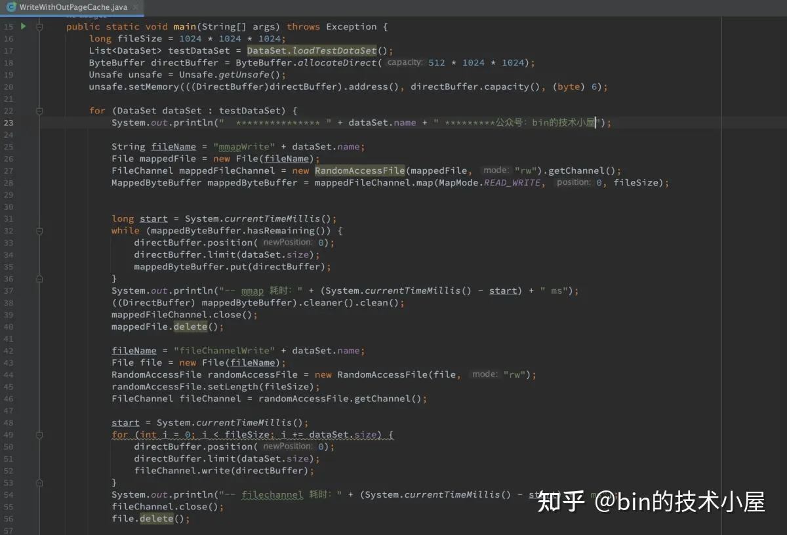

WriteWithOutPageCache.png

运行结果：

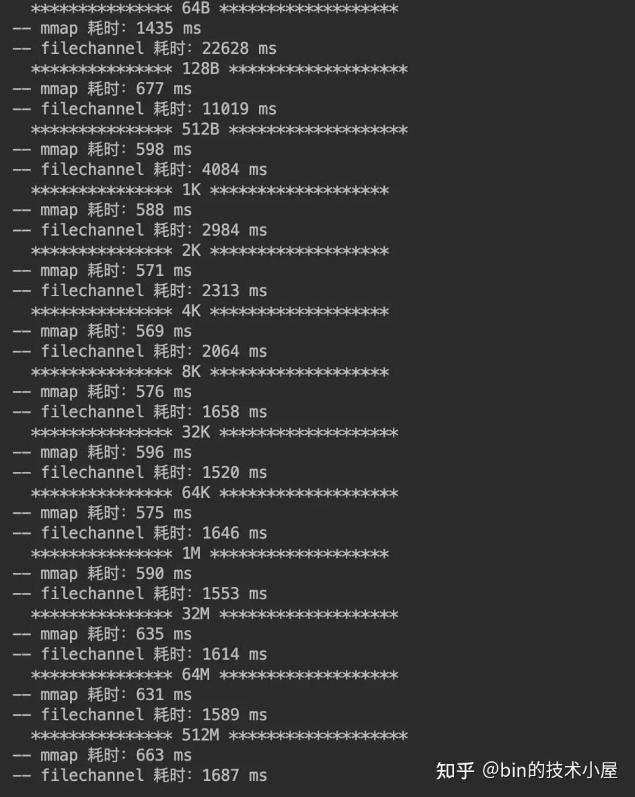

WriteWithOutPageCache.png

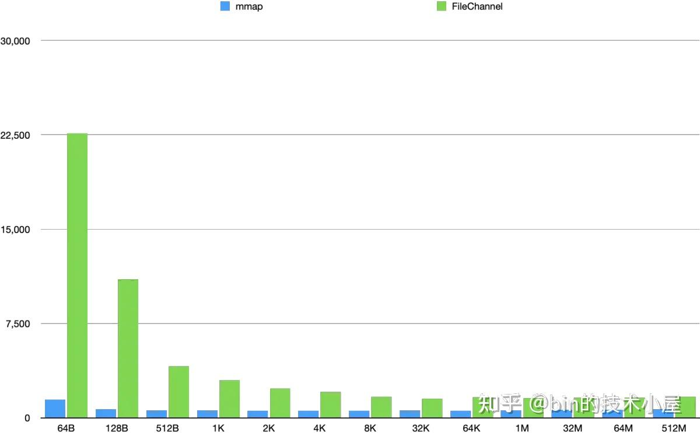

WriteWithOutPageCache.png

在笔者的测试环境中，我们看到 MappedByteBuffer 在对文件的写入性能一路碾压 FileChannel，并没有出现被 FileChannel 反超的情况。但我们看到 MappedByteBuffer 从 4K 开始写入性能是在逐渐下降的，而 FileChannel 的写入性能却在一路升高。

根据上面的分析，我们可以推断出，后面随着数据量的增大，由于 MappedByteBuffer 缺页中断瓶颈的影响，在 512M 后面某一个数据集下，FileChannel 的写入性能最终是会超过 MappedByteBuffer 的。

在本小节的开头，笔者就强调了，本小节值得参考的是 MappedByteBuffer 和 FileChannel 在不同数据集大小下的读写性能趋势走向，而不是具体的性能数值。

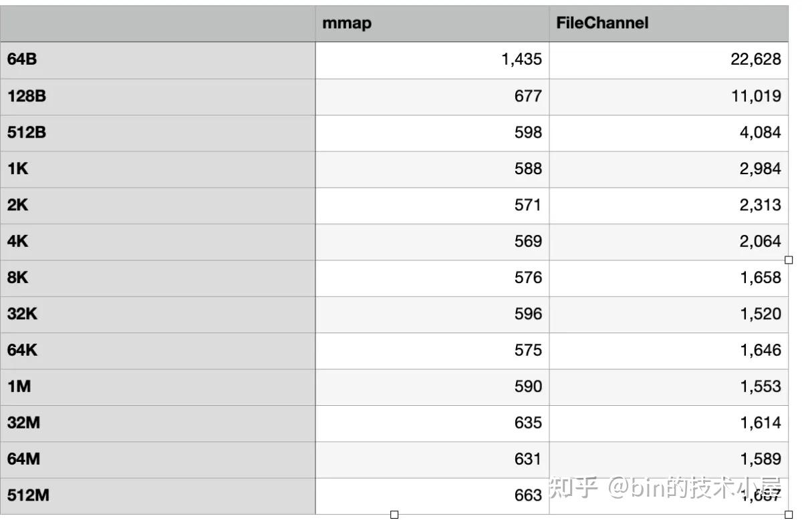

WriteWithOutPageCache.png

## 6\. MappedByteBuffer 在 RocketMQ 中的应用

在 RocketMQ 的消息存储架构模型中有三个非常核心的文件，它们分别是：CommitLog，ConsumeQueue，IndexFile。其中 CommitLog 是消息真正存储的地方，而 ConsumeQueue 和 IndexFile 都是根据 CommitLog 生成的消息索引文件，它们包含了消息在 CommitLog 文件中的真实物理偏移。

### 6.1 CommitLog

当 Producer 将消息发送到 Broker 之后，RocketMQ 会根据消息的 [序列化](https://zhida.zhihu.com/search?content_id=240973675&content_type=Article&match_order=1&q=%E5%BA%8F%E5%88%97%E5%8C%96&zhida_source=entity) 协议将消息持久化到 CommitLog 文件中，一旦消息被刷到磁盘中，Producer 发送给 Broker 的消息就不会丢失了。CommitLog 文件存储的主体是消息的 body 以及相关的元数据，CommitLog 并不会区分消息的 Topic。也就是说在同一 Broker 实例中，所有 Topic 下的消息都会被顺序的写入 CommitLog 文件混合存储。


image.png

CommitLog 文件的默认大小为 1G，存储路径： `/{storePathRootDir}/store/commitlog/{fileName}` 。文件的命名规则为 CommitLog 文件中存储消息的最小物理偏移，当一个 CommitLog 文件被写满之后，RocketMQ 就会创建一个新的 CommitLog 文件。

比如，第一个 CommitLog 文件会命名为 `00000000000000000000` ，文件名一共 20 位，左边补零，剩余为消息在文件中的最小物理偏移，文件大小为 1G，表示第一个 CommitLog 文件中消息的最小物理偏移为 0 。

当第一个 CommitLog 文件被写满之后，第二个 CommitLog 文件就会被命名为 `00000000001073741824` （1G = 1073741824），表示第二个 CommitLog 文件中消息的最小物理偏移为 1073741824。后面第三个，第四个 CommitLog 文件的命名规则都是一样的，以此类推。

单个 Broker 实例下的每条消息的物理偏移是全局唯一的，而 CommitLog 文件的命名规则是根据消息的物理偏移依次递增的，所以给定一个消息的物理偏移，通过 [二分查找](https://zhida.zhihu.com/search?content_id=240973675&content_type=Article&match_order=1&q=%E4%BA%8C%E5%88%86%E6%9F%A5%E6%89%BE&zhida_source=entity) 就能很快的定位到存储该消息的具体 CommitLog 文件。

### 6.2 ConsumeQueue

现在消息的存储解决了，但是消息的消费却成了难题，因为单个 Broker 实例下的所有 Topic 消息都是混合存储在 CommitLog 中，而 Consumer 是基于订阅的 Topic 进行消费的，这样一来，Consumer 想要消费具体 Topic 下的消息，就需要根据 Topic 来遍历 CommitLog 检索消息，这样效率是非常低下的。

因此就有必要为 Consumer 消费消息专门建立一个索引文件，这个索引文件就是 ConsumeQueue ，ConsumeQueue 可以看做是基于 Topic 的 CommitLog 索引文件 。

每个 Topic 下边包含多个 MessageQueue，该 Topic 下的所有消息会均匀的分布在各个 MessageQueue 中，有点像 Kafka 里的 Partition 概念。Producer 在向 Broker 发送消息的时候会指定该消息所属的 MessageQueue。每个 MessageQueue 下边会有多个 ConsumeQueue 文件，用于存储该队列中的消息在 CommitLog 中的索引。

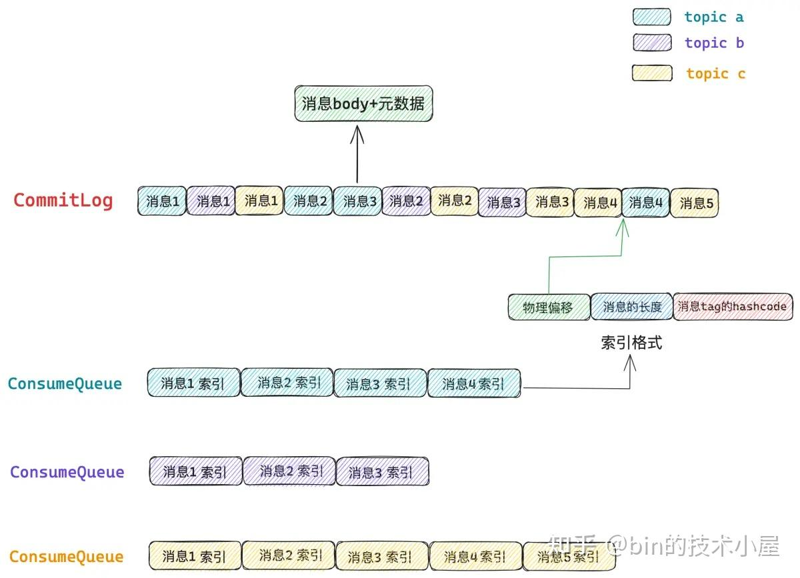

image.png

ConsumeQueue 文件的存储路径结构为： `Topic/MessageQueue/ConsumeQueue` ，具体的存储路径是： `/{storePathRootDir}/store/consumequeue/{topic}/{queueId}/{fileName}` ，单个 ConsumeQueue 文件可以存储 30 万条消息索引，每条消息索引占用 20 个字节，分别是：消息在 CommitLog 中的物理偏移（8字节），消息的长度（4字节），消息 tag 的 hashcode（8字节）。每个 ConsumeQueue 文件大小约为 5.72M（30万 \* 20 = 600 万字节）。

ConsumeQueue 文件的命名规则是消息索引在文件中的最小物理偏移，比如，每个 MessageQueue 下第一个 ConsumeQueue 文件会被命名为 `00000000000000000000`,文件大小为 5.72M。当第一个文件写满之后，就会创建第二个 ConsumeQueue 文件，命名为 `00000000000006000000` 。这样依次类推。

RocketMQ 会启动一个叫做 ReputMessageService 的后台线程，每隔 1ms 执行一次，负责不停地从 CommitLog 中构建消息索引并写入到 ConsumeQueue 文件。而消息的索引一旦被构建到 ConsumeQueue 文件中之后，Consumer 就可以看到了。

消息索引在 ConsumeQueue 文件中的物理偏移我们称之为消息的逻辑偏移，ConsumerGroup 中保存的消费进度就是这个逻辑偏移，当 ConsumerGroup 根据当前保存的消费进度从 Broker 中拉取消息的时候，RocketMQ 就是先根据消息的这个逻辑偏移通过二分查找定位到消息索引所在的具体 ConsumeQueue 文件，然后从 ConsumeQueue 文件中读取消息索引，而消息索引中保存了该消息在 CommitLog 中的物理偏移，最后根据这个物理偏移从 CommitLog 中读取出具体的消息内容。

### 6.3 IndexFile

IndexFile 也是一种消息索引文件，同样也是由后台线程 ReputMessageService 来构建的，不同的是 IndexFile 是根据 CommitLog 中存储的消息 key 以及消息的存储时间来构建的消息索引文件，这样我们就可以通过消息 key 或者消息生产的时间来查找消息了。

IndexFile 索引文件可以看做是一个 [哈希表](https://zhida.zhihu.com/search?content_id=240973675&content_type=Article&match_order=1&q=%E5%93%88%E5%B8%8C%E8%A1%A8&zhida_source=entity) 的结构，其中包含了 500 万个哈希槽(hashSlot)，每个哈希槽占用 4 个字节，用来指向一个链表。在构建 IndexFile 的时候，会计算每一个消息 key 的 hashcode，然后通过 `hashcode % hashSlotNum` 定位哈希槽，如果遇到哈希槽冲突，就会将冲突的消息索引采用 **头插法** 插入到哈希槽指向的链表中，这样可以保证最新生产出来的消息位于链表的最前面。

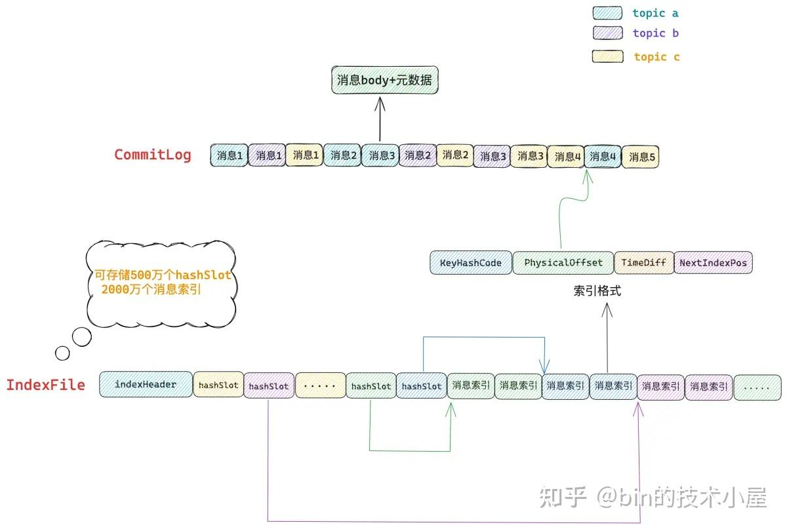

image.png

消息索引就存放在各个哈希槽指向的这个链表中，按照消息的生产时间从近到远依次排列。一个 IndexFile 可以容纳 2000W 条消息索引，每条消息索引占用 20 个字节，分别是：消息 key 的 hashcode (4字节)，消息在 CommitLog 中的物理偏移 Physical Offset （8字节），Time Diff（4字节），Next Index Pos（4字节）用于指向该消息索引在哈希链表中的下一个消息索引。这里的 Time Diff 指的是消息的存储时间与 beginTimestamp 的差值，而 beginTimestamp 表示的是 IndexFile 中所有消息的最小存储时间。

除此之外，在 IndexFile 的开头会有一个 40 字节大小的 indexHeader 头部，用于保存文件中关于消息索引的一些统计信息：

- 8 字节的 beginTimestamp 表示 IndexFile 中消息的最小存储时间
- 8 字节的 endTimestamp 表示 IndexFile 中消息的最大存储时间
- 8 字节的 beginPhyoffset 表示 IndexFile 中消息在 CommitLog 中的最小物理偏移
- 8 字节的 endPhyoffset 表示 IndexFile 中消息在 CommitLog 中的最大物理偏移
- 4 字节的 hashSlotcount 表示 IndexFile 中当前用到的哈希槽个数。
- 4 字节的 indexCount 表示 IndexFile 中目前保存的消息索引条数。

单个 IndexFile 的总大小为 ： `40 字节的 Header + 500 万 * 4 字节的哈希槽 + 2000 万 * 20 字节的消息索引 = 400 M` 。IndexFile 的命名规则是用创建文件时候的当前时间戳，存储路径为： `/{storePathRootDir}/store/index/{fileName}` 。

我们首先会根据消息的生产时间通过二分查找的方式定位具体的 IndexFile，在通过消息 key 的 hashcode 定位到具体的消息索引，从消息索引中拿到 Physical Offset，最后在 CommitLog 中定位到具体的消息内容。

### 6.4 文件预热

RocketMQ 对于 CommitLog，ConsumeQueue，IndexFile 等文件的读写都是通过 MappedByteBuffer 来进行的，因此 RocketMQ 专门定义了一个用于描述内存文件映射的模型 —— MappedFile，其中封装了针对 [内存映射文件](https://zhida.zhihu.com/search?content_id=240973675&content_type=Article&match_order=1&q=%E5%86%85%E5%AD%98%E6%98%A0%E5%B0%84%E6%96%87%E4%BB%B6&zhida_source=entity) 的所有操作。比如，文件的预热，文件的读写，文件的回写等操作。

```
public class DefaultMappedFile extends AbstractMappedFile {

    protected FileChannel fileChannel;
    protected MappedByteBuffer mappedByteBuffer;

    private void init(final String fileName, final int fileSize) throws IOException {
        this.fileName = fileName;
        this.fileSize = fileSize;
        this.file = new File(fileName);

        this.fileChannel = new RandomAccessFile(this.file, "rw").getChannel();
        this.mappedByteBuffer = this.fileChannel.map(MapMode.READ_WRITE, 0, fileSize);
    }
}
```

通过 `fileChannel.map` 映射出来的 mappedByteBuffer 只是一段虚拟内存，背后并未与任何物理内存发生关联（文件的 page cache）, 后续在读写这段 mappedByteBuffer 的时候就会产生缺页中断的开销，对文件的读写性能产生比较大的影响。

所以 RocketMQ 为了最大化文件读写的性能而提供了文件预热的功能，文件预热在默认情况下是关闭的，如果需要可以在 Broker 的 [配置文件](https://zhida.zhihu.com/search?content_id=240973675&content_type=Article&match_order=1&q=%E9%85%8D%E7%BD%AE%E6%96%87%E4%BB%B6&zhida_source=entity) 中开启 warmMapedFileEnable。

```
warmMapedFileEnable=true
```

当 warmMapedFileEnable 开启之后，RocketMQ 在初始化完 MappedFile 之后，就会调用 warmMappedFile 函数对文件进行预热：

1. 对 mappedByteBuffer 这段虚拟内存范围内的虚拟内存按照内存页为单位，逐个触发缺页中断，目的是提前讲映射文件的内容加载到 page cache 中，并在进程页表中建立好 mappedByteBuffer 与 page cache 的映射关系。
2. 使用前面介绍的 mlock 系统调用将 mappedByteBuffer 背后映射的 page cache 锁定在内存中，不允许内核 swap。
3. 使用 madvise 系统调用再次触发一次预读，感觉这里完全没必要调用 madvise，甚至也没必要进行步骤 1。 **只调用 mlock 就可以了，因为内核在执行 mlock 的过程中步骤 1 和步骤 3 的事情就都顺便做了** 。不清楚 RocketMQ 这里为什么要有这么多重复的不必要动作，可能是为了兼容不同的操作系统以及不同版本的内核吧，这里我们就不深入去探究了。

```
public void warmMappedFile(FlushDiskType type, int pages) {
        ByteBuffer byteBuffer = this.mappedByteBuffer.slice();
        for (long i = 0, j = 0; i < this.fileSize; i += DefaultMappedFile.OS_PAGE_SIZE, j++) {
            byteBuffer.put((int) i, (byte) 0);
        }
        this.mlock();
    }

    public void mlock() {
        final long address = ((DirectBuffer) (this.mappedByteBuffer)).address();
        Pointer pointer = new Pointer(address);
        {
            int ret = LibC.INSTANCE.mlock(pointer, new NativeLong(this.fileSize));
        }

        {
            int ret = LibC.INSTANCE.madvise(pointer, new NativeLong(this.fileSize), LibC.MADV_WILLNEED);
        }
    }
```

### 6.5 读写分离

再对文件进行预热之后，后续对 mappedByteBuffer 的读写就是直接读写 page cache 了，整个过程没有系统调用也没有数据拷贝的开销，经过本文第五小节的分析我们知道 **mappedByteBuffer 非常适合频繁小数据量的文件读写场景** ，而 RocketMQ 主要处理的是业务消息，通常这些业务消息不会很大，所以 RocketMQ 选择 mappedByteBuffer 来读写文件实在是太合适了。

但是如果我们通过 mappedByteBuffer 来高频地不断向 CommitLog 写入消息的话， page cache 中的脏页比例就会越来越大，而 page cache 回写脏页的时机是由内核来控制的，当脏页积累到一定程度，内核就会启动 pdflush 线程来将 page cache 中的脏页回写到磁盘中。

虽然现在 page cache 已经被我们 mlock 住了，但是我们在用户态无法控制脏页的回写，当脏页回写完毕之后，我们通过 mappedByteBuffer 写入文件时仍然会触发写保护缺页中断。这样也会加大 mappedByteBuffer 的写入延迟，产生性能毛刺。

为了避免这种写入毛刺的产生，RocketMQ 引入了读写分离的机制，默认是关闭的，可以通过 `transientStorePoolEnable` 开启。

```
transientStorePoolEnable=true
```

在开启读写分离之后，RocketMQ 会初始化一个堆外内存池 transientStorePool，随后从这个堆外内存池中获取一个 DirectByteBuffer（writeBuffer）来初始化 MappedFile。

```
public class DefaultMappedFile extends AbstractMappedFile {
   /**
     * Message will put to here first, and then reput to FileChannel if writeBuffer is not null.
     */
    protected ByteBuffer writeBuffer = null;
    protected TransientStorePool transientStorePool = null;

   @Override
    public void init(final String fileName, final int fileSize,
        final TransientStorePool transientStorePool) throws IOException {
        init(fileName, fileSize);
        // 用于暂存数据的 directBuffer
        this.writeBuffer = transientStorePool.borrowBuffer();
        // 堆外内存池
        this.transientStorePool = transientStorePool;
    }
}
```

后续 Broker 再对 CommitLog 写入消息的时候，首先会写到 writeBuffer 中，因为 writeBuffer 只是一段普通的堆外内存，不会涉及到脏页回写，因此 CommitLog 的写入过程就会非常平滑，不会有性能毛刺。而从 CommitLog 读取消息的时候仍然是通过 mappedByteBuffer 进行。

```
public AppendMessageResult appendMessagesInner(final MessageExt messageExt, final AppendMessageCallback cb,
        PutMessageContext putMessageContext) {
          // 开启读写分离之后获取到的是 writeBuffer,否则获取 mappedByteBuffer
          ByteBuffer byteBuffer = appendMessageBuffer().slice();
          byteBuffer.position(currentPos);
          // 将消息写入到 byteBuffer 中
          result = cb.doAppend(this.getFileFromOffset(), byteBuffer, this.fileSize - currentPos,
                    (MessageExtBatch) messageExt, putMessageContext);
    }

   protected ByteBuffer appendMessageBuffer() {
        return writeBuffer != null ? writeBuffer : this.mappedByteBuffer;
    }
```

消息数据现在只是暂存在 writeBuffer 中，当积攒的数据超过了 16K（可通过 commitCommitLogLeastPages 配置），或者消息在 writeBuffer 中停留时间超过了 200 ms（可通过 commitCommitLogThoroughInterval 配置）。

```
private int commitCommitLogThoroughInterval = 200;
    private int commitCommitLogLeastPages = 4
    protected boolean isAbleToCommit(final int commitLeastPages) {
        if (commitLeastPages > 0) {
            // writeBuffer 中积攒的数据超过了 16 k，开始 commit
            return ((write / OS_PAGE_SIZE) - (commit / OS_PAGE_SIZE)) >= commitLeastPages;
        }
        return write > commit;
    }
```

那么 RocketMQ 就会将 writeBuffer 中的消息数据通过 FileChannel 一次性批量异步写入到 page cache 中。

```
public int commit(final int commitLeastPages) {
        if (this.isAbleToCommit(commitLeastPages)) {
            this.fileChannel.write(byteBuffer);
        }
    }
```

既然 RocketMQ 在读写分离模式下设计的是通过 FileChannel 来批量写入消息，那么就需要考虑 FileChannel 的最佳写入性能点，这里 RocketMQ 选择了 16K，而我们在本文第五小节中测试的 FileChannel 最佳写入性能点也差不多是在 32K 附近，而且写入性能是要比 MappedByteBuffer 高很多的。

### 6.6 文件刷盘

无论是通过 MappedByteBuffer 还是 FileChannel 对文件进行写入，当系统中的脏页积累到一定量的时候，都会对其写入文件的性能造成非常大的影响。另外脏页不及时回写还会造成数据丢失的风险。

因此为了避免数据丢失的风险以及对写入性能的影响，当脏页在 page cache 中积累到 16K 或者脏页在 page cache 中停留时间超过 10s 的时候，RocketMQ 就会通过 force 方法将脏页回写到磁盘中。

```
private int flushCommitLogLeastPages = 4;
    private int flushCommitLogThoroughInterval = 1000 * 10;
    private boolean isAbleToFlush(final int flushLeastPages) {
        if (flushLeastPages > 0) {
            return ((write / OS_PAGE_SIZE) - (flush / OS_PAGE_SIZE)) >= flushLeastPages;
        }
        return write > flush;
    }

    public int flush(final int flushLeastPages) {
        if (this.isAbleToFlush(flushLeastPages)) {
             if (writeBuffer != null || this.fileChannel.position() != 0) {
                    this.fileChannel.force(false);
             } else {
                    this.mappedByteBuffer.force();
             }
        }
    }
```

## 总结

本文从 OS 内核，JVM ，中间件应用三个视角带着大家全面深入地拆解了一下关于 MappedByteBuffer 的方方面面，在文章的开始，我们先是在 OS 内核的视角下，分别从私有文件映射，共享文件映射两个方面，介绍了 MappedByteBuffer 的映射过程以及缺页处理。还原了 MappedByteBuffer 最为本质的面貌。

在此基础之上，我们来到了 JVM 的视角，介绍了 JDK 如何对系统调用 mmap 进行一步一步的封装，并介绍了很多映射的细节，比如经常被误解的 System,gc 之后到底发生了什么，真的是无法预测吗 ？

随后笔者接着为大家介绍了和 MappedByteBuffer 相关的几个系统调用：madvise, mlock, msync，并详细的分析了他们在内核中的源码实现。

最后笔者从映射文件数据在与不在 page cache 中这两个角度，详细对比了 MappedByteBuffer 与 FileChannel 在文件读写上的性能差异，并从内核的角度分析了具体导致两者性能差异的原因。

在文章的结尾，笔者以 RocketMQ 为例，介绍了 MappedByteBuffer 在中间件中的应用。好了，今天的内容就到这里，我们下篇文章见~~~

编辑于 2024-03-20 20:10・广东[Linux 内核](https://www.zhihu.com/topic/19614193)[JDK](https://www.zhihu.com/topic/19619153)[Java 虚拟机（JVM）](https://www.zhihu.com/topic/19566470)[不是计算机专业的，想学Java，能学的会吗？](https://www.zhihu.com/question/573789224/answer/1974161727408067868)

[

你好，这里是汉码未来，不是计算机专业的完全可以学会 Java，这一点不用怀疑。https://www.zhihu.com/video/1974161608969298273Java 本身就是一门...

](https://www.zhihu.com/question/573789224/answer/1974161727408067868)
