> 本系列Netty源码解析文章基于 **4.1.56.Final** 版本

对于一个高性能网络通讯框架来说，最最重要也是最核心的工作就是如何高效的接收客户端连接，这就好比我们开了一个饭店，那么迎接客人就是饭店最重要的工作，我们要先把客人迎接进来，不能让客人一看人多就走掉，只要客人进来了，哪怕菜做的慢一点也没关系。

本文笔者就来为大家介绍下netty这块最核心的内容，看看netty是如何高效的接收客户端连接的。

下图为笔者在一个月黑风高天空显得那么深邃遥远的夜晚，闲来无事，于是捧起Netty关于如何接收连接这部分源码细细品读的时候，意外的发现了一个影响Netty接收连接吞吐的一个Bug。

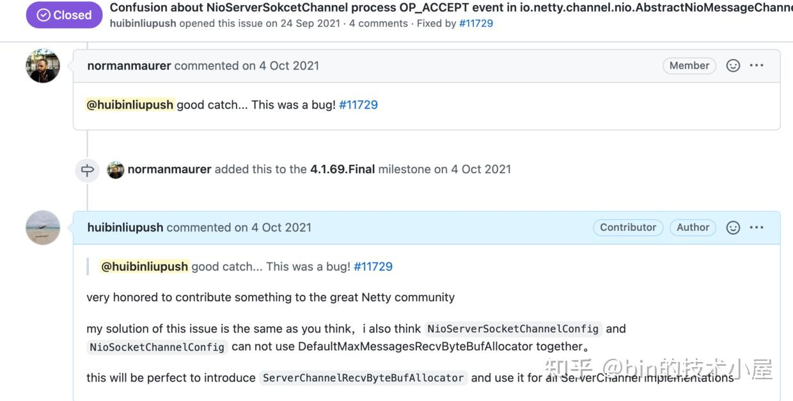

于是笔者就在Github提了一个**[?Issue#11708](https://link.zhihu.com/?target=https%3A//github.com/netty/netty/issues/11708)** ，阐述了下这个Bug产生的原因以及导致的结果并和Netty的作者一起讨论了下修复措施。如上图所示。

> Issue#11708： [github.com/netty/netty/](https://link.zhihu.com/?target=https%3A//github.com/netty/netty/issues/11708)

这里先不详细解释这个Issue，也不建议大家现在就打开这个Issue查看，笔者会在本文的介绍中随着源码深入的解读慢慢的为大家一层一层地拨开迷雾。

之所以在文章的开头把这个拎出来，笔者是想让大家带着怀疑，审视，欣赏，崇敬，敬畏的态度来一起品读世界顶级程序员编写的代码。由衷的感谢他们在这一领域做出的贡献。

好了，问题抛出来后，我们就带着这个疑问来开始本文的内容吧~~~

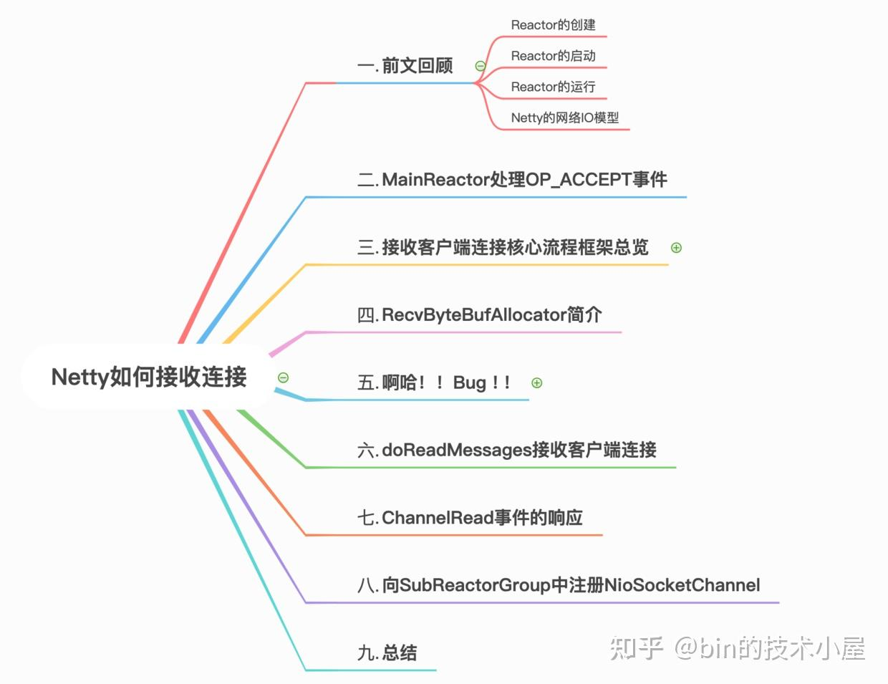

## 前文回顾

按照老规矩，再开始本文的内容之前，我们先来回顾下前边几篇文章的概要内容帮助大家梳理一个框架全貌出来。

> 笔者这里再次想和读者朋友们强调的是本文可以独立观看，并不依赖前边系列文章的内容，只是大家如果对相关细节部分感兴趣的话，可以在阅读完本文之后在去回看相关文章。

在前边的系列文章中，笔者为大家介绍了驱动Netty整个框架运转的核心引擎Reactor的创建，启动，运行的全流程。从现在开始Netty的整个核心框架就开始运转起来开始工作了，本文要介绍的主要内容就是Netty在启动之后要做的第一件事件：监听端口地址，高效接收客户端连接。

在**[?《聊聊Netty那些事儿之从内核角度看IO模型》](https://link.zhihu.com/?target=https%3A//mp.weixin.qq.com/s%3F__biz%3DMzg2MzU3Mjc3Ng%3D%3D%26mid%3D2247483737%26idx%3D1%26sn%3D7ef3afbb54289c6e839eed724bb8a9d6%26chksm%3Dce77c71ef9004e08e3d164561e3a2708fc210c05408fa41f7fe338d8e85f39c1ad57519b614e%23rd)** 一文中，我们是从整个网络框架的基石IO模型的角度整体阐述了下Netty的IO线程模型。

而Netty中的Reactor正是IO线程在Netty中的模型定义。Reactor在Netty中是以Group的形式出现的，分为:

- 主Reactor线程组也就是我们在启动代码中配置的 `EventLoopGroup bossGroup`,main reactor group中的reactor主要负责监听客户端连接事件，高效的处理客户端连接。也是本文我们要介绍的重点。
- 从Reactor线程组也就是我们在启动代码中配置的 `EventLoopGroup workerGroup` ，sub reactor group中的reactor主要负责处理客户端连接上的IO事件，以及异步任务的执行。

最后我们得出Netty的整个IO模型如下：

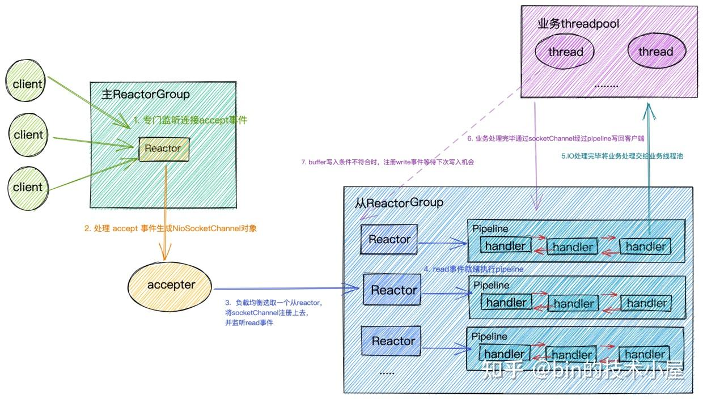

本文我们讨论的重点就是MainReactorGroup的核心工作上图中所示的步骤1，步骤2，步骤3。

在从整体上介绍完Netty的IO模型之后，我们又在**[?《Reactor在Netty中的实现(创建篇)》](https://link.zhihu.com/?target=https%3A//mp.weixin.qq.com/s%3F__biz%3DMzg2MzU3Mjc3Ng%3D%3D%26mid%3D2247483907%26idx%3D1%26sn%3D084c470a8fe6234c2c9461b5f713ff30%26chksm%3Dce77c444f9004d52e7c6244bee83479070effb0bc59236df071f4d62e91e25f01715fca53696%23rd)** 中完整的介绍了Netty框架的骨架主从Reactor组的搭建过程，阐述了Reactor是如何被创建出来的，并介绍了它的核心组件如下图所示：

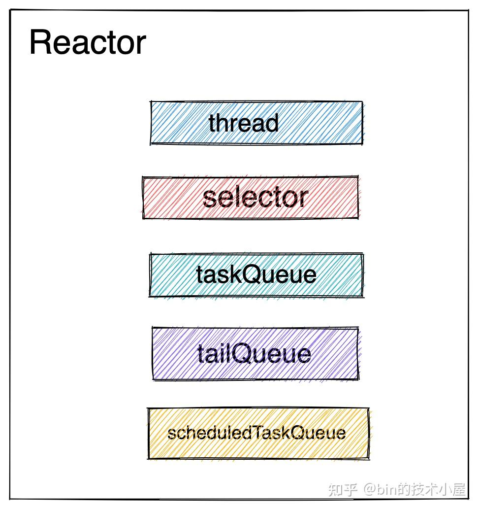

- `thread` 即为Reactor中的IO线程，主要负责监听IO事件，处理IO任务，执行异步任务。
- `selector` 则是JDK NIO对 [操作系统](https://zhida.zhihu.com/search?content_id=191690546&content_type=Article&match_order=1&q=%E6%93%8D%E4%BD%9C%E7%B3%BB%E7%BB%9F&zhida_source=entity) 底层IO [多路复用技术](https://zhida.zhihu.com/search?content_id=191690546&content_type=Article&match_order=1&q=%E5%A4%9A%E8%B7%AF%E5%A4%8D%E7%94%A8%E6%8A%80%E6%9C%AF&zhida_source=entity) 实现的封装。用于监听IO就绪事件。
- `taskQueue` 用于保存Reactor需要执行的 [异步任务](https://zhida.zhihu.com/search?content_id=191690546&content_type=Article&match_order=3&q=%E5%BC%82%E6%AD%A5%E4%BB%BB%E5%8A%A1&zhida_source=entity) ，这些异步任务可以由用户在业务线程中向Reactor提交，也可以是Netty框架提交的一些自身核心的任务。
- `scheduledTaskQueue` 则是保存Reactor中执行的定时任务。代替了原有的时间轮来执行延时任务。
- `tailQueue` 保存了在Reactor需要执行的一些尾部收尾任务，在普通任务执行完后 Reactor线程会执行尾部任务，比如对Netty 的运行状态做一些统计数据，例如任务循环的耗时、占用物理内存的大小等等

在骨架搭建完毕之后，我们随后又在在**[?《详细图解Netty Reactor启动全流程》](https://link.zhihu.com/?target=https%3A//mp.weixin.qq.com/s%3F__biz%3DMzg2MzU3Mjc3Ng%3D%3D%26mid%3D2247484005%26idx%3D1%26sn%3D52f51269902a58f40d33208421109bc3%26chksm%3Dce77c422f9004d340e5b385ef6ba24dfba1f802076ace80ad6390e934173a10401e64e13eaeb%23rd)** 》一文中介绍了 **本文的主角服务端NioServerSocketChannel的创建，初始化，绑定端口地址，向main reactor注册监听 `OP_ACCEPT事件` 的完整过程** 。

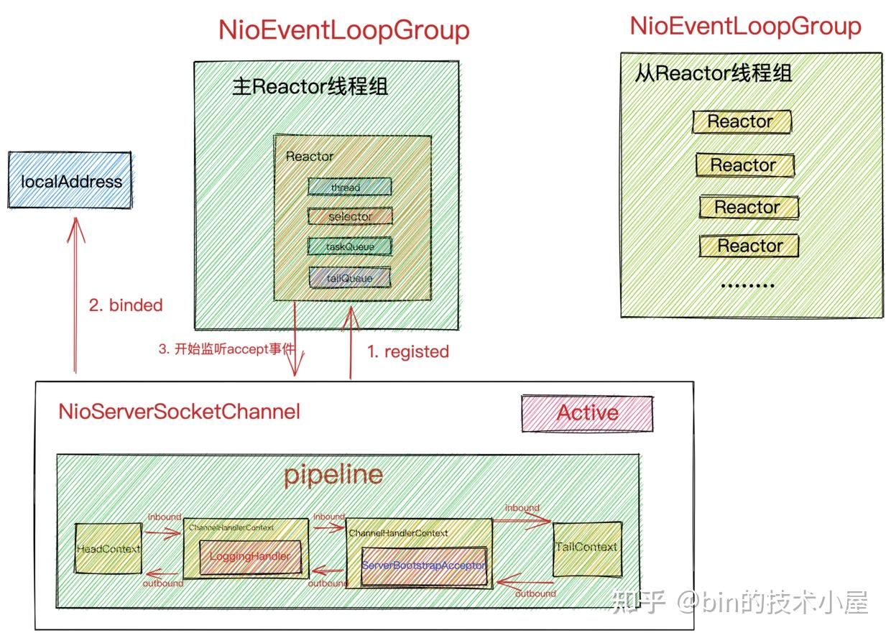

main reactor如何处理OP_ACCEPT事件将会是本文的主要内容。

自此Netty框架的main reactor group已经启动完毕，开始准备监听OP_accept事件，当客户端连接上来之后，OP_ACCEPT事件活跃，main reactor开始处理OP_ACCEPT事件接收客户端连接了。

而netty中的IO事件分为：OP_ACCEPT事件，OP_READ事件，OP_WRITE事件和OP_CONNECT事件，netty对于IO事件的监听和处理统一封装在Reactor模型中，这四个 [IO事件](https://zhida.zhihu.com/search?content_id=191690546&content_type=Article&match_order=5&q=IO%E4%BA%8B%E4%BB%B6&zhida_source=entity) 的处理过程也是我们后续文章中要单独拿出来介绍的，本文我们聚焦OP_ACCEPT事件的处理。

而为了让大家能够对IO事件的处理有一个完整性的认识，笔者写了**[?《一文聊透Netty核心引擎Reactor的运转架构》](https://link.zhihu.com/?target=https%3A//mp.weixin.qq.com/s%3F__biz%3DMzg2MzU3Mjc3Ng%3D%3D%26mid%3D2247484087%26idx%3D1%26sn%3D0c065780e0f05c23c8e6465ede86cba0%26chksm%3Dce77c4f0f9004de63be369a664105708bc5975b52993f4a6df223caed34cc1ef6185a16acd75%26token%3D997171731%26lang%3Dzh_CN%23rd)** 这篇文章，在文章中详细介绍了 [Reactor线程](https://zhida.zhihu.com/search?content_id=191690546&content_type=Article&match_order=4&q=Reactor%E7%BA%BF%E7%A8%8B&zhida_source=entity) 的整体运行框架。

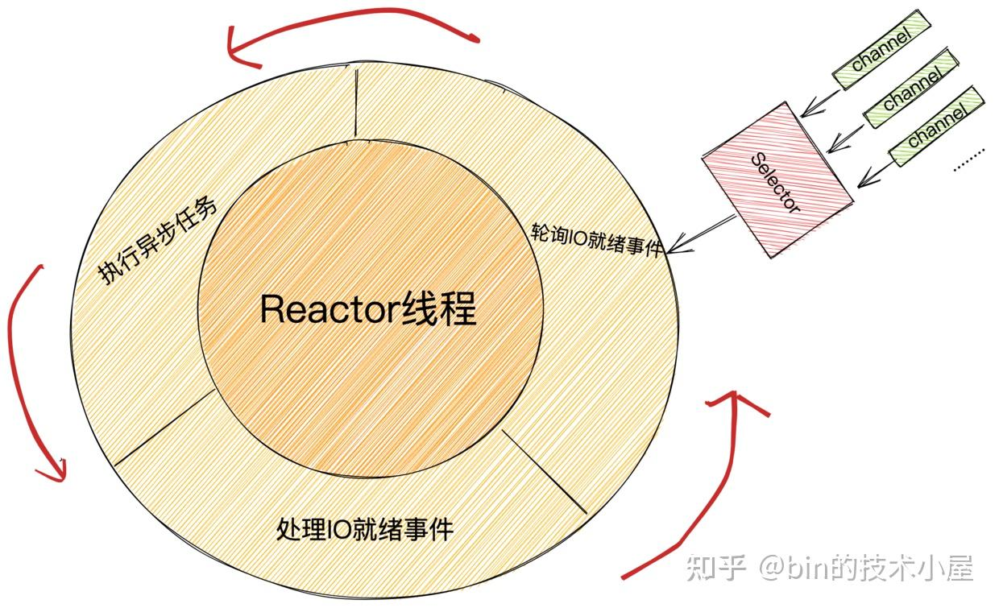

Reactor线程会在一个死循环中996不停的运转，在循环中会不断的轮询监听Selector上的IO事件，当IO事件活跃后，Reactor从Selector上被唤醒转去执行IO就绪事件的处理，在这个过程中我们引出了上述四种IO事件的处理 [入口函数](https://zhida.zhihu.com/search?content_id=191690546&content_type=Article&match_order=1&q=%E5%85%A5%E5%8F%A3%E5%87%BD%E6%95%B0&zhida_source=entity) 。

```
private void processSelectedKey(SelectionKey k, AbstractNioChannel ch) {
        //获取Channel的底层操作类Unsafe
        final AbstractNioChannel.NioUnsafe unsafe = ch.unsafe();
        if (!k.isValid()) {
            ......如果SelectionKey已经失效则关闭对应的Channel......
        }

        try {
            //获取IO就绪事件
            int readyOps = k.readyOps();
            //处理Connect事件
            if ((readyOps & SelectionKey.OP_CONNECT) != 0) {
                int ops = k.interestOps();
                //移除对Connect事件的监听，否则Selector会一直通知
                ops &= ~SelectionKey.OP_CONNECT;
                k.interestOps(ops);
                //触发channelActive事件处理Connect事件
                unsafe.finishConnect();
            }

            //处理Write事件
            if ((readyOps & SelectionKey.OP_WRITE) != 0) {
                ch.unsafe().forceFlush();
            }

             //处理Read事件或者Accept事件
            if ((readyOps & (SelectionKey.OP_READ | SelectionKey.OP_ACCEPT)) != 0 || readyOps == 0) {
                unsafe.read();
            }
        } catch (CancelledKeyException ignored) {
            unsafe.close(unsafe.voidPromise());
        }
    }
```

本文笔者将会为大家重点介绍 `OP_ACCEPT事件` 的处理入口函数 `unsafe.read()` 的整个源码实现。

当客户端连接完成三次握手之后，main reactor中的selector产生 `OP_ACCEPT事件` 活跃，main reactor随即被唤醒，来到了 `OP_ACCEPT事件` 的处理入口函数开始接收客户端连接。

## 1\. Main Reactor处理OP_ACCEPT事件

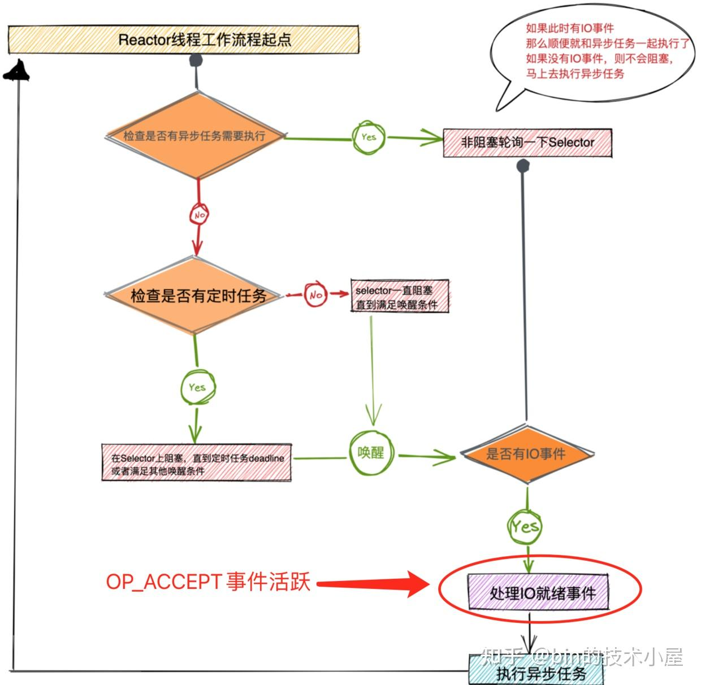

当 `Main Reactor` 轮询到 `NioServerSocketChannel` 上的 `OP_ACCEPT事件` 就绪时，Main Reactor线程就会从 `JDK Selector` 上的阻塞轮询API `selector.select(timeoutMillis)` 调用中返回。转而去处理 `NioServerSocketChannel` 上的 `OP_ACCEPT事件` 。

```
public final class NioEventLoop extends SingleThreadEventLoop {

    private void processSelectedKey(SelectionKey k, AbstractNioChannel ch) {
        final AbstractNioChannel.NioUnsafe unsafe = ch.unsafe();
        ..............省略.................

        try {
            int readyOps = k.readyOps();

            if ((readyOps & SelectionKey.OP_CONNECT) != 0) {
               ..............处理OP_CONNECT事件.................
            }

            if ((readyOps & SelectionKey.OP_WRITE) != 0) {
              ..............处理OP_WRITE事件.................
            }

            if ((readyOps & (SelectionKey.OP_READ | SelectionKey.OP_ACCEPT)) != 0 || readyOps == 0) {
                //本文重点处理OP_ACCEPT事件
                unsafe.read();
            }
        } catch (CancelledKeyException ignored) {
            unsafe.close(unsafe.voidPromise());
        }
    }

}
```

- 处理IO就绪事件的入口函数 `processSelectedKey` 中的参数 `AbstractNioChannel ch` 正是Netty服务端 `NioServerSocketChannel` 。因为此时的执行线程为main reactor线程，而main reactor上注册的正是netty服务端NioServerSocketChannel负责监听端口地址，接收客户端连接。
- 通过 `ch.unsafe()` 获取到的NioUnsafe操作类正是NioServerSocketChannel中对底层JDK NIO ServerSocketChannel的Unsafe底层操作类。

> `Unsafe接口` 是Netty对Channel底层操作行为的封装，比如NioServerSocketChannel的底层Unsafe操作类干的事情就是 `绑定端口地址` ， `处理OP_ACCEPT事件` 。

这里我们看到，Netty将 `OP_ACCEPT事件` 处理的入口 [函数封装](https://zhida.zhihu.com/search?content_id=191690546&content_type=Article&match_order=1&q=%E5%87%BD%E6%95%B0%E5%B0%81%E8%A3%85&zhida_source=entity) 在 `NioServerSocketChannel` 里的底层操作类Unsafe的 `read` 方法中。

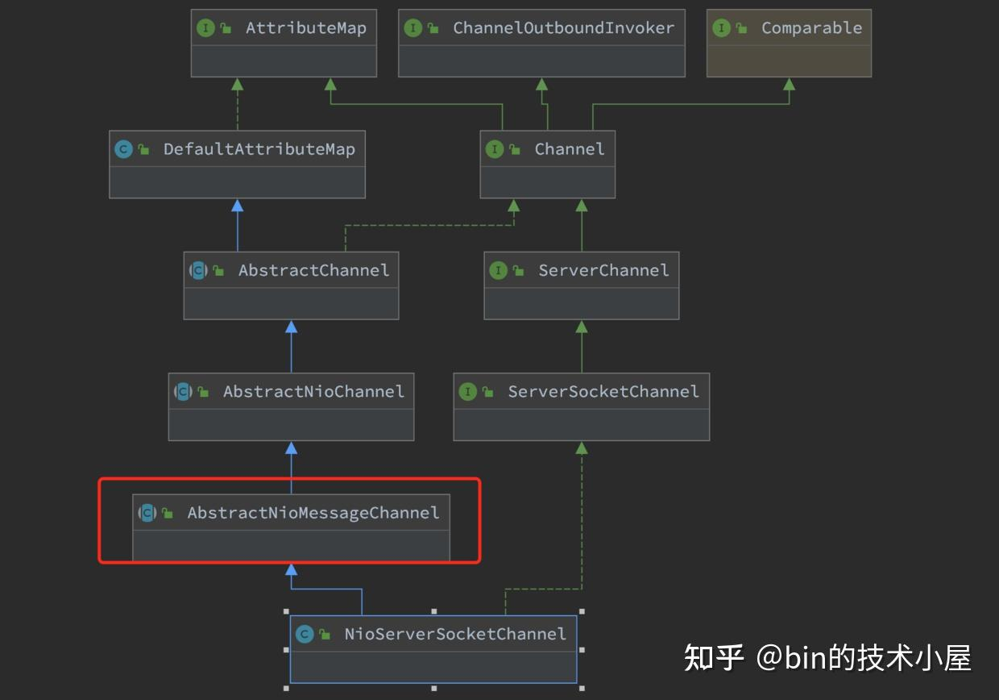

而NioServerSocketChannel中的Unsafe操作类实现类型为 `NioMessageUnsafe` 定义在上图继承结构中的 `AbstractNioMessageChannel父类中` 。

下面我们到 `NioMessageUnsafe#read` 方法中来看下Netty对 `OP_ACCPET事件` 的具体处理过程：

## 2\. 接收客户端连接核心流程框架总览

我们还是按照老规矩，先从整体上把整个OP_ACCEPT事件的逻辑处理框架提取出来，让大家先总体俯视下流程全貌，然后在针对每个核心点位进行各个击破。

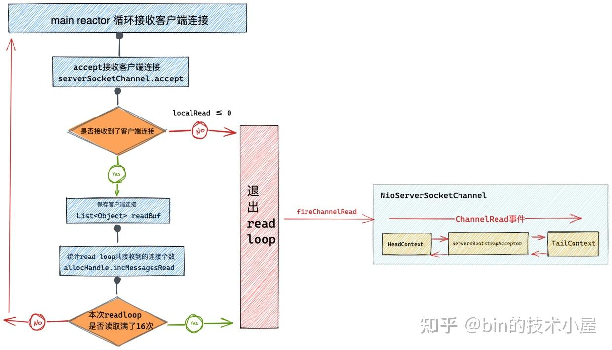

main reactor线程是在一个 `do...while{...}` 循环read loop中不断的调用JDK NIO `serverSocketChannel.accept()` 方法来接收完成三次握手的客户端连接 `NioSocketChannel` 的，并将接收到的客户端连接NioSocketChannel临时保存在 `List<Object> readBuf` 集合中，后续会服务端NioServerSocketChannel的pipeline中通过ChannelRead事件来传递，最终会在ServerBootstrapAcceptor这个ChannelHandler中被处理初始化，并将其注册到Sub Reator Group中。

这里的read loop循环会被限定只能读取 **16次** ，当main reactor从NioServerSocketChannel中读取客户端连接NioSocketChannel的次数达到 **16次** 之后，无论此时是否还有客户端连接都不能在继续读取了。

因为我们在**[?《一文聊透Netty核心引擎Reactor的运转架构》](https://link.zhihu.com/?target=https%3A//mp.weixin.qq.com/s%3F__biz%3DMzg2MzU3Mjc3Ng%3D%3D%26mid%3D2247484087%26idx%3D1%26sn%3D0c065780e0f05c23c8e6465ede86cba0%26chksm%3Dce77c4f0f9004de63be369a664105708bc5975b52993f4a6df223caed34cc1ef6185a16acd75%26token%3D997171731%26lang%3Dzh_CN%23rd)** 一文中提到，netty对reactor线程压榨的比较狠，要干的事情很多，除了要监听轮询IO就绪事件，处理IO就绪事件，还需要执行用户和netty框架本省提交的异步任务和定时任务。

所以这里的main reactor线程不能在read loop中无限制的执行下去，因为还需要分配时间去执行异步任务，不能因为无限制的接收客户端连接而耽误了异步任务的执行。所以这里将read loop的循环次数限定为16次。

如果main reactor线程在read loop中读取客户端连接NioSocketChannel的次数已经满了16次，即使此时还有客户端连接未接收，那么main reactor线程也不会再去接收了，而是转去执行异步任务，当异步任务执行完毕后，还会在回来执行剩余接收连接的任务。


main reactor线程退出read loop循环的条件有两个：

1. 在限定的16次读取中，已经没有新的客户端连接要接收了。退出循环。
2. 从NioServerSocketChannel中读取客户端连接的次数达到了16次，无论此时是否还有客户端连接都需要退出循环。

以上就是Netty在接收客户端连接时的整体核心逻辑，下面笔者将这部分逻辑的核心源码实现框架提取出来，方便大家根据上述核心逻辑与源码中的处理模块对应起来，还是那句话，这里只需要总体把握核心处理流程，不需要读懂每一行代码，笔者会在文章的后边分模块来各个击破它们。

```
public abstract class AbstractNioMessageChannel extends AbstractNioChannel {

  private final class NioMessageUnsafe extends AbstractNioUnsafe {

        //存放连接建立后，创建的客户端SocketChannel
        private final List<Object> readBuf = new ArrayList<Object>();

        @Override
        public void read() {
            //必须在Main Reactor线程中执行
            assert eventLoop().inEventLoop();
            //注意下面的config和pipeline都是服务端ServerSocketChannel中的
            final ChannelConfig config = config();
            final ChannelPipeline pipeline = pipeline();
            //创建接收数据Buffer分配器（用于分配容量大小合适的byteBuffer用来容纳接收数据）
            //在接收连接的场景中，这里的allocHandle只是用于控制read loop的循环读取创建连接的次数。
            final RecvByteBufAllocator.Handle allocHandle = unsafe().recvBufAllocHandle();
            allocHandle.reset(config);

            boolean closed = false;
            Throwable exception = null;
            try {
                try {
                    do {
                        //底层调用NioServerSocketChannel->doReadMessages 创建客户端SocketChannel
                        int localRead = doReadMessages(readBuf);

                        //已无新的连接可接收则退出read loop
                        if (localRead == 0) {
                            break;
                        }
                        if (localRead < 0) {
                            closed = true;
                            break;
                        }
                        //统计在当前事件循环中已经读取到得Message数量（创建连接的个数）
                        allocHandle.incMessagesRead(localRead);
                    } while (allocHandle.continueReading());//判断是否已经读满16次
                } catch (Throwable t) {
                    exception = t;
                }

                int size = readBuf.size();
                for (int i = 0; i < size; i ++) {
                    readPending = false;
                    //在NioServerSocketChannel对应的pipeline中传播ChannelRead事件
                    //初始化客户端SocketChannel，并将其绑定到Sub Reactor线程组中的一个Reactor上
                    pipeline.fireChannelRead(readBuf.get(i));
                }
                //清除本次accept 创建的客户端SocketChannel集合
                readBuf.clear();
                allocHandle.readComplete();
                //触发readComplete事件传播
                pipeline.fireChannelReadComplete();
                ....................省略............
            } finally {
                ....................省略............
            }
        }
    }
  }
}
```

这里首先要通过断言 `assert eventLoop().inEventLoop()` 确保处理接收客户端连接的线程必须为Main Reactor 线程。

而main reactor中主要注册的是服务端NioServerSocketChannel，主要负责处理 `OP_ACCEPT事件` ，所以当前main reactor线程是在NioServerSocketChannel中执行接收连接的工作。

所以这里我们通过 `config()` 获取到的是NioServerSocketChannel的属性配置类 `NioServerSocketChannelConfig`,它是在Reactor的启动阶段被创建出来的。

```
public NioServerSocketChannel(ServerSocketChannel channel) {
        //父类AbstractNioChannel中保存JDK NIO原生ServerSocketChannel以及要监听的事件OP_ACCEPT
        super(null, channel, SelectionKey.OP_ACCEPT);
        //DefaultChannelConfig中设置用于Channel接收数据用的buffer->AdaptiveRecvByteBufAllocator
        config = new NioServerSocketChannelConfig(this, javaChannel().socket());
    }
```

同理这里通过 `pipeline()` 获取到的也是NioServerSocketChannel中的 `pipeline` 。它会在NioServerSocketChannel向main reactor注册成功之后被初始化。

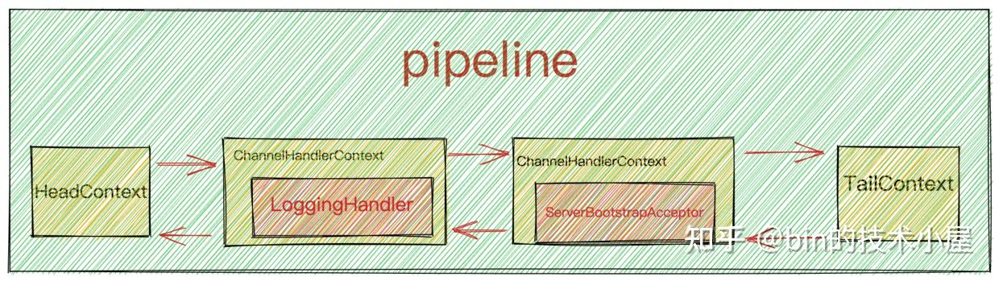

前边提到main reactor线程会被限定只能在read loop中向NioServerSocketChannel读取16次客户端连接，所以在开始read loop之前，我们需要创建一个能够保存记录读取次数的对象，在每次read loop循环之后，可以根据这个对象来判断是否结束read loop。

这个对象就是这里的 `RecvByteBufAllocator.Handle allocHandle` 专门用于统计read loop中接收客户端连接的次数，以及判断是否该结束read loop转去执行异步任务。

当这一切准备就绪之后，main reactor线程就开始在 `do{....}while(...)` 循环中接收客户端连接了。

在 read loop中通过调用 `doReadMessages函数` 接收完成三次握手的客户端连接，底层会调用到JDK NIO ServerSocketChannel的accept方法，从内核 [全连接队列](https://zhida.zhihu.com/search?content_id=191690546&content_type=Article&match_order=1&q=%E5%85%A8%E8%BF%9E%E6%8E%A5%E9%98%9F%E5%88%97&zhida_source=entity) 中取出客户端连接。

返回值 `localRead` 表示接收到了多少客户端连接，客户端连接通过accept方法只会一个一个的接收，所以这里的 `localRead` 正常情况下都会返回 `1` ，当 `localRead <= 0` 时意味着已经没有新的客户端连接可以接收了，本次main reactor接收客户端的任务到这里就结束了，跳出read loop。开始新的一轮IO事件的监听处理。

```
public static SocketChannel accept(final ServerSocketChannel serverSocketChannel) throws IOException {
        try {
            return AccessController.doPrivileged(new PrivilegedExceptionAction<SocketChannel>() {
                @Override
                public SocketChannel run() throws IOException {
                    return serverSocketChannel.accept();
                }
            });
        } catch (PrivilegedActionException e) {
            throw (IOException) e.getCause();
        }
    }
```

随后会将接收到的客户端连接占时存放到 `List<Object> readBuf` 集合中。

```
private final class NioMessageUnsafe extends AbstractNioUnsafe {

        //存放连接建立后，创建的客户端SocketChannel
        private final List<Object> readBuf = new ArrayList<Object>();
}
```

调用 `allocHandle.incMessagesRead` 统计本次事件循环中接收到的客户端连接个数，最后在read loop末尾通过 `allocHandle.continueReading` 判断是否达到了限定的16次。从而决定main reactor线程是继续接收客户端连接还是转去执行异步任务。

main reactor线程退出read loop的两个条件：

1. 在限定的16次读取中，已经没有新的客户端连接要接收了。退出循环。
2. 从NioServerSocketChannel中读取客户端连接的次数达到了16次，无论此时是否还有客户端连接都需要退出循环。

当满足以上两个退出条件时，main reactor线程就会退出read loop，由于在read loop中接收到的客户端连接全部暂存在 `List<Object> readBuf` 集合中,随后开始遍历readBuf，在NioServerSocketChannel的pipeline中传播ChannelRead事件。

```
int size = readBuf.size();
                for (int i = 0; i < size; i ++) {
                    readPending = false;
                    //NioServerSocketChannel对应的pipeline中传播read事件
                    //io.netty.bootstrap.ServerBootstrap.ServerBootstrapAcceptor.channelRead
                    //初始化客户端SocketChannel，并将其绑定到Sub Reactor线程组中的一个Reactor上
                    pipeline.fireChannelRead(readBuf.get(i));
                }
```

最终pipeline中的ChannelHandler(ServerBootstrapAcceptor)会响应ChannelRead事件，并在相应 [回调函数](https://zhida.zhihu.com/search?content_id=191690546&content_type=Article&match_order=1&q=%E5%9B%9E%E8%B0%83%E5%87%BD%E6%95%B0&zhida_source=entity) 中初始化客户端NioSocketChannel，并将其注册到Sub Reactor Group中。此后客户端NioSocketChannel绑定到的sub reactor就开始监听处理客户端连接上的读写事件了。

Netty整个接收客户端的逻辑过程如下图步骤1，2，3所示。


以上内容就是笔者提取出来的整体流程框架，下面我们来将其中涉及到的重要核心模块拆开，一个一个详细解读下。

## 3\. RecvByteBufAllocator简介

Reactor在处理对应Channel上的IO数据时，都会采用一个 `ByteBuffer` 来接收Channel上的IO数据。而本小节要介绍的RecvByteBufAllocator正是用来分配ByteBuffer的一个分配器。

还记得这个 `RecvByteBufAllocator` 在哪里被创建的吗？？

在**[?《聊聊Netty那些事儿之Reactor在Netty中的实现(创建篇)》](https://link.zhihu.com/?target=https%3A//mp.weixin.qq.com/s%3F__biz%3DMzg2MzU3Mjc3Ng%3D%3D%26mid%3D2247483907%26idx%3D1%26sn%3D084c470a8fe6234c2c9461b5f713ff30%26chksm%3Dce77c444f9004d52e7c6244bee83479070effb0bc59236df071f4d62e91e25f01715fca53696%23rd)** 一文中，在介绍 `NioServerSocketChannel` 的创建过程中提到，对应Channel的配置类NioServerSocketChannelConfig也会随着NioServerSocketChannel的创建而创建。

```
public NioServerSocketChannel(ServerSocketChannel channel) {
        super(null, channel, SelectionKey.OP_ACCEPT);
        config = new NioServerSocketChannelConfig(this, javaChannel().socket());
    }
```

在创建 `NioServerSocketChannelConfig` 的过程中会创建 `RecvByteBufAllocator` 。

```
public DefaultChannelConfig(Channel channel) {
            this(channel, new AdaptiveRecvByteBufAllocator());
    }
```

这里我们看到NioServerSocketChannel中的RecvByteBufAllocator实际类型为 `AdaptiveRecvByteBufAllocator` ，顾名思义，这个类型的RecvByteBufAllocator可以根据Channel上每次到来的IO数据大小来自适应动态调整ByteBuffer的容量。

对于服务端NioServerSocketChannel来说，它上边的IO数据就是客户端的连接，它的长度和类型都是固定的，所以在接收客户端连接的时候并不需要这样的一个ByteBuffer来接收，我们会将接收到的客户端连接存放在 `List<Object> readBuf` 集合中

对于客户端NioSocketChannel来说，它上边的IO数据时客户端发送来的网络数据，长度是不定的，所以才会需要这样一个可以根据每次IO数据的大小来自适应动态调整容量的ByteBuffer来接收。

那么看起来这个RecvByteBufAllocator和本文的主题不是很关联，因为在接收连接的过程中并不会怎么用到它，这个类笔者还会在后面的文章中详细介绍，之所以这里把它拎出来单独介绍是因为它和本文开头提到的Bug有关系，这个Bug就是由这个类引起的。

### 3.1 RecvByteBufAllocator.Handle的获取

在本文中，我们是通过NioServerSocketChannel中的unsafe底层操作类来获取RecvByteBufAllocator.Handle的

```
final RecvByteBufAllocator.Handle allocHandle = unsafe().recvBufAllocHandle();

protected abstract class AbstractUnsafe implements Unsafe {
        @Override
        public RecvByteBufAllocator.Handle recvBufAllocHandle() {
            if (recvHandle == null) {
                recvHandle = config().getRecvByteBufAllocator().newHandle();
            }
            return recvHandle;
        }
}
```

我们看到最终会在NioServerSocketChannel的配置类NioServerSocketChannelConfig中获取到 `AdaptiveRecvByteBufAllocator`

```
public class DefaultChannelConfig implements ChannelConfig {
    //用于Channel接收数据用的buffer分配器  类型为AdaptiveRecvByteBufAllocator
    private volatile RecvByteBufAllocator rcvBufAllocator;
}
```

`AdaptiveRecvByteBufAllocator` 中会创建自适应动态调整容量的ByteBuffer分配器。

```
public class AdaptiveRecvByteBufAllocator extends DefaultMaxMessagesRecvByteBufAllocator {

    @Override
    public Handle newHandle() {
        return new HandleImpl(minIndex, maxIndex, initial);
    }

    private final class HandleImpl extends MaxMessageHandle {
                  .................省略................
    }
}
```

这里的 `newHandle` 方法返回的具体类型为 `MaxMessageHandle` ，这个 `MaxMessageHandle` 里边保存了每次从 `Channel` 中读取 `IO数据` 的容量指标，方便下次读取时分配合适大小的 `buffer` 。

每次在使用 `allocHandle` 前需要调用 `allocHandle.reset(config);`重置里边的 [统计指标](https://zhida.zhihu.com/search?content_id=191690546&content_type=Article&match_order=1&q=%E7%BB%9F%E8%AE%A1%E6%8C%87%E6%A0%87&zhida_source=entity) 。

```
public abstract class MaxMessageHandle implements ExtendedHandle {
        private ChannelConfig config;
        //每次事件轮询时，最多读取16次
        private int maxMessagePerRead;
        //本次事件轮询总共读取的message数,这里指的是接收连接的数量
        private int totalMessages;
        //本次事件轮询总共读取的字节数
        private int totalBytesRead;

       @Override
        public void reset(ChannelConfig config) {
            this.config = config;
            //默认每次最多读取16次
            maxMessagePerRead = maxMessagesPerRead();
            totalMessages = totalBytesRead = 0;
        }
    }
```

- **maxMessagePerRead** ：用于控制每次read loop里最大可以循环读取的次数，默认为16次，可在启动配置类 `ServerBootstrap` 中通过 `ChannelOption.MAX_MESSAGES_PER_READ` 选项设置。

```
ServerBootstrap b = new ServerBootstrap();
b.group(bossGroup, workerGroup)
  .channel(NioServerSocketChannel.class)
  .option(ChannelOption.MAX_MESSAGES_PER_READ, 自定义次数)
```

- **totalMessages** ：用于统计read loop中总共接收的连接个数，每次read loop循环后会调用 `allocHandle.incMessagesRead` 增加记录接收到的连接个数。

```
@Override
        public final void incMessagesRead(int amt) {
            totalMessages += amt;
        }
```

- **totalBytesRead** ：用于统计在read loop中总共接收到客户端连接上的数据大小，这个字段主要用于sub reactor在接收客户端NioSocketChannel上的网络数据用的，本文我们介绍的是main reactor接收客户端连接，所以这里并不会用到这个字段。这个字段会在sub reactor每次读取完NioSocketChannel上的网络数据时增加记录。

```
@Override
        public void lastBytesRead(int bytes) {
            lastBytesRead = bytes;
            if (bytes > 0) {
                totalBytesRead += bytes;
            }
        }
```

MaxMessageHandler中还有一个非常重要的方法就是在每次read loop末尾会调用 `allocHandle.continueReading()` 方法来判断读取连接次数是否已满16次，来决定main reactor线程是否退出循环。

```
do {
                        //底层调用NioServerSocketChannel->doReadMessages 创建客户端SocketChannel
                        int localRead = doReadMessages(readBuf);
                        if (localRead == 0) {
                            break;
                        }
                        if (localRead < 0) {
                            closed = true;
                            break;
                        }
                        //统计在当前事件循环中已经读取到得Message数量（创建连接的个数）
                        allocHandle.incMessagesRead(localRead);
                    } while (allocHandle.continueReading());
```

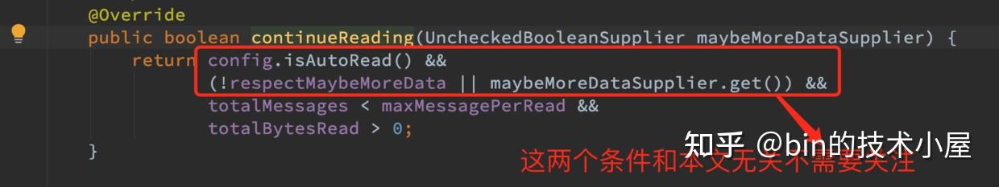

红框中圈出来的两个判断条件和本文主题无关，我们这里不需要关注，笔者会在后面的文章详细介绍。

- `totalMessages < maxMessagePerRead` ：在本文的接收客户端连接场景中，这个条件用于判断main reactor线程在read loop中的读取次数是否超过了16次。如果超过16次就会返回false，main reactor线程退出循环。
- `totalBytesRead > 0` ：用于判断当客户端NioSocketChannel上的OP_READ事件活跃时，sub reactor线程在read loop中是否读取到了网络数据。

以上内容就是RecvByteBufAllocator.Handle在接收客户端连接场景下的作用，大家这里仔细看下这个 `allocHandle.continueReading()` 方法退出循环的判断条件，再结合整个 `do{....}while(...)` 接收连接 [循环体](https://zhida.zhihu.com/search?content_id=191690546&content_type=Article&match_order=1&q=%E5%BE%AA%E7%8E%AF%E4%BD%93&zhida_source=entity) ，感受下是否哪里有些不对劲？Bug即将出现~~~


## 4\. 啊哈！！Bug!!

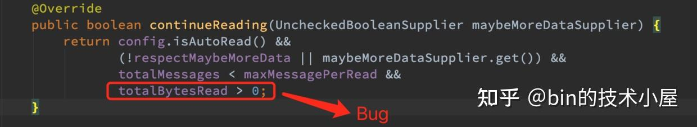

netty不论是在本文中处理接收客户端连接的场景还是在处理接收客户端连接上的网络数据场景都会在一个 `do{....}while(...)` 循环read loop中不断的处理。

同时也都会利用在上一小节中介绍的 `RecvByteBufAllocator.Handle` 来记录每次read loop接收到的连接个数和从连接上读取到的网络数据大小。

从而在read loop的末尾都会通过 `allocHandle.continueReading()` 方法判断是否应该退出read loop循环结束连接的接收流程或者是结束连接上数据的读取流程。

无论是用于接收客户端连接的main reactor也好还是用于接收客户端连接上的网络数据的sub reactor也好，它们的运行框架都是一样的，只不过是具体分工不同。

所以netty这里想用统一的 `RecvByteBufAllocator.Handle` 来处理以上两种场景。

而 `RecvByteBufAllocator.Handle` 中的 `totalBytesRead` 字段主要记录sub reactor线程在处理客户端NioSocketChannel中OP_READ事件活跃时，总共在read loop中读取到的网络数据，而这里是main reactor线程在接收客户端连接所以这个字段并不会被设置。totalBytesRead字段的值在本文中永远会是 `0` 。

所以无论同时有多少个客户端 [并发连接](https://zhida.zhihu.com/search?content_id=191690546&content_type=Article&match_order=1&q=%E5%B9%B6%E5%8F%91%E8%BF%9E%E6%8E%A5&zhida_source=entity) 到服务端上，在接收连接的这个read loop中永远只会接受一个连接就会退出循环，因为 `allocHandle.continueReading()方法` 中的判断条件 `totalBytesRead > 0` 永远会返回 `false` 。

```
do {
                        //底层调用NioServerSocketChannel->doReadMessages 创建客户端SocketChannel
                        int localRead = doReadMessages(readBuf);
                        if (localRead == 0) {
                            break;
                        }
                        if (localRead < 0) {
                            closed = true;
                            break;
                        }
                        //统计在当前事件循环中已经读取到得Message数量（创建连接的个数）
                        allocHandle.incMessagesRead(localRead);
                    } while (allocHandle.continueReading());
```

**而netty的本意是在这个read loop循环中尽可能多的去接收客户端的并发连接，同时又不影响main reactor线程执行异步任务。但是由于这个Bug，main reactor在这个循环中只执行一次就结束了。这也一定程度上就影响了netty的吞吐** 。

让我们想象下这样的一个场景，当有16个客户端同时并发连接到了服务端，这时NioServerSocketChannel上的 `OP_ACCEPT事件` 活跃，main reactor从Selector上被唤醒，随后执行 `OP_ACCEPT事件` 的处理。

```
public final class NioEventLoop extends SingleThreadEventLoop {
    @Override
    protected void run() {
        int selectCnt = 0;
        for (;;) {
            try {
                int strategy;
                try {
                    strategy = selectStrategy.calculateStrategy(selectNowSupplier, hasTasks());
                    switch (strategy) {
                    case SelectStrategy.CONTINUE:
                          ............省略.........
                    case SelectStrategy.BUSY_WAIT:

                          ............省略.........
                    case SelectStrategy.SELECT:
                            ............监听轮询IO事件.........
                    default:
                    }
                } catch (IOException e) {
                    ............省略.........
                }

                ............处理IO就绪事件.........
                ............执行异步任务.........
    }
}
```

但是由于这个Bug的存在，main reactor在接收客户端连接的这个read loop中只接收了一个客户端连接就匆匆返回了。

```
private final class NioMessageUnsafe extends AbstractNioUnsafe {
                    do {
                        int localRead = doReadMessages(readBuf);
                        .........省略...........
                    } while (allocHandle.continueReading());
     }
```

然后根据下图中这个Reactor的运行结构去执行异步任务，随后绕一大圈又会回到 `NioEventLoop#run` 方法中重新发起一轮OP_ACCEPT事件轮询。


由于现在还有15个客户端并发连接没有被接收，所以此时Main Reactor线程并不会在 `selector.select()` 上阻塞，最终绕一圈又会回到 `NioMessageUnsafe#read` 方法的 `do{.....}while()` 循环。在接收一个连接之后又退出循环。

本来我们可以在一次read loop中把这16个并发的客户端连接全部接收完毕的，因为这个Bug，main reactor需要不断的发起OP_ACCEPT事件的轮询，绕了很大一个圈子。 **同时也增加了许多不必要的selector.select() [系统调用](https://zhida.zhihu.com/search?content_id=191690546&content_type=Article&match_order=1&q=%E7%B3%BB%E7%BB%9F%E8%B0%83%E7%94%A8&zhida_source=entity) 开销**


这时大家在看这个**[?Issue#11708](https://link.zhihu.com/?target=https%3A//github.com/netty/netty/issues/11708)** 中的讨论是不是就清晰很多了~~

> Issue#11708： [github.com/netty/netty/](https://link.zhihu.com/?target=https%3A//github.com/netty/netty/issues/11708)

### 4.1 Bug的修复

> 笔者在写这篇文章的时候，Netty最新版本是4.1.68.final，这个Bug在4.1.69.final中被修复。

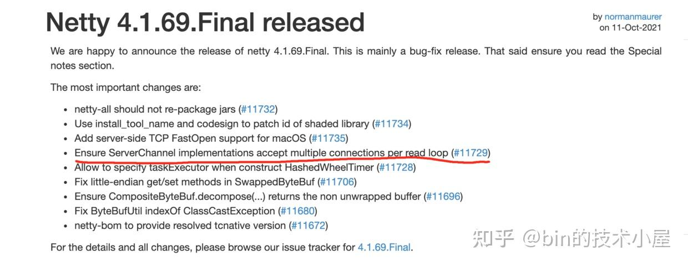

由于该Bug产生的原因正是因为服务端NioServerSocketChannel（用于监听端口地址和接收客户端连接）和 客户端NioSocketChannel（用于通信）中的Config配置类混用了同一个ByteBuffer分配器 `AdaptiveRecvByteBufAllocator` 而导致的。

所以在新版本修复中专门为服务端ServerSocketChannel中的Config配置类引入了一个新的ByteBuffer分配器 `ServerChannelRecvByteBufAllocator` ，专门用于服务端ServerSocketChannel接收客户端连接的场景。

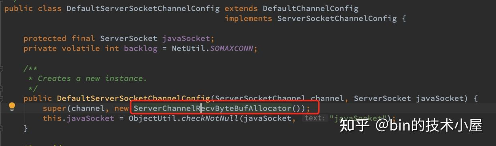

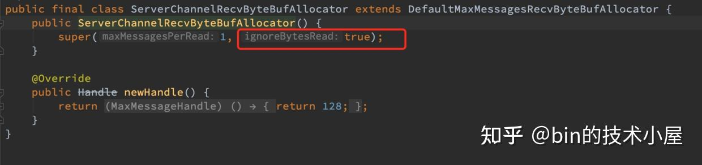

在 `ServerChannelRecvByteBufAllocator` 的父类 `DefaultMaxMessagesRecvByteBufAllocator` 中引入了一个新的字段 `ignoreBytesRead` ，用于表示是否忽略网络字节的读取，在创建服务端Channel配置类NioServerSocketChannelConfig的时候，这个字段会被赋值为 `true` 。

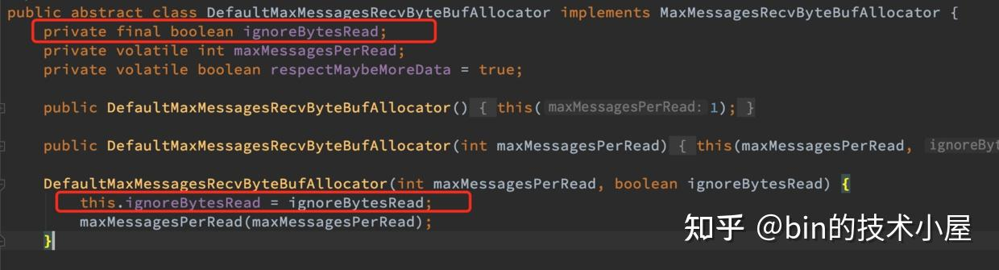

当main reactor线程在read loop循环中接收客户端连接的时候。

```
private final class NioMessageUnsafe extends AbstractNioUnsafe {

                    do {
                        int localRead = doReadMessages(readBuf);
                        .........省略...........
                    } while (allocHandle.continueReading());
     }
```

在read loop循环的末尾就会采用从 `ServerChannelRecvByteBufAllocator` 中创建的 `MaxMessageHandle#continueReading` 方法来判断读取连接次数是否超过了16次。由于这里的 `ignoreBytesRead == true` 这回我们就会忽略 `totalBytesRead == 0` 的情况，从而使得接收连接的read loop得以继续地执行下去。在一个read loop中一次性把16个连接全部接收完毕。

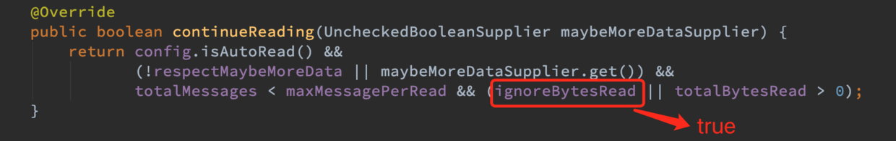

以上就是对这个Bug产生的原因，以及发现的过程，最后修复的方案一个全面的介绍，因此笔者也出现在了netty 4.1.69.final版本发布公告里的thank-list中。哈哈，真是令人开心的一件事情~~~

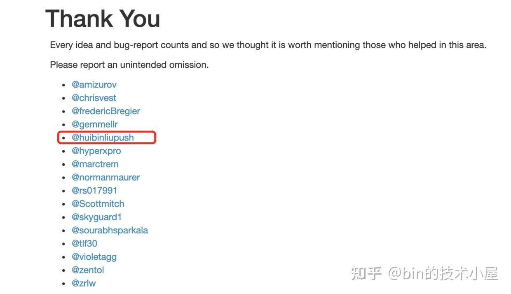

通过以上对netty接收客户端连接的全流程分析和对这个Bug来龙去脉以及修复方案的介绍，大家现在一定已经理解了整个接收连接的流程框架。

接下来笔者就把这个流程中涉及到的一些核心模块在单独拎出来从细节入手，为大家各个击破~~~

## 5\. doReadMessages接收客户端连接

```
public class NioServerSocketChannel extends AbstractNioMessageChannel
                             implements io.netty.channel.socket.ServerSocketChannel {

    @Override
    protected int doReadMessages(List<Object> buf) throws Exception {
        SocketChannel ch = SocketUtils.accept(javaChannel());

        try {
            if (ch != null) {
                buf.add(new NioSocketChannel(this, ch));
                return 1;
            }
        } catch (Throwable t) {
            logger.warn("Failed to create a new channel from an accepted socket.", t);

            try {
                ch.close();
            } catch (Throwable t2) {
                logger.warn("Failed to close a socket.", t2);
            }
        }

        return 0;
    }

}
```

- 通过 `javaChannel()` 获取封装在Netty服务端 `NioServerSocketChannel` 中的 `JDK 原生 ServerSocketChannel` 。

```
@Override
    protected ServerSocketChannel javaChannel() {
        return (ServerSocketChannel) super.javaChannel();
    }
```

- 通过 `JDK NIO 原生` 的 `ServerSocketChannel` 的 `accept方法` 获取 `JDK NIO 原生` 客户端连接 `SocketChannel` 。

```
public static SocketChannel accept(final ServerSocketChannel serverSocketChannel) throws IOException {
        try {
            return AccessController.doPrivileged(new PrivilegedExceptionAction<SocketChannel>() {
                @Override
                public SocketChannel run() throws IOException {
                    return serverSocketChannel.accept();
                }
            });
        } catch (PrivilegedActionException e) {
            throw (IOException) e.getCause();
        }
    }
```

这一步就是我们在**[?《聊聊Netty那些事儿之从内核角度看IO模型》](https://link.zhihu.com/?target=https%3A//mp.weixin.qq.com/s%3F__biz%3DMzg2MzU3Mjc3Ng%3D%3D%26mid%3D2247483737%26idx%3D1%26sn%3D7ef3afbb54289c6e839eed724bb8a9d6%26chksm%3Dce77c71ef9004e08e3d164561e3a2708fc210c05408fa41f7fe338d8e85f39c1ad57519b614e%23rd)** 介绍到的调用 `监听Socket` 的 `accept方法` ，内核会基于 `监听Socket` 创建出来一个新的 `Socket` 专门用于与客户端之间的网络通信这个我们称之为 `客户端连接Socket` 。这里的 `ServerSocketChannel` 就类似于 `监听Socket` 。 `SocketChannel` 就类似于 `客户端连接Socket` 。

由于我们在创建 `NioServerSocketChannel` 的时候，会将 `JDK NIO 原生` 的 `ServerSocketChannel` 设置为 `非阻塞` ，所以这里当 `ServerSocketChannel` 上有客户端连接时就会直接创建 `SocketChannel` ，如果此时并没有客户端连接时 `accept调用` 就会立刻返回 `null` 并不会阻塞。

```
protected AbstractNioChannel(Channel parent, SelectableChannel ch, int readInterestOp) {
        super(parent);
        this.ch = ch;
        this.readInterestOp = readInterestOp;
        try {
            //设置Channel为非阻塞 配合IO多路复用模型
            ch.configureBlocking(false);
        } catch (IOException e) {
          ..........省略.............
        }
    }
```

### 5.1 创建客户端NioSocketChannel

```
public class NioServerSocketChannel extends AbstractNioMessageChannel
                             implements io.netty.channel.socket.ServerSocketChannel {

    @Override
    protected int doReadMessages(List<Object> buf) throws Exception {
        SocketChannel ch = SocketUtils.accept(javaChannel());

        try {
            if (ch != null) {
                buf.add(new NioSocketChannel(this, ch));
                return 1;
            }
        } catch (Throwable t) {
          .........省略.......
        }

        return 0;
    }

}
```

这里会根据 `ServerSocketChannel` 的 `accept` 方法获取到 `JDK NIO 原生` 的 `SocketChannel` （用于底层真正与客户端通信的Channel），来创建Netty中的 `NioSocketChannel` 。

```
public class NioSocketChannel extends AbstractNioByteChannel implements io.netty.channel.socket.SocketChannel {

    public NioSocketChannel(Channel parent, SocketChannel socket) {
        super(parent, socket);
        config = new NioSocketChannelConfig(this, socket.socket());
    }

}
```

创建客户端 `NioSocketChannel` 的过程其实和之前讲的创建服务端 `NioServerSocketChannel` 大体流程是一样的，我们这里只对客户端 `NioSocketChannel` 和服务端 `NioServerSocketChannel` 在创建过程中的不同之处做一个对比。

> 具体细节部分大家可以在回看下**[?《详细图解Netty Reactor启动全流程》](https://link.zhihu.com/?target=https%3A//mp.weixin.qq.com/s%3F__biz%3DMzg2MzU3Mjc3Ng%3D%3D%26mid%3D2247484005%26idx%3D1%26sn%3D52f51269902a58f40d33208421109bc3%26chksm%3Dce77c422f9004d340e5b385ef6ba24dfba1f802076ace80ad6390e934173a10401e64e13eaeb%23rd)** 一文中关于 `NioServerSocketChannel` 的创建的详细细节。

### 5.3 对比NioSocketChannel与NioServerSocketChannel的不同

### 1：Channel的层次不同

在我们介绍Reactor的创建文章中，我们提到Netty中的 `Channel` 是具有层次的。由于客户端NioSocketChannel是在main reactor接收连接时在服务端NioServerSocketChannel中被创建的，所以在创建客户端NioSocketChannel的时候会通过 [构造函数](https://zhida.zhihu.com/search?content_id=191690546&content_type=Article&match_order=1&q=%E6%9E%84%E9%80%A0%E5%87%BD%E6%95%B0&zhida_source=entity) 指定了parent属性为 `NioServerSocketChanel` 。并将 `JDK NIO 原生` 的 `SocketChannel` 封装进Netty的客户端 `NioSocketChannel` 中。

而在Reactor启动过程中创建 `NioServerSocketChannel` 的时候 `parent属性` 指定是 `null` 。因为它就是顶层的 `Channel` ，负责创建客户端 `NioSocketChannel` 。

```
public NioServerSocketChannel(ServerSocketChannel channel) {
        super(null, channel, SelectionKey.OP_ACCEPT);
        config = new NioServerSocketChannelConfig(this, javaChannel().socket());
    }
```

### 2：向Reactor注册的IO事件不同

客户端NioSocketChannel向Sub Reactor注册的是 `SelectionKey.OP_READ事件` ，而服务端NioServerSocketChannel向Main Reactor注册的是 `SelectionKey.OP_ACCEPT事件` 。

```
public abstract class AbstractNioByteChannel extends AbstractNioChannel {

    protected AbstractNioByteChannel(Channel parent, SelectableChannel ch) {
        super(parent, ch, SelectionKey.OP_READ);
    }

}

public class NioServerSocketChannel extends AbstractNioMessageChannel
                             implements io.netty.channel.socket.ServerSocketChannel {

   public NioServerSocketChannel(ServerSocketChannel channel) {
        //父类AbstractNioChannel中保存JDK NIO原生ServerSocketChannel以及要监听的事件OP_ACCEPT
        super(null, channel, SelectionKey.OP_ACCEPT);
        //DefaultChannelConfig中设置用于Channel接收数据用的buffer->AdaptiveRecvByteBufAllocator
        config = new NioServerSocketChannelConfig(this, javaChannel().socket());
    }
}
```

### 3: 功能属性不同造成继承结构的不同

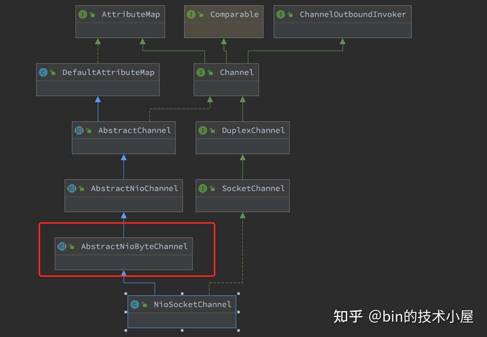

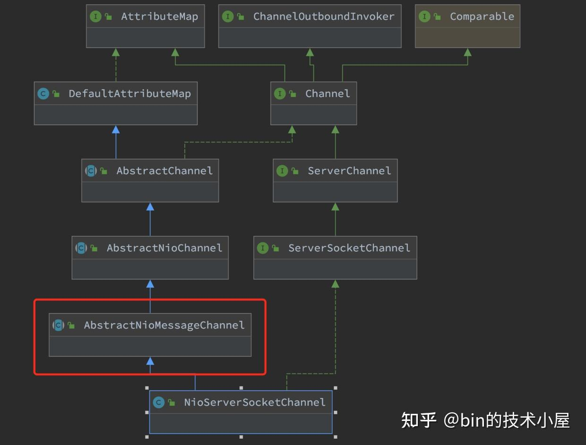

客户端 `NioSocketChannel` 继承的是 `AbstractNioByteChannel` ，而服务端 `NioServerSocketChannel` 继承的是 `AbstractNioMessageChannel` 。 它们继承的这两个 [抽象类](https://zhida.zhihu.com/search?content_id=191690546&content_type=Article&match_order=1&q=%E6%8A%BD%E8%B1%A1%E7%B1%BB&zhida_source=entity) 一个前缀是 `Byte` ，一个前缀是 `Message` 有什么区别吗？？

> 客户端 `NioSocketChannel` 主要处理的是服务端与客户端的通信，这里涉及到接收客户端发送来的数据，而 `Sub Reactor线程` 从 `NioSocketChannel` 中读取的正是网络通信 [数据单位](https://zhida.zhihu.com/search?content_id=191690546&content_type=Article&match_order=1&q=%E6%95%B0%E6%8D%AE%E5%8D%95%E4%BD%8D&zhida_source=entity) 为 `Byte` 。
>
> [服务端](https://zhida.zhihu.com/search?content_id=191690546&content_type=Article&match_order=21&q=%E6%9C%8D%E5%8A%A1%E7%AB%AF&zhida_source=entity) `NioServerSocketChannel` 主要负责处理 `OP_ACCEPT事件` ，创建用于通信的客户端 `NioSocketChannel` 。这时候客户端与服务端还没开始通信，所以 `Main Reactor线程` 从 `NioServerSocketChannel` 的读取对象为 `Message` 。这里的 `Message` 指的就是底层的 `SocketChannel` 客户端连接。

---

以上就是 `NioSocketChannel` 与 `NioServerSocketChannel` 创建过程中的不同之处，后面的过程就一样了。

- 在AbstractNioChannel 类中封装JDK NIO 原生的 `SocketChannel` ，并将其底层的IO模型设置为 `非阻塞` ，保存需要监听的IO事件 `OP_READ` 。

```
protected AbstractNioChannel(Channel parent, SelectableChannel ch, int readInterestOp) {
        super(parent);
        this.ch = ch;
        this.readInterestOp = readInterestOp;
        try {
            //设置Channel为非阻塞 配合IO多路复用模型
            ch.configureBlocking(false);
        } catch (IOException e) {

        }
    }
```

- 为客户端NioSocketChannel创建全局唯一的 `channelId` ，创建客户端NioSocketChannel的底层操作类 `NioByteUnsafe` ，创建pipeline。

```
protected AbstractChannel(Channel parent) {
        this.parent = parent;
        //channel全局唯一ID machineId+processId+sequence+timestamp+random
        id = newId();
        //unsafe用于底层socket的读写操作
        unsafe = newUnsafe();
        //为channel分配独立的pipeline用于IO事件编排
        pipeline = newChannelPipeline();
    }
```

- 在NioSocketChannelConfig的创建过程中，将NioSocketChannel的RecvByteBufAllocator类型设置为 `AdaptiveRecvByteBufAllocator` 。

```
public DefaultChannelConfig(Channel channel) {
            this(channel, new AdaptiveRecvByteBufAllocator());
    }
```

> 在Bug修复后的版本中服务端NioServerSocketChannel的RecvByteBufAllocator类型设置为 `ServerChannelRecvByteBufAllocator`

最终我们得到的客户端 `NioSocketChannel` 结构如下：

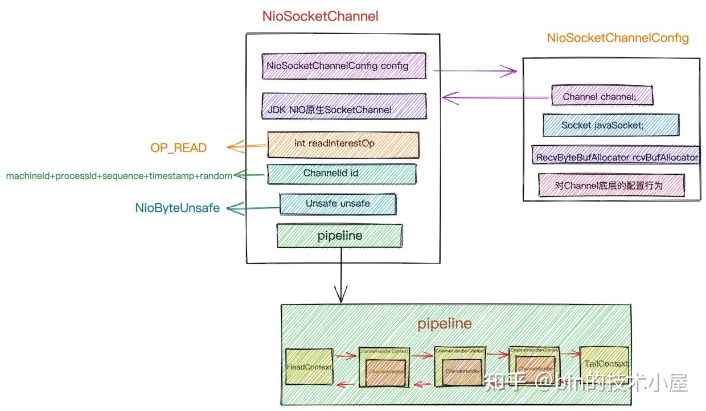

## 6\. ChannelRead事件的响应


在前边介绍接收连接的整体核心流程框架的时候，我们提到main reactor线程是在一个 `do{.....}while(...)` 循环read loop中不断的调用 `ServerSocketChannel#accept` 方法来接收客户端的连接。

当满足退出read loop循环的条件有两个：

1. 在限定的16次读取中，已经没有新的客户端连接要接收了。退出循环。
2. 从NioServerSocketChannel中读取客户端连接的次数达到了16次，无论此时是否还有客户端连接都需要退出循环。

main reactor就会退出read loop循环，此时接收到的客户端连接NioSocketChannel暂存与 `List<Object> readBuf` 集合中。

```
private final class NioMessageUnsafe extends AbstractNioUnsafe {

        private final List<Object> readBuf = new ArrayList<Object>();

        @Override
        public void read() {
            try {
                try {
                    do {
                        ........省略.........
                        //底层调用NioServerSocketChannel->doReadMessages 创建客户端SocketChannel
                        int localRead = doReadMessages(readBuf);
                        ........省略.........
                        allocHandle.incMessagesRead(localRead);
                    } while (allocHandle.continueReading());

                } catch (Throwable t) {
                    exception = t;
                }

                int size = readBuf.size();
                for (int i = 0; i < size; i ++) {
                    readPending = false;
                    pipeline.fireChannelRead(readBuf.get(i));
                }

                  ........省略.........
            } finally {
                  ........省略.........
            }
        }
    }
```

随后main reactor线程会遍历 `List<Object> readBuf` 集合中的NioSocketChannel，并在NioServerSocketChannel的pipeline中传播ChannelRead事件。

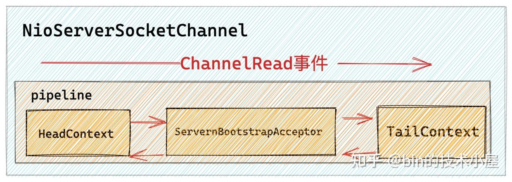

最终 `ChannelRead事件` 会传播到 `ServerBootstrapAcceptor` 中，这里正是Netty处理客户端连接的核心逻辑所在。

`ServerBootstrapAcceptor` 主要的作用就是初始化客户端 `NioSocketChannel` ，并将客户端NioSocketChannel注册到 `Sub Reactor Group` 中，并监听 `OP_READ事件` 。

在ServerBootstrapAcceptor 中会初始化客户端NioSocketChannel的这些属性。

比如：从Reactor组 `EventLoopGroup childGroup` ，用于初始化 `NioSocketChannel` 中的 `pipeline` 用到的 `ChannelHandler childHandler` ，以及 `NioSocketChannel` 中的一些 `childOptions` 和 `childAttrs` 。

```
private static class ServerBootstrapAcceptor extends ChannelInboundHandlerAdapter {

        private final EventLoopGroup childGroup;
        private final ChannelHandler childHandler;
        private final Entry<ChannelOption<?>, Object>[] childOptions;
        private final Entry<AttributeKey<?>, Object>[] childAttrs;

        @Override
        @SuppressWarnings("unchecked")
        public void channelRead(ChannelHandlerContext ctx, Object msg) {
            final Channel child = (Channel) msg;

            //向客户端NioSocketChannel的pipeline中
            //添加在启动配置类ServerBootstrap中配置的ChannelHandler
            child.pipeline().addLast(childHandler);

            //利用配置的属性初始化客户端NioSocketChannel
            setChannelOptions(child, childOptions, logger);
            setAttributes(child, childAttrs);

            try {
                /**
                 * 1：在Sub Reactor线程组中选择一个Reactor绑定
                 * 2：将客户端SocketChannel注册到绑定的Reactor上
                 * 3：SocketChannel注册到sub reactor中的selector上，并监听OP_READ事件
                 * */
                childGroup.register(child).addListener(new ChannelFutureListener() {
                    @Override
                    public void operationComplete(ChannelFuture future) throws Exception {
                        if (!future.isSuccess()) {
                            forceClose(child, future.cause());
                        }
                    }
                });
            } catch (Throwable t) {
                forceClose(child, t);
            }
        }
}
```

正是在这里，netty会将我们在**[?《详细图解Netty Reactor启动全流程》](https://link.zhihu.com/?target=https%3A//mp.weixin.qq.com/s%3F__biz%3DMzg2MzU3Mjc3Ng%3D%3D%26mid%3D2247484005%26idx%3D1%26sn%3D52f51269902a58f40d33208421109bc3%26chksm%3Dce77c422f9004d340e5b385ef6ba24dfba1f802076ace80ad6390e934173a10401e64e13eaeb%23rd)** 的启动示例程序中在ServerBootstrap中配置的客户端NioSocketChannel的所有属性（child前缀配置）初始化到NioSocketChannel中。

```
public final class EchoServer {
    static final int PORT = Integer.parseInt(System.getProperty("port", "8007"));

    public static void main(String[] args) throws Exception {
        // Configure the server.
        //创建主从Reactor线程组
        EventLoopGroup bossGroup = new NioEventLoopGroup(1);
        EventLoopGroup workerGroup = new NioEventLoopGroup();
        final EchoServerHandler serverHandler = new EchoServerHandler();
        try {
            ServerBootstrap b = new ServerBootstrap();
            b.group(bossGroup, workerGroup)//配置主从Reactor
             .channel(NioServerSocketChannel.class)//配置主Reactor中的channel类型
             .option(ChannelOption.SO_BACKLOG, 100)//设置主Reactor中channel的option选项
             .handler(new LoggingHandler(LogLevel.INFO))//设置主Reactor中Channel->pipline->handler
             .childHandler(new ChannelInitializer<SocketChannel>() {//设置从Reactor中注册channel的pipeline
                 @Override
                 public void initChannel(SocketChannel ch) throws Exception {
                     ChannelPipeline p = ch.pipeline();
                     //p.addLast(new LoggingHandler(LogLevel.INFO));
                     p.addLast(serverHandler);
                 }
             });

            // Start the server. 绑定端口启动服务，开始监听accept事件
            ChannelFuture f = b.bind(PORT).sync();
            // Wait until the server socket is closed.
            f.channel().closeFuture().sync();
        } finally {
            // Shut down all event loops to terminate all threads.
            bossGroup.shutdownGracefully();
            workerGroup.shutdownGracefully();
        }
    }
}
```

以上示例代码中通过ServerBootstrap配置的NioSocketChannel相关属性，会在Netty启动并开始初始化 `NioServerSocketChannel` 的时候将 `ServerBootstrapAcceptor` 的创建初始化工作封装成 `异步任务` ，然后在 `NioServerSocketChannel` 注册到 `Main Reactor` 中成功后执行。

```
public class ServerBootstrap extends AbstractBootstrap<ServerBootstrap, ServerChannel> {

    @Override
    void init(Channel channel) {
        ................省略................

        p.addLast(new ChannelInitializer<Channel>() {
            @Override
            public void initChannel(final Channel ch) {
                final ChannelPipeline pipeline = ch.pipeline();
                ................省略................
                ch.eventLoop().execute(new Runnable() {
                    @Override
                    public void run() {
                        pipeline.addLast(new ServerBootstrapAcceptor(
                                ch, currentChildGroup, currentChildHandler, currentChildOptions, currentChildAttrs));
                    }
                });
            }
        });
    }
}
```

在经过 `ServerBootstrapAccptor#chanelRead回调` 的处理之后，此时客户端NioSocketChannel中pipeline的结构为：


随后会将初始化好的客户端NioSocketChannel向Sub Reactor Group中注册，并监听 `OP_READ事件` 。

如下图中的步骤3所示：


## 7\. 向SubReactorGroup中注册NioSocketChannel

```
childGroup.register(child).addListener(new ChannelFutureListener() {
                    @Override
                    public void operationComplete(ChannelFuture future) throws Exception {
                        if (!future.isSuccess()) {
                            forceClose(child, future.cause());
                        }
                    }
                });
```

客户端NioSocketChannel向Sub Reactor Group注册的流程完全和服务端NioServerSocketChannel向Main Reactor Group注册流程一样。

> 关于服务端NioServerSocketChannel的注册流程，笔者已经在**[?《详细图解Netty Reactor启动全流程》](https://link.zhihu.com/?target=https%3A//mp.weixin.qq.com/s%3F__biz%3DMzg2MzU3Mjc3Ng%3D%3D%26mid%3D2247484005%26idx%3D1%26sn%3D52f51269902a58f40d33208421109bc3%26chksm%3Dce77c422f9004d340e5b385ef6ba24dfba1f802076ace80ad6390e934173a10401e64e13eaeb%23rd)** 一文中做出了详细的介绍，对相关细节感兴趣的同学可以在回看下。

这里笔者在带大家简要回顾下整个注册过程并着重区别对比客户端NioSocetChannel与服务端NioServerSocketChannel注册过程中不同的地方。

### 7.1 从Sub Reactor Group中选取一个Sub Reactor进行绑定

```
public abstract class MultithreadEventLoopGroup extends MultithreadEventExecutorGroup implements EventLoopGroup {

   @Override
    public ChannelFuture register(Channel channel) {
        return next().register(channel);
    }

    @Override
    public EventExecutor next() {
        return chooser.next();
    }

}
```

### 7.2 向绑定的Sub Reactor上注册NioSocketChannel

```
public abstract class SingleThreadEventLoop extends SingleThreadEventExecutor implements EventLoop {

    @Override
    public ChannelFuture register(Channel channel) {
        //注册channel到绑定的Reactor上
        return register(new DefaultChannelPromise(channel, this));
    }

    @Override
    public ChannelFuture register(final ChannelPromise promise) {
        ObjectUtil.checkNotNull(promise, "promise");
        //unsafe负责channel底层的各种操作
        promise.channel().unsafe().register(this, promise);
        return promise;
    }

}
```

- 当时我们在介绍 `NioServerSocketChannel` 的注册过程时，这里的 `promise.channel()` 为 `NioServerSocketChannel` 。底层的unsafe操作类为 `NioMessageUnsafe` 。
- 此时这里的 `promise.channel()` 为 `NioSocketChannel` 。底层的unsafe操作类为 `NioByteUnsafe` 。

```
@Override
        public final void register(EventLoop eventLoop, final ChannelPromise promise) {
            ..............省略....................
            //此时这里的eventLoop为Sub Reactor
            AbstractChannel.this.eventLoop = eventLoop;

            /**
             * 执行channel注册的操作必须是Reactor线程来完成
             *
             * 1: 如果当前执行线程是Reactor线程，则直接执行register0进行注册
             * 2：如果当前执行线程是外部线程，则需要将register0注册操作 封装程异步Task 由Reactor线程执行
             * */
            if (eventLoop.inEventLoop()) {
                register0(promise);
            } else {
                try {
                    eventLoop.execute(new Runnable() {
                        @Override
                        public void run() {
                            register0(promise);
                        }
                    });
                } catch (Throwable t) {
                    ..............省略....................
                }
            }
        }
```

**注意此时传递进来的EventLoop eventLoop为Sub Reactor** 。

**但此时的 [执行线程](https://zhida.zhihu.com/search?content_id=191690546&content_type=Article&match_order=4&q=%E6%89%A7%E8%A1%8C%E7%BA%BF%E7%A8%8B&zhida_source=entity) 为 `Main Reactor线程` ，并不是Sub Reactor线程（此时还未启动）** 。

所以这里的 `eventLoop.inEventLoop()` 返回的是 `false` 。

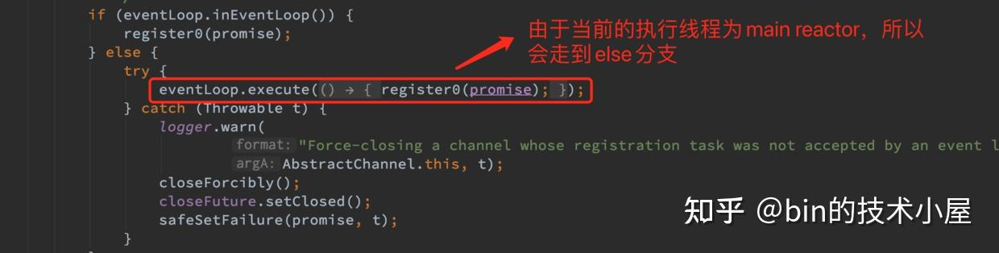

在 `else分支` 中向绑定的Sub Reactor提交注册 `NioSocketChannel` 的任务。

> 当注册任务提交后，此时绑定的 `Sub Reactor线程` 启动。

### 7.3 register0

我们又来到了Channel注册的老地方 `register0方法` 。在**[?《详细图解Netty Reactor启动全流程》](https://link.zhihu.com/?target=https%3A//mp.weixin.qq.com/s%3F__biz%3DMzg2MzU3Mjc3Ng%3D%3D%26mid%3D2247484005%26idx%3D1%26sn%3D52f51269902a58f40d33208421109bc3%26chksm%3Dce77c422f9004d340e5b385ef6ba24dfba1f802076ace80ad6390e934173a10401e64e13eaeb%23rd)** 中我们花了大量的篇幅介绍了这个方法。这里我们只对比 `NioSocketChannel` 与 `NioServerSocketChannel` 不同的地方。

```
private void register0(ChannelPromise promise) {
            try {
                ................省略..................
                boolean firstRegistration = neverRegistered;
                //执行真正的注册操作
                doRegister();
                //修改注册状态
                neverRegistered = false;
                registered = true;

                pipeline.invokeHandlerAddedIfNeeded();

                if (isActive()) {
                    if (firstRegistration) {
                        //触发channelActive事件
                        pipeline.fireChannelActive();
                    } else if (config().isAutoRead()) {
                        beginRead();
                    }
                }
            } catch (Throwable t) {
                 ................省略..................
            }
        }
```

这里 `doRegister()方法` 将NioSocketChannel注册到Sub Reactor中的 `Selector` 上。

```
public abstract class AbstractNioChannel extends AbstractChannel {

    @Override
    protected void doRegister() throws Exception {
        boolean selected = false;
        for (;;) {
            try {
                selectionKey = javaChannel().register(eventLoop().unwrappedSelector(), 0, this);
                return;
            } catch (CancelledKeyException e) {
                ...............省略...............
            }
        }
    }

}
```

这里是Netty客户端 `NioSocketChannel` 与JDK NIO 原生 SocketChannel关联的地方。此时注册的 `IO事件` 依然是 `0` 。目的也是只是为了获取NioSocketChannel在Selector中的 `SelectionKey` 。

同时通过 `SelectableChannel#register` 方法将Netty自定义的NioSocketChannel（这里的this指针）附着在SelectionKey的attechment属性上，完成Netty自定义Channel与JDK NIO Channel的关系绑定。这样在每次对Selector进行IO [就绪事件](https://zhida.zhihu.com/search?content_id=191690546&content_type=Article&match_order=8&q=%E5%B0%B1%E7%BB%AA%E4%BA%8B%E4%BB%B6&zhida_source=entity) 轮询时，Netty 都可以从 JDK NIO Selector返回的SelectionKey中获取到自定义的Channel对象（这里指的就是NioSocketChannel）。

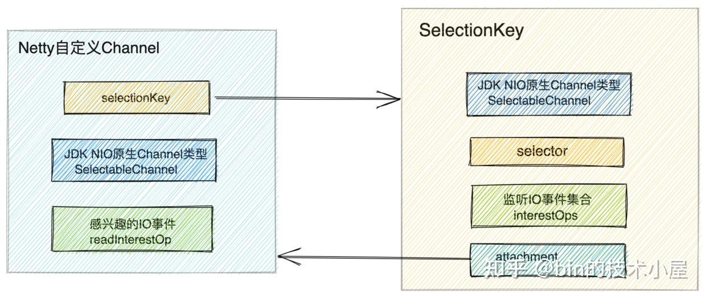

随后调用 `pipeline.invokeHandlerAddedIfNeeded()` 回调客户端NioSocketChannel上pipeline中的所有ChannelHandler的 `handlerAdded方法` ，此时 `pipeline` 的结构中只有一个 `ChannelInitializer` 。最终会在 `ChannelInitializer#handlerAdded` [回调方法](https://zhida.zhihu.com/search?content_id=191690546&content_type=Article&match_order=1&q=%E5%9B%9E%E8%B0%83%E6%96%B9%E6%B3%95&zhida_source=entity) 中初始化客户端 `NioSocketChannel` 的 `pipeline` 。


```
public abstract class ChannelInitializer<C extends Channel> extends ChannelInboundHandlerAdapter {

    @Override
    public void handlerAdded(ChannelHandlerContext ctx) throws Exception {
        if (ctx.channel().isRegistered()) {
            if (initChannel(ctx)) {
                //初始化工作完成后，需要将自身从pipeline中移除
                removeState(ctx);
            }
        }
    }

    protected abstract void initChannel(C ch) throws Exception;
}
```

> 关于对Channel中pipeline的详细初始化过程，对细节部分感兴趣的同学可以回看下**[?《详细图解Netty Reactor启动全流程》](https://link.zhihu.com/?target=https%3A//mp.weixin.qq.com/s%3F__biz%3DMzg2MzU3Mjc3Ng%3D%3D%26mid%3D2247484005%26idx%3D1%26sn%3D52f51269902a58f40d33208421109bc3%26chksm%3Dce77c422f9004d340e5b385ef6ba24dfba1f802076ace80ad6390e934173a10401e64e13eaeb%23rd)**

此时客户端NioSocketChannel中的pipeline中的结构就变为了我们自定义的样子，在示例代码中我们自定义的 `ChannelHandler` 为 `EchoServerHandler` 。

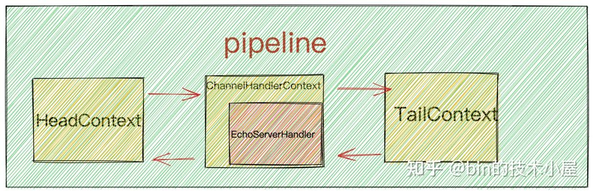

```
@Sharable
public class EchoServerHandler extends ChannelInboundHandlerAdapter {

    @Override
    public void channelRead(ChannelHandlerContext ctx, Object msg) {
        ctx.write(msg);
    }

    @Override
    public void channelReadComplete(ChannelHandlerContext ctx) {

        ctx.flush();
    }

    @Override
    public void exceptionCaught(ChannelHandlerContext ctx, Throwable cause) {
        // Close the connection when an exception is raised.
        cause.printStackTrace();
        ctx.close();
    }
}
```

当客户端NioSocketChannel中的pipeline初始化完毕后，netty就开始调用 `safeSetSuccess(promise)方法` 回调 `regFuture` 中注册的 `ChannelFutureListener` ，通知客户端NioSocketChannel已经成功注册到Sub Reactor上了。

```
childGroup.register(child).addListener(new ChannelFutureListener() {
                    @Override
                    public void operationComplete(ChannelFuture future) throws Exception {
                        if (!future.isSuccess()) {
                            forceClose(child, future.cause());
                        }
                    }
                });
```

> 在服务端NioServerSocketChannel注册的时候我们会在listener中向Main Reactor提交 `bind绑定端口地址任务` 。但是在 `NioSocketChannel` 注册的时候，只会在 `listener` 中处理一下注册失败的情况。

当Sub Reactor线程通知ChannelFutureListener注册成功之后，随后就会调用 `pipeline.fireChannelRegistered()` 在客户端NioSocketChannel的pipeline中传播 `ChannelRegistered事件` 。

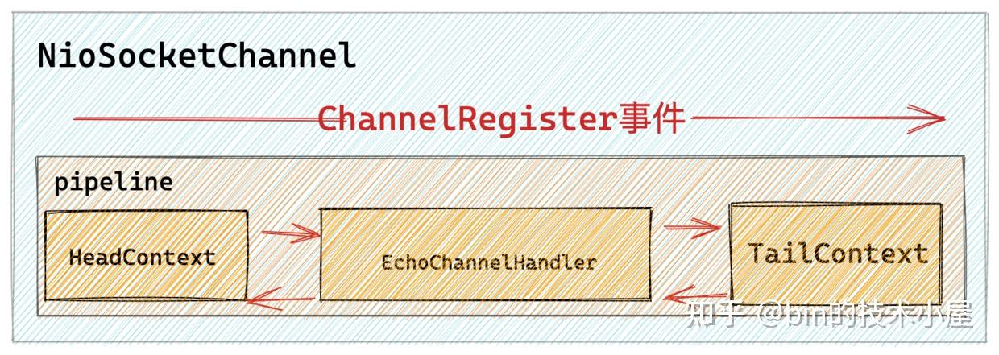

**这里笔者重点要强调下** ，在之前介绍NioServerSocketChannel注册的时候，我们提到因为此时NioServerSocketChannel并未绑定端口地址，所以这时的NioServerSocketChannel并未激活，这里的 `isActive()` 返回 `false` 。 `register0方法` 直接返回。

> 服务端NioServerSocketChannel判断是否激活的标准为端口是否绑定成功。

```
public class NioServerSocketChannel extends AbstractNioMessageChannel
                             implements io.netty.channel.socket.ServerSocketChannel {
    @Override
    public boolean isActive() {
        return isOpen() && javaChannel().socket().isBound();
    }
}
```

> 客户端 `NioSocketChannel` 判断是否激活的标准为是否处于 `Connected状态` 。那么显然这里肯定是处于 `connected状态` 的。

```
@Override
    public boolean isActive() {
        SocketChannel ch = javaChannel();
        return ch.isOpen() && ch.isConnected();
    }
```

`NioSocketChannel` 已经处于 `connected状态` ，这里并不需要绑定端口，所以这里的 `isActive()` 返回 `true` 。

```
if (isActive()) {
                    /**
                     * 客户端SocketChannel注册成功后会走这里，在channelActive事件回调中注册OP_READ事件
                     * */
                    if (firstRegistration) {
                        //触发channelActive事件
                        pipeline.fireChannelActive();
                    } else if (config().isAutoRead()) {
                        .......省略..........
                    }
                }
            }
```

最后调用 `pipeline.fireChannelActive()` 在NioSocketChannel中的pipeline传播 `ChannelActive事件` ，最终在 `pipeline` 的 [头结点](https://zhida.zhihu.com/search?content_id=191690546&content_type=Article&match_order=1&q=%E5%A4%B4%E7%BB%93%E7%82%B9&zhida_source=entity) `HeadContext` 中响应并注册 `OP_READ事件` 到 `Sub Reactor` 中的 `Selector` 上。

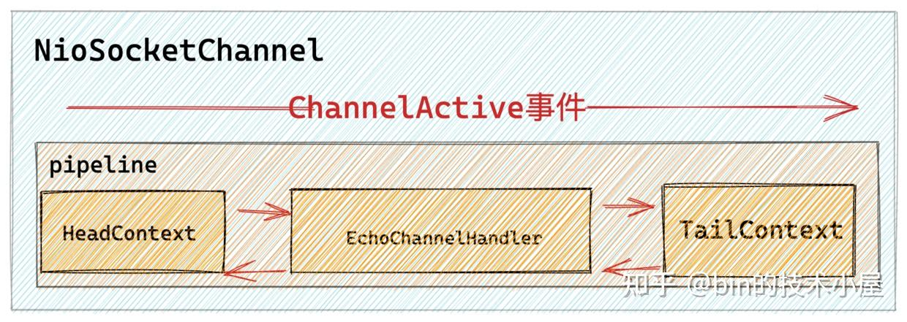

```
public abstract class AbstractNioChannel extends AbstractChannel { {

    @Override
    protected void doBeginRead() throws Exception {
        ..............省略................

        final int interestOps = selectionKey.interestOps();
        /**
         * 1：ServerSocketChannel 初始化时 readInterestOp设置的是OP_ACCEPT事件
         * 2：SocketChannel 初始化时 readInterestOp设置的是OP_READ事件
         * */
        if ((interestOps & readInterestOp) == 0) {
            //注册监听OP_ACCEPT或者OP_READ事件
            selectionKey.interestOps(interestOps | readInterestOp);
        }
    }

}
```

> 注意这里的 `readInterestOp` 为客户端 `NioSocketChannel` 在初始化时设置的 `OP_READ事件` 。

---

到这里，Netty中的 `Main Reactor` 接收连接的整个流程，我们就介绍完了，此时Netty中主从Reactor组的结构就变为：

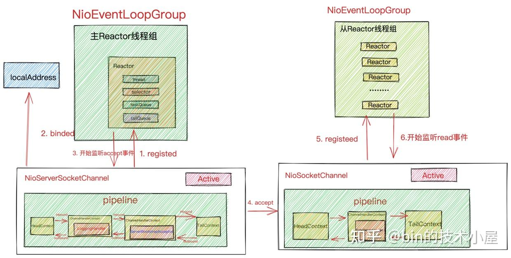

## 总结

本文我们介绍了 `NioServerSocketChannel` 处理客户端连接事件的整个过程。

- 接收连接的整个处理框架。
- 影响Netty接收连接吞吐的Bug产生的原因，以及修复的方案。
- 创建并初始化客户端 `NioSocketChannel` 。
- 初始化 `NioSocketChannel` 中的 `pipeline` 。
- 客户端 `NioSocketChannel` 向 `Sub Reactor` 注册的过程

其中我们也对比了 `NioServerSocketChannel` 与 `NioSocketChannel` 在创建初始化以及后面向 `Reactor` 注册过程中的差异之处。

当客户端 `NioSocketChannel` 接收完毕并向 `Sub Reactor` 注册成功后，那么接下来 `Sub Reactor` 就开始监听注册其上的所有客户端 `NioSocketChannel` 的 `OP_READ事件` ，并等待客户端向服务端发送 [网络数据](https://zhida.zhihu.com/search?content_id=191690546&content_type=Article&match_order=9&q=%E7%BD%91%E7%BB%9C%E6%95%B0%E6%8D%AE&zhida_source=entity) 。

后面 `Reactor` 的主角就该变为 `Sub Reactor` 以及注册在其上的客户端 `NioSocketChannel` 了。

下篇文章，我们将会讨论Netty是如何接收网络数据的~~~~ 我们下篇文章见~~

编辑于 2022-02-11 15:30[Netty](https://www.zhihu.com/topic/19732975)[Java](https://www.zhihu.com/topic/19561132)[网络编程](https://www.zhihu.com/topic/19611616)
