[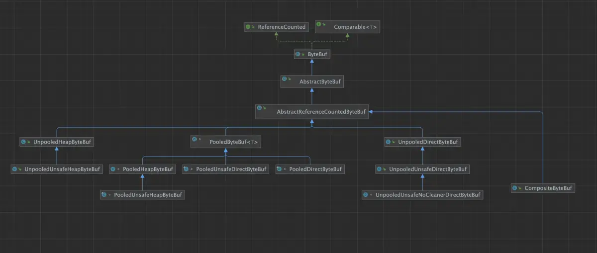](https://zhuanlan.zhihu.com/p/714383432)

### 2.8 CompositeByteBuf 的零拷贝设计

这里的零拷贝并不是我们经常提到的那种 OS 层面上的零拷贝，而是 Netty 在 [用户态](https://zhida.zhihu.com/search?content_id=246882120&content_type=Article&match_order=1&q=%E7%94%A8%E6%88%B7%E6%80%81&zhida_source=entity) 层面自己实现的避免内存拷贝的设计。比如在传统意义上，如果我们想要将多个独立的 ByteBuf 聚合成一个 ByteBuf 的时候，我们首先需要向 OS 申请一段更大的内存，然后依次将多个 ByteBuf 中的内容拷贝到这段新申请的内存上，最后在释放这些 ByteBuf 的内存。

这样一来就涉及到两个性能开销点，一个是我们需要向 OS 重新申请更大的内存，另一个是内存的拷贝。Netty 引入 CompositeByteBuf 的目的就是为了解决这两个问题。巧妙地利用原有 ByteBuf 所占的内存，在此基础之上，将它们组合成一个逻辑意义上的 CompositeByteBuf ，提供一个统一的逻辑视图。

CompositeByteBuf 其实也是一种视图 ByteBuf ，这一点和上小节中我们介绍的 [SlicedByteBuf](https://zhida.zhihu.com/search?content_id=246882120&content_type=Article&match_order=1&q=SlicedByteBuf&zhida_source=entity) ， [DuplicatedByteBuf](https://zhida.zhihu.com/search?content_id=246882120&content_type=Article&match_order=1&q=DuplicatedByteBuf&zhida_source=entity) 一样，它们本身并不会占用 Native Memory，底层数据的存储全部依赖于原生的 ByteBuf。

不同点在于，SlicedByteBuf，DuplicatedByteBuf 它们是在单一的原生 ByteBuf 基础之上创建出的视图 ByteBuf。而 CompositeByteBuf 是基于多个原生 ByteBuf 创建出的统一逻辑视图 ByteBuf。

CompositeByteBuf 对于我们用户来说和其他的普通 ByteBuf 没有任何区别，有自己独立的 readerIndex，writerIndex，capacity，maxCapacity，前面几个小节中介绍的各种 ByteBuf 的设计要素，在 CompositeByteBuf 身上也都会体现。

但从实现的角度来说，CompositeByteBuf 只是一个逻辑上的 ByteBuf，其本身并不会占用任何的 Native Memory ，对于 CompositeByteBuf 的任何操作，最终都需要转换到其内部具体的 ByteBuf 上。本小节我们就来深入到 CompositeByteBuf 的内部，来看一下 Netty 的巧妙设计。

### 2.8.1 CompositeByteBuf 的总体架构

从总体设计上来讲，CompositeByteBuf 包含如下五个重要属性，其中最为核心的就是 components 数组，那些需要被聚合的原生 ByteBuf 会被 Netty 封装在 [Component](https://zhida.zhihu.com/search?content_id=246882120&content_type=Article&match_order=1&q=Component&zhida_source=entity) 类中，并统一组织在 components 数组中。后续针对 CompositeByteBuf 的所有操作都需要和这个数组打交道。

```
public class CompositeByteBuf extends AbstractReferenceCountedByteBuf implements Iterable<ByteBuf> {
    // 内部 ByteBuf 的分配器，用于后续扩容，copy , 合并等操作
    private final ByteBufAllocator alloc;
    // compositeDirectBuffer 还是 compositeHeapBuffer ?
    private final boolean direct;
    // 最大的 components 数组容量（16）
    private final int maxNumComponents;
    // 当前 CompositeByteBuf 中包含的 components 个数
    private int componentCount;
    // 存储 component 的数组
    private Component[] components; // resized when needed
}
```

maxNumComponents 表示 components 数组最大的容量，CompositeByteBuf 默认能够包含 Component 的最大个数为 16，如果超过这个数量的话，Netty 会将当前 CompositeByteBuf 中包含的所有 Components 重新合并成一个更大的 Component。

```
public abstract class AbstractByteBufAllocator implements ByteBufAllocator {
    static final int DEFAULT_MAX_COMPONENTS = 16;
}
```

componentCount 表示当前 CompositeByteBuf 中包含的 Component 个数。每当我们通过 `addComponent` 方法向 CompositeByteBuf 添加一个新的 ByteBuf 时，Netty 都会用一个新的 Component 实例来包装这个 ByteBuf，然后存放在 components 数组中，最后 componentCount 的个数加 1 。

CompositeByteBuf 与其底层聚合的真实 ByteBuf [架构设计](https://zhida.zhihu.com/search?content_id=246882120&content_type=Article&match_order=1&q=%E6%9E%B6%E6%9E%84%E8%AE%BE%E8%AE%A1&zhida_source=entity) 关系，如下图所示：

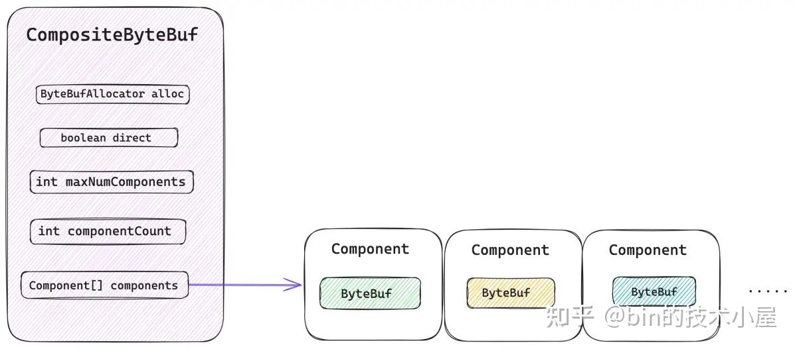

image.png

而创建一个 CompositeByteBuf 的核心其实就是创建底层的 components 数组，后续添加到该 CompositeByteBuf 的所有原生 ByteBuf 都会被组织在这里。

```
private CompositeByteBuf(ByteBufAllocator alloc, boolean direct, int maxNumComponents, int initSize) {
        // 设置 maxCapacity
        super(AbstractByteBufAllocator.DEFAULT_MAX_CAPACITY);

        this.alloc = ObjectUtil.checkNotNull(alloc, "alloc");
        this.direct = direct;
        this.maxNumComponents = maxNumComponents;
        // 初始 Component 数组的容量为 maxNumComponents
        components = newCompArray(initSize, maxNumComponents);
    }
```

这里的参数 `initSize` 表示的并不是 CompositeByteBuf 所包含的 [字节数](https://zhida.zhihu.com/search?content_id=246882120&content_type=Article&match_order=1&q=%E5%AD%97%E8%8A%82%E6%95%B0&zhida_source=entity) ，而是初始包装的原生 ByteBuf 个数，也就是初始 Component 的个数。components 数组的总体大小由参数 maxNumComponents 决定，但不能超过 16 。

```
private static Component[] newCompArray(int initComponents, int maxNumComponents) {
        // MAX_COMPONENT
        int capacityGuess = Math.min(AbstractByteBufAllocator.DEFAULT_MAX_COMPONENTS, maxNumComponents);
        // 初始 Component 数组的容量为 maxNumComponents
        return new Component[Math.max(initComponents, capacityGuess)];
    }
```

现在我们只是清楚了 CompositeByteBuf 的一个基本骨架，那么接下来 Netty 如何根据这个基本的骨架将多个原生 ByteBuf 组装成一个逻辑上的统一视图 ByteBuf 呢 ？

也就是说我们依据 CompositeByteBuf 中的 readerIndex 以及 writerIndex 进行的读写操作逻辑如何转换到对应的底层原生 ByteBuf 之上呢 ？ 这个是整个设计的核心所在。

下面笔者就带着大家从外到内，从易到难地一一拆解 CompositeByteBuf 中的那些核心设计要素。从 CompositeByteBuf 的最外层来看，其实我们并不陌生，对于用户来说它就是一个普通的 ByteBuf，拥有自己独立的 readerIndex ，writerIndex 。

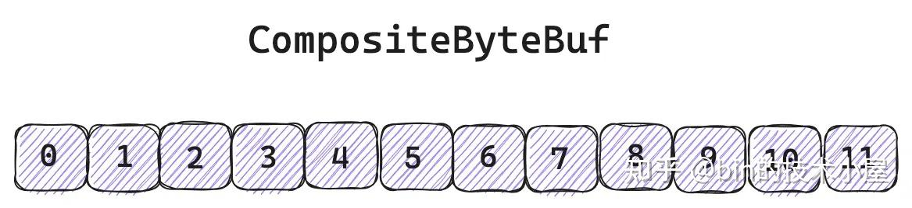

image.png

但 CompositeByteBuf 中那些逻辑上看起来连续的字节，背后其实存储在不同的原生 ByteBuf 中。不同 ByteBuf 的内存之间其实是不连续的。

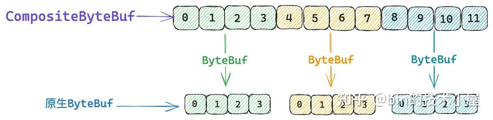

image.png

那么现在问题的关键就是我们如何判断 CompositeByteBuf 中的某一段 [逻辑数据](https://zhida.zhihu.com/search?content_id=246882120&content_type=Article&match_order=1&q=%E9%80%BB%E8%BE%91%E6%95%B0%E6%8D%AE&zhida_source=entity) 背后对应的究竟是哪一个真实的 ByteBuf，如果我们能够通过 CompositeByteBuf 的相关 Index, 找到这个 Index 背后对应的 ByteBuf，近而可以找到 ByteBuf 的 Index ，这样是不是就可以将 CompositeByteBuf 的逻辑操作转换成对真实内存的读写操作了。

CompositeByteBuf 到原生 ByteBuf 的转换关系，Netty 封装在 Component 类中，每一个被包装在 CompositeByteBuf 中的原生 ByteBuf 都对应一个 Component 实例。它们会按照顺序统一组织在 components 数组中。

```
private static final class Component {
        // 原生 ByteBuf
        final ByteBuf srcBuf;
        // CompositeByteBuf 的 index 加上 srcAdjustment 就得到了srcBuf 的相关 index
        int srcAdjustment;
        // srcBuf 可能是一个被包装过的 ByteBuf，比如 SlicedByteBuf ， DuplicatedByteBuf
        // 被 srcBuf 包装的最底层的 ByteBuf 就存放在 buf 字段中
        final ByteBuf buf;
        // CompositeByteBuf 的 index 加上 adjustment 就得到了 buf 的相关 index
        int adjustment;

        // 该 Component 在 CompositeByteBuf 视角中表示的数据范围 [offset , endOffset)
        int offset;
        int endOffset;
    }
```

一个 Component 在 CompositeByteBuf 的视角中所能表示的数据逻辑范围是 `[offset , endOffset)` 。

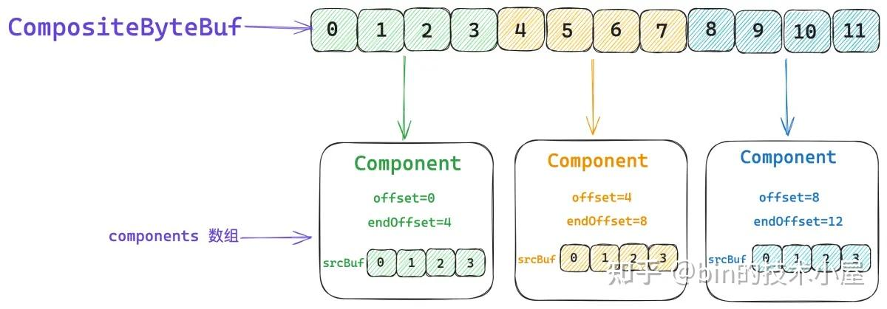

image.png

比如上图中第一个绿色的 ByteBuf, 它里边存储的数据组成了 CompositeByteBuf 中 `[0 , 4)` 这段逻辑数据范围。第二个黄色的 ByteBuf，它里边存储的数据组成了 CompositeByteBuf 中 `[4 , 8)` 这段逻辑数据范围。第三个蓝色的 ByteBuf，它里边存储的数据组成了 CompositeByteBuf 中 `[8 , 12)` 这段逻辑数据范围。 上一个 Component 的 endOffset 恰好是下一个 Component 的 offset 。

而这些真实存储数据的 ByteBuf 则存储在对应 Component 中的 srcBuf 字段中，当我们通过 CompositeByteBuf 的 readerIndex 或者 writerIndex 进行读写操作的时候，首先需要确定相关 index 所对应的 srcBuf，然后将 CompositeByteBuf 的 index 转换为 srcBuf 的 srcIndex，近而通过 srcIndex 对 srcBuf 进行读写。

这个 index 的转换就是通过 srcAdjustment 来进行的，比如，当前 CompositeByteBuf 的 readerIndex 为 5 ，它对应的是第二个黄色的 ByteBuf。而 ByteBuf 的 readerIndex 却是 1 。

所以第二个 Component 的 srcAdjustment 就是 -4 ， 这样我们读取 CompositeByteBuf 的时候，首先将它的 readerIndex 加上 srcAdjustment 就得到了 ByteBuf 的 readerIndex ，后面就是普通的 ByteBuf 读取操作了。

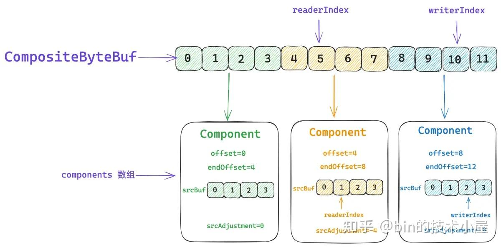

image.png

在比如说，我们要对 CompositeByteBuf 进行写操作，当前的 writerIndex 为 10 ，对应的是第三个蓝色的 ByteBuf，它的 writerIndex 为 2 。

所以第三个 Component 的 srcAdjustment 就是 -8 ，CompositeByteBuf 的 writerIndex 加上 srcAdjustment 就得到了 ByteBuf 的 writerIndex，后续就是普通的 ByteBuf 写入操作。

```
int srcIdx(int index) {
            // CompositeByteBuf 相关的 index 转换成 srcBuf 的相关 index
            return index + srcAdjustment;
        }
```

除了 srcBuf 之外，Component 实例中还有一个 buf 字段，这里大家可能会比较好奇，为什么设计了两个 ByteBuf 字段呢 ？Component 实例与 ByteBuf 不是一对一的关系吗 ？

srcBuf 是指我们通过 `addComponent` 方法添加到 CompositeByteBuf 中的原始 ByteBuf。而这个 srcBuf 可能是一个视图 ByteBuf，比如上一小节中介绍到的 SlicedByteBuf 和 DuplicatedByteBuf。srcBuf 还可能是一个被包装过的 ByteBuf，比如 WrappedByteBuf, SwappedByteBuf。

假如 srcBuf 是一个 SlicedByteBuf 的话，我们需要将它的原生 ByteBuf 拆解出来并保存在 Component 实例的 buf 字段中。事实上 Component 中的 buf 才是真正存储数据的地方。

```
abstract class AbstractUnpooledSlicedByteBuf {
    // 原生 ByteBuf
    private final ByteBuf buffer;
}
```

与 buf 对应的就是 adjustment ， 它用于将 CompositeByteBuf 的相关 index 转换成 buf 相关的 index ，假如我们在向一个 CompositeByteBuf 执行 read 操作，它的当前 readerIndex 是 5，而 buf 的 readerIndex 是 6 。

所以在读取操作之前，我们需要将 CompositeByteBuf 的 readerIndex 加上 adjustment 得到 buf 的 readerIndex，近而将读取操作转移到 buf 中。其实就和上小节中介绍的视图 ByteBuf 是一模一样的，在读写之前都需要修正相关的 index 。

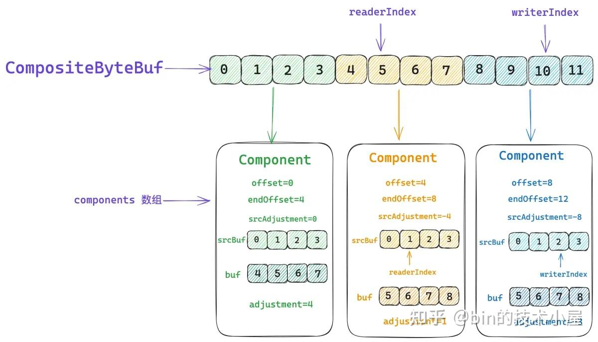

image.png

```
@Override
    public byte getByte(int index) {
        // 通过 CompositeByteBuf 的 index , 找到数据所属的 component
        Component c = findComponent(index);
        // 首先通过 idx 转换为 buf 相关的 index
        // 将对 CompositeByteBuf 的读写操作转换为 buf 的读写操作
        return c.buf.getByte(c.idx(index));
    }

    int idx(int index) {
        // 将 CompositeByteBuf 的相关 index 转换为 buf 的相关 index
        return index + adjustment;
     }
```

那么我们如何根据指定的 CompositeByteBuf 的 index 来查找其对应的底层数据究竟存储在哪个 Component 中呢 ？

核心思想其实很简单，因为每个 Component 都会描述自己表示 CompositeByteBuf 中的哪一段数据范围 —— `[offset , endOffset)` 。所有的 Components 都被有序的组织在 components 数组中。我们可以通过二分查找的方法来寻找这个 index 到底是落在了哪个 Component 表示的范围中。

这个查找的过程是在 `findComponent ` 方法中实现的，Netty 会将最近一次访问到的 Component 缓存在 CompositeByteBuf 的 lastAccessed 字段中，每次进行查找的时候首先会判断 index 是否落在了 lastAccessed 所表示的数据范围内 —— `[ la.offset , la.endOffset)` 。

如果 index 恰好被缓存的 Component（lastAccessed）所包含，那么就直接返回 lastAccessed 。

```
// 缓存最近一次查找到的 Component
    private Component lastAccessed;

    private Component findComponent(int offset) {
        Component la = lastAccessed;
        // 首先查找 offset 是否恰好落在 lastAccessed 的区间中
        if (la != null && offset >= la.offset && offset < la.endOffset) {
           return la;
        }
        // 在所有 Components 中进行二分查找
        return findIt(offset);
    }
```

如果 index 不巧没有命中缓存，那么就在整个 components 数组中进行二分查找 ：

```
private Component findIt(int offset) {
        for (int low = 0, high = componentCount; low <= high;) {
            int mid = low + high >>> 1;
            Component c = components[mid];
            if (offset >= c.endOffset) {
                low = mid + 1;
            } else if (offset < c.offset) {
                high = mid - 1;
            } else {
                lastAccessed = c;
                return c;
            }
        }

        throw new Error("should not reach here");
    }
```

### 2.8.2 CompositeByteBuf 的创建

好了，现在我们已经熟悉了 CompositeByteBuf 的总体架构，那么接下来我们就来看一下 Netty 是如何将多个 ByteBuf 逻辑聚合成一个 CompositeByteBuf 的。

```
public final class Unpooled {
   public static ByteBuf wrappedBuffer(ByteBuf... buffers) {
        return wrappedBuffer(buffers.length, buffers);
    }
}
```

CompositeByteBuf 的初始 maxNumComponents 为 buffers 数组的长度，如果我们只是传入一个 ByteBuf 的话，那么就无需创建 CompositeByteBuf，而是直接返回该 ByteBuf 的 slice 视图。

如果我们传入的是多个 ByteBuf 的话，则将这多个 ByteBuf 包装成 CompositeByteBuf 返回。

```
public final class Unpooled {
    public static ByteBuf wrappedBuffer(int maxNumComponents, ByteBuf... buffers) {
        switch (buffers.length) {
        case 0:
            break;
        case 1:
            ByteBuf buffer = buffers[0];
            if (buffer.isReadable()) {
                // 直接返回 buffer.slice() 视图
                return wrappedBuffer(buffer.order(BIG_ENDIAN));
            } else {
                buffer.release();
            }
            break;
        default:
            for (int i = 0; i < buffers.length; i++) {
                ByteBuf buf = buffers[i];
                if (buf.isReadable()) {
                    // 从第一个可读的 ByteBuf —— buffers[i] 开始创建 CompositeByteBuf
                    return new CompositeByteBuf(ALLOC, false, maxNumComponents, buffers, i);
                }
                // buf 不可读则 release
                buf.release();
            }
            break;
        }
        return EMPTY_BUFFER;
    }
}
```

在进入 CompositeByteBuf 的创建流程之后，首先是创建出一个空的 CompositeByteBuf，也就是先把 CompositeByteBuf 的骨架搭建起来，这时它的 initSize 为 `buffers.length - offset` 。

注意 initSize 表示的并不是 CompositeByteBuf 初始包含的字节个数，而是表示初始 Component 的个数。offset 则表示从 buffers 数组中的哪一个索引开始创建 CompositeByteBuf，就是上面 CompositeByteBuf [构造函数](https://zhida.zhihu.com/search?content_id=246882120&content_type=Article&match_order=1&q=%E6%9E%84%E9%80%A0%E5%87%BD%E6%95%B0&zhida_source=entity) 中最后一个参数 i 。

随后通过 `addComponents0` 方法为 buffers 数组中的每一个 ByteBuf 创建初始化 Component 实例，并将他们有序的添加到 CompositeByteBuf 的 components 数组中。

但这时 Component 实例的个数可能已经超过 maxNumComponents 限制的个数，那么接下来就会在 `consolidateIfNeeded()` 方法中将当前 CompositeByteBuf 中的所有 Components 合并成一个更大的 Component。CompositeByteBuf 中的 components 数组长度是不可以超过 maxNumComponents 限制的，如果超过就需要在这里合并。

最后设置当前 CompositeByteBuf 的 readerIndex 和 writerIndex，在初始状态下 CompositeByteBuf 的 readerIndex 会被设置为 0 ，writerIndex 会被设置为最后一个 Component 的 endOffset 。

```
CompositeByteBuf(ByteBufAllocator alloc, boolean direct, int maxNumComponents,
            ByteBuf[] buffers, int offset) {
        // 先初始化一个空的 CompositeByteBuf
        // initSize 为 buffers.length - offset
        this(alloc, direct, maxNumComponents, buffers.length - offset);
        // 为所有的 buffers 创建  Component 实例，并添加到 components 数组中
        addComponents0(false, 0, buffers, offset);
        // 如果当前 component 的个数已经超过了 maxNumComponents，则将所有 component 合并成一个
        consolidateIfNeeded();
        // 设置 CompositeByteBuf 的 readerIndex = 0
        // writerIndex 为最后一个 component 的 endOffset
        setIndex0(0, capacity());
    }
```

### 2.8.3 shiftComps 为新的 ByteBuf 腾挪空间

在整个 CompositeByteBuf 的构造过程中，最核心也是最复杂的步骤其实就是 `addComponents0` 方法，将多个 ByteBuf 有序的添加到 CompositeByteBuf 的 components 数组中看似简单，其实还有很多种复杂的情况需要考虑。

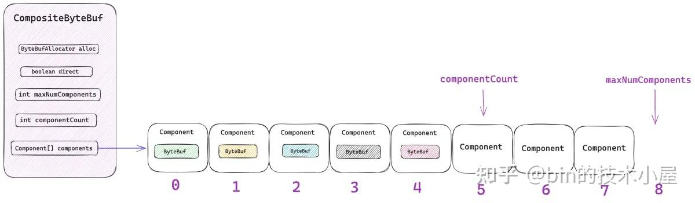

image.png

复杂之处在于这些 ByteBuf 需要插在 components 数组的哪个位置上 ？ 比较简单直观的情况是我们直接在 components 数组的末尾插入，也就是说要插入的位置索引 cIndex 等于 componentCount。这里分为两种情况：

1. `cIndex = componentCount = 0` ，这种情况表示我们在向一个空的 CompositeByteBuf 插入 ByteBufs, 很简单，直接插入即可。
2. `cIndex = componentCount > 0` ， 这种情况表示我们再向一个非空的 CompositeByteBuf 插入 ByteBufs，正如上图所示。同样也很简单，直接在 componentCount 的位置处插入即可。

稍微复杂一点的情况是我们在 components 数组的中间位置进行插入而不是在末尾，也就是 `cIndex < componentCount` 的情况。如下如图所示，假设我们现在需要在 `cIndex = 3 ` 的位置处插入两个 ByteBuf 进来，但现在 components\[3\] 以及 components\[4\] 的位置已经被占用了。所以我们需要将这两个位置上的原有 component 向后移动两个位置，将 components\[3\] 和 components\[4\] 的位置腾出来。

```
// i = 3 , count = 2 , size = 5
System.arraycopy(components, i, components, i + count, size - i);
```

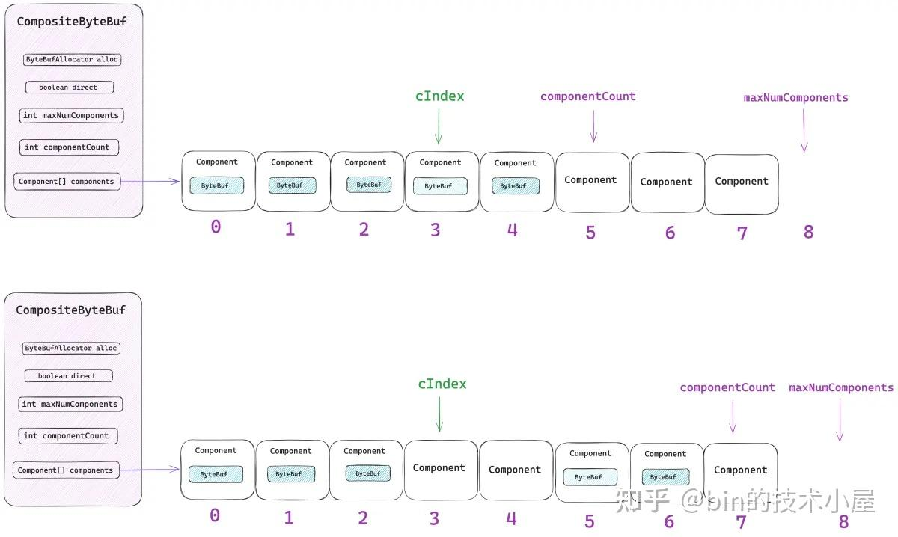

image.png

在复杂一点的情况就是 components 数组需要扩容，当一个 CompositeByteBuf 刚刚被初始化出来的时候，它的 components 数组长度等于 maxNumComponents。

如果当前 components 数组中包含的 component 个数 —— componentCount 加上本次需要添加的 ByteBuf 个数 —— count 已经超过了 maxNumComponents 的时候，就需要对 components 数组进行扩容。

```
// 初始为 0，当前 CompositeByteBuf 中包含的 component 个数
        final int size = componentCount,
        // 本次 addComponents0 操作之后，新的 component 个数
        newSize = size + count;

        // newSize 超过了 maxNumComponents 则对 components 数组进行扩容
        if (newSize > components.length) {
            ....... 扩容 ....

            // 扩容后的新数组
            components = newArr;
        }
```

扩容之后的 components 数组长度是在 newSize 与原来长度的 `3 / 2 ` 之间取一个最大值。

```
int newArrSize = Math.max(size + (size >> 1), newSize);
```

如果我们原来恰好是希望在 components 数组的末尾插入，也就是 `cIndex  = componentCount` 的情况，那么就需要通过 `Arrays.copyOf` 首先申请一段长度为 newArrSize 的数组，然后将原来的 components 数组中的内容原样拷贝过去。

```
newArr = Arrays.copyOf(components, newArrSize, Component[].class);
```

这样新的 components 数组就有位置可以容纳本次需要加入的 ByteBuf 了。

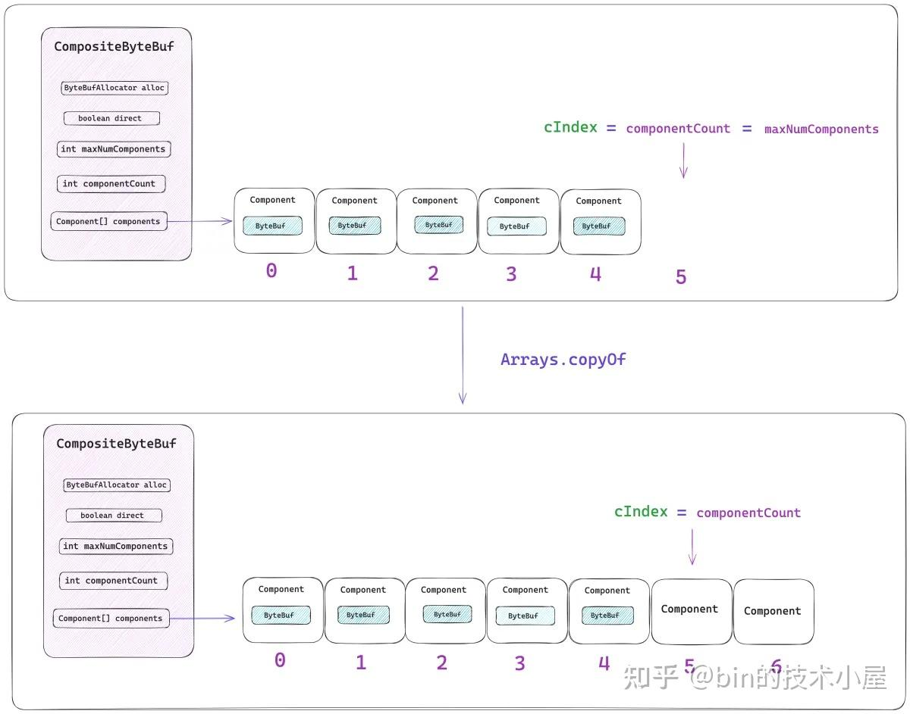

image.png

如果我们希望在原来 components 数组的中间插入，也就是 `cIndex < componentCount` 的情况，如下图所示：

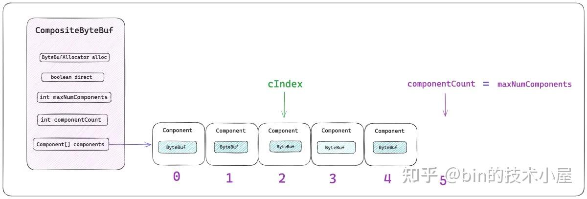

image.png

这种情况在扩容的时候就不能原样拷贝原 components 数组了，而是首先通过 `System.arraycopy` 将 `[0 , cIndex)` 这段范围的内容拷贝过去，在将 `[cIndex , componentCount) ` 这段范围的内容拷贝到新数组的 `cIndex + count` 位置处。

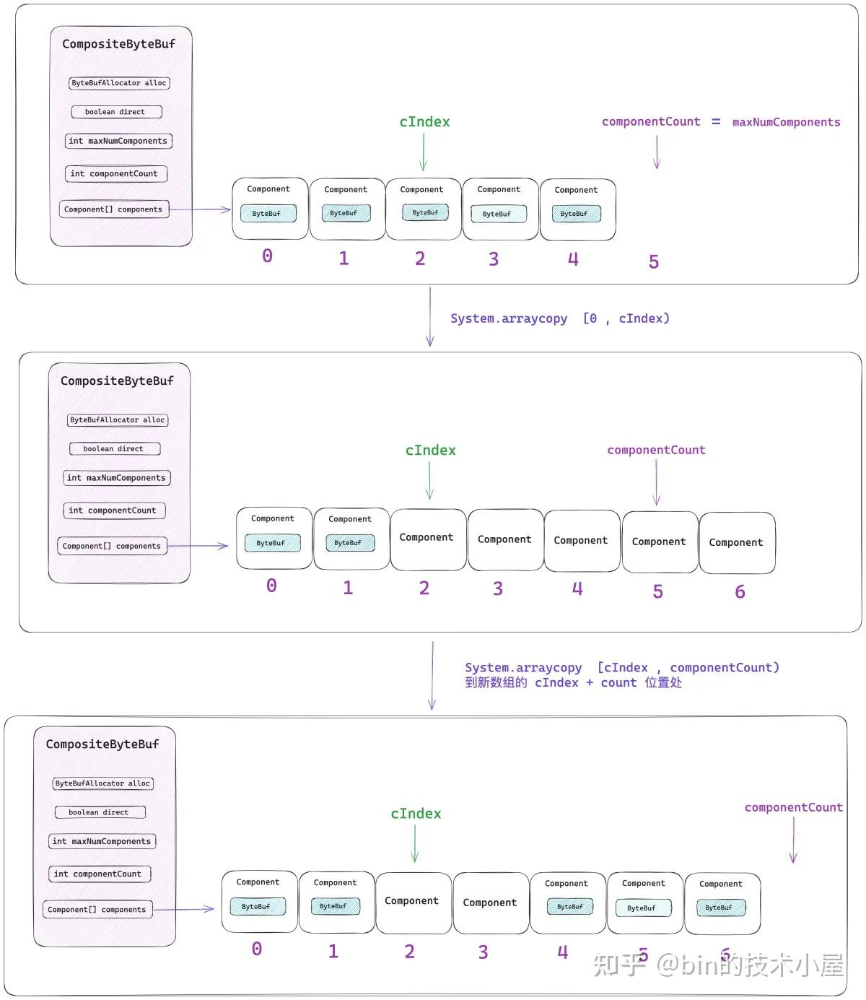

image.png

这样一来，就在新 components 数组的 cIndex 索引处，空出了两个位置出来用来添加本次这两个 ByteBuf。最后更新 componentCount 的值。以上腾挪空间的逻辑封装在 shiftComps 方法中：

```
private void shiftComps(int i, int count) {
        // 初始为 0，当前 CompositeByteBuf 中包含的 component 个数
        final int size = componentCount,
        // 本次 addComponents0 操作之后，新的 component 个数
        newSize = size + count;

        // newSize 超过了 max components（16） 则对 components 数组进行扩容
        if (newSize > components.length) {
            // grow the array，扩容到原来的 3 / 2
            int newArrSize = Math.max(size + (size >> 1), newSize);
            Component[] newArr;
            if (i == size) {
                // 在 Component[] 数组的末尾进行插入
                // 初始状态 i = size = 0
                // size - 1 是 Component[] 数组的最后一个元素，指定的 i 恰好越界
                // 原来 Component[] 数组中的内容全部拷贝到 newArr 中
                newArr = Arrays.copyOf(components, newArrSize, Component[].class);
            } else {
                // 在 Component[] 数组的中间进行插入
                newArr = new Component[newArrSize];
                if (i > 0) {
                    // [0 , i) 之间的内容拷贝到 newArr 中
                    System.arraycopy(components, 0, newArr, 0, i);
                }
                if (i < size) {
                    // 将剩下的 [i , size) 内容从 newArr 的 i + count 位置处开始拷贝。
                    // 因为需要将原来的 [ i , i+count ） 这些位置让出来，添加本次新的 components，
                    System.arraycopy(components, i, newArr, i + count, size - i);
                }
            }
            // 扩容后的新数组
            components = newArr;
        } else if (i < size) {
            // i < size 本次操作要覆盖原来的 [ i , i+count ） 之间的位置，所以这里需要将原来位置上的 component 向后移动
            System.arraycopy(components, i, components, i + count, size - i);
        }
        // 更新 componentCount
        componentCount = newSize;
    }
```

### 2.8.4 Component 如何封装 ByteBuf

经过上一小节 shiftComps 方法的辗转腾挪之后，现在 CompositeByteBuf 中的 components 数组终于有位置可以容纳本次需要添加的 ByteBuf 了。接下来就需要为每一个 ByteBuf 创建初始化一个 Component 实例，最后将这些 Component 实例放到 components 数组对应的位置上。

```
private static final class Component {
        // 原生 ByteBuf
        final ByteBuf srcBuf;
        // CompositeByteBuf 的 index 加上 srcAdjustment 就得到了srcBuf 的相关 index
        int srcAdjustment;
        // srcBuf 可能是一个被包装过的 ByteBuf，比如 SlicedByteBuf ， DuplicatedByteBuf
        // 被 srcBuf 包装的最底层的 ByteBuf 就存放在 buf 字段中
        final ByteBuf buf;
        // CompositeByteBuf 的 index 加上 adjustment 就得到了 buf 的相关 index
        int adjustment;

        // 该 Component 在 CompositeByteBuf 视角中表示的数据范围 [offset , endOffset)
        int offset;
        int endOffset;
    }
```


image.png

我们首先需要初始化 Component 实例的 offset ， endOffset 属性，前面我们已经介绍了，一个 Component 在 CompositeByteBuf 的视角中所能表示的数据逻辑范围是 `[offset , endOffset)` 。在 components 数组中，一般前一个 Component 的 endOffset 往往是后一个 Component 的 offset。

如果我们期望从 components 数组的第一个位置处开始插入（cIndex = 0），那么第一个 Component 的 offset 自然是 0 。

如果 cIndex > 0, 那么我们就需要找到它上一个 Component —— components\[cIndex - 1\] ， 上一个 Component 的 endOffset 恰好就是当前 Component 的 offset。

然后通过 `newComponent` 方法利用 ByteBuf 相关属性以及 offset 来初始化 Component 实例。随后将创建出来的 Component 实例放置在对应的位置上 —— components\[cIndex\] 。

```
// 获取当前正在插入 Component 的 offset
           int nextOffset = cIndex > 0 ? components[cIndex - 1].endOffset : 0;
            for (ci = cIndex; arrOffset < len; arrOffset++, ci++) {
                // 待插入 ByteBuf
                ByteBuf b = buffers[arrOffset];
                if (b == null) {
                    break;
                }
                // 将 ByteBuf 封装在 Component 中
                Component c = newComponent(ensureAccessible(b), nextOffset);
                components[ci] = c;
                // 下一个 Component 的 Offset 是上一个 Component 的 endOffset
                nextOffset = c.endOffset;
            }
```

假设现在有一个空的 CompositeByteBuf，我们需要将一个数据范围为 `[1 , 4]`, readerIndex = 1 的 srcBuf ， 插入到 CompositeByteBuf 的 components 数组中。

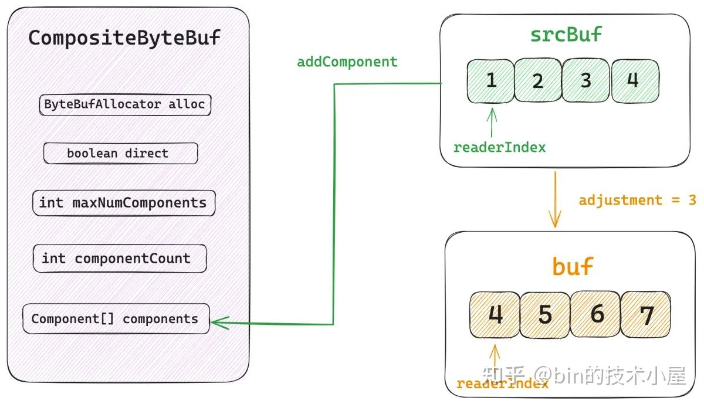

image.png

但是如果该 srcBuf 是一个视图 ByteBuf 的话，比如：SlicedByteBuf ， DuplicatedByteBuf。或者是一个被包装过的 ByteBuf ，比如：WrappedByteBuf ， SwappedByteBuf。

那么我们就需要对 srcBuf 不断的执行 `unwrap()`, 将其最底层的原生 ByteBuf 提取出来，如上图所示，原生 buf 的数据范围为 `[4 , 7]`, srcBuf 与 buf 之间相关 index 的偏移 adjustment 等于 3, 原生 buf 的 readerIndex = 4 。

最后我们会根据 srcBuf ， srcIndex（srcBuf 的 readerIndex），原生 buf ，unwrappedIndex（buf 的 readerIndex），offset ， len （srcBuf 中的可读字节数）来初始化 Component 实例。

```
private Component newComponent(final ByteBuf buf, final int offset) {
        // srcBuf 的 readerIndex = 1
        final int srcIndex = buf.readerIndex();
        // srcBuf 中的可读字节数 = 4
        final int len = buf.readableBytes();

        // srcBuf 可能是一个被包装过的 ByteBuf，比如 SlicedByteBuf，DuplicatedByteBuf
        // 获取 srcBuf 底层的原生 ByteBuf
        ByteBuf unwrapped = buf;
        // 原生 ByteBuf 的 readerIndex
        int unwrappedIndex = srcIndex;
        while (unwrapped instanceof WrappedByteBuf || unwrapped instanceof SwappedByteBuf) {
            unwrapped = unwrapped.unwrap();
        }

        // unwrap if already sliced
        if (unwrapped instanceof AbstractUnpooledSlicedByteBuf) {
            // 获取视图 ByteBuf  相对于 原生 ByteBuf 的相关 index 偏移
            // adjustment = 3
            // unwrappedIndex = srcIndex + adjustment = 4
            unwrappedIndex += ((AbstractUnpooledSlicedByteBuf) unwrapped).idx(0);
            // 获取原生 ByteBuf
            unwrapped = unwrapped.unwrap();
        } else if (unwrapped instanceof PooledSlicedByteBuf) {
            unwrappedIndex += ((PooledSlicedByteBuf) unwrapped).adjustment;
            unwrapped = unwrapped.unwrap();
        } else if (unwrapped instanceof DuplicatedByteBuf || unwrapped instanceof PooledDuplicatedByteBuf) {
            unwrapped = unwrapped.unwrap();
        }

        return new Component(buf.order(ByteOrder.BIG_ENDIAN), srcIndex,
                unwrapped.order(ByteOrder.BIG_ENDIAN), unwrappedIndex, offset, len, slice);
    }
```

由于当前的 CompositeByteBuf 还是空的，里面没有包含任何逻辑数据，当长度为 4 的 srcBuf 加入之后，CompositeByteBuf 就产生了 `[0 , 3]` 这段逻辑数据范围，所以 srcBuf 所属 Component 的 offset = 0, endOffset = 4 ，srcAdjustment = 1 ，adjustment = 4。

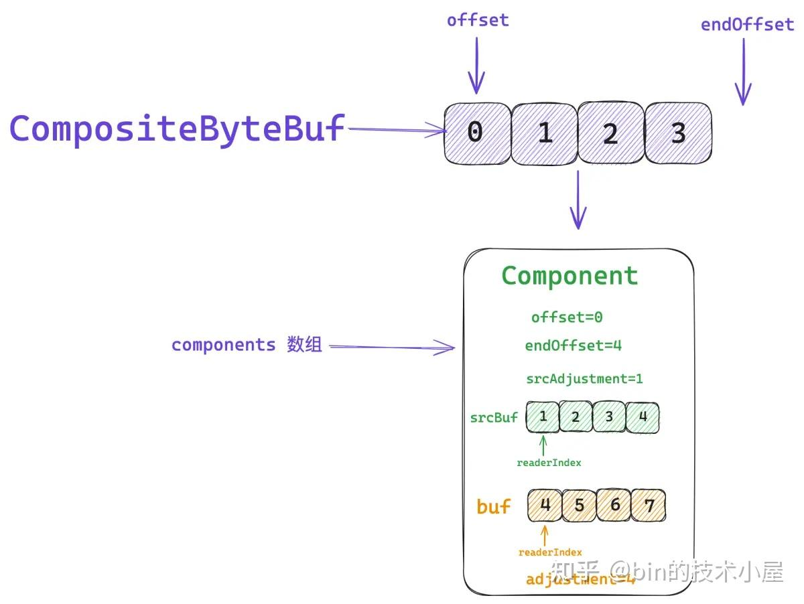

image.png

```
Component(ByteBuf srcBuf, int srcOffset, ByteBuf buf, int bufOffset,
                int offset, int len, ByteBuf slice) {
            this.srcBuf = srcBuf;
            // 用于将 CompositeByteBuf 的 index 转换为 srcBuf 的index
            // 1 - 0 = 1
            this.srcAdjustment = srcOffset - offset;
            this.buf = buf;
            // 用于将 CompositeByteBuf 的 index 转换为 buf 的index
            // 4 - 0 = 4
            this.adjustment = bufOffset - offset;
            // CompositeByteBuf [offset , endOffset) 这段范围的字节存储在该 Component 中
            //  0
            this.offset = offset;
            // 下一个 Component 的 offset
            // 4
            this.endOffset = offset + len;
        }
```

当我们继续初始化下一个 Component 的时候，它的 Offset 其实就是这个 Component 的 endOffset 。后面的流程都是一样的了。

### 2.8.5 addComponents0

在我们清楚了以上背景知识之后，在看 addComponents0 方法的逻辑就很清晰了：

```
private CompositeByteBuf addComponents0(boolean increaseWriterIndex,
            final int cIndex, ByteBuf[] buffers, int arrOffset) {
        // buffers 数组长度
        final int len = buffers.length,
        // 本次批量添加的 ByteBuf 个数
        count = len - arrOffset;
        // ci 表示从 components 数组的哪个索引位置处开始添加
        // 这里先给一个初始值，后续 shiftComps 完成之后还会重新设置
        int ci = Integer.MAX_VALUE;
        try {
            // cIndex >= 0 && cIndex <= componentCount
            checkComponentIndex(cIndex);
            // 为新添加进来的 ByteBuf 腾挪位置，以及增加 componentCount 计数
            shiftComps(cIndex, count); // will increase componentCount
            // 获取当前正在插入 Component 的 offset
            int nextOffset = cIndex > 0 ? components[cIndex - 1].endOffset : 0;
            for (ci = cIndex; arrOffset < len; arrOffset++, ci++) {
                ByteBuf b = buffers[arrOffset];
                if (b == null) {
                    break;
                }
                // 将 ByteBuf 封装在 Component 中
                Component c = newComponent(ensureAccessible(b), nextOffset);
                components[ci] = c;
                // 下一个 Component 的 Offset 是上一个 Component 的 endOffset
                nextOffset = c.endOffset;
            }
            return this;
        } finally {
            // ci is now the index following the last successfully added component
            // ci = componentCount 说明是一直按照顺序向后追加 component
            // ci < componentCount 表示在 components 数组的中间插入新的 component
            if (ci < componentCount) {
                // 如果上面 for 循环完整的走完，ci = cIndex + count
                if (ci < cIndex + count) {
                    // 上面 for 循环中有 break 的情况出现或者有异常发生
                    // ci < componentCount ，在上面的 shiftComps 中将会涉及到 component 移动，因为要腾出位置
                    // 如果发生异常，则将后面没有加入 components 数组的 component 位置删除掉
                    // [ci, cIndex + count) 这段位置要删除，因为在 ci-1 处已经发生异常，重新调整 components 数组
                    removeCompRange(ci, cIndex + count);
                    for (; arrOffset < len; ++arrOffset) {
                        ReferenceCountUtil.safeRelease(buffers[arrOffset]);
                    }
                }
                // （在中间插入的情况下）需要调整 ci 到 size -1 之间的 component 的相关 Offset
                updateComponentOffsets(ci); // only need to do this here for components after the added ones
            }
            if (increaseWriterIndex && ci > cIndex && ci <= componentCount) {
                // 本次添加的最后一个 components[ci - 1]
                // 本次添加的第一个 components[cIndex]
                // 最后一个 endOffset 减去第一个的 offset 就是本次添加的字节个数
                writerIndex += components[ci - 1].endOffset - components[cIndex].offset;
            }
        }
    }
```

这里我们重点介绍下 `finally {}` 代码块中的逻辑。首先 addComponents0 方法中的核心逻辑是先通过 shiftComps 方法为接下来新创建出来的 Component 腾挪位置，因为我们有可能是在原有 components 数组的中间位置插入。

然后会在一个 `for ()` 循环中不停的将新创建的 Component 放置到 `components[ci]` 位置上。

当跳出 for 循环进入 finally 代码块的时候，ci 的值恰恰就是最后一个成功加入 components 数组的 Component 下一个位置，如下图所示，假设 components\[0\] ， components\[1\] ，components\[2\] 是我们刚刚在 for 循环中插入的新值，那么 for 循环结束之后，ci 的值就是 3 。

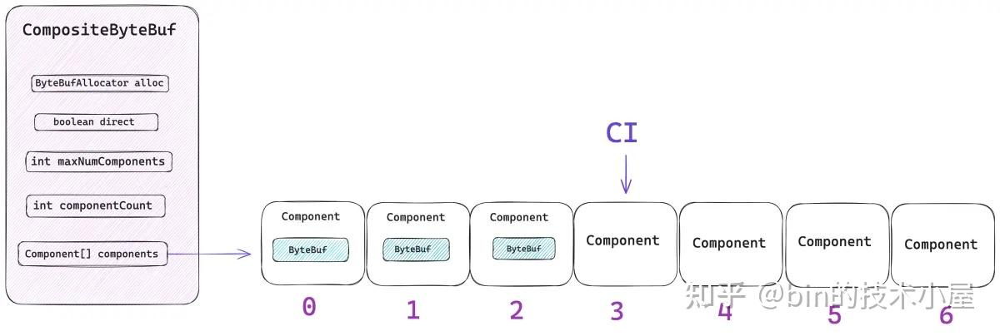

image.png

如果 `ci = componentCount` 这恰恰说明我们一直是在 components 数组的末尾进行插入，这种情况下各个 Component 实例中的 \[offset, endOffset) 都是连续的不需要做任何调整。

但如果 `ci < componentCount` 这就说明了我们是在原来 components 数组的中间位置处开始插入，下图中的 components\[3\] ，components\[4\] 是插入位置，当插入完成之后 ci 的值为 5。

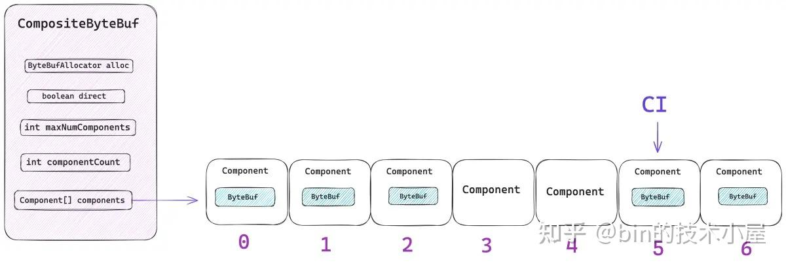

image.png

这时候就需要重新调整 components\[5\]，components\[6\] 中的 `[offset , endOffset)` 范围，因为 shiftComps 方法只负责帮你腾挪位置，不负责重新调整 `[offset , endOffset)` 范围，当新的 Component 实例插入之后，原来彼此相邻的 Component 实例之间的 `[offset , endOffset)` 就不连续了，所以这里需要重新调整。

比如下图中所展示的情况，原来的 components 数组包含五个 Component 实例，分别在 0 - 4 位置，它们之间原本的是连续的 `[offset , endOffset)` 。


image.png

现在我们要在位置 3 ，4 处插入两个新的 Component 实例，所以原来的 components\[3\] ，components\[4\] 需要移动到 components\[5\] ，components\[6\] 的位置上，但 shiftComps 只负责移动而不负责重新调整它们的 `[offset , endOffset)` 。

当新的 Component 实例插入之后，components\[4\]，components\[5\] ，components\[6\] 之间的 `[offset , endOffset)` 就不连续了。所以需要通过 `updateComponentOffsets` 方法重新调整。

```
private void updateComponentOffsets(int cIndex) {
        int size = componentCount;
        if (size <= cIndex) {
            return;
        }
        // 重新调整 components[5] ，components[6] 之间的 [offset , endOffset)
        int nextIndex = cIndex > 0 ? components[cIndex - 1].endOffset : 0;
        for (; cIndex < size; cIndex++) {
            Component c = components[cIndex];
            // 重新调整 Component 的 offset ， endOffset
            c.reposition(nextIndex);
            nextIndex = c.endOffset;
        }
    }

     void reposition(int newOffset) {
            int move = newOffset - offset;
            endOffset += move;
            srcAdjustment -= move;
            adjustment -= move;
            offset = newOffset;
      }
```

以上介绍的是正常情况下的逻辑，如果在执行 for 循环的过程中出现了 break 或者发生了异常，那么 ci 的值一定是小于 `cIndex + count` 的。什么意思呢 ？

比如我们要向一个 components 数组 `cIndex = 0` 的位置插入 `count = 5` 个 Component 实例，但是在插入第四个 Component 的时候，也就是在 components\[3\] 的位置处出现了 break 或者异常的情况，那么就会退出 for 循环来到这里的 finally 代码块。

此时的 ci 值为 3 ，cIndex + count 的值为 5，那么就说明出现了异常情况。

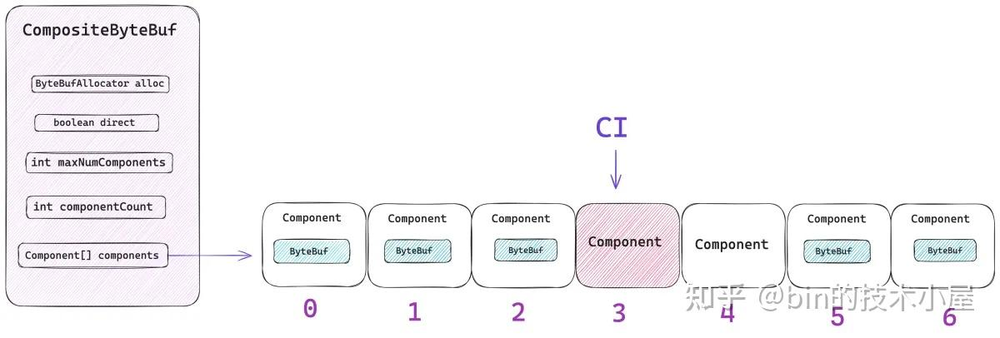

image.png

值得我们注意的是，components\[3\] 以及 components\[4\] 这两个位置是之前通过 shiftComps 方法腾挪出来的，由于异常情况的发生，这两个位置将不会放置任何 Component 实例。

这样一来 components 数组就出现了空洞，所以接下来我们还需要将 components\[5\] ， components\[6\] 位置上的 Component 实例重新移动回 components\[3\] 以及 components\[4\] 的位置上。

由于异常情况，那些 ByteBuf 数组中没有被添加进 CompositeByteBuf 的 ByteBuf 需要执行 release 。

### 2.8.6 consolidateIfNeeded

到现在为止一个空的 CompositeByteBuf 就算被填充好了，但是这里有一个问题，就是 CompositeByteBuf 中所能包含的 Component 实例个数是受到 maxNumComponents 限制的。

我们回顾一下整个 addComponents 的过程，好像还没有一个地方对 Component 的个数做出限制，甚至在 shiftComps 方法中还会对 components 数组进行扩容。

那么这样一来，Component 的个数有很大可能会超过 maxNumComponents 的限制，如果当前 CompositeByteBuf 中包含的 component 个数已经超过了 maxNumComponents ，那么就需要在 `consolidate0` 方法中，将所有的 component 合并。

```
private void consolidateIfNeeded() {
        int size = componentCount;
        // 如果当前 component 的个数已经超过了 maxNumComponents，则将所有 component 合并成一个
        if (size > maxNumComponents) {
            consolidate0(0, size);
        }
    }
```

在这里，Netty 会将当前 CompositeByteBuf 中包含的所有 Component 合并成一个更大的 Component。合并之后 ，CompositeByteBuf 中就只包含一个 Component 了。合并的核心逻辑如下：

1. 根据当前 CompositeByteBuf 的 capacity 重新申请一个更大的 ByteBuf ，该 ByteBuf 需要容纳下 CompositeByteBuf 所能表示的所有字节。
2. 将所有 Component 底层的 buf 中存储的内容全部转移到新的 ByteBuf 中，并释放原有 buf 的内存。
3. 删除 Component 数组中所有的 Component。
4. 根据新的 ByteBuf 创建一个新的 Component 实例，并放置在 components 数组的第一个位置上。

```
private void consolidate0(int cIndex, int numComponents) {
        if (numComponents <= 1) {
            return;
        }
        // 将 [cIndex , endCIndex) 之间的 Components 合并成一个
        final int endCIndex = cIndex + numComponents;
        final int startOffset = cIndex != 0 ? components[cIndex].offset : 0;
        // 计算合并范围内 Components 的存储的字节总数
        final int capacity = components[endCIndex - 1].endOffset - startOffset;
        // 重新申请一个新的 ByteBuf
        final ByteBuf consolidated = allocBuffer(capacity);
        // 将合并范围内的 Components 中的数据全部转移到新的 ByteBuf 中
        for (int i = cIndex; i < endCIndex; i ++) {
            components[i].transferTo(consolidated);
        }
        lastAccessed = null;
        // 数据转移完成之后，将合并之前的这些 components 删除
        removeCompRange(cIndex + 1, endCIndex);
        // 将合并之后的新 Component 存储在 cIndex 位置处
        components[cIndex] = newComponent(consolidated, 0);
        if (cIndex != 0 || numComponents != componentCount) {
            // 如果 cIndex 不是从 0 开始的，那么就更新 newComponent 的相关 offset
            updateComponentOffsets(cIndex);
        }
    }
```

### 2.8.7 CompositeByteBuf 的应用

当我们在 [传输层](https://zhida.zhihu.com/search?content_id=246882120&content_type=Article&match_order=1&q=%E4%BC%A0%E8%BE%93%E5%B1%82&zhida_source=entity) 采用 TCP 协议进行数据传输的时候，经常会遇到半包或者粘包的问题，我们从 socket 中读取出来的 ByteBuf 很大可能还构不成一个完整的包，这样一来，我们就需要将每次从 socket 中读取出来的 ByteBuf 在用户态缓存累加起来。

当累加起来的 ByteBuf 达到一个完整的数据包之后，我们在从这个被缓存的 ByteBuf 中读取字节，然后进行解码，最后将解码出来的对象沿着 pipeline 向后传递。

```
public abstract class ByteToMessageDecoder extends ChannelInboundHandlerAdapter {
    // 缓存累加起来的 ByteBuf
    ByteBuf cumulation;
    // ByteBuf 的累加聚合器
    private Cumulator cumulator = MERGE_CUMULATOR;
    // 是否是第一次收包
    private boolean first;

    @Override
    public void channelRead(ChannelHandlerContext ctx, Object msg) throws Exception {
        if (msg instanceof ByteBuf) {
            // 用于存储解码之后的对象
            CodecOutputList out = CodecOutputList.newInstance();
            try {
                // 第一次收包
                first = cumulation == null;
                // 将新进来的 (ByteBuf) msg 与之前缓存的 cumulation 聚合累加起来
                cumulation = cumulator.cumulate(ctx.alloc(),
                        first ? Unpooled.EMPTY_BUFFER : cumulation, (ByteBuf) msg);
                // 解码
                callDecode(ctx, cumulation, out);
            } catch (DecoderException e) {
                throw e;
            } catch (Exception e) {
                throw new DecoderException(e);
            } finally {
                    ........ 省略 ........
                    // 解码成功之后，就将解码出来的对象沿着 pipeline 向后传播
                    fireChannelRead(ctx, out, size);
            }
        } else {
            ctx.fireChannelRead(msg);
        }
    }
}
```

Netty 为此专门定义了一个 Cumulator 接口，用于将每次从 socket 中读取到的 ByteBuf 聚合累积起来。参数 alloc 是一个 ByteBuf 分配器，用于在聚合的过程中如果涉及到扩容，合并等操作可以用它来申请内存。

参数 cumulation 就是之前缓存起来的 ByteBuf，当第一次收包的时候，这里的 cumulation 就是一个空的 ByteBuf —— Unpooled.EMPTY_BUFFER 。

参数 in 则是本次刚刚从 socket 中读取出来的 ByteBuf，可能是一个半包，Cumulator 的作用就是将新读取出来的 ByteBuf （in），累加合并到之前缓存的 ByteBuf （cumulation）中。

```
public interface Cumulator {
        ByteBuf cumulate(ByteBufAllocator alloc, ByteBuf cumulation, ByteBuf in);
    }
```

Netty 提供了 Cumulator 接口的两个实现，一个是 MERGE_CUMULATOR ， 另一个是 COMPOSITE_CUMULATOR 。

```
public abstract class ByteToMessageDecoder extends ChannelInboundHandlerAdapter {

    public static final Cumulator MERGE_CUMULATOR

    public static final Cumulator COMPOSITE_CUMULATOR
}
```

MERGE_CUMULATOR 是 Netty 默认的 Cumulator ，也是传统意义上最为普遍的一种聚合 ByteBuf 的实现，它的核心思想是在聚合多个 ByteBuf 的时候，首先会申请一块更大的内存，然后将这些需要被聚合的 ByteBuf 中的内容全部拷贝到新的 ByteBuf 中。然后释放掉原来的 ByteBuf 。

效果就是将多个 ByteBuf 重新聚合成一个更大的 ByteBuf ，但这种方式涉及到内存申请以及内存拷贝的开销，优势就是内存都是连续的，读取速度快。

另外一种实现就是 COMPOSITE_CUMULATOR ，也是本小节的主题，它的核心思想是将多个 ByteBuf 聚合到一个 CompositeByteBuf 中，不需要额外申请内存，更不需要内存的拷贝。

但由于 CompositeByteBuf 只是逻辑上的一个视图 ByteBuf，其底层依赖的内存还是原来的那些 ByteBuf，所以就导致了 CompositeByteBuf 中的内存不是连续的，在加上 CompositeByteBuf 的相关 index 设计的比较复杂，所以在读取速度方面可能会比 MERGE_CUMULATOR 更慢一点，所以我们需要根据自己的场景来权衡考虑，灵活选择。

```
public static final Cumulator COMPOSITE_CUMULATOR = new Cumulator() {
        @Override
        public ByteBuf cumulate(ByteBufAllocator alloc, ByteBuf cumulation, ByteBuf in) {
            if (!cumulation.isReadable()) {
                // 之前缓存的已经解码完毕，这里将它释放，并从 in 开始重新累加。
                cumulation.release();
                return in;
            }
            CompositeByteBuf composite = null;
            try {
                // cumulation 是一个 CompositeByteBuf，说明 cumulation 之前是一个被聚合过的 ByteBuf
                if (cumulation instanceof CompositeByteBuf && cumulation.refCnt() == 1) {
                    composite = (CompositeByteBuf) cumulation;
                    // 这里需要保证 CompositeByteBuf 的 writerIndex 与 capacity 相等
                    // 因为我们需要每次在 CompositeByteBuf 的末尾聚合添加新的 ByteBuf
                    if (composite.writerIndex() != composite.capacity()) {
                        composite.capacity(composite.writerIndex());
                    }
                } else {
                    // 如果 cumulation 不是 CompositeByteBuf，只是一个普通的 ByteBuf
                    // 说明 cumulation 之前还没有被聚合过，这里是第一次聚合，所以需要先创建一个空的 CompositeByteBuf
                    // 然后将 cumulation 添加到 CompositeByteBuf 中
                    composite = alloc.compositeBuffer(Integer.MAX_VALUE).addFlattenedComponents(true, cumulation);
                }
                // 将本次新接收到的 ByteBuf（in）添加累积到 CompositeByteBuf 中
                composite.addFlattenedComponents(true, in);
                in = null;
                return composite;
            } finally {
                 ........ 省略聚合失败的处理 ..........
            }
        }
    };
```

## 3\. Heap or Direct

在前面的几个小节中，我们讨论了很多 ByteBuf 的设计细节，接下来让我们跳出这些细节，重新站在全局的视角下来看一下 ByteBuf 的总体设计。

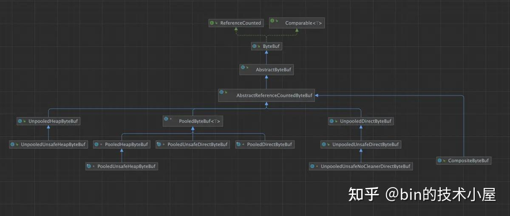

image.png

在 ByteBuf 的整个设计体系中，Netty 从 ByteBuf 内存布局的角度上，将整个体系分为了 HeapByteBuf 和 DirectByteBuf 两个大类。Netty 提供了 `PlatformDependent.directBufferPreferred() ` 方法来指定在默认情况下，是否偏向于分配 Direct Memory。

```
public final class PlatformDependent {
    // 是否偏向于分配 Direct Memory
    private static final boolean DIRECT_BUFFER_PREFERRED;

    public static boolean directBufferPreferred() {
        return DIRECT_BUFFER_PREFERRED;
    }
}
```

要想使得 DIRECT_BUFFER_PREFERRED 为 true ，必须同时满足以下两个条件：

1. `-Dio.netty.noPreferDirect` 参数必须指定为 false（默认）。
2. CLEANER 不为 NULL, 也就是需要 JDK 中包含有效的 CLEANER 机制。

```
static {
        DIRECT_BUFFER_PREFERRED = CLEANER != NOOP
                                  && !SystemPropertyUtil.getBoolean("io.netty.noPreferDirect", false);
        if (logger.isDebugEnabled()) {
            logger.debug("-Dio.netty.noPreferDirect: {}", !DIRECT_BUFFER_PREFERRED);
        }
 }
```

如果是安卓平台，那么 CLEANER 直接就是 NOOP，不会做任何判断，默认情况下直接走 Heap Memory, 除非特殊指定要走 Direct Memory。

```
if (!isAndroid()) {
            if (javaVersion() >= 9) {
                // 检查 sun.misc.Unsafe 类中是否包含有效的 invokeCleaner 方法
                CLEANER = CleanerJava9.isSupported() ? new CleanerJava9() : NOOP;
            } else {
                // 检查 java.nio.ByteBuffer 中是否包含了 cleaner 字段
                CLEANER = CleanerJava6.isSupported() ? new CleanerJava6() : NOOP;
            }
        } else {
            CLEANER = NOOP;
        }
```

如果是 JDK 9 以上的版本，Netty 会检查是否可以通过 `sun.misc.Unsafe` 的 `invokeCleaner` 方法正确执行 DirectBuffer 的 Cleaner，如果执行过程中发生异常，那么 CLEANER 就为 NOOP，Netty 在默认情况下就会走 Heap Memory。

```
public final class Unsafe {
    public void invokeCleaner(java.nio.ByteBuffer directBuffer) {
        if (!directBuffer.isDirect())
            throw new IllegalArgumentException("buffer is non-direct");

        theInternalUnsafe.invokeCleaner(directBuffer);
    }
}
```

如果是 JDK 9 以下的版本，Netty 就会通过反射的方式先去获取 DirectByteBuffer 的 cleaner 字段，如果 cleaner 为 null 或者在执行 clean 方法的过程中出现了异常，那么 CLEANER 就为 NOOP，Netty 在默认情况下就会走 Heap Memory。

```
class DirectByteBuffer extends MappedByteBuffer implements DirectBuffer
{
    private final Cleaner cleaner;

    DirectByteBuffer(int cap) {                   // package-private

        ...... 省略 .....

        base = UNSAFE.allocateMemory(size);
        cleaner = Cleaner.create(this, new Deallocator(base, size, cap));
    }
}
```

如果 `PlatformDependent.directBufferPreferred()` 方法返回 true,那么 ByteBufAllocator 接下来在分配内存的时候，默认情况下就会分配 directBuffer。

```
public final class UnpooledByteBufAllocator  extends AbstractByteBufAllocator {
    // ByteBuf 分配器
    public static final UnpooledByteBufAllocator DEFAULT =
            new UnpooledByteBufAllocator(PlatformDependent.directBufferPreferred());
}

public abstract class AbstractByteBufAllocator implements ByteBufAllocator {
    // 是否默认分配 directBuffer
    private final boolean directByDefault;

    protected AbstractByteBufAllocator(boolean preferDirect) {
        directByDefault = preferDirect && PlatformDependent.hasUnsafe();
    }

    @Override
    public ByteBuf buffer() {
        if (directByDefault) {
            return directBuffer();
        }
        return heapBuffer();
    }
}
```

一般情况下，JDK 都会包含有效的 CLEANER 机制，所以我们完全可以仅是通过 `-Dio.netty.noPreferDirect` （默认 false）来控制 Netty 默认情况下走 Direct Memory。

但如果是安卓平台，那么无论 `-Dio.netty.noPreferDirect` 如何设置，Netty 默认情况下都会走 Heap Memory 。

## 4\. Cleaner or NoCleaner

站在内存回收的角度，Netty 将 ByteBuf 分为了带有 Cleaner 的 DirectByteBuf 和没有 Cleaner 的 DirectByteBuf 两个大类。在之前的文章 [《以 ZGC 为例，谈一谈 JVM 是如何实现 Reference 语义的》](https://link.zhihu.com/?target=https%3A//mp.weixin.qq.com/s/ukk_Pqk0_Kv0I7mxmG_yVA) 中的第三小节，笔者详细的介绍过，JVM 如何利用 Cleaner 机制来回收 DirectByteBuffer 背后的 Native Memory 。

而 Cleaner 回收 DirectByteBuffer 的 Native Memory 需要依赖 GC 的发生，当一个 DirectByteBuffer 没有任何强引用或者软引用的时候，如果此时发生 GC, Cleaner 才会去回收 Native Memory。如果很久都没发生 GC,那么这些 DirectByteBuffer 所引用的 Native Memory 将一直不会释放。

所以仅仅是依赖 Cleaner 来释放 Native Memory 是有一定延迟的，极端情况下，如果一直等不来 GC,很有可能就会发生 OOM 。

而 Netty 的 ByteBuf 设计相当于是对 NIO ByteBuffer 的一种完善扩展，其底层其实都会依赖一个 JDK 的 ByteBuffer。比如，前面介绍的 UnpooledDirectByteBuf ， UnpooledUnsafeDirectByteBuf 其底层依赖的就是 JDK DirectByteBuffer, 而这个 DirectByteBuffer 就是带有 Cleaner 的 ByteBuf 。

```
public class UnpooledDirectByteBuf extends AbstractReferenceCountedByteBuf {
    // 底层依赖的 JDK DirectByteBuffer
    ByteBuffer buffer;

    public UnpooledDirectByteBuf(ByteBufAllocator alloc, int initialCapacity, int maxCapacity) {
        // 创建 DirectByteBuffer
        setByteBuffer(allocateDirect(initialCapacity), false);
    }

   protected ByteBuffer allocateDirect(int initialCapacity) {
        return ByteBuffer.allocateDirect(initialCapacity);
    }

public class UnpooledUnsafeDirectByteBuf extends UnpooledDirectByteBuf {
    // 底层依赖的 JDK DirectByteBuffer 的内存地址
    long memoryAddress;

    public UnpooledUnsafeDirectByteBuf(ByteBufAllocator alloc, int initialCapacity, int maxCapacity) {
         // 调用父类 UnpooledDirectByteBuf 构建函数创建底层依赖的 JDK DirectByteBuffer
        super(alloc, initialCapacity, maxCapacity);
    }

    @Override
    final void setByteBuffer(ByteBuffer buffer, boolean tryFree) {
        super.setByteBuffer(buffer, tryFree);
        // 获取 JDK DirectByteBuffer 的内存地址
        memoryAddress = PlatformDependent.directBufferAddress(buffer);
    }
```

在 JDK NIO 中，凡是通过 `ByteBuffer.allocateDirect` 方法申请到 DirectByteBuffer 都是带有 Cleaer 的。

```
public abstract class ByteBuffer {
  public static ByteBuffer allocateDirect(int capacity) {
        return new DirectByteBuffer(capacity);
    }
}

class DirectByteBuffer extends MappedByteBuffer implements DirectBuffer
{
    private final Cleaner cleaner;

    DirectByteBuffer(int cap) {                   // package-private

        ...... 省略 .....
        // 通过该构造函数申请到的 Direct Memory 会受到 -XX:MaxDirectMemorySize 参数的限制
        Bits.reserveMemory(size, cap);
        // 底层调用 malloc 申请内存
        base = UNSAFE.allocateMemory(size);

        ...... 省略 .....
        // 创建 Cleaner
        cleaner = Cleaner.create(this, new Deallocator(base, size, cap));
    }
}
```

**而带有 Cleaner 的 DirectByteBuffer 背后所能引用的 Direct Memory 是受到 `-XX:MaxDirectMemorySize` JVM 参数限制的** 。由于 UnpooledDirectByteBuf 以及 UnpooledUnsafeDirectByteBuf 都带有 Cleaner，所以当他们在系统中没有任何强引用或者软引用的时候，如果发生 GC, Cleaner 就会释放他们的 Direct Memory 。

由于 Cleaner 执行会依赖 GC, 而 GC 的发生往往不那么及时，会有一定的延时，所以 Netty 为了可以及时的释放 Direct Memory ，往往选择不依赖 JDK 的 Cleaner 机制，手动进行释放。所以就有了 NoCleaner 类型的 DirectByteBuf —— UnpooledUnsafeNoCleanerDirectByteBuf 。

```
class UnpooledUnsafeNoCleanerDirectByteBuf extends UnpooledUnsafeDirectByteBuf {

    @Override
    protected ByteBuffer allocateDirect(int initialCapacity) {
        // 创建没有 Cleaner 的 JDK DirectByteBuffer
        return PlatformDependent.allocateDirectNoCleaner(initialCapacity);
    }

    @Override
    protected void freeDirect(ByteBuffer buffer) {
        // 既然没有了 Cleaner ， 所以 Netty 要手动进行释放
        PlatformDependent.freeDirectNoCleaner(buffer);
    }
}
```

UnpooledUnsafeNoCleanerDirectByteBuf 的底层同样也会依赖一个 JDK DirectByteBuffer, 但和之前不同的是，这里的 DirectByteBuffer 是不带有 cleaner 的。

我们通过 JNI 来调用 `DirectByteBuffer(long addr, int cap)` 构造函数创建出来的 JDK DirectByteBuffer 都是没有 cleaner 的。 **但通过这种方式创建出来的 DirectByteBuffer 背后引用的 Native Memory 是不会受到 `-XX:MaxDirectMemorySize` JVM 参数限制的** 。

```
class DirectByteBuffer {
    // Invoked only by JNI: NewDirectByteBuffer(void*, long)
    private DirectByteBuffer(long addr, int cap) {
        super(-1, 0, cap, cap, null);
        address = addr;
        // cleaner 为 null
        cleaner = null;
    }
}
```

既然没有了 cleaner ， 所以 Netty 就无法依赖 GC 来释放 Direct Memory 了，这就要求 Netty 必须手动调用 `freeDirect ` 方法及时地释放 Direct Memory。

> 事实上，无论 Netty 中的 DirectByteBuf 有没有 Cleaner， Netty 都会选择手动的进行释放，目的就是为了避免 GC 的延迟 ， 从而及时的释放 Direct Memory。

那么 Netty 中的 DirectByteBuf 在什么情况下带有 Cleaner，又在什么情况下不带 Cleaner 呢 ？我们可以通过 `PlatformDependent.useDirectBufferNoCleaner` 方法的返回值进行判断：

```
public final class PlatformDependent {
    // Netty 的 DirectByteBuf 是否带有 Cleaner
    private static final boolean USE_DIRECT_BUFFER_NO_CLEANER;
    public static boolean useDirectBufferNoCleaner() {
        return USE_DIRECT_BUFFER_NO_CLEANER;
    }
}
```

- USE_DIRECT_BUFFER_NO_CLEANER = TRUE 表示 Netty 创建出来的 DirectByteBuf 不带有 Cleaner 。 Direct Memory 的用量不会受到 JVM 参数 - `XX:MaxDirectMemorySize` 的限制。
- USE_DIRECT_BUFFER_NO_CLEANER = FALSE 表示 Netty 创建出来的 DirectByteBuf 带有 Cleaner 。 Direct Memory 的用量会受到 JVM 参数 - `XX:MaxDirectMemorySize` 的限制。

我们可以通过 `-Dio.netty.maxDirectMemory` 来设置 USE_DIRECT_BUFFER_NO_CLEANER 的值，除此之外，该参数还可以指定在 Netty 层面上可以使用的最大 DirectMemory 用量。

`io.netty.maxDirectMemory = 0` 那么 USE_DIRECT_BUFFER_NO_CLEANER 就为 FALSE, 表示在 Netty 层面创建出来的 DirectByteBuf 都是带有 Cleaner 的， **这种情况下 Netty 并不会限制 maxDirectMemory 的用量，因为限制了也没用，具体能用多少 maxDirectMemory，还是由 JVM 参数 `-XX:MaxDirectMemorySize` 决定的** 。

`io.netty.maxDirectMemory < 0` ，默认为 -1，也就是在默认情况下 USE_DIRECT_BUFFER_NO_CLEANER 为 TRUE, 创建出来的 DirectByteBuf 都是不带 Cleaner 的。由于在这种情况下 maxDirectMemory 的用量并不会受到 JVM 参数 `-XX:MaxDirectMemorySize` 的限制，所以在 Netty 层面上必须限制 maxDirectMemory 的用量，默认值就是 `-XX:MaxDirectMemorySize` 指定的值。

**这里需要特别注意的是** ，Netty 层面对于 maxDirectMemory 的容量限制和 JVM 层面对于 maxDirectMemory 的容量限制是单独分别计算的，互不影响。因此站在 JVM 进程的角度来说，总体 maxDirectMemory 的用量是 `-XX:MaxDirectMemorySize` 的两倍。

`io.netty.maxDirectMemory > 0` 的情况和小于 0 的情况一样，唯一不同的是 Netty 层面的 maxDirectMemory 用量是专门由 `-Dio.netty.maxDirectMemory` 参数指定，仍然独立于 JVM 层面的 maxDirectMemory 限制之外单独计算。

**所以从这个层面来说，Netty 设计 NoCleaner 类型的 DirectByteBuf 的另外一个目的就是为了突破 JVM 对于 maxDirectMemory 用量的限制** 。

```
public final class PlatformDependent {
    // Netty 层面  Direct Memory 的用量统计
    // 为 NULL 表示在 Netty 层面不进行特殊限制，完全由 JVM 进行限制 Direct Memory 的用量
    private static final AtomicLong DIRECT_MEMORY_COUNTER;
    // Netty 层面 Direct Memory 的最大用量
    private static final long DIRECT_MEMORY_LIMIT;
    // JVM 指定的 -XX:MaxDirectMemorySize 最大堆外内存
    private static final long MAX_DIRECT_MEMORY = maxDirectMemory0();

    static {
        long maxDirectMemory = SystemPropertyUtil.getLong("io.netty.maxDirectMemory", -1);

        if (maxDirectMemory == 0 || !hasUnsafe() || !PlatformDependent0.hasDirectBufferNoCleanerConstructor()) {
            // maxDirectMemory = 0 表示后续创建的 DirectBuffer 是带有 Cleaner 的，Netty 自己不会强制限定 maxDirectMemory 的用量，完全交给 JDK 的 maxDirectMemory 来限制
            // 因为 Netty 限制了也没用，其底层依然依赖的是 JDK  DirectBuffer（Cleaner），JDK 会限制 maxDirectMemory 的用量
            // 在没有 Unsafe 的情况下，那么就必须使用 Cleaner，因为如果不使用 Cleaner 的话，又没有 Unsafe，我们就无法释放 Native Memory 了
            // 如果 JDK 本身不包含创建 NoCleaner DirectBuffer 的构造函数 —— DirectByteBuffer(long, int)，那么自然只能使用 Cleaner
            USE_DIRECT_BUFFER_NO_CLEANER = false;
            // Netty 自身不会统计 Direct Memory 的用量，完全交给 JDK 来统计
            DIRECT_MEMORY_COUNTER = null;
        } else {
            USE_DIRECT_BUFFER_NO_CLEANER = true;
            if (maxDirectMemory < 0) {
                // maxDirectMemory < 0 (默认 -1) 后续创建 NoCleaner DirectBuffer
                // Netty 层面会单独限制 maxDirectMemory 用量，maxDirectMemory 的值与 -XX:MaxDirectMemorySize 的值相同
                // 因为 JDK 不会统计和限制 NoCleaner DirectBuffer 的用量
                // 注意，这里 Netty 的 maxDirectMemory 和 JDK 的 maxDirectMemory 是分别单独统计的
                // 在 JVM 进程的角度来说，整体 maxDirectMemory 的用量是 -XX:MaxDirectMemorySize 的两倍（Netty用的和 JDK 用的之和）
                maxDirectMemory = MAX_DIRECT_MEMORY;
                if (maxDirectMemory <= 0) {
                    DIRECT_MEMORY_COUNTER = null;
                } else {
                    // 统计 Netty DirectMemory 的用量
                    DIRECT_MEMORY_COUNTER = new AtomicLong();
                }
            } else {
                // maxDirectMemory > 0 后续创建 NoCleaner DirectBuffer,Netty 层面的 maxDirectMemory 就是 io.netty.maxDirectMemory 指定的值
                DIRECT_MEMORY_COUNTER = new AtomicLong();
            }
        }
        logger.debug("-Dio.netty.maxDirectMemory: {} bytes", maxDirectMemory);
        DIRECT_MEMORY_LIMIT = maxDirectMemory >= 1 ? maxDirectMemory : MAX_DIRECT_MEMORY;
    }
}
```

当 Netty 层面的 direct memory 用量超过了 `-Dio.netty.maxDirectMemory` 参数指定的值时，那么就会抛出 `OutOfDirectMemoryError` ，分配 DirectByteBuf 将会失败。

```
private static void incrementMemoryCounter(int capacity) {
        if (DIRECT_MEMORY_COUNTER != null) {
            long newUsedMemory = DIRECT_MEMORY_COUNTER.addAndGet(capacity);
            if (newUsedMemory > DIRECT_MEMORY_LIMIT) {
                DIRECT_MEMORY_COUNTER.addAndGet(-capacity);
                throw new OutOfDirectMemoryError("failed to allocate " + capacity
                        + " byte(s) of direct memory (used: " + (newUsedMemory - capacity)
                        + ", max: " + DIRECT_MEMORY_LIMIT + ')');
            }
        }
    }
```

## 5\. Unsafe or NoUnsafe

站在内存访问方式的角度上来说 ， Netty 又会将 ByteBuf 分为了 Unsafe 和 NoUnsafe 两个大类，其中 NoUnsafe 的内存访问方式是依赖底层的 JDK ByteBuffer，对于 Netty ByteBuf 的任何操作最终都是会代理给底层 JDK 的 ByteBuffer。

```
public class UnpooledDirectByteBuf extends AbstractReferenceCountedByteBuf {
    // 底层依赖的 JDK DirectByteBuffer
    ByteBuffer buffer;

   @Override
    protected byte _getByte(int index) {
        return buffer.get(index);
    }

    @Override
    protected void _setByte(int index, int value) {
        buffer.put(index, (byte) value);
    }
}
```

而 Unsafe 的内存访问方式则是通过 `sun.misc.Unsafe` 类中提供的众多 low-level direct buffer access API 来对内存地址直接进行访问，由于是脱离 JVM 相关规范直接对内存地址进行访问，所以我们在调用 Unsafe 相关方法的时候需要考虑 JVM 以及 OS 的各种细节，一不小心就会踩坑出错，所以它是一种不安全的访问方式，但是足够灵活，高效。

```
public class UnpooledUnsafeDirectByteBuf extends UnpooledDirectByteBuf {
    // 底层依赖的 JDK DirectByteBuffer 的内存地址
    long memoryAddress;

    @Override
    protected byte _getByte(int index) {
        return UnsafeByteBufUtil.getByte(addr(index));
    }

   final long addr(int index) {
        // 直接通过内存地址进行访问
        return memoryAddress + index;
    }

    @Override
    protected void _setByte(int index, int value) {
        UnsafeByteBufUtil.setByte(addr(index), value);
    }

}
```

Netty 提供了 `-Dio.netty.noUnsafe` 参数来让我们决定是否采用 Unsafe 的内存访问方式，默认值是 false, 表示 Netty 默认开启 Unsafe 访问方式。

```
final class PlatformDependent0 {
    // 是否明确禁用 Unsafe，null 表示开启  Unsafe
    private static final Throwable EXPLICIT_NO_UNSAFE_CAUSE = explicitNoUnsafeCause0();

    private static Throwable explicitNoUnsafeCause0() {
        final boolean noUnsafe = SystemPropertyUtil.getBoolean("io.netty.noUnsafe", false);
        logger.debug("-Dio.netty.noUnsafe: {}", noUnsafe);

        if (noUnsafe) {
            logger.debug("sun.misc.Unsafe: unavailable (io.netty.noUnsafe)");
            return new UnsupportedOperationException("sun.misc.Unsafe: unavailable (io.netty.noUnsafe)");
        }

        return null;
    }
}
```

在确认开启了 Unsafe 方式之后，我们就需要近一步确认在当前 JRE 的 classpath 下是否存在 `sun.misc.Unsafe` 类，是否能通过反射的方式获取到 Unsafe 实例 —— theUnsafe 。

```
public final class Unsafe {
    // Unsafe 实例
    private static final Unsafe theUnsafe = new Unsafe();
}

final class PlatformDependent0 {
    // 验证 Unsafe 是否可用，null 表示 Unsafe 是可用状态
    private static final Throwable UNSAFE_UNAVAILABILITY_CAUSE;
    static {
           // 尝试通过反射的方式拿到 theUnsafe 实例
           final Object maybeUnsafe = AccessController.doPrivileged(new PrivilegedAction<Object>() {
                @Override
                public Object run() {
                    try {
                        final Field unsafeField = Unsafe.class.getDeclaredField("theUnsafe");
                        Throwable cause = ReflectionUtil.trySetAccessible(unsafeField, false);
                        if (cause != null) {
                            return cause;
                        }
                        // the unsafe instance
                        return unsafeField.get(null);
                    } catch (NoSuchFieldException e) {
                        return e;
                    } catch (SecurityException e) {
                        return e;
                    } catch (IllegalAccessException e) {
                        return e;
                    } catch (NoClassDefFoundError e) {
                        // Also catch NoClassDefFoundError in case someone uses for example OSGI and it made
                        // Unsafe unloadable.
                        return e;
                    }
                }
            });
    }
}
```

在获取到 Unsafe 实例之后，我们还需要检查 Unsafe 中是否包含所有 Netty 用到的 low-level direct buffer access API ，确保这些 API 可以正常有效的运行。比如，是否包含 `copyMemory` 方法。

```
public final class Unsafe {
    @ForceInline
    public void copyMemory(Object srcBase, long srcOffset,
                           Object destBase, long destOffset,
                           long bytes) {
        theInternalUnsafe.copyMemory(srcBase, srcOffset, destBase, destOffset, bytes);
    }
}
```

是否可以通过 Unsafe 访问到 NIO Buffer 的 address 字段，因为后续我们需要直接操作内存地址。

```
public abstract class Buffer {
    // 内存地址
    long address;
}
```

在整个过程中如果发生任何异常，则表示在当前 classpath 下，不存在 `sun.misc.Unsafe` 类或者是由于不同版本 JDK 的设计，Unsafe 中没有 Netty 所需要的一些必要的访存 API 。这样一来我们就无法使用 Unsafe，内存的访问方式就需要回退到 NoUnsafe。

```
if (maybeUnsafe instanceof Throwable) {
                unsafe = null;
                unsafeUnavailabilityCause = (Throwable) maybeUnsafe;
                logger.debug("sun.misc.Unsafe.theUnsafe: unavailable", (Throwable) maybeUnsafe);
            } else {
                unsafe = (Unsafe) maybeUnsafe;
                logger.debug("sun.misc.Unsafe.theUnsafe: available");
            }
            // 为 null 表示 Unsafe 可用
            UNSAFE_UNAVAILABILITY_CAUSE = unsafeUnavailabilityCause;
            UNSAFE = unsafe;
```

如果在整个过程中没有发生任何异常，我们获取到了一个有效的 UNSAFE 实例，那么后续将正式开启 Unsafe 的内存访问方式。

```
final class PlatformDependent0 {
    static boolean hasUnsafe() {
        return UNSAFE != null;
    }
}
```

完整的 `hasUnsafe()` 判断逻辑如下：

1. 如果当前平台是安卓或者.NET ，则不能开启 Unsafe，因为这些平台并不包含 `sun.misc.Unsafe` 类。
2. `-Dio.netty.noUnsafe` 参数需要设置为 false （默认开启）。

3.. 当前 classpath 下是否包含有效的 `sun.misc.Unsafe` 类。

1. Unsafe 实例需要包含必要的访存 API 。

```
public final class PlatformDependent {
    private static final Throwable UNSAFE_UNAVAILABILITY_CAUSE = unsafeUnavailabilityCause0();

    public static boolean hasUnsafe() {
        return UNSAFE_UNAVAILABILITY_CAUSE == null;
    }
    private static Throwable unsafeUnavailabilityCause0() {
        if (isAndroid()) {
            logger.debug("sun.misc.Unsafe: unavailable (Android)");
            return new UnsupportedOperationException("sun.misc.Unsafe: unavailable (Android)");
        }

        if (isIkvmDotNet()) {
            logger.debug("sun.misc.Unsafe: unavailable (IKVM.NET)");
            return new UnsupportedOperationException("sun.misc.Unsafe: unavailable (IKVM.NET)");
        }

        Throwable cause = PlatformDependent0.getUnsafeUnavailabilityCause();
        if (cause != null) {
            return cause;
        }

        try {
            boolean hasUnsafe = PlatformDependent0.hasUnsafe();
            logger.debug("sun.misc.Unsafe: {}", hasUnsafe ? "available" : "unavailable");
            return hasUnsafe ? null : PlatformDependent0.getUnsafeUnavailabilityCause();
        } catch (Throwable t) {
            logger.trace("Could not determine if Unsafe is available", t);
            // Probably failed to initialize PlatformDependent0.
            return new UnsupportedOperationException("Could not determine if Unsafe is available", t);
        }
    }
}
```

如果 `PlatformDependent.hasUnsafe()` 方法返回 true, 那么后续 Netty 都会创建 Unsafe 类型的 ByteBuf。

## 6\. Pooled or Unpooled

站在内存管理的角度上来讲，Netty 将 ByteBuf 分为了 池化（Pooled） 和 非池化（Unpooled）两个大类，其中 Unpooled 类型的 ByteBuf 是用到的时候才去临时创建，使用完的时候再去释放。

而 Direct Memory 的申请和释放开销相较于 Heap Memory 会大很多，Netty 在面对 [高并发](https://zhida.zhihu.com/search?content_id=246882120&content_type=Article&match_order=1&q=%E9%AB%98%E5%B9%B6%E5%8F%91&zhida_source=entity) 网络通信的场景下，Direct Memory 的申请和释放是一个非常频繁的操作，这种大量频繁地内存申请释放操作对程序的性能影响是巨大的，因此 Netty 引入了内存池将这些 Direct Memory 统一池化管理起来。

Netty 提供了 `-Dio.netty.allocator.type` 参数来让我们决定是否采用内存池来管理 ByteBuf ， 默认值是 `pooled`, 也就是说 Netty 默认是采用池化的方式来管理 PooledByteBuf 。如果是安卓平台，那么默认是使用非池化的 ByteBuf （unpooled）。

- 当参数 `io.netty.allocator.type` 的值为 pooled 时，Netty 的默认 ByteBufAllocator 是 `PooledByteBufAllocator.DEFAULT` 。
- 当参数 `io.netty.allocator.type` 的值为 unpooled 时，Netty 的默认 ByteBufAllocator 是 `UnpooledByteBufAllocator.DEFAULT` 。

```
public final class ByteBufUtil {
    // 默认 PooledByteBufAllocator，池化管理 ByteBuf
    static final ByteBufAllocator DEFAULT_ALLOCATOR;

    static {
        // 默认为 pooled
        String allocType = SystemPropertyUtil.get(
                "io.netty.allocator.type", PlatformDependent.isAndroid() ? "unpooled" : "pooled");
        allocType = allocType.toLowerCase(Locale.US).trim();

        ByteBufAllocator alloc;
        if ("unpooled".equals(allocType)) {
            alloc = UnpooledByteBufAllocator.DEFAULT;
            logger.debug("-Dio.netty.allocator.type: {}", allocType);
        } else if ("pooled".equals(allocType)) {
            alloc = PooledByteBufAllocator.DEFAULT;
            logger.debug("-Dio.netty.allocator.type: {}", allocType);
        } else {
            alloc = PooledByteBufAllocator.DEFAULT;
            logger.debug("-Dio.netty.allocator.type: pooled (unknown: {})", allocType);
        }

        DEFAULT_ALLOCATOR = alloc;
    }
}
```

后续 Netty 在创建 SocketChannel 的时候，在 SocketChannelConfig 中指定的 ByteBufAllocator 就是这里的 `ByteBufUtil.DEFAULT_ALLOCATOR` ，默认情况下为 PooledByteBufAllocator。

```
public interface ByteBufAllocator {
    ByteBufAllocator DEFAULT = ByteBufUtil.DEFAULT_ALLOCATOR;
}

public class DefaultChannelConfig implements ChannelConfig {
    // PooledByteBufAllocator
    private volatile ByteBufAllocator allocator = ByteBufAllocator.DEFAULT;
}
```

当 Netty 读取 Socket 中的网络数据时，首先会从 DefaultChannelConfig 中将 ByteBufAllocator 获取到，然后利用 ByteBufAllocator 从内存池中获取一个 DirectByteBuf ，最后将 Socket 中的数据读取到 DirectByteBuf 中，随后沿着 pipeline 向后传播，进行 IO 处理。

```
protected class NioByteUnsafe extends AbstractNioUnsafe {
        @Override
        public final void read() {
            // 获取 SocketChannelConfig
            final ChannelConfig config = config();
            // 获取 ByteBufAllocator ， 默认为 PooledByteBufAllocator
            final ByteBufAllocator allocator = config.getAllocator();
            // 从内存池中获取 byteBuf
            byteBuf = allocHandle.allocate(allocator);
            // 读取 socket 中的数据到 byteBuf
            allocHandle.lastBytesRead(doReadBytes(byteBuf));
            // 将 byteBuf 沿着 pipeline 向后传播
            pipeline.fireChannelRead(byteBuf);

            ....... 省略 .......
        }
}
```

除此之外，Netty 还提供了 `ChannelOption.ALLOCATOR` 选项，让我们可以在配置 ServerBootstrap 的时候为 SocketChannel 灵活指定自定义的 ByteBufAllocator 。

```
EventLoopGroup bossGroup = new NioEventLoopGroup(1);
        EventLoopGroup workerGroup = new NioEventLoopGroup();

        ServerBootstrap b = new ServerBootstrap();
        b.group(bossGroup, workerGroup)
            // 灵活配置 ByteBufAllocator
          .childOption(ChannelOption.ALLOCATOR, UnpooledByteBufAllocator.DEFAULT;);
```

这里通过 ChannelOption 来配置 Socket 相关的属性是最高优先级的，它会覆盖掉一切默认配置。

## 7\. Metric

在第四小节中，我们介绍了 Cleaner 和 NoCleaner 这两种 DirectByteBuf，其中 CleanerDirectByteBuf 的整体 Direct Memory 的用量是受到 JVM 参数 `-XX:MaxDirectMemorySize` 限制的，而 NoCleanerDirectByteBuf 的整体 Direct Memory 可以突破该参数的限制，JVM 并不会统计这块 Direct Memory 的用量。

Netty 为了及时地释放这些 Direct Memory，通常默认选择 NoCleanerDirectByteBuf，这就要求 Netty 需要对这部分 Direct Memory 的用量进行自行统计限制。NoCleanerDirectByteBuf 的最大可用 Direct Memory 我们可以通过 `-Dio.netty.maxDirectMemory` 来指定，默认情况下等于 `-XX:MaxDirectMemorySize` 设置的值。

PlatformDependent 类中的 `DIRECT_MEMORY_COUNTER` 字段用于统计在 Netty 层面上，所有 NoCleanerDirectByteBuf 占用的 Direct Memory 大小。注意这里并不会统计 CleanerDirectByteBuf 的 Direct Memory 占用，这部分统计由 JVM 负责。

```
public final class PlatformDependent {
    // 用于统计 NoCleaner 的 DirectByteBuf 所引用的 Native Memory 大小
    private static final AtomicLong DIRECT_MEMORY_COUNTER;

    public static ByteBuffer allocateDirectNoCleaner(int capacity) {
        // 增加 Native Memory 用量统计
        incrementMemoryCounter(capacity);
        try {
            // 分配 Native Memory
            // 初始化 NoCleaner 的 DirectByteBuffer
            return PlatformDependent0.allocateDirectNoCleaner(capacity);
        } catch (Throwable e) {
            decrementMemoryCounter(capacity);
            throwException(e);
            return null;
        }


    public static void freeDirectNoCleaner(ByteBuffer buffer) {
        int capacity = buffer.capacity();
        // 释放 Native Memory
        PlatformDependent0.freeMemory(PlatformDependent0.directBufferAddress(buffer));
        // 减少 Native Memory 用量统计
        decrementMemoryCounter(capacity);
    }
}
```

PlatformDependent 类是 Netty 最底层的一个类，所有内存的分配，释放动作最终都是在该类中执行，因此 DIRECT_MEMORY_COUNTER 字段统计的是全局的 Direct Memory 大小（Netty 层面）。

每一次的内存申请 —— allocateDirectNoCleaner ， 都会增加 DIRECT_MEMORY_COUNTER 计数，每一次的内存释放 —— freeDirectNoCleaner，都会减少 DIRECT_MEMORY_COUNTER 计数。

我们可以通过 `PlatformDependent.usedDirectMemory() ` 方法来获取 Netty 当前所占用的 Direct Memory 大小。但如果我们特殊指定了需要使用 CleanerDirectByteBuf ， 比如，将 `-Dio.netty.maxDirectMemory` 参数设置为 `0`, 那么这里将会返回 -1 。

```
private static void incrementMemoryCounter(int capacity) {
        // 只统计 NoCleaner 的 DirectByteBuf 所引用的 Native Memory
        if (DIRECT_MEMORY_COUNTER != null) {
            long newUsedMemory = DIRECT_MEMORY_COUNTER.addAndGet(capacity);
            if (newUsedMemory > DIRECT_MEMORY_LIMIT) {
                DIRECT_MEMORY_COUNTER.addAndGet(-capacity);
                throw new OutOfDirectMemoryError("failed to allocate " + capacity
                        + " byte(s) of direct memory (used: " + (newUsedMemory - capacity)
                        + ", max: " + DIRECT_MEMORY_LIMIT + ')');
            }
        }
    }

    private static void decrementMemoryCounter(int capacity) {
        if (DIRECT_MEMORY_COUNTER != null) {
            long usedMemory = DIRECT_MEMORY_COUNTER.addAndGet(-capacity);
            assert usedMemory >= 0;
        }
    }

    public static long usedDirectMemory() {
        return DIRECT_MEMORY_COUNTER != null ? DIRECT_MEMORY_COUNTER.get() : -1;
    }
```

除了 PlatformDependent 这里的全局统计之外，Netty 还提供了以 ByteBufAllocator 为粒度的内存占用统计，统计的维度包括 Heap Memory 的占用和 Direct Memory 的占用。

```
public final class UnpooledByteBufAllocator extends AbstractByteBufAllocator implements ByteBufAllocatorMetricProvider {
    // 从该 ByteBufAllocator 分配出去的内存统计
    private final UnpooledByteBufAllocatorMetric metric = new UnpooledByteBufAllocatorMetric();

    @Override
    public ByteBufAllocatorMetric metric() {
        return metric;
    }
    // 统计 Direct Memory 的占用
    void incrementDirect(int amount) {
        metric.directCounter.add(amount);
    }

    void decrementDirect(int amount) {
        metric.directCounter.add(-amount);
    }
    // 统计 Heap Memory 的占用
    void incrementHeap(int amount) {
        metric.heapCounter.add(amount);
    }

    void decrementHeap(int amount) {
        metric.heapCounter.add(-amount);
    }

}
```

Netty 定义的每一个 ByteBufAllocator 中，都会有一个 ByteBufAllocatorMetric 类型的字段，该类定义两个计数字段：directCounter，heapCounter。 分别用于统计 Direct Memory 和 Heap Memory 的占用。

```
private static final class UnpooledByteBufAllocatorMetric implements ByteBufAllocatorMetric {
        final LongCounter directCounter = PlatformDependent.newLongCounter();
        final LongCounter heapCounter = PlatformDependent.newLongCounter();

        @Override
        public long usedHeapMemory() {
            return heapCounter.value();
        }

        @Override
        public long usedDirectMemory() {
            return directCounter.value();
        }

        @Override
        public String toString() {
            return StringUtil.simpleClassName(this) +
                    "(usedHeapMemory: " + usedHeapMemory() + "; usedDirectMemory: " + usedDirectMemory() + ')';
        }
    }
```

因此从内存占用统计的角度上来说，Netty 又会将整个 ByteBuf 体系分为 Instrumented 和 NoInstrumented 两大类，带有 Instrumented 前缀的 ByteBuf ，无论你是 Heap or Direct ， Cleaner or NoCleaner，Unsafe or NoUnsafe 类型的 ByteBuf ，Netty 都会统计这部分内存占用。

```
private static final class InstrumentedUnpooledUnsafeNoCleanerDirectByteBuf
            extends UnpooledUnsafeNoCleanerDirectByteBuf {
        InstrumentedUnpooledUnsafeNoCleanerDirectByteBuf(
                UnpooledByteBufAllocator alloc, int initialCapacity, int maxCapacity) {
            // 构造普通的 UnpooledUnsafeNoCleanerDirectByteBuf
            super(alloc, initialCapacity, maxCapacity);
        }

        // 分配，释放 的时候更新 Direct Memory
        @Override
        protected ByteBuffer allocateDirect(int initialCapacity) {
            ByteBuffer buffer = super.allocateDirect(initialCapacity);
            ((UnpooledByteBufAllocator) alloc()).incrementDirect(buffer.capacity());
            return buffer;
        }

        @Override
        protected void freeDirect(ByteBuffer buffer) {
            int capacity = buffer.capacity();
            super.freeDirect(buffer);
            ((UnpooledByteBufAllocator) alloc()).decrementDirect(capacity);
        }
    }

    private static final class InstrumentedUnpooledUnsafeDirectByteBuf extends UnpooledUnsafeDirectByteBuf {
        InstrumentedUnpooledUnsafeDirectByteBuf(
                UnpooledByteBufAllocator alloc, int initialCapacity, int maxCapacity) {
            // 构造普通的 UnpooledUnsafeDirectByteBuf
            super(alloc, initialCapacity, maxCapacity);
        }

        // 分配，释放 的时候更新 Direct Memory
        @Override
        protected ByteBuffer allocateDirect(int initialCapacity) {
            ByteBuffer buffer = super.allocateDirect(initialCapacity);
            ((UnpooledByteBufAllocator) alloc()).incrementDirect(buffer.capacity());
            return buffer;
        }

        @Override
        protected void freeDirect(ByteBuffer buffer) {
            int capacity = buffer.capacity();
            super.freeDirect(buffer);
            ((UnpooledByteBufAllocator) alloc()).decrementDirect(capacity);
        }
    }
```

## 8\. ByteBufAllocator

在 Netty 中，ByteBuf 的创建必须通过 ByteBufAllocator 进行，不能直接显示地调用 ByteBuf 相关的构造函数自行创建。Netty 定义了两种类型的 ByteBufAllocator ：

1. PooledByteBufAllocator 负责池化 ByteBuf，这里正是 Netty 内存管理的核心，在下一篇文章中，笔者会详细的和大家介绍它。
2. UnpooledByteBufAllocator 负责分配非池化的 ByteBuf，创建 ByteBuf 的时候临时向 OS 申请 Native Memory ，使用完之后，需要及时的手动调用 release 将 Native Memory 释放给 OS 。

`-Dio.netty.allocator.type` 参数可以让我们自行选择 ByteBufAllocator 的类型，默认值为 `pooled `, Netty 默认是采用池化的方式来管理 ByteBuf 。

```
public interface ByteBufAllocator {
    // 默认为 PooledByteBufAllocator
    ByteBufAllocator DEFAULT = ByteBufUtil.DEFAULT_ALLOCATOR;
}
```

除了以上两种官方定义的 ByteBufAllocator 之外，我们还可以根据自己实际业务场景来自行定制 ByteBufAllocator ， 然后通过第六小节中介绍的 `ChannelOption.ALLOCATOR` 选项，将 ByteBufAllocator 灵活指定为我们自行定制的实现。

对于 UnpooledByteBuf 来说，Netty 还专门提供了一个工具类 `Unpooled` ，这里定义实现了很多针对 ByteBuf 的实用操作，比如，allocate，wrapped，copied 等。这里笔者以 DirectByteBuf 的创建为例进行说明：

```
public final class Unpooled {

    private static final ByteBufAllocator ALLOC = UnpooledByteBufAllocator.DEFAULT;

    public static ByteBuf directBuffer() {
        return ALLOC.directBuffer();
    }
}
```

Unpooled 底层依赖了 UnpooledByteBufAllocator ， 所有对 ByteBuf 的创建动作最终都会代理给这个 Allocator 。在 DirectBuffer 的创建过程中，我们可以看到前面介绍的所有类型的 ByteBuf。

```
public final class UnpooledByteBufAllocator {
    @Override
    protected ByteBuf newDirectBuffer(int initialCapacity, int maxCapacity) {
        final ByteBuf buf;
        if (PlatformDependent.hasUnsafe()) {
            buf = noCleaner ? new InstrumentedUnpooledUnsafeNoCleanerDirectByteBuf(this, initialCapacity, maxCapacity) :
                    new InstrumentedUnpooledUnsafeDirectByteBuf(this, initialCapacity, maxCapacity);
        } else {
            buf = new InstrumentedUnpooledDirectByteBuf(this, initialCapacity, maxCapacity);
        }
        // 是否启动内存泄露探测，如果启动则额外用 LeakAwareByteBuf 进行包装返回
        return disableLeakDetector ? buf : toLeakAwareBuffer(buf);
    }
}
```

- 首先 Netty 创建出来的所有 ByteBuf 都是带有 Metric 统计的，具体的 ByteBuf 类型都会带有 Instrumented 前缀。
- 如果当前 JRE 环境支持 Unsafe ， 那么后续就会通过 Unsafe 的方式来对 ByteBuf 进行相关操作（默认），具体的 ByteBuf 类型都会带有 Unsafe 前缀。
- 如果我们明确指定了 NoCleaner 类型的 DirectByteBuf（默认），那么创建出来的 ByteBuf 类型就会带有 NoCleaner 前缀，由于没有 Cleaner ，这就要求我们使用完 ByteBuf 的时候必须及时地手动进行释放。
- 如果我们开启了内存泄露探测，那么创建流程的最后，Netty 会用一个 LeakAwareByteBuf 去包装新创建出来的 ByteBuf，当这个 ByteBuf 被 GC 的时候，Netty 会通过相关 [引用计数](https://zhida.zhihu.com/search?content_id=246882120&content_type=Article&match_order=1&q=%E5%BC%95%E7%94%A8%E8%AE%A1%E6%95%B0&zhida_source=entity) 来判断是否存在忘记 release 的情况，从而确定出是否发生内存泄露。

## 总结

本文笔者从八个角度为大家详细的剖析了 ByteBuf 的整体设计，这八个角度分别是：内存区域分布的角度，内存管理的角度，内存访问的角度，内存回收的角度，内存统计 Metric 的角度，零拷贝的角度，引用计数的角度，扩容的角度。

到现在为止，我们只是扫清了 Netty 内存管理外围的一些障碍，那么下一篇文章，笔者将带大家深入到内存管理的核心，彻底让大家弄懂 Netty 的内存管理机制。好了，本文的内容就到这里，我们下篇文章见~~~

编辑于 2024-08-14 09:25・广东[Netty](https://www.zhihu.com/topic/19732975)[Java](https://www.zhihu.com/topic/19561132)[网络编程](https://www.zhihu.com/topic/19611616)[FPGA开发项目限时免费领取！](https://zhuanlan.zhihu.com/p/672044543)

[

在科技飞速发展的今日，FPGA（现场可编程门阵列）技术作为核心的支撑力量，在多个领域扮演着不可或缺的角色。而作为科...

](https://zhuanlan.zhihu.com/p/672044543)
