> 本文基于 Netty 4.1.112.Final 版本进行讨论

在之前的 [Netty 系列](https://link.zhihu.com/?target=https%3A//mp.weixin.qq.com/mp/appmsgalbum%3F__biz%3DMzg2MzU3Mjc3Ng%3D%3D%26action%3Dgetalbum%26album_id%3D2217816582418956300%26scene%3D173%26subscene%3D%26sessionid%3Dsvr_f94393b24d2%26enterid%3D1713599278%26from_msgid%3D2247484419%26from_itemidx%3D1%26count%3D3%26nolastread%3D1%23wechat_redirect) 中，笔者是以 4.1.56.Final 版本为基础和大家讨论的，那么从本文开始，笔者将用最新版本 4.1.112.Final 对 Netty 的相关设计展开解析，之所以这么做的原因是 Netty 的内存池设计一直在不断地演进优化。

在 4.1.52.Final 之前 Netty 内存池是基于 [jemalloc](https://zhida.zhihu.com/search?content_id=249631258&content_type=Article&match_order=1&q=jemalloc&zhida_source=entity) 3 的设计思想实现的，由于在该版本的实现中，内存规格的粒度设计的比较粗，可能会引起比较严重的内存碎片问题。所以为了近一步降低内存碎片，Netty 在 4.1.52.Final 版本中重新基于 jemalloc4 的设计思想对内存池进行了重构，通过将内存规格近一步拆分成更细的粒度，以及重新设计了 [内存分配算法](https://zhida.zhihu.com/search?content_id=249631258&content_type=Article&match_order=1&q=%E5%86%85%E5%AD%98%E5%88%86%E9%85%8D%E7%AE%97%E6%B3%95&zhida_source=entity) 尽量将内存碎片控制在比较小的范围内。

随后在 4.1.75.Final 版本中，Netty 为了近一步降低不必要的内存消耗，将 ChunkSize 从原来的 16M 改为了 4M 。而且在默认情况下不在为普通的用户线程提供内存池的 Thread Local 缓存。在兼顾性能的前提下，将不必要的内存消耗尽量控制在比较小的范围内。

Netty 在后续的版本迭代中，针对内存池这块的设计，仍然会不断地伴随着一些小范围的优化，由于这些优化点太过细小，琐碎，笔者就不在一一列出，所以干脆直接以最新版本 4.1.112.Final 来对内存池的设计与实现展开剖析。

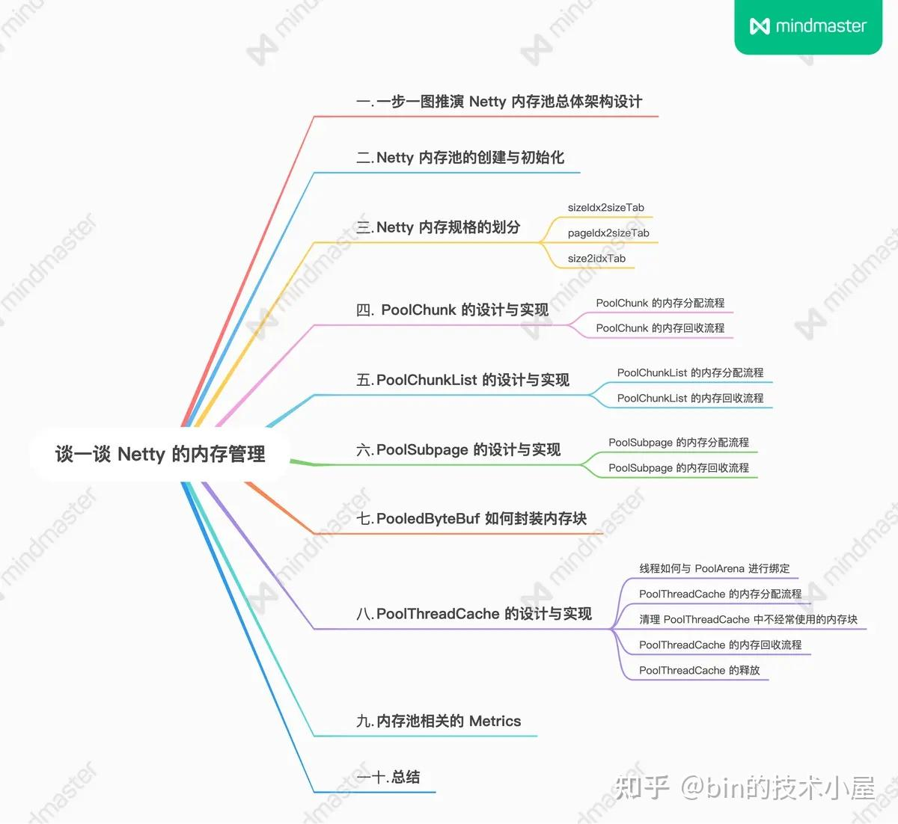

本文概要.png

## 1\. 一步一图推演 Netty 内存池总体架构设计

Netty 内存池的整体设计相对来说还是有那么一点点的复杂，其中涉及到了众多概念模型，每种模型在架构层面上承担着不同的职责，模型与模型之间又有着千丝万缕的联系，在面对一个复杂的系统设计时，我们还是按照老套路，从最简单的设计开始，一步一步的演进，直到还原出内存池的完整样貌。

因此在本小节中，笔者的着墨重点是在总体架构设计层面上，先把内存池涉及到的这些众多概念模型为大家梳理清晰，但并不会涉及太复杂的源码实现细节，让大家有一个整体完整的认识。有了这个基础，在本文后续的小节中，我们再来详细讨论源码的实现细节。

首先第一个登场的模型是 [PoolArena](https://zhida.zhihu.com/search?content_id=249631258&content_type=Article&match_order=1&q=PoolArena&zhida_source=entity) ， 它是内存池中最为重要的一个概念，整个内存管理的核心实现就是在这里完成的。

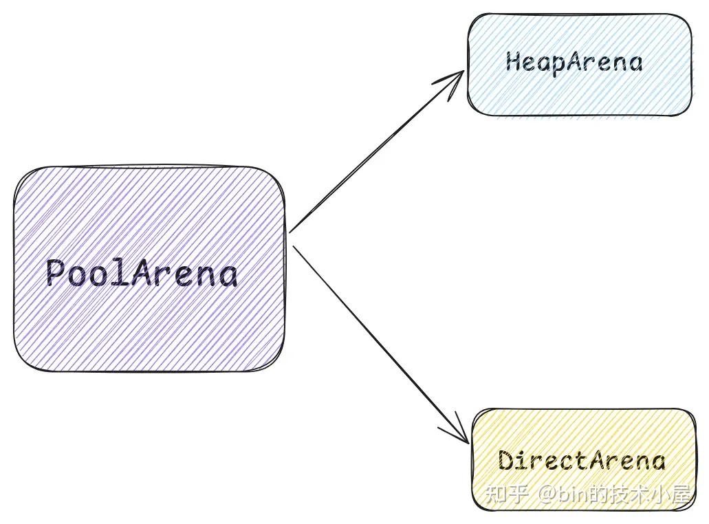

image.png

PoolArena 有两个实现，一个是 HeapArena，负责池化堆内内存，另一个是 [DirectArena](https://zhida.zhihu.com/search?content_id=249631258&content_type=Article&match_order=1&q=DirectArena&zhida_source=entity) ，负责池化堆外内存。和上篇文章一样，本文我们的重点还是在 Direct Memory 的 [池化](https://zhida.zhihu.com/search?content_id=249631258&content_type=Article&match_order=3&q=%E6%B1%A0%E5%8C%96&zhida_source=entity) 管理上，后续相关的源码实现，笔者都是以 DirectArena 进行展开。

我们可以直接把 PoolArena 当做一个内存池来看待，当线程在申请 PooledByteBuf 的时候都会到 PoolArena 中去拿。这样一来就引入一个问题，就是系统中有那么多的线程，而内存的申请又是非常频繁且重要的操作，这就导致这么多的线程频繁的去争抢这一个 PoolArena，相关锁的竞争程度会非常激烈，极大的影响了内存分配的速度。

因此 Netty 设计了多个 PoolArena 来分摊线程的竞争，将线程与 PoolArena 进行绑定来降低锁的竞争，提高内存分配的并行度。

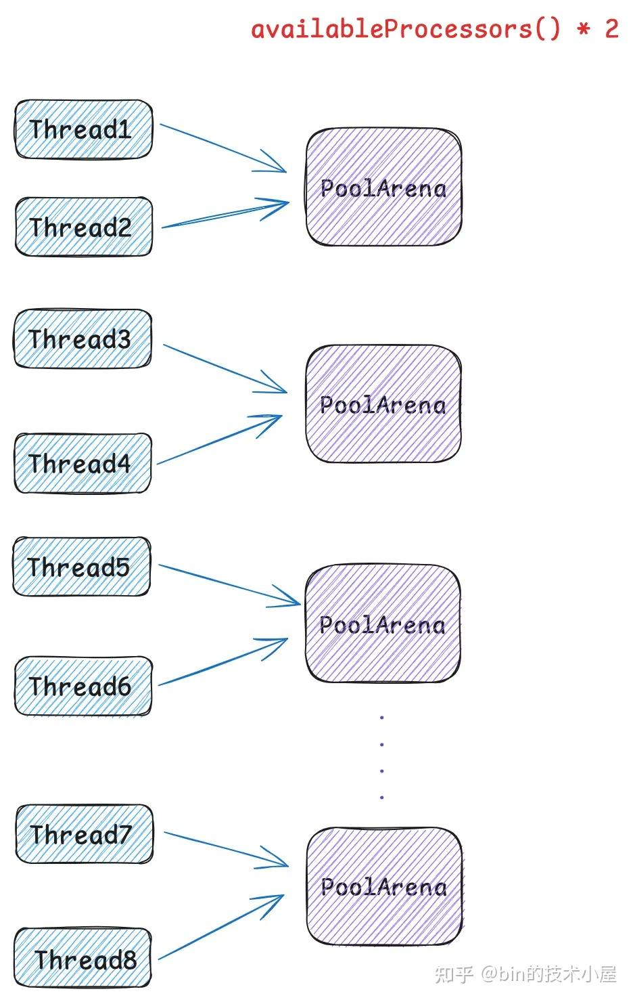

image.png

PoolArena 的默认个数为 `availableProcessors * 2`, 因为 Netty 中的 Reactor 线程个数默认恰好也是 CPU 核数的两倍，而内存的分配与释放在 Reactor 线程中是一个非常高频的操作，所以这里将 Reactor 线程与 PoolArena 一对一绑定起来，避免 Reactor 线程之间的相互竞争。

除此之外，我们还可以通过 `-Dio.netty.allocator.numHeapArenas` 以及 `-Dio.netty.allocator.numDirectArenas` 来调整系统中 HeapArena 和 DirectArena 的个数。

```
public class PooledByteBufAllocator {
    // 默认 HeapArena 的个数
    private static final int DEFAULT_NUM_HEAP_ARENA;
    // 默认 DirectArena 的个数
    private static final int DEFAULT_NUM_DIRECT_ARENA;
    static {
        // PoolArena 的默认个数为 availableProcessors * 2
        final int defaultMinNumArena = NettyRuntime.availableProcessors() * 2;
        DEFAULT_NUM_HEAP_ARENA = Math.max(0,
                SystemPropertyUtil.getInt(
                        "io.netty.allocator.numHeapArenas",
                        (int) Math.min(
                                defaultMinNumArena,
                                runtime.maxMemory() / defaultChunkSize / 2 / 3)));

        DEFAULT_NUM_DIRECT_ARENA = Math.max(0,
                SystemPropertyUtil.getInt(
                        "io.netty.allocator.numDirectArenas",
                        (int) Math.min(
                                defaultMinNumArena,
                                PlatformDependent.maxDirectMemory() / defaultChunkSize / 2 / 3)));
    }
}
```

但事实上，系统中的线程不光只有 Reactor 线程这一种，还有 FastThreadLocalThread 类型的线程，以及普通 Thread 类型的用户线程，位于 Reactor 线程之外的 FastThreadLocalThread ， UserThread 在运行起来之后会脱离 Reactor 线程自己单独向 PoolArena 来申请内存。

所以无论是什么类型的线程，在它运行起来之后，当第一次向内存池申请内存的时候，都会采用 `Round-Robin` 的方式与一个固定的 PoolArena 进行绑定，后续在线程整个生命周期中的内存申请以及释放等操作都只会与这个绑定的 PoolArena 进行交互。

所以线程与 PoolArena 的关系是多对一的关系，也就是说一个线程只能绑定到一个固定的 PoolArena 上，而一个 PoolArena 却可以被多个线程绑定。

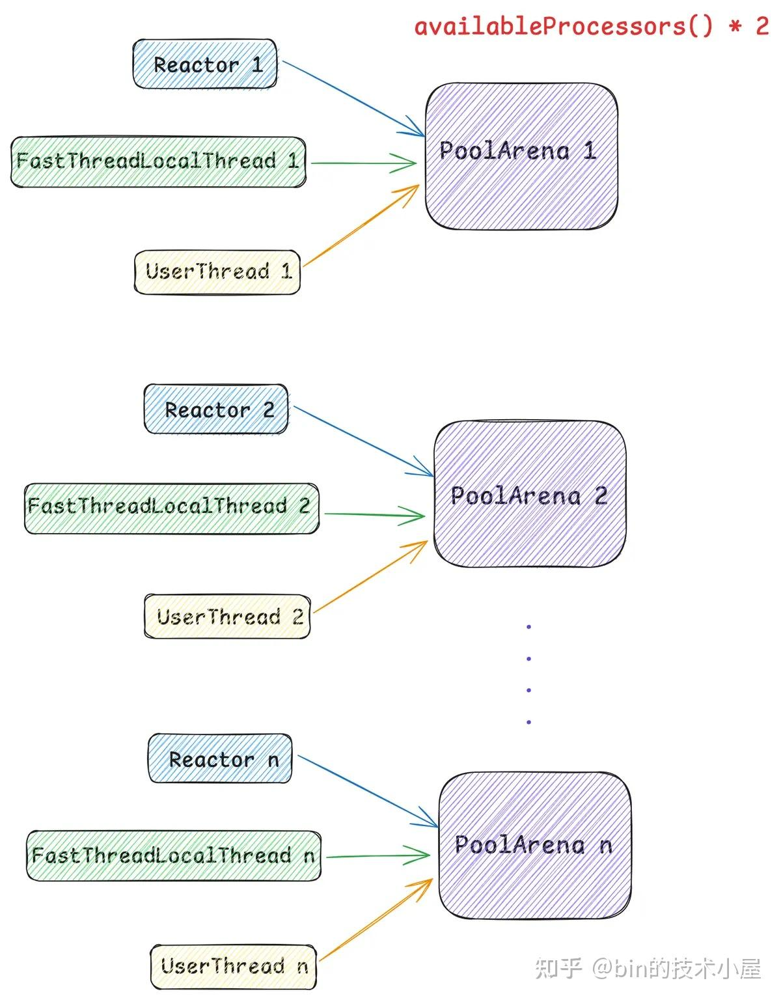

image.png

这样一来虽然线程与 PoolArena 产生了绑定，在很大程度上降低了竟争同一 PoolArena 的激烈程度，但仍然会存在竞争的情况。那这种微小的竞争会带来什么影响呢 ？

针对内存池的场景，比如现在有两个线程：Thread1 和 Thread2 ，它俩共同绑定到了同一个 PoolArena 上，Thread1 首先向 PoolArena 申请了一个内存块，并加载到运行它的 CPU1 L1 Cache 中，Thread1 使用完之后将这个内存块释放回 PoolArena。

假设此时 Thread2 向 PoolArena 申请同样尺寸的内存块，而且恰好申请到了刚刚被 Thread1 释放的内存块。注意，此时这个内存块已经在 CPU1 L1 Cache 中缓存了，运行 Thread2 的 CPU2 L1 Cache 中并没有，这就涉及到了 cacheline 的核间通信（MESI 协议相关），又要耗费几十个时钟周期。

为了极致的性能，我们能不能做到 [无锁化](https://zhida.zhihu.com/search?content_id=249631258&content_type=Article&match_order=1&q=%E6%97%A0%E9%94%81%E5%8C%96&zhida_source=entity) 呢 ？近一步把 cacheline 核间通信的这部分开销省去。

这就需要引入内存池的第二个模型 —— PoolThreadCache ，作为线程的 Thread Local 缓存，它用于缓存线程从 PoolArena 中申请到的内存块，线程每次申请内存的时候首先会到 PoolThreadCache 中查看是否已经缓存了相应尺寸的内存块，如果有，则直接从 PoolThreadCache 获取，如果没有，再到 PoolArena 中去申请。同理，线程每次释放内存的时候，也是先释放到 PoolThreadCache 中，而不会直接释放回 PoolArena 。

这样一来，我们通过为每个线程引入 Thread Local 本地缓存 —— PoolThreadCache，实现了内存申请与释放的无锁化，同时也避免了 cacheline 在多核之间的通信开销，极大地提升了内存池的性能。

但是这样又会引来一个问题，就是内存消耗太大了，系统中有那么多的线程，如果每个线程在向 PoolArena 申请内存的时候，我们都为它默认创建一个 PoolThreadCache 本地缓存的话，这一部分的内存消耗将会特别大。

因此为了近一步降低内存消耗又同时兼顾内存池的性能，在 Netty 的权衡之下，默认只会为 Reactor 线程以及 FastThreadLocalThread 类型的线程创建 PoolThreadCache，而普通的用户线程在默认情况下将不再拥有本地缓存。

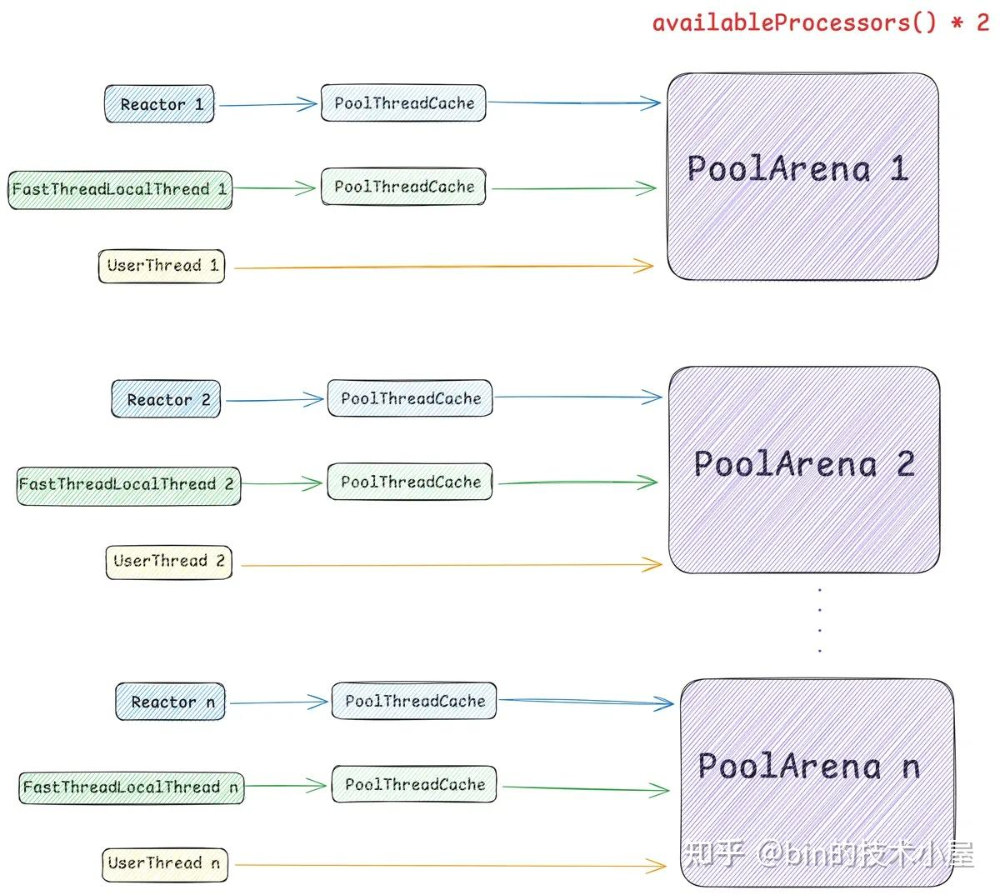

image.png

同时 Netty 也为此提供了一个配置选项 `-Dio.netty.allocator.useCacheForAllThreads`, 默认为 false 。如果我们将其配置为 true, 那么 Netty 默认将会为系统中的所有线程分配 PoolThreadCache 。

```
DEFAULT_USE_CACHE_FOR_ALL_THREADS = SystemPropertyUtil.getBoolean(
                "io.netty.allocator.useCacheForAllThreads", false);
```

好了，现在我们已经清楚了内存池的线程模型，那么接下来大家一定很好奇这个 PoolArena 里面到底长什么样子。 PoolArena 是内存池的核心实现，它里面管理了各种不同规格的内存块，PoolArena 的整个数据结构设计都是围绕着这些内存块的管理展开的。所以在拆解 PoolArena 之前，我们需要知道 Netty 内存池究竟划分了哪些规格的内存块

于是就引入了内存池的第三个模型 —— [SizeClasses](https://zhida.zhihu.com/search?content_id=249631258&content_type=Article&match_order=1&q=SizeClasses&zhida_source=entity) ，Netty 的内存池也是按照内存页 page 进行内存管理的，不过与 OS 不同的是，在 Netty 中一个 page 的大小默认为 8k，我们可以通过 `-Dio.netty.allocator.pageSize` 调整 page 大小，但最低只能调整到 4k，而且 pageSize 必须是 2 的次幂。

```
// 8k
int defaultPageSize = SystemPropertyUtil.getInt("io.netty.allocator.pageSize", 8192);
// 4K
private static final int MIN_PAGE_SIZE = 4096;
```

Netty 内存池最小的管理单位是 page, 而内存池单次向 OS 申请内存的单位是 Chunk，一个 Chunk 的大小默认为 4M。Netty 用一个 PoolChunk 的结构来管理这 4M 的内存空间。我们可以通过 `-Dio.netty.allocator.maxOrder` 来调整 chunkSize 的大小（默认为 4M），maxOrder 的默认值为 9 ，最大值为 14。

```
// 9
int defaultMaxOrder = SystemPropertyUtil.getInt("io.netty.allocator.maxOrder", 9);

// 8196 << 9 = 4M
final int defaultChunkSize = DEFAULT_PAGE_SIZE << DEFAULT_MAX_ORDER;

// 1G
private static final int MAX_CHUNK_SIZE = (int) (((long) Integer.MAX_VALUE + 1) / 2);
```

我们看到 ChunkSize 的大小是由 PAGE_SIZE 和 MAX_ORDER 共同决定的 —— `PAGE_SIZE << MAX_ORDER` ，当 pageSize 为 8K 的时候，chunkSize 最大不能超过 128M，无论 pageSize 配置成哪种大小，最大的 chunkSize 不能超过 1G。

Netty 在向 OS 申请到一个 PoolChunk 的内存空间（4M）之后，会通过 SizeClasses 近一步将这 4M 的内存空间切分成 68 种规格的内存块来进行池化管理。其中最小规格的内存块为 16 字节，最大规格的内存块为 4M 。也就是说，Netty 的内存池只提供如下 68 种内存规格来让用户申请。

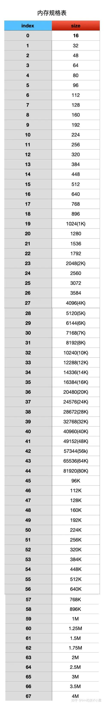

image.png

除此之外，Netty 又将这 68 种内存规格分为了三类：

1. \[16B, 28K\] 这段范围内的规格被划分为 **Small 规格** 。
2. \[32K, 4M\] 这段范围内的规格被划分为 **Normal 规格** 。
3. 超过 4M 的内存规格被划分为 **Huge 规格** 。
   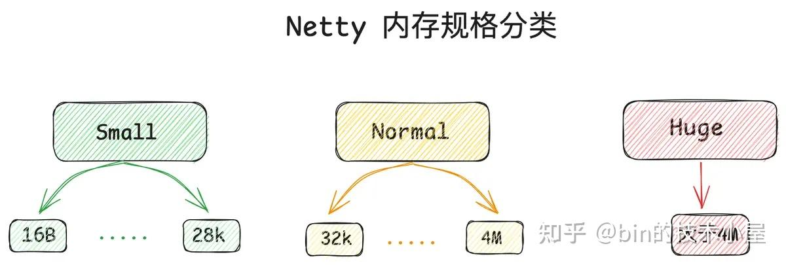

image.png

其中 Small 和 Normal 规格的内存块会被内存池（PoolArena）进行池化管理，Huge 规格的内存块不会被内存池管理，当我们向内存池申请 Huge 规格的内存块时，内存池是直接向 OS 申请内存，释放的时候也是直接释放回 OS ，内存池并不会缓存这些 Huge 规格的内存块。

```
abstract class PoolArena<T> {
    enum SizeClass {
        Small,
        Normal
    }
}
```


image.png

那么接下来的问题就是 Small 和 Normal 这两种规格的内存块在 PoolArena 中是如何被管理起来的呢 ？前面我们提到，在 Netty 内存池中，内存管理的基本单位是 Page, 一个 Page 的内存规格是 8K ，这个是内存管理的基础，而 Small ， Normal 这两种规格是在这个基础之上进行管理的。

所以我们首先需要弄清楚 Netty 是如何管理这些以 Page 为粒度的内存块的，这就引入了内存池的第四个模型 —— PoolChunk 。PoolChunk 的设计参考了 Linux 内核中的 [伙伴系统](https://zhida.zhihu.com/search?content_id=249631258&content_type=Article&match_order=1&q=%E4%BC%99%E4%BC%B4%E7%B3%BB%E7%BB%9F&zhida_source=entity) ，在内核中，内存管理的基本单位也是 Page（4K），这些 Page 会按照伙伴的形式被内核组织在伙伴系统中。

> 内核中的伙伴指的是大小相同并且在物理内存上连续的两个或者多个 page（个数必须是 2 的次幂）。

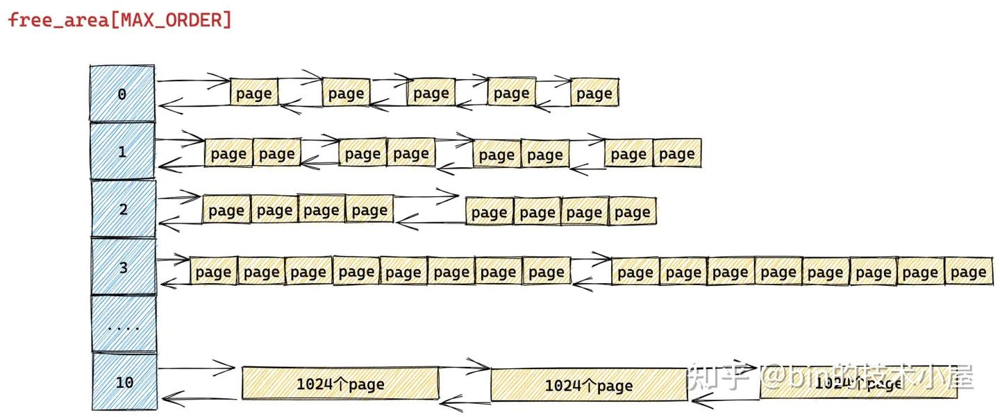

image.png

如上图所示，内核中伙伴系统的核心数据结构就是这个 struct free_area 类型的数组 —— free_area\[MAX_ORDER\]。

```
struct zone {
    // 伙伴系统的核心数据结构
    struct free_area    free_area[MAX_ORDER];
}
```

数组 free_area\[MAX_ORDER\] 中的索引表示的是分配阶 order，这个 order 用于指定对应 free_area 结构中组织管理的内存块包含多少个 page。比如 free_area\[0\] 中管理的内存块都是一个一个的 Page, free_area\[1\] 中管理的内存块尺寸是 2 个 Page ， free_area\[10\] 中管理的内存块尺寸为 1024 个 Page。

这些相同尺寸的内存块在 struct free_area 结构中是通过 struct list_head 结构类型的双向链表统一组织起来的。

```
struct free_area {
 struct list_head free_list[MIGRATE_TYPES];
};

struct list_head {
    // 双向链表
    struct list_head *next, *prev;
};
```

当我们向内核申请 2 ^ order 个 Page 的时候，内核首先会到伙伴系统中的 free_area\[order\] 对应的双向链表 free_list 中查看是否有空闲的内存块，如果有则从 free_list 将内存块摘下并分配出去，如果没有，则继续向上到 free_area\[order + 1\] 中去查找，反复这个过程，直到在 free_area\[order + n\] 中的 free_list 链表中找到空闲的内存块。

但是此时我们在 free_area\[order + n\] 链表中找到的空闲内存块的尺寸是 2 ^ (order + n) 大小，而我们需要的是 2 ^ order 尺寸的内存块，于是内核会将这 2 ^ (order + n) 大小的内存块逐级减半分裂，将每一次分裂后的内存块插入到相应的 free_area 数组里对应的 free_list 链表中，并将最后分裂出的 2 ^ order 尺寸的内存块分配给进程使用。

假设我们现在要向下图中的伙伴系统申请一个 Page (对应的分配阶 order = 0)，那么内核会在伙伴系统中首先查看 order = 0 对应的空闲链表 free_area\[0\] 中是否有空闲内存块可供分配。

如果没有，内核则会根据前边介绍的内存分配逻辑，继续升级到 free_area\[1\], free_area\[2\] 链表中寻找空闲内存块，直到查找到 free_area\[3\] 发现有一个可供分配的内存块。这个内存块中包含了 8 个 连续的空闲 page。

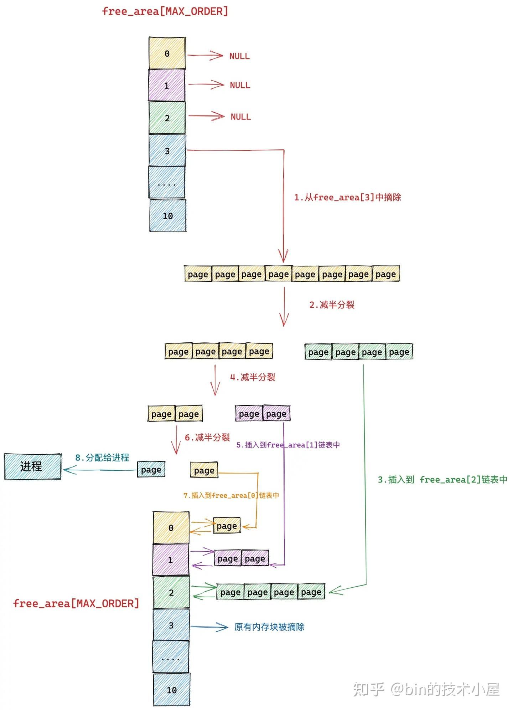

image.png

随后内核会将 free_area\[3\] 中的这个空闲内存块从链表中摘下，然后减半分裂成两个内存块，分裂出来的这两个内存块分别包含 4 个 page（分配阶 order = 2）。将第二个内存块（图中绿色部分，order = 2），插入到 free_rea\[2\] 链表中。

第一个内存块（图中黄色部分，order = 2）继续减半分裂，分裂出来的这两个内存块分别包含 2 个 page（分配阶 order = 1）。如上图中第 4 步所示，前半部分为黄色，后半部分为紫色。同理按照前边的分裂逻辑，内核会将后半部分内存块（紫色部分，分配阶 order = 1）插入到 free_area\[1\] 链表中。

前半部分（图中黄色部分，order = 1）在上图中的第 6 步继续减半分裂，分裂出来的这两个内存块分别包含 1 个 page（分配阶 order = 0），前半部分为青色，后半部分为黄色。后半部分插入到 frea_area\[0\] 链表中，前半部分返回给进程，以上就是内核中伙伴系统的内存分配过程。

下面我们继续来回顾一下内核伙伴系统的内存回收过程，当我们向内核释放 2 ^ order 个 Page 的时候，内核首先会检查 free_area\[order\] 对应的 free_list 中是否有与我们要释放的内存块在内存地址上连续的空闲内存块，如果有地址连续的内存块，则将两个内存块进行合并，然后在到上一级 free_area\[order + 1\] 中继续查找是否有空闲内存块与合并之后的内存块在地址上连续，如果有则继续重复上述过程向上合并，如果没有，则将合并之后的内存块插入到 free_area\[order + 1\] 中。

假设我们现在需要将一个编号为 10 的 Page 释放回下图所示的伙伴系统中，连续的编号表示内存地址连续。首先内核会在 free_area\[0\] 中发现有一个空闲的内存块 page11 与要释放的 page10 连续，于是将两个连续的内存块合并，合并之后的内存块的分配阶 order = 1。

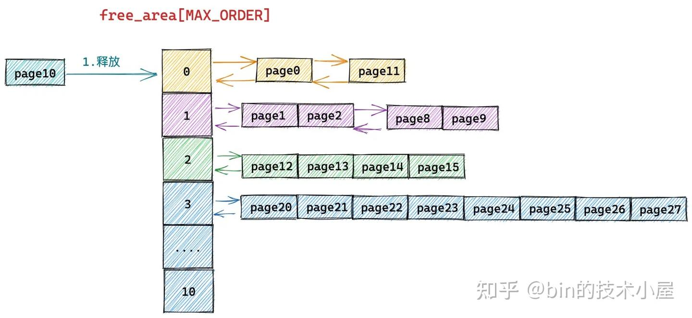

image.png

随后内核在 free_area\[1\] 中发现 page8 和 page9 组成的内存块与 page10 和 page11 合并后的内存块是伙伴，于是继续将这两个内存块（分配阶 order = 1）继续合并成一个新的内存块（分配阶 order = 2）。随后内核会在 free_area\[2\] 中查找新合并后的内存块伙伴。

接着内核在 free_area\[2\] 中发现 page12，page13，page14，page15 组成的内存块与 page8，page9，page10，page11 组成的新内存块是伙伴，于是将它们从 free_area\[2\] 上摘下继续合并成一个新的内存块（分配阶 order = 3），随后内核会在 free_area\[3\] 中查找新内存块的伙伴。

但在 free_area\[3\] 中的内存块（page20 到 page 27）与新合并的内存块（page8 到 page15）虽然大小相同但是物理上并不连续，所以它们不是伙伴，不能在继续向上合并了。于是内核将 page8 到 pag15 组成的内存块（分配阶 order = 3）插入到 free_area\[3\] 中，整个伙伴系统回收内存的过程如下如所示：

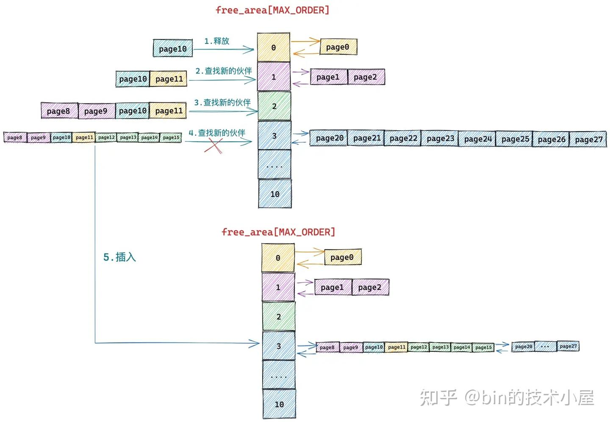

image.png

现在我们已经清楚了伙伴系统在 Linux 内核中的实现，那么同样是对 Page 的管理，Netty 中的 PoolChunk 也是一样，它的实现和内核中的伙伴系统非常相似。PoolChunk 也有一个数组 runsAvail。

```
final class PoolChunk<T> implements PoolChunkMetric {
    // Netty 的伙伴系统结构
    private final IntPriorityQueue[] runsAvail;
}
```

和内核中的 free_area 数组一样，它们里面都保存了不同 Page 级别的内存块，不一样的是内核中的伙伴系统一共只有 11 个 Page 级别的内存块尺寸，分别是： 1 个 Page ， 2 个 Page ， 4 个 Page，8 个 Page 一直到 1024 个 Page。内存块的尺寸必须是 2 的次幂个 Page。

Netty 中的伙伴系统一共有 32 个 Page 级别的内存块尺寸，这一点我们可以从前面介绍的 SizeClasses 计算出来的内存规格表看得出来。PoolChunk 中管理的这些 Page 级别的内存块尺寸只要是 Page 的整数倍就可以，而不是内核中要求的 2 的次幂个 Page。

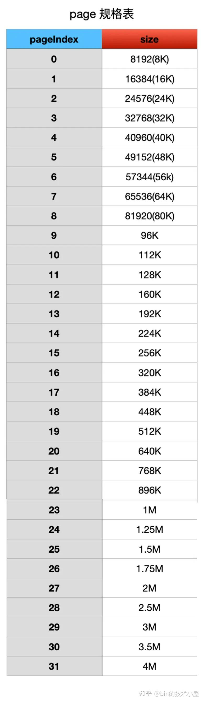

image.png

因此 runsAvail 数组中一共有 32 个元素，数组下标就是上图中的 pageIndex ， 数组类型为 IntPriorityQueue（优先级队列），数组中的每一项存储着所有相同 size 的内存块，这里的 size 就是上图中 pageIndex 对应的 size 。

比如 runsAvail\[0\] 中存储的全部是单个 Page 的内存块，runsAvail\[1\] 中存储的全部是尺寸为 2 个 Page 的内存块，runsAvail\[2\] 中存储的全部是尺寸为 3 个 Page 的内存块，runsAvail\[31\] 中存储的是尺寸为 512 个 Page 的内存块。

> Netty 中的一个 Page 是 8k

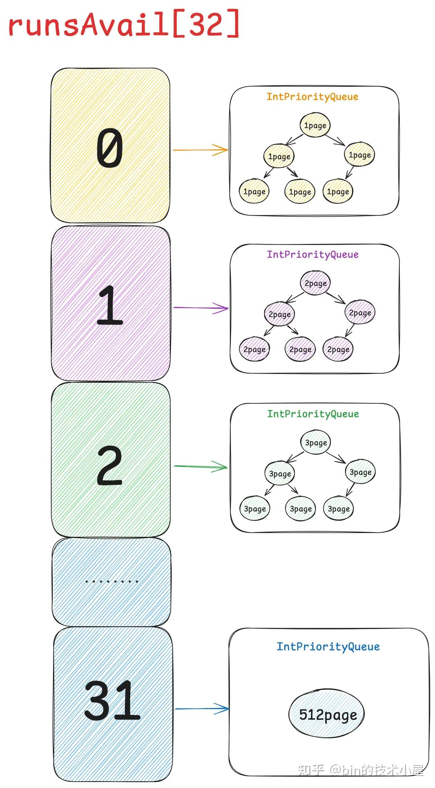

image.png

PoolChunk 可以看做是 Netty 中的伙伴系统，内存的申请和释放过程和内核中的伙伴系统非常相似，当我们向 PoolChunk 申请 Page 级别的内存块时，Netty 首先会从上面的 Page 规格表中获取到内存块尺寸对应的 pageIndex，然后到 runsAvail\[pageIndex\] 中去获取对应尺寸的内存块。

如果没有空闲内存块，Netty 的处理方式也是和内核一样，逐级向上去找，直到在 runsAvail\[pageIndex + n\] 中找到内存块。然后从这个大的内存块中将我们需要的内存块尺寸切分出来分配，剩下的内存块直接插入到对应的 `runsAvail[剩下的内存块尺寸 index]` 中，并不会像内核那样逐级减半分裂。

PoolChunk 的内存块回收过程则和内核一样，回收的时候会将连续的内存块合并成更大的，直到无法合并为止。最后将合并后的内存块插入到对应的 `runsAvail[合并后内存块尺寸 index]` 中。

Netty 这里还有一点和内核不一样的是，内核的伙伴系统是使用 `struct free_area` 结构来组织相同尺寸的内存块，它是一个双向链表的结构，每次向内核申请 Page 的时候，都是从 free_list 的头部获取内存块。释放的时候也是讲内存块插入到 free_list 的头部。这样一来我们总是可以获取到刚刚被释放的内存块，局部性比较好。

但 Netty 的伙伴系统采用的是 IntPriorityQueue ，一个优先级队列来组织相同尺寸的内存块，它会按照内存地址从低到高组织这些内存块，我们每次从 IntPriorityQueue 中获取的都是内存地址最低的内存块。Netty 这样设计的目的主要还是为了降低内存碎片，牺牲一定的局部性。

这里牺牲掉局部性是 OK 的，因为在 PoolChunk 的设计中，Netty 更加注重内存碎片的大小，PoolChunk 主要提供 Page 级别内存块的申请，Normal 规格 —— \[32K, 4M\] 的内存块就是从 PoolChunk 中直接申请的。为了使 PoolChunk 这段 4M 的内存空间中内存碎片尽量的少，所以我们每次向 PoolChunk 申请 Page 级别内存块的时候，总是从低内存地址开始有序的申请。

而在 Netty 的应用场景中，往往频繁申请的都是那些小规格的内存块，针对这种频繁使用的 Small 规格的内存块，Netty 在设计上就必须要保证局部性，因为这块是热点，所以性能的考量是首位。

而 Normal 规格的大内存块，往往不会那么频繁的申请，所以在 PoolChunk 的设计上，内存碎片的考量是首位。

现在我们知道了 Normal 规格的内存块是在 PoolChunk 中管理的，而 PoolChunk 的模型设计我们也清楚了，那 Small 规格的内存块在哪里管理呢 ？这就需要引入内存池的第五个模型 —— PoolSubpage 。

还是一样的套路，遇事不决问内核！！ 由于都是针对 Page 级别内存块的管理，所以 PoolChunk 的设计参考了内核的伙伴系统，那么针对小内存块的管理，PoolSubpage 自然也会参考内核中的 slab cache 。所以 PoolSubpage 可以看做是 Netty 中的 slab 。

对内核 slab 的设计实现细节感兴趣的读者可以回看下笔者之前专门介绍 slab 的文章 —— [《细节拉满，80 张图带你一步一步推演 slab 内存池的设计与实现》](https://link.zhihu.com/?target=https%3A//mp.weixin.qq.com/s%3F__biz%3DMzg2MzU3Mjc3Ng%3D%3D%26mid%3D2247488319%26idx%3D1%26sn%3D062b7b4e9521bdc6e7050f78229a6cd4%26chksm%3Dce77d578f9005c6e2beb3d60a147c2927542c7e5ebd281e6af2f63d70ffde79322ca634142cb%26scene%3D178%26cur_album_id%3D2559805446807928833%23rd) 。由于篇幅的关系，笔者这里就不再详细介绍内核中的 slab 了，我们直接从 PoolSubpage 这个模型的设计开始聊起，思想都是一样的。

通过前面的介绍我们知道，PoolChunk 承担的是 Page 级别内存块的管理工作，在 Netty 内存池的整个架构设计上属于最底层的模型，它是一个基座，为整个内存池提供最基础的内存分配能力，分配粒度按照 Page 进行。

但在 Netty 的实际应用场景中，往往使用最频繁的是 Small 规格的内存块 —— \[16B, 28K\] 。我们不可能每申请一个 Small 规格的内存块（比如 16 字节）都要向 PoolChunk 去获取一个 Page（8K），这样内存资源的浪费是非常可观的。

所以 Netty 借鉴了 Linux 内核中 Slab 的设计思想，当我们第一次申请一个 Small 规格的内存块时，Netty 会首先到 PoolChunk 中申请一个或者若干个 Page 组成的大内存块（Page 粒度），这个大内存块在 Netty 中的模型就是 PoolSubpage 。然后按照对应的 Small 规格将这个大内存块切分成多个尺寸相同的小内存块缓存在 PoolSubpage 中。

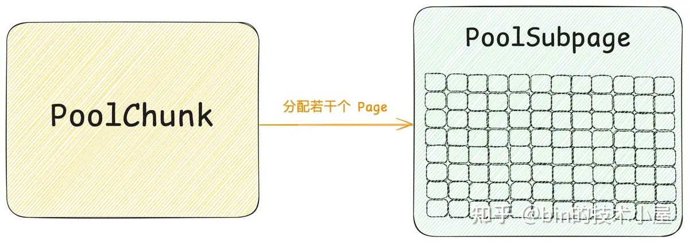

image.png

每次申请这个规格的内存块时，Netty 都会到对应尺寸的 PoolSubpage 中去获取，每次释放这个规格的内存块时，Netty 会直接将其释放回对应的 PoolSubpage 中。而且每次申请 Small 规格的内存块时，Netty 都会优先获取刚刚释放回 PoolSubpage 的内存块，保证了局部性。当 PoolSubpage 中缓存的所有内存块全部被释放回来后，Netty 就会将整个 PoolSubpage 重新释放回 PoolChunk 中。

比如当我们首次向 Netty 内存池申请一个 16 字节的内存块时，首先会从 PoolChunk 中申请 1 个 Page（8K），然后包装成 PoolSubpage 。随后会将 PoolSubpage 中的这 8K 内存空间切分成 512 个 16 字节的小内存块。 后续针对 16 字节小内存块的申请和释放就都只会和这个 PoolSubpage 打交道了。

当我们第一次申请 28K 的内存块时，由于它也是 Small 规格的尺寸，所以按照相同的套路，Netty 会首先从 PoolChunk 中申请 7 个 Pages（56K）, 然后包装成 PoolSubpage。随后会将 PoolSubpage 中的这 56K 内存空间切分成 2 个 28K 的内存块。

> PoolSubpage 的尺寸是内存块的尺寸与 PageSize 的最小公倍数。

每当一个 PoolSubpage 分配完之后，Netty 就会重新到 PoolChunk 中申请一个新的 PoolSubpage 。这样一来，慢慢的，针对某一种特定的 Small 规格，就形成了一个 PoolSubpage 链表，这个链表是一个双向循环链表，如下图所示：

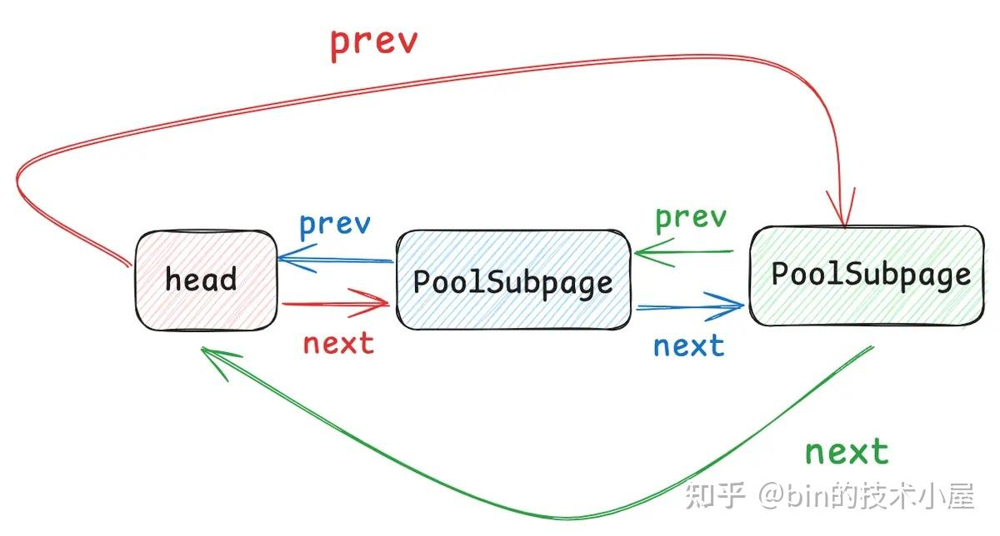

image.png

在 Netty 中，每一个 Small 规格尺寸都会对应一个这样的 PoolSubpage 双向循环链表，内存池中一共设计了 39 个 Small 规格尺寸 —— \[16B, 28k\]，所以也就对应了 39 个这样的 PoolSubpage 双向循环链表，形成一个 PoolSubpage 链表数组 —— smallSubpagePools，它是内存池中管理 Small 规格内存块的核心数据结构。

```
abstract class PoolArena<T> {
  // 管理 Small 规格内存块的核心数据结构
  final PoolSubpage<T>[] smallSubpagePools;
}
```

smallSubpagePools 数组的下标就是对应的 Small 规格在 SizeClasses 内存规格表中的 index 。

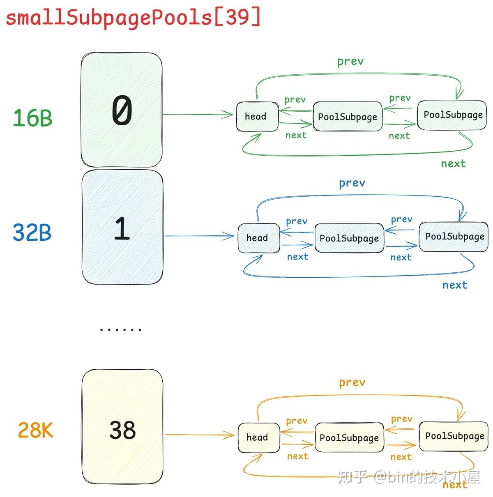

image.png

这个设计也是参考了内核中的 kmalloc 体系，内核中的 kmalloc 也是用一个数组来组织不同尺寸的 slab, 只不过和 Netty 不同的是，kmalloc 支持的小内存块尺寸在 8 字节到 8K 之间。

```
struct kmem_cache *
kmalloc_caches[NR_KMALLOC_TYPES][KMALLOC_SHIFT_HIGH + 1]；
```

这里的 smallSubpagePools 就相当于是内核中的 kmalloc，关于 kmalloc 的设计与实现细节感兴趣的读者可以回看下笔者之前的文章 —— [《深度解读 Linux 内核级通用内存池 —— kmalloc 体系》](https://link.zhihu.com/?target=https%3A//mp.weixin.qq.com/s%3F__biz%3DMzg2MzU3Mjc3Ng%3D%3D%26mid%3D2247488377%26idx%3D1%26sn%3D2d47392069f0de27de4dd6068e95b316%26chksm%3Dce77d53ef9005c280330f7f2a3f8b5c8e82cf91283737e7f6cf8a7d983ed2423d3247a26b241%26scene%3D178%26cur_album_id%3D2559805446807928833%23rd) 。

好了，到现在我们已经清楚了，Netty 内存池是如何管理 Small 规格以及 Normal 规格的内存块了。根据目前我们掌握的信息和场景可以得出内存池 —— PoolArena 的基本骨架，如下图所示：

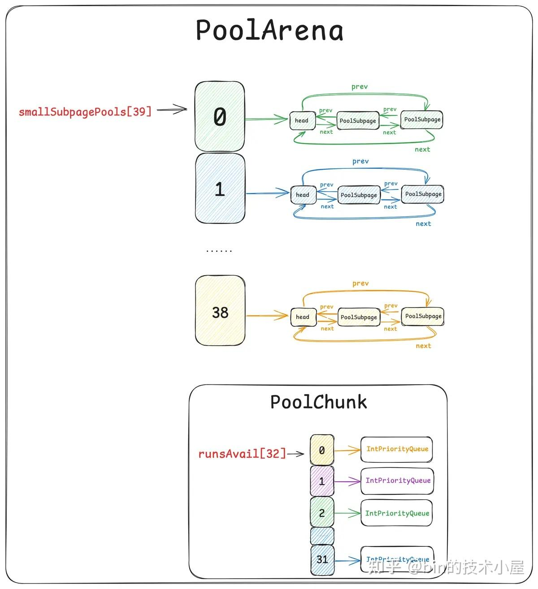

image.png

但这还不是 PoolArena 的完整样貌，如果 PoolArena 中只有一个 PoolChunk 的话肯定是远远不够的，因为 PoolChunk 总会有全部分配完毕的那一刻，这时 Netty 就不得不在次向 OS 申请一个新的 PoolChunk （4M），这样一来，随着时间的推移 ，PoolArena 中就会有多个 PoolChunk，那么这些 PoolChunk 在内存池中是如何被组织管理的呢 ？ 这就引入了内存池的第六个模型 —— PoolChunkList 。

PoolChunkList 是一个双向链表的数据结构，它用来组织和管理 PoolArena 中的这些 PoolChunk。

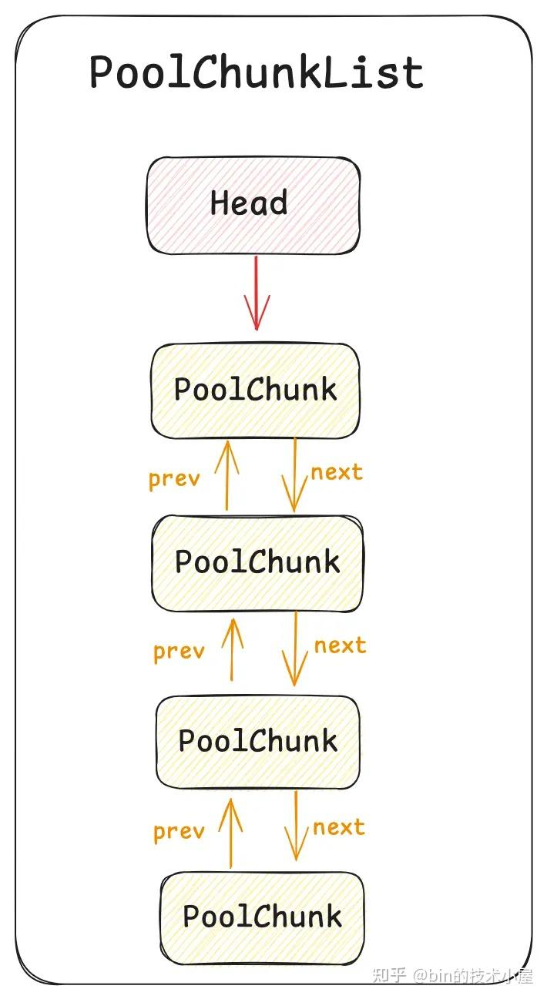

image.png

但事实上，对于 PoolArena 中的这些众多 PoolChunk 来说，可能不同 PoolChunk 它们的内存使用率都是不一样的，于是 Netty 又近一步根据 PoolChunk 的内存使用率设计出了 6 个 PoolChunkList 。每个 PoolChunkList 管理着内存使用率在一定范围内的 PoolChunk。

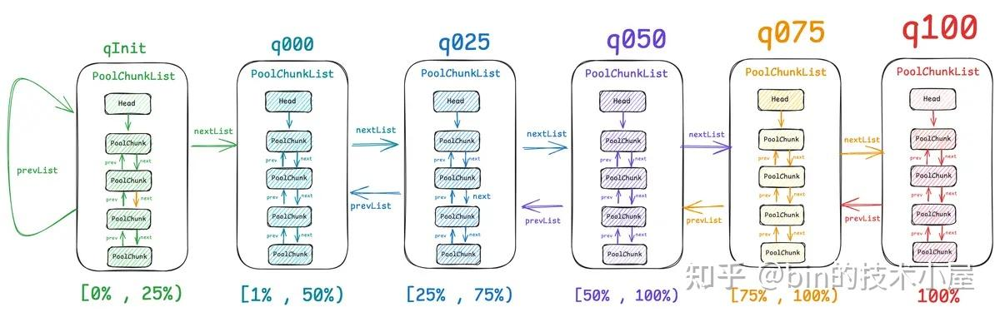

image.png

如上图所示，PoolArena 中一共有 6 个 PoolChunkList，分别是：qInit，q000，q025，q050，q075，q100。它们之间通过一个双向链表串联在一起，每个 PoolChunkList 管理着内存使用率在相同范围内的 PoolChunk ：

- qInit 顾名思义，当一个新的 PoolChunk 被创建出来之后，它就会被放到 qInit 中，该 PoolChunkList 管理的 PoolChunk 内存使用率在 \[0%, 25%) 之间，当里边的 PoolChunk 内存使用率大于等于 25% 时，就会被向后移动到下一个 q000 中。
- q000 管理的 PoolChunk 内存使用率在 \[1%, 50%) 之间，当里边的 PoolChunk 内存使用率大于等于 50% 时，就会被向后移动到下一个 q025 中。当里边的 PoolChunk 内存使用率小于 1% 时，PoolChunk 就会被重新释放回 OS 中。因为 ChunkSize 是 4M ，Netty 内存池提供的最小内存块尺寸为 16 字节，当 PoolChunk 内存使用率小于 1% 时， 其实内存使用率已经就是 0% 了，对于一个已经全部释放完的 Empty PoolChunk，就需要释放回 OS 中。
- q025 管理的 PoolChunk 内存使用率在 \[25%, 75%) 之间，当里边的 PoolChunk 内存使用率大于等于 75% 时，就会被向后移动到下一个 q050 中。当里边的 PoolChunk 内存使用率小于 25% 时，就会被向前移动到上一个 q000 中。
- q050 管理的 PoolChunk 内存使用率在 \[50%, 100%) 之间，当里边的 PoolChunk 内存使用率小于 50% 时，就会被向前移动到上一个 q025 中。当里边的 PoolChunk 内存使用率达到 100% 时，直接移动到 q100 中。
- q075 管理的 PoolChunk 内存使用率在 \[75%, 100%) 之间，当里边的 PoolChunk 内存使用率小于 75% 时，就会被向前移动到上一个 q050 中。当里边的 PoolChunk 内存使用率达到 100% 时，直接移动到 q100 中。
- q100 管理的全部都是内存使用率 100 % 的 PoolChunk，当有内存释放回 PoolChunk 之后，才会向前移动到 q075 中。

从以上内容中我们可以看出，PoolArena 中的每一个 PoolChunkList 都规定了其中 PoolChunk 的内存使用率的上限和下限，当某个 PoolChunkList 中的 PoolChunk 内存使用率低于规定的下限时，Netty 首先会将其从当前 PoolChunkList 中移除，然后移动到前一个 PoolChunkList 中。

当 PoolChunk 的内存使用率达到规定的上限时，Netty 会将其移动到下一个 PoolChunkList 中。但这里有一个特殊的设计不知大家注意到没有，就是 q000 它的 prevList 指向 NULL, 也就是说当 q000 中的 PoolChunk 内存使用率低于下限 —— 1% 时，这个 PoolChunk 并不会向前移动到 qInit 中，而是会释放回 OS 中。

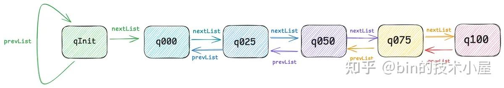

image.png

qInit 的 prevList 指向的是它自己，也就是说，当 qInit 中的 PoolChunk 内存使用率为 0 % 时，这个 PoolChunk 并不会释放回 OS, 反而是继续留在 qInit 中。 **那为什么 q000 中的 PoolChunk 内存使用率低于下限时会释放回 OS ？而 qInit 中的 PoolChunk 反而要继续留在 qInit 中呢** ？

PoolArena 中那些刚刚新被创建出来的 PoolChunk 首先会被 Netty 添加到 qInit 中，如果该 PoolChunk 的内存使用率一直稳定在 0% 到 25% 之间的话，那么它将会一直停留在 qInit 中，直到内存使用率达到 25% 才会被移动到下一个 q000 中。

如果内存使用不那么频繁，PoolChunk 的内存使用率会慢慢的降到 0% ， 但是此时我们不能释放它，而是应该让它继续留在 qInit 中，因为如果一旦释放，下一次需要内存的时候还需要在重新创建 PoolChunk，所以为了避免 PoolChunk 的重复创建，我们需要保证内存池 PoolArena 中始终至少有一个 PoolChunk 可用。

如果内存使用比较频繁，q000 中的 PoolChunk 内存使用率会慢慢达到 50% ，随后它会被移动到下一个 q025 中，随着内存使用率越来越高，达到 75% 之后，它又会被移动到 q050 中，随着内存继续的频繁申请，最终 PoolChunk 被移动了 q100 中。

在内存频繁使用的场景下，这个 PoolChunk 大概率会一直停留在 q050 或者 q075 中，但如果随着内存使用的热度降低，PoolChunk 会慢慢的向前移动直到进入到 q000 ， 这时如果内存还在持续释放，那么这个 PoolChunk 的内存使用率慢慢的就会低于 1% 。

这种情况下，Netty 就会认为此时内存的申请并不频繁，没必要让它一直停留在内存池中，直接将它释放回 OS 就好。用的多了我就多存点，用的少了我就少存点，减少内存池带来的不必要内存消耗。

以上是笔者要为大家介绍的 Netty 针对 PoolChunkList 的第一个设计，下面我们继续来看第二个设计，当我们向内存池 PoolArena 申请内存的时候，进入到 PoolArena 内部之后，就会发现，我们同时面对的是 5 个都可提供内存分配的 PoolChunkList，它们分别是 qInit \[0%, 25%) ，q000 \[1%, 50%)，q025 \[25%, 75%)，q050 \[50%, 100%) ，q075 \[75%, 100%) 。 **那我们到底该选择哪个 PoolChunkList 进行内存分配呢 ？ 也就是说这五个 PoolChunkList 的优先级我们该如何抉择** ？

Netty 选择的内存分配顺序是： `q050 > q025 > q000 > qInit > q075`, 那为什么这样设计呢 ？

```
abstract class PoolArena<T> {
    // 分配 Page 级别的内存块
    private void allocateNormal(PooledByteBuf<T> buf, int reqCapacity, int sizeIdx, PoolThreadCache threadCache) {
        assert lock.isHeldByCurrentThread();
        // PoolChunkList 内存分配的优先级：q050 > q025 > q000 > qInit > q075
        if (q050.allocate(buf, reqCapacity, sizeIdx, threadCache) ||
            q025.allocate(buf, reqCapacity, sizeIdx, threadCache) ||
            q000.allocate(buf, reqCapacity, sizeIdx, threadCache) ||
            qInit.allocate(buf, reqCapacity, sizeIdx, threadCache) ||
            q075.allocate(buf, reqCapacity, sizeIdx, threadCache)) {
            return;
        }

        // 5 个 PoolChunkList 中没有可用的 PoolChunk，重新向 OS 申请一个新的 PoolChunk（4M）
        PoolChunk<T> c = newChunk(sizeClass.pageSize, sizeClass.nPSizes, sizeClass.pageShifts, sizeClass.chunkSize);
        // 从新的 PoolChunk 中分配内存
        boolean success = c.allocate(buf, reqCapacity, sizeIdx, threadCache);
        assert success;
        // 将刚刚创建的 PoolChunk 加入到 qInit 中
        qInit.add(c);
    }
}
```

这里有四点核心设计原则需要考虑：

1. Netty 需要尽量控制内存的消耗，尽可能用少量的 PoolChunk 满足大量的内存分配需求，避免创建新的 PoolChunk，提高每个 PoolChunk 的内存使用率。
2. 而对于现有的 PoolChunk 来说，Netty 则需要尽量避免将其回收，让它的服务周期尽可能长一些。
3. 在此基础之上，Netty 需要兼顾内存分配的性能。
4. Netty 需要在内存池的整个生命周期中，从总体上做到让 PoolArena 中的这些 PoolChunk 尽量均衡地承担内存分配的工作，做到雨露均沾。

那么 Netty 采用这样的分配顺序 —— `q050 > q025 > q000 > qInit > q075` ，如何保证上述四点核心设计原则呢 ？

首先前面我们已经分析过了，在内存频繁使用的场景中，内存池 PoolArena 中的 PoolChunks 大概率会集中停留在 q050 和 q075 这两个 PoolChunkList 中。由于 q050 和 q075 中集中了大量的 PoolChunks，所以我们肯定会先从这两个 PoolChunkList 查找，一下子就能找到一个 PoolChunk，保证了第三点原则 —— 内存分配的性能。

而 q075 中的 PoolChunk 内存使用率已经很高了，在 75% 到 100% 之间，很可能容量不能满足内存分配的需求导致申请内存失败，所以我们优先从 q050 开始。

由于 q050 \[50%, 100%) 中同样集中了大量的 PoolChunks，优先从 q050 开始分配可以做到尽可能的使用现有的 PoolChunk，避免了这些 PoolChunk 由于长期不被使用而被释放回 OS, 保证了第二点设计原则。

当 q050 中没有 PoolChunk 时， **同样是根据第二点设计原则，Netty 需要尽量优先选择内存使用率高的 PoolChunk** ，所以优先从 q025 \[25%, 75%) 进行分配。q025 中没有则优先从 q000 \[1%, 50%) 中分配，尽量避免 PoolChunk 的回收。

当 q000 中没有 PoolChunk 时，那说明此时内存池中的内存容量已经不太够了，但是根据第一点设计原则，在这种情况下，仍然需要避免创建新的 PoolChunk，所以下一个优先选择的 PoolChunkList 应该是 qInit \[0%, 25%) ，而前面我们也介绍过了，Netty 设计 qInit 的目的就是为了避免频繁创建不必要的 PoolChunk。

当 qInit 没有 PoolChunk 时，仍然不会贸然创建新的 PoolChunk，而是到 q075 中去寻找 PoolChunk 。之所以最后才轮到 q075，这是为了保证第四点设计原则，因为 q075 中的内存使用率已经很高了，为了总体上保证 PoolChunk 均衡地承担内存分配的工作，所有优先到其他内存使用率相对较低的 PoolChunkList 中分配。

以上是笔者要为大家介绍的 Netty 针对 PoolChunkList 的第二个设计，下面我们接着来看第三个设计。大家可能注意到，PoolArena 中的这六个 PoolChunkList 在内存使用率区间的设计上有很多重叠的部分，比如内存使用率是 30% 的 PoolChunk 既可以在 q000 中也可以在 q025 中，55% 既可以在 q025 中也可以在 q050 中， **Netty 为什么要将 PoolChunkList 的内存使用率区间设计成这么多的重叠区间 ？ 为什么不设计成恰好连续衔接的区间呢** ？

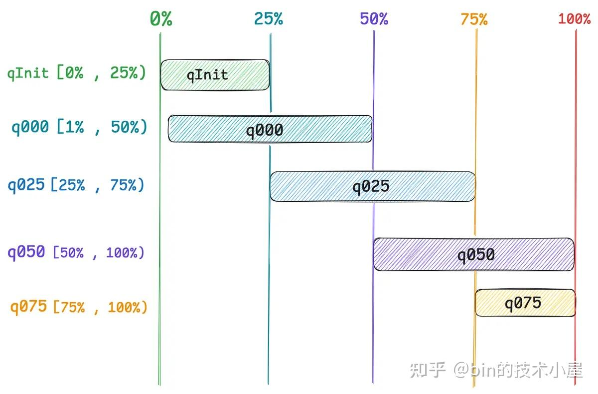

image.png

我们可以反过来思考一下，假如 Netty 将 PoolChunkList 的内存使用率区间设计成恰好连续衔接的区间，那么会发生什么情况 ？

我们现在拿 q025 和 q050 这两个 PoolChunkList 举例说明，假设现在我们将 q025 的内存使用率区间设计成 \[25%, 50%), q050 的内存使用率区间设计成 \[50%, 75%)，这样一来，q025 ， q050 ， q075 这三个 PoolChunkList 的内存使用率区间的上限和下限就是恰好连续衔接的了。

那么随着 PoolChunk 中内存的申请与释放，会导致 PoolChunk 的内存使用率在不断的发生变化，假设现在有一个 PoolChunk 的内存使用率是 45% ，当前停留在 q025 中，当分配内存之后，内存使用率上升至 50% ，那么该 PoolChunk 就需要立即移动到 q050 中。

当释放内存之后，这个刚刚移动到 q050 中的 PoolChunk，它的内存使用率下降到 49% ，那么又会马不停蹄地移动到 q025 ， **也就是说只要这个 PoolChunk 的内存使用率在 q025 与 q050 的交界处 50% 附近来回徘徊的话，每次的内存申请与释放都会导致这个 PoolChunk 在 q025 与 q050 之间不停地来回移动** 。

同样的道理，只要一个 PoolChunk 的内存使用率在 75% 左右来回徘徊的话，那么每次内存的申请与释放也都会导致这个 PoolChunk 在 q050 与 q075 之间不停地来回移动，这样会造成一定的性能下降。

但是如果各个 PoolChunkList 之间的内存使用率区间设计成重叠区间的话，那么 PoolChunk 的可调节范围就会很广，不会频繁地在前后不同的 PoolChunkList 之间来回移动。

我们还是拿 q025 \[25%, 75%) 和 q050 \[50%, 100%) 来举例说明，现在 q025 中有一个内存使用率为 45% 的 PoolChunk ， 当分配内存之后，内存使用率上升至 50% ，该 PoolChunk 仍然会继续停留在 q025 中，后续随着内存分配的不断进行，当内存使用率达到 75% 的时候才会移动到 q050 中。

还是这个 PoolChunk ， 当释放内存之后，PoolChunk 的使用率下降到了 70%，那么它仍然会停留在 q050 中，后续随着内存释放的不断进行，当内存使用率低于 50% 的时候才会移动到 q025 中。这种重叠区间的设计有效的避免了 PoolChunk 频繁的在两个 PoolChunkList 之间来回移动。

好了，到现在为止，我们已经明白了内存池所有的核心组件设计，基于本小节中介绍的 6 个模型：PoolArena，PoolThreadCache，SizeClasses，PoolChunk ，PoolSubpage，PoolChunkList 。我们可以得出内存池的完整架构如下图所示：

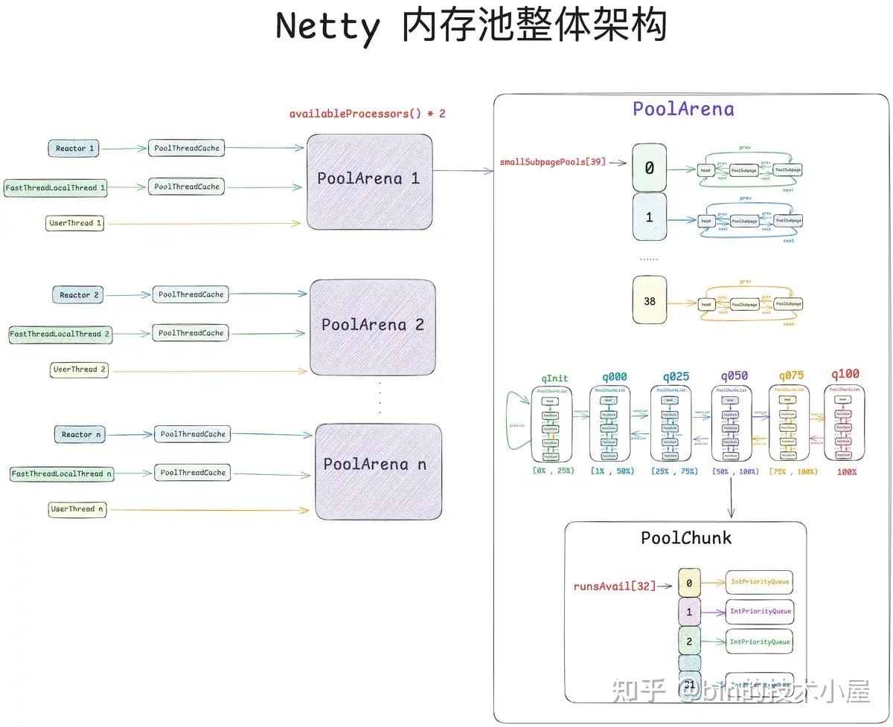

## 2\. Netty 内存池的创建与初始化

在清楚了内存池的总体架构设计之后，本小节我们就来看一下整个内存池的骨架是如何被创建出来的，Netty 将整个内存池的实现封装在 PooledByteBufAllocator 类中。

```
public class PooledByteBufAllocator {
    public static final PooledByteBufAllocator DEFAULT =
            new PooledByteBufAllocator(PlatformDependent.directBufferPreferred());
}
```

创建内存池所需要的几个核心参数我们需要提前了解下：

- preferDirect 默认为 true, 用于指定该 Allocator 是否偏向于分配 Direct Memory，其值由 `PlatformDependent.directBufferPreferred()` 方法决定，相关的判断逻辑可以回看下 [《聊一聊 Netty 数据搬运工 ByteBuf 体系的设计与实现》](https://link.zhihu.com/?target=https%3A//mp.weixin.qq.com/s%3F__biz%3DMzg2MzU3Mjc3Ng%3D%3D%26mid%3D2247489860%26idx%3D1%26sn%3Df3cc139194355de6fb7463fac05a7263%26chksm%3Dce77df03f900561506eaf41a17777ec5f8dadbb37594a60b466238eb718c9cce38ad6bf2263f%26scene%3D178%26cur_album_id%3D2217816582418956300%23rd) 一文中的第三小节。
- nHeapArena ， nDirectArena 用于指定内存池中包含的 HeapArena ， DirectArena 个数，它们分别用于池化 Heap Memory 以及 Direct Memory 。默认个数分别为 `availableProcessors * 2` ， 可由参数 `-Dio.netty.allocator.numHeapArenas` 和 `-Dio.netty.allocator.numDirectArenas` 指定。
- pageSize 默认为 8K ，用于指定内存池中的 Page 大小。可由参数 `-Dio.netty.allocator.pageSize` 指定，但不能低于 4K 。
- maxOrder 默认为 9 ， 用于指定内存池中 PoolChunk 尺寸，默认 4M ，由 `pageSize << maxOrder` 计算得出。可由参数 `-Dio.netty.allocator.maxOrder` 指定，但不能超过 14 。
- smallCacheSize 默认 256 ， 可由参数 `-Dio.netty.allocator.smallCacheSize` 指定，用于表示每一个 small 内存规格尺寸可以在 PoolThreadCache 中缓存的 small 内存块个数。
- normalCacheSize 默认 64 ， 可由参数 `-Dio.netty.allocator.normalCacheSize` 指定，用于表示每一个 Normal 内存规格尺寸可以在 PoolThreadCache 中缓存的 Normal 内存块个数。
- useCacheForAllThreads 默认为 false, 可由参数 `-Dio.netty.allocator.useCacheForAllThreads` 指定。用于表示是否为所有线程创建 PoolThreadCache。
- directMemoryCacheAlignment 默认为 0 ，可由参数 `-Dio.netty.allocator.directMemoryCacheAlignment` 指定 ， 用于表示内存池中内存块尺寸的对齐粒度。

```
private final PoolThreadLocalCache threadCache;
    private final int smallCacheSize;
    private final int normalCacheSize;
    private final int chunkSize;
    // 保存所有 DirectArena
    private final PoolArena<ByteBuffer>[] directArenas;

    public PooledByteBufAllocator(boolean preferDirect, int nHeapArena, int nDirectArena, int pageSize, int maxOrder,
                                  int smallCacheSize, int normalCacheSize,
                                  boolean useCacheForAllThreads, int directMemoryCacheAlignment) {
        // 默认偏向于分配 Direct Memory
        super(preferDirect);
        // 创建 PoolThreadLocalCache ，后续用于将线程与 PoolArena 绑定
        // 并为线程创建 PoolThreadCache
        threadCache = new PoolThreadLocalCache(useCacheForAllThreads);
        // PoolThreadCache 中，针对每一个 Small 规格的尺寸可以缓存 256 个内存块
        this.smallCacheSize = smallCacheSize;
        // PoolThreadCache 中，针对每一个 Normal 规格的尺寸可以缓存 64 个内存块
        this.normalCacheSize = normalCacheSize;
        // PoolChunk 的尺寸
        // pageSize << maxOrder = 4M
        chunkSize = validateAndCalculateChunkSize(pageSize, maxOrder);
        // 13 ， pageSize 为 8K
        int pageShifts = validateAndCalculatePageShifts(pageSize, directMemoryCacheAlignment);
        // 依次创建 nDirectArena 个 DirectArena（省略 HeapArena）
        if (nDirectArena > 0) {
            // 创建 PoolArena 数组，个数为 2 * processors
            directArenas = newArenaArray(nDirectArena);
            // 划分内存规格，建立内存规格索引表
            final SizeClasses sizeClasses = new SizeClasses(pageSize, pageShifts, chunkSize,
                    directMemoryCacheAlignment);
            // 初始化 PoolArena 数组
            for (int i = 0; i < directArenas.length; i ++) {
                // 创建 DirectArena
                PoolArena.DirectArena arena = new PoolArena.DirectArena(this, sizeClasses);
                // 保存在 directArenas 数组中
                directArenas[i] = arena;
            }
        } else {
            directArenas = null;
        }
    }
```

当我们明白了内存池的总体架构之后，再来看内存池的创建过程就会觉得非常简单了，核心点主要有三个：

首先会创建 PoolThreadLocalCache，它是一个 FastThreadLocal 类型的成员变量，主要作用是用于后续实现线程与 PoolArena 之间的绑定，并为线程创建本地缓存 PoolThreadCache。

```
private final class PoolThreadLocalCache extends FastThreadLocal<PoolThreadCache> {
        private final boolean useCacheForAllThreads;

        PoolThreadLocalCache(boolean useCacheForAllThreads) {
            this.useCacheForAllThreads = useCacheForAllThreads;
        }

        @Override
        protected synchronized PoolThreadCache initialValue() {
            实现线程与 PoolArena 之间的绑定
            为线程创建本地缓存 PoolThreadCache
        }
    }
```

其次是根据 nDirectArena 的个数，创建 PoolArena 数组，用于保存内存池中所有的 PoolArena。

```
private static <T> PoolArena<T>[] newArenaArray(int size) {
        return new PoolArena[size];
    }
```

随后会创建 SizeClasses ， Netty 内存规格的划分就是在这里进行的，上一小节中展示的 Netty 内存规格索引表就是在这里创建的。这一块的内容比较多，笔者放在下一小节中介绍。

最后根据 SizeClasses 创建 nDirectArena 个 PoolArena 实例，并依次保存在 directArenas 数组中。内存池的创建核心关键在于创建 PoolArena 结构，PoolArena 中管理了 Small 规格的内存块与 PoolChunk。其中管理 Small 规格内存块的数据结构是 smallSubpagePools 数组，管理 PoolChunk 的数据结构是六个 PoolChunkList ，分别按照不同的内存使用率进行划分。

```
abstract class PoolArena<T> {
    // Small 规格的内存块组织在这里，类似内核的 kmalloc
    final PoolSubpage<T>[] smallSubpagePools;
    // 按照不同内存使用率组织 PoolChunk
    private final PoolChunkList<T> q050;  // [50% , 100%)
    private final PoolChunkList<T> q025;  // [25% , 75%)
    private final PoolChunkList<T> q000;  // [1% , 50%)
    private final PoolChunkList<T> qInit; // [0% , 25%)
    private final PoolChunkList<T> q075;  // [75% , 100%)
    private final PoolChunkList<T> q100;  // 100%

    protected PoolArena(PooledByteBufAllocator parent, SizeClasses sizeClass) {
        // PoolArena 所属的 PooledByteBufAllocator
        this.parent = parent;
        // Netty 内存规格索引表
        this.sizeClass = sizeClass;
        // small 内存规格将会在这里分配 —— 类似 kmalloc
        // 每一种 small 内存规格都会对应一个 PoolSubpage 链表（类似 slab）
        smallSubpagePools = newSubpagePoolArray(sizeClass.nSubpages);
        for (int i = 0; i < smallSubpagePools.length; i ++) {
            // smallSubpagePools 数组中的每一项是一个带有头结点的 PoolSubpage 结构双向链表
            // 双向链表的头结点是 SubpagePoolHead
            smallSubpagePools[i] = newSubpagePoolHead(i);
        }

        // 按照不同内存使用率范围划分 PoolChunkList
        q100 = new PoolChunkList<T>(this, null, 100, Integer.MAX_VALUE, sizeClass.chunkSize);// [100 , 2147483647]
        q075 = new PoolChunkList<T>(this, q100, 75, 100, sizeClass.chunkSize);
        q050 = new PoolChunkList<T>(this, q075, 50, 100, sizeClass.chunkSize);
        q025 = new PoolChunkList<T>(this, q050, 25, 75, sizeClass.chunkSize);
        q000 = new PoolChunkList<T>(this, q025, 1, 50, sizeClass.chunkSize);
        qInit = new PoolChunkList<T>(this, q000, Integer.MIN_VALUE, 25, sizeClass.chunkSize);// [-2147483648 , 25]
        // 双向链表组织 PoolChunkList
        // 其中比较特殊的是 q000 的前驱节点指向 NULL
        // qInit 的前驱节点指向它自己
        q100.prevList(q075);
        q075.prevList(q050);
        q050.prevList(q025);
        q025.prevList(q000);
        q000.prevList(null);
        qInit.prevList(qInit);
    }
}
```

首先就是创建 smallSubpagePools 数组，数组中的每一个元素是一个带有头结点的 PoolSubpage 类型的双向循环链表结构，PoolSubpage 类似内核中的 slab ，其中管理着对应 Small 规格的小内存块。

Netty 内存池中一共设计了 39 个 Small 规格尺寸 —— \[16B, 28k\]，所以 smallSubpagePools 数组的长度就是 39 （ `sizeClass.nSubpages` ），数组中的每一项负责管理一种 Small 规格的内存块。

```
private PoolSubpage<T>[] newSubpagePoolArray(int size) {
        return new PoolSubpage[size];
    }
```

smallSubpagePools 数组中保存就是对应 Small 规格尺寸的 PoolSubpage 链表的头结点 SubpagePoolHead。在内存池刚被创建出来的时候，链表中还是空的，只有一个头结点。

```
private PoolSubpage<T> newSubpagePoolHead(int index) {
        PoolSubpage<T> head = new PoolSubpage<T>(index);
        head.prev = head;
        head.next = head;
        return head;
    }
```

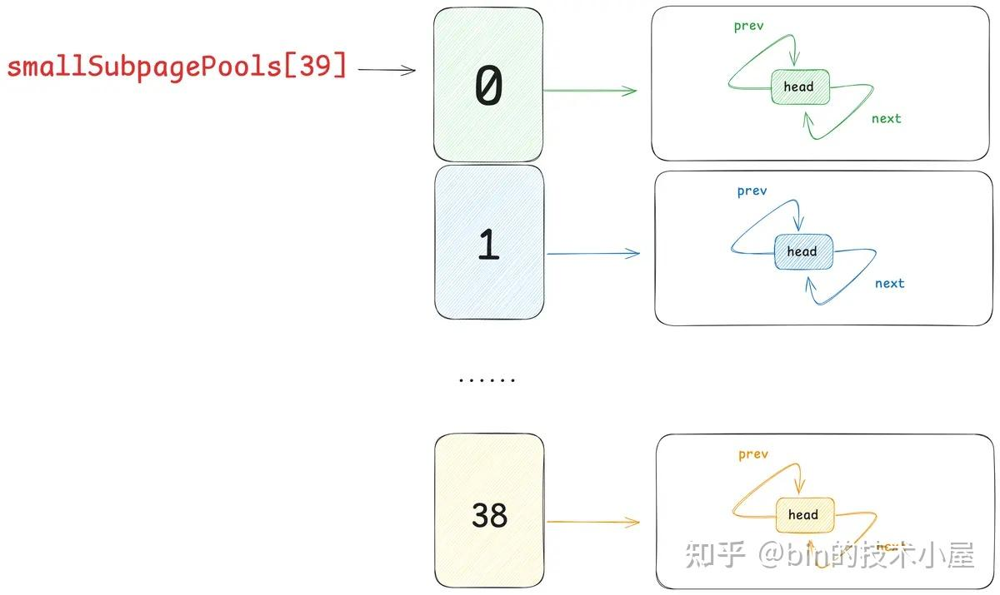

image.png

随后 Netty 会按照 PoolChunk 的不同内存使用率范围划分出六个 PoolChunkList ：qInit \[0%, 25%) ，q000 \[1%, 50%)，q025 \[25%, 75%)，q050 \[50%, 100%) ，q075 \[75%, 100%)，q100 \[100%\]。它们分别管理着不同内存使用率的 PoolChunk。由于现在内存池刚刚被创建出来，所以这些 PoolChunkList 中还是空的，

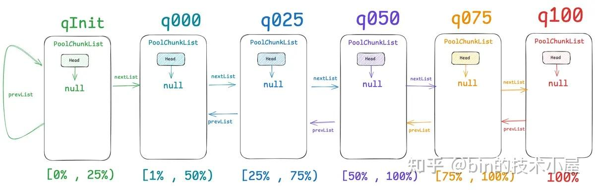

image.png

这些 PoolChunkLists 通过双向链表的结构相互串联起来，其中比较特殊的是 q000 和 qInit。 q000 它的前驱节点 prevList 指向 NULL ，目的是当 q000 中的 PoolChunk 内存使用率低于 1% 时，Netty 就会将其释放回 OS, 不会继续向前移动到 qInit 中，减少不必要的内存消耗。

qInit 它的前驱节点 prevList 指向它自己，这么做的目的是，使得内存使用率低于 25% 的 PoolChunk 能够一直停留在 qInit 中，避免后续需要内存的时候还需要在重新创建 PoolChunk。

现在一个完整的内存池就被我们创建出来了，但此时它还只是一个基本的骨架，内存池里面的 PoolArena 还没有和任何线程进行绑定，线程中的本地缓存 PoolThreadCache 还是空的。PoolArena 中的 smallSubpagePools 以及六个 PoolChunkLists 里也都是空的。

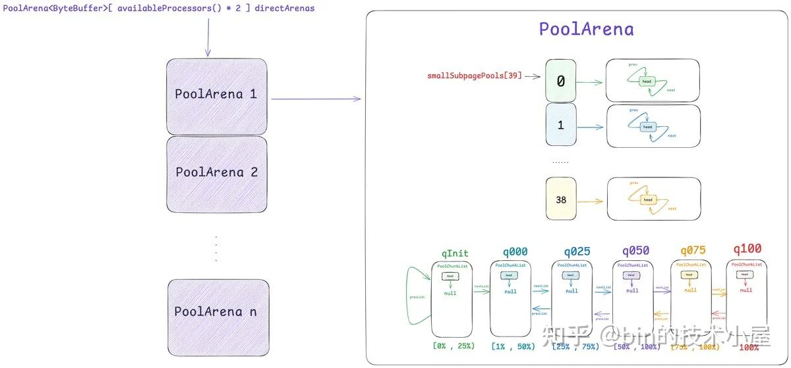

image.png

在后面的小节中，笔者将基于这个基本的骨架，让内存池动态地运转起来，一步一步丰满填充里面的内容。但内存池运转的核心是围绕着对 Small 规格以及 Normal 规格内存块的管理进行的。


image.png

所以在核心内容开始之前，我们需要知道 Netty 究竟是如何划分这些不同规格尺寸的内存块的。

## 3\. Netty 内存规格的划分

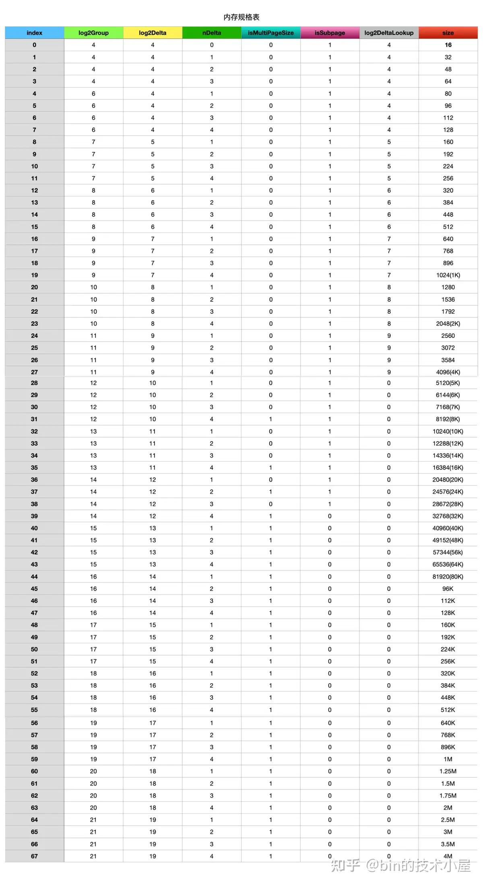

image.png

如上图所示，Netty 的内存规格从 16B 到 4M 一共划分成了 68 种规格，内存规格表在 Netty 中使用了一个二维数组来存储。

```
short[][] sizeClasses
```

其中第一维是按照内存规格的粒度来存储每一种内存规格，一共有 68 种规格，一维数组的大小也是 68 。第二维存储的是每一种内存规格的详细信息，一共有 7 列，分别是 index，log2Group，log2Delta，nDelta，isMultiPageSize，isSubpage，log2DeltaLookup。

```
private static final int LOG2GROUP_IDX = 1;
    private static final int LOG2DELTA_IDX = 2;
    private static final int NDELTA_IDX = 3;
    private static final int PAGESIZE_IDX = 4;
    private static final int SUBPAGE_IDX = 5;
    private static final int LOG2_DELTA_LOOKUP_IDX = 6;
```

其中 index 表示每一种内存规格在 sizeClasses 中的索引，从 0 到 67 表示 68 种内存规格。

后面的 log2Group ，log2Delta，nDelta 都是为了计算对应的内存规格 size 而设计的，计算公式如下：

```
private static int calculateSize(int log2Group, int nDelta, int log2Delta) {
        return (1 << log2Group) + (nDelta << log2Delta);
    }
```

Netty 按照 log2Group 将内存规格表中的 68 种规格一共分成了 17 组，每组 4 个规格，log2Group 用于表示在同一个内存规格组内的 4 个规格的基准 size —— base size 的对数, 后续规格 size 将会在 base size （1 << log2Group）的基础上进行扩充。

那么如何扩充呢 ？这就用到了 log2Delta 和 nDelta，每一个内存规格与其上一个规格的差值为 `1 << log2Delta` ，同一个内存规格组内的规格相当于是一个等差数列（log2Delta 都是相同的）。Netty 会按照 log2Delta 的倍数对内存规格进行扩充，那么扩充多少倍呢 ？ 这个就是 nDelta。

所以一个内存规格 size 的计算方式就是基准 size (1 << log2Group) 加上扩充的大小（nDelta << log2Delta）。下面笔者用第一个内存规格组 \[16B, 32B, 48B, 64B\] 进行具体说明：

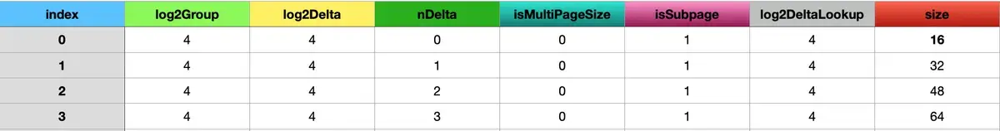

image.png

首先第一个内存规格组的 log2Group 为 4 ，它的基准 size = 1 << log2Delta = 16B。log2Delta 为 4 ，表示组内的 4 个内存规格之间的差值为 `1 << log2Delta = 16B` 。

好了，接下来我们看第一个内存规格组内每一种规格的计算方式，Netty 内存池的第一个内存规格是 16B ， 由于它是第一个规格，所以 nDelta 为 0 ，我们通过公式 ` (1 << log2Group) + (nDelta << log2Delta) =  (1 << 4) + (0 << 4)` 得出第一个内存规格 size 为 16B。

> 后续其他内存规格组内第一个规格的 nDelta 均是为 1 。

第二个内存规格是 32B ， 它对应的 nDelta 为 1，规格 size = `(1 << 4) + (1 << 4) = 32` 。

第三个内存规格是 48B ， 它对应的 nDelta 为 2，规格 size = `(1 << 4) + (2 << 4) = 48` 。

第四个内存规格是 64B ， 它对应的 nDelta 为 3，规格 size = `(1 << 4) + (3 << 4) = 64` 。

> 每一个内存规格组内的最后一个规格 size 恰好都是 2 的次幂 。同时它也是下一个内存规格组的 log2Group = log2(size) 。

sizeClasses 中的 isMultiPageSize 表示该内存规格是否是 Page(8k) 的倍数，用于后续索引 Page 级别的内存规格。isSubpage 表示该内存规格的内存块是否由 PoolSubpage 进行管理，从内存规格表 sizeClasses 中我们可以看出，Small 规格 \[16B, 28k\] 范围内的内存规格，它们的 isSubpage 全都是 true 。

log2DeltaLookup 的用处不大，这里大家可以忽略，4K 以下的内存规格，它们的 log2DeltaLookup 就是 log2Delta， 4K 以上的内存规格，它们的 log2DeltaLookup 都是 0 。这个设计主要是后面用来建立内存规格 size 与其对应的 index 之间的映射索引表 —— size2idxTab。

它的作用就是给定一个内存尺寸 size ，返回其对应的内存规格 index 。内存尺寸在 4K 以下直接查找 size2idxTab，4K 以上通过计算得出。这里大家只做简单了解即可，后面笔者会介绍这部分的计算逻辑。

好了，现在我们已经看懂了这张 SizeClasses 内存规格表，接下来我们就来看一下 SizeClasses 是如何被构建出来的。

```
final class SizeClasses {
    // 第一种内存规格的基准 size  —— 16B
    // 以及第一个内存规格增长间距 —— 16B
    static final int LOG2_QUANTUM = 4;
    // 每个内存规格组内，规格的个数 —— 4 个
    private static final int LOG2_SIZE_CLASS_GROUP = 2;
    // size2idxTab 中索引的最大内存规格 —— 4K
    private static final int LOG2_MAX_LOOKUP_SIZE = 12;
}
```

我们在内存规格表中看到的第一组内存规格基准 size —— 16B ， 以及第一种内存规格的增长间隔 —— 16B ，就是由 LOG2_QUANTUM 常量决定的。

内存规格表中一共分为了 17 组内存规格，每组包含的规格个数由 LOG2_SIZE_CLASS_GROUP 决定。

```
// 22 - 4 -2 + 1 = 17
int group = log2(chunkSize) - LOG2_QUANTUM - LOG2_SIZE_CLASS_GROUP + 1;
```

size2idxTab 中索引的最大内存规格是由 LOG2_MAX_LOOKUP_SIZE 决定的，如果给定的内存尺寸小于等于 `1 << LOG2_MAX_LOOKUP_SIZE` ，那么直接查找 size2idxTab 获取其对应的内存规格 index。内存尺寸大于 `1 << LOG2_MAX_LOOKUP_SIZE` ，则通过计算得出对应的 index, 不会建立这部分索引。

```
SizeClasses(int pageSize, int pageShifts, int chunkSize, int directMemoryCacheAlignment) {
        // 一共分为 17 个内存规格组
        int group = log2(chunkSize) - LOG2_QUANTUM - LOG2_SIZE_CLASS_GROUP + 1;

        // 创建内存规格表 sizeClasses
        // 每个内存规格组内有 4 个规格，一共 68 个内存规格，一维数组长度为 68
        // 二维数组的长度为 7
        // 保存的内存规格信息为：index, log2Group, log2Delta, nDelta, isMultiPageSize, isSubPage, log2DeltaLookup
        short[][] sizeClasses = new short[group << LOG2_SIZE_CLASS_GROUP][7];

        int normalMaxSize = -1;
        // 内存规格 index , 初始为 0
        int nSizes = 0;
        // 内存规格 size
        int size = 0;
        // 第一组内存规格的基准 size 为 16B
        int log2Group = LOG2_QUANTUM;
        // 第一组内存规格之间的间隔为 16B
        int log2Delta = LOG2_QUANTUM;
        // 每个内存规格组内限定为 4 个规格
        int ndeltaLimit = 1 << LOG2_SIZE_CLASS_GROUP;

        // 初始化第一个内存规格组 [16B , 64B]，nDelta 从 0 开始
        for (int nDelta = 0; nDelta < ndeltaLimit; nDelta++, nSizes++) {
            // 初始化对应内存规格的 7 个信息
            short[] sizeClass = newSizeClass(nSizes, log2Group, log2Delta, nDelta, pageShifts);
            // nSizes 为该内存规格的 index
            sizeClasses[nSizes] = sizeClass;
            // 通过 sizeClass 计算该内存规格的 size ,然后将 size 向上对齐至 directMemoryCacheAlignment 的最小整数倍
            size = sizeOf(sizeClass, directMemoryCacheAlignment);
        }

        // 每个内存规格组内的最后一个规格，往往是下一个内存规格组的基准 size
        // 比如第一个内存规格组内最后一个规格 64B ， 它是第二个内存规格组的基准 size
        // 4 + 2 = 6，第二个内存规格组的基准 size 为 64B
        log2Group += LOG2_SIZE_CLASS_GROUP;

        // 初始化剩下的 16 个内存规格组
        // 后一个内存规格组的 log2Group，log2Delta 比前一个内存规格组的 log2Group ，log2Delta 多 1
        for (; size < chunkSize; log2Group++, log2Delta++) {
            // 每个内存规格组内的 nDelta 从 1 到 4 ，最大内存规格不能超过 chunkSize（4M）
            for (int nDelta = 1; nDelta <= ndeltaLimit && size < chunkSize; nDelta++, nSizes++) {
                // 初始化对应内存规格的 7 个信息
                short[] sizeClass = newSizeClass(nSizes, log2Group, log2Delta, nDelta, pageShifts);
                // nSizes 为该内存规格的 index
                sizeClasses[nSizes] = sizeClass;
                size = normalMaxSize = sizeOf(sizeClass, directMemoryCacheAlignment);
            }
        }

        // 最大内存规格不能超过 chunkSize（4M）
        // 超过 4M 就是 Huge 内存规格，直接分配不进行池化管理
        assert chunkSize == normalMaxSize;

              ...... 省略 ......
    }
```

本小节一开始贴出来的那张内存规格表就是通过上面这段代码创建出来的，创建逻辑不算太复杂。首先创建一个空的二维数组 —— sizeClasses，后续用它来保存内存规格信息。

Netty 将 chunkSize（4M）一共分为了 17 组，每组 4 个规格，一共 68 种内存规格，所以 sizeClasses 的一维数组大小就是 68，保存每一个内存规格信息。二维数组大小是 7， 也就是上面笔者介绍的 7 种具体的内存规格信息。

```
short[][] sizeClasses = new short[group << LOG2_SIZE_CLASS_GROUP][7];
```

首先在第一个 for 循环中初始化第一个内存规格组，它的起始 log2Group，log2Delta 为 4，也就是说第一个内存规格组内的基准 size 为 16B ， 组内规格之间的差值为 16B,由于是第一组内存规格，所以 nDelta 从 0 开始递增。


image.png

接着在第二个双重 for 循环中初始化剩下的 16 组内存规格，从 80B 一直到 4M 。Netty 在划分内存规格的时候有一个特点， **就是每个内存规格组内最后一个规格 size 一定是 2 的次幂，同时它也是下一个内存规格组的基准 size** 。

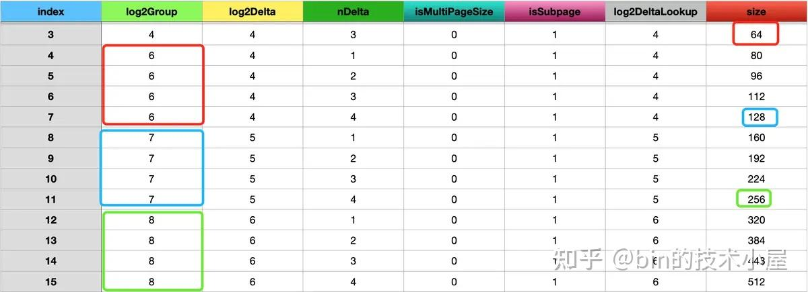

image.png

比如第一个内存规格组内最后一个规格为 64B, 那么第二个内存规格组的 log2Group 就应该是 6 。也就是从基准 size —— 64B 开始扩充组内的规格。

```
// 4 + 2 = 6
log2Group += LOG2_SIZE_CLASS_GROUP;
```

除去第一组内存规格之外，我们看到剩下的 16 组内存规格，后一个内存规格组内的 log2Group 往往比前一个内存规格组的 log2Group 多 1 。也就是说内存规格组的基准 size 是按照 2 倍递增。以 64B, 128B,......,1M, 2M 这样递增。

同时后一个内存规格组内的 log2Delta 往往比前一个内存规格组的 log2Delta 多 1 。也就是不同内存规格组内规格之间的差值也是按照 2 倍递增。规格之间的间距分别按照 16B ， 32B ， 64B ，......, 0.25M, 0.5M 这样递增。但同一内存规格组内的差值永远都是相同的。

现在我们已经清楚了内存规格组的划分逻辑，那么具体的内存规格信息是如何初始化的呢 ？这部分逻辑在 newSizeClass 函数中实现。

```
private static short[] newSizeClass(int index, int log2Group, int log2Delta, int nDelta, int pageShifts) {
        // 判断规格尺寸是否是 Page 的整数倍
        short isMultiPageSize;
        if (log2Delta >= pageShifts) {
            // 尺寸按照 Page 的倍数递增了，那么一定是  Page 的整数倍
            isMultiPageSize = yes;
        } else {
            int pageSize = 1 << pageShifts;
            // size = 1 << log2Group + nDelta * (1 << log2Delta)
            int size = calculateSize(log2Group, nDelta, log2Delta);
            // 是否能被 pagesize(8k) 整除
            isMultiPageSize = size == size / pageSize * pageSize? yes : no;
        }
        // 规格尺寸小于 32K ，那么就属于 Small 规格，对应的内存块会被 PoolSubpage 管理
        short isSubpage = log2Size < pageShifts + LOG2_SIZE_CLASS_GROUP? yes : no;

        // 如果内存规格 size 小于等于 MAX_LOOKUP_SIZE（4K），那么 log2DeltaLookup 为 log2Delta
        // 如果内存规格 size 大于 MAX_LOOKUP_SIZE（4K），则为 0
        // Netty 只会为 4K 以下的内存规格建立 size2idxTab 索引
        int log2DeltaLookup = log2Size < LOG2_MAX_LOOKUP_SIZE ||
                              log2Size == LOG2_MAX_LOOKUP_SIZE && remove == no
                ? log2Delta : no;
        // 初始化内存规格信息
        return new short[] {
                (short) index, (short) log2Group, (short) log2Delta,
                (short) nDelta, isMultiPageSize, isSubpage, (short) log2DeltaLookup
        };
    }
```

现在整个内存规格表就算初始化完了，后面的工作比较简单，就是遍历内存规格表，初始化一些统计信息，比如：

- nPSizes，表示 Page 级别的内存规格个数，一共有 32 个 Page 级别的内存规格。
- nSubpages ， 表示 Small 内存规格的个数，从 16B 到 28K 一共 39 个 。
- smallMaxSizeIdx ，最大的 Small 内存规格对应的 index 。 Small 内存规格中的最大尺寸为 28K ，对应的 sizeIndex = 38。
- lookupMaxSize ， 表示 size2idxTab 中索引的最大尺寸为 4K 。

```
// Small 规格中最大的规格尺寸对应的 index (38)
        int smallMaxSizeIdx = 0;
        // size2idxTab 中最大的 lookup size （4K）
        int lookupMaxSize = 0;
        // Page 级别内存规格的个数（32）
        int nPSizes = 0;
        // Small 内存规格的个数（39）
        int nSubpages = 0;
        // 遍历内存规格表 sizeClasses，统计 nPSizes ， nSubpages，smallMaxSizeIdx，lookupMaxSize
        for (int idx = 0; idx < nSizes; idx++) {
            short[] sz = sizeClasses[idx];
            // 只要 size 可以被 pagesize 整除，那么就属于 MultiPageSize
            if (sz[PAGESIZE_IDX] == yes) {
                nPSizes++;
            }
            // 只要 size 小于 32K 则为 Subpage 的规格
            if (sz[SUBPAGE_IDX] == yes) {
                nSubpages++;
                // small 内存规格中的最大尺寸 28K ，对应的 sizeIndex = 38
                smallMaxSizeIdx = idx;
            }
            // 内存规格小于等于 4K 的都属于 lookup size
            if (sz[LOG2_DELTA_LOOKUP_IDX] != no) {
                // 4K
                lookupMaxSize = sizeOf(sz, directMemoryCacheAlignment);
            }
        }
        // 38
        this.smallMaxSizeIdx = smallMaxSizeIdx;
        // 4086(4K)
        this.lookupMaxSize = lookupMaxSize;
        // 32
        this.nPSizes = nPSizes;
        // 39
        this.nSubpages = nSubpages;
        // 68
        this.nSizes = nSizes;
        // 8192(8K)
        this.pageSize = pageSize;
        // 13
        this.pageShifts = pageShifts;
        // 4M
        this.chunkSize = chunkSize;
        // 0
        this.directMemoryCacheAlignment = directMemoryCacheAlignment;
```

现在 Netty 中所有的内存规格尺寸就已经全部确定下来了，包括 68 种内存规格，8K 的 PageSize, 4M 的 ChunkSize。接下来最后一项任务就是根据原始的内存规格表 sizeClasses 建立相关的索引表。

```
// sizeIndex 与 size 之间的映射
        this.sizeIdx2sizeTab = newIdx2SizeTab(sizeClasses, nSizes, directMemoryCacheAlignment);
        // 根据 sizeClass 生成 page 级的内存规格表
        // pageIndex 到对应的 size 之间的映射
        this.pageIdx2sizeTab = newPageIdx2sizeTab(sizeClasses, nSizes, nPSizes, directMemoryCacheAlignment);
        // 4k 之内，给定一个 size 转换为 sizeIndex
        this.size2idxTab = newSize2idxTab(lookupMaxSize, sizeClasses);
```

### 3.1 sizeIdx2sizeTab

sizeIdx2sizeTab 主要是建立内存规格 index 到对应规格 size 之间的映射，这里的 index 就是内存规格表 sizeClasses 中的 index 。

```
private static int[] newIdx2SizeTab(short[][] sizeClasses, int nSizes, int directMemoryCacheAlignment) {
        // 68 种内存规格，映射条目也是 68
        int[] sizeIdx2sizeTab = new int[nSizes];
        // 遍历内存规格表，建立 index 与规格 size 之间的映射
        for (int i = 0; i < nSizes; i++) {
            short[] sizeClass = sizeClasses[i];
            // size = 1 << log2Group + nDelta * (1 << log2Delta)
            sizeIdx2sizeTab[i] = sizeOf(sizeClass, directMemoryCacheAlignment);
        }
        return sizeIdx2sizeTab;
    }
```


image.png

### 3.2 pageIdx2sizeTab

pageIdx2sizeTab 建立的是 Page 级别内存规格的索引表，pageIndex 到对应 Page 级内存规格 size 之间的映射。这里的 pageIndex 从 0 开始一直到 31。

```
private static int[] newPageIdx2sizeTab(short[][] sizeClasses, int nSizes, int nPSizes,
                                            int directMemoryCacheAlignment) {
        // page 级的内存规格，个数为 32
        int[] pageIdx2sizeTab = new int[nPSizes];
        int pageIdx = 0;
        // 遍历内存规格表，建立 pageIdx 与对应 Page 级内存规格 size 之间的映射
        for (int i = 0; i < nSizes; i++) {
            short[] sizeClass = sizeClasses[i];
            if (sizeClass[PAGESIZE_IDX] == yes) {
                pageIdx2sizeTab[pageIdx++] = sizeOf(sizeClass, directMemoryCacheAlignment);
            }
        }
        return pageIdx2sizeTab;
    }
```


image.png

### 3.3 size2idxTab

size2idxTab 是建立 request size 与内存规格 index 之间的映射关系，那什么是 request size 呢 ？ 注意这里的 request size 并不是内存规格表中固定的规格 size, 因为内存规格表是 Netty 提前规划好的，对于用户来说，可能并不知道 Netty 究竟划分了哪些固定的内存规格，用户不一定会按照 Netty 规定的 size 进行内存申请，申请的内存尺寸可能是随意的。

比如，内存规格表中的前两个规格是 16B ， 32B。但用户实际申请的可能是 6B ，8B ， 29B ， 30B 这样子的尺寸。

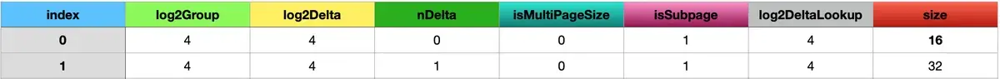

image.png

当用户向内存池申请 6B 或者 8B 的内存块时，那么 Netty 就需要找到与其最接近的内存规格，也就是 16B，对应的规格 index 是 0。当用户申请 29B 或者 30B 的内存块时，与其最接近的内存规格就是 32B ， 对应的规格 index 是 1 。

针对上面的例子来说，用户实际申请的内存尺寸就是 request size，在 size2idxTab 中的概念是 lookup size 。而 size2idxTab 的作用就是建立 lookup size 与其对应内存规格 index 之间的映射。这样一来，Netty 就可以通过任意一个 lookup size 迅速找到与其最接近的内存规格了。

那么这个映射如何建立呢 ？我们看到 size2idxTab 的结构只是一个 int 型的数组，怎么存放 lookup size 与内存规格 index 的映射关系呢 ？

```
int[] size2idxTab
```

说起映射，我们很容易想起 Hash 表对吧，我们可以将内存规格 index 存储在 size2idxTab 数组 ， size2idxTab 数组的 index 我们可以设计成 lookup size 的 hash code 。这样一来，给定一个任意的 lookup size，我们通过一个哈希函数计算出它的 hash code，这个 hash code 也就是 size2idxTab 数组的 index，从而通过 size2idxTab\[index\] 找到映射的内存规格 index。

那么我们该如何设计一个这样的哈希函数呢 ？ 能不能从 Netty 的内存规格表中找找规律，看看有没有什么灵感、我们知道 Netty 的基础内存规格为 16B ，从 16B 开始先是按照 16B 这样的间隔开始慢慢扩充内存规格，随后依次按照 32B ，64B, 128B, 256B,......, 0.5M 这样 2 的次幂的倍数间隔逐渐慢慢扩充成 68 种内存规格。

```
// 基础内存规格
 static final int LOG2_QUANTUM = 4;
```

这 68 种内存规格都是在 16B 的基础上扩充而来的，规格之间的差值也都是 16 的倍数，因此任何一种内存规格一定是 16 的倍数。根据这个特点，我们将 4M 的内存空间按照 16B 这样的间隔将 lookup size 的尺寸切分为，16B, 32B, 48B, 64B, 80B,...... 等等这样的 lookup 尺寸，它们之间的间隔都是 16B，不会像内存规格那样 2 倍 2 倍的递增。

如果 lookup size 在（0, 16B\] 范围内，那么对应的规格 index 就是 0 ，内存规格为 16B, 如果 lookup size 在（16B, 32B\] 范围内，那么对应的规格 index 就是 1 ， 内存规格为 32B，如下图所示这样以此类推：

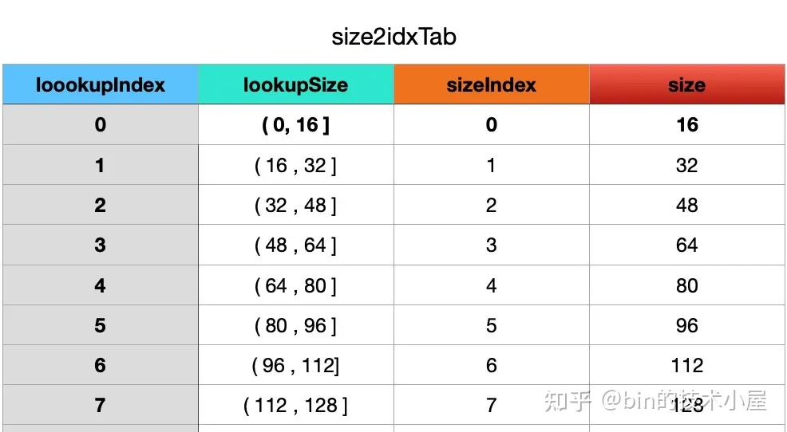

image.png

按照这样的规律，我们就可以设计一个这样的哈希函数：

```
lookupSize - 1 >> LOG2_QUANTUM
```

比如，9B 通过上面的哈希函数计算出来的就是 0 ，恰好是内存规格 16B 的 index (0), 31B 计算出来的就是 1 ，恰好是内存规格 32B 的 index（1），100B 计算出来的就是 6 ，恰好是内存规格 112B 的 index (6) 。

但如果我们像这样将 ChunkSize(4M) 按照 16B 的间隔进行划分，就会划分出 262144 个 lookup size 尺寸，这样就会导致 size2idxTab 这张索引表非常的大，而且也没这必要。

其实我们只需要为那些使用频率最高的内存规格范围建立索引就好了，剩下低频使用的内存规格我们直接通过计算得出，不走索引。那么究竟为哪些内存规格建立 lookup 索引呢 ？

这就用到了前面介绍的 lookupMaxSize（4K），Netty 只会为 4K 以下的内存规格建立索引，4K 按照 16 的间隔可以划分出 256 个 lookup size 尺寸，大小刚好合适，而且都是高频使用的内存规格。

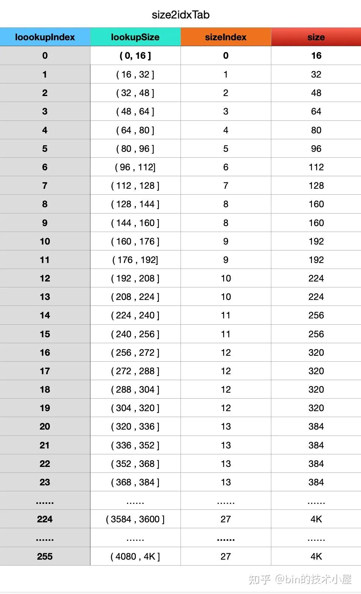

image.png

这样一来，只要是 4K 以下的任意 lookupSize，Netty 都可以通过 size2idxTab 索引表在 O(1) 的复杂度下迅速找到与其最接近的内存规格。

但在构建 size2idxTab 索引的时候有一个特殊的点需要注意，在内存规格表中，规格 index 7 之后的内存规格之间的差值并不是恰好是 16 ，而是 16 的 2 的次幂倍数。

比如 sizeIndex 7 和 8 对应的内存规格之间差值是 32 （2 \* 16），sizeIndex 11 和 12 对应的内存规格之间差值是 64 （4 \* 16），sizeIndex 26 和 27 对应的内存规格之间差值是 512 （32 \* 16）。

而 size2idxTab 中规划的 lookupSize 尺寸是按照 16 递增的，所以在 sizeIndex 7 和 8 之间，我们需要划分出两个 lookupSize：144, 160, 对应的 lookupIndex 是 8 ， 9 ，它们对应的内存规格都是 160B（sizeIndex = 8）。

同样的道理， sizeIndex 11 和 12 之间，我们需要划分出四个 lookupSize：272, 288, 304, 320 。对应的 lookupIndex 是 16, 17, 18, 19 。它们对应的内存规格都是 320B（sizeIndex = 12）。

sizeIndex 26 和 27 之间需要划分出 32 个 lookupSize，对应的内存规格都是 4K （sizeIndex = 27）。

```
private static int[] newSize2idxTab(int lookupMaxSize, short[][] sizeClasses) {
        // size2idxTab 中的 lookupSize 按照 16 依次递增，最大为 4K
        // 因此 size2idxTab 大小为 4K / 16
        int[] size2idxTab = new int[lookupMaxSize >> LOG2_QUANTUM];
        // lookupIndex
        int idx = 0;
        // lookupSize
        int size = 0;
        // 遍历 4K 以下的内存规格表 sizeClasses，建立 size2idxTab
        for (int i = 0; size <= lookupMaxSize; i++) {
            int log2Delta = sizeClasses[i][LOG2DELTA_IDX];
            // 计算规格之间的差值是 16 的几倍
            // 比如 sizeIndex 7 和 8 对应的内存规格之间差值是 32 （2 * 16）
            // 那么这两个内存规格之间就需要划分出 times 个 lookupSize
            int times = 1 << log2Delta - LOG2_QUANTUM;
            // 构建 size2idxTab
            while (size <= lookupMaxSize && times-- > 0) {
                // lookupIndex 与 sizeIndex 之间的映射
                size2idxTab[idx++] = i;
                // lookupSize 按照 16 依次递增
                size = idx + 1 << LOG2_QUANTUM;
            }
        }
        return size2idxTab;
    }
```

好了，现在 lookupSize 在 4K 以下，我们可以通过 size2idxTab 找到与其最接近的内存规格，那么 5K 到 4M 之间的 lookupSize，我们又该如何查找其对应的内存规格呢 ？

前面笔者提到过，Netty 将 68 种内存规格划分成了 17 个内存规格组，内存规格组编号从 0 到 16 。每个内存规格组内有四个规格。给定一个任意的 lookupSize，我们首先的思路是不是要确定这个 lookupSize 到底是属于哪一个内存规格组 ？然后在确定这个 lookupSize 最接近组内第几个规格 ？

现在思路有了，下面我们来看第一个问题，如何确定 lookupSize 究竟属于哪一个内存规格组 ？

还记不记得笔者之前反复强调过的一个特性 —— 每个内存规格组内最后一个规格都是 2 的次幂，第 0 个内存规格组最后一个规格是 64B，第 1 个内存规格组最后一个规格是 128B ， 第 2 个是 256B ， 第 3 个是 512B，第 4 个是 1K，...... ，第 16 个是 4M 。

我们根据每组最后一个规格的尺寸，就可以得到这样一个数列 —— 64, 128, 256, 512, 1K,......., 4M。这个数列有一个特点就是从 64 开始逐渐按照 2 的次幂倍数增长。因此，我们将数列中的每项除以 64 就得到一个新的数列 —— 2^0, 2^1, 2^2, 2^3, 2^4, 2^5.........。而新数列中，每一项的对数就是内存规格组的编号了。

这个逻辑明确之后，剩下的实现就很简单了，首先我们需要找到 lookupSize 所在内存规格组的最后一个规格, 直接对 lookupSize 向上取最接近的 2 的次幂。

```
// 组内最后一个内存规格的对数
int x = log2((lookupSize << 1) - 1);
```

在组内最后一个内存规格现在明确了，我们将它除以 64 ，然后取商的对数就得到了 shift —— 内存规格组编号。

```
// lookupSize 所在内存规格组编号
int shift = x - (LOG2_SIZE_CLASS_GROUP + LOG2_QUANTUM)
```

有了 shift 之后，我们很容易就能确定出组内第一个规格的 index, 每个内存规格组内有 4 个规格，现在我们是第 shift 个内存规格组，该组第一个规格的 index 就是 shift \* 4 。

```
// 组内第一个规格的 index
int group = shift << LOG2_SIZE_CLASS_GROUP;
```

而每个内存规格组内，规格之间的间隔都是相同的，通过 `x - LOG2_SIZE_CLASS_GROUP - 1` 获取组内间隔 log2Delta。

```
// 组内规格间隔
int log2Delta =  x - LOG2_SIZE_CLASS_GROUP - 1;
```

在有了 group 和 log2Delta 之后，我们很容易就能确定这个 lookupSize 最接近组内第几个规格 —— `lookupSize - 1 >> log2Delta & 3`

```
int mod = lookupSize - 1 >> log2Delta & (1 << LOG2_SIZE_CLASS_GROUP) - 1;
```

最后 `group + mod` 就是该 lookupSize 对应的内存规格 index 。下面笔者用一个具体的例子进行说明，假设我们现在要向内存池申请 5000B 的内存块。

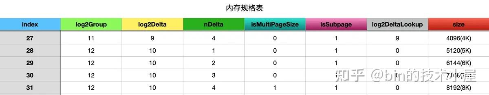

image.png

5000B 所在内存规格组最后一个规格是 8K，8K 除以 64 得到商的对数就是 7 ，说明 5000B 这个内存尺寸位于第 7 个内存规格组内。组内第一个规格 index 是 28 ，组内间距 log2Delta = 10 。计算出的 mod 恰好是 0 。也就是说与 5000B 最贴近的内存规格是 5K ， 对应的规格 index 是 28 。

```
final class SizeClasses {

    @Override
    public int size2SizeIdx(int size) {
        if (size == 0) {
            return 0;
        }
        // Netty 只会池化 4M 以下的内存块
        if (size > chunkSize) {
            return nSizes;
        }
        // 将 lookupSize 与 Alignment 进行对齐
        size = alignSizeIfNeeded(size, directMemoryCacheAlignment);
        // lookupSize 在 4K 以下直接去 size2idxTab 中去查
        if (size <= lookupMaxSize) {
            return size2idxTab[size - 1 >> LOG2_QUANTUM];
        }
        // 向上取 size 最接近的 2 的次幂，目的是获取所属内存规格组的最后一个规格尺寸
        int x = log2((size << 1) - 1);
        // size 所在内存规格组编号，最后一个规格尺寸除以 64 得到商的对数
        int shift = x < LOG2_SIZE_CLASS_GROUP + LOG2_QUANTUM + 1
                ? 0 : x - (LOG2_SIZE_CLASS_GROUP + LOG2_QUANTUM);
        // 内存规格组内第一个规格 index
        int group = shift << LOG2_SIZE_CLASS_GROUP;
        // 组内规格之间的间隔
        int log2Delta = x < LOG2_SIZE_CLASS_GROUP + LOG2_QUANTUM + 1
                ? LOG2_QUANTUM : x - LOG2_SIZE_CLASS_GROUP - 1;
        // size 最贴近组内哪一个规格
        int mod = size - 1 >> log2Delta & (1 << LOG2_SIZE_CLASS_GROUP) - 1;
        // 返回对应内存规格 index
        return group + mod;
    }
}
```

编辑于 2024-10-25 09:47・广东[Netty](https://www.zhihu.com/topic/19732975)[Java](https://www.zhihu.com/topic/19561132)[内存管理](https://www.zhihu.com/topic/19579205)[2025年最新版DAMA数据治理工程师CDGA通关指南！（附赠资料包）](https://zhuanlan.zhihu.com/p/1969441920406263085)

[

作为一名在一线城市从事数据分析工作6年的职场人，去年5月，我决定通过考取CDGA认证来系统提升自己在数据治理领域的...

](https://zhuanlan.zhihu.com/p/1969441920406263085)
