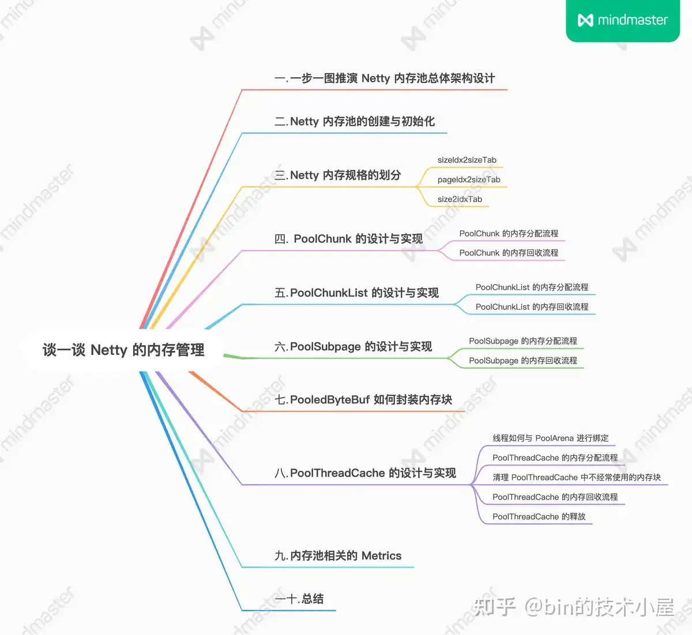
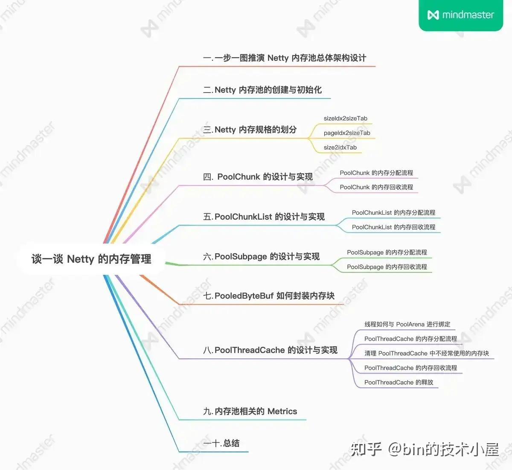
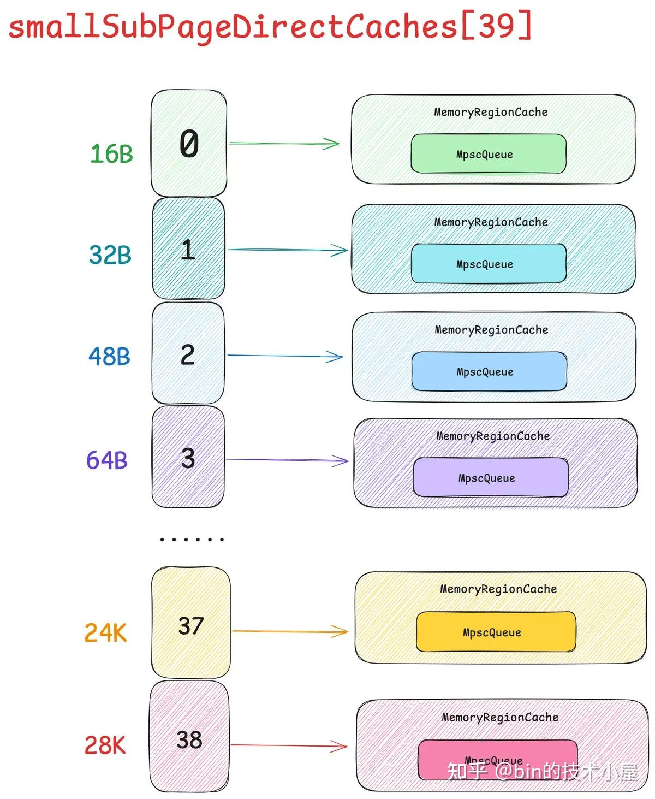
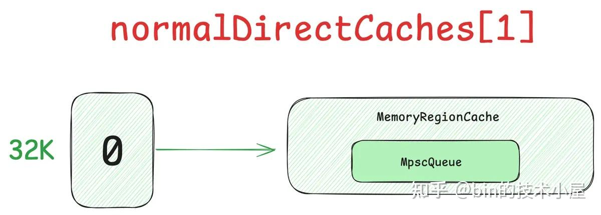
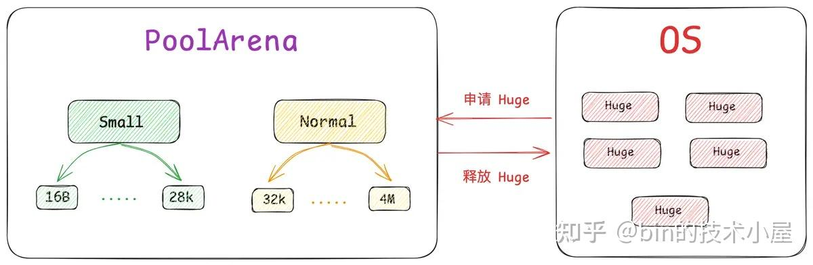
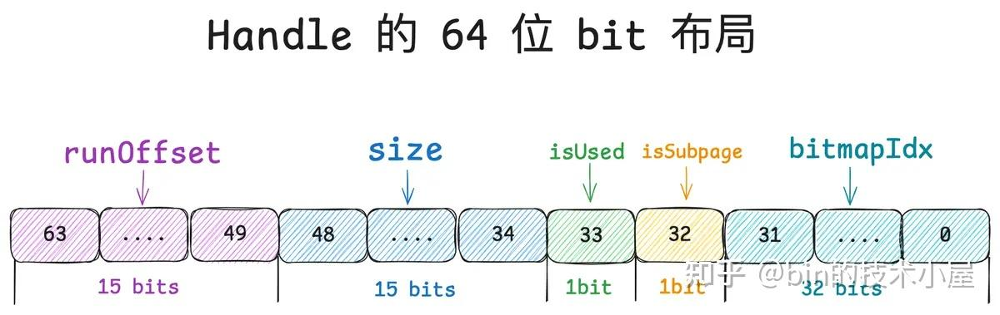
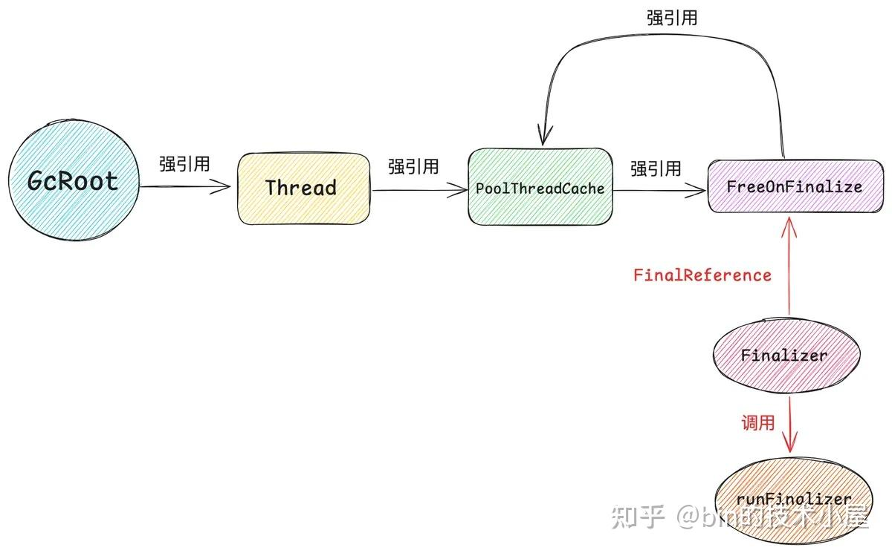

> 本文基于 Netty 4.1.112.Final 版本进行讨论

[](https://zhuanlan.zhihu.com/p/3043843441)

[](https://zhuanlan.zhihu.com/p/3043897548)



## 8\. PoolThreadCache 的设计与实现

到目前为止，内存池的整个内部实现笔者就为大家剖析完了，现在让我们把视角从内存池的内部重新转移到整个架构层面上来俯瞰一下整个内存池的全貌。


image.png

笔者在本文第一小节介绍内存池的 [架构设计](https://zhida.zhihu.com/search?content_id=249631275&content_type=Article&match_order=1&q=%E6%9E%B6%E6%9E%84%E8%AE%BE%E8%AE%A1&zhida_source=entity) 时提到过，Netty 为了降低多线程并发向内存池申请内存的竞争激烈程度，从而设计了多个 [PoolArena](https://zhida.zhihu.com/search?content_id=249631275&content_type=Article&match_order=1&q=PoolArena&zhida_source=entity) ，默认个数为 `availableProcessors * 2` ，我们可以通过 `-Dio.netty.allocator.numDirectArenas` 参数进行调整。

当 [线程](https://zhida.zhihu.com/search?content_id=249631275&content_type=Article&match_order=2&q=%E7%BA%BF%E7%A8%8B&zhida_source=entity) 第一次向内存池申请内存的时候，都会采用 `Round-Robin` 的方式与一个固定的 PoolArena 进行绑定，后续在线程整个生命周期中的内存申请以及释放等操作只会与这个绑定的 PoolArena 进行交互。

> 一个线程只能绑定到一个固定的 PoolArena 上，而一个 PoolArena 却可以被多个线程绑定。

同时为了省去 cacheline 核间通信的这部分开销，实现内存申请，释放的无锁化，最大化提升内存池的性能。Netty 为每个线程引入了本地缓存 —— PoolThreadCache 。

考虑到这部分本地缓存的内存占用，默认情况下，Netty 只会为 [Reactor](https://zhida.zhihu.com/search?content_id=249631275&content_type=Article&match_order=1&q=Reactor&zhida_source=entity) 线程以及 FastThreadLocalThread 类型的线程提供 PoolThreadCache，而普通的 [用户线程](https://zhida.zhihu.com/search?content_id=249631275&content_type=Article&match_order=1&q=%E7%94%A8%E6%88%B7%E7%BA%BF%E7%A8%8B&zhida_source=entity) 要想启用 PoolThreadCache ，则需要设置 `-Dio.netty.allocator.useCacheForAllThreads` 为 true 。

PoolThreadCache 提供了 Small 规格以及 Normal 规格的 [线程本地缓存](https://zhida.zhihu.com/search?content_id=249631275&content_type=Article&match_order=1&q=%E7%BA%BF%E7%A8%8B%E6%9C%AC%E5%9C%B0%E7%BC%93%E5%AD%98&zhida_source=entity) ，其核心属性如下：

```
final class PoolThreadCache {
    // 与线程绑定的 PoolArena
    final PoolArena<ByteBuffer> directArena;
    // 本地缓存线程申请过的 Small 规格内存块
    private final MemoryRegionCache<ByteBuffer>[] smallSubPageDirectCaches;
    // 本地缓存线程申请过的 Normal 规格内存块
    private final MemoryRegionCache<ByteBuffer>[] normalDirectCaches;
}
```

每一种内存规格的本地缓存都对应一个 MemoryRegionCache 结构，所以 smallSubPageDirectCaches 以及 normalDirectCaches 都是一个 MemoryRegionCache 结构的数组。

比如 smallSubPageDirectCaches 是用来缓存 Small 规格的 [内存块](https://zhida.zhihu.com/search?content_id=249631275&content_type=Article&match_order=3&q=%E5%86%85%E5%AD%98%E5%9D%97&zhida_source=entity) ，而 Netty 一共定义了 39 种 Small 规格尺寸 —— \[16B, 28K\] ，Netty 会为每一种 Small 规格提供一个 MemoryRegionCache 缓存。smallSubPageDirectCaches 数组的 index 就是对应 Small 规格尺寸在内存规格表中的 sizeIndex ，数组大小为 39 。

```
// numCaches 表示有多少种 Small 规格尺寸（39）
    // cacheSize 表示每一种 Small 规格尺寸可以缓存多少个内存块（256）
    private static <T> MemoryRegionCache<T>[] createSubPageCaches(
            int cacheSize, int numCaches) {
        if (cacheSize > 0 && numCaches > 0) {
            // 为每一个 small 内存规格创建 MemoryRegionCache 本地缓存结构
            // cacheIndex 就是对应的 small 内存规格的 sizeIndex
            MemoryRegionCache<T>[] cache = new MemoryRegionCache[numCaches];
            for (int i = 0; i < cache.length; i++) {
                // 初始化 smallSubPageDirectCaches 数组
                cache[i] = new SubPageMemoryRegionCache<T>(cacheSize);
            }
            return cache;
        } else {
            return null;
        }
    }

    private static final class SubPageMemoryRegionCache<T> extends MemoryRegionCache<T> {
        SubPageMemoryRegionCache(int size) {
            super(size, SizeClass.Small);
        }
    }
```



image.png

每个 MemoryRegionCache 结构中都有一个 MpscQueue，用于缓存对应尺寸的内存块，Netty 根据不同的内存规格分类限定了 MpscQueue 的大小。

对于 Small 规格的线程本地缓存来说，每一种 Small 规格可以缓存的内存块个数默认为 256 ，我们可以通过 `-Dio.netty.allocator.smallCacheSize` 进行调节。

对于 Normal 规格的线程本地缓存来说，每一种 Normal 规格可以缓存的内存块个数默认为 64 ，我们可以通过 `-Dio.netty.allocator.normalCacheSize` 进行调节。

```
private abstract static class MemoryRegionCache<T> {
        // queue 中缓存内存块的个数上限
        private final int size;
        // 用于缓存线程本地内存块的 MpscQueue
        private final Queue<Entry<T>> queue;
        // 内存块是 Small 规格还是 Normal 规格 ？
        private final SizeClass sizeClass;
        // 从该缓存中分配内存块的次数
        private int allocations;

        MemoryRegionCache(int size, SizeClass sizeClass) {
            // 表示每一个 MemoryRegionCache 中，queue 中可以缓存的内存块个数
            // 每种 Small 规格尺寸默认可以缓存 256 个内存块
            // 每种 Normal 规格尺寸默认可以缓存 64 个内存块
            this.size = MathUtil.safeFindNextPositivePowerOfTwo(size);
            queue = PlatformDependent.newFixedMpscQueue(this.size);
            this.sizeClass = sizeClass;
        }
}
```

而对于 normalDirectCaches 来说，Netty 一共定义了 29 种 Normal 规格尺寸 —— \[32K, 4M\]，但 Netty 并不会为每一种 Normal 规格提供本地缓存 MemoryRegionCache。其中的原因，一是 Netty 经常使用的是 Small 规格尺寸而不是 Normal 规格尺寸，二是 Normal 规格尺寸太大了，不可能为大尺寸并且不经常使用的内存块提供缓存。

默认情况下 ，Netty 只会为 32K 这一个 Normal 规格提供本地缓存 MemoryRegionCache，不过我们可以通过 `-Dio.netty.allocator.maxCachedBufferCapacity` 参数进行调整（单位为字节，默认 32 \* 1024），该参数表示 Netty 可以缓存的最大的 Normal 规格尺寸。maxCachedBufferCapacity 以下的 Normal 规格会缓存，超过 maxCachedBufferCapacity 的 Normal 规格则不会被缓存。



image.png

```
// cacheSize 表示每一种 Normal 规格尺寸可以缓存多少个内存块（64）
    // maxCachedBufferCapacity 表示可缓存的最大 Normal 规格尺寸（32K）
    // maxCachedBufferCapacity 以下的 Normal 规格会缓存，超过 maxCachedBufferCapacity 的 Normal 规格则不会被缓存
    // PoolArena 表示与线程绑定的内存池
    private static <T> MemoryRegionCache<T>[] createNormalCaches(
            int cacheSize, int maxCachedBufferCapacity, PoolArena<T> area) {

        if (cacheSize > 0 && maxCachedBufferCapacity > 0) {
            // 最大可缓存的 Normal 规格
            int max = Math.min(area.sizeClass.chunkSize, maxCachedBufferCapacity);
            // 创建 normalDirectCaches
            List<MemoryRegionCache<T>> cache = new ArrayList<MemoryRegionCache<T>>() ;
            for (int idx = area.sizeClass.nSubpages; idx < area.sizeClass.nSizes &&
                    area.sizeClass.sizeIdx2size(idx) <= max; idx++) {
                // 为 maxCachedBufferCapacity 以下的 Normal 规格创建本地缓存 MemoryRegionCache
                cache.add(new NormalMemoryRegionCache<T>(cacheSize));
            }
            // 返回 normalDirectCaches （转换成数组）
            return cache.toArray(new MemoryRegionCache[0]);
        } else {
            return null;
        }
    }

    private static final class NormalMemoryRegionCache<T> extends MemoryRegionCache<T> {
        NormalMemoryRegionCache(int size) {
            super(size, SizeClass.Normal);
        }
    }
```

normalDirectCaches 数组的 index 就是对应 Normal 规格在内存规格表中的 `sizeIndex - 39`, 因为第一个 Normal 规格（32K）的 sizeIndex 就是 39 。

### 8.1 线程如何与 PoolArena 进行绑定

当线程第一次向内存池申请内存的时候，Netty 会将线程与一个固定的 PoolArena 进行绑定，从此之后，在线程整个生命周期中的内存申请以及释放等操作只会与这个绑定的 PoolArena 进行交互。

```
public class PooledByteBufAllocator {
    // 线程本地缓存
    private final PoolThreadLocalCache threadCache;

    @Override
    protected ByteBuf newDirectBuffer(int initialCapacity, int maxCapacity) {
        // 获取线程本地缓存，线程第一次申请内存的时候会在这里与 PoolArena 进行绑定
        PoolThreadCache cache = threadCache.get();
        // 获取与当前线程绑定的 PoolArena
        PoolArena<ByteBuffer> directArena = cache.directArena;

        final ByteBuf buf;
        if (directArena != null) {
            // 从固定的 PoolArena 中申请内存
            buf = directArena.allocate(cache, initialCapacity, maxCapacity);
        } else {
            // 申请非池化内存
            buf = PlatformDependent.hasUnsafe() ?
                    UnsafeByteBufUtil.newUnsafeDirectByteBuf(this, initialCapacity, maxCapacity) :
                    new UnpooledDirectByteBuf(this, initialCapacity, maxCapacity);
        }

        return toLeakAwareBuffer(buf);
    }
}
```

Netty 会在当前内存池所有的 PoolArena 中，选出一个目前绑定线程数最少的 PoolArena 来与当前线程进行绑定。

```
private final class PoolThreadLocalCache extends FastThreadLocal<PoolThreadCache> {

        private static final int CACHE_NOT_USED = 0;

        private <T> PoolArena<T> leastUsedArena(PoolArena<T>[] arenas) {
            // 内存池中第一个 PoolArena
            PoolArena<T> minArena = arenas[0];
            // PoolArena 中的 numThreadCaches 表示目前有多少线程与当前 PoolArena 进行绑定
            if (minArena.numThreadCaches.get() == CACHE_NOT_USED) {
                // 当前内存池还没有绑定过线程，那么就从第一个 PoolArena 开始绑定
                return minArena;
            }

            // 选取当前绑定线程数最少的 PoolArena 进行绑定
            for (int i = 1; i < arenas.length; i++) {
                PoolArena<T> arena = arenas[i];
                // 一个 PoolArena 会被多个线程绑定
                if (arena.numThreadCaches.get() < minArena.numThreadCaches.get()) {
                    minArena = arena;
                }
            }

            return minArena;
        }
    }
```

当线程与一个固定的 PoolArena 绑定好之后，接下来 Netty 就会为该线程创建本地缓存 PoolThreadCache，后续线程的内存申请与释放都会先走 PoolThreadCache。

```
private final class PoolThreadLocalCache extends FastThreadLocal<PoolThreadCache> {
        @Override
        protected synchronized PoolThreadCache initialValue() {
            // 选取目前线程绑定数最少的 PoolArena 与当前线程进行绑定
            final PoolArena<ByteBuffer> directArena = leastUsedArena(directArenas);
            // 获取当前线程
            final Thread current = Thread.currentThread();
            // 判断当前线程是否是 Reactor 线程 —— executor != null
            final EventExecutor executor = ThreadExecutorMap.currentExecutor();
            // 如果当前线程是 FastThreadLocalThread 或者是 Reactor，那么无条件使用 PoolThreadCache
            // 除此之外的普通线程再向内存池申请内存的时候，是否使用 PoolThreadCache 是由 useCacheForAllThreads 决定的（默认 false）
            if (useCacheForAllThreads ||
                    current instanceof FastThreadLocalThread ||
                    executor != null) {
                // 为当前线程创建 PoolThreadCache，并与 PoolArena 进行绑定
                final PoolThreadCache cache = new PoolThreadCache(
                        heapArena, directArena, smallCacheSize, normalCacheSize,
                        DEFAULT_MAX_CACHED_BUFFER_CAPACITY, DEFAULT_CACHE_TRIM_INTERVAL, useCacheFinalizers(current));
                // 默认不开启定时清理
                if (DEFAULT_CACHE_TRIM_INTERVAL_MILLIS > 0) {
                    if (executor != null) {
                        // Reactor 线程会定时清理其 PoolThreadCache 中空闲的内存块，将他们释放回 PoolChunk 中
                        executor.scheduleAtFixedRate(trimTask, DEFAULT_CACHE_TRIM_INTERVAL_MILLIS,
                                DEFAULT_CACHE_TRIM_INTERVAL_MILLIS, TimeUnit.MILLISECONDS);
                    }
                }
                return cache;
            }
            // useCacheForAllThreads = false , 则当前线程只与 PoolArena 进行绑定，但没有 PoolThreadCache（空的）
            return new PoolThreadCache(heapArena, directArena, 0, 0, 0, 0, false);
        }
}
```

Netty 设计了一个 ThreadExecutorMap 用于缓存 Reactor 线程与其对应的 Executor 之间的映射关系。

```
public final class ThreadExecutorMap {
    // 缓存 Reactor 线程与其对应的 Executor 之间的映射关系
    private static final FastThreadLocal<EventExecutor> mappings = new FastThreadLocal<EventExecutor>();
}
```

在 Reactor 线程启动之后，会将 Reactor 线程所属的 SingleThreadEventExecutor 设置到 ThreadExecutorMap 中，建立 Reactor 线程与其所属 SingleThreadEventExecutor 之间的映射关系。

```
private static void setCurrentEventExecutor(EventExecutor executor) {
        mappings.set(executor);
    }
```

当我们在某一个线程上下文中调用 `ThreadExecutorMap.currentExecutor()` 获取到的 executor 不为空的时候，那么恰巧说明当前线程其实就是 Reactor 线程。

```
public static EventExecutor currentExecutor() {
        return mappings.get();
    }
```

如果当前线程是 Reactor 线程或者是一个 FastThreadLocalThread ，那么 Netty 就会无条件为该线程创建本地缓存 PoolThreadCache，并将 PoolArena 绑定到它的 PoolThreadCache 中。

如果当前线程是一个普通的用户线程，默认情况下，Netty 不会为其创建本地缓存，除非 `useCacheForAllThreads` 设置为 true 。

```
final class PoolThreadCache {
    PoolThreadCache(PoolArena<byte[]> heapArena, PoolArena<ByteBuffer> directArena,
                    int smallCacheSize, int normalCacheSize, int maxCachedBufferCapacity,
                    int freeSweepAllocationThreshold, boolean useFinalizer) {
        // 该阈值表示当该 PoolThreadCache 分配了多少次内存块之后，触发清理缓存中空闲的内存
        this.freeSweepAllocationThreshold = freeSweepAllocationThreshold;
        // 线程与 PoolArena 在这里进行绑定
        this.directArena = directArena;
        if (directArena != null) {
            // 创建 Small 规格的缓存结构
            // smallCacheSize = DEFAULT_SMALL_CACHE_SIZE = 256 , 表示每一个 small 内存规格对应的 MemoryRegionCache 可以缓存的内存块个数
            smallSubPageDirectCaches = createSubPageCaches(smallCacheSize, directArena.sizeClass.nSubpages);
            // 创建 Normal 规格的缓存结构
            // normalCacheSize = DEFAULT_NORMAL_CACHE_SIZE  = 64 , 每一个 normal 内存规格的 MemoryRegionCache 可以缓存的内存块个数
            normalDirectCaches = createNormalCaches(normalCacheSize, maxCachedBufferCapacity, directArena);
            // PoolArena 中线程绑定计数加 1
            directArena.numThreadCaches.getAndIncrement();
        } else {
            // No directArea is configured so just null out all caches
            smallSubPageDirectCaches = null;
            normalDirectCaches = null;
        }
        // 当线程终结时是否使用 Finalizer 清理 PoolThreadCache
        freeOnFinalize = useFinalizer ? new FreeOnFinalize(this) : null;
    }
}
```

在 PoolThreadCache 的 [构造函数](https://zhida.zhihu.com/search?content_id=249631275&content_type=Article&match_order=1&q=%E6%9E%84%E9%80%A0%E5%87%BD%E6%95%B0&zhida_source=entity) 中，主要是将线程与 PoolArena 进行绑定，然后创建 Small 规格的线程本地缓存结构 —— smallSubPageDirectCaches，以及 Normal 规格的线程本地缓存结构 —— normalDirectCaches。

除此之外，Netty 还设计了两个关于清理 PoolThreadCache 的参数：freeSweepAllocationThreshold 和 useFinalizer 。

对于那些在 PoolThreadCache 中不经常被使用的缓存来说，我们需要及时地将它们释放回 PoolChunk 中，否则就会导致不必要的额外内存消耗。对此，Netty 设置了一个阈值 freeSweepAllocationThreshold ， 默认为 8192 ， 我们可以通过 `-Dio.netty.allocator.cacheTrimInterval` 进行调整。

它的语义是当 PoolThreadCache 分配内存的次数达到了阈值 freeSweepAllocationThreshold 之后，Netty 就会无条件清理 PoolThreadCache 中缓存的所有空闲内存块。这种情况下，仍然还没有被分配出去的内存块，Netty 认为它们就是不经常被使用了，没必要继续停留在 PoolThreadCache 中。

useFinalizer 则是用于当线程终结的时候，是否采用 Finalizer 来释放 PoolThreadCache 中的内存块，因为 PoolThreadCache 是一个 Thread Local 变量，当线程终结的时候，PoolThreadCache 这个实例会被 GC 回收，但是它里面缓存的内存块就没法释放了，这就导致了内存泄露。

相似的情况还有 JDK 中的 DirectByteBuffer ，GC 只是回收 PoolThreadCache ，DirectByteBuffer 这些 Java 实例，它们内部引用的 Native Memory 则不会被回收，需要我们使用额外的机制来保证这些 Native Memory 及时回收。

useFinalizer 默认为 true, 我们可以通过参数 `-Dio.netty.allocator.disableCacheFinalizersForFastThreadLocalThreads` 进行调整。

`disableCacheFinalizersForFastThreadLocalThreads` 设置为 false (默认)，则 useFinalizer 为 true, 那么所有线程的 PoolThreadCache 在线程退出的时候将会被 Finalizer 进行清理。

如果 useFinalizer 为 false, 那么当线程退出的时候，它的本地缓存 PoolThreadCache 将不会由 Finalizer 来清理。这种情况下，我们就需要特别注意，一定要通过 `FastThreadLocal.removeAll()` 或者 `PoolThreadLocalCache.remove(PoolThreadCache)` 来手动进行清理。否则就会造成内存泄露。

### 8.2 PoolThreadCache 的内存分配流程

当线程与一个固定的 PoolArena 绑定好之后，后续线程的内存申请与释放就都和这个 PoolArena 打交道了，在进入 PoolArena 之后，首先我们需要从对象池中取出一个 PooledByteBuf 实例，因为后续从内存池申请的内存块我们还无法直接使用，需要包装成一个 PooledByteBuf 实例返回。Netty 针对 PooledByteBuf 实例也做了池化管理。

> 对 Netty 对象池具体实现细节感兴趣的读者朋友可以回看下笔者之前的文章 [《详解 Recycler 对象池的精妙设计与实现》](https://link.zhihu.com/?target=https%3A//mp.weixin.qq.com/s%3F__biz%3DMzg2MzU3Mjc3Ng%3D%3D%26mid%3D2247484419%26idx%3D1%26sn%3D3a75a495f0f117cca1548da1e0f3e6e6%26chksm%3Dce77c244f9004b52d74b8ffce149ea64e5a8f0ba6713b105d003fdaef8eaa9ad3a5a65d20427%26scene%3D178%26cur_album_id%3D2217816582418956300%23rd)

```
abstract class PoolArena {
    PooledByteBuf<T> allocate(PoolThreadCache cache, int reqCapacity, int maxCapacity) {
        // 从对象池中获取一个 PooledByteBuf 对象，这里设置 maxCapacity
        PooledByteBuf<T> buf = newByteBuf(maxCapacity);
        // 从内存池中申请内存块并初始化 PooledByteBuf 返回
        allocate(cache, buf, reqCapacity);
        return buf;
    }
}
```



image.png

- 对于 Small 内存规格来说，走 tcacheAllocateSmall 进行分配。
- 对于 Normal 内存规格来说，走 tcacheAllocateNormal 进行分配。
- 对于 Huge 内存规格来说，则直接向 OS 申请，不会走内存池。

```
private void allocate(PoolThreadCache cache, PooledByteBuf<T> buf, final int reqCapacity) {
        // 获取 reqCapacity 在内存规格表中的 sizeIndex
        final int sizeIdx = sizeClass.size2SizeIdx(reqCapacity);
        // [16B , 28K] 之间是 small 规格的内存
        if (sizeIdx <= sizeClass.smallMaxSizeIdx) {
            tcacheAllocateSmall(cache, buf, reqCapacity, sizeIdx);
        } else if (sizeIdx < sizeClass.nSizes) {
            // [32K , 4M] 之间是 normal 规格的内存
            tcacheAllocateNormal(cache, buf, reqCapacity, sizeIdx);
        } else {
            // 超过 4M 就是 Huge 规格
            int normCapacity = sizeClass.directMemoryCacheAlignment > 0
                    ? sizeClass.normalizeSize(reqCapacity) : reqCapacity;
            // Huge 内存规格直接向操作系统申请，不经过 cache 也不经过内存池
            allocateHuge(buf, normCapacity);
        }
```

Small 规格内存块的申请首先会尝试从线程本地缓存 PoolThreadCache 中去获取，如果缓存中没有，则到 smallSubpagePools 中申请。

```
abstract class PoolArena {
    private void tcacheAllocateSmall(PoolThreadCache cache, PooledByteBuf<T> buf, final int reqCapacity,
                                     final int sizeIdx) {
        // 首先尝试从线程本地缓存 PoolThreadCache 申请 Small 规格
        if (cache.allocateSmall(this, buf, reqCapacity, sizeIdx)) {
            return;
        }

        ...... 通过 smallSubpagePools 分配 Small 规格内存块 .......
    }
}
```

PoolThreadCache 中的 smallSubPageDirectCaches 是用来缓存 Small 规格的内存块，一共 39 种规格，smallSubPageDirectCaches 数组的 index 就是对应 Small 规格尺寸在内存规格表中的 sizeIndex。


image.png

我们可以通过请求的内存尺寸对应在内存规格表中的 sizeIndex ，到 smallSubPageDirectCaches 中获取对应的 MemoryRegionCache 。

```
private static <T> MemoryRegionCache<T> cache(MemoryRegionCache<T>[] cache, int sizeIdx) {
        if (cache == null || sizeIdx > cache.length - 1) {
            return null;
        }
        return cache[sizeIdx];
    }
```

MemoryRegionCache 中有一个 MpscQueue ，里面缓存了对应规格的内存块，内存块信息用一个 Entry 结构描述。

```
static final class Entry<T> {
            // 内存块所属的 PoolChunk
            PoolChunk<T> chunk;
            // PoolChunk 中 memory 的 duplicate 视图
            ByteBuffer nioBuffer;
            // 内存块对应的 handle 结构
            long handle = -1;
            // 内存块大小，单位为字节
            int normCapacity;
        }
```

我们从 MpscQueue 中拿出一个 Entry，利用里面封装的内存块信息初始化成一个 PooledByteBuf 返回。

```
final class MemoryRegionCache {
        public final boolean allocate(PooledByteBuf<T> buf, int reqCapacity, PoolThreadCache threadCache) {
            // 从 MemoryRegionCache 中获取内存块
            Entry<T> entry = queue.poll();
            if (entry == null) {
                return false;
            }
            // 封装成 PooledByteBuf
            initBuf(entry.chunk, entry.nioBuffer, entry.handle, buf, reqCapacity, threadCache);
            // 回收 entry 实例
            entry.unguardedRecycle();
            // MemoryRegionCache 的分配次数加 1
            ++ allocations;
            return true;
        }
}
```

随后 MemoryRegionCache 中的 allocations 加 1 ，每一次从 MemoryRegionCache 中成功申请到一个内存块，allocations 都会加 1 。

同时 PoolThreadCache 中的 allocations 计数也会加 1 ， 当 PoolThreadCache 的 allocations 计数达到阈值 freeSweepAllocationThreshold 的时候，Netty 就会将 PoolThreadCache 中缓存的所有空闲内存块重新释放回 PoolChunk 中。这里表达的语义是，都已经分配了这么多次了，仍然空闲的内存块那就是不经常使用的了，对于不经常使用的内存块就没必要缓存了。

```
private boolean allocate(MemoryRegionCache<?> cache, PooledByteBuf buf, int reqCapacity) {
        if (cache == null) {
            // no cache found so just return false here
            return false;
        }
        // true 表示分配成功，false 表示分配失败（缓存没有了）
        boolean allocated = cache.allocate(buf, reqCapacity, this);
        // PoolThreadCache 中的 allocations 计数加 1
        if (++ allocations >= freeSweepAllocationThreshold) {
            allocations = 0;
            // 清理 PoolThreadCache，将缓存的内存块释放回 PoolChunk
            trim();
        }
        return allocated;
    }
```

同样的道理，Normal 规格内存块的申请首先也会尝试从线程本地缓存 PoolThreadCache 中去获取，如果缓存中没有，则到 PoolChunk 中申请。

```
private void tcacheAllocateNormal(PoolThreadCache cache, PooledByteBuf<T> buf, final int reqCapacity,
                                      final int sizeIdx) {
        // 首先尝试从线程本地缓存 PoolThreadCache 申请 Normal 规格
        if (cache.allocateNormal(this, buf, reqCapacity, sizeIdx)) {
            return;
        }
        lock();
        try {
            // 到 PoolChunk 中申请 Normal 规格的内存块
            allocateNormal(buf, reqCapacity, sizeIdx, cache);
            ++allocationsNormal;
        } finally {
            unlock();
        }
    }
```

PoolThreadCache 中的 normalDirectCaches 是用来缓存 Normal 规格的内存块，但默认情况下只会缓存一种 Normal 规格 —— 32K ， 超过 32K 还是需要到 PoolChunk 中去申请。

normalDirectCaches 数组的 index 就是对应 Normal 规格在内存规格表中的 sizeIndex - 39, 因为第一个 Normal 规格（32K）的 sizeIndex 就是 39 。


image.png

```
private MemoryRegionCache<?> cacheForNormal(PoolArena<?> area, int sizeIdx) {
        // sizeIdx - 39
        int idx = sizeIdx - area.sizeClass.nSubpages;
        // 获取 normalDirectCaches[idx]
        return cache(normalDirectCaches, idx);
    }
```

当我们获取到 Normal 规格对应的 MemoryRegionCache 之后，剩下的流程就都是一样的了，从 MemoryRegionCache 获取一个 Entry 实例，根据里面封装的内存块信息包装成 PooledByteBuf 返回。

### 8.3 清理 PoolThreadCache 中不经常使用的内存块

Netty 清理 PoolThreadCache 缓存有两个时机，一个是主动清理，当 PoolThreadCache 分配内存块的次数 allocations （包括 Small 规格，Normal 规格的分配次数）达到阈值 freeSweepAllocationThreshold （8192）时, Netty 将会把 PoolThreadCache 中缓存的所有 Small 规格以及 Normal 规格的内存块全部释放回 PoolSubpage 中。

```
void trim() {
        // 释放 Small 规格缓存
        trim(smallSubPageDirectCaches);
        // 释放 Normal 规格缓存
        trim(normalDirectCaches);
    }

    private static void trim(MemoryRegionCache<?>[] caches) {
        if (caches == null) {
            return;
        }
        for (MemoryRegionCache<?> c: caches) {
            trim(c);
        }
    }
```

挨个释放 smallSubPageDirectCaches 以及 normalDirectCaches 中的 MemoryRegionCache 。

```
private abstract static class MemoryRegionCache<T> {
       // MemoryRegionCache 中可缓存的最大内存块个数
       private final int size;
       // MemoryRegionCache 已经分配出去的内存块个数
       private int allocations;

        public final void trim() {
            // 计算最大剩余的内存块个数
            int free = size - allocations;
            allocations = 0;
            // 将剩余的内存块全部释放回内存池中
            if (free > 0) {
                free(free, false);
            }
        }
}
```

释放缓存在 MpscQueue 中的所有内存块。

```
private int free(int max, boolean finalizer) {
            int numFreed = 0;
            for (; numFreed < max; numFreed++) {
                Entry<T> entry = queue.poll();
                if (entry != null) {
                    freeEntry(entry, finalizer);
                } else {
                    // all cleared
                    return numFreed;
                }
            }
            return numFreed;
        }
```

从 MpscQueue 中获取 Entry，根据 Entry 结构中封装的内存块信息，将其释放回内存池中。

```
private  void freeEntry(Entry entry, boolean finalizer) {
            PoolChunk chunk = entry.chunk;
            long handle = entry.handle;
            ByteBuffer nioBuffer = entry.nioBuffer;
            int normCapacity = entry.normCapacity;
            // finalizer = false , 表示由 Netty 主动释放
            if (!finalizer) {
                // 回收 entry 实例
                entry.recycle();
            }
            // 释放内存块回内存池中
            chunk.arena.freeChunk(chunk, handle, normCapacity, sizeClass, nioBuffer, finalizer);
        }
```

另一种清理 PoolThreadCache 缓存的时机是定时被动清理，定时清理机制默认是关闭的。但我们可以通过 `-Dio.netty.allocator.cacheTrimIntervalMillis` 参数进行开启，该参数默认为 0 ， 单位为毫秒，用于指定定时清理 PoolThreadCache 的时间间隔。

```
// 默认不开启定时清理
                if (DEFAULT_CACHE_TRIM_INTERVAL_MILLIS > 0) {
                    if (executor != null) {
                        // Reactor 线程会定时清理其 PoolThreadCache 中空闲的内存块，将他们释放回内存池中
                        executor.scheduleAtFixedRate(trimTask, DEFAULT_CACHE_TRIM_INTERVAL_MILLIS,
                                DEFAULT_CACHE_TRIM_INTERVAL_MILLIS, TimeUnit.MILLISECONDS);
                    }
                }
```

### 8.4 PoolThreadCache 的内存回收流程

当 PooledByteBuf 的 [引用计数](https://zhida.zhihu.com/search?content_id=249631275&content_type=Article&match_order=1&q=%E5%BC%95%E7%94%A8%E8%AE%A1%E6%95%B0&zhida_source=entity) 为 0 时，Netty 就会将 PooledByteBuf 背后引用的内存块释放回内存池中，并且将 PooledByteBuf 这个实例释放回对象池。

```
abstract class PooledByteBuf {
    @Override
    protected final void deallocate() {
        if (handle >= 0) {
            final long handle = this.handle;
            this.handle = -1;
            memory = null;
            // 将内存释放回内存池中
            chunk.arena.free(chunk, tmpNioBuf, handle, maxLength, cache);
            tmpNioBuf = null;
            chunk = null;
            cache = null;
            // 回收 PooledByteBuf 实例
            this.recyclerHandle.unguardedRecycle(this);
        }
    }
}
```

如果内存块是 Huge 规格的，那么直接释放回 OS, 如果内存块不是 Huge 规格的，那么就根据内存块 handle 结构中的 isSubpage bit 位判断该内存块是 Small 规格的还是 Normal 规格的。



image.png

Small 规格 handle 结构 isSubpage bit 位设置为 1 ，Normal 规格 handle 结构 isSubpage bit 位设置为 0 。

```
private static SizeClass sizeClass(long handle) {
        return isSubpage(handle) ? SizeClass.Small : SizeClass.Normal;
    }
```

然后根据内存块的规格释放回对应的 MemoryRegionCache 中。

```
abstract class PoolArena {
    void free(PoolChunk<T> chunk, ByteBuffer nioBuffer, long handle, int normCapacity, PoolThreadCache cache) {
        // Huge 规格的内存块直接释放回 OS，非池化管理
        if (chunk.unpooled) {
            int size = chunk.chunkSize();
            // 直接将 chunk 的内存释放回 OS
            destroyChunk(chunk);
        } else {
            // 获取内存块的规格 small ? normal ?
            SizeClass sizeClass = sizeClass(handle);
            // 先释放回对应的 PoolThreadCache 中
            // cache.add 返回 false 表示缓存添加失败
            if (cache != null && cache.add(this, chunk, nioBuffer, handle, normCapacity, sizeClass)) {
                return;
            }
            // 如果缓存添加失败，则释放回内存池
            freeChunk(chunk, handle, normCapacity, sizeClass, nioBuffer, false);
        }
    }
}
```

这里缓存添加失败的情况有三种：

1. 对应规格的 MemoryRegionCache 已经满了，对于 Small 规格来说，其对应的 MemoryRegionCache 缓存结构最多可以缓存 256 个内存块，对于 Normal 规格来说，则最多可以缓存 64 个。
2. PoolThreadCache 并没有提供对应规格尺寸的 MemoryRegionCache 缓存。比如默认情况下，Netty 只会提供 32K 这一种 Normal 规格的缓存，如果释放 40K 的内存块则只能释放回内存池中。
3. 线程对应的本地缓存 PoolThreadCache 已经被释放。比如线程已经退出了，那么其对应的 PoolThreadCache 则会被释放，这时内存块就只能释放回内存池中。

```
final class PoolThreadCache {
    // PoolThreadCache 是否已经被释放
    private final AtomicBoolean freed = new AtomicBoolean();

    boolean add(PoolArena<?> area, PoolChunk chunk, ByteBuffer nioBuffer,
                long handle, int normCapacity, SizeClass sizeClass) {
        // 获取要释放内存尺寸大小 normCapacity 对应的内存规格 sizeIndex
        int sizeIdx = area.sizeClass.size2SizeIdx(normCapacity);
        // 获取 sizeIndex 对应内存规格的 MemoryRegionCache
        MemoryRegionCache<?> cache = cache(area, sizeIdx, sizeClass);
        if (cache == null) {
            return false;
        }
        // true 表示 PoolThreadCache 已被释放
        if (freed.get()) {
            return false;
        }
        // 将内存块释放回对应的 MemoryRegionCache 中
        return cache.add(chunk, nioBuffer, handle, normCapacity);
    }
}
```

将内存块释放回对应规格尺寸的 MemoryRegionCache 中。

```
public final boolean add(PoolChunk<T> chunk, ByteBuffer nioBuffer, long handle, int normCapacity) {
            // 根据内存块相关的信息封装 Entry 实例
            Entry<T> entry = newEntry(chunk, nioBuffer, handle, normCapacity);
            // 将 Entry 实例添加到 MpscQueue 中
            boolean queued = queue.offer(entry);
            if (!queued) {
                // 缓存失败，回收 Entry 实例
                entry.unguardedRecycle();
            }
            // true 表示缓存成功
            // false 表示缓存满了，添加失败
            return queued;
        }
```

### 8.5 PoolThreadCache 的释放

PoolThreadCache 是线程的本地缓存，里面缓存了内存池中 Small 规格的内存块以及 Normal 规格的内存块。

```
final class PoolThreadCache {
    // 本地缓存线程申请过的 Small 规格内存块
    private final MemoryRegionCache<ByteBuffer>[] smallSubPageDirectCaches;
    // 本地缓存线程申请过的 Normal 规格内存块
    private final MemoryRegionCache<ByteBuffer>[] normalDirectCaches;
}
```

当线程终结的时候，其对应的 PoolThreadCache 也随即会被 GC 回收，但这里需要注意的是 GC 回收的只是 PoolThreadCache 这个 Java 实例，其内部缓存的这些内存块 GC 是管不着的，因为 GC 并不知道这里还有一个内存池的存在。

同样的道理类似于 JDK 中的 DirectByteBuffer，GC 只负责回收 DirectByteBuffer 这个 Java 实例，其背后引用的 Native Memory ，GC 是管不着的，所以我们需要使用额外的机制来保证这些 Native Memory 被及时回收。

对于 JDK 中的 DirectByteBuffer，JDK 使用了 Cleaner 机制来回收背后的 Native Memory ，而对于 PoolThreadCache 来说，Netty 这里则是用了 Finalizer 机制会释放。

> 对 Cleaner 以及 Finalizer 背后的实现细节感兴趣的读者朋友可以回看下笔者之前的文章 [《以 ZGC 为例，谈一谈 JVM 是如何实现 Reference 语义的》](https://link.zhihu.com/?target=https%3A//mp.weixin.qq.com/s/ukk_Pqk0_Kv0I7mxmG_yVA) 。

PoolThreadCache 中有一个 freeOnFinalize 字段：

```
final class PoolThreadCache {
    // 利用 Finalizer 释放 PoolThreadCache
    private final FreeOnFinalize freeOnFinalize;
}
```

当 useFinalizer 为 true 的时候，Netty 会创建一个 FreeOnFinalize 实例：

```
freeOnFinalize = useFinalizer ? new FreeOnFinalize(this) : null;
```

FreeOnFinalize 对象再一次 [循环引用](https://zhida.zhihu.com/search?content_id=249631275&content_type=Article&match_order=1&q=%E5%BE%AA%E7%8E%AF%E5%BC%95%E7%94%A8&zhida_source=entity) 了 PoolThreadCache ， FreeOnFinalize 重写了 `finalize()` 方法，当 FreeOnFinalize 对象创建的时候，JVM 会为其创建一个 Finalizer 对象（FinalReference 类型），Finalizer 引用了 FreeOnFinalize ，但这种引用关系是一种 FinalReference 类型。

```
private static final class FreeOnFinalize {
        // 待释放的 PoolThreadCache
        private volatile PoolThreadCache cache;

        private FreeOnFinalize(PoolThreadCache cache) {
            this.cache = cache;
        }

        @Override
        protected void finalize() throws Throwable {
            try {
                super.finalize();
            } finally {
                PoolThreadCache cache = this.cache;
                this.cache = null;
                // 当 FreeOnFinalize 实例要被回收的时候，触发 PoolThreadCache 的释放
                if (cache != null) {
                    cache.free(true);
                }
            }
        }
    }
```

与 PoolThreadCache 相关的对象引用关系如下图所示：



image.png

当线程终结的时候，那么 PoolThreadCache 与 FreeOnFinalize 对象将会被 GC 回收，但由于 FreeOnFinalize 被一个 FinalReference（Finalizer） 引用，所以 JVM 会将 FreeOnFinalize 对象再次复活，由于 FreeOnFinalize 对象也引用了 PoolThreadCache，所以 PoolThreadCache 也会被复活。

随后 JDK 中的 2 号线程 —— finalizer 会执行 FreeOnFinalize 对象的 `finalize()` 方法，释放 PoolThreadCache。

```
Thread finalizer = new FinalizerThread(tg);
        finalizer.setPriority(Thread.MAX_PRIORITY - 2);
        finalizer.setDaemon(true);
        finalizer.start();
```

但如果有人不想使用 Finalizer 来释放的话，则可以通过将 `-Dio.netty.allocator.disableCacheFinalizersForFastThreadLocalThreads` 设置为 true, 那么 useFinalizer 就会变为 false 。

这样一来当线程终结的时候，它的本地缓存 PoolThreadCache 将不会由 Finalizer 来清理。这种情况下，我们就需要特别注意，一定要通过 `FastThreadLocal.removeAll()` 或者 `PoolThreadLocalCache.remove(PoolThreadCache)` 来手动进行清理。否则就会造成内存泄露。

```
private final class PoolThreadLocalCache extends FastThreadLocal<PoolThreadCache> {
        @Override
        protected void onRemoval(PoolThreadCache threadCache) {
            threadCache.free(false);
        }
}
```

下面是 PoolThreadCache 的释放流程：

```
final class PoolThreadCache {
    // PoolThreadCache 是否已经被释放
    private final AtomicBoolean freed = new AtomicBoolean();
    private final FreeOnFinalize freeOnFinalize;

    // finalizer = true ，表示释放流程由 finalizer 线程执行
    // finalizer = false ，表示释放流程由用户线程执行
    void free(boolean finalizer) {
        // 我们需要保证 free 操作只能执行一次
        // 因为这里有可能会被 finalizer 线程以及用户线程并发执行
        if (freed.compareAndSet(false, true)) {
            if (freeOnFinalize != null) {
                // 如果用户线程先执行 free 流程，那么尽早的断开 freeOnFinalize 与 PoolThreadCache 之间的引用
                // 这样可以使 PoolThreadCache 尽早地被回收，不会被后面的 Finalizer 复活
                freeOnFinalize.cache = null;
            }
            // 将 PoolThreadCache 缓存的所有内存块释放回内存池中
            // 释放流程与 8.3 小节的内容一致
            int numFreed = free(smallSubPageDirectCaches, finalizer) +
                           free(normalDirectCaches, finalizer) ;

            if (directArena != null) {
                // PoolArena 的线程绑定计数减 1
                directArena.numThreadCaches.getAndDecrement();
            }
        }
    }
```

## 9\. 内存池相关的 Metrics

为了更好的监控内存池的运行状态，Netty 为内存池中的每个组件都设计了一个对应的 Metrics 类，用于封装与该组件相关的 Metrics。


image.png

其中内存池 PooledByteBufAllocator 提供的 Metrics 如下：

```
public final class PooledByteBufAllocatorMetric implements ByteBufAllocatorMetric {

   private final PooledByteBufAllocator allocator;

   PooledByteBufAllocatorMetric(PooledByteBufAllocator allocator) {
        this.allocator = allocator;
   }
   // 内存池一共有多少个 PoolArenas
   public int numDirectArenas() {
        return allocator.numDirectArenas();
   }
   // 内存池中一共绑定了多少线程
   public int numThreadLocalCaches() {
        return allocator.numThreadLocalCaches();
   }
   // 每一种 Small 规格最大可缓存的个数，默认为 256
   public int smallCacheSize() {
        return allocator.smallCacheSize();
   }
   // 每一种 Normal 规格最大可缓存的个数，默认为 64
   public int normalCacheSize() {
        return allocator.normalCacheSize();
   }
   // 内存池中 PoolChunk 的尺寸大小，默认为 4M
   public int chunkSize() {
        return allocator.chunkSize();
   }
   // 该内存池目前一共向 OS 申请了多少内存（包括 Huge 规格）单位为字节
   @Override
   public long usedDirectMemory() {
        return allocator.usedDirectMemory();
   }
```

PoolArena 提供的 Metrics 如下：

```
abstract class PoolArena<T> implements PoolArenaMetric {
    // 一共有多少线程与该 PoolArena 进行绑定
    @Override
    public int numThreadCaches() {
        return numThreadCaches.get();
    }
    // 一共有多少种 Small 规格尺寸，默认为 39
    @Override
    public int numSmallSubpages() {
        return smallSubpagePools.length;
    }
    // 该 PoolArena 中一共包含了几个 PoolChunkList
    @Override
    public int numChunkLists() {
        return chunkListMetrics.size();
    }
    // 该 PoolArena 总共分配内存块的次数（包含 Small 规格，Normal 规格，Huge 规格）
    // 一直累加，内存块释放不递减
    long numAllocations();
    // PoolArena 总共分配 Small 规格的次数，一直累加，释放不递减
    long numSmallAllocations();
    // PoolArena 总共分配 Normal 规格的次数，一直累加，释放不递减
    long numNormalAllocations();
    // PoolArena 总共分配 Huge 规格的次数，一直累加，释放不递减
    long numHugeAllocations();
    // 该 PoolArena 总共回收内存块的次数（包含 Small 规格，Normal 规格，Huge 规格）
    // 一直累加
    long numDeallocations();
    // PoolArena 总共回收 Small 规格的次数，一直累加
    long numSmallDeallocations();
    // PoolArena 总共回收 Normal 规格的次数，一直累加
    long numNormalDeallocations();
    // PoolArena 总共释放 Huge 规格的次数，一直累加
    long numHugeDeallocations();
    // PoolArena 当前净内存分配次数
    // 总 Allocations 计数减去总 Deallocations 计数
    long numActiveAllocations();
    // 同理，PoolArena 对应规格的净内存分配次数
    long numActiveSmallAllocations();
    long numActiveNormalAllocations();
    long numActiveHugeAllocations();
    // 该 PoolArena 目前一共向 OS 申请了多少内存（包括 Huge 规格）单位为字节
    long numActiveBytes();
}
```

PoolSubpage 提供的 Metrics 如下：

```
final class PoolSubpage<T> implements PoolSubpageMetric {
    // 该 PoolSubpage 一共可以切分出多少个对应 Small 规格的内存块
    @Override
    public int maxNumElements() {
        return maxNumElems;
    }
    // 该 PoolSubpage 当前还剩余多少个未分配的内存块
    int numAvailable();
    // PoolSubpage 管理的 Small 规格尺寸
    int elementSize();
    // 内存池的 pageSize，默认为 8K
    int pageSize();
}
```

PoolChunkList 提供的 Metrics 如下：

```
final class PoolChunkList<T> implements PoolChunkListMetric {
    // 该 PoolChunkList 中管理的 PoolChunk 内存使用率下限，单位百分比
    @Override
    public int minUsage() {
        return minUsage0(minUsage);
    }
    // 该 PoolChunkList 中管理的 PoolChunk 内存使用率上限，单位百分比
    @Override
    public int maxUsage() {
        return min(maxUsage, 100);
    }
}
```

PoolChunk 提供的 Metrics 如下：

```
final class PoolChunk<T> implements PoolChunkMetric {
    // 当前 PoolChunk 的内存使用率，单位百分比
    int usage();
    // 默认 4M
    int chunkSize();
    // 当前 PoolChunk 中剩余内存容量，单位字节
    int freeBytes();
}
```

## 总结

到现在为止，关于 Netty 内存池的整个设计与实现笔者就为大家剖析完了，从整个内存池的设计过程来看，我们见到了许多 OS 内核的影子，Netty 也是参考了很多 OS 内存管理方面的设计，如果对 OS 内存管理这块内容感兴趣的读者朋友可以扩展看一下笔者之前写的相关文章：

- [《深度剖析 Linux 伙伴系统的设计与实现》](https://link.zhihu.com/?target=https%3A//mp.weixin.qq.com/s%3F__biz%3DMzg2MzU3Mjc3Ng%3D%3D%26mid%3D2247487228%26idx%3D1%26sn%3D85e44fa5b090b29ab23ca6abf98da221%26chksm%3Dce77c8bbf90041ad4958a3871a880a3f6d812e282530ea047d9eaf76d9f03aafb4b987a64ae9%26scene%3D178%26cur_album_id%3D2559805446807928833%23rd)
- [《细节拉满，80 张图带你一步一步推演 slab 内存池的设计与实现》](https://link.zhihu.com/?target=https%3A//mp.weixin.qq.com/s%3F__biz%3DMzg2MzU3Mjc3Ng%3D%3D%26mid%3D2247488319%26idx%3D1%26sn%3D062b7b4e9521bdc6e7050f78229a6cd4%26chksm%3Dce77d578f9005c6e2beb3d60a147c2927542c7e5ebd281e6af2f63d70ffde79322ca634142cb%26scene%3D178%26cur_album_id%3D2559805446807928833%23rd)
- [《深度解读 Linux 内核级通用内存池 —— kmalloc 体系》](https://link.zhihu.com/?target=https%3A//mp.weixin.qq.com/s%3F__biz%3DMzg2MzU3Mjc3Ng%3D%3D%26mid%3D2247488377%26idx%3D1%26sn%3D2d47392069f0de27de4dd6068e95b316%26chksm%3Dce77d53ef9005c280330f7f2a3f8b5c8e82cf91283737e7f6cf8a7d983ed2423d3247a26b241%26scene%3D178%26cur_album_id%3D2559805446807928833%23rd)

好了，今天的内容就到这里，我们下篇文章见~~~

编辑于 2024-10-25 09:49・广东[Netty](https://www.zhihu.com/topic/19732975)[Java](https://www.zhihu.com/topic/19561132)[内存管理](https://www.zhihu.com/topic/19579205)[测试工程师岗位招聘的新方向，赢麻了！（附转型关键策略+保姆级资源）](https://zhuanlan.zhihu.com/p/1977810568351015550)

[

2025年AI测试岗真的爆了！岗位薪资普篇高出传统测试一大截！大厂给出 高薪挖人！成为一名高薪的AI测试需要技术、...

](https://zhuanlan.zhihu.com/p/1977810568351015550)
