> 本文基于 Netty 4.1.112.Final 版本进行讨论

[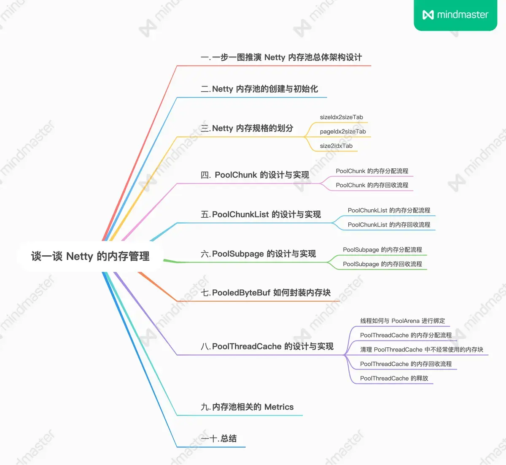](https://zhuanlan.zhihu.com/p/3043843441)

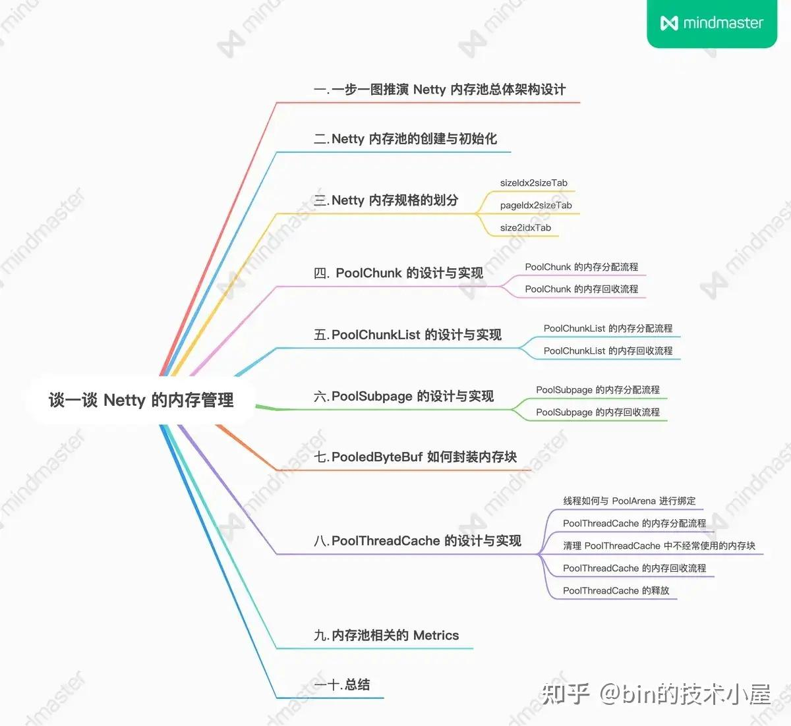

## 4\. PoolChunk 的设计与实现

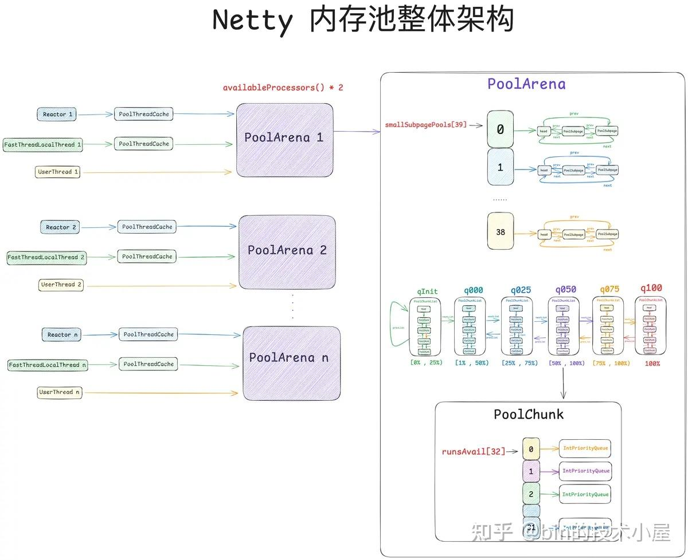

image.png

如上图所示，PoolChunk 在整个内存池的 [架构设计](https://zhida.zhihu.com/search?content_id=249631267&content_type=Article&match_order=1&q=%E6%9E%B6%E6%9E%84%E8%AE%BE%E8%AE%A1&zhida_source=entity) 中是属于最基础的 [数据结构](https://zhida.zhihu.com/search?content_id=249631267&content_type=Article&match_order=1&q=%E6%95%B0%E6%8D%AE%E7%BB%93%E6%9E%84&zhida_source=entity) ，负责管理 Page 级别的 [内存块](https://zhida.zhihu.com/search?content_id=249631267&content_type=Article&match_order=1&q=%E5%86%85%E5%AD%98%E5%9D%97&zhida_source=entity) ，Netty 中一个 Page 大小为 8K ，一个 PoolChunk 的大小为 4M ， 也就是说，一个 PoolChunk 管理着 512 个 Page 。

```
static final class DirectArena extends PoolArena<ByteBuffer> {
        @Override
        protected PoolChunk<ByteBuffer> newChunk(int pageSize, int maxPageIdx,
            int pageShifts, int chunkSize) {
            if (sizeClass.directMemoryCacheAlignment == 0) {
                // 分配一个 4M 大小的 DirectByteBuffer
                ByteBuffer memory = allocateDirect(chunkSize);
                // 创建 PoolChunk，管理这 4M 的内存空间
                return new PoolChunk<ByteBuffer>(this, memory, memory, pageSize, pageShifts,
                        chunkSize, maxPageIdx);
            }
            // 如果是需要按照指定的 Alignment 对齐的话
            // 则申请 4M +  directMemoryCacheAlignment 大小的 DirectByteBuffer
            final ByteBuffer base = allocateDirect(chunkSize + sizeClass.directMemoryCacheAlignment);
            // 将 DirectByteBuffer 的 position 位置与 directMemoryCacheAlignment 对齐
            final ByteBuffer memory = PlatformDependent.alignDirectBuffer(base, sizeClass.directMemoryCacheAlignment);
            // 地址对齐之后，创建 PoolChunk
            return new PoolChunk<ByteBuffer>(this, base, memory, pageSize,
                    pageShifts, chunkSize, maxPageIdx);
        }
}
```

在创建 PoolChunk 的时候，Netty 首先会向 OS 申请一段 4M 大小的内存空间，然后由 JDK 将这 4M 的内存空间包装成 DirectByteBuffer，封装在 PoolChunk 的 base ， memory 字段中。

```
final class PoolChunk<T> {
    // PoolChunk 底层依赖的这 4M 内存空间用 JDK 的 ByteBuffer 包装
    final Object base;
    // 内存地址对齐之后的 ByteBuffer
    final T memory;
}
```

有了这基础的 4M 内存空间之后，Netty 会在这个基础之上近一步建立核心的管理结构，比如第一小节中介绍的核心数据结构 runsAvail ，来组织不同 Page 级别的内存块。

```
private final IntPriorityQueue[] runsAvail;
```

除此之外，Netty 还定义了一些概念用于从不同的角度上来描述内存块，并在此基础上设计了一些辅助管理结构。下面我们先将这些基础概念一一梳理清楚：

1. Page 这个概念我们前面已经多次提到了，它是内存池的基本管理单位，PoolChunk 就是按照 Page 为粒度来管理内存的。一个 Page 尺寸为 8K 。
2. Run 指的是一个或者多个 Page, 它是 PoolChunk 的基本管理单位，可以用来分配 Normal 规格的内存块，以及分配 Subpage。
3. Subpage 本质上也是一个 Run，内部包含了一个或者多个 Page, 负责管理 Small 规格的内存块，对应的管理结构就是第一小节中介绍的 PoolSubpage，沿袭了内核中的 slab 设计思想，将一个 Run 按照 Small 规格切分成多个小内存块。
4. [Handle](https://zhida.zhihu.com/search?content_id=249631267&content_type=Article&match_order=1&q=Handle&zhida_source=entity) 用于描述一个内存块，其实 Run, Subpage 也表示的是内存块，只不过它们是在内存管理的角度上对内存块的描述，而 Handle 特指的是从内存池中分配出去的内存块，对于 Normal 规格的内存块来说，这个 Handle 其实就是一个 Run, 对于 Small 规格的内存块来说，这个 Handle 就是从 Subpage 中分配出去的一个小内存块。Netty 会将 Handle 转换成 PooledByteBuf 返回给用户使用。

PoolChunk 中的 4M 内存空间布局如下图所示：

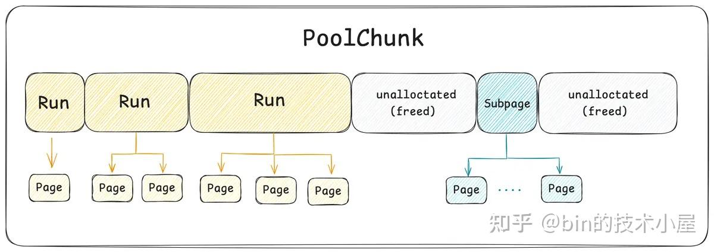

image.png

Run 和 Subpage 究其本质而言其实都是一个内存块，Netty 用一个叫做 Handle 的结构来描述所有不同尺寸的内存块，那么这个 Handle 到底是一个什么样的数据结构呢 ？ 其实很简单，它就是一个 long 型的整数，其 64 位 bit 布局如下图所示：


image.png

Handle 的这 64 位 bit 分别描述了内存块的五个信息，笔者从高位到低位依次介绍一下它们的含义：

首先 PoolChunk 是按照 Page 为粒度来管理内存的，而 Run 用于描述一个或者多个 Page，因此 PoolChunk 中内存管理的基本单位是 Run 。

其次 Normal 内存规格以及 Small 内存规格的内存块全部来自于 PoolChunk，对于 Normal 规格来说其实就是 PoolChunk 中的一个 Run, 对于 Small 规格来说就是 PoolSubpage 中的一个小内存块，而 PoolSubpage 本身也是一个 Run。

所以对于一个内存块来说，我们首先需要清楚它是来自于 PoolChunk 中的哪一个 Run, 这就用到了 Handle 中的 runOffset，用第 49 到 63 位共 15 个 bits 表示。runOffset 指的是该内存块在 PoolChunk 中的偏移，注意这里的偏移单位是 Page 。

第 34 到 48 位共 15 个 bits 表示 size, size 指的是该内存块包含的 Page 个数。

```
private static final int SIZE_BIT_LENGTH = 15;
```

第 33 位共 1 个 bit 表示该内存块是否已经被分配了（isUsed）。

```
private static final int INUSED_BIT_LENGTH = 1;
```

第 32 位共 1 个 bit 表示该内存块是否作为 PoolSubpage 来管理 Small 内存规格 。

```
private static final int SUBPAGE_BIT_LENGTH = 1;
```

到目前为止，这些信息就足够表示一个 Normal 规格的内存块了。有了 runOffset，我们可以知道这个内存块的起始位置，也就是内存块中第一个 Page 在 PoolChunk 中的偏移。有了 size ，我们就可以知道这个内存块包含的 Page 个数。

那么对于 Small 规格的内存块来说，Handle 结构又该如何表示呢 ？ 我们知道 Small 规格的内存块是被 PoolSubpage 管理的，PoolSubpage 会将一个完整的 Run 按照 Small 规格的尺寸切分成多个大小相等的小内存块。


image.png

这些小内存块在 PoolSubpage 中用一个 bitmap 来描述，因此当我们用 Handle 结构来描述 Small 规格的内存块时，我们需要知道这个 Handle 具体表示的是 PoolSubpage 中哪一个小内存块，所以我们需要将这个小内存块在 bitmap 中的 index 记录在 Handle 结构中。

Handle 中的第 0 到 31 位共 32 个 bits 就是用来记录 bitmapIdx 的， 对于 Normal 规格的内存块来说（isSubpage = false）, 这 32 位 bit 全部是零。

```
private static final int BITMAP_IDX_BIT_LENGTH = 32;
```

为了快速地从 Handle 的 64 位 bits 中提取上述五种信息，Netty 定义了相关的 SHIFT 偏移。

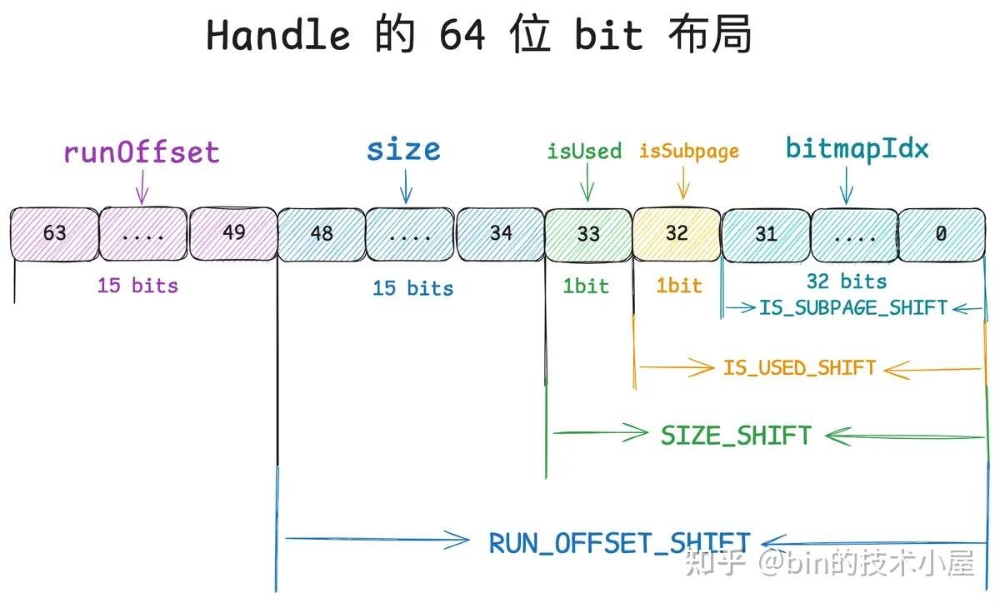

image.png

```
static final int IS_SUBPAGE_SHIFT = BITMAP_IDX_BIT_LENGTH;
    static final int IS_USED_SHIFT = SUBPAGE_BIT_LENGTH + IS_SUBPAGE_SHIFT;
    static final int SIZE_SHIFT = INUSED_BIT_LENGTH + IS_USED_SHIFT;
    static final int RUN_OFFSET_SHIFT = SIZE_BIT_LENGTH + SIZE_SHIFT;
```

将 handle 右移相关的 SHIFT 位就得到了相应的内存块信息：

```
static int runOffset(long handle) {
        return (int) (handle >> RUN_OFFSET_SHIFT);
    }

    static int runPages(long handle) {
        return (int) (handle >> SIZE_SHIFT & 0x7fff);
    }

    static boolean isUsed(long handle) {
        return (handle >> IS_USED_SHIFT & 1) == 1L;
    }

    static boolean isSubpage(long handle) {
        return (handle >> IS_SUBPAGE_SHIFT & 1) == 1L;
    }

    static int bitmapIdx(long handle) {
        return (int) handle;
    }
```

当我们从 PoolChunk 中申请一个 Run 时（Normal 规格的内存块），Netty 会通过 `toRunHandle` 将 Run 信息转换为 Handle 。

```
private static long toRunHandle(int runOffset, int runPages, int inUsed) {
        return (long) runOffset << RUN_OFFSET_SHIFT
               | (long) runPages << SIZE_SHIFT
               | (long) inUsed << IS_USED_SHIFT;
    }
```

当我们从 PoolSubpage 中申请一个 Small 规格的内存块时，Netty 会通过 `toHandle` 将小内存块信息转换为 Handle。

```
private long toHandle(int bitmapIdx) {
        // subPage 中包含的 page 个数
        int pages = runSize >> pageShifts;
        // 低 32 位保存 bitmapIdx
        return (long) runOffset << RUN_OFFSET_SHIFT
               | (long) pages << SIZE_SHIFT
               | 1L << IS_USED_SHIFT
               | 1L << IS_SUBPAGE_SHIFT
               | bitmapIdx;
    }
```

好了，现在 Run 的概念我们清楚了，它的本质就是 PoolChunk 这 4M 的内存空间中由一个或者多个 Page 组成的内存块，PoolChunk 中管理了多个不同尺寸的 Run。同时我们也明白了如何用 Handle 结构来表示一个 Run。那么接下来 PoolChunk 是如何管理这些 Run 呢 ？ 这就用到了第一小节中我们介绍的 runsAvail 数组，它是 Netty 中的伙伴系统实现。

```
private final IntPriorityQueue[] runsAvail;
```

在第三小节介绍 Netty 内存规格划分的时候，我们看到 Netty 一共划分了 32 种不同 Page 级别的内存块尺寸，当然了，现在我们应该用 Run 这个概念来描述这些内存块。相关的索引建立在 pageIdx2sizeTab 中。Run 的尺寸分别为：1 个 Page, 2 个 Page,......., 512 个 Page，共 32 种 Run 尺寸。

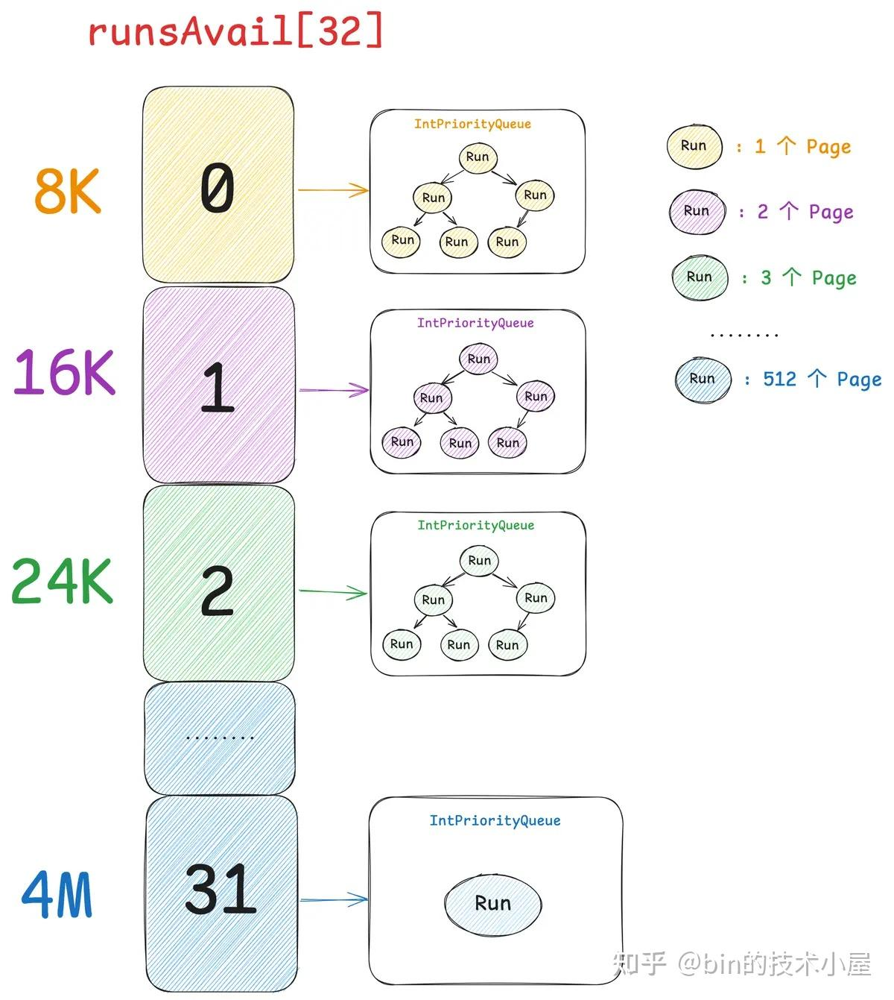

image.png

runsAvail 数组的大小也是 32 ，很容易理解，数组中的每一个 IntPriorityQueue 用于组织相同尺寸的 Run，而且这些 Run 是按照 [内存地址](https://zhida.zhihu.com/search?content_id=249631267&content_type=Article&match_order=2&q=%E5%86%85%E5%AD%98%E5%9C%B0%E5%9D%80&zhida_source=entity) 从低到高的顺序组织在这个 IntPriorityQueue 中。这样我们每次向 PoolChunk 申请的 Run 都是从低地址开始。runsAvail 的下标对应的就是 pageIdx2sizeTab 中的 pageIndex 。

```
// 参数 size 就是 SizeClasses 中计算出的 nPSizes，共 32 种 Run 尺寸
    private static IntPriorityQueue[] newRunsAvailqueueArray(int size) {
        IntPriorityQueue[] queueArray = new IntPriorityQueue[size];
        for (int i = 0; i < queueArray.length; i++) {
            queueArray[i] = new IntPriorityQueue();
        }
        return queueArray;
    }
```

除此之外，Netty 还设计了一个辅助性的数据结构 —— runsAvailMap，runsAvail 我们知道，它是 Netty 中的伙伴系统，用于组织管理 PoolChunk 中不同大小尺寸的 Run 。而 runsAvailMap 则是建立 Run 在 PoolChunk 中的 Page 偏移索引。Key 是 runOffset, Value 则是 Run 对应的 Handle 结构。

```
private final LongLongHashMap runsAvailMap;
```

每当一个新的 Run 被加入到 runsAvail 之后，Netty 都会将这个 Run 中第一个 Page 的 runOfffset 以及最后一个 Page 的 runOfffset 添加到 runsAvailMap 中。也就是说 PoolChunk 中的任意一个 Run, 对应到 runsAvailMap 中都会有相应的两条索引。

1. key: 第一个 Page 的 runOffset ，value: Run 对应的 Handle 结构
2. key: 最后一个 Page 的 runOffset ，value: Run 对应的 Handle 结构

这里的 runOffset 就是相关 Page 在 PoolChunk 中的偏移。

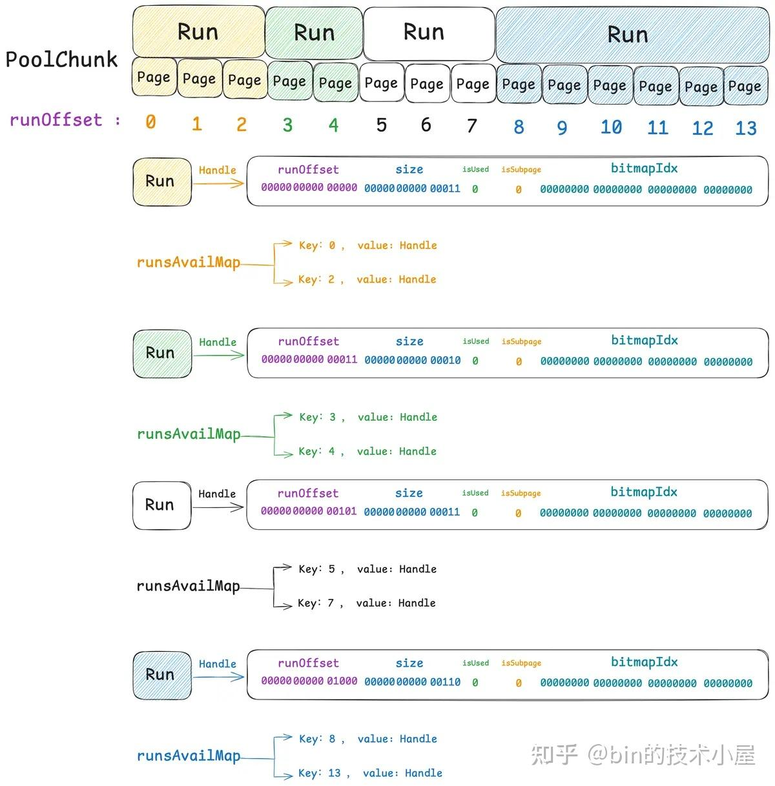

image.png

Netty 这里设计这个 runsAvailMap 的目的是用来做什么的呢 ？ 经过第一小节的内容介绍我们知道，当我们将一个内存块 Run 释放回 PoolChunk 的时候会涉及到连续内存块合并的过程，内核中的 [伙伴系统](https://zhida.zhihu.com/search?content_id=249631267&content_type=Article&match_order=3&q=%E4%BC%99%E4%BC%B4%E7%B3%BB%E7%BB%9F&zhida_source=entity) 也是这样。

```
private long collapseRuns(long handle) {
        // 在 PoolChunk 中首先不断地向前合并与 handle 内存连续的 Run
        // 然后在不断地向后合并内存连续的 Run，最终形成一个更大的 Run 存储到 runsAvail 中
        return collapseNext(collapsePast(handle));
    }
```

那 Netty 如何判断哪些内存块是连续的呢 ？这就用到了 runsAvailMap，因为它索引了每个内存块的 first page runOffset 和 last page runOffset ， 这样 Netty 就可以用 O(1) 的复杂度迅速找到在 PoolChunk 中连续的内存块 Run 了。

比如说，我们现在要将下图中白色的 Run 释放回 PoolChunk，那么 Netty 就需要找到所有与白色 Run 连续的 Run。很明显，绿色的 Run 与白色 Run 前面连续，蓝色的 Run 与白色 Run 后面连续。

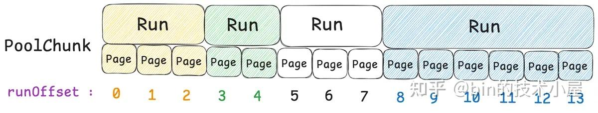

image.png

首先 Netty 会在 `collapsePast` 中不断的向前合并与白色 Run 连续的 Run，白色 Run 的 runOffset 我们可以通过前面介绍的 `runOffset(handle)` 获得，如果白色 Run 前面有连续的 Run, 那么这个 Run 的 last page runOffset 一定是 runOffset - 1 。这时我们就可以通过 runOffset - 1 到 runsAvailMap 中去查找是否有这条索引。

```
int runOffset = runOffset(handle);
long pastRun = getAvailRunByOffset(runOffset - 1);
```

比如，白色 Run 的 runOffset 是 5 ， 我们通过 4 去 runsAvailMap 中一下就找到了绿色 Run 的 Handle 结构，然后我们将白色 Run 与绿色 Run 合并成一个更大的 Run。合并之后的 runOffset 就是绿色 Run 的 runOffset (3), 合并之后的 size 就是原来白色 Run 和绿色 Run 的 size 之和（5）。

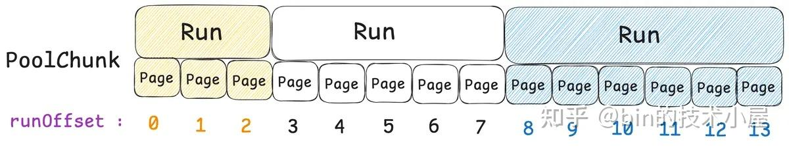

image.png

```
// 白色 Run 的 size (包含 Page 的个数)
           int runPages = runPages(handle);
           // 绿色 Run 的 runOffset
           int pastOffset = runOffset(pastRun);
           // 绿色 Run 的 size
           int pastPages = runPages(pastRun);

           if (pastRun != handle && pastOffset + pastPages == runOffset) {
                // 清除绿色 Run 在 runsAvailMap 中的相关索引
                removeAvailRun(pastRun);
                // 白色，绿色合并成一个更大的 Run,
                // 新的 runOffset 为绿色 Run 的 runOffset
                // 新的 size 为两者之和
                handle = toRunHandle(pastOffset, pastPages + runPages, 0);
            }
```

当第一轮合并结束之后，我们还需要继续向前不断的合并，因为有可能还存在与新的 Run 内存连续的 Run（黄色），于是重复上述合并过程，用新的 runOffset - 1 (2) 再去 runsAvailMap 中查找，发现有一个黄色的 Run。继续合并，直到前面完全没有连续的 Run 为止。

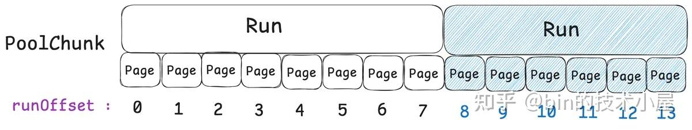

image.png

```
private long collapsePast(long handle) {
        // 不断地向前合并内存连续的 Run
        for (;;) {
            // 释放内存块的 runOffset
            int runOffset = runOffset(handle);
            // 释放内存块 size （包含 Page 的个数）
            int runPages = runPages(handle);
            // 查看该内存块前面是否有连续的 Run
            // 如果有 pastRun 中的 lastPageOffset 一定是 runOffset - 1
            long pastRun = getAvailRunByOffset(runOffset - 1);
            if (pastRun == -1) {
                // 前面不存在连续的 Run 则停止向前合并
                return handle;
            }
            // 连续内存块的 runOffset
            int pastOffset = runOffset(pastRun);
            // 连续内存块的 size
            int pastPages = runPages(pastRun);

            // is continuous
            if (pastRun != handle && pastOffset + pastPages == runOffset) {
                // 将 pastRun 在 runsAvailMap 中的相关索引删除
                removeAvailRun(pastRun);
                // 重新合并成一个更大的 Run
                handle = toRunHandle(pastOffset, pastPages + runPages, 0);
            } else {
                // 前面没有连续的 Run , 停止向前合并
                return handle;
            }
        }
    }
```

当向前合并的过程结束之后，Netty 紧接着就会向后继续合并，如果后面存在连续的 Run， 那么这个 nextRun 的 runOffset 一定是待合并 Run 的 runOffset 加上 runPages。比如上图中展示的白色 Run, 它的 runOffset = 0, runPages = 8。蓝色 Run 与它连续，runOffset 为 8 。

当白色 Run 与蓝色 Run 合并之后，就形成了一个新的更大的 Run，它的 runOffset 就是白色 Run 的 runOffset (0), 它的 size 就是两者之和。

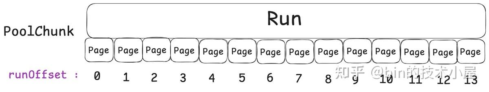

image.png

```
private long collapseNext(long handle) {
        // 这里的 handle 就是向前合并之后新的 Run
        // 不断的向后合并连续的 Run
        for (;;) {
            int runOffset = runOffset(handle);
            int runPages = runPages(handle);
            // 向后查找内存连续的 Run, nextRun 的 firstPageOffset = runOffset + runPages
            long nextRun = getAvailRunByOffset(runOffset + runPages);
            if (nextRun == -1) {
                // 后面不存在内存连续的 Run
                return handle;
            }

            int nextOffset = runOffset(nextRun);
            int nextPages = runPages(nextRun);

            //is continuous
            if (nextRun != handle && runOffset + runPages == nextOffset) {
                //remove next run
                removeAvailRun(nextRun);
                handle = toRunHandle(runOffset, runPages + nextPages, 0);
            } else {
                return handle;
            }
        }
    }
```

当所有连续的 Run 全部合并之后，Netty 就会将这个更大的 Run 放入 runsAvail 中缓存起来。

以上就是 PoolChunk 关于 Run 管理的核心内容，但 PoolChunk 除了负责分配 Run 之外，还会分配 PoolSubpage。由这个 PoolChunk 分配出去的所有 PoolSubpage 都会被组织在 subpages 数组中。

```
/**
     * manage all subpages in this chunk
     */
    private final PoolSubpage<T>[] subpages;
```

而 subpages 数组中的索引就是对应 PoolSubpage 的 runOffset ，一个 PoolChunk 中一共有 512 个 Page, 相应的 runOffset 就会有 512 种，所以 subpages 数组的长度为 512 。

```
subpages = new PoolSubpage[chunkSize >> pageShifts];
```


image.png

那么 Netty 设计这个 subpages 数组的目的又是什么呢 ？我们都知道 PoolSubpage 主要是负责分配 Small 规格的小内存块的，那么当我们要释放一个 Small 规格的小内存回内存池的时候，我们该如何判断这个小内存块到底属于哪个 PoolSubpage 呢 ？

这就用到了这里的 subpages 数组，经过前面的介绍我们知道，Netty 中所有尺寸的内存块都会用一个 Handle 结构来描述，我们可以通过 `runOffset(long handle) ` 找到该内存块在 PoolChunk 中的 runOffset，有了 runOffset 就可以到 subpages 数组中找到对应的 PoolSubpage 了。然后将这个小内存块释放回对应的 PoolSubpage 中。

现在 PoolChunk 的整个管理架构笔者就介绍完了，除去整个架构之外，这里要额外提一点的是 PoolChunk 还有一个 cachedNioBuffers 缓存结构，它里面缓存的是 ByteBuffer。

```
private final Deque<ByteBuffer> cachedNioBuffers;
```

默认情况下，cachedNioBuffers 可以缓存 1023 个 ByteBuffer，我们可以通过 `-Dio.netty.allocator.maxCachedByteBuffersPerChunk` 参数来进行调节。

```
DEFAULT_MAX_CACHED_BYTEBUFFERS_PER_CHUNK = SystemPropertyUtil.getInt(
                "io.netty.allocator.maxCachedByteBuffersPerChunk", 1023);
```

那么这里的 cachedNioBuffers 是干什么的 ？ 它里面缓存的这些 ByteBuffer 又是什么呢 ？

在本小节的开始，笔者介绍过，当我们创建一个 PoolChunk 的时候，Netty 首先会向 OS 申请一段 4M 大小的内存空间，随后由 JDK 将这 4M 的内存空间封装成 DirectByteBuffer，保存在 PoolChunk 的 memory 字段中。也就是说，PoolChunk 中的这 4M 内存空间是由 JDK 的 ByteBuffer 来描述的。

```
final class PoolChunk<T> {
    // PoolChunk 底层依赖的这 4M 内存空间用 JDK 的 ByteBuffer 包装
    // memory 就是 PoolChunk 底层的 ByteBuffer（4M）
    final T memory;
}
```

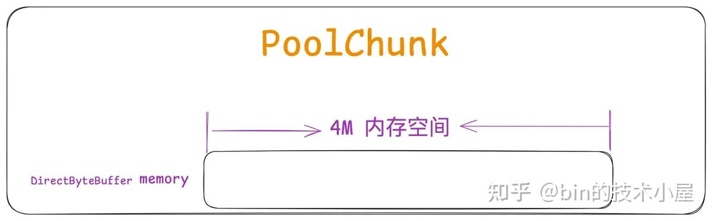

image.png

当我们向 PoolChunk 申请到一个 Run （下图绿色部分）之后，注意，这个 Run 现在的表现形式只是一个 Handle 结构，我们需要将其包装 PooledByteBuf 返回给用户使用。

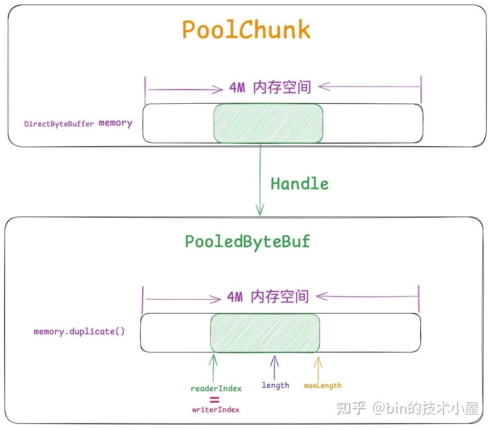

image.png

而这个 PooledByteBuf 其实直接操作的是 PoolChunk 中的 memory（ByteBuffer），只不过 PooledByteBuf 拥有自己独立的相关 index, 这些 index 将这个 PooledByteBuf 的可操作内存范围控制在上图中 readerIndex 到 length 之间。

```
abstract class PooledByteBuf<T> {
    int readerIndex;
    int writerIndex;
    // 我们向内存池请求的内存大小 , 其实就是 ByteBuf 的 capacity
    protected int length;
    // 内存池实际分配给我们的内存大小
    int maxLength;
    // PoolChunk 中 memory 的 duplicate 视图
    ByteBuffer tmpNioBuf;
}
```

因此每一个 PooledByteBuf 都需要依赖一个 tmpNioBuf，这个 tmpNioBuf 正是 PoolChunk 中 memory 的 duplicate 视图，其底层依赖的 4M 内存空间和 PoolChunk 是一模一样的。

```
@Override
    protected ByteBuffer newInternalNioBuffer(ByteBuffer memory) {
        return memory.duplicate();
    }
```

当内存池创建 PooledByteBuf 的时候都需要传入一个完整的 PoolChunk 内存视图（memory.duplicate） ，这些内存视图就缓存在 cachedNioBuffers 中，里面的 ByteBuffer 正是 PoolChunk 中 memory 的 duplicate 视图。

好了，到现在为止，PoolChunk 中所有的核心组件设计，笔者就全部介绍完了，但目前的 PoolChunk 只是刚刚被创建出来，还是一个空的 PoolChunk，其内部伙伴系统 runsAvail 中没有任何的 Run 。

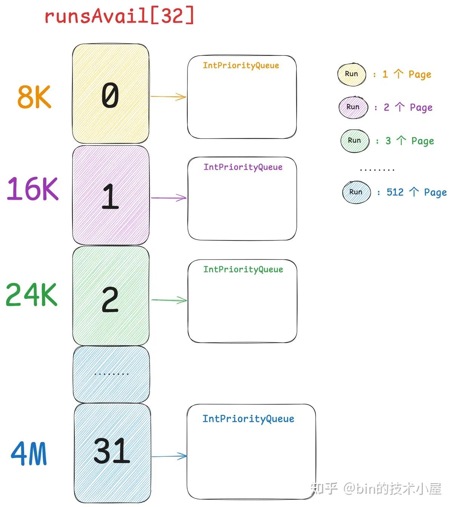

image.png

那么在初始状态下，Netty 会将 PoolChunk 的这 4M 内存空间组装成一个大的 Run，放入到 runsAvail 中。

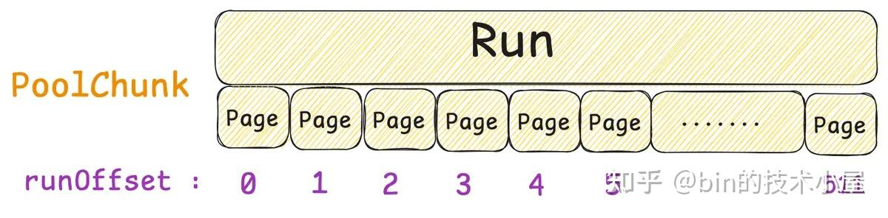

image.png

该 Run （initHandle）的 runOffset = 0, size = 512, isUsed = 0, isSubpage = 0, bitmapIdx = 0。

```
int pages = chunkSize >> pageShifts;
long initHandle = (long) pages << SIZE_SHIFT;
// 插入到 runsAvail 中
insertAvailRun(0, pages, initHandle);
```

随后通过 `insertAvailRun` 方法将 initHandle 插入到中 runsAvail 中，但在插入之前我们需要知道这个 initHandle 应该插入到哪一个 IntPriorityQueue 中。

initHandle 的尺寸 size 是 512 个 Page (4M), 在第三小节介绍的 Page 规格表 pageIdx2sizeTab 中，我们可以看到 4M 对应的 pageIndex 为 31。所以这个 initHandle 最终会被插入到 runsAvail\[31\] 中。

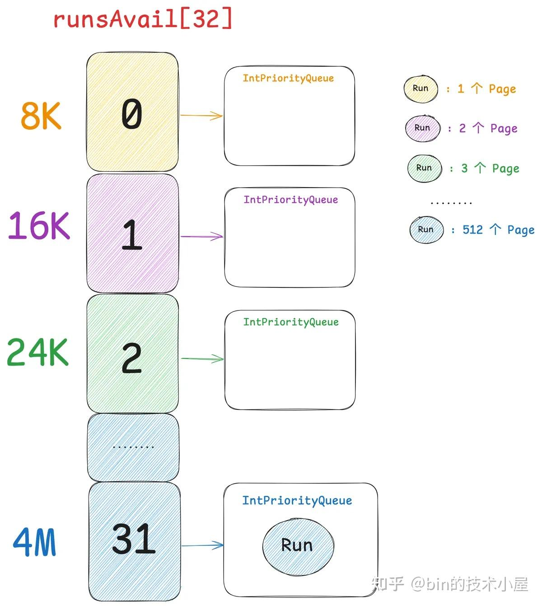

image.png

```
private void insertAvailRun(int runOffset, int pages, long handle) {
        // 512 个 Page 在 Page 规格表中对应的 pageIdx 为 31
        int pageIdxFloor = arena.sizeClass.pages2pageIdxFloor(pages);
        IntPriorityQueue queue = runsAvail[pageIdxFloor];
        // 将 4M 的 Run 插入到 runsAvail[31] 中
        queue.offer((int) (handle >> BITMAP_IDX_BIT_LENGTH));
        // 将 Run 中第一个 Page 的 runOffset 以及最后一个 Page 的 runOffset 插入到 runsAvailMap 中
        insertAvailRun0(runOffset, handle);
        if (pages > 1) {
            insertAvailRun0(lastPage(runOffset, pages), handle);
        }
    }
```

每当向 runsAvail 中插入一个 Run 之后，Netty 都会将该 Run 中第一个 Page 的 runOffset (0) 以及最后一个 Page 的 runOffset (511) 插入到 runsAvailMap 中。

```
private void insertAvailRun0(int runOffset, long handle) {
        long pre = runsAvailMap.put(runOffset, handle);
        assert pre == -1;
    }
```

现在一个完整的 PoolChunk 就被初始化好了，下面是 PoolChunk 的完整创建过程：

```
PoolChunk(PoolArena<T> arena, Object base, T memory, int pageSize, int pageShifts, int chunkSize, int maxPageIdx) {
        // 只对 4M 的 PoolChunk 进行池化
        unpooled = false;
        // PoolChunk 所属的 PoolArena
        this.arena = arena;
        // PoolChunk 底层依赖的 JDK ByteBuffer (4M)
        this.base = base;
        this.memory = memory;
        // 8K
        this.pageSize = pageSize;
        // 13
        this.pageShifts = pageShifts;
        // 4M
        this.chunkSize = chunkSize;
        // PoolChunk 剩余的内存空间，初始为 4M
        freeBytes = chunkSize;
        // 创建 runsAvail 数组，Netty 中的伙伴系统
        // index 为 PageIndex
        runsAvail = newRunsAvailqueueArray(maxPageIdx);
        runsAvailLock = new ReentrantLock();
        // runsAvail 中所有 Run 的 first page runOffset 以及 last page runOffset
        runsAvailMap = new LongLongHashMap(-1);
        // 负责组织所有由这个 PoolChunk 分配出去的 PoolSubpage
        // index 为 PoolSubpage 的 runOffset
        subpages = new PoolSubpage[chunkSize >> pageShifts];
        // PoolChunk 在初始状态下只有一个 Run
        // size 为 512 个 Page（4M）
        int pages = chunkSize >> pageShifts;
        // 初始run : runOffset = 0 (15 bit) , size = 512(15 bits) , isUsed = 0 (1bit) , isSubpage = 0 (1bit), bitmapIdx = 0 (32bits)
        long initHandle = (long) pages << SIZE_SHIFT;
        // 将初始 run 插入到 runsAvail 数组中
        insertAvailRun(0, pages, initHandle);
        // 可缓存 1023 个 memory 的 duplicate 视图
        cachedNioBuffers = new ArrayDeque<ByteBuffer>(8);
    }
```

PoolChunk 里面还有一个 `unpooled` 属性，用来指定该 PoolChunk 是否加入到内存池中管理。

```
final boolean unpooled;
```

一个普通的 PoolChunk 大小为 4M ， 负责分配 PoolSubpage（管理 Small 规格的内存块）以及 Normal 规格的内存块，那么这种类型的 PoolChunk 肯定是要被内存池管理的（unpooled = false）。


image.png

但除了 Small 规格和 Normal 规格之外，Netty 还有一种 Huge 规格（超过 4M），而内存池并不会管理 Huge 规格的内存块，当我们申请的内存超过 4M 的时候，Netty 会直接向 OS 进行申请，并不会经过内存池。释放的时候也是直接释放回 OS 中。

```
abstract class PoolArena<T> {

    private void allocate(PoolThreadCache cache, PooledByteBuf<T> buf, final int reqCapacity) {
        // 获取 reqCapacity 在 sizeIdx2sizeTab 中的 index（对应的内存规格 index）
        final int sizeIdx = sizeClass.size2SizeIdx(reqCapacity);
        // [16B , 28K] 之间是 small 规格的内存
        if (sizeIdx <= sizeClass.smallMaxSizeIdx) {
            tcacheAllocateSmall(cache, buf, reqCapacity, sizeIdx);
        } else if (sizeIdx < sizeClass.nSizes) {
            // [32K , 4M] 之间是 normal 规格的内存
            tcacheAllocateNormal(cache, buf, reqCapacity, sizeIdx);
        } else {
            // 超过 4M 就是 Huge 规格
            int normCapacity = sizeClass.directMemoryCacheAlignment > 0
                    ? sizeClass.normalizeSize(reqCapacity) : reqCapacity;
            // huge 内存规格直接向操作系统申请，不会被内存池管理
            allocateHuge(buf, normCapacity);
        }
    }
}
```

对于 Huge 规格的内存块的来说，Netty 也会用 PoolChunk 这个结构来描述，但很明显 Huge 规格并不会被内存池管理，所以在 `allocateHuge` 方法分配 Huge 规格的 PoolChunk 时，这里的 unpooled 就会指定为 true。

```
/** Creates a special chunk that is not pooled. */
    PoolChunk(PoolArena<T> arena, Object base, T memory, int size) {
        // Huge 规格的内存块不会被内存池管理
        unpooled = true;
        this.arena = arena;
        this.base = base;
        this.memory = memory;
        pageSize = 0;
        pageShifts = 0;
        runsAvailMap = null;
        runsAvail = null;
        runsAvailLock = null;
        subpages = null;
        chunkSize = size;
        cachedNioBuffers = null;
    }
```

### 4.1 PoolChunk 的内存分配流程

PoolChunk 在内存池中的作用主要是负责分配 Page 级别的内存规格尺寸（Run），其中包括 Normal 规格的内存块，以及负责组织管理 Small 规格内存块的 PoolSubpage。

每一种 Run 尺寸，在 PoolChunk 中都会有一个专门的 IntPriorityQueue 来组织管理，Netty 一共划分了 32 种不同的 Run 尺寸，分别是：1 个 Page, 2 个 Page,......., 512 个 Page。每一种 Run 尺寸都会对应一个 pageIndex, 也就是第三小节中，笔者介绍的 Page 规格表 —— pageIdx2sizeTab。

32 种 Run 尺寸就对应 32 个 IntPriorityQueue，它们组织在 PoolChunk 中的 runsAvail 数组中，数组的 index 就是对应的 pageIndex。


image.png

当我们向 PoolChunk 申请一个 Run 的时候，我们就需要先到 pageIdx2sizeTab 中找到该 Run 尺寸对应的 pageIndex。比如，当我们申请 8K 的内存块时，对应的 pageIndex 就是 0 。

随后 Netty 就会根据这个 pageIndex 到 runsAvail 中找到对应 Run 尺寸的 IntPriorityQueue —— runsAvail\[pageIndex\], 这个 IntPriorityQueue 中管理的全部是相同尺寸的 Run 。剩下的事情就好办了，我们直接从 IntPriorityQueue 中获取一个内存地址最低的 Run 分配出去就好了。

如果不巧 runsAvail\[pageIndex\] 是空的，那我们就继续到上一层 runsAvail\[pageIndex+1\] 中去找，如果还是空的，那就继续逐级向上去找，直到找到一个不为空的 IntPriorityQueue。

```
private int runFirstBestFit(int pageIdx) {
        // 如果该 PoolChunk 是一个全新的，那么直接就到 runsAvail[31] 中去找
        // 因为此时 PoolChunk 中只会包含一个 Run （大小为 4M）
        if (freeBytes == chunkSize) {
            return arena.sizeClass.nPSizes - 1;
        }
        // 按照伙伴查找算法，先从 pageIdx 规格开始查找对应的 IntPriorityQueue 是否有内存块
        // 如果没有就一直向后查找，直到找到一个不为空的 IntPriorityQueue
        for (int i = pageIdx; i < arena.sizeClass.nPSizes; i++) {
            IntPriorityQueue queue = runsAvail[i];
            if (queue != null && !queue.isEmpty()) {
                return i;
            }
        }
        // 如果 chunk 全部分配出去了，则返回 -1
        return -1;
    }
```

但是这样一来，我们在 `runsAvail[pageIndex + n]` 中获取到的 Run 尺寸一定大于我们请求的 runSize，所以需要近一步将这个 Run 进行切分，切出一个 runSize 然后分配出去，剩下的重新归还到 runsAvail 中。

下面我们来一个具体的例子来说明 PoolChunk 的内存分配逻辑，假设现在有一个刚刚被初始化好的 PoolChunk，如下图所示。现在我们要向这个 PoolChunk 申请一个 8K 大小（runSize）的内存块。


image.png

首先我们要去 Page 规格表中找到 8K 对应的 pageIndex（0）：

```
// runSize 为 8K ，一个 Page 大小
        int pages = runSize >> pageShifts; // 1
        // 8K 对应在 pageIdx2sizeTab 中的 pageIdx 为 0
        int pageIdx = arena.sizeClass.pages2pageIdx(pages);
```

由于现在的 PoolChunk 刚刚被初始化好，所以 runsAvail\[0\] 中一定是空的，我们直接到 runsAvail\[31\] 中查找，发现对应的 IntPriorityQueue 中只有一个 Run，大小为 4M，一共 512 个 Page 。

但我们只需要 1 个 Page，所以需要将这个 4M 的 Run 分裂成两个小的 Run ， 第一个 Run 下图绿色部分，大小恰好 1 个 Page，分配出去。第二个 Run 下图黄色部分，大小为 511 个 Page ，重新归还回 PoolChunk。

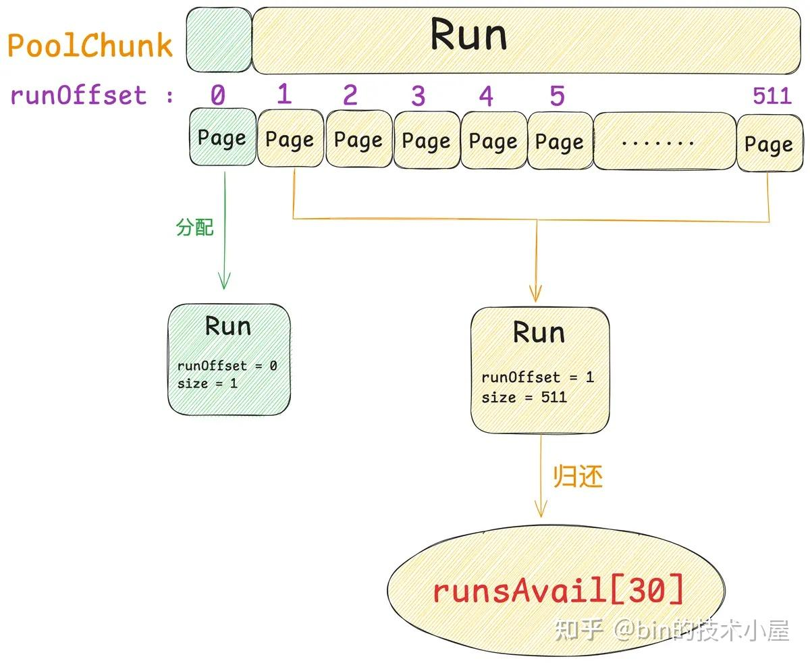

image.png

由于 511 个 Page 恰好在 3.5M 规格与 4M 规格之间，所以我们需要将黄色的 Run 归还到 runsAvail\[30\] 中。


image.png

下面是内存块分裂的实现逻辑：

```
// handle 表示即将要被分裂的 Run （4M）
    // needPages 表示我们要申请的 Page 规格（8K）
    private long splitLargeRun(long handle, int needPages) {
        assert needPages > 0;
        // handle 中包含的 pages 个数（512）
        int totalPages = runPages(handle);
        // 剩余 511 个 Page
        int remPages = totalPages - needPages;

        if (remPages > 0) {
            // handle 的 runOffset 为 0
            int runOffset = runOffset(handle);
            // 获取剩余内存块在 chunk 中的 runOffset (1)
            // [runOffset , availOffset - 1] 这段内存将会被分配出去
            int availOffset = runOffset + needPages; // 1
            // 将剩余的内存块重新包装成 Run，runOffset = 1 ,size = 511
            long availRun = toRunHandle(availOffset, remPages, 0);
            // 将剩余的 run, 重新放回到伙伴系统 runsAvail 中
            // 注意这里并不会向内核那样减半分裂，而是直接将 run 放回到 remPages 内存规格对应的 runsAvail 数组中
            insertAvailRun(availOffset, remPages, availRun);
            // 将 needPages 分配出去
            return toRunHandle(runOffset, needPages, 1);
        }

        // mark it as used
        handle |= 1L << IS_USED_SHIFT;
        return handle;
    }
```

PoolChunk 内存分配的总体逻辑如下：

```
// runSize 为申请的内存大小
    private long allocateRun(int runSize) {
        // 计算 runSize 包含多少个 pages
        int pages = runSize >> pageShifts;
        // 获取该 pages 尺寸对应在 pageIdx2sizeTab 中的 pageIdx
        int pageIdx = arena.sizeClass.pages2pageIdx(pages);

        runsAvailLock.lock();
        try {
            // 按照伙伴算法，从 pageIdx 开始在 runsAvail 数组中查找第一个不为空的 IntPriorityQueue
            int queueIdx = runFirstBestFit(pageIdx);
            // chunk 已经没有剩余内存了，返回 -1
            if (queueIdx == -1) {
                return -1;
            }
            // 获取 queueIdx 对应内存规格的 IntPriorityQueue
            IntPriorityQueue queue = runsAvail[queueIdx];
            // 获取内存地址最低的一个 run, 内存尺寸为 pageIdx2sizeTab[queueIdx]
            long handle = queue.poll();
            assert handle != IntPriorityQueue.NO_VALUE;
            // runOffset(15bits) , size(15bits) , isUsed(1bit), isSubPapge(1bit) , bitmapIndex(32bits)
            handle <<= BITMAP_IDX_BIT_LENGTH;
            assert !isUsed(handle) : "invalid handle: " + handle;
            // 从 runsAvailMap 中删除该 run 的 offset 信息
            removeAvailRun0(handle);
            // 如果该 run 尺寸恰好和我们请求的 runSize 一致，那么就直接分配
            // 如果该 run 尺寸大于我们请求的 runSize , 就需要将剩余的内存块放入到对应规格的 runsAvail 中
            handle = splitLargeRun(handle, pages);
            int pinnedSize = runSize(pageShifts, handle);
            // 相应减少 chunk 的剩余内存统计
            freeBytes -= pinnedSize;
            return handle;
        } finally {
            runsAvailLock.unlock();
        }
    }
```

### 4.2 PoolChunk 的内存回收流程

经过上一小节的内存分配流程之后，现在 PoolChunk 的结构如下图所示，只有一个大小为 511 个 Page 的 Run, 保存在 runsAvail\[30\] 中。

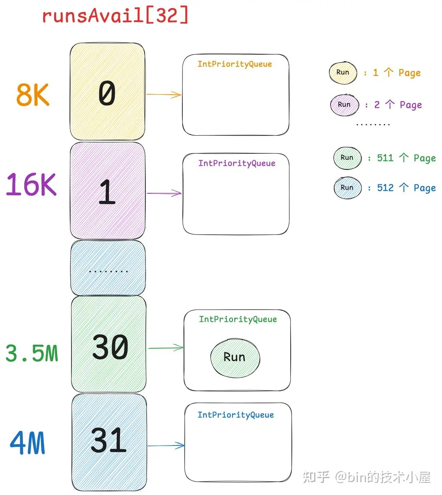

image.png

现在我们将刚刚申请到的这个 8K 的内存块重新释放回 PoolChunk 中，8K 在 Netty 的 Page 规格表中的 pageIndex 为 0 ，但和内存分配流程不同的是，这 8K 的内存块不能直接释放回 runsAvail\[0\] 中。

而是首先需要根据前面我们介绍的 runsAvailMap，在整个 PoolChunk 中不断的向前，向后查找与其连续的 Run ，然后将所有连续的 Run 合并成一个更大的 Run 释放到相应规格的 runsAvail 中。

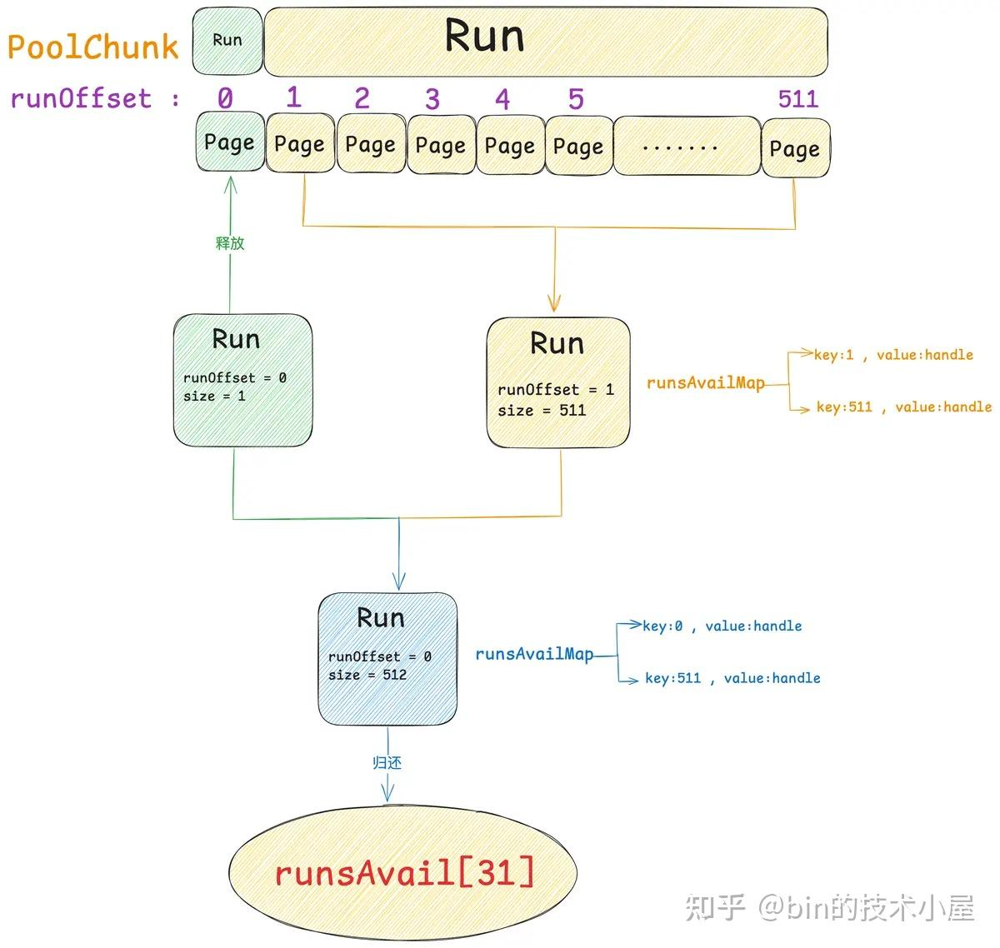

image.png

上图中绿色 Run 是我们要释放的 8K 内存块，因为它的 runOffset 为 0 ，是整个 PoolChunk 中第一个 Run ，所以无法向前合并。但此时 PoolChunk 有一个黄色的 Run 与其紧紧相邻，所以绿色 Run 需要与黄色的 Run 合并成一个更大的蓝色 Run。

这样一来就重新合并成了一个 4M 的 Run，归还到 runsAvail\[31\], 一切又回到了最初的起点。


image.png

```
// handle 表示要释放的内存块
    // nioBuffer 是 PooledByteBuf 底层依赖的 PoolChunk 中 memory 的 duplicate 视图
    // PooledByteBuf 用于包装 handle 给用户使用
    void free(long handle, int normCapacity, ByteBuffer nioBuffer) {
        // 获取要释放内存块大小，字节为单位
        int runSize = runSize(pageShifts, handle);
        // start free run
        runsAvailLock.lock();
        try {
            // 在 PoolChunk 不断的向前，向后合并连续的 Run
            long finalRun = collapseRuns(handle);
            // 重置 isUsed 位 = 0
            finalRun &= ~(1L << IS_USED_SHIFT);
            // 重置 isSubpage 位 = 0
            finalRun &= ~(1L << IS_SUBPAGE_SHIFT);
            // 将合并后的 finalRun 重新插入到伙伴系统中
            insertAvailRun(runOffset(finalRun), runPages(finalRun), finalRun);
            // 更新 PoolChunk 剩余内存的统计计数
            freeBytes += runSize;
        } finally {
            runsAvailLock.unlock();
        }
        // 将 nioBuffer 缓存到 cachedNioBuffers 中
        if (nioBuffer != null && cachedNioBuffers != null &&
            cachedNioBuffers.size() < PooledByteBufAllocator.DEFAULT_MAX_CACHED_BYTEBUFFERS_PER_CHUNK) {
            // 默认可以缓存 1023 个 nioBuffer（全部都是 PoolChunk 的 duplicates 视图）
            cachedNioBuffers.offer(nioBuffer);
        }
    }
```

## 5\. PoolChunkList 的设计与实现

内存池中的 PoolChunk 并不是一个一个孤立存在的，而是被 PoolArena 按照内存使用率的不同组织在六个 PoolChunkList 中。

```
abstract class PoolArena<T> {
    // 按照不同内存使用率组织 PoolChunk
    private final PoolChunkList<T> q050;  // [50% , 100%)
    private final PoolChunkList<T> q025;  // [25% , 75%)
    private final PoolChunkList<T> q000;  // [1% , 50%)
    private final PoolChunkList<T> qInit; // [0% , 25%)
    private final PoolChunkList<T> q075;  // [75% , 100%)
    private final PoolChunkList<T> q100;  // 100%
}
```


image.png

这六个 PoolChunkList 通过一个 [双向链表](https://zhida.zhihu.com/search?content_id=249631267&content_type=Article&match_order=1&q=%E5%8F%8C%E5%90%91%E9%93%BE%E8%A1%A8&zhida_source=entity) 相互关联起来。

```
final class PoolChunkList<T> {
    // 头指针，指向 List 中第一个 PoolChunk
    private PoolChunk<T> head;
    // 指向前一个 PoolChunkList
    private PoolChunkList<T> prevList;
    // 指向后一个 PoolChunkList
    private final PoolChunkList<T> nextList;
}
```

每一个 PoolChunkList 都规定了被其管理的 PoolChunk 内存使用率的上限和下限，随着内存分配的不断进行，PoolChunk 的内存使用率会越来越高，当达到上限时，就会被移动到下一个 PoolChunkList 中。而随着内存释放的不断进行，PoolChunk 的内存使用率会越来越低，当低于下限时，就会被移动到前一个 PoolChunkList 中。

这里比较特殊的两个 PoolChunkList 是 qInit 和 q000 ， q000 的前驱节点指向 null, 也就是说 q000 中的 PoolChunk 内存利用率只要低于 1% 就会被 Netty 释放回 OS, 这里设计 q000 的目的就是使得那些内存申请不那么频繁的 PoolChunk 能够被及时的释放掉，既然这些 PoolChunk 中内存使用的并不频繁，那么低于 1% 直接释放就好了，没必要继续停留在内存池中，增加不必要的内存消耗。

```
protected PoolArena(PooledByteBufAllocator parent, SizeClasses sizeClass) {
        // 按照不同内存使用率范围划分 PoolChunkList
        q100 = new PoolChunkList<T>(this, null, 100, Integer.MAX_VALUE, sizeClass.chunkSize);// [100 , 2147483647]
        q075 = new PoolChunkList<T>(this, q100, 75, 100, sizeClass.chunkSize);
        q050 = new PoolChunkList<T>(this, q075, 50, 100, sizeClass.chunkSize);
        q025 = new PoolChunkList<T>(this, q050, 25, 75, sizeClass.chunkSize);
        q000 = new PoolChunkList<T>(this, q025, 1, 50, sizeClass.chunkSize);
        qInit = new PoolChunkList<T>(this, q000, Integer.MIN_VALUE, 25, sizeClass.chunkSize);// [-2147483648 , 25]
        // 双向链表组织 PoolChunkList
        // 其中比较特殊的是 q000 的前驱节点指向 NULL
        // qInit 的前驱节点指向它自己
        q100.prevList(q075);
        q075.prevList(q050);
        q050.prevList(q025);
        q025.prevList(q000);
        q000.prevList(null);
        qInit.prevList(qInit);
    }
```

qInit 的前驱节点指向它自己，也就是说 qInit 中的 PoolChunk 内存利用率低于 0% 时，仍然会继续留在 qInit 中，不会被释放。这里设计 qInit 的目的就是始终让内存池至少有一个 PoolChunk，避免不必要的重复创建 PoolChunk。

```
// minUsage 为 PoolChunkList 中内存使用率的下限，单位是百分比
    // maxUsage 为 PoolChunkList 中内存使用率的上限，单位是百分比
    PoolChunkList(PoolArena<T> arena, PoolChunkList<T> nextList, int minUsage, int maxUsage, int chunkSize) {
        // 所属 PoolArena
        this.arena = arena;
        // 下一个 PoolChunkList
        this.nextList = nextList;
        // 该 PoolChunkList 中的 PoolChunk 内存占用率在 [minUsage , maxUsage)
        // 当 PoolChunk 中的内存占用率低于 minUsage 则将它移动到前一个 PoolChunkList 中 （prevList）
        // 当 PoolChunk 中的内存占用率达到 maxUsage 则将它移动到后一个 PoolChunkList 中 （nextList）
        this.minUsage = minUsage;
        this.maxUsage = maxUsage;
        // 计算该 PoolChunkList 中的 PoolChunk 可以分配出去的最大内存容量 ,单位为 byte
        // chunkSize * (100L - minUsage) / 100L)
        maxCapacity = calculateMaxCapacity(minUsage, chunkSize);
        // 将内存使用率的上限和下限转换成对应的阈值
        // PoolChunk 停留在 PoolChunkList 中的剩余内存最低阈值，达到该阈值则向后移动到 nextList
        freeMinThreshold = (maxUsage == 100) ? 0 : (int) (chunkSize * (100.0 - maxUsage + 0.99999999) / 100L);
        // PoolChunk 停留在 PoolChunkList 中的剩余内存最高阈值，高于该阈值则向前移动到 prevList
        freeMaxThreshold = (minUsage == 100) ? 0 : (int) (chunkSize * (100.0 - minUsage + 0.99999999) / 100L);
    }
```

这里我们需要将 PoolChunkList 的内存使用率上下限转换为对应的具体阈值，比如，maxUsage 表示的是 PoolChunkList 的内存使用率上限，PoolChunk 的内存使用率达到上限之后，就会被向后移动到下一个 PoolChunkList 。

但在具体的程序实现上，我们不可能直接用百分比来做这个判断，所以需要将 maxUsage 转换为 PoolChunk 停留在 PoolChunkList 中的剩余内存最低阈值 freeMinThreshold，当 PoolChunk 的剩余内存达到 freeMinThreshold 时，就会被向后移动到下一个 PoolChunkList。

同样的道理，这里也需要将 minUsage 转换为 PoolChunk 停留在 PoolChunkList 中的剩余内存最高阈值 freeMaxThreshold，当 PoolChunk 的剩余内存高于 freeMaxThreshold 时，就会被向前移动到上一个 PoolChunkList。

### 5.1 PoolChunkList 的内存分配流程

当我们向内存池申请 Normal 规格的内存块或者 PoolSubpage 的时候，Netty 首先会从 q050 中选择一个 PoolChunk 来分配内存，如果 q050 是空的，或者我们申请的内存尺寸太大，q050 中的 PoolChunk 无法满足，则继续按照 `q025 > q000 > qInit > q075` 这样的顺序来选择 PoolChunkList 分配内存。这么设计的目的，笔者在第一小节中已经介绍过了，核心就是为了让每个 PoolChunk 的服务周期更长一些。

如果这 6 个 PoolChunkList 全都无法满足本次内存的申请，那么 Netty 就会重新向 OS 申请一个 PoolChunk 分配内存，最后将这个新的 PoolChunk 加入到 qInit 中。

```
abstract class PoolArena<T> {
    private void allocateNormal(PooledByteBuf<T> buf, int reqCapacity, int sizeIdx, PoolThreadCache threadCache) {
        if (q050.allocate(buf, reqCapacity, sizeIdx, threadCache) ||
            q025.allocate(buf, reqCapacity, sizeIdx, threadCache) ||
            q000.allocate(buf, reqCapacity, sizeIdx, threadCache) ||
            qInit.allocate(buf, reqCapacity, sizeIdx, threadCache) ||
            q075.allocate(buf, reqCapacity, sizeIdx, threadCache)) {
            return;
        }

        // Add a new chunk.
        PoolChunk<T> c = newChunk(sizeClass.pageSize, sizeClass.nPSizes, sizeClass.pageShifts, sizeClass.chunkSize);
        boolean success = c.allocate(buf, reqCapacity, sizeIdx, threadCache);
        qInit.add(c);
    }
}
```

在进入 PoolChunkList 分配内存之前，我们首先需要判断该 PoolChunkList 中的 PoolChunk 能够提供的最大内存容量 maxCapacity —— `chunkSize * (100L - minUsage) / 100L)` 是否能够满足本次内存的申请。

如果连 maxCapacity 都无法满足，那么就按照 PoolChunkList 的分配顺序到下一个 PoolChunkList 去申请。

```
final class PoolChunkList<T> {
    boolean allocate(PooledByteBuf<T> buf, int reqCapacity, int sizeIdx, PoolThreadCache threadCache) {
        int normCapacity = arena.sizeClass.sizeIdx2size(sizeIdx);
        if (normCapacity > maxCapacity) {
            // 申请的内存尺寸太大，本 PoolChunkList 无法满足
            return false;
        }
        // 挨个遍历 PoolChunkList 中的 PoolChunk，直到内存分配成功
        for (PoolChunk<T> cur = head; cur != null; cur = cur.next) {
            if (cur.allocate(buf, reqCapacity, sizeIdx, threadCache)) {
                // PoolChunk 的剩余内存达到最小阈值，则向后移动
                if (cur.freeBytes <= freeMinThreshold) {
                    remove(cur);
                    nextList.add(cur);
                }
                return true;
            }
        }
        // 内存分配失败
        return false;
    }
}
```

如果 maxCapacity 可以满足，则从 PoolChunkList 的 [头结点](https://zhida.zhihu.com/search?content_id=249631267&content_type=Article&match_order=1&q=%E5%A4%B4%E7%BB%93%E7%82%B9&zhida_source=entity) 开始挨个遍历，直到找到一个 PoolChunk 能够完成本次的内存分配任务。当内存分配成功之后，PoolChunk 中的内存使用率会近一步上升，如果剩余内存容量达到了最小阈值 —— freeMinThreshold，也就是说 PoolChunk 中的内存使用率达到了上限，那么就会将该 PoolChunk 从当前的 PoolChunkList 中移除。

```
private void remove(PoolChunk<T> cur) {
        if (cur == head) {
            head = cur.next;
            if (head != null) {
                head.prev = null;
            }
        } else {
            PoolChunk<T> next = cur.next;
            cur.prev.next = next;
            if (next != null) {
                next.prev = cur.prev;
            }
        }
    }
```

然后将 PoolChunk 向后移动到下一个 PoolChunkList 中，但 nextList 也有自己的内存使用率范围限制，所以还需要再次判断 PoolChunk 的内存使用率是否达到了 nextList 的上限，如果达到，则继续向后移动，直到移动到 q100 为止。

```
void add(PoolChunk<T> chunk) {
        if (chunk.freeBytes <= freeMinThreshold) {
            nextList.add(chunk);
            return;
        }
        add0(chunk);
    }
```

如果 PoolChunk 的内存使用率在 nextList 的限定范围内，那么就将 PoolChunk 加入到 nextList 中（头插法）。

```
void add0(PoolChunk<T> chunk) {
        chunk.parent = this;
        if (head == null) {
            head = chunk;
            chunk.prev = null;
            chunk.next = null;
        } else {
            chunk.prev = null;
            chunk.next = head;
            head.prev = chunk;
            head = chunk;
        }
    }
```

### 5.2 PoolChunkList 的内存回收流程

当一个 Run 被释放回 PoolChunk 的时候，那么随着内存释放的不断进行，这个 PoolChunk 中的内存使用率会不断的降低，当内存使用率低于其所在 PoolChunkList 的下限时，也就是说 PoolChunk 中的剩余内存容量高于了最大阈值 —— freeMaxThreshold，那么这个 PoolChunk 就需要向前移动到上一个 prevList 中。

```
final class PoolChunkList<T> {
    boolean free(PoolChunk<T> chunk, long handle, int normCapacity, ByteBuffer nioBuffer) {
        // 内存块 handle 释放回 PoolChunk
        chunk.free(handle, normCapacity, nioBuffer);
        // PoolChunk 中的内存使用率低于该 PoolChunkList 的下限
        if (chunk.freeBytes > freeMaxThreshold) {
            remove(chunk);
            // 将 PoolChunk 移动到前一个 PoolChunkList 中
            return move0(chunk);
        }
        return true;
    }
}
```

但如果该 PoolChunk 原本所在的 PoolChunkList 是 q000 ，当 PoolChunk 的内存使用率低于 1% 之后，那么这个 PoolChunk 将不会继续向前移动，而是直接被 Netty 释放回 OS 中。

```
private boolean move0(PoolChunk<T> chunk) {
        // 该 PoolChunkList 是 q000 的情况
        if (prevList == null) {
            // 返回 false, 后续 Netty 会将该  PoolChunk 释放回 OS
            return false;
        }
        // 其他情况下，PoolChunk 则向前移动
        return prevList.move(chunk);
    }
```

这里还有一种特殊情况是，如果该 PoolChunk 原本所在的 PoolChunkList 是 qInit，那么即使这个 PoolChunk 的内存使用率低于 0% 了，Netty 仍然会让它继续停留在 qInit 中，但会将这个 PoolChunk 重新调整到 qInit 中的头结点处。

剩下的情况， PoolChunk 将会向前移动，但 prevList 也有自己的内存使用率范围限制，如果这个 PoolChunk 的内存使用率仍然低于 prevList 的下限，那么将会继续向前移动，直到移动到 q000 中。

```
private boolean move(PoolChunk<T> chunk) {
        if (chunk.freeBytes > freeMaxThreshold) {
            // PoolChunk 的内存使用率仍然低于 prevList 的下限，继续向前移动
            return move0(chunk);
        }
        // PoolChunk fits into this PoolChunkList, adding it here.（头插法）
        add0(chunk);
        return true;
    }
```

## 6\. PoolSubpage 的设计与实现

经过前面第一小节的介绍，我们多多少少已经对 PoolSubpage 的设计有了一定的了解，PoolSubpage 在内存池中主要负责分配 Small 规格的内存块，其本质其实还是一个 Run ，内部包含了一个或者多个 Page 。

其核心设计思想是首先向 PoolChunk 申请到一个 Run ， 然后按照 Small 规格将这个 Run 划分成多个大小相等的小内存块，每次申请时从 PoolSubpage 获取一个小内存块，每次释放时，将小内存块释放回对应的 PoolSubpage 中。


image.png

每一种 Small 内存规格在内存池中都会对应一个 PoolSubpage 的双向循环链表，链表中的 PoolSubpage 组织管理的全部都是对应 Small 规格的小内存块。

```
final class PoolSubpage<T> {
    PoolSubpage<T> prev;
    PoolSubpage<T> next;
}
```


image.png

Netty 一共设计了 39 种 Small 规格尺寸 —— \[16B, 28k\] ， 所以内存池中也就对应了 39 个 PoolSubpage 的双向循环链表，每个链表负责管理对应 Small 规格的内存块，这些链表被 PoolArena 组织在 smallSubpagePools 数组中， 数组的下标就是对应的 Small 规格在 SizeClasses 内存规格表中的 index 。

```
abstract class PoolArena<T> {
  // 管理 Small 规格内存块的核心数据结构
  final PoolSubpage<T>[] smallSubpagePools;
}
```


image.png

当内存池刚刚被创建出来的时候，smallSubpagePools 数组中的链表都还是空的，只包含一个头结点，没有任何的 PoolSubpage。


image.png

所以当我们第一次向内存池申请 Small 规格内存块的时候，首先需要到 PoolChunk 中申请一个 PoolSubpage 出来，那么我们究竟该申请多大的 PoolSubpage 呢 ？

Netty 会取 Small 规格尺寸与 PageSize 的 [最小公倍数](https://zhida.zhihu.com/search?content_id=249631267&content_type=Article&match_order=1&q=%E6%9C%80%E5%B0%8F%E5%85%AC%E5%80%8D%E6%95%B0&zhida_source=entity) 来作为 PoolSubpage 的尺寸。比如，我们申请一个 16 字节的内存块，那么对应的 PoolSubpage 大小就是 1 个 Page，里面可以容纳 512 个 16B 的小内存块 Element。

```
// Small 规格对应的 sizeIdx（规格 sizeIndex）
    private int calculateRunSize(int sizeIdx) {
        // 一个 page 最大可以容纳多少个内存块（Element）
        // pageSize / 16(最小内存块尺寸)
        int maxElements = 1 << pageShifts - SizeClasses.LOG2_QUANTUM;
        int runSize = 0;
        int nElements;
        // sizeIdx 对应的内存规格，PoolSubpage 将会按照 elemSize 进行切分
        final int elemSize = arena.sizeClass.sizeIdx2size(sizeIdx);
        // 查找 pageSize 与 elemSize 的最小公倍数
        do {
            runSize += pageSize;
            nElements = runSize / elemSize;
        } while (nElements < maxElements && runSize != nElements * elemSize);
        // PoolSubpage 切分出的内存块个数不能超过 maxElements（512）
        while (nElements > maxElements) {
            // runSize 太大了，缩减到 nElements <= maxElements
            runSize -= pageSize;
            nElements = runSize / elemSize;
        }
        // PoolSubpage 的最终尺寸
        return runSize;
    }
```

随后 Netty 会向 PoolChunk 申请一个 runSize 大小的 Run，然后封装成 PoolSubpage，并从 PoolSubpage 中分配一个小内存块出来。

```
final class PoolChunk {

    private long allocateSubpage(int sizeIdx, PoolSubpage<T> head) {
        // 计算 PoolSubpage 的尺寸，取对应的 Small 规格与 PageSize 的最小公倍数
        int runSize = calculateRunSize(sizeIdx);
        // 从 PoolChunk 申请一个 runSize 大小的 PoolSubpage
        long runHandle = allocateRun(runSize);
        if (runHandle < 0) {
            return -1;
        }

        int runOffset = runOffset(runHandle);
        // 对应的 Small 内存规格
        int elemSize = arena.sizeClass.sizeIdx2size(sizeIdx);
        // 根据 runHandle 创建 PoolSubpage
        PoolSubpage<T> subpage = new PoolSubpage<T>(head, this, pageShifts, runOffset,
                runSize(pageShifts, runHandle), elemSize);
        // 将 PoolSubpage 保存在 PoolChunk 的 subpages 数组中
        subpages[runOffset] = subpage;
        // 从 PoolSubpage 分配一个小内存块出去
        return subpage.allocate();
    }
}
```

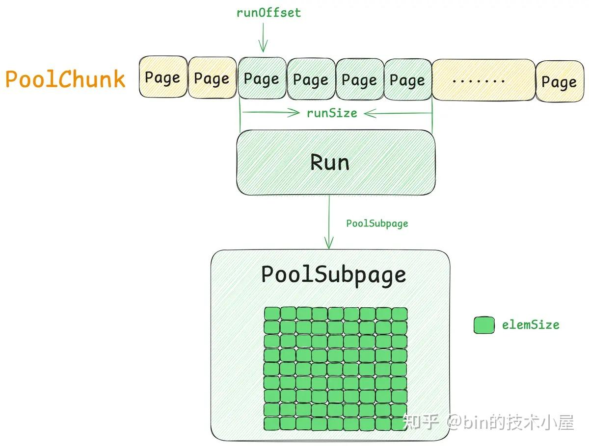

image.png

```
final class PoolSubpage {
    // head 表示该 PoolSubpage 在 smallSubpagePools 对应规格链表的头结点
    // 每个 PoolSubpage 链表都对应一个头结点
    // elemSize 表示需要被管理的 Small 规格尺寸
    PoolSubpage(PoolSubpage<T> head, PoolChunk<T> chunk, int pageShifts, int runOffset, int runSize, int elemSize) {
        // 该 PoolSubpage 管理的 elemSize 对应的 sizeIndex
        // 比如 16B 对应的 sizeIndex 是 0
        this.headIndex = head.headIndex;
        // PoolSubpage 所属的 PoolChunk
        this.chunk = chunk;
        // 13
        this.pageShifts = pageShifts;
        // PoolSubpage 在 PoolChunk 中的起始偏移（ page 粒度）
        this.runOffset = runOffset;
        // PoolSubpage 大小（字节单位）
        this.runSize = runSize;
        // PoolSubpage 管理的 Small 规格内存块大小
        this.elemSize = elemSize;
        doNotDestroy = true;
        // PoolSubpage 管理的内存块个数
        maxNumElems = numAvail = runSize / elemSize;
        // 创建一个 bitmap ，用于管理 PoolSubpage 中所有小内存块的状态
        // 以及索引这些小内存块在 PoolSubpage 中的位置
        int bitmapLength = maxNumElems >>> 6;
        if ((maxNumElems & 63) != 0) {
            bitmapLength ++;
        }
        this.bitmapLength = bitmapLength;
        bitmap = new long[bitmapLength];
        // 下一个可用内存块对应的 bitmapIndex，初始为 0
        nextAvail = 0;
        // 将该 Subpage 采用头插法插入到对应规格的 smallSubpagePools 中
        addToPool(head);
    }
}
```

PoolSubpage 最为核心的一个数据结构就是这个 bitmap ， PoolSubpage 的主要职责就是负责组织管理众多 Small 规格的小内存块，而每一个小内存块的分配状态及其在 PoolSubpage 的位置偏移，就要靠这里的 bitmap 来标识。

```
final class PoolSubpage {
    private final long[] bitmap;
    private final int bitmapLength;
}
```

我们看到 PoolSubpage 中的这个 bitmap 是一个 long 型的数组，Netty 用 1 个 bit 来标识小内存块的分配状态：0 表示未分配， 1 表示已分配。也就是说 Netty 用 1 个 bit 来表示 PoolSubpage 中的一个小内存块。

这样一来 bitmap 数组中的一个元素（long）就可以表示 64 个小内存块，那么这个 bitmap 数组的长度应该设置多少呢 ？

一个 PoolSubpage 的大小为 runSize ， 其中的小内存块尺寸为 elemSize，我们可以通过 `numAvail = runSize / elemSize` 计算出 PoolSubpage 中一共可以管理 numAvail 个小内存块。

bitmap 数组中的一个元素可以表示 64 个小内存块，那么整个 bitmap 数组的长度就是 `bitmapLength = maxNumElems >>> 6` 。这样一来，PoolSubpage 中的每一个小内存块都会对应一个唯一的 bitmapIndex 。

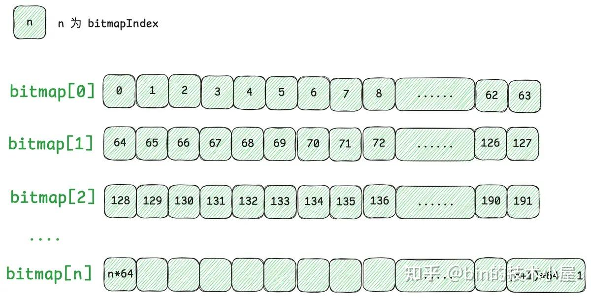

image.png

当我们从 PoolSubpage 中分配一个小内存块出去的时候，这个小内存块对应的 handle 结构低 32 位存储的就是内存块的 bitmapIndex。


image.png

runOffset 表示的就是这个小内存块所在的 PoolSubpage 在 PoolChunk 中的偏移，size 表示的是这个 PoolSubpage 包含的 Page 个数，bitmapIndex 表示它是 PoolSubpage 中第几个内存块。


image.png

而 PoolChunk 的起始内存地址我们是知道的，就是前面提到的 `memory`, PoolSubpage 在 PoolChunk 中的 runOffset 也有了，那么 PoolSubpage 的起始内存地址我们也就知道了 —— `memory + (runOffset << pageShifts)` 。

Small 规格的内存块在 PoolSubpage 中的 bitmapIndex 也有，那么这个小内存块的起始内存地址也就知道了 —— `memory + (runOffset << pageShifts) + bitmapIdx * elemSize` 。

现在 Small 规格内存块的起始内存地址有了，大小 elemSize 也有了，那么对应的 PooledByteBuf 相关的 index 就可以设置了，随后将这个 PooledByteBuf 返回给用户就可以直接使用了。

### 6.1 PoolSubpage 的内存分配流程

当一个新的 PoolSubpage 创建出来之后，它就会被加入到 smallSubpagePools 对应规格的 PoolSubpage 链表中（头插法）。

```
final class PoolSubpage {
    private void addToPool(PoolSubpage<T> head) {
        prev = head;
        next = head.next;
        next.prev = this;
        head.next = this;
    }
}
```

比如 16B 在内存规格表中的 index 是 0 ，那么其对应的 PoolSubpage 在刚被创建出来之后，就会插入到 smallSubpagePools\[0\] 中，如下图所示：

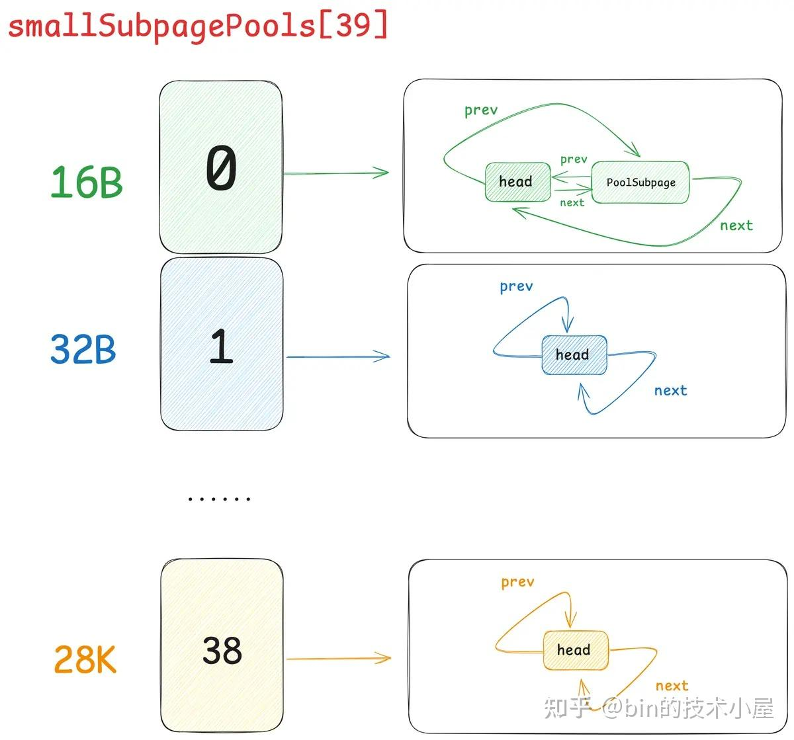

image.png

当我们向内存池申请 Small 规格的内存块时，内存池走的是 smallSubpagePools 来分配。首先我们需要到内存规格表中获取对应 Small 规格的 sizeIndex, 然后到 smallSubpagePools\[sizeIndex\] 中获取链表中第一个 PoolSubpage 来分配小内存块。

比如我们要向内存池申请一个 16B 大小的内存块，而 16B 在内存规格表中的 sizeIndex 是 0 ，那么我们就到 smallSubpagePools\[0\] 去获取对应的 PoolSubpage，然后从这个 PoolSubpage 中获取一个 16B 大小的内存块。

```
final class PoolChunk {

    boolean allocate(PooledByteBuf<T> buf, int reqCapacity, int sizeIdx, PoolThreadCache cache) {
        // 待分配内存块
        final long handle;
        // 分配 Small 规格的内存块走 smallSubpagePools
        if (sizeIdx <= arena.sizeClass.smallMaxSizeIdx) {
            final PoolSubpage<T> nextSub;
            // 获取对应规格 PoolSubpage 链表的头结点
            PoolSubpage<T> head = arena.smallSubpagePools[sizeIdx];
            head.lock();
            try {
                nextSub = head.next;
                // 如果链表为空，那么 head.next 指向的是自己
                if (nextSub != head) {
                    // 始终从链表中第一个 PoolSubpage 开始分配
                    handle = nextSub.allocate();
                    // 将对应 Small 规格的内存块封装成 PooledByteBuffer 返回
                    nextSub.chunk.initBufWithSubpage(buf, null, handle, reqCapacity, cache);
                    return true;
                }
                // 链表为空，则到 PoolChunk 中重新申请一个 PoolSubpage
                // 然后加入到 smallSubpagePools 对应规格的链表中
                handle = allocateSubpage(sizeIdx, head);
                if (handle < 0) {
                    return false;
                }
                assert isSubpage(handle);
            } finally {
                head.unlock();
            }
        } else {
           ...... 分配 Normal 规格内存块走 PoolChunk  ......
        }
        // 获取 PoolChunk 的 memory.duplicate() 视图缓存
        ByteBuffer nioBuffer = cachedNioBuffers != null? cachedNioBuffers.pollLast() : null;
        // nioBuffer 为 null 的话，后续访问 PooledByteBuffer 的时候通过 memory.duplicate() 创建
        // 将 handle 封装成 PooledByteBuffer 返回
        initBuf(buf, nioBuffer, handle, reqCapacity, cache);
        return true;
    }
}
```

那么如何从 PoolSubpage 中获取内存块呢 ？首先 PoolSubpage 的本质其实就是 PoolChunk 中的一个 Run ，里边包含了一个或者若干个 Page ，然后 Netty 会把这个 Run 按照对应的 Small 规格尺寸切分成多个大小相同的内存块组织在这个 PoolSubpage 中。


image.png

PoolSubpage 中每一个小内存块都会对应一个 bitmapIndex，用于标识其是 PoolSubpage 的第几个内存块。PoolSubpage 在 nextAvail 字段中缓存了下一个可供分配内存块的 bitmapIndex 。

在 PoolSubpage 的初始状态下，nextAvail 为 0 ，也就是说首先从 PoolSubpage 中的第一个内存块开始分配。除此之外，Netty 为了保证局部性，总是偏向于分配最近刚刚被释放的内存块，如果一个内存块刚被释放回 PoolSubpage ，那么 nextAvail 就会被设置成这个刚刚被释放内存块的 bitmapIndex 。下次分配的时候直接从 nextAvail 中获取即可。

```
final class PoolSubpage {

    private int nextAvail;

    private int getNextAvail() {
        // 初始为 0
        int nextAvail = this.nextAvail;
        if (nextAvail >= 0) {
            this.nextAvail = -1;
            return nextAvail;
        }
        // nextAvail 为 -1 ，表示此时没有刚被释放的内存块
        // 那么就需要遍历 bitmap ， 找到第一个为 0 的内存块 bitmapIndex
        return findNextAvail();
    }
}
```

nextAvail 缓存 bitmapIndex 的情况一个是初始状态下，另一个是有内存块刚刚被释放，剩下的情况 nextAvail 的值为 -1，这时我们就需要遍历 PoolSubpage 的 bitmap ，找到第一个为 0 的 bitmapIndex。

> bitmapIndex 在 bitmap 中对应的 bit 位设置为 0 表示该内存块未分配，设置为 1 表示该内存块已经被分配出去了。

那么如何高效的遍历 bitmap 查找第一个为 0 的 bitmapIndex ？ 我们知道 PoolSubpage 中的 bitmap 是一个 long 型数组结构，bitmap 中的每一个元素都是一个 long 型的整数，表示 64 个内存块，每个内存块用一个 bit 位来标识它的分配状态。

如果 bitmap 某一个元素，它的 64 位 bit 全为 1 ，对其取反，那么这个 long 型整数就是 0 ，表示对应的 64 个内存块已经全部被分配出去了。我们从 bitmap\[0\] 开始遍历，挨个对其取反，如果为 0 ，则表示 bitmap\[0\] 中的 64 个内存块已经全部分配了，我们就不用看了，继续对 bitmap\[1\], bitmap\[2\],....., bitmap\[bitmapLength - 1\] 执行取反操作，直到找到第一个取反后，值不为 0 的 bitmap 元素。那么就说明这个元素中一定至少有一个 bit 为 0 ，也就是说至少有一个内存块未被分配。

假设我们现在从下图所示的一个 PoolSubpage 中查找空闲内存块，该 PoolSubpage 只有一个空闲内存块，它的 bitmapIndex 为 67。

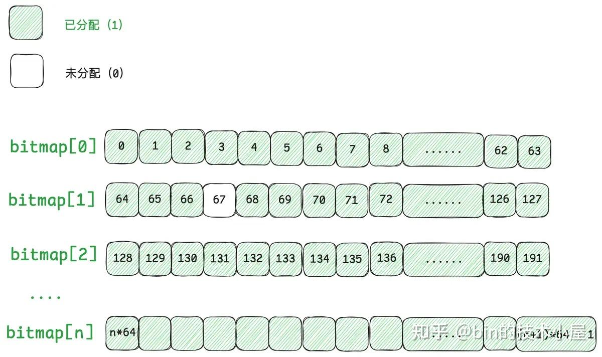

image.png

首先我们对 bitmap\[0\] 进行取反，由于 bitmap\[0\] 的 64 位 bit 全为 1 ，所以取反之后值为 0 ，我们就知道了，bitmap\[0\] 所表示的这 64 个内存块已经全部分配出去了。

于是我们继续对 bitmap\[1\] 进行取反，由于该 long 型整数的第 4 位 bit 为 0 ，所以对其取反之后，值肯定不是 0 。

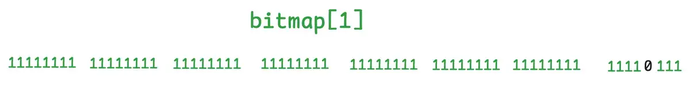

image.png

这样我们就知道了，bitmap\[1\] 中肯定至少有一个 bit 为 0 ， 也就是至少还有一个内存块未被分配。

```
private int findNextAvail() {
        // 遍历 bitmap , 在 bitmap 中查找第一个还未全部分配出去的内存块 bitmapIndex
        for (int i = 0; i < bitmapLength; i ++) {
            long bits = bitmap[i];
            // ~bits = 0 表示这个 long 表示的 64 个内存块已经全部分配出去了
            // ~bits != 0 表示这个 long 中还有未被分配出去的内存块
            if (~bits != 0) {
                // 找出 bits 中具体哪一位为 0 ，也就是说具体哪一个内存块未被分配
                return findNextAvail0(i, bits);
            }
        }
        // subPage 中无内存块可用
        return -1;
    }
```

那么 bitmap\[1\] 中具体是哪一个 bit 为 0 呢 ？很简单，我们直接从 bitmap\[1\] 的最低位开始暴力遍历，挨个查看每一个 bit 是否为 0 —— `(bit & 1) == 0` ，如上图所示，经过一通遍历之后，我们知道了原来是第 3 个 bit 为 0 （从 0 开始遍历计数）。 `1 * 64 + 3` 就是这个内存块的 bitmapIndex (67) 。

```
private int findNextAvail0(int i, long bits) {
        // i 表示 bitmap 数组的 index,也就是第几个 long，注意 i 并不是 bitmapIndex
        // i * 64
        final int baseVal = i << 6;
        // 从 bitmap[i] 中第一个 bit 开始遍历查找
        for (int j = 0; j < 64; j ++) {
            // 检查 bits 的第一个 bit 是否为 0
            if ((bits & 1) == 0) {
                // j 表示现在检查到 bits 中的第几个 bit
                // baseVal + j 表示该内存块的 bitmapIndex
                int val = baseVal | j;
            }
            // 最低位 bit 检查完之后，右移一位，开始检查下一个 bit 是否为 0
            bits >>>= 1;
        }
        return -1;
    }
```

当我们找到了 PoolSubpage 第一个空闲内存块的 bitmapIndex 之后，就将其对应在 bitmap 中的 bit 位设置为 1 ，表示已被分配。 **当一个 PoolSubpage 中所有的内存块全部被分配出去之后，这个 PoolSubpage 就需要从 smallSubpagePools 中移除** 。

```
final class PoolSubpage {

    long allocate() {
        if (numAvail == 0 || !doNotDestroy) {
            return -1;
        }
        // 获取 subPage 下一个可用内存块的 bitmapIdx
        final int bitmapIdx = getNextAvail();
        // -1 表示 subPage 中所有内存块都已经被分配出去了（没有空闲内存块）
        if (bitmapIdx < 0) {
            // subPage 全部分配完之后，就从 smallSubpagePools 中删除
            removeFromPool();
        }
        // 第几个 long
        int q = bitmapIdx >>> 6;
        // long 中的第几个 bit
        int r = bitmapIdx & 63;
        // 内存块必须是空闲的
        assert (bitmap[q] >>> r & 1) == 0;
        // 设置内存块在 bitmap 中对应的 bit 位为 1 （已分配）
        bitmap[q] |= 1L << r;

        if (-- numAvail == 0) {
            // subPage 全部分配完之后，就从 smallSubpagePools 中删除
            removeFromPool();
        }
        // 组装成 handle 结构返回
        return toHandle(bitmapIdx);
    }
}
```

### 6.2 PoolSubpage 的内存回收流程

当一个内存块要被释放回内存池的时候，我们需要判断这个内存块到底是 Small 规格的呢还是 Normal 规格的，如果是 Normal 规格的则直接释放回 PoolChunk，如果是 Small 规格的则是释放回 smallSubpagePools 中。

那我们如何判断一个内存块是 Small 规格还是 Normal 规格的呢 ？这就用到了之前我们介绍的 handle 结构，内存池用它来描述所有内存块。


image.png

Small 规格内存块的 handle 结构有一个特点，就是它的 runOffset 是其所在 PoolSubpage 在 PoolChunk 中的 Page 偏移，size 为该 PoolSubpage 包含的 Page 个数，isUsed 用于表示该内存块是否被分配，被释放内存块的 isUsed 这里肯定是 1 。

和 Normal 规格最大的不同是，Small 规格内存块的 isSubpage 在被分配出去的时候会被设置为 1 ，表示其受到 PoolSubpage 的管理，bitmapIdx 会被设置为其在 PoolSubpage 中的 bitmapIndex。而 Normal 规格这两项全部是 0 。

```
private long toHandle(int bitmapIdx) {
        // PoolSubpage 中包含的 page 个数
        int pages = runSize >> pageShifts;
        // 低 32 位保存 bitmapIdx
        return (long) runOffset << RUN_OFFSET_SHIFT
               | (long) pages << SIZE_SHIFT
               | 1L << IS_USED_SHIFT
               | 1L << IS_SUBPAGE_SHIFT
               | bitmapIdx;
    }
```

我们可以通过 `isSubpage` 方法来判断一个内存块的 Handle 结构对应的 isSubpage 位是否为 1 。如果为 1 ，那么这个内存块就是 Small 规格的，否则就是 Normal 规格的。

```
static boolean isSubpage(long handle) {
        return (handle >> IS_SUBPAGE_SHIFT & 1) == 1L;
    }
```

如果是 Small 规格的内存块，那么 Netty 就要把它释放回其所在的 PoolSubpage 中，现在的问题是我们如何通过一个内存块来查找它的 PoolSubpage 呢 ？也就是说内存块与 PoolSubpage 的映射关系在哪里 ？

这就用到了我们前面介绍 PoolChunk 时提到的 subpages 数组，subpages 数组中存放的全部是由该 PoolChunk 分配出去的所有 PoolSubpage 。

```
final class PoolChunk {
    /**
     * manage all subpages in this chunk
     */
    private final PoolSubpage<T>[] subpages;
}
```

subpages 数组的索引就是每个 PoolSubpage 的 runOffset ，那么这个 runOffset 保存在哪里呢 ？其实就在 Small 规格内存块的 handle 结构中，我们可以通过 `runOffset` 方法来提取。

```
static int runOffset(long handle) {
        return (int) (handle >> RUN_OFFSET_SHIFT);
    }
```

有了这个 runOffset ，我们就可以从 subpages\[runOffset\] 中将内存块对应的 PoolSubpage 获取到，剩下的事情就很简单了，直接将这个内存块释放回 PoolSubpage 就可以了。

```
subpage.free(head, bitmapIdx(handle))
```

随着内存块的释放，有可能会导致 PoolSubpage 变为一个 Empty PoolSubpage，也就是说 PoolSubpage 中的内存块全部空闲。对于一个 Empty PoolSubpage, Netty 会将其从 smallSubpagePools 中移除，并将 PoolSubpage 背后的内存释放回 PoolChunk。

```
final class PoolChunk {
    void free(long handle, int normCapacity, ByteBuffer nioBuffer) {
        // Small 规格内存块的释放
        if (isSubpage(handle)) {
            // 获取内存块所在 PoolSubpage 的 runOffset
            int sIdx = runOffset(handle);
            PoolSubpage<T> subpage = subpages[sIdx];
            // 获取 PoolSubpage 所在 smallSubpagePools 对应规格链表头结点
            PoolSubpage<T> head = subpage.chunk.arena.smallSubpagePools[subpage.headIndex];

            head.lock();
            try {
                assert subpage.doNotDestroy;
                // 将内存块释放回 PoolSubpage 中
                // true 表示 PoolSubpage 还是一个 Partial PoolSubpage（部分空闲） , 继续留在 smallSubpagePools 中
                // false 表示 PoolSubpage 变成了一个 Empty PoolSubpage（全部空闲），从 smallSubpagePools 链表中移除
                if (subpage.free(head, bitmapIdx(handle))) {
                    // the subpage is still used, do not free it
                    return;
                }
                // Empty PoolSubpage 从 PoolChunk subpages 数组中移除
                subpages[sIdx] = null;
            } finally {
                head.unlock();
            }
        }

        ........ 释放 Normal 规格内存块或者 Empty PoolSubpage ......

        } finally {
            runsAvailLock.unlock();
        }
    }
}
```

内存块释放回 PoolSubpage 的逻辑也是非常简单，只需要将其 bitmapIdx 在 bitmap 中对应的 bit 位重新设置为 0 就可以了，正好和内存块的申请互为相反的操作。

那么如何通过 bitmapIdx 定位到 bitmap 中与其对应具体的 bit 呢 ？ 我们还是以上个小节的例子进行说明，假设现在我们将 bitmapIdx 为 67 的内存块释放回 PoolSubpage 。


image.png

首先我们需要知道的是，bitmapIdx 具体是落在哪一个 bitmap 数组元素中，我们可以通过 `bitmapIdx / 64` 来获取，对应到上图中，bitmapIdx（67）是落在 bitmap\[1\] 中。

```
int q = bitmapIdx >>> 6;
```

接下来我们就需要知道，这个 bitmapIdx 具体是 bitmap\[q\] 的第几个 bit,我们可以通过 `bitmapIdx & 63` 来获取，对应到上图中，bitmapIdx（67）是 bitmap\[1\] 的第 3 个 bit （从 0 开始计数）。

```
int r = bitmapIdx & 63;
```

具体的 bit 定位到了，剩下的事情就很简单了，我们只需要将 bitmapIdx 对应的 bit 重新设置为 0 就可以了。

```
bitmap[q] ^= 1L << r;
```

而 Netty 往往更加倾向于分配刚刚被释放的内存块，从上一小节 PoolSubpage 的分配过程可以看出，Netty 会优先选择缓存在 nextAvail 字段上的 bitmapIdx，所以当一个内存块被释放之后，需要将它的 bitmapIdx 缓存在 nextAvail 字段中。

```
final class PoolSubpage {
    private void setNextAvail(int bitmapIdx) {
        nextAvail = bitmapIdx;
    }
}
```

PoolSubpage 的内存分配和释放，都会伴随着 smallSubpagePools 的调整，随着内存分配的不断进行，PoolSubpage 中的内存块会慢慢地全部分配出去，也就是说当一个 PoolSubpage 变为 Full PoolSubpage 的时候，那么就需要将 Full PoolSubpage 从 smallSubpagePools 中移除。

那么当这个 Full PoolSubpage 中的内存块被释放回来之后，这个被移除的 Full PoolSubpage 就会变为 Partial PoolSubpage（部分空闲），那么我们就需要将这个 PoolSubpage 重新添加回 smallSubpagePools 。

随着内存释放的不断进行，Partial PoolSubpage 中的内存块会慢慢的全部释放回来，也就是说当一个 PoolSubpage 变为 Empty PoolSubpage （全部空闲）的时候，Netty 就需要将这个 Empty PoolSubpage 从 smallSubpagePools 中删除，并将 Empty PoolSubpage 释放回 PoolChunk 。

但如果这个 Empty PoolSubpage 是 smallSubpagePools 对应规格 PoolSubpage 链表中的唯一元素，那么就让这个 Empty PoolSubpage 继续停留在 smallSubpagePools 中，始终保证 smallSubpagePools 对应规格的 PoolSubpage 链表中至少有一个 PoolSubpage 。

> 这个调整 PoolSubpage 的过程和内核中的 slab 非常相似，感兴趣的读者朋友可以回看下笔者之前介绍 slab 的文章 —— [《深度解析 slab 内存池回收内存以及销毁全流程》](https://link.zhihu.com/?target=https%3A//mp.weixin.qq.com/s%3F__biz%3DMzg2MzU3Mjc3Ng%3D%3D%26mid%3D2247488210%26idx%3D1%26sn%3D61fb6bb2dc19ee3ecf889de0702642d7%26chksm%3Dce77d495f9005d837013fa698914479e5d805040224c2110ba1b8291fb8508b5a6b477f95e09%26scene%3D178%26cur_album_id%3D2559805446807928833%23rd)

```
final class PoolSubpage {

    boolean free(PoolSubpage<T> head, int bitmapIdx) {
        // bitmap 中第几个元素
        int q = bitmapIdx >>> 6;
        // long 型整数的具体第几个 bit
        int r = bitmapIdx & 63;
        // 将内存块在 bitmap 中对应的 bit 设置为 0
        bitmap[q] ^= 1L << r;
        // 设置 nextAvail，下一次申请的时候优先分配刚刚被释放的内存块
        setNextAvail(bitmapIdx);
        // Full PoolSubpage 恰好变为 Partial PoolSubpage
        if (numAvail ++ == 0) {
            // 将这个 PoolSubpage 重新添加到  smallSubpagePools 中
            addToPool(head);
            // 确保 PoolSubpage 现在是一个 Partial PoolSubpage
            // 如果 maxNumElems = 1，那么这里的  PoolSubpage 会立即变为一个 Empty PoolSubpage（全部空闲）
            if (maxNumElems > 1) {
                // 返回 true 表示 PoolSubpage 是一个 Partial PoolSubpage
                // 需要保留在 smallSubpagePools 中
                return true;
            }
        }
        // numAvail = maxNumElems 说明 PoolSubpage 此时变为一个 Empty PoolSubpage（全部空闲）
        if (numAvail != maxNumElems) {
            // Partial PoolSubpage 继续停留在 smallSubpagePools
            return true;
        } else {
            // 对于一个 Empty PoolSubpage 来说，Netty 需要将其从 smallSubpagePools 中删除，并释放 PoolSubpage 回 PoolChunk
            // 如果该  PoolSubpage 是 smallSubpagePools 对应规格链表中的唯一元素，那么就让它继续停留
            if (prev == next) {
                // 始终保证 smallSubpagePools 对应规格的 PoolSubpage 链表中至少有一个 PoolSubpage
                return true;
            }
            // 如果对应的 PoolSubpage 链表中还有多余的 PoolSubpage
            // 那么就将这个 Empty PoolSubpage 释放掉
            doNotDestroy = false;
            // 将该 Empty PoolSubpage 从 smallSubpagePools 中删除
            removeFromPool();
            return false;
        }
    }
}
```

## 7\. PooledByteBuf 如何封装内存块

无论是从 PoolChunk 分配出来的 Normal 规格内存块，还是从 PoolSubpage 分配出来的 Small 规格内存块，内存池都会返回一个内存块的 handle 结构。


image.png

而我们拿到这个 handle 结构是无法直接使用的，因为这个 handle 并不是真正的内存，他只是用来描述内存块在 PoolChunk 中的位置信息，而真正的内存是 4M 的 PoolChunk。所以我们需要将内存块的 handle 结构转换成可以直接使用的 PooledByteBuf。

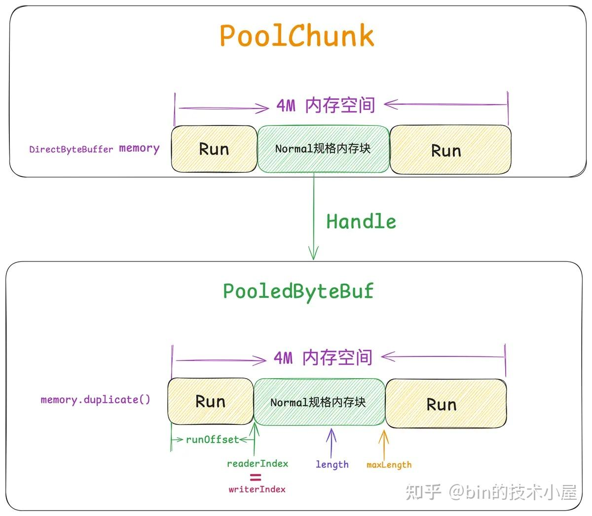

image.png

站在 PooledByteBuf 的内部视角来看，用户并不会关心 PooledByteBuf 底层的内存来自于哪里，用户只会关心 PooledByteBuf 提供的是一段从位置 0 开始，大小为 length 的内存块。在 PooledByteBuf 这个局部视角上，它的 readerIndex, writerIndex 初始均为 0 。

但我们站在整个内存池的全局视角上来看的话，PooledByteBuf 底层的内存其实是来自于 PoolChunk，笔者之前在 [《聊一聊 Netty 数据搬运工 ByteBuf 体系的设计与实现》](https://link.zhihu.com/?target=https%3A//mp.weixin.qq.com/s%3F__biz%3DMzg2MzU3Mjc3Ng%3D%3D%26mid%3D2247489860%26idx%3D1%26sn%3Df3cc139194355de6fb7463fac05a7263%26chksm%3Dce77df03f900561506eaf41a17777ec5f8dadbb37594a60b466238eb718c9cce38ad6bf2263f%26scene%3D178%26cur_album_id%3D2217816582418956300%23rd) 中的第 2.7 小节中介绍过 ByteBuf 视图的概念。我们可以将 PooledByteBuf 看做是 PoolChunk 的某一段局部 slice 视图。

PooledByteBuf 的本质其实是 PoolChunk 中的某一段内存区域，对于 Normal 规格的内存块来说，这段区域的起始内存地址是 `memory + runOffset << pageShifts `, 也就是说 PooledByteBuf 相对于 PoolChunk 的起始内存地址的 offset 偏移是 `runOffset << pageShifts`, 这一点是我们站在整个内存池的全局视角上观察到的。

```
final class PoolChunk {

    void initBuf(PooledByteBuf<T> buf, ByteBuffer nioBuffer, long handle, int reqCapacity,
                 PoolThreadCache threadCache) {
        if (isSubpage(handle)) {
            // Small 规格的 handle 转换为 PooledByteBuf
            initBufWithSubpage(buf, nioBuffer, handle, reqCapacity, threadCache);
        } else {
            // Normal 规格的 handle 转换为 PooledByteBuf
            int maxLength = runSize(pageShifts, handle);
            // PooledByteBuf 中的 offset 偏移为 runOffset(handle) << pageShifts
            buf.init(this, nioBuffer, handle, runOffset(handle) << pageShifts,
                    reqCapacity, maxLength, arena.parent.threadCache());
        }
    }
}
```

但在 PooledByteBuf 的内部视角里，用户看到的起始内存地址偏移是 0 （相对于自己），初始状态下 PooledByteBuf 的 `readerIndex = writerIndex = 0` 。所以要想通过 PooledByteBuf 的相关 index 访问到背后真正的内存（相对于 PoolChunk），我们就需要在每次获取 index 的时候加上一个偏移 offset —— `runOffset << pageShifts` 。

```
protected final int idx(int index) {
        return offset + index;
    }

    @Override
    protected byte _getByte(int index) {
        return memory.get(idx(index));
    }

    @Override
    protected void _setByte(int index, int value) {
        memory.put(idx(index), (byte) value);
    }
```

这个就是 PooledByteBuf 最核心的内容，剩下的就和普通的 ByteBuf 一模一样了。而对于 Small 规格的内存块来说， 其 handle 结构对应的 PooledByteBuf 相对于 PoolChunk 的起始内存地址的 offset 偏移则是 `(runOffset << pageShifts) + bitmapIdx * elemSize` 。

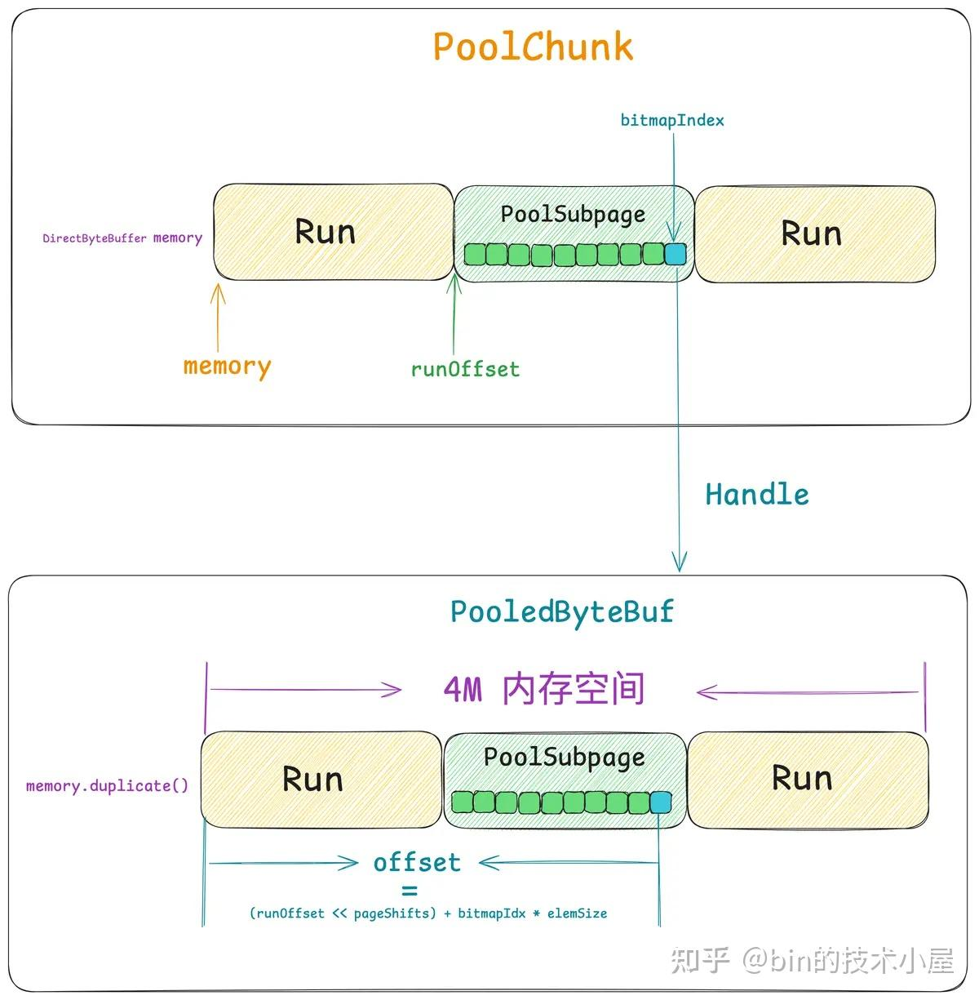

image.png

```
final class PoolChunk {
    void initBufWithSubpage(PooledByteBuf<T> buf, ByteBuffer nioBuffer, long handle, int reqCapacity,
                            PoolThreadCache threadCache) {
        int runOffset = runOffset(handle);
        int bitmapIdx = bitmapIdx(handle);
        PoolSubpage<T> s = subpages[runOffset];
        // PooledByteBuf 中的 offset 偏移
        int offset = (runOffset << pageShifts) + bitmapIdx * s.elemSize;
        buf.init(this, nioBuffer, handle, offset, reqCapacity, s.elemSize, threadCache);
    }
}
```

那么 PooledByteBuf 中究竟封装了哪些内存池的相关信息呢 ？我们来看下 PooledByteBuf 的初始化逻辑。

```
abstract class PooledByteBuf {
    private void init0(PoolChunk<T> chunk, ByteBuffer nioBuffer,
                       long handle, int offset, int length, int maxLength, PoolThreadCache cache) {

        // 该 PooledByteBuf 所属的 PoolChunk
        this.chunk = chunk;
        // PoolChunk 底层依赖的 ByteBuffer （4M）
        memory = chunk.memory;
        // PoolChunk  memory  的 duplicate 视图
        // 对于 PooledByteBuf 的 read ,write 操作最终都会落在 tmpNioBuf 上
        tmpNioBuf = nioBuffer;
        // PooledByteBuf 背后的内存池 —— PooledByteBufAllocator
        allocator = chunk.arena.parent;
        // 所属的 PoolThreadCache （线程本地缓存）
        this.cache = cache;
        // PooledByteBuf 底层依赖的内存块 handle 结构
        this.handle = handle;
        // PooledByteBuf 相对于 PoolChunk 起始内存地址的偏移，以字节为单位
        this.offset = offset;
        // 用户本来请求的内存尺寸
        this.length = length;
        // 内存池实际分配的内存尺寸
        this.maxLength = maxLength;
    }
}
```

PooledByteBuf 中的 tmpNioBuf，其实就是来自于 PoolChunk 中 cachedNioBuffers 里缓存的 memory duplicate 视图。

```
final class PoolChunk {
  private final Deque<ByteBuffer> cachedNioBuffers;
}
```

内存池分配一个内存块出来之后，都会从 cachedNioBuffers 中取出一个 PoolChunk memory duplicate 视图传递进 PooledByteBuf 中初始化。

```
final class PoolChunk {
    boolean allocate(PooledByteBuf<T> buf, int reqCapacity, int sizeIdx, PoolThreadCache cache) {

            ..... 省略分配 handle 的逻辑 ......

        ByteBuffer nioBuffer = cachedNioBuffers != null? cachedNioBuffers.pollLast() : null;
        initBuf(buf, nioBuffer, handle, reqCapacity, cache);
        return true;
    }
}
```

后续对于 PooledByteBuf 的读写操作最终都会落到 tmpNioBuf 中进行。当我们使用完 PooledByteBuf 随后调用 `release()` 方法准备释放回内存池的时候，如果 PooledByteBuf 的 [引用计数](https://zhida.zhihu.com/search?content_id=249631267&content_type=Article&match_order=1&q=%E5%BC%95%E7%94%A8%E8%AE%A1%E6%95%B0&zhida_source=entity) 为 0 ，那么就会在 `deallocate() ` 方法中，将其底层依赖的内存块 handle 释放回内存池中，同时 PooledByteBuf 这个 Java 实例也会被回收至对象池中。

```
abstract class PooledByteBuf {
    @Override
    protected final void deallocate() {
        if (handle >= 0) {
            final long handle = this.handle;
            this.handle = -1;
            memory = null;
            // 释放 PooledByteBuf 背后的内存块回内存池中
            chunk.arena.free(chunk, tmpNioBuf, handle, maxLength, cache);
            tmpNioBuf = null;
            chunk = null;
            cache = null;
            // 释放 PooledByteBuf 这个 Java 实例回对象池中
            this.recyclerHandle.unguardedRecycle(this);
        }
    }
}
```

编辑于 2024-10-25 09:49・广东[Netty](https://www.zhihu.com/topic/19732975)[内存管理](https://www.zhihu.com/topic/19579205)[Java](https://www.zhihu.com/topic/19561132)[最简单的库存管理软件有吗？](https://www.zhihu.com/question/670234561/answer/11921940584)

[

推荐一个仓库库存管理软件，超级简单易用，上手就会用。手机电脑都能用，出入库管理用起来很方便。简单好用的库存管理软件...

](https://www.zhihu.com/question/670234561/answer/11921940584)
