从今天之后的一段时间内，华仔会带着大家一起来从零开始对 ElasticStack 矩阵产品进行深入剖析和项目运维实战，希望大家学完之后可以用到自己的工作中。

这是第一篇，本篇我们就从整体上带大家了解下「**ElasticSearch 8.X 核心概念、架构介绍及应用场景**」。

文章汇总位置：[https://wx.zsxq.com/dweb2/index/columns/51122554151214](https://wx.zsxq.com/dweb2/index/columns/51122554151214)

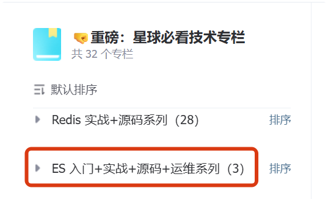

## **01 前言**

随着业务的增长，数据与日俱增，这时为用户带来丰富的、便捷的搜索功能就迫在眉睫了。传统的数据库在处理文本搜索、模糊查询、海量数据统计分析的时候总会力不从心，所以在处理这些复杂的搜索需求时，我们更倾向于使用 Elasticsearch 搜索引擎。

Elasticsearch 是一个基于 Apache Lucene 的分布式、RESTful 风格的搜索和数据分析引擎，它还可以作为实时文档存储系统，并且文档中的每一个内容都可以被检索，能够处理PB级别的结构化或非结构化数据。除了搜索领域外 Elasticsearch 与 Kibana、Logstash 组成的 ELK 系统还可以应用到日志采集、分析、监控等领域。

Elasticsearch 本身就具有分布式的特性和易安装使用的特点，目前已经是最受欢迎的企业搜索引擎。今天这篇我们主要来了解「**ElasticSearch**」的核心概念、架构介绍、应用场景。

##   
**02 ElasticSearch 总览**

## **2.1 ElasticSearch 核心概念**

ES 中的概念有很多，比如：集群、节点、索引、分片、副本、集群状态、Mapping、文档、字段（Field）、Term、Lucene、倒排索引、正排索引、相关性评分等。

这里我们先从集群层面来了解 ES ，然后再看看数据层面、系统层面上相关的概念。通过从上到下把这些概念一一串起来。

###   
**2.1.1 集群层面核心概念**

### **1、集群(Cluster)**

ElasticSearch 天然是分布式的，由一个或者多个节点实例组成，这些实例组成的集合叫集群，分布式的 ES 集群可以存储海量的数据，也可以从容地面对更高的并发量。

如下图所示：

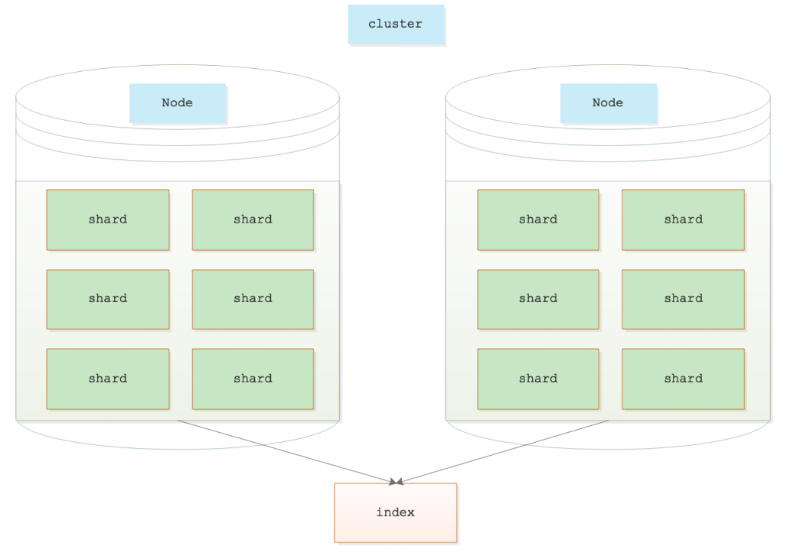

### **2、节点(Node)**

ES 本身就具备集群能力，只需让每个节点设置相同的 cluster.name 即可加入同一个集群，它们共同承担整个集群的数据和负载压力。

ES 中一个节点即一个运行中的 Elasticsearch 实例。节点通过 node.name 来设置节点名称，如果不设置则在启动时给节点分配一个随机通用唯一标识符作为名称。

  
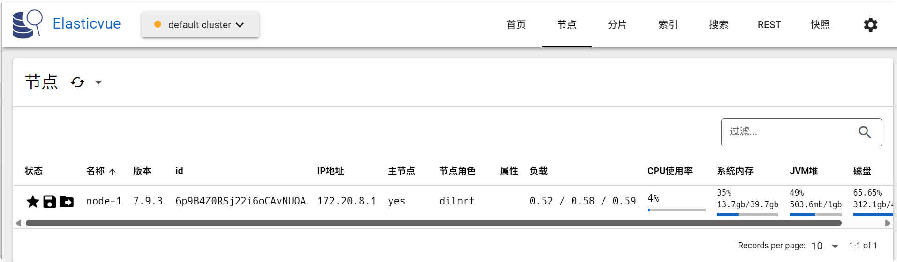

在 ES 8.x 中，节点类型升级为节点角色，节点角色分的很细，在 ES 集群中的节点主要有三种不同的节点角色：「**主节点**」、「**数据节点**」、「**协调节点**」。

1.  主节点
2.  负责管理集群的所有变更，主要责任例如：创建或删除索引；跟踪管理那些节点属于集群的一部分，例如增加、删除节点等；决定那些分片给相关的节点。
3.  可以通过属性node.master进行设置。node.master=true表示此节点具有被选举为主节点的资格。
4.  数据节点
5.  数据节点负责数据的存储和相关的操作，例如对数据进行增、删、改、查和聚合等操作，数据节点对机器配置要求比较高，对 CPU、内存和 I/O 的消耗很大。默认每一个节点都是数据节点（包括主节点），可以通过node.data属性进行设置。
6.  node.data=true表示此节点为数据节点，用于存储数据。
7.  协调节点
8.  负责保存数据，要扩充存储时候需要扩展这类节点。数据节点还负责执行数据相关的操作，如：搜索、聚合、CURD 等。所以对节点机器的 CPU、内存、I/O 要求都比较高。
9.  如果node.master和node.data属性均为false，则此节点称为协调节点。协调节点只能处理路由请求，处理搜索、分发索引操作等。此节点的意义是在海量请求的时候可以进行负载均衡。
10.  注意，每一个节点都具有node.master、node.data属性，默认情况下node.master=true且node.data=true，即默认一个节点同时是数据节点和主节点。

除了这些节点角色，还有以下：

1.  预处理节点（Ingest Node）：预处理操作允许在写入文档前通过定义好的一些 processors（处理器）和管道对数据进行转换。默认情况下节点启动后就是预处理节点。
2.  部落节点（Tribe Node）：部落节点可以连接到不同集群，并且支持将这些集群当成一个单独的集群处理。但它在未来的版本中将会被淘汰。
3.  Hot & Warm Node：不同硬件配置的 Data Node，用来实现 Hot & Warm 架构的节点，有利于降低集群部署成本。例如，在硬件资源好的机器中部署 Hot 类型的数据节点，而在硬件资源一般的机器上部署 Warm Node 节点。

最佳实践：

1.  master 节点：普通服务器即可。
2.  data 节点：主要消耗磁盘，内存。
3.  client | ingest 节点：普通服务器即可(如果要进行分组聚合操作的话，建议这个节点内存也分配多一点)。

  
在新版的 ES 中，这个配置方式就做出了改变，使用 node.roles 参数来指定一个节点的角色，如下：

node.roles: \[ master, data \] //设置节点为 master 候选节点和数据节点

node.roles 的值是一个数组表示一个节点可以有多个角色，node.roles 的可选项如下：

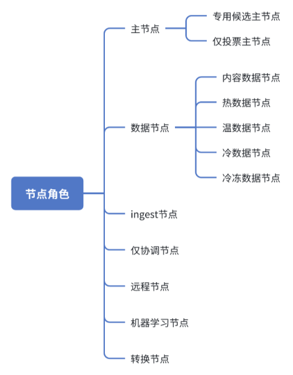

1.  master：master 候选节点，master 将会从这些节点中选取出来。
2.  voting\_only：参与 master 选举的节点，其只有投票权限，当不会成为 master。
3.  data：保存文档数据的 shard 将分配到 data 节点中保存。
4.  data\_content：此角色的节点会处理用户创建的文档内容，可以处理 CRUD、数据搜索和聚合等。
5.  data\_hot：此角色的节点会根据数据写入 ES 的时间存储时序数据，例如日志数据，data\_hot 节点对数据读写要求快速，应当使用 SSD 存储。
6.  data\_warm：该节点会存储不会经常更新但是仍然被查询的数据，相对于 data\_hot，其查询的频率要低。
7.  data\_cold：很少再被读取的数据可以存储在 data\_cold，此类节点的数据是只读的。
8.  data\_frozen：专门用于存储 partially mounted indices 的数据节点。
9.  ingest： 预处理数据的节点。
10.  ml：提供机器学习的功能，此类节点运行作业并处理机器学习 API 请求。
11.  remote\_cluster\_client：充当跨集群客户端并连接到其他集群。
12.  transform：运行 transforms 并处理 transform API 请求。

如果要设置协调节点该如何做，其实很简单，为空即可：

node.roles: \[\]

### **3、分片(Shard)**

分片是一种让集群支持水平扩展能力的方案，即 ES 是通过分片来实现分布式。每一个分片都是数据的容器，文档保存在分片内，分片又被分配到集群内的各个节点里。

集群中我们的文档被存储和索引到分片内，不过对于客户端来说分片是透明的，他们感知不到分片的存在。当集群规模扩大或者缩小时， ES 会自动的在各节点中迁移分片，使得数据仍然均匀分布在集群里。

ES中有两种类型的分片：主分片（primary shard）、副本分片（replicas）。索引内任意一个文档都归属于一个主分片，所以主分片的数目直接决定着集群中能够保存的最大数据量。一个副本分片只是一个主分片的拷贝，副本分片主要是用来实现高可用、高并发的，例如：硬件故障时保护数据不丢失，提供读服务等。

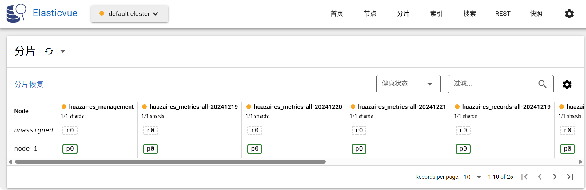

下图描述了具有是3个节点（Node1、Node2、Node3）的ES集群，其中Node1为主节点，Node1、Node2、Node3都是数据节点。此集群有9个分片，其中3个主分片（P0、P1、P2）和6个从分片（R0、R1、R2），每一个主分片都有两个从分片。

  
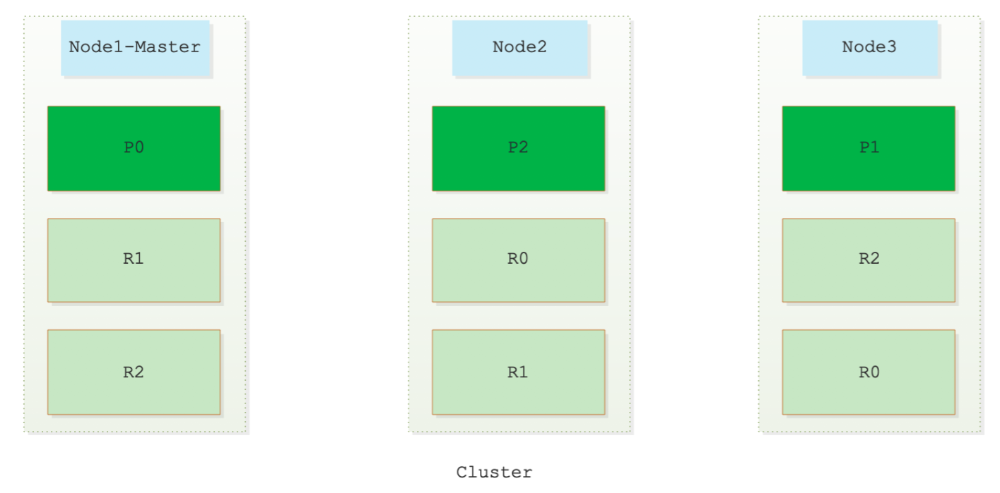

所有数据都要先写到主分片上，只有主分片处理成功后，才能拷贝至其对应的副本分片上。默认情况下主分片等待所有备份完成索引更新后才返回客户端。

当一个集群中存在多个主分片时，ES是根据什么样的规定来将数据写到某一个分片上的呢？ES的数据路由策略由以下公式决定：

shard = hash(routing) % number\_of\_primary\_shards

Routing 是一个可变值，默认是文档的 \_id ，也可以设置成一个自定义的值。稍有Java开发经验的人应该对这种处理方式都很熟悉，例如：HashMap、Redis、分库分表等等场景都会使用类似的策略。

注意：通常而言，我们需要在创建索引的时候就确定好主分片的数量，并且不会改变这个数量，因为如果number\_of\_primary\_shards 变化了，那么上面公式计算出来的值就会发生变化，在迁移数据完成前，数据将会完全错乱。其实我们日常使用的中间件都有这个问题，例如Redis。如果真的需要进行调整集群容量（增加或者减少节点数目），那么必须迁移数据。Redis 的常用集群采用的是一致性 hash 策略，让这种情况发生时数据迁移量尽可能小。

ES 通过 [shard = hash(routing) % number\_of\_primary\_shards](http://shard%20=%20hash\(routing\)%20%%20number_of_primary_shards) 公式决定路由策略，可见任何一个节点都可以计算出集群中的文档的存放位置，所以每个节点都有处理读写请求的能力。

### **4、副本(Replica)**

分片（Shard）是 ES 底层基本的读写单元，分片是为了分割巨大的索引数据，让读写可以由多台机器来完成，从而提高系统的吞吐量。

为了保证数据可靠性，一般分布式系统都会对数据进行冗余备份，这个备份也就是副本了。ES 同样将数据副本分为主从两类型：主分片（primary shard）和副分片（replica shard） 。

在写入的过程中，先写主分片，成功后并发写副分片，在数据恢复时以主分片为主。多个副本除了可以保证数据可靠性外，还有一个好处是可以承担系统的读负载。

### **写操作**

在一个写请求被发送到某个节点后，节点会根据路由公式计算出需要写到哪个分片上，再将请求转发到该分片的主分片节点上，主分片处理成功以后会将请求转发给副本分片。

如下图所示：

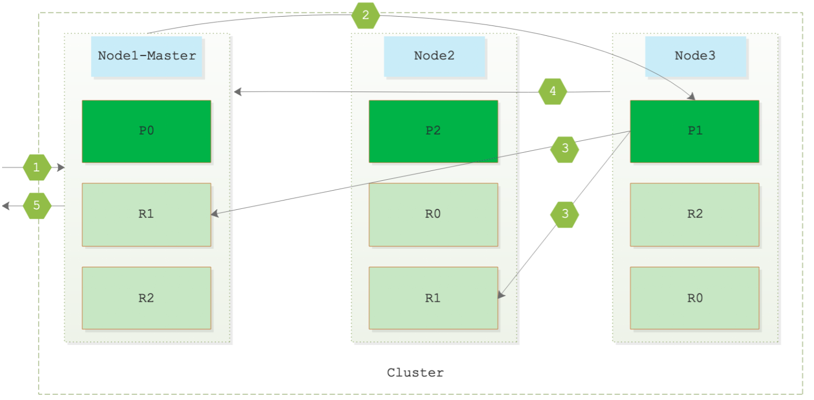

流程如下：

1.  假设 Node1 收到一个创建索引的请求。
2.  Node1 根据 shard=hash(routing)% number\_of\_primary\_shards 计算数据落到哪一个分片上。假设计算出来的 shard=1。
3.  因为 shard=1 的主分片 P1 在 Node3 上，所以 Node1 将写请求转发到 Node3 节点。
4.  Node3 如果处理成功，因为 P1 的两个副本 R1 在 Node1、Node2 上，所以 Node3 会将写请求转发到 Node1、Node2 上。
5.  当所有的副本 R1 报告处理成功后，Node3 向请求的 Node1 返回成功信息，Node1 最后返回客户端索引创建成功。

### **读操作**

在一个读请求被发送到某个节点后，节点会根据路由公式计算出数据存储在哪个分片上，节点会以负载均衡的方式选择一个节点，然后将读请求转发到该分片节点上。

如下图所示：

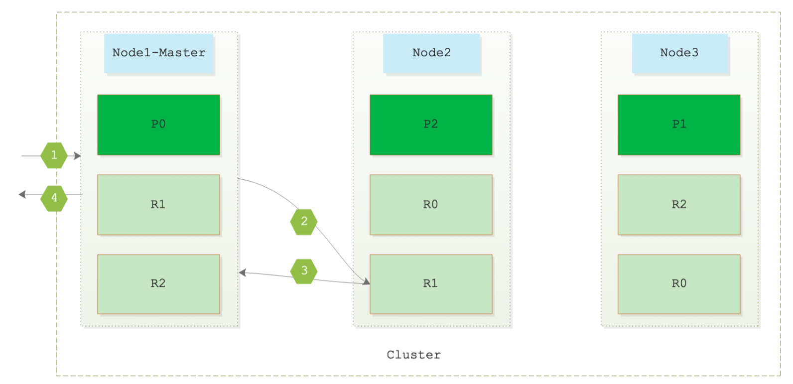

流程如下：

1.  请求入口：假设 Node1 节点收到一个读请求，此时 Node1 扮演的角色是协调节点 (Coordinating Node)​，负责接收请求、路由请求、聚合结果。。
2.  路由计算 (在Node1内部发生)：Node1 节点通过 shard=hash(routing)% number\_of\_primary\_shards 计算数据落到哪一个分片上。假设计算出来的shard=1。
3.  请求转发：Node1 知道分片1（Shard1）的副本存在于哪些节点上。分片1的主分片（P1）在 Node3，其副本分片（R1）在 Node2。协调节点遵循负载均衡策略，在所有数据副本（包括主分片和副本分片）中选择一个来处理该请求。此时 Node1 根据负载均衡的方式来选择一个副本，图中选择的是 Node2 节点的 R1 副本。Node1 将请求转发给 Node2 处理此次读操作。
4.  Node2 处理完成以后，将结果返回给 Node1 节点，协调节点 Node1 将数据返回给客户端。

### **5、集群健康**

在索引建立的时候就已经确定了主分片数，但是副本分片数可以随时修改。默认情况下，一个索引会有 5 个主分片，而其副本可以有任意数量。

主分片和副本分片的状态决定了集群的健康状态。每一个节点上都只会保存主分片或者其对应的一个副本分片，相同的副本分片不会存在于同一个节点中。

通过集群的健康状态，我们可以了解集群是不是出现问题了, 集群健康状态有以下 3 种。

1.  Green，集群处于健康状态，所有的主分片和副本分片都正常运行。
2.  Yellow，所有的主分片都运行正常，但是有部分副本分片不正常，意味着可能存在单点故障的风险（如果部分主分片没有备份了，一旦这个主分片数据丢失，将导致这些数据永久丢失）。如果集群只有 3 个数据节点，但是分配了 4 个副本（主分片 + 副本分片的总数），这个时候有一个副本无法分配的，因为相同的两份数据不应该被分配到同一个节点上。
3.  Red，有部分主分片没有正常运行。

需要注意的是，如果集群中只有一个节点，则副本分片将不会被分配，此时集群健康状态为 yellow，存在丢失数据的风险。每个索引也有这三种状态，如果索引丢失了一个副本分片，那么这个索引和集群的状态都变为 Yellow 状态，但是其他索引的的状态仍为 Green。

比如我们本地之前部署的 ES 单节点集群：

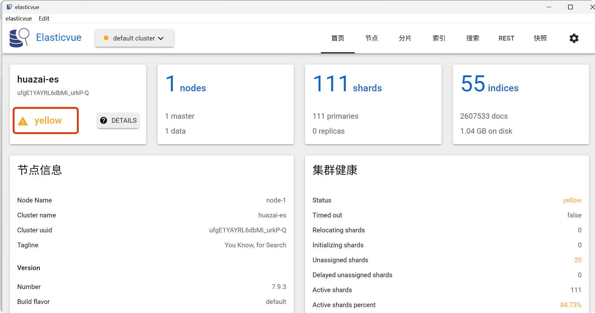

### **2.1.2 数据层面核心概念**

### **1、索引(Index)**

索引指的是包含一堆有相似结构的文档数据（Document）。例如：商品索引、订单索引。在商品索引中我们可以存放成千上万的商品信息；在订单索引中我们可以存放成千上万的订单信息。

从这个角度上看，Index 和关系型数据库中的数据库类似。

如图，Index 是一个逻辑空间，在索引下面会有多个分片，分片是分布在各个节点上面，数据是存储在分片上。图中索引有 12 个分片，它们分别位于 2 个节点中。

###   
**2、Mapping**

Mapping 定义了索引里的文档到底有哪些字段及这些字段的类型，类似于数据库中表结构的定义。

Mapping 有两种作用：

1.  定义索引中各个字段的名称和对应的类型；
2.  定义各个字段、倒排索引的相关设置，如使用什么分词器等。

例如，我们小红书实战项目中的商品索引 Mapping 结构:

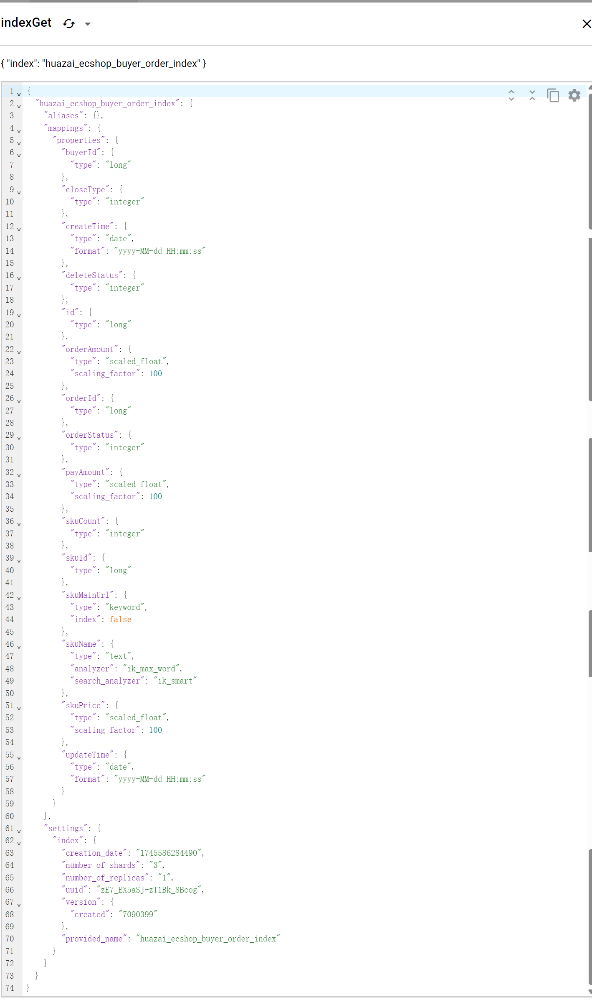

需要注意的是，Mapping 一旦定义后，已经定义的字段的类型是不能更改的。

### **3、文档(Doc)**

一个 Document 是一条实例数据，例如一个商品，一个订单，通常使用 JSON 数据结构表示。一个 Document 里面有多个 field，每个 field 就是一个数据字段。

从这个角度上看，Document 和关系型数据库中的一行记录类似，Field 和关系型数据库中的字段类似。

下面以小红书商品为例：

  
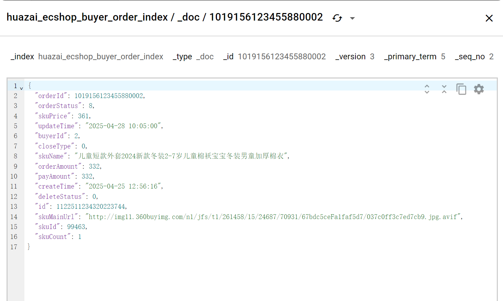

这里解释下上面额外的元数据字段：

1.  \_index，文档所属的索引名字，上述是 huazai\_ecshop\_buyer\_order\_index。
2.  \_type，文档所属的类型名字，现在 ES 7.x 版本的类型统一为 "\_doc" 。
3.  \_id，文档的唯一 id。如果我们插入时不指定文档 id，ES 会随机分配，这样有利于数据均匀分散到各个分片。
4.  \_version，文档的版本信息，并发读写时可以解决文档冲突。
5.  \_score，相关性算分，代表着查询的匹配性，用来排序。
6.  \_seq\_no 和 \_primary\_term，是 ES 内部用来保证主分片和副本数据一致性的。当一个 Index 每次选择出主分片后都会有一个序号，记为 \_primary\_term，其实递增的。而在同一个 Index 下，每次写入数据后都会有一个写入顺序号，记为 \_seq\_no，其同样也是递增的。 \_primary\_term 和 \_seq\_no 在逻辑上构成了一个文档写入的唯一位置。

### **4、字段(Filed)**

每个文档都有一个或者多个字段，上面商品索引文档里面有 15 个字段。

每个字段都有指定的类型，常见的有：keyword、text、数字类型（integer、long、float、double等）、对象类型等。

keyword 类型适合存储简短、结构化的字符串，例如商品 ID、商品名字等。而 text 类型的字段适合存储全文本数据，如商品详情内容等。对象类型简单来说就是字段的值还是一个 json 对象。

### **5、词项(Term)**

索引里面最小的存储和查询单元，对于英文来说是一个单词，对于中文来说一般指分词后的一个词。

### **6、倒排索引**

Lucene 索引的通用叫法，即实现了 term 到 doc list 的映射。倒排索引建立的是分词（Term）和文档（Document）之间的映射关系，在倒排索引中，数据是面向词（Term）而不是面向文档的。

假如现有三份数据文档，文档的内容如下：

1.  Doc1: I love China。
2.  Doc2: I love work。
3.  Doc3: I love coding。

为了创建倒排索引，首先通过分词器将每个文档的内容域拆分成单独的Term，创建一个包含所有不重复词条的排序列表，然后列出每个词条出现在哪个文档。结果如下：

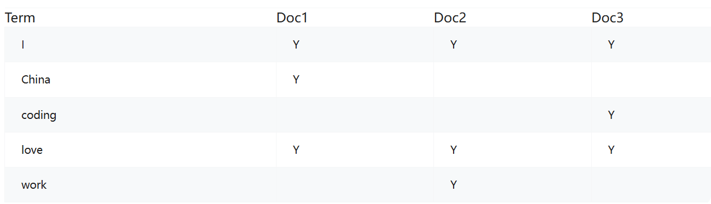

如上表格所示，这种结构由文档中所有不重复词的列表构成，对于其中每个词都有一个Doc与之关联。这种由属性值来确定记录的位置的结构就是倒排索引（Post Index）。带有倒排索引的文件我们称为倒排文件（Inverted File）。

根据以上内容，倒排文件的结构如下所示：

  
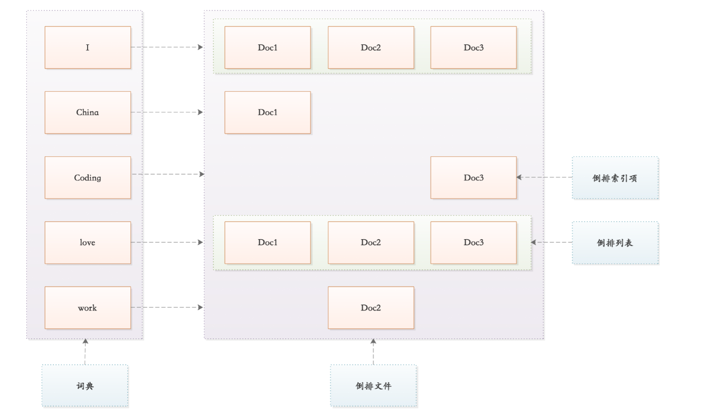

词典和倒排表是 Lucene 中很重要的两种数据结构，是实现快速检索的重要基石。

## **2.2 ElasticSearch 底层核心架构设计**

带大家讲解完 ElasticSearch 的核心概念后，我们就来从架构上讲解下 ElasticSearch。

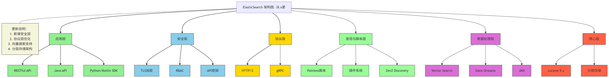

Elasticsearch 采用分层架构设计，从底层到顶层的六层结构为：

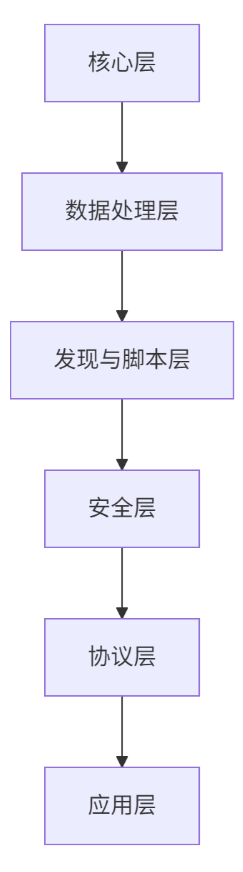

###   
**2.2.1 核心层(Lucene 引擎)**

1.  Lucene 9.x：Elasticsearch 8.x的核心搜索引擎。
2.  倒排索引：高效全文检索基础结构。
3.  分层存储：支持热-温-冷架构（Hot-Warm-Cold Architecture），热数据：SSD 存储（高性能）、温数据：HDD 存储（经济性）、冷数据：对象存储（如 S3）。
4.  Segment优化：自动合并小文件段提升性能。
5.  Codec系统：可插拔的压缩算法（LZ4/Zstandard）。
6.  向量引擎：支持 128-2048 维向量（用于 AI 相似度搜索）。
7.  段合并优化：减少 I/O 消耗。
8.  分布式协调：
9.  Raft协议：取代Zen Discovery的分布式共识算法。
10.  主节点选举：自动故障转移和领导者选举。
11.  JVM管理：
12.  G1垃圾回收器：默认垃圾回收策略。
13.  堆外内存：用于聚合操作和索引缓冲区。

###   
**2.2.2 数据处理层**

1.  索引模块：
2.  分片策略：主分片+副本分片（默认1主1副）。
3.  Translog：事务日志保证数据持久性。
4.  Refresh策略：可配置刷新间隔（默认1秒）。
5.  搜索模块：
6.  布尔模型：AND/OR/NOT组合查询。
7.  TF-IDF/BM25：相关性评分算法。
8.  KNN搜索：k-近邻向量检索。
9.  映射模块：
10.  动态映射：自动检测字段类型。
11.  显式映射：支持字段级参数配置。
12.  新增特性：
13.  向量搜索：支持HNSW算法（Hierarchical Navigable Small World）。
14.  数据流：时序数据处理（如日志、指标）。
15.  冻结索引：冷数据只读访问。

###   
**2.2.3 发现与脚本层**

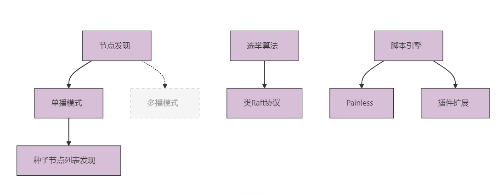

1.  节点发现机制：
2.  完全弃用多播：8.x 仅支持单播，通过种子节点列表发现。
3.  基于主机的发现：通过discovery.seed\_hosts配置。
4.  集群引导：cluster.initial\_master\_nodes初始节点。
5.  脚本引擎：
6.  Painless脚本：安全沙盒环境执行。
7.  支持场景：
8.  字段值转换。
9.  自定义评分。
10.  动态字段生成。
11.  调试接口：/\_scripts/painless/\_execute。
12.  插件系统：
13.  分析插件：IK分词器、拼音转换。
14.  安全插件：OpenID Connect集成。
15.  存储插件：S3/HDFS/Azure Blob存储。
16.  节点角色优化​：
17.  专用协调节点。
18.  机器学习节点隔离。
19.  冻结节点（归档数据访问）。

###   
**2.2.4 协议层**

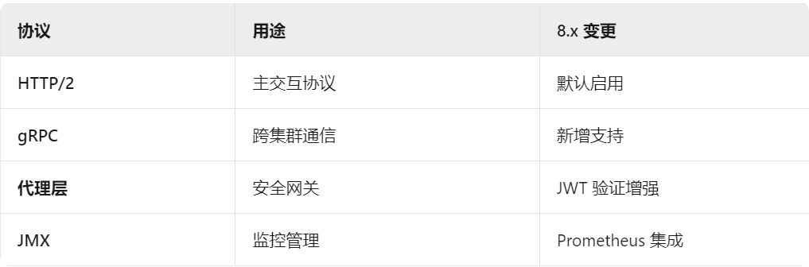

JMX监控体系：

1.  监控指标：
2.  JVM堆内存使用。
3.  线程池状态。
4.  索引/查询延迟。
5.  集成方案：
6.  Prometheus + Grafana。
7.  ELK自有监控
8.  API端点：/\_nodes/stats?jvm=true。

### **2.2.5 安全层**

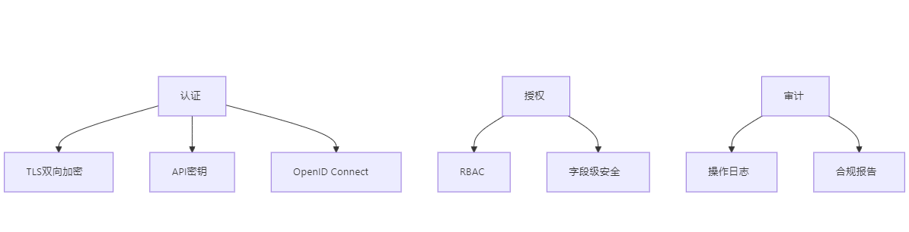

1.  认证体系：
2.  Native Realm：内置用户数据库。
3.  LDAP/AD集成：企业级目录服务。
4.  SAML/OIDC：单点登录支持。
5.  加密方案：
6.  TLS 1.3：节点间通信加密。
7.  FIPS 140-2：符合政府安全标准。
8.  传输层安全​：
9.  节点通信强制 TLS。
10.  证书自动轮换。
11.  ​访问控制​：
12.  精细化 RBAC（文档级权限）。
13.  API 密钥生命周期管理。
14.  ​合规支持​：
15.  GDPR 数据遮蔽。
16.  HIPAA 审计追踪。
17.  ​密钥管理​：
18.  硬件安全模块集成。
19.  云 KMS 支持。

访问控制：

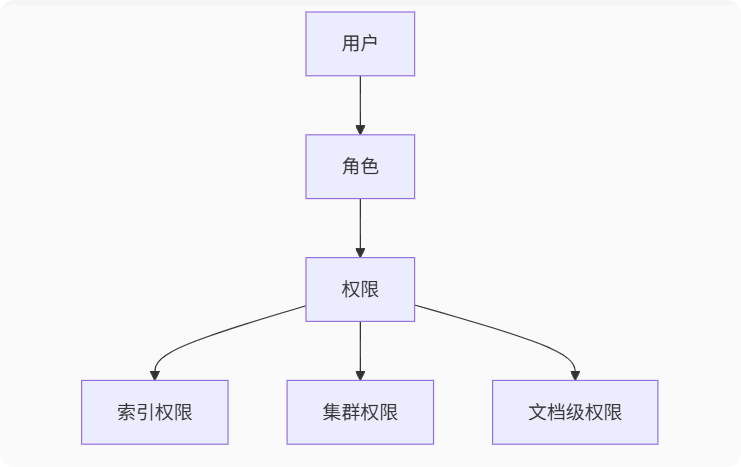

1.  字段级安全：屏蔽敏感字段。
2.  文档级安全：基于查询的访问控制。

### **2.2.6 应用层**

API 架构：

  

SDK 支持：

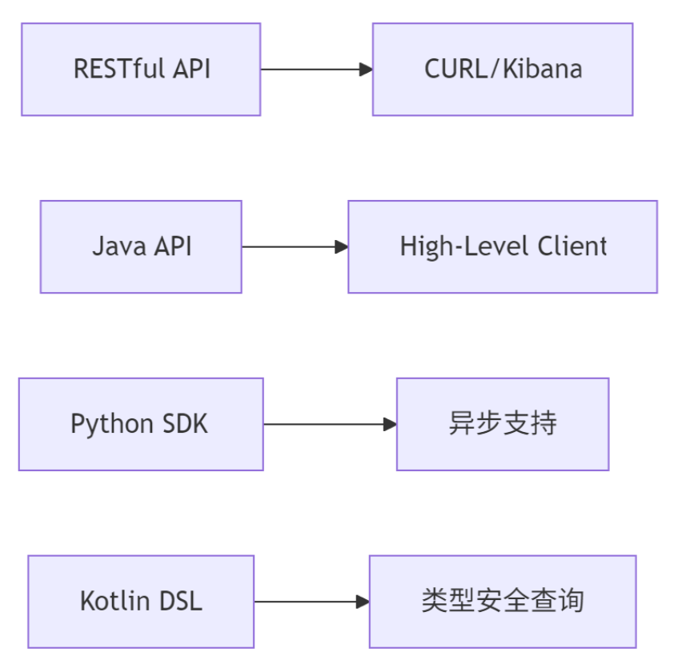

1.  多语言支持​：
2.  官方 SDK：Java/Python/Go/Node.js
3.  社区 SDK：Rust/PHP/.NET
4.  ​查询扩展​：
5.  ES|QL：SQL 兼容查询
6.  KQL：Kibana 原生语法
7.  ​向量化应用​：
8.  语义搜索
9.  推荐系统
10.  异常检测

### **2.2.7 跨层协同机制**

1.  分布式执行流程：
2.  客户端请求 → 2. 协调节点路由 → 3. 分片并行处理 → 4. 结果聚合 → 5. 响应返回。
3.  缓存体系：
4.  查询缓存：过滤器结果缓存。
5.  请求缓存：分片级结果缓存。
6.  字段数据缓存：排序和聚合加速。
7.  容错机制：
8.  副本重分配：自动故障转移。
9.  写入一致性：quorum机制。
10.  快照/恢复：集群状态备份。

### **2.2.8 ES 8.x 新架构优势**

1.  安全增强：零信任安全模型默认启用
2.  性能优化：
3.  向量搜索性能提升5倍。
4.  索引吞吐量提高40%。
5.  云原生支持：
6.  Kubernetes Operator。
7.  Serverless部署模式。
8.  机器学习集成：
9.  内置Elastic ML。
10.  PyTorch模型支持。

## **2.3 ElasticSearch 主要应用场景**

最后我们来看下 ElastiSearch 主要应用场景。

### **2.3.1 全文检索**

毫无疑问，这是 ES 的最强项之一，支持多种语言的分词，中文、英文、数字、特殊符号。主要应用在「**企业知识库**」、「**电商商品搜索**」、「**垂直领域搜索引擎**」。

  

通常在 ES 中会用到 IK 中文分词器，在这个分词维度已经达到天花板级别，在小红书电商中已经实战过：[【电商实战项目第三十九篇】华仔电商实战项目商品中心服务手把手安装 ElasticSearch 7.9.3 版本及分词器](https://articles.zsxq.com/id_wp5i9us9k7d4.html) 、[【电商实战项目第四十三篇】华仔电商实战项目商品中心服务 Elasticsearch 10W商品 suggest 索引优化](https://articles.zsxq.com/id_6dh27mzwcap4.html)

### **2.3.2 大数据实时查询与分析**

其强大的数据处理能力，通过分片的方式进行提供分布式数据查询服务；另外其自带大数据处理及调度能力，比如：聚合、转换、上卷、大规模明细查询等等。

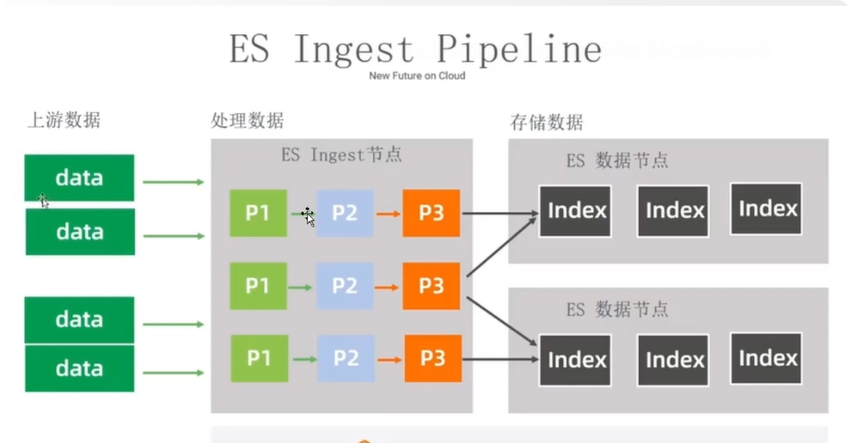

### **2.3.3 数据库查询加速**

这个场景很容易理解，当数据库随着数据的增涨出现瓶颈后，通过数据库来作为查询服务的应用性能就会急速下降，尤其是多条件查询的时候，此时就需要借助 ElasticSearch 强大的海量数据查询、复杂条件组合查询。

下面是京东到家订单中心的 ES 演进案例：[https://mp.weixin.qq.com/s/ACxaUEOB5kciO\_P1Mck8Pg](https://mp.weixin.qq.com/s/ACxaUEOB5kciO_P1Mck8Pg)

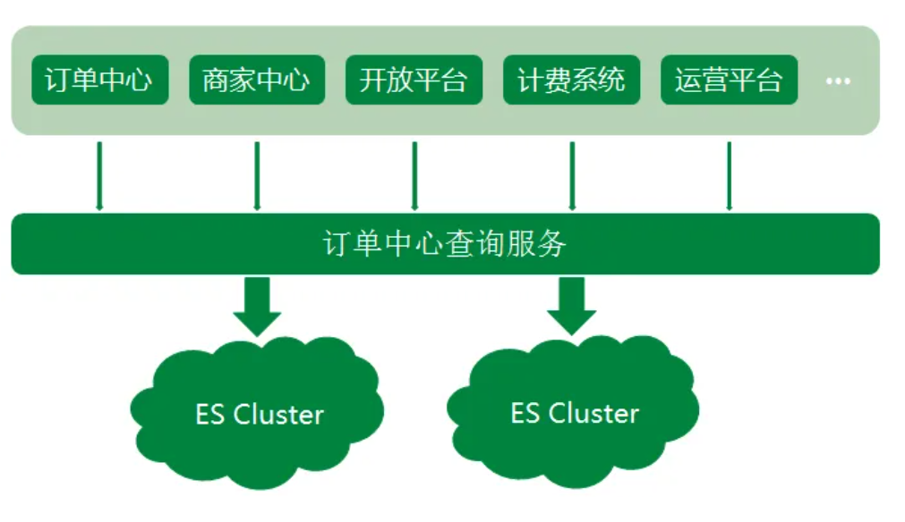

这里会涉及到 MySQL 到 ES 的数据同步问题，这个也在小红书电商项目进行了实战：[【电商实战项目第四十五篇】华仔电商实战项目商品中心服务基于 Canal + RocketMQ 实现商品数据增量同步 ES](https://articles.zsxq.com/id_7z84tu1u1zst.html)、[【电商实战项目第四十六篇】华仔电商实战项目商品中心服务千万级商品数据全量同步 ES 性能优化](https://articles.zsxq.com/id_47pxha425h4u.html)

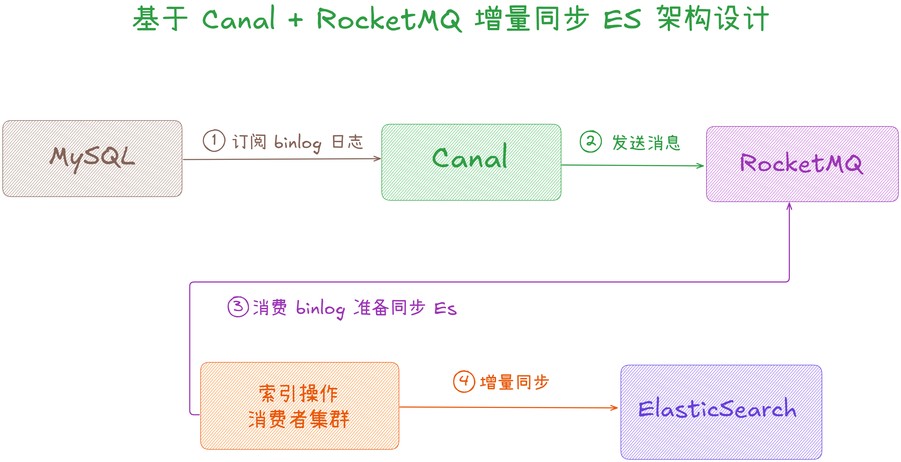

### **2.3.4 运维监控体系**

ES 提供了非常友好的数据格式，它可以做很多维度的「**指标采集**」、「**时序数据（ES 8.5 版本新增）**」在资源节约方面很大的空间。

下面是 kinbana 自带的一些监控图：

  
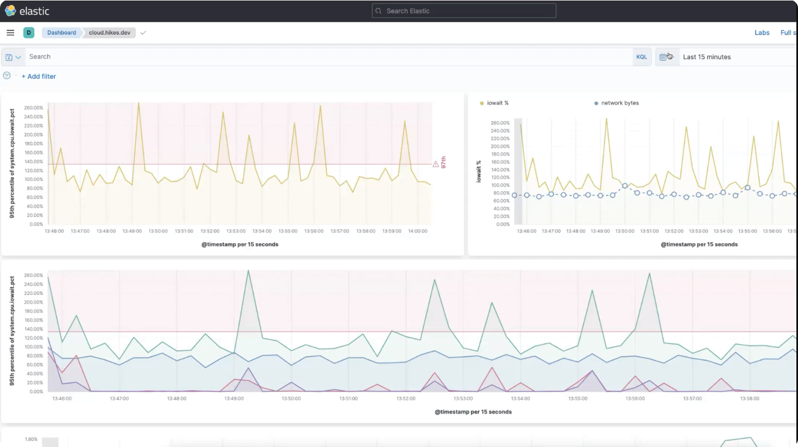

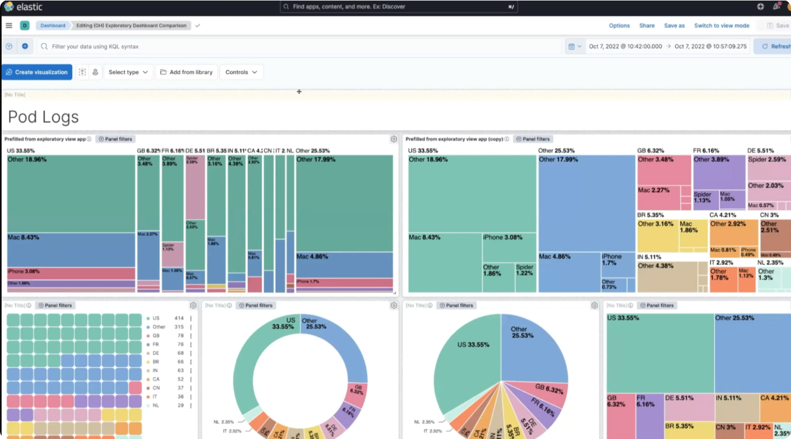

### **2.3.5 微服务体系全链路监控**

这里对于 java 来说， ES 可以作为我们全链路 APM 应用程序性能监控，后续感兴趣可以单独介绍和实操，如下图：

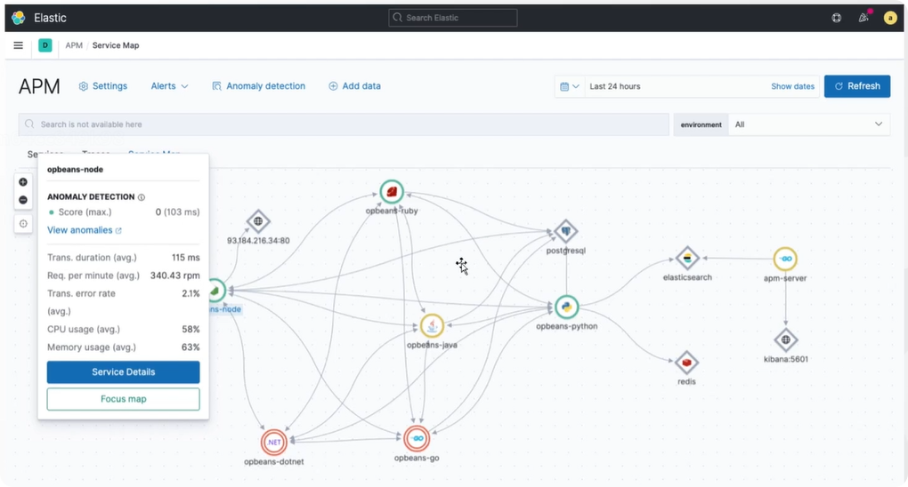

但是 ES 做的全链路跟踪跟 Skywalking 还是有些差距：

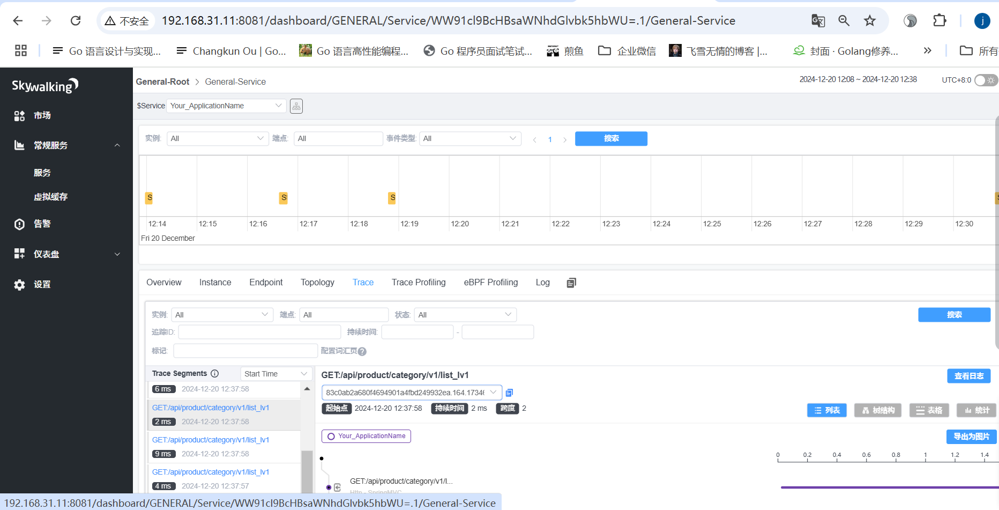

### **2.3.6 统一日志平台**

这也是 ES 生态的一个强行，从最初的 ELK 体系到现在的 EFKK 体系，这块会在后续实战项目中进行单独实操。

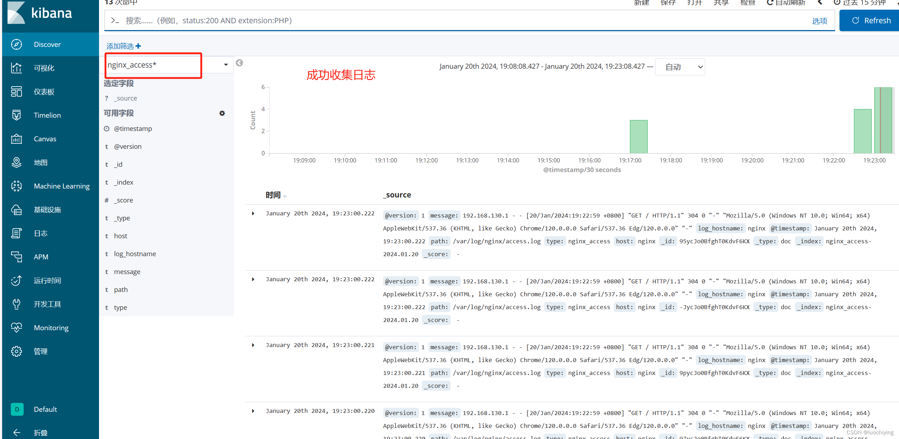

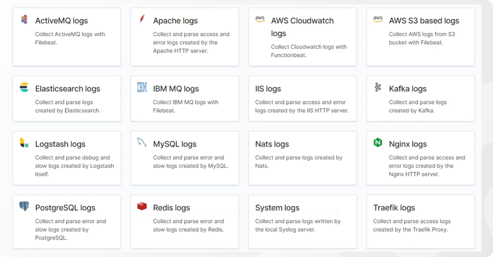

### **2.3.7 向量检索**

这是 ES 8.x 新引入的技术，「**相似图片**」、「**类似语音**」、「**问答系统**」、「**推荐系统**」等，内置支持Dense Vector数据类型，与多种向量计算产品集成，支持多种向量应用场景。

  
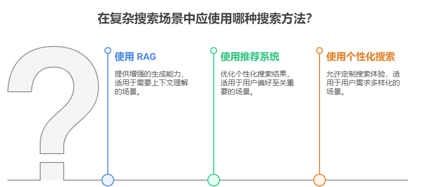

### **2.3.8 GEO/GIS 地理应用**

地理位置应用搜索，在 ES 内部集成 Geohash算法，支持大规模的地理位置搜索，结合自生的分布式特性，可以满足海量数据 Geo 检索。

