从今天之后的一段时间内，华仔会带着大家一起来从零开始对 ElasticStack 矩阵产品进行深入剖析和项目运维实战，希望大家学完之后可以用到自己的工作中。

这是第七篇，本篇我将带着大家进行「**ES 索引模板深度实战**」。

文章汇总位置：[https://wx.zsxq.com/dweb2/index/columns/51122554151214](https://wx.zsxq.com/dweb2/index/columns/51122554151214)

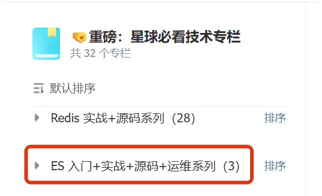

## **01 前言**

在上篇中 [【ES 入门实战第六篇】ES 索引别名深度实战](https://articles.zsxq.com/id_2c165w1o3m6f.html)，带着大家进行实战「**ES 索引别名深度实战**」。

今天我们来进行「**ES 索引模板深度实战**」。

## **02 ES 索引模板深度实战**

## **2.1 ES 索引模板入门**

在 ES 中，当需要创建大量结构相似的索引（如「**日志索引按天分割**」、「**日用户行为数据按租户隔离**」）时，手动配置每个索引的映射（Mapping）和设置（Settings）会导致效率低下且容易出错。

索引模板（Index Template）正是为解决这一问题而生，它允许通过预定义的规则自动生成索引配置，确保同类索引遵循统一的结构规范。

接下来将全面介绍索引模板的「**核心概念**」、「**配置语法**」、「**匹配机制**」、「**动态字段处理**」、「**生命周期管理 ILM 集成**」。

### **2.1.1 ES 索引模板核心概念**

1.  索引模板（Index Template）：包含索引映射、设置、别名等配置的预定义模板，通过索引模式匹配自动应用于新创建的索引。
2.  索引模式（Index Pattern）：用于匹配索引名称的通配符或正则表达式（如logs-\*、user-\\d+）。
3.  映射（Mapping）：定义索引字段的数据类型、分词器、搜索属性等元数据。
4.  设置（Settings）：包含分片数量、副本数、刷新间隔、生命周期策略等索引级配置。
5.  动态模板（Dynamic Template）：在映射中定义的动态字段匹配规则，用于自动处理未知字段的映射配置。
6.  模板优先级（Priority）：当多个模板匹配同一索引时，优先级高的模板配置会覆盖低优先级的冲突部分。
7.  索引别名（Index Alias）：可附加到模板中的逻辑名称，支持读写请求路由，方便索引切换（如日志索引的滚动切换）。
8.  日期数学模式（Date Math Pattern）：用于动态生成索引名称的时间表达式（如logs-%{now/d}表示当天日志索引）。
9.  字段数据类型（Field Data Type）：ES支持的核心类型（如text、keyword、date、nested）及其子属性（如分词器、格式规范）。

  
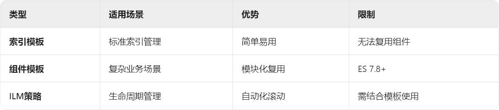

Elasticsearch 索引模板是定义索引配置（设置、映射、别名）的蓝图，当新索引名称匹配模板模式时自动应用。主要有两种类型：

1.  历史模板 (Templates) - 已废弃
2.  组合模板 (Ccomponent Templates) - 推荐使用，实战部分重点讲解这个。

官方文档：

动态模板：[https://www.elastic.co/docs/manage-data/data-store/mapping/dynamic-templates](https://www.elastic.co/docs/manage-data/data-store/mapping/dynamic-templates)

模板：[https://www.elastic.co/docs/manage-data/data-store/templates](https://www.elastic.co/docs/manage-data/data-store/templates)

### **2.1.2 ES 索引模板核心组成和架构设计**

索引模板由以下四部分构成，通过 REST API 以 JSON 格式定义：

1.  基础元数据：模板名称、索引模式、优先级。
2.  映射配置：字段类型、动态模板、属性设置。
3.  索引设置：分片策略、refresh 间隔、ILM 策略。
4.  别名定义：可选的逻辑索引名称。

索引模板结构示意图：

索引模板

├─ 模板元数据

│ ├─ name: "logs\_template"

│ ├─ index\_patterns: \["logs-\*"\]

│ └─ priority: 100

├─ 映射配置 (mappings)

│ ├─ dynamic: "strict" \# 动态字段处理策略

│ ├─ properties: { ... } \# 固定字段定义

│ └─ dynamic\_templates: \[ ... \] \# 动态字段匹配规则

├─ 索引设置 (settings)

│ ├─ number\_of\_shards: 3

│ ├─ number\_of\_replicas: 2

│ └─ index.lifecycle.name: "log\_lifecycle" \# ILM策略

└─ 别名 (aliases)

└─ my\_logs: { ... } \# 可选别名配置

索引模板核心价值图：

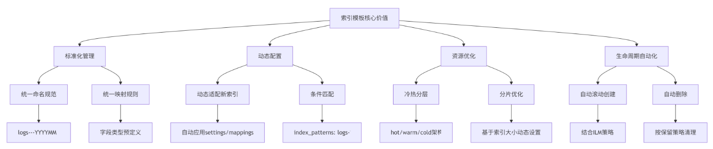

索引模板架构图：

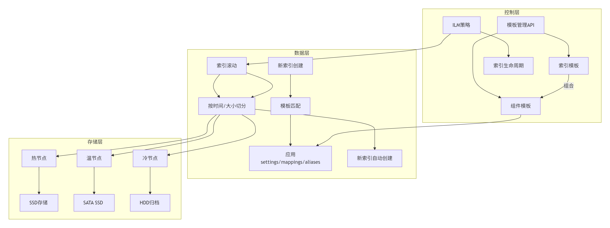

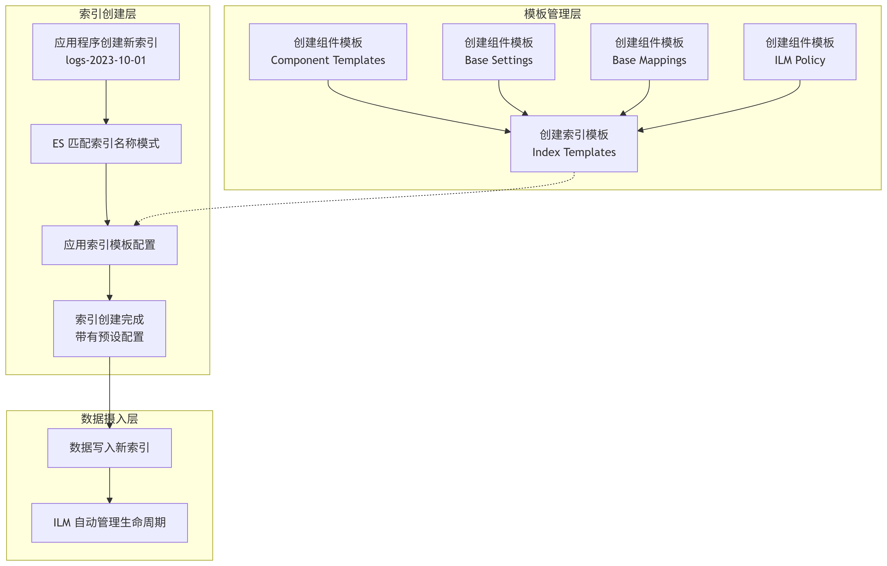

### **2.1.2 ES 索引模板核心配置**

通过 dynamic\_templates 定义字段名匹配规则，支持通配符（\*）、正则（regex）及数据类型推断：

{

"mappings": {

"dynamic\_templates": \[

{

"string\_fields": {

"match": "\*\_str", \# 匹配字段名以\_str结尾

"match\_mapping\_type": "string",

"mapping": {

"type": "text",

"fields": {

"keyword": { "type": "keyword" }

}

}

}

},

{

"numeric\_fields": {

"match\_mapping\_type": "number",

"mapping": {

"type": "double",

"doc\_values": true \# 启用文档值用于排序聚合

}

}

}

\]

}

}

通过 dynamic 参数控制未知字段的处理方式：

1.  true（默认）：自动添加动态字段（可能导致映射膨胀）
2.  false：忽略未知字段（数据仍存储，但无法搜索）
3.  strict：拒绝包含未知字段的文档（抛出异常）

分片与副本配置：

{

"settings": {

"number\_of\_shards": 5, \# 主分片数（创建后不可修改）

"number\_of\_replicas": 1, \# 副本数（可动态调整）

"index.routing.allocation.disk.threshold\_enabled": false \# 禁用磁盘阈值分片分配

}

}

性能优化设置：

{

"settings": {

"refresh\_interval": "30s", \# 降低刷新频率提升写入性能

"translog": {

"durability": "async", \# 异步提交translog（牺牲部分一致性）

"sync\_interval": "5s"

},

"index.store.compress.stored\_fields": true \# 压缩存储字段

}

}

生命周期策略集成：

{

"settings": {

"index.lifecycle.name": "log\_policy", // 关联ILM策略

"index.lifecycle.rollover\_alias": "logs\_write" // 用于滚动的别名

}

}

### **2.1.3 ES 索引模板动态配置匹配与冲突处理**

索引模板优先级顺序：固定字段定义 > 动态模板（按模板优先级降序）> 默认动态映射

当多个模板匹配同一索引时，优先级（数值越大优先级越高）决定配置合并顺序：

1.  设置合并：高优先级模板的设置覆盖低优先级（冲突项以高优先级为准）。
2.  映射合并：字段定义冲突时，以最先出现的高优先级模板为准（需注意动态模板与固定字段的优先级）。

假设存在两个模板T1（priority=100）和T2（priority=50），字段 status 在 T1 中定义为 integer，在 T2 中定义为keyword，合并规则为：

1.  按优先级降序排列模板：T1 → T2。
2.  遍历每个模板的字段定义，后出现的高优先级定义覆盖低优先级，最终 status 类型为 integer（T1 的定义保留）。

  
索引模板匹配流程图：

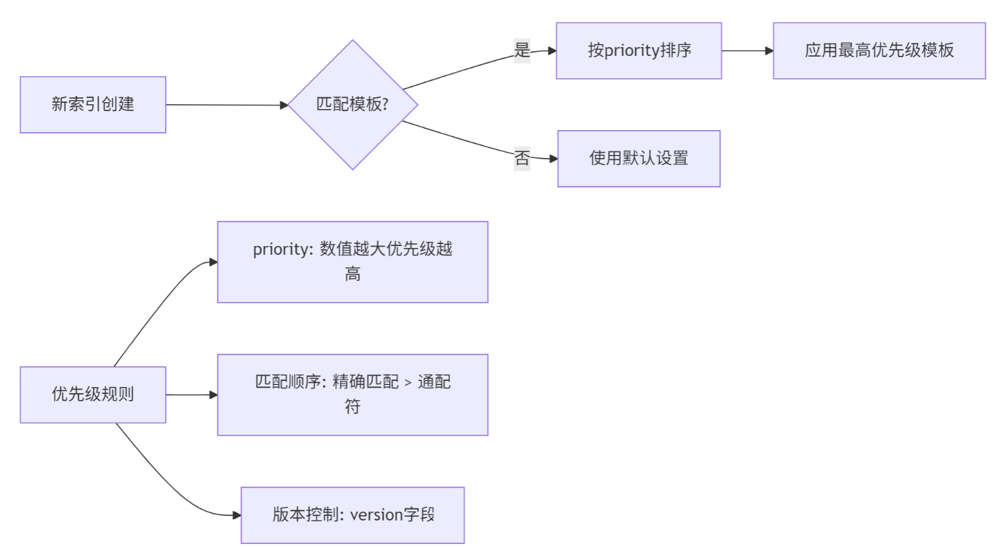

冲突解决策略​：

1.  字段映射冲突：后应用模板覆盖先应用模板。
2.  设置冲突：最高优先级模板生效。
3.  别名冲突：多个别名共存。

## **2.2 ES 索引模板深度实战**

这部分我们会进行「**生产级日志系统**」、「**生产级时间序列数据系统**」中的实战应用，帮助你建立从设计到落地的完整知识体系。

先来看第一个实战案例。

### **2.2.1 ES 索引模板之生产级日志系统**

以生产环境的日志系统管理为场景，设计一个完整的索引模板案例。

假设有如下需求：

1.  日志索引按天滚动，索引命名格式：logs-{service\_name}-{yyyy.MM.dd}。
2.  需要支持全文搜索和关键字搜索。
3.  设置合适的分片数和副本数（生产环境一般分片数根据数据量调整，假设每个索引1个主分片，2个副本）。
4.  使用ILM进行生命周期管理（热阶段 3 天，然后删除）。
5.  严格模式，避免动态映射造成映射爆炸。
6.  添加一些元数据字段，如 @timestamp, service\_name, log\_level 等。
7.  为不同环境（dev, prod）设置不同的副本数（开发环境 0 副本，生产环境 2 副本）。

  
我们将采用「**组件模板**」和「**索引模板**」的分层架构：

1.  全局基础组件（global\_base）：包含通用设置，如压缩方式、默认字段等。
2.  日志基础组件（logs\_base）：包含日志相关的通用映射，如 @timestamp, message 等。
3.  服务特定组件（service\_specific）：包含特定服务的映射（按需）。
4.  环境特定组件（env\_specific）：根据环境设置不同的副本数。

然后创建「**索引模板**」，组合这些组件，并应用到匹配的索引模式上，整个架构图如下：

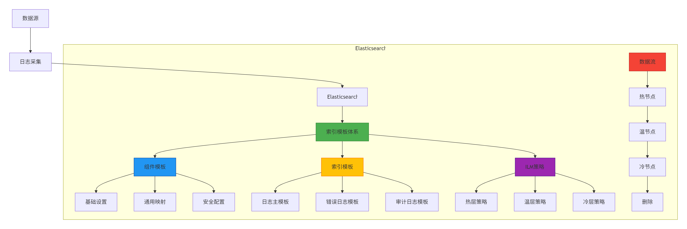

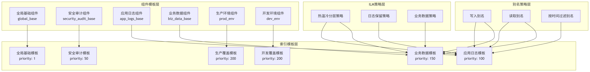

### **2.2.1.1 创建全局基础组件模板**

\# 1.1 全局基础设置组件

PUT \_component\_template/global\_base\_settings

{

"template": {

"settings": {

"index.codec": "best\_compression",

"index.query.default\_field": \["message", "text", "\*.\*message"\],

"index.mapping.total\_fields.limit": 1000,

"index.mapping.nested\_fields.limit": 50,

"index.mapping.depth.limit": 20,

"index.mapping.field\_name\_length.limit": 256

}

},

"version": 1,

"\_meta": {

"description": "全局基础设置组件",

"environment": "all",

"created\_by": "platform-team",

"created\_date": "2023-10-01"

}

}

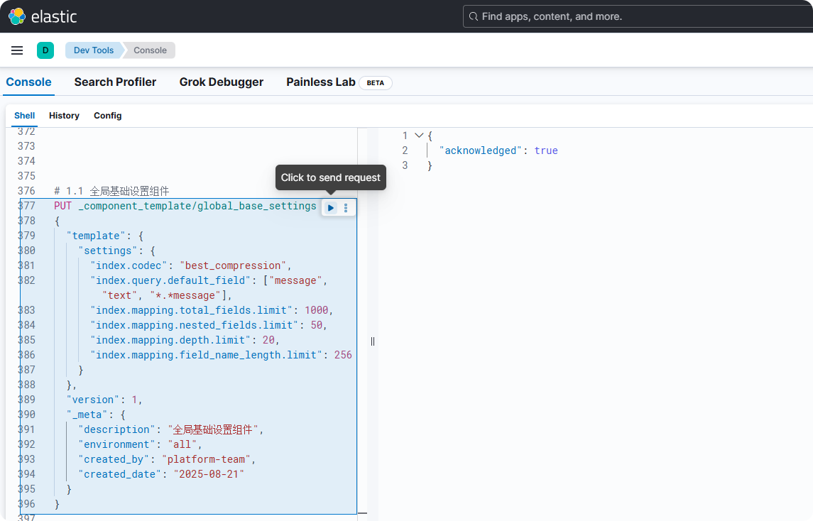

\# 1.2 全局基础映射组件

PUT \_component\_template/global\_base\_mappings

{

"template": {

"mappings": {

"dynamic": "strict",

"date\_detection": false,

"numeric\_detection": false,

"properties": {

"@timestamp": {

"type": "date",

"format": "strict\_date\_optional\_time||epoch\_millis"

},

"@version": {

"type": "keyword"

},

"event": {

"properties": {

"created": {

"type": "date"

},

"ingested": {

"type": "date"

}

}

}

}

}

},

"version": 1,

"\_meta": {

"description": "全局基础映射组件",

"environment": "all",

"created\_by": "platform-team"

}

}

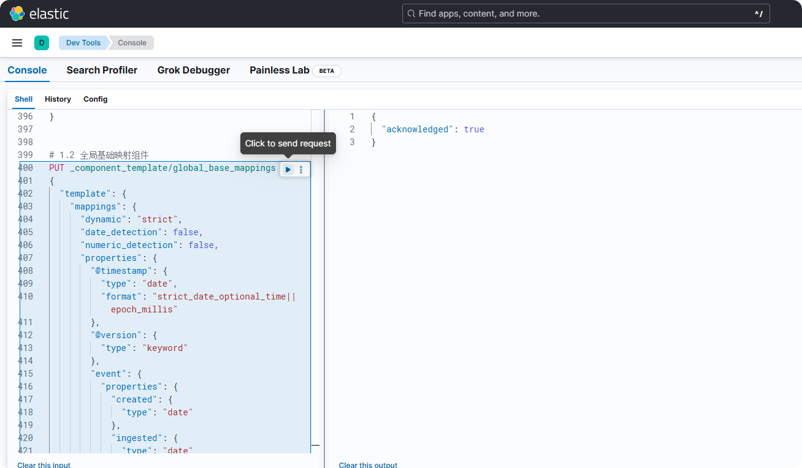

### **2.2.1.2 创建业务特定组件模板**

\# 2.1 安全审计日志组件

PUT \_component\_template/security\_audit\_component

{

"template": {

"mappings": {

"properties": {

"user": {

"properties": {

"id": {

"type": "keyword"

},

"name": {

"type": "keyword"

},

"email": {

"type": "keyword"

}

}

},

"action": {

"type": "keyword"

},

"resource": {

"type": "keyword"

},

"result": {

"type": "keyword"

},

"ip\_address": {

"type": "ip"

},

"user\_agent": {

"type": "text",

"fields": {

"keyword": {

"type": "keyword",

"ignore\_above": 256

}

}

}

}

},

"settings": {

"index.number\_of\_shards": 2,

"index.number\_of\_replicas": 1

}

},

"version": 1,

"\_meta": {

"description": "安全审计日志组件",

"category": "security",

"created\_by": "security-team"

}

}

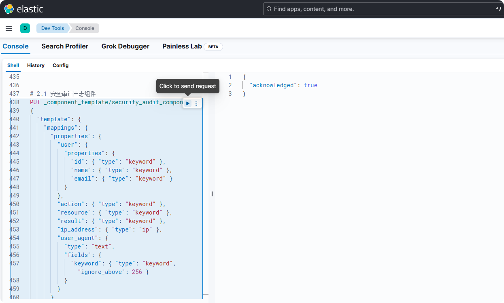

\# 2.2 应用日志组件

PUT \_component\_template/app\_logs\_component

{

"template": {

"mappings": {

"properties": {

"log": {

"properties": {

"level": {

"type": "keyword"

},

"logger": {

"type": "keyword"

},

"message": {

"type": "text",

"analyzer": "standard",

"fields": {

"keyword": {

"type": "keyword",

"ignore\_above": 256

}

}

}

}

},

"service": {

"properties": {

"name": {

"type": "keyword"

},

"version": {

"type": "keyword"

},

"environment": {

"type": "keyword"

}

}

},

"host": {

"properties": {

"name": {

"type": "keyword"

},

"ip": {

"type": "ip"

}

}

},

"trace": {

"properties": {

"id": {

"type": "keyword"

},

"span\_id": {

"type": "keyword"

}

}

}

}

},

"settings": {

"index.number\_of\_shards": 3

}

},

"version": 1,

"\_meta": {

"description": "应用日志组件",

"category": "logging",

"created\_by": "devops-team"

}

}

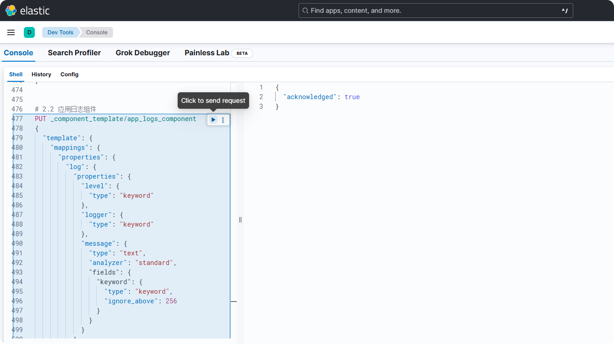

\# 2.3 业务数据组件

PUT \_component\_template/biz\_data\_component

{

"template": {

"mappings": {

"properties": {

"order": {

"properties": {

"id": {

"type": "keyword"

},

"amount": {

"type": "scaled\_float",

"scaling\_factor": 100

},

"currency": {

"type": "keyword"

},

"status": {

"type": "keyword"

}

}

},

"customer": {

"properties": {

"id": {

"type": "keyword"

},

"name": {

"type": "keyword"

},

"segment": {

"type": "keyword"

}

}

},

"product": {

"properties": {

"id": {

"type": "keyword"

},

"category": {

"type": "keyword"

},

"price": {

"type": "scaled\_float",

"scaling\_factor": 100

}

}

}

}

},

"settings": {

"index.number\_of\_shards": 5

}

},

"version": 1,

"\_meta": {

"description": "业务数据组件",

"category": "business",

"created\_by": "data-team"

}

}

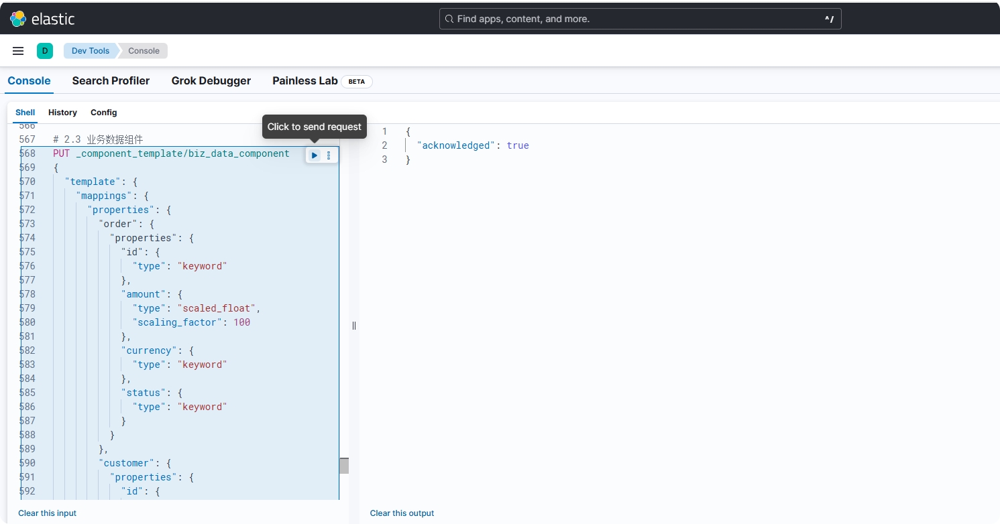

### **2.2.1.3 创建环境特定组件模板**

\# 3.1 生产环境组件

PUT \_component\_template/prod\_env\_component

{

"template": {

"settings": {

"index.number\_of\_replicas": 2,

"index.refresh\_interval": "30s",

"index.routing.allocation.require.box\_type": "hot"

},

"aliases": {

"{}\_all\_prod": {} \# 占位符，将在索引模板中替换

}

},

"version": 1,

"\_meta": {

"description": "生产环境组件",

"environment": "production",

"created\_by": "platform-team"

}

}

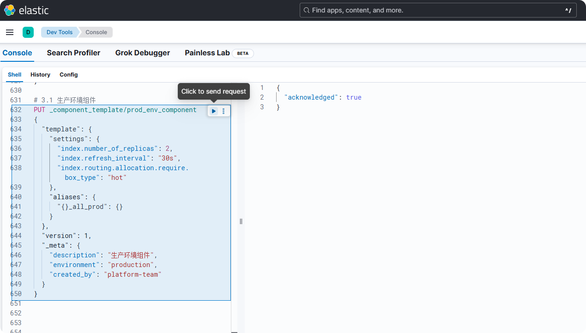

\# 3.2 开发环境组件

PUT \_component\_template/dev\_env\_component

{

"template": {

"settings": {

"index.number\_of\_replicas": 0,

"index.refresh\_interval": "1s",

"index.routing.allocation.require.box\_type": "warm"

},

"aliases": {

"{}\_all\_dev": {}

}

},

"version": 1,

"\_meta": {

"description": "开发环境组件",

"environment": "development",

"created\_by": "platform-team"

}

}

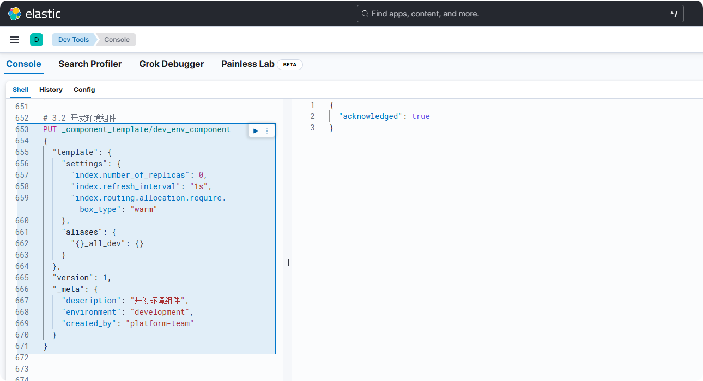

关于 box\_type 的说明：

box\_type 是一个自定义属性，通常需要你在节点配置中定义。在 elasticsearch.yml 中为节点配置属性：

\# 热节点配置

node.attr.box\_type: hot

\# 温节点配置

node.attr.box\_type: warm

\# 冷节点配置

node.attr.box\_type: cold

### **2.2.1.4 创建 ILM 策略**

\# 4.1 日志数据ILM策略（30天热阶段，然后删除）

PUT \_ilm/policy/logs\_ilm\_policy

{

"policy": {

"phases": {

"hot": {

"min\_age": "0ms",

"actions": {

"rollover": {

"max\_size": "50gb", // 达到50GB时滚动

"max\_age": "30d" // 或者索引创建超过30天时滚动

},

"set\_priority": {

"priority": 100

}

}

},

"delete": {

"min\_age": "30d", // 滚动后30天（即数据产生后约31天）删除

"actions": {

"delete": {}

}

}

}

}

}

当后续 xxx-2025.08.21-000001 索引满足 max\_age: 1d 或 max\_size: 50gb 条件时，ILM 自动执行滚动：

1.  创建一个新索引 xxx-2025.08.21-000002。
2.  将 logs-write 别名的写索引指向 xxx-2025.08.21-000002。
3.  xxx-2025.08.21-000001 变为只读，并开始进入生命周期后续阶段。

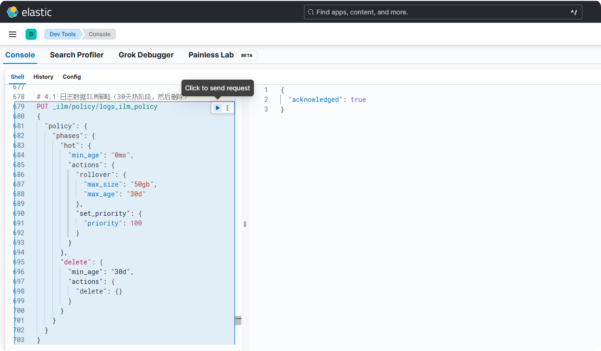

\# 4.2 业务数据ILM策略（热温冷分层）

PUT \_ilm/policy/biz\_data\_ilm\_policy

{

"policy": {

"phases": {

"hot": {

"min\_age": "0ms",

"actions": {

"rollover": {

"max\_size": "50gb", // 达到50GB时滚动

"max\_age": "7d" // 或者索引创建超过7天时滚动

},

"set\_priority": {

"priority": 100

}

}

},

"warm": {

"min\_age": "7d", // 滚动后7天（即索引不再写入后）进入温阶段

"actions": {

"forcemerge": {

"max\_num\_segments": 1 // 强制合并段以优化存储和查询

},

"shrink": {

"number\_of\_shards": 1 // 可选：收缩分片数

},

"set\_priority": {

"priority": 50

}

}

},

"cold": {

"min\_age": "30d", // 滚动后约30天（即数据产生后约31-32天）进入冷阶段

"actions": {

"set\_priority": {

"priority": 0

}

}

},

"delete": {

"min\_age": "90d", // 滚动后90天（即数据产生后约91天）删除

"actions": {

"delete": {}

}

}

}

}

}

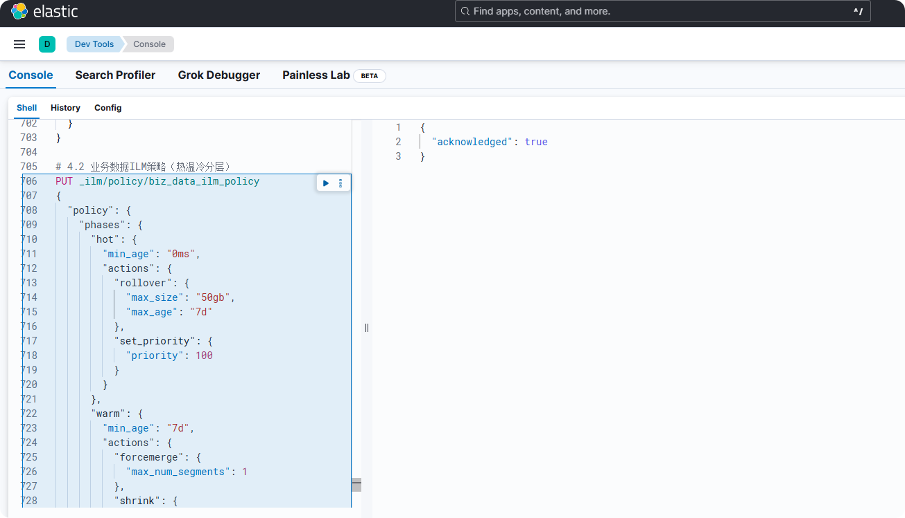

### **2.2.1.5 创建索引模板**

\# 5.1 全局基础模板（最低优先级）

PUT \_index\_template/global\_base\_template

{

"index\_patterns": \[

"\*"

\],

"priority": 1,

"composed\_of": \[

"global\_base\_settings",

"global\_base\_mappings"

\],

"template": {

"settings": {

}

},

"version": 1,

"\_meta": {

"description": "全局基础模板，应用于所有索引",

"environment": "all",

"created\_by": "platform-team"

}

}

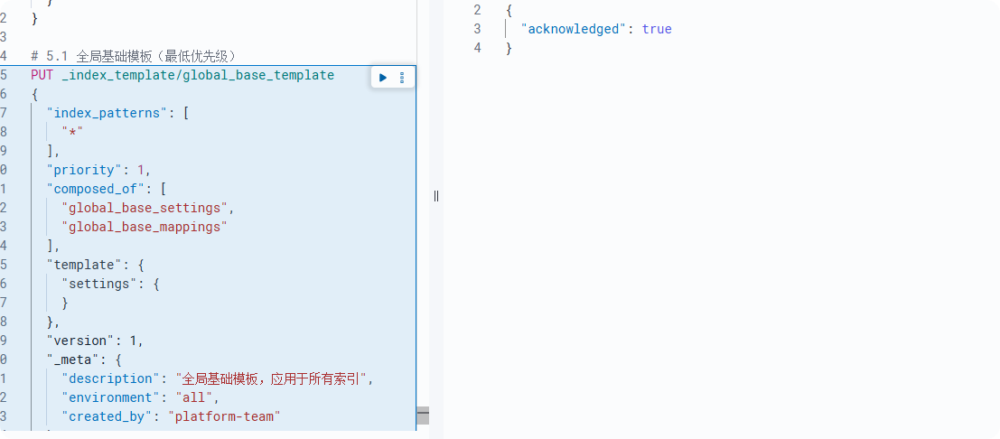

\# 5.2 安全审计日志模板

PUT \_index\_template/security\_audit\_template

{

"index\_patterns": \[

"audit-\*",

"security-\*"

\],

"priority": 50,

"composed\_of": \[

"security\_audit\_component"

\],

"template": {

"aliases": {

"audit\_logs": {},

"security\_data": {}

}

},

"version": 1,

"\_meta": {

"description": "安全审计日志模板",

"category": "security",

"created\_by": "security-team"

}

}

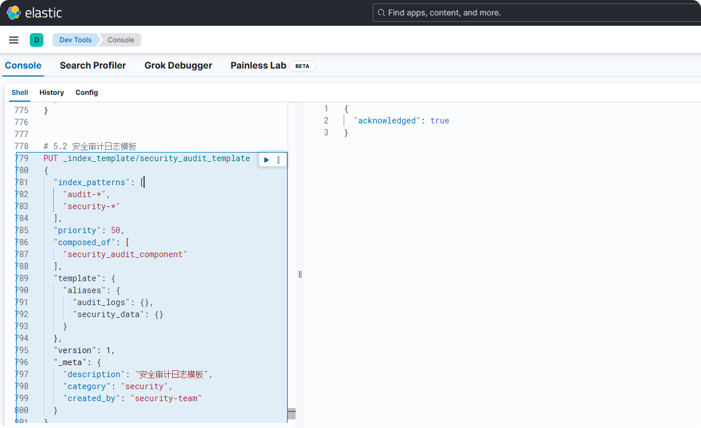

\# 5.3 应用日志模板

PUT \_index\_template/app\_logs\_template

{

"index\_patterns": \[

"logs-\*",

"app-\*"

\],

"priority": 101,

"composed\_of": \[

"app\_logs\_component"

\],

"template": {

"settings": {

"index.lifecycle.name": "logs\_ilm\_policy", // 关联ILM策略

"index.lifecycle.rollover\_alias": "logs\_write" // 用于滚动的别名

},

"aliases": {

"logs\_write": {

"is\_write\_index": true

},

"logs\_all": {},

"logs\_recent\_7d": {

"filter": {

"range": {

"@timestamp": {

"gte": "now-7d/d"

}

}

}

}

}

},

"version": 1,

"\_meta": {

"description": "应用日志模板",

"category": "logging",

"created\_by": "devops-team"

}

}

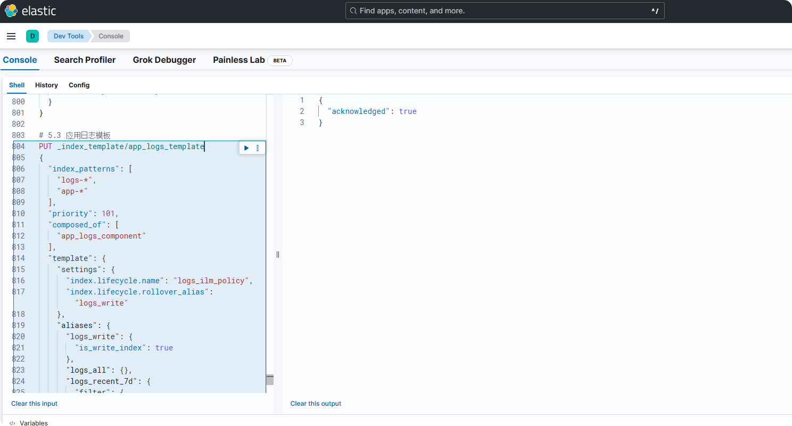

\# 5.4 业务数据模板

PUT \_index\_template/biz\_data\_template

{

"index\_patterns": \[

"biz-\*",

"data-\*"

\],

"priority": 150,

"composed\_of": \[

"biz\_data\_component"

\],

"template": {

"settings": {

"index.lifecycle.name": "biz\_data\_ilm\_policy", // 关联ILM策略

"index.lifecycle.rollover\_alias": "biz\_data\_write" // 用于滚动的别名

},

"aliases": {

"biz\_data\_write": {

"is\_write\_index": true

},

"biz\_data\_all": {},

"biz\_data\_current": {

"filter": {

"range": {

"@timestamp": {

"gte": "now-30d/d"

}

}

}

}

}

},

"version": 1,

"\_meta": {

"description": "业务数据模板",

"category": "business",

"created\_by": "data-team"

}

}

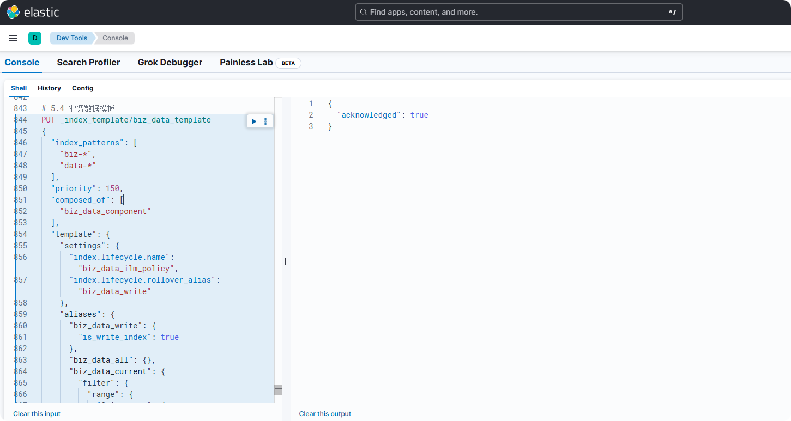

\# 5.5 生产环境覆盖模板（最高优先级）

PUT \_index\_template/prod\_env\_template

{

"index\_patterns": \[

"\*-prod",

"prod-\*"

\],

"priority": 300,

"composed\_of": \[

"prod\_env\_component"

\],

"template": {

"settings": {

"index.routing.allocation.include.env": "production"

}

},

"version": 1,

"\_meta": {

"description": "生产环境覆盖模板",

"environment": "production",

"created\_by": "platform-team"

}

}

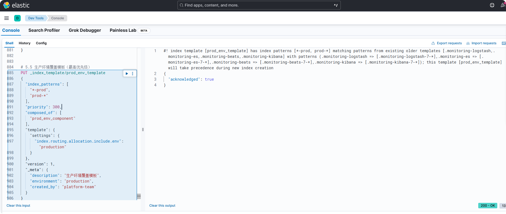

\# 5.6 开发环境覆盖模板（最高优先级）

PUT \_index\_template/dev\_env\_template

{

"index\_patterns": \[

"\*-dev",

"dev-\*"

\],

"priority": 301,

"composed\_of": \[

"dev\_env\_component"

\],

"template": {

"settings": {

"index.routing.allocation.include.env": "development"

}

},

"version": 1,

"\_meta": {

"description": "开发环境覆盖模板",

"environment": "development",

"created\_by": "platform-team"

}

}

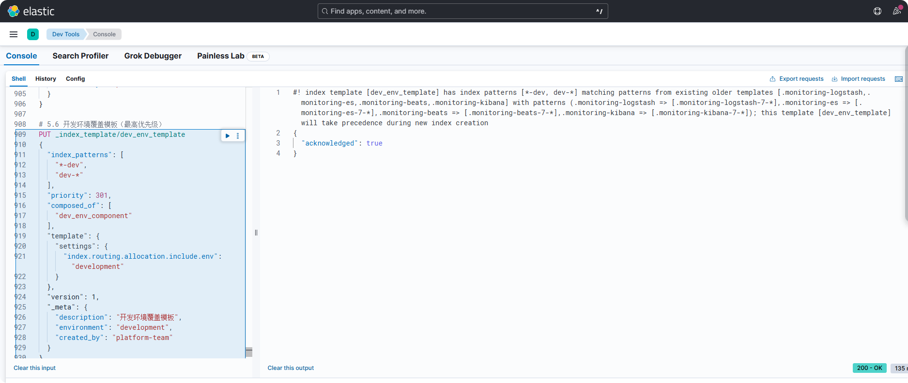

在创建这些索引模板时，遇到一个问题：「**索引模板优先级造成的模板冲突**」。

索引模板优先级体系建议图：

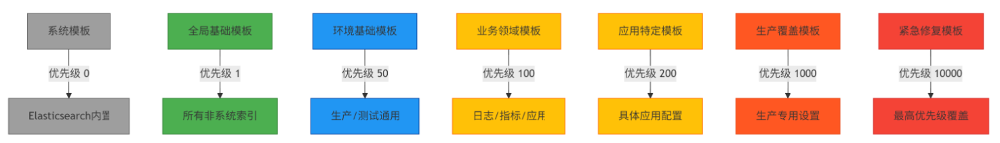

优先级分配建议：

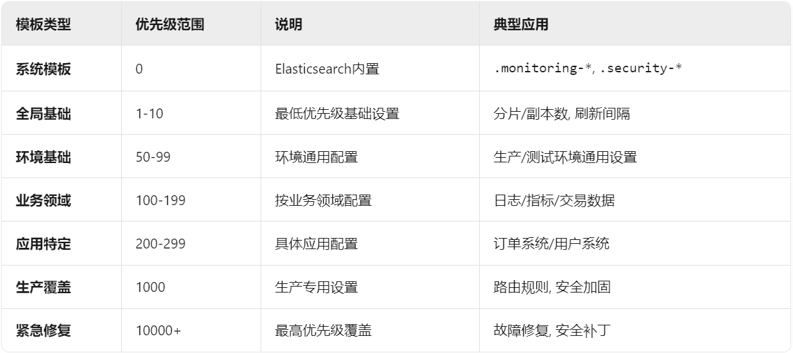

生产环境排除列表：

"index\_patterns": \[

"\*-prod",

"prod-\*",

"-.monitoring-\*", // Elasticsearch监控

"-.kibana\*", // Kibana系统

"-.tasks", // 后台任务

"-.apm-\*", // APM应用

"-.watches", // Watcher

"-.security-\*", // 安全模块

"-.fleet-\*", // Fleet代理

"-.synthetics-\*", // 综合监控

"-.slm-history-\*", // 快照生命周期

"-.ilm-history-\*", // 索引生命周期

"-.transform-\*", // 转换作业

"-.data-frame-\*" // 数据帧

\]

排除规则说明：

1.  ​通配符排除​：使用 - 前缀排除特定模式
2.  ​层级排除​：
3.  第一级：核心系统索引（监控、Kibana）
4.  第二级：插件相关索引（APM、Fleet）
5.  第三级：后台作业索引（任务、Watcher）
6.  ​动态排除​：定期检查新系统索引模式

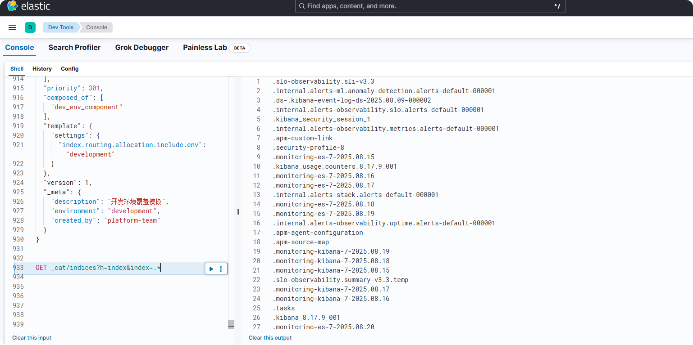

模板优先级冲突解决流程图：

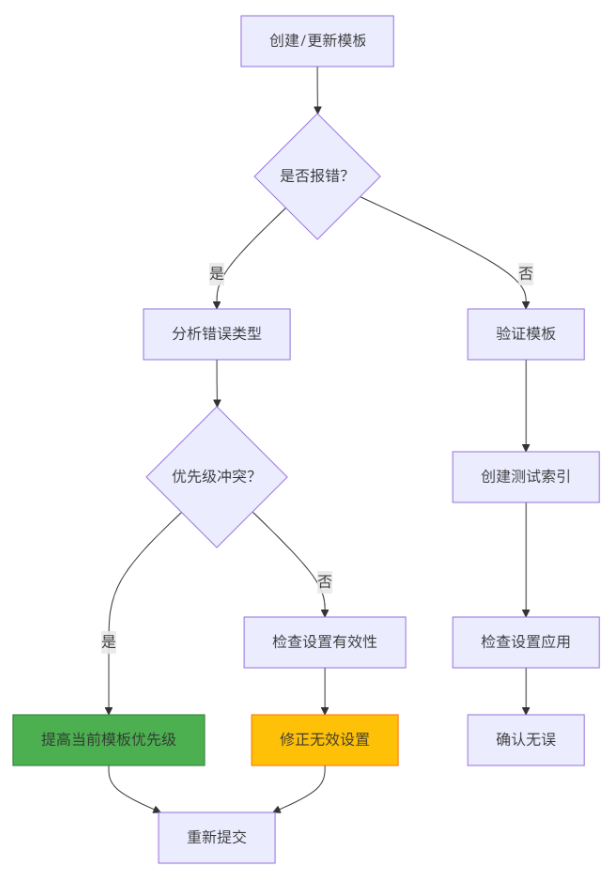

设置冲突解决矩阵工具/命令：

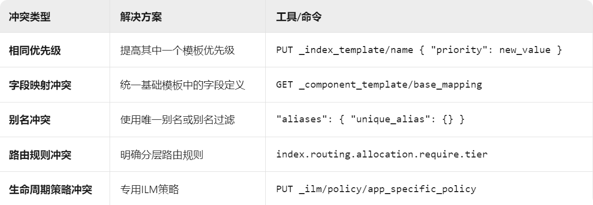

查看模板匹配情况：

\# 获取模板优先级相关信息

GET \_index\_template?filter\_path=index\_templates.name,index\_templates.index\_template.index\_patterns,index\_templates.index\_template.priority,index\_templates.index\_template.version

\# 优先级结果 {

"index\_templates": \[

{

"name": ".kibana-reporting",

"index\_template": {

"index\_patterns": \[

".kibana-reporting\*"

\],

"priority": 100,

"version": 14

}

},

{

"name": "synthetics-browser.screenshot",

"index\_template": {

"index\_patterns": \[

"synthetics-browser.screenshot-\*"

\],

"priority": 200

}

},

{

"name": ".kibana-elastic-ai-assistant-index-template-prompts",

"index\_template": {

"index\_patterns": \[

".kibana-elastic-ai-assistant-prompts-\*"

\],

"priority": 7

}

},

{

"name": ".kibana-elastic-ai-assistant-index-template-attack-discovery",

"index\_template": {

"index\_patterns": \[

".kibana-elastic-ai-assistant-attack-discovery-\*"

\],

"priority": 7

}

},

{

"name": ".monitoring-ent-search-mb",

"index\_template": {

"index\_patterns": \[

".monitoring-ent-search-8-\*"

\],

"version": 8000120

}

},

{

"name": "logs-apm.error@template",

"index\_template": {

"index\_patterns": \[

"logs-apm.error-\*"

\],

"priority": 210,

"version": 13

}

},

{

"name": "security\_audit\_template",

"index\_template": {

"index\_patterns": \[

"audit-\*",

"security-\*"

\],

"priority": 50,

"version": 1

}

},

{

"name": "app\_logs\_template",

"index\_template": {

"index\_patterns": \[

"logs-\*",

"app-\*"

\],

"priority": 101,

"version": 1

}

},

{

"name": "metrics-apm.service\_summary.60m@template",

"index\_template": {

"index\_patterns": \[

"metrics-apm.service\_summary.60m-\*"

\],

"priority": 210,

"version": 13

}

},

{

"name": "metrics-apm.service\_destination.1m@template",

"index\_template": {

"index\_patterns": \[

"metrics-apm.service\_destination.1m-\*"

\],

"priority": 210,

"version": 13

}

},

{

"name": "metrics-apm.service\_summary.1m@template",

"index\_template": {

"index\_patterns": \[

"metrics-apm.service\_summary.1m-\*"

\],

"priority": 210,

"version": 13

}

},

{

"name": "ilm-history-7",

"index\_template": {

"index\_patterns": \[

"ilm-history-7\*"

\],

"priority": 2147483647,

"version": 7

}

},

{

"name": "metrics-service\_transaction.10m.otel@template",

"index\_template": {

"index\_patterns": \[

"metrics-service\_transaction.10m.otel-\*"

\],

"priority": 130,

"version": 8

}

},

{

"name": ".fleet-fileds-tohost-meta",

"index\_template": {

"index\_patterns": \[

".fleet-fileds-tohost-meta-\*"

\],

"priority": 200,

"version": 1

}

},

{

"name": "metrics-apm.transaction.1m@template",

"index\_template": {

"index\_patterns": \[

"metrics-apm.transaction.1m-\*"

\],

"priority": 210,

"version": 13

}

},

{

"name": ".kibana-event-log-template",

"index\_template": {

"index\_patterns": \[

".kibana-event-log-ds"

\],

"priority": 50

}

},

{

"name": ".fleet-fileds-fromhost-data",

"index\_template": {

"index\_patterns": \[

".fleet-fileds-fromhost-data-\*"

\],

"priority": 200,

"version": 1

}

},

{

"name": "traces-otel@template",

"index\_template": {

"index\_patterns": \[

"traces-\*.otel-\*"

\],

"priority": 120,

"version": 8

}

},

{

"name": "metrics-transaction.10m.otel@template",

"index\_template": {

"index\_patterns": \[

"metrics-transaction.10m.otel-\*"

\],

"priority": 130,

"version": 8

}

},

{

"name": "metrics-apm.service\_transaction.60m@template",

"index\_template": {

"index\_patterns": \[

"metrics-apm.service\_transaction.60m-\*"

\],

"priority": 210,

"version": 13

}

},

{

"name": ".alerts-observability.metrics.alerts-default-index-template",

"index\_template": {

"index\_patterns": \[

".internal.alerts-observability.metrics.alerts-default-\*"

\],

"priority": 7

}

},

{

"name": "biz\_data\_template",

"index\_template": {

"index\_patterns": \[

"biz-\*",

"data-\*"

\],

"priority": 150,

"version": 1

}

},

{

"name": ".kibana-elastic-ai-assistant-index-template-conversations",

"index\_template": {

"index\_patterns": \[

".kibana-elastic-ai-assistant-conversations-\*"

\],

"priority": 7

}

},

{

"name": "synthetics-browser",

"index\_template": {

"index\_patterns": \[

"synthetics-browser-\*"

\],

"priority": 200

}

},

{

"name": ".slo-observability.summary",

"index\_template": {

"index\_patterns": \[

".slo-observability.summary-\*"

\],

"priority": 500

}

},

{

"name": "logs-otel@template",

"index\_template": {

"index\_patterns": \[

"logs-\*.otel-\*"

\],

"priority": 120,

"version": 8

}

},

{

"name": "metrics-apm.transaction.60m@template",

"index\_template": {

"index\_patterns": \[

"metrics-apm.transaction.60m-\*"

\],

"priority": 210,

"version": 13

}

},

{

"name": "logs",

"index\_template": {

"index\_patterns": \[

"logs-\*-\*"

\],

"priority": 100,

"version": 14

}

},

{

"name": ".watch-history-16",

"index\_template": {

"index\_patterns": \[

".watcher-history-16\*"

\],

"priority": 2147483647,

"version": 16

}

},

{

"name": ".monitoring-beats-mb",

"index\_template": {

"index\_patterns": \[

".monitoring-beats-8-\*"

\],

"version": 8000120

}

},

{

"name": "metrics-apm.transaction.10m@template",

"index\_template": {

"index\_patterns": \[

"metrics-apm.transaction.10m-\*"

\],

"priority": 210,

"version": 13

}

},

{

"name": ".alerts-ml.anomaly-detection.alerts-default-index-template",

"index\_template": {

"index\_patterns": \[

".internal.alerts-ml.anomaly-detection.alerts-default-\*"

\],

"priority": 7

}

},

{

"name": ".monitoring-kibana-mb",

"index\_template": {

"index\_patterns": \[

".monitoring-kibana-8-\*"

\],

"version": 8000120

}

},

{

"name": "metrics-service\_summary.60m.otel@template",

"index\_template": {

"index\_patterns": \[

"metrics-service\_summary.60m.otel-\*"

\],

"priority": 130,

"version": 8

}

},

{

"name": "metrics-apm.service\_summary.10m@template",

"index\_template": {

"index\_patterns": \[

"metrics-apm.service\_summary.10m-\*"

\],

"priority": 210,

"version": 13

}

},

{

"name": "metrics-service\_destination.1m@template",

"index\_template": {

"index\_patterns": \[

"metrics-service\_destination.1m.otel-\*"

\],

"priority": 130,

"version": 8

}

},

{

"name": "metrics-service\_destination.10m@template",

"index\_template": {

"index\_patterns": \[

"metrics-service\_destination.10m.otel-\*"

\],

"priority": 130,

"version": 8

}

},

{

"name": ".kibana-data-quality-dashboard-results-index-template",

"index\_template": {

"index\_patterns": \[

".kibana-data-quality-dashboard-results-\*"

\],

"priority": 7

}

},

{

"name": ".ml-state",

"index\_template": {

"index\_patterns": \[

".ml-state\*"

\],

"priority": 2147483647,

"version": 10000003

}

},

{

"name": "global\_base\_template",

"index\_template": {

"index\_patterns": \[

"\*"

\],

"priority": 1,

"version": 1

}

},

{

"name": ".monitoring-logstash-mb",

"index\_template": {

"index\_patterns": \[

".monitoring-logstash-8-\*"

\],

"version": 8000120

}

},

{

"name": ".alerts-stack.alerts-default-index-template",

"index\_template": {

"index\_patterns": \[

".internal.alerts-stack.alerts-default-\*"

\],

"priority": 7

}

},

{

"name": ".ml-anomalies-",

"index\_template": {

"index\_patterns": \[

".ml-anomalies-\*"

\],

"priority": 2147483647,

"version": 10000003

}

},

{

"name": "metrics",

"index\_template": {

"index\_patterns": \[

"metrics-\*-\*"

\],

"priority": 100,

"version": 14

}

},

{

"name": ".ml-notifications-000002",

"index\_template": {

"index\_patterns": \[

".ml-notifications-000002"

\],

"priority": 2147483647,

"version": 10000003

}

},

{

"name": "metrics-apm.service\_destination.10m@template",

"index\_template": {

"index\_patterns": \[

"metrics-apm.service\_destination.10m-\*"

\],

"priority": 210,

"version": 13

}

},

{

"name": ".ml-stats",

"index\_template": {

"index\_patterns": \[

".ml-stats-\*"

\],

"priority": 2147483647,

"version": 10000003

}

},

{

"name": ".slm-history-7",

"index\_template": {

"index\_patterns": \[

".slm-history-7\*"

\],

"priority": 2147483647,

"version": 7

}

},

{

"name": ".alerts-security.alerts-default-index-template",

"index\_template": {

"index\_patterns": \[

".internal.alerts-security.alerts-default-\*"

\],

"priority": 7

}

},

{

"name": "synthetics-icmp",

"index\_template": {

"index\_patterns": \[

"synthetics-icmp-\*"

\],

"priority": 200

}

},

{

"name": ".alerts-observability.slo.alerts-default-index-template",

"index\_template": {

"index\_patterns": \[

".internal.alerts-observability.slo.alerts-default-\*"

\],

"priority": 7

}

},

{

"name": ".kibana-elastic-ai-assistant-index-template-anonymization-fields",

"index\_template": {

"index\_patterns": \[

".kibana-elastic-ai-assistant-anonymization-fields-\*"

\],

"priority": 7

}

},

{

"name": "behavioral\_analytics-events-default",

"index\_template": {

"index\_patterns": \[

"behavioral\_analytics-events-\*"

\],

"priority": 100,

"version": 3

}

},

{

"name": "synthetics-http",

"index\_template": {

"index\_patterns": \[

"synthetics-http-\*"

\],

"priority": 200

}

},

{

"name": "metrics-otel@template",

"index\_template": {

"index\_patterns": \[

"metrics-\*.otel-\*"

\],

"priority": 120,

"version": 8

}

},

{

"name": ".fleet-fileds-fromhost-meta",

"index\_template": {

"index\_patterns": \[

".fleet-fileds-fromhost-meta-\*"

\],

"priority": 200,

"version": 1

}

},

{

"name": "elastic-connectors",

"index\_template": {

"index\_patterns": \[

".elastic-connectors-v1"

\],

"priority": 100,

"version": 3

}

},

{

"name": ".kibana-elastic-ai-assistant-index-template-knowledge-base",

"index\_template": {

"index\_patterns": \[

".kibana-elastic-ai-assistant-knowledge-base-\*"

\],

"priority": 7

}

},

{

"name": "dev\_env\_template",

"index\_template": {

"index\_patterns": \[

"\*-dev",

"dev-\*"

\],

"priority": 301,

"version": 1

}

},

{

"name": "metrics-apm.service\_destination.60m@template",

"index\_template": {

"index\_patterns": \[

"metrics-apm.service\_destination.60m-\*"

\],

"priority": 210,

"version": 13

}

},

{

"name": ".alerts-default.alerts-default-index-template",

"index\_template": {

"index\_patterns": \[

".internal.alerts-default.alerts-default-\*"

\],

"priority": 7

}

},

{

"name": "synthetics-tcp",

"index\_template": {

"index\_patterns": \[

"synthetics-tcp-\*"

\],

"priority": 200

}

},

{

"name": "elastic-connectors-sync-jobs",

"index\_template": {

"index\_patterns": \[

".elastic-connectors-sync-jobs-v1"

\],

"priority": 100,

"version": 3

}

},

{

"name": ".monitoring-es-mb",

"index\_template": {

"index\_patterns": \[

".monitoring-es-8-\*"

\],

"version": 8000120

}

},

{

"name": ".alerts-ml.anomaly-detection-health.alerts-default-index-template",

"index\_template": {

"index\_patterns": \[

".internal.alerts-ml.anomaly-detection-health.alerts-default-\*"

\],

"priority": 7

}

},

{

"name": ".slo-observability.sli",

"index\_template": {

"index\_patterns": \[

".slo-observability.sli-\*"

\],

"priority": 500

}

},

{

"name": ".alerts-observability.logs.alerts-default-index-template",

"index\_template": {

"index\_patterns": \[

".internal.alerts-observability.logs.alerts-default-\*"

\],

"priority": 7

}

},

{

"name": "metrics-service\_summary.1m.otel@template",

"index\_template": {

"index\_patterns": \[

"metrics-service\_summary.1m.otel-\*"

\],

"priority": 130,

"version": 8

}

},

{

"name": "apm-source-map",

"index\_template": {

"index\_patterns": \[

".apm-source-map"

\],

"version": 1

}

},

{

"name": "metrics-apm.service\_transaction.10m@template",

"index\_template": {

"index\_patterns": \[

"metrics-apm.service\_transaction.10m-\*"

\],

"priority": 210,

"version": 13

}

},

{

"name": "metrics-service\_transaction.60m.otel@template",

"index\_template": {

"index\_patterns": \[

"metrics-service\_transaction.60m.otel-\*"

\],

"priority": 130,

"version": 8

}

},

{

"name": "traces-apm@template",

"index\_template": {

"index\_patterns": \[

"traces-apm-\*"

\],

"priority": 210,

"version": 13

}

},

{

"name": "logs-apm.app@template",

"index\_template": {

"index\_patterns": \[

"logs-apm.app.\*-\*"

\],

"priority": 210,

"version": 13

}

},

{

"name": "metrics-apm.service\_transaction.1m@template",

"index\_template": {

"index\_patterns": \[

"metrics-apm.service\_transaction.1m-\*"

\],

"priority": 210,

"version": 13

}

},

{

"name": "synthetics",

"index\_template": {

"index\_patterns": \[

"synthetics-\*-\*"

\],

"priority": 100,

"version": 14

}

},

{

"name": "metrics-apm.internal@template",

"index\_template": {

"index\_patterns": \[

"metrics-apm.internal-\*"

\],

"priority": 210,

"version": 13

}

},

{

"name": ".alerts-observability.uptime.alerts-default-index-template",

"index\_template": {

"index\_patterns": \[

".internal.alerts-observability.uptime.alerts-default-\*"

\],

"priority": 7

}

},

{

"name": "synthetics-browser.network",

"index\_template": {

"index\_patterns": \[

"synthetics-browser.network-\*"

\],

"priority": 200

}

},

{

"name": ".alerts-observability.threshold.alerts-default-index-template",

"index\_template": {

"index\_patterns": \[

".internal.alerts-observability.threshold.alerts-default-\*"

\],

"priority": 7

}

},

{

"name": "metrics-service\_summary.10m.otel@template",

"index\_template": {

"index\_patterns": \[

"metrics-service\_summary.10m.otel-\*"

\],

"priority": 130,

"version": 8

}

},

{

"name": ".alerts-transform.health.alerts-default-index-template",

"index\_template": {

"index\_patterns": \[

".internal.alerts-transform.health.alerts-default-\*"

\],

"priority": 7

}

},

{

"name": ".fleet-fileds-tohost-data",

"index\_template": {

"index\_patterns": \[

".fleet-fileds-tohost-data-\*"

\],

"priority": 200,

"version": 1

}

},

{

"name": "metrics-transaction.60m.otel@template",

"index\_template": {

"index\_patterns": \[

"metrics-transaction.60m.otel-\*"

\],

"priority": 130,

"version": 8

}

},

{

"name": "metrics-transaction.1m.otel@template",

"index\_template": {

"index\_patterns": \[

"metrics-transaction.1m.otel-\*"

\],

"priority": 130,

"version": 8

}

},

{

"name": "metrics-service\_transaction.1m.otel@template",

"index\_template": {

"index\_patterns": \[

"metrics-service\_transaction.1m.otel-\*"

\],

"priority": 130,

"version": 8

}

},

{

"name": "prod\_env\_template",

"index\_template": {

"index\_patterns": \[

"\*-prod",

"prod-\*"

\],

"priority": 300,

"version": 1

}

},

{

"name": "traces-apm.rum@template",

"index\_template": {

"index\_patterns": \[

"traces-apm.rum-\*"

\],

"priority": 210,

"version": 13

}

},

{

"name": "search-acl-filter",

"index\_template": {

"index\_patterns": \[

".search-acl-filter-\*"

\],

"priority": 110,

"version": 3

}

},

{

"name": "metrics-service\_destination.60m@template",

"index\_template": {

"index\_patterns": \[

"metrics-service\_destination.60m.otel-\*"

\],

"priority": 130,

"version": 8

}

},

{

"name": ".deprecation-indexing-template",

"index\_template": {

"index\_patterns": \[

".logs-deprecation.\*"

\],

"priority": 1000,

"version": 1

}

},

{

"name": "metrics-apm.app@template",

"index\_template": {

"index\_patterns": \[

"metrics-apm.app.\*-\*"

\],

"priority": 210,

"version": 13

}

},

{

"name": ".alerts-observability.apm.alerts-default-index-template",

"index\_template": {

"index\_patterns": \[

".internal.alerts-observability.apm.alerts-default-\*"

\],

"priority": 7

}

},

{

"name": "traces-apm.sampled@template",

"index\_template": {

"index\_patterns": \[

"traces-apm.sampled-\*"

\],

"priority": 210,

"version": 13

}

}

\]

}

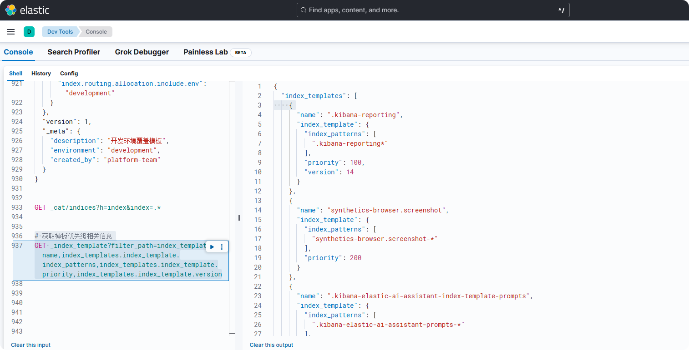

### **2.2.1.6 查看模板**

\# 查看所有基础组件模板

GET \_component\_template/global\_\*

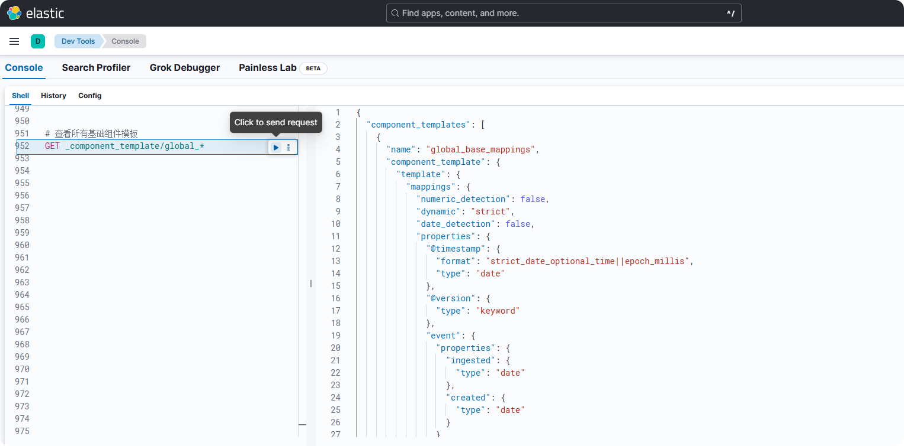

\# 查看业务特定组件模板

GET \_component\_template/\*\_component

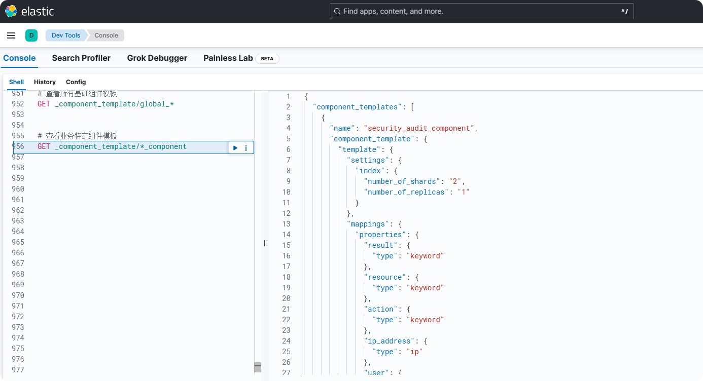

\# 查看环境特定组件模板

GET \_component\_template/\*\_env\_\*

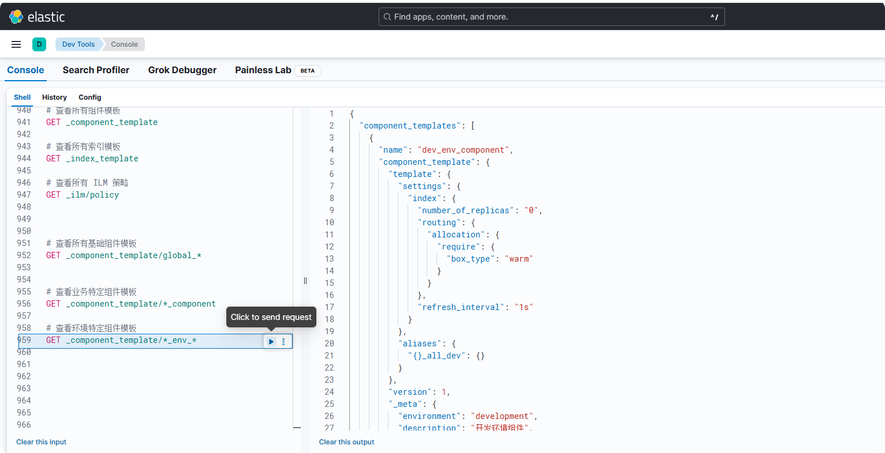

\# 查看所有业务模板

GET \_index\_template/\*\_template

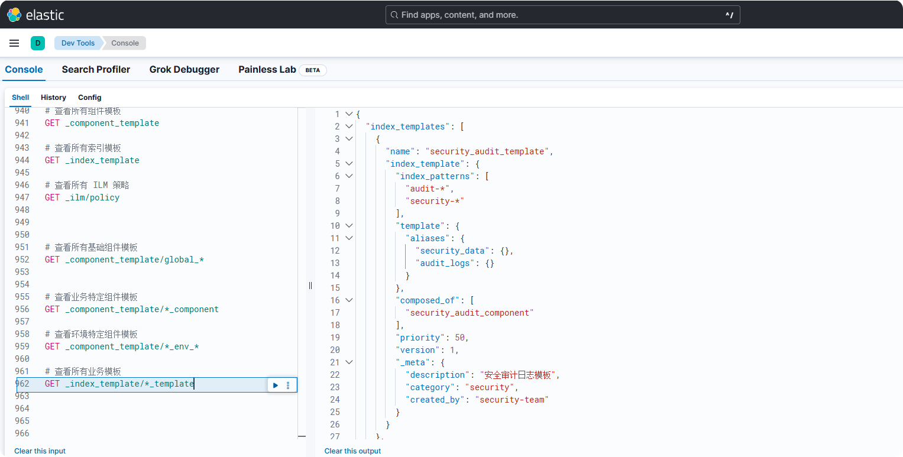

\# 查看特定 ILM 策略

GET \_ilm/policy/logs\_ilm\_policy,biz\_data\_ilm\_policy

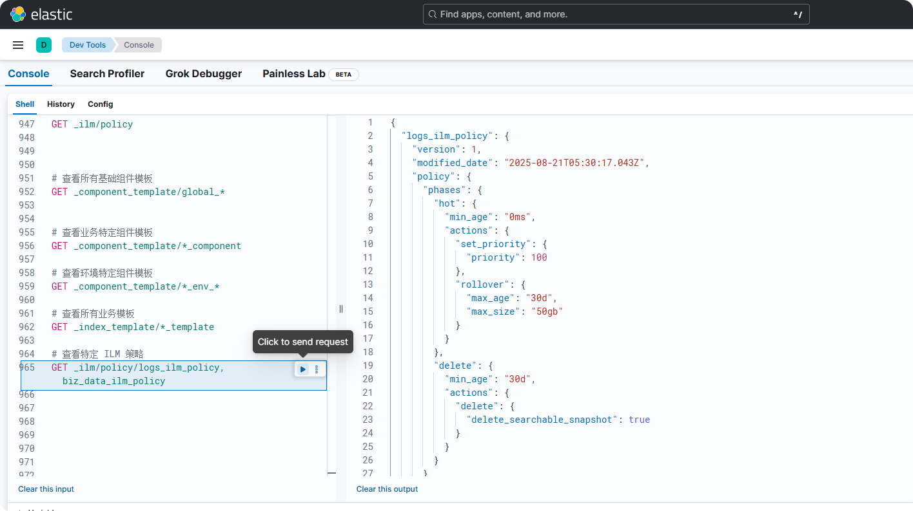

### **2.2.1.7 写入索引数据**

测试安全审计日志模板：

\# 创建安全审计索引（符合 audit-\* 模式）

PUT audit-security-prod-2025.08.21-000001

{

"aliases": {

"audit\_logs": {},

"security\_data": {}

}

}

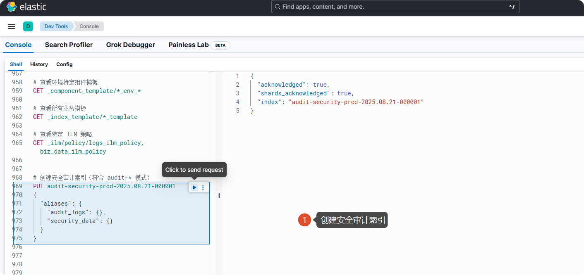

\# 写入安全审计数据

POST audit-security-prod-2025.08.21-000001/\_doc

{

"@timestamp": "2025.08.21T10:15:30.000Z",

"@version": "1",

"event": {

"created": "2025.08.21T10:15:30.000Z",

"ingested": "2025.08.21T10:15:35.000Z"

},

"user": {

"id": "user-12345",

"name": "john.doe",

"email": "john.doe@example.com"

},

"action": "login",

"resource": "/api/auth/login",

"result": "success",

"ip\_address": "192.168.1.100",

"user\_agent": "Mozilla/5.0 (Windows NT 10.0; Win64; x64) AppleWebKit/537.36"

}

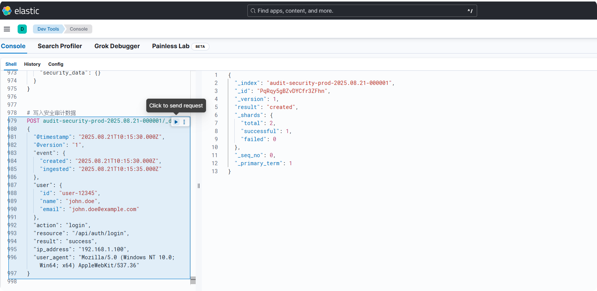

\# 验证数据写入和模板应用

GET audit-security-prod-2025.08.21-000001/\_search

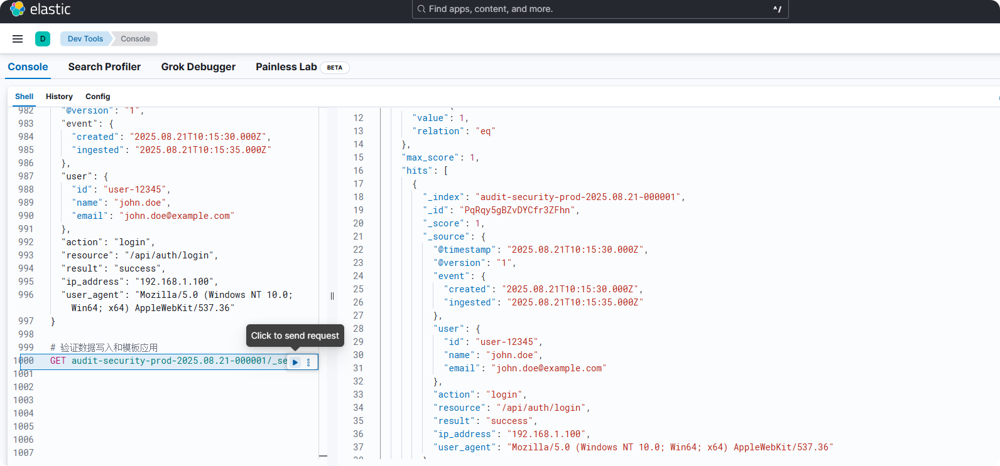

测试应用日志模板：

\# 创建应用日志索引（符合 logs-\* 模式）

PUT logs-app-prod-2025.08.21-000001

{

"aliases": {

"logs\_write": {

"is\_write\_index": true # 作为写入别名，并设置is\_write\_index=true

},

"logs\_all": {}, \# 普通别名，没有过滤条件

"logs\_recent\_7d": { \# 带过滤条件的别名，只包含最近7天的数据

"filter": {

"range": {

"@timestamp": {

"gte": "now-7d/d"

}

}

}

}

}

}

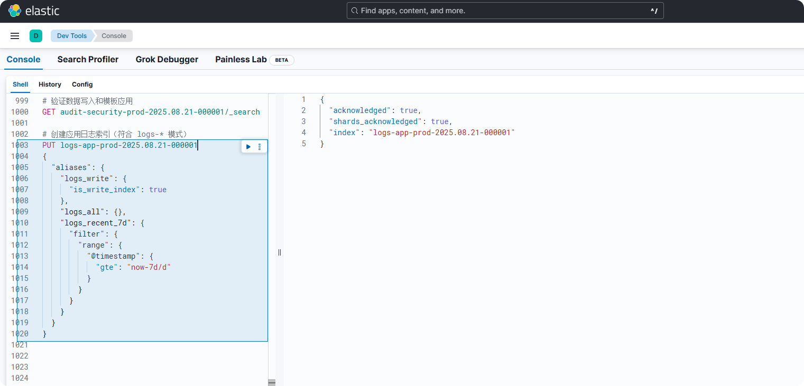

\# 写入应用日志数据

POST logs-app-prod-2025.08.21-000001/\_doc

{

"@timestamp": "2025.08.21T12:30:45.000Z",

"@version": "1",

"event": {

"created": "2025.08.21T12:30:45.000Z",

"ingested": "2025.08.21T12:30:50.000Z"

},

"log": {

"level": "ERROR",

"logger": "com.example.order.Service",

"message": "Failed to process order 12345: Database connection timeout"

},

"service": {

"name": "order-service",

"version": "2.3.1",

"environment": "production"

},

"host": {

"name": "order-service-prod-01",

"ip": "10.0.1.101"

},

"trace": {

"id": "trace-abc123",

"span\_id": "span-def456"

}

}

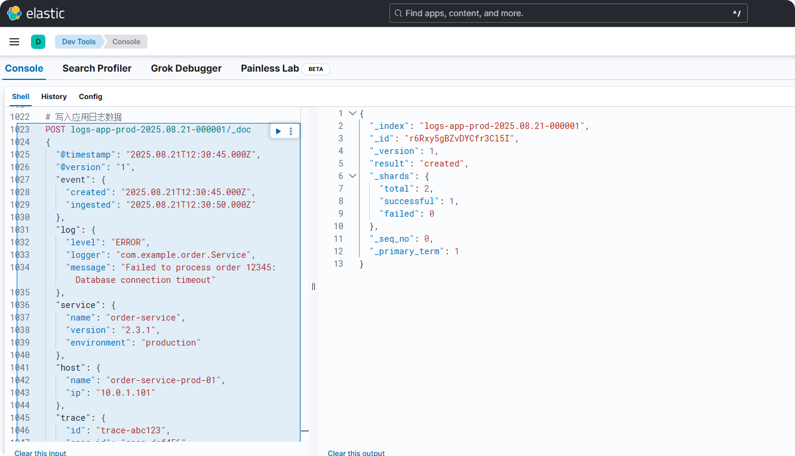

\# 验证数据写入和模板应用

GET logs-app-prod-2025.08.21-000001/\_search

\# 测试通过别名查询

GET logs\_all/\_search

GET logs\_recent\_7d/\_search \# 这查不出来数据，请自行修改

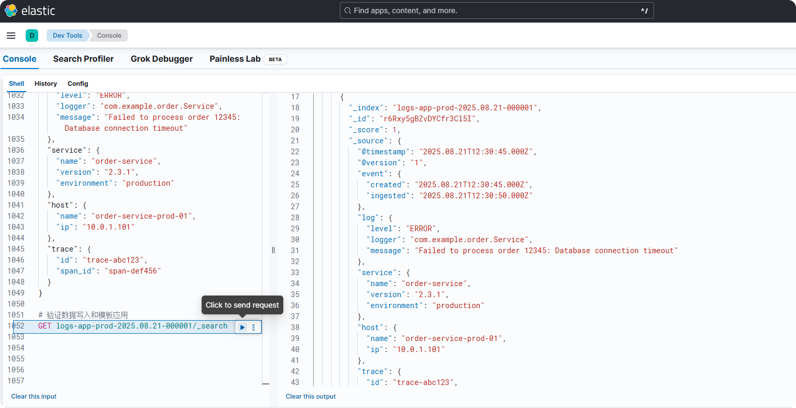

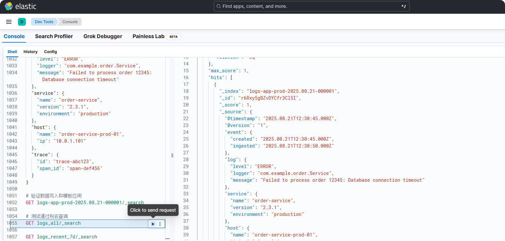

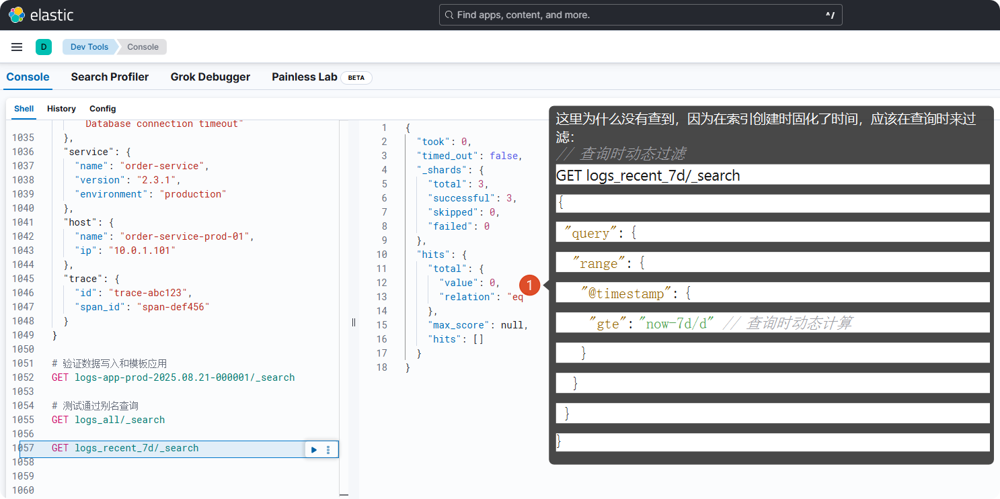

测试业务数据模板：

\# 创建业务数据索引（符合 biz-\* 模式）

PUT biz-orders-prod-2025.08.21-000001

{

"aliases": {

"biz\_data\_write": {

"is\_write\_index": true

},

"biz\_data\_all": {},

"biz\_data\_current": {

"filter": {

"range": {

"@timestamp": {

"gte": "now-30d/d"

}

}

}

}

}

}

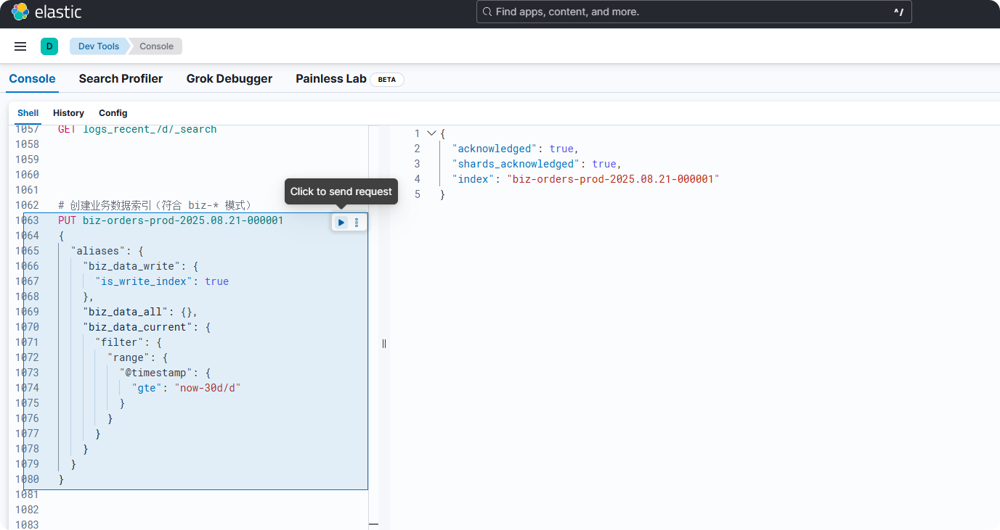

\# 写入业务数据

POST biz-orders-prod-2025.08.21-000001/\_doc

{

"@timestamp": "2025.08.21T14:20:15.000Z",

"@version": "1",

"event": {

"created": "2025.08.21T14:20:15.000Z",

"ingested": "2025.08.21T14:20:20.000Z"

},

"order": {

"id": "ORD-123456",

"amount": 299.99,

"currency": "USD",

"status": "completed"

},

"customer": {

"id": "CUST-7890",

"name": "Alice Smith",

"segment": "premium"

},

"product": {

"id": "PROD-4567",

"category": "electronics",

"price": 249.99

}

}

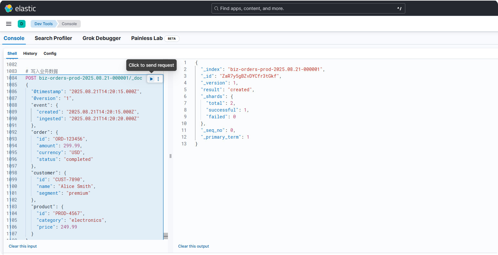

\# 验证数据写入和模板应用

GET biz-orders-prod-2025.08.21-000001/\_search

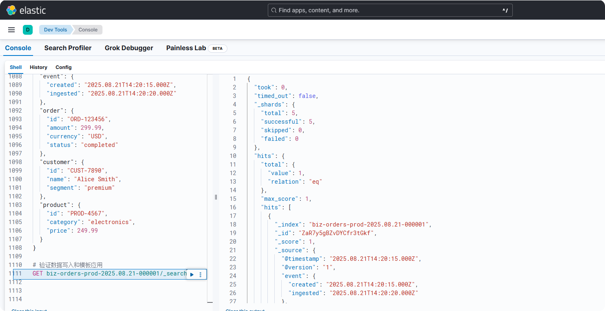

\# 测试通过别名查询

GET biz\_data\_all/\_search

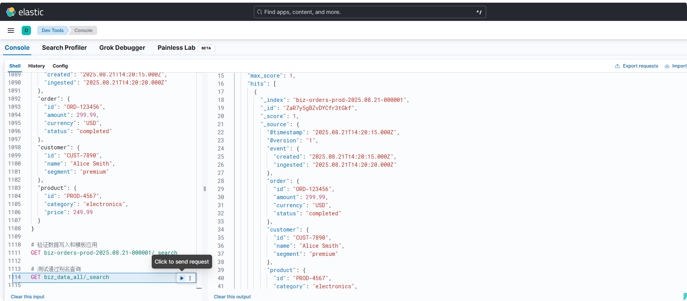

### **2.2.1.8 脚本验证模板**

这里创建一个综合验证脚本，检查所有模板是否正确应用：

#!/bin/bash

\# ES 模板验证脚本（支持认证）

\# 配置信息

ES\_HOST="localhost:9200"

ES\_USER="elastic" \# 替换为实际用户名

ES\_PASS="elastic" \# 替换为实际密码

INDICES=(

"audit-security-prod-2025.08.21-000001"

"logs-app-prod-2025.08.21-000001"

"biz-orders-prod-2025.08.21-000001"

"logs-app-dev-2025.08.21-000001"

)

\# 认证参数

AUTH\_PARAM="-u $ES\_USER:$ES\_PASS"

\# 验证函数

function validate\_index() {

local index=$1

echo "--- 验证索引: $index ---"

\# 检查索引是否存在

status=$(curl -s -o /dev/null -w "%{http\_code}" $AUTH\_PARAM "http://$ES\_HOST/$index")

if \[ "$status" -eq 401 \]; then

echo " ❌ 认证失败：无效的用户名或密码"

return

fi

if \[ "$status" -eq 403 \]; then

echo " ❌ 权限不足：无法访问索引"

return

fi

if \[ "$status" -ne 200 \]; then

echo " ❌ 索引不存在 (HTTP $status)"

return

fi

\# 获取索引信息

settings=$(curl -s $AUTH\_PARAM "http://$ES\_HOST/$index/\_settings")

mapping=$(curl -s $AUTH\_PARAM "http://$ES\_HOST/$index/\_mapping")

aliases=$(curl -s $AUTH\_PARAM "http://$ES\_HOST/$index/\_alias")

count=$(curl -s $AUTH\_PARAM "http://$ES\_HOST/$index/\_count" | jq '.count')

\# 检查是否获取到有效数据

if \[ -z "$settings" \] || \[ "$settings" == "{}" \]; then

echo " ❌ 无法获取索引设置"

return

fi

echo " ✅ 索引存在"

echo " 文档数量: $count"

\# 根据索引类型验证特定设置

if \[\[ $index == \*"prod"\* \]\]; then

replicas=$(echo "$settings" | jq '.\[\].settings.index.number\_of\_replicas')

if \[ "$replicas" == "\\"2\\"" \]; then

echo " ✅ 生产环境副本数: $replicas"

else

echo " ❌ 生产环境副本数异常: $replicas (应为 2)"

fi

fi

if \[\[ $index == \*"dev"\* \]\]; then

replicas=$(echo "$settings" | jq '.\[\].settings.index.number\_of\_replicas')

if \[ "$replicas" == "\\"0\\"" \]; then

echo " ✅ 开发环境副本数: $replicas"

else

echo " ❌ 开发环境副本数异常: $replicas (应为 0)"

fi

fi

if \[\[ $index == \*"audit"\* \]\]; then

shards=$(echo "$settings" | jq '.\[\].settings.index.number\_of\_shards')

if \[ "$shards" == "\\"2\\"" \]; then

echo " ✅ 安全审计分片数: $shards"

else

echo " ❌ 安全审计分片数异常: $shards (应为 2)"

fi

fi

if \[\[ $index == \*"logs"\* \]\]; then

shards=$(echo "$settings" | jq '.\[\].settings.index.number\_of\_shards')

if \[ "$shards" == "\\"3\\"" \]; then

echo " ✅ 应用日志分片数: $shards"

else

echo " ❌ 应用日志分片数异常: $shards (应为 3)"

fi

\# 检查 ILM 策略

ilm\_policy=$(echo "$settings" | jq '.\[\].settings.index.lifecycle.name')

if \[ "$ilm\_policy" != "null" \] && \[ "$ilm\_policy" != "\\"\\"" \]; then

echo " ✅ ILM 策略: $ilm\_policy"

else

echo " ❌ ILM 策略未设置"

fi

fi

if \[\[ $index == \*"biz"\* \]\]; then

shards=$(echo "$settings" | jq '.\[\].settings.index.number\_of\_shards')

if \[ "$shards" == "\\"5\\"" \]; then

echo " ✅ 业务数据分片数: $shards"

else

echo " ❌ 业务数据分片数异常: $shards (应为 5)"

fi

fi

\# 检查别名

alias\_count=$(echo "$aliases" | jq 'length')

if \[ "$alias\_count" -gt 0 \]; then

echo " ✅ 别名数量: $alias\_count"

echo " 别名列表:"

echo "$aliases" | jq -r '.\[\].aliases | keys\[\]' | sed 's/^/ - /'

else

echo " ⚠️ 无别名设置"

fi

}

\# 主程序

echo "=== 开始 Elasticsearch 模板验证 ==="

echo "验证时间: $(date)"

echo "ES 主机: $ES\_HOST"

echo "ES 用户: $ES\_USER"

echo ""

\# 检查 jq 依赖

if ! command -v jq &> /dev/null; then

echo "❌ 错误：需要安装 jq 工具"

echo "Ubuntu/Debian: sudo apt install jq"

echo "CentOS/RHEL: sudo yum install jq"

exit 1

fi

\# 验证所有索引

for index in "${INDICES\[@\]}"; do

validate\_index "$index"

echo ""

done

echo "=== 验证完成 ==="

  
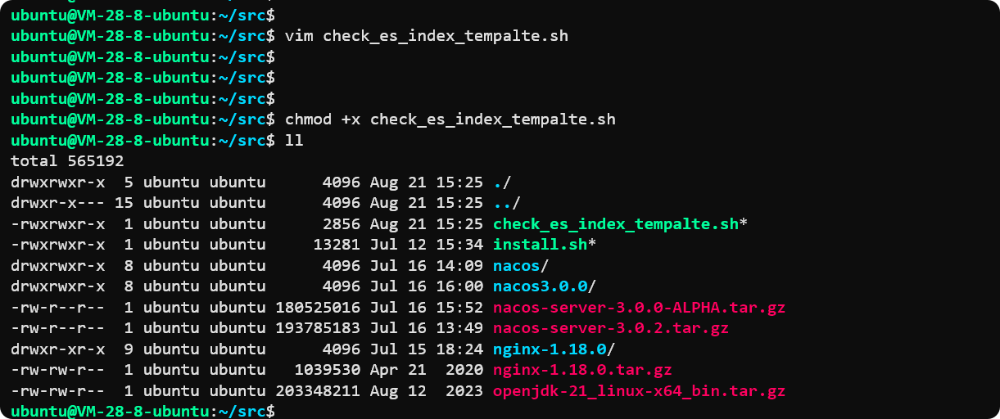

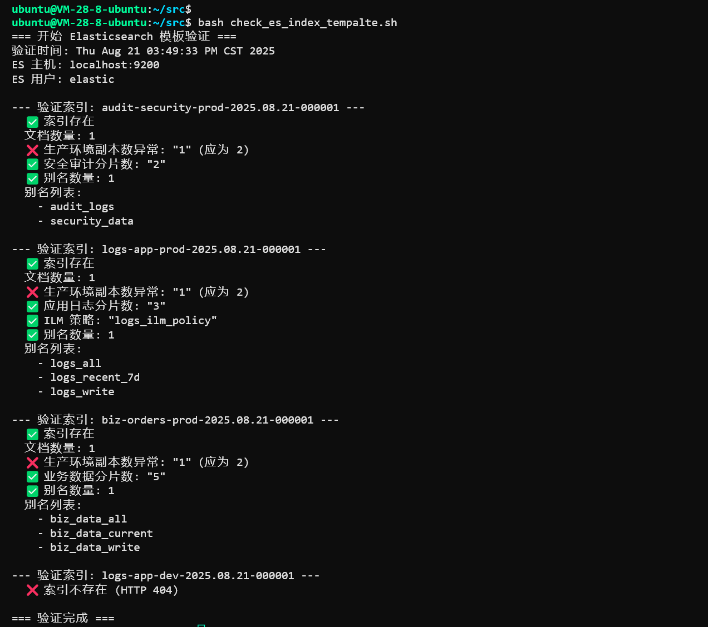

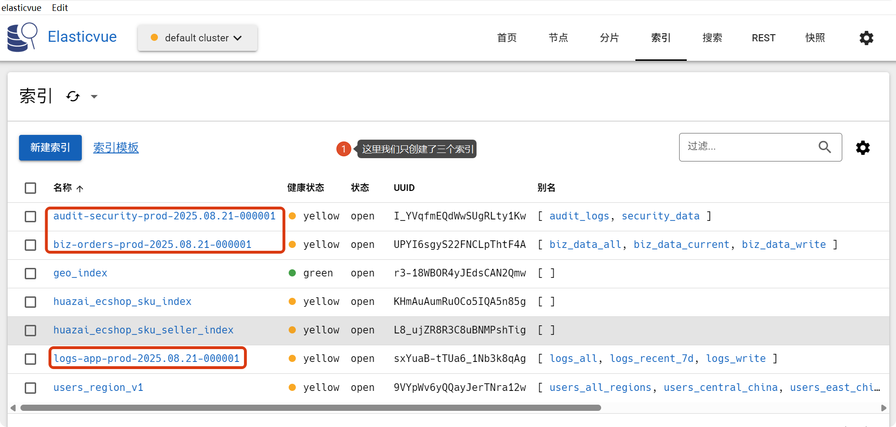

### **2.2.2 ES 索引模板之生产级时间序数据系统**

以生产环境的监控平台管理为场景，设计一个完整的索引模板案例。

假设有如下需求：

某公司需要构建一个集中的监控平台，用于收集、存储和查询来自数千台服务器和应用的各种性能指标（如：CPU使用率 cpu\_usage、内存占用 memory\_used、磁盘I/O disk\_io\_write、应用QPS api\_qps 等）。

这些数据以时间序列的形式持续高频写入，数据量巨大，需要对数据进行高效的管理，以平衡查询性能和经济高效的长期存储。

核心目标：

1.  高效写入与查询：保证每秒数十万数据点的写入性能，并支持对近期数据的快速聚合查询。
2.  自动化生命周期管理：自动处理索引的滚动更新（Rollover）、从热节点迁移至冷节点、以及最终的删除。
3.  存储成本优化：将不再频繁查询的历史数据转移到成本更低的硬件上，并冻结索引以进一步节省内存。
4.  schema 灵活性：能够灵活地添加新的监控指标，而无需频繁修改索引映射。

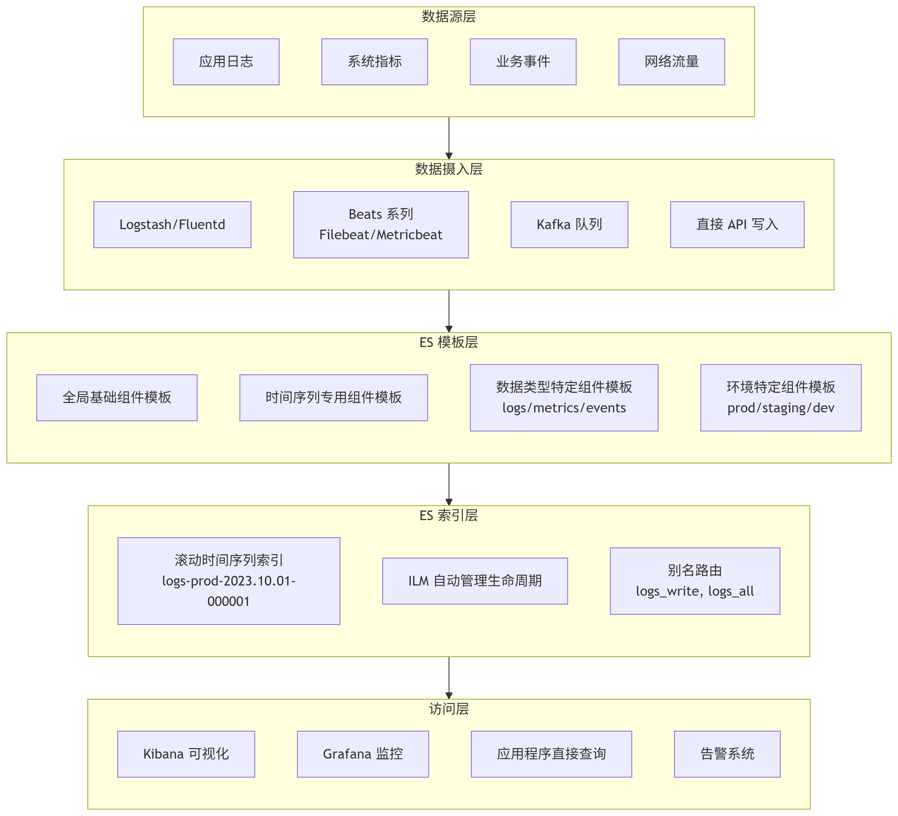

### **2.2.2.1 创建全局基础组件模板**

\# 1.1 全局基础设置组件

PUT \_component\_template/global\_ts\_base\_settings

{

"template": {

"settings": {

"index.codec": "best\_compression",

"index.refresh\_interval": "30s",

"index.mapping.total\_fields.limit": 1000,

"index.mapping.nested\_fields.limit": 50,

"index.mapping.depth.limit": 20,

"index.mapping.field\_name\_length.limit": 256,

"index.query.default\_field": \[

"message",

"text",

"\*.\*message"

\]

}

},

"version": 1,

"\_meta": {

"description": "时间序列数据全局基础设置",

"category": "timeseries",

"created\_by": "platform-team",

"created\_date": "2025-08-21"

}

}

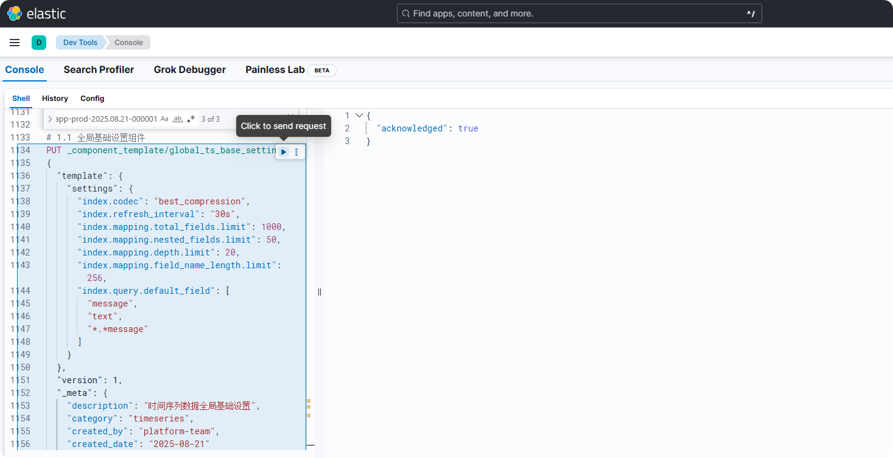

\# 1.2 时间序列基础映射组件

PUT \_component\_template/global\_ts\_base\_mappings

{

"template": {

"mappings": {

"dynamic": "strict",

"date\_detection": false,

"numeric\_detection": false,

"dynamic\_templates": \[

{

"strings\_as\_keywords": {

"match\_mapping\_type": "string",

"mapping": {

"type": "keyword",

"ignore\_above": 256

}

}

},

{

"numbers\_as\_floats": {

"match\_mapping\_type": "long",

"mapping": {

"type": "float"

}

}

}

\],

"properties": {

"@timestamp": {

"type": "date",

"format": "strict\_date\_optional\_time||epoch\_millis"

},

"@version": {

"type": "keyword"

},

"event": {

"properties": {

"created": {

"type": "date"

},

"ingested": {

"type": "date"

},

"dataset": {

"type": "keyword"

}

}

},

"tags": {

"type": "keyword"

}

}

}

},

"version": 1,

"\_meta": {

"description": "时间序列数据基础映射",

"category": "timeseries",

"created\_by": "platform-team"

}

}

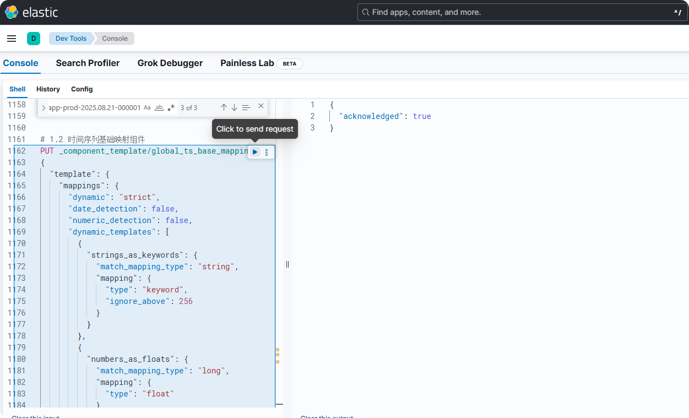

### **2.2.2.2 创建数据类型特定组件模板**

\# 2.1 日志数据组件模板

PUT \_component\_template/ts\_logs\_component

{

"template": {

"mappings": {

"properties": {

"log": {

"properties": {

"level": {

"type": "keyword"

},

"logger": {

"type": "keyword"

},

"message": {

"type": "text",

"analyzer": "standard",

"fields": {

"keyword": {

"type": "keyword",

"ignore\_above": 256

}

}

}

}

},

"service": {

"properties": {

"name": {

"type": "keyword"

},

"version": {

"type": "keyword"

},

"environment": {

"type": "keyword"

}

}

},

"host": {

"properties": {

"name": {

"type": "keyword"

},

"ip": {

"type": "ip"

},

"os": {

"properties": {

"name": {

"type": "keyword"

},

"version": {

"type": "keyword"

}

}

}

}

},

"trace": {

"properties": {

"id": {

"type": "keyword"

},

"span\_id": {

"type": "keyword"

}

}

}

}

},

"settings": {

"index.number\_of\_shards": 3

}

},

"version": 1,

"\_meta": {

"description": "时间序列日志数据组件",

"category": "timeseries-logs",

"created\_by": "platform-team"

}

}

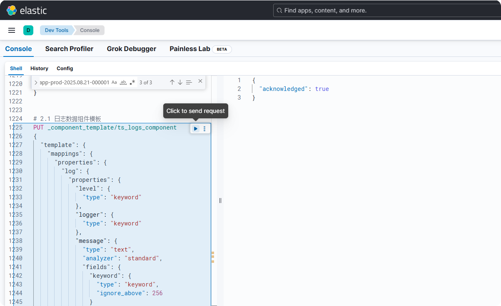

\# 2.2 指标数据组件模板

PUT \_component\_template/ts\_metrics\_component

{

"template": {

"mappings": {

"properties": {

"metric": {

"properties": {

"name": {

"type": "keyword"

},

"value": {

"type": "float"

},

"unit": {

"type": "keyword"

},

"type": {

"type": "keyword"

}

}

},

"system": {

"properties": {

"cpu": {

"properties": {

"usage": {

"type": "float"

},

"cores": {

"type": "integer"

}

}

},

"memory": {

"properties": {

"total": {

"type": "long"

},

"used": {

"type": "long"

},

"free": {

"type": "long"

}

}

},

"disk": {

"properties": {

"total": {

"type": "long"

},

"used": {

"type": "long"

},

"free": {

"type": "long"

}

}

}

}

},

"application": {

"properties": {

"name": {

"type": "keyword"

},

"version": {

"type": "keyword"

},

"environment": {

"type": "keyword"

}

}

}

}

},

"settings": {

"index.number\_of\_shards": 2

}

},

"version": 1,

"\_meta": {

"description": "时间序列指标数据组件",

"category": "timeseries-metrics",

"created\_by": "platform-team"

}

}

### 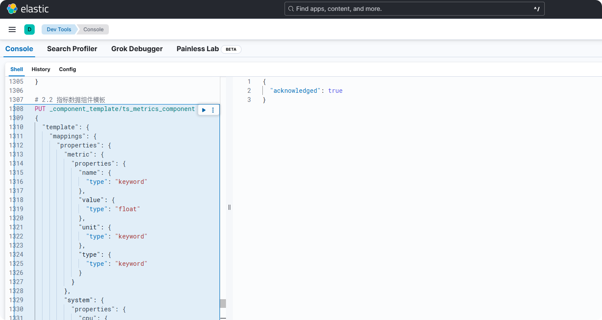

\# 2.3 事件数据组件模板

PUT \_component\_template/ts\_events\_component

{

"template": {

"mappings": {

"properties": {

"event": {

"properties": {

"action": {

"type": "keyword"

},

"category": {

"type": "keyword"

},

"outcome": {

"type": "keyword"

},

"duration": {

"type": "long"

}

}

},

"user": {

"properties": {

"id": {

"type": "keyword"

},

"name": {

"type": "keyword"

},

"email": {

"type": "keyword"

}

}

},

"source": {

"properties": {

"ip": {

"type": "ip"

},

"port": {

"type": "integer"

},

"domain": {

"type": "keyword"

}

}

},

"destination": {

"properties": {

"ip": {

"type": "ip"

},

"port": {

"type": "integer"

},

"domain": {

"type": "keyword"

}

}

}

}

},

"settings": {

"index.number\_of\_shards": 2

}

},

"version": 1,

"\_meta": {

"description": "时间序列事件数据组件",

"category": "timeseries-events",

"created\_by": "platform-team"

}

}

### 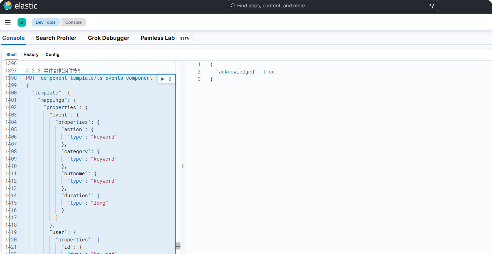

### **2.2.2.3 创建环境特定组件模板**

\# 3.1 生产环境组件模板

PUT \_component\_template/ts\_prod\_env\_component

{

"template": {

"settings": {

"index.number\_of\_replicas": 2,

"index.routing.allocation.require.box\_type": "hot"

}

},

"version": 1,

"\_meta": {

"description": "时间序列生产环境组件",

"environment": "production",

"created\_by": "platform-team"

}

}

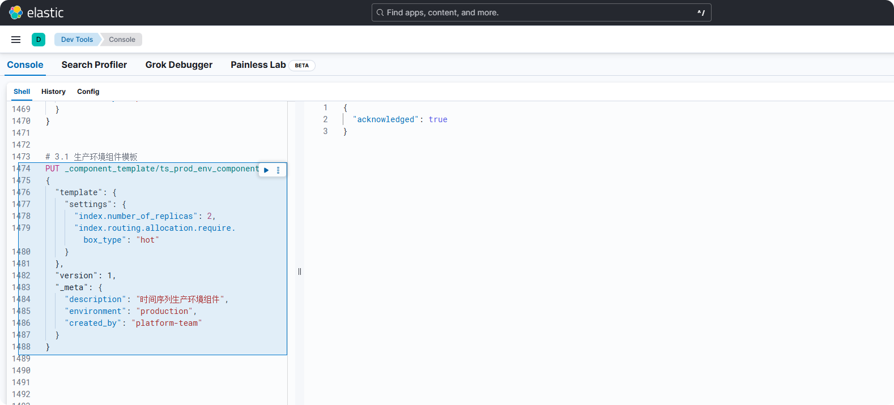

\# 3.2 预发布环境组件模板

PUT \_component\_template/ts\_staging\_env\_component

{

"template": {

"settings": {

"index.number\_of\_replicas": 1,

"index.routing.allocation.require.box\_type": "warm"

}

},

"version": 1,

"\_meta": {

"description": "时间序列预发布环境组件",

"environment": "staging",

"created\_by": "platform-team"

}

}

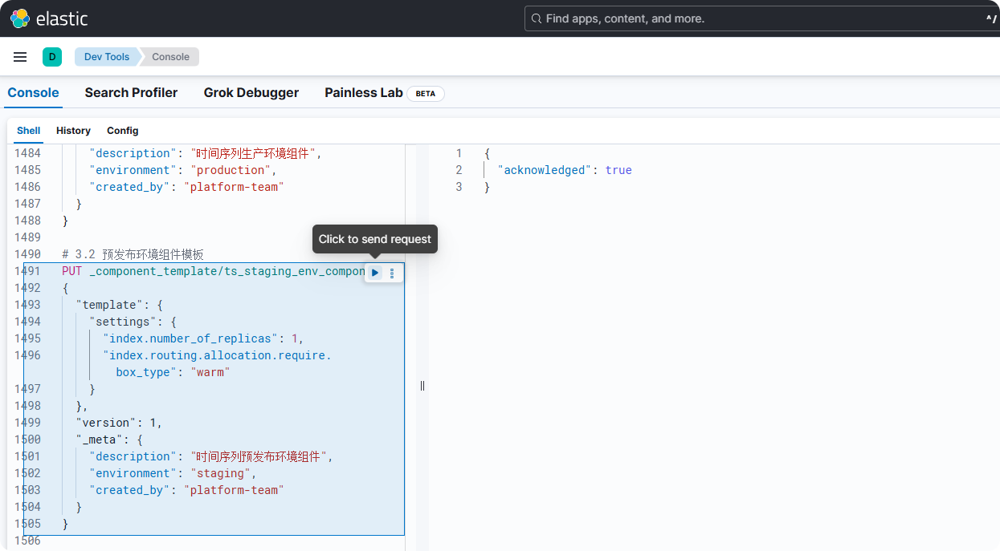

\# 3.3 开发环境组件模板

PUT \_component\_template/ts\_dev\_env\_component

{

"template": {

"settings": {

"index.number\_of\_replicas": 0,

"index.refresh\_interval": "1s"

}

},

"version": 1,

"\_meta": {

"description": "时间序列开发环境组件",

"environment": "development",

"created\_by": "platform-team"

}

}

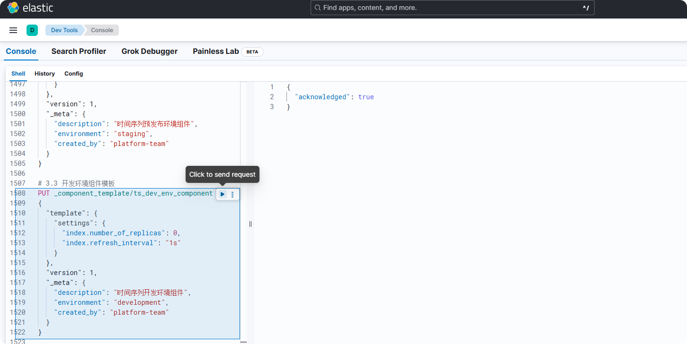

关于 box\_type 的说明：

box\_type 是一个自定义属性，通常需要你在节点配置中定义。在 elasticsearch.yml 中为节点配置属性：

\# 热节点配置

node.attr.box\_type: hot

\# 温节点配置

node.attr.box\_type: warm

\# 冷节点配置

node.attr.box\_type: cold

### **2.2.2.4 创建 ILM 策略**

\# 4.1 日志数据ILM策略（热温冷删除四阶段）

PUT \_ilm/policy/ts\_logs\_ilm\_policy

{

"policy": {

"phases": {

"hot": {

"min\_age": "0ms",

"actions": {

"rollover": {

"max\_size": "50gb", // 达到50GB时滚动

"max\_age": "7d", // 或者索引创建超过7天时滚动

"max\_docs": 10000000 // 或者索引文档数超过1000万时滚动

},

"set\_priority": {

"priority": 100

}

}

},

"warm": {

"min\_age": "7d", // 滚动后7天（即索引不再写入后）进入温阶段

"actions": {

"forcemerge": {

"max\_num\_segments": 1 // 强制合并段以优化存储和查询

},

"shrink": {

"number\_of\_shards": 1 // 可选：收缩分片数

},

"set\_priority": {

"priority": 50

}

}

},

"cold": {

"min\_age": "30d", // 滚动后约30天（即数据产生后约31-32天）进入冷阶段

"actions": {

"set\_priority": {

"priority": 0

}

}

},

"delete": {

"min\_age": "90d", // 滚动后90天（即数据产生后约91天）删除

"actions": {

"delete": {}

}

}

}

}

}

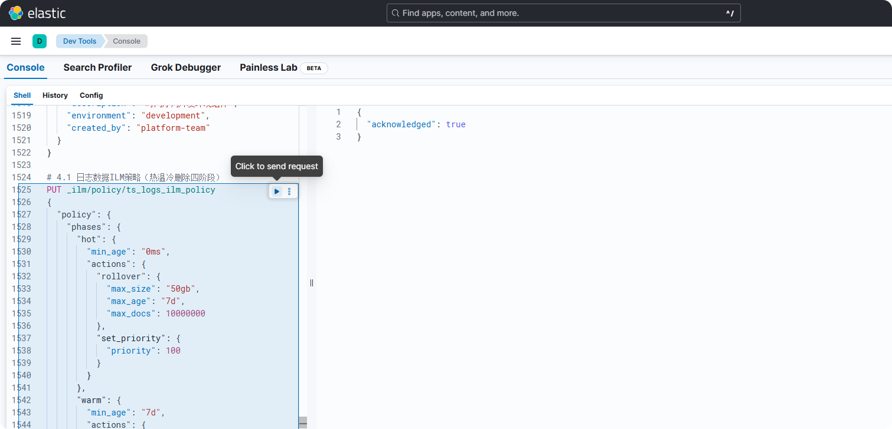

\# 4.2 指标数据ILM策略（保留时间更长）

PUT \_ilm/policy/ts\_metrics\_ilm\_policy

{

"policy": {

"phases": {

"hot": {

"min\_age": "0ms",

"actions": {

"rollover": {

"max\_size": "50gb",

"max\_age": "7d"

},

"set\_priority": {

"priority": 100

}

}

},

"warm": {

"min\_age": "7d",

"actions": {

"forcemerge": {

"max\_num\_segments": 1

},

"shrink": {

"number\_of\_shards": 1

},

"set\_priority": {

"priority": 50

}

}

},

"cold": {

"min\_age": "30d",

"actions": {

"set\_priority": {

"priority": 0

}

}

},

"delete": {

"min\_age": "365d",

"actions": {

"delete": {}

}

}

}

}

}

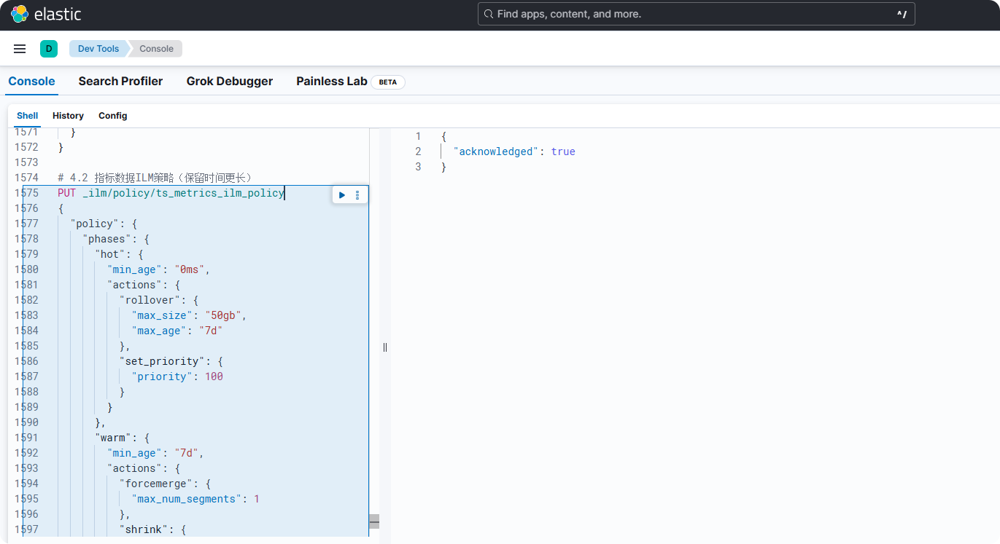

\# 4.3 事件数据ILM策略（中等保留时间）

PUT \_ilm/policy/ts\_events\_ilm\_policy

{

"policy": {

"phases": {

"hot": {

"min\_age": "0ms",

"actions": {

"rollover": {

"max\_size": "50gb",

"max\_age": "7d"

},

"set\_priority": {

"priority": 100

}

}

},

"warm": {

"min\_age": "7d",

"actions": {

"forcemerge": {

"max\_num\_segments": 1

},

"shrink": {

"number\_of\_shards": 1

},

"set\_priority": {

"priority": 50

}

}

},

"cold": {

"min\_age": "30d",

"actions": {

"set\_priority": {

"priority": 0

}

}

},

"delete": {

"min\_age": "180d",

"actions": {

"delete": {}

}

}

}

}

}

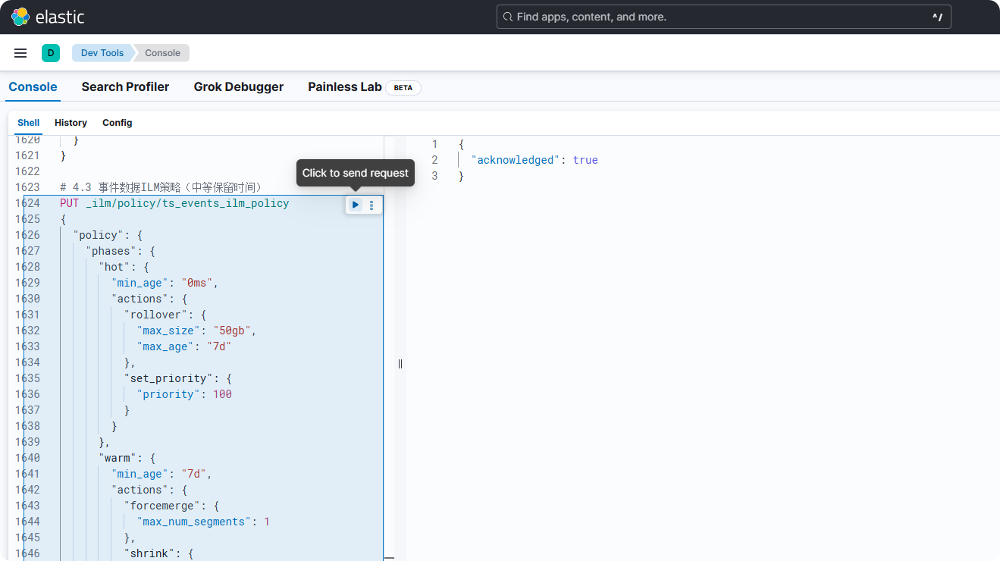

### **2.2.2.5 创建索引模板**

\# 5.1 全局基础时间序列模板

PUT \_index\_template/global\_ts\_base\_template

{

"index\_patterns": \[

"\*"

\],

"priority": 2,

"composed\_of": \[

"global\_ts\_base\_settings",

"global\_ts\_base\_mappings"

\],

"template": {

"settings": {

}

},

"version": 1,

"\_meta": {

"description": "全局时间序列基础模板",

"environment": "all",

"created\_by": "platform-team"

}

}

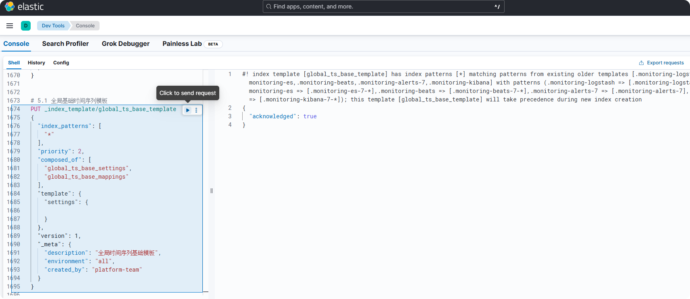

\# 5.2 日志数据索引模板

PUT \_index\_template/ts\_logs\_template

{

"index\_patterns": \[

"logs-\*"

\],

"priority": 102,

"composed\_of": \[

"ts\_logs\_component"

\],

"template": {

"settings": {

"index.lifecycle.name": "ts\_logs\_ilm\_policy",

"index.lifecycle.rollover\_alias": "logs\_write\_ts"

},

"aliases": {

"logs\_write\_ts": {

"is\_write\_index": true

},

"logs\_all\_ts": {},

"logs\_recent\_7d\_ts": {

"filter": {

"range": {

"@timestamp": {

"gte": "now-7d/d"

}

}

}

},

"logs\_recent\_30d\_ts": {

"filter": {

"range": {

"@timestamp": {

"gte": "now-30d/d"

}

}

}

}

}

},

"version": 1,

"\_meta": {

"description": "时间序列日志数据模板",

"category": "timeseries-logs",

"created\_by": "platform-team"

}

}

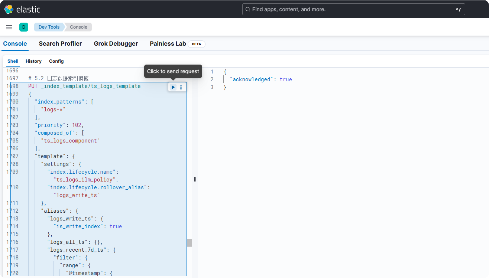

\# 5.3 指标数据索引模板

PUT \_index\_template/ts\_metrics\_template

{

"index\_patterns": \[

"metrics-\*"

\],

"priority": 103,

"composed\_of": \[

"ts\_metrics\_component"

\],

"template": {

"settings": {

"index.lifecycle.name": "ts\_metrics\_ilm\_policy",

"index.lifecycle.rollover\_alias": "metrics\_write"

},

"aliases": {

"metrics\_write": {

"is\_write\_index": true

},

"metrics\_all": {},

"metrics\_recent\_7d": {

"filter": {

"range": {

"@timestamp": {

"gte": "now-7d/d"

}

}

}

}

}

},

"version": 1,

"\_meta": {

"description": "时间序列指标数据模板",

"category": "timeseries-metrics",

"created\_by": "platform-team"

}

}

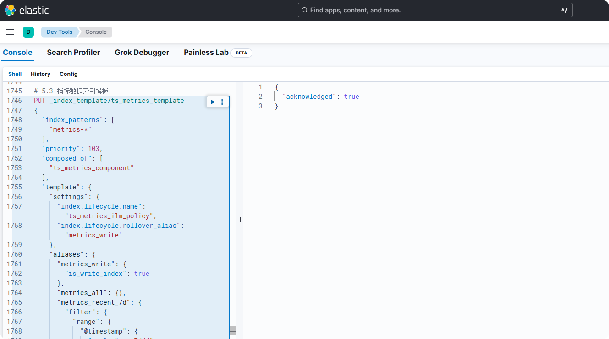

\# 5.4 事件数据索引模板

PUT \_index\_template/ts\_events\_template

{

"index\_patterns": \[

"events-\*"

\],

"priority": 104,

"composed\_of": \[

"ts\_events\_component"

\],

"template": {

"settings": {

"index.lifecycle.name": "ts\_events\_ilm\_policy",

"index.lifecycle.rollover\_alias": "events\_write"

},

"aliases": {

"events\_write": {

"is\_write\_index": true

},

"events\_all": {},

"events\_recent\_30d": {

"filter": {

"range": {

"@timestamp": {

"gte": "now-30d/d"

}

}

}

}

}

},

"version": 1,

"\_meta": {

"description": "时间序列事件数据模板",

"category": "timeseries-events",

"created\_by": "platform-team"

}

}

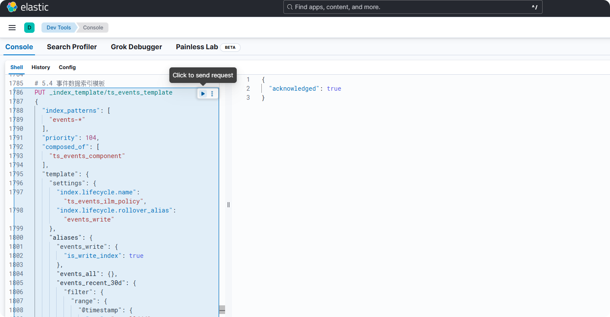

\# 5.5 生产环境覆盖模板

PUT \_index\_template/ts\_prod\_env\_template

{

"index\_patterns": \[

"\*-prod",

"prod-\*"

\],

"priority": 201,

"composed\_of": \[

"ts\_prod\_env\_component"

\],

"template": {

"settings": {

"index.routing.allocation.include.env": "production"

}

},

"version": 1,

"\_meta": {

"description": "时间序列生产环境覆盖模板",

"environment": "production",

"created\_by": "platform-team"

}

}

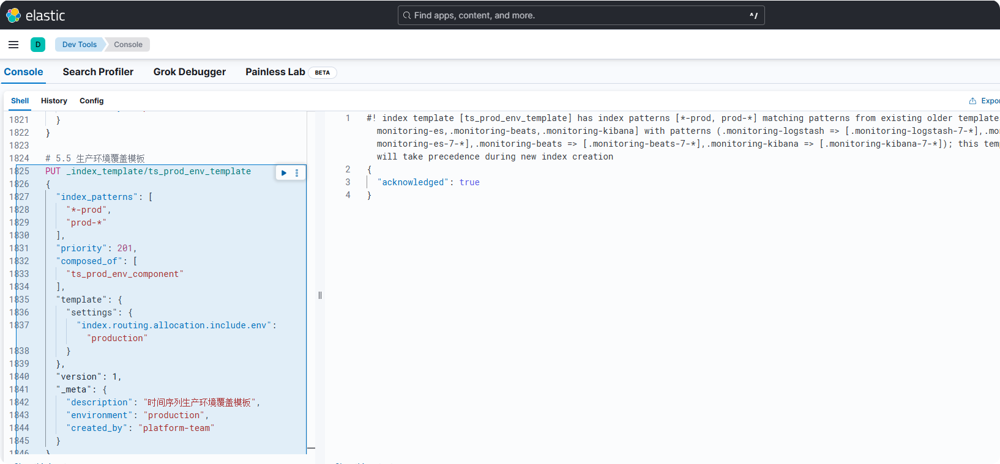

\# 5.6 预发布环境覆盖模板

PUT \_index\_template/ts\_staging\_env\_template

{

"index\_patterns": \[

"\*-staging",

"staging-\*"

\],

"priority": 202,

"composed\_of": \[

"ts\_staging\_env\_component"

\],

"template": {

"settings": {

"index.routing.allocation.include.env": "staging"

}

},

"version": 1,

"\_meta": {

"description": "时间序列预发布环境覆盖模板",

"environment": "staging",

"created\_by": "platform-team"

}

}

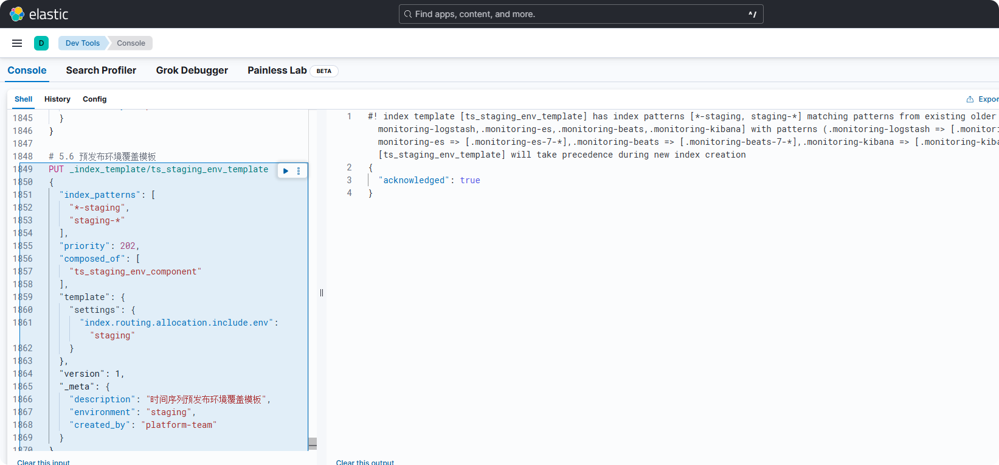

\# 5.7 开发环境覆盖模板

PUT \_index\_template/ts\_dev\_env\_template

{

"index\_patterns": \[

"\*-dev",

"dev-\*"

\],

"priority": 203,

"composed\_of": \[

"ts\_dev\_env\_component"

\],

"template": {

"settings": {

"index.routing.allocation.include.env": "development"

}

},

"version": 1,

"\_meta": {

"description": "时间序列开发环境覆盖模板",

"environment": "development",

"created\_by": "platform-team"

}

}

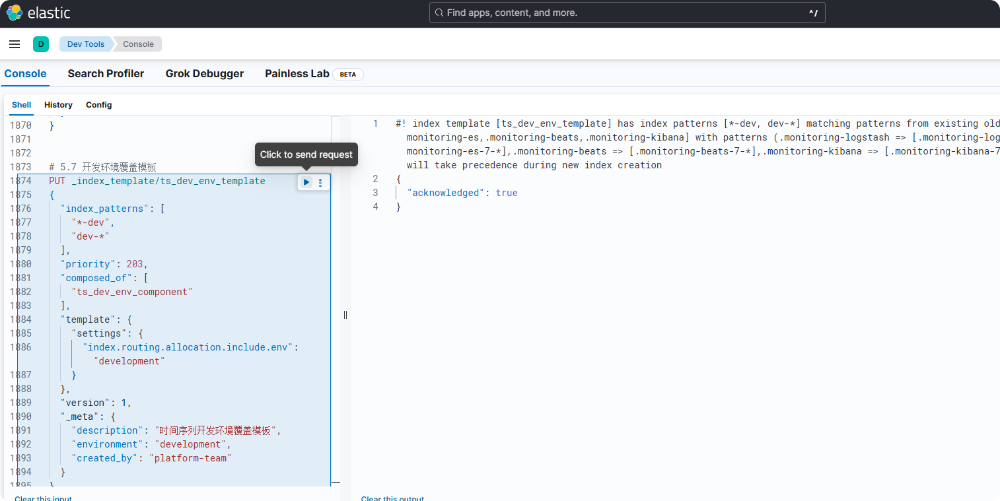

### **2.2.2.6 写入索引数据**

\# 6.1 创建初始日志索引

PUT logs-app-prod-000001

{

"aliases": {

"logs\_write\_ts": {

"is\_write\_index": true

},

"logs\_all\_ts": {},

"logs\_recent\_7d\_ts": {

"filter": {

"range": {

"@timestamp": {

"gte": "now-7d/d"

}

}

}

}

}

}

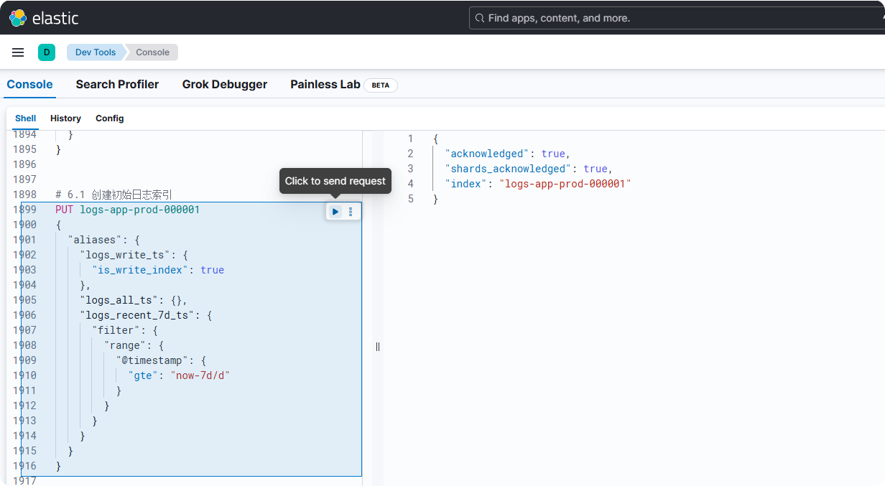

\# 6.2 写入日志数据

POST logs\_write\_ts/\_doc

{

"@timestamp": "2025-08-21T12:00:00.000Z",

"@version": "1",

"event": {

"created": "2025-08-21T12:00:00.000Z",

"ingested": "2025-08-21T12:00:05.000Z",

"dataset": "application"

},

"log": {

"level": "ERROR",

"logger": "com.example.order.Service",

"message": "Failed to process order 12345: Database connection timeout"

},

"service": {

"name": "order-service",

"version": "2.3.1",

"environment": "production"

},

"host": {

"name": "order-service-prod-01",

"ip": "10.0.1.101",

"os": {

"name": "Ubuntu",

"version": "20.04"

}

},

"trace": {

"id": "trace-abc123",

"span\_id": "span-def456"

},

"tags": \[

"production",

"order-service",

"error"

\]

}

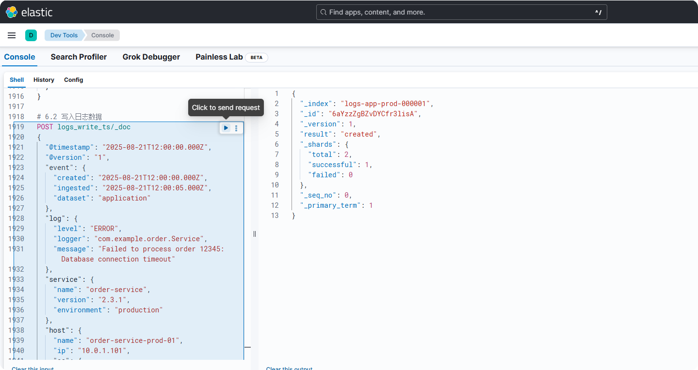

\# 6.3 创建初始指标索引

PUT metrics-system-prod-000001

{

"aliases": {

"metrics\_write": {

"is\_write\_index": true

},

"metrics\_all": {}

}

}

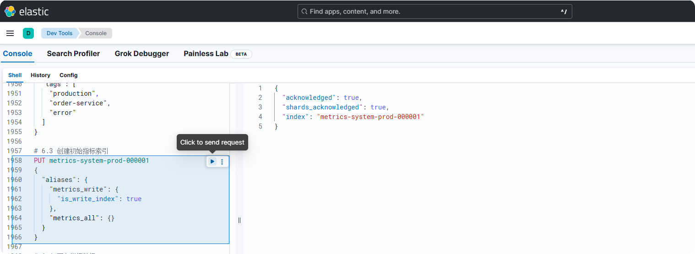

\# 6.4 写入指标数据

POST metrics\_write/\_doc

{

"@timestamp": "2025-08-21T12:00:00.000Z",

"@version": "1",

"event": {

"created": "2025-08-21T12:00:00.000Z",

"ingested": "2025-08-21T12:00:05.000Z",

"dataset": "system"

},

"metric": {

"name": "cpu.usage",

"value": 45.7,

"unit": "percent",

"type": "gauge"

},

"system": {

"cpu": {

"usage": 45.7,

"cores": 8

},

"memory": {

"total": 17179869184,

"used": 8589934592,

"free": 8589934592

}

},

"application": {

"name": "order-service",

"version": "2.3.1",

"environment": "production"

},

"tags": \[

"production",

"order-service",

"system-metrics"

\]

}

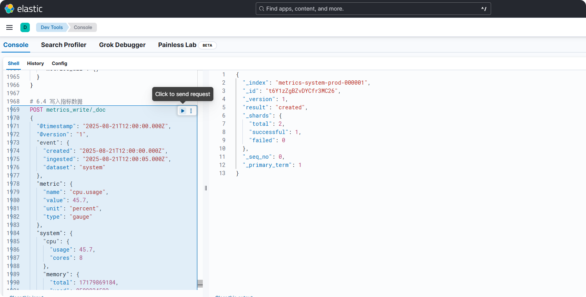

### **2.2.2.7 聚合统计**

\# 7.1 查询最近7天的错误日志

GET logs\_recent\_7d\_ts/\_search

{

"query": {

"bool": {

"must": \[

{

"term": {

"log.level": "ERROR"

}

},

{

"term": {

"service.environment": "production"

}

}

\]

}

},

"aggs": {

"services": {

"terms": {

"field": "service.name"

}

},

"hourly\_errors": {

"date\_histogram": {

"field": "@timestamp",

"calendar\_interval": "hour"

}

}

}

}

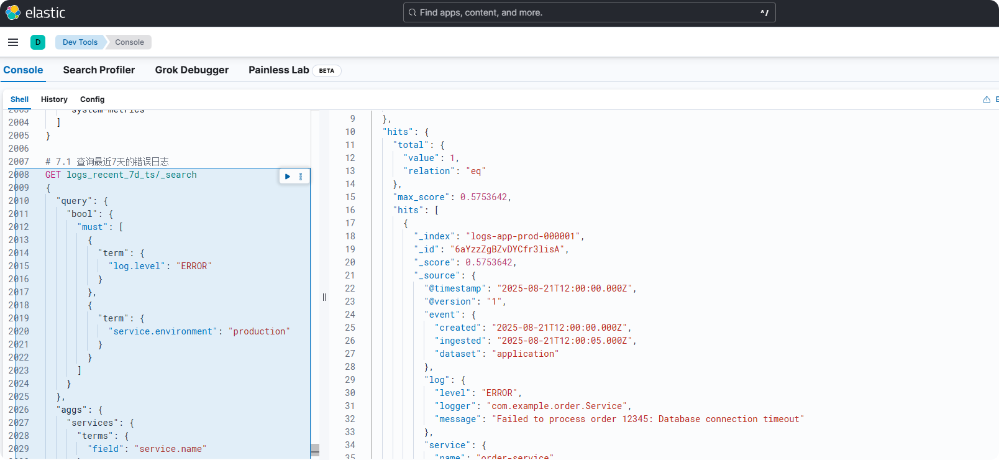