从今天之后的一段时间内，华仔会带着大家一起来从零开始对 ElasticStack 矩阵产品进行深入剖析和项目运维实战，希望大家学完之后可以用到自己的工作中。

这是第九篇，本篇我将带着大家进行「**ES 索引重建之 Reindex 深度实战及性能调优**」。

文章汇总位置：[https://wx.zsxq.com/dweb2/index/columns/51122554151214](https://wx.zsxq.com/dweb2/index/columns/51122554151214)

## **01 前言**

在上篇中 [【ES 入门实战第八篇】ES 集群管理 API 深度实战](https://articles.zsxq.com/id_ofmwcnm3kf3t.html)，带着大家进行实战「**ES 集群管理 API 深度实战**」。

今天我们来进行「**ES 索引重建之 Reindex 深度实战及性能调优**」。

## **02 ES 索引重新之 Reindex 核心架构原理**

## **2.1 什么是 ES 索引重新之 Reindex**

Reindex 是 Elasticsearch 提供的一种 API，用于将文档从一个或多个源索引复制到目标索引。它不仅仅是数据的拷贝，更重要的是，它会在写入目标索引时应用新的映射（Mapping）、分析器（Analyzer）和分片数（Shard Count）。

## **2.2 ES 索引重新之 Reindex 底层原理**

Reindex 不是一个简单的原子操作，而是一个在协调节点控制下的客户端操作。其架构流程如下图所示：

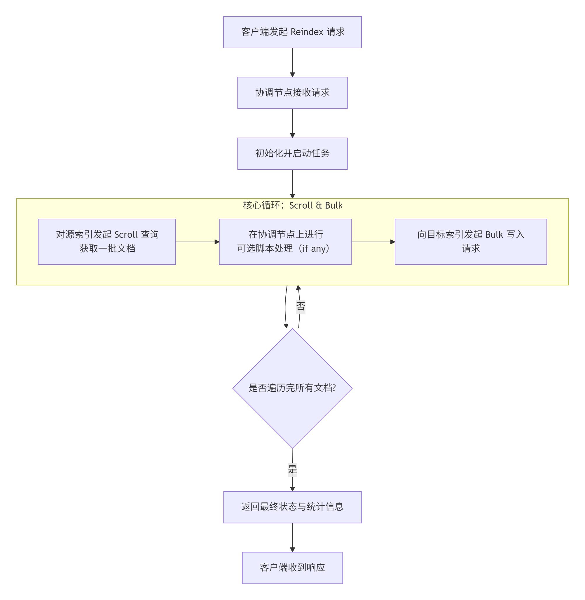

理解其工作原理是进行性能调优和问题排查的基础：

1.  发起请求：客户端向一个协调节点（Coordinating Node）发送 \_reindex HTTP 请求。
2.  创建目标索引：目标索引需要提前手动创建好并配置好最终的映射和分片数。Reindex API 本身不会帮你创建。
3.  源索引扫描（Scroll）：
4.  协调节点向源索引的所有分片发起一个 scroll 查询。scroll 上下文会保存一个快照视图，确保在重建过程中，即使源索引有数据写入，也能看到重建开始时刻的一致性数据。
5.  scroll 查询会返回一批文档（例如 1000 个）和一个 scroll\_id。
6.  批量写入（Bulk）：
7.  协调节点将从源索引获取的这批文档，组装成一个 \_bulk 请求，发送给目标索引。
8.  目标索引的各个数据节点（Data Node）接收并处理这些写入请求。
9.  循环迭代：
10.  协调节点使用上一次的 scroll\_id 继续获取下一批文档，重复 步骤4，直到所有文档处理完毕。
11.  资源清理：完成后，协调节点会清理 scroll 上下文。

可以看到这里分两个阶段：

1.  ​Scroll Query (读阶段)​: Reindex 使用 Scroll API 从源索引中高效地拉取大量文档。Scroll 会保留一个初始查询的快照视图，确保在 reindex 过程中，即使源索引有变更，也不会影响到正在迁移的数据（除非使用 op\_type: create 等特定参数）。
2.  ​Bulk Index (写阶段)​: 将从源索引读出的文档批次，通过 Bulk API 异步写入到目标索引中，这是性能调优的关键点。

简单总结：Reindex = Scroll 查询（读） + Bulk 写入（写）。

## **2.3 ES 索引重新之 Reindex 应用场景**

### **2.3.1 集群版本升级**

将数据从一个低版本集群升级到另一个高版本集群，来看下 ES 版本的兼容性：

1.  同一大版本范围内升级，索引读写兼容。
2.  不同大版本升级，索引读写不兼容，需要重建索引。

  
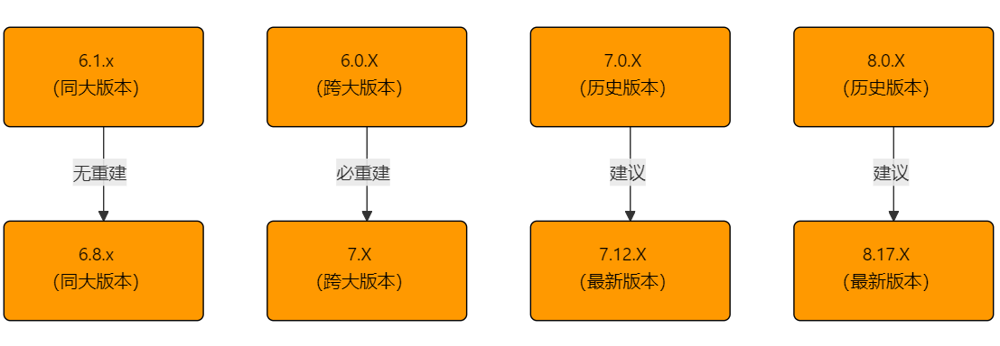

### **1、从 ES 7.x 升级到 ES 8.x**

Elasticsearch 8.x 是一个主版本，它引入了多项重大改进，同时也包含了一些破坏性变更（Breaking Changes）​。其升级路径完全符合图片中「**跨大版本**」 ->「**必重建**」​的模式。

从 7.x 升级到 8.x 的要求：​​

1.  ​必重建 (必须重建索引)​​：这是官方强烈建议的路径。尝试使用滚动升级直接从 7.17（最后一个 7.x 版本）升级到 8.x 可能会成功，但你会无法使用 8.x 的所有新特性，并且可能会遇到难以预料的稳定性问题。
2.  ​核心原因​：
3.  ​Lucene 版本升级​：Lucene 库本身有重大更新。
4.  ​索引格式变更​：为了支持新功能（如：kNN 向量搜索的本地支持、新的 text 字段类型 match\_only\_text 等），索引格式发生了变化，旧格式的索引无法直接享受这些优化。
5.  ​安全特性默认开启​：8.0 开始，安全性（SSL/TLS、用户认证）在默认安装下即开启，这改变了集群初始设置的流程。

​操作建议：​​

1.  将现有的 7.x 集群升级到 ​7.17​（7.x 的最终版本）。
2.  在一个新的 8.x 集群上，使用 ​Reindex API​ 或 ​跨集群重建（CCR）​，将 7.17 集群的数据重建索引到 8.x 集群中。
3.  在应用程序端，将连接从旧集群切换到新集群（通常通过修改别名或连接字符串实现）。

### **2、从 ES 2.x/5.x 升级到 ES 6.x/7.x**

从 ​2.x​ 或 ​5.x​ 升级到 6.x 或 7.x 属于「**历史版本**」\->「**必须重建**」​​模式的极端情况，因为直接滚动升级的路径通常已经不可用。

​挑战：​​

1.  ​无直接升级路径​：ES 不支持跨多个主版本的滚动升级。例如你不能直接从 2.x 滚动升级到 6.x 或 7.x。你必须先升级到 ​5.6​（一个关键的中间版本），然后再从 5.6 升级到 6.8，最后才能升级到 7.x。这个过程极其繁琐且风险很高。
2.  ​巨大的破坏性变更​：
3.  ​映射类型（Mapping Types）的移除​：这是在 6.x 开始淡化并在 7.x 中完全移除的特性。在 2.x/5.x 中，一个索引可以包含多个类型（type），如 my\_index/user 和 my\_index/product。而在 6.x 及之后一个索引只能有一个类型，最终在 7.x 中完全移除。这也是「**重建索引**」重建索引的最主要原因。
4.  ​API 的重大变化​：很多在 2.x 中使用的 API 在 5.x 和 6.x 中已被废弃或重写。
5.  ​Java 版本要求​：更老的版本可能运行在旧的 JDK 上，而新版本需要更高版本的 JDK。

​

操作建议 ：

​​

1.  ​搭建一个全新的​ 6.8 或 7.x 集群。
2.  ​使用 Reindex 从远端重建索引​：这是最关键的一步，新版本的 ES 提供了 reindex from remote 功能，允许你的新集群直接从旧的 2.x 或 5.x 集群中拉取数据并重建索引。
3.  ​数据清洗与映射调整​：在 reindex 过程中，你必须利用 script 来处理不兼容的数据结构，最典型的就是将多个 type 的数据重建到不同的索引中，并移除文档中的 \_type 字段。
4.  ​应用程序全面适配​：升级完成后，所有接入的应用程序都需要更新其代码，以适配新的 API 和索引结构。

建议无论从哪个版本升级，在执行前都必须：

1.  ​彻底备份​：使用快照功能完整备份现有集群。
2.  ​在测试环境预演​：完全模拟生产环境的数据量和操作流程，验证整个升级方案。
3.  ​详细阅读官方文档​：查阅对应版本的 [Breaking Changes](https://www.elastic.co/docs/release-notes/elasticsearch/breaking-changes) 日志。

关于升级的实操细节，这里暂不展开，后续会有单独篇章进行介绍和实操。

### **2.3.2 集群迁移**

将数据从一个低版本集群迁移到另一个高版本集群，索引服务不停机，数据提前迁移：

为了实现图中所示的「**迁移**」目标，并满足「**服务不停机**」​​ 和「**数据提前迁移**」​的核心要求，我们将采用业界最可靠的「**双写**」+「**别名切换**」​​ 方案。

整个方案的架构与操作流程如下：

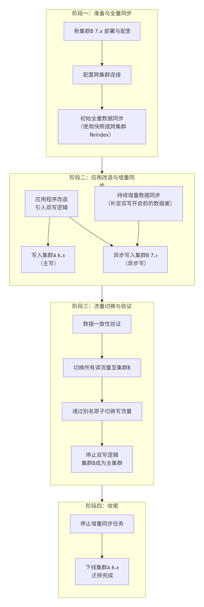

### **1、准备 && 全量同步**

1.  ​部署目标集群 (集群B 7.x)​​：搭建并配置好 Elasticsearch 7.x 集群。确保网络与集群A互通。
2.  ​配置跨集群连接​：在集群B上配置，使其能够访问集群A。
3.  初始全量数据同步​：
4.  方法A（推荐，对生产影响最小）​​：使用 ​快照与恢复。
5.  为集群A的索引创建快照。
6.  将快照仓库挂载到集群B。
7.  从快照恢复到集群B。
8.  方法B​：使用跨集群 Reindex。

### **2、应用改造 && 增量同步**

1.  ​应用程序改造（核心步骤）​​：修改应用的写数据逻辑，在写入集群A的同时，​异步写入集群B。
2.  ​逻辑​：先正常写入集群A，成功后异步向集群B发送写入请求。必须确保集群A的写入成功是关键，集群B的写入失败可以通过日志记录和重试机制来补偿。
3.  ​注意​：务必保证文档 \_id 在两个集群中一致。
4.  ​开启增量数据同步​：在开启双写后，需要一个后台任务来同步在“全量同步完成”到“双写开启”这个时间窗口内，集群A产生的新数据（增量数据）。可以使用定时任务的跨集群Reindex来完成。
5.  ​数据验证​：通过 \_cat/indices 和 \_stats API 对比两个集群索引的文档数和大小，并编写脚本进行数据抽样对比，确保最终一致性。

### **3、流量切换 && 数据验证**

1.  切换读流量​：首先将所有的查询、搜索等读请求流量切换到集群B。观察集群B的负载是否正常。
2.  ​最终切换写流量（别名切换 - 实现不停机）​​：
3.  ​前提​：所有索引都必须使用别名（如 my-index-alias）进行访问，而不是直接使用索引名。
4.  ​操作​：这是一个原子操作，应用程序无感知。
5.  切换完成后，所有新的写请求也会通过别名自然指向集群B。
6.  ​停止双写​：确认集群B运行稳定后，关闭应用程序中的双写逻辑，让集群B成为唯一的数据写入目标。

### **4、收尾**

1.  停止同步任务​：停止阶段二的增量数据同步任务。
2.  ​下线旧集群​：观察一段时间后，确认集群A不再需要，即可将其安全下线。

### **2.3.3 ES 索引分片变更**

ES 索引分片一旦创建，是不能直接修改分片的，通过 reindex 操作实现：

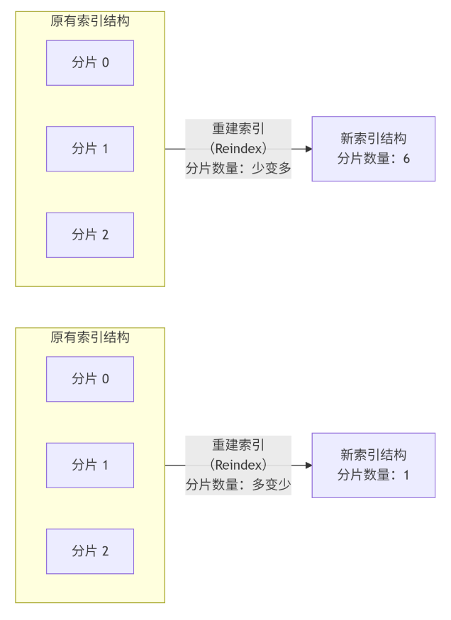

### **1、原有分片数量太少，重建变多**

当现有索引的主分片数量设置过少时，你需要创建一个拥有更多主分片的新索引，并将旧索引的数据迁移过去。

分片太少的坏处：

1.  限制水平扩展能力​：每个分片本质上是一个独立的 Lucene 索引，其数据量和处理能力存在上限。分片过少无法通过增加节点来有效提升索引的存储和计算能力。
2.  ​性能瓶颈​：大量的数据集中在少数分片上，会导致读写请求无法被有效地分散到更多节点上并行处理，容易形成单分片瓶颈，从而降低集群的吞吐量和增加延迟。
3.  ​举例​：一个设置了 3 个分片的索引，总共有 100 GB数据。当集群有 10 个节点时，由于分片数量是固定的，数据仍然只分布在 3 个节点上，无法利用另外 7 个节点的资源。

### **2、原有分片数量太多，重建变少**

当现有索引的主分片数量设置过多时，你需要创建一个拥有更少主分片的新索引，并将旧索引的数据迁移过去。

  
分片太多的坏处​​：

1.  ​资源开销​：每个分片都会消耗一定的CPU、内存和文件句柄。分片数量过多会增加集群的总体开销，影响整体性能。
2.  ​降低性能​：一个查询需要访问多个分片，然后由协调节点聚合结果。分片数量巨大时，会加剧线程池的竞争，增加查询的响应时间。
3.  ​主分片数量不可变​：这是最关键的一点，分片数量一旦设定就无法直接修改。
4.  ​集群管理压力​：维护大量分片会加大主节点的管理负担，因为集群状态需要同步到所有分片副本。

### **3、索引分片一旦创建，是不能直接修改分片数量的**

这是 ES 架构设计决定的，分片数量是索引元数据的核心部分，它决定了数据如何被哈希和路由。在索引创建时，分片数量就被固定下来，因为它直接影响了数据存储的物理布局。

通过下面方式来操作：

1.  创建新索引​：根据新的需求（更多或更少的分片），创建一个正确配置的新索引。
2.  ​重建索引（Reindex）​​：使用 ES 提供的 \_reindex API，将旧索引的数据全部迁移到新索引中。\_reindex 过程会使用新索引的配置（包括分片数量、映射等）来重新处理和存储数据。
3.  ​别名切换（Alias）​​：这是实现零停机迁移的关键。在数据迁移完成后，通过别名操作将指向旧索引的别名无缝切换到新索引上，应用程序无需任何修改。

最佳实践建议：

1.  ​规划先行​：在创建索引前，根据数据量、增长预期和硬件资源，谨慎规划分片数量。一个常见的建议是将每个分片的大小控制在 10 GB到 50 GB 之间，切记最多不能超过 50 GB。
2.  ​使用索引生命周期管理（ILM）​​：对于时序数据（如日志），使用ILM可以自动化的滚动创建新索引、迁移数据等，简化管理。
3.  ​始终使用别名​：永远让应用程序通过别名访问索引，这样在需要重建索引调整分片时，可以做到对应用透明，实现不停机维护。

### **2.3.4 ES 索引文档映射变更**

ES 索引 Mapping（映射）类似于关系型数据库中的表结构定义，一旦定义直接修改会受到严格限制。

这里展示三种变更类型：

1.  字段类型变更：ES 底层使用 Lucene 倒排索引，不同的数据类型（如 integer 和 keyword）其索引和存储方式完全不同。将一个已索引的 integer（数值，用于范围查询）改为 keyword（字符串，用于精确匹配和聚合），相当于要彻底重建该字段的索引结构。​必须通过重建索引（Reindex）​​ 来完成。需要创建一个拥有新Mapping的目标索引，然后将旧索引的数据全部迁移过去。
2.  字段属性变更：这些属性（index、doc\_values、enabled、analyzer）直接决定了数据如何被处理、索引和存储。例如，将一个字段从 "index": false 改为 "index": true，ES 需要为所有已存在的文档数据重新构建倒排索引，因此大多数核心属性的变更也需要重建索引。
3.  文档对象结构变更：这改变了文档的JSON结构本身，ES 需要按照新的结构来解析和理解数据，因此​必须通过重建索引。通常还需要在 Reindex 过程中使用 Painless 脚本来进行复杂的数据结构转换和映射。

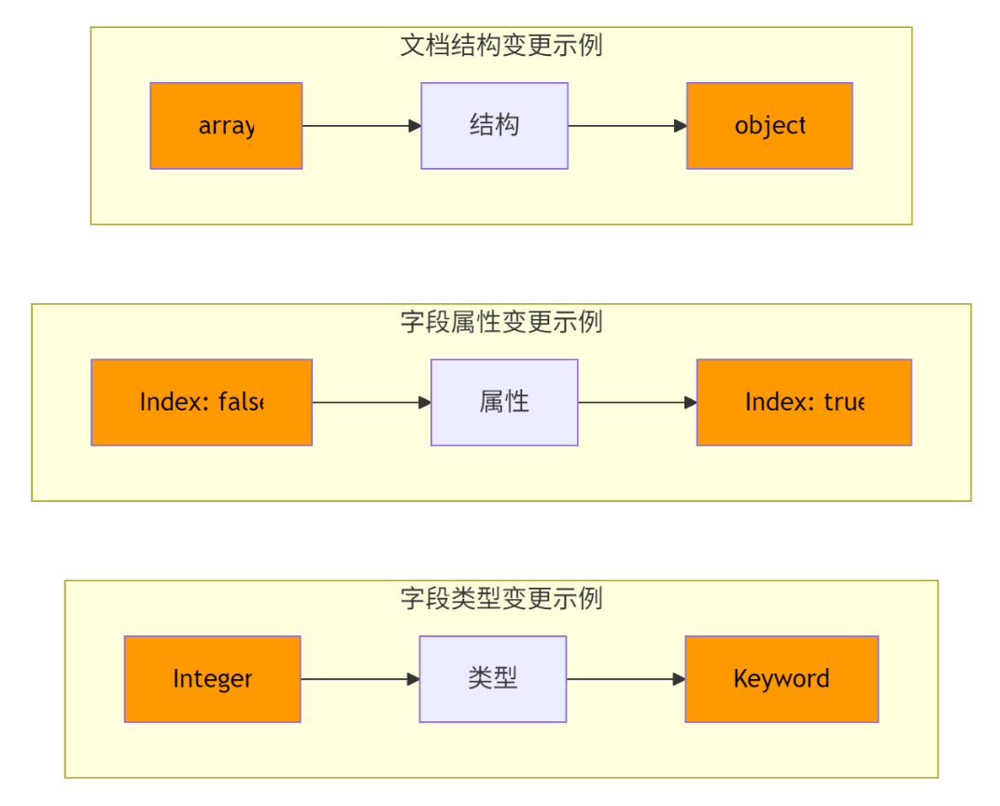

最佳实践建议：

1.  ​Mapping 不可变性​：ES 索引的 Mapping 在创建后，对于已存在的字段，其核心类型和多数属性是不可直接修改的。这是由底层 Lucene 索引的结构决定的。
2.  ​标准解决方案​：应对以上所有变更的唯一标准方法是：
3.  ​创建新索引​：根据新的 Mapping 需求，创建一个正确配置的新索引。
4.  ​重建索引（Reindex）​​：使用 ES 的 \_reindex API 将旧索引的数据迁移至新索引。
5.  ​别名切换（Alias）​​：通过原子操作将应用程序使用的别名从旧索引指向新索引，实现零停机迁移。
6.  ​规划先行​：在索引创建前，充分评估业务需求，设计好 Mapping，避免后续昂贵的重建操作。

### **2.3.5 ES 索引内存碎片整理**

索引频繁更新/删除，产生了很多内存碎片垃圾，导致文档版本更替和 Lucene 段合并不足，使得内存中充满无效数据。这会导致查询性能下降、内存压力增大。

什么是内存碎片垃圾？

**​**​

​这并非指操作系统层面的内存碎片，而是 ES/Lucene 内部数据结构在频繁更新后产生的一种低效状态，它主要指的是段（Segments）​​ 内部的无用数据。

​在 ES 中的具体表现​：

1.  ​删除文档​​：文档不会被立即从磁盘物理删除，而是被标记为「**已删除**」（.del文件）。这些被标记的文档就成了「**垃圾**」。
2.  ​更新文档​​：更新一个文档的本质是先删除旧版本的文档，再索引一个新版本的文档。因此一次更新操作会产生两份垃圾：被删除的旧文档和可能被合并掉的旧索引条目。
3.  ​稀疏的字段数据​​：如果一个字段只在部分文档中存在，那么在该字段不存在的地方就会留下「**空隙**」。

索引频繁更新​原因：

1.  ​动态索引模式​：现代应用常常需要处理用户数据、实时日志、 metrics 等，这些数据模式可能变化或者需要频繁修正。这种高更新、高删除的操作模式是产生内存碎片的主要原因。
2.  ​Lucene 段结构​：Lucene 索引由多个不可变的段（Segment）组成。每次刷新（Refresh）都会产生一个新的小段。后台的段合并（Merge）会尝试将小段合并成大段，并在此期间真正清理掉被删除的文档。然而如果数据变更的速度远远超过段合并的速度，就会导致碎片大量堆积。

带来的负面影响​：

1.  ​内存使用率飙升​：这些碎片（主要是被删除的文档和旧的字段数据）仍然会被加载到内存中（如文件系统缓存），导致消耗了大量内存，却没有带来相应的性能提升。
2.  ​查询性能下降​：查询需要扫描更多的段和更多的无效数据，导致响应变慢。
3.  ​GC压力增大​：更高的内存使用会给 Java 垃圾回收机制带来压力，可能导致频繁 GC，进一步拖累集群性能。

最佳实践建议：​

1.  ​使用索引生命周期管理（ILM）​​：对于时序数据，使用 ILM 策略自动滚动创建新索引（Rollover），并迁移（Shrink）或强制合并（Force Merge）旧索引，这是预防碎片化的最佳实践。
2.  ​合理设置刷新间隔​：非实时性要求的场景，可以适当增大 refresh\_interval，减少产生小段的频率。
3.  ​定期维护​：对于更新频繁的核心索引，将其重建索引作为一项定期的维护任务（例如每月一次），可以保持集群的最佳性能。

## **03 ES 索引重新之 Reindex 深度实战**

## **3.1 ES 索引重新之 Reindex 前提**

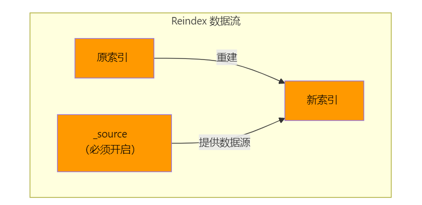

如图是执行 Reindex 操作前必须检查和满足的两个最基本、最关键的先决条件，它们直接决定了 Reindex 操作能否成功执行。

### **1、重建是创建新的索引，原有的索引保留**

Reindex 的本质是一个 ​​「**复制**」​​ 过程，而非​​「**移动**」过程。它会创建一个全新的、独立的目标索引，并将源索引中的数据按照新的规则复制过去，源索引及其数据在整个过程中保持原封不动。

### **2、原有索引 \_source 必须开启，否则找不到原始数据**

\_source 字段是 ES 在索引文档时，自动存储的文档的原始 JSON 主体，Reindex 过程极度依赖这个字段。如果源索引的映射中禁用了 \_source（即 "enabled": false），Reindex 将无法进行。

Reindex 的工作流程可以简化为：

1.  从源索引中「**查询**」到文档。
2.  将查询到的文档「**写入**」目标索引。

在这个过程中，ES ​不是直接拷贝底层的索引数据（倒排索引、doc values等），而是从 \_source 字段中获取到文档的最原始数据，然后用目标索引的新映射（新分词器、新字段类型等）**​**​ 重新处理并索引这份原始数据。如果没有 \_source，就失去了数据的「**原材料**」。

如果 \_source 被禁用怎么办？​​

​非常遗憾，几乎没有直接的办法能进行Reindex，​​ 因为原始数据已经被丢弃了。这就是为什么在创建索引时，除非有极其特殊的需求（如极度节省磁盘空间），否则强烈不建议禁用 \_source。

唯一的可能性是：如果你有原始数据的备份（如来自数据库的流水），可以重新将数据灌入一个开启了 \_source 的临时索引，然后再从那个临时索引 Reindex 到目标索引。

### **3、总结**

在进行任何 Reindex 操作之前，务必反复确认这两个条件是否满足：

1.  安全第一​：通过「**复制**」​​ 而非​​「**移动**」方式来保证操作的可逆性和业务的连续性。
2.  ​数据为王​：\_source 字段是文档的​​「**生命之源**」，是进行任何数据迁移和转换的基础，必须妥善保管。

## **3.2 ES 索引重新之 Reindex 深度实战**

### **3.2.1 添加 kibana sample flight 数据**

在开始实操之前，我们先来添加下索引数据，这里以 kibana\_sample\_flight\_data 为例，添加方式：

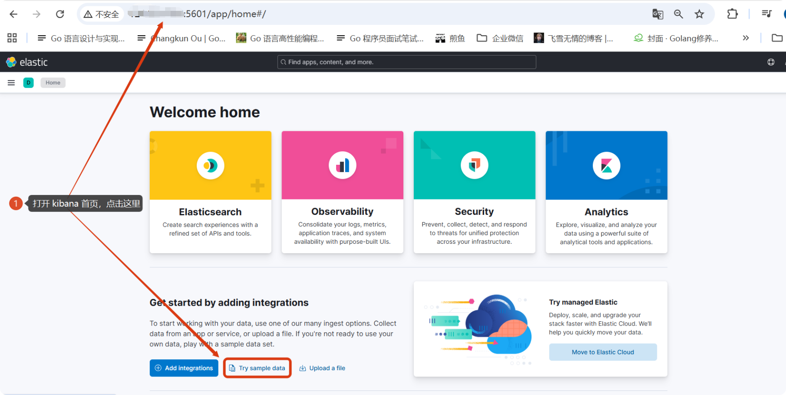

静静等待成功，如果有报错，请检查机器磁盘是否已满：

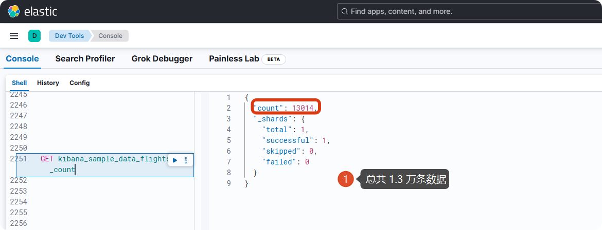

### **3.2.2 重建索引简单实操**

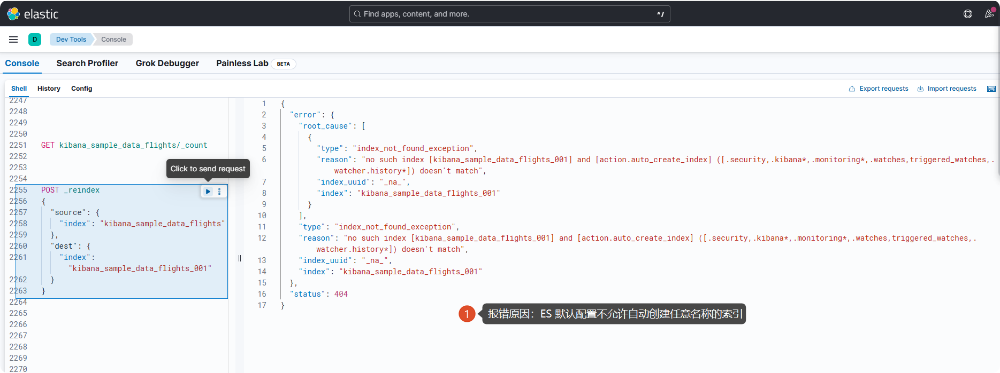

ES 默认配置了 action.auto\_create\_index 设置，限制了哪些索引可以自动创建：

"action.auto\_create\_index": \[

".security",

".kibana\*",

".monitoring\*",

".watches",

"triggered\_watches",

".watcher.history\*"

\]

此时，需要临时修改下 ES 集群的配置，就用到了上篇的实战内容，生产环境不建议直接开放：

\# +kibana\_\*：允许所有以 kibana\_ 开头的索引自动创建

\# -\*：拒绝其他所有索引自动创建（安全限制）

PUT \_cluster/settings

{

"persistent": {

"action.auto\_create\_index": "+kibana\_\*,-\*"

}

}

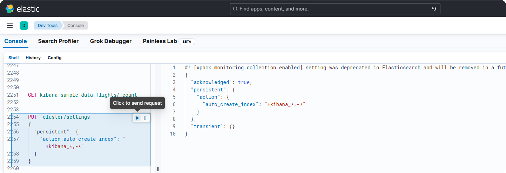

再来执行 reindex：

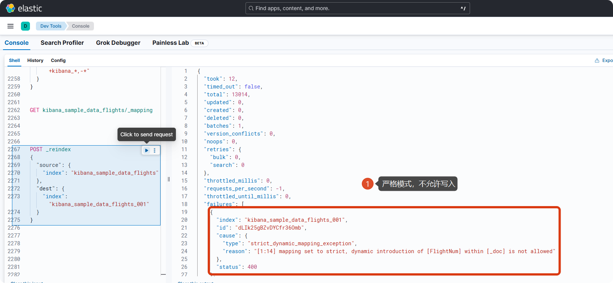

早期这个 kibana\_sample\_flight\_data 索引的 mapping 的 dynamic 不是 strict 可以直接 reindex，现在不行了：

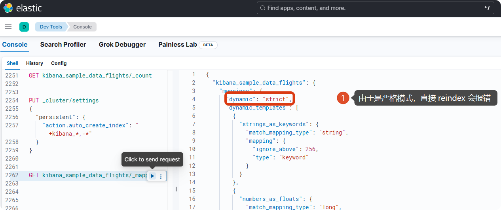

怎么办呢？

我们可以设置新索引的 dynamic = true，**但是生产环境不建议这么做，最佳实践是手动创建新索引的 mapping 并指定 dynamic=strict，**这里为了演示就不这么操作了：

PUT kibana\_sample\_data\_flights\_001

{

"mappings": {

"dynamic": true // 允许动态添加新字段

}

}

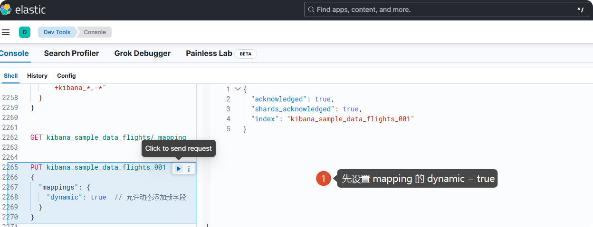

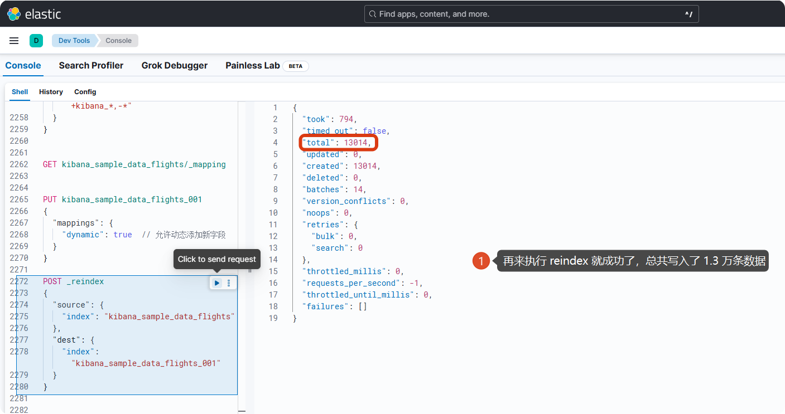

### **3.2.3 重建索引高级实操**

这里会讲些重建索引的高级实操。

### **3.2.3.1 单秒数据量阀值**

requests\_per\_second：该参数用于控制重建索引 Reindex 过程中的吞吐量，单位是文档数/秒。它本质上是通过在底层批处理请求之间增加延迟来实现的。

默认值 -1：

1.  设置为 -1 时，ES 会使用尽可能快的速度进行迁移。这会使集群的CPU、I/O（磁盘和网络）​​ 资源在短时间内被大量占用，极易影响线上业务的读写性能，甚至导致集群响应缓慢或超时。
2.  ​仅在开发/测试环境，且数据量很小的情况下，才考虑使用无限制的速度。

​生产环境建议值 500~1000：

1.  这是一个经验值，需要根据您集群的实际硬件配置（特别是磁盘I/O性能是SSD还是HDD）和当前负载进行调整。
2.  ​原则​：从一个保守的值（如500）开始，观察集群的节点负载、CPU使用率、磁盘I/O等待时间等监控指标。如果集群游刃有余，可以适当调高；如果监控指标已经很高，则应调低此值。
3.  设置此参数的目的就是为了实现您所说的「**防止集群瞬间 I/O 增大**」，让重建任务作为一个低优先级的后台任务平稳运行，而不影响前台业务。

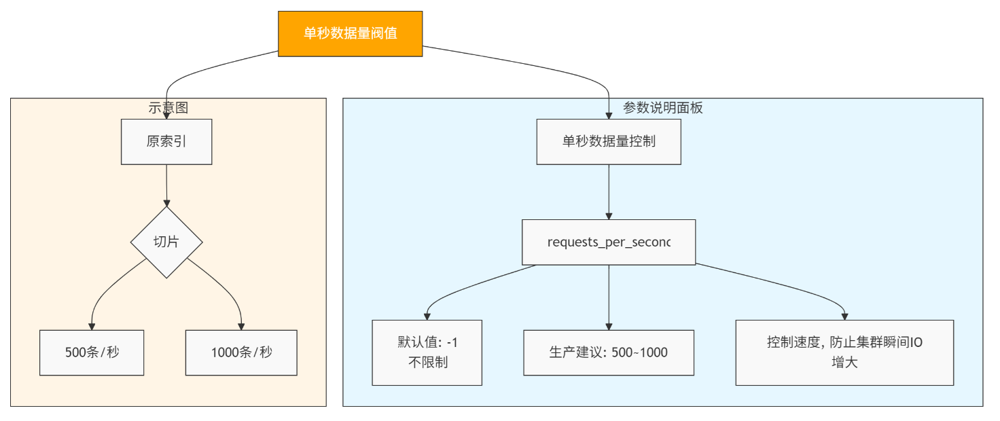

\# 删除 001 索引

DELETE kibana\_sample\_data\_flights\_001

PUT kibana\_sample\_data\_flights\_001

{

"mappings": {

"dynamic": true // 允许动态添加新字段

}

}

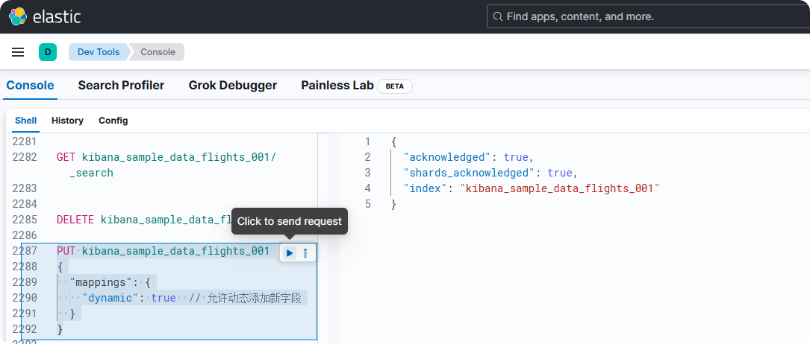

\# 重建索引，单秒阀值 500

POST \_reindex?requests\_per\_second=100

{

"source": {

"index": "kibana\_sample\_data\_flights"

},

"dest": {

"index": "kibana\_sample\_data\_flights\_001"

}

}

\# 查看任务列表

GET \_cat/tasks?v

\# 查看任务详情

GET \_tasks/nUSQHj-mRbytSTCci8xMwA:62336831

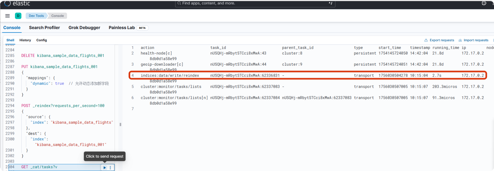

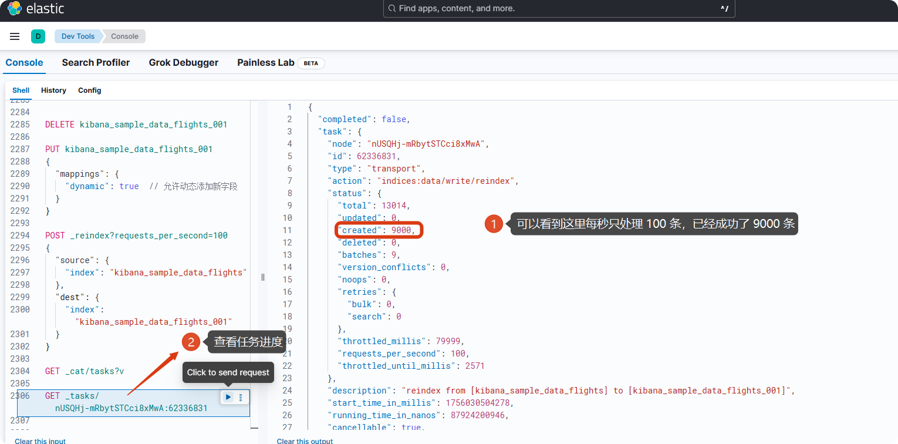

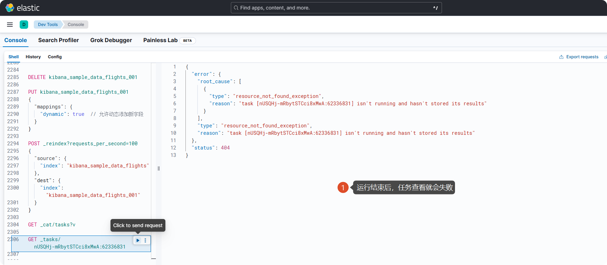

### **3.2.3.2 数据切片**

slices 是 ES Reindex API 中用于控制任务并行度的参数。它通过将一个大的重建任务自动切分成多个独立的子任务来并行执行，从而极大提升数据迁移的效率。

其默认值是 1，即并行度是 1，建议值与分片数量一致。

默认值是 1：这是一个保守且安全的设置，它不会带来任何并行开销但也无法利用多核CPU的优势，重建速度最慢。

设置 slices:3 后：如下图所示，ES 会创建 ​3个独立的工作单元（切片）​。

1.  每个切片都会自行从源索引的一个数据子集中获取文档。
2.  所有切片并行地将获取到的文档写入目标索引。
3.  最终，所有切片的结果合并，完成整个重建任务。

为什么建议与分片数量一致呢？

> 个人认为每个切片最好处理一个完整的分片（Lucene Index），这样效率最高。将切片数量设置为源索引的主分片数是一个经验法则。
> 
> 例如，如果源索引有 5 个主分片，设置 "slices": 5 通常能获得很好的性能。

注意事项​：

1.  ​并非越多越好​：设置过高的 slices 值（例如远大于分片数量）会增加 ES 协调和管理多个任务的开销，可能反而导致性能下降。同时也会增加集群的 CPU 使用率。
2.  ​资源消耗​：更多的切片意味着会同时产生更多的读写请求，会占用更多的 CPU、内存和 I/O 资源。在重建期间需要监控集群状态，确保不会影响线上业务的正常运作。

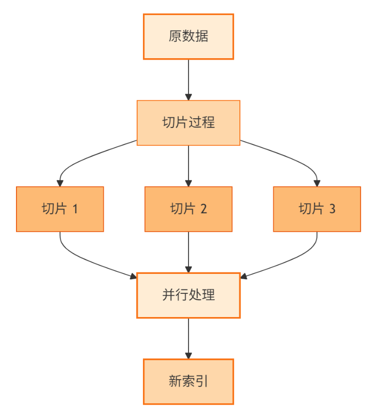

这里展示两种分片方式。

### **1、人工分片**

\# 删除 001 索引

DELETE kibana\_sample\_data\_flights\_001

PUT kibana\_sample\_data\_flights\_001

{

"mappings": {

"dynamic": true // 允许动态添加新字段

}

}

\# 人工分片

POST \_reindex

{

"source": {

"index": "kibana\_sample\_data\_flights",

"slice":{

"id" : 0,

"max": 3

}

},

"dest": {

"index": "kibana\_sample\_data\_flights\_001"

}

}

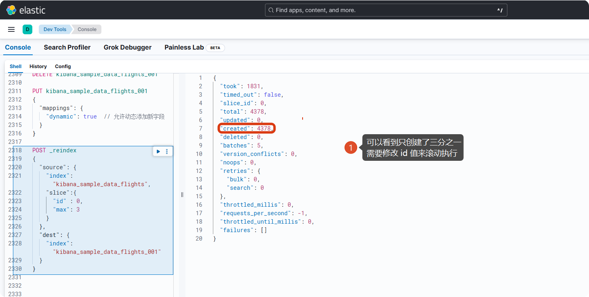

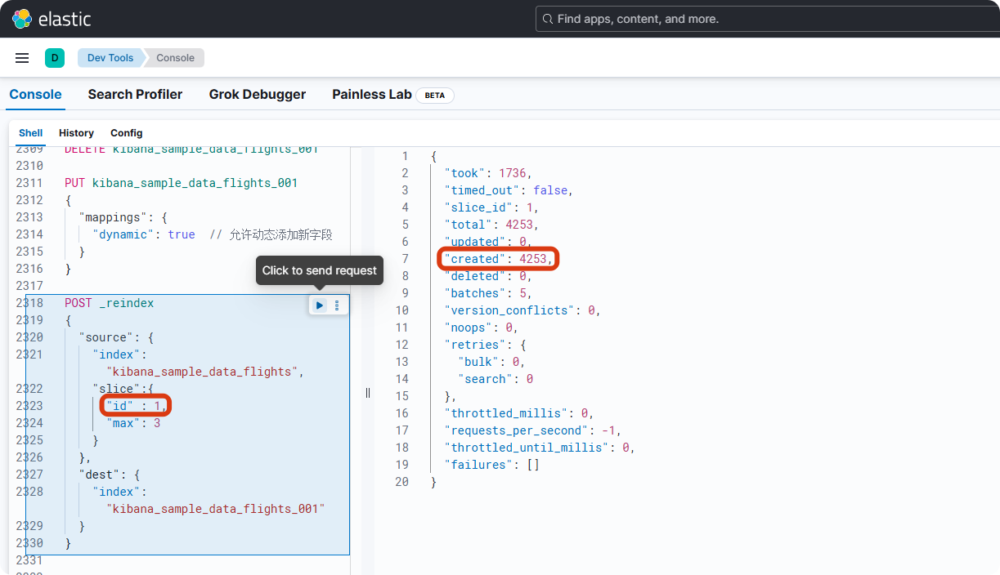

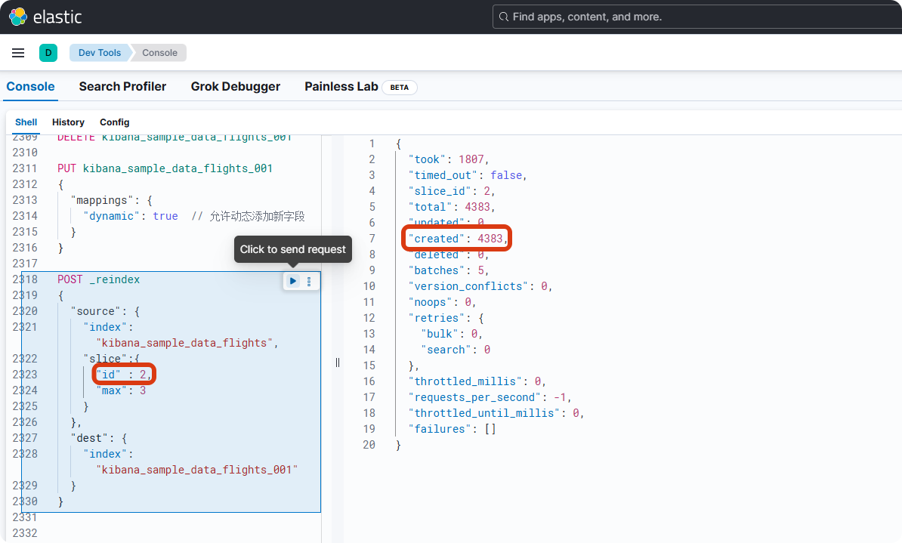

\# 查看所有文档数

GET kibana\_sample\_data\_flights\_001/\_count

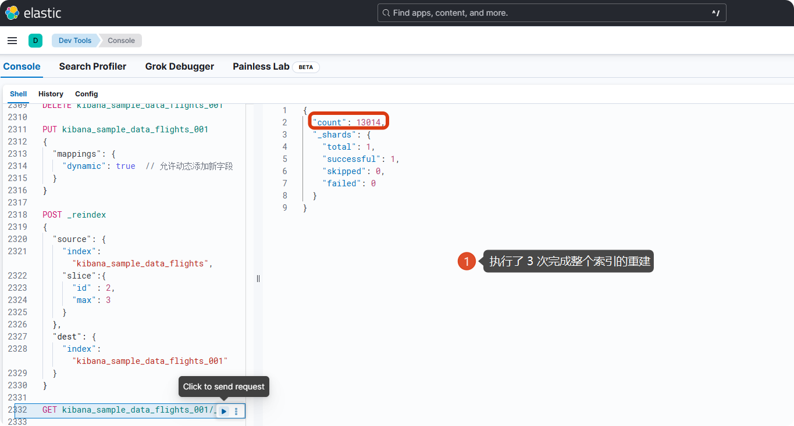

### **2、自动分片**

只需设置自动切片大小即可，后续的调度由 ES 完成。

\# 自动分片

POST \_reindex?slices=2&refresh=true

{

"conflicts": "proceed",

"source": {

"index": "kibana\_sample\_data\_flights"

},

"dest": {

"index": "kibana\_sample\_data\_flights\_001"

}

}

\# 结果

{

"took": 2921,

"timed\_out": false,

"total": 13014,

"updated": 0,

"created": 13014,

"deleted": 0,

"batches": 14,

"version\_conflicts": 0,

"noops": 0,

"retries": {

"bulk": 0,

"search": 0

},

"throttled\_millis": 0,

"requests\_per\_second": -1,

"throttled\_until\_millis": 0,

"slices": \[

{

"slice\_id": 0,

"total": 6332,

"updated": 0,

"created": 6332,

"deleted": 0,

"batches": 7,

"version\_conflicts": 0,

"noops": 0,

"retries": {

"bulk": 0,

"search": 0

},

"throttled\_millis": 0,

"requests\_per\_second": -1,

"throttled\_until\_millis": 0

},

{

"slice\_id": 1,

"total": 6682,

"updated": 0,

"created": 6682,

"deleted": 0,

"batches": 7,

"version\_conflicts": 0,

"noops": 0,

"retries": {

"bulk": 0,

"search": 0

},

"throttled\_millis": 0,

"requests\_per\_second": -1,

"throttled\_until\_millis": 0

}

\],

"failures": \[\]

}

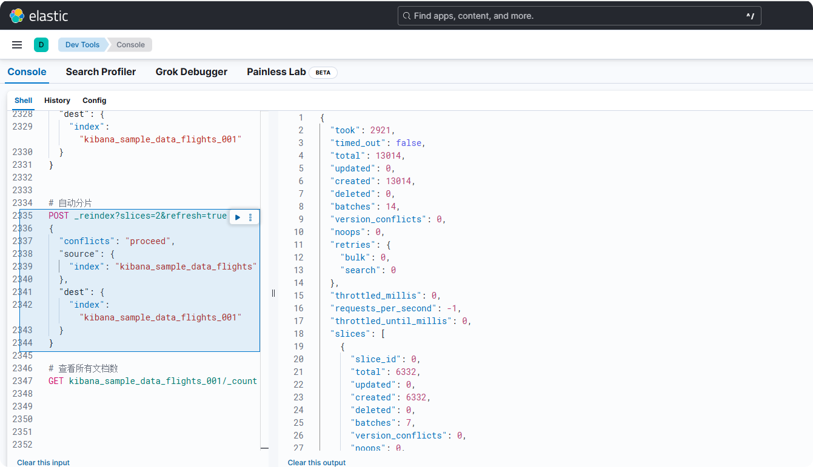

### **3.2.3.3 路由机制**

routing 是一个在文档级别指定的参数，它决定了一个文档应该被存储在哪个分片上。其默认且最常见的行为是使用文档的 \_id 作为路由值，将原始数据重新路由到新的索引指定的分片上，便于精细的管控分片数据。

但在重建索引（Reindex）时，您可以覆盖这一行为，使用文档中的任何一个字段（如 user\_id, tenant\_id, category）作为路由键，从而实现对数据物理存储位置的精准控制。

1.  默认情况​：如果不指定 routing，所有文档会使用其 \_id 进行哈希计算，然后随机​地分布到所有分片上。
2.  ​指定 routing 后​：如下图所示，所有具有相同路由键值的文档，一定会被路由到同一个分片。例如，所有 routing = "A" 的文档都进入分片1，所有 routing = "B" 的文档都进入分片2。这实现了数据亲和性。

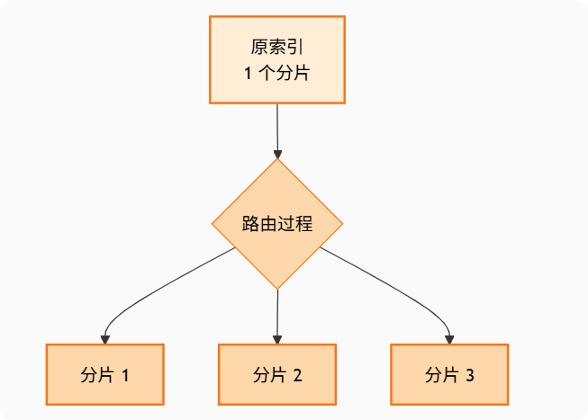

DELETE kibana\_sample\_data\_flights\_001

PUT kibana\_sample\_data\_flights\_001

{

"settings": {

"number\_of\_replicas": 3,

"number\_of\_shards": 3

},

"mappings": {

"dynamic": true // 允许动态添加新字段

}

}

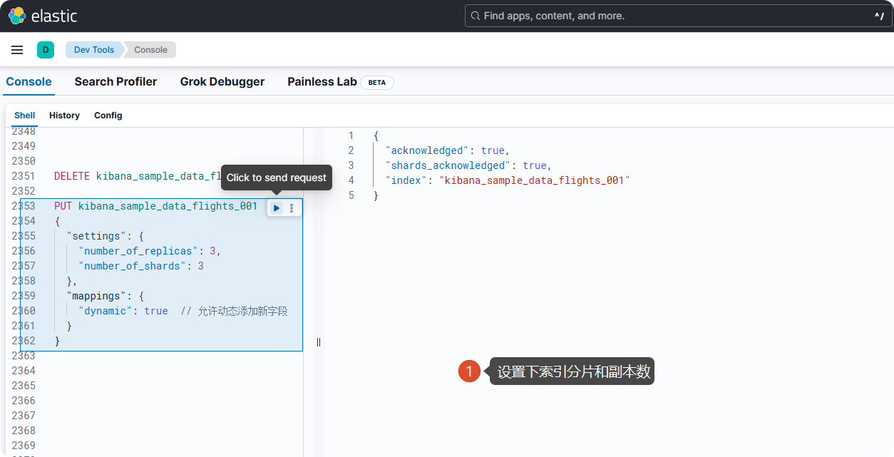

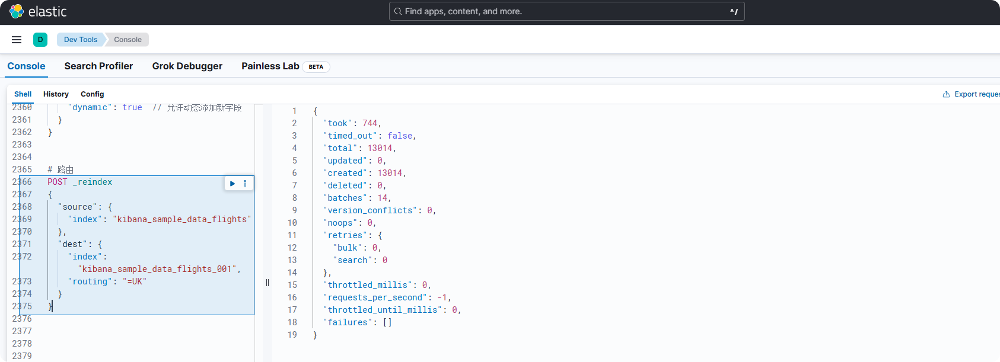

\# 指定路由

POST \_reindex

{

"source": {

"index": "kibana\_sample\_data\_flights"

},

"dest": {

"index": "kibana\_sample\_data\_flights\_001",

"routing": "=DestCountry"

}

}

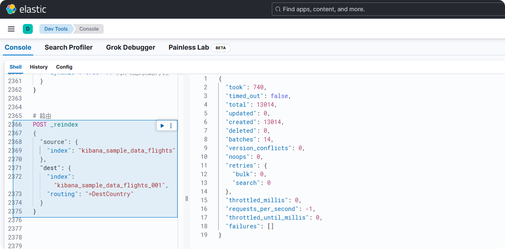

GET kibana\_sample\_data\_flights\_001/\_count?routing=DestCountry

GET kibana\_sample\_data\_flights\_001/\_count?routing=DestCountry2

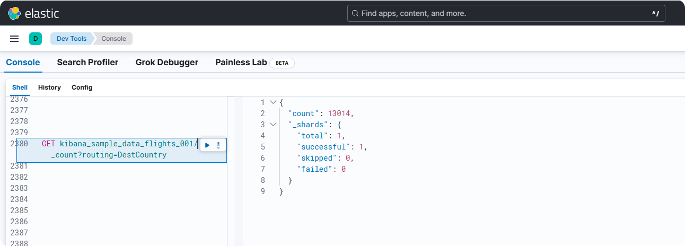

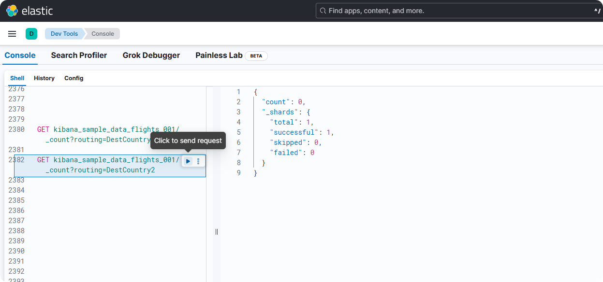

### **3.2.3.4 限制数据重建范围**

query 参数位于 Reindex API 的 \_source 部分，它允许你使用 ​ES 强大的查询领域特定语言 (DSL)​​ 来精确指定要从源索引中抽取哪些文档进行迁移。重建过程会先对源索引执行您定义的查询。只有完全匹配该查询条件的文档才会被选中并迁移到目标索引。不匹配的文档将被忽略，如下图所示。

query 参数核心价值与用途​：

1.  ​数据过滤与清洗​：这是最常见的用途。例如，只迁移特定时间范围（"range": {"@timestamp": {...}}）、特定业务类型（"term": {"category": "news"}）或符合某种复杂逻辑（"bool": {...}）的数据。
2.  ​数据采样​：迁移一部分数据到新索引进行分析或测试。
3.  ​数据拆分​：将一个大的索引按逻辑拆分成多个小的、更有针对性的索引。

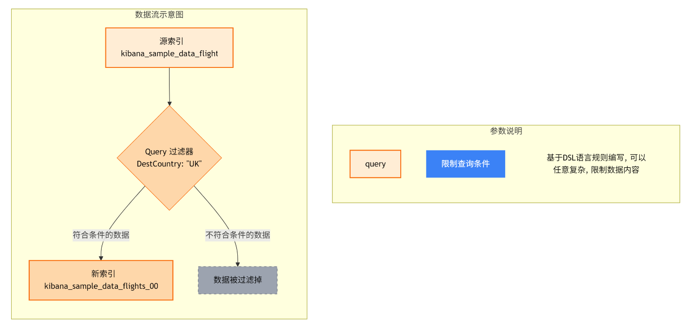

max\_docs 是 Reindex API 的一个顶级参数，用于限制本次重建任务最多迁移的文档数量。重建过程会从源索引中（或经过 query 过滤后的结果集中）顺序读取文档。它维护一个计数器，每成功迁移一个文档就加一。当计数器达到 max\_docs 设置的值时，​无论后面还有多少符合条件的文档，任务都会立即停止。如下图所示，迁移了10条后即停止。

核心价值与用途​：

1.  ​功能测试​：在执行全量重建之前，先用一个很小的数字（如10）测试你的重建脚本是否正确，目标索引的映射和设置是否如预期。
2.  ​性能测试​：用小规模数据测试重建过程对集群性能的影响，从而为全量迁移调整 requests\_per\_second 等参数找到合适的值。
3.  ​限量迁移​：在某些特殊场景下，只需要迁移部分数据样本。

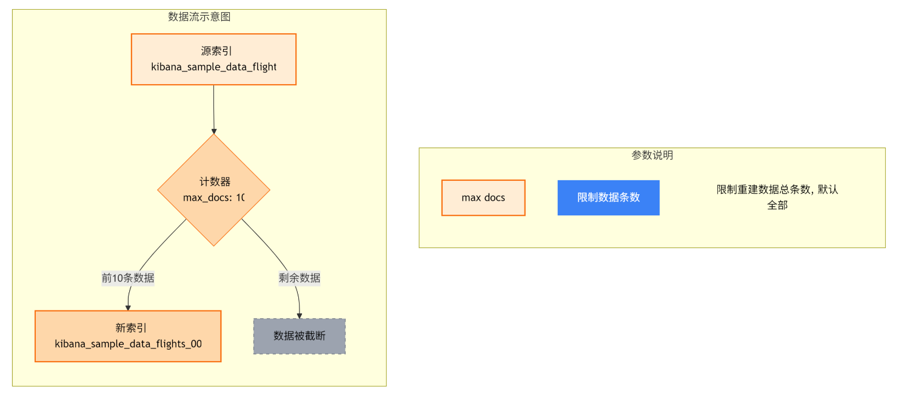

注意事项​：

1.  ​与 query 的协同​：max\_docs 是在 query 过滤之后生效的，它限制的是最终匹配查询条件的文档的迁移数量。
2.  ​非精确性​：如果您使用了 slices 进行并行重建，由于多个切片同时工作，最终迁移的总文档数可能会略微超过​ max\_docs 的设置。

DELETE kibana\_sample\_data\_flights\_001

PUT kibana\_sample\_data\_flights\_001

{

"mappings": {

"dynamic": true // 允许动态添加新字段

}

}

POST \_reindex

{

"conflicts": "proceed", // 遇到版本冲突时继续

"max\_docs": 100, // 最多只迁移100条文档

"source": {

"index": "kibana\_sample\_data\_flights",

"query": { // 只迁移飞往曼彻斯特的航班数据

"term": {

"DestAirportID": "MAN"

}

}

},

"dest": {

"index": "kibana\_sample\_data\_flights\_001" // 目标索引

}

}

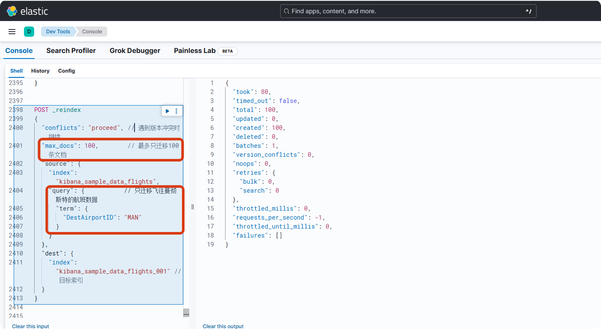

GET kibana\_sample\_data\_flights\_001/\_search

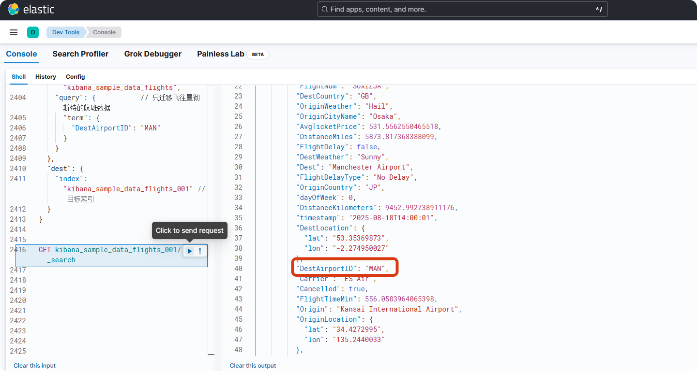

### **3.2.3.5 整合多个索引**

这是 Reindex API 在 source 部分的一个关键特性：index 字段不仅可以接受一个字符串（单个索引名），还可以接受一个字符串数组，用以指定多个源索引。

1.  当提供一个索引名数组时，ES 会从所有指定的索引中读取文档。
2.  读取过程就像是同时查询了所有这些索引，并将结果集合并在一起。
3.  最终，这个合并后的结果集会全部迁移到 dest.index 指定的单个目标索引中。

核心价值与用途​：

1.  ​数据合并 (Data Consolidation)​​：
2.  这是最主要的使用场景。可以将多个小型索引（例如按天划分的日志索引 logs-2025-08-01, logs-2025-08-02）合并到一个更大的索引中（如 logs-2025-08），便于进行跨时间段的整体分析和查询，同时减少索引数量，便于管理。
3.  ​数据重组 (Data Reorganization)​​：
4.  将存储在不同索引中但属于同一业务类型的数据合并到一起。例如，将 products\_online 和 products\_offline 两个索引合并为一个统一的 products\_all 索引。
5.  ​索引版本升级或映射调整​：
6.  当您需要修改索引的映射（Mapping）或设置（Settings）时，通常需要重建索引。如果相同的数据分散在多个索引中，使用多索引重建可以一次性将它们全部迁移到新的、配置统一的目标索引中。

注意事项：

若多个索引数据ID相同，则会相互覆盖。ES 中文档的唯一性由 \_index 和 \_id 共同决定，不同索引中的文档完全可以拥有相同的 \_id。当这些文档被合并到同一个目标索引时，它们的唯一标识就只剩下 \_id。因此，​后写入的文档会覆盖先写入的具有相同 \_id 的文档。

如何避免数据意外覆盖？​​

1.  ​使用 op\_type: create​：在 dest 部分设置 "op\_type": "create"。这样，如果目标索引中已存在相同 ID 的文档，整个操作会失败并报错，而不会静默覆盖。这是一种安全模式。
2.  ​冲突处理策略 conflicts: proceed​：在顶级参数设置 "conflicts": "proceed"。当遇到版本冲突时，任务不会中止，而是继续处理后续文档，并在最后报告冲突数量。这适用于「**最后写入获胜**」的场景。

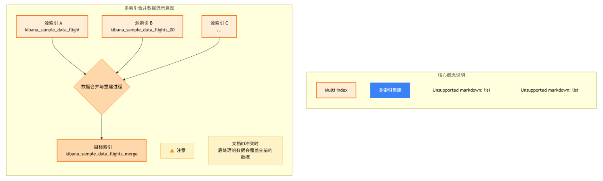

\# 创建一个新的 Mapping 为合并后的索引

PUT kibana\_sample\_data\_flights\_002

{

"mappings": {

"dynamic": true // 允许动态添加新字段

}

}

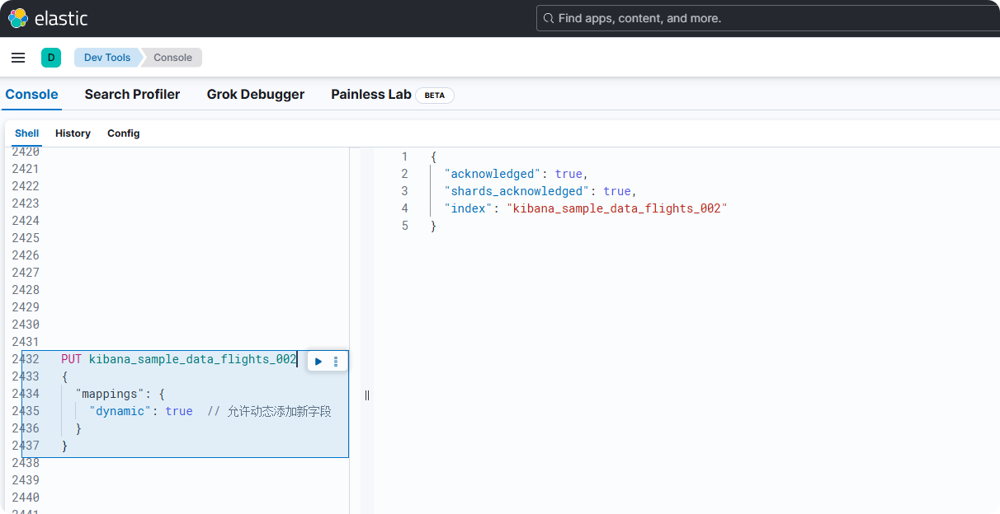

\# 重建合并多个索引

POST \_reindex

{

"source": {

"index": \[

"kibana\_sample\_data\_flights",

"kibana\_sample\_data\_flights\_001"

\]

},

"dest": {

"index": "kibana\_sample\_data\_flights\_002"

}

}

GET kibana\_sample\_data\_flights\_002/\_count

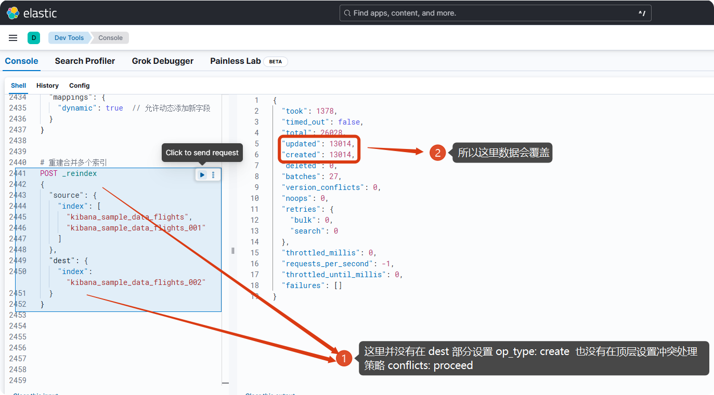

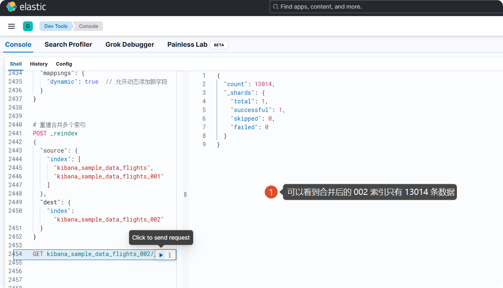

接下来我们来测试如何不覆盖场景。

### **1、独立使用 op\_type:create（最安全）**

这是一个「**预防性**」的策略，从写入层面根本杜绝覆盖，它作用于「**单个文档的写入操作**」。命令 ES 只能执行「**创建**」操作，如果目标索引中已经存在相同 \_id​ 的文档，那么对于这一条文档的写入就会失败，并抛出一个版本冲突异常。

影响范围​：这条写入失败的文档不会被插入，但 Reindex 任务会立即停止​（除非配合了 conflicts: proceed）。

适用场景​：

1.  ​严格的数据安全迁移​：当你绝对确保目标索引是全新的，或者源数据和目标数据不应该有任何 \_id 重叠时。任何重叠都意味着逻辑错误，需要立即停止任务进行检查。
2.  ​数据备份​：将数据迁移到一个备份索引，确保备份过程不会意外破坏备份索引中的任何现有数据。

DELETE kibana\_sample\_data\_flights\_002

\# 创建一个新的 Mapping 为合并后的索引

PUT kibana\_sample\_data\_flights\_002

{

"mappings": {

"dynamic": true // 允许动态添加新字段

}

}

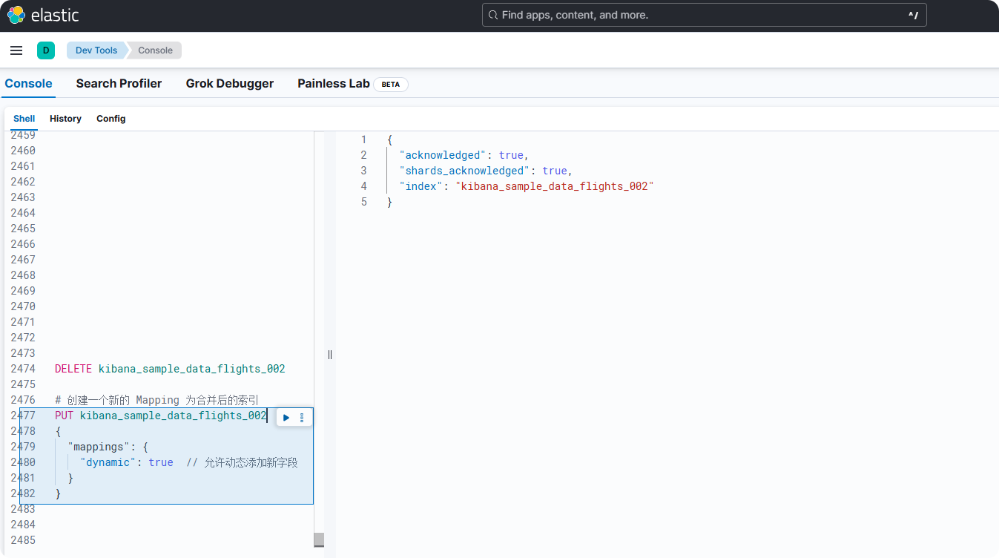

\# 重建合并多个索引

POST \_reindex

{

"source": {

"index": \[

"kibana\_sample\_data\_flights",

"kibana\_sample\_data\_flights\_001"

\]

},

"dest": {

"index": "kibana\_sample\_data\_flights\_002",

"op\_type": "create"

}

}

GET kibana\_sample\_data\_flights\_002/\_count

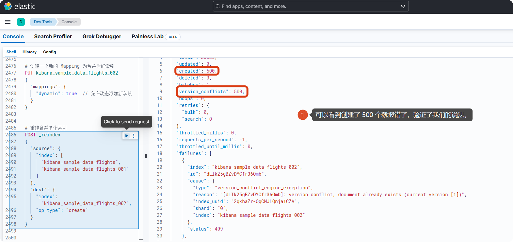

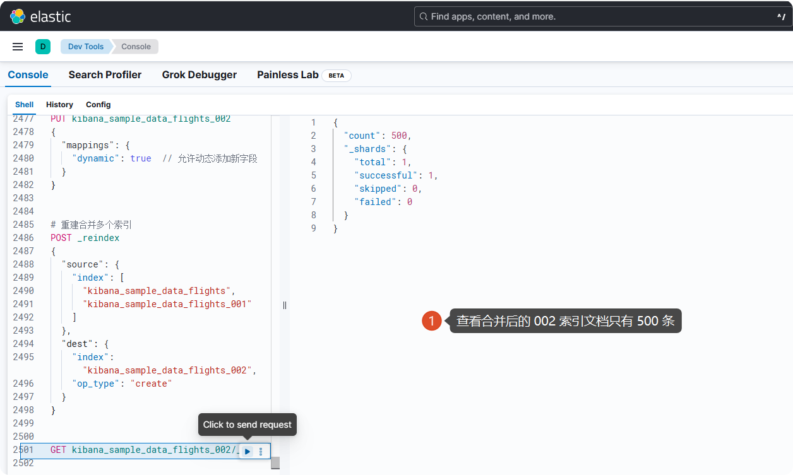

### **2、独立使用 conflicts:proceed（允许覆盖）**

这是一个「**善后性**」的策略，在覆盖发生时选择继续任务而非中止，它作用于「**整个 Reindex 任务**」。当任务中遇到版本冲突（例如因 \_id 重复而导致写入失败）时，​跳过当前这条冲突的文档，记录下冲突，然后继续处理下一条文档。任务完成后，会在返回结果中告知你一共发生了多少次冲突。

影响范围​：它只控制任务遇到冲突时是继续还是中止，​它本身并不阻止覆盖的发生。覆盖是否发生，取决于写入操作本身（如是否使用了 op\_type: create）。

适用场景​：

1.  ​​「**最后写入获胜**」场景​：当你明确知道会发生大量 \_id 重复，并且你希望用源索引中的数据覆盖目标索引中的旧数据。你希望任务能跑完全部数据，而不是中途停止。
2.  ​非关键数据的批量处理​：处理可能包含重复数据的日志类信息， completeness（完整性）比绝对精确更重要，允许跳过一些错误。

DELETE kibana\_sample\_data\_flights\_002

\# 创建一个新的 Mapping 为合并后的索引

PUT kibana\_sample\_data\_flights\_002

{

"mappings": {

"dynamic": true // 允许动态添加新字段

}

}

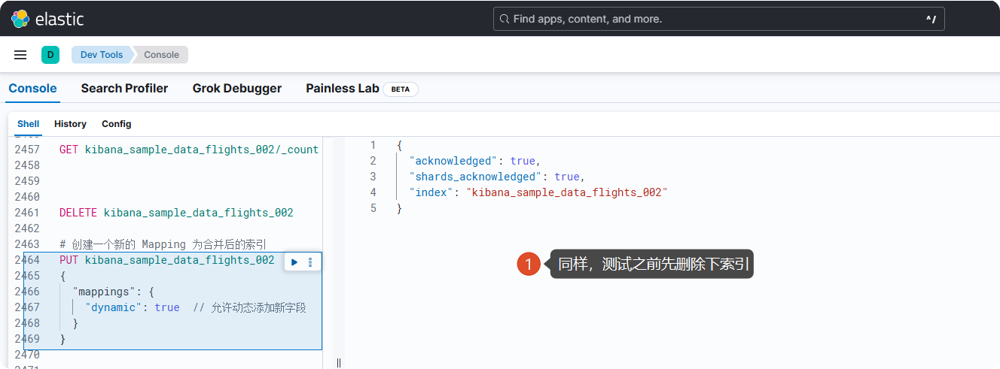

\# 重建合并多个索引

POST \_reindex

{

"conflicts": "proceed", // 遇到冲突继续任务

"source": {

"index": \[

"kibana\_sample\_data\_flights",

"kibana\_sample\_data\_flights\_001"

\]

},

"dest": {

"index": "kibana\_sample\_data\_flights\_002"

}

}

GET kibana\_sample\_data\_flights\_002/\_count

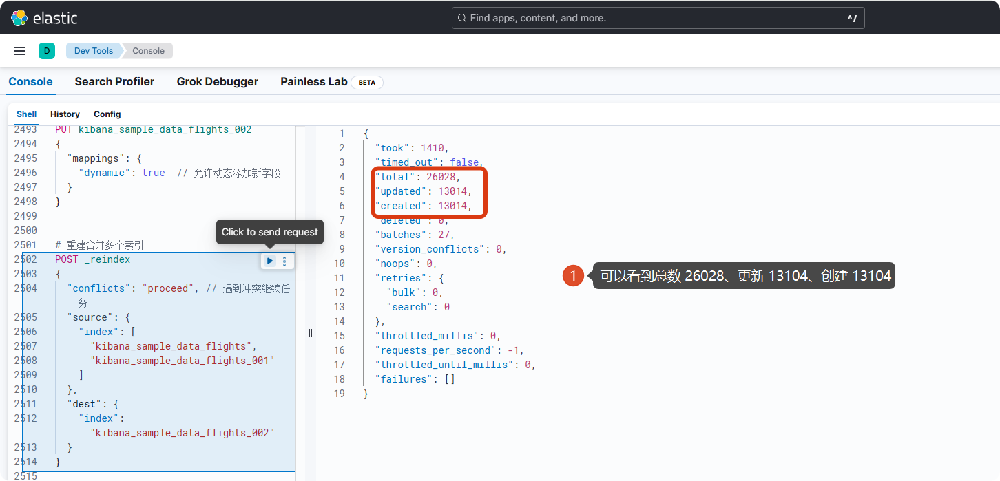

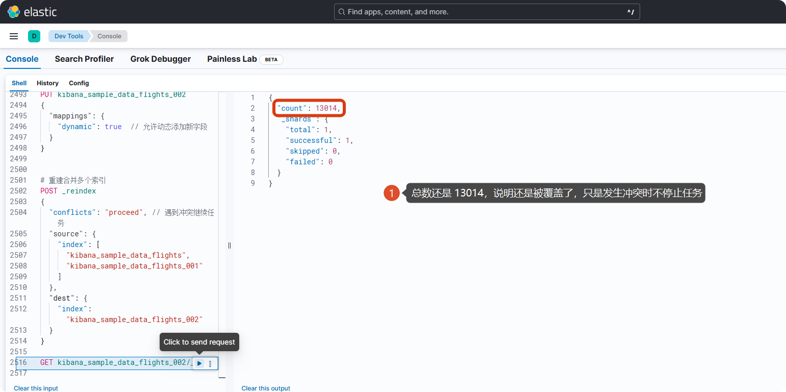

### **3、两者组合使用**

DELETE kibana\_sample\_data\_flights\_002

\# 创建一个新的 Mapping 为合并后的索引

PUT kibana\_sample\_data\_flights\_002

{

"mappings": {

"dynamic": true // 允许动态添加新字段

}

}

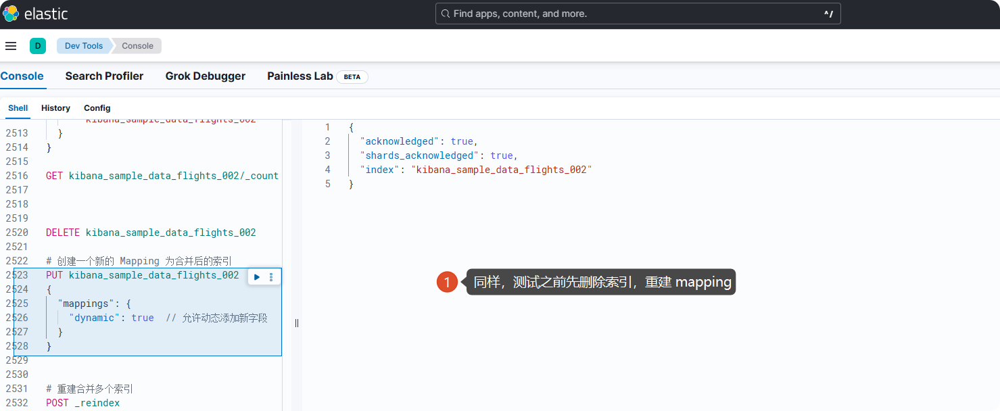

\# 重建合并多个索引

POST \_reindex

{

"conflicts": "proceed", // 遇到冲突继续任务

"source": {

"index": \[

"kibana\_sample\_data\_flights",

"kibana\_sample\_data\_flights\_001"

\]

},

"dest": {

"index": "kibana\_sample\_data\_flights\_002",

"op\_type": "create"

}

}

GET kibana\_sample\_data\_flights\_002/\_count

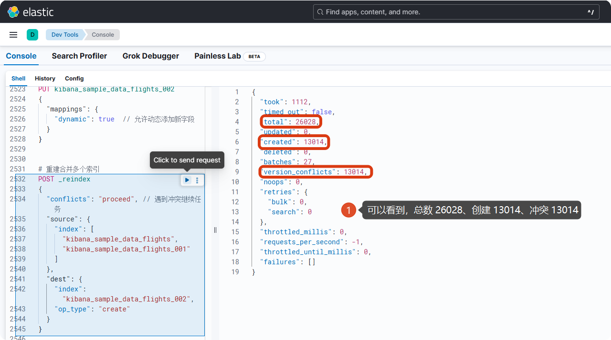

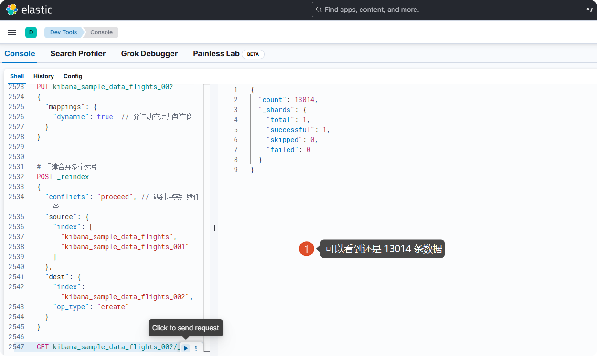

1.  效果​：任务会尝试创建所有文档。对于所有 \_id 重复的文档，​创建会失败，但这些失败会被视为“冲突”，由于设置了 proceed，任务不会中止，而是跳过这些冲突文档继续处理下一个。最后会返回成功数量和冲突数量。
2.  ​适用场景​：你希望将新数据迁移到目标索引，但目标索引中可能已存在一些数据。你不想覆盖任何现有数据，但又希望任务能完全运行完毕，以便知道有多少新数据成功插入，有多少因为已存在而没插进去。

### **4、总结**

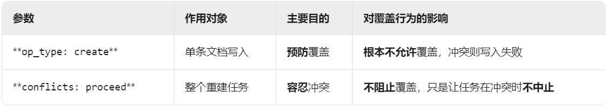

根据你的业务目标来选择：

1.  ​严禁覆盖​：使用 op\_type: create。
2.  ​允许覆盖且需完整迁移​：使用 conflicts: proceed。
3.  ​严禁覆盖但仍需完成全部迁移任务​：​组合使用两者。

### **3.2.3.6 限定需要重建的数字段**

个人认为 \_source 字段过滤是一个极其有用的功能，它让重建索引不再是简单的数据拷贝，而是一次精准的数据塑形和优化过程，是构建高效、整洁数据架构的关键步骤之一。

它允许您明确指定一个字段白名单，在重建过程中只有名单内的字段会被从源文档中提取并写入目标索引，其他所有字段将被忽略和丢弃。

1.  从源索引中读取一个完整的文档（包含所有字段）。
2.  根据 \_source 参数中指定的列表，​仅保留所需的字段。
3.  只将这份​​「**瘦身**」后的文档写入目标索引。

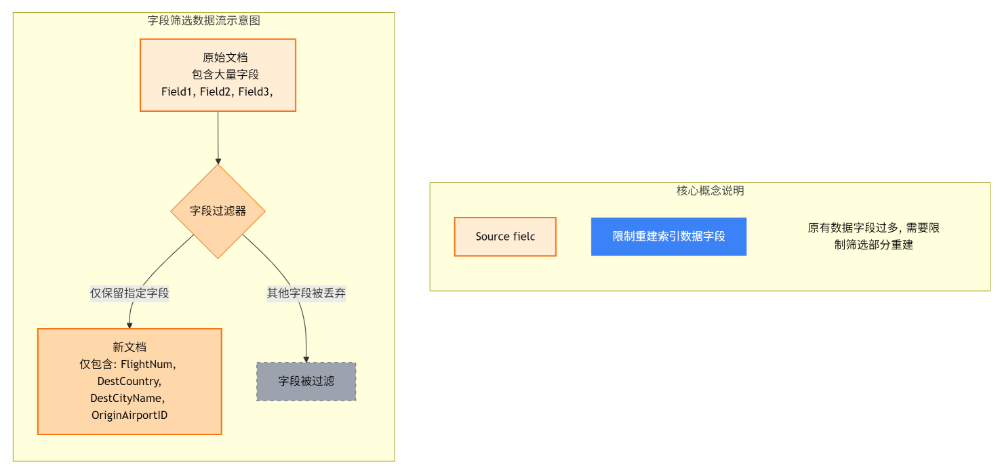

核心价值与用途​：

1.  ​优化存储与性能​：
2.  ​减少磁盘占用​：目标索引只包含必要的字段，显著降低了存储空间需求。
3.  ​提升读写效率​：更少的字段意味着更小的文档体积，在数据迁移过程中可以减少网络传输和磁盘I/O的压力，从而加快重建速度。同时，未来针对该索引的搜索和聚合操作也会更快。
4.  ​数据清洗与简化​：
5.  移除不再需要或无关的字段，简化文档结构，使数据模型更加清晰，便于后续的查询和维护。
6.  适用于数据模型演进后，需要淘汰旧字段的场景。
7.  ​隐私与安全​：
8.  在将数据从一个环境迁移到另一个环境（如从生产环境到测试环境）时，可以过滤掉敏感的字段（如用户密码、个人身份证号、邮箱等），确保数据安全。

注意事项​：

1.  ​字段不存在​：如果指定的字段在源文档中不存在，它会被静默忽略，不会在目标文档中创建该字段。
2.  ​嵌套字段​：支持指定嵌套字段的子字段，例如 "user.name"。
3.  ​与其它参数协同​：\_source 字段过滤可以与之前提到的 query（条件过滤）、slices（并行处理）等参数完美结合，实现高度定制化的数据迁移。

DELETE kibana\_sample\_data\_flights\_002

\# 创建一个新的 Mapping 为合并后的索引

PUT kibana\_sample\_data\_flights\_002

{

"mappings": {

"dynamic": true // 允许动态添加新字段

}

}

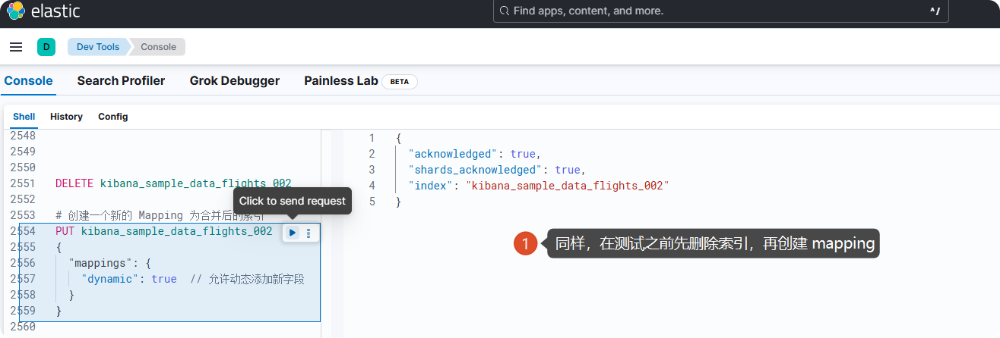

\# 重建合并多个索引

POST \_reindex

{

"conflicts": "proceed", // 遇到冲突继续任务

"source": {

"index": \[

"kibana\_sample\_data\_flights",

"kibana\_sample\_data\_flights\_001"

\],

"\_source" : \[

"FlightNum",

"DestCountry",

"DestCityName",

"OriginAirportID"

\]

},

"dest": {

"index": "kibana\_sample\_data\_flights\_002",

"op\_type": "create"

}

}

GET kibana\_sample\_data\_flights\_002/\_search

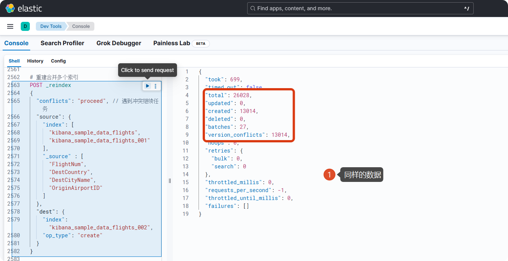

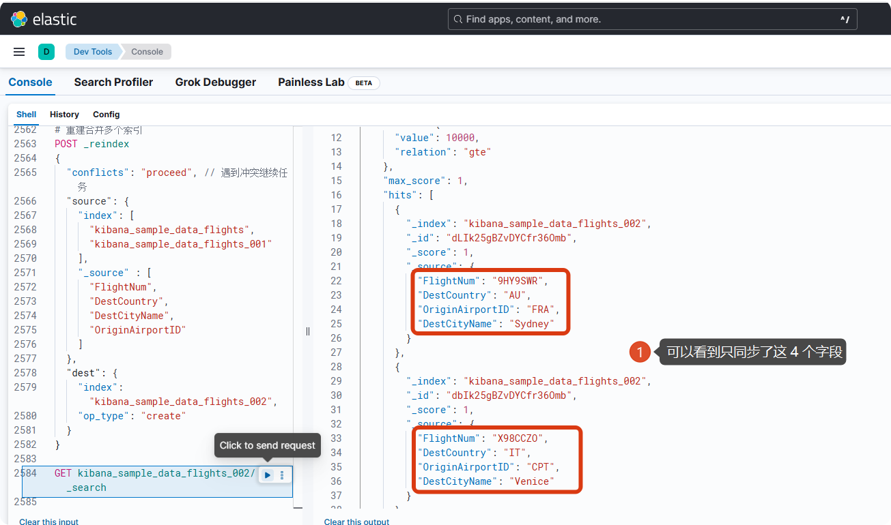

### **3.2.3.7 数据字段重命名**

script 参数将重建索引从一个简单的数据拷贝工具升级为一个强大的数据转换和ETL（提取、转换、加载）工具。它赋予了用户在数据迁移过程中极大的灵活性，能够应对字段重命名、数据格式转换、逻辑计算等复杂需求，是进行数据模型迭代和治理的利器。

这是在 Reindex API 中一个极其强大的顶级参数。它允许您在数据从源索引到目标索引的迁移过程中，对每一条文档执行自定义的逻辑操作。您可以使用 Painless（Elasticsearch 的默认脚本语言）或其他支持的语言来编写脚本，实现对文档内容的动态转换、计算和重塑。

1.  从源索引读取一条文档。
2.  执行您定义的脚本逻辑，脚本可以访问和修改文档的源数据（ctx.\_source）。
3.  将修改后的文档写入目标索引。

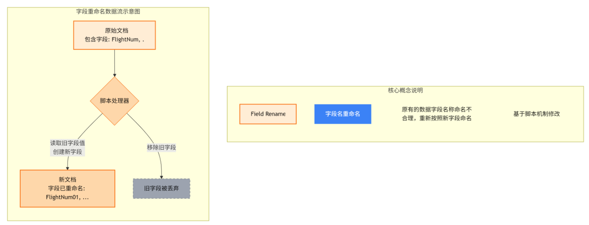

核心价值与用途​：

1.  ​字段重命名 (Field Rename)​​：
2.  当现有字段名称不符合新的命名规范、含义不清或存在冲突时，可以通过脚本创建新字段并复制值，然后删除旧字段。
3.  ​示例逻辑​：
4.  ctx.\_source.new\_field\_name = ctx.\_source.old\_field\_name; （赋值）
5.  ctx.\_source.remove("old\_field\_name"); （移除）
6.  ​数据转换与计算​：
7.  ​类型转换​：将字符串类型的数字转换为真正的数值类型。
8.  ​计算新字段​：基于现有字段计算衍生值。例如，根据单价和数量计算总价 (ctx.\_source.total = ctx.\_source.price \* ctx.\_source.quantity)。
9.  ​格式化数据​：例如，将日期字符串从一种格式转换为另一种格式。
10.  ​数据清洗与丰富​：
11.  ​条件过滤​：在脚本中加入 if 条件，甚至可以跳过某些文档的处理。
12.  ​数据丰富​：从其他上下文或通过内联代码为文档添加新信息。

最佳实践​：

1.  脚本语言​：​Painless​ 是首选，因为它安全、高效且性能良好，专为 ES 设计的。
2.  ​访问源数据​：在脚本中，通过 ctx.\_source 对象来访问和操作文档的原始字段。例如，ctx.\_source.FlightNum。
3.  ​性能考虑​：脚本执行会消耗额外的 CPU 资源。对于大数据量的重建，务必结合使用 slices（并行处理）和 requests\_per\_second（限流）来控制对集群的影响。
4.  ​测试脚本​：在生产环境执行前，务必在小型测试数据集上验证脚本逻辑的正确性。可以使用 \_update\_by\_query API 在源索引上先测试脚本效果。

DELETE kibana\_sample\_data\_flights\_002

\# 创建一个新的 Mapping 为合并后的索引

PUT kibana\_sample\_data\_flights\_002

{

"mappings": {

"dynamic": true // 允许动态添加新字段

}

}

\# 数据字段重命名

POST \_reindex

{

"conflicts": "proceed",

"source": {

"index": \[

"kibana\_sample\_data\_flights",

"kibana\_sample\_data\_flights\_001"

\],

"\_source" : \[

"FlightNum","DestCountry",

"DestCityName","OriginAirportID"

\]

},

"dest": {

"index": "kibana\_sample\_data\_flights\_002",

"op\_type": "create"

},

"script": {

"source": """

ctx.\_source.FlightNum01 = ctx.\_source.FlightNum;

ctx.\_source.remove('FlightNum');

""",

"lang": "painless"

}

}

GET kibana\_sample\_data\_flights\_002/\_search

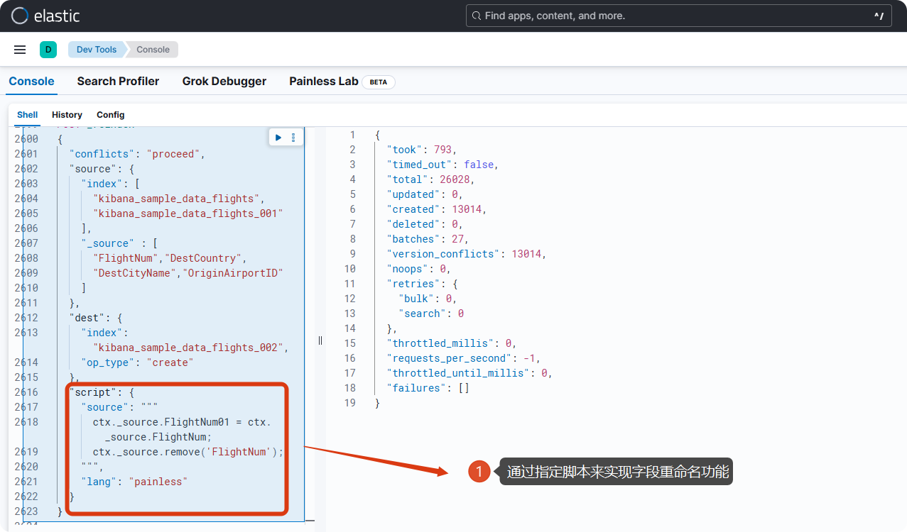

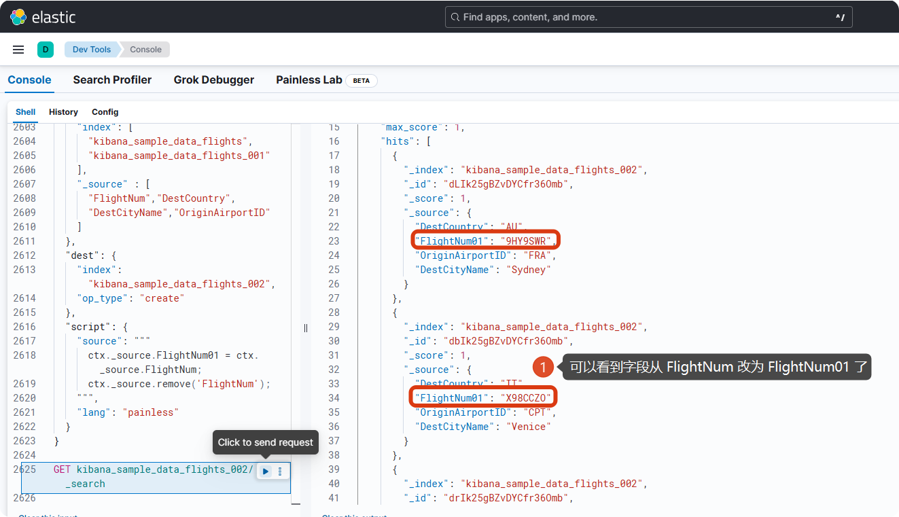

### **3.2.3.8 修改文档数据**

同上，script 参数将重建索引从一个简单的数据拷贝工具升级为一个强大的数据转换和ETL（提取、转换、加载）工具。它赋予了用户在数据迁移过程中极大的灵活性，能够应对字段重命名、数据格式转换、逻辑计算等复杂需求，是进行数据模型迭代和治理的利器。

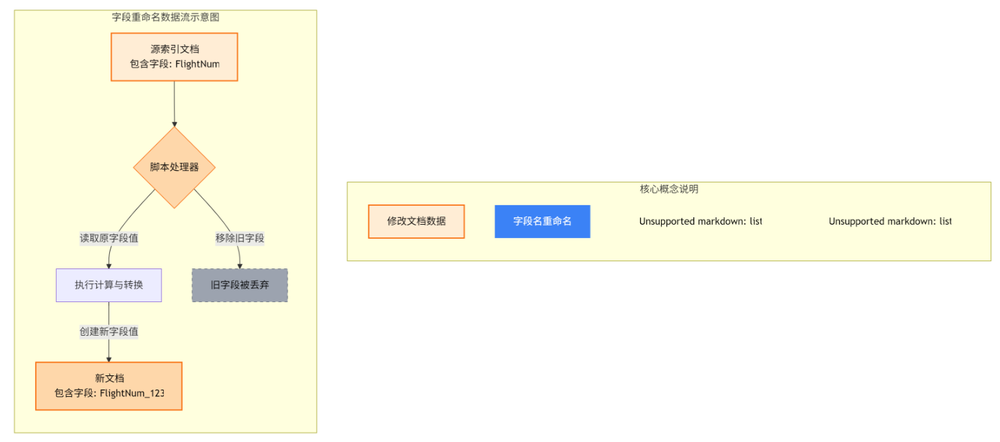

DELETE kibana\_sample\_data\_flights\_002

\# 创建一个新的 Mapping 为合并后的索引

PUT kibana\_sample\_data\_flights\_002

{

"mappings": {

"dynamic": true // 允许动态添加新字段

}

}

\# 数据字段重命名

POST \_reindex

{

"conflicts": "proceed",

"source": {

"index": \[

"kibana\_sample\_data\_flights",

"kibana\_sample\_data\_flights\_001"

\],

"\_source" : \[

"FlightNum","DestCountry",

"DestCityName","OriginAirportID"

\]

},

"dest": {

"index": "kibana\_sample\_data\_flights\_002",

"op\_type": "create"

},

"script": {

"source": """

ctx.\_source.FlightNum = ctx.\_source.DestCountry + '\_' + ctx.\_source.FlightNum;

ctx.\_source.FlightNum01 = ctx.\_source.FlightNum;

ctx.\_source.remove('FlightNum');

""",

"lang": "painless"

}

}

GET kibana\_sample\_data\_flights\_002/\_search

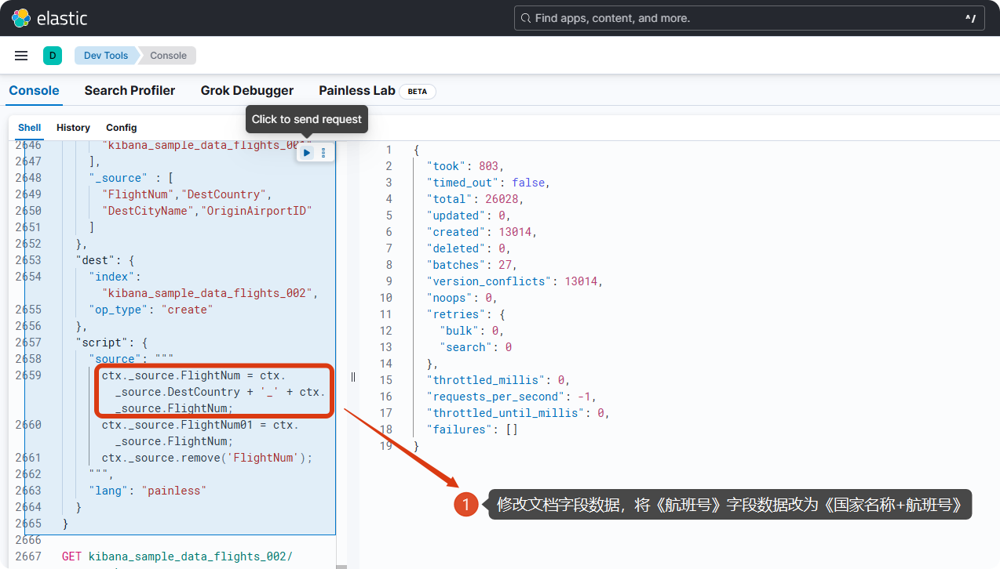

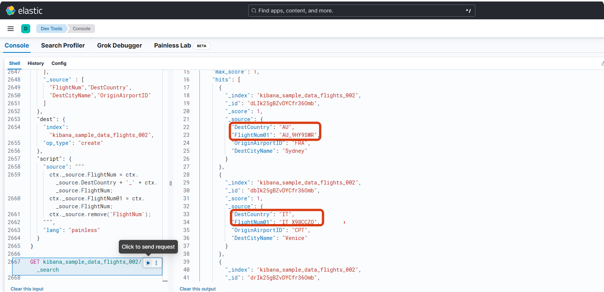

### **3.2.3.9 跨集群通信**

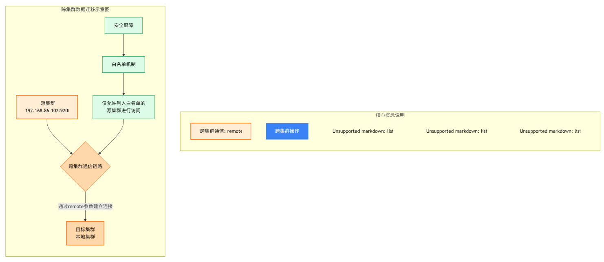

跨集群通信是 ES 提供的一种强大功能，允许一个 ES 集群（称为目标集群或本地集群）与另一个或多个远端的 ES 集群（称为源集群或远程集群）进行通信，并从中读取数据。

这使得数据迁移和查询不再受限于单个集群内部，核心机制：

1.  在 Reindex API 的 source 部分中，通过 remote 参数来指定远程集群的连接信息。
2.  其核心是 ​host​ 字段，用于提供远程集群的任意一个或多个协调节点的访问地址（例如："host": "http://192.168.86.102:9200"）。
3.  本地集群通过这个地址与远程集群建立连接，并从中拉取数据进行重建。

安全核心：跨集群白名单

这是一个安全准入机制，在目标集群上配置一个允许与之建立连接的远程集群地址列表。只有列表中的远程集群才被许可接受来自该目标集群的访问请求。

1.  ​安全性​：防止未经授权的集群随意连接并拉取数据，避免数据泄露。
2.  ​访问控制​：明确界定集群间的信任关系，是生产环境中不可或缺的安全措施。
3.  ​配置位置​：如图此白名单必须在目标集群上进行配置。这意味着需要在自己当前操作的集群上设置允许访问哪些其他集群。

核心流程：

1.  发起请求​：用户在目标集群上执行 Reindex API，并在 source 中指定了 remote 参数。
2.  ​安全检查​：目标集群首先检查该远程集群的地址是否已配置在自身的白名单内。如果不在，请求会立即被拒绝。
3.  ​建立连接​：如果安全检查通过，目标集群通过 remote.host 提供的地址与源集群建立网络连接。
4.  ​数据迁移​：目标集群从远程源集群中读取指定的数据，然后在本地进行索引重建工作。对于用户而言，整个过程就像在操作本地数据一样简单。

由于暂无多集群环境，这里就不演示了，感兴趣的老铁自行测试。

## **04 ES 索引重建之 Reindex 性能调优**

上一节，我们讲解了 Reindex 的底层设计思想及各种玩法实操，这里我们来总结下。

## **4.1 ES 索引重建之 Reindex 核心实现总结**

Reindex 可以将一个索引的数据复制到另一个已经存在的索引中，所以当索引的 Mapping 无法满足需求的时候，可以新建一个新的索引，然后将旧索引的数据迁移过去。

需要注意的是，Reindex API 并不会帮我们设置新索引的 Mapping、主分片数量、副本数量等设置，所以索引进行 Reindex 前需要自己对新索引进行设置并且 Reindex API 需要源索引的 \_source 设置被打开。当然，默认的情况下 \_source 是被打开的。

  
如果你用过 Reidnex API 来重建数据量较大的索引的话，你会发现 Reindex 的速度其实慢的很。即使是在同集群上进行 Reindex，其速度也只有几 M 每秒，更别说是跨集群 Renidex 了。

在我们进行 Reindex 调优前，先来看看 Reindex 的底层实现，正所谓知己知彼，百战不殆。

在文章开头我们说过：Reindex 会将一个索引的数据复制到另一个已经存在的索引中，那说白了就是对数据进行一读一写，而这里的读、写就是性能调优的关键！

### **4.1.1 ES 索引重建之 Reindex 读操作实现**

对于数据的读取，其实最快的是将文件直接复制到对应的索引中，但又不现实，例如，目标索引与源索引的主分片数量不一样那可怎么办？

Reindex 操作是需要数据全量读取的，而数据读取操作用的是 Scroll。Reindex 具体实现的源码是作为一个 module 引入进来的，这里不会展开太详细，具体会在源码部分再展开：

  
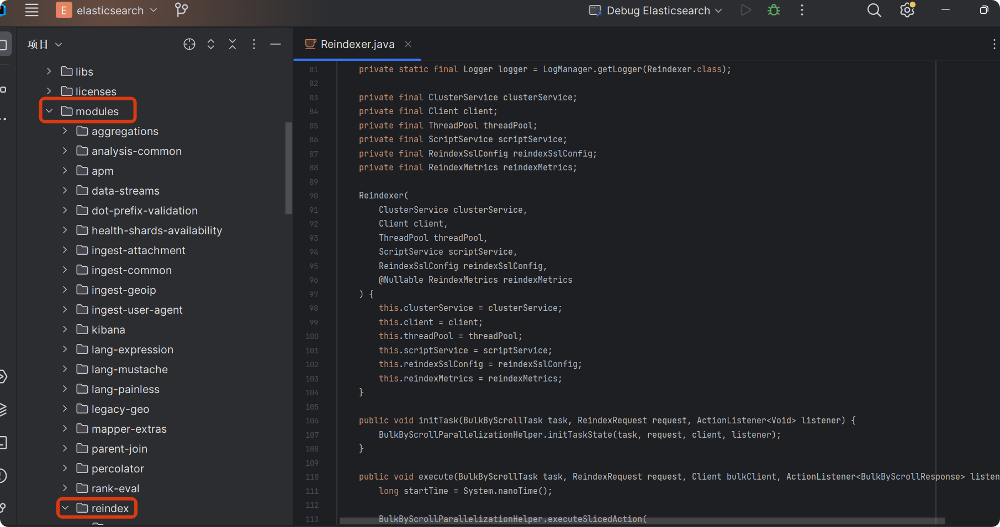

Reindex 具体实现的入口在 [TransportReindexAction#doExecute](http://%20transportreindexaction/#doExecute) 方法中：

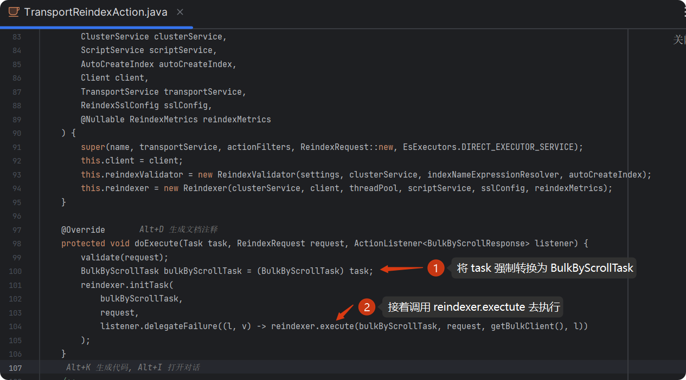

在 doExecute 中将 task 强制转换到 BulkByScrollTask，并且最后调用 [Reindexer#execute](http://reindexer/#execute) 方法：

  
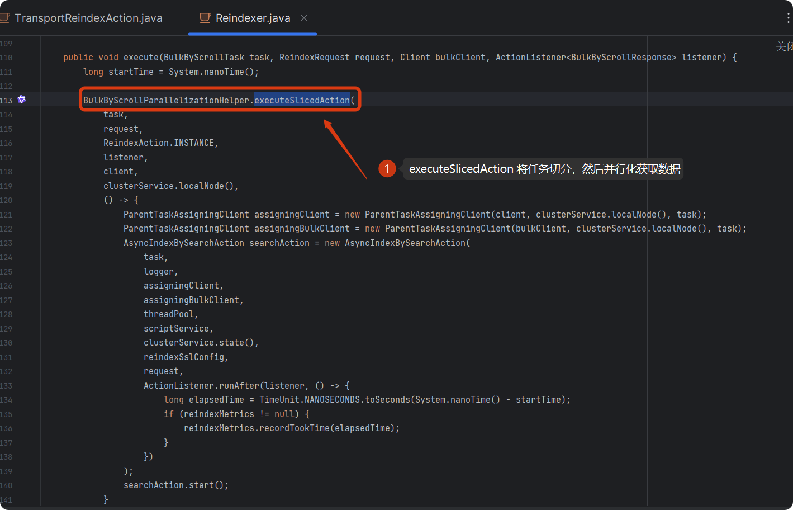

executeSlicedAction 将任务切分，然后并行化获取数据。在每个并行化的操作中，启动一个异步的 searchAction 进行数据获取。

对于任务的切分可以使用 slice 参数，在前面已经讲解过了：

  

### **4.1.2 ES 索引重建之 Reindex 写操作实现**

首先，数据写入的时候先路由到对应的节点，然后将数据写入到 Index Buffer，再写入相关记录到 Transaction Log，并且返回成功。

默认的情况下，Refresh 会每秒执行一次，将 Index Buffer 中的数据写入到文件系统中，并生成 Segment 文件。当达到触发条件时，系统还会进行 Flush 和 Merge 操作。

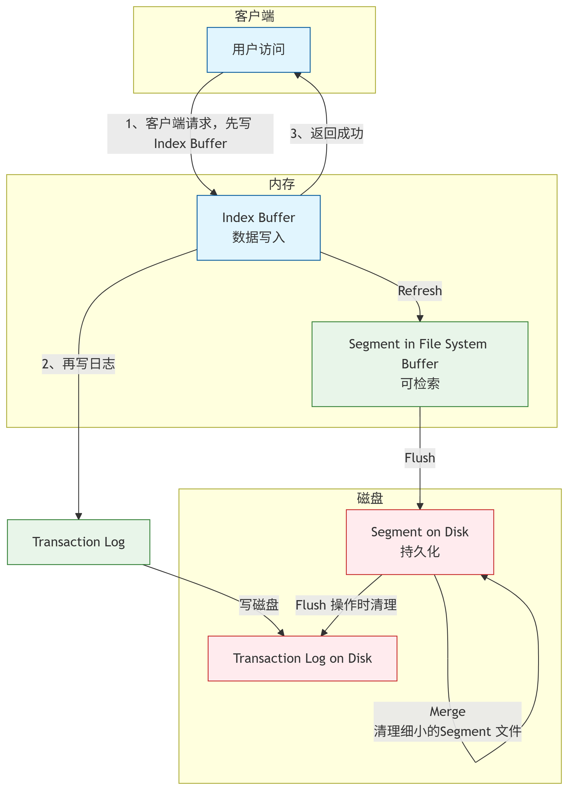

那读取出来的数据是如何发送到目标索引的呢？从 [Reindexer.AsyncIndexBySearchAction](http://reindexer.asyncindexbysearchaction/) 静态类的注释中可以看出是使用了 Bulk 请求：

  
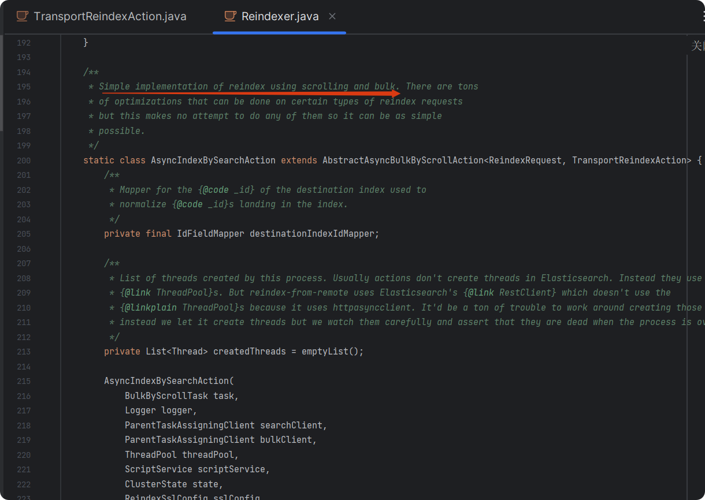

在 [AbstractAsyncBulkByScrollAction.buildBulk](http://abstractasyncbulkbyscrollaction.buildbulk/) 方法中会调用 [AsyncIndexBySearchAction.buildRequest](http://asyncindexbysearchaction.buildrequest/) 构建 BulkRequest，然后发送请求到对应的节点中进行处理。

通过 Reindex 的源码可以证实我们前面的说法，Reindex 读操作的底层实现是 Scroll，并且读任务是可以进行并行操作的，而写入操作是通过 Bulk 请求进行的。

简单总结：Reindex = Scroll 查询（读） + Bulk 写入（写）。

有了这些信息，下面我们就可以对 Reindex 进行优化，提高其执行效率了。

## **4.2 ES 索引重建之 Reindex 性能调优**

既然 Reindex 操作对数据是读写的过程，所以要提高 Reindex 的效率可以分别从读和写两个操作来进行优化。

### **4.2.1 读优化**

这里可以借助 Sliced Scroll 来并行读取数据，这种并行化操作可以提高 Reindex 的效率，并提供一种将请求分解为更小部分进行处理的方法。

  
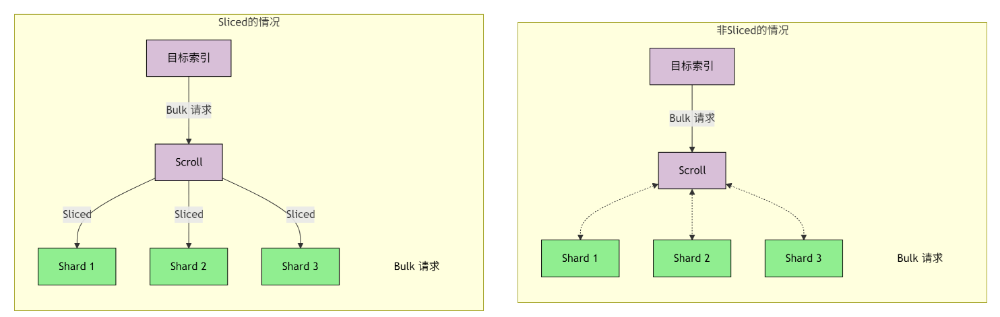

其实这块我们已经在 **3.2.3.2 数据切片** 小节已经实战过了，虽然使用 Slicing 可以提高 Reindex 的效率，但如果使用不当，效果可能会适得其反。

下面是几个 Slicing 设置的注意事项：

1.  slices 除了可以设定为数字外，slices 也可以设置为 auto，设置为 auto 表示：如果源索引是单索引，则 slices = 源索引的主分片数量值；如果源索引是多索引，则 slices = 各个源索引中最小的主分片数量值。
2.  slices 的值并不是越大越好的，过大的 slices 会影响性能。slices 的值等于源索引主分片数量值的时候效率会最高，当 slices 大于源索引主分片数量值时，不会提高效率，反而会增加开销。

总的来说，没有特定需求的情况下，slices 设置为 auto 即可。

### **4.2.2 写优化**

### **1、选择合适的 bulk 大小**

默认的情况下，Reindex 执行写入的 Bulk Size 为 1000，可以设置 size 来调整 Bulk Size，比如这里设置了 Bulk Size 为 2000：

POST \_reindex

{

"source": {

"index": "huazai\_test\_2025-08-25",

"size": 2000

},

"dest": {

"index": "huazai\_test\_2025-08"

}

}

### **2、设置目标索引副本数为 1**

减少副本数量可以提高写入的效率，在数据 Reindex 完成后，再动态修改需要的副本数，这样系统会自动创建出需要的副本数。

如下：

PUT /huazai\_test\_2025-08-25/\_settings

{

"number\_of\_replicas": 1

}

### **3、调整 index.refresh\_interval**

减少 Index Refresh 的次数可以减少生成 Segment 的数量，也减少了 Merge 的频率。默认的情况下，ES Refresh 操作会每秒进行一次，可以通过调整 [index.refresh\_interval](http://index.refresh_interval/) 的值来调整 Refresh 的时间间隔。

可以将 refresh\_interval 设置为 -1 来关闭 Refresh，当然在 Index Buffer 写满时还是会进行 Refresh 的：

PUT /huazai\_test\_2025-08-25/\_settings

{

"refresh\_interval": -1

}

> 需要注意的是，在 Reindex 完成后，需要把这个设置回原来的值。

### **4、调大 Translog Flush 间隔**

为了防止数据丢失，保证数据的可靠性，默认的情况下是每个请求 Translog 都刷盘。如果在导入数据时为了提高写入性能，可以不每个请求都对 Translog 进行刷盘。

如下：

PUT /huazai\_test\_2025-08-25/\_settings

{

"index.translog.durability":"async", \# 异步刷屏

"index.translog.sync\_interval": "240s", \# 每隔 240s 进行刷盘

"index.translog.flush\_threshold\_size": "512m" # 当 Translog 的量达到 512m 时也会触发刷盘

}

关于其他的优化，我会放到后续 ES 写入优化时在展开，这里就到此为止了。