从今天之后的一段时间内，华仔会带着大家一起来从零开始对 ElasticStack 矩阵产品进行深入剖析和项目运维实战，希望大家学完之后可以用到自己的工作中。

这是第二十一篇，本篇我将带着大家进行「**ES Java 客户端演进历史和如何选型**」。

文章汇总位置：[https://wx.zsxq.com/dweb2/index/columns/51122554151214](https://wx.zsxq.com/dweb2/index/columns/51122554151214)

## **01 前言**

在上篇中 [【ES 入门实战第二十篇】ES 8.x 向量搜索技术实现原理 & 深度实战](https://articles.zsxq.com/id_2xjwu3hp289j.html)，带着大家进行「**ES 8.x 向量搜索技术实现原理 & 深度实战**」。

今天我们来进行「**ES Java 客户端演进历史和如何选型**」。

## **02 ES官方Java 客户端演进历史**

接下来，我们来梳理下 ES Java 客户端的演进历史，其发展主线是：​从与 ES 强耦合、基于二进制协议的客户端，向轻量级、与 ES 解耦、基于标准 HTTP 协议的客户端演进。

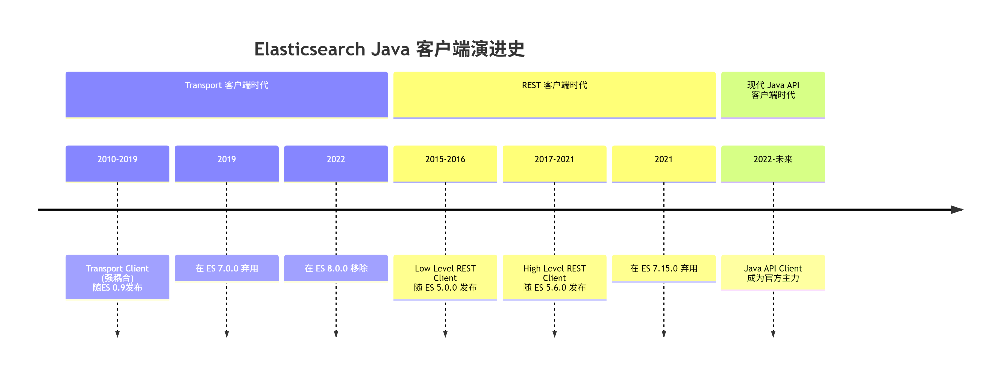

1.  Transport 客户端时代 (2010-2022)​​：特点是强耦合，与 ES 集群同版本共生死。其被弃用和移除标志着 ES 官方彻底摒弃了私有协议，拥抱开放标准。
2.  ​REST 客户端时代 (2015-2021)​​：特点是解耦，基于 HTTP 协议。Low Level提供了灵活性，High Level在此基础上提供了易用性，是一个重要的过渡阶段。
3.  ​现代 Java API 客户端时代 (2022-至今)​​：特点是类型安全与标准化。Java API Client是官方在吸取了前两代客户端的经验教训后，推出的长期解决方案。

## **2.1 上古时期 Transport 客户端**

1.  时期：Elasticsearch 早期(2010年7月27日0.9 版本) - 7.0.0 版本（2019年04月10日弃用）。
2.  协议：基于 Elasticsearch 原生的 Transport 协议 (非 HTTP，通常是 9300 端口)，该协议负责节点之间互相通信的。如果客户端的版本与集群版本不一致可能出现兼容性问题。
3.  特点：
4.  紧耦合：客户端版本必须与 Elasticsearch 服务端版本严格一致。否则极易出现兼容性问题。
5.  高性能：因为是二进制协议，序列化/反序列化效率高，网络开销相对小。
6.  集群感知：客户端知道整个集群的拓扑结构，可以直接将请求路由到正确的数据节点。
7.  消亡原因：
8.  版本绑定太死，不利于升级和维护。
9.  安全模型复杂，难以在云原生和 Kubernetes 环境中使用。
10.  Elasticsearch 官方希望将所有客户端统一到公开的 REST API 上，以实现更好的前后端解耦。
11.  状态：在 7.0 中被标记为弃用，在 8.0 版本（2022年02月11日）中完全移除。新项目绝对不应使用。

官方 API 地址：[https://www.elastic.co/guide/en/elasticsearch/client/java-api/0.90/java-api.html](https://www.elastic.co/guide/en/elasticsearch/client/java-api/0.90/java-api.html)

## **2.2 过期时期 Java Rest客户端**

为了解耦，Elasticsearch 推出了基于 HTTP 的 REST 客户端，并分为两种。

### **2.2.1 Low Level Rest Client（低级别客户端）**

1.  协议：纯 HTTP/REST。
2.  Low Level Rest 5.6 版本（2017年9月11日）单独分割出来，之前统一叫：Java REST 客户端。
3.  特点：
4.  轻量级：只负责发送 HTTP 请求和接收 HTTP 响应。
5.  无依赖：不依赖 Elasticsearch 核心库，兼容性更好。
6.  无编解码：需要用户自己将请求体组装成 JSON 字符串，并将响应体解析成对象。
7.  版本兼容性好：由于直接操作 HTTP API，可以支持多个版本的 ES 服务端。
8.  缺点​：开发效率极低，容易出错。

官方 API：[https://stackoverflow.com/questions/62340904/elasticsearch-rest-high-level-client-vs-elasticsearch-rest-client](https://stackoverflow.com/questions/62340904/elasticsearch-rest-high-level-client-vs-elasticsearch-rest-client)

> 注意：下面提到的 High Level REST 客户端已被废弃，但是：Low Level REST 客户端到 8.X 版本依然健在。

### **2.2.2 High Level Rest Client（高级别客户端）**

1.  协议：基于 Low Level Client 构建。
2.  High Level REST 客户端 5.6.0 版本（2017年9月11日）推出，已于 7.15.0 版本（2021年09月22日）废弃。
3.  特点：
4.  面向对象：提供了与旧版 Transport Client 类似的 API，将 Java 对象映射成 JSON，降低了迁移成本。
5.  易用性高：用户不需要手动拼接 JSON。
6.  版本依赖：虽然基于 HTTP，但其 API 接口与特定的 ES 服务端版本绑定。版本不匹配时，可能调用了服务端不存在的 API。
7.  ​缺点​：
8.  其 API 与 Transport Client 一脉相承，设计上存在历史包袱。
9.  虽然服务器兼容性更好，但客户端本身仍有较大的版本兼容性矩阵需要查询。
10.  在 ES 7.15 版本被标记为弃用，由新的 Java API Client 取代。

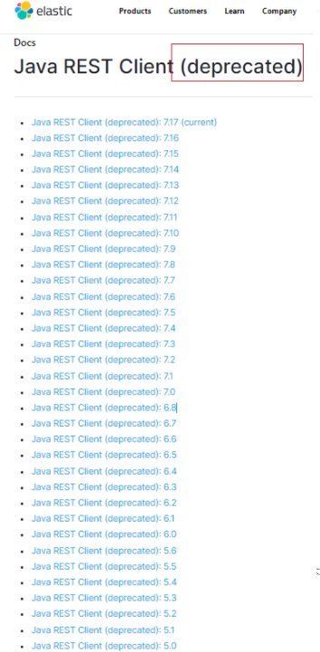

官方 API：[https://www.elastic.co/guide/en/elasticsearch/client/java-rest/5.6/java-rest-high.html](https://www.elastic.co/guide/en/elasticsearch/client/java-rest/5.6/java-rest-high.html)

### **2.2.3 High Level Rest Client 优势**

1.  优势1：代码的可维护性和可读性强。
2.  举个例子：发送请求的代码，看如下两种客户端不同写法。
3.  Low Level REST 客户端写法如下：

Request request \= new Request("GET", "/posts/\_search");

1.  High Level Rest 客户端写法如下：

SearchRequest searchRequest \= new SearchRequest("posts");

1.  可以看出，Low Level REST 方式相对“原始”、“笨拙”。
2.  使用 High Level Rest 客户端上工作就像在 Elasticsearch 的 API 层（通过 HTTP 包间接工作），而Low Level REST 客户端纯粹是在 HTTP 上工作，什么都得自己构造。
3.  优势2：更加便捷。
4.  帮助开发人员像使用 Kibana 一样关联 ES API 使用。
5.  优势3：XPack 高阶功能 High Level 自动包含，无需使用 Low Level 自己重写。

## **2.3 现代时期 Java API Client（官方推荐）**

1.  时期：7.16 版本（2021年12月8日）推出 Elasticsearch Java API Client，是目前官方的主力客户端。
2.  协议：HTTP/REST。
3.  特点：
4.  强类型：所有请求和响应对象都是根据 Elasticsearch 的 JSON API 规范自动生成的类，编译时就能发现很多错误。
5.  流畅式 Builder 模式：API 设计非常现代和友好。
6.  版本对齐：客户端版本与 ES 服务端大版本号对齐（如 8.x 客户端对应 8.x 服务端），但兼容同一大版本的早期版本。
7.  安全性内置：原生支持 TLS 和 HTTP 认证，与 Elasticsearch 8.0 的安全特性完美结合。
8.  双重许可：基于 Elastic License 和 SSPL，需要注意合规性，但大部分场景免费使用。
9.  现状：当前官方主力推荐和未来发展方向。

### **2.3.1 为什么推荐**

值得注意的是：7.17 版本的 High Level REST 客户端可以与 8.X 版本以兼容模式运行。那么为什么还要用这个新的客户端呢？

其实官方在“ElasticCC: The new Elasticsearch Java Client: getting started and behind the scenes”给出了详尽的解读。

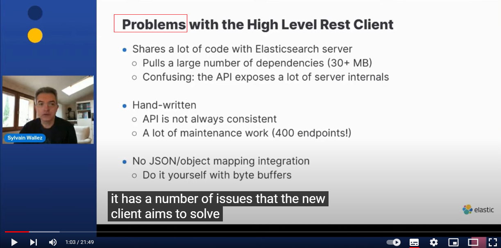

概括如下：

1.  High Level REST 客户端“太重”。
2.  相关依赖超过 30 MB，且很多都是非必要相关的。
3.  api 暴露了很多服务器内部接口。
4.  High Level REST 一致性差，仍需要大量的维护工作。
5.  High Level REST 客户端没有集成 json/object 类型映射，仍需要自己借助字节缓存区实现。

### **2.3.2 Java API Client 官方定义**

Elasticsearch Java API 客户端为所有的 Elasticsearch API 提供请求和响应处理。

它将请求处理转给 Elasticsearch Low Level REST 客户端，这也是 High Level 被废弃而 Low Level REST 客户端依然健在的原因，Low Level REST 客户端负责处理 Http 连接建立和池化、重试机制等所有传输级别的问题。

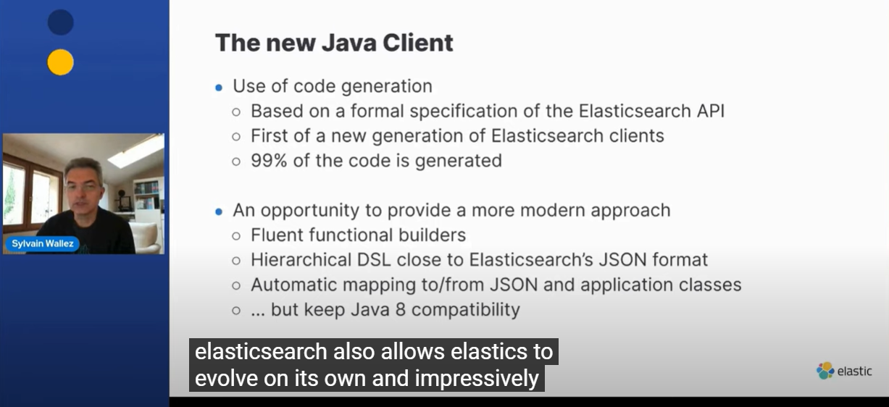

### **2.3.3 Java API Client 项目实战**

在咱们小红书 LLM 智能推荐引擎项目中就使用了这个作为我们 ES 客户端来使用：[【LLM大模型智能实战第十四篇】手把手带你实战小红书美食推荐 RAG 知识库 RocketMQ 异步解析、向量数据处理](https://articles.zsxq.com/id_rt3fnk5p20d0.html) **2.2.5.2 向量数据 ES 客户端核心代码**

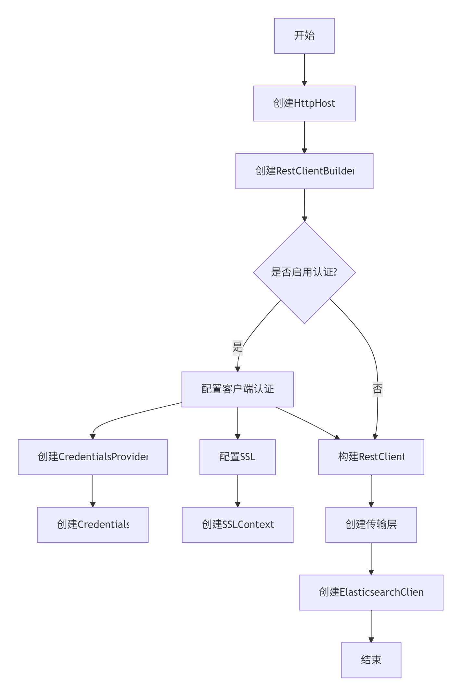

### **2.3.3.1 对象构造基于建造者模式（builder pattern）**

建造者模式（Builder Pattern）使用多个简单的对象一步一步构建成一个复杂的对象。该模式增强了客户端代码的可用性和可读性。

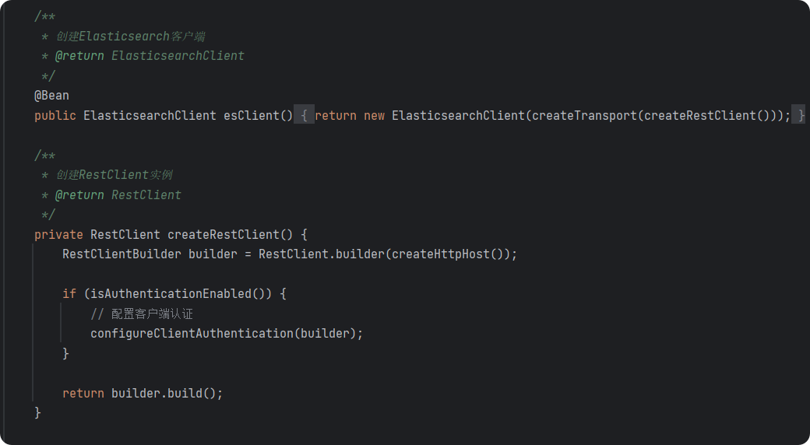

### **2.3.3.2 使用 lambda 表达式构建嵌套对象**

支持使用 lambda 构建嵌套对象，从而编写干净、富有表现力的 DSL 变得容易，分层 DSL 接近 elasticsearch 的 json 格式。

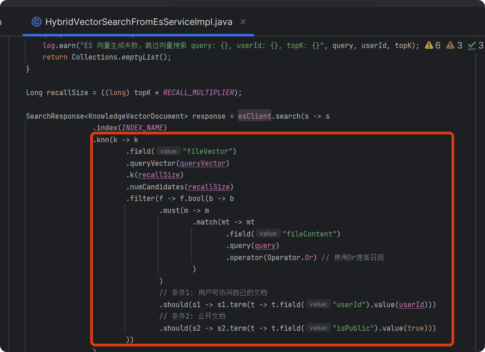

### **2.3.3.3 自动映射 Mapping**

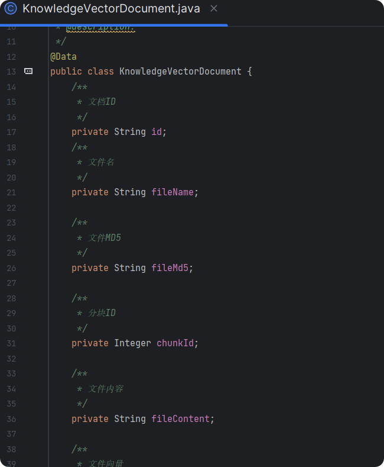

## **03 ES非官方& 社区客户端**

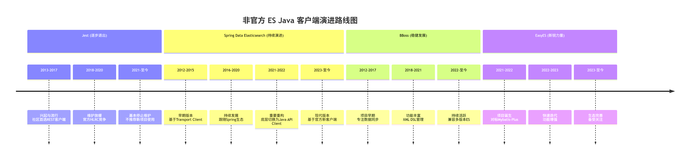

1.  两条不同的发展路径​：
2.  ​框架/生态型（Spring Data, BBoss）​​：它们不仅仅是客户端，而是提供了更高层次的抽象（如Repository模式、XML配置、数据同步工具）。它们的生命周期与特定技术栈（Spring）或特定需求（数据同步）绑定，因此生命力顽强。
3.  ​工具型（Jest）​​：主要目的是提供一个更好的API来替代官方客户端的不足。一旦官方客户端弥补了短板（如推出了好用的REST客户端），它的存在价值就会急剧下降，这正是Jest的结局。
4.  ​​“国产双雄”的差异化竞争​：
5.  ​BBoss​：走的是功能强大、企业级路线。它的核心优势在于数据同步和XML管理复杂DSL，解决的是特定痛点，因此有非常稳固的适用场景。
6.  ​EasyES​：走的是开发效率极致化路线。它精准地瞄准了大量使用MyBatis/MyBatis-Plus且对编写DSL感到头疼的开发者，用熟悉的Lambda查询和链式API来降低学习和使用成本，是“新锐”力量的代表。
7.  ​Spring Data Elasticsearch 的“蜕变”​​：
8.  它的演进史就是一部“底层客户端适配史”。它通过不断更换底层实现来保持自身的活力和先进性。最新版本果断抛弃自己维护的实现，全面拥抱官方的 Java API Client，这是一种非常明智的策略，确保了框架的长期稳定性。

## **3.1 Jest 客户端**

1.  时期：2017年左右还比较新颖，在官方 REST Client 出现之前，是社区最流行的 HTTP 客户端。
2.  特点：易用性不错，功能齐全。
3.  现状：随着官方 REST Client 的成熟，Jest 已基本完成其历史使命，不推荐在新项目中使用。

官方地址：[https://github.com/searchbox-io/Jest](https://github.com/searchbox-io/Jest)

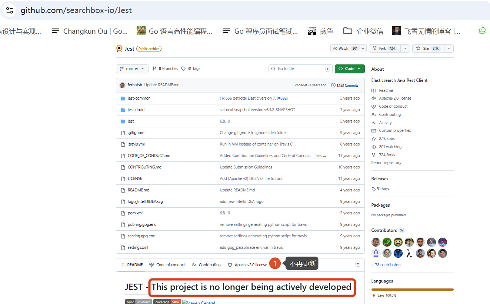

## **3.2 BBoss客户端(国产)**

1.  定位：一个功能丰富的国产开源 ES 操作框架，而不仅仅是一个客户端。它集数据同步、ETL 和 ES 操作于一体的强大框架。
2.  特点：
3.  不止是客户端：它是一个强大的数据同步工具，可以方便地将数据库、MQ 等数据源与 ES 进行同步。
4.  高性能：在数据写入和提取方面有深度优化。
5.  配置化：很多操作可以通过 XML 配置文件完成。
6.  提供了类似 MyBatis 的 XML/注解方式来配置 DSL 查询，将查询语句与 Java 代码分离，管理复杂查询非常方便。
7.  适用场景：需要大量数据导入/导出、ETL 处理、流式数据同步到 ES 的场景。
8.  现状​：非常活跃，在国内有较多应用。如果你需要强大的数据同步功能或偏好 XML 管理 DSL，它是一个很好的选择。

官方地址：[https://esdoc.bbossgroups.com/#/](https://esdoc.bbossgroups.com/#/)

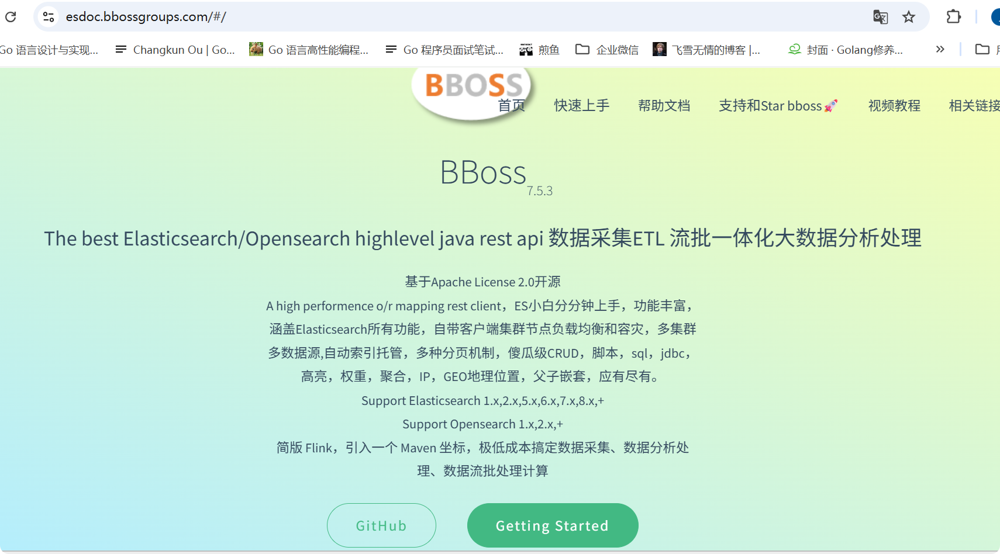

从上图可以看出其能适应 ES 1.X——8.X 所有版本的 java rest 客户端。

### **3.2.1 BBoss 是什么**

bboss 基于Apache License开源协议，由开源社区bboss发起和维护，主要由以下四部分构成：

1.  **[Elasticsearch Highlevel Java Restclient](https://esdoc.bbossgroups.com/#/quickstart)** ， 一个高性能高兼容性的Elasticsearch/Opensearch java客户端框架
2.  **[数据采集同步ETL](https://esdoc.bbossgroups.com/#/db-es-tool)** ，一个基于java语言实现数据采集作业的强大ETL工具，提供丰富的输入插件和输出插件，可以基于插件规范轻松扩展新的输入插件和输出插件；支持数据向量化处理
3.  **[流批一体化计算框架](https://esdoc.bbossgroups.com/#/etl-metrics)**，提供灵活的数据指标统计计算流批一体化处理功能的简易框架，可以结合数据采集同步ETL工具，实现数据流处理和批处理计算，亦可以独立使用；计算结果可以保存到各种关系数据库、分布式数据仓库Elasticsearch、Clickhouse等，特别适用于数据体量和规模不大的企业级数据分析计算场景，具有成本低、见效快、易运维等特点，助力企业降本增效。
4.  **[通用分布式作业调度工作流](https://esdoc.bbossgroups.com/#/jobworkflow)**，提供通用流程编排模型，可以将各种需要按照先后顺序执行的任务编排成工作流，进行统一调度执行，譬如数据采集作业任务、流批处理作业任务、业务办理任务、充值缴费任务以及大模型推理任务等，按照顺序编排成工作流程；默认提供了数据交换和流批处理作业节点、通用函数节点以及复合类型节点（串/并行执行），可以按需自定义扩展新的流程节点、远程服务执行节点；可以为流程节点设置条件触发器，控制流程节点是否执行；通过流程上下文和节点上下文在节点间传递和共享参数；通过设置流程执行和节点执行监听器，维护流程和节点执行参数，采集和获取流程、节点执行监控指标以及执行异常信息。

bboss采用模块化管理以上四部分，模块之间依赖关系如下：

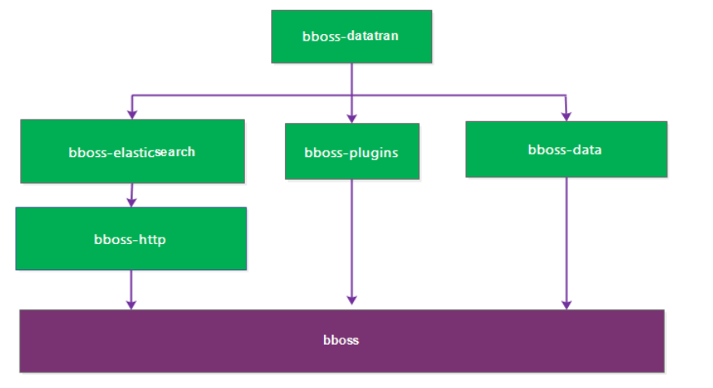

### **3.2.2 BBoss 高性能客户端**

[bboss Elasticsearch Highlevel Java Restclient](https://esdoc.bbossgroups.com/#/quickstart) 是一套基于query dsl语法操作和访问分布式搜索引擎Elasticsearch/Opensearch的o/r mapping高性能开发库。

官方文档：

[https://esdoc.bbossgroups.com/#/quickstart](https://esdoc.bbossgroups.com/#/quickstart)

[https://esdoc.bbossgroups.com/#/document-crud](https://esdoc.bbossgroups.com/#/document-crud)

  
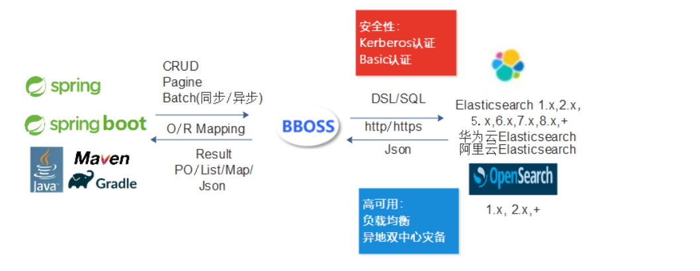

### **3.2.2.1 主要功能特色**

学习成本低，上手快，代码简洁，安全高效，客户端负载容灾，兼容性好，易于集成。

1.  ORM和DSL二者兼顾，类mybatis方式操作ElasticSearch,提供丰富的开发[API](https://esdoc.bbossgroups.com/#/document-crud)和[开发Demo](https://esdoc.bbossgroups.com/#/Elasticsearch-demo)
2.  采用[XML文件配置和管理检索dsl脚本](https://esdoc.bbossgroups.com/#/development?id=_53-dsl%e9%85%8d%e7%bd%ae%e8%a7%84%e8%8c%83)，简洁而直观；提供丰富的逻辑判断语法,在dsl脚本中可以使用变量、脚本片段、foreach循环、逻辑判断、注释；基于[可扩展DSL配置管理机制](https://esdoc.bbossgroups.com/#/db-dsl)可以非常方便地实现数据库、redis等方式管理dsl;配置管理的dsl语句支持在线修改、自动热加载，开发和调试非常方便
3.  提供Elasticsearch集群节点自动负载均衡和容灾恢复机制，Elasticsearch节点断连恢复后可自动重连，高效可靠
4.  提供Elasticsearch集群节点[自动发现机制](https://esdoc.bbossgroups.com/#/development?id=_23-%e9%9b%86%e7%be%a4%e8%8a%82%e7%82%b9%e8%87%aa%e5%8a%a8%e5%8f%91%e7%8e%b0discover%e6%8e%a7%e5%88%b6%e5%bc%80%e5%85%b3)：自动发现Elasticsearch服务端节点增加和下线操作并变更客户端集群可用节点地址清单
5.  提供[http 连接池管理](https://esdoc.bbossgroups.com/#/development?id=_26-http%e5%8d%8f%e8%ae%ae%e9%85%8d%e7%bd%ae)功能，提供精细化的http连接池参数配置管理
6.  支持在应用中[访问和操作多个Elasticsearch集群](https://esdoc.bbossgroups.com/#/development?id=_52-%e5%a4%9aelasticsearch%e6%9c%8d%e5%8a%a1%e5%99%a8%e9%9b%86%e7%be%a4%e6%94%af%e6%8c%81)，每个Elasticsearch集群的版本可以不同
7.  支持基于[X-Pack](https://www.elastic.co/cn/products/x-pack)和searchguard以及Kerberos三种[安全认证机制](https://esdoc.bbossgroups.com/#/development?id=_21-es%e6%9c%8d%e5%8a%a1%e5%99%a8%e8%b4%a6%e5%8f%b7%e5%92%8c%e5%8f%a3%e4%bb%a4%e9%85%8d%e7%bd%ae)
8.  支持[Elasticsearch-SQL-ORM](https://esdoc.bbossgroups.com/#/Elasticsearch-SQL-ORM)和[Elasticsearch-JDBC](https://esdoc.bbossgroups.com/#/Elasticsearch-JDBC)
9.  提供高效的[BulkProcessor处理机制](https://esdoc.bbossgroups.com/#/bulkProcessor)
10.  提供按时间日期[ES历史数据清理工具](https://esdoc.bbossgroups.com/#/elasticsearch-indexclean-task)

### **3.2.2.2 典型应用场景**

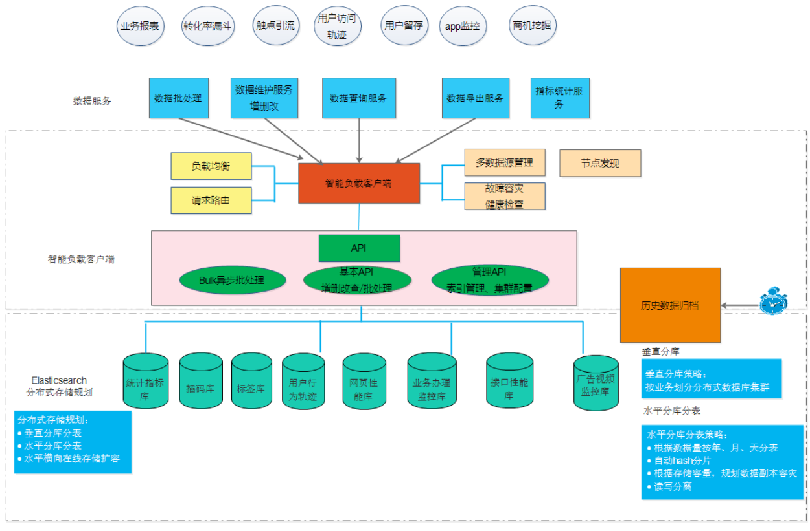

### **3.2.2.3 数据采集同步 ETL 及流批一体化计算框架**

官方文档：

[https://esdoc.bbossgroups.com/#/db-es-tool](https://esdoc.bbossgroups.com/#/db-es-tool)

[https://esdoc.bbossgroups.com/#/etl-metrics](https://esdoc.bbossgroups.com/#/etl-metrics)

[bboss插件使用指南](https://esdoc.bbossgroups.com/#/datatran-plugins)

[数据采集&流批一体化计算案例大全](https://esdoc.bbossgroups.com/#/bboss-datasyn-demo)

[数据采集同步ETL](https://esdoc.bbossgroups.com/#/db-es-tool)以及[流批一体化计算](https://esdoc.bbossgroups.com/#/etl-metrics)框架，基于灵活的插件体系结构，提供数据采集、数据清洗转换处理和数据入库以及数据指标统计计算流批一体化处理功能，提供丰富的输入插件和输出插件，可以基于插件规范轻松扩展新的输入插件和输出插件：

  
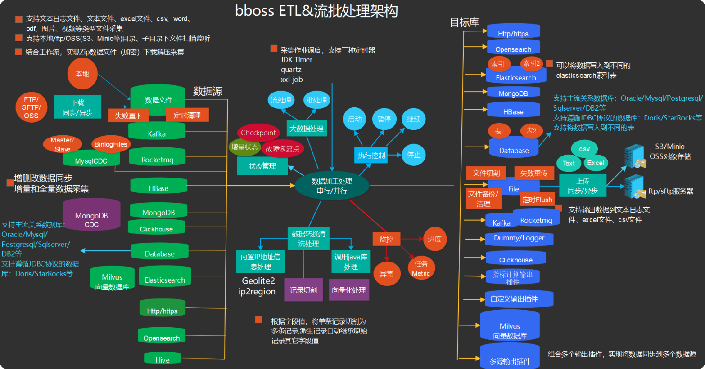

### **3.2.2.4 数据采集 ETL**

[数据采集同步ETL](https://esdoc.bbossgroups.com/#/db-es-tool)以及[流批一体化计算](https://esdoc.bbossgroups.com/#/etl-metrics)作业分为作业配置态和运行态，作业可以独立调度运行，亦可以嵌入到应用中运行，同时也可以和各种主流的调度引擎（quartz、xxl-job等）结合运行：

  
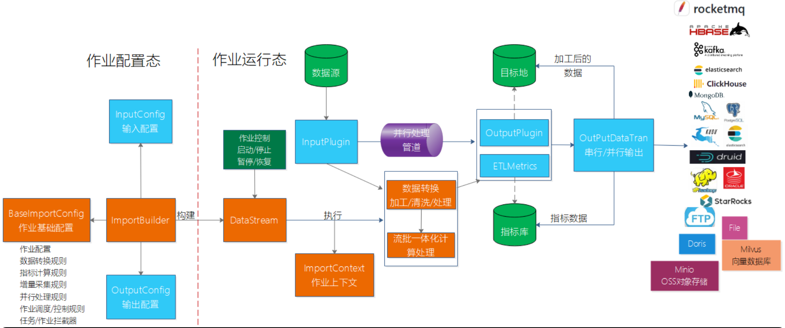

### **3.2.2.5 典型应用案例--互联网用户行为分析监控**

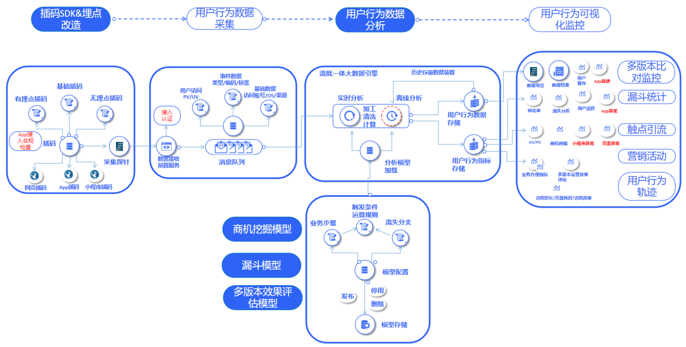

### **3.2.2.6 通用作业调度工作流**

通用分布式作业调度工作流，提供通用轻量级、高性能流程编排模型，可将各种各样、不同类型的任务编排成工作流，进行统一调度执行，譬如数据采集作业任务、流批处理作业任务、业务办理任务、充值缴费任务以及大模型推理任务等按顺序编排成工作流。

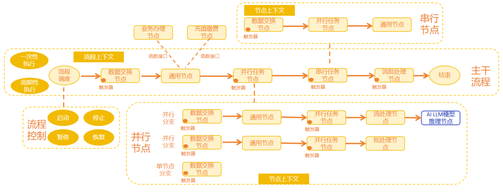

## **3.3 Spring Data ES 客户端**

1.  定位：Spring Data 生态的一部分，旨在提供类似于 Spring Data JPA 的 Repository 抽象层。
2.  特点：
3.  声明式数据访问：通过定义接口，自动生成查询实现。
4.  与 Spring 生态无缝集成：非常适合 Spring Boot 项目。
5.  底层可切换：其底层实现经历了 TransportClient -> High Level REST Client -> Java API Client 的变迁。最新版本（如 5.x+）默认使用官方的 Java API Client。
6.  对象映射：强大的 @Document、@Field 等注解，实现对象与 ES 文档的映射, @Query注解编写 DSL。
7.  现状​：​非常活跃。如果你的项目深度集成 Spring Boot/Spring Cloud 生态，并且你习惯 JPA 风格的 Repository 模式，这是最自然的选择。

官方文档：[https://docs.spring.io/spring-data/elasticsearch/reference/](https://docs.spring.io/spring-data/elasticsearch/reference/)

最新版本为：Spring Data Elasticsearch 5.5.x，支持 Elasticsearch 8.18.8 版本。[https://docs.spring.io/spring-data/elasticsearch/reference/elasticsearch/versions.html](https://docs.spring.io/spring-data/elasticsearch/reference/elasticsearch/versions.html)

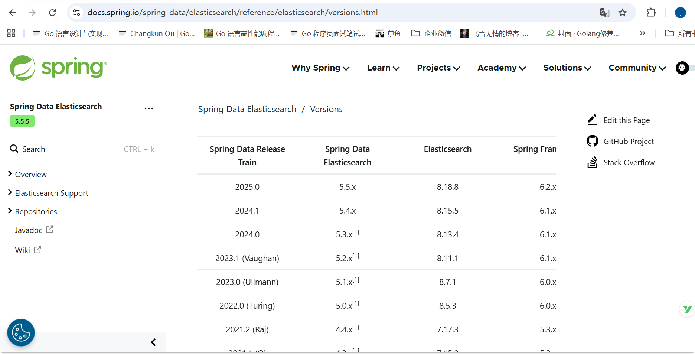

## **3.4 Easy-ES 客户端**

1.  定位：一款国产的、对标 Mybatis-Plus 的 Elasticsearch ORM 框架。
2.  特点：
3.  极致易用：通过 Lambda 表达式查询方式，几乎无需编写 DSL。实现近乎 SQL 的查询体验，开发效率极高。
4.  自动索引管理：可以根据 Entity 自动创建和管理索引及映射。
5.  功能丰富：内置了数据同步、分词器、加权、索引自动托管等高级功能的便捷封装。
6.  兼容性好：底层兼容官方 RestClient 和 Spring Data Elasticsearch。
7.  现状​：​非常活跃。如果你来自 MyBatis-Plus 背景，或者极度厌恶手写 DSL，希望用类似 MP 的方式操作 ES，EasyES 是不二之选。其底层兼容官方的 RestHighLevelClient 和 Java API Client。

官方地址：[https://www.easy-es.cn/](https://www.easy-es.cn/)

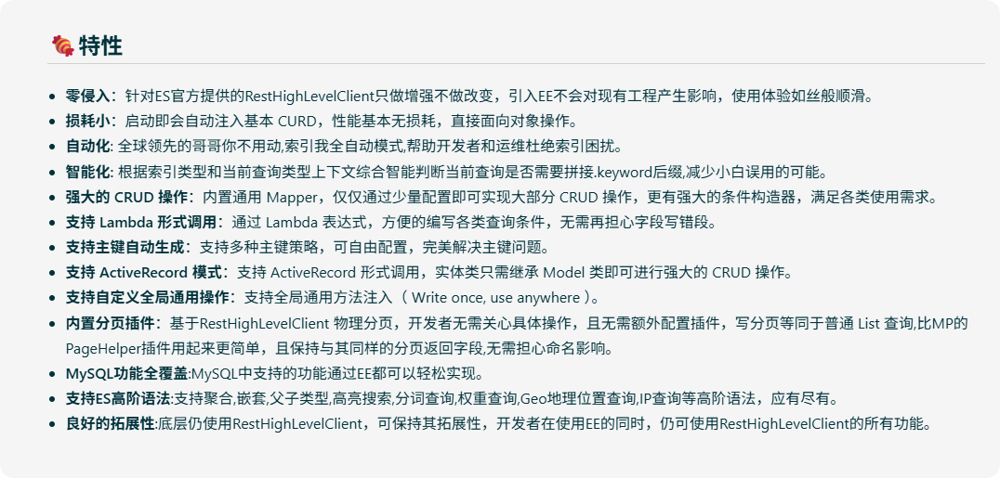

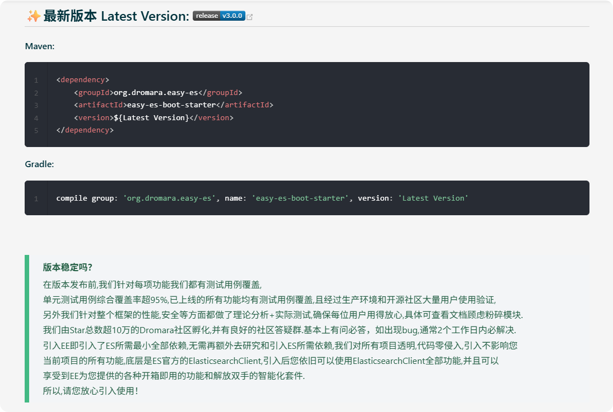

## **04 如何选型**

## **4.1 各框架对比**

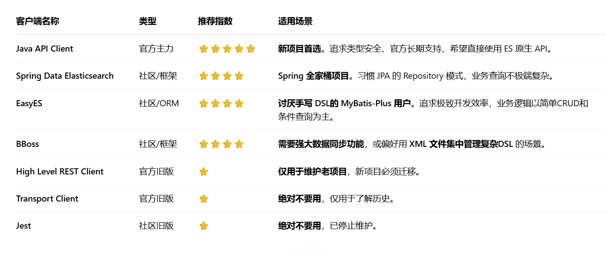

## **4.2 选型决策**

为了更直观地帮助你选择，可以参考下面的决策流程图：

  
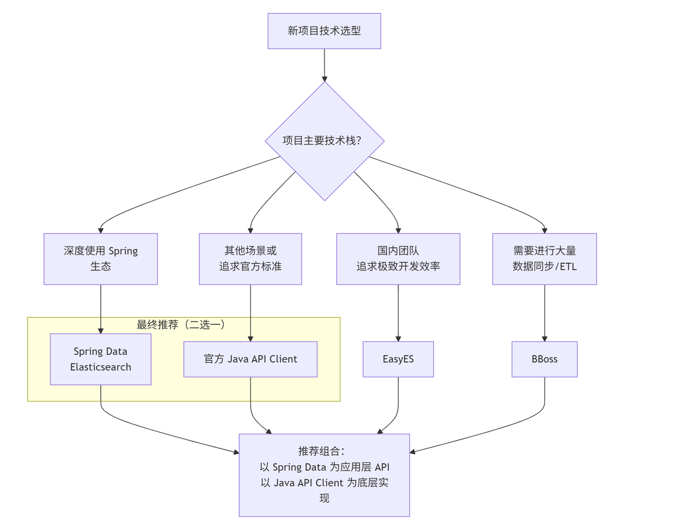

### **4.2.1 选型关注点**

1.  Elasticsearch 集群的版本。
2.  历史版本的兼容性问题。
3.  未来升级版本、扩展性问题。
4.  所选型的客户端是否更新及时，能适配将来的版本。

### **4.2.2 选型总结**

1.  首选确定技术栈偏好：
2.  如果是典型的 Spring 项目，Spring Data Elasticsearch 是最自然的选择。
3.  如果是国内团队，且非常喜欢 MyBatis-Plus 的简单快捷风格，EasyES 会极大地提升你们的开发幸福感。
4.  如果核心需求是数据同步和 ETL，BBoss 是专业对口的工具。
5.  通用场景与最佳实践：
6.  对于没有特殊偏好的新项目，官方 Java API Client 是最安全、最面向未来的选择。
7.  一个经典的组合是：在应用层使用 Spring Data Elasticsearch 的 Repository 进行快速开发，而 Spring Data 的底层则配置为使用 官方 Java API Client。这既享受了 Spring 生态的便利，又获得了官方客户端的性能和支持。
8.  最终建议：
9.  新项目：
10.  在 Spring Data Elasticsearch (底层用 Java API Client) 和 官方 Java API Client 之间选择。前者开发更快，后者控制力更强。
11.  如果是重度 Spring 用户，选择 ​Spring Data Elasticsearch；如果是 MyBatis-Plus 用户且讨厌 DSL，选择 ​EasyES。
12.  存量项目：
13.  如果还在用 TransportClient 或 High Level REST Client，制定计划迁移到 Java API Client。
14.  如果用的是 Jest，评估稳定性，若无问题可继续使用，但新功能建议迁移到 Java API Client。