从今天之后的一段时间内，华仔会带着大家一起来从零开始对 ElasticStack 矩阵产品进行深入剖析和项目运维实战，希望大家学完之后可以用到自己的工作中。

这是第二十三篇，本篇我将带着大家进行「**ES 8.x 线程池、队列、热点线程实操**」。

文章汇总位置：[https://wx.zsxq.com/dweb2/index/columns/51122554151214](https://wx.zsxq.com/dweb2/index/columns/51122554151214)

## **01 前言**

在上篇中 [【ES 入门实战第二十二篇】ES 8.x 缓存类型、应用场景、设置实操](https://articles.zsxq.com/id_7tfa9gqw4xbe.html)，带着大家进行「**ES 8.x 缓存类型、应用场景、设置实操**」。

今天我们来进行「**ES 线程池、队列、热点线程实操**」。

##   
**02 ES 8.x 线程池&队列架构设计**

Elasticsearch 使用线程池（Thread pool ）来管理请求并优化集群中每个节点上的资源使用。

## **2.1 ES 8.x 线程池用途**

Elasticsearch中主要的线程池有：

1.  搜索线程池（search）：处理搜索请求。
2.  索引线程池（index）：处理索引文档的请求。
3.  写入线程池（write）：处理索引/删除/更新请求。
4.  查询线程池（get）：处理实时的GET请求。
5.  分析线程池（analyze）：处理分析请求。
6.  批量线程池（bulk）：处理批量操作。
7.  刷新线程池（refresh）：处理刷新操作，使文档可见。
8.  其他线程池如：merge（段合并）、snapshot（快照）等。

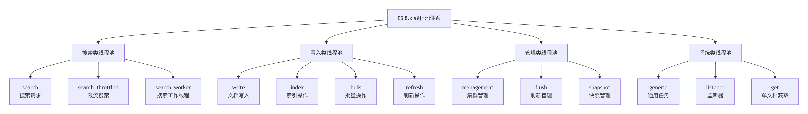

通过运行以下命令可以看到线程池全貌：

\# 线程池分类

GET /\_cat/thread\_pool/?v&h=id,name,active,rejected,completed,size,type&pretty&s=type

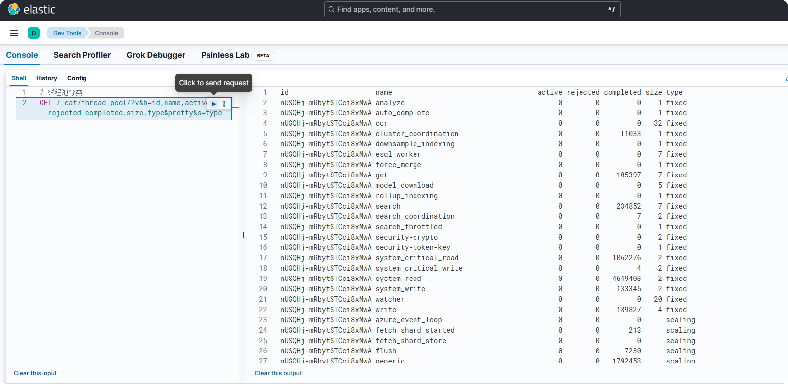

其中：

1.  name：代表某一种线程池（写入、检索、刷新或其他）。
2.  type：代表线程数类型。

通过运行上面的命令可以看到每个节点都有许多不同的线程池、线程池的大小和类型，还可以看到哪些节点拒绝了操作。

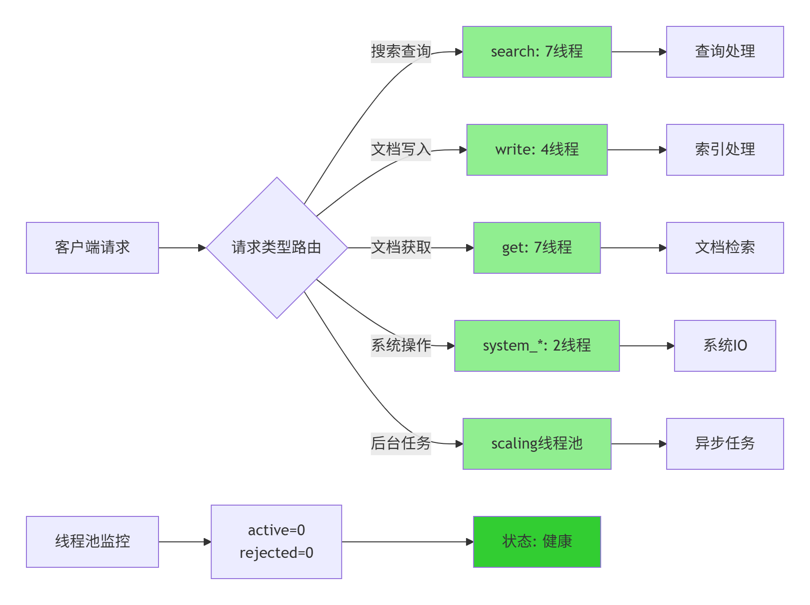

## **2.2 ES 8.x 线程池分类**

根据上面命令结果得知：整个线程池主要分为两大类，每种类型负责处理不同类型的操作。

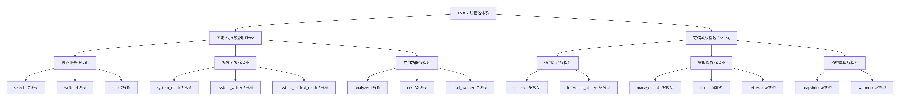

### **2.2.1 固定大小线程池（Fixed）**

固定大小的线程池，具有固定数量的线程，通过size参数设置。可以设置队列大小（queue\_size）来缓冲请求（每个线程池都有自己的队列，用于存放待处理的任务），如果队列已满，请求将被拒绝。

1.  ​search: 7个线程，已完成234852个任务，当前无活动任务，无拒绝任务
2.  ​write: 4个线程，已完成189827个任务，当前无活动任务，无拒绝任务
3.  ​get: 7个线程，已完成105397个任务，当前无活动任务，无拒绝任务
4.  ​system\_read: 2个线程，已完成4649403个任务，当前无活动任务，无拒绝任务
5.  ​system\_write: 2个线程，已完成133345 个任务，当前无活动任务，无拒绝任务
6.  其他固定大小线程池：如analyze、ccr、force\_merge等，当前均无活动任务

### **2.2.2 可缩放线程池（Scaling）**

可伸缩的线程池，线程数在min和max之间动态调整。当负载增加时，线程数会增加到max，当负载减少时，线程数会减少到min。

1.  ​generic: 已完成1792453个任务，当前无活动任务
2.  ​management: 已完成4833772个任务，当前有1个活动任务
3.  ​refresh: 已完成17175755个任务，当前无活动任务
4.  ​inference\_utility: 已完成6511761个任务，当前无活动任务
5.  其他可缩放线程池：如flush、snapshot、warmer等，当前均无活动任务

## **2.3 关键线程池工作负载**

根据结果数据，单节点的集群非常健康​：

1.  ✅ ​所有线程池active=0​：无阻塞任务
2.  ✅ ​所有线程池rejected=0​：无请求被拒绝
3.  ✅ ​高completed计数​：系统处理能力良好
4.  ✅ ​合理的线程分配​：关键业务有足够线程资源

## **2.4 线程池工作模型**

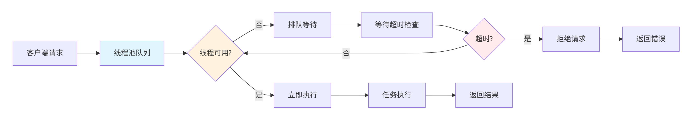

主要线程池配置参数:

## **2.5 线程池状态&详情&统计实操**

### **2.5.1 获取所有线程池状态**

### **1、查询核心目标**

下面示例查询的目标是：主要用于监控 ES节点中各个线程池的运行状态和负载情况。线程池是ES 处理各种操作的核心组件，通过监控可以了解系统资源使用情况和性能瓶颈。

\# 查看所有线程池状态

GET /\_cat/thread\_pool?v&s=name

node\_name name active queue rejected

40fe6df21df1 analyze 0 0 0

40fe6df21df1 auto\_complete 0 0 0

40fe6df21df1 azure\_event\_loop 0 0 0

40fe6df21df1 ccr 0 0 0

40fe6df21df1 cluster\_coordination 0 0 0

40fe6df21df1 downsample\_indexing 0 0 0

40fe6df21df1 esql\_worker 0 0 0

40fe6df21df1 fetch\_shard\_started 0 0 0

40fe6df21df1 fetch\_shard\_store 0 0 0

40fe6df21df1 flush 0 0 0

40fe6df21df1 force\_merge 0 0 0

40fe6df21df1 generic 0 0 0

40fe6df21df1 get 0 0 0

40fe6df21df1 inference\_utility 0 0 0

40fe6df21df1 management 1 0 0

40fe6df21df1 ml\_datafeed 0 0 0

40fe6df21df1 ml\_job\_comms 0 0 0

40fe6df21df1 ml\_native\_inference\_comms 0 0 0

40fe6df21df1 ml\_utility 0 0 0

40fe6df21df1 model\_download 0 0 0

40fe6df21df1 profiling 0 0 0

40fe6df21df1 refresh 0 0 0

40fe6df21df1 repository\_azure 0 0 0

40fe6df21df1 rollup\_indexing 0 0 0

40fe6df21df1 search 0 0 0

40fe6df21df1 search\_coordination 0 0 0

40fe6df21df1 search\_throttled 0 0 0

40fe6df21df1 searchable\_snapshots\_cache\_fetch\_async 0 0 0

40fe6df21df1 searchable\_snapshots\_cache\_prewarming 0 0 0

40fe6df21df1 security-crypto 0 0 0

40fe6df21df1 security-token-key 0 0 0

40fe6df21df1 snapshot 0 0 0

40fe6df21df1 snapshot\_meta 0 0 0

40fe6df21df1 system\_critical\_read 0 0 0

40fe6df21df1 system\_critical\_write 0 0 0

40fe6df21df1 system\_read 0 0 0

40fe6df21df1 system\_write 0 0 0

40fe6df21df1 warmer 0 0 0

40fe6df21df1 watcher 0 0 0

40fe6df21df1 write 0 0 0

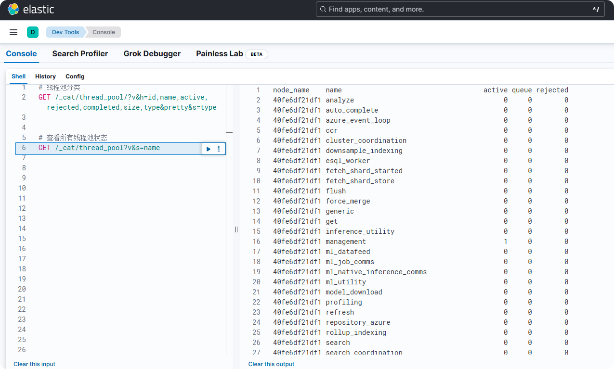

### **2、字段含义详解**

当前状态分析:

1.  ✅ 健康状态评估：
2.  负载极低：所有线程池active为0或1，队列为空
3.  无压力：rejected为0，无任务被拒绝
4.  系统空闲：大部分线程池处于闲置状态
5.  ⚠️ 唯一活跃线程：
6.  management线程池有1个活跃线程，可能是集群管理操作

### **3、底层架构设计**

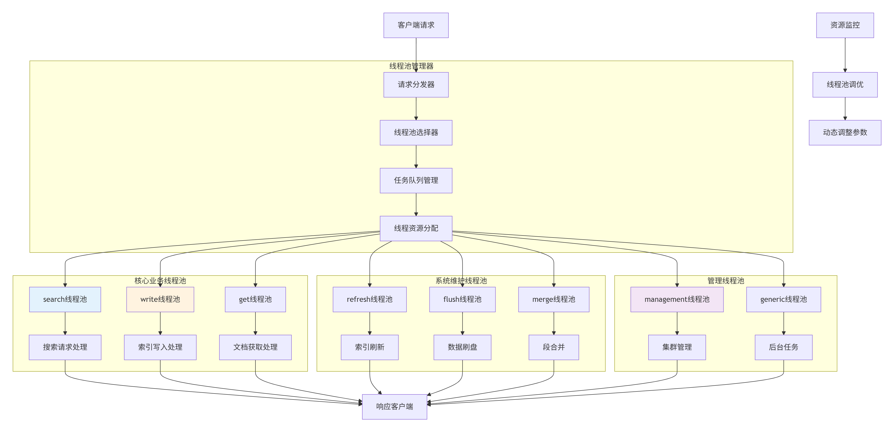

### **4、执行流程**

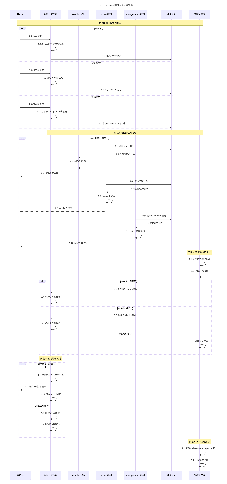

### **2.5.2 查询特定线程池详情**

### **1、查询核心目标**

下面示例查询的目标是：获取ES节点中特定线程池（search和write）的详细配置信息。与/\_cat/thread\_pool提供的运行时状态不同，这个接口显示的是线程池的静态配置参数。

\# 查看特定线程池详情

GET /\_nodes/thread\_pool?filter\_path=\*\*.thread\_pool.search,\*\*.thread\_pool.write

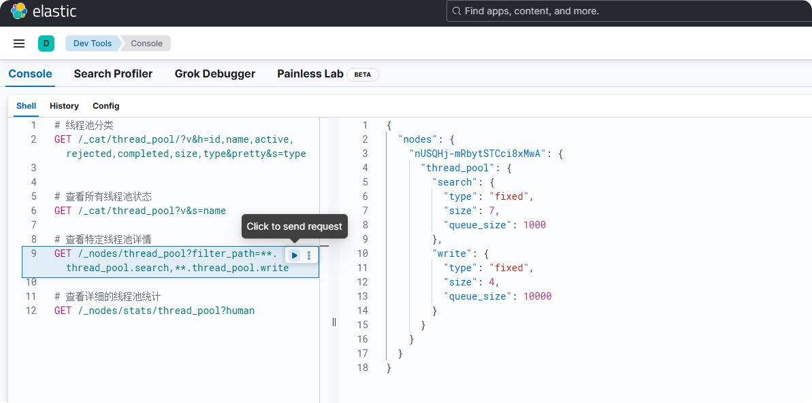

### **2、字段含义详解**

### **3、配置深度分析**

1.  Search线程池配置

search:

type: "fixed" \# 固定大小线程池

size: 7 \# 7个搜索线程

queue\_size: 1000 \# 最多排队1000个搜索请求

1.  Write线程池配置

write:

type: "fixed" \# 固定大小线程池

size: 4 \# 4个写入线程

queue\_size: 10000 \# 较大队列，避免写入阻塞

1.  配置合理性评估
2.  ✅ Search线程较多(7个)：适合搜索密集型场景
3.  ✅ Write队列较大(10000)：写入操作可以排队等待
4.  ✅ Fixed类型：性能可预测，资源控制精确

### **4、底层架构设计**

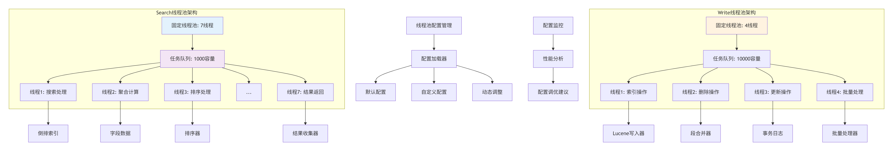

### **5、执行流程**

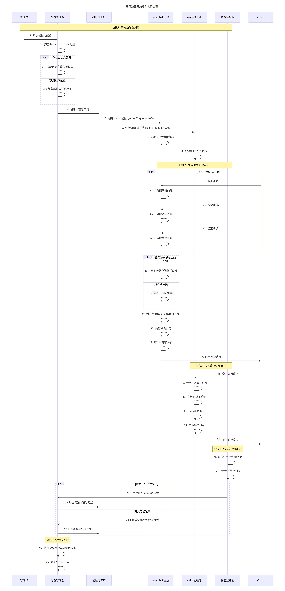

### **2.5.3 查看详细的线程池统计**

### **1、查询核心目标**

下面示例查询的目标是：提供 ES节点中所有线程池的详细运行时统计信息，包括线程数量、活跃状态、队列情况、任务完成量等关键指标，是性能监控和故障诊断的重要工具。

\# 查看详细的线程池统计

GET /\_nodes/stats/thread\_pool?human

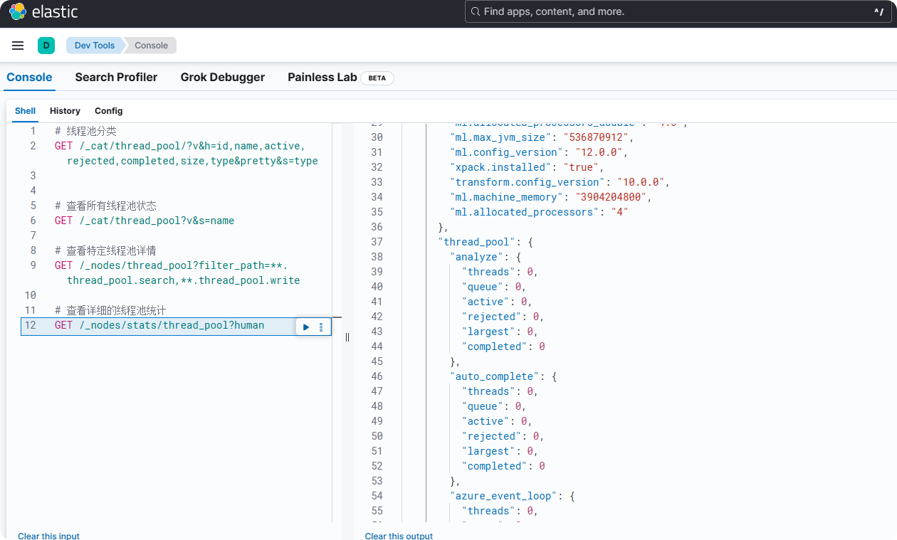

### **2、字段含义详解**

### **3、关键线程池剖析**

集群状态综合评估：

1.  ✅ 健康状态指标
2.  负载均衡：所有队列为0，无任务积压
3.  无拒绝任务：所有rejected为0，系统稳定
4.  资源充足：活跃线程数普遍为0（除management外）
5.  高吞吐量：多个线程池完成数百万任务
6.  ⚠️ 需要注意的指标
7.  management活跃：有1个管理任务正在执行
8.  refresh高频率：完成1700万+次刷新，可能配置过于频繁

### **4、底层架构设计**

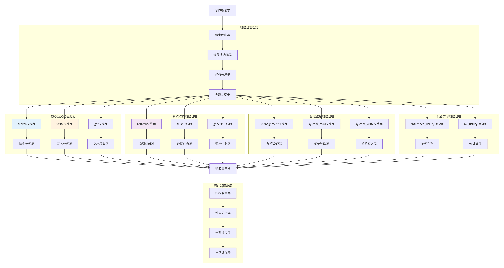

### **5、执行流程**

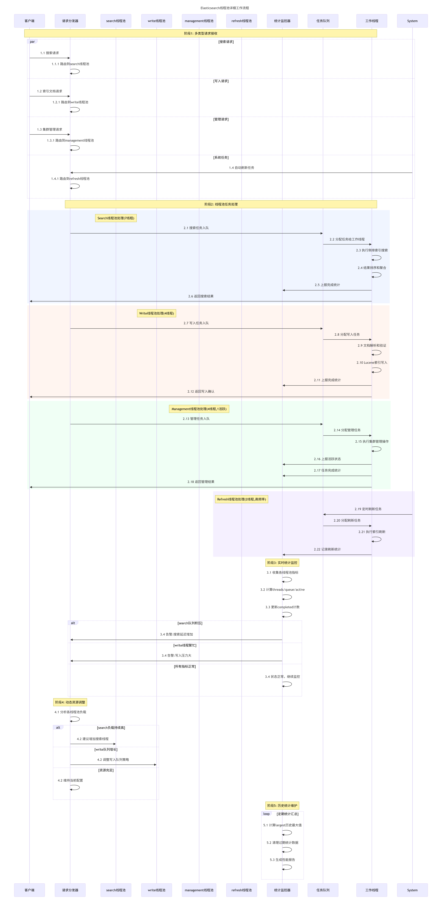

## **2.6 线程池&队列认知**

### **2.6.1 必要时设置 processors**

值得注意的是，线程池是根据 ES 在基础硬件上检测到的线程数（number of processors）设置的。如果检测失败，则应在 elasticsearch.yml 中显式设置硬件中可用的线程数。

特别是在一台宿主机配置多个 ES节点实例的情况下，若要修改其中一个节点线程池或队列大小，则要考虑配置 processors 参数。

elasticsearch.yml 中设置如下所示：

processors: 4

PS：Linux 查看线程数方法：

grep 'processor' /proc/cpuinfo | sort -u | wc -l

### **2.6.2 线程池关联队列设置**

大多数线程池具有与之关联的队列，以使 ES 可以将请求存储在内存中，同时等待资源变得可用来处理请求。

但是，队列通常具有有限的大小，如果超过该大小，ES 将拒绝该请求。

### **2.6.3 不要盲目修改队列大小**

有时你可能会增加队列的大小以防止请求被拒绝，但要结合资源实际进行修改，千万别盲目修改。

实际上，如果值设置的非常大，甚至可能适得其反。因为通过设置更大的队列大小，该节点将需要使用更多的内存来存储队列，这就意味着将剩下相对较少的内存来响应和管理实际请求。

此外，增加队列大小还会增加将操作响应保留在队列中的时间长度，从而导致客户端应用程序面临超时问题。

### **2.6.4 加强监控**

通常，唯一有需要增加队列大小的情况是：在请求数量激增导致无法在客户端管理此过程且资源使用率并未达到峰值。

你可以借助 Kibana Stack Monitoring 可视化监控指标以更好地了解 Elasticsearch 集群的性能。

Kibana 监控面板中的总视图、节点视图、索引视图如下所示：

### **2.6.4.1 总视图监控**

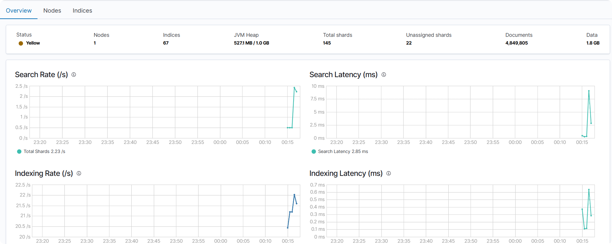

### **2.6.4.2 节点视图监控**

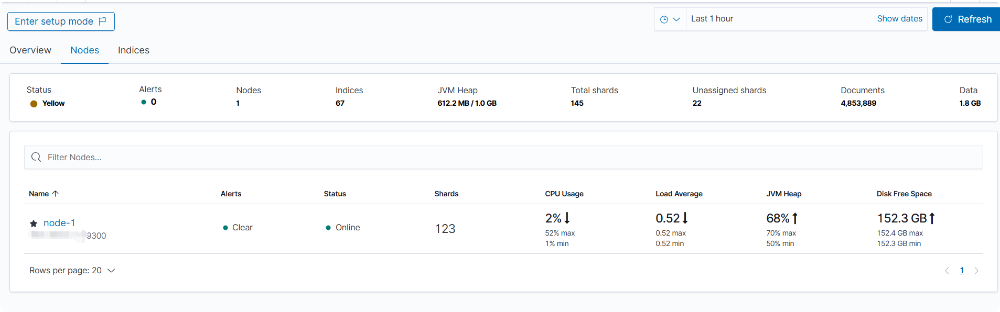

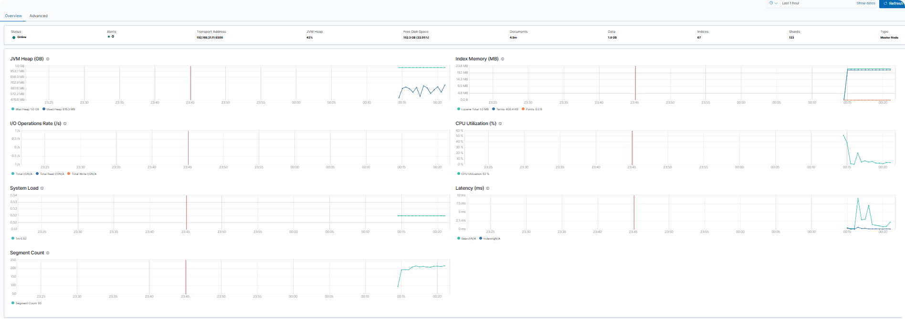

### **2.6.4.3 索引视图监控**

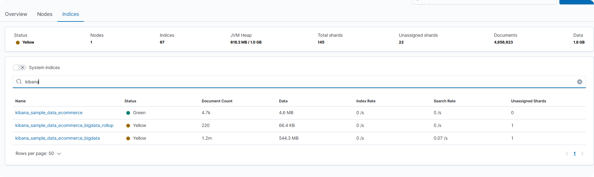

上图是：Kibana 8.17.9 版本中的监控截图：

1.  search Rate：检索速率
2.  search Latency：检索延时
3.  indexing Rate：写入速度
4.  indexing Latency：写入延时

队列的增加（Growing）表明 ES难以满足请求，而拒绝（rejection）则表明队列已经增长到 Elasticsearch 拒绝的程度。

需要检查导致队列增加的根本原因，并尝试通过在客户端减轻相关写入或检索操作来平衡对集群线程池的压力。

## **2.7 线程池&队列配置调整实操**

### **2.7.1 线程池分类及队列大小**

通过开头我们得知Elasticsearch 8.x 线程池类型主要有两种。

### **2.7.1.1 Fixed 固定大小线程池**

search:

type: fixed

size: 16 \# 固定16个线程

queue\_size: 1000 \# 队列容量1000

特点：

1.  线程数量固定不变
2.  任务在队列中等待
3.  队列满时拒绝新任务
4.  适合负载稳定的场景

### **2.7.1.2 Scaling 弹性线程池**

refresh:

type: scaling

min: 2 \# 最小2个线程

max: 8 \# 最大8个线程

\# 无queue\_size参数

特点：

1.  线程数在min-max之间动态调整
2.  无任务队列，线程忙时创建新线程
3.  空闲线程自动回收
4.  适合负载波动的场景

### **2.7.1.3 如何选择**

基于业务特点的选择，适合 fixed 类型的场景：

\# 负载稳定，要求可预测性能

search:

type: fixed \# 搜索请求相对稳定

write:

type: fixed \# 写入负载可预测

get:

type: fixed \# 文档获取频率稳定

适合 scaling 类型的场景：

\# 负载波动大，突发性任务

refresh:

type: scaling \# 刷新频率变化大

inference\_utility:

type: scaling \# 推理任务突发性强

### **2.7.2 基于实际负载情况精准配置**

\# elasticsearch.yml - 基于16核CPU的生产环境配置

thread\_pool:

\# ========== 搜索相关线程池 ==========

search:

type: fixed

size: 16 \# 与CPU核心数相同

queue\_size: 2000 \# 队列容量

search\_worker:

type: fixed

size: 8 \# 搜索工作线程

queue\_size: 500

search\_throttled:

type: fixed

size: 4 \# 限流搜索，防止雪崩

queue\_size: 200

\# ========== 写入相关线程池 ==========

write:

type: fixed

size: 8 \# 写入线程

queue\_size: 5000

index:

type: fixed

size: 6 \# 索引操作

queue\_size: 1000

bulk:

type: fixed

size: 6 \# 批量操作

queue\_size: 3000

\# ========== 刷新与合并线程池 ==========

refresh:

type: scaling \# 弹性线程池，适合波动负载

min: 2

max: 8 \# 最大8个线程

\# queue\_size 不适用于 scaling 类型

flush:

type: fixed

size: 2 \# 数据刷盘

queue\_size: 500

force\_merge:

type: fixed

size: 1 \# 段合并，资源密集型

queue\_size: -1 \# 无界队列

\# ========== 系统核心线程池 ==========

generic:

type: fixed

size: 8 \# 通用后台任务

queue\_size: 1000

get:

type: fixed

size: 8 \# 文档获取

queue\_size: 1000

management:

type: fixed

size: 4 \# 集群管理

queue\_size: 1000

\# ========== 高级功能线程池 ==========

ml\_utility:

type: fixed

size: 4 \# 机器学习工具

queue\_size: 500

inference\_utility:

type: scaling \# 推理任务，负载波动大

min: 2

max: 6

watcher:

type: fixed

size: 4 \# 监控告警

queue\_size: 500

snapshot:

type: fixed

size: 2 \# 快照操作

queue\_size: 100

\# ========== 网络和传输线程池 ==========

transport\_worker:

type: fixed

size: 16 \# 节点通信，与CPU核心数相同

queue\_size: -1 \# 无界队列，避免通信阻塞

### **2.7.3 基于不同工作负载调优配置**

\# 场景1：搜索密集型应用

thread\_pool:

search:

size: 40

queue\_size: 5000

search\_throttled:

size: 10

queue\_size: 1000

\# 场景2：写入密集型应用

thread\_pool:

write:

size: 32

queue\_size: 20000

bulk:

size: 16

queue\_size: 1000

refresh:

size: 4

\# 场景3：混合负载均衡

thread\_pool:

search:

size: 24

queue\_size: 3000

write:

size: 16

queue\_size: 10000

bulk:

size: 12

queue\_size: 800

## **03 ES 8.x 热点线程架构设计**

## **3.1 ES 热点线程是什么**

实战业务场景中，当我们遇到集群响应比平常慢且 CPU 使用率高时，我们需要做问题排查，找到根因集群才能恢复如丝般流畅。

Elasticsearch提供了监视「**热点线程**」的能力，以便能够了解问题所在。当系统负载高时，通过「**热点线程**」可以识别出消耗CPU最多的线程。

## **3.2 ES 热点线程检测流程**

热点线程检测流程：

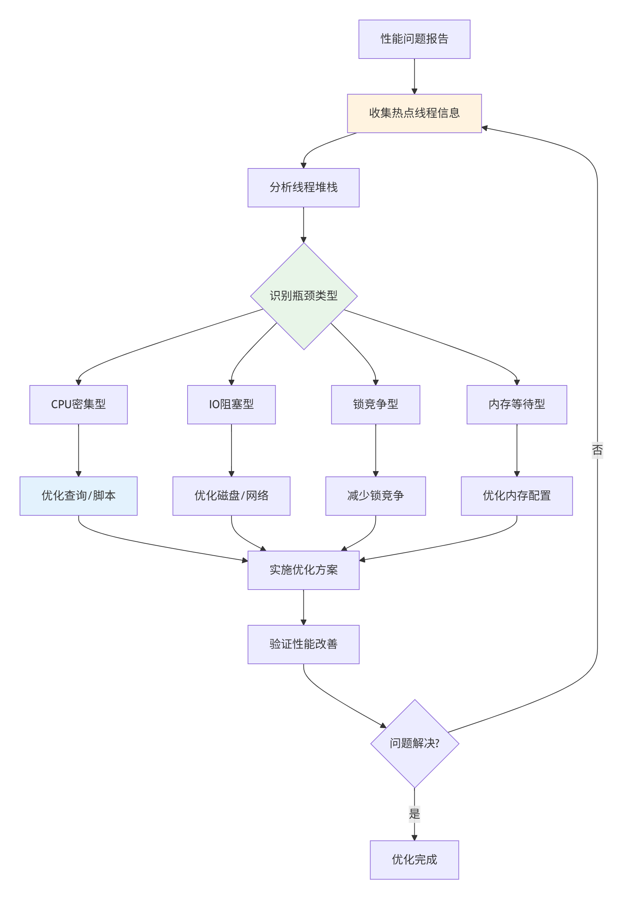

热点线程类型识别与解决：

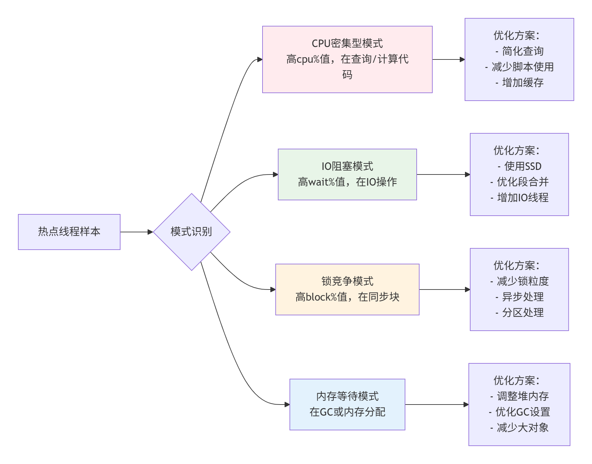

## **3.3 ES 热点线程实操**

### **3.3.1 获取热点线程信息**

### **1、查询核心目标**

下面示例查询的目标是：主要用于诊断ES节点的性能瓶颈和CPU热点。通过分析JVM中运行时间最长的线程堆栈，可以识别出消耗CPU资源最多的操作，是性能调优和故障诊断的重要工具。

\# 获取热点线程信息（默认3次采样，间隔2秒）

GET /\_nodes/hot\_threads

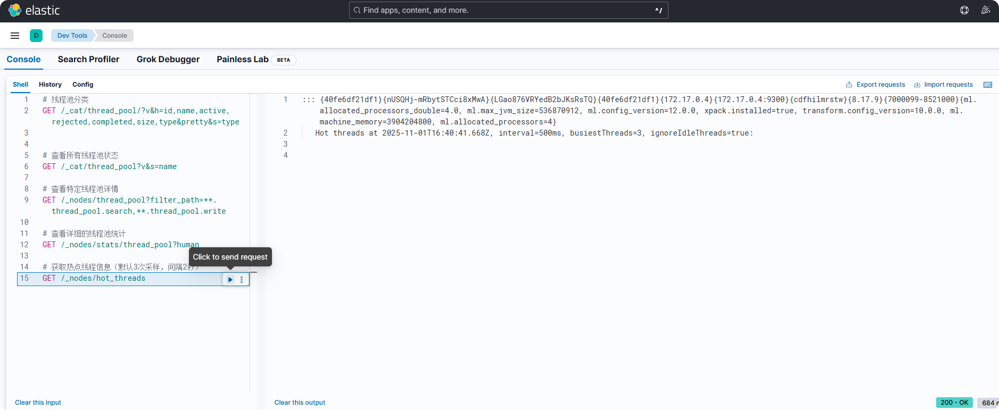

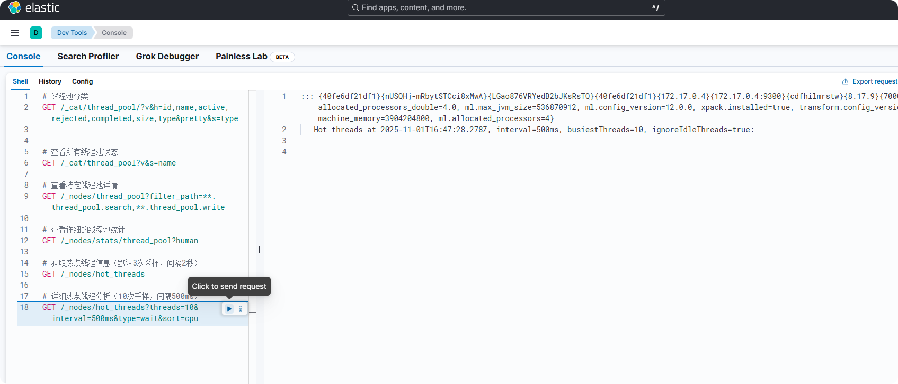

### **2、字段含义详解**

当前状态分析:

1.  **⚠️** 关键发现：无热点线程显示
2.  返回结果只包含节点信息，没有具体的线程堆栈
3.  表明在采样期间没有检测到CPU热点
4.  系统可能处于空闲状态或负载均衡良好

### **3、底层架构设计**

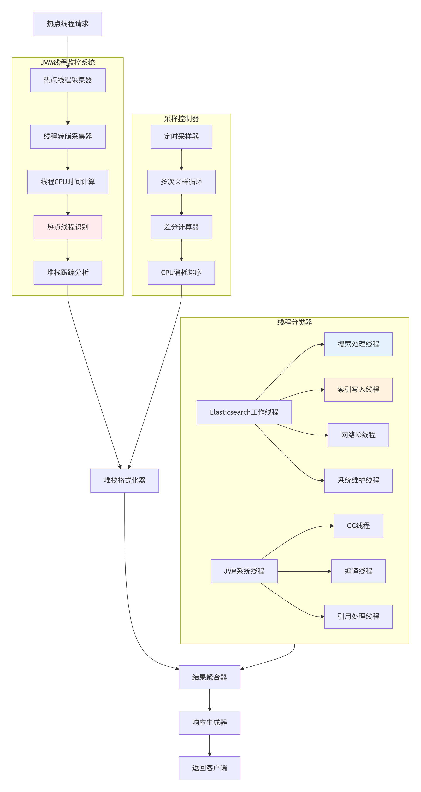

### **4、执行流程**

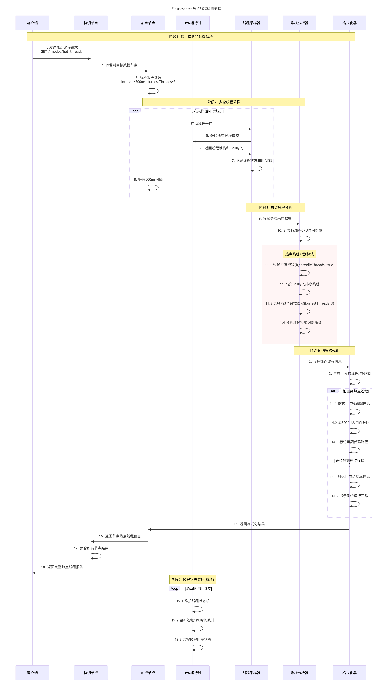

### **3.3.2 获取热点线程信息**

### **1、查询核心目标**

下面示例查询的目标是：通过type参数实现了多维度的线程性能分析，分别从CPU使用、阻塞状态、内存分配三个角度识别系统瓶颈，为性能调优提供精准的诊断依据。

1.  CPU热点线程（type=cpu）：识别在采样期间消耗CPU时间最多的线程，用于发现CPU密集型操作。
2.  阻塞热点线程（type=block）：识别在采样期间被阻塞（如等待锁、I/O）时间最长的线程，用于发现等待和锁竞争问题。
3.  内存分配热点线程（type=mem）：识别在采样期间分配内存最多的线程，用于发现可能的内存瓶颈或频繁对象创建。

\# 针对特定节点分析

GET /\_nodes/node-1/hot\_threads

\# 按类型分析（cpu/block/mem）

GET /\_nodes/hot\_threads?type\=cpu

\# 阻塞热点

GET /\_nodes/hot\_threads?type\=block

\# 内存分配热点

GET /\_nodes/hot\_threads?type\=mem

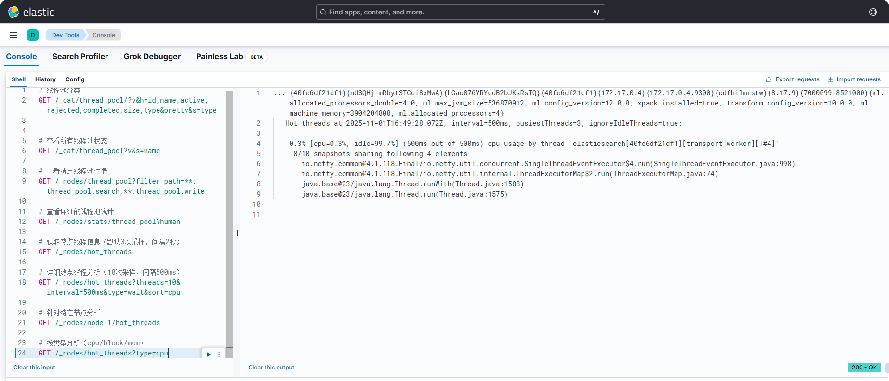

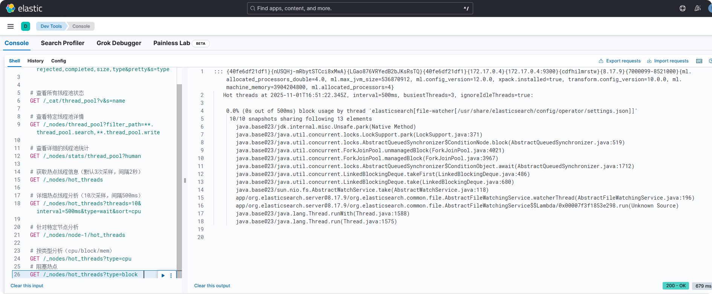

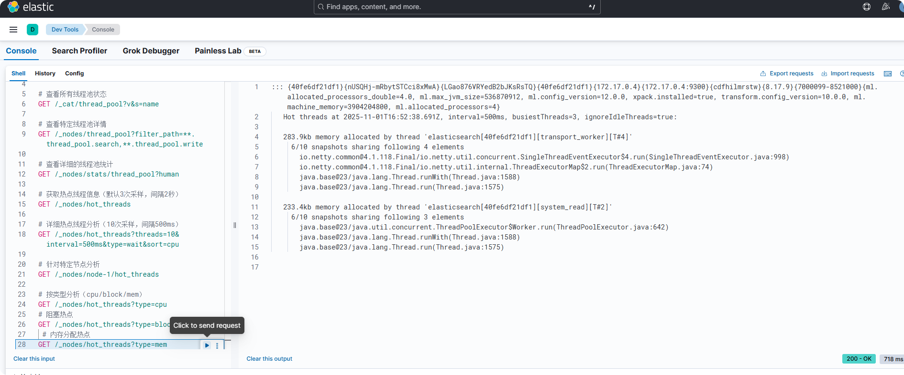

### **2、各类型分析结果**

### **2.1、CPU 热点分析**

检测结果：

线程: elasticsearch\[40fe6df21df1\]\[transport\_worker\]\[T#4\]

CPU使用率: 0.3% (非常低)

空闲率: 99.7%

状态: Netty网络通信线程，运行正常

分析结论：

1.  ✅ 系统负载极轻：CPU使用率仅0.3%，堆栈显示在Netty的事件循环中，这是正常的网络通信线程，表明系统CPU压力很小，运行正常
2.  ✅ 网络通信正常：transport\_worker线程正常运行
3.  ✅ 无CPU瓶颈：未发现计算密集型操作

### **2.2、阻塞热点分析**

检测结果：

线程: elasticsearch\[file-watcher\[...\]\]

阻塞率: 0.0% (无阻塞)

状态: 文件监控线程，正常等待文件变化

堆栈特征: LockSupport.park → 条件等待

分析结论：

1.  ✅ 无锁竞争：线程file-watcher阻塞时间为0%，无线程竞争，但显示在等待文件系统事件
2.  ✅ 正常等待：文件监控线程处于预期的等待状态
3.  ✅ 系统健康：无异常的线程阻塞，堆栈显示在AbstractWatchService.take方法中等待文件变化，这是正常的文件监控线程，用于配置热重载，阻塞是预期行为

### **2.3、内存分配热点分析**

检测结果：

TOP1: transport\_worker\[T#4\] - 283.9KB

TOP2: system\_read\[T#2\] - 233.4KB

特征: 网络和系统线程，内存分配量很小

分析结论：

1.  ✅ 内存压力小：KB级别分配，无内存瓶颈。transport\_worker\[T#4\]分配了283.9KB内存，system\_read\[T#2\]分配了233.4KB
2.  ✅ 分配模式正常：网络和IO线程合理的内存使用
3.  ✅ 无内存泄漏迹象：分配量在正常范围内，表明没有内存分配压力，堆栈显示正常的线程池操作无异常

### **2.4、综合状态评估**

由于目前集群并没有什么压力，所以展示为优秀：

### **3、字段含义详解**

1.  通用字段
2.  节点信息：包括节点ID、IP地址、角色等。
3.  采样参数：间隔（interval）、最忙线程数（busiestThreads）、是否忽略空闲线程（ignoreIdleThreads）。
4.  线程名称：如elasticsearch\[40fe6df21df1\]\[transport\_worker\]\[T#4\]，格式为\[节点名称\]\[线程池名称\]\[线程编号\]。
5.  使用率/分配内存：根据类型不同，显示CPU使用率、阻塞时间或分配的内存大小。
6.  快照共享元素：显示多个快照中相同的堆栈跟踪，帮助定位热点代码路径。
7.  各类型特有字段
8.  CPU类型：显示CPU使用百分比（如0.3%）和空闲百分比。
9.  阻塞类型：显示阻塞时间占采样间隔的百分比（如0.0%）和绝对时间。
10.  内存类型：显示在采样期间分配的内存大小（如283.9kb）。

### **4、hot\_threads支持的参数**

1.  ignore\_idle\_threads（可选，布尔值）
2.  如果为true，则会过滤掉已知的空闲线程（例如，在套接字选择中等待，或从空队列中获取任务）。默认为true。
3.  interval（可选，时间单位）执行热点线程的采样间隔。默认为500毫秒。
4.  snapshots（可选，整数）它是要获取的堆栈跟踪（在特定时间点嵌套的方法调用序列）数量。默认为10。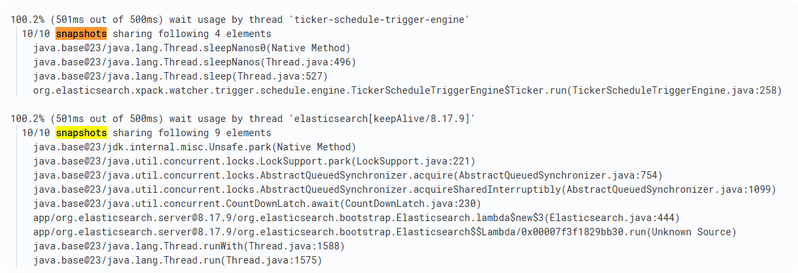
5.  threads（可选，整数）查看由type参数确定的信息，ElasticSearch将采用指定数量的最“热门”线程。
6.  最“热门”的线程，往往就是我们的问题所在。默认为3。也就是返回TOP 3 热点线程。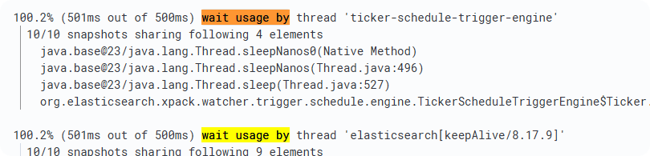
7.  master\_timeout（可选，时间单位）指定等待连接到主节点的时间段。
8.  如果在超时到期之前未收到任何响应，则请求将失败并返回错误。
9.  默认为30秒。
10.  timeout（可选，时间单位）指定等待响应的时间段。
11.  如果在超时到期之前未收到任何响应，则请求将失败并返回错误。
12.  默认为30秒。
13.  type（可选，字符串）要采样的类型。默认为：cpu。
14.  可用的选项是：
15.  1）block ——线程阻塞状态的时间。
16.  2）cpu ——线程占据CPU时间。
17.  3）wait ——线程等待状态的时间。

### **5、底层架构设计**

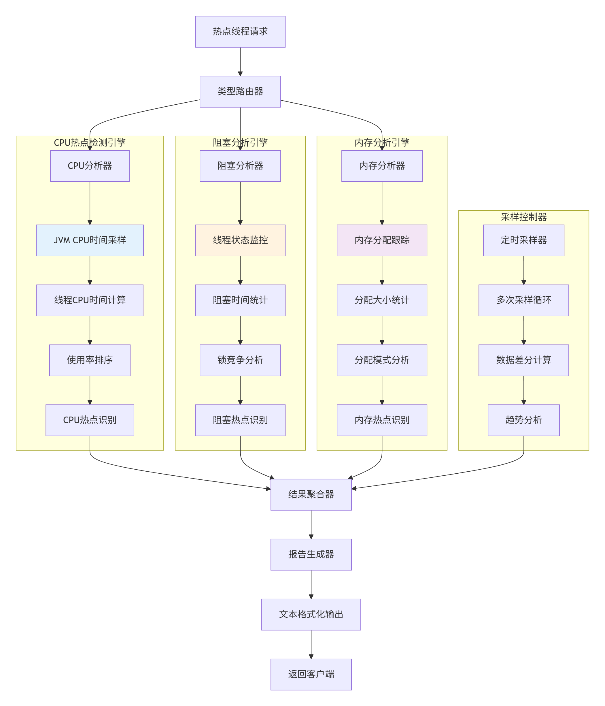

### **6、执行流程**

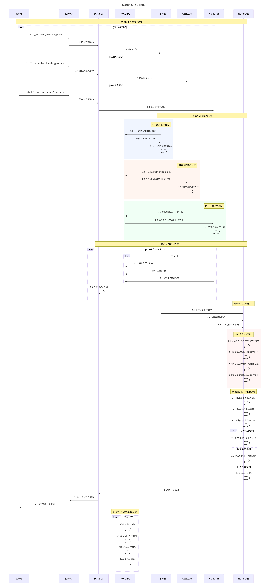

### **7、hot\_threads API 执行原理**

与其他返回 JSON 结果的 API 不同，Hot Threads API返回格式化的文本，你可以在其中区分几个部分。

在看返回堆栈结果信息之前，先看一些有关Hot Threads API背后的逻辑原理知识。

1.  ES接收所有正在运行的线程，并收集有关每个线程所花费的 CPU 时间，特定线程被阻塞或处于等待状态的次数，被阻塞或处于等待状态的时间等各种信息。
2.  然后等待特定的时间间隔 interval（由时间间隔参数指定）后，ES 再次收集相同的信息，并根据运行的时间（降序）对热点线程进行排序。注意，上述时间是针对 type 参数指定的给定操作类型统计的。
3.  之后，由 ES分析前 N 个线程（其中 N 是由线程参数 threads 指定的线程数）。ES所做的是每隔几毫秒就会捕获线程堆栈跟踪的快照（快照数量由快照参数 snapshot 指定）。
4.  最终：对堆栈跟踪进行分组以可视化展示线程状态的变化，就是我们看到的执行API 返回的结果信息。

以上内容，再把 hot\_threads API 的相关参数串联起来，相信你会对 hot\_threads 有大致的了解。

再来看下 hot\_threads API 返回结果部分。

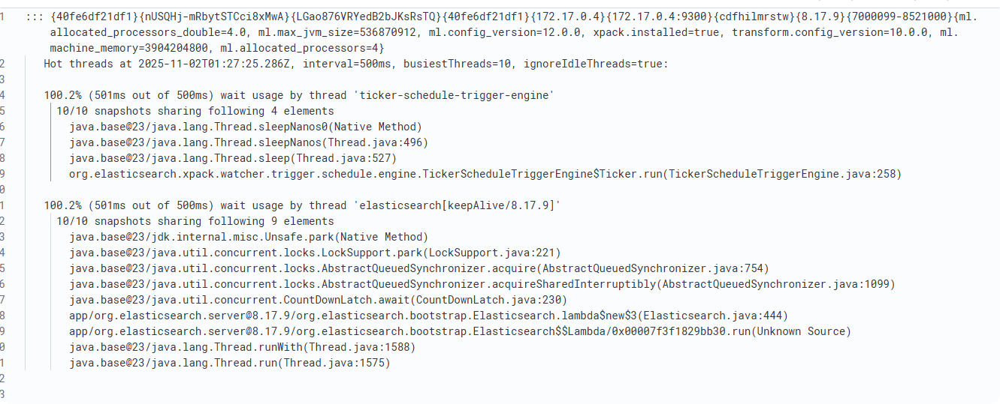

### **7.1、第一部分**

包含节点的基本信息，如下所示：

::: {40fe6df21df1}{nUSQHj-mRbytSTCci8xMwA}{LGao876VRYedB2bJKsRsTQ}{40fe6df21df1}{172.17.0.4}{172.17.0.4:9300}{cdfhilmrstw}{8.17.9}{7000099-8521000}{ml.allocated\_processors\_double=4.0, ml.max\_jvm\_size=536870912, ml.config\_version=12.0.0, xpack.installed=true, transform.config\_version=10.0.0, ml.machine\_memory=3904204800, ml.allocated\_processors=4}

通过如上信息，我们可以知道 ES的热点线程所在节点信息，当热线程API调用涉及多个节点时，这很方便。

### **7.2、第二部分**

接下来的几行可以分为几个子部分。

### **7.2.1、开头部分拆解**

100.2% (501ms out of 500ms) wait usage by thread 'ticker-schedule-trigger-engine'

100.2% (501ms out of 500ms) wait usage by thread 'elasticsearch\[keepAlive/8.17.9\]'

1.  \[wait\] ——代表 wait线程操作。
2.  100% —— 代表名为 wait的线程在完成统计时占据了所有CPU时间的100%。
3.  cpu usage ——指示我们正在使用 cpu 的类型，当前是线程 CPU的使用率。
4.  block usage —— 处于阻塞状态的线程的阻塞使用率。
5.  wait usage —— 处于等待状态的线程的等待使用率。

注意：线程名称在这里非常重要，通过它我们可以猜测 ES的哪些功能会导致问题。上面的示例我们可以初步得出是 wait 线程占据了大量的CPU。

实操中，除了 wait还有其他的线程，列举如下：

1.  recovery\_stream —— 用于恢复模块事件
2.  cache —— 用于缓存事件
3.  merge —— 用于段合并线程
4.  index ——用于数据索引（写入）线程

###   
**7.2.2、下面部分拆解**

Hot Threads API响应的下一部分是从以下信息开始的部分：

10/10 snapshots sharing following 4 elements

如上展示了：先前的线程信息将伴随堆栈跟踪信息。在这个示例中，10/10 —— 表示拍摄的 10 个快照具有相同的堆栈跟踪信息。

这在大多数情况下意味着对于当前线程，检查时间有一半都花在 ES代码的同一部分中。

## **3.4 ES 热点线程线上实战问题及注意事项**

### **3.4.1 注意事项**

### **3.4.1.1 线程池和队列修改**

线程池和队列修改需要更改配置文件 elasticsearch.yml，节点级别配置不再支持 5.X 之前的版本动态 setting 修改。

重启集群后生效。

### **3.4.1.2 reject 拒绝请求的原因**

如果 ES集群开始拒绝索引/写入（index）请求，则可能有多种原因。

1.  通常表明一个或多个节点无法跟上索引 / 删除 / 更新 / 批量请求的数量，从而导致在该节点上建立队列且队列逐渐累积。
2.  一旦索引队列超过队列的设置的最大值（如 elasticsearch.yml 定义的值或者默认值），则该节点将开始拒绝索引请求。
3.  排查方法：需要检查线程池的状态，以查明索引拒绝是否总是在同一节点上发生，还是分布在所有节点上。

GET /\_cat/thread\_pool?v

1.  如果 reject 仅发生在特定的数据节点上，那么您可能会遇到负载平衡或分片问题。
2.  如果 reject 与高 CPU 利用率相关联，那么通常这是 JVM 垃圾回收的结果，而 JVM 垃圾回收又是由配置或查询相关问题引起的。
3.  如果集群上有大量分片，则可能存在过度分片的问题。
4.  如果观察到节点上的队列拒绝，但监控发现 CPU 未达到饱和，则磁盘写入速度可能存在问题。

### **3.4.1.3 写入 bulk 值要递进步长调优**

不要妄图快速提高写入速度，一下调很大，很大势必会写入 reject。首先尝试一次索引 100 个文档，然后索引 200 个，再索引 400 个，依此类推...... 当索引写入速度（indexing rate）开始趋于平稳时，便知道已达到数据批量请求的最佳大小。

### **3.4.2 线上脚本实战**

下面通过几个脚本来综合实战下。

### **3.4.2.1 线程池监控与管理脚本**

#!/bin/bash

\# thread-pool-monitor.sh

echo "=== Elasticsearch 8.x 线程池监控 ==="

\# 1. 查看所有线程池状态

echo "1. 所有线程池状态:"

curl -s -u elastic:elastic -X GET "localhost:9200/\_cat/thread\_pool?v&s=name"

\# 2. 查看详细线程池统计

echo -e "\\n2. 详细线程池统计:"

curl -s -u elastic:elastic -X GET "localhost:9200/\_nodes/thread\_pool?pretty"

\# 3. 查看节点级线程池信息

echo -e "\\n3. 节点级线程池信息:"

curl -s -u elastic:elastic -X GET "localhost:9200/\_nodes/stats/thread\_pool?pretty"

\# 4. 监控队列积压

echo -e "\\n4. 队列积压监控:"

curl -s -u elastic:elastic -X GET "localhost:9200/\_cat/thread\_pool?v&h=name,queue,active,rejected,completed"

\# 5. 查看热点线程

echo -e "\\n5. 热点线程分析:"

curl -s -u elastic:elastic -X GET "localhost:9200/\_nodes/hot\_threads?threads=10&interval=500ms"

\# 6. 特定线程池深度监控

echo -e "\\n6. 搜索线程池深度监控:"

curl -s -u elastic:elastic -X GET "localhost:9200/\_nodes/stats/thread\_pool?filter\_path=\*\*.thread\_pool.search"

执行效果如下：

### **3.4.2.2 热点线程识别与诊断脚本**

#!/bin/bash

\# hot-threads-analyzer.sh

echo "=== Elasticsearch 热点线程深度分析 ==="

\# 1. 采集热点线程信息（采样3次，每次500ms）

echo "1. 采集热点线程信息..."

for i in {1..3}; do

echo "=== 采样 $i ==="

curl -s -u elastic:elastic -X GET "localhost:9200/\_nodes/hot\_threads?threads=5&interval=500ms&type=wait"

echo ""

sleep 1

done

\# 2. 按类型分析热点线程

echo -e "\\n2. 按类型分析热点线程:"

echo "CPU密集型线程:"

curl -s -u elastic:elastic -X GET "localhost:9200/\_nodes/hot\_threads?threads=5&interval=500ms&type=cpu"

echo -e "\\n等待密集型线程:"

curl -s -u elastic:elastic -X GET "localhost:9200/\_nodes/hot\_threads?threads=5&interval=500ms&type=wait"

echo -e "\\n阻塞密集型线程:"

curl -s -u elastic:elastic -X GET "localhost:9200/\_nodes/hot\_threads?threads=5&interval=500ms&type=block"

\# 3. 生成热点线程报告

echo -e "\\n3. 生成热点线程分析报告..."

generate\_hot\_threads\_report() {

local report\_file="/tmp/es\_hot\_threads\_$(date +%Y%m%d\_%H%M%S).log"

echo "Elasticsearch 热点线程分析报告" > $report\_file

echo "生成时间: $(date)" >> $report\_file

echo "==========================================" >> $report\_file

\# 收集系统信息

echo -e "\\n系统信息:" >> $report\_file

echo "CPU核心数: $(nproc)" >> $report\_file

echo "总内存: $(free -h | grep Mem | awk '{print $2}')" >> $report\_file

echo "ES堆内存: $(curl -s -u elastic:elastic localhost:9200 | jq .version.build\_type)" >> $report\_file

\# 收集线程池状态

echo -e "\\n线程池状态:" >> $report\_file

curl -s -u elastic:elastic -X GET "localhost:9200/\_cat/thread\_pool?v" >> $report\_file

\# 收集热点线程

echo -e "\\n热点线程详情:" >> $report\_file

curl -s -u elastic:elastic -X GET "localhost:9200/\_nodes/hot\_threads?threads=10&interval=1s" >> $report\_file

echo "报告已生成: $report\_file"

}

generate\_hot\_threads\_report

执行效果如下：

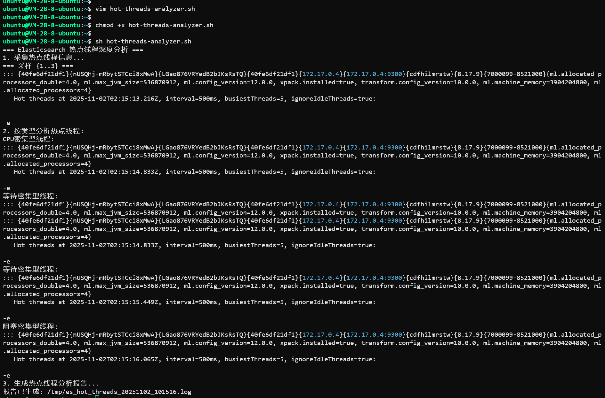

### **3.4.2.3 线程池问题诊断脚本**

#!/bin/bash

\# thread-pool-troubleshoot.sh

echo "=== ES线程池问题诊断 ==="

diagnose\_issues() {

\# 1. 检查队列积压

echo "1. 检查队列积压..."

local queue\_info=$(curl -s -u elastic:elastic -X GET "localhost:9200/\_cat/thread\_pool?v&h=name,queue" | sort -k2 -nr | head -5)

echo "$queue\_info"

\# 2. 检查任务拒绝

echo -e "\\n2. 检查任务拒绝..."

local rejected\_info=$(curl -s -u elastic:elastic -X GET "localhost:9200/\_cat/thread\_pool?v&h=name,rejected" | grep -v " 0$")

if \[ -n "$rejected\_info" \]; then

echo "发现任务拒绝:"

echo "$rejected\_info"

else

echo "无任务拒绝"

fi

\# 3. 检查活跃线程

echo -e "\\n3. 检查活跃线程..."

local active\_info=$(curl -s -u elastic:elastic -X GET "localhost:9200/\_cat/thread\_pool?v&h=name,active,threads" | awk '$2 == $3 {print}')

if \[ -n "$active\_info" \]; then

echo "线程池满负载运行:"

echo "$active\_info"

fi

\# 4. 热点线程分析

echo -e "\\n4. 热点线程分析..."

analyze\_hot\_threads\_quick

}

analyze\_hot\_threads\_quick() {

local hot\_output=$(curl -s -u elastic:elastic -X GET "localhost:9200/\_nodes/hot\_threads?threads=3&interval=500ms")

\# 提取关键信息

echo "热点线程摘要:"

echo "$hot\_output" | grep -E "(\[0-9\]+\\.\[0-9\]+)%|thread.\*elasticsearch" | head -10

}

generate\_troubleshooting\_report() {

local report\_file="troubleshooting\_report\_$(date +%Y%m%d\_%H%M%S).txt"

{

echo "ES线程池问题诊断报告"

echo "生成时间: $(date)"

echo "========================================"

echo -e "\\n1. 系统资源状态:"

echo "CPU核心数: $(nproc)"

echo "内存总量: $(free -h | grep Mem | awk '{print $2}')"

echo "磁盘空间: $(df -h / | awk 'NR==2 {print $4}') 可用"

echo -e "\\n2. 线程池状态:"

curl -s -u elastic:elastic -X GET "localhost:9200/\_cat/thread\_pool?v"

echo -e "\\n3. 集群健康:"

curl -s -u elastic:elastic -X GET "localhost:9200/\_cluster/health"

echo -e "\\n4. 节点状态:"

curl -s -u elastic:elastic -X GET "localhost:9200/\_cat/nodes?v"

echo -e "\\n5. 热点线程:"

curl -s -u elastic:elastic -X GET "localhost:9200/\_nodes/hot\_threads?threads=5&interval=1s"

} > $report\_file

echo "诊断报告生成: $report\_file"

}

\# 执行诊断

diagnose\_issues

generate\_troubleshooting\_report

执行效果如下：

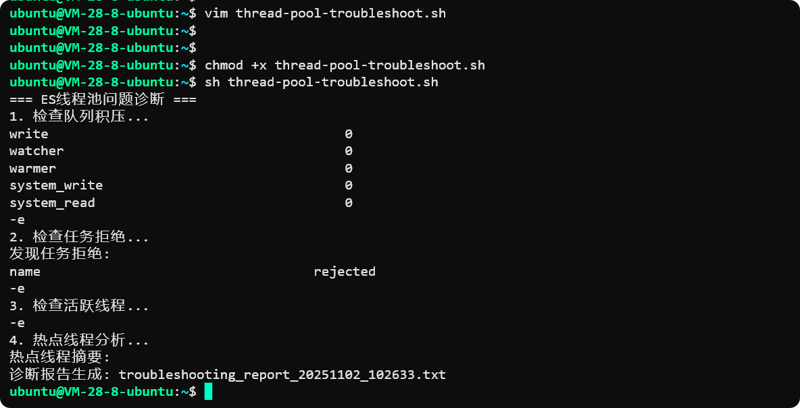

### **3.4.2.4 线程池实时监控看板**

#!/bin/bash

\# bash thread-pool-dashboard.sh 执行

display\_dashboard() {

while true; do

clear

echo "========================================================"

echo " Elasticsearch 线程池实时监控看板"

echo " 更新时间: $(date +%Y-%m-%d\\ %H:%M:%S)"

echo "========================================================"

echo ""

\# 1. 关键线程池状态表格

echo "📊 关键线程池状态"

echo "--------------------------------------------------------"

printf "%-20s %-6s %-6s %-8s %-10s\\n" "池名称" "活跃" "队列" "拒绝" "利用率"

echo "--------------------------------------------------------"

\# 获取线程池信息并安全处理

local thread\_pool\_data

thread\_pool\_data=$(curl -s -u elastic:elastic -X GET "localhost:9200/\_cat/thread\_pool?h=name,active,queue,rejected,threads&v" 2>/dev/null)

if \[ $? -ne 0 \] || \[ -z "$thread\_pool\_data" \]; then

echo "❌ 无法获取线程池数据，请检查ES连接"

sleep 5

continue

fi

\# 处理每一行数据

echo "$thread\_pool\_data" | while IFS= read -r line; do

\# 跳过表头

if \[\[ "$line" == \*"name"\* \]\] || \[\[ -z "$line" \]\]; then

continue

fi

\# 安全地解析字段

name=$(echo "$line" | awk '{print $1}')

active=$(echo "$line" | awk '{print $2}')

queue=$(echo "$line" | awk '{print $3}')

rejected=$(echo "$line" | awk '{print $4}')

threads=$(echo "$line" | awk '{print $5}')

\# 计算利用率

if \[ "$threads" -gt 0 \] 2>/dev/null; then

utilization=$((active \* 100 / threads))

else

utilization=0

fi

\# 根据状态添加表情符号

if \[ "$rejected" -gt 0 \]; then

prefix="🔴"

elif \[ "$queue" -gt 100 \]; then

prefix="🟡"

elif \[ "$utilization" -gt 80 \]; then

prefix="⚡"

else

prefix="✅"

fi

printf "%-20s %-6s %-6s %-8s %-9s\\n" \\

"${prefix} ${name}" "$active" "$queue" "$rejected" "${utilization}%"

done | head -15

echo ""

\# 2. 系统负载概览

echo "📈 系统负载概览"

echo "--------------------------------------------------------"

show\_system\_overview

echo ""

\# 3. 热点线程检测

echo "🔥 热点线程检测"

echo "--------------------------------------------------------"

show\_hot\_threads

echo ""

\# 4. 性能建议

echo "💡 性能建议"

echo "--------------------------------------------------------"

show\_performance\_tips

sleep 5

done

}

show\_system\_overview() {

\# 获取集群健康状态

local health\_status

health\_status=$(curl -s -u elastic:elastic -X GET "localhost:9200/\_cluster/health" 2>/dev/null)

if \[ $? -eq 0 \]; then

local status=$(echo "$health\_status" | grep -o '"status":"\[^"\]\*"' | cut -d'"' -f4)

local node\_count=$(echo "$health\_status" | grep -o '"number\_of\_nodes":\[0-9\]\*' | cut -d':' -f2)

local pending\_tasks=$(echo "$health\_status" | grep -o '"number\_of\_pending\_tasks":\[0-9\]\*' | cut -d':' -f2)

case $status in

"green") status\_icon="🟢" ;;

"yellow") status\_icon="🟡" ;;

"red") status\_icon="🔴" ;;

\*) status\_icon="⚪" ;;

esac

echo "集群状态: ${status\_icon} $status | 节点数: $node\_count | 待处理任务: ${pending\_tasks:-0}"

else

echo "❌ 无法获取集群状态"

fi

\# 获取关键线程池统计

local total\_active total\_queue total\_rejected

total\_active=$(echo "$thread\_pool\_data" | awk 'NR>1 {sum += $2} END {print sum}')

total\_queue=$(echo "$thread\_pool\_data" | awk 'NR>1 {sum += $3} END {print sum}')

total\_rejected=$(echo "$thread\_pool\_data" | awk 'NR>1 {sum += $4} END {print sum}')

echo "总活跃线程: $total\_active | 总队列任务: $total\_queue | 总拒绝任务: $total\_rejected"

}

show\_hot\_threads() {

local hot\_output

hot\_output=$(curl -s -u elastic:elastic -X GET "localhost:9200/\_nodes/hot\_threads?threads=3&interval=1s&type=cpu" 2>/dev/null)

if \[ $? -eq 0 \] && \[ -n "$hot\_output" \]; then

\# 提取热点线程信息

echo "$hot\_output" | grep -E "(\[0-9\]+\\.\[0-9\]+)%|thread.\*elasticsearch" | head -6 | while read -r line; do

if \[\[ "$line" =~ (\[0-9\]+\\.\[0-9\]+)% \]\]; then

cpu\_usage="${BASH\_REMATCH\[1\]}"

if (( $(echo "$cpu\_usage > 10.0" | bc -l 2>/dev/null) )); then

echo "🔴 $line"

elif (( $(echo "$cpu\_usage > 5.0" | bc -l 2>/dev/null) )); then

echo "🟡 $line"

else

echo "🟢 $line"

fi

else

echo " $line"

fi

done

else

echo "✅ 无显著热点线程"

fi

}

show\_performance\_tips() {

\# 基于当前状态的性能建议

local high\_queue\_pools

high\_queue\_pools=$(echo "$thread\_pool\_data" | awk 'NR>1 && $3 > 100 {print $1}')

local high\_util\_pools

high\_util\_pools=$(echo "$thread\_pool\_data" | awk 'NR>1 && $5 > 0 && ($2 / $5) > 0.8 {print $1}')

if \[ -n "$high\_queue\_pools" \]; then

echo "⚠️ 队列积压: $high\_queue\_pools - 考虑增加队列大小"

fi

if \[ -n "$high\_util\_pools" \]; then

echo "⚡ 高利用率: $high\_util\_pools - 考虑增加线程数"

fi

if \[ -z "$high\_queue\_pools" \] && \[ -z "$high\_util\_pools" \]; then

echo "✅ 系统运行正常，无需立即优化"

fi

}

\# 信号处理，确保Ctrl+C可以正常退出

cleanup() {

echo ""

echo "监控看板已退出"

exit 0

}

trap cleanup SIGINT SIGTERM

\# 检查依赖

check\_dependencies() {

if ! command -v curl &> /dev/null; then

echo "错误: 需要安装 curl"

exit 1

fi

if ! command -v bc &> /dev/null; then

echo "警告: 未找到 bc 命令，部分功能可能受限"

fi

}

\# 主函数

main() {

check\_dependencies

echo "启动 Elasticsearch 线程池监控看板..."

echo "按 Ctrl+C 退出"

sleep 2

display\_dashboard

}

\# 运行主函数

main

执行效果如下：

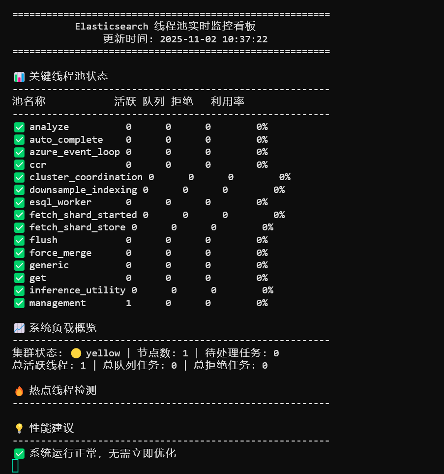

### **3.4.2.5 综合线程池监控看板**

#!/bin/bash

\# advanced-thread-pool-dashboard.sh

display\_comprehensive\_dashboard() {

while true; do

clear

echo "========================================================"

echo " Elasticsearch 线程池综合监控仪表板"

echo " 更新时间: $(date +%Y-%m-%d\\ %H:%M:%S)"

echo "========================================================"

echo ""

\# 1. 关键性能指标

echo "📊 关键性能指标"

echo "--------------------------------------------------------"

show\_key\_metrics

\# 2. 负载分布图表

echo ""

echo "📈 负载分布"

echo "--------------------------------------------------------"

show\_load\_distribution

\# 3. 实时队列监控

echo ""

echo "🔄 实时队列监控"

echo "--------------------------------------------------------"

show\_queue\_monitoring

\# 4. 热点线程检测

echo ""

echo "🔥 热点线程检测"

echo "--------------------------------------------------------"

show\_hot\_threads

\# 5. 配置状态

echo ""

echo "⚙️ 配置状态"

echo "--------------------------------------------------------"

show\_config\_status

sleep 10

done

}

show\_key\_metrics() {

local metrics=$(curl -s -u elastic:elastic -X GET "localhost:9200/\_cat/thread\_pool?v&h=name,active,queue,rejected,completed,size")

\# 计算关键指标

local total\_active=$(echo "$metrics" | awk 'NR>1 {sum += $2} END {print sum}')

local total\_queue=$(echo "$metrics" | awk 'NR>1 {sum += $3} END {print sum}')

local total\_rejected=$(echo "$metrics" | awk 'NR>1 {sum += $4} END {print sum}')

local total\_completed=$(echo "$metrics" | awk 'NR>1 {sum += $5} END {print sum}')

printf "总活跃线程: %-6s 总队列任务: %-6s\\n" "$total\_active" "$total\_queue"

printf "总拒绝任务: %-6s 总完成任务: %-6s\\n" "$total\_rejected" "$total\_completed"

\# 高负载线程池检测

local high\_load\_pools=$(echo "$metrics" | awk 'NR>1 && $5 > 100000 {print $1 ":" $5}')

if \[ -n "$high\_load\_pools" \]; then

echo "高负载线程池: $high\_load\_pools"

fi

}

show\_load\_distribution() {

local distribution=$(curl -s -u elastic:elastic -X GET "localhost:9200/\_cat/thread\_pool?v&h=name,completed" | \\

awk 'NR>1 {

if ($2 > 1000000) printf "🔴 ";

else if ($2 > 100000) printf "🟡 ";

else printf "🟢 ";

printf "%-20s: %8d\\n", $1, $2;

}' | sort -k3 -nr | head -8)

echo "$distribution"

}

show\_queue\_monitoring() {

local queue\_info=$(curl -s -u elastic:elastic -X GET "localhost:9200/\_cat/thread\_pool?v&h=name,queue,active,size" | \\

awk 'NR>1 {

utilization = ($3 > 0 && $4 > 0) ? ($3 / $4) \* 100 : 0;

if ($2 > 0) printf "📥 ";

else if (utilization > 80) printf "⚡ ";

else printf "✅ ";

printf "%-20s: 队列%-4d 活跃%-2d/%-2d (%.1f%%)\\n", $1, $2, $3, $4, utilization;

}' | sort -k2 -nr | head -6)

echo "$queue\_info"

}

show\_hot\_threads() {

local hot\_info=$(curl -s -u elastic:elastic -X GET "localhost:9200/\_nodes/hot\_threads?threads=3&interval=1s" | \\

grep -E "(\[0-9\]+\\.\[0-9\]+)%|thread.\*elasticsearch" | head -6)

if \[ -n "$hot\_info" \]; then

echo "$hot\_info" | while read line; do

if \[\[ $line =~ (\[0-9\]+\\.\[0-9\]+)% \]\]; then

cpu\_usage="${BASH\_REMATCH\[1\]}"

if (( $(echo "$cpu\_usage > 10.0" | bc -l) )); then

echo "🔴 $line"

elif (( $(echo "$cpu\_usage > 5.0" | bc -l) )); then

echo "🟡 $line"

else

echo "🟢 $line"

fi

else

echo " $line"

fi

done

else

echo "✅ 无显著热点线程"

fi

}

show\_config\_status() {

local config\_status=$(curl -s -u elastic:elastic -X GET "localhost:9200/\_cat/thread\_pool?v&h=name,type,size,queue\_size" | \\

awk 'NR>1 {

if ($2 == "fixed" && $4 == -1) status="⚠️ 无界队列";

else if ($2 == "scaling" && $3 == 0) status="⚠️ 零线程";

else status="✅ 正常";

printf "%-20s: %-8s %2d线程 队列%-6s %s\\n", $1, $2, $3, $4, status;

}' | head -6)

echo "$config\_status"

}

\# 启动仪表板

display\_comprehensive\_dashboard

执行效果如下：

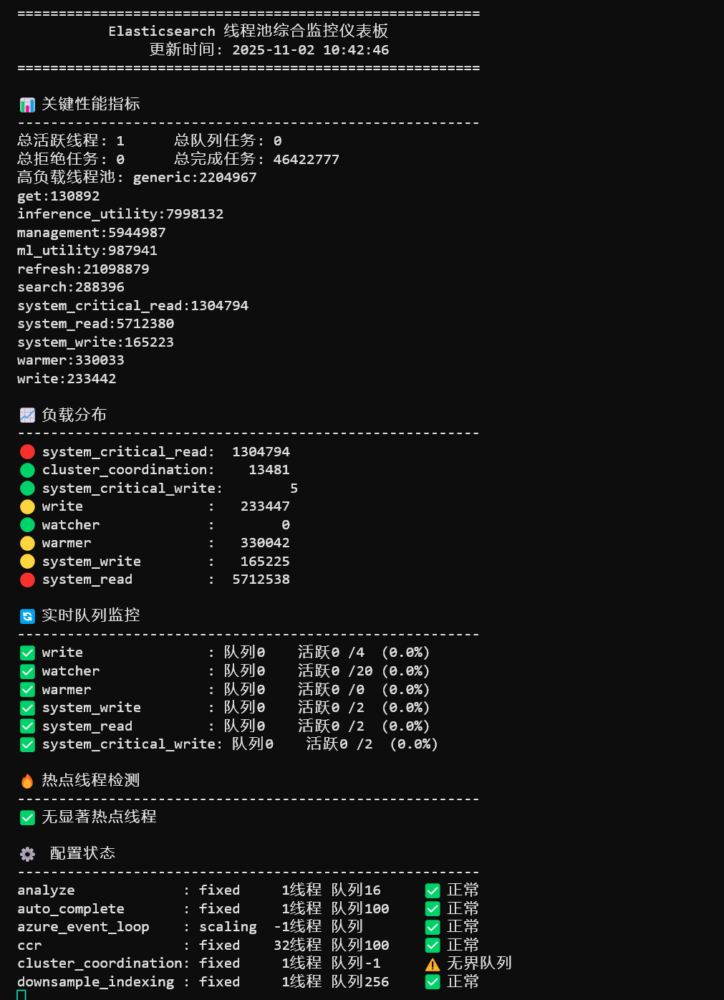