从今天之后的一段时间内，华仔会带着大家一起来从零开始对 ElasticStack 矩阵产品进行深入剖析和项目运维实战，希望大家学完之后可以用到自己的工作中。

这是第二十二篇，本篇我将带着大家进行「**ES 8.x 缓存类型、应用场景、设置实操**」。

文章汇总位置：[https://wx.zsxq.com/dweb2/index/columns/51122554151214](https://wx.zsxq.com/dweb2/index/columns/51122554151214)

## **01 前言**

在上篇中 [【ES 入门实战第二十一篇】ES Java 客户端演进历史和如何选型](https://articles.zsxq.com/id_6hdpt6ws2g1w.html)，带着大家进行「**ES Java 客户端演进历史和如何选型**」。

今天我们来进行「**ES 8.x 缓存类型、应用场景、设置实操**」。

##   
**02 ES 8.x 缓存类型架构设计**

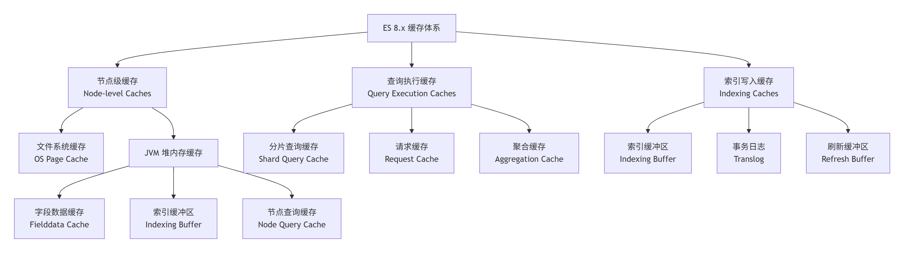

下面我们分别来看下这些缓存类型。

## **2.1 节点级缓存**

### **2.1.1 PageCache 缓存**

操作系统级别的缓存，用于缓存磁盘上的数据。Elasticsearch 依赖于操作系统的页面缓存来快速访问索引文件。当节点重启时，页面缓存会丢失。

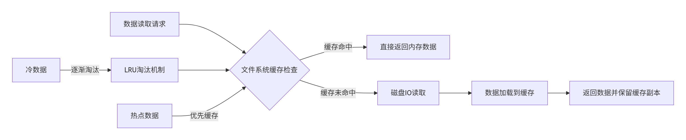

### **2.1.1.1 应用场景**

1.  操作系统级别的文件缓存
2.  加速索引段、doc\_values 的读取操作、倒排索引的访问操作
3.  对搜索和聚合性能有重大影响

### **2.1.1.2 设置实操**

无法通过Elasticsearch直接设置，需要通过操作系统调优。但可以修改 jvm.optitons 配置，建议将剩余内存留给操作系统做页面缓存:

\## JVM configuration

################################################################

\## IMPORTANT: JVM heap size

################################################################

##

\## You should always set the min and max JVM heap

\## size to the same value. For example, to set

\## the heap to 4 GB, set:

\## 通常由操作系统自动管理，但可以通过以下方式优化：

\## 确保足够的内存留给文件系统缓存 建议：堆内存 <= 50% 总内存，剩余留给文件系统缓存,比如我这个云服务器总内存4G，我分配了 512M 给 JVM，那么剩余3G多自然留给文件系统缓存

\-Xms512m

\-Xmx512m

### **2.1.1.3 监控指标**

### **1、查询核心目标**

下面示例查询的目标是：主要用于监控ES节点的「**操作系统**」和「**文件系统**」资源使用情况。虽然不能直接获取pagecache占用情况，但可以通过内存和I/O指标间接分析缓存效果。

\# 监控命令

GET \_nodes/stats/fs,os

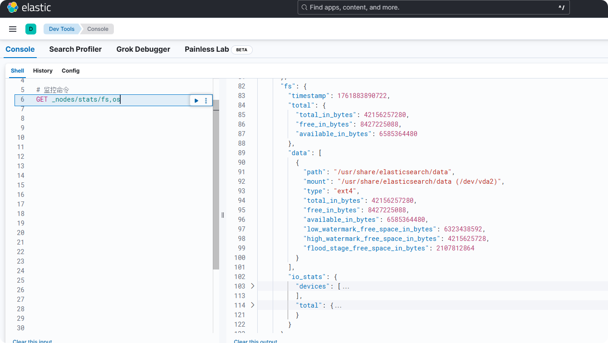

### **2、字段含义详解**

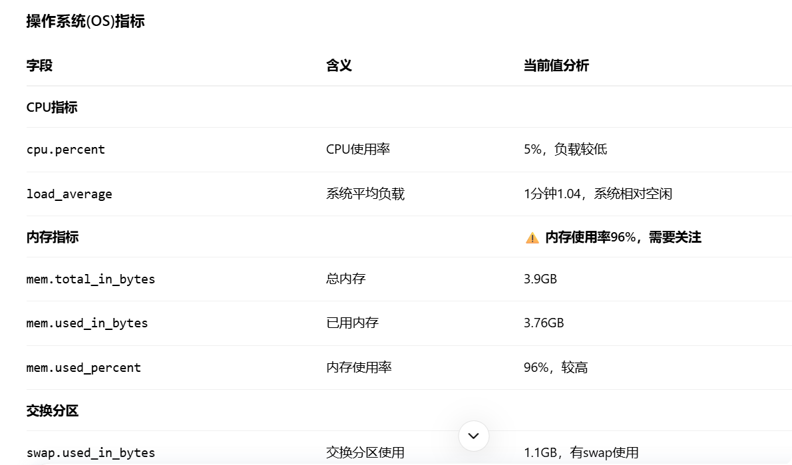

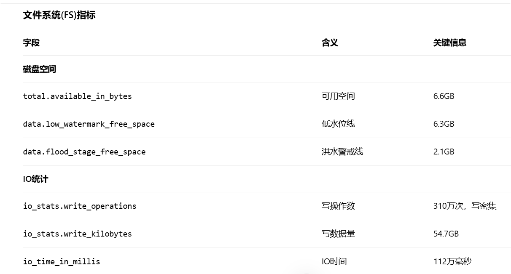

### **3、PageCache 分析**

虽然API不直接显示PageCache，但可以通过以下指标间接判断PageCache的线索：

1.  ​高内存使用率(96%)​​：可能包含大量PageCache
2.  ​写操作远多于读操作​：写操作310万 vs 读操作14万
3.  ​可用空间充足​：磁盘有6.6GB可用空间

PageCache估算方法：

\# 在Linux系统上直接查看PageCache

cat /proc/meminfo | grep -E "(Cached|Buffers)"

\# 或使用free命令

free -h

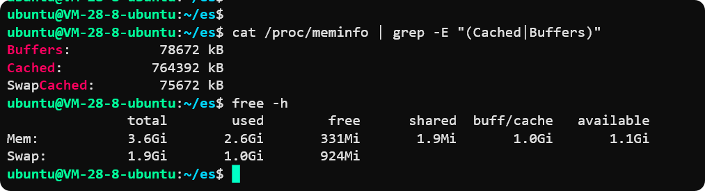

### **4、底层架构设计**

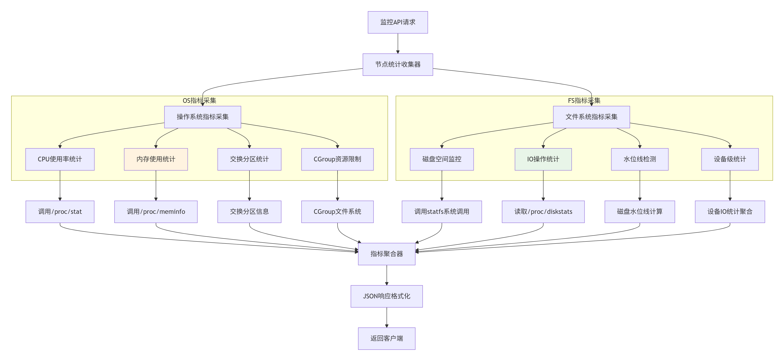

### **5、执行流程**

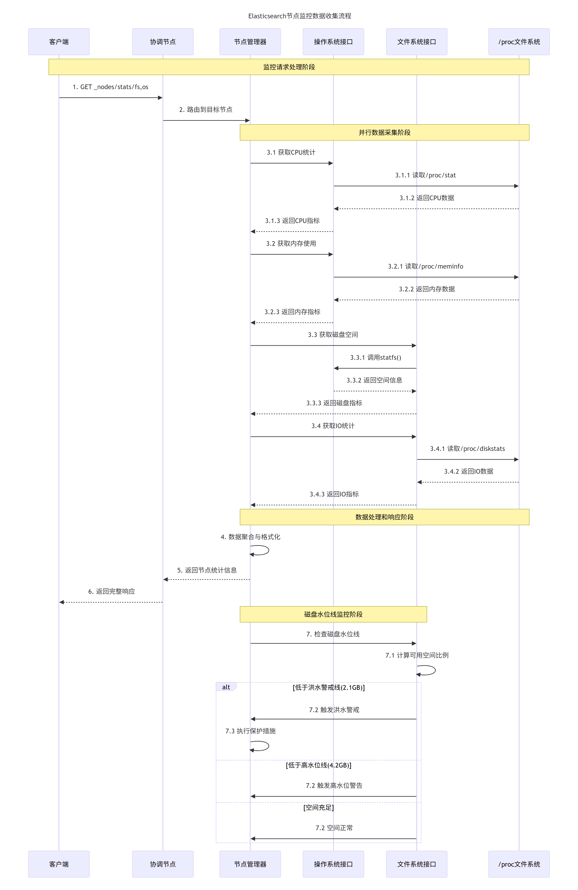

流程详细说明：

1.  阶段1：监控请求处理
2.  ​客户端发起请求​：通过HTTP GET请求获取节点文件系统和操作系统统计信息
3.  ​协调节点路由​：将请求路由到对应的节点管理器
4.  阶段2：并行数据采集
5.  Elasticsearch并行收集四类关键指标：
6.  ​CPU指标采集​：
7.  读取/proc/stat获取CPU使用率和负载信息
8.  包含用户态、系统态、空闲时间等详细统计
9.  ​内存指标采集​：
10.  读取/proc/meminfo获取内存使用详情
11.  包含物理内存、缓存、交换分区等完整信息
12.  ​磁盘空间采集​：
13.  通过statfs()系统调用获取磁盘使用情况
14.  计算各挂载点的可用空间和总空间
15.  ​IO统计采集​：
16.  读取/proc/diskstats获取块设备IO统计
17.  包含读写操作数、数据量、IO时间等
18.  阶段3：数据处理和响应
19.  ​数据聚合​：将各类指标整合为统一格式
20.  ​JSON序列化​：转换为客户端可读的JSON格式
21.  ​响应返回​：通过协调节点返回给客户端
22.  阶段4：水位线监控（后台持续进行）
23.  Elasticsearch根据磁盘可用空间设置三级警戒：

### **2.1.2 JVM 堆内存之字段数据缓存(FileData Cache)**

在字段上排序、聚合或者脚本访问字段值时，将字段数据加载到内存中。注意，字段数据缓存是针对分片级别的，并且构建成本很高，因此需要谨慎使用。默认text字段的字段数据缓存是关闭的，因为text字段通常经过分词，不适合直接用于排序和聚合。

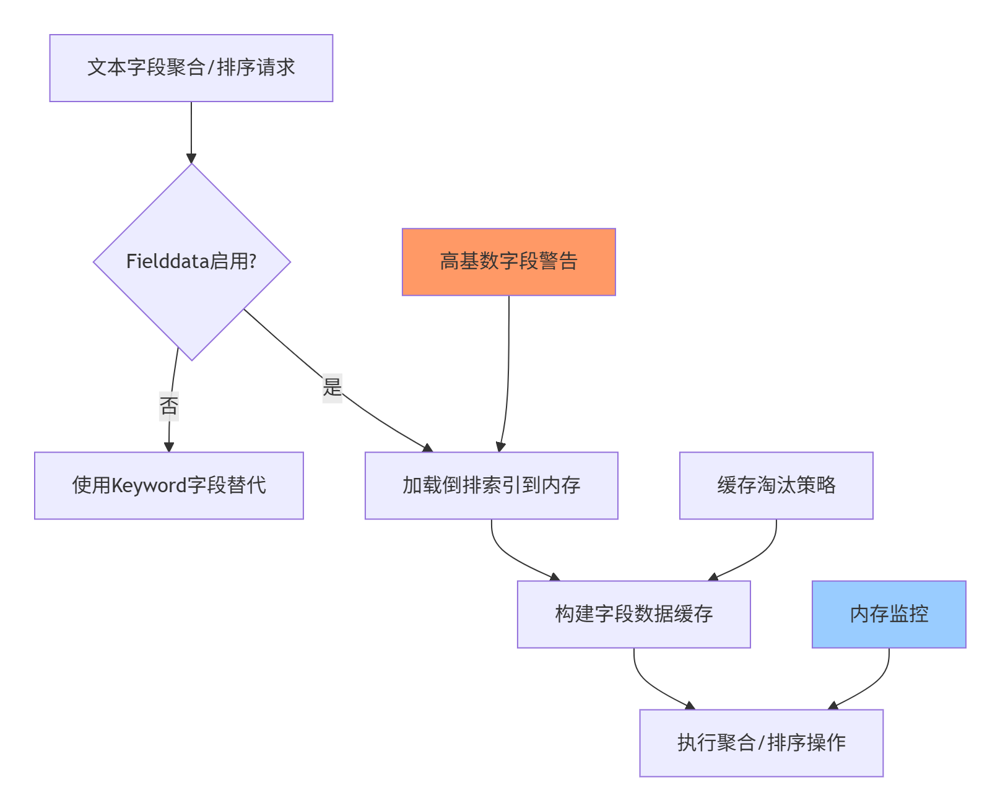

### **2.1.2.1 应用场景**

1.  ✅ 必须使用场景：
2.  文本字段的排序（text field sorting）
3.  文本字段的聚合（terms aggregation on text）
4.  脚本中访问文本字段的分析结果
5.  对分析字段（analyzed text fields）进行聚合时必需
6.  ❌ 避免使用场景：
7.  高基数字段（如email、ID）：避免对唯一值过多的文本字段聚合
8.  大文本字段（如文章内容）：会导致内存爆炸
9.  内存受限的环境：必须设置合理的内存限制
10.  ​在高基数字段上深度分页​：性能极差

### **2.1.2.2 设置实操**

1.  默认不开启，需要在映射中显式设置"fielddata": true。
2.  建议使用keyword类型代替文本字段的fielddata，因为keyword类型使用doc values（正排索引，磁盘结构），更节省内存。
3.  字段数据缓存的大小默认是无限制的，但可以通过indices.fielddata.cache.size来设置节点级别的限制，例如：indices.fielddata.cache.size: 20%（堆内存的20%）。
4.  如果必须使用，可以设置缓存大小限制和断路器，超过会报错）。
5.  也可以通过映射设置"eager\_global\_ordinals": true来预加载全局序数，加快聚合速度。

我们先来修改 elasticsearch.yml：

\# 修改 elasticsearch.yml 限制字段数据缓存大小&Fielddata断路器&估算开销系数

indices.fielddata.cache.size: 20% # Fielddata缓存限制

indices.breaker.fielddata.limit: 40% # Fielddata断路器

indices.breaker.fielddata.overhead: 1.03 # 估算开销系数

1.  indices.fielddata.cache.size - 静态配置，需要重启节点。
2.  indices.breaker.fielddata.limit - 动态配置，可以实时更新。
3.  indices.breaker.fielddata.overhead - 动态配置，可以实时更新。

\# 设置 filedata 动态配置

PUT /\_cluster/settings

{

"persistent": {

"indices.breaker.fielddata.limit": "40%",

"indices.breaker.fielddata.overhead": "1.03"

}

}

  
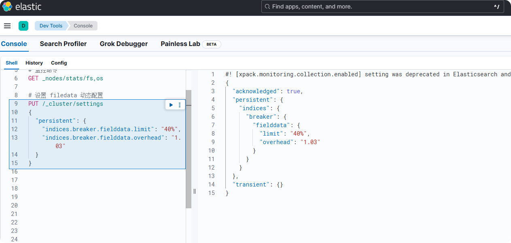

为特定字段启用字段数据:

// 启用 fielddata

PUT /products

{

"mappings": {

"properties": {

"product\_name": {

"type": "text",

"fielddata": true,

"fielddata\_frequency\_filter": {

"min": 0.001, // 最小频率 0.1%

"max": 0.1, // 最大频率 10%

"min\_segment\_size": 100 // 最小段大小

}

}

}

}

}

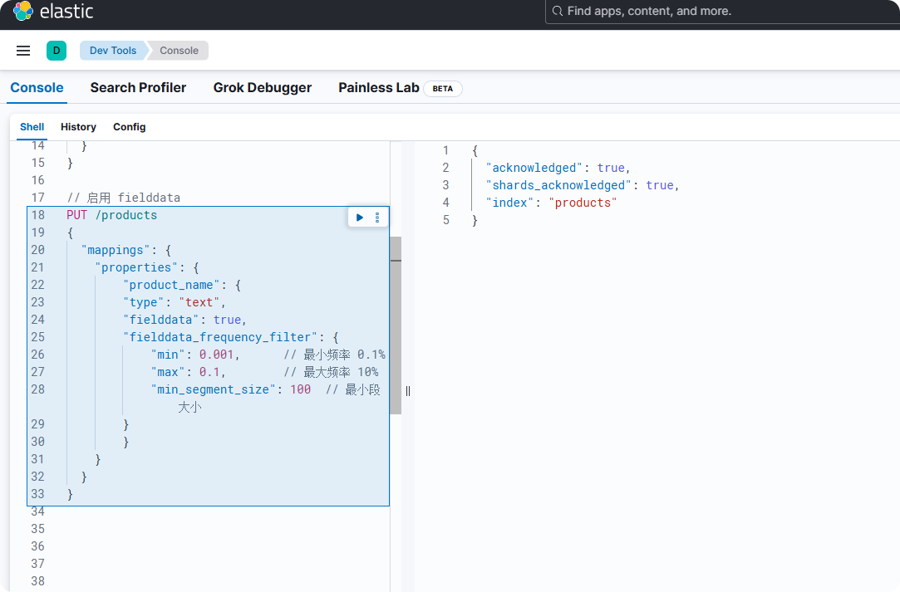

批量写入数据：

\# 批量写入数据

POST /products/\_bulk

{"index":{"\_id":1}}

{"product\_name":"男童加厚羽绒服"}

{"index":{"\_id":2}}

{"product\_name":"儿童中长款90白鸭绒外套"}

{"index":{"\_id":3}}

{"product\_name":"韩版冬装童装小虎宝儿"}

{"index":{"\_id":4}}

{"product\_name":"男童加厚羽绒服"}

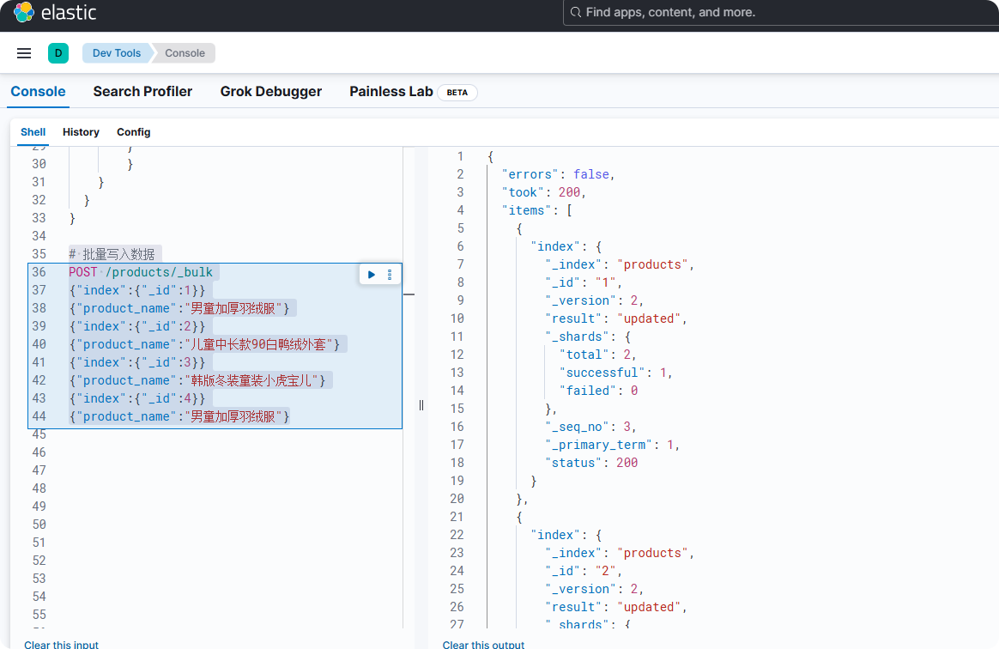

使用 product\_name 字段进行聚合：

\# 使用 product\_name 字段进行聚合

GET products/\_search

{

"size": 0,

"track\_total\_hits": true,

"aggs": {

"popular\_products": {

"terms": {

"field": "product\_name",

"size": 10

}

}

}

}

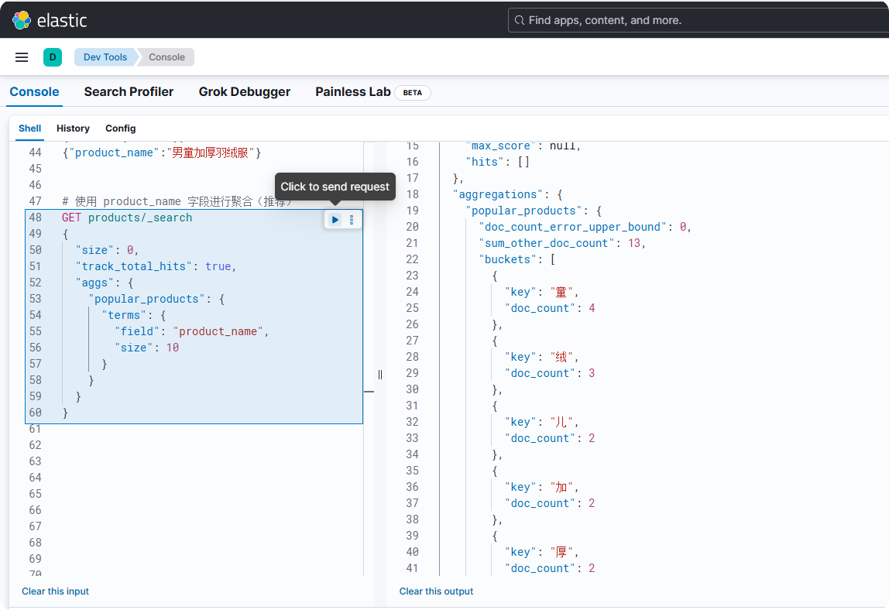

### **2.1.2.3 监控指标**

### **1、查询核心目标**

下面示例查询的目标是：主要用于监控 ES 中Fielddata内存使用情况，特别是对文本字段进行排序、聚合等操作时产生的堆内存占用。Fielddata是ES用于支持文本字段聚合和排序的重要数据结构。

\# Fielddata 监控和管理

GET /\_nodes/stats/indices/fielddata?fields=\*&human

#结果

{

"\_nodes": {

"total": 1,

"successful": 1,

"failed": 0

},

"cluster\_name": "docker-cluster",

"nodes": {

"nUSQHj-mRbytSTCci8xMwA": {

"timestamp": 1761904606485,

"name": "40fe6df21df1",

"transport\_address": "172.17.0.4:9300",

"host": "172.17.0.4",

"ip": "172.17.0.4:9300",

"roles": \[

"data",

"data\_cold",

"data\_content",

"data\_frozen",

"data\_hot",

"data\_warm",

"ingest",

"master",

"ml",

"remote\_cluster\_client",

"transform"

\],

"attributes": {

"ml.allocated\_processors\_double": "4.0",

"ml.max\_jvm\_size": "536870912",

"ml.config\_version": "12.0.0",

"xpack.installed": "true",

"transform.config\_version": "10.0.0",

"ml.machine\_memory": "3904204800",

"ml.allocated\_processors": "4"

},

"indices": {

"fielddata": {

"memory\_size": "1kb",

"memory\_size\_in\_bytes": 1120,

"evictions": 4,

"fields": {

"task.status": {

"memory\_size": "0b",

"memory\_size\_in\_bytes": 0

},

"references.id": {

"memory\_size": "0b",

"memory\_size\_in\_bytes": 0

},

"task.schedule.interval": {

"memory\_size": "0b",

"memory\_size\_in\_bytes": 0

},

"type": {

"memory\_size": "0b",

"memory\_size\_in\_bytes": 0

},

"product\_name": {

"memory\_size": "640b",

"memory\_size\_in\_bytes": 640

},

"task.taskType": {

"memory\_size": "480b",

"memory\_size\_in\_bytes": 480

}

},

"global\_ordinals": {

"build\_time": "19ms",

"build\_time\_in\_millis": 19,

"fields": {

"task.status": {

"build\_time": "0s",

"build\_time\_in\_millis": 0,

"shard\_max\_value\_count": 2

},

"references.id": {

"build\_time": "0s",

"build\_time\_in\_millis": 0,

"shard\_max\_value\_count": 8

},

"task.schedule.interval": {

"build\_time": "0s",

"build\_time\_in\_millis": 0,

"shard\_max\_value\_count": 14

},

"type": {

"build\_time": "0s",

"build\_time\_in\_millis": 0,

"shard\_max\_value\_count": 12

},

"task.taskType": {

"build\_time": "19ms",

"build\_time\_in\_millis": 19,

"shard\_max\_value\_count": 39

}

}

}

}

}

}

}

}

\# Fielddata 按字段查看内存使用

GET /\_cat/fielddata?v&s=size:desc&fields=product\_name,tags

\# 结果

id host ip node field size

nUSQHj-mRbytSTCci8xMwA 172.17.0.4 172.17.0.4 40fe6df21df1 product\_name 640b

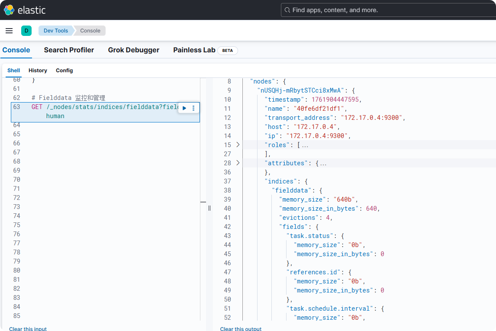

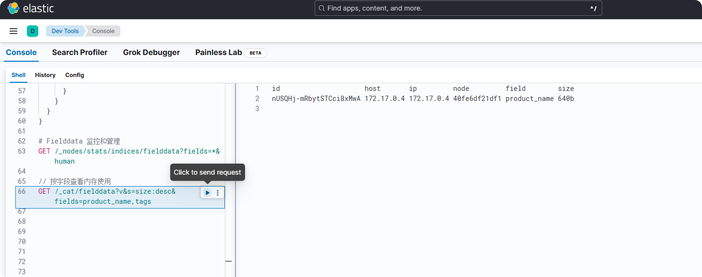

可以对字段缓存进行清理：

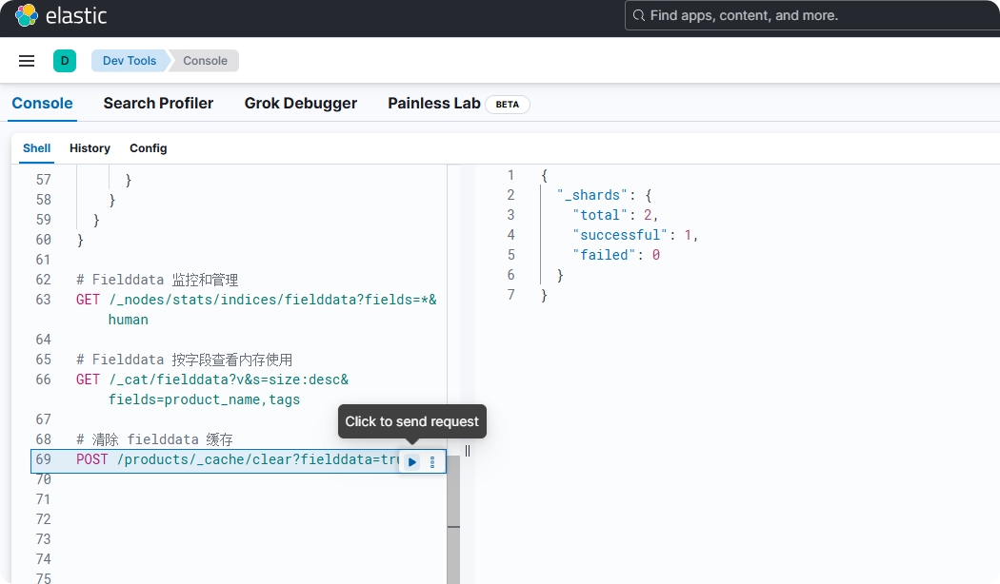

再次监控字段占用情况：

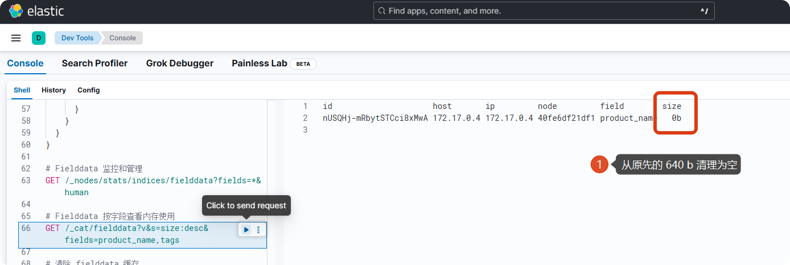

### **2、字段含义详解**

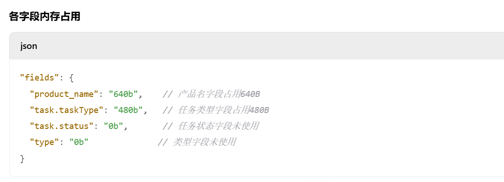

### **3、底层架构设计**

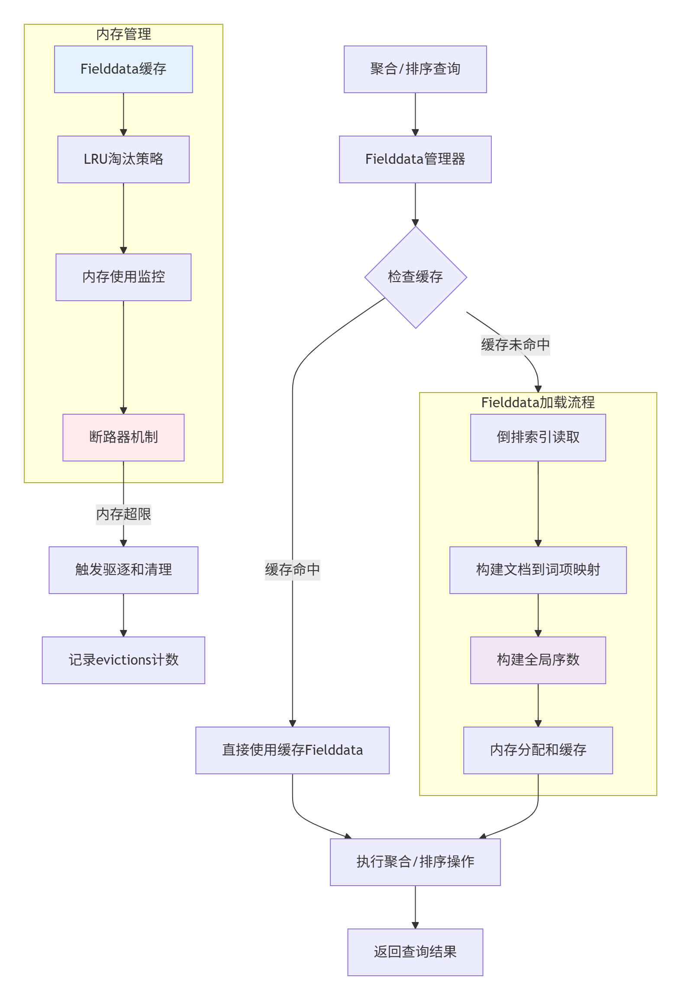

### **4、执行流程**

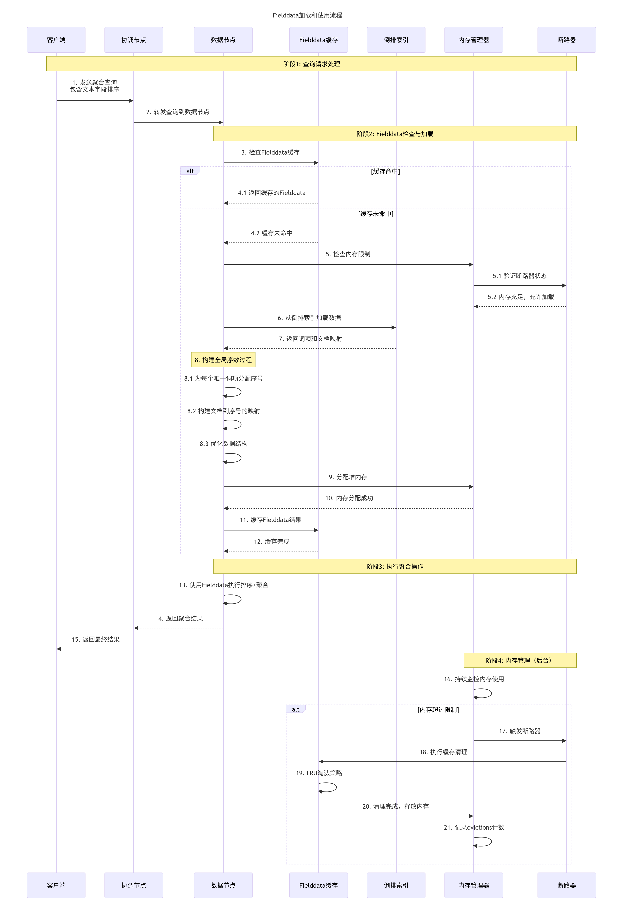

### **2.1.2.4 Fileddata 核心机制**

1\. Fielddata vs Doc Values对比

2\. 全局序数(Global Ordinals)机制：

\# 全局序数构建示例

原始词项: \["apple", "banana", "apple", "cherry"\]

全局序数映射: {"apple": 0, "banana": 1, "cherry": 2}

文档序数序列: \[0, 1, 0, 2\] \# 更紧凑的表示

优势​：

1.  减少内存占用（整数代替字符串）
2.  提高聚合性能（整数运算更快）
3.  支持高效的桶聚合操作

3\. 内存管理机制

\# Elasticsearch配置断路器(Circuit Breaker)设置

indices.breaker.fielddata.limit: "40%" \# Fielddata内存限制

indices.breaker.fielddata.overhead: 1.03 \# 估算开销系数

监控关键指标：

\# 需要关注的监控指标

Fielddata内存使用率 < 60% \# 避免触发断路器

Evictions计数接近0 \# 避免频繁缓存驱逐

全局序数构建时间 < 100ms \# 保证查询性能

### **2.1.3 索引缓冲区 (Indexing Buffer)**

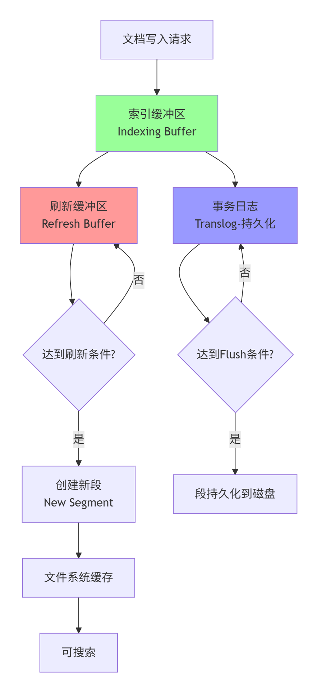

### **2.1.3.1 应用场景**

1.  缓存新写入的文档，然后批量刷新到段文件
2.  提高索引性能

###   
**2.1.3.2 设置实操**

\# elasticsearch.yml 写入优化配置

\# 索引缓冲区大小（集群级别）

indices.memory.index\_buffer\_size: 10%

\# 或者固定值

indices.memory.min\_index\_buffer\_size: 48mb

indices.memory.max\_index\_buffer\_size: 512mb

\# 刷新间隔优化

index.refresh\_interval: "30s" \# 降低刷新频率

index.translog.sync\_interval: "5s" \# Translog同步间隔

index.translog.durability: "async" \# 异步持久化（性能优先）

\# 段合并策略

index.merge.scheduler.max\_merge\_count: 6

index.merge.policy.segments\_per\_tier: 12

### **2.1.3.3 监控指标**

### **1、查询核心目标**

下面示例查询的目标是：主要用于监控ES索引操作的整体性能和缓冲区使用情况。通过分析索引吞吐量、延迟、失败率等关键指标，可以评估集群的写入性能和健康状况。

\# 索引缓冲区使用情况

GET \_nodes/stats/indices/indexing?human

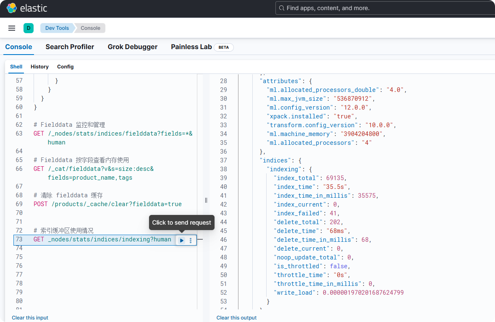

### **2、字段含义详解**

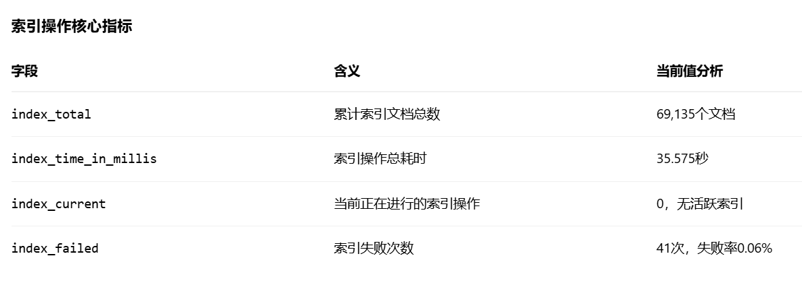

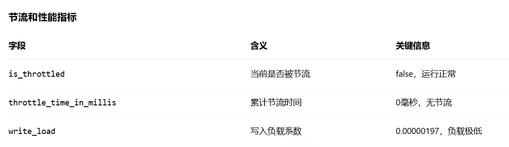

### **3、底层架构设计**

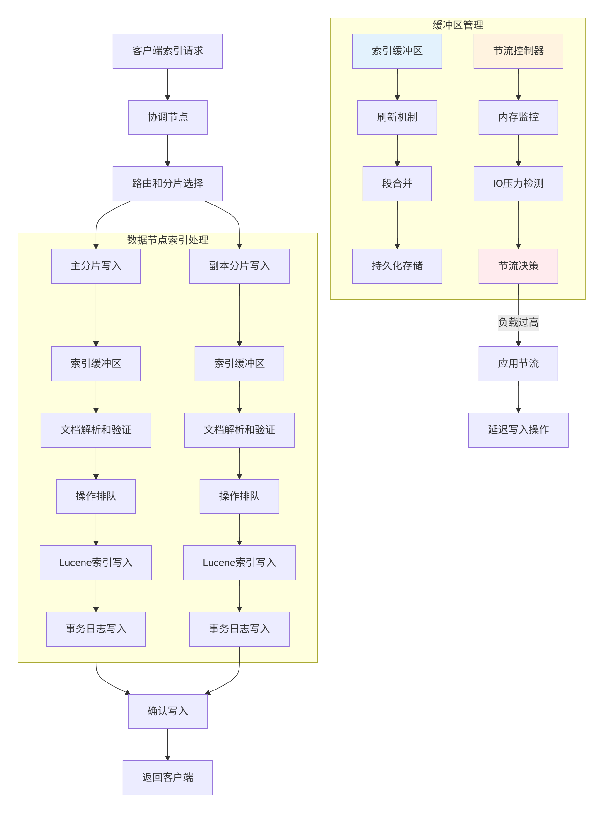

### **4、执行流程**

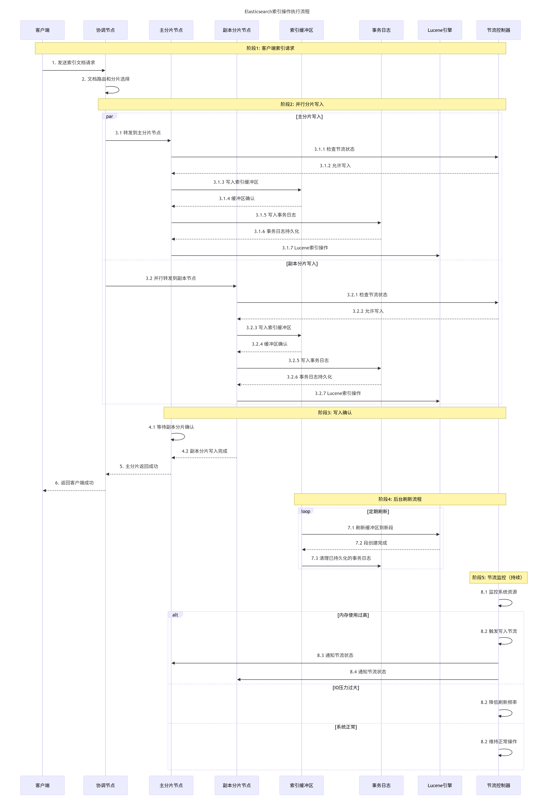

### **5、索引缓冲区核心机制**

1.  索引缓冲区工作流程​：
2.  步骤1: 写入索引缓冲区（内存）
3.  步骤2: 立即写入事务日志（持久化）
4.  步骤3: 定期刷新到Lucene（可搜索）
5.  步骤4: 事务日志清理
6.  节流机制详解
7.  节流触发条件​：
8.  ​内存压力​：索引缓冲区使用率超过阈值
9.  ​IO压力​：磁盘IO使用率持续高位
10.  ​CPU压力​：索引线程池队列积压
11.  节流响应策略​：
12.  \# 节流级别和应对措施
13.  轻度节流:
14.  \- 降低刷新频率
15.  \- 增加缓冲区刷新间隔
16.  中度节流:
17.  \- 限制单个批量请求大小
18.  \- 增加索引操作延迟
19.  重度节流:
20.  \- 拒绝部分写入请求
21.  \- 返回429状态码
22.  性能监控关键指标

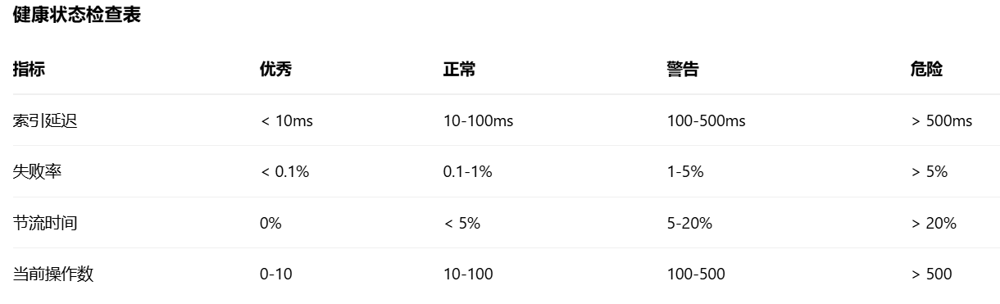

### **2.1.4 节点查询缓存(Node Query Cache)**

缓存查询结果中每个分片的查询结果。主要针对Filter上下文查询，因为Filter查询的得分是固定的适合缓存。当相同的过滤条件再次出现时，可以直接使用缓存，避免重新计算。

> 注意，只有被频繁使用的Filter查询才会从缓存中受益。这里缓存的是查询阶段（query phase）的结果，即满足查询条件的文档ID集合（bitset）。主要用于频繁使用的查询条件，尤其是过滤查询（filter context），因为filter context的查询结果不计算相关性得分，可以缓存。

查询缓存（Query Cache）主要用于缓存查询结果，但并不是所有的查询都会使用查询缓存。关于ES查询缓存的要点：

1.  查询缓存只缓存在Filter上下文中使用的查询（例如：在bool查询的filter子句中的查询）。因为Filter上下文查询的结果是二元的（是否匹配），并且不计算相关性分数，因此可以缓存。
2.  查询缓存是节点级别的，每个节点有一个查询缓存，被该节点上的所有分片共享。
3.  默认情况下，查询缓存是开启的，但是每个查询默认并不使用缓存。你需要在查询时通过设置"cache": true来显式开启对某个查询的缓存。
4.  查询缓存使用LRU（最近最少使用）策略来淘汰缓存。
5.  如果索引的数据频繁更新，那么查询缓存的效率会很低，因为任何索引的更改都会使相关的缓存失效。

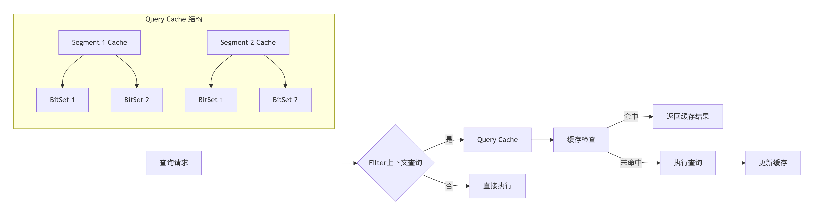

### **2.1.4.1 应用场景**

1.  ✅ 适合场景：
2.  频繁的过滤条件（status=active, category=electronics）
3.  范围查询（date >= '2025-01-01'）
4.  权限过滤（user\_id = 123）
5.  ❌ 不适合场景：
6.  全文搜索（match query）
7.  评分查询（带有boost）
8.  数据频繁更新的索引

### **2.1.4.2 设置实操**

节点查询缓存大小默认是堆内存的10%，可以通过[indices.queries.cache.size](http://indices.queries.cache.size/)设置。例如，设置为堆内存的20%：indices.queries.cache.size: 20%。

修改 elasticsearch.yml配置：

\# elasticsearch.yml 配置

indices.queries.cache.size: 10% \# 默认堆内存的10%

indices.queries.cache.count: 10000 \# 缓存条目数

1.  默认开启，缓存大小默认为堆内存的10%。注意，这是一个节点级别的设置。
2.  可以通过索引设置 index.queries.cache.enabled 来控制单个索引的启用状态（true/false）。
3.  只有在过滤查询（如term、range、bool filter）时使用。
4.  每个段（segment）的缓存信息，段合并后缓存失效。

### **2.1.4.3 监控指标**

我们来重新搞一个索引：

\# 启用查询缓存

PUT products

{

"settings": {

"index.queries.cache.enabled": true

},

"mappings": {

"properties": {

"product\_name": {

"type": "text"

}

}

}

}

  
\# 启用查询缓存

PUT products

{

"settings": {

"index.queries.cache.enabled": true

},

"mappings": {

"properties": {

"product\_name": {

"type": "text",

"fields": {

"keyword": {

"type": "keyword"

}

}

},

"price": {

"type": "integer"

},

"category": {

"type": "keyword"

}

}

}

}

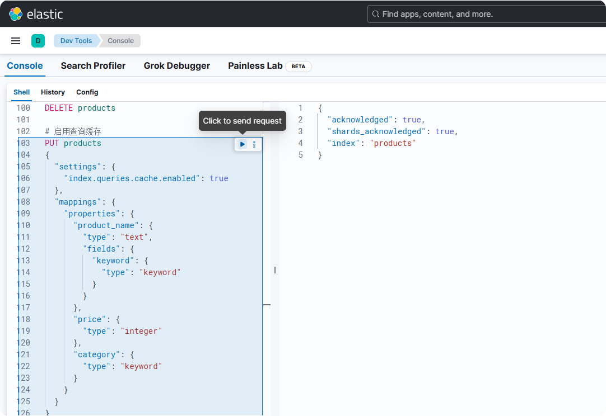

\# 批量写入数据

POST /products/\_bulk

{"index":{"\_id":1}}

{"product\_name":"男童加厚羽绒服","price":299,"category":"服装"}

{"index":{"\_id":2}}

{"product\_name":"儿童中长款90白鸭绒外套","price":399,"category":"服装"}

{"index":{"\_id":3}}

{"product\_name":"韩版冬装童装小虎宝儿","price":199,"category":"服装"}

{"index":{"\_id":4}}

{"product\_name":"男童加厚羽绒服","price":259,"category":"服装"}

{"index":{"\_id":5}}

{"product\_name":"女童轻薄羽绒服","price":189,"category":"服装"}

{"index":{"\_id":6}}

{"product\_name":"儿童保暖内衣套装","price":89,"category":"内衣"}

{"index":{"\_id":7}}

{"product\_name":"男童加厚羽绒服","price":329,"category":"服装"}

{"index":{"\_id":8}}

{"product\_name":"儿童防风外套","price":159,"category":"服装"}

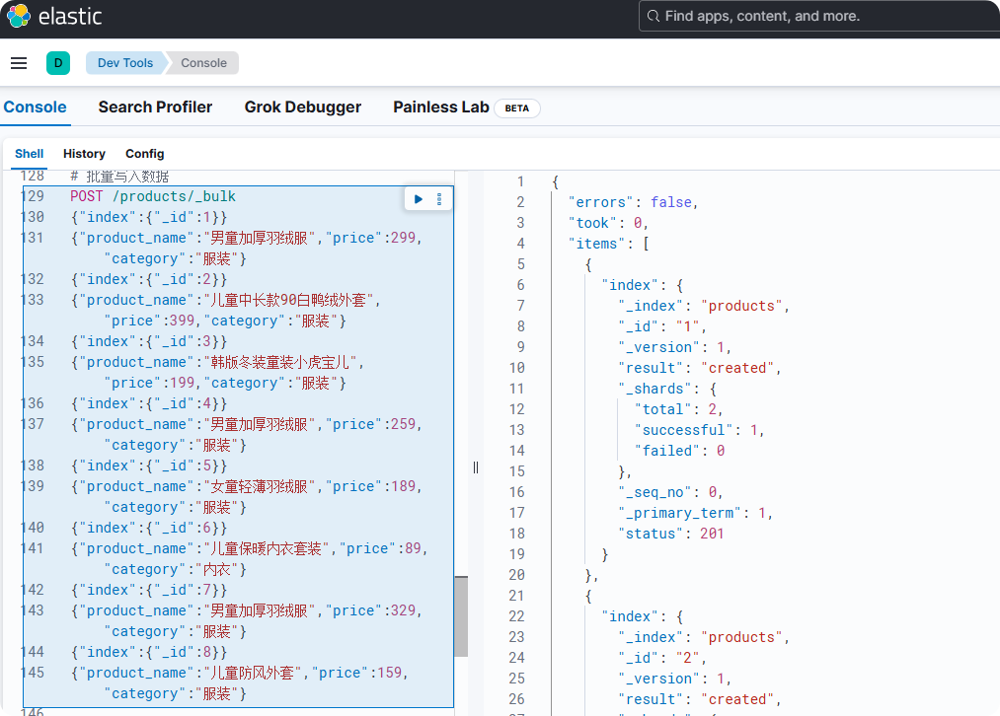

\# 在查询中利用查询缓存（filter自动使用）

GET products/\_search

{

"query": {

"bool": {

"filter": \[

{

"term": {

"product\_name.keyword": "男童加厚羽绒服"

}

},

{

"range": {

"price": {

"gte": 200,

"lte": 400

}

}

}

\]

}

}

}

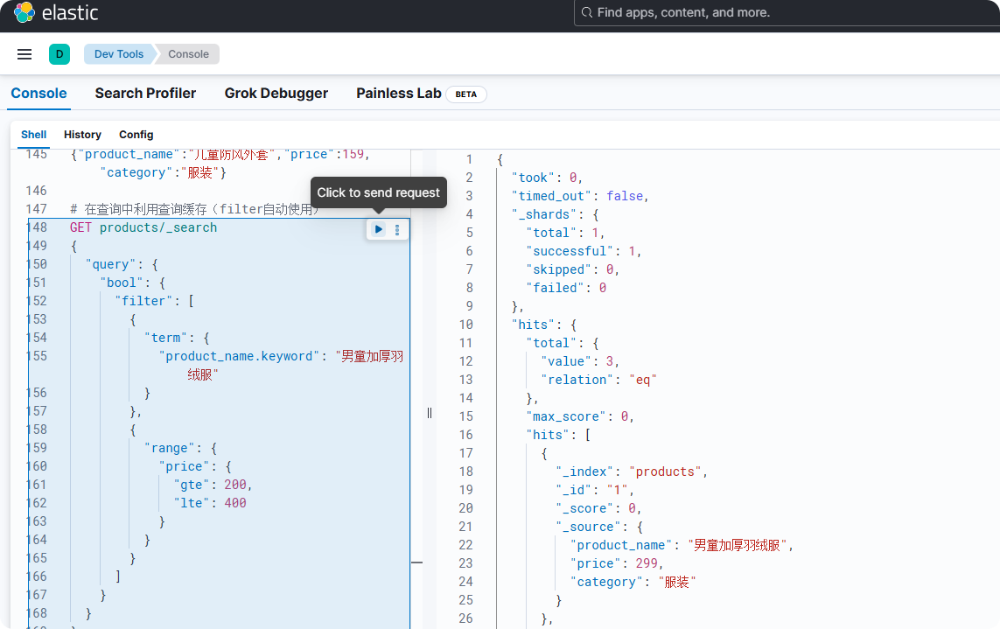

### **1、查询核心目标**

下面示例查询的目标是：主要用于监控ES节点级别查询缓存的使用情况和性能效果。查询缓存是ES中用于缓存查询结果的重要组件，可以显著提升重复查询的响应速度。

GET /\_nodes/stats/indices/query\_cache?human

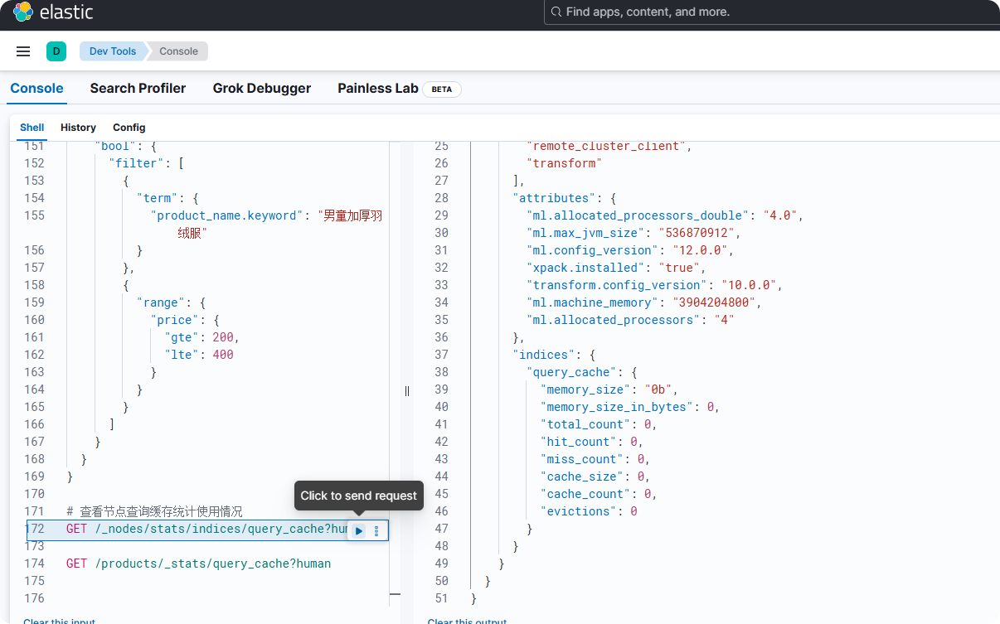

### **2、字段含义详解**

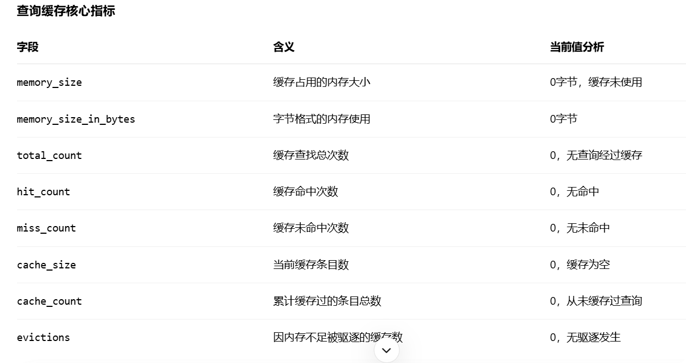

### **3、底层架构设计**

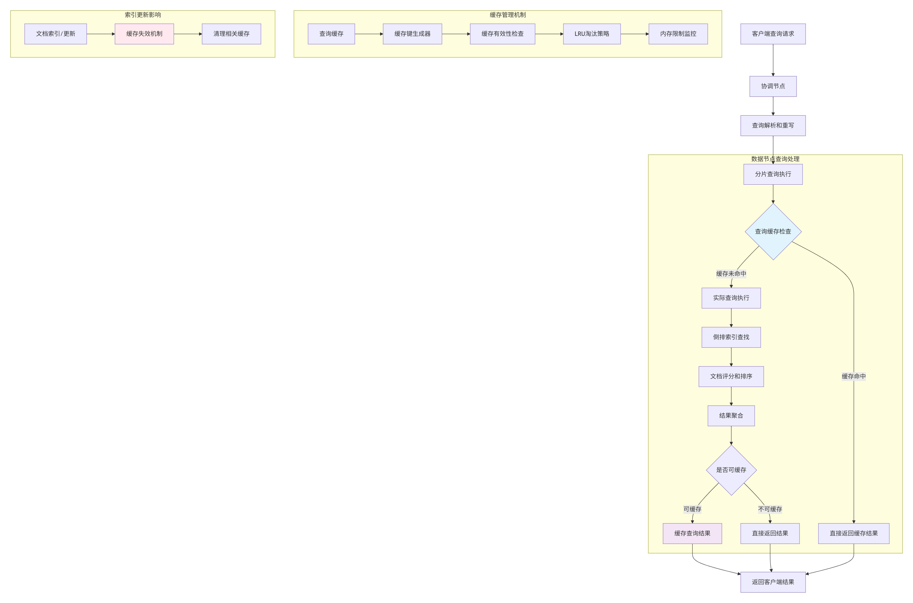

### **4、执行流程**

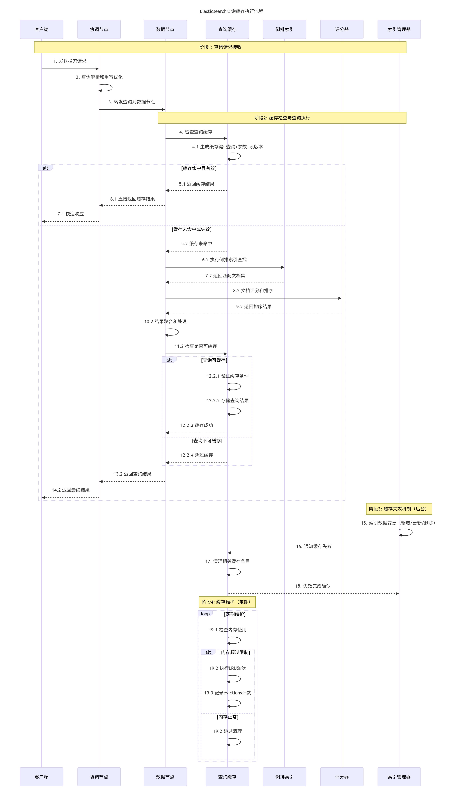

### **4、查询缓存核心机制**

1.  缓存键生成
2.  缓存条件判断
3.  ​可缓存的条件​：
4.  ✅ 查询类型支持缓存（term、terms、match等）
5.  ✅ 查询涉及的分片段版本未变更
6.  ✅ 结果集大小在合理范围内
7.  ✅ 查询不包含实时性要求极高的参数
8.  ​不可缓存的情况​：
9.  ❌ 范围查询（range）、通配符查询（wildcard）
10.  ❌ 脚本查询（script）
11.  ❌ 高实时性要求（preference参数）
12.  ❌ 结果集过大，超过内存限制
13.  缓存失效策略
14.  ​基于段的失效机制​：
15.  索引段版本变更 → 所有相关缓存自动失效
16.  文档增删改 → 影响段版本 → 触发缓存清理
17.  段合并操作 → 段版本更新 → 缓存重建

## **2.2 查询执行缓存**

### **2.2.1 分片请求缓存(Shard Request Cache）**

缓存整个分片的查询结果，包括聚合结果。但默认只缓存结果集较大的请求（如超过10%的文档被命中），并且只缓存那些不会立即过时的数据（如size:0的搜索请求）。当分片数据没有变化时，缓存可以重用。

> 注意，默认情况下，请求缓存是关闭的，因为它只缓存size:0的请求。

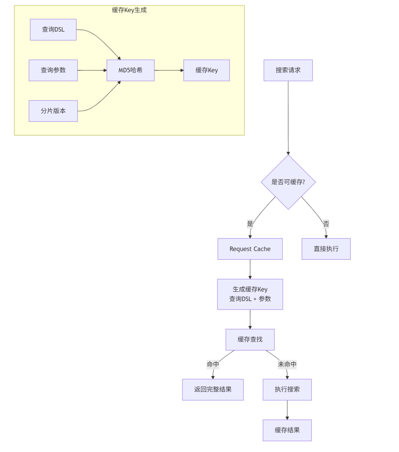

###   
**2.2.1.1 应用场景**

1.  ✅ 适合场景：
2.  监控仪表板聚合查询
3.  报表生成（size: 0的查询）
4.  数据不频繁变化的索引
5.  实时性要求不高的统计
6.  ❌ 不适合场景：
7.  数据频繁更新的索引
8.  需要返回大量文档的查询
9.  实时搜索

### **2.2.1.2 设置实操**

全局默认值可以通过修改 elasticsearch.yml 配置：

\# elasticsearch.yml

indices.requests.cache.size: 3% \# 默认1%，可适当调大

indices.requests.cache.expire: null \# ES 8.x 不支持过期时间

  
通过在搜索请求中设置request\_cache=true来开启，当索引数据发生变化时，缓存自动失效。

\# 启用请求缓存的搜索

GET kibana\_sample\_data\_flights/\_search?request\_cache=true

{

"size": 0, // 关键：不返回具体文档

"query": {

"range": {

"timestamp": {

"gte": "2025-08-18T00:00:00",

"lte": "now"

}

}

},

"aggs": {

"timestamp\_date\_histogram": {

"date\_histogram": {

"field": "timestamp",

"calendar\_interval": "month"

}

}

}

}

  
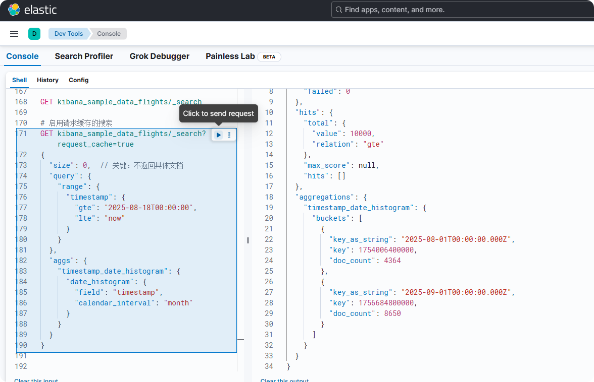

### **2.2.1.3 监控指标**

### **1、查询核心目标**

下面示例查询的目标是：主要用于监控ES请求缓存的使用情况和性能效果。请求缓存是分片级别的缓存，专门用于缓存聚合查询结果，对于频繁的聚合操作可以显著提升性能。

\# 查看请求缓存情况

GET /\_nodes/stats/indices/request\_cache?human&filter\_path=\*\*.request\_cache

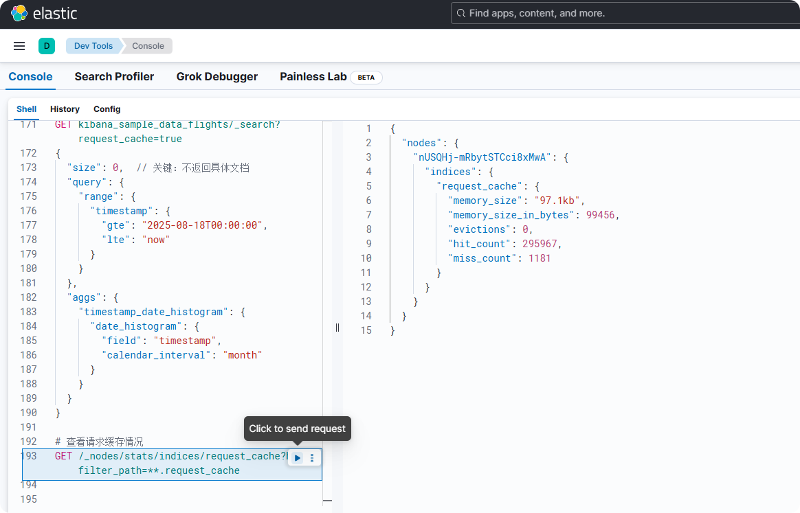

### **2、字段含义详解**

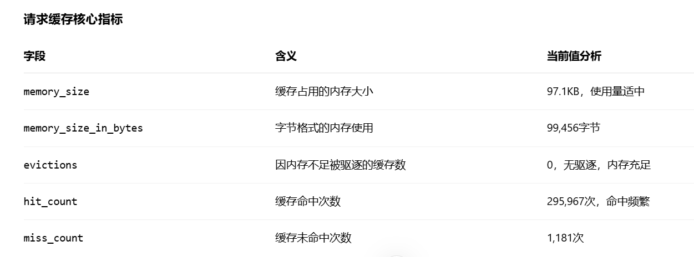

### **3、性能指标分析**

缓存命中率分析：

总请求数 = 命中数 + 未命中数 = 295,967 + 1,181 = 297,148次

命中率 = 命中数 / 总请求数 = 295,967 / 297,148 ≈ 99.6%

性能评估：

1.  ✅ ​命中率极高​：99.6%的命中率，缓存效果优秀
2.  ✅ ​内存使用合理​：97.1KB内存，占用很小
3.  ✅ ​无驱逐现象​：evictions为0，内存配置充足
4.  ✅ ​缓存效果显著​：大量重复查询被有效缓存

### **4、底层架构设计**

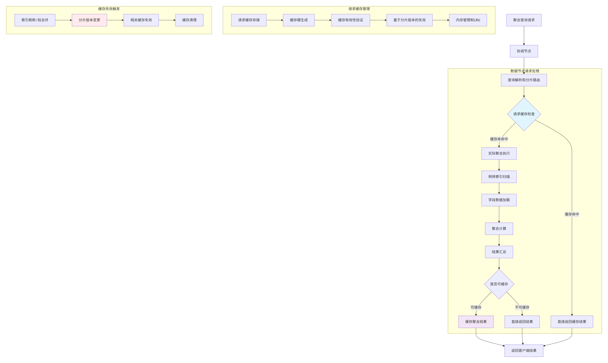

### **4、执行流程**

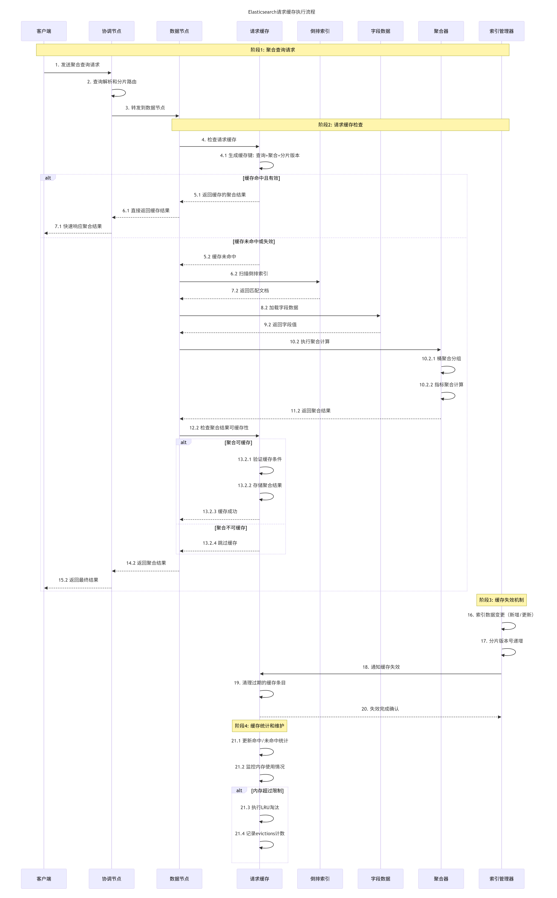

### **5、请求缓存核心机制**

1.  缓存键生成
2.  缓存条件判断
3.  ​适合缓存的聚合类型​：
4.  ✅ ​桶聚合​：terms、date\_histogram、range等
5.  ✅ ​指标聚合​：sum、avg、min、max、stats等
6.  ✅ ​嵌套聚合​：多级聚合组合
7.  ✅ ​过滤聚合​：filter、filters等
8.  ​不适合缓存的情况​：
9.  ❌ 包含脚本的聚合（scripted\_metric）
10.  ❌ 使用随机函数的聚合（具有非确定性）
11.  ❌ 实时性要求极高的监控聚合
12.  ❌ 结果集过大的聚合（内存限制）
13.  缓存失效策略
14.  ​基于分片版本的精确失效​：
15.  索引数据变更 → 分片版本号递增 → 相关缓存自动失效
16.  段合并操作 → 分片版本更新 → 缓存重建
17.  手动刷新 → 版本变更 → 清理缓存

### **6、监控关键指标**

### **2.2.2 聚合缓存(Aggregation Cache）**

### **2.2.2.1 应用场景**

ES 8.x 引入了聚合缓存，用于缓存聚合结果。当相同的聚合查询再次执行时，可以直接返回缓存结果。这对于重复的聚合查询非常有效。

### **2.2.2.2 设置实操**

全局默认值可以通过修改 elasticsearch.yml 配置：

1.  通过search.aggs.cache.enabled开启或关闭，默认是开启的。
2.  缓存大小通过search.aggs.cache.size设置，默认是堆内存的2%。

\# elasticsearch.yml

\# 聚合缓存

search.aggs.cache.enabled: true

search.aggs.cache.size: 5%

### **2.2.2.3 聚合缓存示例**

下面示例通过aggs\_cache=true|false参数控制是否对航班数据的聚合查询结果进行缓存。通过对比启用和禁用缓存时的性能差异，可以评估请求缓存对重复聚合查询的优化效果。

### **1、启动聚合缓存**

\# 启用聚合缓存的查询

GET kibana\_sample\_data\_flights/\_search?request\_cache=true

{

"size": 0,

"aggs": {

"carrier\_stats": {

"terms": {

"field": "Carrier",

"size": 10

},

"aggs": {

"avg\_price": {

"avg": {

"field": "AvgTicketPrice"

}

},

"total\_delay": {

"sum": {

"field": "FlightDelayMin"

}

},

"delay\_ratio": {

"bucket\_script": {

"buckets\_path": {

"delayed": "total\_delay",

"total": "\_count"

},

"script": "params.delayed / params.total \* 100"

}

}

}

},

"weekly\_trend": {

"date\_histogram": {

"field": "timestamp",

"calendar\_interval": "week"

},

"aggs": {

"avg\_distance": {

"avg": {

"field": "DistanceMiles"

}

}

}

}

}

}

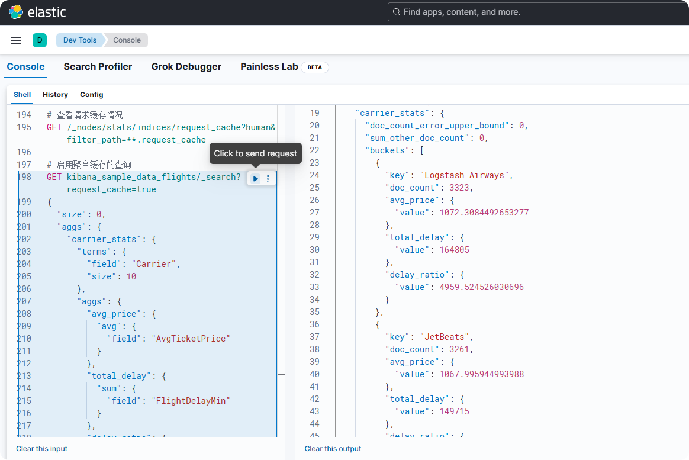

### **2、禁用聚合缓存**

\# 禁用聚合缓存的查询

GET kibana\_sample\_data\_flights/\_search?request\_cache=true

{

"size": 0,

"aggs": {

"carrier\_stats": {

"terms": {

"field": "Carrier",

"size": 10

},

"aggs": {

"avg\_price": {

"avg": {

"field": "AvgTicketPrice"

}

},

"total\_delay": {

"sum": {

"field": "FlightDelayMin"

}

},

"delay\_ratio": {

"bucket\_script": {

"buckets\_path": {

"delayed": "total\_delay",

"total": "\_count"

},

"script": "params.delayed / params.total \* 100"

}

}

}

},

"weekly\_trend": {

"date\_histogram": {

"field": "timestamp",

"calendar\_interval": "week"

},

"aggs": {

"avg\_distance": {

"avg": {

"field": "DistanceMiles"

}

}

}

}

}

}

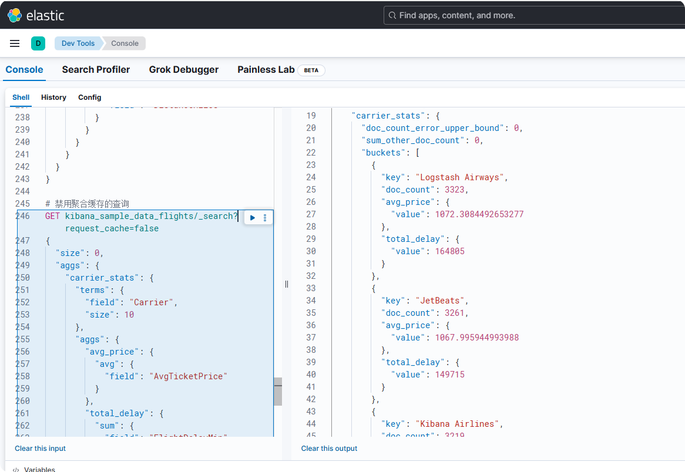

### **3、聚合功能说明**

1.  carrier\_stats: 按航空公司分组的统计分析
2.  ​weekly\_trend: 按周统计的时间趋势分析
3.  ​routes\_analysis: 航线分析，包含嵌套聚合

### **4、底层架构设计**

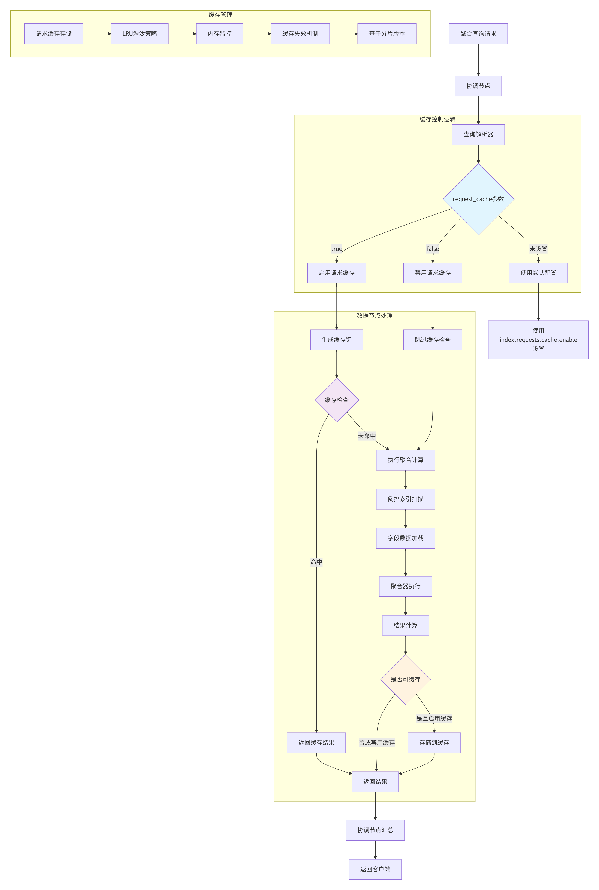

### **5、执行流程**

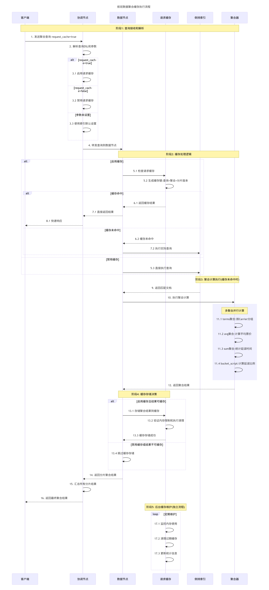

执行流程详细说明：

1.  阶段1：查询接收和解析
2.  ​客户端发送请求​：包含request\_cache=true参数的聚合查询
3.  ​协调节点解析​：解析查询DSL和缓存参数
4.  ​缓存策略决策​：根据参数决定是否启用请求缓存
5.  阶段2：缓存处理逻辑
6.  ​启用缓存路径​：
7.  数据节点检查请求缓存
8.  生成唯一缓存键（基于查询+聚合+分片版本）
9.  如果缓存命中，直接返回结果，大幅提升性能
10.  ​禁用缓存路径​：
11.  跳过缓存检查，直接执行查询
12.  适用于实时性要求高的场景
13.  阶段3：聚合计算执行（缓存未命中时）
14.  ​倒排索引扫描​：查找匹配的航班文档
15.  ​多聚合并行计算​：
16.  按航空公司分组统计
17.  计算平均票价、延误时间等指标
18.  执行复杂的桶脚本计算
19.  阶段4：缓存存储决策
20.  ​可缓存条件​：启用缓存且结果可缓存（无脚本、非实时等）
21.  ​缓存存储​：验证内存限制，必要时执行LRU清理
22.  ​跳过存储​：禁用缓存或结果不可缓存的情况
23.  阶段5：后台缓存维护
24.  ​内存监控​：持续监控缓存内存使用情况
25.  ​过期清理​：基于分片版本失效机制清理过期缓存
26.  ​统计更新​：维护命中率、内存使用等统计信息

## **2.3 缓存优化实战**

### **2.3.1 内存分配**

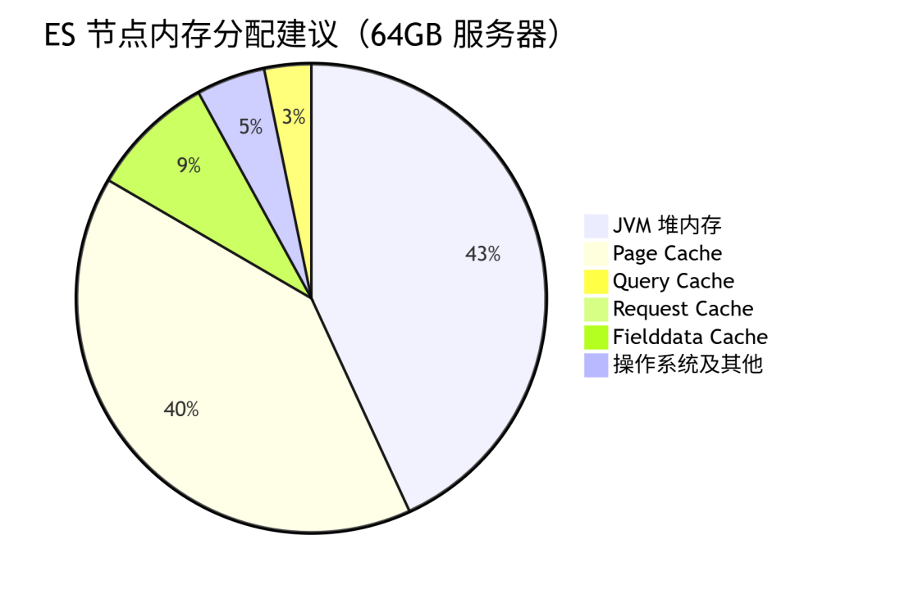

### **2.3.2 配置示例**

\# elasticsearch.yml - 生产环境配置

\# JVM 堆内存（30GB）

\-Xms30g

\-Xmx30g

\# 查询缓存配置

indices.queries.cache.size: 7.5% \# 30GB \* 7.5% = 2.25GB

indices.queries.cache.count: 100000

\# 请求缓存配置

indices.requests.cache.size: 1.5% \# 30GB \* 1.5% = 0.45GB

\# Fielddata 配置

indices.fielddata.cache.size: 20% \# 30GB \* 20% = 6GB

\# 断路器配置

indices.breaker.fielddata.limit: 40%

indices.breaker.request.limit: 60%

indices.breaker.total.limit: 70%

\# 刷新策略

index.refresh\_interval: "30s"

index.translog.durability: "async"

### **2.3.3 缓存配置**

### **2.3.4 监控调优**

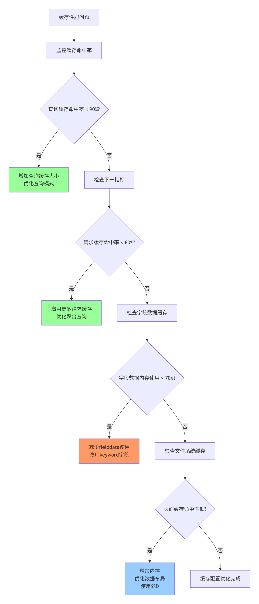

### **2.3.5 监控命令集**

\# 1. 综合缓存监控看板

GET \_nodes/stats/indices/query\_cache,request\_cache,fielddata?human

\# 2. 文件系统缓存监控

GET \_nodes/stats/os,fs?filter\_path=\*\*.cached,\*\*.used,\*\*.free

\# 3. 查询缓存命中率分析

GET \_stats/query\_cache?filter\_path=\*\*.query\_cache

\# 4. 字段数据内存使用TOP 10

GET \_cat/fielddata?v&s=memory\_size:desc&bytes=mb

\# 5. 索引缓冲区使用情况

GET \_nodes/stats/indices/indexing?human

\# 6. 实时监控脚本（每30秒刷新）

watch -n 30 'curl -sX GET "localhost:9200/\_nodes/stats/indices/query\_cache?pretty"'

### **2.3.6 故障排查与优化**

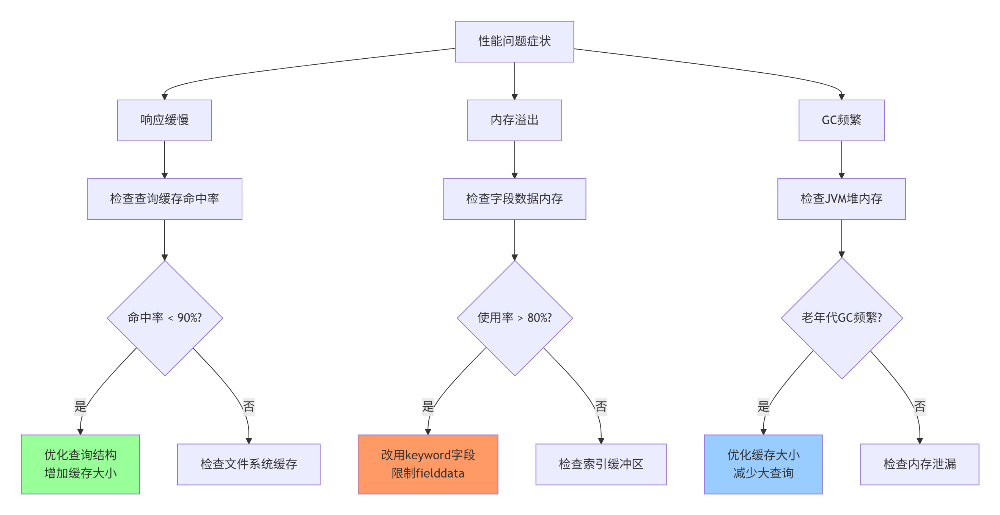