从今天之后的一段时间内，华仔会带着大家一起来从零开始对 ElasticStack 矩阵产品进行深入剖析和项目运维实战，希望大家学完之后可以用到自己的工作中。

这是第二十五篇，本篇我将带着大家进行「**ES 8.x 深度分页查询&调优实操**」。

文章汇总位置：[https://wx.zsxq.com/dweb2/index/columns/51122554151214](https://wx.zsxq.com/dweb2/index/columns/51122554151214)

## **01 前言**

在上篇中[【ES 入门实战第二十四篇】基于设计模式自研ES 8.x 集群高可用同步/异步客户端实战](https://articles.zsxq.com/id_ikaahmv3vrq8.html)，带着大家进行「**基于设计模式自研ES 8.x 集群高可用同步/异步客户端实战**」。

今天我们来进行「**ES 8.x 分页查询 & 深度分页调优实操**」。

##   
**02 ES 8.x 分页查询实战**

我们知道从 ES 索引中获取数据时分页是绕不开的操作，如果一下子从索引中获取「**过多数据**」可能会造成「**系统抖动**」、「**占用大量带宽**」等问题。

特别是进行「**全文搜索**」时只关心「**相关性最高**」的几条结果，从系统中拉取过多的数据等于浪费资源。

  
ES 官方提供了 3 种分页方式：

1.  from + size：这是最普通、最简单的分页方式，但是会产生「**深分页**」的问题。
2.  search after：解决了「**深分页**」的问题，但只能一页一页地往下翻，不支持跳转到指定页数。
3.  scroll API：会创建数据快照，无法检索新写入的数据，适合对结果集进行遍历的时候使用。

  
这 3 种方式的分页操作都有其优缺点，适合不同的场合使用。接下来学习这 3 种分页方式，在最后我们会介绍 ES 新引入的特性：Point In Time，看看如何使用 Point In Time + search after 的方式来代替 scroll API 进行大量数据的查询。

##   
**2.1 分页查询官方文档**

官方文档地址：[https://www.elastic.co/guide/en/elasticsearch/reference/8.17/paginate-search-results.html](https://www.elastic.co/guide/en/elasticsearch/reference/8.17/paginate-search-results.html)

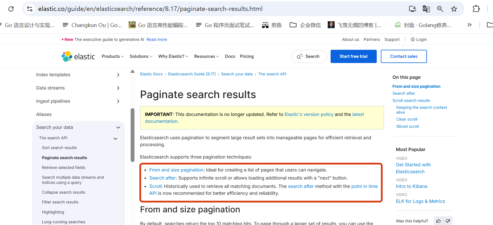

##   
**2.2 分页查询案例**

今天的案例我们以前面搞的电商大数据为主（大概 1200 万条数据），具体生成实操看这篇：[【ES 入门实战第十八篇】ES 8.x 使用 Rollup && Transform处理海量数据深度实战及避坑指南](https://articles.zsxq.com/id_in6daz3tj68d.html)

  
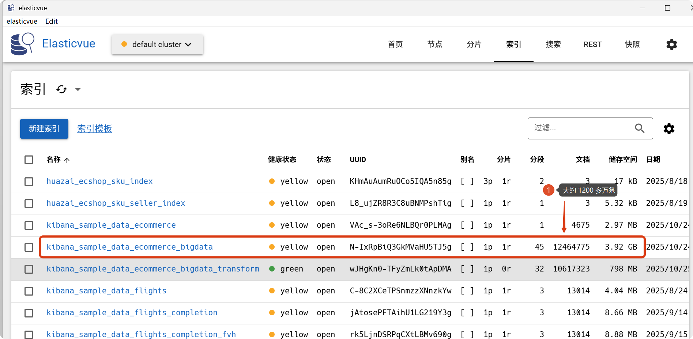

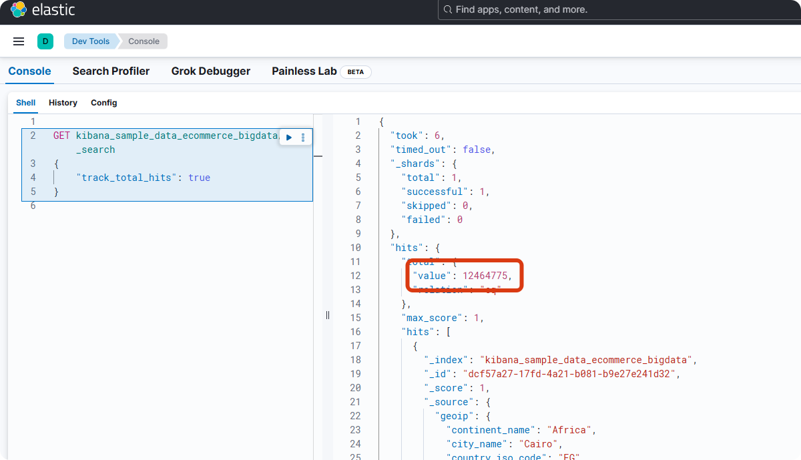

## **2.3 from + size 分页查询**

### **2.3.1 查询核心目标**

在搜索数据时，系统会对数据按照「**相关性算分**」进行排序，然后默认返回前 10 条数据。我们可以使用「**from + size**」来指定获取哪些数据。

下面示例查询的目标是：​针对电商订单数据的简单分页查询。

\# 简单的分页操作

GET kibana\_sample\_data\_ecommerce\_bigdata/\_search

{

"from": 100, # 指定开始位置

"size": 20, # 指定获取文档个数

"query": {

"match\_all": {}

}

}

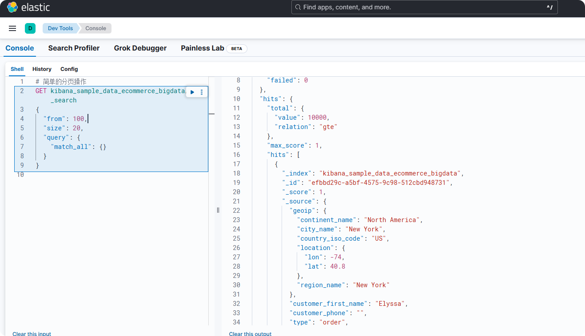

### **1、订单基础信息**

{

"type": "order", // 文档类型：订单

"order\_id": "order\_3fd76c4e...", // 订单唯一标识

"order\_date": "2025-10-30T02:15:22+00:00", // 下单时间

"day\_of\_week": "Thursday", // 星期几

"day\_of\_week\_i": 3 // 星期数字表示（0=周日）

}

### **2、客户信息**

{

"customer\_first\_name": "Elyssa", // 客户名

"customer\_last\_name": "Barber", // 客户姓

"customer\_full\_name": "Elyssa Barber", // 客户全名

"customer\_id": "customer\_78159.0", // 客户ID

"customer\_gender": "FEMALE", // 客户性别

"email": "user\_3085.0@example.com", // 邮箱

"customer\_phone": "", // 电话

"user": "elyssa" // 用户名

}

### **3、商品信息**

"products": \[

{

"product\_id": 22416, // 商品ID

"product\_name": "Jersey dress - black/grey", // 商品名称

"manufacturer": "Tigress Enterprises", // 制造商

"category": "Women's Clothing", // 商品分类

"sku": "ZO0051800518", // 库存单位

"quantity": 1, // 购买数量

"price": 32.99, // 单价

"taxful\_price": 32.99, // 含税价格

"taxless\_price": 32.99 // 不含税价格

}

\]

### **4、地理位置信息**

"geoip": {

"continent\_name": "North America", // 大洲

"country\_iso\_code": "US", // 国家代码

"region\_name": "New York", // 地区

"city\_name": "New York", // 城市

"location": { "lon": \-74, "lat": 40.8 } // 经纬度

}

### **5、订单金额信息**

{

"currency": "EUR", // 货币类型

"taxless\_total\_price": 92.98, // 不含税总价

"taxful\_total\_price": 92.98, // 含税总价

"total\_quantity": 2, // 总商品数量

"total\_unique\_products": 2 // 唯一商品数

}

### **2.3.2 底层架构设计**

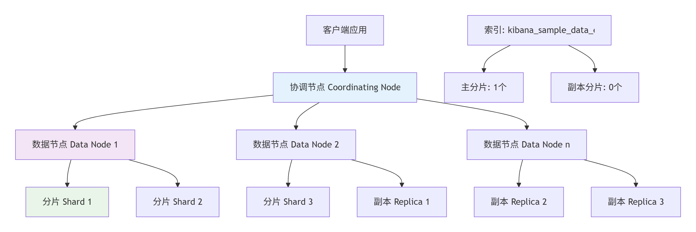

### **2.3.3 执行流程**

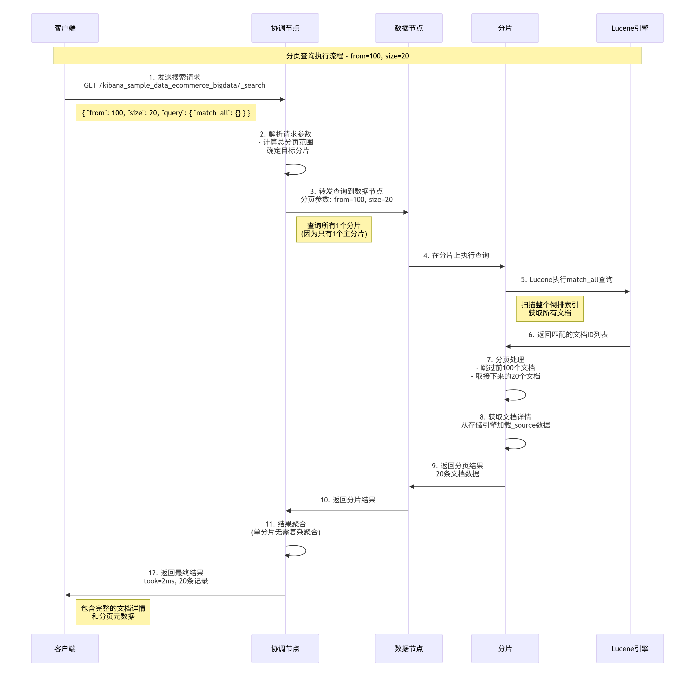

详细执行步骤解析:

1.  阶段1: 查询解析与路由
2.  协调节点解析 from=100, size=20
3.  确定需要查询的分片列表（本例只有1个分片）
4.  计算每个分片需要获取的文档数量
5.  阶段2: 分片级别查询执行
6.  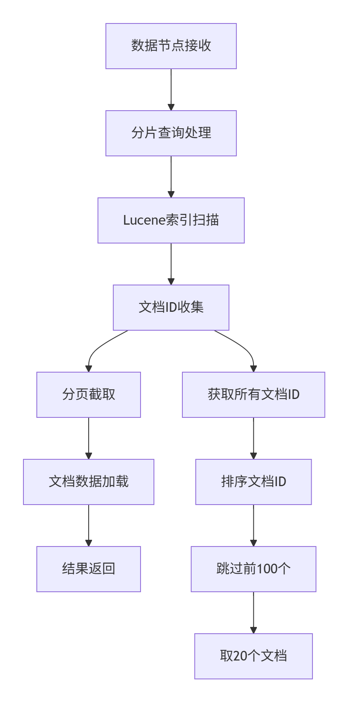
7.  阶段3: 结果聚合与返回
8.  由于本例只有1个分片，聚合过程很简单：
9.  单分片结果：直接使用分片返回的结果
10.  无需排序合并：没有多个分片需要合并排序
11.  统计信息计算：汇总分片的统计信息

### **2.3.4 深分页问题**

上面示例当我们将 from 设置大于 10000 或者 size 设置大于 10001 的时候，这个查询将会报错：

  
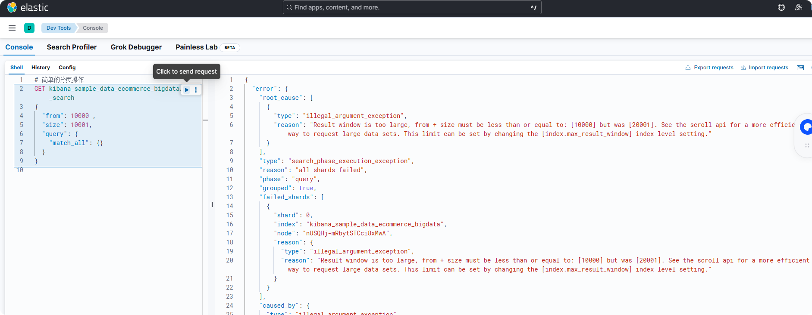

从报错信息可以看出，我们要获取的数据集合太大了，系统拒绝了我们的请求。我们可以使用 "index.max\_result\_window" 配置项设置这个上限：

PUT kibana\_sample\_data\_ecommerce\_bigdata/\_settings

{

"index": {

"max\_result\_window": 20000

}

}

  
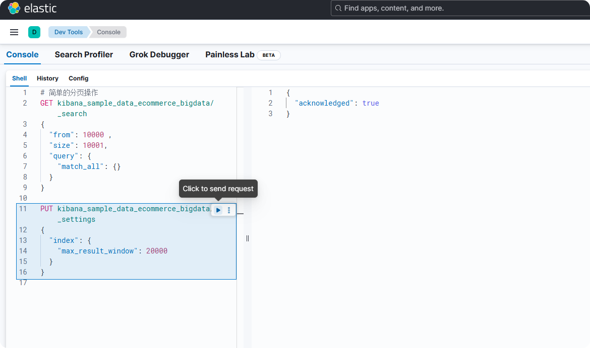

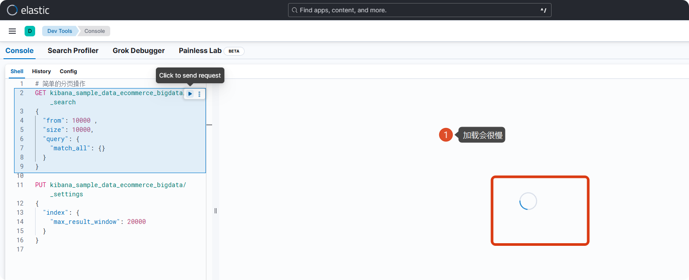

如上示例，我们设置了这个上限为 20000。虽然使用这个配置有时候可以解决燃眉之急，但是这个上限设置过大的情况下会产生非常严重的后果，因为 ES 中会存在「**深分页**」的问题。

  
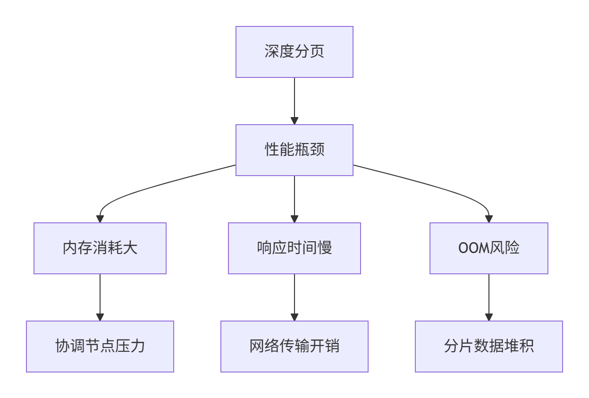

###   
**2.3.4.1 为什么会产生深分页？**

那什么是「**深分页**」和为什么会产生「**深分页**」的问题呢？

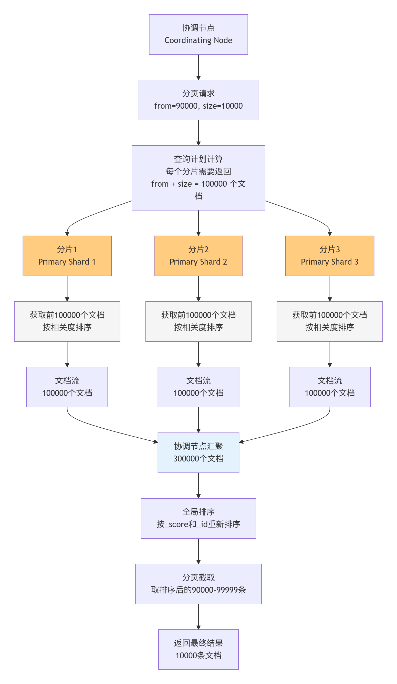  

如上图，ES 把数据保存到 3 个主分片中，当使用 from = 90000 和 size = 10000 进行分页的时候，ES 会先从每个分片中分别获取 10000个文档，然后把这 30000 个文档再汇聚到协调节点中进行排序，最后选出排序后的前 10000 个文档，返回第 90000 到 99999 的文档。

可以看到，当页数变大（发生了深分页）的时候，在每个分片中获取的数据就越多，消耗的资源就越多。并且如果分片越多，汇聚到协调节点的数据也越多，最终汇聚到协调节点的文档数为：shard\_amount \* (from + size)。

### **2.3.4.2 性能瓶颈计算**

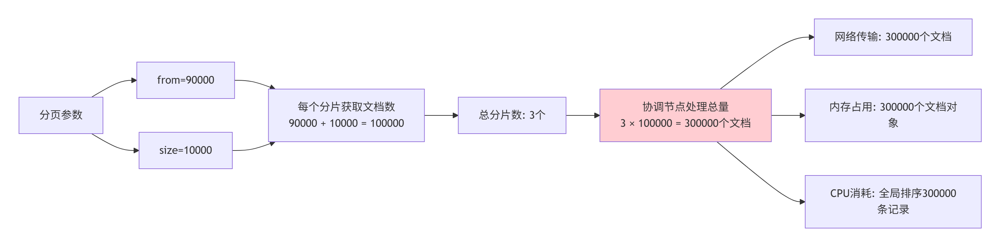

###   
**2.3.4.3 深分页问题对比**

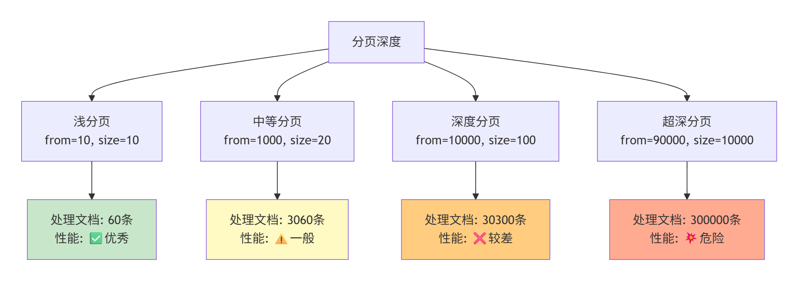

### **2.3.4.4 执行流程**

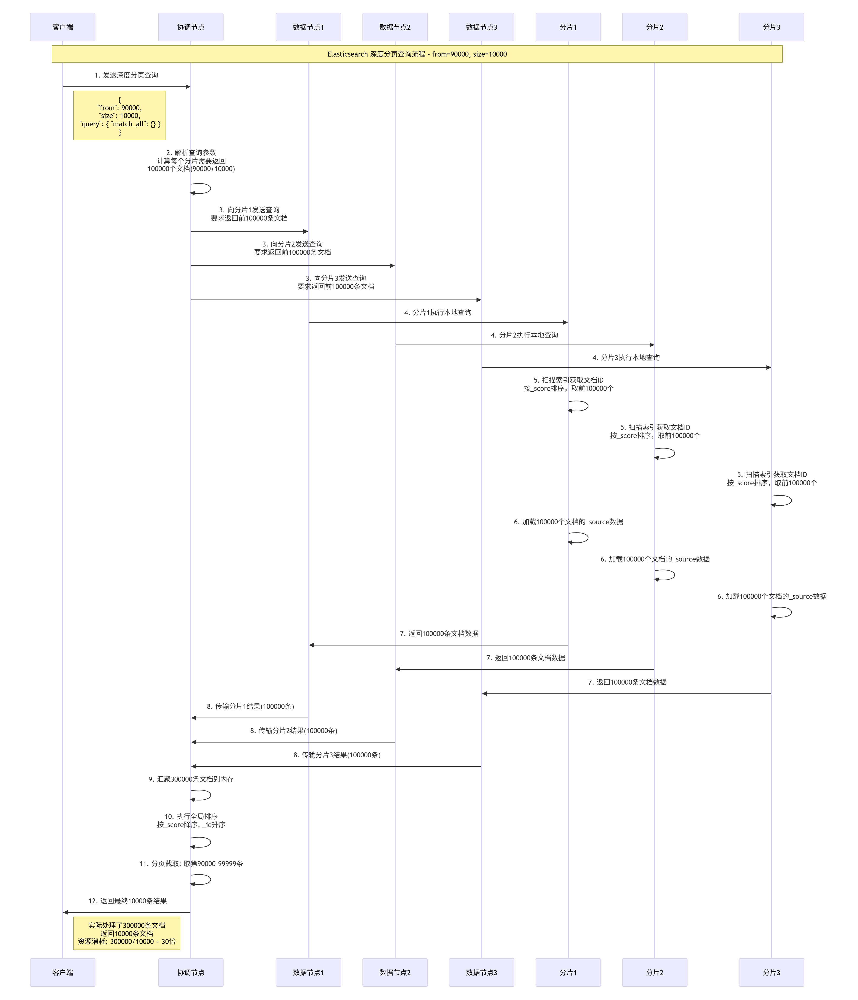

总结：随着分页深度增加，资源消耗呈线性增长，且大部分处理的数据最终被丢弃，造成严重的资源浪费。在生产环境中应避免使用传统的from/size进行深度分页查询。

### **2.3.4.5 深分页解决方案**

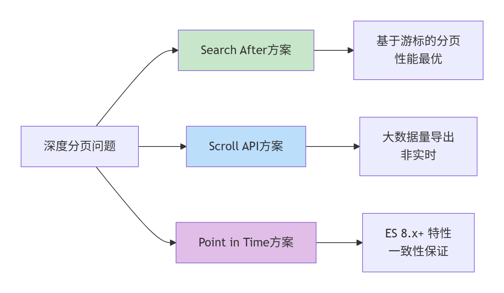

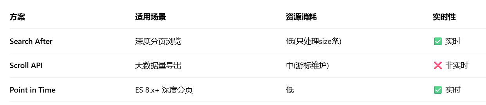

## **03 ES 8.x 深度分页调优实战**

接下来，我们就来挨个实操这三种解决方案。

## **3.1 search after 方案**

使用 search after API 可以避免产生「**深分页**」的问题，不过 search after 不支持「**跳转到指定页数**」，只能一页页地往下翻。

使用 search after 接口分为两步：

1.  在 sort 中指定需要排序的字段，并且保证其值的唯一性（可以使用文档的 ID）。
2.  在下一次查询时，带上返回结果中最后一个文档的 sort 值进行访问。

### **3.1.1 查询核心目标**

下面示例查询的目标是：使用 Search After​ 技术实现的深度分页查询，目标是在大数据集中高效地进行分页浏览，避免传统 from/size分页的性能问题。

两次查询的关系：

1.  第一次查询：获取按 order\_date降序排列的前2条文档
2.  第二次查询：基于第一次查询最后一个文档的排序值，获取下一页的2条文档

\# 第一次调用 search after

POST kibana\_sample\_data\_ecommerce\_bigdata/\_search

{

"size": 2,

"query": { "match\_all": {} },

"sort": \[

{ "order\_date": "desc" }

\]

}

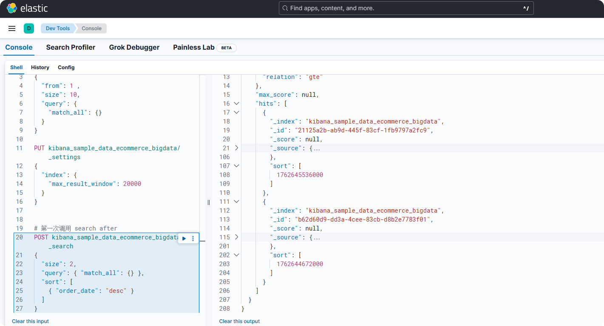

如上示例，在第一次调用 search after 时指定了 sort 的值，并且 sort 中指定以 order\_date倒序排序。可以看到，第一次调用的返回结果中除了文档的信息外，还有 sort 相关的信息，在下一次调用的时候需要带上最后一个文档的 sort 值，示例中其值为：\[1762645536000\]。

下面的示例是第二次调用 search after 接口进行翻页操作：

\# 第二次调用 search after

POST kibana\_sample\_data\_ecommerce\_bigdata/\_search

{

"size": 2,

"query": {

"match\_all": {}

},

"search\_after": \[

1762645536000

\],

"sort": \[

{

"order\_date": "desc"

}

\]

}

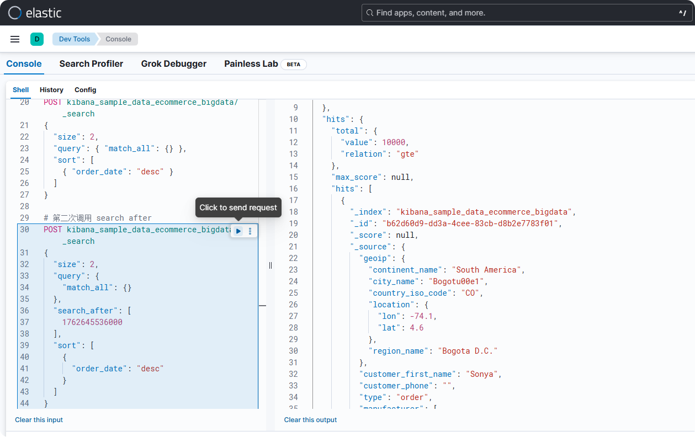

如上示例，进行翻页操作的时候在 search after 字段中设置上一次返回结果中最后一个文档的 sort 值，并且保持 sort 的内容不变。

###   
**3.1.2 底层架构设计**

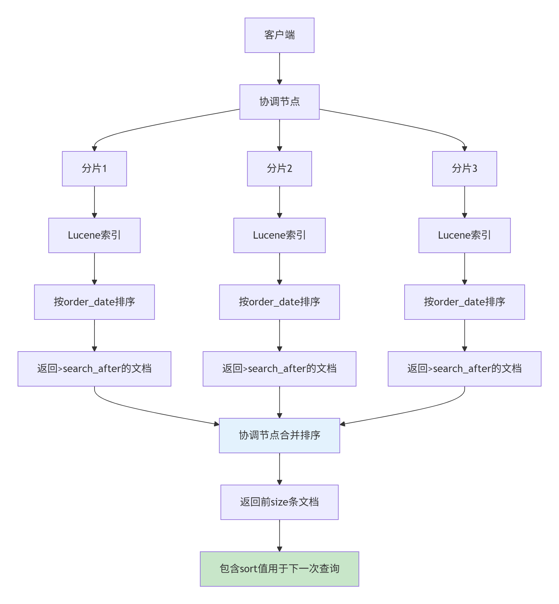

### **3.1.2 Search After & from/size 对比**

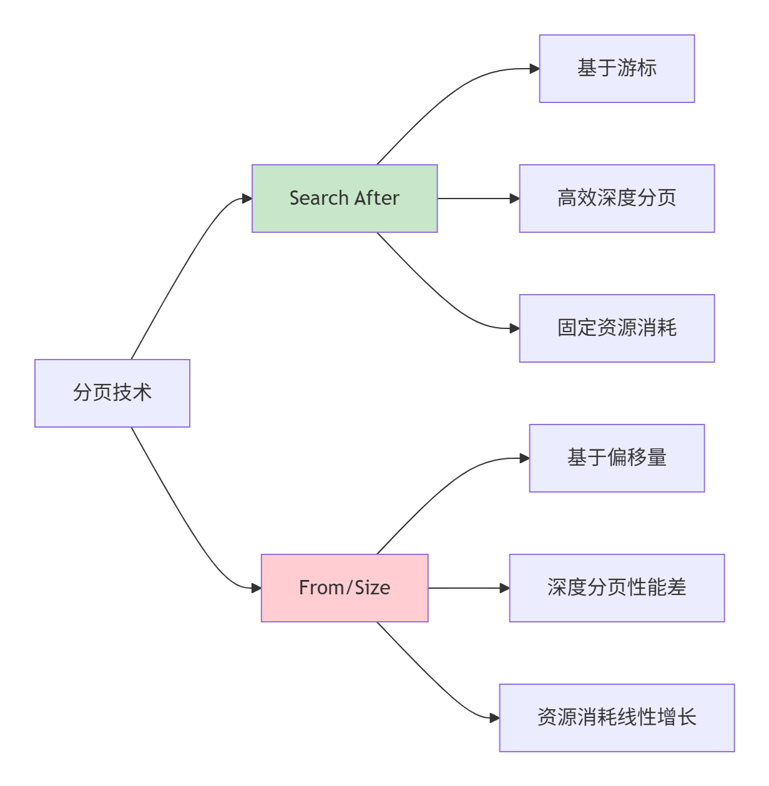

### **3.1.3 执行流程**

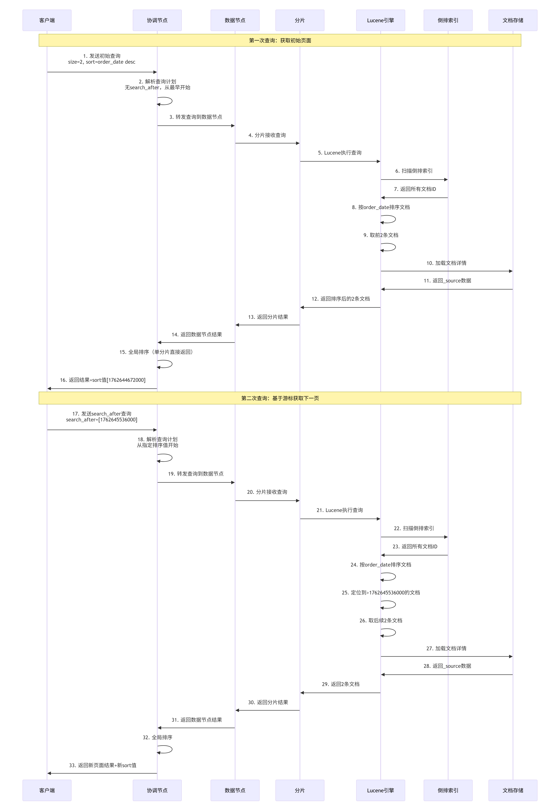

### **3.1.4 Search After 如何解决深分页**

那为啥 search after 不会产生深度分页的问题呢？其关键就是 sort 中指定的唯一排序值。

  
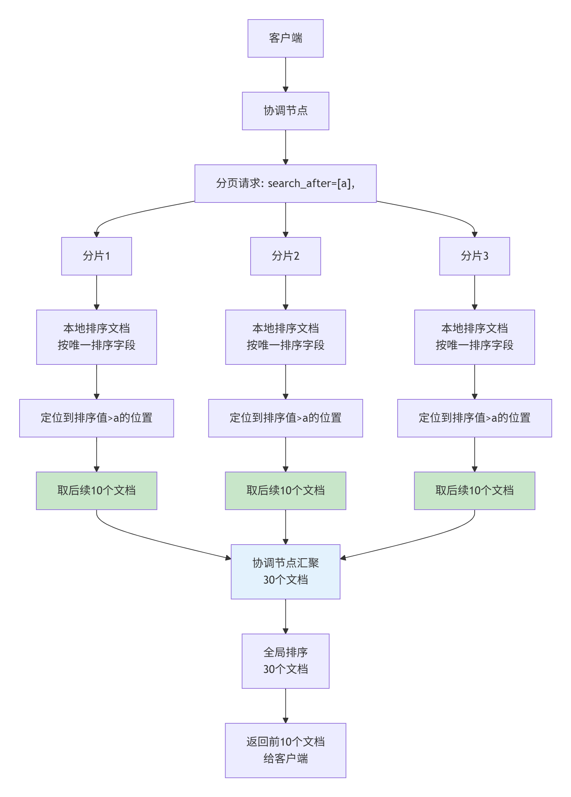

资源消耗对比：

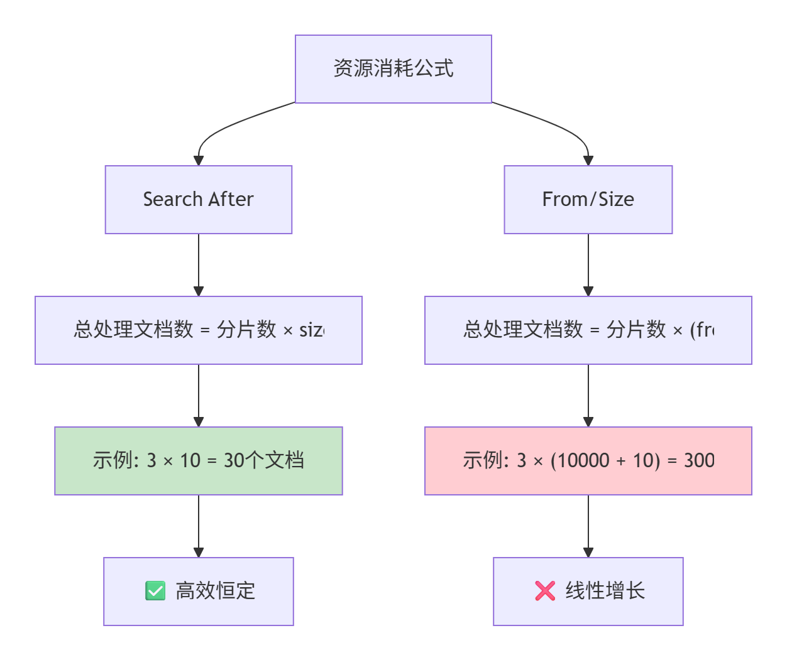

Search After 分页演进流程：

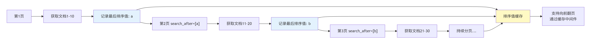

如上图，因为有了「**唯一排序值**」做保证，所以每个分片只需要返回比 sort 中唯一值大的 size 个数据即可。例如，上一次的查询返回的最后一个文档的 sort 为 a，那么这一次查询只需要在分片 1、2、3 中返回 size 个排序比 a 大的文档，「**协调节点**」汇总这些数据进行「**排序**」后返回 size 个结果给客户端。

而 from + size 的方式因为没有「**唯一排序值**」，所以没法保证每个分片上的「**排序**」就是「**全局排序**」，必须把每个分片的 from + size 个数据汇总到协调节点进行排序处理，导致出现了「**深分页**」的问题。

因为 sort 的值是根据上一次请求结果来设置的 ，所以 search after 不支持跳转到指定的页数，甚至不能返回前一页，只能一页页往下翻。但我们可以结合「**缓存中间件**」，把每页返回的 sort 值缓存下来，即可实现往前翻页的功能。

## **3.2 scroll API 方案**

接着看第二种方案，当我们想对结果集进行遍历的时候，例如做全量数据导出时，可以使用 scroll API。scroll API 会创建数据快照，后续的访问将会基于这个快照来进行，所以无法检索新写入的数据。

### **3.2.1 查询核心目标**

下面示例查询的目标是：Scroll API​ 进行大数据量批量导出的示例，主要用于全量数据扫描、数据迁移、离线分析等场景。

两次查询的关系：

1.  第一次查询：初始化Scroll上下文，获取第一批2条文档，建立10分钟的快照
2.  第二次查询：使用scroll\_id继续获取下一批数据，重置Scroll超时时间为5分钟

\# 第一次使用 scroll API

POST kibana\_sample\_data\_ecommerce\_bigdata/\_search?scroll=10m

{

"query": {

"match\_all": {}

},

"sort": { "order\_date": "desc" },

"size": 2

}

\# 结果

{

"\_scroll\_id": "FGluY2x1ZGVfY29udGV4dF91dWlkDXF1ZXJ5QW5kRmV0Y2gBFmJaSTBpVWg4U0o2NzltV2UtV3hiS3cAAAAAAFQVsxZuVVNRSGotbVJieXRTVENjaTh4TXdB",

"took": 5,

"timed\_out": false,

"\_shards": {

"total": 1,

"successful": 1,

"skipped": 0,

"failed": 0

},

"hits": {

"total": {

"value": 12464775,

"relation": "eq"

},

"max\_score": null,

"hits": \[

{

"\_index": "kibana\_sample\_data\_ecommerce\_bigdata",

"\_id": "21125a2b-ab9d-445f-83cf-1fb9797a2fc9",

"\_score": null,

"\_source": {....}

}

\]

}

}

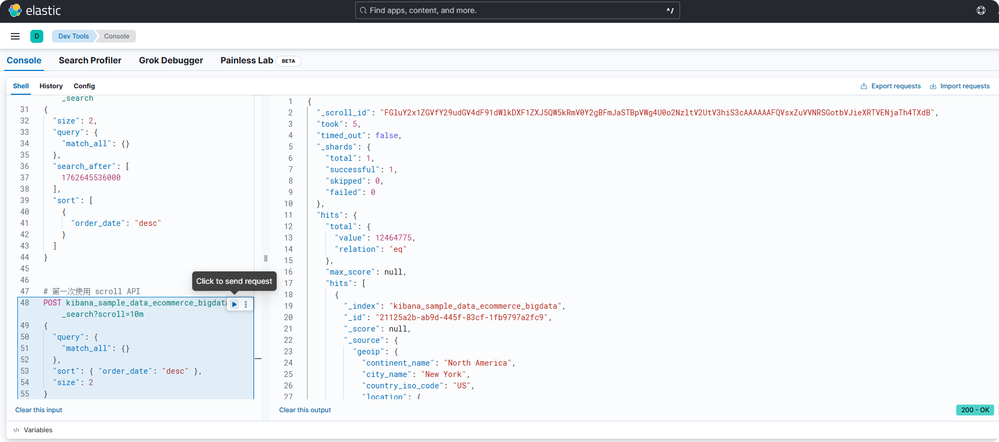

如上示例，在第一次使用 scroll API 时需要初始化 scroll 搜索并且创建快照，使用 scroll 查询参数指定本次「**查询上下文（快照）**」的有效时间，本示例中为 10 分钟。

其返回的结果中除了匹配文档的列表外还有 \_scroll\_id，我们需要在翻页请求中带上这个 \_scroll\_id：

\# 进行翻页

POST /\_search/scroll

{

"scroll" : "5m",

"scroll\_id" : "FGluY2x1ZGVfY29udGV4dF91dWlkDXF1ZXJ5QW5kRmV0Y2gBFmJaSTBpVWg4U0o2NzltV2UtV3hiS3cAAAAAAFQVsxZuVVNRSGotbVJieXRTVENjaTh4TXdB"

}

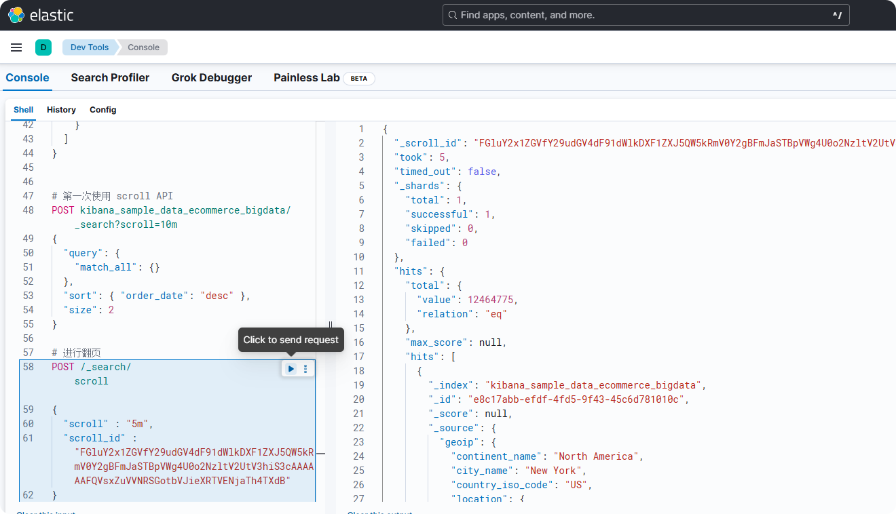

如上示例，我们把上一次返回结果中的 \_scroll\_id 值放到本次请求的 scroll\_id 字段中，并且指定“查询上下文”的有效时间为 5 分钟。同样此次的返回结果也会带有新的 \_scroll\_id。

###   
**3.2.2 底层架构设计**

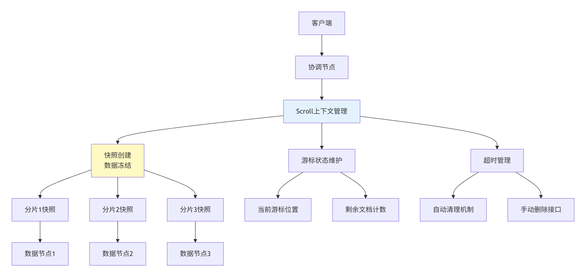

### **3.2.3 Scroll & Search After 对比**

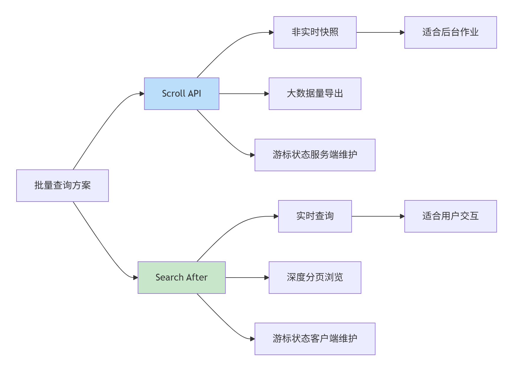

### **3.2.3 执行流程**

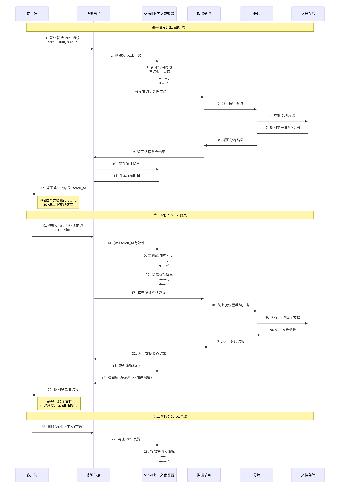

### **3.2.4 Scroll 技术原理**

### **1、快照机制原理**

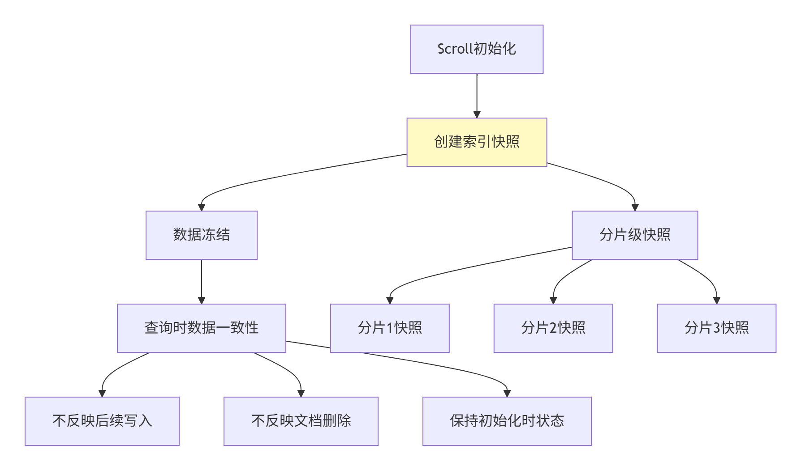

### **2、分片级别流程**

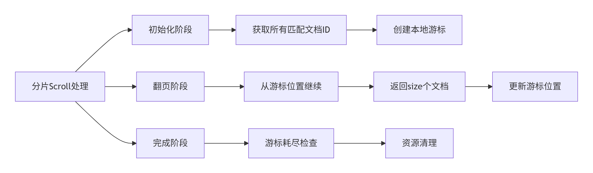

### **3.2.5 Scroll 注意事项**

1.  资源消耗：Scroll会占用服务端资源，需要及时清理
2.  数据实时性：基于快照，不反映后续数据变更
3.  超时设置：根据数据量合理设置，避免过早超时或资源占用过长
4.  批次大小：过小增加请求次数，过大数据量传输压力大

## **3.3 Point In Time 方案**

最后，我们来看下 Point In Time 方案，Point In Time（PIT）是 「**ES 7.10 版本**」中引入的新特性，PIT 是一个「**轻量级**」的「**数据状态视图**」，用户可以利用这个视图反复查询某个索引，仿佛这个索引的数据集停留在某个时间点上。

也就是说，在创建 PIT 之后更新的数据是「**无法被检索**」到的。

当我们想要获取、统计以当前时间节点为准的数据而不考虑后续数据更新的时候，PIT 就显得非常有用了。使用 PIT 前需要显式使用 \_pit API 获取一个 PID ID。

### **3.3.1 查询核心目标**

下面示例查询的目标是：​这是使用 「**PIT**」+ 「**Search After**」组合方案实现的深度分页查询，提供实时性和数据一致性保证，是Elasticsearch 8.x推荐的深度分页解决方案。

  
三次查询的关系：

1.  PIT创建：建立20分钟有效期的数据快照上下文
2.  第一次Search After：基于PIT获取第一批2条文档
3.  第二次Search After：使用search\_after参数继续获取下一页数据

\# 使用 pit API 获取一个 PID ID

POST /kibana\_sample\_data\_ecommerce\_bigdata/\_pit?keep\_alive=20m

\# 结果

{

"id": "0faYBAEka2liYW5hX3NhbXBsZV9kYXRhX2Vjb21tZXJjZV9iaWdkYXRhFk4tSXhScEJpUTNHa01WYUhVNVRKNWcAARZuVVNRSGotbVJieXRTVENjaTh4TXdBAAEAAAAAAFdjzxZiWkkwaVVoOFNKNjc5bVdlLVd4Ykt3AAEWTi1JeFJwQmlRM0drTVZhSFU1VEo1ZwAA",

"\_shards": {

"total": 1,

"successful": 1,

"skipped": 0,

"failed": 0

}

}

如上示例，使用 \_pit 接口获取了一个 PIT ID，keep\_alive 参数设置了这个视图的有效时长。有了这个 PIT ID 后续的查询就可以结合它来进行了。

「**PIT**」可以结合「**Search After**」进行查询，能有效保证「**数据一致性**」。 「**PIT**」结合「**Search After**」的流程与前面介绍的「**Search After**」主要区别是需要在请求 body 中带上 PIT ID，如下：

\# 第一次调用 search after，因为使用了 PIT，这个时候搜索不需要指定 index 了。

POST \_search

{

"size": 2,

"query": {

"match\_all": {}

},

"pit": {

"id": "0faYBAEka2liYW5hX3NhbXBsZV9kYXRhX2Vjb21tZXJjZV9iaWdkYXRhFk4tSXhScEJpUTNHa01WYUhVNVRKNWcAARZuVVNRSGotbVJieXRTVENjaTh4TXdBAAEAAAAAAFdjzxZiWkkwaVVoOFNKNjc5bVdlLVd4Ykt3AAEWTi1JeFJwQmlRM0drTVZhSFU1VEo1ZwAA",

"keep\_alive": "5m"

},

"sort": \[

{

"order\_date": "desc"

}

\]

}

\# 结果

{

"pit\_id": "0faYBAEka2liYW5hX3NhbXBsZV9kYXRhX2Vjb21tZXJjZV9iaWdkYXRhFk4tSXhScEJpUTNHa01WYUhVNVRKNWcAARZuVVNRSGotbVJieXRTVENjaTh4TXdBAAEAAAAAAFdjzxZiWkkwaVVoOFNKNjc5bVdlLVd4Ykt3AAEWTi1JeFJwQmlRM0drTVZhSFU1VEo1ZwAA",

"took": 3,

"timed\_out": false,

"\_shards": {

"total": 1,

"successful": 1,

"skipped": 0,

"failed": 0

},

"hits": {

"total": {

"value": 10000,

"relation": "gte"

},

"max\_score": null,

"hits": \[

{

"\_index": "kibana\_sample\_data\_ecommerce\_bigdata",

"\_id": "21125a2b-ab9d-445f-83cf-1fb9797a2fc9",

"\_score": null,

"\_source": {....}

}

\]

}

}

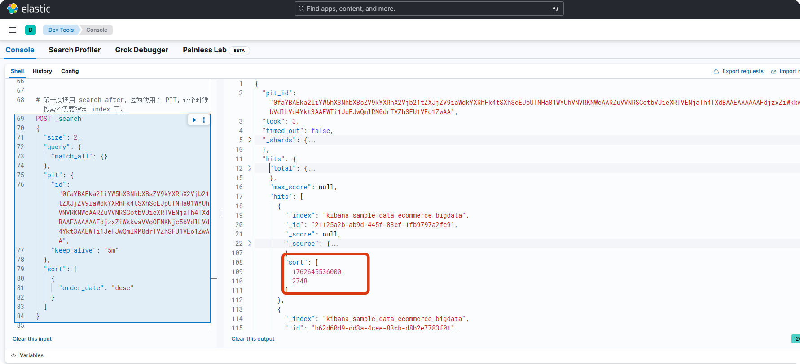

在 pit 字段中指定 PIT ID 和设置 keep\_alive 来指定视图的有效时长。需要注意的是:

> 使用了 PIT 后不再需要在 sort 中指定唯一的排序值了，也不需要在路径中指定索引名称了。

在其返回结果中，sort 数组中包含了两个元素：

1.  第一个是我们用作排序的 order\_date 的值。
2.  第二个值是一个隐含的排序值，所有的 PIT 请求都会自动加入一个隐式的用于排序的字段称为：\_shard\_doc，当然这个排序值可以显式指定。
3.  这个隐含的字段官方也称它为：tiebreaker（决胜字段），其代表的是文档的唯一值，保证了分页不会丢失或者分页结果的数据不会重复，其作用就好像原 search after 的 sort 字段中要指定的唯一值一样。

在进行翻页的时候和原 search after 一样，需要把上次结果中最后一个文档的 sort 值带上：

\# 第二次调用 search after，因为使用了 PIT，这个时候搜索不需要指定 index 了。

POST \_search

{

"size": 2,

"query": {

"match\_all": {}

},

"pit": {

"id": "0faYBAEka2liYW5hX3NhbXBsZV9kYXRhX2Vjb21tZXJjZV9iaWdkYXRhFk4tSXhScEJpUTNHa01WYUhVNVRKNWcAARZuVVNRSGotbVJieXRTVENjaTh4TXdBAAEAAAAAAFdjzxZiWkkwaVVoOFNKNjc5bVdlLVd4Ykt3AAEWTi1JeFJwQmlRM0drTVZhSFU1VEo1ZwAA",

"keep\_alive": "5m"

},

"search\_after": \[

1762645536000,

2748

\],

"sort": \[

{

"order\_date": "desc"

}

\]

}

\# 结果 {

"pit\_id": "0faYBAEka2liYW5hX3NhbXBsZV9kYXRhX2Vjb21tZXJjZV9iaWdkYXRhFk4tSXhScEJpUTNHa01WYUhVNVRKNWcAARZuVVNRSGotbVJieXRTVENjaTh4TXdBAAEAAAAAAFdjzxZiWkkwaVVoOFNKNjc5bVdlLVd4Ykt3AAEWTi1JeFJwQmlRM0drTVZhSFU1VEo1ZwAA",

"took": 3,

"timed\_out": false,

"\_shards": {

"total": 1,

"successful": 1,

"skipped": 0,

"failed": 0

},

"hits": {

"total": {

"value": 10000,

"relation": "gte"

},

"max\_score": null,

"hits": \[

{

"\_index": "kibana\_sample\_data\_ecommerce\_bigdata",

"\_id": "b62d60d9-dd3a-4cee-83cb-d8b2e7783f01",

"\_score": null,

"\_source": {

"geoip": {

"continent\_name": "South America",

"city\_name": "Bogotu00e1",

"country\_iso\_code": "CO",

"location": {

"lon": \-74.1,

"lat": 4.6

},

"region\_name": "Bogota D.C."

},

"customer\_first\_name": "Sonya",

"customer\_phone": "",

"type": "order",

"manufacturer": \[

"Oceanavigations",

"Pyramidustries"

\],

"products": \[

{

"tax\_amount": 0,

"taxful\_price": 28.99,

"quantity": 1,

"taxless\_price": 28.99,

"discount\_amount": 0,

"base\_unit\_price": 28.99,

"discount\_percentage": 0,

"product\_name": "Vest - red/white",

"manufacturer": "Oceanavigations",

"min\_price": 13.05,

"created\_on": "2016-12-31T23:31:12+00:00",

"unit\_discount\_amount": 0,

"price": 28.99,

"product\_id": 19238,

"base\_price": 28.99,

"\_id": "sold\_product\_592097\_19238",

"category": "Women's Clothing",

"sku": "ZO0265502655"

},

{

"tax\_amount": 0,

"taxful\_price": 13.99,

"quantity": 1,

"taxless\_price": 13.99,

"discount\_amount": 0,

"base\_unit\_price": 13.99,

"discount\_percentage": 0,

"product\_name": "Across body bag - aqua ",

"manufacturer": "Pyramidustries",

"min\_price": 6.86,

"created\_on": "2016-12-31T23:31:12+00:00",

"unit\_discount\_amount": 0,

"price": 13.99,

"product\_id": 13328,

"base\_price": 13.99,

"\_id": "sold\_product\_592097\_13328",

"category": "Women's Accessories",

"sku": "ZO0201102011"

}

\],

"customer\_full\_name": "Sonya Smith",

"order\_date": "2025-11-08T23:31:12+00:00",

"customer\_last\_name": "Smith",

"day\_of\_week\_i": 5,

"total\_quantity": 2,

"currency": "EUR",

"taxless\_total\_price": 42.98,

"total\_unique\_products": 2,

"category": \[

"Women's Clothing",

"Women's Accessories"

\],

"customer\_id": "customer\_8297.0",

"sku": \[

"ZO0265502655",

"ZO0201102011"

\],

"event": {

"dataset": "sample\_ecommerce"

},

"order\_id": "order\_bf565e87-1ed6-4906-aeb2-65d590432b1c",

"user": "sonya",

"customer\_gender": "FEMALE",

"email": "user\_50630.0@example.com",

"day\_of\_week": "Saturday",

"taxful\_total\_price": 42.98

},

"sort": \[

1762644672000,

1278

\]

},

{

"\_index": "kibana\_sample\_data\_ecommerce\_bigdata",

"\_id": "e8c17abb-efdf-4fd5-9f43-45c6d781010c",

"\_score": null,

"\_source": {

"geoip": {

"continent\_name": "North America",

"city\_name": "New York",

"country\_iso\_code": "US",

"location": {

"lon": \-74,

"lat": 40.8

},

"region\_name": "New York"

},

"customer\_first\_name": "Brigitte",

"customer\_phone": "",

"type": "order",

"manufacturer": \[

"Tigress Enterprises",

"Pyramidustries"

\],

"products": \[

{

"tax\_amount": 0,

"taxful\_price": 36.99,

"quantity": 1,

"taxless\_price": 36.99,

"discount\_amount": 0,

"base\_unit\_price": 36.99,

"discount\_percentage": 0,

"product\_name": "Ankle boots - black",

"manufacturer": "Tigress Enterprises",

"min\_price": 19.23,

"created\_on": "2016-12-31T23:22:34+00:00",

"unit\_discount\_amount": 0,

"price": 36.99,

"product\_id": 14810,

"base\_price": 36.99,

"\_id": "sold\_product\_592088\_14810",

"category": "Women's Shoes",

"sku": "ZO0026600266"

},

{

"tax\_amount": 0,

"taxful\_price": 54.99,

"quantity": 1,

"taxless\_price": 54.99,

"discount\_amount": 0,

"base\_unit\_price": 54.99,

"discount\_percentage": 0,

"product\_name": "Light jacket - peacoat",

"manufacturer": "Pyramidustries",

"min\_price": 25.3,

"created\_on": "2016-12-31T23:22:34+00:00",

"unit\_discount\_amount": 0,

"price": 54.99,

"product\_id": 9131,

"base\_price": 54.99,

"\_id": "sold\_product\_592088\_9131",

"category": "Women's Clothing",

"sku": "ZO0184501845"

}

\],

"customer\_full\_name": "Brigitte Cross",

"order\_date": "2025-11-08T23:22:34+00:00",

"customer\_last\_name": "Cross",

"day\_of\_week\_i": 5,

"total\_quantity": 2,

"currency": "EUR",

"taxless\_total\_price": 91.98,

"total\_unique\_products": 2,

"category": \[

"Women's Shoes",

"Women's Clothing"

\],

"customer\_id": "customer\_78605.0",

"sku": \[

"ZO0026600266",

"ZO0184501845"

\],

"event": {

"dataset": "sample\_ecommerce"

},

"order\_id": "order\_c4a3c224-cda7-4cab-809a-a0f7df501826",

"user": "brigitte",

"customer\_gender": "FEMALE",

"email": "user\_734472.0@example.com",

"day\_of\_week": "Saturday",

"taxful\_total\_price": 91.98

},

"sort": \[

1762644154000,

1522

\]

}

\]

}

}

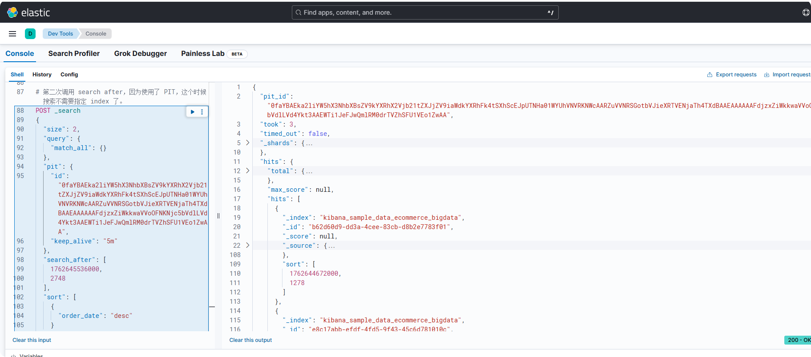

### **3.3.2 底层架构设计**

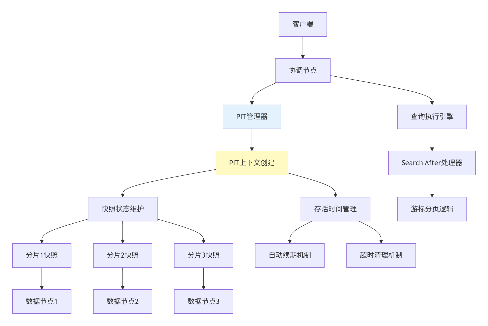

### **3.3.3 PIT & Scroll & Search After 对比**

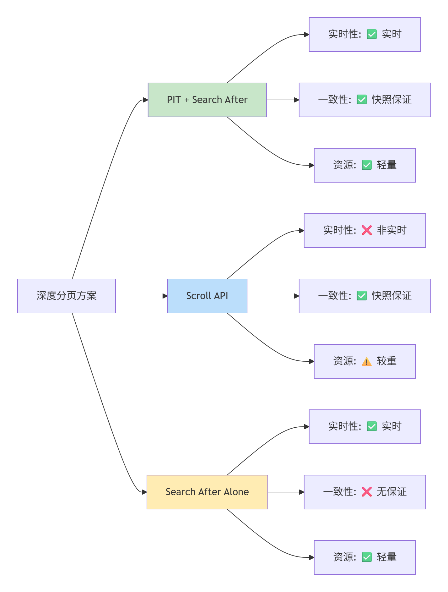

Search After + PIT 实现的功能似乎和 scroll API 类似，那它们间有啥区别呢？

1.  其实你会发现使用 scroll API 的时候，scroll 产生的上下文是与本次查询绑定的，很明显的一点就是，生成一个 scroll id 后，其他查询无法重用这个 id，scroll 的翻页也只能一直向下翻。
2.  而 PIT 可以允许用户在同一个固定数据集合上运行不同的查询，例如多个请求可以使用同一个 PIT 视图而互不影响。

### **3.3.4 执行流程**

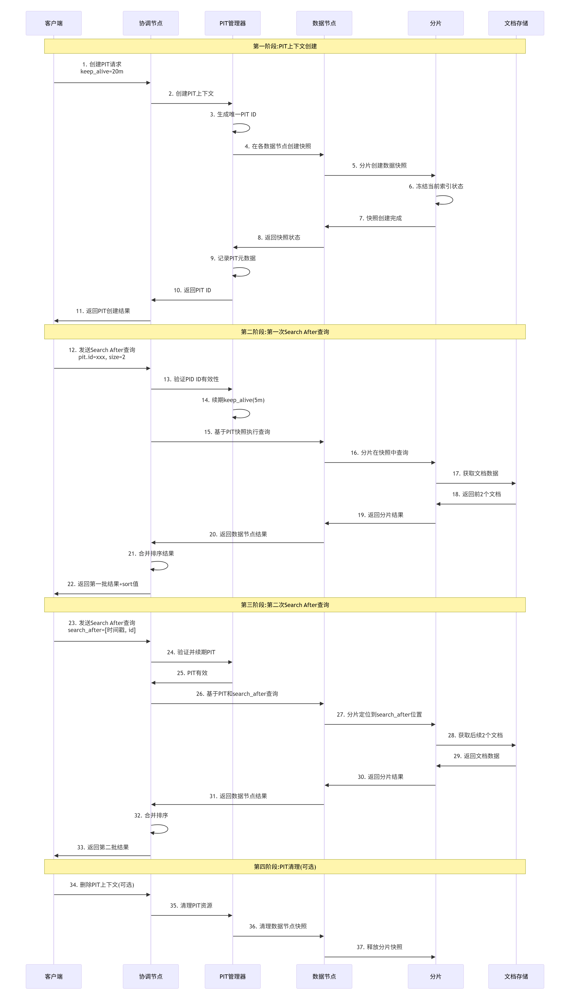

### **3.3.5 PIT 技术原理**

### **1、PIT 快照机制原理**

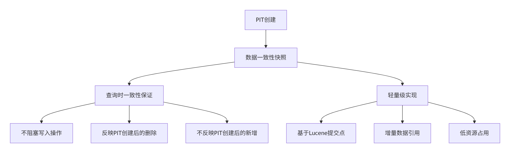

### **2、Search After 在 PIT 中的执行流程**

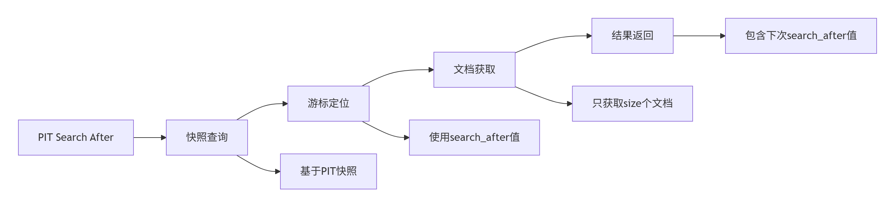

### **3.3.6 PIT & Search After 优势**

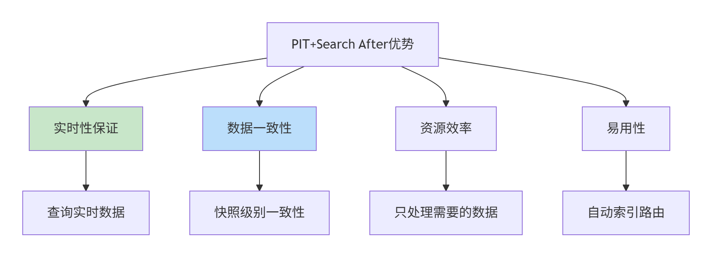

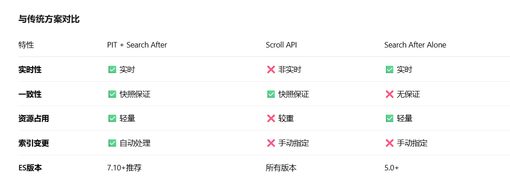

### **3.2.6 PIT & Search After 注意事项**

使用限制：

1.  版本要求：Elasticsearch 7.10+ 版本完整支持
2.  资源管理：PIT会占用段引用，需要及时清理
3.  数据量：适合大数据集深度分页，小数据集用from/size即可
4.  排序要求：必须指定排序字段，且最好包含唯一字段

监控指标：

1.  PIT创建和删除频率
2.  Search After查询响应时间
3.  分页深度与性能关系
4.  内存和CPU使用情况

## **04 总结**

1.  from + size 是最普通、简单的分页方式，其支持在不同页面间随机跳转，但是会产生深分页的问题。默认的情况下可以支持 Top 10000 条数据内的分页场景，可以使用 max\_result\_window 进行调整，但不建议调得过大。
2.  search after：通过在 sort 中指定唯一排序值解决了深分页的问题，但导致其只能一页一页地往下翻，不支持跳转到指定页数。当然我们也介绍了可以使用缓存等手段实现向前翻页的功能。
3.  scroll API：会创建数据快照，无法检索新写入的数据，其适合遍历结果集的时候使用。scroll API 产生的快照与本次查询是绑定的，其他查询无法复用。
4.  最后介绍了 ES 在 7.10 中引入的特性：Point In Time（PIT），PIT 简单来说就是一个视图，多个查询可以复用一个 PIT，使得用户可以重复检索某个时间点的数据。在新版的 ES 官方文档中建议使用 PIT + search after 代替 scroll API，即使 scroll API 还可以使用。

综上，PIT + Search After组合提供了Elasticsearch中最优秀的深度分页解决方案，既有Scroll的数据一致性保证，又有Search After的实时性优势，是生产环境深度分页的首选方案。