从今天之后的一段时间内，华仔会带着大家一起来从零开始对 ElasticStack 矩阵产品进行深入剖析和项目运维实战，希望大家学完之后可以用到自己的工作中。

这是第二十篇，本篇我将带着大家进行「**ES 8.x 向量搜索技术实现原理 & 深度实战**」。

文章汇总位置：[https://wx.zsxq.com/dweb2/index/columns/51122554151214](https://wx.zsxq.com/dweb2/index/columns/51122554151214)

## **01 前言**

在上篇中 [【ES 入门实战第十九篇】ES 8.x 导出 CSV 多种方案实战](https://articles.zsxq.com/id_7qoie20ef3ic.html)，带着大家进行「**ES 8.x 导出 CSV 多种方案实战**」。

今天我们来进行「**ES 8.x 向量搜索技术实现原理 & 深度实战**」。

##   
**02 向量技术核心原理**

## **2.1 向量化表示的本质**

现代AI技术将文本、图像等非结构化数据转化为高维向量（通常128-2048 维），这些向量在数学空间中携带语义特征。

比如：

1.  文本嵌入(Embedding)：BERT 等模型生成768维向量
2.  图像特征：ResNet提取2048维特征向量

## **2.2 向量搜索简介**

想必大家都同意，自 2022 年 11 月 ChatGPT 问世以来，几乎每天都会听到或读到「**向量搜索**」这个词。它无处不在，如此普及，以至于我们常常误以为它是一项刚刚问世的尖端技术，但事实上，这项技术已经存在了 60 多年！该领域的研究始于 20 世纪 60 年代中期，首批研究论文于 1978 年由信息检索专家 Gerard Salton 及其康奈尔大学的同事发表。Salton 对稠密向量模型和稀疏向量模型的研究构成了现代向量搜索技术的基石。

在过去的20年里，许多基于他的研究成果的[向量数据库管理系统（DBMS）\[1\]](https://db-engines.com/en/ranking/vector+dbms/all)被创建并推向市场。其中包括由Apache Lucene项目支持的Elasticsearch，该项目于2019年开始[致力于向量搜索\[2\]](https://issues.apache.org/jira/browse/LUCENE-9004)。

如今，向量已无处不在，应用广泛，因此在使用之前，务必先掌握其底层理论和内部工作原理。在深入探讨之前，我们先快速回顾一下词汇搜索和向量搜索之间的区别，以便更好地理解它们之间的区别以及它们如何相互补充。

向量搜索简单来说，就是在「**向量空间**」中进行的搜索操作。在传统的文本搜索中，我们通常基于「**关键词**」进行匹配，这种方式对于「**精确匹配**」的场景效果较好，但在处理「**语义理解**」、「**模糊匹配**」等复杂场景时显得力不从心。而「**向量搜索**」则将文本、图像、音频等各种数据转化为「**向量表示**」，通过计算向量之间的「**相似度**」来进行搜索。这种方式能够更好地捕捉数据的语义信息，从而实现更精准、更智能的搜索。

例如，对于文本数据，我们可以使用词嵌入（Word Embedding）技术将每个单词映射为一个向量，然后将整个文本的向量表示为其包含单词向量的某种聚合（如平均、求和等）。在搜索时，将查询文本也转化为向量，通过计算查询向量与文档向量之间的相似度，找出与查询最相关的文档。

## **2.3 向量搜索 & 关键词搜索**

介绍「**向量搜索**」的一个简单方法是将其与您可能习惯的更传统的「**关键词搜索**」进行比较。「**向量搜索**」（通常也称为「**语义搜索**」）和「**关键词搜索**」的工作原理截然不同。

「**关键词搜索**」是我们多年来在 Elasticsearch 中一直使用的一种搜索方式。它不会尝试理解被索引和查询内容的真正含义，而是尽力将用户在查询中输入的单词或其变体（例如词干提取、同义词等）的字面量与之前已使用相似度算法（例如 TF-IDF）索引到数据库中的所有字面量进行词汇匹配。

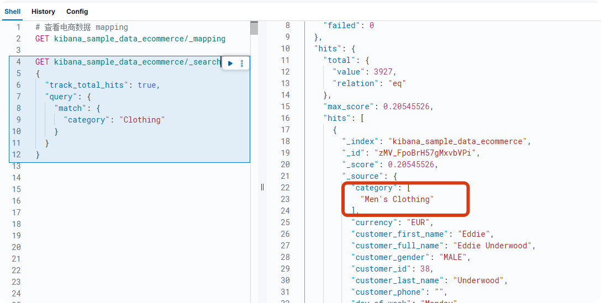

（词汇搜索的简单示例）

我们可以看到，这些文档生成的词条被编入倒排索引，该索引简单地将分析后的词条映射到包含它们的文档 ID。搜索“Clothing”会匹配 3927 个文档，并且得分各不相同，即使它们都没有真正抓住查询的真正含义。

公平地说「**关键词搜索**」的本质在于，当你能够掌控「**结构化数据**」的索引方式（例如映射、文本分析、采集管道等）以及「**查询语句**」的编写方式（例如精心设计的 DSL 查询、查询词分析等）时，「**词汇搜索引擎**」就能创造奇迹，这一点毋庸置疑！

Elasticsearch 在「**关键词搜索**」能力方面的成就令人惊叹。过去几年，它所取得的成就以及它在词汇搜索领域的普及和改进，实在令人瞩目。

然而，当你需要为需要提出「**自由文本问题**」的用户提供查询非结构化数据（例如图像、视频、音频、原始文本等）的支持时，「**关键词搜索**」就显得力不从心了。此外，有时查询甚至不是文本，而是图像，我们稍后会看到。

「**关键词搜索**」在这种情况下无法胜任的主要原因是，非结构化数据既不能像结构化数据那样被索引，也不能被查询。处理非结构化数据时，语义就派上用场了。语义是什么意思呢？很简单，就是含义！

让我们以图像搜索引擎（例如 Google 图片搜索或 Lens）为例。您拖放一张图片，Google 语义搜索引擎就会查找并返回与您查询的图片最相似的图片。

在下图中，我们可以在左侧看到一张德国牧羊犬的图片，在右侧看到所有检索到的相似图片，其中第一个结果与提供的图片相同（即最相似的图片）。

来源：Google 图片搜索，[https://www.google.com/imghp](https://www.google.com/imghp)

虽然这对我们人类来说听起来简单合乎逻辑，但对计算机来说，情况就完全不同了。这正是矢量搜索能够实现并帮助实现的。正如世界最近见证的那样，矢量搜索所释放的力量是巨大的。现在，让我们揭开它的面纱，探索隐藏其中的奥秘。

## **2.4 嵌入向量**

正如我们之前所见，使用「**词汇搜索引擎**」，诸如文本之类的结构化数据可以轻松地被标记化为可在搜索时匹配的术语，而无需考虑这些术语的真实含义。然而「**非结构化数据**」的形式可能多种多样，例如大型二进制对象（图像、视频、音频等），因此完全不适合相同的标记化过程。

此外「**语义搜索**」的最终目的是以某种方式对数据进行索引，以便根据其所代表的含义进行搜索。我们如何实现这一点？答案就在于两个词：「**机器学习**」或者更确切地说 「**深度学习**」。

「**深度学习**」是「**机器学习**」的一个特定领域，它依赖于基于多层处理构成的人工神经网络的模型，这些模型可以逐步提取数据的真正含义。这些神经网络模型的工作方式很大程度上受到了人脑的启发。

下图展示了一个「**神经网络**」的结构，其中包含「**输入层**」、「**输出层**」以及多个「**隐藏层**」：

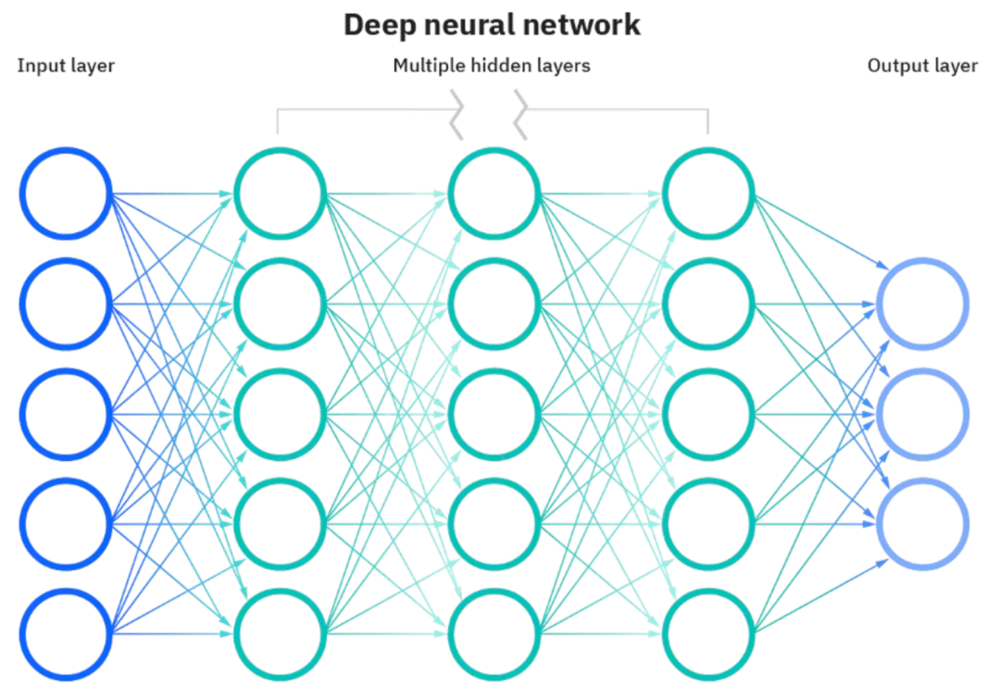

来源：IBM，[https://www.ibm.com/topics/neural-networks](https://www.ibm.com/topics/neural-networks)

「**神经网络**」的真正优势在于，它能够将单条非结构化数据转换为一系列浮点值，这些浮点值被称为「**嵌入向量**」。作为人类，只要我们将向量在二维或三维空间中可视化，我们就能很好地理解向量的含义。

向量的每个分量都代表二维 xy 平面或三维 xyz 空间中的一个坐标。然而，「**神经网络**」模型所依赖的「**嵌入向量**」可能具有数百甚至数千个维度，并且仅仅表示多维空间中的一个点。每个「**向量维度**」代表非结构化数据的一个特征或特性。

让我们用一个深度学习模型来说明这一点，该模型将图像转换为 2048 维的「**嵌入向量**」。该模型会将下图中使用的德国牧羊犬图片转换为下表所示的嵌入向量。请注意，我们仅显示前三个和后三个元素，但表格中会有 2,042 个列/维度。

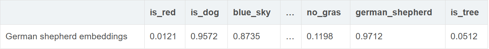

每一列代表模型的一个维度，代表底层「**神经网络**」试图建模的一个特征或特性。输入到模型的每个输入都将根据其与 2048 个维度的相似程度进行表征。因此 「**嵌入向量**」中每个元素的值表示该输入与特定维度的相似度。在这个例子中，我们可以看到模型检测到狗和德国牧羊犬之间存在高度相似性，并且还检测到了一些蓝天的存在。

与「**关键词搜索**」（其中术语可能匹配也可能不匹配）不同，通过「**向量搜索**」我们可以更好地了解一段非结构化数据与模型支持的每个维度的相似程度，因此「**嵌入向量**」可以作为非结构化数据的绝佳语义表示。

## **2.5 距离与相似度**

借助「**向量运算**」测量两个向量之间的距离是一个很容易解决的问题。那么来看看现代向量搜索数据库（例如 Elasticsearch）支持的最流行的距离和相似度函数。

> 注意，前方有数学知识！

### **2.5.1 L1 距离**

两个向量 x 和 y 的 L1 距离（也称为曼哈顿距离）是通过对其所有元素的两两绝对差求和来测量的。显然，距离 d 越小，两个向量越接近。其公式非常简单，如下所示：

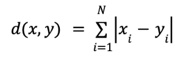

从视觉上看，L1 距离可以如下图 5 所示进行表示：

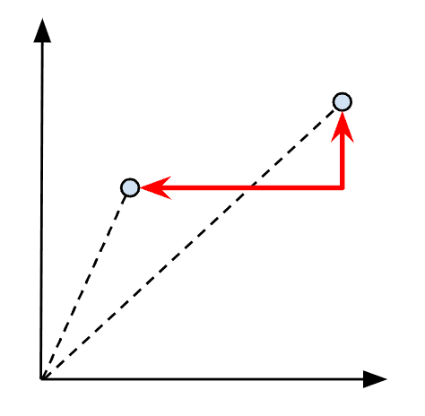

可视化两个向量之间的 L1 距离

设两个向量 x 和 y，例如 x = (1, 2) 和 y = (4, 3)，则两个向量的 L1 距离为 | 1 - 4 | + | 2 - 3 | = 4。

### **2.5.2 L2 距离**

L2距离，也称为欧氏距离，是两个向量 x 和 y 之间的距离，其测量方法是先将它们所有元素的差值的平方相加，然后对结果取平方根。它本质上是两点（也称为斜边）之间的最短路径。与 L1距离类似，距离 d 越小，两个向量越接近：

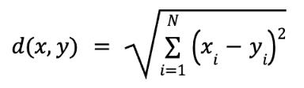

L2距离如下图6所示：

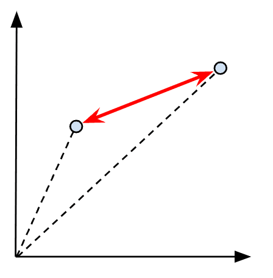

可视化两个向量之间的 L2 距离

让我们重复使用与 L1 距离相同的两个样本向量 x 和 y，现在我们可以计算 L2 距离为 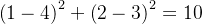。取 10 的平方根将得出 3.16。

### **2.5.3 Linf 距离**

两个向量 x 和 y 的 Linf（代表 L 无穷大）距离，也称为切比雪夫距离或棋盘距离，简单定义为它们任意两个元素之间的最长距离，或沿其中一个轴/维度测量的最长距离。其公式非常简单，如下所示：

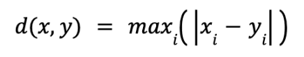

Linf 距离的表示如下图 7 所示：

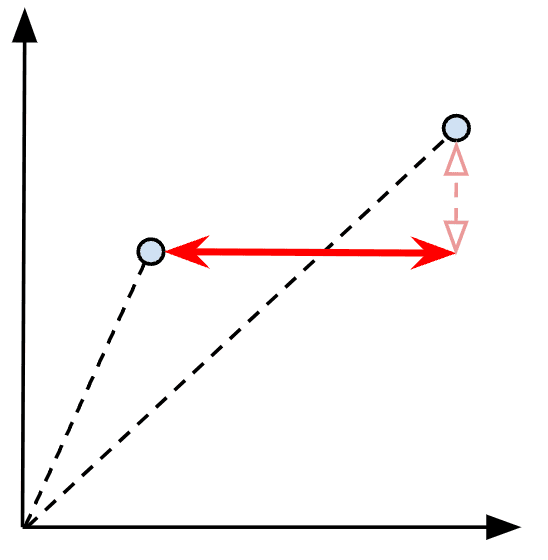

可视化两个向量之间的 Linf 距离

同样，取相同的两个样本向量 x 和 y，我们可以计算 L 无穷距离为 max ( | 1 - 4 | , | 2 - 3 | ) = max (3, 1) = 3。

### **2.5.4 余弦相似度**

与 L1、L2 和 Linf 不同，余弦相似度并非衡量两个向量 x 和 y 之间的距离，而是衡量它们的相对角度，即它们是否指向大致相同的方向。相似度 s 越高，两个向量越「**接近**」。其公式同样非常简单，如下所示：

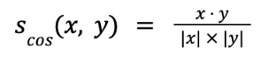

两个向量之间余弦相似度的表示方法如下图所示：

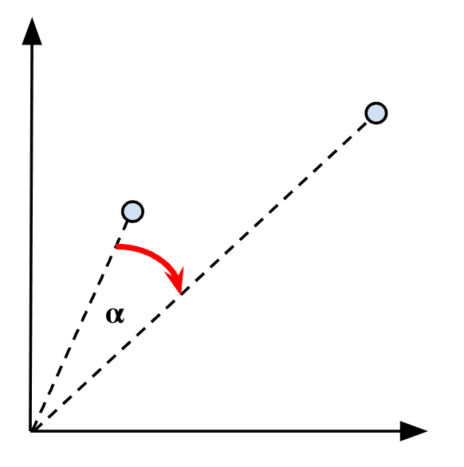

可视化两个向量之间的余弦相似度

此外，由于余弦值始终在 \[-1, 1\] 区间内，-1 表示相反的相似性（即两个向量之间成 180° 角），0 表示不相关的相似性（即成 90° 角），1 表示相同（即成 0° 角），如下图所示：

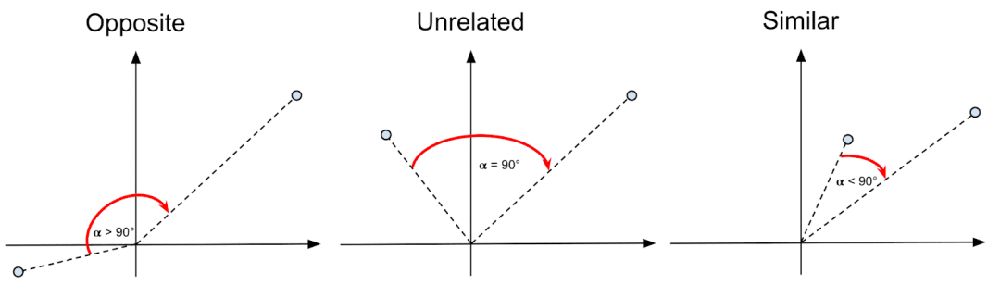

余弦相似度谱

  
再次，让我们重复使用相同的样本向量 x 和 y，并使用上述公式计算余弦相似度。首先，我们可以计算两个向量的点积，即 （1x4)+(2x3) = 10。然后，我们将两个向量的长度（也称为幅度）相乘：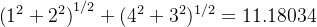。最后，我们将点积除以乘积的长度 10 / 11.18034 = 0.894427（即 26° 角），该值非常接近 1，因此两个向量可以被认为非常相似。

### **2.5.5 点积相似度**

余弦相似度的一个缺点是它只考虑两个向量之间的角度，而不考虑它们的大小（即长度）。这意味着，如果两个向量大致指向同一方向，但其中一个比另一个长得多，则它们仍将被视为相似。点积相似度（也称为标量或内积）则通过同时考虑向量的角度和大小来改进这一点，从而提供更精确的相似度度量。

计算点积相似度有两个等效公式，第一个公式与我们之前在余弦相似度的分子中看到的相同：

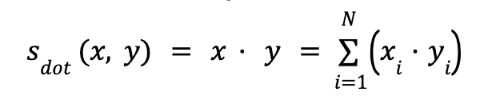

第二个公式只是将两个向量的长度乘以它们之间角度的余弦：

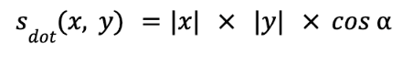

点积相似度如下图所示：

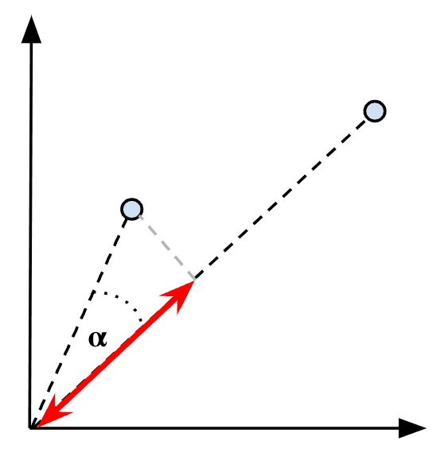

可视化两个向量之间的点积相似度

最后一次，我们取样本 x 和 y 向量，并使用第一个公式计算它们的点积相似度，就像我们之前对余弦相似度所做的那样，即 (1x4)+(2x3) = 10。

使用第二个公式，我们将两个向量的长度相乘： 并将其乘以两个向量之间 26° 角的余弦，得到 11.18034 x cos(26°) = 10。

值得注意的是，如果所有向量都先进行归一化（即长度为 1），那么点积相似度就会与余弦相似度完全相同（因为 |x| |y| = 1），即两个向量夹角的余弦值。正如我们稍后会看到的，对向量进行归一化是一种很好的做法，它可以让向量的大小变得无关紧要，从而使相似度只关注夹角。这还能加快索引和查询时的距离计算速度，而这在处理数十亿个向量时可能是一个大问题。

## **2.6 向量搜索算法与技术**

现在深入研究向量搜索引擎本身。当查询进入时，首先会对其进行向量化，然后向量搜索引擎会找到与该查询向量最近的邻域向量。测量查询向量与数据库中所有向量之间的距离或相似度的蛮力方法，对于小型数据集可能有效，但随着向量数量的增加，这种方法很快就会失效。换句话说，我们如何才能索引数百万、数十亿甚至数万亿个向量，并在合理的时间内找到查询向量的最近邻？

这就需要我们变得聪明起来，找到索引向量的最佳方法，以便我们能够尽快锁定最近邻，而不会过度降低精度。我们将简要介绍一些主要的算法。根据具体应用场景，有些算法比其他算法更适合。

### **2.6.1 线性搜索**

之前我们简单介绍了线性搜索，或者说平面索引，当时我们提到了一种蛮力法，即将查询向量与数据库中所有向量进行比较。虽然这种方法在小型数据集上可能效果很好，但随着向量数量和维度的增加（复杂度为 O(n)），性能会迅速下降。

幸运的是，有一种更有效的方法，称为「**近似最近邻 ANN**」，其中嵌入向量之间的距离是预先计算的，并且相似的向量以一种保持它们靠近的方式存储和组织，例如使用聚类、树、哈希或图。

这类方法被称为「**近似**」，因为它们通常不能保证 100% 的准确率。最终目标是尽可能快速地「**缩小搜索范围**」，以便只关注最有可能包含相似向量的区域，或者「**降低向量的维度**」。

### **2.6.2 K - 维树（Dimensional trees）**

K 维树（或称 KD 树）是二叉搜索树的泛化，它将点存储在 k 维空间中，并通过不断将搜索空间二等分为较小的左树和右树来工作，并在其中对向量进行索引。

在搜索时，算法只需访问查询向量（图 11 中的红点）周围的几个树枝，即可找到最近的邻居（下图中的绿点）。如果请求的邻居数超过 k，则黄色区域会扩展，直到算法找到更多邻居为止。

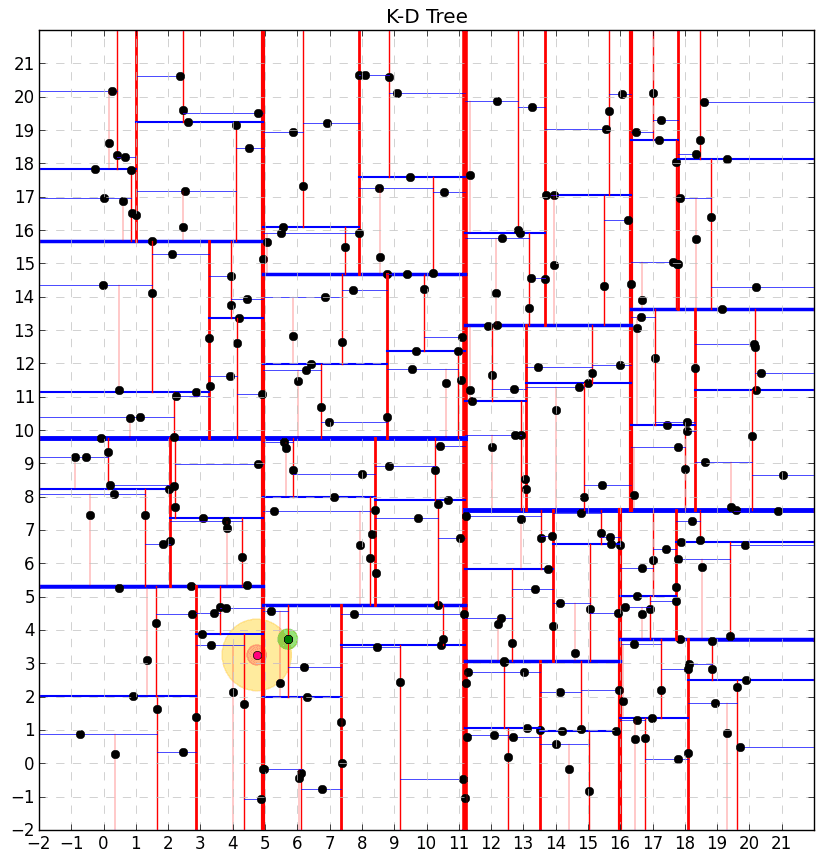

*KD树算法。*

资料来源：[https ://salzi.blog/2014/06/28/kd-tree-and-nearest-neighbor-nn-search-2d-case/](http://https%20//salzi.blog/2014/06/28/kd-tree-and-nearest-neighbor-nn-search-2d-case/)

KD树算法的最大优势在于，它使我们能够快速地将注意力集中在一些局部的树分支上，从而消除了大部分需要考虑的向量。然而该算法的效率会随着维数的增加而降低，因为与低维空间相比，它需要访问更多的分支。

### **2.6.3 倒排索引**

倒排索引 (inverted file index - IVF) 方法也是一种空间分区（space-partitioning）算法，它将彼此接近的向量分配到它们的共享质心。在 2D 空间中，最好使用 Voronoi 图来可视化，如图所示：

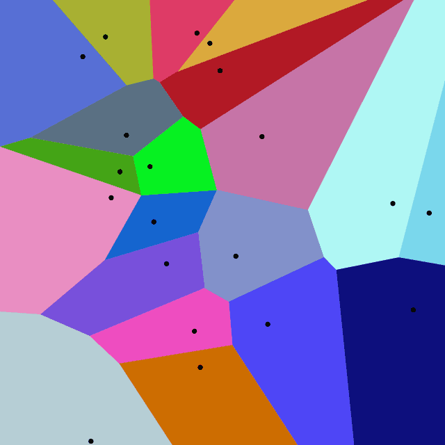

*二维空间中倒排文件索引的 Voronoi 表示。*

资料来源：[https ://docs.zilliz.com/docs/vector-index-basics-and-the-inverted-file-index](http://https%20//docs.zilliz.com/docs/vector-index-basics-and-the-inverted-file-index)

我们可以看到，上述二维空间被划分为 20 个聚类，每个聚类的质心用黑点表示。空间中的所有嵌入向量都被分配到质心最接近它们的聚类中。在搜索时，算法首先通过找到最接近查询向量的质心来确定要关注的聚类，然后它可以简单地聚焦于该区域，如果需要，还可以聚焦于周围的区域，以便找到最近的邻居。

在高维空间中使用时，该算法会遇到与 KD 树相同的问题。这被称为「**维数灾难**」。当空间体积过大，所有数据都显得稀疏，而获得更准确结果所需的数据量却呈指数级增长时，就会出现这种情况。当数据稀疏时，这些空间划分算法将数据组织成簇变得更加困难。幸运的是还有其他算法和技术可以缓解这个问题，如下所述。

### **2.6.4 量化**

量化是一种基于「**压缩**」的方法，它允许我们通过降低「**嵌入向量**」的精度来减少数据库的总大小。这可以通过使用标量量化 (SQ)来实现，即将浮点向量值转换为整数值。这不仅将数据库的大小减少了 8 倍，还降低了内存消耗，并加快了搜索时向量之间距离的计算速度。

另一种技术称为「**乘积量化**」（product quantization - PQ)，它首先将空间划分为低维子空间，然后使用聚类算法（类似于 k 均值 - k-means）将彼此接近的向量分组到每个子空间中。

> 请注意，量化不同于降维，降维是减少维数（dimensionality reduction），即向量只是变短了。

### **2.6.5 HNSW(分层可导航小世界)**

如果光看名字就觉得它很复杂，别担心，其实不然！简而言之，HNSW 是一种基于多层图的算法，非常流行且高效。它被许多不同的矢量数据库所采用，包括 Apache Lucene。

HNSW 的概念表示如下图所示：

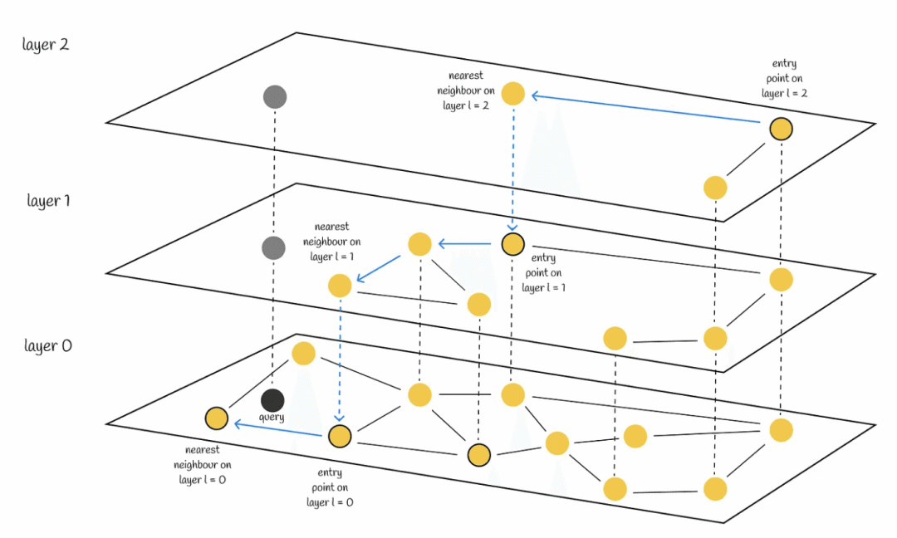

*分层可导航小世界。*

资料来源：[https ://towardsdatascience.com/similarity-search-part-4-hierarchical-navigable-small-world-hnsw-2aad4fe87d37](http://https%20//towardsdatascience.com/similarity-search-part-4-hierarchical-navigable-small-world-hnsw-2aad4fe87d37)

在顶层，我们可以看到一个由极少数向量组成的图，这些向量之间具有最长的链接，也就是说，它是一个由相似度最低的连通向量组成的图。随着我们深入底层，我们发现的向量越多，图就越密集，并且越来越多的向量彼此之间更加接近。在最底层，我们可以找到所有的向量，其中最相似的向量彼此之间距离最近。

在搜索时，算法从顶层的任意入口点开始，找到与查询向量最接近的向量（以灰色点表示）。然后算法向下移动一层，重复相同的过程，从上一层留下的相同向量开始，以此类推，一层接一层，直到到达最低层，找到与查询向量最近的邻居。

### **2.6.6 LSH (局部敏感哈希)**

与迄今为止提出的所有其他方法一样，局部敏感哈希力求大幅缩减搜索空间，从而提高检索速度。通过这种技术，嵌入向量会被转换为哈希值，同时保留相似性信息，最终使搜索空间变成一个简单的哈希表，可供查找，而不是需要遍历的图或树。基于哈希的方法的主要优势在于，包含任意（大量）维度的向量可以映射到固定大小的哈希值，从而在不牺牲太多精度的情况下显著加快检索速度。

数据哈希有很多不同的方法，尤其是嵌入向量的哈希方法，但本文不会深入探讨每种方法的细节。传统的哈希方法通常会对看似非常相似的数据产生截然不同的哈希值。由于嵌入向量由浮点值组成，因此我们取两个在向量运算中被认为非常接近的浮点值样本（例如 0.73 和 0.74），并用一些常见的哈希函数对它们进行运算。从下面的结果可以看出，常见的哈希函数显然无法保留输入之间的相似性。

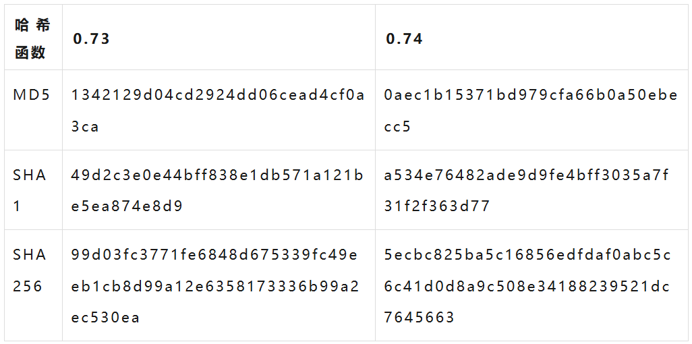

传统的哈希方法试图最小化相似数据块之间的哈希冲突，而局部敏感哈希的主要目标恰恰相反，即最大化哈希冲突，使相似的数据以较高的概率落入同一个桶中。通过这种方式，在多维空间中彼此接近的嵌入向量将被哈希成一个固定大小的值，并落入同一个桶中。由于局部敏感哈希允许这些哈希向量保持其邻近性，因此该技术在数据聚类和最近邻搜索中非常实用。

所有繁重的工作都发生在索引时，即需要计算哈希值的时候。而在搜索时，我们只需要对查询向量进行哈希处理，以便查找包含最接近嵌入向量的存储桶。找到候选存储桶后，通常会进行第二轮搜索，以识别与查询向量最近的相邻向量。

## **03 ES 8.x 向量搜索方式**

Elasticsearch为了满足向量搜索的需求，在7.0版本新增了两个字段类型dense\_vector 和 sparse\_vector,分别是密集向量和稀疏向量，其中 sparse\_vector在7.6中被弃用，在8.0-8.10版本中是没有该字段类型的。

## **3.1 近似 KNN（HNSW 算法）**

> 在7.10版本中，没有该方式，因此按照2025/3/1最新版本8.17版本介绍

k-nearest neighbor（kNN）搜索通过相似性度量所测量等算法查询向量最近的k个向量。大多数情况下，如果你有大量数据并且需要使用 Elasticsearch 实现向量搜索，则你将选择此模式。索引延迟稍高一些，因为 Lucene 需要构建底层 HNSW 图来存储和索引所有向量。它在搜索时的内存要求方面也要求更高一些，之所以称为「**近似**」，是因为其准确度永远不可能像精确搜索那样达到 100%。尽管如此，近似 k-NN 的搜索延迟要低得多，并且允许我们扩展到数百万甚至数十亿个向量，前提是你的集群大小合适。

### **3.1.1 前置条件**

Elasticsearch 本身就提供向量搜索，无需安装任何特定程序。要使用KNN搜索，首先必须要有dense\_vector或 sparse\_vector字段,这些字段的维度一定要和查询的维度相同，所以一定要确定好维度。关于向量，可以在Elasticsearch中使用自然语言处理（NLP）模型创建这些向量，或者在Elasticsearch外部生成它们，比如使用阿里云的向量模型API获取文本向量后赋值到搜索参数中。

首先需要显式映射一个或多个dense\_vector 字段，向量数据将存储在该字段中。

> 在8.0版中添加了对近似 kNN 搜索的支持。在此之前 dense\_vector 字段不支持在映射中启用索引。如果在8.0之前的版本创建了一个包含dense\_vector字段的索引，那么为了支持近似kNN搜索，必须使用设置index：true（默认选项）的新字段映射重新索引数据。

下面的映射显示了一个名为 image\_vector 的 3 维 dense\_vector 字段。在此字段中存储和索引的密集向量将使用 12\_norm 相似度函数。

值得注意的是，在 8.11 版本之前，hnsw 是 Apache Lucene 支持的唯一用于索引密集向量的算法。从那时起其他算法被添加，未来 Elasticsearch 可能会提供用于索引和搜索密集向量的其他方法，但由于它完全依赖于 Apache Lucene，因此这将取决于[这方面的进展](https://github.com/apache/lucene/issues/10177)。

PUT /product-index{

"mappings": {

"properties": {

"price": {

"type": "integer"

},

"title\_vector": {

"type": "dense\_vector",

"dims": 3, //向量维度

"index": true, # default since 8.11 8.0之前使用KNN搜索

"similarity": "cosine", # default since 8.11 获取knn相似度的函数，不设置改值默认为cosine（余弦），且只能在index设置为true时指定

"index\_options": {

"type": "int8\_hnsw", # default value since 8.12

"ef\_construction": 128,

"m": 24

}

}

}

}

}

similarity的选择有（详情可看密集向量字段的参数）:

1.  l2\_norm
2.  dot\_product
3.  cosine
4.  max\_inner\_product

下表总结了 Elasticsearch 提供的 dense\_vector 字段类型的所有可用配置参数：

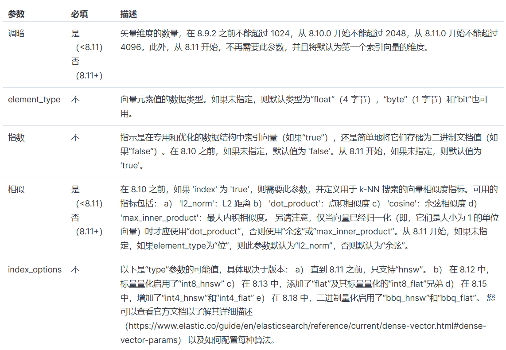

密集向量的不同配置参数

### **3.1.2 创建数据**

POST product-index/\_bulk

{ "index": { "\_id": "1" } }{ "title\_vector": \[2.2, 4.3, 1.8\], "price": 23}

{ "index": { "\_id": "2" } }{ "title\_vector": \[3.1, 0.7, 8.2\], "price": 9}

{ "index": { "\_id": "3" } }{ "title\_vector": \[1.4, 5.6, 3.9\], "price": 124}

{ "index": { "\_id": "4" } }{ "title\_vector": \[1.1, 4.4, 2.9\], "price": 1457}

....

### **3.1.3 使用简单 KNN 查询**

运行上面命令后，向量数据现在已在HNSW 图中正确索引，可供搜索。直到 8.11 版，运行简单 k-NN 搜索的唯一方法是使用 knn 搜索选项，该选项与你习惯的 query 部分位于同一级别，如以下查询所示：

POST product-index/\_search

{

"knn": {

"field": "title\_vector",

"query\_vector": \[0.1, 3.2, 2.1\],

"k": 2, //查询的数量

"num\_candidates": 100

},

"\_source": false,

"fields": \[ "price" \]

}

在上面的搜索负载中，我们可以看到没有像词汇搜索那样的 query 部分，而是 knn 部分。我们正在搜索与指定查询向量最接近的两个（k：2）相邻向量。

从 8.12 版本开始，引入了新的 knn 搜索查询（knn search query），以允许更高级的混合搜索用例，这是我们将在下一篇文章中讨论的主题。除非你具备将 k-NN 查询与其他查询相结合所需的专业知识，否则 Elastic 建议坚持使用更易于使用的 knn 搜索选项。首先要注意的是，新的 knn 搜索查询没有 k 参数，而是像任何其他查询一样使用 size 参数。第二件值得注意的是，新的 knn 查询通过利用将一个或多个过滤器与 knn 搜索查询相结合的 bool 查询来实现对 k-NN 搜索结果的后过滤，如下面的代码所示：

POST product-index/\_search

{

"size": 3,

"\_source": false,

"fields": \[ "price"\],

"query" : {

"bool" : {

"must" : {

"knn": {

"field": "title\_vector",

"query\_vector": \[0.1, 3.2, 2.1\],

"num\_candidates": 100

}

},

"filter" : {

"range" : {

"price" : {

"gte": 100

}

}

} }

}

}

上述查询首先检索具有最近邻向量的前 3 个文档，然后过滤掉 price 小于 100 的文档。值得注意的是，使用这种后过滤，如果过滤器过于激进，你可能最终得不到任何结果。还请注意，此行为不同于通常的布尔全文查询，其中首先执行过滤部分以减少需要评分的文档集。如果你有兴趣了解有关 knn 顶级搜索选项和新 knn 搜索查询之间的差异的更多信息，你可以前往另一篇 [搜索实验室文章](https://www.elastic.co/search-labs/blog/knn-query-elasticsearch) 了解更多详细信息。

为了收集结果，kNN搜索API在每个分片上找到num\_candidates数量的近似最近邻候选。搜索计算这些候选向量与查询向量的相似度，选择k个最相似的结果。然后，搜索将来自 每个分片返回全局前k个最近邻向量。

可以增加num\_candidates以获得更准确的结果，但代价是搜索速度变慢。num\_candidates值比较较高的搜索 会从每个分片中考虑更多的候选者。会花费更多的时间，但也会提高搜索真正的k个最接近的向量的概率。

现在让我们继续了解有关 num\_candidates 参数的更多信息。num\_candidates 的作用是增加或减少找到真正最近邻候选的可能性。该数字越高，搜索速度越慢，但找到真正最近邻的可能性也越大。每个分片上将考虑 num\_candidates 个向量，并将前 k 个向量返回到协调器节点，协调器节点将合并所有分片本地结果并返回全局结果中的前 k 个向量。

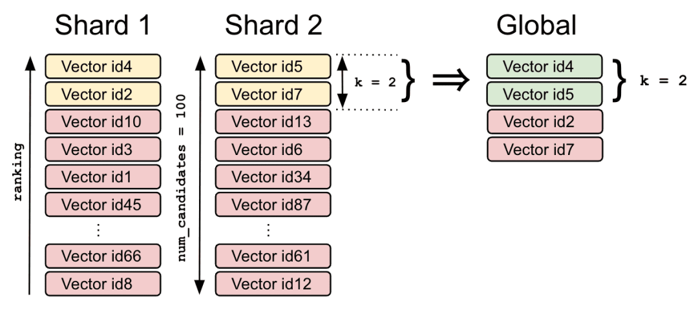

使用 num\_candidates 的最近邻搜索准确率

向量 id4 和 id2 分别是第一个分片上的 k 个局部最近邻，id5 和 id7 分别是第二个分片上的 k 个局部最近邻。在对它们进行合并和重新排序后，协调器节点将返回 id4 和 id5 作为搜索查询的两个全局最近邻。

### **3.1.4 多个 KNN 搜索**

如果你的索引中有多个向量字段，则可以发送多个 k-NN 搜索，因为 knn 部分还接受查询数组，如下所示：

POST product-index/\_search

{

"\_source": false,

"fields": \[ "price" \],

"knn": \[

{

"field": "title\_vector",

"query\_vector": \[0.1, 3.2, 2.1\],

"k": 2,

"num\_candidates": 100,

"boost": 0.4

},

{

"field": "content\_vector",

"query\_vector": \[0.1, 3.2, 2.1\],

"k": 5,

"num\_candidates": 100,

"boost": 0.6

}

\]

}

我们可以看到，每个查询可以采用不同的 k 值以及不同的提升因子。提升因子相当于权重，总得分将是两个得分的加权平均值。

### **3.1.5 过滤的 KNN 搜索**

与我们之前在 script\_score 查询中看到的类似，knn 部分也接受过滤器的规范，以减少近似搜索应运行的向量空间。例如，在下面的 k-NN 搜索中，我们将搜索限制为仅搜索价格大于或等于 100 的文档。

POST product-index/\_search

{

"\_source": false,

"fields": \[ "price" \],

"knn": {

"field": "title\_vector",

"query\_vector": \[0.1, 3.2, 2.1\],

"k": 2,

"num\_candidates": 100,

"filter" : {

"range" : {

"price" : {

"gte": 100

}

}

}

}

}

现在，你可能想知道数据集是否先按 price 过滤，然后对过滤后的数据集运行 k-NN 搜索（预过滤），还是反过来，即先检索最近邻居，然后按 price 过滤（后过滤）。实际上，两者都有一点。如果过滤器过于激进，预过滤的问题在于 k-NN 搜索必须在非常小且可能稀疏的向量空间上运行，并且不会返回非常准确的结果。而后过滤可能会剔除大量高质量的最近邻居。

因此，即使 knn 部分 filter 被视为预过滤器，它也会在 k-NN 搜索期间工作，以确保至少可以返回 k 个邻居。如果你对其工作原理感兴趣，可以查看以下处理此事的 Lucene 问题。

### **3.1.6 具有预期相似度的过滤 KNN 搜索**

在上一节中，我们了解到，在指定过滤器时，我们可以减少搜索延迟，但我们也冒着将向量空间大幅减少为与查询向量部分或大部分不相似的向量的风险。为了缓解这个问题，k-NN 搜索还可以指定所有返回向量预计具有的最小相似度值（minimum similarity）。重用上一个查询，它看起来会像这样：

POST my-index/\_search

{

"\_source": false,

"fields": \[ "price" \],

"knn": {

"field": "title\_vector",

"query\_vector": \[0.1, 3.2, 2.1\],

"k": 2,

"num\_candidates": 100,

"similarity": 0.975,

"filter" : {

"range" : {

"price" : {

"gte": 100

}

}

}

}

}

基本上，它的工作方式是，通过跳过任何与提供的过滤器不匹配或相似度低于指定过滤器的向量来探索向量空间，直到找到 k 个最近邻居。如果算法不能接受至少 k 个结果（由于过滤器过于严格或预期相似度太低），则将尝试进行强力搜索（brute-force），以便至少返回 k 个最近邻居。

关于如何确定最小预期相似度的简短说明。这取决于你在向量场映射中选择了哪种相似度度量。如果你选择了 l2\_norm，它是一个距离函数（即相似度随着距离的增加而减小），你将需要在 k-NN 查询中设置最大预期距离，即你认为可接受的最大距离。换句话说，与查询向量的距离介于 0 和最大预期距离之间的向量将被视为足够 “接近” 以相似。

如果你选择了 dot\_product 或 cosine，它们是相似度函数（即，相似度随着向量角度变宽而降低），你将需要设置最小预期相似度。与查询向量具有最小预期相似度和 1 之间的相似度的向量将被视为足够 “接近” 以致相似。

应用于上面的示例过滤查询和我们之前已索引的示例数据集，下面的表 1 总结了查询向量和每个索引向量之间的余弦相似度。我们可以看到，向量 3 和 4 被过滤器选中（price >= 100），但只有向量 3 具有最小预期相似度（即 0.975）才能被选中。

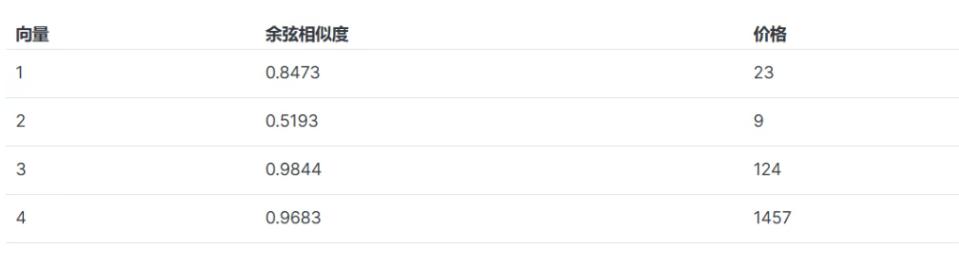

具有预期相似度的过滤搜索示例

### **3.1.7 KNN 局限性**

现在我们已经回顾了 Elasticsearch 中 k-NN 搜索的所有功能，让我们看看你需要注意的几个限制：

1.  直到 8.11，k-NN 搜索都无法在嵌套文档内的向量字段上运行。从 8.12 开始，此限制已被取消。但是，这种嵌套的 knn 查询不支持指定过滤器。
2.  search\_type 始终设置为 dfs\_query\_then\_fetch，并且无法动态更改它。
3.  在使用跨集群搜索跨不同集群进行搜索时，不支持 ccs\_minimize\_roundtrips 选项。
4.  这已经提到过几次了，但由于 Lucene 使用的 HNSW 算法的性质（以及任何其他近似最近邻搜索算法），“近似” 实际上意味着返回的 k 个最近邻并不总是真实的。

### **3.1.8 调整 KNN**

你可以想象，你可以使用很多选项来优化 k-NN 搜索的索引和搜索性能。我们不会在本文中介绍它们，但如果你真的想在 Elasticsearch 集群中实施 k-NN 搜索，我们强烈建议你在[官方文档](https://www.elastic.co/docs/deploy-manage/production-guidance/optimize-performance/approximate-knn-search)中查看它们。

### **3.1.9 超越 KNN**

到目前为止，我们看到的一切都利用了「**密集**」（dense）向量模型（因此是致密向量字段类型），其中向量通常包含非零值。Elasticsearch 还提供了使用「**稀疏**」（sparse）向量模型执行语义搜索的另一种方法。

Elastic 创建了一个「**稀疏 NLP 向量模型**」，称为Elastic Learned Sparse EncodeR，简称 ELSER，这是一个域外（即未在特定域上训练）稀疏向量模型，不需要任何微调。它是在约 30000 个术语的词汇表上进行预训练的，并且作为一个稀疏模型，这意味着向量具有相同数量的值，其中大多数为零。

它的工作方式非常简单。在索引时，使用推理摄取处理器生成「**稀疏向量**」（术语/权重对），并将其存储在sparse\_vector 类型的字段中，这是dense\_vector向量字段类型的稀疏对应项。在查询时，特定的 DSL 查询（也称为 sparse\_vector）将用 ELSER 模型词汇表中的可用术语替换原始查询术语，这些术语已知与它们的权重最相似。

我们不会在本文中深入探讨 ELSER，但如果你渴望了解它的工作原理，你可以查看这篇[开创性的文章](https://www.elastic.co/search-labs/blog/introducing-elastic-learned-sparse-encoder-elser)以及[官方文档](https://www.elastic.co/guide/en/elasticsearch/reference/current/semantic-search.html#semantic-search-hybrid-search)，其中详细解释了该主题。

## **3.2 精确暴力搜索**

计算查询向量与所有过滤后的文档向量的余弦距离，保证100%召回率但计算成本高。使用精确KNN搜索的话，需要使用带有vector函数的script\_score查询。

基本上，查询向量将根据每个存储的向量进行测量，以找到最近的邻居。在此模式下，向量不需要在 HNSW 中编入索引，而只需存储为二进制文档值，相似度计算由自定义 Painless 脚本运行。

### **3.2.1 设置 mapping**

首先需要显式映射一个或多个dense\_vector字段。如果不打算将该字段使用近似kNN搜索，可以将索引映射选项设置为false。这可以显著提高索引速度。

PUT product-index

{

"mappings": {

"properties": {

"product-vector": {

"type": "dense\_vector",

"dims": 5,

"index": false

},

"price": {

"type": "long"

}

}

}

}

### **3.2.2 创建数据**

POST product-index/\_bulk?refresh=true

{ "index": { "\_id": "1" } }

{ "product-vector": \[230.0, 300.33, \-34.8988, 15.555, \-200.0\], "price": 1599 }

{ "index": { "\_id": "2" } }

{ "product-vector": \[-0.5, 100.0, \-13.0, 14.8, \-156.0\], "price": 799 }

{ "index": { "\_id": "3" } }

{ "product-vector": \[0.5, 111.3, \-13.0, 14.8, \-156.0\], "price": 1099 }

...

### **3.2.3 相似度搜索**

这种方法的优点是向量不需要索引，这大大降低了提取时间，因为不需要构建底层 HNSW 图。但是根据数据集的大小和硬件，随着数据量的增加，搜索查询可能会很快变慢，因为添加的向量越多，访问每个向量所需的时间就越长（即线性搜索的复杂度为 O(n)）。

创建索引并加载数据后，我们现在可以使用以下 script\_score 查询运行精确搜索，使用search API运行包含向量函数的script\_score查询。

向量函数的类型有：

1.  cosineSimilarity-计算余弦相似度
2.  dotProduct-计算点积
3.  l1 norm-计算L1距离
4.  Hamming-计算Hamming距离
5.  l2 norm-计算L2距离
6.  doc\[<field>\].vectorValue-以浮点数组的形式返回向量的值
7.  doc\[<field>\].magnitude-返回向量的大小
8.  接下来以cosineSimilarity为例，这是一个通过计算两个向量的余弦大小来判断向量相似度的函数。我们通过传入的参数向量queryVector,这个名称是自定义的，但是需要与source的脚本中params.queryVector一致,下面方法将会查询所有文档

GET product-index/\_search

{

"query": {

"script\_score": {

"query" : {

"match\_all" : {}

},

"script": {

"source": "cosineSimilarity(params.queryVector, 'product-vector') + 1.0",

"params": {

"queryVector": \[-0.5, 90.0, \-10, 14.8, \-156.0\]

}

}

}

}

}

如你所见，script\_score 查询由两个主要元素组成，即查询 query 和脚本 script。在上面的示例中，使用match\_all查询来全量匹配所有文档会显著增加搜索延迟，为了限制传递给vector函数的匹配文档的数量，可以在script\_score.query参数中指定一个过滤查询。

例如下面示例：

GET product-index/\_search

{

"query": {

"script\_score": {

"query" : {

"bool" : {

"filter" : {

"range" : {

"price" : {

"gte": 1000

}

}

}

}

},

"script": {

"source": "cosineSimilarity(params.queryVector, 'product-vector') + 1.0",

"params": {

"queryVector": \[-0.5, 90.0, \-10, 14.8, \-156.0\]

}

}

}

}

}

在上面的示例中，查询部分指定了一个过滤器（即 price >= 1000），该过滤器限制了将针对其执行脚本的文档集。

## **3.3 两种搜索对比**

### **3.3.1 原理差异**

1.  精确暴力搜索：在进行搜索时，精确暴力搜索会遍历数据集中的每一个向量，逐一计算查询向量与它们之间的相似度（如欧几里得距离、余弦相似度等），然后根据相似度的大小对所有向量进行排序，最后选取最相似的k个向量作为结果返回。这种方法简单直接，能够保证搜索结果的精确性，但在数据量较大时，计算量会非常庞大。
2.  近似 k - NN 搜索：近似 k - NN 搜索则采用了一些优化策略来减少计算量。例如，利用上述提到的 KD - Tree、HNSW 等索引结构，通过构建数据的层次化表示或图结构，在搜索时能够快速定位到可能包含相似向量的区域，而无需遍历整个数据集。以 HNSW 为例，它通过多层图结构，在高层图中快速跳过大量不相关的向量，仅在底层图中对局部区域进行更精确的搜索，从而在保证一定搜索精度的前提下，大大提高了搜索效率。

### **3.3.2 性能表现**

1.  搜索时间：精确暴力搜索的搜索时间与数据集的大小成正比，数据量越大，搜索时间越长。在大规模数据集上，搜索可能需要很长时间才能完成。而近似 k - NN 搜索借助索引结构，能够显著减少搜索过程中需要计算相似度的向量数量，搜索时间相对较短，尤其在处理海量数据时，优势更为明显。
2.  内存使用：精确暴力搜索不需要额外的内存来存储索引结构，仅需存储数据集本身。然而，近似 k - NN 搜索需要构建和维护索引结构，这会占用额外的内存空间。例如，HNSW 索引在构建过程中会生成多层图结构，每个节点都需要存储一定的连接信息，因此会消耗更多的内存。

### **3.3.3 适合场景**

1.  精确暴力搜索：适用于数据集较小、对搜索结果的精确性要求极高且对搜索时间没有严格限制的场景。例如，在一些数据量有限的科研项目中，研究人员可能更关注搜索结果的准确性，而不太在意搜索时间，此时精确暴力搜索可以满足需求。
2.  近似 k - NN 搜索：在实际应用中，尤其是面对大规模数据集时，近似 k - NN 搜索更为适用。例如，在图像搜索引擎中，可能需要处理数百万甚至数十亿张图像的向量数据，如果使用精确暴力搜索，搜索效率将极低。而近似 k - NN 搜索能够在较短的时间内返回近似最优的结果，满足用户对实时性的需求

1.  用精确搜索的情况
2.  公司只有2000 份合同，需要100%确保找到所有相关文件
3.  医疗诊断系统，不能容忍任何漏诊可能
4.  用近似搜索的情况
5.  淘宝有10亿商品图片，用户想快速找到相似款衣服
6.  抖音推荐视频，允许少量误差但要求毫秒级响应

精确的强力kNN保证了准确的结果，但无法很好地扩展大型数据集。如果必须要使用精确暴力搜索，您可以通过使用查询参数来限制传递给函数的匹配文档的数量。如果过滤数据到一个小的文档子集，就可以得到很好的搜索结果。

## **04 ES 8.x 向量项目实战**

这部分直接参考我们小红书 LLM 智能推荐引擎项目 - RAG 知识库部分。

[【LLM大模型智能实战第十二篇】手把手带你实战小红书美食推荐 RAG 知识库管理模块](https://articles.zsxq.com/id_j76ecjd50jto.html)

[【LLM大模型智能实战第十三篇】手把手带你实战小红书美食推荐 RAG 知识库上传模块(断点续传、分片上传、分片合并)](https://articles.zsxq.com/id_uu6xd61s5fpl.html)

[【LLM大模型智能实战第十四篇】手把手带你实战小红书美食推荐 RAG 知识库 RocketMQ 异步解析、向量数据处理](https://articles.zsxq.com/id_rt3fnk5p20d0.html)

[【LLM大模型智能实战第十五篇】手把手带你实战小红书美食推荐 RAG 知识库 ES 向量数据智能混合搜索](https://articles.zsxq.com/id_rabdowwf3uo0.html)