从今天之后的一段时间内，华仔会带着大家一起来从零开始对 ElasticStack 矩阵产品进行深入剖析和项目运维实战，希望大家学完之后可以用到自己的工作中。

这是第五篇，本篇我将带着大家进行「**ES 索引 Mapping 常用字段类型、 高级字段类型、字段限制深度实战**」。

文章汇总位置：[https://wx.zsxq.com/dweb2/index/columns/51122554151214](https://wx.zsxq.com/dweb2/index/columns/51122554151214)

## **01 前言**

在上篇中[【ES 入门实战第四篇】ES 索引文档 Document 写入、查询、更新、删除、批量操作等深度实战](https://articles.zsxq.com/id_2j10wlf59xvn.html)，带着大家进行实战「**ES 索引文档 Document 写入、查询、更新、删除、批量操作深度实战**」。

今天我们来进行「**ES 索引 Mapping 常用字段类型、 高级字段类型、字段限制深度实战**」。

##   
**02 ES 索引 Mapping 字段深度实战**

这里分为两部分实操：

1.  Mapping 常用字段类型深度实战。
2.  Mapping 高级字段类型深度实战。

接下来，我们就来分别来实战下。

## **2.1 ES 索引 Mapping 简单回顾**

在正式实操之前，我们来回顾下 ES 索引 Mapping 相关概念和字段数据类型。

### **2.1.1 ES 索引 Mapping 概念**

Mapping 定义了 ES 索引中文档有哪些字段及其类型、这些字段是如何存储和索引的。每个文档都是一个字段的集合，每个字段都有自己的数据类型。

比如上篇我们定义的 sku 商品索引，其有 skuId、skuName、brand、category、price、vipPrice 等字段。所以 Mapping 的作用主要有：

1.  定义了索引中各个字段的名称和对应的类型。
2.  定义各个字段、倒排索引的相关设置。如使用某字段使用什么分词器等。

{

"huazai\_ecshop\_sku\_index": {

"aliases": {},

"mappings": {

"properties": {

"brand": {

"type": "keyword"

},

"category": {

"type": "keyword"

},

"createTime": {

"type": "date",

"format": "yyyy-MM-dd HH:mm:ss"

},

"mainUrl": {

"type": "keyword",

"index": false

},

"name": {

"type": "text",

"fields": {

"keyword": {

"type": "keyword",

"ignore\_above": 256

}

}

},

"price": {

"type": "integer"

},

"skuId": {

"type": "integer"

},

"skuName": {

"type": "text"

},

"skuStatus": {

"type": "integer"

},

"updateTime": {

"type": "date",

"format": "yyyy-MM-dd HH:mm:ss"

},

"vipPrice": {

"type": "integer"

}

}

},

"settings": {

"index": {

"routing": {

"allocation": {

"include": {

"\_tier\_preference": "data\_content"

}

}

},

"number\_of\_shards": "3",

"provided\_name": "huazai\_ecshop\_sku\_index",

"creation\_date": "1755505804381",

"number\_of\_replicas": "1",

"uuid": "KHmAuAumRuOCo5IQA5n85g",

"version": {

"created": "8521000"

}

}

}

}

}

### **2.1.2 ES 索引 Mapping 支持的字段类型**

我们来总结下 ES 索引 Mapping 的字段类型都有哪些：

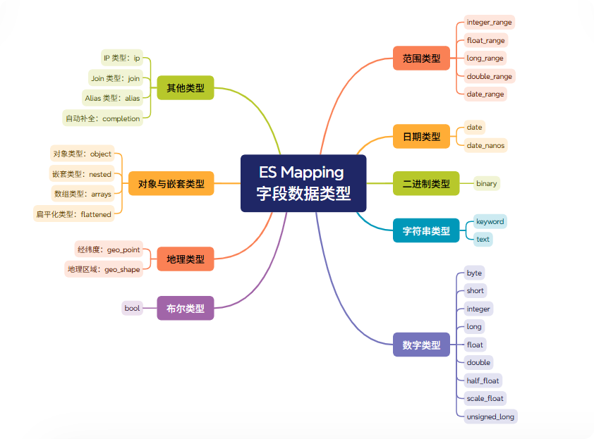

如上图，ES 提供的数据类型主要分为字符串、日期、数字、二进制、布尔、范围、地理、对象、嵌套类型等。接下来，我们按照「**ES 索引 Mapping 常用字段类型**」、「**ES 索引 Mapping 高级字段类型**」进行实操。

## **2.2 ES 索引 Mapping 常用字段类型实战**

### **2.2.1 字符串类型**

从 ES 7.x 之后的版本中，字符串类型只有 keyword 和 text 两种了，旧版本的 string 类型已不再支持。

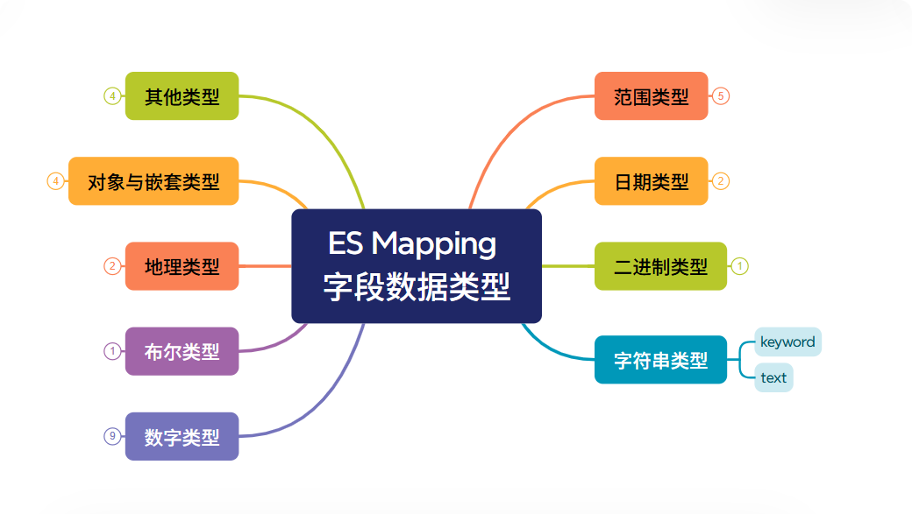

1.  keyword 单分词类型适合存储简短、结构化的字符串，比如商品 ID、品牌、分类等，其适合用于「**聚合**」、「**过滤**」、「**精确查询**」等。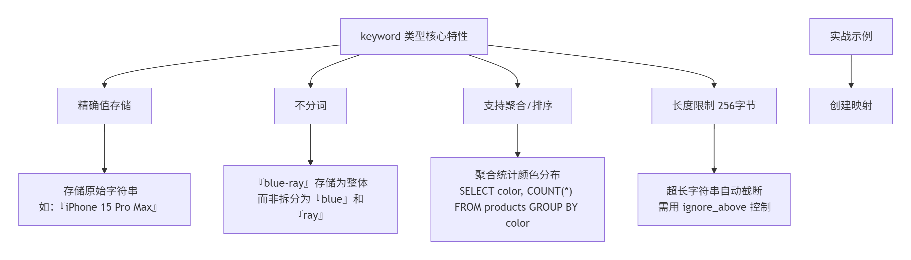
2.  text 多分词类型的字段适合存储全文本数据，比如商品名称、商品介绍、商品详情等。text 的类型数据将会被「**分词器**」进行分词，最终成为一个个「**词项**」存储在「**倒排索引**」中。不支持精确匹配：由于分词无法用 term 查询精确匹配原字符串（除非使用未分词的子字段），其默认的「**分词器**」为 standard，它主要用于需要「**分词检索/全文检索**」的场景，支持 match、match\_phrase 等查询，中文的分词器有「**ik\_smart**」、「**ik\_max\_word**」。不支持聚合和排序：如果需要，通常使用多字段（multi-fields）同时定义为 keyword。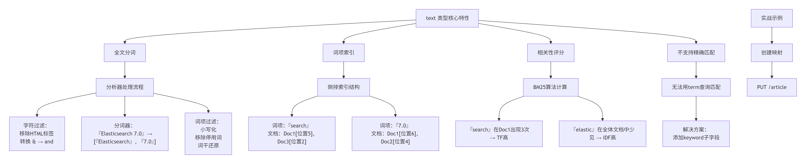

> 这里需要注意的是：比如你分词用的分词器是 ik\_smart，那么查询时也要用 ik\_smart，不然会造成前后两个分词器进行分词的内容不一样，导致查询结果不正确的情况，对于新手来说，很容易犯这个错误，切记切记！

这里暂不安装中文分词器，后续篇章单独实操。

### **1、text 示例**

创建 Mapping 索引，这里是动态 Mapping：

DELETE huazai-test-20250803

PUT huazai-test-20250803

{

"settings": {

"number\_of\_shards": 4,

"number\_of\_replicas": 0

},

"mappings": {

"\_source": {

"enabled": true

},

"dynamic": true,

"properties": {

"desc": {

"type": "text",

"analyzer": "standard"

}

}

}

}

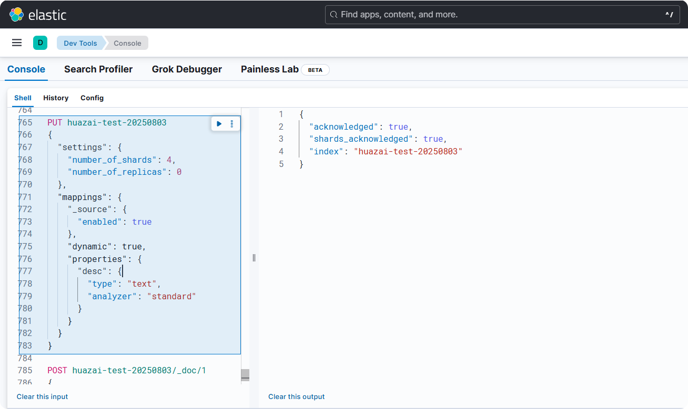

接着，插入一条数据：

\# 公众号:华仔聊技术、知识星球:华仔和他的朋友们主理人

POST huazai-test-20250803/\_doc/1

{

"name": "华仔",

"sex": "男",

"age": "40",

"desc":"Official account: Hua Zai Talks About Technology, Knowledge Planet: Managed by Hua Zai and His Friends"

}

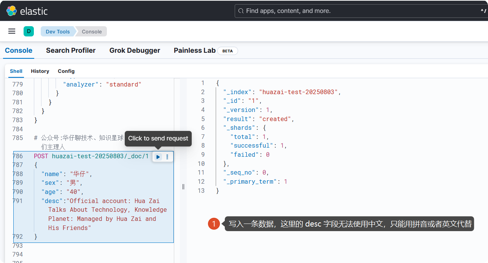

接着，我们来查询下，入门简单，想要提高精准度需要创建自己的词库暂不演示：

GET huazai-test-20250803/\_search

{

"query": {

"match": {

"desc": "Hua Zai"

}

}

}

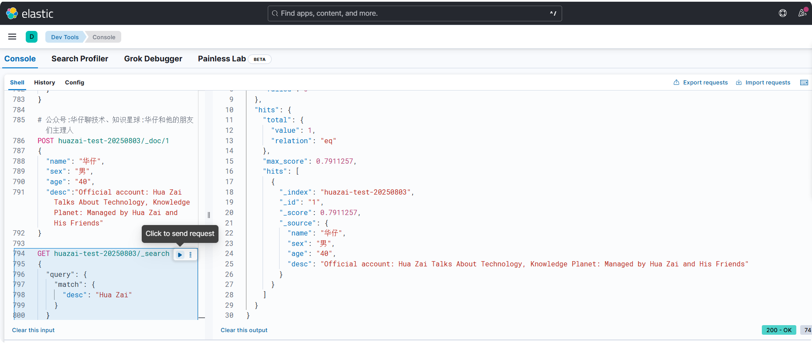

由于我们用到了分词，可以看到这里会有「**打分情况**」，ES 的 ​打分算法（Relevance Scoring）​​ 是全文搜索的核心，其核心是 ​TF-IDF + BM25 模型​（Elasticsearch 5.0+ 后默认）:

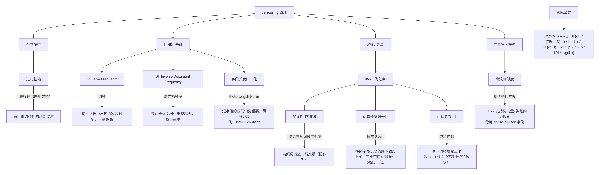

简单看下 TF-IDF 核心因素，不展开讨论，后续单独拆解：

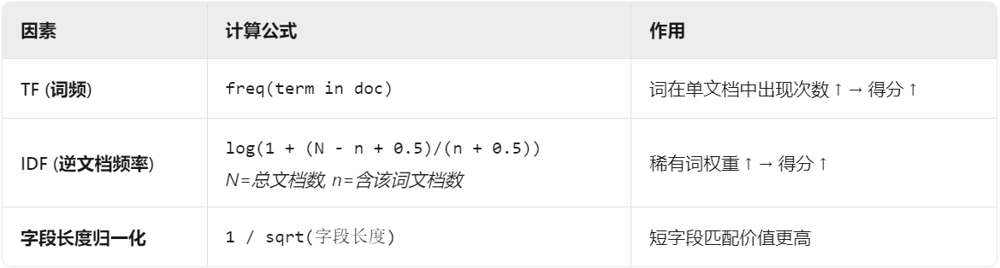

接着，测试分词：

GET \_analyze

{

"analyzer": "standard",

"text": \[

"Official account: Hua Zai Talks About Technology, Knowledge Planet: Managed by Hua Zai and His Friends"

\]

}

\# 结果

  
{

"tokens": \[

{

"token": "official",

"start\_offset": 0,

"end\_offset": 8,

"type": "<ALPHANUM>",

"position": 0

},

{

"token": "account",

"start\_offset": 9,

"end\_offset": 16,

"type": "<ALPHANUM>",

"position": 1

},

{

"token": "hua",

"start\_offset": 18,

"end\_offset": 21,

"type": "<ALPHANUM>",

"position": 2

},

{

"token": "zai",

"start\_offset": 22,

"end\_offset": 25,

"type": "<ALPHANUM>",

"position": 3

},

{

"token": "talks",

"start\_offset": 26,

"end\_offset": 31,

"type": "<ALPHANUM>",

"position": 4

},

{

"token": "about",

"start\_offset": 32,

"end\_offset": 37,

"type": "<ALPHANUM>",

"position": 5

},

{

"token": "technology",

"start\_offset": 38,

"end\_offset": 48,

"type": "<ALPHANUM>",

"position": 6

},

{

"token": "knowledge",

"start\_offset": 50,

"end\_offset": 59,

"type": "<ALPHANUM>",

"position": 7

},

{

"token": "planet",

"start\_offset": 60,

"end\_offset": 66,

"type": "<ALPHANUM>",

"position": 8

},

{

"token": "managed",

"start\_offset": 68,

"end\_offset": 75,

"type": "<ALPHANUM>",

"position": 9

},

{

"token": "by",

"start\_offset": 76,

"end\_offset": 78,

"type": "<ALPHANUM>",

"position": 10

},

{

"token": "hua",

"start\_offset": 79,

"end\_offset": 82,

"type": "<ALPHANUM>",

"position": 11

},

{

"token": "zai",

"start\_offset": 83,

"end\_offset": 86,

"type": "<ALPHANUM>",

"position": 12

},

{

"token": "and",

"start\_offset": 87,

"end\_offset": 90,

"type": "<ALPHANUM>",

"position": 13

},

{

"token": "his",

"start\_offset": 91,

"end\_offset": 94,

"type": "<ALPHANUM>",

"position": 14

},

{

"token": "friends",

"start\_offset": 95,

"end\_offset": 102,

"type": "<ALPHANUM>",

"position": 15

}

\]

}

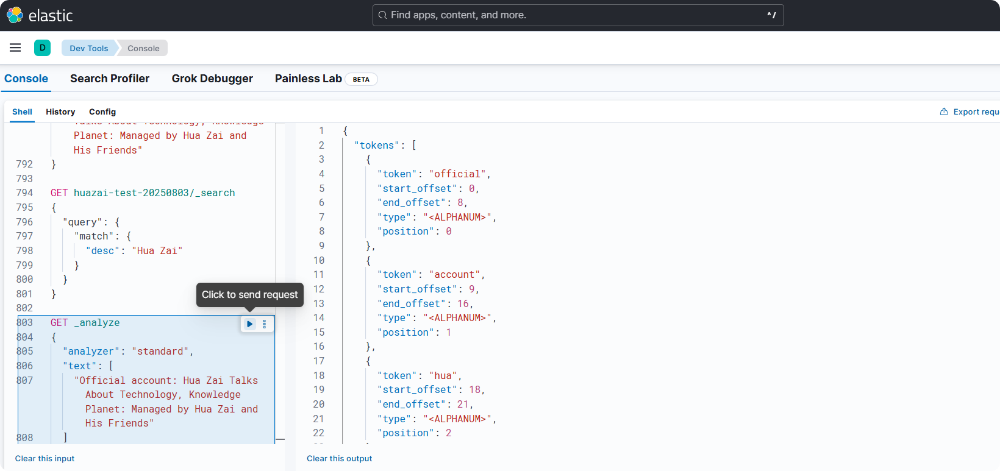

可以看出：它会把我们整句话的内容拆分成多个词项，其中单个的分词词项我们称为 term，每个词项会记录两个偏移量：「**开始偏移量**」、「**结束偏移量**」。

### **2、keyword 示例**

跟 text 多分词不同的是，keyword 是单分词的，创建 Mapping 索引，这里也是动态 Mapping：

DELETE huazai-test-20250803

PUT huazai-test-20250803

{

"settings": {

"number\_of\_shards": 4,

"number\_of\_replicas": 0

},

"mappings": {

"\_source": {

"enabled": true

},

"dynamic": true,

"properties": {

"name": {

"type": "keyword"

}

}

}

}

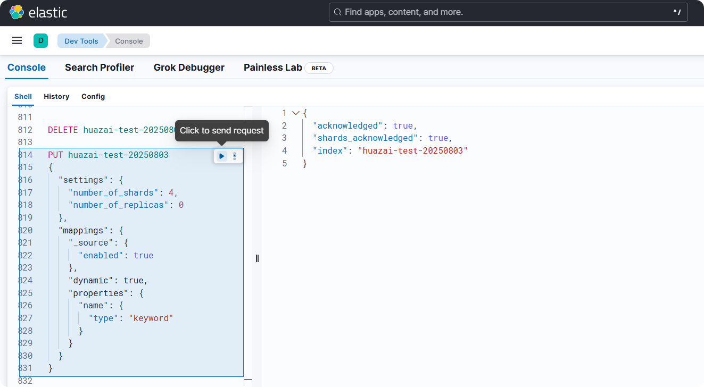

接着，插入一条数据：

POST huazai-test-20250803/\_doc/1

{

"name": "huazai",

"sex": "男",

"age": "40",

"desc":"公众号:华仔聊技术、知识星球:华仔和他的朋友们主理人"

}

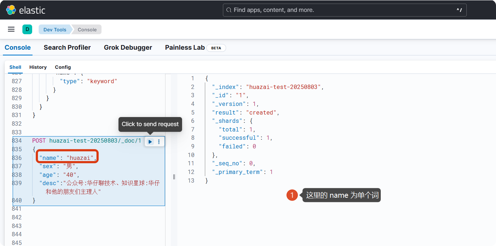

接着，我们来查询下，这里分两种 match、term 查询：

GET huazai-test-20250803/\_search

{

"query": {

"match": {

"name": "huazai"

}

}

}

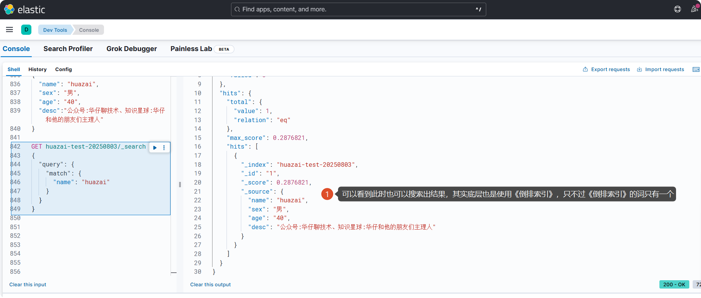

GET huazai-test-20250803/\_search

{

"query": {

"term": {

"name": "huazai"

}

}

}

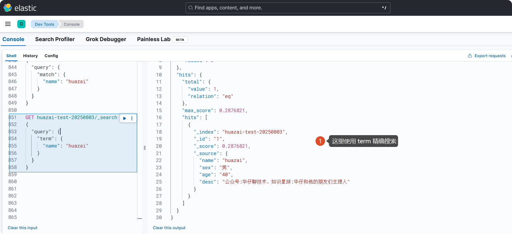

💡 ​**黄金实践：**

1.  全文搜索用 text + match 查询。
2.  精确匹配用 keyword 子字段 + term 查询。
3.  中文场景必用 ik 分词器。
4.  重要字段同时定义 text 和 keyword 类型。

### **2.2.1 数值类型**

ES 中，数值类型分为 byte、short、integer、long、float、double、half\_float、scaled\_float、unsigned\_long。

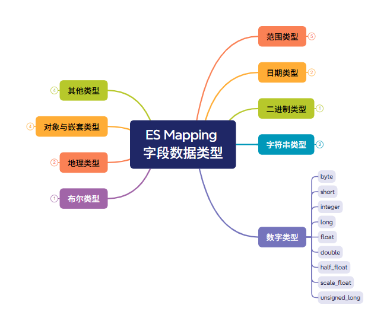

在满足需求的前提下，应当选择尽可能小的数据类型，除了可能会减少存储空间外，也会提高索引数据和检索数据的效率。

### **2.2.1.1 整数类型**

1.  Long 类型
2.  空间占用：64bit == 8字节
3.  范围区间：-2^63-2^63-1
4.  Unsigned Long 类型
5.  空间占用：64bit == 8字节
6.  范围区间：0~ 2^64-1
7.  Integer 类型
8.  空间占用：32bit == 4字节
9.  范围区间：-2^31-2^31-1
10.  short 类型
11.  空间占用：16bit == 2字节
12.  范围区间：-32768~32767
13.  Byte 类型
14.  空间占用：8bit == 1字节
15.  范围区间：-128~127

### **2.2.1.2 浮点数类型**

浮点数类型：

1.  double：双精度类型，长度很长，达到科学计数法。
2.  float：单精度类型。
3.  half\_float：是一种 16 位的半精度浮点数，限制为有限值。
4.  scaled\_float：缩放类型的浮点数，「**如果做聚合统计需求一定要用这个类型**」，背后基于 Long 类型实现，会出现精度问题。

注意：

1.  浮点类型精确统计会出现精确性问题。
2.  Java 底层实现问题。
3.  使用整数类型来避免精度问题。

### **2.2.3 日期类型**

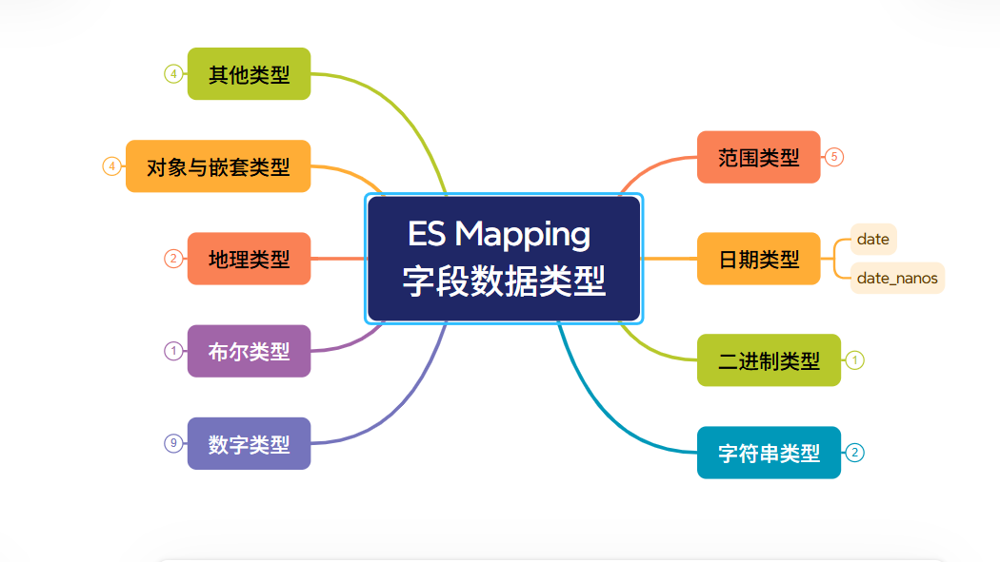

实际上，在底层 ES 都会把日期类型转换为 UTC（如果有指定时区的话），并且作为毫秒形式的时间戳用一个 long 来存储。

创建 Mapping 索引，这里是静态 Mapping：

\# 静态创建 mapping

\# 指定时间格式

PUT huazai-test-20250803

{

"settings": {

"number\_of\_shards": 4,

"number\_of\_replicas": 0

},

"mappings": {

"dynamic": false,

"properties": {

"create\_timestamp": {

"type": "date",

"format": "strict\_date\_optional\_time ||epoch\_millis"

},

"create\_time":{

"type": "date",

"format": \["yyyy-MM-dd HH:mm:ss"\]

}

}

}

}

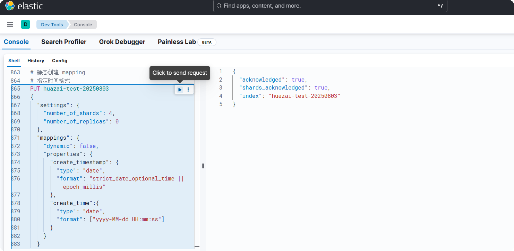

接着，插入一条数据：

\# 时间为标准的 utc 格式

POST huazai-test-20250803/\_doc/1

{

"name": "华仔",

"sex": "男",

"age": "40",

"desc":"公众号:华仔聊技术、知识星球:华仔和他的朋友们主理人",

"create\_time": "2025-08-19 19:20:22",

"create\_timestamp": "2025-08-19T11:20:22.645Z"

}

  
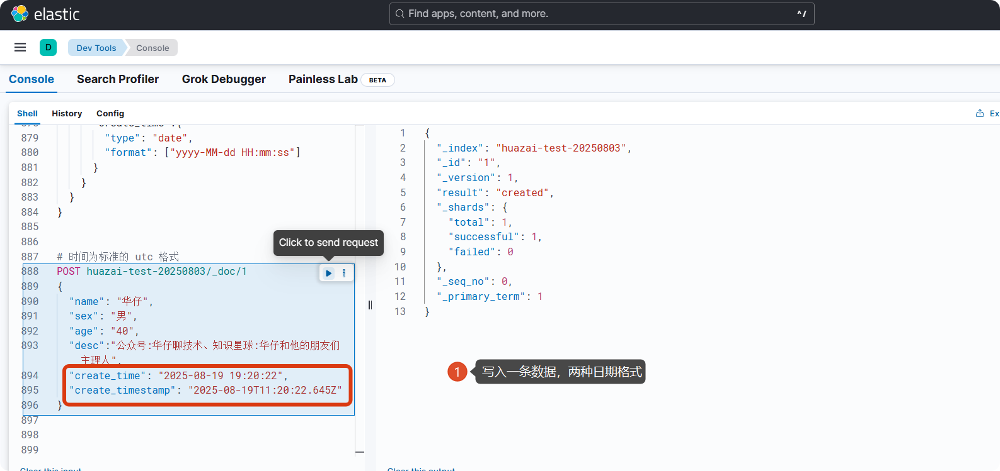

接着，按 UTC 时间排序：

\# 时间排序

GET huazai-test-20250803/\_search

{

"sort": \[

{

"create\_timestamp": {

"order": "desc"

}

}

\]

}

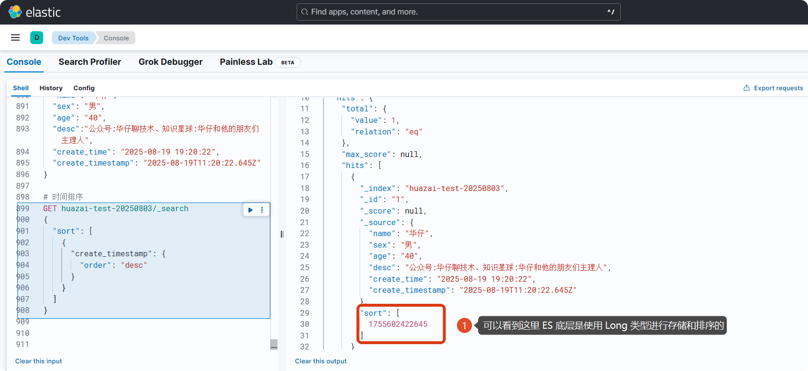

## **2.3 ES 索引 Mapping 高级字段类型实战**

接下来先介绍这 4 种高级字段类型：

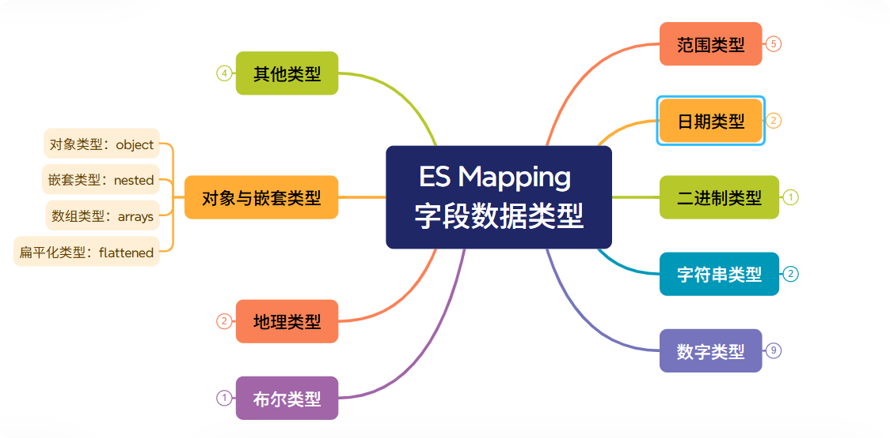

### **2.3.1 对象类型**

因为 ES 支持对象类型，所以我们在创建 Mapping 的时候有多种结构化的选择。

对于 Object 对象类型是采用 Json形式，支持多层次子对象。其内部存储非 Json 格式，通过分隔符建议层级关系。默认情况下，业务字段强烈不建议使用 "." 分隔符。

所谓对象类型就是 Json 对象嵌套，主要应用于「**复杂业务场景**」、「**复杂对象映射表达**」。创建 Mapping 索引，这里是静态 Mapping：

DELETE huazai-test-20250803

\# 静态创建 mapping

PUT huazai-test-20250803

{

"settings": {

"number\_of\_shards": 4,

"number\_of\_replicas": 0

},

"mappings": {

"dynamic": false,

"properties": {

"basic\_info": {

"type": "object",

"dynamic": true

},

"contact":{

"type": "object",

"dynamic": true

},

"social\_media":{

"type": "object",

"dynamic": true

},

"last\_updated": {

"type": "date",

"format": "strict\_date\_optional\_time ||epoch\_millis"

}

}

}

}

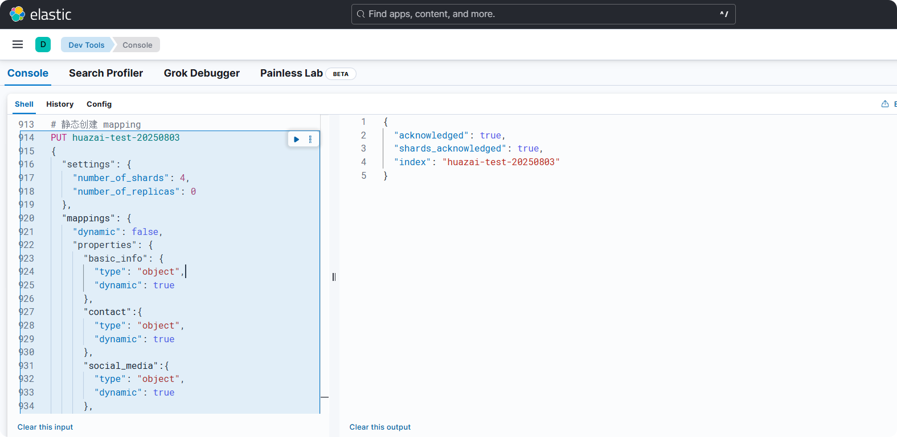

接着，插入一条数据：

POST huazai-test-20250803/\_doc/1

{

"basic\_info": {

"name": "华仔",

"sex": "男",

"age": 40,

"birth\_year": 1987

},

"contact": {

"wechat": "1030181803",

"email": "1030181803@qq.com"

},

"social\_media": \[

{

"platform": "公众号",

"account": "华仔聊技术",

"follower\_count": 20000,

"verified": true

},

{

"platform": "知识星球",

"account": "华仔和他的朋友们主理人",

"follower\_count": 600,

"premium": true

}

\],

"tags": \["技术博主", "消息中间件专家", "业务架构师"\],

"last\_updated": "2025-08-03T14:30:00Z"

}

  
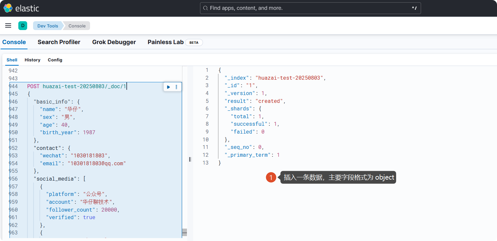

如上，这种就是典型的对象嵌套，其表达能力相对平铺类型要更强大些，不过层次越深复杂度越高，维护成本也越高。

  
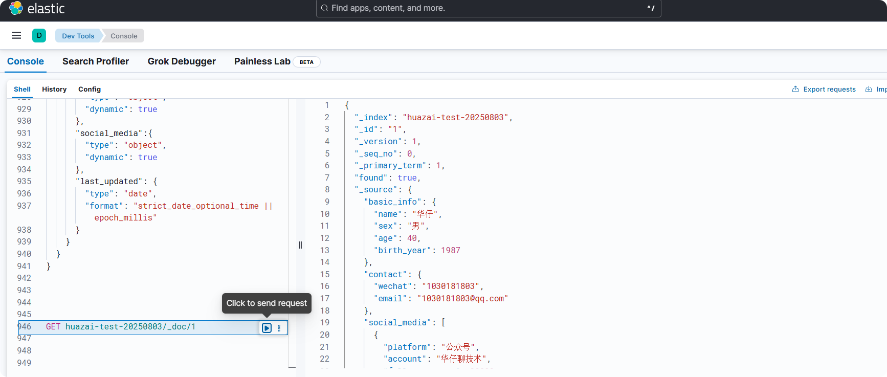

### **2.3.2 数组类型**

在 ES 中并没有显示定义数组类型，它仅仅是支持，类似 obiect 方式的无需设置，只需要在填充数据时按照数组的格式即可，其支持 一维数组、多维数组、对象数组等。

所谓数组类型就是 Json 数组对象，主要应用于「**常规数据记录**」及「**数据表1对多**」场景。创建 Mapping 索引，这里是动态 Mapping：

DELETE huazai-test-20250803

\# 动态创建 mapping

PUT huazai-test-20250803

{

"settings": {

"number\_of\_shards": 4,

"number\_of\_replicas": 0

},

"mappings": {

"dynamic": true,

"properties": {}

}

}

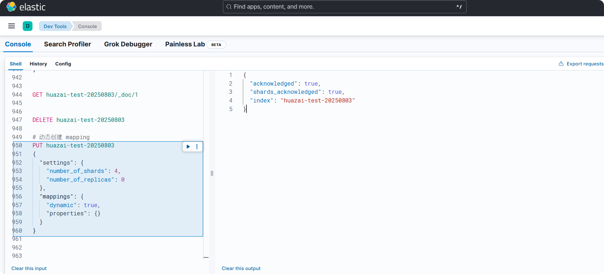

接着，写入一条数据：

POST huazai-test-20250803/\_doc/1

{

"route": \[

{

"basic\_info": {

"name": "华仔",

"sex": "男",

"age": 40,

"birth\_year": 1987

},

"contact": {

"wechat": "1030181803",

"email": "1030181803@qq.com"

},

"social\_media": \[

{

"platform": "公众号",

"account": "华仔聊技术",

"follower\_count": 20000,

"verified": true

},

{

"platform": "知识星球",

"account": "华仔和他的朋友们主理人",

"follower\_count": 600,

"premium": true

}

\],

"tags": \[

"技术博主",

"消息中间件专家",

"业务架构师"

\],

"last\_updated": "2025-08-03T14:30:00Z"

}

\]

}

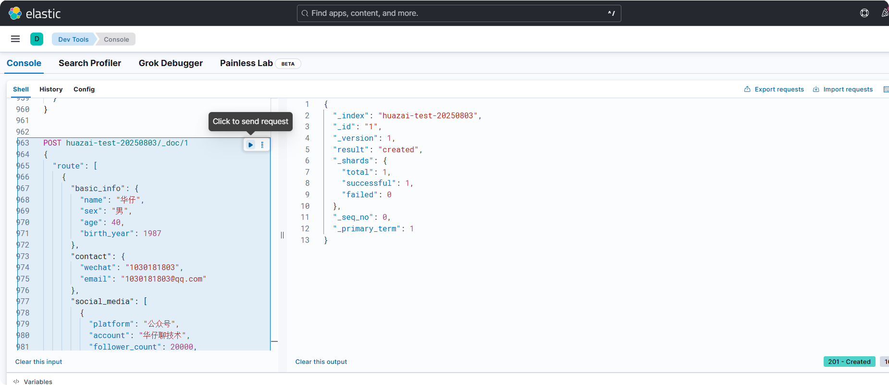

如上，这种就是典型的数组对象，其表达能力同对象嵌套差不多，层次越深复杂度越高，维护成本也越高。

  
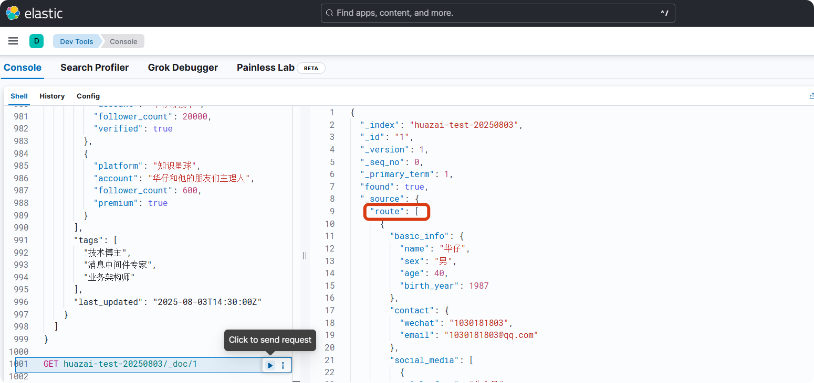

### **2.3.3 平铺类型**

对比 object 类型来说，它不解析子对象字段，仅作为数据存储，不创建对应的索引信息。避免单个对象字段数量过多，默认单索引字段数量限制 1000。

所谓平铺类型就是 Json 结构平铺，主要应用于「**数据表 1对1**」、「**常规查询搜索**」。创建 Mapping 索引，这里是动态 Mapping：

DELETE huazai-test-20250803

PUT huazai-test-20250803

{

"settings": {

"number\_of\_shards": 4,

"number\_of\_replicas": 0

},

"mappings": {

"dynamic": true

}

}

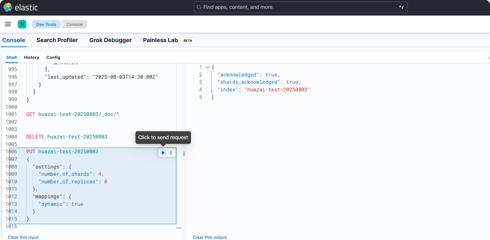

接着，插入一条数据：

POST huazai-test-20250803/\_doc/1

{

"name": "华仔聊技术",

"sex": "男",

"age": "40",

"desc":"公众号:华仔聊技术、知识星球:华仔和他的朋友们主理人"

}

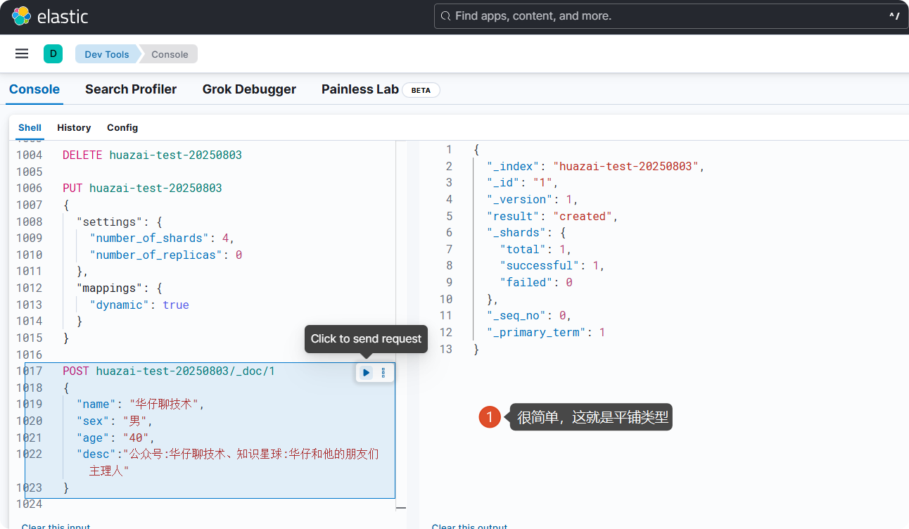

如上，这种就是典型的平铺，非常简洁、直观、高效。

### **2.3.4 嵌套类型**

在现实的应用场景中，关系型模型是普遍存在的，例如商品与商家的关系，用户和用户对商品评价的关系。在传统的关系型数据库领域，想要表达关系型模型是非常自然的，但在 ES 里要处理这个事情就并不那么简单了。

  
在 ES 中可以保存关系型模型数据的方式主要有以下两种：

1.  nested：在这种方式中，会将一对多的关系保存在同一个文档中。
2.  join（Parent / Child） ：通过维护文档的父子关系，将两个对象分离。

上述的这两种方式都可以描述一对多的关系，这里我们先来看下 nested 方式和优缺点和适用场景，父子关系比较鸡肋，不建议使用，这里就不展开了。

nested 类型是一种特别的 object 数据类型，其允许数组中的对象可以被「**单独索引**」，使它们可以被「**独立地检索**」。

下面我们先使用普通的 object 数组来保存商品与商家的一对多关系，我们看看会产生什么问题。创建 Mapping 索引，这里是静态 Mapping：

\# 创建 Mapping

PUT huazai\_ecshop\_sku\_seller\_index

{

"mappings": {

"properties": {

"skuId": {

"type": "integer"

},

"seller": {

"properties": {

"first\_name": {

"type": "keyword"

},

"last\_name": {

"type": "keyword"

}

}

}

}

}

}

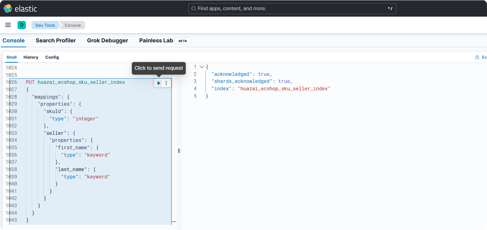

接着，写入一条数据：

\# 写入关系数据

PUT huazai\_ecshop\_sku\_seller\_index/\_doc/1

{

"skuId": 40021,

"seller": \[

{ "first\_name": "zhang", "last\_name": "san" },

{ "first\_name": "li", "last\_name": "si" }

\]

}

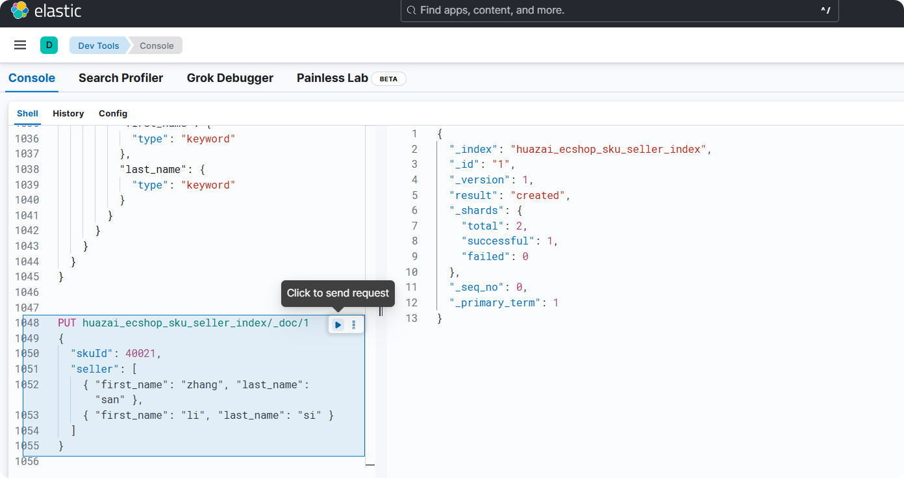

如上面的示例，我们创建了 huazai\_ecshop\_sku\_seller\_index 索引，其中 seller 字段是一个对象，包含了 first\_name 和 last\_name 两个属性。并且我们写入数据的时候，商品的商家有两个（描述了一对多的关系）：zhangsan 和 lisi。

下面我们来查询：

GET huazai\_ecshop\_sku\_seller\_index/\_search

{

"query": {

"bool": {

"must": \[

{ "term": { "seller.first\_name": "zhang" } },

{ "term": { "seller.last\_name": "si" } }

\]

}

}

}

  
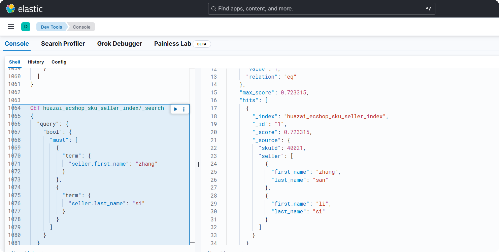

  
如上查询，你会发现数据中是没有 zhangsi 这个商家的，但是这个查询却可以命中文档 1，跟我们预期的不一样。

为什么呢？因为 object 被扁平化处理后，其丢失了 first\_name 和 last\_name 之间的关系，变成了下面这样的关系：

{

"skuId": 40021,

"seller.first\_name": \["zhang", "li"\],

"seller.last\_name": \["san", "si"\]

}

对于这个扁平化数组，原先 first\_name 和 last\_name 间的对应关系已经不复存在了。所以我们的查询语句在 seller.first\_name 中匹配了 "zhang"，在 seller.last\_name 匹配了 "si"，自然而然就命中了文档 1。

那有什么办法可以维护这个关系吗？答案是使用 nested 数据类型。

「**使用 nested 数据类型可以使对象数组种地对象被单独索引**」，这样 first\_name 和 last\_name 间的对应关系就不会丢失了。

我们来修改一下 Mapping，把 seller 的类型定义为 nested：

DELETE huazai\_ecshop\_sku\_seller\_index

\# 创建 mapping, seller 类型为 nested

PUT huazai\_ecshop\_sku\_seller\_index

{

"mappings": {

"properties": {

"skuId": {

"type": "integer"

},

"seller": {

"type": "nested",

"properties": {

"first\_name": {

"type": "keyword"

},

"last\_name": {

"type": "keyword"

}

}

}

}

}

}

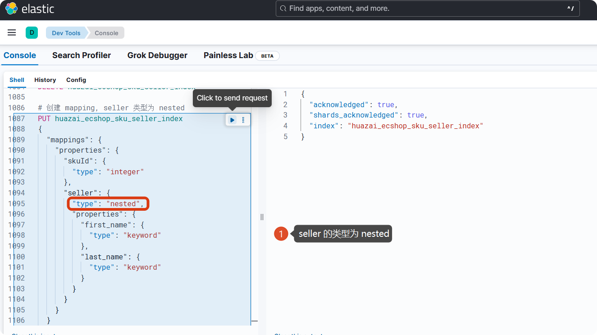

如上，我们在 seller 中指定了这个对象的类型为 nested，在内部 nested 类型将数组中的每个对象索引为单独的隐藏文档，这样数组中的每个对象就可以被「**独立地检索**」了。

接着，写入一条数据：

PUT huazai\_ecshop\_sku\_seller\_index/\_doc/1

{

"skuId": 40021,

"seller": \[

{

"first\_name": "zhang",

"last\_name": "san"

},

{

"first\_name": "li",

"last\_name": "si"

}

\]

}

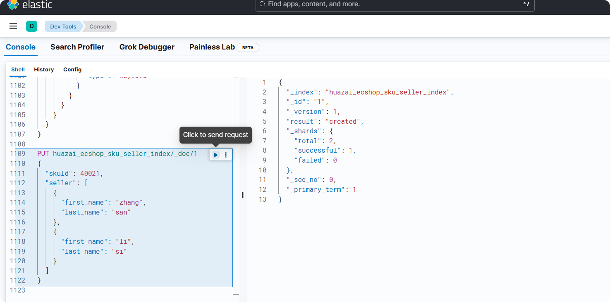

nested 数据类型的检索如下：

\# nested 数据类型的查询

GET huazai\_ecshop\_sku\_seller\_index/\_search

{

"query": {

"nested": {

"path": "seller",

"query": {

"bool": {

"must": \[

{

"term": {

"seller.first\_name": "li"

}

},

{

"term": {

"seller.last\_name": "si"

}

}

\]

}

}

}

}

}

  
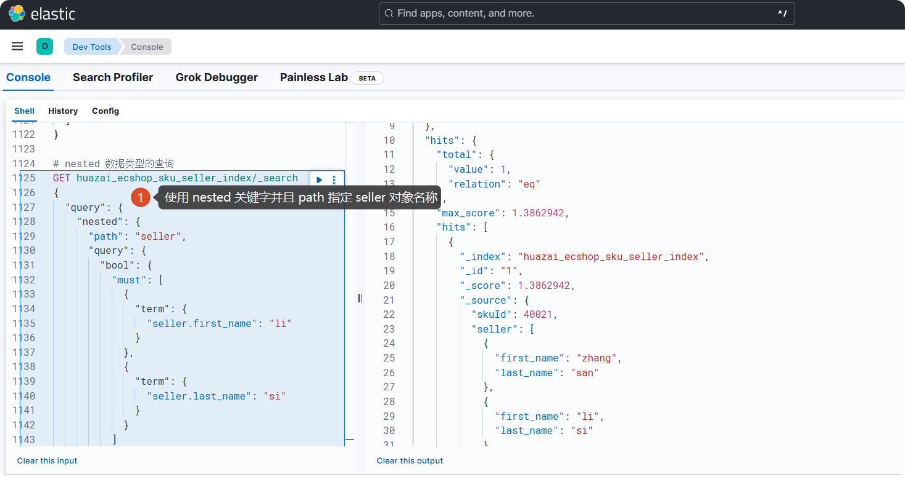

使用 nested 关键字指定一个 nested 对象的查询，使用 path 指定 nested 对象的名字。从上面的示例来看，nested 通过冗余的方式将对象和文档存储在一起，所以查询时的性能是很高的，但在需要更新对象信息的时候需要更新所有包含此对象的文档，例如某个商家的信息更改了，那么所有这个商家的商品文档都要更新。

因此，nested 适合「**查询频繁但是更新频率低**」的场景**。**

### **2.3.5 范围类型**

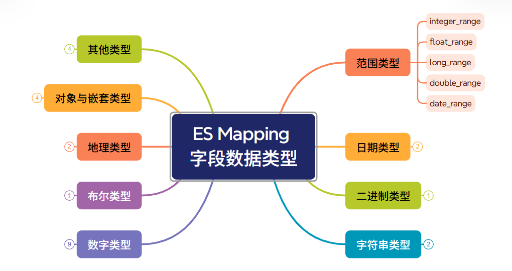

整型范围、浮点范围、日期范围、IP 范围，实现算法基于 BKD-Tree 实现。其应用场景：

1.  衣服尺寸范围：XL(175~185)，体重(80KG~100kg)、肩宽(50~100cm)、腰围(80~120)等。
2.  年龄范围：18-25，25-35，35-50，50-65，65-90等。
3.  商品j价格范围：100以内，100-500，500-1000，1000-10000等。
4.  还有很多电商场景的信息。

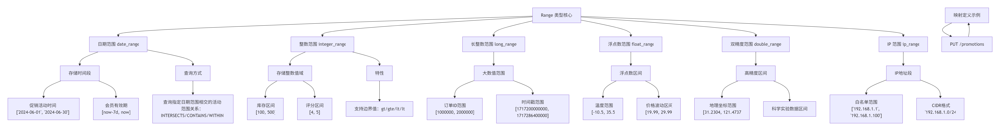

这里直接拿我们「**小红书商品索引**」的数据进行查询，目前有三条数据如下：

  
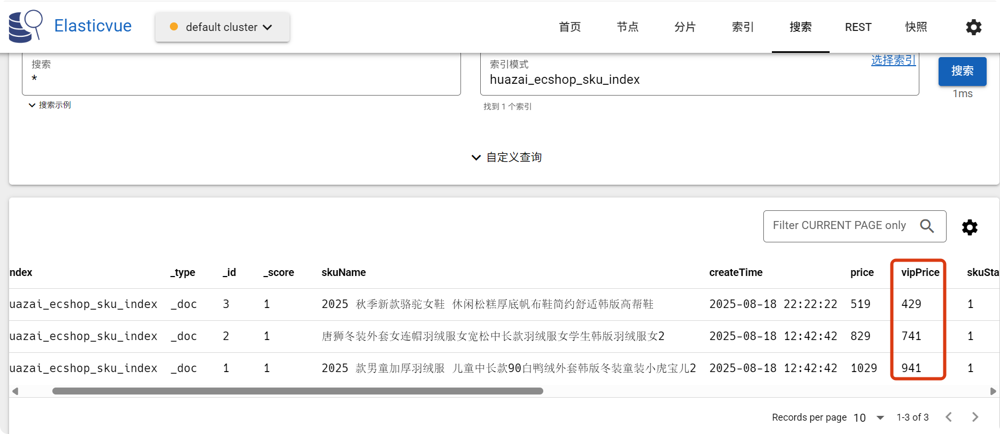

我们查询 vipPrice 在 300 - 500 之间的商品有哪些，从图上看只有 \_id = 3 的商品数据：

GET /huazai\_ecshop\_sku\_index/\_search

{

"query": {

"bool": {

"must": \[

{

"range": {

"vipPrice": {

"gte": 300,

"lt": 500

}

}

}

\]

}

}

}

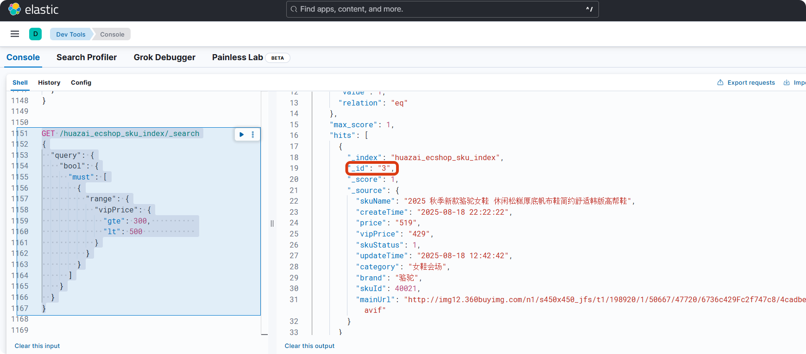

### **2.3.6 地理类型**

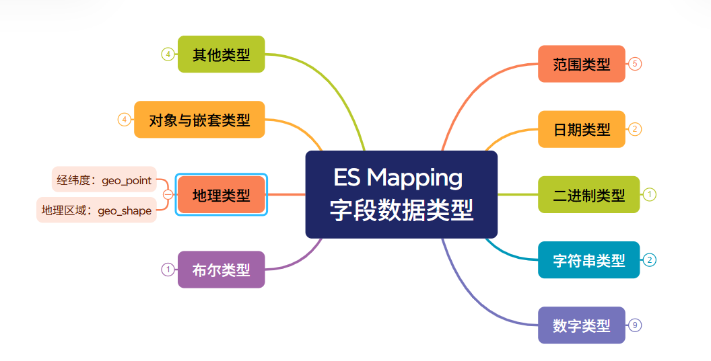

这两个主要适用于 LBS、物流、运动轨迹分析等场景。

### **2.3.6.1 geo\_point（经纬度）**

1.  ​数据格式​：支持多种格式输入，常见有：
2.  数组：\[经度, 纬度\]。
3.  字符串："纬度,经度"。
4.  对象：{"lon": 139.76, "lat": 35.68}。
5.  GeoHash："xn76urwe1"（自动生成）。
6.  ​主要用途​：
7.  ​距离计算​：查找指定点半径范围内的文档（如：5公里内的店铺）。
8.  ​距离排序​：按离中心点的距离排序（如：由近到远）。
9.  ​查询方式​：
10.  geo\_bounding\_box：矩形范围查询（指定左上角/右下角）。
11.  geo\_distance：圆形范围（中心点+半径）。
12.  geo\_polygon：多边形范围（顶点数组）。

### **2.3.6.2 geo\_shape（地理区域）**

1.  ​数据格式​：支持GeoJSON和WKT标准
2.  ​多边形​：必须封闭，首尾坐标相同。
3.  ​多点/线段/圆形​：需用对应的类型定义。
4.  ​空间关系​：
5.  INTERSECTS (默认)：查询形状与文档形状相交（部分重叠）。
6.  CONTAINS：文档形状完全包含查询形状。
7.  DISJOINT：文档形状与查询形状无重叠。
8.  WITHIN：文档形状在查询形状内部。
9.  ​查询方式​：
10.  使用geo\_shape查询时需明确空间关系（relation）。

### **2.3.6.3 示例**

这里给出一个完整的 ES ​地理类型示例，包含映射定义、数据写入和 geo\_point、geo\_shape 典型查询。

创建 Mapping 索引，这里是静态 Mapping：

PUT /geo\_index

{

"settings": {

"number\_of\_shards": 1,

"number\_of\_replicas": 0

},

"mappings": {

"properties": {

"shop\_name": {

"type": "keyword"

},

"location": {

"type": "geo\_point" // 店铺位置（点坐标）

},

"delivery\_area": {

"type": "geo\_shape" // 配送区域（多边形）

},

"address": {

"type": "text"

}

}

}

}

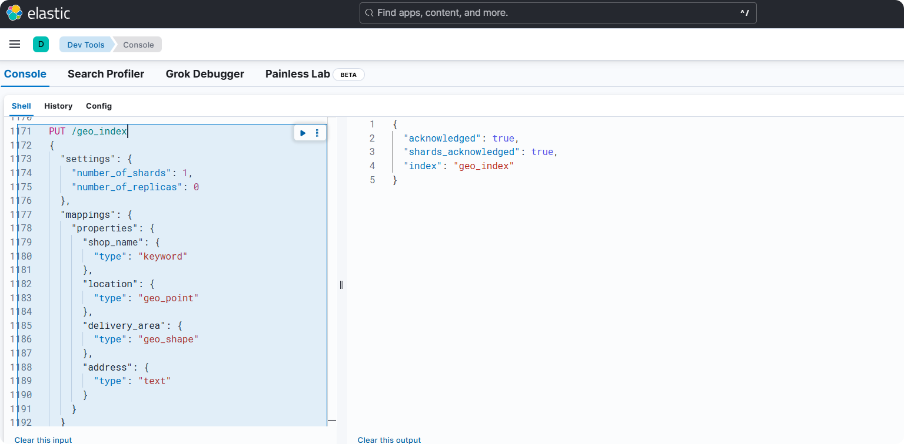

接着，写入 3 条数据：

POST /geo\_index/\_doc/1

{

"shop\_name": "市中心旗舰店",

"location": "31.2304,121.4737",

"delivery\_area": {

"type": "polygon",

"coordinates": \[

\[

\[121.46, 31.22\], \[121.48, 31.22\],

\[121.48, 31.24\], \[121.46, 31.24\],

\[121.46, 31.22\]

\]

\]

},

"address": "上海市黄浦区南京东路100号"

}

POST /geo\_index/\_doc/2

{

"shop\_name": "浦东分店",

"location": {

"lat": 31.2200,

"lon": 121.5300

},

"delivery\_area": {

"type": "polygon",

"coordinates": \[

\[

\[121.52, 31.21\], \[121.54, 31.21\],

\[121.54, 31.23\], \[121.52, 31.23\],

\[121.52, 31.21\]

\]

\]

},

"address": "上海市浦东新区陆家嘴环路200号"

}

POST /geo\_index/\_doc/3

{

"shop\_name": "虹桥分店",

"location": \[121.3900, 31.2000\],

"delivery\_area": {

"type": "polygon",

"coordinates": \[

\[

\[121.38, 31.19\], \[121.40, 31.19\],

\[121.40, 31.21\], \[121.38, 31.21\],

\[121.38, 31.19\]

\]

\]

},

"address": "上海市长宁区虹桥路300号"

}

  
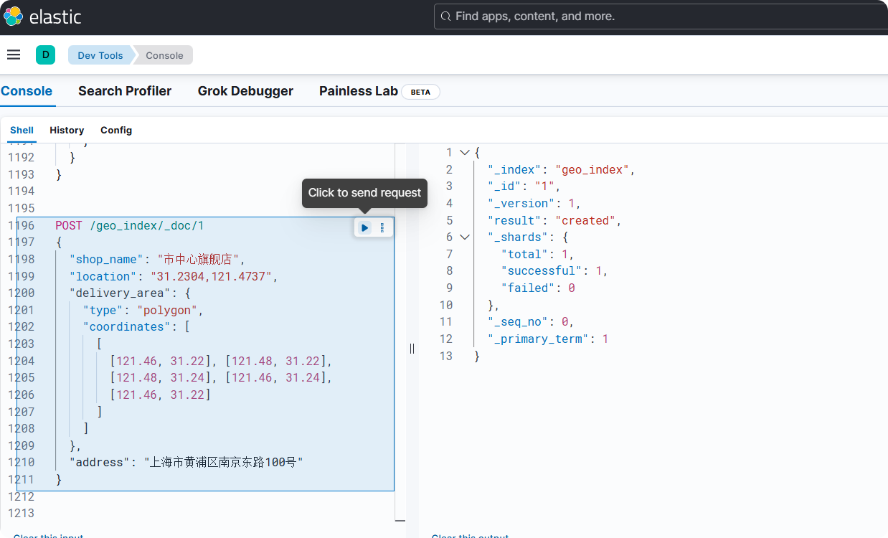

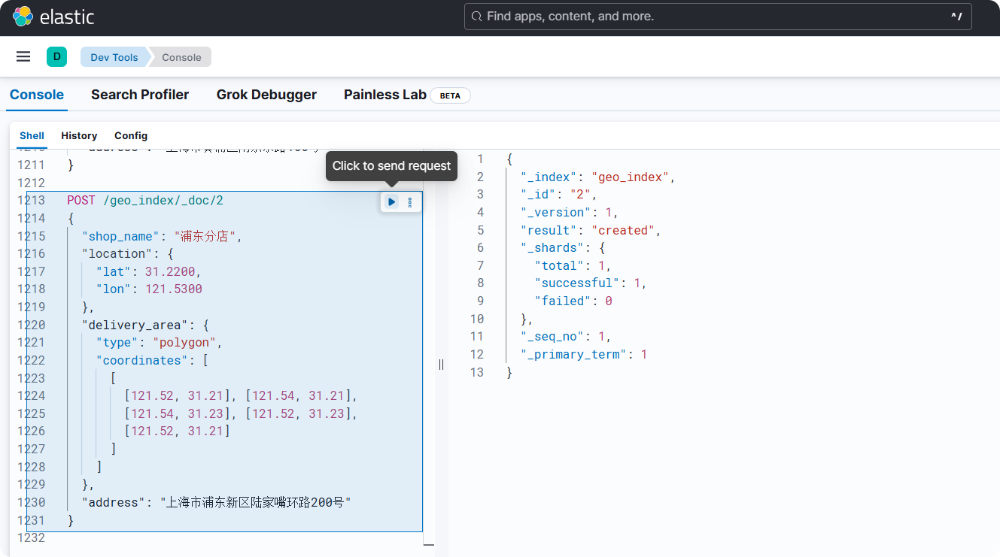

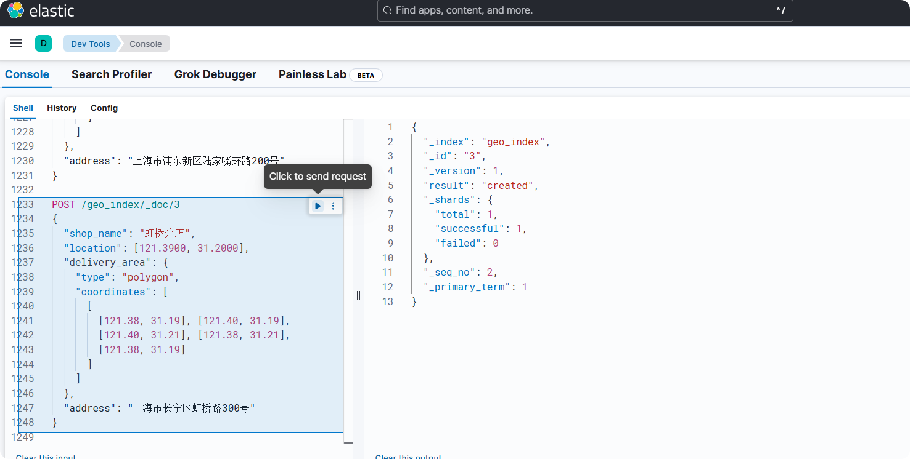

接着，先查找最近的3家店铺（用户位置：31.2300,121.4700）：

GET /geo\_index/\_search

{

"query": {

"match\_all": {}

},

"sort": \[

{

"\_geo\_distance": {

"location": {

"lat": 31.2300, // 用户位置（上海人民广场）

"lon": 121.4700

},

"order": "asc",

"unit": "km",

"distance\_type": "arc" // 球面距离计算

}

}

\],

"size": 3

}

\# 结果 {

"took": 62,

"timed\_out": false,

"\_shards": {

"total": 1,

"successful": 1,

"skipped": 0,

"failed": 0

},

"hits": {

"total": {

"value": 3,

"relation": "eq"

},

"max\_score": null,

"hits": \[

{

"\_index": "geo\_index",

"\_id": "1",

"\_score": null,

"\_source": {

"shop\_name": "市中心旗舰店",

"location": "31.2304,121.4737",

"delivery\_area": {

"type": "polygon",

"coordinates": \[

\[

\[

121.46,

31.22

\],

\[

121.48,

31.22

\],

\[

121.48,

31.24

\],

\[

121.46,

31.24

\],

\[

121.46,

31.22

\]

\]

\]

},

"address": "上海市黄浦区南京东路100号"

},

"sort": \[

0.3546020845293285

\]

},

{

"\_index": "geo\_index",

"\_id": "2",

"\_score": null,

"\_source": {

"shop\_name": "浦东分店",

"location": {

"lat": 31.22,

"lon": 121.53

},

"delivery\_area": {

"type": "polygon",

"coordinates": \[

\[

\[

121.52,

31.21

\],

\[

121.54,

31.21

\],

\[

121.54,

31.23

\],

\[

121.52,

31.23

\],

\[

121.52,

31.21

\]

\]

\]

},

"address": "上海市浦东新区陆家嘴环路200号"

},

"sort": \[

5.812576825517437

\]

},

{

"\_index": "geo\_index",

"\_id": "3",

"\_score": null,

"\_source": {

"shop\_name": "虹桥分店",

"location": \[

121.39,

31.2

\],

"delivery\_area": {

"type": "polygon",

"coordinates": \[

\[

\[

121.38,

31.19

\],

\[

121.4,

31.19

\],

\[

121.4,

31.21

\],

\[

121.38,

31.21

\],

\[

121.38,

31.19

\]

\]

\]

},

"address": "上海市长宁区虹桥路300号"

},

"sort": \[

8.306999617586817

\]

}

\]

}

}

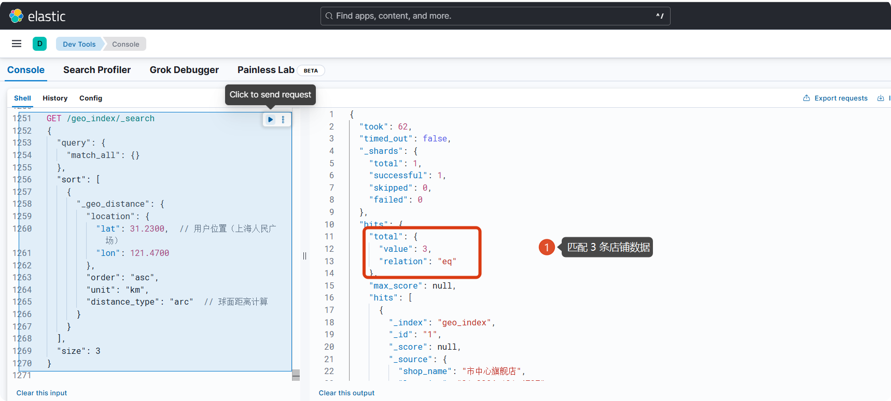

最后，检查点是否在配送区：

GET /geo\_index/\_search

{

"query": {

"bool": {

"must": \[

{

"geo\_shape": {

"delivery\_area": {

"shape": {

"type": "point",

"coordinates": \[121.4700, 31.2300\] // 要检查的点坐标

},

"relation": "contains" // 检查点是否在配送区内

}

}

}

\]

}

},

"\_source": \["shop\_name", "address"\]

}

\# 结果

{

"took": 13,

"timed\_out": false,

"\_shards": {

"total": 1,

"successful": 1,

"skipped": 0,

"failed": 0

},

"hits": {

"total": {

"value": 1,

"relation": "eq"

},

"max\_score": 0,

"hits": \[

{

"\_index": "geo\_index",

"\_id": "1",

"\_score": 0,

"\_source": {

"shop\_name": "市中心旗舰店",

"address": "上海市黄浦区南京东路100号"

}

}

\]

}

}

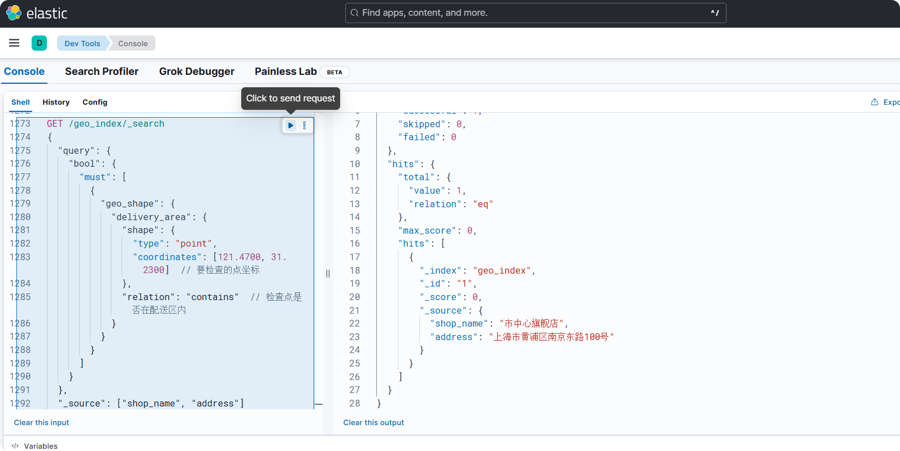

扩展查询，查找配送区包含某点的所有店铺：

GET /geo\_index/\_search

{

"query": {

"geo\_shape": {

"delivery\_area": {

"shape": {

"type": "point",

"coordinates": \[121.5300, 31.2200\] // 浦东某点

},

"relation": "contains"

}

}

}

}

\# 结果

{

"took": 0,

"timed\_out": false,

"\_shards": {

"total": 1,

"successful": 1,

"skipped": 0,

"failed": 0

},

"hits": {

"total": {

"value": 1,

"relation": "eq"

},

"max\_score": 0,

"hits": \[

{

"\_index": "geo\_index",

"\_id": "2",

"\_score": 0,

"\_source": {

"shop\_name": "浦东分店",

"location": {

"lat": 31.22,

"lon": 121.53

},

"delivery\_area": {

"type": "polygon",

"coordinates": \[

\[

\[

121.52,

31.21

\],

\[

121.54,

31.21

\],

\[

121.54,

31.23

\],

\[

121.52,

31.23

\],

\[

121.52,

31.21

\]

\]

\]

},

"address": "上海市浦东新区陆家嘴环路200号"

}

}

\]

}

}

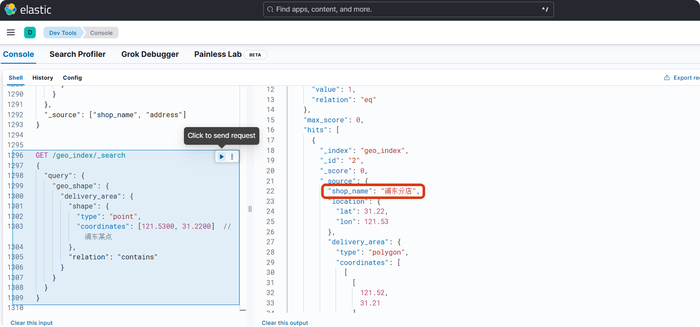

总结：

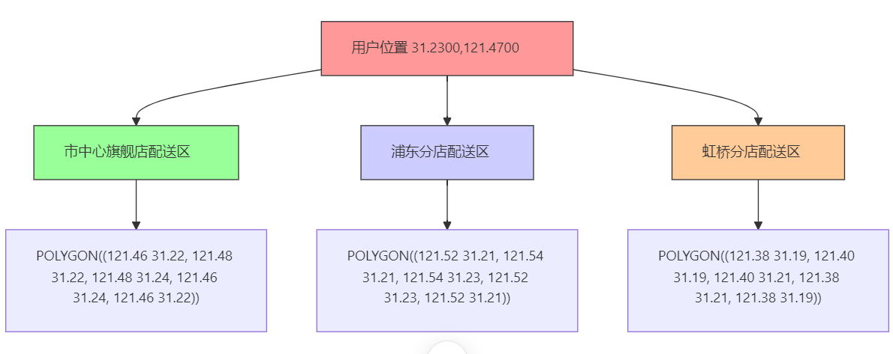

关键说明：​​

1.  geo\_point 支持三种格式：字符串、对象、数组。
2.  geo\_shape 使用 GeoJSON 格式定义多边形。
3.  距离排序使用 \_geo\_distance 特殊排序方式。
4.  关系查询支持：contains/within/intersects 等。
5.  最近店铺查询：按距离排序的店铺列表。
6.  配送区检查：返回包含指定点的店铺文档。

##   
**2.3 ES 索引 Mapping 字段限制**

关于 ES 索引 Mapping 字段限制如下：

1.  索引字段数量限制
2.  映射爆炸限制
3.  索引字段长度与深度限制
4.  数据类型相关限制
5.  动态映射的潜在风险
6.  硬性资源限制

### **2.3.1 索引字段数量限制**

这是最直接、最常见的限制。Elasticsearch 并非不能处理大量字段，但字段过多会带来显著的开销。

1.  问题根源：
2.  内存开销：Lucene（ES 的底层引擎）的核心数据结构是“倒排索引”。每个字段都有自己的倒排索引、字典（Term Dictionary）和文档值（Doc Values）。这些结构都需要加载到内存（文件系统缓存）中以实现高效搜索和聚合。字段越多，内存消耗越大。
3.  性能下降：大量的字段会导致映射（Mapping）元数据变得非常庞大。在创建新文档、执行搜索或聚合时，处理这些元数据会增加 CPU 和内存的开销。
4.  熔断器风险：容易触发下一节要提到的“映射爆炸”熔断器。
5.  实际限制：
6.  没有绝对的硬性数字：官方从未规定一个确切的数字（如 1000 个字段）。性能拐点取决于你的硬件资源（特别是内存）、文档大小和查询复杂度。
7.  经验值：通常，建议将字段数量控制在 几百到一千 以内。一旦超过几千个，就需要非常小心地评估和优化。
8.  默认熔断器：ES 默认设置了一个索引最大字段数为 1000。这是一个软限制，旨在防止意外创建过多字段。

### **2.3.2 映射爆炸限制**

这是字段数量限制的延伸和强化，旨在防止一个恶意或错误的请求摧毁整个集群。

1.  问题场景：想象一个场景，你的索引启用了动态映射（"dynamic": true）。如果有一个包含大量随机键值对（例如，HTTP 请求头、随机生成的用户数据）的文档被写入，它会瞬间创建成百上千个新字段，耗尽节点内存，导致节点崩溃。
2.  相关设置：
3.  index.mapping.total\_fields.limit：单个索引中的最大字段数，默认 1000。
4.  index.mapping.depth.limit：字段的最大深度（防止过于复杂的嵌套 JSON），默认 20。
5.  index.mapping.nested\_fields.limit：嵌套类型（nested）字段的最大数量，默认 50。因为每个嵌套对象都被索引为一个独立的隐藏文档，开销很大。
6.  index.mapping.nested\_objects.limit：单个文档中所有嵌套类型字段所能包含的最大嵌套对象总数，默认 10000。
7.  index.mapping.field\_name\_length.limit：字段名称的最大长度限制，默认 Long.MAX\_VALUE（实际上非常长，但设置太长的名称不推荐）。
8.  index.mapping.dimension\_fields.limit：它是 Elasticsearch 7.13+ 版本引入的关键特性限制，专为 ​时间序列数据（如指标和日志）​​ 设计的。

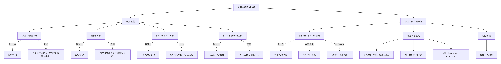

### **2.3.3 索引字段长度与深度限制**

1.  字段名长度：虽然限制很高，但过长的字段名（如 very\_long\_and\_descriptive\_field\_name\_that\_is\_self\_explanatory）会显著增加映射和传输数据的开销。建议使用简短、清晰的字段名。
2.  字段深度：指的是 JSON 结构的嵌套层级。

{

"level1": {

"level2": {

"level3": { // 深度为 3

"value": "data"

}

}

}

}

1.  过深的嵌套会让查询和聚合变得复杂且低效。默认深度限制为 20，通常足够了。

### **2.3.4 数据类型相关限制**

某些特定的数据类型有其自身的限制。

1.  keyword 类型：
2.  长度限制：ignore\_above 参数。默认情况下，超过 256 个 UTF-8 编码字节的字符串不会被索引（即无法被搜索或聚合），但原始数据仍然会存储在 \_source 中。

"my\_field": {

"type": "keyword",

"ignore\_above": 512 // 可以自定义调整

}

1.  影响：这可以防止极其长的字符串（如文件内容、大段 Base64）被加入倒排索引，从而节省大量内存。
2.  text 类型：
3.  分析器限制：text 字段会被分词，分词后的词项（terms）数量受限于分析器（Analyzer）和原始文本长度。一个非常长的句子可能会产生成千上万个词项，增加索引大小。
4.  Term 长度限制：Lucene 内部对单个 Term 的长度也有限制（约 32KB）。

### **2.3.5 动态映射潜在风险**

这本身不是一个“限制”，但如果不加管理，它是导致触发上述所有限制的最主要原因。

1.  风险：默认的动态映射行为会自动为每个新出现的字段创建映射并推断其类型。这非常方便，但也非常危险，容易导致“映射污染”（Mapping Pollution）或“映射爆炸”（Mapping Explosion）。
2.  解决方案：
3.  显式映射：在创建索引时，为核心业务字段预定义好映射。这是最佳实践。
4.  严格控制动态映射：
5.  设置为 "dynamic": "false"：忽略未映射的新字段（不索引，但存储在 \_source 中）。
6.  设置为 "dynamic": "strict"：遇到未映射的新字段时，直接抛出异常，拒绝写入文档。这是最严格、最安全的方式。
7.  使用 flattened 数据类型：如果你确实需要存储大量不可预知的键值对（例如标签、HTTP 头、自定义属性），flattened 类型是完美的解决方案。它将整个子对象的所有值索引为一个“超级”字段，极大地节省内存并避免映射爆炸。

### **2.3.6 硬性资源限制**

最终，所有限制都归结为硬件的限制。

1.  堆内存：ES 节点的堆内存主要用于管理映射元数据、查询计算等。映射越大，可用堆内存就越少。
2.  文件系统缓存：Lucene 依赖文件系统缓存来高效访问索引数据。字段越多，索引文件越大，对文件系统缓存的需求就越高。如果缓存不足，搜索性能会急剧下降（产生磁盘 I/O）。

### **2.3.7 总结**

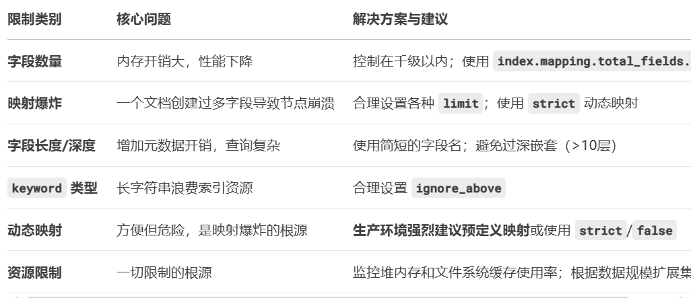

1.  规划你的映射：像设计数据库表结构一样设计你的 ES 映射。这是最重要的第一步。
2.  禁用或严格管控动态映射：生产环境设置为 "dynamic": "strict"。
3.  善用 flattened 类型：处理未知的、稀疏的数据。
4.  监控字段数量：通过 GET /my\_index/\_mapping 定期查看，确保字段数在健康范围内。
5.  合理使用多字段：但注意，一个字段定义多个数据类型（如 text 和 keyword）也会增加字段计数。