从今天之后的一段时间内，华仔会带着大家一起来从零开始对 ElasticStack 矩阵产品进行深入剖析和项目运维实战，希望大家学完之后可以用到自己的工作中。

这是第八篇，本篇我将带着大家进行「**ES 集群管理 API 深度实战**」。

文章汇总位置：[https://wx.zsxq.com/dweb2/index/columns/51122554151214](https://wx.zsxq.com/dweb2/index/columns/51122554151214)

## **01 前言**

在上篇中 [【ES 入门实战第七篇】ES 索引模板深度实战](https://articles.zsxq.com/id_xdvolrecc3hd.html)，带着大家进行实战「**ES 索引模板深度实战**」。

今天我们来进行「**ES 集群管理 API 深度实战**」。

##   
**02 ES 集群管理 API 深度实战**

我们目前还未真正安装 ES 集群，只是在云主机上安装了单机版的 ES，不过不影响我们查看集群管理信息，接下来我们就来实操下 ES 提供的集群监控、管理相关的 API。

##   
**2.1 \_cat 集群架构底层架构思想**

它提供一个轻量、高效、人类可读（而非程序优先）的 cli 接口，用于对集群的现有状态进行实时快照式查询和格式化展示。​

它不是一个用于执行变更（如修改设置、分配分片）的 API，而是一个纯粹的只读监控和观察​ API。为了更直观地理解其与核心集群状态系统的关系，如下架构流程图：

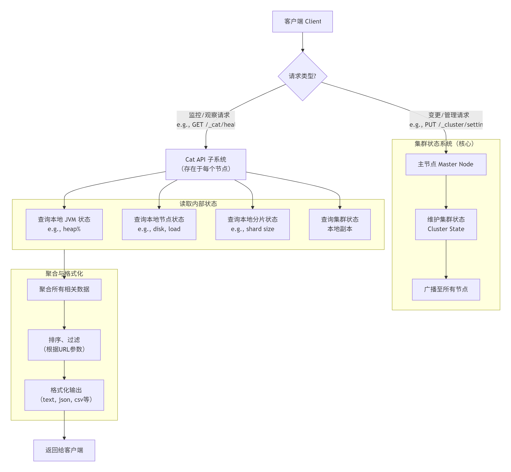

### **2.1.1 去中心化数据收集**

与需要主节点协调的 [\_cluster/state](http://_cluster/state) 不同，​每个节点都可以响应 /\_cat/ 请求。当您向某个协调节点发送 [GET /\_cat/nodes](http://get%20/_cat/nodes) 时：

1.  该节点会向集群中的所有其他节点发送内部轻量级请求（使用高效的传输协议），收集它们的信息。
2.  然后该协调节点充当“聚合器”，将收集来的所有数据汇总、排序、格式化，最后呈现给用户。
3.  这种设计避免了主节点的瓶颈，并提供了冗余（即使主节点宕机，你仍然可能从其他节点获取到一些 /\_cat/ 信息）。

### **2.1.2 封装与格式化**

这是 /\_cat/ API 最核心的价值，它隐藏了底层复杂的数据结构，只提取运维人员最关心的字段。

1.  GET /\_nodes/stats 返回一个庞大、嵌套极深的 JSON，包含海量信息。
2.  GET /\_cat/nodes?v&h=name,ip,heap.percent,load\_5m 返回一个清晰的结果。

name ip heap.percent load\_5m

node-1 10.0.0.1 35 0.05

node-2 10.0.0.2 40 0.03

### **2.1.3 高效的数据获取**

/\_cat/ API 通常非常快，原因如下：

1.  ​查询本地状态​：对于像 [/\_cat/health](http://_cat/health) 或 [/\_cat/indices](http://_cat/indices) 这样的请求，节点可以直接从其本地持有的集群状态副本中读取大部分信息，无需与其他节点进行大量网络通信。
2.  ​精简的数据传输​：即使在需要从其他节点收集数据时，传输的也是精简后的核心数据，而非完整的 JSON 结构。

### **2.1.4 强大的后处理功能**

/\_cat/ API 内置了一个“客户端”，允许你在服务端直接对结果进行加工：

1.  ​排序 (s)​: [GET /\_cat/indices?v&s=store.size:desc](http://get%20/_cat/indices?v&s=store.size:desc) （按索引大小降序排列）
2.  ​表头控制 (v, h)​: v (显示表头), h (指定要显示的列) [GET /\_cat/nodes?h=name,disk.used,disk.total,disk.avail](http://get%20/_cat/nodes?h=name,disk.used,disk.total,disk.avail)
3.  ​字节单位格式化 (bytes)​: 自动将字节数转换为人类可读格式 (e.g., 10.5kb, 2mb)。
4.  ​输出格式 (format)​: 支持文本（默认）、JSON、CSV、YAML 等，使其既能方便人读，也能方便脚本处理。

### **2.1.5 模块化设计**

/\_cat/ 不是一个单一的端点，而是一个模块化的 API 集合。每个 cat 子命令（indices, nodes, shards, allocation 等）都是一个独立的模块，负责查询和格式化某一特定方面的信息。

这种设计使得添加新的 cat 功能变得非常清晰和容易。

###   
**2.1.6 总结**

你可以将 /\_cat/ API 理解为 Elasticsearch 的 ​top、iostat、netstat 等 Unix/Linux 系统监控命令的集合。

1.  ​核心集群 API (\_cluster, \_nodes)​​：像是系统的内核调用和配置文件，功能强大但原始，需要专业知识来操作。
2.  ​/\_cat/ API​：像是封装好的系统监控命令\*\*，开箱即用，输出直观，专门为人类系统管理员的日常运维和故障排查而设计。

## **2.2 \_cat 查看集群信息**

ES 的 \_cat 相关 API 提供了查看集群相关信息，同时它会返回适合人类阅读的格式而不是 Json 格式。

当使用 \_cat 时其后面不跟任何子节点，其返回结果将会是各个 API 的 URL，当忘记包含哪些接口时，这个功能非常好用。

如下：

\# 使用 \_cat 获取所有可用的目录

GET /\_cat/

\# 结果

\=^.^=

/\_cat/allocation

/\_cat/shards

/\_cat/shards/{index}

/\_cat/master

/\_cat/nodes

/\_cat/tasks

/\_cat/indices

/\_cat/indices/{index}

/\_cat/segments

/\_cat/segments/{index}

/\_cat/count

/\_cat/count/{index}

/\_cat/recovery

/\_cat/recovery/{index}

/\_cat/health

/\_cat/pending\_tasks

/\_cat/aliases

/\_cat/aliases/{alias}

/\_cat/thread\_pool

/\_cat/thread\_pool/{thread\_pools}

/\_cat/plugins

/\_cat/fielddata

/\_cat/fielddata/{fields}

/\_cat/nodeattrs

/\_cat/repositories

/\_cat/snapshots/{repository}

/\_cat/templates

/\_cat/component\_templates/\_cat/ml/anomaly\_detectors

/\_cat/ml/anomaly\_detectors/{job\_id}

/\_cat/ml/datafeeds

/\_cat/ml/datafeeds/{datafeed\_id}

/\_cat/ml/trained\_models

/\_cat/ml/trained\_models/{model\_id}

/\_cat/ml/data\_frame/analytics

/\_cat/ml/data\_frame/analytics/{id}

/\_cat/transforms

/\_cat/transforms/{transform\_id}

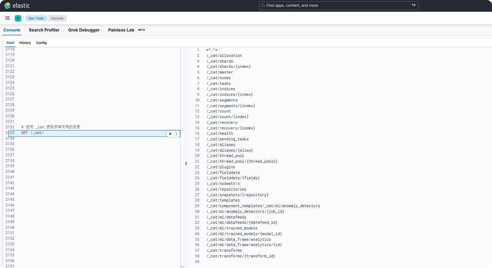

可以看到，\_cat 返回了很多 API 接口路径，这些 API 都可以加入下面几个参数：

1.  v：每个命令都可以使用 v 参数来打印详细信息。比如：[GET /\_cat/nodes?v](http://get%20/_cat/nodes?v)。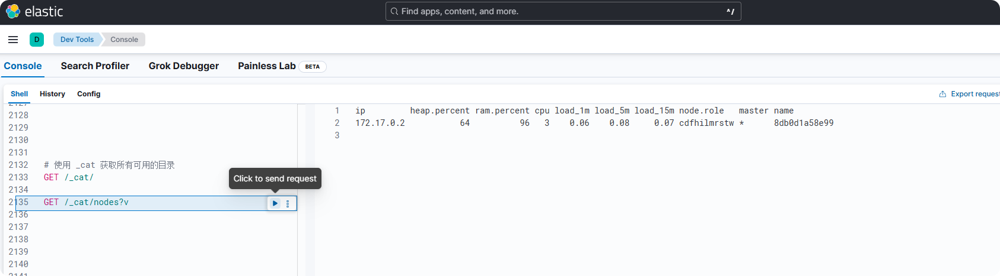
2.  h：使用 h 参数可以强制只显示某些列。比如：[GET /\_cat/nodes?h=node.role,port,name](http://get%20/_cat/nodes?h=node.role,port,name)。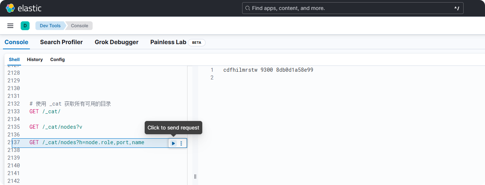
3.  help：使用 help 参数可以输出该接口可用的列名和其解析。如：[GET /\_cat/master?help](http://get%20/_cat/master?help)。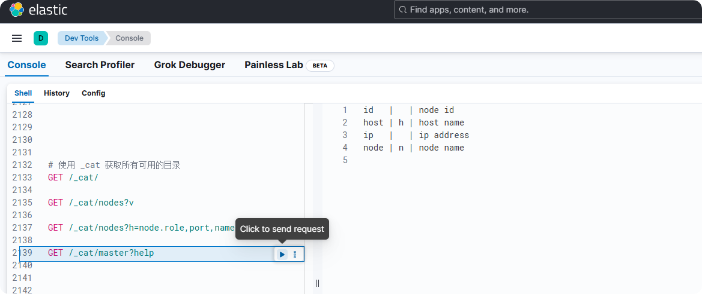

由于这些 API 都比较简单，接下来我们会按照顺序展示部分接口的使用示例，更多关于 \_cat APIs 的使用示例，可以参考[官方文档](https://www.elastic.co/guide/en/elasticsearch/reference/8.17/cat.html)。

### **2.2.1 查看磁盘使用情况**

\# 获取各个节点磁盘的使用情况

GET /\_cat/allocation?v

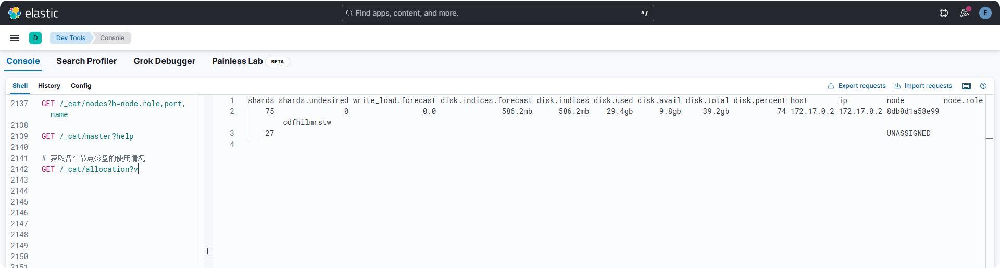

###   
**2.2.1.1 接口作用**

该接口主要提供集群中每个数据节点的磁盘空间使用情况详情和分片分配数量的摘要信息。

简单来说，其回答了两个关键问题：

1.  数据分布在各个节点上是否均衡？（通过 shards 数量）。
2.  每个节点的磁盘空间还够用吗？会不会有磁盘写满的风险？（通过 disk.percent, disk.avail 等）。

### **2.2.1.2 使用场景**

在以下运维场景中至关重要：

1.  日常健康检查与容量监控：这是最主要的用途。每天检查 disk.percent 和 disk.avail，确保没有节点的磁盘使用率过高（如超过85%），避免磁盘写满导致集群被置为只读或节点离线。
2.  容量规划：在集群需要扩容前，通过观察当前磁盘使用量和增长趋势，来决策是否需要增加节点或扩容磁盘。
3.  故障排查：当出现分片无法分配（UNASSIGNED）的问题时，首要原因就是磁盘空间不足。此命令可以快速确认是否是磁盘空间问题。
4.  均衡性分析：通过查看各节点的 shards 数量，判断分片在集群中的分布是否均衡，是否存在某个节点负载过重的情况。

### **2.2.1.3 输出结果分析**

如上图结果查看了各个节点磁盘的使用情况，可以看到 8db0d1a58e99 节点共 39.2 gb 空间，用了 29.4 gb，8db0d1a58e99 中分配了 75 个分片，索引的数据用了 586.2 mb。

从提供的单节点输出，可以得出以下结论：

1.  磁盘健康状态良好，但需关注：
2.  使用率：当前磁盘使用率为 75% (disk.percent: 75)。这是一个需要开始关注的水平，但尚未触发 Elasticsearch 的任何保护机制（85%）。
3.  剩余空间：可用空间为 9.7GB (disk.avail: 9.7gb)。你需要监控这个数字的下降速度，预估数据增长何时会触及 85% 的警戒线。
4.  数据量分析：
5.  你的所有索引数据共占用 586.2MB (disk.indices: 586.2mb)，
6.  但整个磁盘已用了 29.5GB (disk.used: 29.5gb)。
7.  这意味着除了 Elasticsearch 数据外，操作系统、Docker、以及 Elasticsearch 本身的日志和安装文件等占用了大量空间（约 28.9GB）。这在容器化部署中很常见。
8.  分片数量：该节点持有 75 个分片 (shards: 75)。结合我们上次看的 shards 命令，其中有很多未分配的副本，如果副本分配成功，这个数字会翻倍，磁盘使用量也会显著增加。
9.  这在当前单节点环境下是无法实现的，也解释了为什么副本是 UNASSIGNED。

### **2.2.1.4 结果字段详解**

当前结果输出显示集群只有一个节点，所以只有一行数据。

1.  shards：表示该节点当前持有的分片总数，该节点上共有 75 个分片（包括主分片和副本分片）。
2.  shards.undesired：不期望的分片数量，这是一个高级特性，通常为 0。当调整了副本数、分片过滤规则后，某些已存在的分片可能不再符合期望的分配状态，这些就是 "undesired" 分片。集群会自动尝试将这些分片迁移到正确的位置，为 0 表示状态健康。
3.  write\_load.forecast：写入负载预测 。一个预测性的指标，基于历史写入负载预测未来的写入压力。通常需要与基准值比较，当前为 0 可能表示写入压力很小或预测功能未启用/无数据。
4.  disk.indices.forecast：索引磁盘使用量预测，预测未来某个时间点索引数据将占用的磁盘空间大小。
5.  disk.indices：索引数据实际占用的磁盘空间。这是最关键的数字之一，它表示该节点上所有 Elasticsearch 索引数据（主分片）压缩后的实际物理大小，它通常远小于所有文档的原始大小。
6.  disk.used：节点磁盘已使用的总空间。该节点上所有数据（包括 Elasticsearch 索引、操作系统文件、其他软件等）占用的总磁盘空间。
7.  disk.avail：节点磁盘的可用空间。这是最重要的监控指标！ 它直接告诉你还有多少空间可以使用。一旦这个值降得很低，集群就会出问题。
8.  disk.total：该节点磁盘的总大小。
9.  disk.percent：节点磁盘使用率百分比。这是最直观的监控指标！ 计算公式：[disk.used / disk.total \* 100%](http://disk.used%20/%20disk.total%20*%20100%)。Elasticsearch 默认在磁盘使用率达到 85% 时会采取措施停止分配新分片到该节点，达到 90% 时会主动迁移分片以腾出空间，达到 95% 时所有索引将被置为只读。
10.  host ip node：节点标识信息。节点的 IP 地址、主机名和名称。
11.  node.role：节点角色，这是节点角色的缩写代码：
12.  m: master-eligible（可当选主节点）
13.  d: data（数据节点）
14.  i: ingest（摄入节点）
15.  等等...

### **2.2.1.5 总结与建议**

该接口是你监控集群磁盘健康状况的仪表盘：

1.  监控建议：建议设置监控告警（例如，使用 Prometheus + Grafana 或 Elastic Stack 自身的 Monitoring 功能），当 disk.percent 超过 80% 或 disk.avail 低于 5GB 时发出警告，以便你有充足的时间进行处理。
2.  行动建议：对于你的单节点集群：
3.  清理磁盘：可以考虑清理旧的日志文件（如 /var/log 下的文件）、删除不用的 Docker 镜像容器来释放空间。
4.  调整配置：如果只是测试环境，可以接受风险，但要确保索引的副本数设置为 0，避免创建无法分配的分片。
5.  扩容：如果是生产环境，唯一的长期解决方案是增加磁盘容量或增加新的数据节点。

这个接口命令和 GET /\_cat/shards 结合使用，可以让你对集群的「**数据分布**」和「**存储健康**」有一个全面的了解，是日常运维的必备工具。

### **2.2.2 查看索引分片情况**

\# 查看索引分片信息

GET /\_cat/shards?v

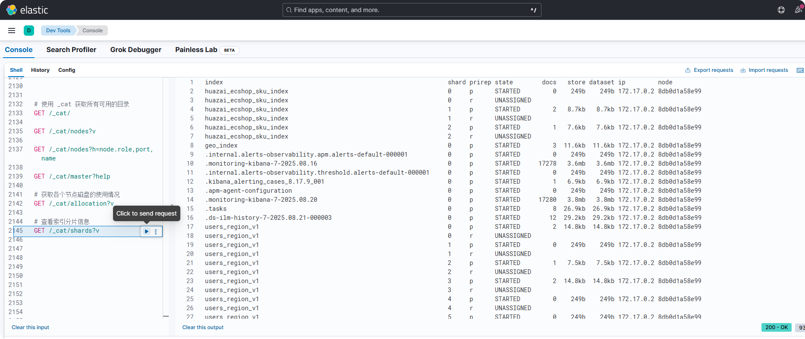

### **2.2.2.1 接口作用**

它是 Elasticsearch 提供的一个重要的集群管理 API，其核心作用是展示集群中所有索引的分片（Shard）的「**详细分布**」和「**状态信息**」。

你可以把它理解为集群的「**任务管理器**」或「**资源管理器**」，它清晰地列出了数据（分片）被分配到了哪个节点上，以及这些节点当前的状态如何。

### **2.2.2.2 使用场景**

在以下场景中非常有用：

1.  集群健康监控与故障诊断：这是最核心的用途，当集群状态为 Yellow 或 Red 时，第一时间使用此命令查看哪些分片分配失败（UNASSIGNED）、正在初始化（INITIALIZING）或正在迁移（RELOCATING），从而快速定位问题根源。
2.  容量规划与性能分析：通过观察每个分片的文档数量（docs）和存储大小（store），可以判断数据分布是否均匀。如果某个节点上的分片总大小远大于其他节点，说明存在数据倾斜，可能成为性能瓶颈。
3.  日常运维：在节点重启、下线或集群扩容前后，使用此命令观察分片重新分配的进度和最终状态，确保操作顺利完成。
4.  理解索引结构：可以看到一个索引被分成了多少个主分片（p）和副本分片（r），帮助理解索引的架构设计。

### **2.2.2.3 输出结果分析**

从结果输出中，可以得到当前集群状态的信息：

1.  单节点集群：几乎所有 STARTED 状态的分片都位于同一个节点 8db0d1a58e99 (IP: 172.17.0.2) 上。这是一个明显的单节点集群特征。
2.  副本分片未分配：这是最关键的问题。几乎所有自定义索引（如 huazai\_ecshop\_sku\_index, users\_region\_v1, logs-app-prod-2025.08.21-000001）的副本分片（prirep 为 r）状态都是 UNASSIGNED。
3.  原因：因为你只有一个节点，而 Elasticsearch 默认不会将主分片和它的副本分片分配到同一个节点上（为了防止单点故障，失去副本的意义）。因此，副本分片找不到其他节点来分配，只能处于未分配状态。
4.  影响：这会导致你的集群状态持续为 YELLOW。数据有丢失的风险（如果唯一节点宕机，数据将完全丢失）。同时，你也无法利用副本分片来提升查询性能。
5.  系统索引：有很多以 . 开头的索引（如 .monitoring-\*, .kibana\_\*, .security-\*），这些是 Elastic Stack（如 Kibana, Beats, Security 功能）自动创建的系统索引，用于存储配置、监控数据和任务信息。它们的分片分配规则可能与业务索引相同。
6.  数据流索引：可以看到一些类似 logs-app-prod-2025.08.21-000001 的索引，这是由 Index Lifecycle Management (ILM) 或 数据流 (Data Streams) 自动生成的带日期后缀的滚动索引，是管理时序数据的标准做法。

### **2.2.2.4 结果字段详解**

1.  index：索引名称，如 huazai\_ecshop\_sku\_index, .monitoring-kibana-7-2025.08.16。以 . 开头的通常是系统索引。
2.  shard：分片编号 0, 1, 2... etc。一个索引由多个分片组成，这是每个分片的唯一 ID。
3.  prirep：分片类型
4.  p : 主分片 (Primary) - 负责数据的读写。
5.  r : 副本分片 (Replica) - 主分片的拷贝，提供高可用和读负载均衡。
6.  state：分片状态
7.  STARTED : 已启动 - 分片正常运行，可参与读写。
8.  UNASSIGNED : 未分配 - 这是一个警告信号！ 表示集群无法将分片分配到任何节点。原因可能包括：节点数量不足（如只有1个节点，无法分配副本）、磁盘空间不足、分配规则限制等。
9.  INITIALIZING: 正在初始化。
10.  RELOCATING: 正在在节点间迁移。
11.  docs：文档数量 该分片当前包含的文档数量。例如 17278 表示该分片有 17278 个文档。
12.  store：存储大小 该分片在磁盘上占用的物理空间大小。例如 3.6mb。注意：这是压缩后的大小。
13.  ip：节点 IP 地址 该分片所在节点的 IP 地址。例如 172.17.0.2。如果状态是 UNASSIGNED，此列为空。
14.  node：节点名称 该分片所在节点的名称。例如 8db0d1a58e99。如果状态是 UNASSIGNED，此列为空。

### **2.2.2.5 总结和建议**

该集群核心问题是副本分片因节点数不足而无法分配。

1.  如果只是在开发/测试环境：可以忽略 Yellow 状态，或者为了消除警告，在索引设置中将副本数设置为 0（但这会牺牲高可用性）。

PUT /xxx\_index\_name/\_settings

{

"index.number\_of\_replicas": 0

}

1.  如果在生产环境：强烈建议增加节点，组建一个多节点的集群。这样副本分片才能被正确分配，集群状态才能变为 Green，从而实现真正的高可用和故障恢复能力。

总之，该接口是你管理 Elasticsearch 集群时最应该熟练掌握的命令之一，它能提供最直接、最详细的数据分布和健康状态视图。

### **2.2.3 查看节点信息**

\# 查看节点信息

GET /\_cat/nodes?v

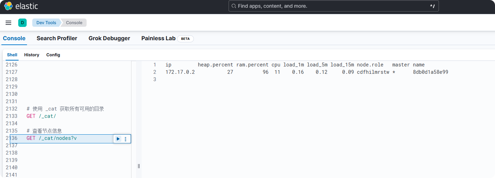

### **2.2.3.1 接口作用**

接口的核心作用是提供集群中每个节点的实时资源利用率（CPU、内存、负载）和节点角色信息的快照。

简单来说，它回答了一个核心问题：我的 Elasticsearch 节点们当前“累不累”？资源够用吗？

### **2.2.3.2 使用场景**

在以下运维场景中至关重要：

1.  实时性能监控与瓶颈定位：这是最主要的用途。当集群响应变慢时，第一时间使用此命令快速判断是 CPU、内存还是磁盘 I/O（通过 Load）达到了瓶颈。
2.  容量规划与扩容依据：通过长期观察 ram.percent 和 cpu 等指标，可以了解资源的日常使用量和峰值，为是否需要增加更多或更强配置的节点提供数据支持。
3.  故障排查：节点是否离线？Master 角色是否正常？某个节点的负载是否异常高于其他节点？这个命令可以给出直观的答案。
4.  均衡性检查：在多节点集群中，检查所有数据节点的负载是否均衡。如果某个节点的 cpu 或 load\_\* 持续远高于其他节点，说明可能存在数据或请求倾斜。

### **2.2.3.3 输出结果分析**

从单节点输出结果，可以得出以下结论：

1.  Elasticsearch 进程本身非常健康：
2.  堆内存 (27%)：使用率很低，有充足的空间处理请求和缓存，GC 压力小。
3.  CPU (11%)：使用率很低，计算资源非常充裕。
4.  负载 (0.16)：系统负载非常轻。
5.  服务器整体内存压力较大：
6.  总内存 (96%)：这是一个值得关注的信号。虽然 Linux 会利用几乎所有内存做缓存（这通常是好事），但需要确认是否是真的“内存不足”。
7.  需要结合分析：还记得 [GET /\_cat/allocation](http://get%20/_cat/allocation) 中磁盘索引大小只有 586.2mb 吗？这说明 Elasticsearch 并没有占用太多内存。这 96% 的内存很可能大部分被操作系统文件缓存占用，这是正常且有益的行为，可以加速磁盘读写。只有当 ram.percent 高且 heap.percent 也高，同时系统开始使用 Swap 时，才表明出现了真实的内存压力。
8.  集群角色：
9.  该节点是当前的主节点 (\*)，并且承担了所有角色。它既是“大脑”也是“劳动力”。在生产环境中，一般建议将专用主节点（只有 m 角色）和数据节点（只有 d 角色）分开，以提高集群的稳定性。

### **2.2.3.4 结果字段详解**

从结果输出中显示集群只有一个节点：

1.  ip：节点的 IP 地址，这是该节点在网络中的地址 172.17.0.2。
2.  heap.percent：JVM 堆内存使用率，这是监控 Elasticsearch 健康度的最关键指标！
3.  它表示分配给 Elasticsearch 的 JVM 堆内存已使用了 27%。
4.  Elasticsearch 默认的 GC 阈值是 75%，超过此值会积极进行垃圾回收。
5.  如果长期高于 75% 或接近 100%，会导致频繁 GC 甚至 OOM，性能急剧下降。
6.  27% 是一个非常健康的值。
7.  ram.percent：机器总内存使用率，表示该节点整个服务器的内存已使用了 96%。这是一个需要高度警惕的值！它包含了 Elasticsearch 的堆内存、操作系统的缓存、文件系统缓存等。虽然 Linux 会充分利用内存做缓存（所以这个值高不一定坏），但可用内存过低会导致性能问题。需要结合其他指标看。
8.  cpu：CPU 使用率，表示该节点当前的 CPU 使用率为 11%。这是一个非常空闲的状态。如果持续高于 80%，说明计算资源可能成为瓶颈。
9.  load\_1m load\_5m load\_15m：系统平均负载 0.16 0.12 0.09，这是理解系统压力的重要指标。 它表示在过去 1、5、15 分钟内，系统处于可运行状态和不可中断状态的进程平均数。对于单核 CPU，1.00 表示刚好满负荷。你的值远低于 1，说明系统负载非常轻。高负载通常意味着 CPU 繁忙或正在等待磁盘 I/O。
10.  node.role：节点角色 cdfhilmrstw，这是节点角色的缩写代码合集：
11.  m (master): master-eligible，有资格被选为主节点。
12.  d (data): 数据节点，存储数据。
13.  i (ingest): 摄入节点，可以执行预处理管道。
14.  其他不常见角色。
15.  master 是否是当前主节点，星号 (\*) 表示该节点是集群的当前主节点 (Master Node)。 主节点负责管理集群范围的操作，如创建/删除索引、跟踪节点状态、分配分片等。集群中只有一个节点会有这个标记。
16.  name：节点名称 8db0d1a58e99。这是在 elasticsearch.yml 配置文件中定义的节点名称，或者在 Docker/K8s 环境中自动生成的名称。

### **2.2.3.5 总结和建议**

该接口是监控集群节点实时负载和健康度的总览仪表盘：

1.  监控建议：将此命令作为日常检查的第一步。
2.  重点关注：
3.  heap.percent：确保低于 75%。
4.  cpu 和 load\_\*：如果持续高位，需要排查慢查询或优化索引。
5.  ram.percent：结合其他指标看，如果很高但节点运行流畅，则可能是正常的缓存行为。
6.  master：确认主节点存在且唯一。
7.  对集群的总体评价：Elasticsearch 单节点目前处于非常轻松和健康的状态。主要“问题”在于单节点架构导致的分片无法分配（集群 Yellow），但这在开发环境中是可接受的。内存使用率高在 Linux 系统上是正常现象，无需过分担心，除非出现性能下降或 Swap 被使用。

### **2.2.4 查看整个集群文档数和索引文档数**

\# 获取整个集群所有索引的文档总数

GET /\_cat/count?v

\# 获取索引 huazai\_ecshop\_sku\_index 的文档总数

GET /\_cat/count/huazai\_ecshop\_sku\_index?v

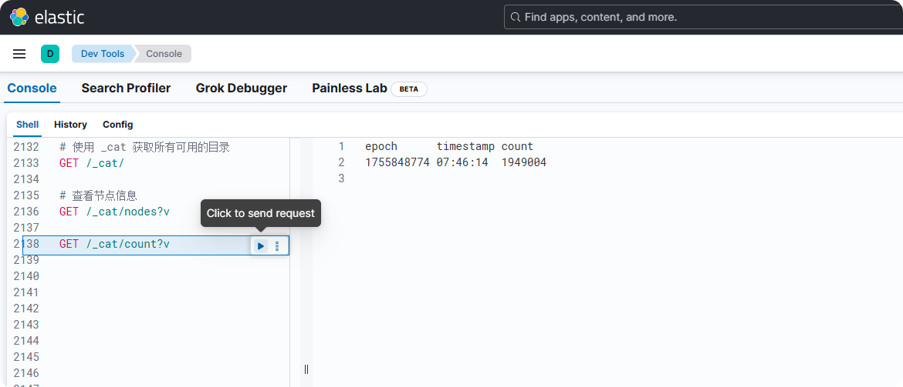

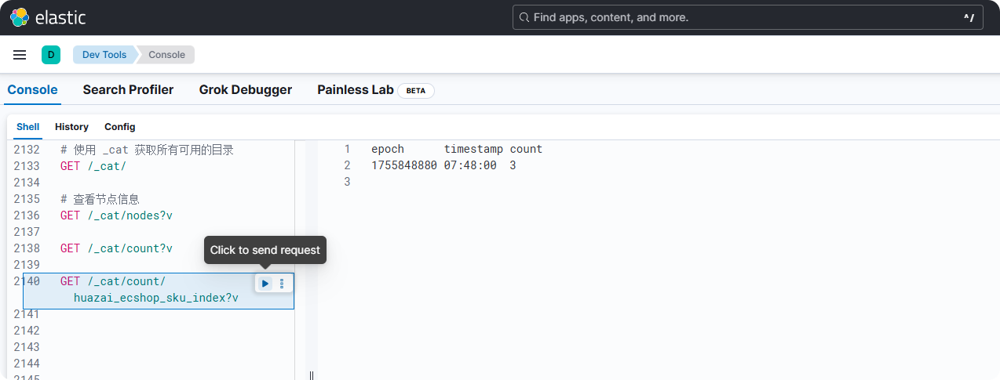

### **2.2.4.1 接口作用**

该接口的核心作用是快速获取一个或多个索引中所有文档（Document）的总数量。

1.  [GET /\_cat/count?v](http://get%20/_cat/count?v)：获取整个集群所有索引的文档总数。
2.  [GET /\_cat/count/<index\_name>?v](http://get%20/_cat/count/%3Cindex_name%3E?v)：获取指定索引的文档总数。

它不关心文档的内容、结构或分布，只返回一个简单的计数结果，因此速度非常快。

### **2.2.4.2 使用场景**

在以下场景中非常有用：

1.  快速数据量检查：这是最直接的用途。在数据导入、日志采集或ETL作业之后，快速验证是否有数据写入，以及写入了多少条记录。比如：“我的应用日志今天采集了100万条还是1000万条？”
2.  监控数据增长趋势：通过定期执行此命令（例如，写入监控系统），可以观察数据量的增长速率，用于容量规划和分析业务活动。
3.  故障排查与验证：
4.  验证删除操作是否成功（删除后数量减少）。
5.  比较数据源和Elasticsearch中的记录数，确认数据同步是否完整，是否有大量数据丢失。
6.  快速判断一个索引是否为空或有数据。
7.  日常健康报告：在每日的集群健康报告中，包含重要业务索引的文档数量，作为一个基础的健康指标。

### **2.2.4.3 输出结果分析**

很简单，用它来获取索引的文档数量，从返回结果可以看出，整个集群中大约有 195 万条记录，其格式是适合人类阅读的，而不是适合计算机解析的 JSON 格式。

### **2.2.4.4 结果字段详解**

从结果输出中显示集群/某个索引的查询结果：

1.  epochUnix：时间戳，这是一个整数值 1755848961，表示命令执行时刻的 Unix 时间戳（自 1970年1月1日以来的秒数），便于机器处理和记录时间点。
2.  timestamp：格式化时间。对 epoch 的可读性转换，显示命令执行时的本地时间（小时:分钟:秒） 07:49:21。
3.  count：文档总数，这是命令的核心结果！ 它表示整个集群中共有 1,949,004 个文档。

### **2.2.4.5 总结和建议**

这是一个非常高效和直接的工具，用于快速回答“我这里有多少数据？”这个基本但重要的问题。

注意事项：

1.  近似值：在分布式系统中，[\_cat/count](http://_cat/count) 提供的可能是一个近似值。它为了速度牺牲了一点准确性。如果你需要一个在分片间高度一致的、精确的文档计数，应该使用 [GET /<index\_name>/\_count API](http://get%20/%3Cindex_name%3E/_count%20API)。但在绝大多数监控和快速检查场景下，[\_cat/count](http://_cat/count) 的精度已经足够。
2.  不包括已删除的文档：计数不会包含已被标记为删除但尚未从磁盘段中物理清除的文档。

### **2.2.5 查看集群健康状态**

\# 查看集群健康状态

GET /\_cat/health?v

\# 查看集群健康状态,结果去除时间戳

GET /\_cat/health?v&ts=false

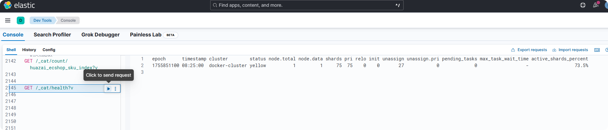

### **2.2.5.1 接口作用**

该接口的核心作用是提供整个 Elasticsearch 集群的全局健康状态和关键指标的概览。

它给你一个高层次的、一眼就能看懂的“集群体检报告”，告诉你集群是健康、亚健康还是病危，并给出一些关键指标来帮助你快速判断问题所在。

### **2.2.5.2 使用场景**

在以下场景中几乎是每天甚至每小时都会用到的：

1.  第一眼健康检查：这是最主要的用途。任何时候对集群状态有疑问，首先运行此命令。status 字段会立刻告诉你集群是 green（健康）、yellow（警告）还是 red（危险）。
2.  故障报警与诊断：监控系统通常会持续调用此接口。当状态变为 yellow 或 red 时，触发报警。运维人员根据 unassign、init 等字段快速定位问题方向（是节点宕机了还是分片无法分配）。
3.  变更前后验证：在执行集群维护操作（如重启节点、更新配置）之前和之后，运行此命令以确认集群状态是否恢复正常。
4.  日常运维仪表盘：提供一个快速查看集群规模（node.total）、数据规模（shards）和负载（pending\_tasks）的入口。

&ts=false 参数的作用：默认情况下，输出包含时间戳（epoch 和 timestamp）。在某些自动化脚本或监控看板中，可能只需要纯粹的状态数据而不需要时间信息，使用 ts=false 可以去除时间列，使输出更简洁。

### **2.2.5.3 输出结果分析**

从结果输出中可以清晰地得出集群的状态：

1.  核心问题：集群状态为 yellow，根本原因是存在 27 个未分配的分片 (unassign: 27)。
2.  问题根源：这是一个单节点集群 (node.total: 1)。Elasticsearch 出于高可用性考虑，不会将主分片和它的副本分片分配到同一个节点上。因此，你为索引配置的所有副本分片都无法分配，导致了 yellow 状态。
3.  当前风险：没有数据丢失的风险，因为所有主分片 (pri: 75) 都已分配，且未分配的主分片数为 0 (unassign.pri: 0)。集群功能完全正常，可以读写，只是缺乏副本提供的高可用性。
4.  集群负载：集群当前非常“安静”，没有分片在迁移 (relo: 0)，没有分片在初始化 (init: 0)，主节点的任务队列也是空的 (pending\_tasks: 0)。

### **2.2.5.4 结果字段详解**

1.  epoch timestamp：时间戳，命令执行的时间点 1755851100 08:25:00。
2.  cluster：集群名称 docker-cluster，在 elasticsearch.yml 中配置的集群名称。
3.  status：集群健康状态 yellow。这是最关键的指标！
4.  green: 所有主分片和副本分片都已正常分配。
5.  yellow: 所有主分片已分配，但部分副本分片未分配。
6.  red: 有主分片未分配（意味着数据丢失）。
7.  目前集群处于警告状态。
8.  node.total：集群中活跃的节点总数 1。
9.  node.data：集群中扮演数据节点角色的数量 1。
10.  shards：分片总数，集群中所有主分片+副本分片的总数 75。
11.  pri：主分片总数，集群中所有主分片的数量 75。
12.  relo：正在迁移的分片数，正在从一个节点迁移到另一个节点的分片数量。非零表示集群正在重新平衡，0 是正常状态。
13.  init：正在初始化的分片数，新创建或新分配后正在初始化的分片数量。非零值通常会在节点重启或索引创建后短暂出现。
14.  unassign：未分配的分片数 27，这是导致状态为 yellow 的直接原因！ 这些是应该被分配但目前找不到合适节点的分片（几乎都是副本分片）。
15.  unassign.pri：未分配的主分片数，这是更危险的信号。幸好这里是0，如果有主分片未分配（unassign.pri > 0），状态会变为 red，意味着数据丢失。
16.  pending\_tasks：等待中的集群级任务数，需要主节点执行的集群级操作（如创建索引、更新映射、分配分片）的队列长度。如果这个数字持续很高，说明主节点繁忙或集群任务繁重。0 是理想状态。
17.  max\_task\_wait\_time：最旧任务的等待时间，队列中最旧任务已经等待了多久。- 表示没有任务在等待。
18.  active\_shards\_percent：活跃分片百分比 73.5%，已分配的分片数占总分片数的百分比。计算公式：[(shards - unassign) / shards \* 100%](http://\(shards%20-%20unassign\)%20/%20shards%20*%20100%)。这个值越低，说明集群越不健康。 你的值是 73.5%，这与 75个总分片，27个未分配 的计算结果 (75-27)/75 ≈ 64% 似乎不符，这可能是因为计算方式略有差异或包含了系统索引。

### **2.2.5.5 总结和建议**

该接口是你监控 Elasticsearch 集群的总指挥台，提供了最高级别的健康状态视图。

1.  对于你的集群：yellow 状态是单节点集群的预期行为。如果你只是在开发或测试环境中使用，可以接受这个状态。如果你想消除警告，可以将所有索引的副本数设置为 0（但这会牺牲故障恢复能力）。

PUT /\_all/\_settings

{

"index.number\_of\_replicas": 0

}

1.  对于生产环境：要获得 green 状态，必须部署至少两个节点，以便副本分片能够被分配出去。

这个接口输出为你下一步该使用哪些更详细的诊断命令（如 GET /\_cat/shards 查看具体哪些分片未分配，或 GET /\_cat/allocation 查看磁盘空间）提供了最直接的指引。

## **2.3 集群管理 API 底层架构思想**

在实战之前，先来了解下其底层架构思想，Elasticsearch 集群管理 API 的底层架构是一个以「**主节点为中心**」、「**集群状态为单一真相源(Single Source of Truth)**」​的强一致性系统。其核心在于：

1.  ​中心化决策​：所有变更由主节点序列化处理。
2.  ​原子广播​：通过两阶段提交将状态变更安全地广播到所有节点。
3.  ​最终一致性​：所有节点最终都会应用相同的集群状态，尽管有微小的延迟。

整个集群的配置和元数据（如有哪些节点、索引、分片位置、映射、设置等）被封装在一个称为「**集群状态**」（Cluster State）​​ 的数据结构中，​所有变更都必须由主节点（Master Node）序列化处理并广播到整个集群，以保证所有节点对集群的认知最终保持一致，是 Elasticsearch 能够稳定可靠地管理大规模分布式数据和复杂操作的基础。

理解这个架构对于诊断集群问题（如慢响应、配置更新失败、节点离线影响）至关重要。

下图描绘了一个集群管理 API 请求的完整生命周期：

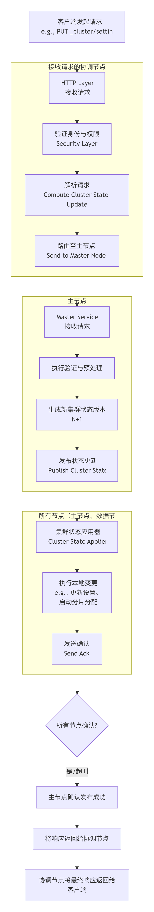

上述流程涉及的核心组件职责如下：

关键机制深度解析：

1.  一致性协议：Zen2 与 Raft
2.  从 Elasticsearch 7.x 之后使用 ​Zen2​ discovery layer，其内置了一个 ​类 Raft 的算法​ 来选举主节点和管理集群状态发布。
3.  ​法定人数（Quorum）​​：主节点需要得到大多数（N/2+1）Master-eligible 节点的确认，才能认为集群状态发布成功。
4.  ​安全性​：这确保了即使发生网络分区，也最多只有一个分区能拥有大多数节点并成功发布状态，从而避免脑裂（Split-Brain）​​ 和数据损坏。
5.  两阶段提交（Two-Phase Commit）过程
6.  集群状态更新是一个典型的两阶段提交：
7.  ​发布阶段（Publish Phase）​​：主节点将新的集群状态 N+1 发送给所有节点。
8.  ​确认阶段（Ack Phase）​​：所有节点接收、验证并在本地应用该状态，然后向主节点发送确认（Ack）。
9.  只有当主节点收到大多数 Master-eligible 节点的 Ack​ 后，这次更新才被提交（Committed）。之后，主节点会发送一条消息通知所有节点提交该状态。
10.  任务序列化与并发控制
11.  ​Master Service​ 内部有一个任务队列。所有要修改集群状态的请求都被序列化为任务，​逐个处理。这保证了操作的顺序性和一致性，避免了并发修改导致的竞态条件。
12.  当一个集群状态更新正在处理时，新的更新请求会被阻塞，直到当前处理完成。

## **2.4 集群管理 API**

集群管理的 API 提供了获取或者更改集群信息的功能，例如查看集群信息、查看节点信息、更新集群设置、集群节点过滤、重置路由等。

###   
**2.4.1 集群状态和健康度监控**

这是最常用的一组 API，用于快速诊断集群健康状况。

### **2.4.1.1 集群健康 API**

这是你的第一道防线，它提供集群状态的概览。

GET \_cluster/health

GET \_cluster/health?level=indices \# 获取索引级别的详细信息

GET \_cluster/health?level=shards \# 获取分片级别的详细信息（谨慎使用，输出可能很大）

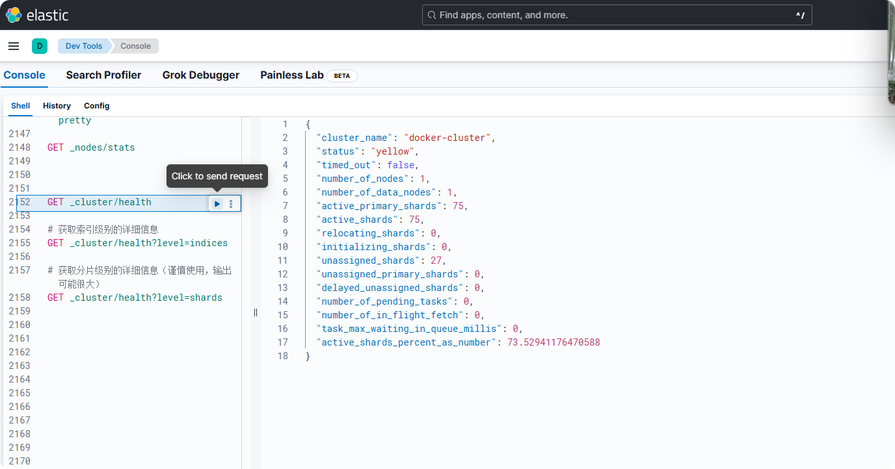

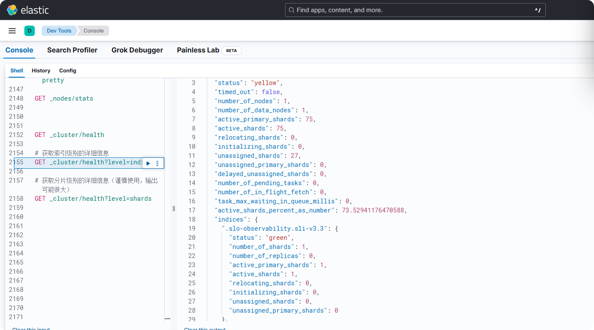

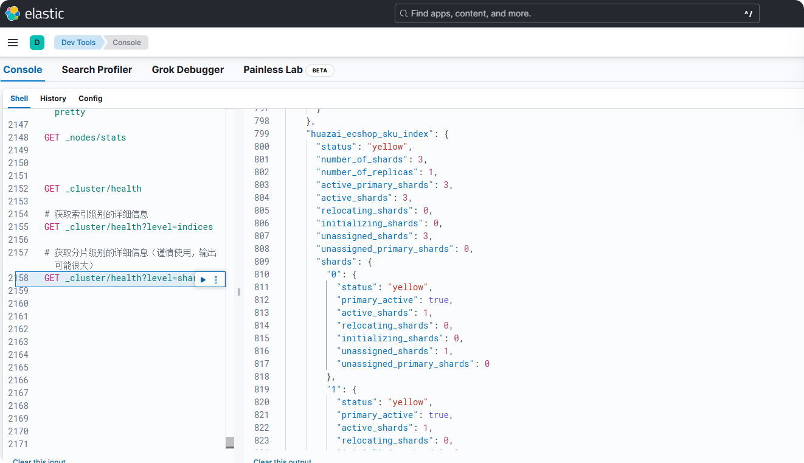

### **2.4.1.1.1 接口作用**

该接口的核心作用是以结构化 JSON 格式获取 Elasticsearch 集群的详细健康状态和组成 metrics。

它提供了集群状态的“上帝视角”，不仅告诉你状态是什么，还通过详实的数据告诉你为什么是这个状态。

level 参数用于控制返回信息的详细程度：

1.  默认 (level=cluster)：返回集群级别的汇总信息。
2.  level=indices：在集群信息的基础上，增加每个索引的详细状态。
3.  level=shards：在 indices 级别的基础上，进一步增加每个分片的详细状态。（警告： 对于分片众多的集群，此响应会极其庞大，请谨慎使用）。

### **2.4.1.1.2 使用场景**

1.  自动化监控与告警：这是最主要的用途。监控系统（如 Prometheus、Zabbix、Elastic Stack 自身的 Monitoring）会定期调用此 API，解析 JSON 中的关键指标（如 status, unassigned\_shards）来触发告警。
2.  深度故障诊断：当 [/\_cat/health](http://_cat/health) 显示集群状态异常时，使用 [?level=indices](http://?level=indices) 或 [?level=shards](http://?level=shards) 来精确定位到有问题的索引甚至分片，从而缩小排查范围。
3.  获取精确的编程数据：应用程序或脚本需要以结构化的方式获取集群状态时，JSON 格式的此 API 比纯文本的 [\_cat API](http://_cat%20api/) 更易于解析和处理。
4.  查看集群配置：快速查看索引的副本配置（number\_of\_replicas）等。

### **2.4.1.1.3 输出结果分析**

单节点集群 docker-cluster 状态为 yellow 是完全符合预期的，原因是所有索引（如 huazai\_ecshop\_sku\_index）配置的副本分片（共27个）都无法分配。

由于所有主分片（75个）均正常，数据是安全的，集群功能完整，只是缺乏高可用性。要消除 yellow，要么增加节点，要么将索引的 number\_of\_replicas 设置为 0。

### **2.4.1.1.4 结果字段详解**

1.  cluster\_name：集群名称 "docker-cluster"
2.  status：集群健康状态 "yellow"。
3.  核心状态指标： green(健康), yellow(警告), red(危险)。
4.  timed\_out：是否超时，API 调用是否在计算状态时超时。如果为 true，结果可能不准确。
5.  number\_of\_nodes：总节点数，集群中活跃的节点总数 1。
6.  number\_of\_data\_nodes：数据节点数，集群中能存储数据的数据节点数量 1。
7.  active\_primary\_shards：活跃主分片数，已成功分配并活跃的主分片数量 75， 这是保证数据可用的最关键数字。
8.  active\_shards：活跃分片总数，所有已分配的成功并活跃的分片总数 75（包括主分片和副本分片）。因为只有主分片活跃，所以它等于 active\_primary\_shards。
9.  relocating\_shards：正在迁移的分片数 0，正常状态。
10.  initializing\_shards：正在初始化的分片数 0，正常状态。
11.  unassigned\_shards：未分配的分片数 27，这是导致 yellow 状态的直接原因，这些应该是副本分片。
12.  unassigned\_primary\_shards：未分配的主分片数 0。这是非常关键的指标！ 如果这个值大于 0，status 会是 red，意味着数据丢失。你的集群是 0，说明没有数据丢失风险。
13.  delayed\_unassigned\_shards：延迟未分配的分片数 0。与分片分配延迟配置相关，通常为 0。
14.  number\_of\_pending\_tasks：待处理任务数 0。主节点任务队列长度，0 表示集群空闲。
15.  active\_shards\_percent\_as\_number：活跃分片百分比 73.53。已分配分片占总分片数的百分比。计算公式：[active\_shards / (active\_shards + unassigned\_shards) \* 100](http://active_shards%20/%20\(active_shards%20+%20unassigned_shards\)%20*%20100)。

其中 level=indices 和 level=shards 这两个参数提供了逐层钻取的能力：

1.  ?level=indices：
2.  作用：在集群状态的基础上，返回一个 indices 对象，其中包含了每个索引的详细状态信息。
3.  使用场景：快速定位到哪个或哪些索引有问题。 例如，集群是 yellow，但你有很多索引。通过这个参数，你可以立刻看到是 huazai\_ecshop\_sku\_index 的 unassigned\_shards 为 3，而其他索引都是 green，从而将排查重点集中到该索引。
4.  输出解读：以 huazai\_ecshop\_sku\_index 为例：
5.  "status": "yellow"：该索引状态为 yellow。
6.  "number\_of\_shards": 3：该索引有 3 个主分片。
7.  "number\_of\_replicas": 1：该索引配置了每个主分片有 1 个副本。
8.  "active\_primary\_shards": 3：3 个主分片都正常。
9.  "active\_shards": 3：总共只有 3 个活跃分片（全是主分片）。
10.  "unassigned\_shards": 3：有 3 个分片未分配。 根据配置（3主分片 \* 1副本 = 3副本分片），这 3 个正好是全部的副本分片。根本原因就是单节点集群无法分配副本。
11.  ?level=shards：
12.  作用：在 indices 级别的基础上，在每个索引下再增加一个 shards 对象，详细列出每个分片（0, 1, 2...）的状态。
13.  使用场景：极度精细化的故障排查。 当你怀疑某个特定分片（而不仅仅是索引）出现问题时使用。例如，一个 10 个分片的索引，有 1 个副本未分配，你可以用这个命令看到是第几个分片的副本出了问题。
14.  输出解读：以分片 "0" 为例：
15.  它清晰地告诉你，对于第 0 号分片，其主分片是活跃的 ("primary\_active": true)，但有 1 个副本分片未分配 ("unassigned\_shards": 1)。

### **2.4.1.1.5 总结与建议**

1.  GET \_cluster/health：获取集群健康状态的权威、结构化信息，适用于自动化监控。
2.  GET \_cluster/health?level=indices：排查问题时首选，能快速定位到问题索引，输出大小通常可以接受。
3.  GET \_cluster/health?level=shards：终极排查工具，除非确有必要，否则不要在生产集群上频繁使用，以免增加负载。

### **2.4.1.2 集群状态 API**

提供比健康 API 更详细、更底层的状态信息，通常用于获取精确的配置和元数据。

GET \_cluster/state

GET \_cluster/state/metadata,routing\_table?pretty \# 只获取元数据和路由表部分，避免信息过载

GET \_cluster/state/master\_node?pretty \# 只查看当前主节点ID

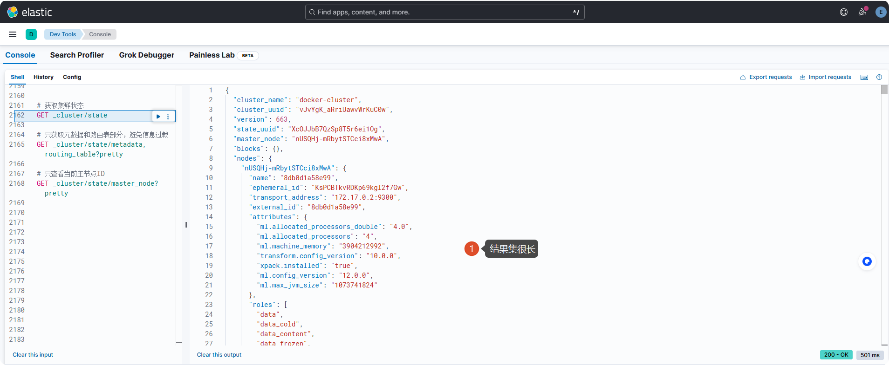

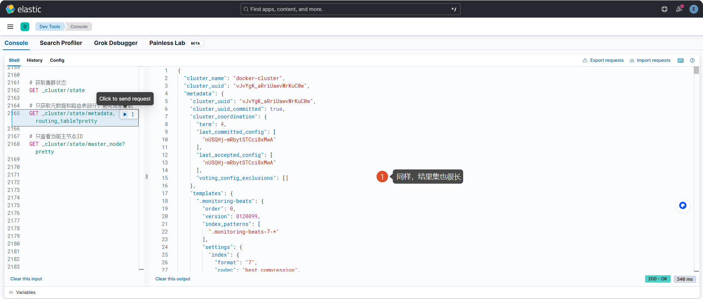

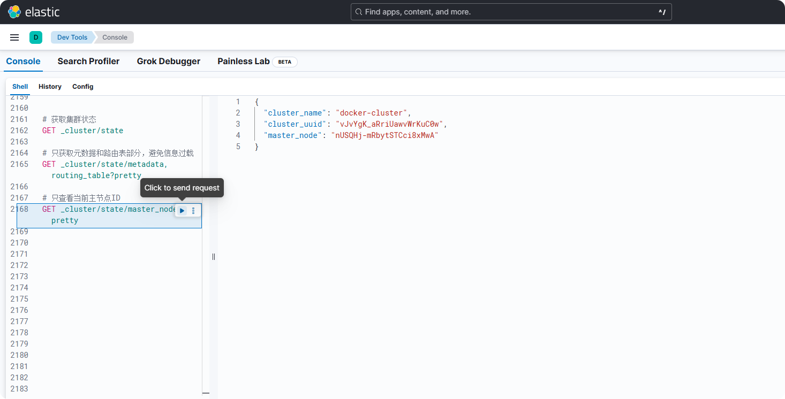

### **2.4.1.2.1 接口作用**

该接口核心作用是获取集群的完整内部状态元数据，这包括了构建和操作整个集群所需的所有信息。你可以把它理解为 Elasticsearch 主节点大脑的完整快照。

它包含了所有“蓝图”和“指令集”：

1.  有哪些索引（元数据）。
2.  这些索引长什么样（映射和设置）。
3.  这些索引的数据在哪里（路由表，即分片分配信息）。
4.  集群的全局配置（例如：自定义元数据）。

metric 参数的作用：由于全量状态的响应体可能非常巨大（MB级别），此参数允许你只获取你关心的部分，避免网络传输和解析的压力，这是生产环境中使用该 API 的关键。

### **2.4.1.2.2 使用场景**

在以下高级诊断和管理场景中使用：

1.  深度故障排查：当 [\_cluster/health](http://_cluster/health) 显示异常（如分片未分配）但原因不明时，查看 routing\_table 可以获取分片分配决策的最终结果和细节，远超 health API 提供的摘要信息。
2.  配置审计与版本控制：获取集群中所有索引的精确映射（mapping）和设置（settings），用于审计、备份或作为基础设施即代码（IaC）的配置来源。
3.  理解分片分配：精准查看某个分片当前被分配到了哪个节点，或者为什么它没有被分配。
4.  获取主节点信息：快速、编程式地获取当前主节点的 ID。
5.  开发运维工具：用于构建需要与集群内部状态深度交互的自定义运维平台或工具。

> 重要警告：由于此 API 返回的数据量巨大，切勿在监控或健康检查中频繁调用，尤其是在大型集群上，这会给主节点带来不必要的压力。它是一个“仅在需要时使用”的诊断工具。

### **2.4.1.2.3 输出结果分析**

通过 [GET \_cluster/state/metadata,routing\_table?pretty](http://get%20_cluster/state/metadata,routing_table?pretty) 来查看为何你的集群是 yellow。

  
1、在 metadata 部分找到你的索引配置：

"metadata": {

"indices": {

"huazai\_ecshop\_sku\_index": {

"version": 12,

"number\_of\_shards": 3, // 该索引有3个主分片

"number\_of\_replicas": 1, // 每个主分片有1个副本

"settings": { ... },

"mappings": { ... }

}

}

}

2、在 routing\_table 部分查看分片分配结果：

"routing\_table": {

"indices": {

"huazai\_ecshop\_sku\_index": {

"shards": {

"0": \[

{

"state": "STARTED",

"primary": true,

"node": "8db0d1a58e99", // 分片0的主分片在节点8db...上

"relocating\_node": null,

"shard": 0,

"index": "huazai\_ecshop\_sku\_index",

"allocation\_id": {

"id": "zP3YQrUAQQCrbqf43-JcsQ"

},

"relocation\_failure\_info": {

"failed\_attempts": 0

}

},

{

"state": "UNASSIGNED", // 分片0的副本分片未分配！

"primary": false,

"node": null, // 没有分配到任何节点

"relocating\_node": null,

"shard": 0,

"index": "huazai\_ecshop\_sku\_index",

"recovery\_source": {

"type": "PEER"

},

"unassigned\_info": {

"reason": "INDEX\_CREATED",

"at": "2025-08-18T08:30:04.385Z",

"delayed": false,

"allocation\_status": "no\_attempt"

},

"relocation\_failure\_info": {

"failed\_attempts": 0

}

}

\],

// ... 分片1和2也会有类似的结构，显示副本是 UNASSIGNED

}

}

}

}

这就是终极证据！ routing\_table 清晰地展示了每个分片的确切状态。你看到主分片是 STARTED 且分配到了你唯一的节点，而副本分片是 UNASSIGNED。unassigned\_info 甚至会告诉你原因是 NODE\_LEFT，这在单节点集群中意味着“没有其他节点可分配”，完美地解释了你之前看到的 yellow 状态。

### **2.4.1.2.4 结果字段详解**

#### 1、GET \_cluster/state (不推荐直接使用) 返回一切，数据量巨大。通常包含：

1.  cluster\_name：集群名称。
2.  cluster\_uuid：集群唯一ID。
3.  version：集群状态版本（每次状态变更都会递增）。
4.  state\_uuid：此次状态快照的唯一ID。
5.  master\_node：当前主节点的ID。（例如 "8db0d1a58e99"）
6.  blocks：集群级别的阻塞状态（如只读块）。
7.  metadata：元数据（核心），包含：
8.  cluster\_coordination：集群协调信息。
9.  templates：索引模板。
10.  indices：所有索引的详细定义（映射mapping + 设置settings）。
11.  index-graveyard：已删除索引的墓碑（用于安全恢复）。
12.  routing\_table：路由表（核心），包含：
13.  indices：所有索引的每个分片（主分片和副本）的精确分配信息，包括它们位于哪个节点上。
14.  routing\_nodes：节点上的分片分配详情。

#### 2\. GET \_cluster/state/metadata,routing\_table?pretty： 这是最有用的命令格式。它只获取两个最核心的部分。

1.  metadata：让你知道集群里有什么索引以及它们的结构。
2.  routing\_table：让你知道这些索引的数据具体分布在何处。

使用场景：当你需要同时审计索引配置和检查分片分配问题时。

#### 3、GET \_cluster/state/master\_node?pretty：这是一个轻量级且实用的命令。它只返回当前主节点的 ID。

{

"cluster\_name": "docker-cluster",

"cluster\_uuid": "vJvYgK\_aRriUawvWrKuC0w",

"master\_node": "nUSQHj-mRbytSTCci8xMwA"

}

使用场景：

1.  在脚本中自动判断哪个节点是主节点。
2.  与 GET \_cat/nodes 命令结合，通过节点ID找到主节点的IP地址。

### **2.4.1.2.5 总结与建议**

给你的建议：将 GET \_cluster/state/master\_node 和 GET \_cluster/state/metadata,routing\_table 加入你的工具箱，在遇到复杂问题时使用它们来获取无可辩驳的底层证据，平时日常检查则使用更轻量的 \_cat API。

### **2.4.1.3 节点状态 API**

这是你的全面体检报告，它提供了每个节点的详尽资源使用情况。

\# 获取节点状态

GET \_nodes/stats

\# 获取特定节点的统计信息

GET \_nodes/8db0d1a58e99/stats?pretty

\# 只获取文件系统、操作系统、JVM部分的信息

GET \_nodes/stats/fs,os,jvm?pretty

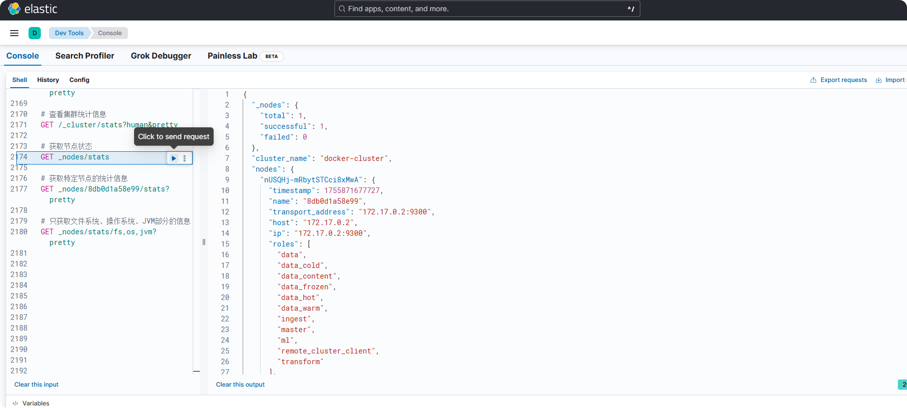

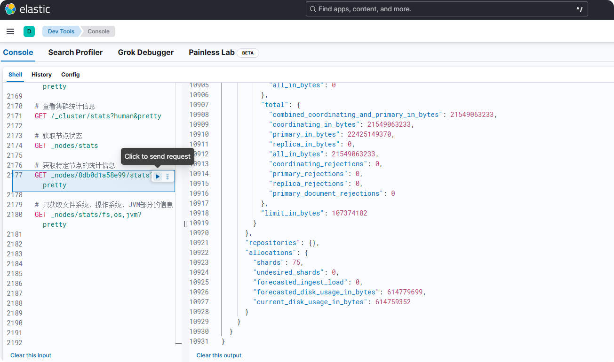

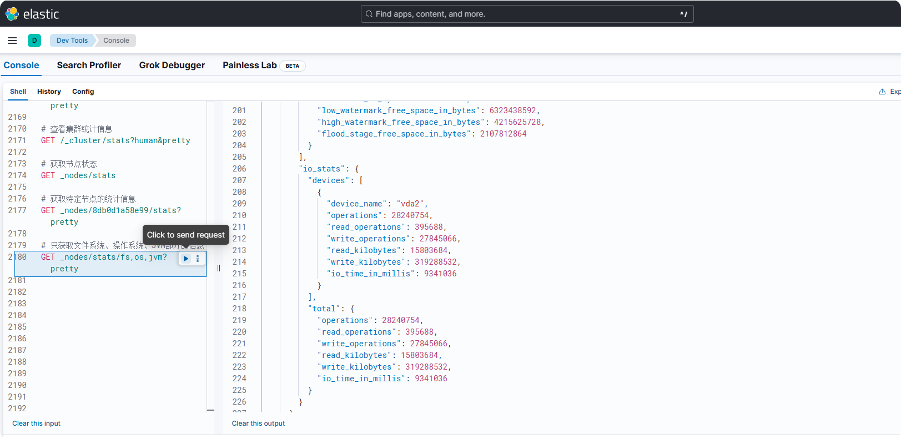

除了 stats 外，ES 支持的节点过滤器有如下几个：

1.  \_all：列出所有节点。
2.  \_local：列出本地节点。
3.  \_master：列出主节点
4.  IP 或者主机名字：列出指定 IP 或者主机名字的节点。
5.  节点 ID 或者名称：列出指定 ID 或者名称的节点。
6.  \*：IP、主机名字、节点 ID、名称都可以包括通配符。
7.  master:true/false：列出主节点 / 不列出主节点。
8.  data:true/false：列出数据节点 / 不列出数据节点。
9.  ingest:true/false：列出索引预处理节点 / 不列出索引预处理节点。
10.  coordinating\_only:true/false：列出协调节点 / 不列出协调节点。

### **2.4.1.3.1 接口作用**

这是 Elasticsearch 提供的最详细的节点级性能监控和资源统计接口，是进行深度性能分析和故障排查的“瑞士军刀”。

  
核心作用是获取集群中每个节点的详细统计信息，涵盖从最底层的操作系统资源（CPU、内存、磁盘）到最上层的 Elasticsearch 内部操作（索引、搜索、缓存）等方方面面。

你可以把它理解为给每个 Elasticsearch 节点做的一次全身体检，它提供了成百上千个指标，让你能全方位地了解节点的运行状况和性能表现。

核心参数 metric 和 node\_id：

1.  <node\_id>：可以指定一个或多个节点 ID（如 8db0d1a58e99）来获取特定节点的信息，而不是所有节点。
2.  <metric>：这是避免信息过载的关键！你可以指定只获取你关心的部分指标（如 fs,os,jvm），而不是完整的巨量 JSON。

### **2.4.1.3.2 使用场景**

在以下高级性能监控、容量规划和深度故障排查场景中不可或缺：

1.  性能瓶颈分析：当集群响应缓慢时，使用此 API 确定瓶颈所在。是 CPU 满了？内存泄漏？磁盘 IO 饱和？还是 GC 停顿过长？
2.  资源使用监控与告警：监控 fs（磁盘空间）、jvm.mem.heap\_used\_percent（堆内存使用率）、os.cpu.percent（CPU 使用率）等关键指标，并为其设置告警阈值（如磁盘可用空间低于 10GB 时告警）。
3.  JVM 垃圾回收调优：通过 jvm.gc 数据分析 Young GC 和 Old GC 的频率和耗时，判断当前 JVM 配置是否合理，是否存在内存压力。
4.  索引/搜索性能分析：通过 indices 指标查看索引和搜索的速率、延迟、缓存命中率，优化查询和索引策略。
5.  容量规划：基于历史资源使用数据（如磁盘增长速率、内存使用趋势）来规划未来的集群扩容。

### **2.4.1.3.3 结果字段详解**

我们来分解关键部分：

1.  节点基本信息 (\_nodes 和节点对象)
2.  timestamp: 1755871944948。统计信息采集的时间点（Unix 毫秒时间戳）。
3.  name, transport\_address, host, ip: 节点的各种标识和网络地址。
4.  roles: 节点角色列表。你的节点是“全能型”，承担了所有角色，这在开发环境中常见。
5.  attributes: 节点属性，通常包含一些资源限制信息，如 ml.machine\_memory 表示分配给机器学习的内存。
6.  操作系统指标 (os - 极其重要)
7.  os.cpu.percent: 4。节点整体的 CPU 使用率。4% 表示非常空闲。
8.  os.cpu.load\_average.1m: 0.15。系统平均负载。对于单个 CPU 核心，1.00 表示满负荷。你的值 0.15 远低于 1，说明系统负载很轻。
9.  os.mem: 系统内存使用情况。
10.  used\_percent: 96。这是一个需要高度关注的指标！ 它表示整个系统的内存已使用了 96%。虽然 Linux 会充分利用内存做缓存（因此高使用率不一定是坏事），但需要结合其他指标判断。
11.  free\_in\_bytes: 147394560 (~140 MB)。可用的空闲内存已经非常少。
12.  关键分析：结合 jvm.mem.heap\_used\_percent (22%) 来看，Elasticsearch 本身只用了很少内存。这 96% 的内存大部分被操作系统文件缓存占用，这是正常行为以加速磁盘读写。但如果 free\_in\_bytes 持续极低且系统开始使用 Swap，则表明出现真实的内存压力。
13.  os.swap: 交换分区使用情况。
14.  used\_in\_bytes: 790618112 (~754 MB)。系统已经使用了约 754 MB 的 Swap。
15.  注意：使用 Swap 会对性能产生严重影响。理想情况下，Elasticsearch 应尽量避免使用 Swap。你的使用量不算巨大，但需要监控其趋势。
16.  JVM 指标 (jvm - 核心中的核心)
17.  jvm.uptime\_in\_millis: 1726239246。JVM 已运行的时间（约 20 天）。
18.  jvm.mem: JVM 内存使用情况。
19.  heap\_used\_in\_bytes: 241460128 (~230 MB)。JVM 堆内存当前使用量。
20.  heap\_used\_percent: 22。这是监控 Elasticsearch 健康度的最关键指标！ 22% 是一个非常健康的值，表明堆内存充足，垃圾回收（GC）压力很小。
21.  heap\_max\_in\_bytes: 1073741824 (1 GB)。JVM 堆的最大大小。
22.  non\_heap\_used\_in\_bytes: 非堆内存（如元空间）使用量。
23.  jvm.gc: 垃圾回收统计 - 性能分析的关键。
24.  collectors.young.collection\_count: 15933。Young GC 发生的总次数。
25.  collectors.young.collection\_time\_in\_millis: 74003。Young GC 消耗的总时间（74 秒）。
26.  分析：平均每次 Young GC 耗时约 4.6ms (74003ms / 15933)，这是一个非常正常的水平。没有 Old GC (old.collection\_count: 0)，说明对象在 Young 区就被回收了，没有晋升到 Old 区，这是内存使用健康的表现。
27.  文件系统指标 (fs - 容量监控关键)
28.  fs.total: 所有磁盘的汇总信息。
29.  available\_in\_bytes: 2905726976 (约 2.9 GB)。这是最重要的监控指标！ 表示磁盘的可用空间。
30.  free\_in\_bytes: 4747587584 (~4.7 GB)。磁盘的空闲空间（与 available 的计算方式略有不同，通常 available < free）。
31.  disk.percent (在 \_cat/allocation 中): 通过计算 (total - available) / total 可以得到使用率，这个值如果超过 85%，Elasticsearch 会停止分配新分片到该节点。
32.  fs.data: 每个数据路径的详细信息。包含低水位线、高水位线、洪水阶段水位线阈值，Elasticsearch 用这些值来决定是否迁移分片。
33.  fs.io\_stats: 磁盘 I/O 统计。可以看到读/写操作次数和数据量，用于判断磁盘 I/O 是否成为瓶颈。你的节点写操作 (write\_operations) 远高于读操作，这是正常的数据写入模式。

### **2.4.1.3.4 总结与建议**

GET \_nodes/stats 是 Elasticsearch 运维的终极诊断工具，提供了无与伦比的深度和细节。

1.  给你的集群的“体检报告”：
2.  CPU & Load: 非常健康，负载极低。
3.  JVM Heap: 非常健康，使用率低，GC 正常。
4.  系统内存: 使用率很高 (96%)，但主要被系统缓存占用，且 JVM 正常，暂无紧迫风险，但需持续观察。
5.  磁盘空间: 可用空间仅剩 2.9GB，这是当前最大的风险点！ 需要立即关注并处理（清理日志、归档数据或扩容磁盘）。
6.  Swap: 已使用约 754MB，需要监控，如果持续增长，可能需要调整系统配置或增加物理内存。
7.  使用建议：
8.  日常监控：使用 GET \_nodes/stats/fs,os,jvm?pretty 来获取核心资源指标，避免信息过载。
9.  深度排查：在遇到性能问题时，使用完整的 GET \_nodes/stats 或添加 indices, thread\_pool 等指标进行深度分析。
10.  自动化：通过 Prometheus、Grafana 等工具定期抓取此 API 的关键指标，并设置仪表盘和告警规则。

### **2.4.1.4 热点线程 API**

当集群响应缓慢时，用于诊断性能瓶颈，找出“热点”代码路径。

\# 获取节点热点线程

GET \_nodes/hot\_threads

GET \_nodes/8db0d1a58e99/hot\_threads?interval=500ms&threads=10&type\=wait

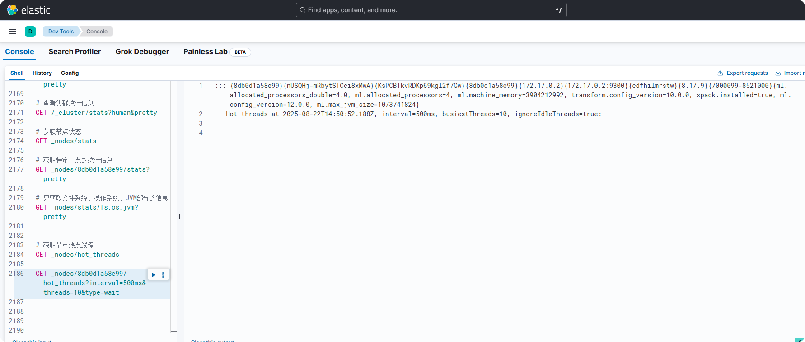

### **2.4.1.4.1 接口作用**

该接口的核心作用是识别并报告集群中节点上当前最繁忙（“最热”）的 Java 线程。

它通过对 JVM 线程堆栈进行多次采样，分析在采样间隔内哪些线程消耗了最多的 CPU 时间或花费了最多的时间在等待状态（如等待 I/O、锁等），从而帮助你找到性能瓶颈的精确代码路径。

你可以把它理解为对 Elasticsearch 节点的 “性能剖析” 或 “火焰图” 的文本版。它直接告诉你代码的“热点”在哪里。

### **2.4.1.4.2 使用场景**

在以下高级性能故障排查场景中至关重要：

1.  诊断集群间歇性延迟或卡顿：当集群偶尔变慢，但 \_nodes/stats 显示的平均 CPU、内存等指标看起来正常时，使用此命令抓取瞬时的高负载线程。
2.  定位 CPU 瓶颈：当 os.cpu.percent 持续很高时，用此命令找出是哪个具体的操作（如复杂的聚合查询、脚本计算、索引写入）吃掉了所有 CPU 资源。
3.  定位 I/O 或锁等待瓶颈：当集群响应慢，但 CPU 使用率并不高时，很可能是线程在等待磁盘 I/O 或等待锁。此命令可以确认线程是否阻塞在 wait 状态。
4.  优化慢查询：发现某个特定查询很慢，可以用此命令在其运行时进行分析，看时间具体消耗在查询解析、读取数据还是聚合计算阶段。

> 重要提示：这是一个诊断工具，而非监控工具。它的输出是文本形式，需要开发者或高级运维人员解读。不应频繁调用，仅在需要排查性能问题时使用。

### **2.4.1.4.3 输出结果分析**

头部这部分包含重要信息：

1.  节点标识：:::{8db0d1a58e99}{nUSQHj-mRbytSTCci8xMwA}{KsPCBTkvRDKp69kgI2f7Gw}...}
2.  这唯一标识了被分析的节点。包含节点 ID、名称、传输地址、IP、角色等属性。
3.  分析配置摘要：Hot threads at 2025-08-22T14:50:52.188Z, interval=500ms, busiestThreads=10, ignoreIdleThreads=true
4.  2025-08-22T14:50:52.188Z: 分析执行的时间点。
5.  interval=500ms: 使用了 500 毫秒的采样间隔。
6.  busiestThreads=10: 返回最忙的 10 个线程。
7.  ignoreIdleThreads=true: 过滤掉空闲线程，只显示活跃线程。

目前我整个集群没有热点线程，这里我找了一个完整的输出会列出多个热点线程，每个线程的格式通常如下：

\# 1. 热度指示器：'>' 的数量表示该线程的“热度”或CPU消耗的相对大小

0.9% (4.5ms out of 500ms) cpu usage by thread 'elasticsearch\[8db0d1a58e99\]\[search\]\[T#3\]'

\# 2. 线程状态：通常是 "cpu"/"wait"/"block"

10/10 snapshots sharing following 10 elements

\# 3. 最关键部分：线程的堆栈跟踪 (Stack Trace)。这告诉你代码执行到了哪里

java.lang.Thread.State: RUNNABLE

at org.elasticsearch.common.lucene.Lucene.doSearch(Lucene.java:123)

at org.elasticsearch.action.search.SearchAction.execute(SearchAction.java:456)

at org.elasticsearch.search.aggregations.bucket.terms.TermsAggregator.collectTerms(TermsAggregator.java:789)

... (更多堆栈行)

\# 4. 堆栈中最顶部的、重复出现的方法，通常就是热点所在

at java.lang.Thread.run(Thread.java:834)

1.  寻找模式：查看多个热点线程的堆栈顶部。如果它们都阻塞在同一个方法（例如，一个锁相关的 sun.misc.Unsafe.park(Native Method) 或一个磁盘 I/O 方法），这就是瓶颈的有力证据。
2.  关联操作：从线程名（如 'elasticsearch\[8db0d1a58e99\]\[search\]\[T#3\]'）可以知道这个线程在干什么（这里是 search，即处理搜索请求）。
3.  分析堆栈：堆栈跟踪显示了代码的执行路径。如果热点在 Lucene.doSearch，说明瓶颈在底层索引搜索；如果在一个特定的聚合器（如 TermsAggregator），说明一个 terms 聚合查询是昂贵的根源。

### **2.4.1.4.4 结果字段详解**

这个接口命令展示了最常用的参数：

1.  interval: 500ms。采样间隔。API 会在这段时间内多次抓取线程堆栈。更长的间隔可以捕获到更长时间内运行的线程，但也会让命令响应更慢。通常 500ms 是很好的平衡。
2.  threads: 10。要返回的热点线程数量。默认是 3，增加这个数可以获取更多候选信息，但输出也会更大。
3.  type: wait。采样类型，这是最关键参数：
4.  cpu (默认): 识别消耗最多 CPU 时间 的线程。
5.  wait: 识别处于等待状态（如等待 I/O、锁）时间最长的线程。
6.  block: 识别在同步阻塞（如等待进入同步代码块）上花费时间最长的线程。（较少使用）
7.  node\_id: 8db0d1a58e99。可以指定特定节点进行分析。

### **2.4.1.4.5 总结与建议**

GET \_nodes/hot\_threads 是解决复杂性能问题的终极武器。

1.  监控系统告警或你感知到集群变慢。
2.  使用 GET \_cat/nodes?v 或 GET \_nodes/stats 快速定位到哪个节点或哪个指标（CPU、I/O）异常。
3.  登录到该节点，执行 GET \_nodes/<node\_id>/hot\_threads?interval=500ms&threads=10&type=cpu（如果 CPU 高）或 type=wait（如果 CPU 不高但响应慢）。
4.  分析输出：寻找堆栈跟踪中的共同模式，定位到导致问题的具体 Elasticsearch 模块或操作（如搜索、索引、合并、脚本等）。
5.  采取行动：根据找到的根因采取行动，例如：
6.  优化一个昂贵的查询。
7.  调整索引策略以减少段合并。
8.  增加磁盘 I/O 能力。
9.  对数据进行分片以分散负载。

对于你的单节点开发集群，目前负载很低，可能看不到有趣的热点线程。但这个命令是你工具箱中必不可少的工具，用于应对未来可能遇到的性能挑战。

### **2.4.2 集群配置与决策**

### **2.4.2.1 集群设置 API**

​这是最强大的管理工具之一，它可以动态地修改集群运行时的配置。

\# 查看所有持久化和临时设置

GET \_cluster/settings?include\_defaults=true&pretty

\# 动态修改集群路由分配策略（立即生效，但集群重启后失效）

PUT \_cluster/settings

{

"transient": {

"cluster.routing.allocation.disk.watermark.low": "85%",

"cluster.routing.allocation.disk.watermark.high": "90%",

"cluster.routing.allocation.disk.watermark.flood\_stage": "95%"

}

}

\# 持久化修改，重启后仍有效

PUT \_cluster/settings

{

"persistent": {

"cluster.max\_shards\_per\_node": "1000"

}

}

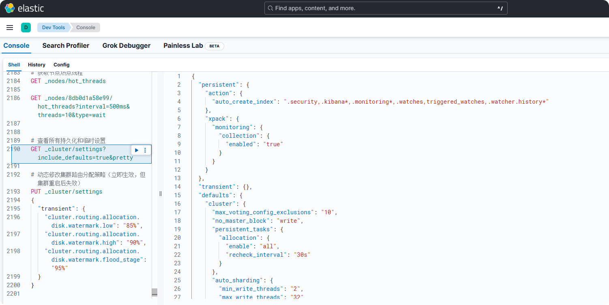

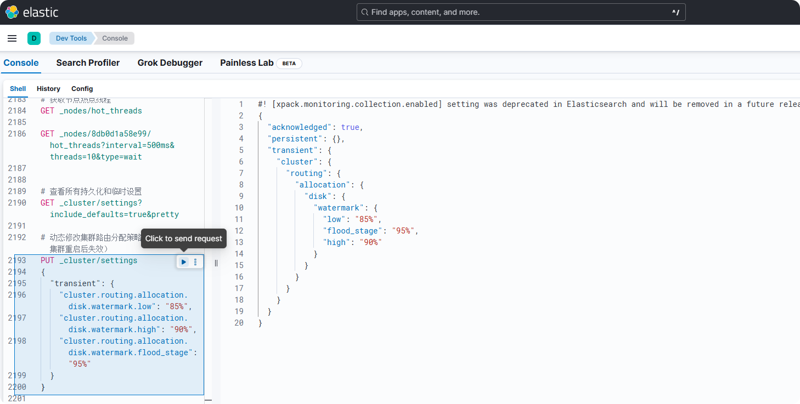

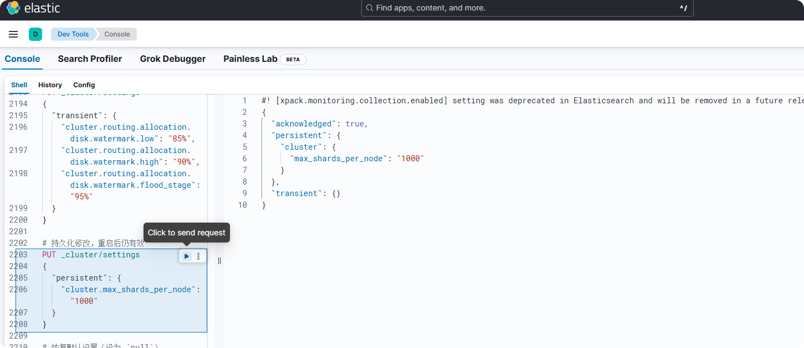

### **2.4.2.1.1 接口作用**

GET \_cluster/settings API 的核心作用是获取集群的当前配置设置。这些设置控制着集群的各种行为，从分片分配策略到安全限制等。

PUT \_cluster/settings API 的核心作用是动态地更新集群的配置，而无需重启整个集群。这是 Elasticsearch 的一个关键特性，允许运维人员在不中断服务的情况下进行调优和修复。

配置的两种类型：

1.  persistent (持久化设置)：会跨集群重启保持不变。修改后会持久化到集群状态中。
2.  transient (临时设置)：只在当前集群运行时有效。一旦集群重启，这些设置就会丢失，恢复为配置文件中的值或默认值。

### **2.4.2.1.2 使用场景**

在以下运维场景中至关重要：

1.  动态调优与故障应急：这是最主要的用途。当出现问题时，可以立即动态调整配置来缓解。例如：
2.  磁盘空间告急：动态调整 disk.watermark 水位线，阻止新数据写入或触发分片迁移。
3.  节点故障：临时禁用分片分配 (cluster.routing.allocation.enable)，防止在处理故障节点时引发不必要的分片移动风暴。
4.  性能问题：调整线程池大小、缓存类型等。
5.  配置审计与查看：使用 GET 请求查看当前生效的所有设置（包括动态修改过的），明确当前集群的运行参数。
6.  应用默认配置：使用 persistent 设置来应用一些默认配置，这些配置会被新加入的节点或新创建的索引继承，避免了手动修改每个节点配置文件的麻烦。
7.  规避重启：在生产环境中，重启集群的成本很高。此 API 提供了“热更新”关键配置的能力，极大提高了运维灵活性。

### **2.4.2.1.3 命令详解**

1.  GET \_cluster/settings?include\_defaults=true&pretty
2.  作用：获取当前集群的所有有效设置。
3.  参数 include\_defaults=true：极其有用。它不仅返回你修改过的设置，还会返回所有其他设置的默认值。这就像一个完整的配置说明书，帮你了解所有可调的参数。
4.  输出内容：它会返回三个部分：
5.  persistent: 持久化的设置。
6.  transient: 临时的设置。
7.  defaults: 所有设置的默认值（只有在 include\_defaults=true 时才会显示）。
8.  PUT \_cluster/settings (临时修改)
9.  上面的示例是最经典的应用场景之一：调整磁盘水位线以防止磁盘写满。

PUT \_cluster/settings

{

"transient": {

"cluster.routing.allocation.disk.watermark.low": "85%",

"cluster.routing.allocation.disk.watermark.high": "90%",

"cluster.routing.allocation.disk.watermark.flood\_stage": "95%"

}

}

1.  参数解释：
2.  low (85%): 当节点磁盘使用率达到此阈值，Elasticsearch 将不再分配新的分片到该节点。
3.  high (90%): 当节点磁盘使用率达到此阈值，Elasticsearch 将尝试将该节点上的现有分片迁移到其他磁盘使用率较低的节点上。
4.  flood\_stage (95%): 最高警戒线！ 达到此阈值，Elasticsearch 会将位于该节点上的所有索引强制设置为只读 (index.blocks.read\_only\_allow\_delete)，以防止磁盘写满导致节点宕机和数据损坏。
5.  为何使用 transient？：磁盘水位线调整通常是一种临时应急措施。你可能在磁盘快满时临时提高水位线（比如从默认的 85%/90%/95% 调到 90%/95%/98%）以争取处理时间。一旦你通过清理数据或扩容解决了磁盘空间问题，你会希望水位线恢复默认值。使用 transient 设置，集群重启后就会自动恢复，无需你再手动改回去。
6.  PUT \_cluster/settings (持久化修改)

PUT \_cluster/settings

{

"persistent": {

"cluster.max\_shards\_per\_node": "1000"

}

}

1.  参数解释：
2.  cluster.max\_shards\_per\_node: 限制单个节点上可以容纳的分片总数（主分片+副本分片）。这是一个重要的安全防护，防止因创建过多索引（每个索引包含多个分片）而导致节点资源（内存、文件句柄）被耗尽。
3.  为何使用 persistent？：像分片总数限制这样的参数是一个基础架构层面的决策，是一个你希望长期生效、即使集群重启也不会改变的全局策略。因此，它适合用 persistent 来设置。

### **2.4.2.1.4 总结与建议**

1.  GET \_cluster/settings: 是你的集群配置浏览器。在修改任何设置前，先用它查看当前状态；在排查问题时，用它来确认配置是否如预期。
2.  PUT \_cluster/settings: 是你的集群实时调控面板。
3.  transient: 用于临时性、应急性的调整。想象成“临时抱佛脚”。
4.  persistent: 用于长期性、基础性的配置。想象成“修改法律法规”。

> 重要提示：虽然动态修改非常强大，但错误的设置可能立即对集群造成严重影响（例如，误将 allocation.enable 设为 none 会导致新索引无法分配）。在生产环境中修改这些设置时，务必确保你理解其含义，并最好在测试环境中先验证。

### **2.4.2.2 重置路由 API**

手动干预分片的分配，慎用！但在处理未分配分片时必不可少。reroute API 在 ES 集群运维的时候经常用到，更详细的使用示例你可以参考[官方文档](https://www.elastic.co/guide/en/elasticsearch/reference/8.17/cluster-reroute.html)。

\# 查看当前分配解释，了解为什么某个分片未分配

GET \_cluster/allocation/explain?pretty

\# 手动将一个未分配的分片分配到一个特定节点

POST \_cluster/reroute

{

"commands": \[

{

"allocate\_stale\_primary": {

"index": "logs-app-prod-2025.08.21-000001",

"shard": 0,

"node": "8db0d1a58e99",

"accept\_data\_loss": true // 注意！此操作可能导致数据丢失

}

},

{

"move": {

"index": "logs-app-prod-2025.08.21-000001",

"shard": 1,

"from\_node": "8db0d1a58e99",

"to\_node": "8db0d1a58e99"

}

}

\]

}

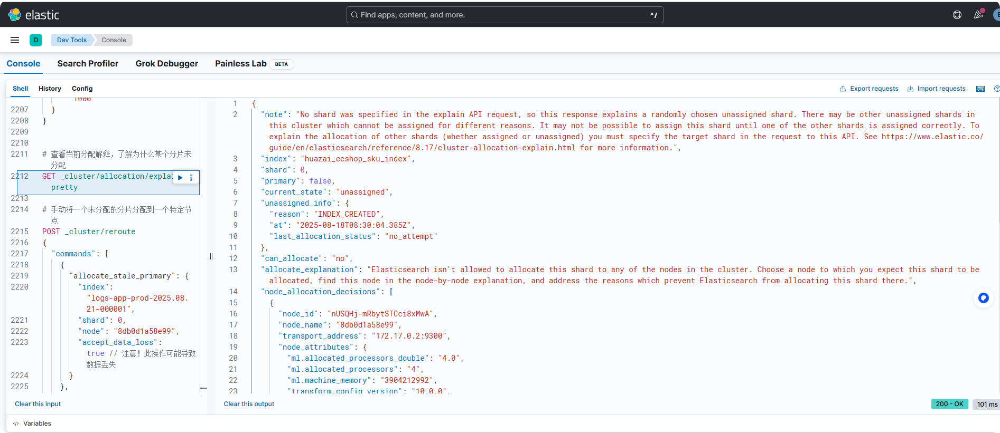

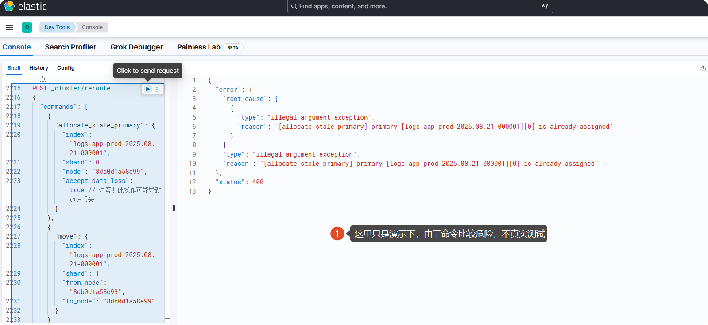

> 警告​：allocate\_\* 命令非常危险，仅在明确知道数据可能丢失且必须恢复服务时才使用。

### **2.4.2.2.1 接口作用**

这是 Elasticsearch 集群运维中最强大、最危险，但也最能解决棘手问题的两个 API，它们用于深度诊断和手动修复分片分配问题。

1.  GET \_cluster/allocation/explain - 分片分配“诊断专家。核心作用是让 Elasticsearch 告诉你，为什么一个特定的分片没有被分配到集群中的任何节点上。
2.  它会返回一份极其详细的“诊断报告”，其中包含 Elasticsearch 分配器（allocator）的决策逻辑，明确解释它无法分配该分片的确切原因。
3.  POST \_cluster/reroute - 分片分配“外科手术刀”。核心作用是手动干预分片的分配过程，强制将分片移动到特定节点或强制分配未分配的分片。
4.  这是最高权限的操作，允许你覆盖 Elasticsearch 的自动分配决策。能力越大，责任越大，风险也越大。

### **2.4.2.2.2 使用场景**

1.  GET \_cluster/allocation/explain 使用场景：
2.  深度故障排查：当 \_cluster/health 显示 unassigned\_shards > 0（集群状态为 Yellow 或 Red），但原因不明时，这是你的首要诊断工具。
3.  理解分配决策：在你手动干预（如 \_reroute）之前，必须先用此命令弄清楚根本原因。盲目操作可能导致数据丢失或让问题变得更糟。
4.  验证配置：在修改了分配规则（如磁盘水位线、感知属性）后，用它来验证新的设置是否允许分片被分配。
5.  POST \_cluster/reroute 使用场景：
6.  紧急恢复：在特定场景下（如主分片因节点宕机而无法分配），手动强制分配一个分片，使集群恢复可用性（可能以数据丢失为代价）。
7.  平衡优化：手动将分片从负载过高的节点移动到负载较低的节点，以实现更均衡的分布（通常让 Elasticsearch 自动完成更好）。
8.  运维操作：在节点下线或升级前，手动将分片移出该节点，实现零停机维护。

### **2.4.2.2.3 用法与结果分析**

1.  不带参数调用：GET \_cluster/allocation/explain?pretty
2.  Elasticsearch 会随机选择一个未分配的分片并进行解释。这是一个很好的快速检查方式。
3.  带参数调用（更常用）：你可以指定要诊断的特定分片。

GET \_cluster/allocation/explain?pretty

{

"index": "your\_unassigned\_index\_name",

"shard": 0,

"primary": true // 是诊断主分片还是副本分片

}

1.  输出解读（你需要关注的关键信息）诊断报告会非常详细，但你需要寻找这些部分：
2.  decision: 最终决策，通常是 NO、THROTTLE 或 YES。
3.  explanation: 用人类可读的文字解释为什么是此决策。这是最直接的原因，例如：
4.  "cannot allocate because allocation is not permitted to any of the nodes" (不允许分配给任何节点)
5.  "the node is above the high watermark cluster setting \[cluster.routing.allocation.disk.watermark.high=90%\]" (节点磁盘空间超过高水位线)
6.  "node does not match index setting \[index.routing.allocation.include\] filters" (节点不匹配索引的分配规则)
7.  node\_allocation\_decisions: 对每个候选节点的详细评估。你会看到为什么每个节点都被拒绝，例如：
8.  "node\_temporary\_disabled" (节点临时禁用)
9.  "cannot allocate due to too many shards on the node" (节点分片数已达上限)

1.  POST \_cluster/reroute allocate\_stale\_primary (极其危险！)

{

"allocate\_stale\_primary": {

"index": "logs-app-prod-2025.08.21-000001",

"shard": 0,

"node": "8db0d1a58e99",

"accept\_data\_loss": true // 这个参数的名字就说明了其危险性！

}

}

1.  作用：强制将一个未分配的主分片分配到一个指定节点。 这个操作会丢弃该节点上可能存在的过时数据副本，并将其提升为新的主分片。
2.  使用场景：仅在最后手段时使用！ 当拥有主分片最新数据的原始节点永久丢失且无法恢复时，你希望集群恢复可用性，并明确接受自上次副本刷新以来可能丢失的数据。
3.  风险：accept\_data\_loss: true 意味着你明确告知 Elasticsearch “我理解并接受这个操作可能导致数据丢失”。如果集群中其他地方存在一个更新的副本，这个操作会用它覆盖掉旧数据。
4.  POST \_cluster/reroute move

{

"move": {

"index": "logs-app-prod-2025.08.21-000001",

"shard": 1,

"from\_node": "node-id-1",

"to\_node": "node-id-2"

}

}

1.  作用：将一个已分配的分片从一个节点移动到另一个节点。
2.  使用场景：相对安全。用于手动重新平衡负载或为维护做准备。在你的示例中 from\_node 和 to\_node 是同一个节点，这没有意义，可能是个笔误。
3.  另一个常用命令：allocate\_replica

{

"allocate\_replica": {

"index": "my\_index",

"shard": 0,

"node": "target-node-id"

}

}

1.  作用：强制将一个未分配的副本分片分配到指定节点。这比 allocate\_stale\_primary 安全得多，因为它只是从现有的主分片复制数据。

### **2.4.2.2.4 总结与建议**

这两个 API 构成了处理分片分配问题的标准工作流：

1.  发现问题：通过 GET \_cluster/health 发现集群状态为 yellow 或 red，存在未分配的分片。
2.  诊断原因：使用 GET \_cluster/allocation/explain 查明分片未分配的确切原因（是磁盘满了？没有符合规则的节点？）。
3.  解决根本问题：首先尝试解决根本原因（如清理磁盘空间、修改分配规则、重启故障节点）。这是最安全的方法。
4.  谨慎执行手动分配（最后手段）：如果无法自动解决（例如，原始数据节点永久丢失），则：
5.  使用 POST \_cluster/reroute 进行手动干预。
6.  优先使用 allocate\_replica。
7.  极端谨慎地使用 allocate\_stale\_primary，仅在万不得已且明确接受数据丢失风险时使用。
8.  验证结果：操作后，再次使用 \_cluster/health 和 \_allocation/explain 验证分片是否已成功分配。

> 对你的单节点集群而言：你看到的未分配分片都是副本分片。你不应该使用 allocate\_stale\_primary，而应该使用 allocate\_replica 命令，或者更简单直接地，将索引的 number\_of\_replicas 设置为 0 来从根本上解决问题。手动将副本分片分配到唯一节点是违反 Elasticsearch 默认设计的，可能无法成功。