从今天之后的一段时间内，华仔会带着大家一起来从零开始对 ElasticStack 矩阵产品进行深入剖析和项目运维实战，希望大家学完之后可以用到自己的工作中。

这是第六篇，本篇我将带着大家进行「**ES 索引别名深度实战**」。

文章汇总位置：[https://wx.zsxq.com/dweb2/index/columns/51122554151214](https://wx.zsxq.com/dweb2/index/columns/51122554151214)

## **01 前言**

在上篇中[【ES 入门实战第五篇】ES 索引 Mapping 常用字段类型、 高级字段类型深度实战](https://articles.zsxq.com/id_fz3g0ox1fex2.html)，带着大家进行实战「**ES 索引 Mapping 常用字段类型、 高级字段类型深度实战**」。

今天我们来进行「**ES 索引别名深度实战**」。

##   
**02 ES 索引别名深度实战**

## **2.1 ES 索引别名深度实战**

索引别名是Elasticsearch架构中最为巧妙和强大的功能之一，它深刻地体现了“解耦”的思想，是构建稳健、可扩展、易维护的ES集群的基石。

「**索引别名**」（alias）默认等同于「**索引名称**」，索引是一个逻辑的虚拟空间，「**索引别名**」则是在索引之上的又一层虚拟的「**空间**」。

  
核心特性：

1.  一个别名可以指向一个或多个索引。
2.  一个索引可以有多个别名。
3.  别名可以在不停机的情况下，原子性地切换所指向的索引。

### **2.1.1 ES 索引别名工作原理**

它允许我们在不更改查询代码的情况下，轻松地更改索引的映射或重新索引数据。别名的工作原理非常简单：它只是在 Elasticsearch 内部维护了一个从别名到索引名称的映射关系。当客户端向一个别名发起请求时，Elasticsearch 会自动将请求路由到该别名对应的索引上。

1.  存储位置：别名信息与索引的映射（Mapping）、设置（Settings）一起，存储在集群状态（Cluster State）中。集群状态由主节点（Master Node）管理并同步到所有节点。
2.  解析过程：当一个请求到达一个协调节点时：
3.  协调节点会查看集群状态。
4.  解析请求中的别名，将其扩展为实际的一个或多个索引名称。
5.  然后根据路由策略、过滤条件等，将请求转发到相应的分片。
6.  原子性保证：\_aliases API 的原子性体现在，它执行的所有操作（如多次 add 和 remove）会作为「**一个整体**」被应用到集群状态上。集群状态的一次变更（Publish）是原子的，这意味着所有节点都会在同一时刻看到别名指向的新索引集合，不会出现有的节点看到旧映射、有的节点看到新映射的中间状态。这正是实现零停机切换的基础。
7.  性能开销：使用别名「**几乎没有额外的性能开销**」。因为别名的解析发生在请求的最开始阶段（协调节点处理阶段），一旦解析出真正的索引名，后续的搜索、聚合过程与直接使用索引名没有任何区别。「**过滤别名**」可能会增加一点点查询 DSL 的复杂度，但这是在协调节点上完成的，不影响底层分片的执行效率。

### **2.1.2 ES 索引别名应用场景**

1.  版本控制：实现索引映射或设置的零停机变更
2.  在 Elasticsearch 中，索引的映射和设置也可能随着需求的变化而发生变化。为了确保查询的正确性和一致性，我们可以使用别名来实现索引的版本控制。具体做法是：当索引的映射或设置发生更改时，我们创建一个新索引，并将其别名为旧索引的名称。这样查询代码可以继续使用旧索引名称，而实际上查询的是新索引。通过这种方式，我们可以实现无缝的版本切换，确保查询始终返回正确的结果。
3.  索引拆分：解决单个大索引性能问题
4.  随着数据的不断增长，单个索引可能会变得过大，导致查询性能下降。为了提高查询性能，我们可以考虑将大索引拆分为多个小索引。然而，拆分索引会带来一个问题：如何在查询时同时访问这些小索引？这时，别名就派上了用场。我们可以为每个小索引分配一个别名，然后使用一个统一的别名来引用这些小索引。这样，查询代码只需要使用统一的别名，就可以同时访问所有小索引，而无需知道底层索引的结构。
5.  滚动更新：处理时间序列数据的自动滚动更新
6.  在一些需要定期更新索引的场景中，如日志分析、实时数据分析等，我们可以使用别名来实现滚动更新。具体做法是：创建一个新索引来存储最新数据，并将其别名为当前索引。随着时间的推移，我们可以逐渐将旧数据迁移到新索引中，并最终删除旧索引。通过这种方式，我们可以实现滚动更新，确保查询始终返回最新数据。同时，由于别名的存在，查询代码不需要做任何修改，就可以自动切换到新索引。

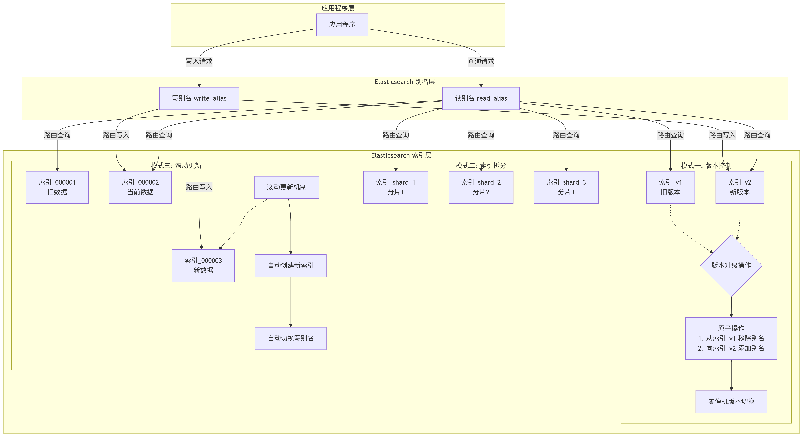

### **2.1.3 ES 索引别名深度实战**

### **2.1.3.1 alias 别名创建**

通过 Mapping 方式创建别名，创建 Mapping 索引，这里是静态 Mapping：

DELETE huazai-test-20250803

PUT huazai-test-20250803

{

"settings": {

"number\_of\_shards": 4,

"number\_of\_replicas": 0

},

"aliases": {

"huazai-test": {}

}

}

  
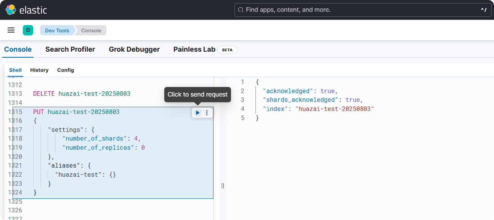

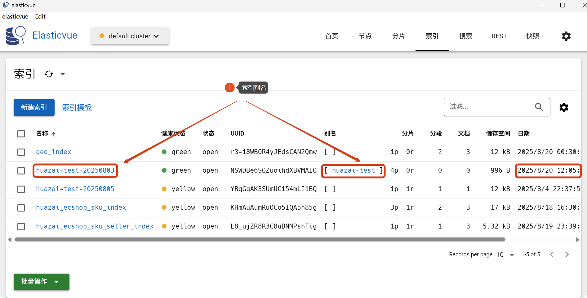

通过索引别名方式写入数据：

PUT huazai-test/\_doc/6

{

"name": "华仔6",

"sex": "男",

"age": "40",

"desc":"公众号:华仔聊技术、知识星球:华仔和他的朋友们主理人"

}

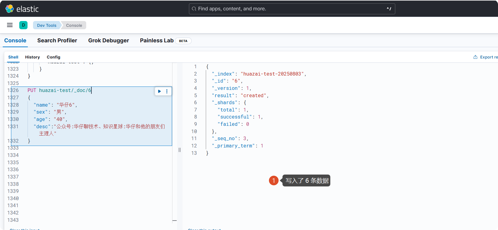

\# 通过别名来查询

GET huazai-test/\_search

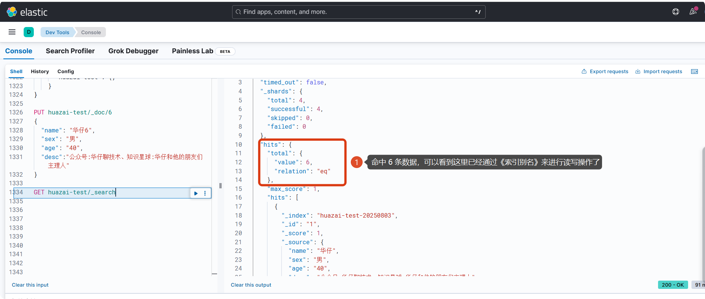

### **2.1.3.2 \_alias 别名创建**

通过 alias 方式创建别名：

PUT huazai-test-20250803/\_alias/huazai-test2

  
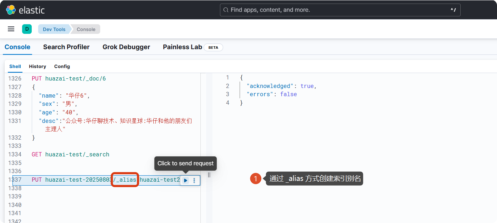

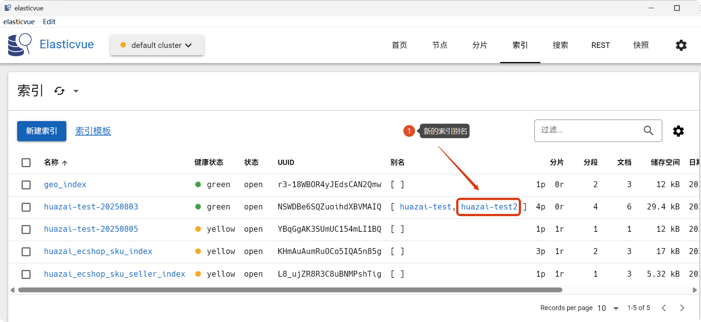

通过 huazai-test2 新的别名写入和查询数据：

PUT huazai-test2/\_doc/8

{

"name": "华仔8",

"sex": "男",

"age": "40",

"desc":"公众号:华仔聊技术、知识星球:华仔和他的朋友们主理人"

}

GET huazai-test2/\_search

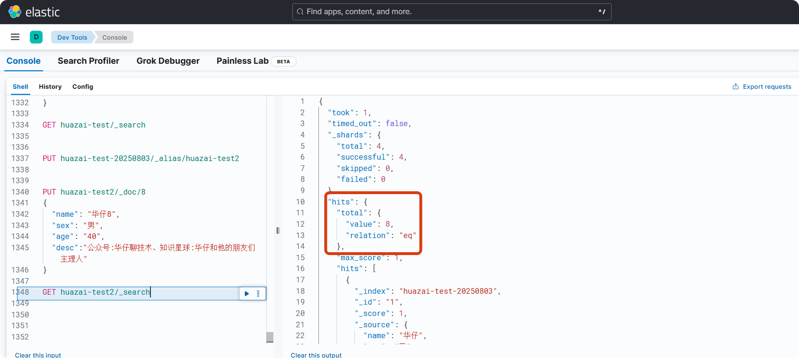

### **2.1.3.2 alias 别名删除**

删除别名很简单：

\# 删除别名

DELETE huazai-test-20250803/\_alias/huazai-test2

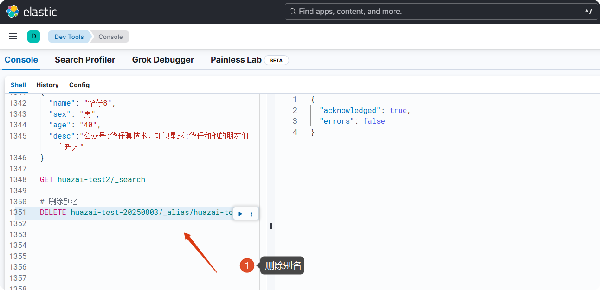

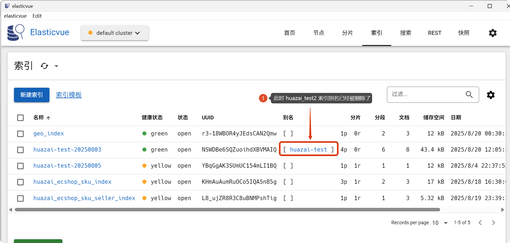

### **2.1.3.3 alias 别名查看**

两种查看方式：

1.  \_cat 命令。
2.  \_alias 命令。

### **1、查看所有的索引别名**

GET /\_alias

GET /\_cat/aliases?v=true

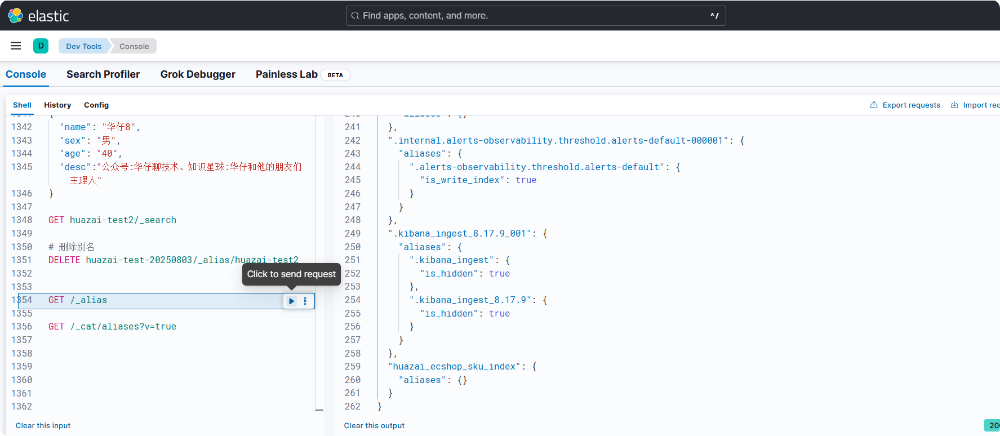

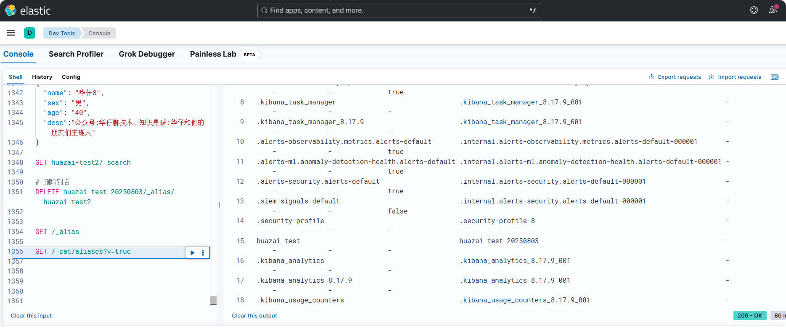

### **2、查看单个的索引别名**

\# 查看单个索引别名

GET /\_alias/huazai-test

\# 查看索引下绑定的所有索引别名

GET huazai-test-20250803/\_alias

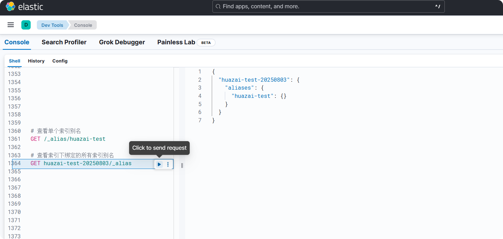

### **2.1.3.4 alias 别名批次操作**

上面的创建索引别名和删除别名的常规操作会有一定的问题，由于命令之间操作有时间间隔，所以可能在操作过程中会有数据写入失败/查询失败的误差情况出现，我们需要通过 \_alias 命令的 add/remove 进行别名批次操作：

\# 删除绑定的别名

DELETE huazai-test-20250803/\_alias/huazai-test

\# 删除索引

DELETE huazai-test-20250803

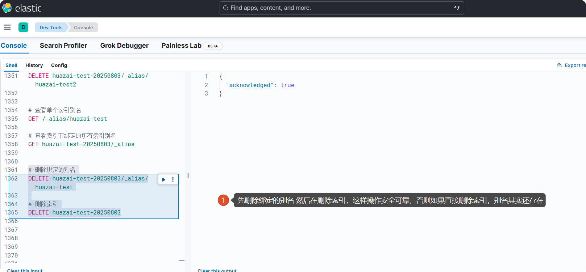

创建 Mapping：

PUT huazai-test-20250803

{

"settings": {

"number\_of\_shards": 4,

"number\_of\_replicas": 0

},

"mappings": {}

}

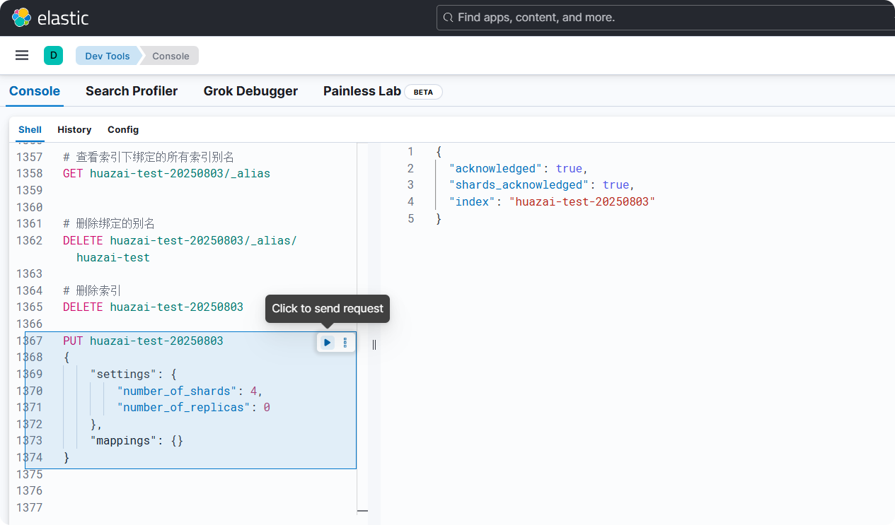

接着，我们来进行别名批次操作：

POST \_aliases

{

"actions": \[

{

"add": {

"index": "huazai-test-20250803",

"alias": "huazai-test3"

}

},

{

"remove": {

"index": "huazai-test-20250805",

"alias": "huazai-test5"

}

}

\]

}

\# 结果

{

"acknowledged": true,

"errors": true,

"action\_results": \[

{

"action": {

"type": "add",

"indices": \[

"huazai-test-20250803"

\],

"aliases": \[

"huazai-test3"

\]

},

"status": 200

},

{

"action": {

"type": "remove",

"indices": \[

"huazai-test-20250805"

\],

"aliases": \[

"huazai-test5"

\]

},

"status": 404, \# 可以看到 huazai-test-20250805 删除索引别名失败，因为根本就不存在

"error": {

"type": "aliases\_not\_found\_exception",

"reason": "aliases \[huazai-test5\] missing",

"resource.type": "aliases",

"resource.id": "huazai-test5"

}

}

\]

}

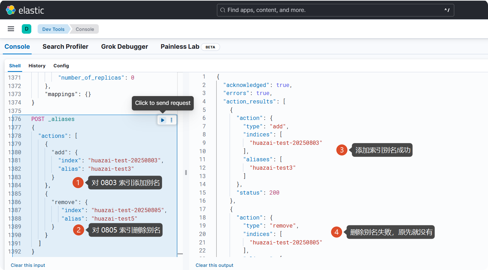

查看索引别名添加/删除情况：

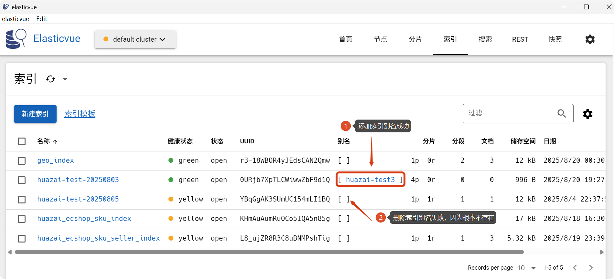

拿真实业务场景比如我们小红书电商项目中订单场景，在线服务不能有明显的停顿，此时就需要先「**创建一个新索引，把历史数据归档数据都放到新索引中，同时新建别名指向这个新索引，然后对旧索引进行删除别名**」，就会用到上面的这个操作来平滑迁移。

POST \_aliases

{

"actions": \[

{

"add": {

"index": "huazai-test-20250805",

"alias": "huazai-test3"

}

},

{

"remove": {

"index": "huazai-test-20250803",

"alias": "huazai-test3"

}

}

\]

}

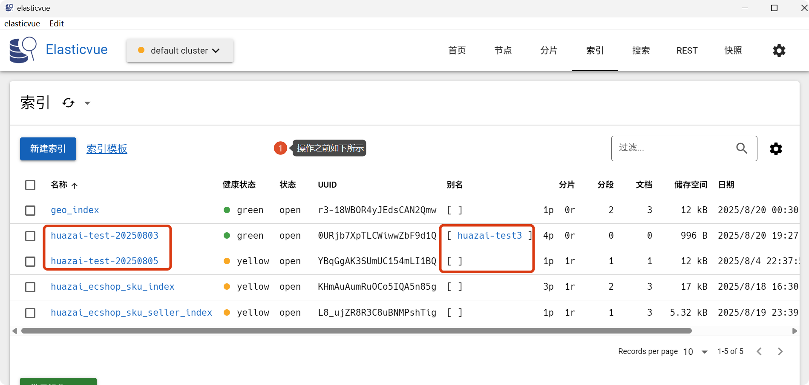

执行批次别名操作：

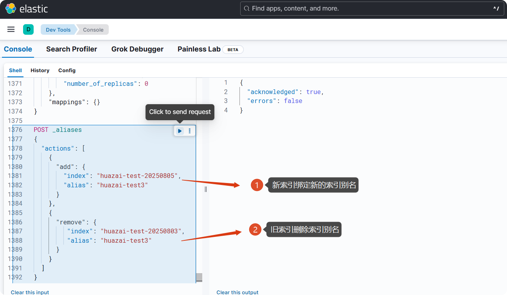

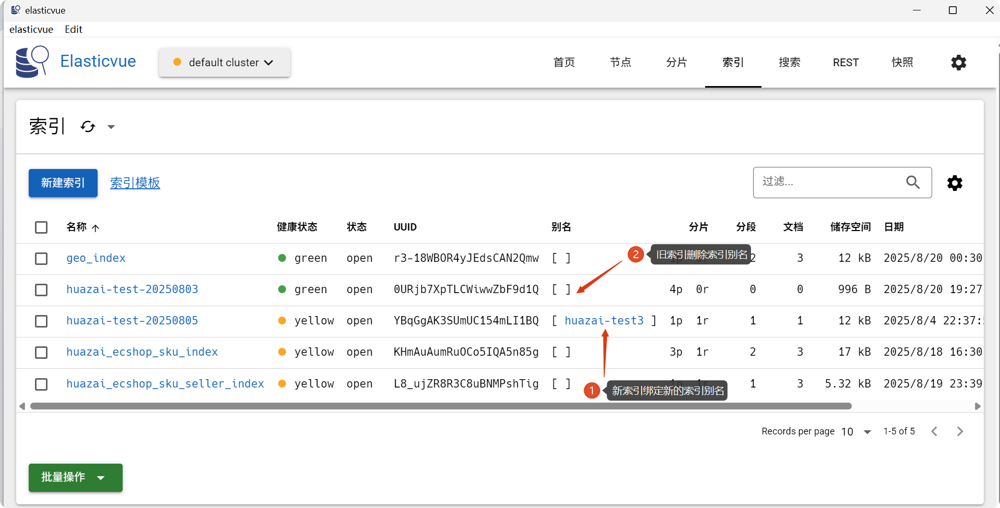

### **2.1.3.5 索引别名读写控制**

**需要特别注意的是：**如果多个索引绑定同一个别名时，用别名写入数据会报错，无法写入，如下：

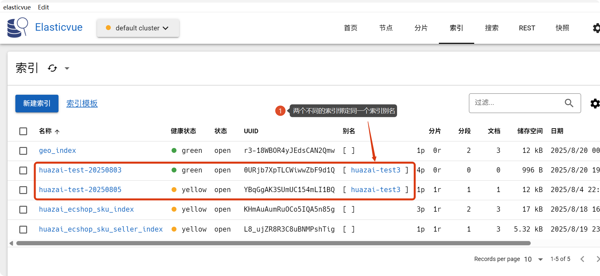

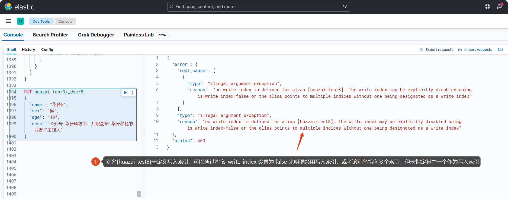

此时，我们可以通过别名的读写控制方式来操作：

\# 删除索引

DELETE huazai-test-20250803

PUT huazai-test-20250803

{

"settings": {

"number\_of\_shards": 4,

"number\_of\_replicas": 0

},

"mappings": {}

}

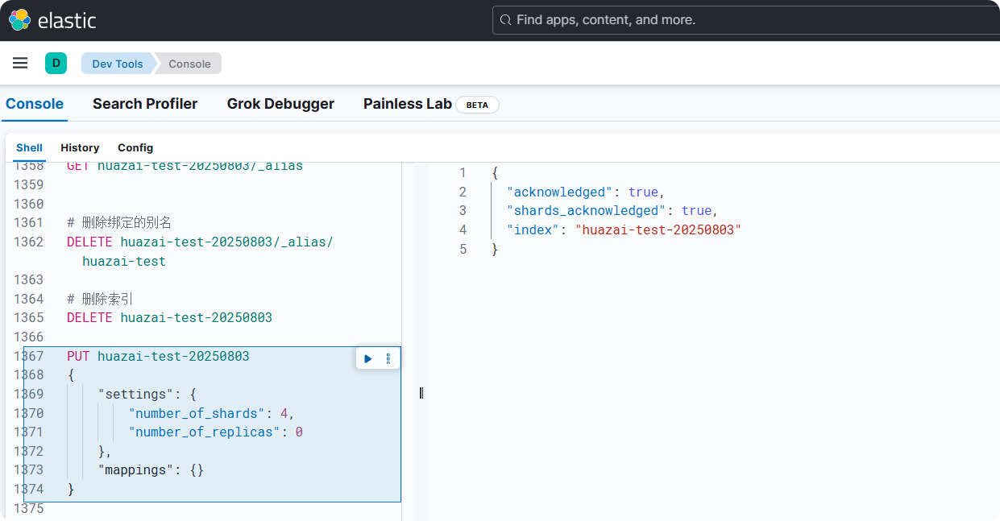

一个非常经典的最佳实践：为 huazai-test-20250803 索引「**写入操作**」和「**读取操作**」绑定不同的别名：

POST \_aliases

{

"actions": \[

{

"add": {

"index": "huazai-test-20250803",

"alias": "huazai\_test\_read",

"is\_write\_index": false

}

},

{

"add": {

"index": "huazai-test-20250803",

"alias": "huazai\_test\_write"

}

}

\]

}

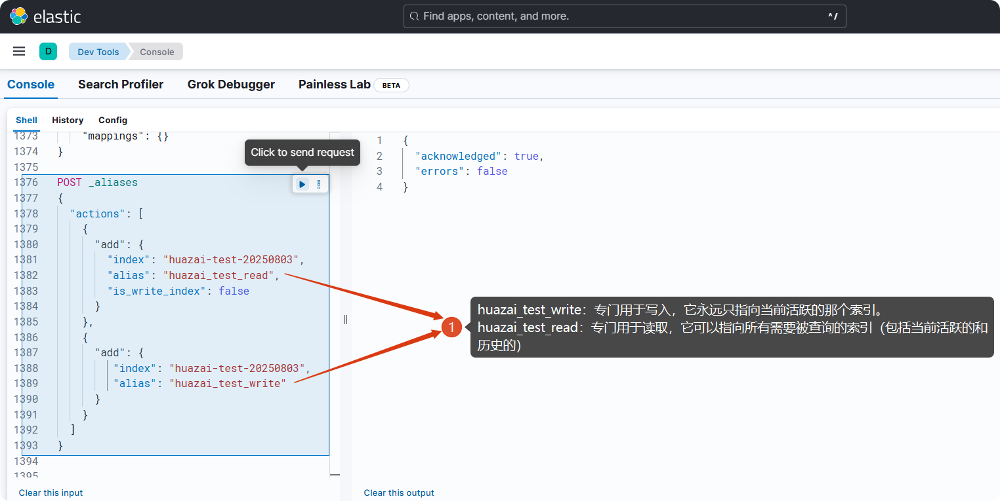

这样做的好处是职责分离，在需要重建索引切换时，你只需要操作 huazai\_test\_write 的指向，而 huazai\_test\_read 的指向范围可以保持不变或灵活调整。

  
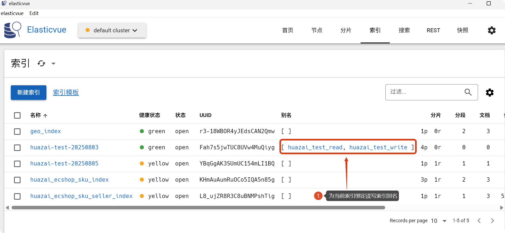

此时，只有「**写索引别名**」可以正常写入，而「**读索引别名**」无法正常写入，验证了小节开头的报错：

PUT huazai\_test\_read/\_doc/1

{

"name": "华仔",

"sex": "男",

"age": "40",

"desc":"公众号:华仔聊技术、知识星球:华仔和他的朋友们主理人"

}

PUT huazai\_test\_write/\_doc/1

{

"name": "华仔",

"sex": "男",

"age": "40",

"desc":"公众号:华仔聊技术、知识星球:华仔和他的朋友们主理人"

}

  
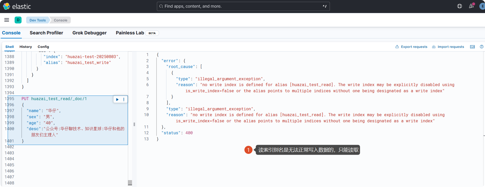

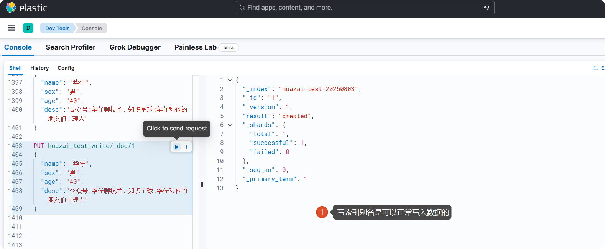

### **2.1.3.6 索引别名查询过滤**

索引别名不仅仅是名字，还可以携带「**元数据**」和「**行为**」。

这里我们来实现一个简单的数据隔离，比如「**多租户**」场景中，为每个租户提供一个带过滤条件的别名，让他们以为自己只有一个独立的索引。

\# 删除索引

DELETE huazai-test-20250803

PUT huazai-test-20250803

{

"settings": {

"number\_of\_shards": 4,

"number\_of\_replicas": 0

},

"mappings": {

"dynamic": false, \# 限制了索引 mapping 的动态设置

"properties": {

"name": {

"type": "keyword"

}

}

}

}

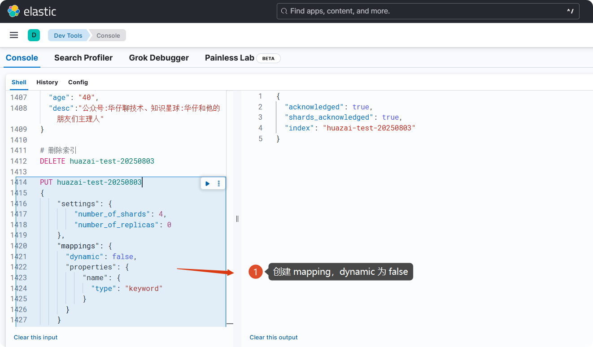

接着，创建索引别名，设置过滤条件：

\# 创建别名，设置过滤条件

POST \_aliases

{

"actions": \[

{

"add": {

"index": "huazai-test-20250803",

"alias": "huazai\_test\_1",

"is\_write\_index": true,

"filter": {

"term": {

"name": "华仔1"

}

}

}

},

{

"add": {

"index": "huazai-test-20250803",

"alias": "huazai\_test\_2",

"is\_write\_index": true,

"filter": {

"term": {

"name": "华仔2"

}

}

}

}

\]

}

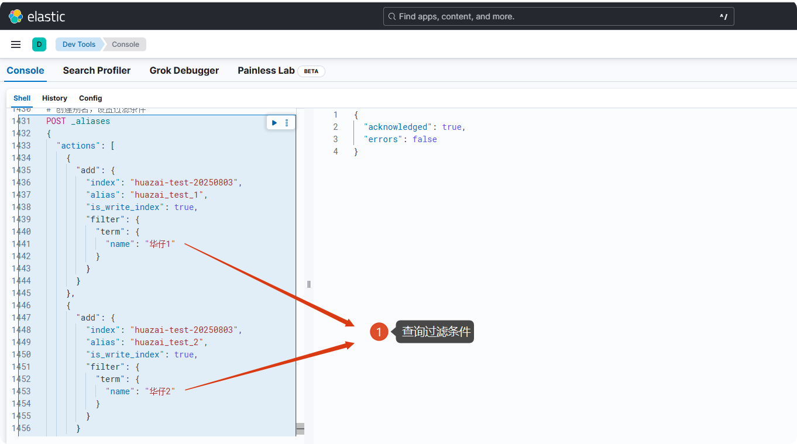

接着，写入两条数据：

PUT huazai\_test\_1/\_doc/1

{

"name": "华仔1",

"sex": "男",

"age": "40",

"desc":"公众号:华仔聊技术、知识星球:华仔和他的朋友们主理人"

}

PUT huazai\_test\_1/\_doc/2

{

"name": "华仔2",

"sex": "男",

"age": "40",

"desc":"公众号:华仔聊技术、知识星球:华仔和他的朋友们主理人"

}

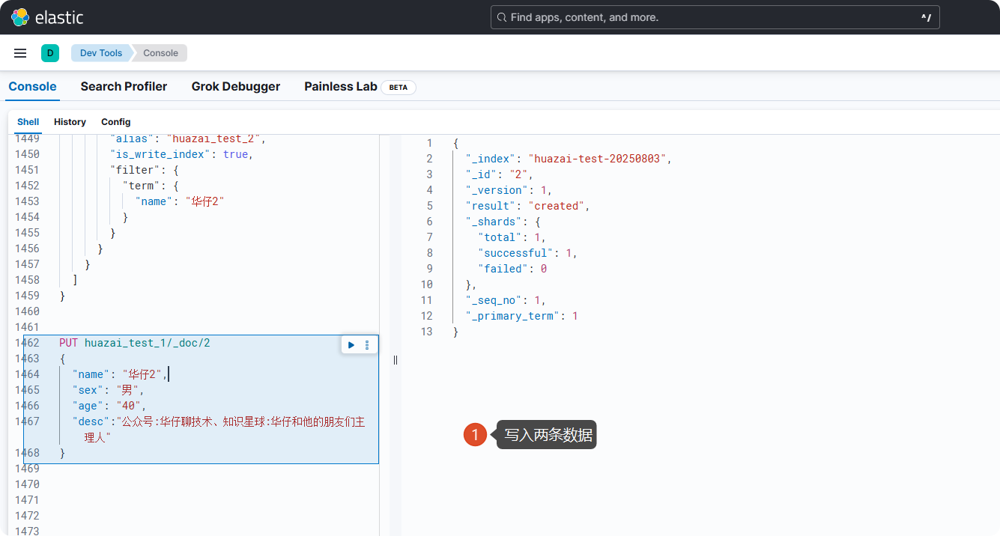

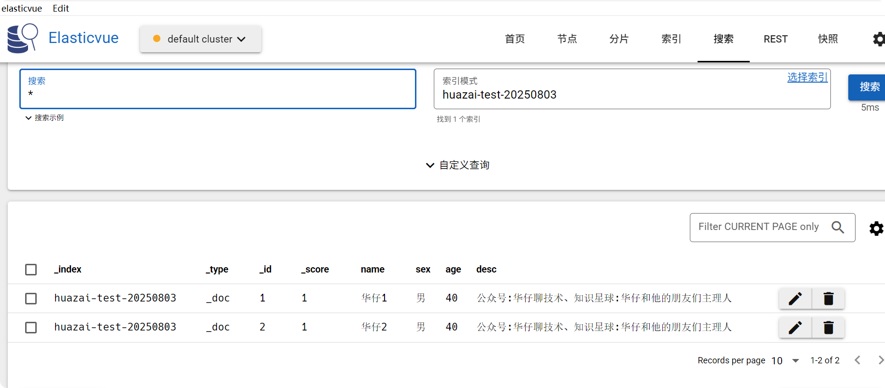

最后，我们来查询下数据：

\# 按照索引查询所有数据

GET huazai-test-20250803/\_search

\# 按照别名1查询对应的数据

GET huazai\_test\_1/\_search

\# 按照别名2查询对应的数据

GET huazai\_test\_2/\_search

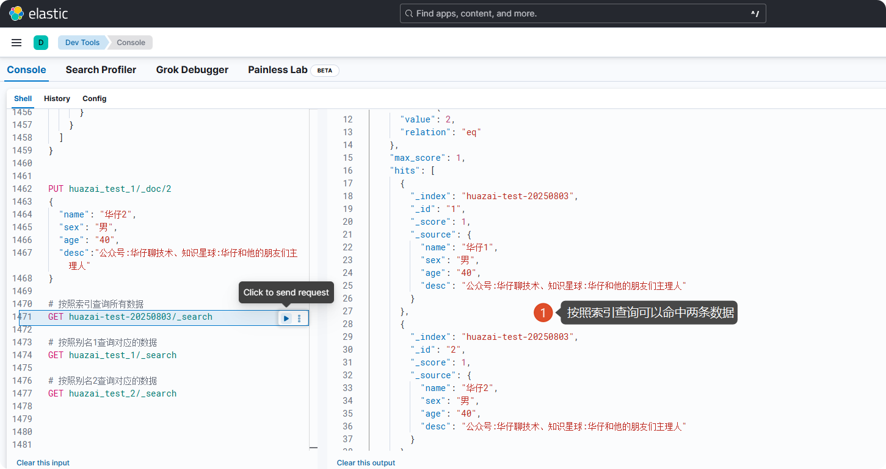

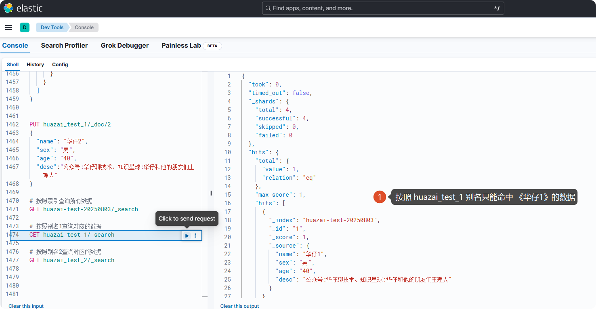

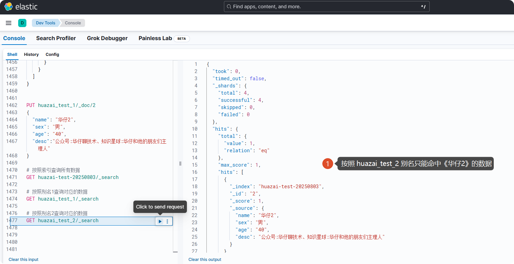

### **2.1.3.7 索引别名路由代理**

ES 数据底层存储是基于分片的，数据的写入分布需要根据「**路由**」路由选择对应的分片，查询也可以通过「**路由**」筛选做到「**数据隔离**」，「**性能隔离**」等。

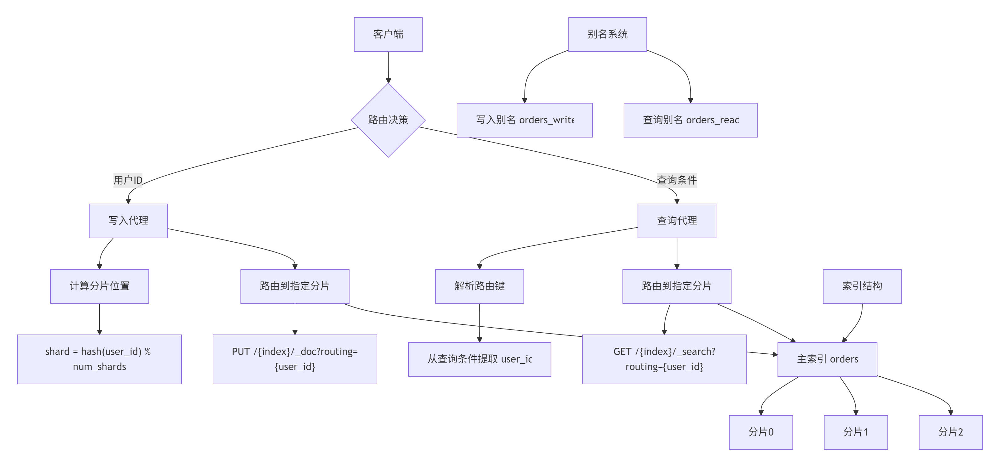

我们来实现将「**写入**」和「**查询**」路由到指定的分片中，这样可以优化查询性能，确保同一类数据（如同一用户ID的数据）都落在同一个分片上，避免查询时广播到所有分片。

下面针对中国华北、华南、华东、华中四个区域的用户数据的 ES 索引别名路由代理示例：

\# 创建区域用户索引

PUT /users\_region\_v1

{

"settings": {

"number\_of\_shards": 6,

"number\_of\_replicas": 1,

"index.routing\_partition\_size": 1

},

"mappings": {

"properties": {

"user\_id": {

"type": "keyword"

},

"name": {

"type": "text",

"analyzer": "ik\_max\_word",

"search\_analyzer": "ik\_smart"

},

"phone": {

"type": "keyword"

},

"region": {

"type": "keyword" \# 存储区域代码: north\_china, south\_china, east\_china, central\_china

},

"province": {

"type": "keyword" \# 存储具体省份

},

"city": {

"type": "keyword"

},

"registration\_date": {

"type": "date"

},

"last\_login": {

"type": "date"

}

}

}

}

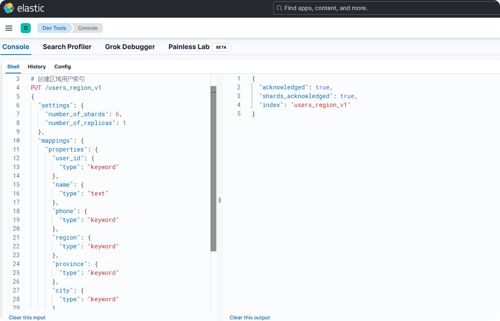

看下索引分片和副本的分布：

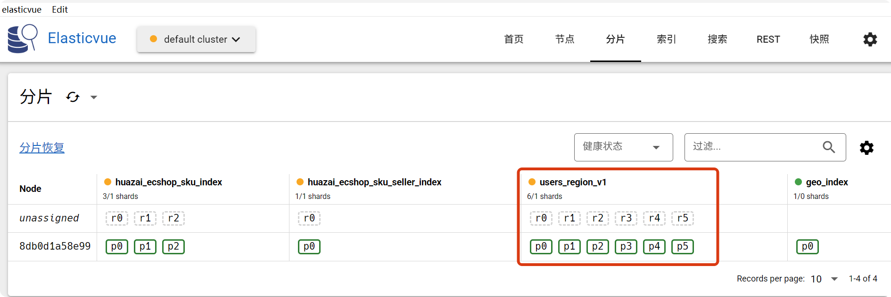

接着，创建各区域查询别名：

\# 华北地区用户别名

POST /\_aliases

{

"actions": \[

{

"add": {

"index": "users\_region\_v1",

"alias": "users\_north\_china",

"filter": {

"term": {

"region": "north\_china"

}

},

"routing": "north\_china"

}

}

\]

}

\# 华南地区用户别名

POST /\_aliases

{

"actions": \[

{

"add": {

"index": "users\_region\_v1",

"alias": "users\_south\_china",

"filter": {

"term": {

"region": "south\_china"

}

},

"routing": "south\_china"

}

}

\]

}

\# 华东地区用户别名

POST /\_aliases

{

"actions": \[

{

"add": {

"index": "users\_region\_v1",

"alias": "users\_east\_china",

"filter": {

"term": {

"region": "east\_china"

}

},

"routing": "east\_china"

}

}

\]

}

\# 华中地区用户别名

POST /\_aliases

{

"actions": \[

{

"add": {

"index": "users\_region\_v1",

"alias": "users\_central\_china",

"filter": {

"term": {

"region": "central\_china"

}

},

"routing": "central\_china"

}

}

\]

}

  
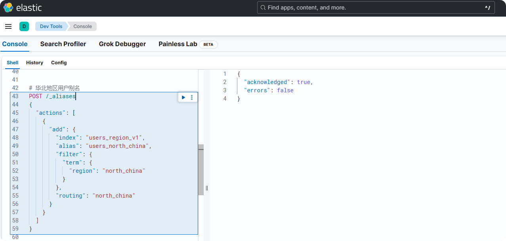

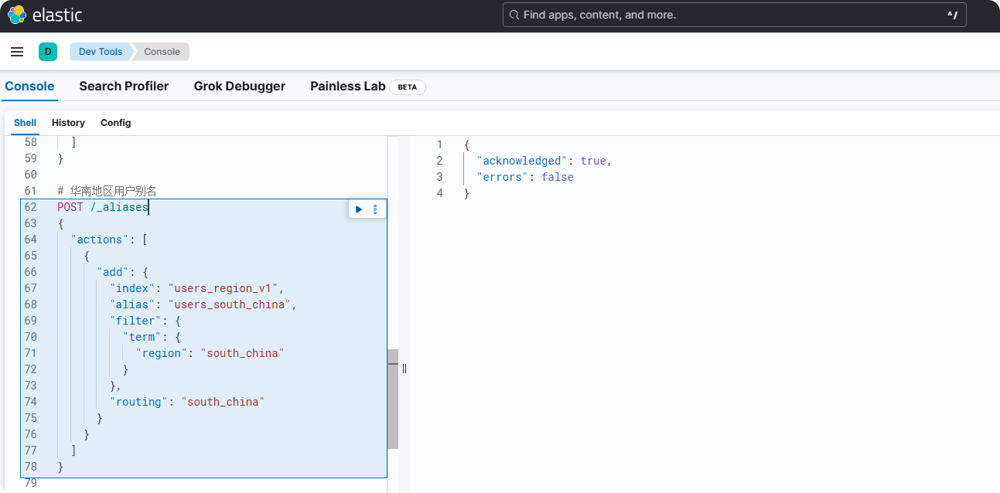

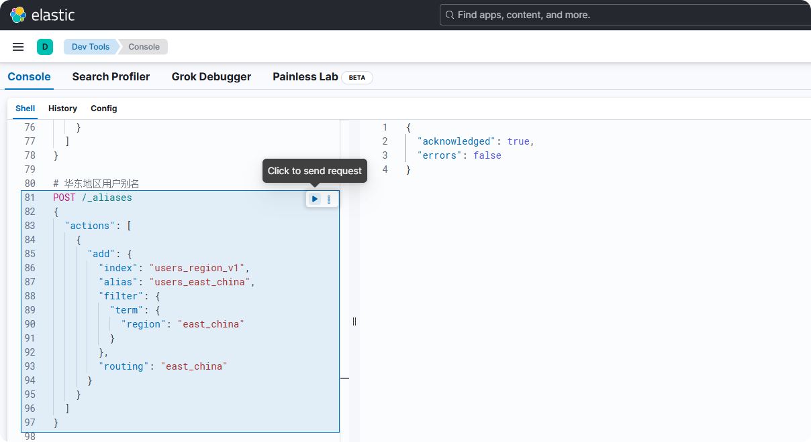

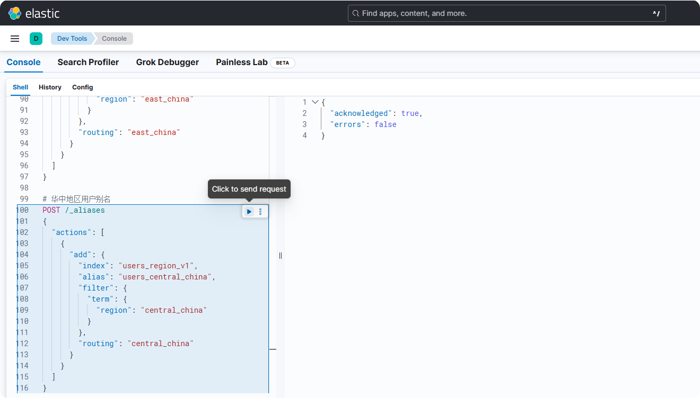

接着，创建通用查询和写入别名：

\# 创建查询所有区域用户的别名

POST /\_aliases

{

"actions": \[

{

"add": {

"index": "users\_region\_v1",

"alias": "users\_all\_regions"

}

}

\]

}

\# 创建写入别名

POST /\_aliases

{

"actions": \[

{

"add": {

"index": "users\_region\_v1",

"alias": "users\_write",

"is\_write\_index": true

}

}

\]

}

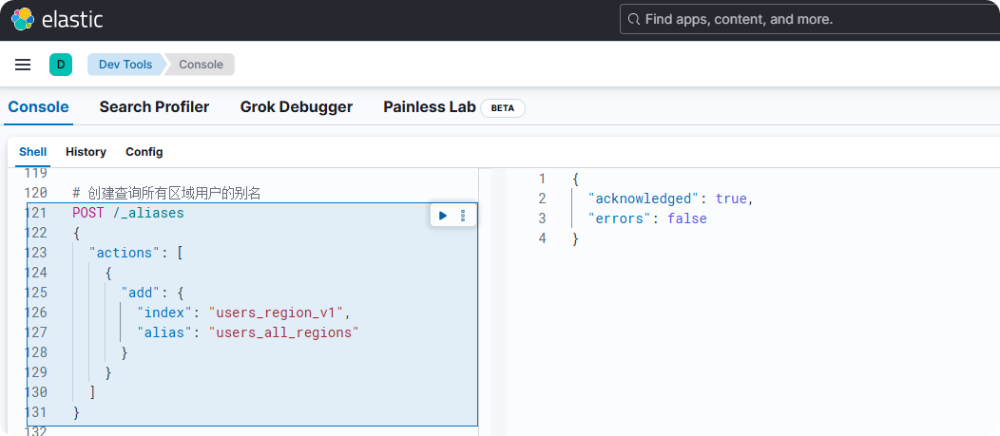

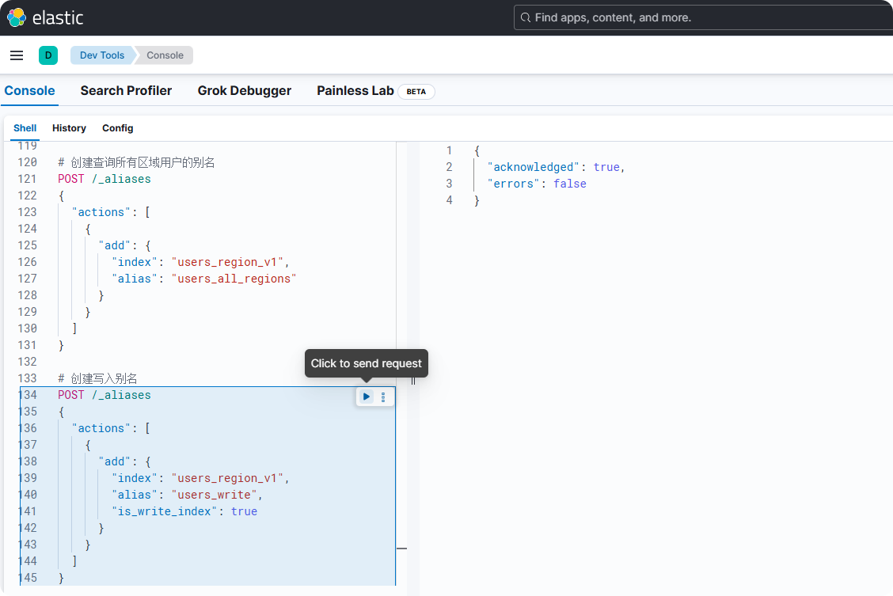

接着，写入索引区域用户数据：

\# 华北地区用户示例 - 北京用户

PUT /users\_write/\_doc/1001?routing=north\_china

{

"user\_id": "user\_1001",

"name": "张三",

"phone": "13800138001",

"region": "north\_china",

"province": "北京市",

"city": "北京市",

"registration\_date": "2025-08-21",

"last\_login": "2025-08-21"

}

\# 华北地区用户示例 - 天津用户

PUT /users\_write/\_doc/1002?routing=north\_china

{

"user\_id": "user\_1002",

"name": "李四",

"phone": "13800138002",

"region": "north\_china",

"province": "天津市",

"city": "天津市",

"registration\_date": "2025-08-21",

"last\_login": "2025-08-21"

}

\# 华南地区用户示例 - 广东用户

PUT /users\_write/\_doc/2001?routing=south\_china

{

"user\_id": "user\_2001",

"name": "王五",

"phone": "13900139001",

"region": "south\_china",

"province": "广东省",

"city": "广州市",

"registration\_date": "2025-08-21",

"last\_login": "2025-08-21"

}

\# 华东地区用户示例 - 上海用户

PUT /users\_write/\_doc/3001?routing=east\_china

{

"user\_id": "user\_3001",

"name": "赵六",

"phone": "13700137001",

"region": "east\_china",

"province": "上海市",

"city": "上海市",

"registration\_date": "2025-08-21",

"last\_login": "2025-08-21"

}

\# 华中地区用户示例 - 湖北用户

PUT /users\_write/\_doc/4001?routing=central\_china

{

"user\_id": "user\_4001",

"name": "钱七",

"phone": "13600136001",

"region": "central\_china",

"province": "湖北省",

"city": "武汉市",

"registration\_date": "2025-08-21",

"last\_login": "2025-08-21"

}

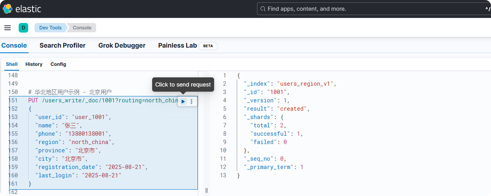

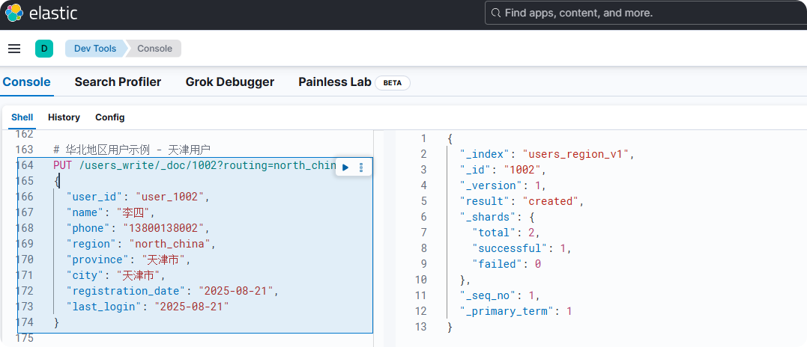

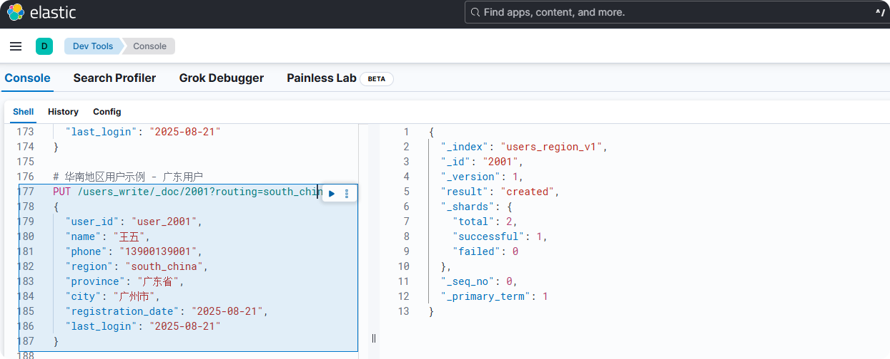

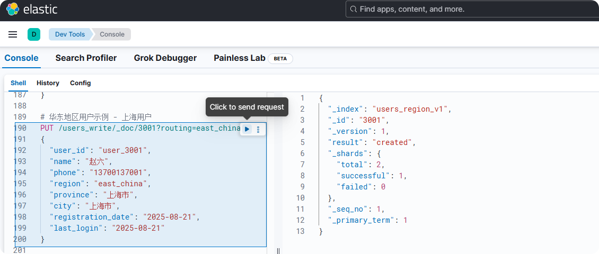

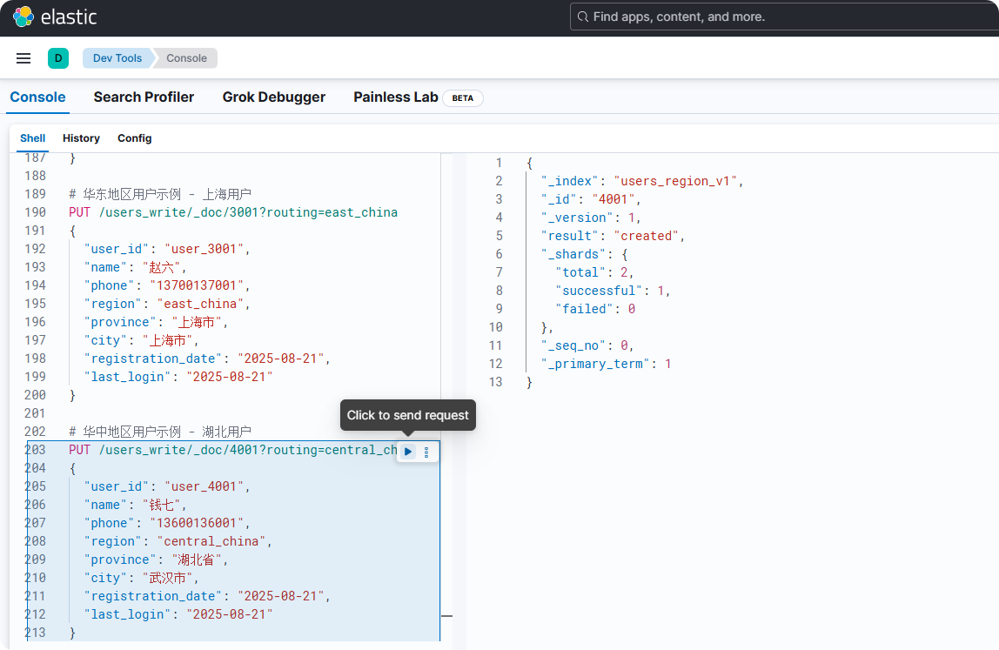

最后，我们来进行查询，这里分 5 种查询情况：

### **1、查询特定区域的用户**

\# 查询华北地区所有用户

GET /users\_north\_china/\_search

{

"query": {

"match\_all": {}

},

"sort": \[

{

"registration\_date": {

"order": "desc"

}

}

\]

}

\# 结果 {

"took": 14,

"timed\_out": false,

"\_shards": {

"total": 1,

"successful": 1,

"skipped": 0,

"failed": 0

},

"hits": {

"total": {

"value": 2,

"relation": "eq"

},

"max\_score": null,

"hits": \[

{

"\_index": "users\_region\_v1",

"\_id": "1001",

"\_score": null,

"\_routing": "north\_china",

"\_source": {

"user\_id": "user\_1001",

"name": "张三",

"phone": "13800138001",

"region": "north\_china",

"province": "北京市",

"city": "北京市",

"registration\_date": "2025-08-21",

"last\_login": "2025-08-21"

},

"sort": \[

1755734400000

\]

},

{

"\_index": "users\_region\_v1",

"\_id": "1002",

"\_score": null,

"\_routing": "north\_china",

"\_source": {

"user\_id": "user\_1002",

"name": "李四",

"phone": "13800138002",

"region": "north\_china",

"province": "天津市",

"city": "天津市",

"registration\_date": "2025-08-21",

"last\_login": "2025-08-21"

},

"sort": \[

1755734400000

\]

}

\]

}

}

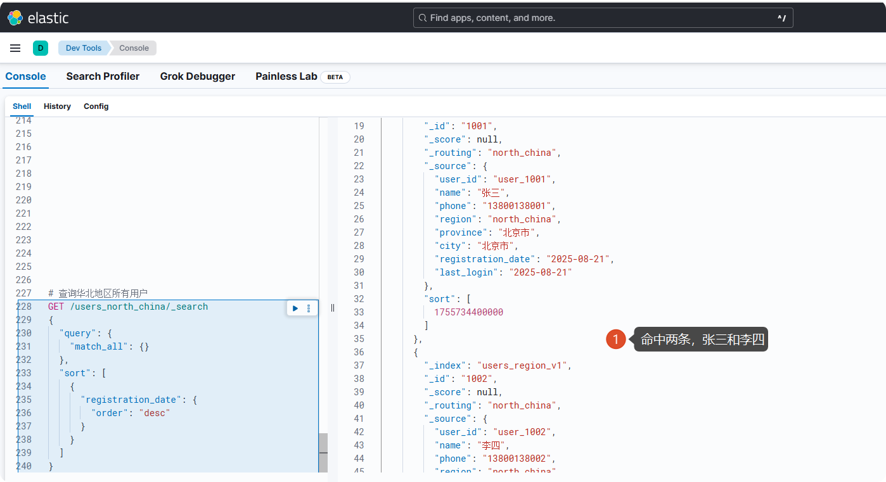

\# 查询华南地区近期活跃用户

GET /users\_south\_china/\_search

{

"query": {

"range": {

"last\_login": {

"gte": "now-7d/d"

}

}

}

}

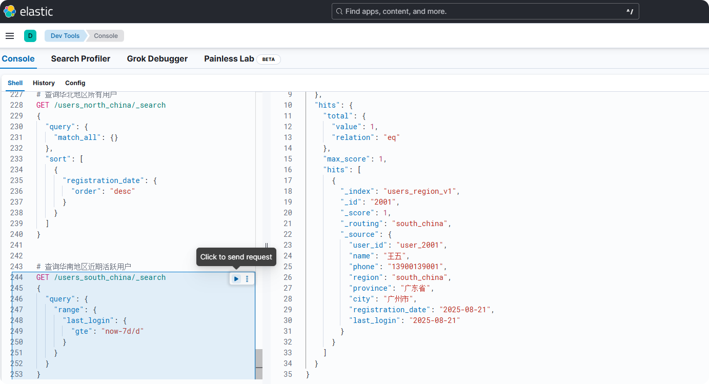

### **2、跨区域查询**

\# 查询所有区域的用户（需要访问所有分片）

GET /users\_all\_regions/\_search

{

"query": {

"match\_all": {}

},

"size": 20

}

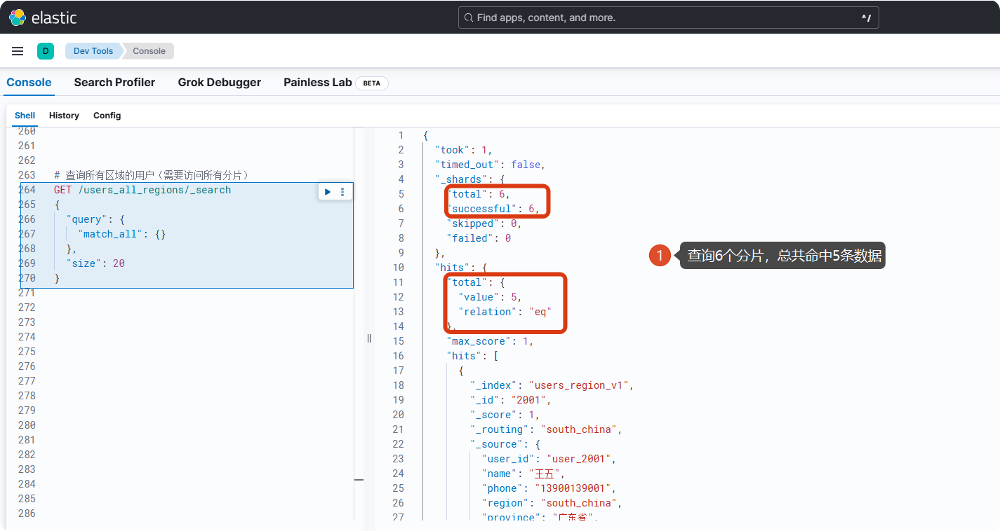

\# 查询特定省份的用户（使用通用别名，但指定路由）

GET /users\_all\_regions/\_search?routing=north\_china

{

"query": {

"term": {

"province": "北京市"

}

}

}

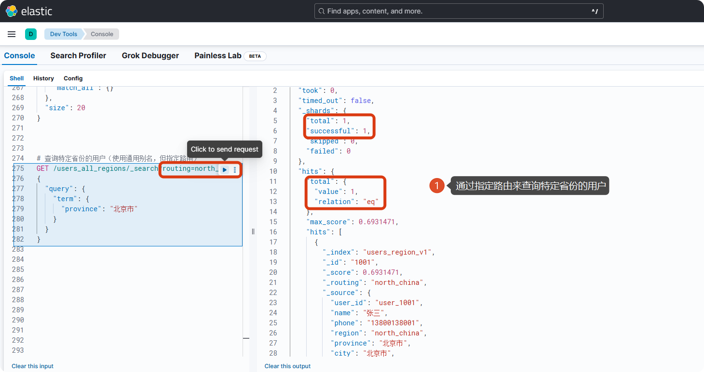

### **3、多区域联合查询**

\# 查询华北和华东地区的用户

GET /users\_all\_regions/\_search

{

"query": {

"terms": {

"region": \["north\_china", "east\_china"\]

}

}

}

\# 结果 {

"took": 1,

"timed\_out": false,

"\_shards": {

"total": 6,

"successful": 6,

"skipped": 0,

"failed": 0

},

"hits": {

"total": {

"value": 3,

"relation": "eq"

},

"max\_score": 1,

"hits": \[

{

"\_index": "users\_region\_v1",

"\_id": "3001",

"\_score": 1,

"\_routing": "east\_china",

"\_source": {

"user\_id": "user\_3001",

"name": "赵六",

"phone": "13700137001",

"region": "east\_china",

"province": "上海市",

"city": "上海市",

"registration\_date": "2025-08-21",

"last\_login": "2025-08-21"

}

},

{

"\_index": "users\_region\_v1",

"\_id": "1001",

"\_score": 1,

"\_routing": "north\_china",

"\_source": {

"user\_id": "user\_1001",

"name": "张三",

"phone": "13800138001",

"region": "north\_china",

"province": "北京市",

"city": "北京市",

"registration\_date": "2025-08-21",

"last\_login": "2025-08-21"

}

},

{

"\_index": "users\_region\_v1",

"\_id": "1002",

"\_score": 1,

"\_routing": "north\_china",

"\_source": {

"user\_id": "user\_1002",

"name": "李四",

"phone": "13800138002",

"region": "north\_china",

"province": "天津市",

"city": "天津市",

"registration\_date": "2025-08-21",

"last\_login": "2025-08-21"

}

}

\]

}

}

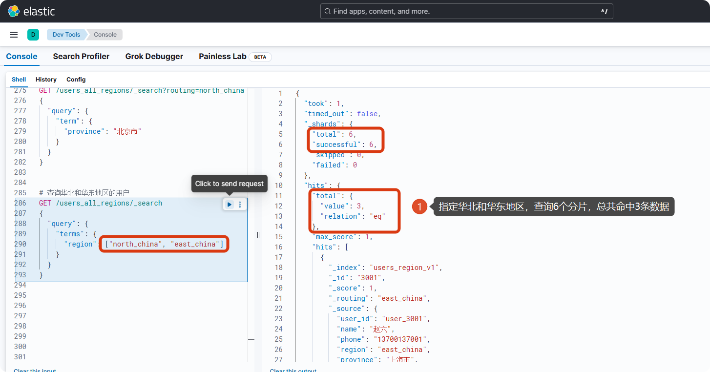

\# 使用多个路由值查询（提高性能）

GET /users\_all\_regions/\_search?routing=north\_china,east\_china

{

"query": {

"range": {

"registration\_date": {

"gte": "2025-08-01"

}

}

}

}

\# 结果 {

"took": 1,

"timed\_out": false,

"\_shards": {

"total": 2,

"successful": 2,

"skipped": 0,

"failed": 0

},

"hits": {

"total": {

"value": 4,

"relation": "eq"

},

"max\_score": 1,

"hits": \[

{

"\_index": "users\_region\_v1",

"\_id": "2001",

"\_score": 1,

"\_routing": "south\_china",

"\_source": {

"user\_id": "user\_2001",

"name": "王五",

"phone": "13900139001",

"region": "south\_china",

"province": "广东省",

"city": "广州市",

"registration\_date": "2025-08-21",

"last\_login": "2025-08-21"

}

},

{

"\_index": "users\_region\_v1",

"\_id": "3001",

"\_score": 1,

"\_routing": "east\_china",

"\_source": {

"user\_id": "user\_3001",

"name": "赵六",

"phone": "13700137001",

"region": "east\_china",

"province": "上海市",

"city": "上海市",

"registration\_date": "2025-08-21",

"last\_login": "2025-08-21"

}

},

{

"\_index": "users\_region\_v1",

"\_id": "1001",

"\_score": 1,

"\_routing": "north\_china",

"\_source": {

"user\_id": "user\_1001",

"name": "张三",

"phone": "13800138001",

"region": "north\_china",

"province": "北京市",

"city": "北京市",

"registration\_date": "2025-08-21",

"last\_login": "2025-08-21"

}

},

{

"\_index": "users\_region\_v1",

"\_id": "1002",

"\_score": 1,

"\_routing": "north\_china",

"\_source": {

"user\_id": "user\_1002",

"name": "李四",

"phone": "13800138002",

"region": "north\_china",

"province": "天津市",

"city": "天津市",

"registration\_date": "2025-08-21",

"last\_login": "2025-08-21"

}

}

\]

}

}

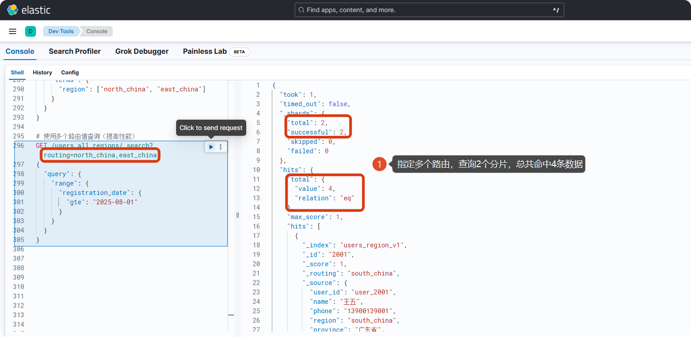

### **4、聚合统计分析**

\# 按省份统计各区域用户数量

GET /users\_all\_regions/\_search

{

"size": 0,

"aggs": {

"regions": {

"terms": {

"field": "region",

"size": 10

},

"aggs": {

"provinces": {

"terms": {

"field": "province",

"size": 10

}

}

}

}

}

}

\# 结果

{

"took": 5,

"timed\_out": false,

"\_shards": {

"total": 6,

"successful": 6,

"skipped": 0,

"failed": 0

},

"hits": {

"total": {

"value": 5,

"relation": "eq"

},

"max\_score": null,

"hits": \[\]

},

"aggregations": {

"regions": {

"doc\_count\_error\_upper\_bound": 0,

"sum\_other\_doc\_count": 0,

"buckets": \[

{

"key": "north\_china",

"doc\_count": 2,

"provinces": {

"doc\_count\_error\_upper\_bound": 0,

"sum\_other\_doc\_count": 0,

"buckets": \[

{

"key": "北京市",

"doc\_count": 1

},

{

"key": "天津市",

"doc\_count": 1

}

\]

}

},

{

"key": "central\_china",

"doc\_count": 1,

"provinces": {

"doc\_count\_error\_upper\_bound": 0,

"sum\_other\_doc\_count": 0,

"buckets": \[

{

"key": "湖北省",

"doc\_count": 1

}

\]

}

},

{

"key": "east\_china",

"doc\_count": 1,

"provinces": {

"doc\_count\_error\_upper\_bound": 0,

"sum\_other\_doc\_count": 0,

"buckets": \[

{

"key": "上海市",

"doc\_count": 1

}

\]

}

},

{

"key": "south\_china",

"doc\_count": 1,

"provinces": {

"doc\_count\_error\_upper\_bound": 0,

"sum\_other\_doc\_count": 0,

"buckets": \[

{

"key": "广东省",

"doc\_count": 1

}

\]

}

}

\]

}

}

}

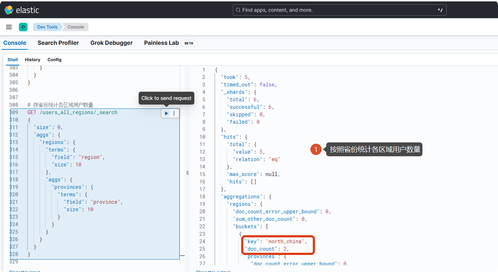

\# 使用路由别名进行区域特定分析（性能更优）

GET /users\_north\_china/\_search

{

"size": 0,

"aggs": {

"cities": {

"terms": {

"field": "city",

"size": 20

}

},

"active\_users": {

"filter": {

"range": {

"last\_login": {

"gte": "now-30d/d"

}

}

}

}

}

}

\# 结果

{

"took": 6,

"timed\_out": false,

"\_shards": {

"total": 1,

"successful": 1,

"skipped": 0,

"failed": 0

},

"hits": {

"total": {

"value": 2,

"relation": "eq"

},

"max\_score": null,

"hits": \[\]

},

"aggregations": {

"cities": {

"doc\_count\_error\_upper\_bound": 0,

"sum\_other\_doc\_count": 0,

"buckets": \[

{

"key": "北京市",

"doc\_count": 1

},

{

"key": "天津市",

"doc\_count": 1

}

\]

},

"active\_users": {

"doc\_count": 2

}

}

}

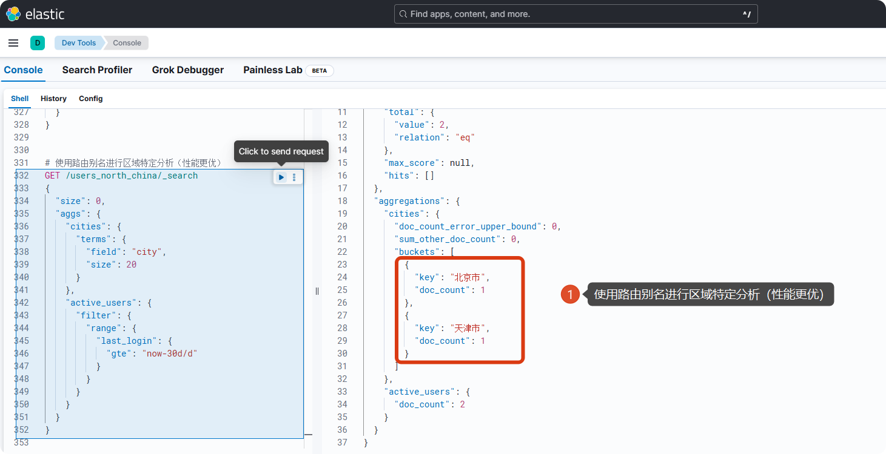

### **5、区域特定分析与监控**

查看各区域文档数量：

\# 查看华北地区文档数量

GET /users\_north\_china/\_count

\# 查看所有区域文档数量

GET /users\_all\_regions/\_count

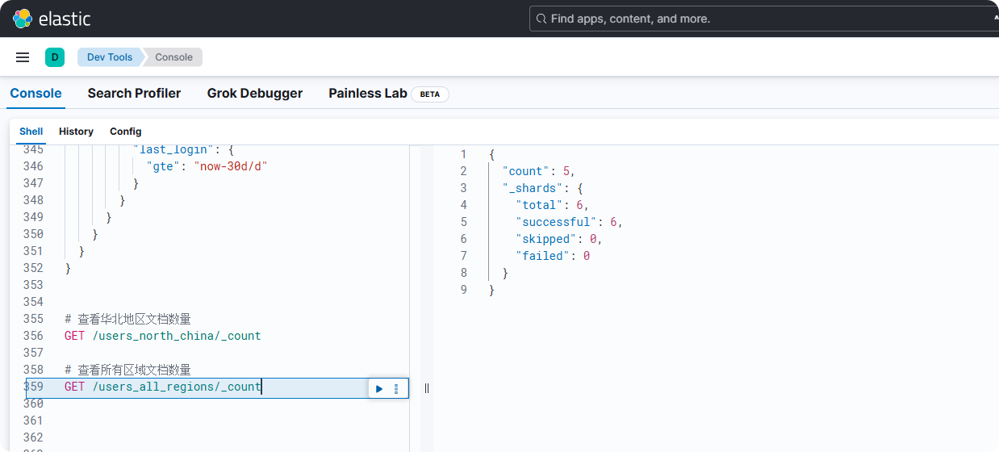

查看路由效果：

\# 查看查询解释，了解路由效果

GET /users\_north\_china/\_search?explain=true

{

"query": {

"term": {

"city": "北京市"

}

}

}

\# 结果 {

"took": 10,

"timed\_out": false,

"\_shards": {

"total": 1,

"successful": 1,

"skipped": 0,

"failed": 0

},

"hits": {

"total": {

"value": 1,

"relation": "eq"

},

"max\_score": 0.6931471,

"hits": \[

{

"\_shard": "\[users\_region\_v1\]\[3\]",

"\_node": "nUSQHj-mRbytSTCci8xMwA",

"\_index": "users\_region\_v1",

"\_id": "1001",

"\_score": 0.6931471,

"\_routing": "north\_china",

"\_source": {

"user\_id": "user\_1001",

"name": "张三",

"phone": "13800138001",

"region": "north\_china",

"province": "北京市",

"city": "北京市",

"registration\_date": "2025-08-21",

"last\_login": "2025-08-21"

},

"\_explanation": {

"value": 0.6931471,

"description": "sum of:",

"details": \[

{

"value": 0.6931471,

"description": "weight(city:北京市 in 0) \[PerFieldSimilarity\], result of:",

"details": \[

{

"value": 0.6931471,

"description": "score(freq=1.0), computed as boost \* idf \* tf from:",

"details": \[

{

"value": 2.2,

"description": "boost",

"details": \[\]

},

{

"value": 0.6931472,

"description": "idf, computed as log(1 + (N - n + 0.5) / (n + 0.5)) from:",

"details": \[

{

"value": 1,

"description": "n, number of documents containing term",

"details": \[\]

},

{

"value": 2,

"description": "N, total number of documents with field",

"details": \[\]

}

\]

},

{

"value": 0.45454544,

"description": "tf, computed as freq / (freq + k1 \* (1 - b + b \* dl / avgdl)) from:",

"details": \[

{

"value": 1,

"description": "freq, occurrences of term within document",

"details": \[\]

},

{

"value": 1.2,

"description": "k1, term saturation parameter",

"details": \[\]

},

{

"value": 0.75,

"description": "b, length normalization parameter",

"details": \[\]

},

{

"value": 1,

"description": "dl, length of field",

"details": \[\]

},

{

"value": 1,

"description": "avgdl, average length of field",

"details": \[\]

}

\]

}

\]

}

\]

},

{

"value": 0,

"description": "match on required clause, product of:",

"details": \[

{

"value": 0,

"description": "# clause",

"details": \[\]

},

{

"value": 1,

"description": "region:north\_china",

"details": \[\]

}

\]

}

\]

}

}

\]

}

}

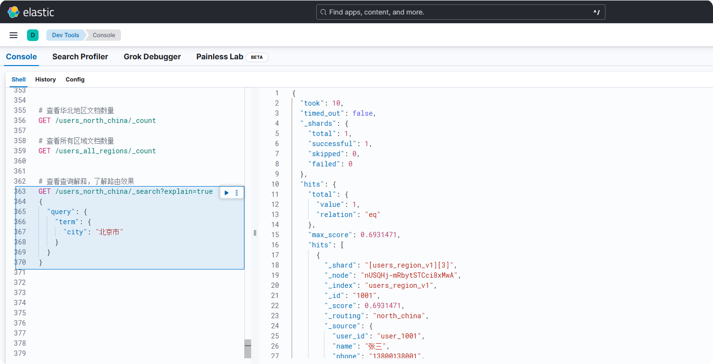

我们来逐层解析这个非常有价值的 explain 结果。它不仅告诉你文档为什么被匹配，更重要的是**揭示了路由机制是如何工作的**。

结果概要解读：

1.  "took": 10：查询耗时10毫秒，非常快。
2.  "\_shards": { "total": 1, "successful": 1, ... }：这是路由效果最直接的体现！ 查询只访问了 1 个分片，而不是索引的所有6个分片。这意味着路由别名 users\_north\_china 成功地将 Elasticsearch 的搜索范围限制在了包含 routing=north\_china 文档的特定分片上，极大地提升了性能。
3.  "hits": { "total": { "value": 1, ... } }：找到了1个匹配的文档。
4.  "\_routing": "north\_china"：命中文档的 \_routing 值确认是 north\_china，这与我们索引时指定的路由值一致。

核心解释：路由与过滤如何协同工作

这个 \_explanation 部分非常精彩，它详细说明了「**得分计算**」和「**别名过滤**」是如何结合的。\_explanation 的结构是一个树形结构，顶层是 "sum of:"，意味着最终得分是下面所有部分的总和。

#### 第一部分：城市匹配得分 (0.6931471)

{

"value": 0.6931471,

"description": "weight(city:北京市 in 0) \[PerFieldSimilarity\], result of:",

"details": \[ ... \]

}

这一部分计算的是文档的 city 字段与查询词 北京市 的匹配分数 (0.6931471)。它使用了 BM25 评分算法（Elasticsearch 7.x 后的默认算法），其细节包括：

1.  boost: 2.2：字段级别的权重提升（通常是默认值）。
2.  idf: 0.6931472 (逆文档频率)：计算公式为 log(1 + (N - n + 0.5) / (n + 0.5))。
3.  N=2：当前分片中，有 city 这个字段的文档总数是2（这很可能就是索引时放入的北京和天津的用户）。
4.  n=1：当前分片中，包含词项 北京市 的文档数量是1。
5.  IDF 值较低，说明 北京市 这个词在当前分片内区分度不高（因为只有两个文档，其中一个包含该词）。
6.  tf: 0.45454544 (词频)：衡量 北京市 在本文档的 city 字段中出现的频率。这里 freq=1（出现了一次），然后根据 BM25 的公式进行了标准化计算。参数 k1=1.2, b=0.75 是 BM25 的调优参数。

简单理解：这部分分数回答了“这个文档在‘北京市’这个条件上匹配得有多好”。

#### 第二部分：别名过滤条件 (0)

{

"value": 0,

"description": "match on required clause, product of:",

"details": \[

{

"value": 0,

"description": "# clause",

"details": \[\]

},

{

"value": 1,

"description": "region:north\_china", // 注意这里！

"details": \[\]

}

\]

}

这是整个解释中最关键的部分，它揭示了路由别名的工作机制：

1.  "description": "region:north\_china"：这清楚地表明，你在创建 users\_north\_china 别名时设置的过滤条件 ("filter": { "term": { "region": "north\_china" } }) 被 Elasticsearch 转换成了一个必须匹配的查询子句。也就是说，你的查询 { "term": { "city": "北京市" } } 被悄悄地重写为了：

{

"bool": {

"must": \[

{ "term": { "city": "北京市" } },

{ "term": { "region": "north\_china" } } // 别名自动添加的过滤条件

\]

}

}

1.  "value": 0：过滤条件（Filter Context）不参与评分。它的目的只是二元判断：是（包含在结果中）或否（排除出结果）。因此，它对相关性得分 \_score 的贡献是 0。
2.  "value": 1：这可以理解为过滤条件的“匹配度”，1 表示完全匹配。因为文档的 region 字段确实是 north\_china，所以它通过了过滤。

简单理解：这部分保证了只有 region 为 north\_china 的文档才会被纳入搜索范围，这是别名路由代理的核心功能之一。

从这个 explain 结果中，我们可以得出几个非常重要的结论：

1.  **路由成功生效**：查询只搜索了**1个分片**（\_shards.total: 1），而不是整个索引的6个分片，**性能提升巨大**。
2.  **别名过滤即查询重写**：别名中定义的 filter 不是在查询后进行的，而是在查询时被**动态添加**到你的原始查询中的，形成一个 bool 查询。这保证了查询的效率和正确性。
3.  **过滤不影响评分**：自动添加的过滤条件处于**过滤上下文**，它只决定文档是否匹配，而不影响 \_score 的计算。最终得分只由你的原始查询条件（city:北京市）决定。
4.  **数据分布验证**：从 idf 计算中的 N=2, n=1 可以推断，**当前目标分片**上只有**2个文档**，且只有**1个文档** 的 city 是 北京市。这验证了数据按路由值正确分布到了分片上。

这个结果完美地展示了 Elasticsearch 索引别名路由代理的两个核心优势：

1.  **性能优化**：通过 routing 将搜索范围缩小到特定分片。
2.  **数据隔离/安全**：通过 filter 确保查询只能访问到允许的数据（如华北地区的用户）。