从今天之后的一段时间内，华仔会带着大家一起来从零开始对 ElasticStack 矩阵产品进行深入剖析和项目运维实战，希望大家学完之后可以用到自己的工作中。

这是第十一篇，本篇我将带着大家进行「**ES 索引多条件复杂组合查询深度实战**」。

文章汇总位置：[https://wx.zsxq.com/dweb2/index/columns/51122554151214](https://wx.zsxq.com/dweb2/index/columns/51122554151214)

## **01 前言**

在上篇中 [【ES 入门实战第十篇】ES 索引数据加工 ETL 利器之 Ingest 深度实战](https://articles.zsxq.com/id_zati1ndsq3rz.html)，带着大家进行「**ES 索引数据加工 ETL 利器之 Ingest 深度实战**」。

今天我们来进行「**ES 索引多条件复杂组合查询深度实战**」。

## **02 ES 索引多条件复杂组合查询深度实战**

今天的案例还是以航班数据为主，前面已经提过：

静静等待成功，如果有报错，请检查机器磁盘是否已满：

这里创建一个新的索引来作为今天的案例库。

PUT kibana\_sample\_data\_flights\_compound

{

"mappings": {

"dynamic": true // 允许动态添加新字段

}

}

\# 先重建新索引

POST \_reindex

{

"source": {

"index": "kibana\_sample\_data\_flights"

},

"dest": {

"index": "kibana\_sample\_data\_flights\_compound"

}

}

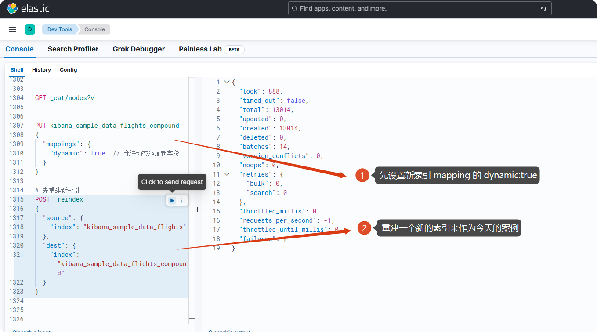

## **2.1 Compound 多条件组合查询**

官方文档地址：[https://www.elastic.co/guide/en/elasticsearch/reference/8.17/compound-queries.html](https://www.elastic.co/guide/en/elasticsearch/reference/8.17/compound-queries.html)

### **2.1.1 组合查询分类**

实战之前，先来看下其组合查询分类都有哪些？

1.  bool：布尔组合，这是最强大、最常用的组合查询。它允许你将多个查询子句通过布尔逻辑（must，should，must\_not，filter）进行组合，形成一个复杂的查询。
2.  boost：加权查询，允许你通过一个 negative\_boost 来降低匹配了某个特定查询的文档的相关性分数，而不是直接排除它们。
3.  constant：固定分值，将一个查询包裹起来，并为其所有匹配的文档赋予一个固定的、统一的分数（boost，默认为 1.0）。它不进行任何实际的相关性计算，所有匹配的文档分数都一样。
4.  dis\_max：单字符多字段组合，Disjunction Max Query 的简称。它将一个或多个查询子句作为 queries 参数，并返回匹配了任何一个子句的文档。其核心特点是：​文档的最终得分取自所有匹配的子句中的最高分，而不是将所有子句的得分相加。
5.  function：函数脚本组合，这是最灵活、最强大的自定义评分查询。它允许你通过定义一个或多个函数​（functions）来修改原始查询返回的文档的分数，甚至可以完全抛开原始分数，基于其他字段值重新计算一个分数。

接下来，我们分别来看下。

### **2.1.2 Bool 组合查询**

这是最强大、最常用的组合查询。它允许你将多个查询子句通过布尔逻辑（must，should，must\_not，filter）进行组合，形成一个复杂的查询。

1.  must​：查询「**必须**」出现在匹配的文档中，并参与相关性 \_score 分数计算，相当于逻辑 ​AND。
2.  ​should​：查询「**应该**」出现在匹配的文档中，它会影响相关性算分。在 bool 查询中，如果包含 must 或 filter 子句，should 的子句默认为「**可选**」（如果匹配了会提高分数）。如果 bool 查询中只有 should，那么「**至少需要匹配一条**」，可通过 minimum\_should\_match 参数调整。
3.  ​must\_not​：查询「**绝对不能**」出现在匹配的文档中。它会在 filter 上下文中执行，意味着它不影响评分，只是简单地排除文档。相当于逻辑 ​NOT。
4.  ​filter​：查询「**必须**」出现在匹配的文档中。但与 must 的关键区别是，它不参与相关性算分​（\_score 被忽略并返回 0）。因为它可以利用缓存，所以性能通常比 must 更高。

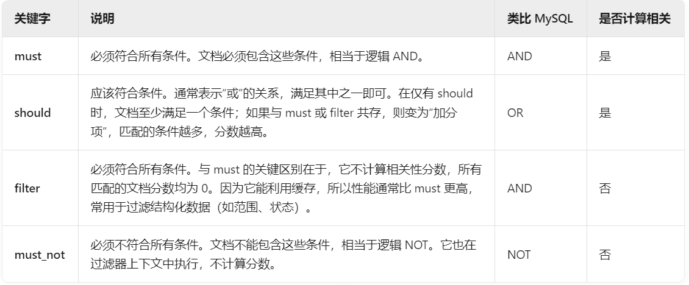

开始之前，我们先来看下索引的总数：

\# 控制 Elasticsearch 是否精确计算与查询匹配的文档总数（hits.total 的值）​

GET kibana\_sample\_data\_flights\_compound/\_search

{

"track\_total\_hits": true

}

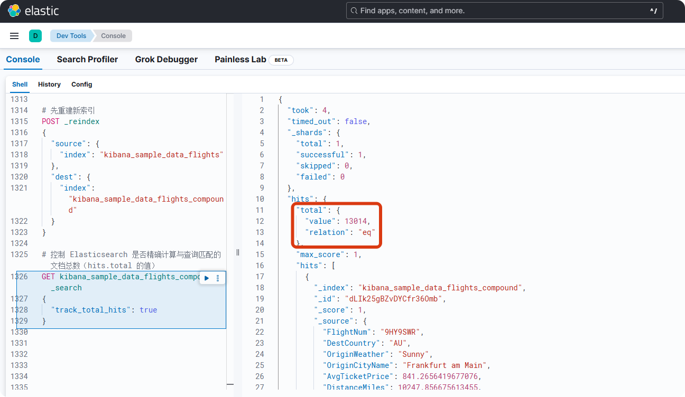

track\_total\_hits 参数用来控制 ES 是否精确计算与查询匹配的文档总数（hits.total 的值）**​**。简单来说，它决定了搜索响应中 hits.total 字段是一个「**精确数字**」，还是一个「**大概的估算值**」。

1.  在默认情况下，ES 为了优化查询性能和降低资源消耗，不会去精确计算超过 10,000 个文档的命中总数。
2.  当一个查询匹配的文档数量非常大（超过 10,000）时，hits.total 的值会显示为一个估算值，并且其属性 relation 会为 "gte"（大于等于）。

{

"hits": {

"total": {

"value": 10000, // 表示“至少匹配10000个文档”

"relation": "gte" // “gte” = greater than or equal to

},

"hits": \[ ... \]

}

}

1.  当你设置 track\_total\_hits : true 时，你是在强制​ ES ​精确计算所有匹配的文档数量，无论这个数量有多大。
2.  此时，返回的 hits.total 会是一个精确的数字，并且 relation 为 "eq"（等于）。

{

"hits": {

"total": {

"value": 13452, // 精确的匹配文档总数

"relation": "eq" // “eq” = equals

},

"hits": \[ ... \]

}

}

1.  你还可以将其设置为一个整数阈值（例如 track\_total\_hits : 50000）。
2.  这意味着：如果匹配的文档数小于等于这个阈值就精确计算。如果超过这个阈值，就不再精确计算，并按默认的估算行为返回。

你应该在以下场景中使用它：

1.  ​需要精确的统计数字时​：例如，你需要生成一个准确的报表，显示符合某些条件的精确记录数。
2.  ​进行测试或调试时​：为了验证你的查询是否按预期匹配了正确数量的文档。
3.  ​业务逻辑强依赖精确总数时​：例如，某个流程需要根据精确的匹配数量来决定下一步操作。

### **2.1.2.1 must 查询**

下面示例查询的目标是：​查找所有目的地天气是“Sunny”并且目的地机场ID是“CGN”的航班。​

\# 这里的 2 个字段类型都是 keyword 所以需要完全匹配才行

GET kibana\_sample\_data\_flights\_compound/\_search

{

"track\_total\_hits": true, // 精确计算匹配文档总数

"query": {

"bool": {

"must": \[ // 必须同时满足所有条件

{

"match": {

"DestWeather": "Sunny" // 条件1：目的地天气晴朗

}

},

{

"match": {

"DestAirportID": "CGN" // 条件2：目的地机场是科隆/波恩机场

}

}

\]

}

}

}

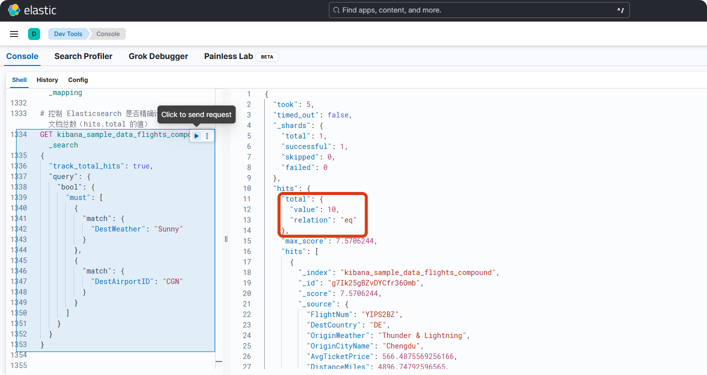

从查询结果可以看到，使用 must 两个条件完全匹配只有 10 条数据。

**执行流程：**

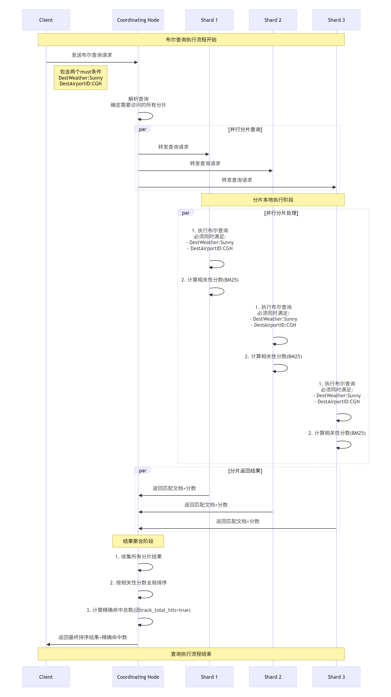

### **2.1.2.2 should 查询**

下面示例查询的目标是：​查找所有目的地天气是"Sunny"或者目的地机场ID是"CGN"的航班，满足任一条件的文档都会被返回。

\# should 查询条件

GET kibana\_sample\_data\_flights\_compound/\_search

{

"track\_total\_hits": true, // 精确计算匹配文档总数

"query": {

"bool": {

"should": \[ // 应该满足至少一个条件

{

"match": {

"DestWeather": "Sunny" // 条件1：目的地天气晴朗

}

},

{

"match": {

"DestAirportID": "CGN" // 条件2：目的地机场是科隆/波恩机场

}

}

\]

}

}

}

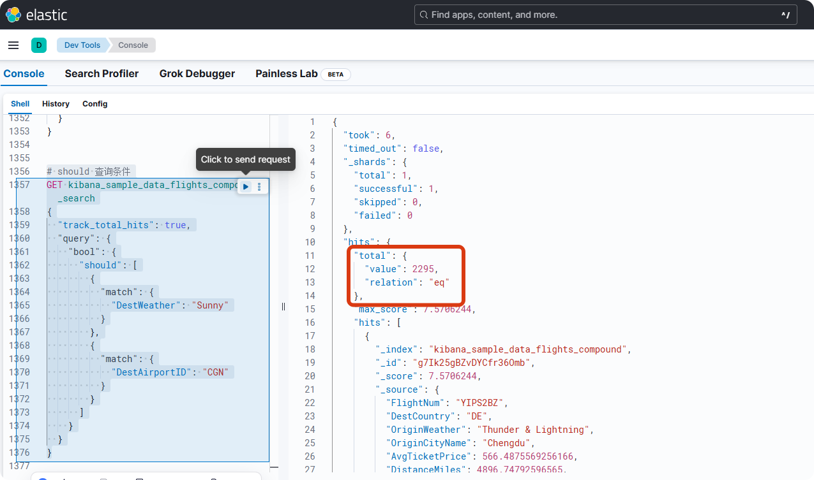

从查询结果可以看到，使用 should 两个条件任意一个匹配有 2295 条数据。

**执行流程：**

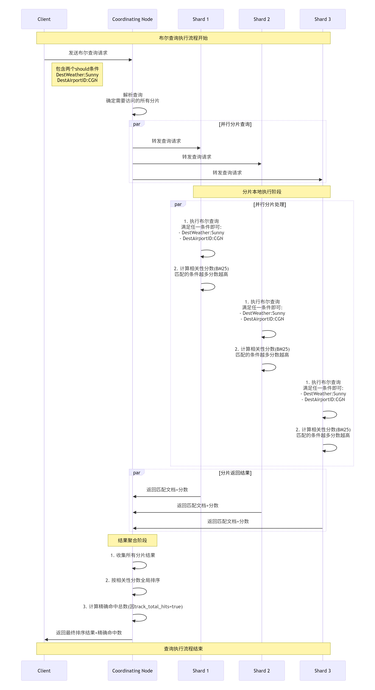

另外也可以通过 minimum\_should\_match 来限制匹配条件：

\# should 查询条件

GET kibana\_sample\_data\_flights\_compound/\_search

{

"track\_total\_hits": true,

"query": {

"bool": {

"should": \[

{

"match": {

"DestWeather": "Sunny"

}

},

{

"match": {

"DestAirportID": "CGN"

}

}

\],

"minimum\_should\_match": 2 // 至少匹配2个should条件

}

}

}

  
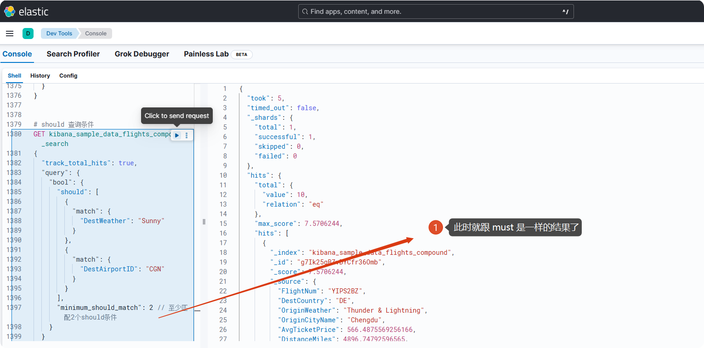

需要注意的是，当 Bool Query 包含至少一个 should 查询并且没有 must 、filter 的情况下，其值默认为 1，否则默认为 0。minimum\_should\_match 还有更多的玩法，你可以参考[官方文档](https://www.elastic.co/guide/en/elasticsearch/reference/8.17/query-dsl-minimum-should-match.html)。

### **2.1.2.3 filter 查询**

下面示例查询的目标是：​查找所有目的地天气是"Sunny"并且目的地机场ID是"CGN"的航班，但不计算相关性分数。​

\# filter 查询条件

GET kibana\_sample\_data\_flights\_compound/\_search

{

"track\_total\_hits": true, // 精确计算匹配文档总数

"query": {

"bool": {

"filter": \[ // 过滤条件，不参与评分

{

"match": {

"DestWeather": "Sunny" // 条件1：目的地天气晴朗

}

},

{

"match": {

"DestAirportID": "CGN" // 条件2：目的地机场是科隆/波恩机场

}

}

\]

}

}

}

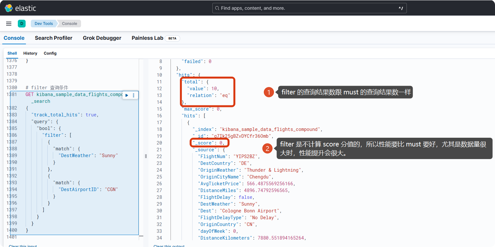

从查询结果可以看到，使用 filter 的结果总数跟 must 结果总数完全一致，但与 must 的关键区别是，它不参与相关性算分​（\_score 被忽略并返回 0）。因为它可以利用缓存，所以性能通常比 must 更高。

**执行流程：**

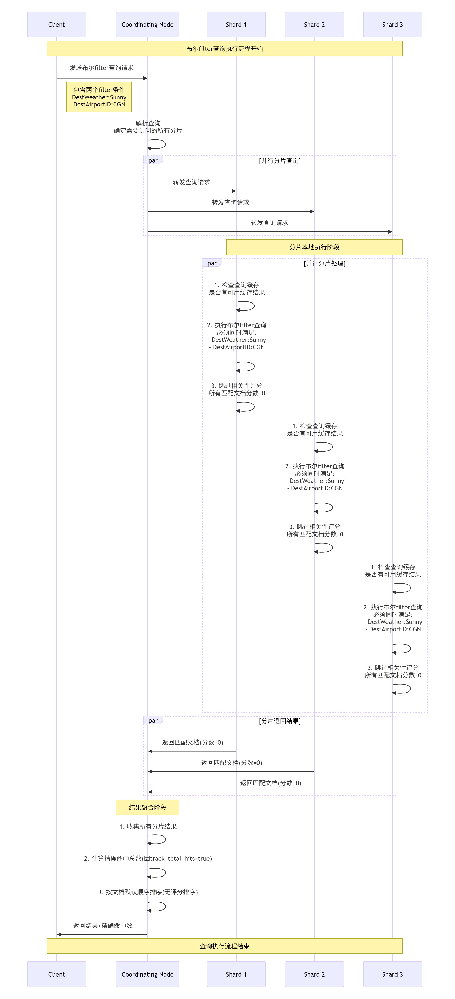

### **2.1.2.4 must\_not 查询**

下面示例查询的目标是：​查找所有目的地天气不是"Sunny"并且目的地机场ID不是"CGN"的航班。​

\# must\_not 查询条件

GET kibana\_sample\_data\_flights\_compound/\_search

{

"track\_total\_hits": true, // 精确计算匹配文档总数

"query": {

"bool": {

"must\_not": \[ // 必须不满足以下条件

{

"match": {

"DestWeather": "Sunny" // 条件1：目的地天气不能晴朗

}

},

{

"match": {

"DestAirportID": "CGN" // 条件2：目的地机场不能是科隆/波恩机场

}

}

\]

}

}

}

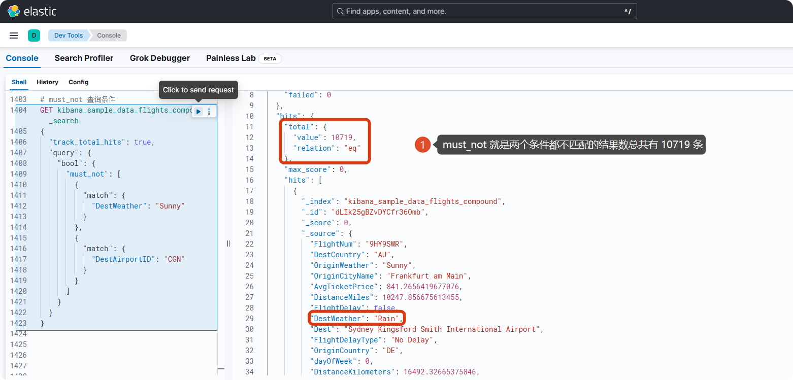

**执行流程：**

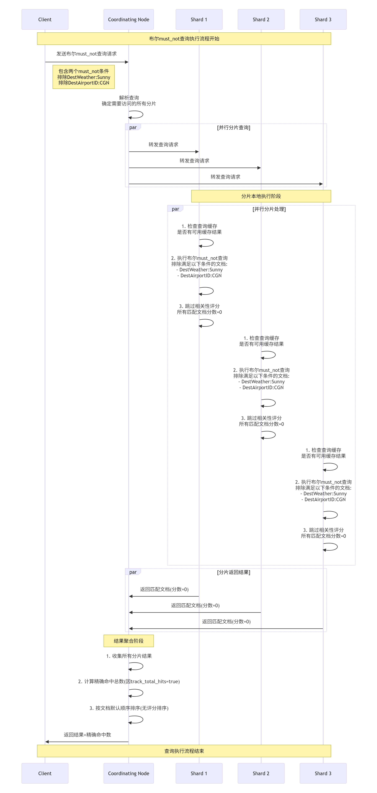

### **2.1.2.5 平铺混合查询**

\# 平铺混合查询条件

GET kibana\_sample\_data\_flights\_compound/\_search

{

"track\_total\_hits": true,

"query": {

"bool": {

"must\_not": \[

{

"match": {

"DestWeather": "Sunny"

}

},

{

"match": {

"DestAirportID": "CGN"

}

}

\],

"must": \[

{

"match": {

"DestCityName": "Sydney"

}

}

\]

}

}

}

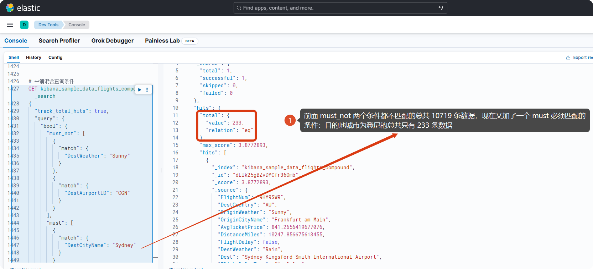

### **2.1.2.6 嵌套混合查询**

\# 嵌套混合查询条件一

GET kibana\_sample\_data\_flights\_compound/\_search

{

"track\_total\_hits": true,

"query": {

"bool": {

"must": \[

{

"match": {

"DestWeather": "Rain"

}

}

\]

}

}

}

\# 嵌套混合查询条件二

GET kibana\_sample\_data\_flights\_compound/\_search

{

"track\_total\_hits": true,

"query": {

"bool": {

"must": \[

{

"match": {

"DestWeather": "Rain"

}

},

{

"bool": {

"must\_not": \[

{

"match": {

"DestAirportID": "CGN"

}

}

\]

}

}

\]

}

}

}

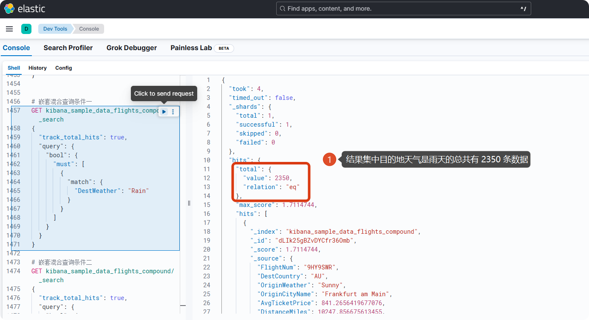

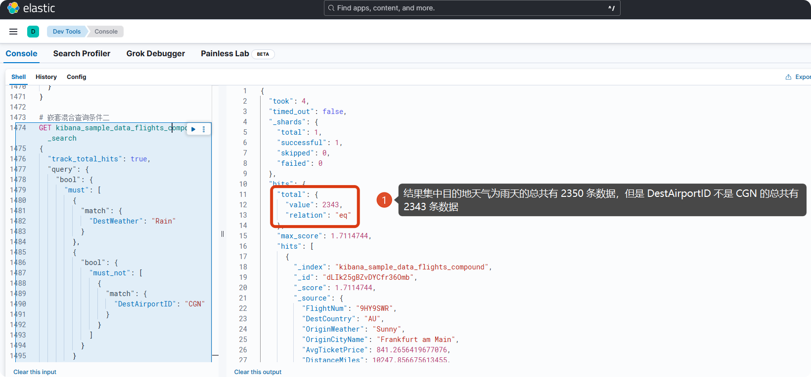

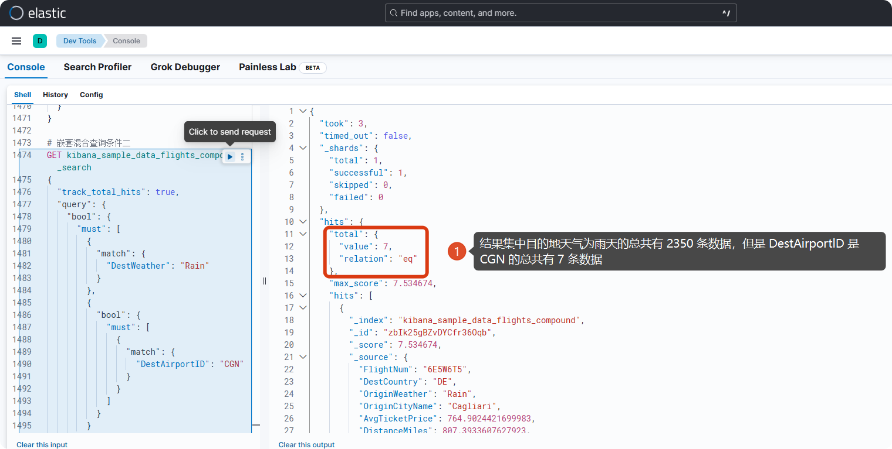

### **2.1.3 Boost 加权组合查询**

给部分字段增加分值的权重，以此来影响分词领域查询排序。它允许你通过一个 negative\_boost 来降低匹配了某个特定查询的文档的相关性分数，而不是直接排除它们。

它由两部分组成：

1.  positive：正向加权，增加字段的权重值，匹配该子句的文档会正常计算分数。
2.  negative：反向加权，降低字段的权重值，匹配该子句的文档，其最终分数为 原始分数 \* negative\_boost（其中 0 < negative\_boost < 1）。
3.  相关性算分降低的程度将由 negative\_boost 参数决定，其取值范围为：\[0.0, 1.0\]。

下面示例查询的目标是：​查找所有目的地天气是“Sunny”的航班，但对于那些目的地机场是“CGN”（科隆/波恩机场）的航班，大幅降低其排名，而不是完全隐藏它们。​

\# Boost 加权组合查询

GET kibana\_sample\_data\_flights\_compound/\_search

{

"track\_total\_hits": true,

"query": {

"boosting": {

"positive": { // 正向查询 这是查询的基础主体。所有匹配 positive 查询的文档都会被包含在最终的结果集中。可以把它想象成你的“主查询”。在这个例子中，就是要找所有 DestWeather 为 "Sunny" 的文档。

"match": {

"DestWeather": "Sunny" // 主查询条件：目的地天气晴朗

}

},

"negative": { // 负向查询 这个查询用于识别那些需要被降权（降低排名）的文档。它本身不会排除任何文档。所有匹配了 positive 查询的文档，如果同时也匹配了 negative 查询，那么这些文档的分数就会被修改。

"match": {

"DestAirportID": "CGN" // 降权条件：目的地机场是科隆/波恩

}

},

"negative\_boost": 0.2 // 负向衰减系数，这是最关键的一个参数。它是一个介于 0 和 1.0 之间的浮点数，匹配 negative 的文档，分数会乘以0.2，排名大幅靠后

}

}

}

  
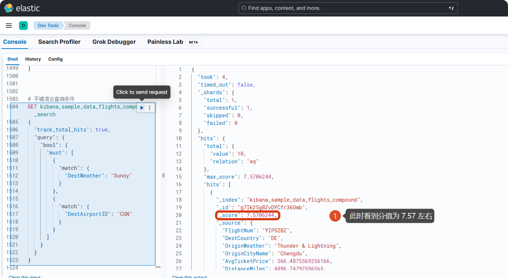

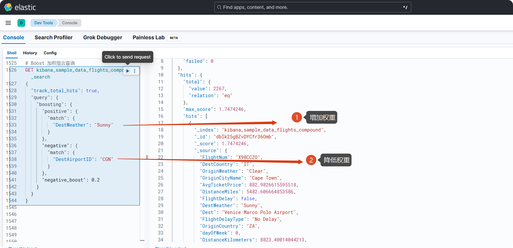

**执行流程：**

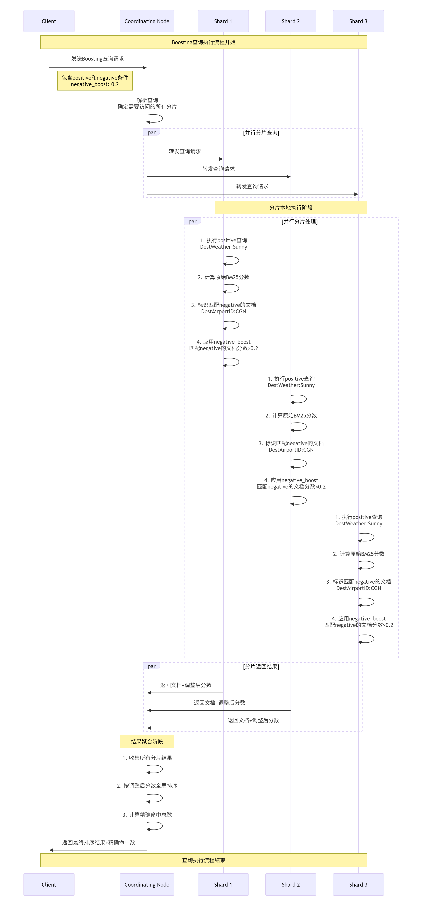

boosting 查询的设计体现的几个核心思想：

1.  ​**​**“降权”而非“排除”的哲学​：
2.  传统的 must\_not 子句是二元思维——要么包含，要么排除。这在很多业务场景下过于粗暴。
3.  boosting 查询引入了灰度思维。它承认某些结果虽然不完全符合理想条件，但可能仍然包含用户需要的信息。通过降低其排名，既保证了主要结果的曝光，又保留了用户看到更全面结果的可能性。这提升了搜索体验的宽容度和灵活性。
4.  ​可组合的查询结构​：
5.  boosting 查询本身是一个复合查询，它接收两个独立的子查询（positive 和 negative）作为输入。这种设计遵循了 Elasticsearch 查询 DSL ​模块化和可组合性的核心原则。每个子查询都可以是任意复杂的查询（比如 bool、term、range 等），这使得 boosting 查询的能力非常强大。
6.  ​分布式评分流水线​：
7.  其执行过程与其它复杂查询类似，遵循一个分布式的分阶段管道：
8.  ​阶段一（Positive Query）​​：在所有分片上并行执行 positive 查询，得到初步的文档列表和它们的原始分数。
9.  ​阶段二（Negative Filter & Re-score）​​：在每个分片上，对初步结果中的每个文档，检查其是否匹配 negative 查询。如果匹配，则应用 negative\_boost 系数重新计算分数。
10.  ​阶段三（Aggregate & Sort）​​：协调节点收集所有分片的结果，合并后根据新的分数进行全局排序。
11.  这个过程完全在分布式环境下并行完成，保证了效率。
12.  ​简单的加权模型​：
13.  与功能极其强大但也更复杂的 function\_score 查询相比，boosting 查询提供了一个非常简单直观的加权模型。它只做一件事——对特定子集进行降权——但做得非常好，而且易于理解和使用。这体现了“简单工具解决特定问题”的设计理念。

结合所有参数，这个查询的最终效果如下：

1.  ​结果集​：包含所有 DestWeather: "Sunny" 的航班。
2.  ​排名规则​：
3.  ​普通结果​：目的地天气是晴天，但机场不是​ "CGN" 的航班。它们保持原始的相关性分数 \_score，排名靠前。
4.  ​降权结果​：目的地天气是晴天，但机场是​ "CGN" 的航班。它们的最终分数为 原始分数 \* 0.2，排名会大幅下降，通常出现在结果列表的底部。

​类比​：这就像你在电商网站搜索“手机”，结果中出现了保护壳、数据线等配件。网站不会完全隐藏这些配件（因为它们也是相关商品），但会通过算法将它们排在真正的手机后面。boosting 查询就是让你手动实现这种策略的工具。

​与 must\_not 的区别​：

1.  bool + must\_not: DestWeather:Sunny AND DestAirportID != CGN -> ​完全排除CGN机场的航班。
2.  boosting: DestWeather:Sunny -> ​包含但降权CGN机场的航班。

因此，boosting 查询非常适合用于处理不需要完全排除，但希望降低其排名的场景，例如：

1.  降低过期商品、低库存商品的排名。
2.  降低某些特定品牌、供应商或不太受欢迎内容的排名。
3.  在推荐系统中，降低用户已经看过或交互过的物品的排名。
4.  在新闻搜索中，优先显示最新新闻，但也不完全排除旧闻，只是降低其排名。

### **2.1.4 Constant 固定分值组合查询**

将一个查询包裹起来，其依赖 filter 查询模式，借助 boost 加权参数并为其所有匹配的文档赋予一个固定的、统一的分数（boost，默认为 1.0）。它不进行任何实际的相关性计算，所有匹配的文档分数都一样。

使用场景​：

1.  当你完全不关心相关性，只需要“是/否”的匹配条件时（常用于 term 级别的精确匹配）。
2.  与 filter 子句行为类似，但允许你手动设置一个固定分数。
3.  性能优化，因为跳过了算分过程。

下面示例查询的目标是：​找出所有目的地机场ID是“CGN”的航班，并且忽略它们之间的任何相关性差异，为所有匹配的文档赋予一个完全相同的固定分数。​

GET kibana\_sample\_data\_flights\_compound/\_search

{

"track\_total\_hits": true,

"query": {

"bool": {

"must": \[

{

"match": {

"DestAirportID": "CGN"

}

}

\]

}

}

}

GET kibana\_sample\_data\_flights\_compound/\_search

{

"track\_total\_hits": true,

"query": {

"constant\_score": { // 这是查询的主体，它将所有匹配的文档的 \_score 都设置为一个常数。

"filter": { // 过滤条件

"term": {

"DestAirportID": "CGN"

}

},

"boost": 1.2 // 这是 constant\_score 查询的精髓。所有匹配上述 filter 条件的文档，其最终的相关性分数 \_score 都会被设置为这个指定的固定值，​完全忽略文档本身与查询条件的匹配程度。所有匹配的文档，\_score都将是1.2

}

}

}

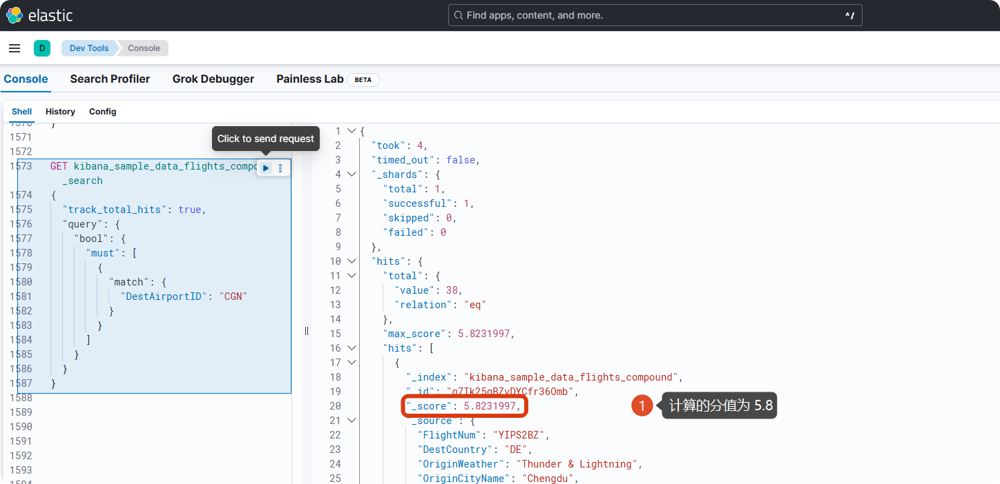

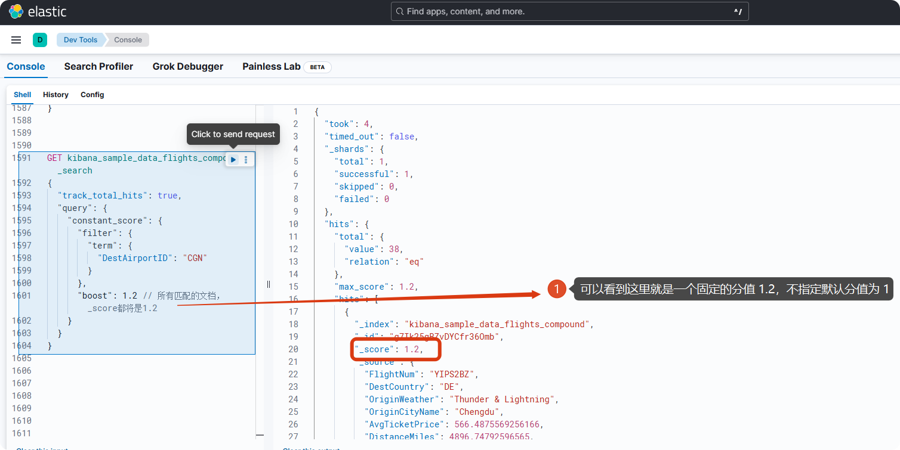

**执行流程：**

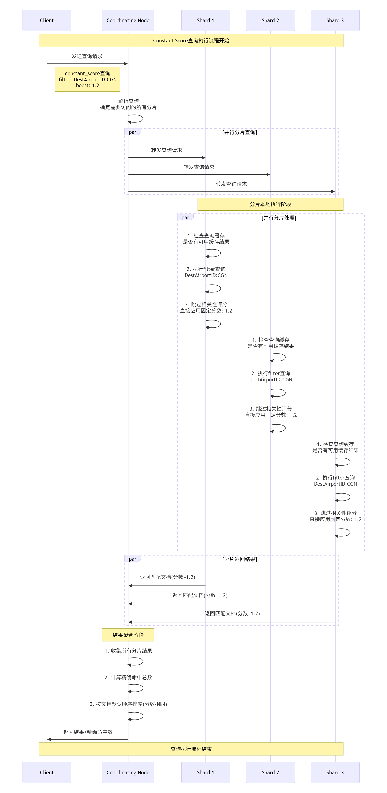

constant\_score 查询的设计体现的核心架构理念：

1.  ​性能优先，跳过算分​：
2.  传统的全文检索查询（如 match）需要计算 TF-IDF、BM25 等复杂的相关性分数，这是一个计算密集型操作。
3.  constant\_score 查询完全跳过了这个耗时的算分过程。它只需要判断文档是否匹配过滤条件，然后直接赋予一个预设的分数。这带来了巨大的性能提升，尤其是在处理大量数据时。
4.  ​过滤器（Filter）上下文与缓存​
5.  这是最重要的设计思想。Elasticsearch 明确区分了查询上下文​（query context）和过滤器上下文​（filter context）。
6.  ​查询上下文​：回答“这个文档有多匹配？”并计算 \_score。
7.  ​过滤器上下文​：回答“这个文档是否匹配？”答案是简单的“是”或“否”，不关心分数。
8.  过滤器上下文最大的优势是结果可以被缓存。如果同一个过滤器被多次使用，ES 可以直接从缓存中返回结果，避免了重复执行相同的计算，极大地提升了性能。constant\_score 查询完全在过滤器上下文中执行，因此能充分利用缓存。
9.  ​二进制匹配与业务逻辑​：
10.  这种设计适用于不需要相关性排序的场景。它体现了一种“二进制”的搜索思维：文档要么符合条件，要么不符合。符合条件的文档在重要性上是平等的。
11.  这非常契合很多业务场景，例如：
12.  ​状态过滤​：筛选出所有“已上架”的商品。
13.  ​类型过滤​：找出所有“VIP用户”。
14.  ​精确匹配​：查询某个特定的标签或分类。
15.  在这些场景下，为一个商品打上“已上架”标签并不会让它比另一个“已上架”商品更相关，因此使用固定分数是合理且高效的。
16.  ​执行流程​：
17.  其分布式执行过程非常高效且直接：
18.  ​阶段一（Filter）​​：协调节点将 term 过滤条件分发到所有相关分片。
19.  ​阶段二（Filter Execution）​​：每个分片在本地使用高效的倒排索引结构，快速找出所有包含 DestAirportID: CGN 词条的文档ID。​此过程不计算分数。
20.  ​阶段三（Constant Scoring）​​：每个分片为匹配的文档直接赋予 boost: 1.2 这个固定分数。
21.  ​阶段四（Aggregate）​​：协调节点收集所有分片的结果，进行合并（因为分数都是1.2，排序很简单），并返回最终结果。

最终效果​：这个查询会返回所有飞往科隆/波恩机场（CGN）的航班，并且每条结果的 \_score 都是 1.2。结果的排序将不受相关性影响，默认按 \_id 或其他顺序返回（除非你指定了 sort 参数）。

​何时使用 constant\_score 查询：​​

1.  ​当你不关心相关性时​：你只需要进行精确的、二进制的过滤，而不需要对结果进行相关性排序。
2.  ​当性能是首要考虑因素时​：你需要尽可能快的查询速度，用于频繁执行的过滤操作。
3.  ​当你想为某类结果设置一个基准分数时​：例如，在 bool 查询的 should 子句中，你可以使用 constant\_score 来确保匹配某个条件的文档至少能获得一个可观的固定分数。

​

对比记忆：​​

1.  ​constant\_score + filter: 是不是？是的话分数就是1.2。 (高效，不排序)。
2.  ​普通 query​： 有多像​？像的程度打分。 (低效，可排序)。

它是一种用计算精度换取执行效率的典型设计，是优化 ES 查询性能的利器。

### **2.1.5 Disjunction 最大分值**

disjunction max query 简称 dis\_max，是分离最大化查询的意思。注意这个名字中的两个重点：分离、最大化。

1.  disjunction（分离）的含义是：表示把同一个文档中的每个字段上的查询都分开，分别进行算分操作。
2.  max（最大化）: 是将多个字段查询的得分的最大值作为最终评分返回。

当查询多个条件字段时，可以提取其中最大的一个分值，然后加入到整个分值计算，用来影响排序。它的核心特点是：​文档的最终得分取自所有匹配的子句中的最高分，而不是将所有子句的得分相加。

使用场景：多字段查询检索领域，有很多字段可以同时作为检索条件，但排序时只要运用其中分值最高的那个用来排序即可，比如电商:商品标题与商品简要描述。这可以避免因为一个文档在多个字段中勉强匹配而导致其分数高于在单个字段中高度匹配的另一个文档（赢家通吃）。

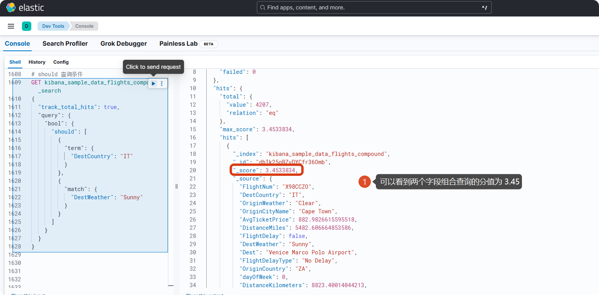

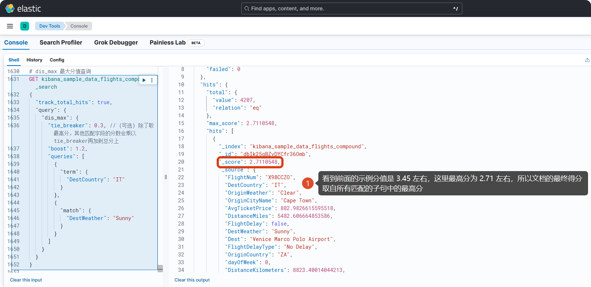

如上示例，我们查询 DestCountry 中出现 "IT" 或者 DestWeather 中出现 "Sunny" 的文档，而最终返回的相关性评分将以匹配 "IT" 或者匹配 "Sunny" 中最大的那个评分为准。

当指定 tie\_breaker 的时候，算分结果将会由以下算法来决定：

1.  算分最高的字段的得分为 s1。
2.  其他匹配的字段的算分 \* tie\_breaker 的和为 s2。
3.  最终算分为：s1 + s2。

其中 tie\_breaker 的取值范围为：\[0.0, 1.0\]。当其为 0.0 的时候，按照上述公式来计算，表示使用最佳匹配字段的得分作为相关性算分。当其为 1.0 的时候，表示所有字段的得分同等重要。当其在 0.0 到 1.0 之间的时候，代表其他字段的得分也需要参与到总得分的计算当中去。通俗来说就是其他字段可以使用 tie\_breaker 参数来进行「**维权**」。

**执行流程：**

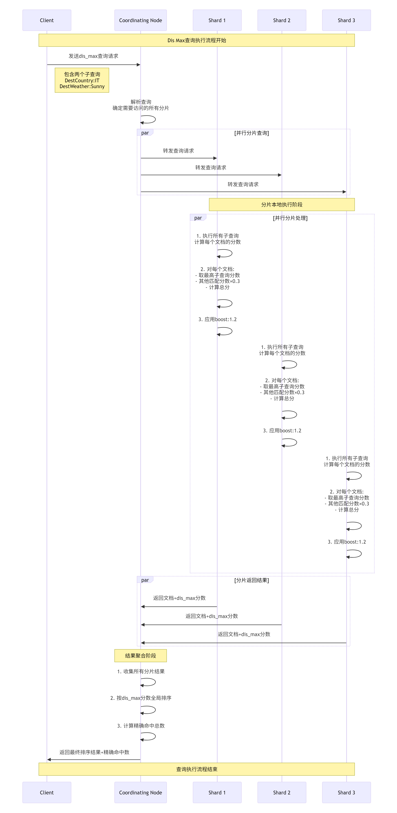

### **2.1.6 Function 函数组合**

这是最灵活、最强大的自定义评分查询。它允许你在查询结束以后通过定义一个或多个函数​（functions）来修改原始查询返回的文档的分数，甚至可以完全抛开原始分数，基于其他字段值重新计算一个分数。所以使用算分函数可以改变或者替换原来的相关性算分结果。

常用函数​：

1.  weight：为匹配的文档设置一个固定的权重系数（与 constant\_score 类似）。
2.  field\_value\_factor：使用文档中某个字段的数值来修改/影响分数（例如，用“点赞数”或“销量”作为考虑因数来提升排名）。
3.  random\_score：为每个文档生成一个随机分数，对结果进行排序（主要用于随机排序）。
4.  decay functions（衰减函数）：如 gauss，linear，exp，根据某个字段（如日期、地理位置）的值，距离中心点越近，分值越高，而随着距离中心点越远而分数衰减。例如我想让商品价格越接近 100 元，算分越高排序越靠前。
5.  script\_score：最强大的方式，使用自定义的 Painless 脚本完全控制分数的计算逻辑。

使用场景​：任何需要基于业务逻辑进行动态排序的场景。

1.  最新且最热的帖子（结合日期和点赞数）。
2.  根据用户地理位置，对附近的商家进行排名。
3.  促销商品加权。
4.  随机推荐。

### **2.1.6.1 function\_score**

下面示例查询目标是：​查找所有目的地国家是英国（GB）的航班，但最终得分要通过一个自定义函数来修改，并且只返回分数超过 2 的文档。​

GET kibana\_sample\_data\_flights\_compound/\_search

{

"track\_total\_hits": true,

"query": { // 基础查询

"function\_score": {

"query": {

"term": {

"DestCountry": "GB"

}

},

"boost": 1, // 整个查询的权重

"functions": \[ // 评分函数列表

{

"filter": { // 只有同时满足基础查询（目的地是GB）​和这个过滤条件（目的地天气是Sunny）的文档，才会应用这个函数。

"match": {

"DestWeather": "Sunny"

}

},

"weight": 1

}

\],

"max\_boost": 10, // 单个函数所能贡献的最大分数上限

"score\_mode": "min", // 多个函数分数之间的合并方式，此处只有一个函数，该参数不生效

"boost\_mode": "multiply", // 函数分数与查询分数的合并方式 multiply (默认，相乘), sum (相加), avg (平均值), max (最大值), first (使用第一个函数的分数)

"min\_score": 2 //全局最低分数阈值，不能超过结果集中的分值，否则为空

}

}

}

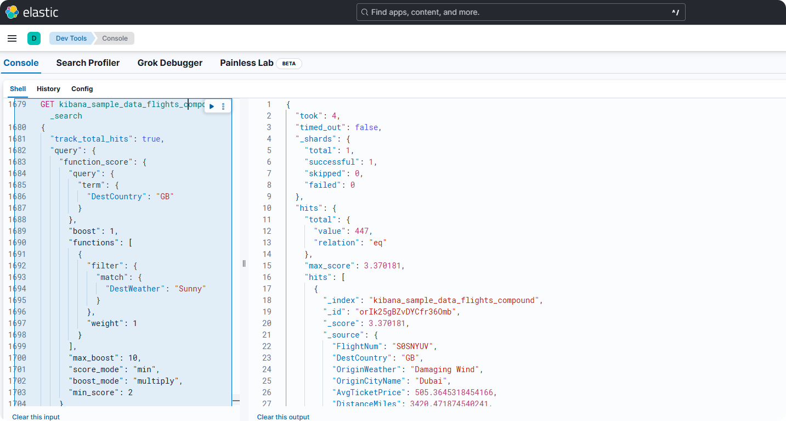

> 请注意​：这里有一个非常重要的细节，在这个例子中，functions 数组里只有一个函数。function\_score 的强大之处在于它可以包含多个函数，每个函数都可以有自己的过滤条件和计算方式（如 weight, field\_value\_factor, random\_score, 衰减函数等）

对于 boost\_mode 参数，它的值有以下几种：

1.  multiply：算分与函数值的积，multiply 是默认值。
2.  replace：使用函数值作为最终的算分结果。
3.  sum：算分与函数值的和。
4.  avg：算分与函数值的平均数。
5.  min：在算分与函数值中取最小值。
6.  max：在算分与函数值中去最大值。

**执行流程：**

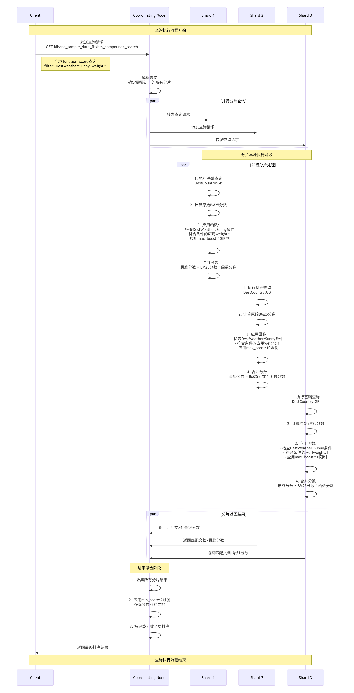

1.  查询发起​：客户端向协调节点发送搜索请求
2.  ​查询分发​：协调节点解析查询并并行分发到所有相关分片
3.  ​分片处理​：每个分片独立执行：
4.  基础查询（term查询：DestCountry为GB）
5.  计算原始BM25相关性分数
6.  应用函数评分：
7.  检查DestWeather是否为Sunny
8.  对符合条件的文档应用weight:1
9.  应用max\_boost:10限制（确保函数分数不超过10）
10.  合并分数：最终分数 = BM25分数 \* 函数分数（boost\_mode: multiply）
11.  ​结果返回​：各分片将计算结果返回协调节点
12.  ​全局聚合与过滤​：协调节点收集所有结果，进行：
13.  应用min\_score:2过滤，移除所有分数低于2的文档
14.  全局排序
15.  ​最终响应​：协调节点将过滤和排序后的最终结果返回客户端

这个查询的设计体现的几个核心架构理念：

1.  ​可插拔的评分模型​：
2.  传统搜索引擎的评分模型（如 TF-IDF, BM25）是固定的、黑盒的。function\_score 查询打破了这一点，允许开发者将业务逻辑​（例如：促销商品加分、新品加分、距离衰减）直接注入到搜索排名算法中，实现搜索结果的个性化和业务化定制。
3.  ​分阶段执行的管道模式​：
4.  查询的执行像一个管道（pipeline），分阶段进行：
5.  ​阶段一（Query）​​：首先在所有的分片上并行执行基础查询 (term: "GB")，得到一个初步的文档列表和它们的原始相关性分数 (\_score)。
6.  ​阶段二（Filter & Score）​​：对初步结果中的每个文档，应用 functions 中定义的过滤器来计算函数分数。这个过程也在各个分片上并行进行。
7.  ​阶段三（Combine）​​：协调节点收集各个分片的结果，根据 score\_mode 和 boost\_mode 参数合并分数。
8.  ​阶段四（Filter）​​：最后应用 min\_score 进行过滤。
9.  这种设计使得每个阶段都可以独立优化和扩展。
10.  ​分布式计算​：
11.  整个计算过程（查询、过滤、评分）都是在每个分片本地并行执行的，而不是由单个中心节点处理。这极大地利用了分布式集群的计算能力，保证了高性能和高吞吐量。
12.  ​灵活性高于性能​：
13.  function\_score 查询提供了极高的灵活性，但代价是更高的计算开销。复杂的函数计算（如脚本评分 script\_score）会比简单的查询慢很多。这种设计哲学体现了 ES 在“功能”与“性能”之间的权衡，为用户提供了选择权。

结合所有参数，我们来分析这个查询的最终效果​：

1.  首先，找到所有 DestCountry: "GB" 的航班。假设它们都有一个基于 BM25 算法的原始 \_score。
2.  然后，对这些航班进行处理：
3.  如果某航班 DestWeather: "Sunny"，它的新分数为 原始分数 \* 1 (分数不变)。
4.  如果某航班 DestWeather 不是 "Sunny"，由于不匹配函数过滤器，其函数分数可能被视为 0，导致新分数为 原始分数 \* 0 = 0。
5.  最后，只保留那些最终分数 ​大于等于 2​ 的文档。

​这个查询的最终目的是：从所有飞往英国的航班中，找出那些目的地是晴天并且原始相关性分数较高的航班（分数>=2），而目的地不是晴天的航班会被有效地过滤掉（因为分数被乘0后肯定小于2）。​​

function\_score 是 ES 中最强大的功能之一，让你能够完全掌控搜索排名的逻辑，从而打造出极其贴合业务的搜索体验。

### **2.1.7 Script\_score 脚本组合**

下面示例查询的目标是：​查找所有目的地国家是英国（GB）的航班，并使用一个自定义的脚本，根据每个航班的飞行时间（FlightTimeHour）来重新计算其相关性得分。​

\# script\_score

GET kibana\_sample\_data\_flights\_compound/\_search

{

"track\_total\_hits": true,

"query": {

"function\_score": { // 基础查询

"query": {

"term": {

"DestCountry": "GB"

}

},

"script\_score": { // 脚本评分定义

"script": "Math.log(1+doc\['FlightTimeHour'\].value)"

},

"score\_mode": "multiply",

"boost\_mode": "sum" // 最终分数合并方式

}

}

}

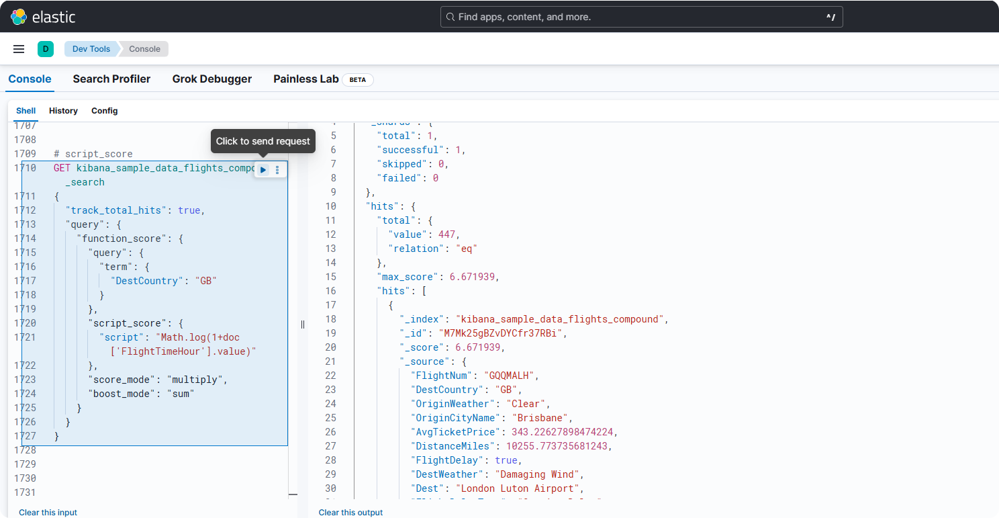

"script\_score": { // 脚本评分定义

"script": "Math.log(1+doc\['FlightTimeHour'\].value)"

},

这是整个查询的灵魂，也是最复杂的部分。

1.  ​script​：定义了一个用 ​Painless 编写的脚本。
2.  ​doc\['FlightTimeHour'\].value：
3.  doc 是脚本中可用的一个特殊对象，它提供了对当前正在被处理的文档的字段的访问。
4.  doc\['FlightTimeHour'\] 会访问当前文档的 FlightTimeHour 字段。
5.  .value 是获取该字段的数值。​非常重要​：doc\['field'\] 方式适用于非分析字段，如 keyword, numeric, date 等，并且它会将字段值加载到内存中进行计算。
6.  ​Math.log(1 + ...)​：
7.  这是 JavaScript/Painless 中的自然对数函数。
8.  1 + doc\['FlightTimeHour'\].value 是为了防止对 0 或负数取对数导致数学错误或负分。
9.  ​最终效果​：脚本的输出结果（飞行时间的对数）将作为函数分数。

**执行流程：**

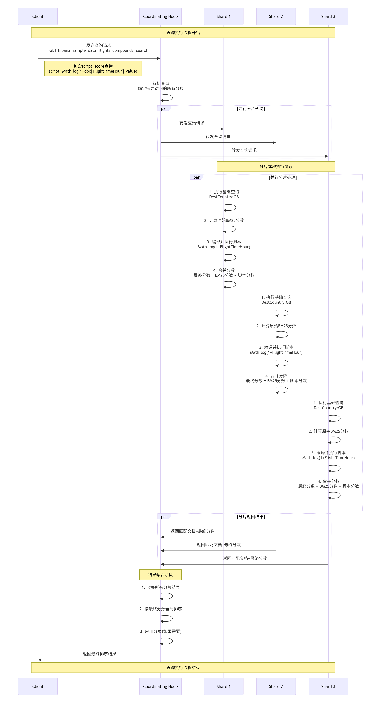

1.  查询发起​：客户端向协调节点发送搜索请求
2.  ​查询分发​：协调节点解析查询并并行分发到所有相关分片
3.  ​分片处理​：每个分片独立执行：
4.  基础查询（term查询：DestCountry为GB）
5.  计算原始BM25相关性分数
6.  ​编译并执行Painless脚本​：Math.log(1 + doc\['FlightTimeHour'\].value)
7.  合并分数：最终分数 = BM25分数 + 脚本分数（boost\_mode: sum）
8.  ​结果返回​：各分片将计算结果返回协调节点
9.  ​全局聚合​：协调节点收集所有结果，进行全局排序
10.  ​最终响应​：协调节点将排序后的最终结果返回客户端

这个查询的设计体现了 ES 作为顶级搜索引擎的极致灵活性和强大扩展能力：

1.  ​极致的灵活性 & 业务逻辑注入​：
2.  这是最核心的设计思想。script\_score 允许你将任何复杂的业务逻辑直接转化为排名算法。
3.  内置的评分模型（如 BM25）是通用型的，而脚本评分是定制型的。你可以基于文档的任何字段（如飞行时间、价格、销量、库存、地理位置、时间差等），通过任意复杂的数学公式、条件语句 (if-else) 来定义一个独一无二的排名规则。这打破了传统搜索引擎的“黑盒”，实现了排名规则的白盒化和业务化。
4.  ​沙盒化与安全性的脚本引擎​：
5.  Painless 是一种专门为 Elasticsearch 设计的安全沙盒脚本语言。它的设计目标是在提供强大功能的同时，防止恶意代码执行（如无限循环、访问文件系统等）。这种设计使得用户可以在相对安全的环境下运行自定义代码。
6.  ​分布式脚本执行​：
7.  脚本不是在协调节点上集中执行的，而是被分发到各个数据节点（Data Node）​，在持有原始数据的分片上并行执行。
8.  ​执行流程​：
9.  协调节点将查询和脚本分发到包含英国航班数据的所有分片。
10.  每个分片在自己的本地：
11.  a. 执行 term 查询，找到匹配的文档。
12.  b. ​为每一篇匹配的文档执行 script\_score 脚本，计算出一个函数分数。
13.  c. 根据 boost\_mode 规则，合并原始分和函数分，得到文档的最终分数。
14.  协调节点收集所有分片返回的结果，进行全局排序后返回给客户端。
15.  这种“移动计算而非数据”的设计最大限度地利用了集群的计算能力，避免了跨网络传输大量数据的开销。
16.  ​性能与功能的权衡​：
17.  script\_score 是 ES 中最强大但也最耗资源的查询之一。逐文档地执行脚本计算开销巨大，会显著增加查询延迟并消耗更多的 CPU。
18.  这种设计哲学明确告知用户：​​“我可以为你提供无限的可能性，但你需要为这种灵活性付出性能代价。”​​ 因此，它通常不用于高频或实时性要求极高的简单搜索，而是用于对排名有复杂要求的核心场景。
19.  ​文档访问方式​：
20.  脚本中 doc\['field'\] 的方式访问字段值，适用于需要参与评分的场景，因为它很快。但如果字段值很大，它只返回第一个值（对于数组字段）。
21.  另一种方式是 \_source\['field'\]，它访问的是原始 JSON 文档，更灵活但性能开销更大。设计上的这种区分允许用户根据需求选择性能与灵活性。

最终效果​：这个查询会返回所有飞往英国的航班，但其排名规则被彻底改变了。

1.  ​新的排名规则​：最终分数 = BM25相关性分数 + log(1 + 飞行小时数)。
2.  ​这意味着​：飞行时间越长的航班，其排名会越靠前。因为飞行时间越长，Math.log(1 + FlightTimeHour) 的值越大，与原始分相加后得到的总分就越高。
3.  ​使用对数函数的目的​：通常是为了平滑影响。飞行时间从 1 小时增加到 2 小时带来的分数提升，远大于从 10 小时增加到 11 小时。这防止了飞行时间过长的航班获得不成比例的巨大优势，使得评分曲线更加平缓合理。

script\_score 查询虽然强大但也最耗资源的查询之一：

1.  ​CPU密集型​：脚本需要在每个匹配的文档上执行，计算开销大
2.  ​内存使用​：脚本执行需要额外的内存资源
3.  ​延迟增加​：相比简单查询，脚本查询的延迟会显著增加

**优化建议：**

1.  ​尽量减少匹配文档数量​：通过添加更多过滤器减少需要执行脚本的文档数量
2.  ​使用文档值（doc\_values）​​：确保脚本访问的字段已启用 doc\_values
3.  ​脚本参数化​：将常量值作为参数传递，避免硬编码在脚本中
4.  ​考虑替代方案​：对于简单计算，优先使用 field\_value\_factor 等声明式方法

总之，script\_score 是 ES 的「**终极武器**」，它将排名的控制权完全交给了用户，让你可以基于任何可想象的业务规则来定制搜索结果的顺序。

### **2.1.8 field\_value\_factor 组合**

field\_value\_factor 的作用是用文档某个字段的值来影响相关性算分，其可以解决这样的需求： 价格优惠的优先推荐、点赞数多的优先推荐、购买量多的优先推荐等。

field\_value\_factor 提供了以下几个参数选项：

1.  field：文档的字段。
2.  factor：指定文档的值将会乘以这个因子，默认为 1。
3.  modifier：修改最终值的函数，其值可以为：none、log、log1p、log2p、ln、ln1p、ln2p、square、 sqrt、reciprocal，默认为 none。

下面示例查询的目标是：​查找所有目的地国家是英国（GB）的航班，并根据机票价格（AvgTicketPrice）动态调整相关性得分——价格越低的航班排名越高。​

\# field\_value\_factor

GET kibana\_sample\_data\_flights\_compound/\_search

{

"track\_total\_hits": true,

"query": {

"function\_score": {

"query": {

"term": {

"DestCountry": "GB"

}

},

"field\_value\_factor": {

"field": "AvgTicketPrice", // 使用机票价格字段

"factor": 1.2, // 乘数因子 1.2 意味着计算过程是 1.2 \* AvgTicketPrice

"modifier": "reciprocal", // 使用倒数修饰符，reciprocal（倒数）：计算 1 / (factor \* field\_value)。这会导致字段值越小，函数分数越高。这正是实现"价格越低，排名越高"的关键。

"missing": 1 // 缺省值

},

"boost\_mode": "multiply" // 分数合并方式 指定函数计算出的分数如何与原始查询的分数进行合并。

}

}

}

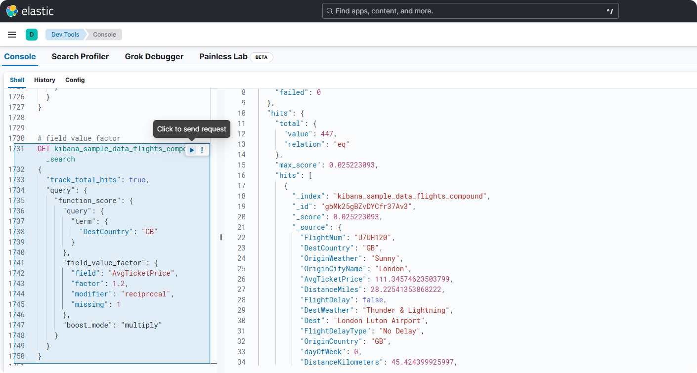

**执行流程：**

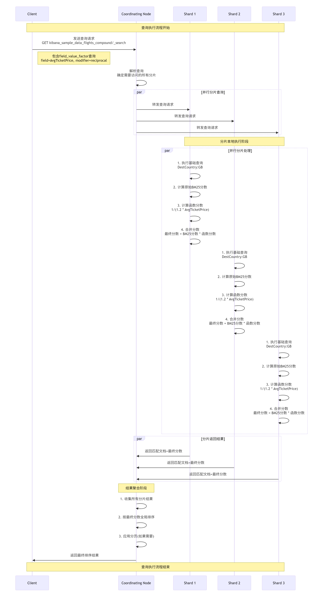

1.  查询发起​：客户端向协调节点发送搜索请求
2.  ​查询分发​：协调节点解析查询并并行分发到所有相关分片
3.  ​分片处理​：每个分片独立执行：
4.  基础查询（term查询：DestCountry为GB）
5.  计算原始BM25相关性分数
6.  计算函数分数：1 / (1.2 \* AvgTicketPrice)（reciprocal修饰符）
7.  合并分数：最终分数 = BM25分数 \* 函数分数（boost\_mode: multiply）
8.  ​结果返回​：各分片将计算结果返回协调节点
9.  ​全局聚合​：协调节点收集所有结果，进行全局排序
10.  ​最终响应​：协调节点将排序后的最终结果返回客户端

field\_value\_factor 的设计体现了 ES 在搜索相关性优化方面的几个重要理念：

1.  业务逻辑与搜索排名的融合
2.  ​设计思想​：传统的搜索引擎排名主要基于文本相关性（如 BM25）。field\_value\_factor 允许将业务指标​（如价格、销量、评分、距离等）直接融入排名算法。
3.  ​实际应用​：电子商务中"价格排序"、新闻网站中"热度排序"、本地服务中"距离排序"等场景都可以通过此功能实现。
4.  声明式编程与性能优化
5.  ​设计思想​：与通用的 script\_score 相比，field\_value\_factor 采用声明式​ approach。用户不需要编写具体脚本，只需声明要使用的字段和数学变换方式。
6.  ​优势​：这种声明式模型允许 Elasticsearch 底层进行深度优化，执行效率远高于等效的脚本实现。Elasticsearch 可以预编译这些操作，避免脚本解析和执行的开销。
7.  分布式计算模型
8.  ​执行流程​：
9.  ​查询分发​：协调节点将查询分发给所有相关分片
10.  ​并行计算​：每个分片在本地：
11.  执行基础查询（找出去往英国的航班）
12.  为每个匹配文档计算 field\_value\_factor
13.  应用 boost\_mode 规则合并分数
14.  ​结果聚合​：协调节点收集各分片结果，进行全局排序
15.  ​设计优势​：这种"移动计算到数据"的架构最小化了网络传输，充分利用了集群的并行计算能力。
16.  预定义的数学变换集合
17.  ​设计思想​：通过提供一组预定义的 modifier（none, log, log1p, log2p, ln, ln1p, ln2p, square, sqrt, reciprocal），覆盖了大多数常见的业务场景。
18.  ​实际意义​：用户不需要是数学专家就能实现复杂的排名策略。例如：
19.  reciprocal：用于"越小越好"的场景（价格、距离）
20.  log：用于平滑增长曲线（销量、点击量）
21.  square：用于放大差异（评分、权重）
22.  鲁棒性设计
23.  ​missing 参数：处理数据不完整性的优雅方案，确保查询不会因为字段缺失而失败。
24.  ​类型安全​：自动处理数值类型转换和边界条件（虽然需要避免除零错误）。

这个查询实现了一个价格敏感的搜索排名​：飞往英国的航班中，机票价格越低的航班在搜索结果中的排名越高。

> ​评分公式​：最终分数 = BM25相关性分数 × (1 / (1.2 × 平均机票价格))

field\_value\_factor 是 ES 提供的一个高效、声明式的评分调整工具，非常适合基于数值字段来影响搜索排名的场景。它体现了 ES 在搜索相关性、分布式计算和业务需求之间取得的巧妙平衡。

### **2.1.9 random\_score 组合**

当我们想要实现一个基于随机分数的简单推荐系统，随机评分函数（random\_score）可以给每个文档一个随机分数，但通过使用相同的种子（seed）和字段（field），可以确保对于相同的用户或会话，随机排序是稳定的。

下面示例查询的核心目标是：​从符合条件的航班中，随机推荐一些结果给用户，同时确保同一用户每次看到的「**随机推荐**」是一致的。​这种推荐方式虽然简单，但可以为用户提供多样化的选择，避免总是看到相同的结果。

\# random\_score

GET kibana\_sample\_data\_flights\_compound/\_search

{

"query": {

"function\_score": {

"query": {

"bool": {

"must": \[

{

"term": {

"DestCountry": "GB" // 推荐目的地为英国的航班

}

}

\],

"filter": \[

{

"range": {

"AvgTicketPrice": {

"lte": 500 // 只推荐价格不超过500的航班

}

}

},

{

"term": {

"Cancelled": false // 只推荐未取消的航班

}

}

\]

}

},

"functions": \[

{

"random\_score": {

"seed": 12345, // 使用固定种子，确保同一用户得到相同推荐，对于不同用户使用不同的种子，确保每人得到不同的推荐

"field": "\_seq\_no" // 使用序列号字段作为随机化基础，确保每个文档都有唯一值

}

}

\],

"boost\_mode": "replace" // 用随机分数完全替换原始相关性分数

}

},

"sort": \[

{

"\_score": "desc" // 按随机分数降序排列，确保最"随机"的结果排在最前面

}

\]

}

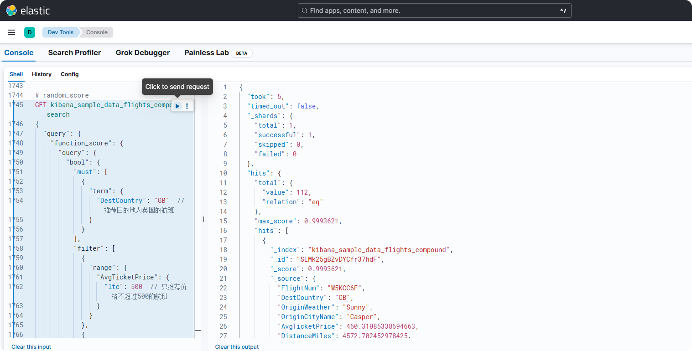

**执行流程：**

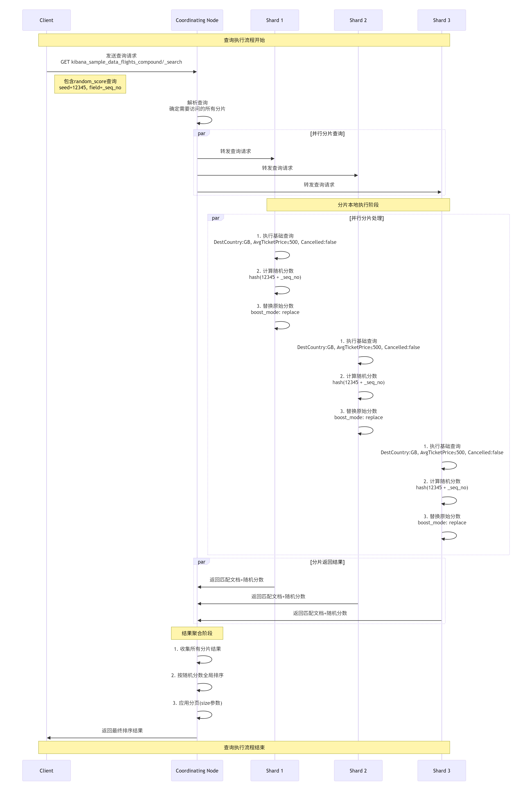

1.  查询发起​：客户端向协调节点发送搜索请求。
2.  ​查询分发​：协调节点接收查询，将其分发到所有包含 kibana\_sample\_data\_flights\_compound 索引数据的分片。
3.  ​分片执行​：每个分片在本地：
4.  执行基础查询，找出所有目的地为英国、票价≤500、未取消的航班。
5.  为每个匹配的文档计算随机分数：hash(12345 + doc\['\_seq\_no'\].value)。
6.  用随机分数替换原始分数。
7.  ​结果收集​：各分片将结果（文档ID和随机分数）返回给协调节点。
8.  ​全局排序​：协调节点收集所有结果，按随机分数进行全局排序。
9.  ​最终返回​：协调节点将排序后的结果返回给客户端。

这个查询的设计体现了几个重要的分布式系统设计理念：

1.  确定性随机化（Deterministic Randomization）
2.  ​核心思想​：random\_score 不是真正的随机，而是基于种子和字段值的确定性哈希函数。
3.  ​实现原理​：Elasticsearch 使用一个哈希函数，输入是 seed + field\_value，输出是一个0到1之间的"随机"数。
4.  ​数学表达​：random\_score = hash(seed + doc\['field'\].value)
5.  ​关键特性​：对于相同的种子和字段值，总是生成相同的"随机"分数。
6.  分布式一致性保证
7.  ​设计挑战​：在分布式环境中，如何确保同一个文档在不同分片上计算出的随机分数相同？
8.  ​解决方案​：Elasticsearch 在所有节点上使用相同的哈希算法和计算逻辑。
9.  当协调节点将查询分发给各数据分片时，每个分片使用相同的算法为本地文档计算随机分数。
10.  由于计算是确定性的（相同的输入产生相同的输出），协调节点从不同分片收集到的分数可以直接比较和合并。
11.  个性化推荐架构
12.  ​种子即身份​：通过将用户ID作为种子，你实际上创建了一个"用户专属"的随机数生成器。
13.  ​一致性体验​：同一用户每次请求都会得到相同的随机序列，确保推荐结果的一致性。
14.  ​差异化推荐​：不同用户（不同种子）会得到不同的随机序列，实现个性化推荐。
15.  性能优化设计
16.  ​轻量级计算​：哈希计算是CPU密集型操作，但现代服务器可以高效处理。
17.  ​可缓存性​：基础查询（filter部分）的结果可以被缓存，只有随机评分部分需要实时计算。
18.  ​扩展性​：随机评分可以轻松地与其他评分函数组合，实现更复杂的推荐策略。

这个查询实现了一个简单但有效的个性化随机推荐系统。其核心设计思想是通过「**确定性随机推荐**」确保分布式环境下的一致性，同时通过「**种子机制**」实现个性化推荐。

这种方案特别适合：

1.  探索性推荐（帮助用户发现新内容）。
2.  避免推荐结果过于集中或重复。
3.  为没有明确偏好的用户提供多样化选择。
4.  作为更复杂推荐系统的基线方案。

## **2.2 Range 数值范围查询**

官方文档地址：[https://www.elastic.co/guide/en/elasticsearch/reference/8.17/query-dsl-range-query.html](https://www.elastic.co/guide/en/elasticsearch/reference/8.17/query-dsl-range-query.html)

ES 支持多种范围类型，包括 integer\_range、float\_range、date\_range和ip\_range等。这些类型用于存储和查询范围值，比如时间段、IP地址范围等。其内部使用 BKD 树（一种专门用于多维数据的树结构）来索引数值字段，使得范围查询非常高效。

范围类型允许您存储和查询一个“范围”值，而不仅仅是单个值。这在处理如时间段、价格区间、IP段等场景时非常有用。

针对 kibana\_sample\_data\_flights\_compound 索引，最相关的范围查询应该是 date\_range（基于timestamp或日期字段）和 integer\_range/float\_range（基于价格或距离等数值字段）。

这里就给出两个典型示例：一个是日期范围查询（比如查询特定时间段内的航班），另一个是数值范围查询（比如查询特定价格区间的航班）。

### **2.2.1 基于 date\_range 查询航班**

假设我们想查找在特定时间段内起飞的航班，可以这么查询：

\# date\_range

GET kibana\_sample\_data\_flights\_compound/\_search

{

"query": {

"range": {

"timestamp": { // 文档中的日期时间字段，存储航班的起飞时间戳

"gte": "2025-08-20T00:00:00", // 范围的开始时间（包含）

"lte": "2025-08-22T23:59:59", // 范围的结束时间（包含）

"format": "strict\_date\_optional\_time" // 严格遵守日期格式，指定日期时间的格式，strict\_date\_optional\_time 是 ES 支持的一种严格格式

}

}

}

}

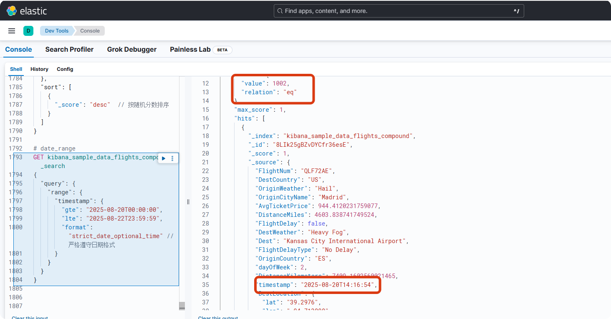

**执行流程：**

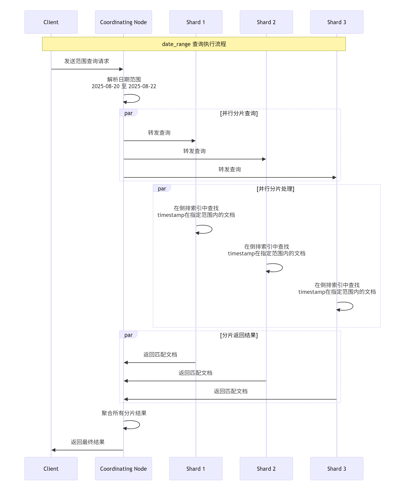

### **2.2.2 基于 double\_range 查询航班价格**

假设我们想查找票价在特定范围内的航班，可以这么查询：

\# double\_range

GET kibana\_sample\_data\_flights\_compound/\_search

{

"query": {

"range": {

"AvgTicketPrice": { // 文档中的双精度浮点数字段，存储航班的平均票价

"gte": 300.0, // 价格范围的下限（包含）

"lte": 600.0, // 价格范围的上限（包含）

"boost": 2.0 // 提高匹配文档的相关性分数

}

}

},

"sort": \[

{

"AvgTicketPrice": {

"order": "asc" // 结果排序，按价格升序排列

}

}

\]

}

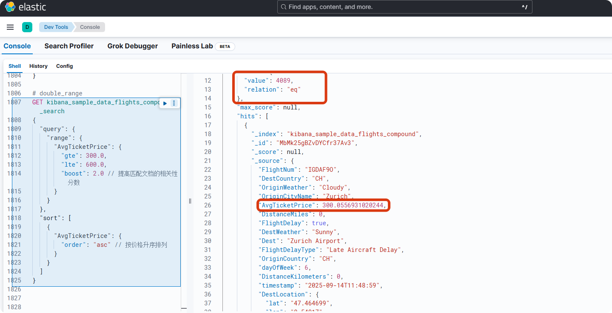

**执行流程：**

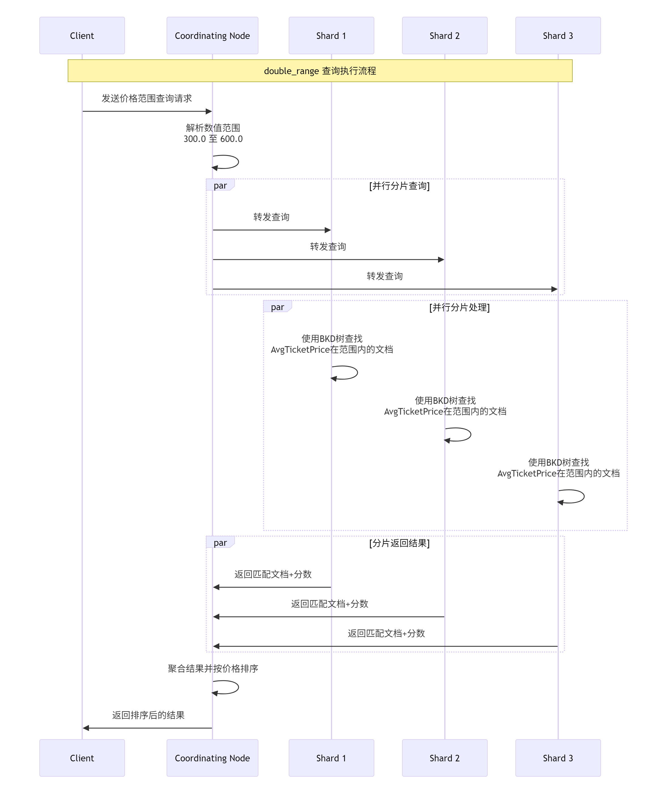

**使用场景：**

1.  日期范围查询非常适合用于:
2.  查询特定时间段内的航班
3.  分析航班延误的时间分布
4.  生成航班时刻表
5.  ​数值范围查询非常适合用于:
6.  价格区间的航班搜索
7.  距离范围的航班筛选
8.  飞行时长的条件查询

这些范围查询功能使 ES 成为处理时间序列数据、数值区间数据和IP地址范围数据的强大工具，特别适用于日志分析、监控系统和商业智能应用场景。