从今天之后的一段时间内，华仔会带着大家一起来从零开始对 ElasticStack 矩阵产品进行深入剖析和项目运维实战，希望大家学完之后可以用到自己的工作中。

这是第十七篇，本篇我将带着大家进行「**ES 使用 Script 实现复杂需求深度实战**」。

文章汇总位置：[https://wx.zsxq.com/dweb2/index/columns/51122554151214](https://wx.zsxq.com/dweb2/index/columns/51122554151214)

## **01 前言**

在上篇中 [【ES 入门实战第十六篇】ES 索引 GEO深度实战](https://articles.zsxq.com/id_v3vv9mrbgf23.html)，带着大家进行「**ES 索引 GEO 地图示例深度实战**」。

今天我们来进行「**ES 使用 Script 实现复杂需求深度实战**」。

##   
**02 Script基础知识**

## **2.1 Script 概念**

ES Script 允许您在查询、聚合、更新文档等操作中，使用自定义的逻辑来计算字段值、修改文档内容或实现复杂的查询条件。目的是满足日益复杂的业务需求。

## **2.2 Script 脚本语言**

ES支持多种脚本语言，自ES 5.0版本以后主要推荐使用Painless脚本语言，因为它是专门为ES设计的，简单、安全且高效。

1.  高性能​： 直接编译为 Java 字节码，运行效率接近原生 Java。
2.  ​安全性​： 沙箱机制，通过白名单严格限制可访问的类和方法，杜绝危险操作。
3.  ​简单易用​： 语法类似 Java/JavaScript，学习成本低。

其他语言​： Expression、Mustache（模板语言）等，但功能和性能远不及 Painless，通常不推荐用于生产环境。

## **2.3 Script 使用场景**

在前面的篇章中也时不时会用到脚本来实现一些业务需求。

1.  在查询时计算自定义得分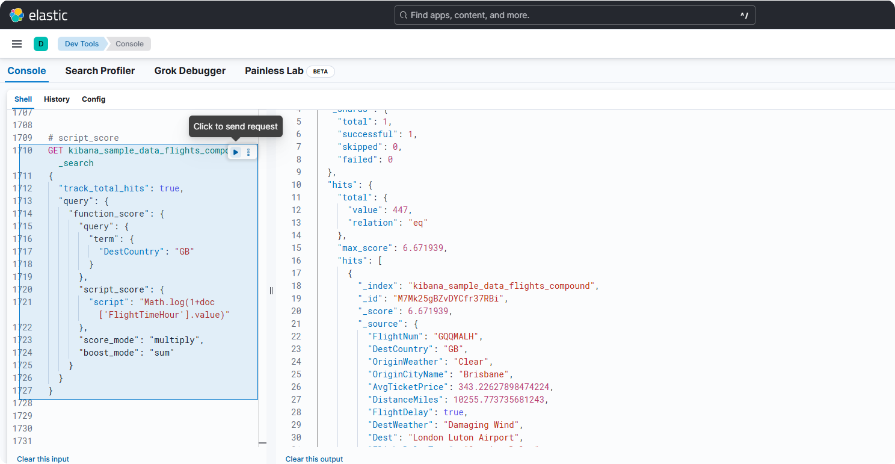
2.  更新文档时修改字段值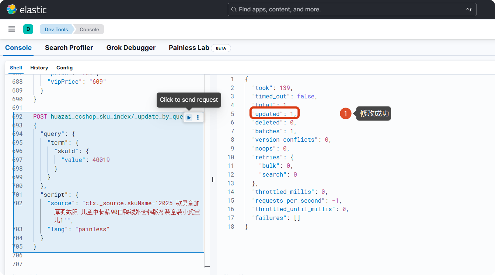
3.  重建索引时对文档进行转换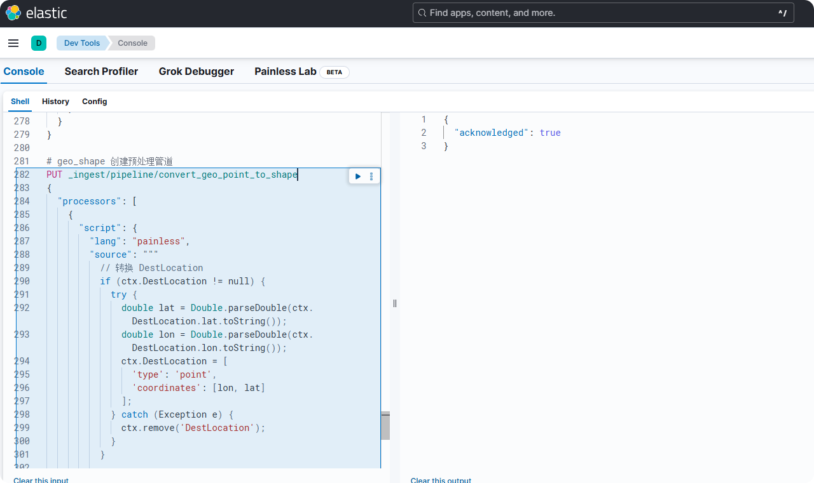

## **2.4 Script 脚本架构设计**

ES 的脚本模块设计精巧，核心目标是平衡灵活性、安全性和性能。

### **2.4.1 核心组件**

1.  脚本引擎​： 每种脚本语言（如 painless, expression）都有一个对应的脚本引擎实现。它负责将源代码编译成可执行对象。
2.  ​脚本缓存​： 这是性能的关键。为了避免每次执行都重新编译脚本，ES 使用一个 ​LRU（最近最少使用）缓存​ 来存储编译后的脚本对象。缓存键由脚本的源码（source）构成。
3.  ​沙箱安全模型​： 这是安全的关键。特别是对于 Painless 语言，它通过严格的白名单机制​ 来限制脚本可以访问的 Java 类、方法和字段。任何不在白名单上的操作都会被拒绝。
4.  ​脚本上下文​： 定义了脚本可以在哪里执行以及可以访问哪些数据。ES 为不同的用途定义了不同的上下文，例如：
5.  score上下文： 用于脚本查询，可以访问 doc值和 \_score。
6.  update上下文： 用于更新操作，可以访问 ctx.\_source。
7.  aggs上下文： 用于聚合。
8.  每个上下文允许的操作是不同的（例如，在 update上下文中才能修改 \_source）。

### **2.4.2 核心架构**

下图展示了脚本模块在 ES 节点中的静态组件构成和关系。

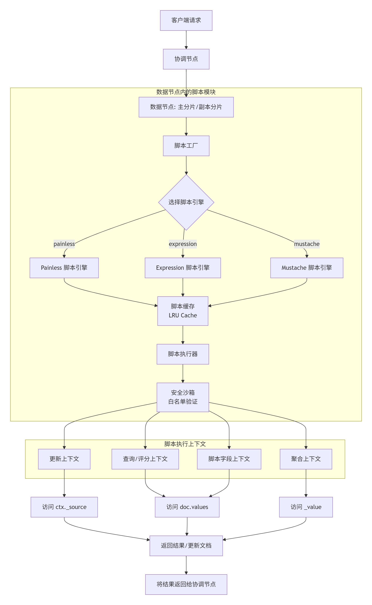

1.  分层结构​：展示了请求从客户端到数据节点的流动。
2.  ​核心组件​：突出了脚本工厂、多引擎支持、脚本缓存和安全沙箱。
3.  ​上下文隔离​：显示了不同的执行上下文如何决定了脚本能访问的变量和可执行的操作。

### **2.4.3 核心流程**

下图描述了一个脚本在数据节点上从接收到执行的动态生命周期。

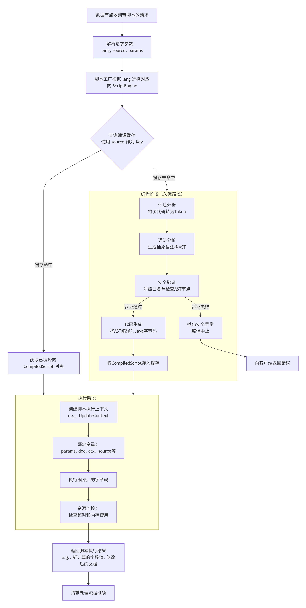

关键点说明：​​

1.  ​缓存优先​：流程的第一步就是检查缓存，这是性能优化的核心。
2.  ​编译与安全紧密耦合​：安全验证是编译过程中不可分割的一步，确保了“坏”的脚本在运行前就被拦截。
3.  ​清晰的失败路径​：安全验证失败会直接终止流程并返回错误。
4.  ​执行上下文绑定​：展示了执行阶段如何将运行时变量（如 params）和特定上下文的变量（如 doc或 ctx.\_source）注入到脚本中。

核心流程说明：

1.  解析与准备
2.  数据节点接收到包含脚本操作的请求（如 update\_by\_query）。
3.  节点解析请求体，识别出 script部分，包括 lang, source, params。
4.  根据 lang确定要使用的 ScriptEngine（例如 PainlessScriptEngine）。
5.  编译与缓存（最关键步骤）
6.  ​构建缓存键​： 系统使用脚本的源代码（source）来生成一个缓存键。​这就是为什么参数化脚本如此重要​：params的变化不会影响缓存键，因此 discount\_rate从 0.9 变为 0.8 时，脚本源码不变，可以命中缓存。
7.  ​缓存查找​： 在 LRU 编译缓存中查找该键。
8.  ​缓存命中​： 直接获取到之前已编译好的 CompiledScript对象，跳过后面的编译步骤，极大提升性能。
9.  ​缓存未命中​： 进入编译流程。
10.  ​词法分析 & 语法分析​： 将源代码解析成抽象语法树（AST）。
11.  ​安全验证​： ​这是沙箱安全的核心。编译器会遍历 AST，检查每一个表达式、每一个方法调用是否在允许的白名单内。例如，脚本中尝试执行 java.lang.System.exit(0)或访问文件系统，都会在这一步抛出异常，拒绝执行。
12.  ​代码生成​： 将验证通过的 AST 编译成 Java 字节码（对于 Painless）。
13.  ​缓存​： 将编译好的 CompiledScript对象存入 LRU 缓存，以备后续使用。
14.  执行
15.  ​创建执行上下文​： 根据操作类型（查询、更新、聚合）创建对应的 ScriptContext。这个上下文提供了脚本可以访问的变量（如 doc、\_source、params）。
16.  ​绑定参数​： 将运行时参数（params）和上下文变量绑定到脚本上。
17.  ​运行​： 脚本引擎（或 ScriptExecutor）执行编译后的字节码。对于 Painless，这通常是通过 Java 的动态语言 API 来调用生成的类和方法。
18.  ​资源限制​： ES 有防止脚本陷入无限循环的机制（通过 script.max\_compilation\_rate限制编译频率，通过断路器限制脚本执行时的内存使用）。
19.  返回结果
20.  脚本执行完毕后，将结果（例如，一个新计算的值、修改后的 \_source文档）返回给调用它的 ES 内部组件（如搜索模块、更新模块）。
21.  该组件再将最终结果整合到整个操作的响应中。

## **2.5 Script 官方文档**

官方文档地址：[https://www.elastic.co/guide/en/elasticsearch/reference/8.17/modules-scripting.html](https://www.elastic.co/guide/en/elasticsearch/reference/8.17/modules-scripting.html)

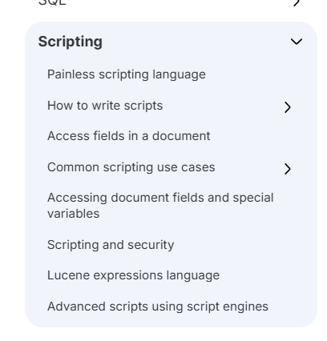

脚本类型:

1.  Painless：最丰富的强大的脚本语言
2.  Lucene：简洁高效的原生lucene脚本语言
3.  Mustache：简洁高效的template脚本语言
4.  Java：原生支持ijava高级自定义的脚本语言

  
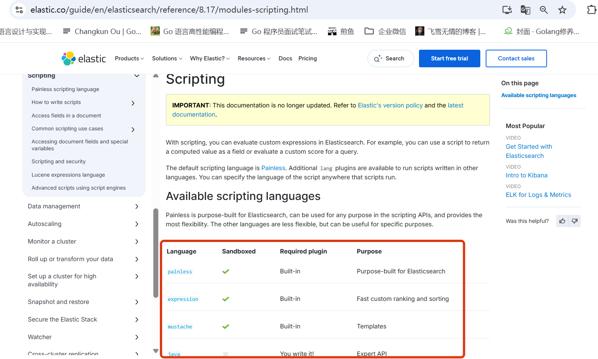

## **2.6 Script 案例**

今天的案例还是以航班数据为主，前面已经提过：

静静等待成功，如果有报错，请检查机器磁盘是否已满：

我们先来查看下 kibana\_sample\_data\_flights 的 mapping 信息：

\# 查询 ES 索引全文搜索 mapping

GET kibana\_sample\_data\_flights/\_mapping

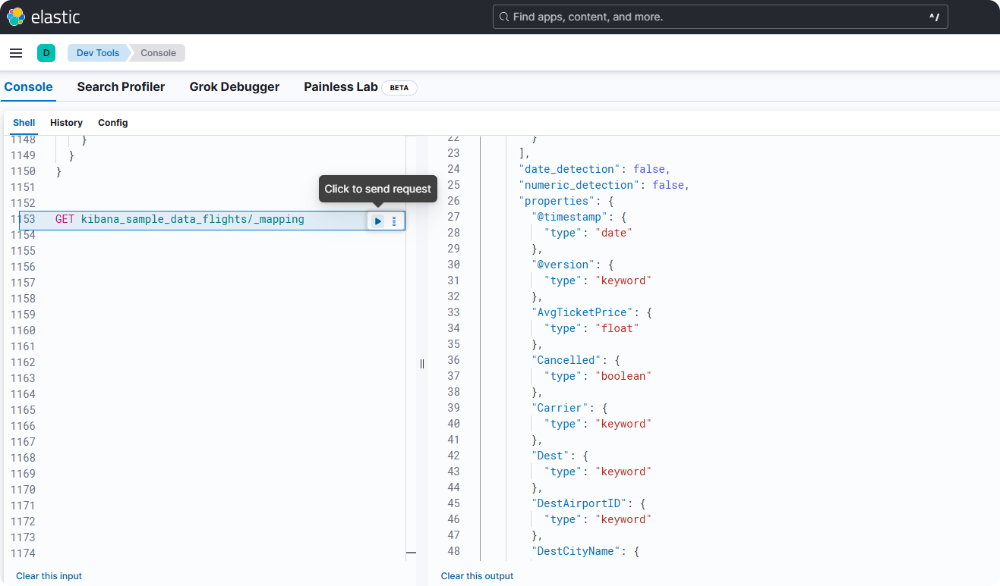

## **03 Script深度实战**

## **3.1 Script 获取上下文**

可以从下面几种方式来获取上下文数据值：

1.  \_update\_by\_query：数据更新上下文获取数据
2.  \_score：数据分值
3.  \_doc\_value：从列式获取数据值
4.  \_source：从原数据中获取数据值
5.  store：从lucene存储中获取数据值

  
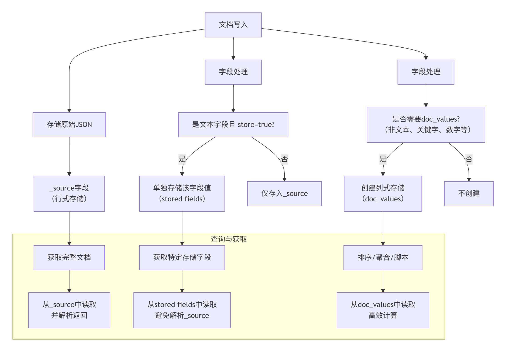

下面我们就分别举例来看下这5种获取上下文数据值的方式。

### **3.1.1 \_update\_by\_query获取上下文**

### **3.1.1.1 查询核心目标**

下面示例查询的目标是：​批量修改 kibana\_sample\_data\_flights索引中所有文档的 FlightNum字段值。将每个文档的 FlightNum重写为 OriginCountry\_DestCountry\_原FlightNum格式（例如原值 "FL001"→ "US\_FR\_FL001"）。

\# script \_update\_by\_query 获取上下文

POST kibana\_sample\_data\_flights/\_update\_by\_query

{

"script": {

"source": """

ctx.\_source.FlightNum = ctx.\_source.OriginCountry + "\_"+ ctx.\_source.DestCountry + "\_" + ctx.\_source.FlightNum

""",

"lang": "painless"

}

}

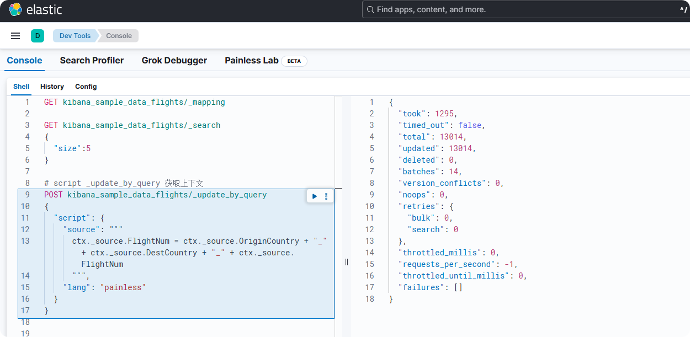

\# 检测 script \_update\_by\_query 修改结果

GET kibana\_sample\_data\_flights/\_search

{

"size":5,

"track\_total\_hits": true

}

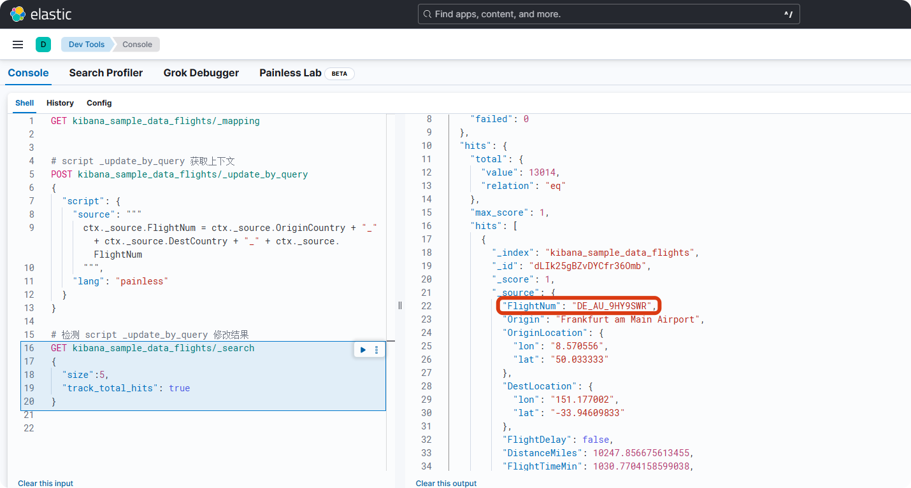

### **3.1.1.2 底层架构设计**

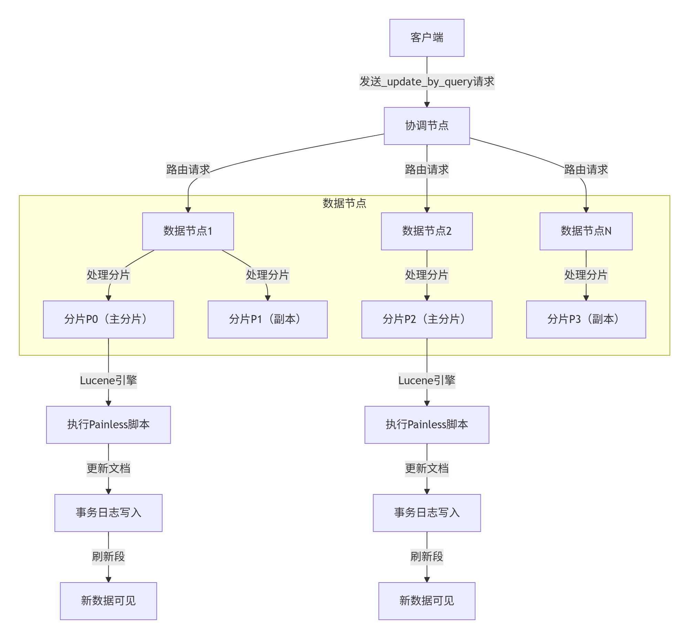

关键组件说明​：

1.  ​协调节点​：接收请求，分发到数据节点，汇总结果。
2.  ​数据节点​：存储分片，执行脚本更新。
3.  ​主分片/副本​：数据冗余存储单元。
4.  ​Lucene引擎​：底层存储库，处理索引和搜索。
5.  ​事务日志（Translog）​​：保证写入操作的持久性。
6.  ​段（Segment）​​：Lucene中的不可变数据文件，刷新后新数据可见。

### **3.1.1.3 执行流程**

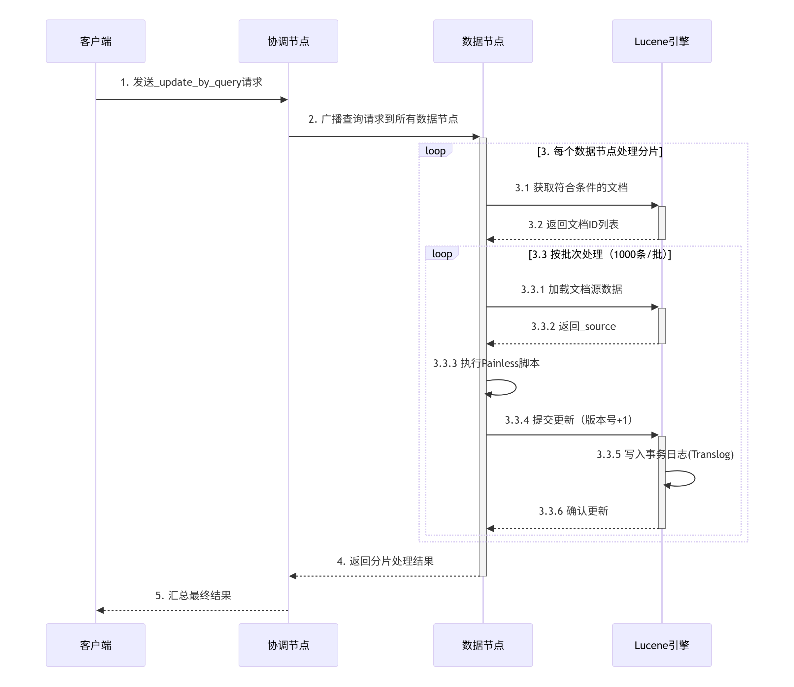

执行流程详细步骤：

1.  ​请求分发​：协调节点将请求广播到所有相关数据节点。
2.  ​分片级处理​：每个分片独立执行以下操作：
3.  ​查询阶段​：Lucene找出所有需要更新的文档ID。
4.  ​更新阶段​：
5.  分批（默认1000条）加载文档的原始数据（\_source）。
6.  对每条数据执行Painless脚本，生成新字段值。
7.  更新文档（版本号递增），写入事务日志保证原子性。
8.  ​结果汇总​：各节点返回处理结果，协调节点汇总后返回客户端。

## **3.1.2 \_score 获取上下文**

### **3.1.2.1 查询核心目标**

下面示例查询的目标是：​搜索从"开普敦国际机场"出发的航班，并通过自定义脚本对搜索结果进行动态评分。

关键功能​：

1.  ​基础过滤​：使用match查询筛选Origin字段为"Cape Town International Airport"的航班
2.  ​动态评分​：通过script\_score将原始相关性分数(\_score)乘以飞行分钟数(FlightTimeMin)
3.  ​结果排序​：最终结果按计算后的新分数降序排列（高分优先）

\# script \_score 获取上下文

GET kibana\_sample\_data\_flights/\_search

{

"track\_total\_hits": true,

"query": {

"function\_score": {

"query": {

"match": {

"Origin": "Cape Town International Airport"

}

},

"script\_score":{

"script": {

"lang": "expression",

"source": "\_score \* doc\['FlightTimeMin'\]"

}

}

}

}

}

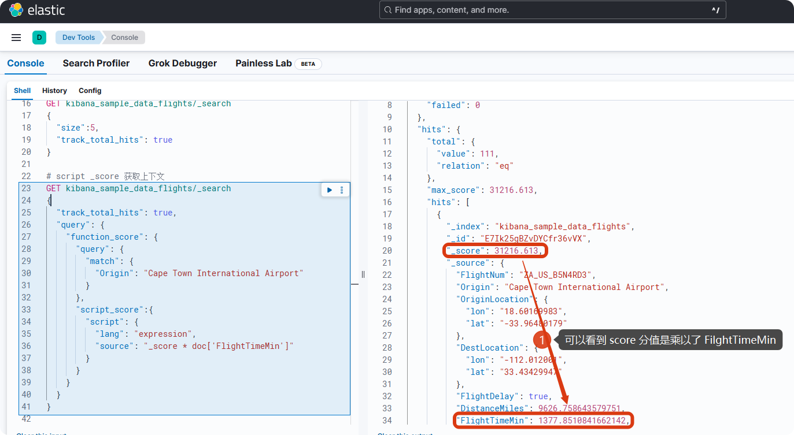

### **3.1.2.2 底层架构设计**

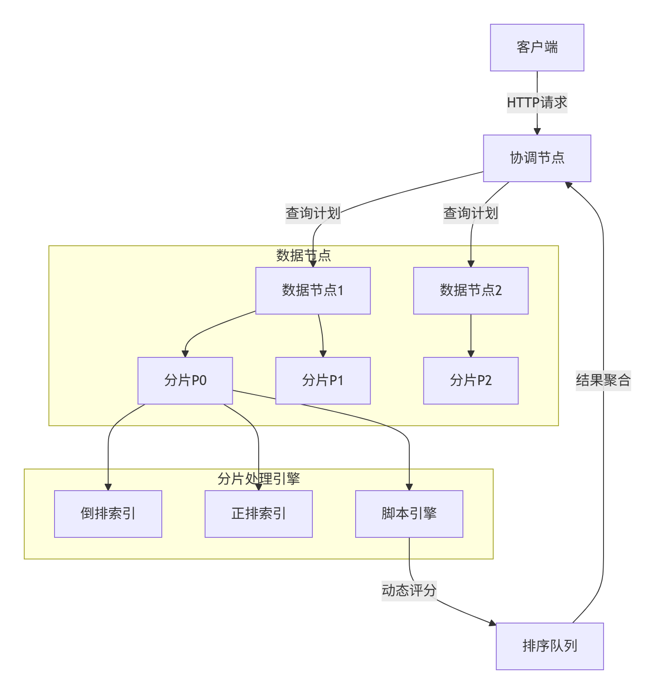

### **3.1.2.3 执行流程**

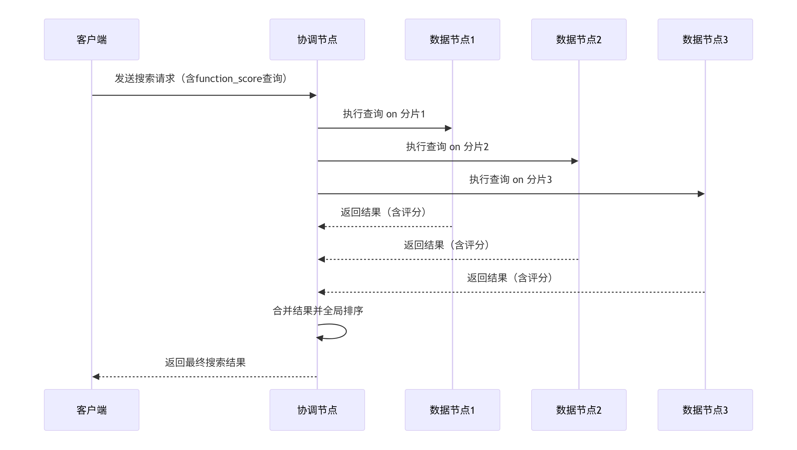

1.  客户端发送请求​：应用程序向ES集群的协调节点发送搜索请求。
2.  ​查询分发​：协调节点将查询转发给存储kibana\_sample\_data\_flights索引的所有相关数据节点​（每个索引通常有多个分片，分布在多个节点上）。
3.  ​分片本地执行​（关键步骤）：
4.  ​匹配 (Match)​​：在每个分片上，首先执行match查询，找出所有Origin字段匹配“Cape Town International Airport”的文档。
5.  ​初始评分​：ES 为这些匹配的文档计算一个初始的相关度评分 (\_score)。
6.  ​脚本评分​：对每一份匹配的文档，执行expression脚本：读取该文档的FlightTimeMin字段值，并将其与初始\_score相乘，得到一个新的最终评分。
7.  ​本地排序​：每个分片根据这个新的评分对自己的结果进行排序，并选出分数最高的前N个结果返回给协调节点。
8.  ​汇聚与全局排序​：协调节点收集所有分片返回的结果，然后根据新的脚本分数进行一次全局排序，最终选出分数最高的完整结果列表。
9.  ​返回结果​：协调节点将全局排序后的结果返回给客户端。您看到的"\_score": 31216.613就是最终计算后的分数（初始分数 × 飞行时间）。

## **3.1.3 doc\_value 获取上下文**

doc\_values 本质上是一个序列化的列式存储，这个结构非常适合「**脚本**」、「**排序**」和 「**聚合**」等操作，ES 会为绝大多数字段类型都存储 doc\_values，为数不多的例外就是分词的类型，比如 text 就不会存储 doc\_values，也不支持设置 doc\_values 属性，关闭后无法使用「**脚本**」、「**排序**」和 「**聚合**」等操作来访问这个字段。

### **3.1.3.1 查询核心目标**

下面示例查询的目标是：​使用自定义脚本评分规则对航班数据进行动态排序。

具体实现：

1.  ​基础评分​：以 AvgTicketPrice（平均票价）作为基础分数。
2.  ​奖励机制​：对未取消的航班（Cancelled=false）额外增加10%的分数。
3.  ​安全防护​：通过字段存在性检查（containsKey）和空值检查（empty）避免脚本执行错误。

最终效果：​优先展示高票价且未取消的航班，结果中可见所有文档的 \_score都接近其 AvgTicketPrice值的1.1倍。

\# script doc\_value 获取上下文

GET kibana\_sample\_data\_flights/\_search

{

"size": 5,

"query": {

"script\_score": {

"query": {

"match\_all": {}

},

"script": {

"source": """

// 安全的 doc\_value 访问

double score = 1.0;

// 数值字段直接使用

if (doc.containsKey('AvgTicketPrice') && !doc\['AvgTicketPrice'\].empty) {

score = doc\['AvgTicketPrice'\].value;

}

// 布尔字段

if (doc.containsKey('Cancelled') && !doc\['Cancelled'\].empty) {

boolean cancelled = doc\['Cancelled'\].value;

if (!cancelled) {

score \*= 1.1;

}

}

return score;

"""

}

}

},

"\_source": \["AvgTicketPrice", "Cancelled", "Carrier"\]

}

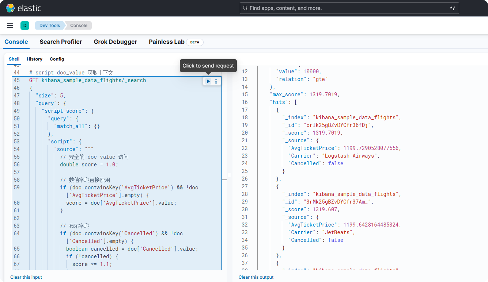

### **3.1.3.2 底层架构设计**

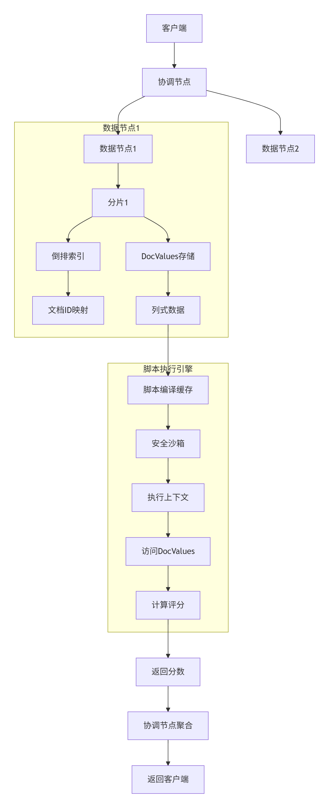

### **3.1.3.3 执行流程**

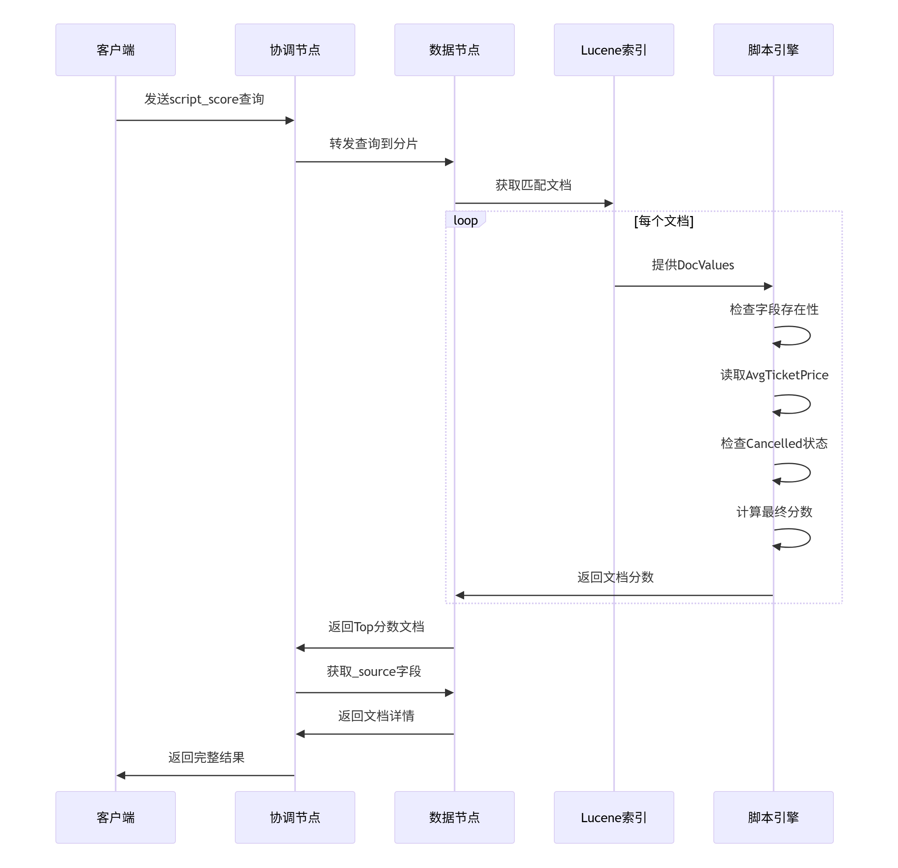

执行流程详细步骤：

1.  查询分发阶段​：
2.  协调节点解析查询，确定目标分片。
3.  将请求路由到包含 kibana\_sample\_data\_flights索引的数据节点。
4.  ​脚本准备阶段​：
5.  数据节点加载脚本并检查语法。
6.  通过LRU缓存获取编译后的字节码。
7.  初始化脚本执行上下文。
8.  ​文档处理阶段​：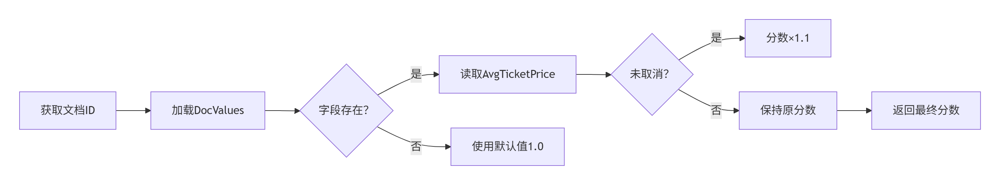
9.  结果聚合阶段​：
10.  各分片返回本地Top结果。
11.  协调节点进行全局排序。
12.  二次请求获取\_source字段。
13.  组装最终响应。

## **3.1.4 \_source 获取上下文**

\_source 存储的是 ES 的原始文档，它会占用大量的存储空间，数据会压缩存储，读取时会有额外的解压缩开销，当你的业务场景「**不需要读取原始字段值**」时可以考虑关闭。

### **3.1.4.1 查询核心目标**

下面示例查询的目标是：​通过解析原始 JSON 文档（\_source）实现自定义评分逻辑。

与 doc\_values 方式的主要区别在于：

1.  ​原始数据访问​：直接操作存储的 JSON 文档而非列式存储
2.  ​灵活性优势​：可访问未定义 doc\_values 的字段
3.  ​计算逻辑​：
4.  基础分 = AvgTicketPrice（平均票价）
5.  未取消航班（Cancelled=false）额外获得 10% 加分
6.  ​安全机制​：通过 containsKey检查字段存在性

结果展示：所有文档的 \_score均为 AvgTicketPrice × 1.1（未取消航班），证明脚本正确访问了原始 JSON 数据。

\# script \_source 获取上下文

GET kibana\_sample\_data\_flights/\_search

{

"size": 5,

"query": {

"script\_score": {

"query": {

"match\_all": {}

},

"script": {

"source": """

// 安全的 source 访问

double score = 1.0;

// 直接访问原始 JSON 字段

if (params.\_source.containsKey('AvgTicketPrice')) {

score = params.\_source.AvgTicketPrice;

}

// 布尔字段处理

if (params.\_source.containsKey('Cancelled')) {

boolean cancelled = params.\_source.Cancelled;

if (!cancelled) {

score \*= 1.1;

}

}

return score;

"""

}

}

},

"\_source": \["AvgTicketPrice", "Cancelled", "Carrier"\]

}

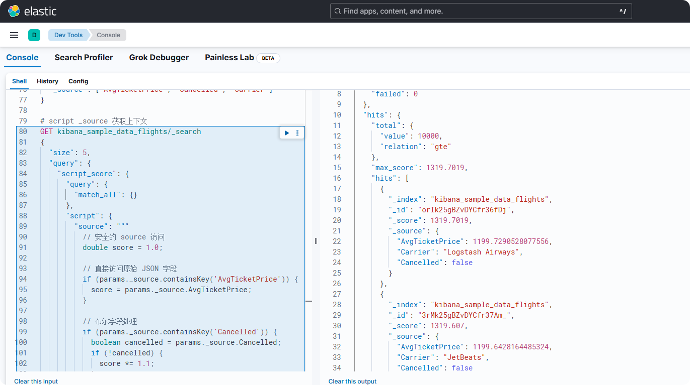

### **3.1.4.2 底层架构设计**

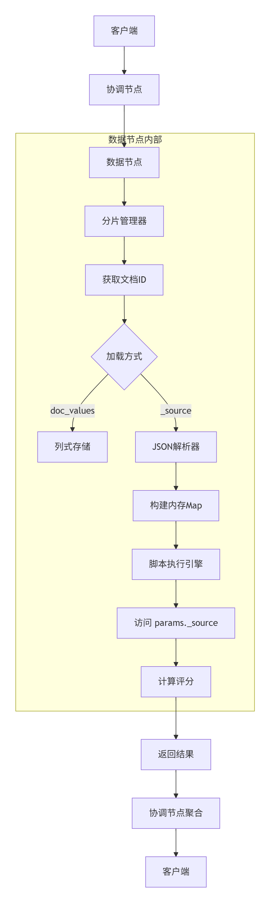

### **3.1.4.3 执行流程**

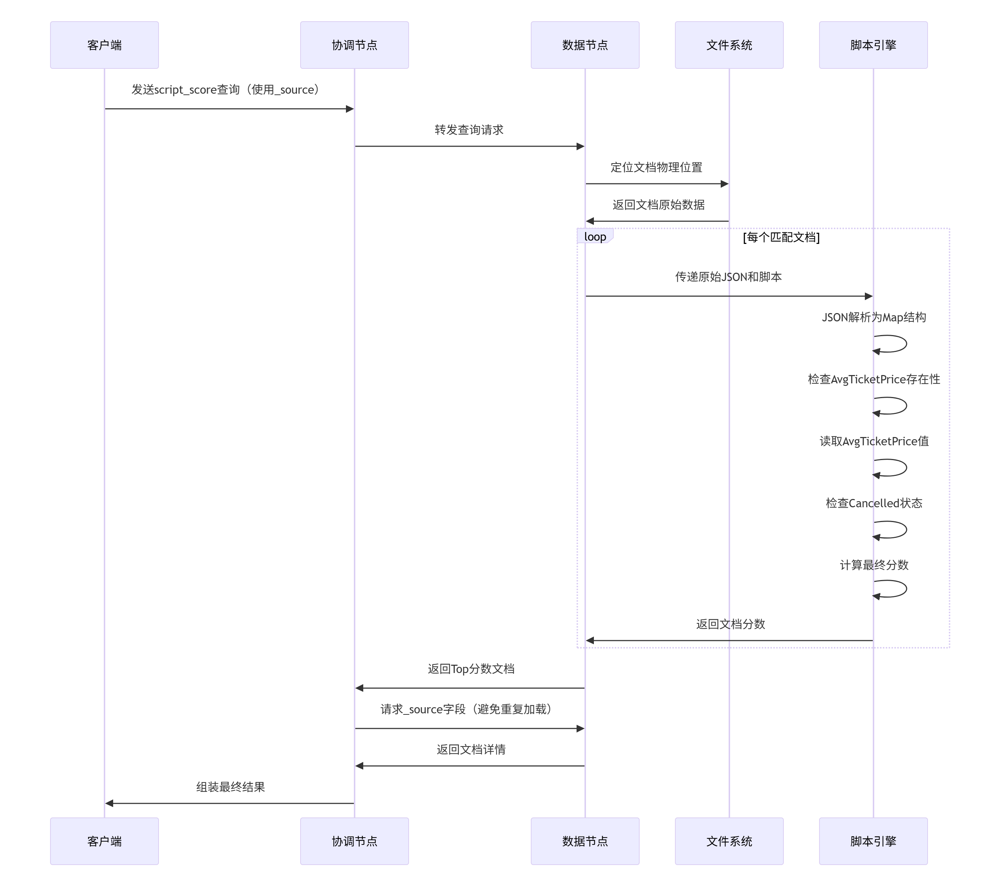

执行流程详细步骤：

1.  查询分发阶段​：
2.  客户端发起请求​：应用程序向 ES集群发送包含 script\_score查询的搜索请求
3.  ​协调节点接收​：请求首先到达协调节点，协调节点作为查询入口点
4.  ​查询解析​：协调节点解析查询结构，识别出需要使用 \_source进行脚本评分
5.  ​路由确定​：根据索引分片分布，确定需要查询哪些数据节点
6.  ​请求转发​：将查询分发到包含相关分片的数据节点
7.  数据加载与准备​：
8.  数据节点处理​：各个数据节点接收协调节点转发的查询请求
9.  ​文档定位​：数据节点通过倒排索引定位匹配文档的物理存储位置
10.  ​文件系统读取​：从磁盘文件系统中读取文档的原始 \_source数据
11.  ​数据加载​：将完整的 JSON 源文档加载到内存中
12.  ​JSON解析​：解析 JSON 字符串，构建为内存中的 Map 数据结构
13.  ​脚本执行与评分计算​：
14.  脚本环境准备​：为每个匹配文档创建独立的脚本执行环境
15.  ​数据注入​：将解析后的 Map 结构注入到脚本的 params.\_source变量中
16.  ​字段存在性检查​：执行 params.\_source.containsKey('AvgTicketPrice')检查
17.  ​数值读取​：如果字段存在，读取 params.\_source.AvgTicketPrice值
18.  ​状态检查​：检查 params.\_source.Cancelled布尔值状态
19.  ​评分计算​：根据业务逻辑计算最终分数（未取消航班分数 ×1.1）
20.  ​分数返回​：脚本执行完毕，返回计算出的文档评分
21.  结果聚合阶段​：
22.  分片结果收集​：各数据节点完成本地评分后，返回 Top N 结果给协调节点
23.  ​全局排序​：协调节点对所有分片返回的结果进行全局合并排序
24.  ​详情获取​：协调节点向数据节点二次请求排名靠前文档的 \_source字段
25.  ​避免重复加载​：数据节点利用缓存避免重复解析 \_source（优化点）
26.  ​响应组装​：协调节点将分数与文档详情组装成完整响应
27.  ​结果返回​：最终搜索结果返回给客户端应用程序

## **3.1.5 store 获取上下文**

它表示是否单独存储该字段的原始值，默认关闭（false），它与 \_source 是独立的，开启后会占用额外的存储空间。如果同时开启 \_source 和 store，就会将这个字段的原始内存保存 2 份，开启 store 属性的字段就会被单独存储，并且这些数据在磁盘上的存储是 「**不连续**」的，此时要读取多个字段就需要在磁盘上执行多次「**seek**」才能取回。

这时就需要权衡比较 \_source 和 store 的效率了，此时细心的老铁可能会有这样的疑问：「**既然 \_source 中已经存储了原始文档，那么为什么还需要额外的 store 属性呢？**」

1.  禁用 \_source 之后，可以指定 store 属性来单独保存某个或某几个字段。
2.  如果 \_source 中长文本，短文本共存时，当你只需要读取短文本时，如果使用 \_source 属性，ES 需要读取全部字段后返回其中的短文本，因此就会引入额外的开销，降低读取的效率，单独通过 store 保存短文本取出效率更高。
3.  设置 store 属性为 true，读取时不必在读取整个 source字段了。

### **3.1.5.1 创建mapping**

默认是 store 是 false，无法获取，比如：

\# script \_store 获取上下文 未设置 store=true

GET kibana\_sample\_data\_flights/\_search

{

"stored\_fields": \["DestLocation"\]

}

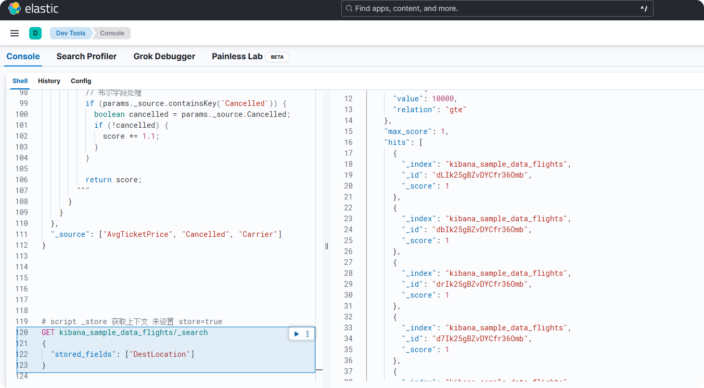

需要重建mapping，这里将 OriginCityName、OriginCountry、DestCityName、DestCountry、OriginAirportID字段设置 store 为 true。

\# script 创建 store 类型 mapping

PUT /kibana\_sample\_data\_flights\_store

{

"mappings": {

"dynamic": "strict",

"dynamic\_templates": \[

{

"strings\_as\_keywords": {

"match\_mapping\_type": "string",

"mapping": {

"ignore\_above": 256,

"type": "keyword"

}

}

},

{

"numbers\_as\_floats": {

"match\_mapping\_type": "long",

"mapping": {

"type": "float"

}

}

}

\],

"date\_detection": false,

"numeric\_detection": false,

"properties": {

"@timestamp": {

"type": "date"

},

"@version": {

"type": "keyword"

},

"AvgTicketPrice": {

"type": "float"

},

"Cancelled": {

"type": "boolean"

},

"Carrier": {

"type": "keyword"

},

"Dest": {

"type": "keyword"

},

"DestAirportID": {

"type": "keyword"

},

"DestCityName": {

"type": "keyword",

"store": true

},

"DestCountry": {

"type": "keyword",

"store": true

},

"DestLocation": {

"type": "geo\_point"

},

"DestRegion": {

"type": "keyword"

},

"DestWeather": {

"type": "keyword"

},

"DistanceKilometers": {

"type": "float"

},

"DistanceMiles": {

"type": "float"

},

"FlightDelay": {

"type": "boolean"

},

"FlightDelayMin": {

"type": "integer"

},

"FlightDelayType": {

"type": "keyword"

},

"FlightNum": {

"type": "keyword"

},

"FlightTimeHour": {

"type": "keyword"

},

"FlightTimeMin": {

"type": "float"

},

"Origin": {

"type": "keyword"

},

"OriginAirportID": {

"type": "keyword",

"store": true

},

"OriginCityName": {

"type": "keyword",

"store": true

},

"OriginCountry": {

"type": "keyword",

"store": true

},

"OriginLocation": {

"type": "geo\_point"

},

"OriginRegion": {

"type": "keyword"

},

"OriginWeather": {

"type": "keyword"

},

"dayOfWeek": {

"type": "integer"

},

"event": {

"properties": {

"created": {

"type": "date"

},

"dataset": {

"type": "keyword"

},

"ingested": {

"type": "date"

}

}

},

"tags": {

"type": "keyword"

},

"timestamp": {

"type": "date"

}

}

}

}

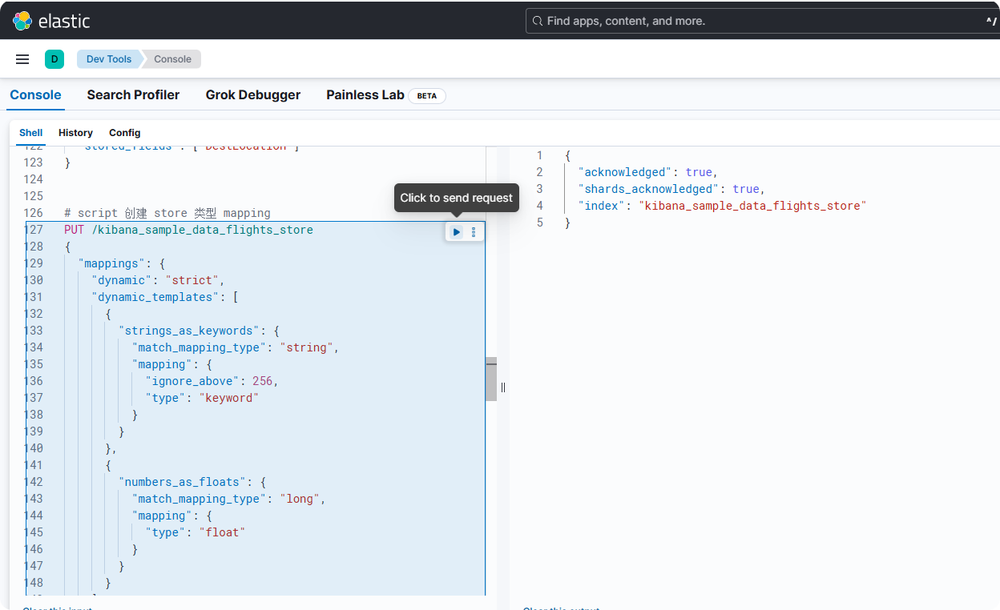

### **3.1.5.3 重建索引**

接着进行索引重建：

\# 重建索引 store

POST \_reindex

{

"source": {

"index": "kibana\_sample\_data\_flights"

},

"dest": {

"index": "kibana\_sample\_data\_flights\_store"

}

}

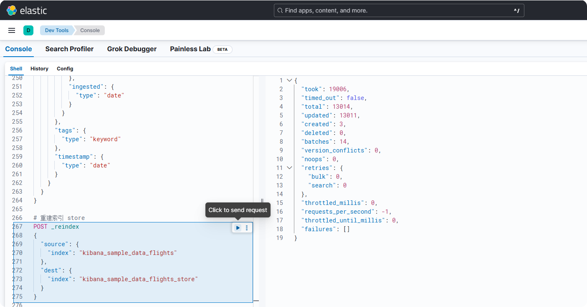

### **3.1.5.4 再次 Store 查询**

### **3.1.5.4.1 查询核心目标**

上面示例查询的目标是：​​通过存储字段（stored fields）机制高效检索特定字段，避免加载完整文档。

具体特点：

1.  ​字段级存储​：只获取预先定义为 store: true的字段
2.  ​性能优化​：直接读取字段存储，跳过 \_source解析
3.  ​结果精简​：返回结果中只包含请求的5个字段
4.  ​默认评分​：使用简单匹配，所有文档 \_score为1

\# script \_store 获取上下文

GET kibana\_sample\_data\_flights\_store/\_search

{

"stored\_fields": \["DestCityName","DestCountry","OriginAirportID","OriginCityName","OriginCountry"\]

}

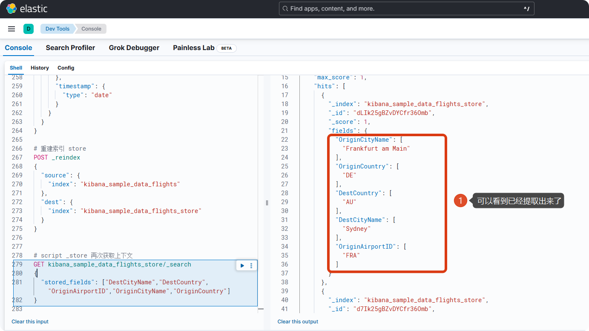

### **3.1.5.4.2 底层架构设计**

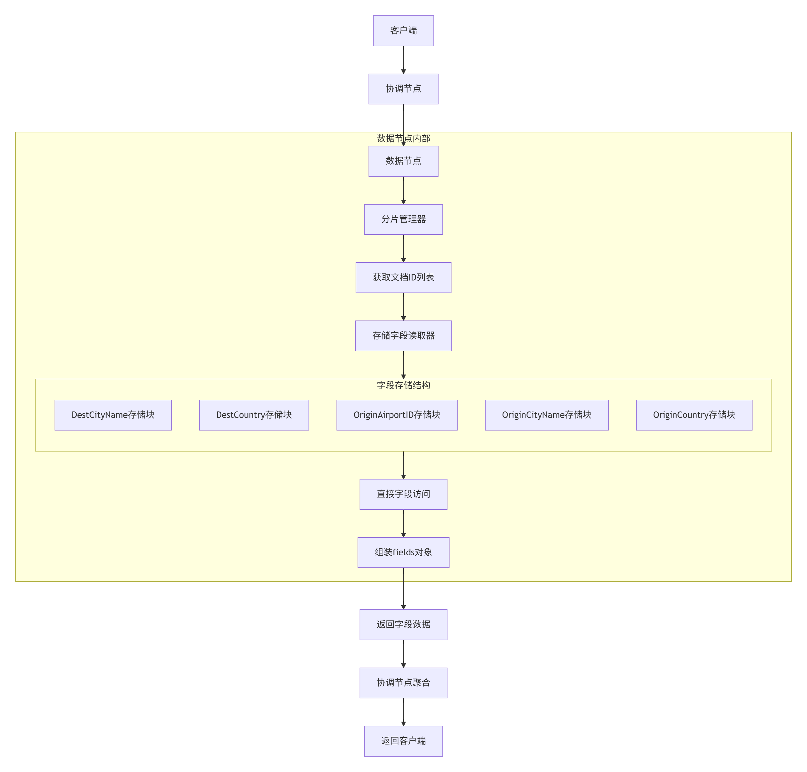

### **3.1.5.4.3 执行流程**

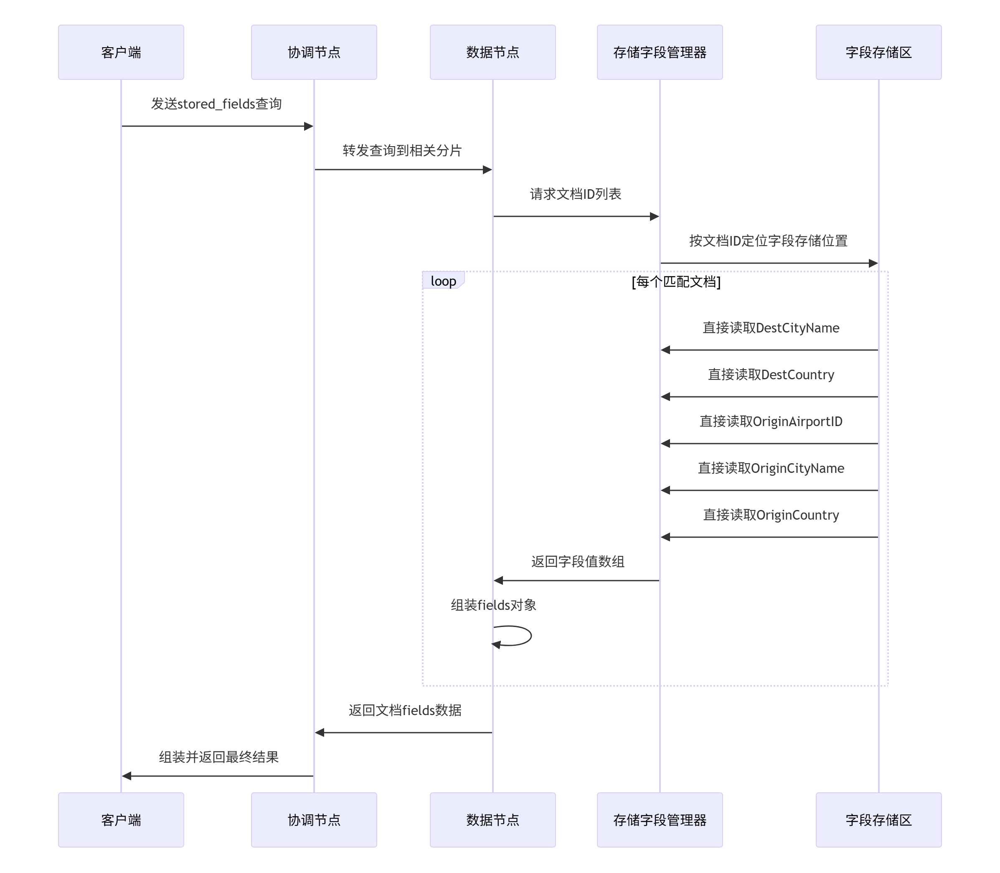

1.  查询分发阶段​：
2.  ​客户端准备查询​：应用程序构建包含 stored\_fields参数的搜索请求
3.  ​字段明确指定​：在请求中精确列出需要检索的字段名称
4.  ​查询条件设置​：可能包含过滤条件或使用默认的 match\_all
5.  ​网络传输​：通过 HTTP/REST API 将请求发送到 ES协调节点
6.  协调节点处理阶段
7.  请求接收​：协调节点作为集群入口接收客户端请求
8.  ​语法解析​：解析 JSON 查询体，识别 stored\_fields参数
9.  ​分片定位​：根据索引分片分布确定需要查询的数据节点
10.  ​查询分发​：将查询并行分发到包含相关分片的所有数据节点
11.  数据节点执行阶段：
12.  ​查询执行​：各数据节点在本地分片上执行查询，获取匹配文档ID列表
13.  ​存储字段管理器初始化​：创建专门处理存储字段的组件实例
14.  ​文档遍历准备​：准备按文档ID顺序处理每个匹配文档
15.  字段读取阶段（核心）​：
16.  文档定位​：对于每个匹配文档，通过文档ID定位到字段存储的物理位置
17.  ​字段存储区访问​：直接访问独立的字段存储区块，跳过 \_source解析
18.  ​顺序字段读取​：
19.  DestCityName：读取目的地城市名称
20.  DestCountry：读取目的地国家代码
21.  OriginAirportID：读取起飞机场ID
22.  OriginCityName：读取起飞城市名称
23.  OriginCountry：读取起飞国家代码
24.  ​值数组组装​：将每个字段的值封装为数组格式（ES标准格式）
25.  结果构建阶段：
26.  字段对象创建​：为每个文档创建 fields对象，包含所有请求的字段
27.  ​结果文档构建​：组装包含 \_index, \_id, \_score, fields的完整文档结果
28.  ​本地排序筛选​：数据节点对本地结果进行排序和数量限制（如 size参数）
29.  返回数据阶段：
30.  结果收集​：协调节点收集所有数据节点返回的分片结果
31.  ​全局合并​：对来自不同分片的结果进行全局排序和合并
32.  ​响应组装​：组装符合 REST API 标准的 JSON 响应
33.  ​结果返回​：通过 HTTP 响应将最终结果返回给客户端

## **3.2 Script 常规 API**

下面给大家介绍几个 Script API 示例，对帮助理解 Script 脚本非常有帮助。

官方英文文档地址：[https://www.elastic.co/guide/en/elasticsearch/reference/8.17/script-apis.html](https://www.elastic.co/guide/en/elasticsearch/reference/8.17/script-apis.html)

官方中文文档地址：[https://elastic.ac.cn/guide/en/elasticsearch/reference/current//script-apis.html](https://elastic.ac.cn/guide/en/elasticsearch/reference/current//script-apis.html)

## **3.2.1 \_script\_context 脚本上下文**

### **3.2.1.1 查询核心目标**

下面示例查询的目标是：​获取ES集群支持的所有脚本上下文信息。

具体包括：

1.  ​脚本上下文清单​：展示所有可用的脚本执行环境
2.  ​方法签名详情​：每个上下文支持的API方法和参数类型
3.  ​开发调试支持​：为脚本开发提供完整的API参考
4.  ​版本兼容性检查​：确认当前集群支持的脚本功能

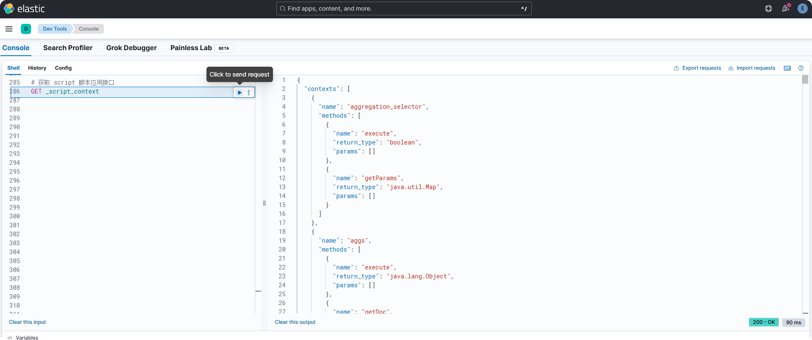

结果内部字段详解:

**1、上下文级别字段**

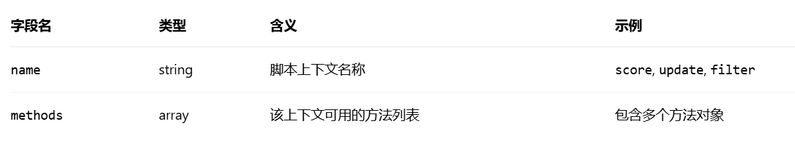

### **2、方法级别字段**

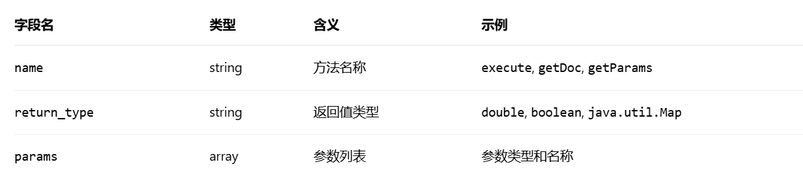

### **3.2.1.2 底层架构设计**

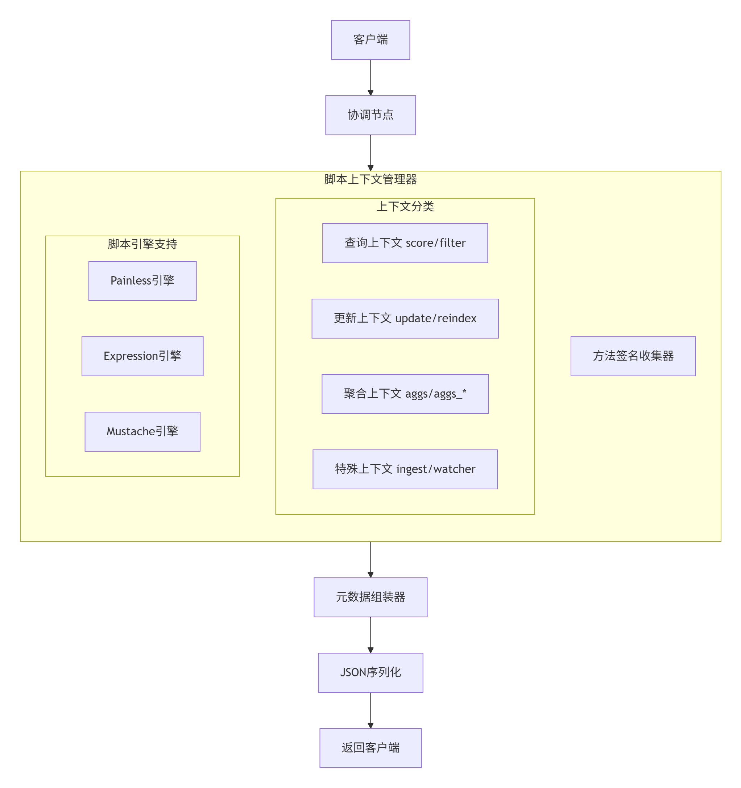

### **3.2.1.3 执行流程**

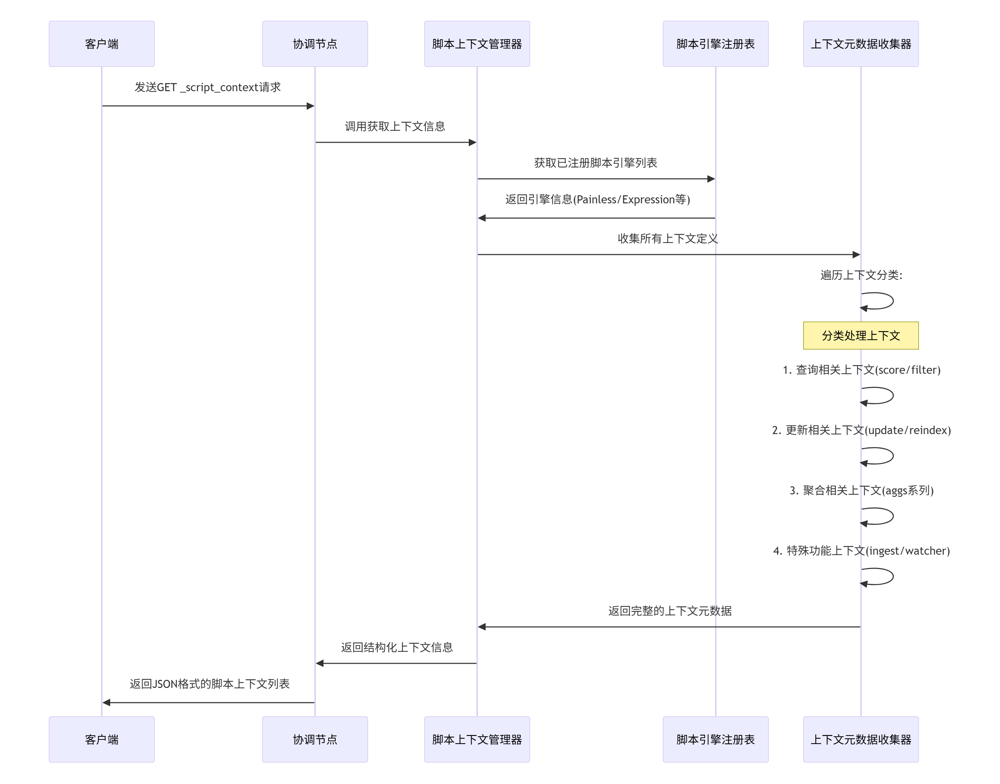

执行流程详细步骤：

###   
**1、请求接收与路由**

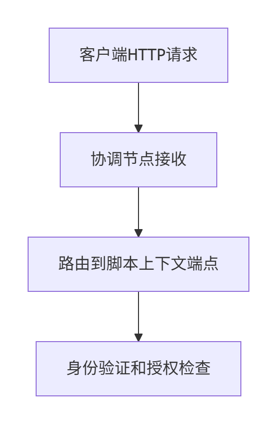

1.  HTTP请求接收​：协调节点接收 GET \_script\_context请求
2.  ​端点路由​：识别为脚本上下文元数据查询端点
3.  ​安全验证​：检查用户权限（需要监控或管理权限）
4.  ​请求解析​：解析请求参数（此API通常无参数）

### **2、元数据收集阶段**

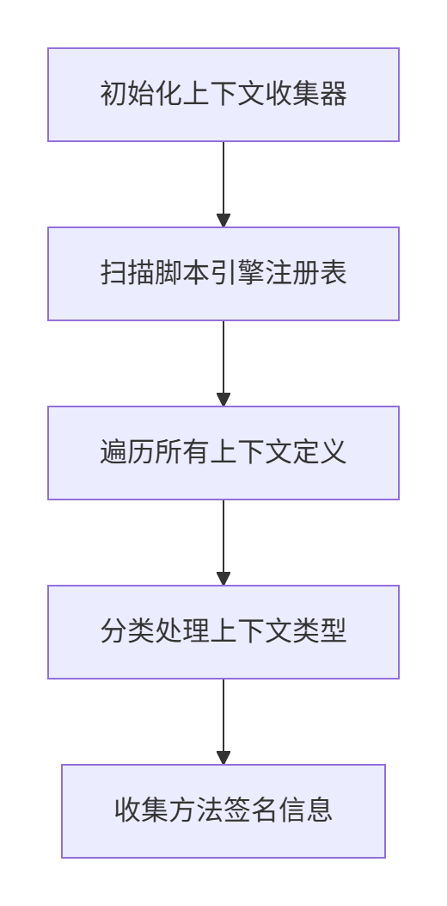

1.  引擎发现​：扫描所有已注册的脚本引擎（Painless、Expression等）
2.  ​上下文枚举​：获取每个引擎支持的上下文类型
3.  ​方法签名提取​：对每个上下文提取可用的方法和参数
4.  ​返回类型推断​：确定每个方法的返回类型签名

### **3、数据结构组装**

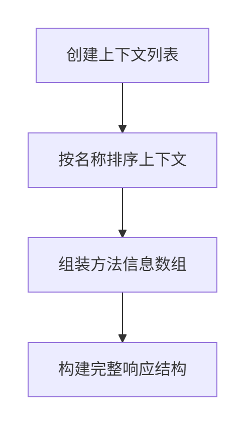

1.  列表初始化​：创建空的上下文列表结构
2.  ​上下文排序​：按字母顺序排列上下文名称便于阅读
3.  ​方法信息填充​：为每个上下文填充methods数组
4.  ​参数详情添加​：包含每个方法的参数类型和名称

### **4、响应返回**

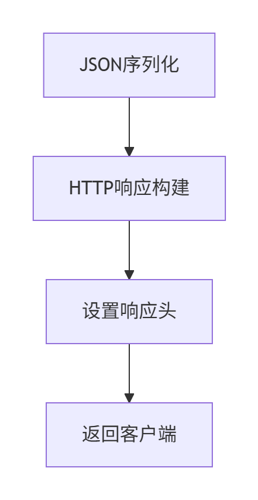

1.  数据序列化​：将内部数据结构序列化为JSON格式
2.  ​响应构建​：构建标准的HTTP响应
3.  ​内容类型设置​：设置为application/json
4.  ​结果返回​：通过HTTP响应返回给客户端

### **3.2.1.4 关键脚本上下文拆解**

上下文结果集很多，大概 840 行，这里我们拆解一些关键的脚本上下文，上下文分类架构图如下：

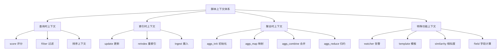

执行上下文选择指南：

### **1、查询评分上下文（score）**

核心用途​：自定义文档评分算法。

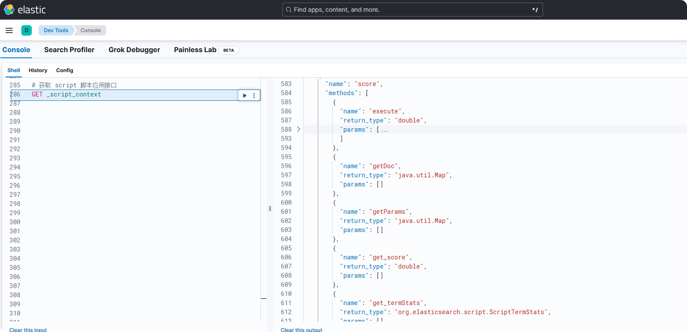

### **2、文档过滤上下文（filter）**

核心用途​：自定义文档过滤条件

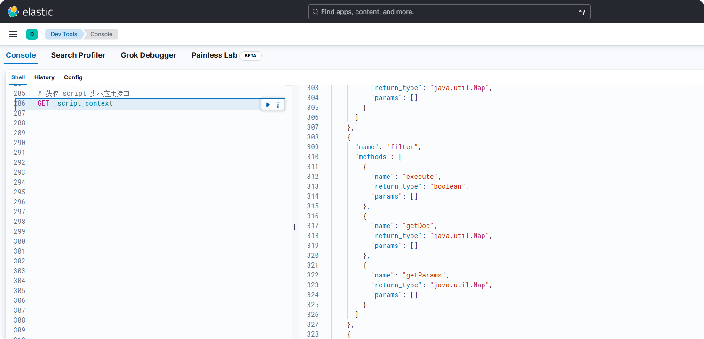

### **3、文档更新上下文（update）**

核心用途​：文档更新操作，支持字段修改，可访问ctx.\_source

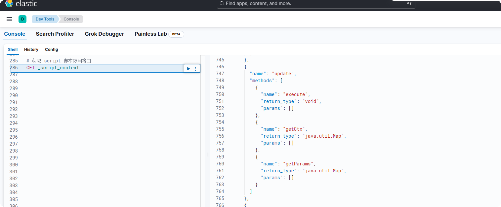

### **4、聚合处理上下文（aggs系列）**

完整的聚合处理链包含4个关键上下文：

1.  aggs\_init - 聚合初始化 其用途​：聚合操作前的初始化准备
2.  aggs\_map - 文档映射处理 其用途​：处理单个文档的聚合计算
3.  aggs\_combine - 分片结果合并 其用途​：合并同一分片内的聚合结果
4.  aggs\_reduce - 全局结果归约 其用途​：跨分片聚合结果的最终计算

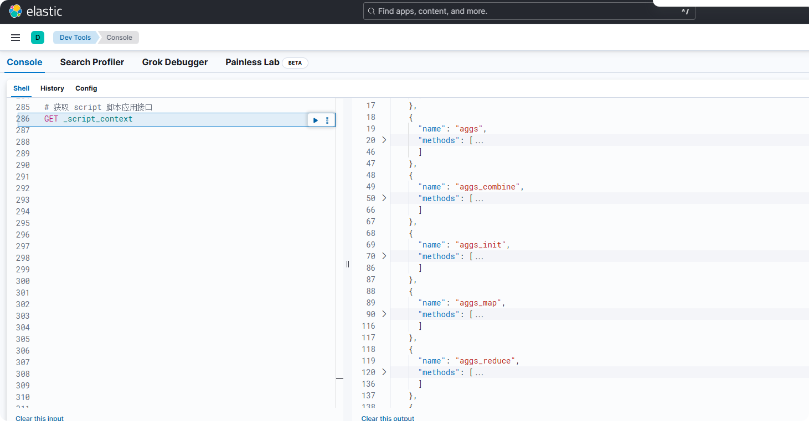

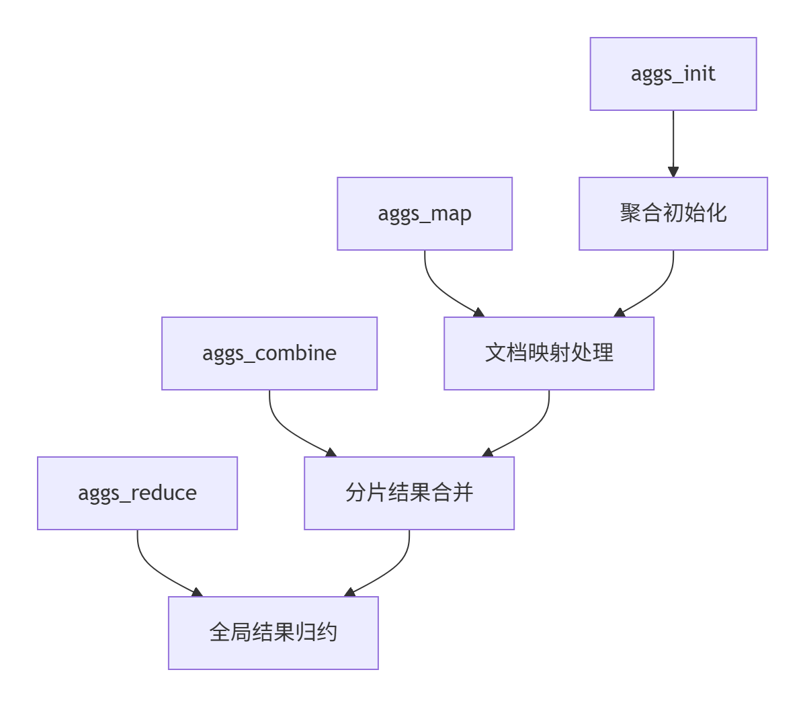

### **5、数据摄入上下文（ingest）**

核心用途​：在数据摄入 Pipeline 管道中处理文档

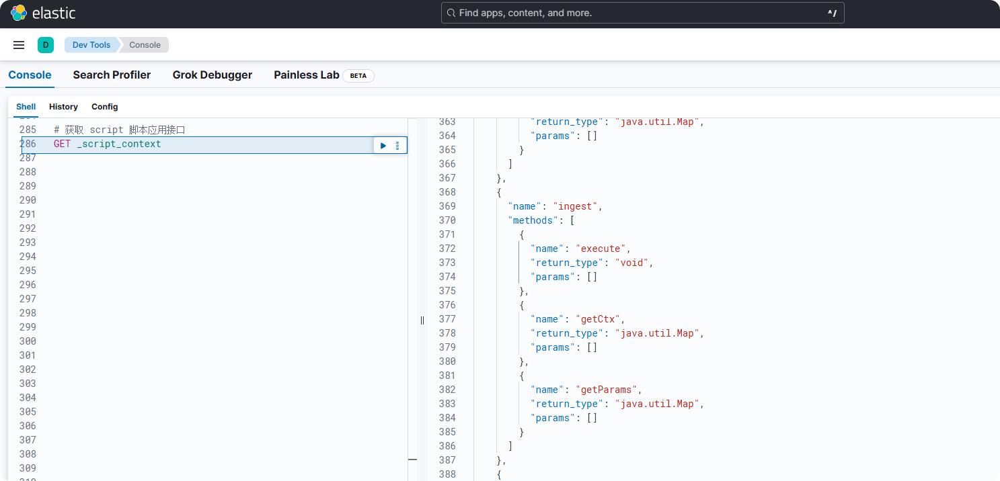

### **6、重建索引上下文（reindex）**

核心用途​：在重新索引过程中转换文档结构

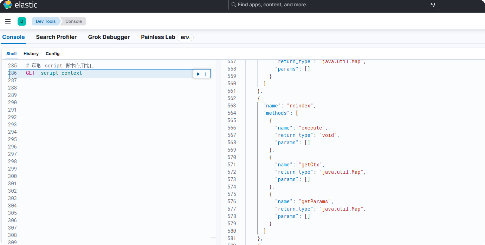

### **7、字段类型上下文（按字段类型分类）**

### **7.1、数值字段类型上下文**

核心用途​：数值字段的脚本处理

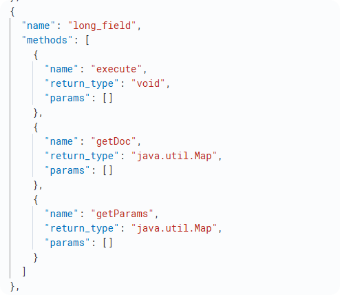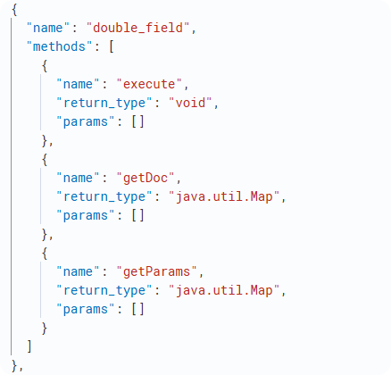

### **7.2、文本字段类型上下文**

核心用途​：关键字字段的多值处理

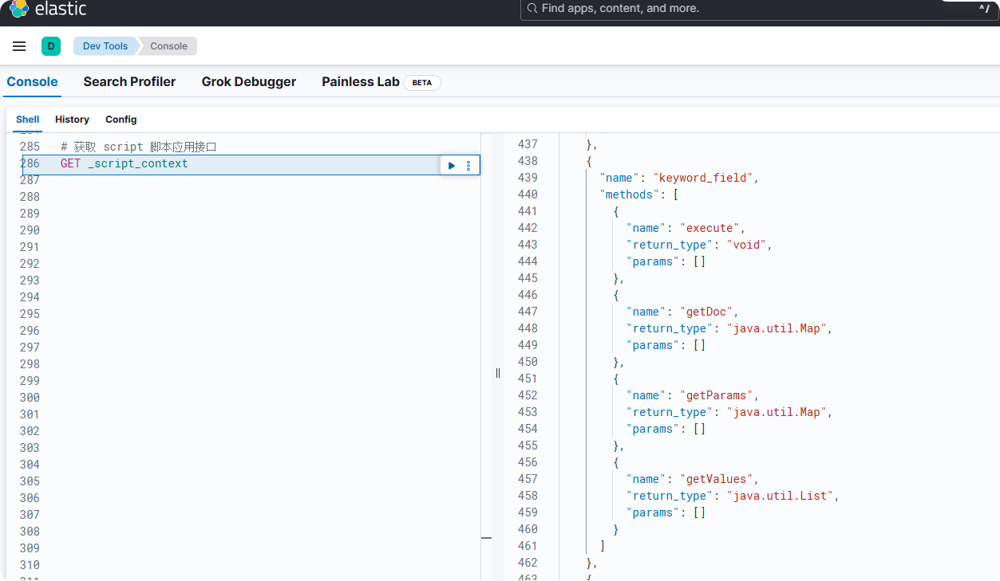

### **7.3、地理字段类型上下文**

​核心用途​：地理位置计算和验证

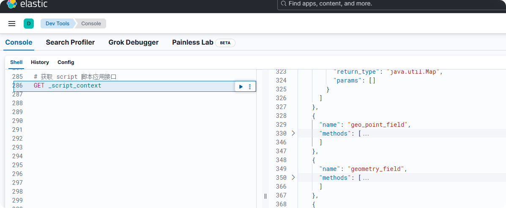

### **8、排序上下文（sort）**

核心用途​：自定义文档排序规则


### **9、模板渲染上下文（template）**

核心用途​：动态模板渲染和文本生成


### **10、监控告警上下文（watcher）**

核心用途​：告警条件判断和数据转换


### **11、字段计算上下文（field）**

核心用途​：运行时字段计算


### **12、相似度计算上下文（similarity）**

​核心用途​：自定义搜索相似度算法


## **3.3 Painess脚本基础与语法**

​在实战之前，先来看下 Painess 脚本的基础知识。

### **3.3.1 Painess脚本基础知识**

自ES 5.x 引入Painless，使得ES 拥有了安全、可靠、高性能脚本的解决方案。Painless是Elastic开发并做了专门的优化，相较之前的脚本更快、安全、易使用、可靠。

Painless脚本的目标是使编写脚本对用户来说无痛，特别是对于来自Java或Groovy环境的用户。它语法类似于Java，但更简单，并且是动态类型的（也支持静态类型）。

主要特点包括：

1.  ​强类型语言​：支持静态类型和动态类型（def关键字）
2.  Java语法兼容​：语法类似Java，支持大部分Java标准库
3.  高性能：直接编译成Java字节码运行。
4.  安全性：沙箱机制，限制对Java类的访问。
5.  易用性：语法简单，支持Java的部分语法。
6.  轻量级​：无需完整Java环境

主要用途包括：

1.  过滤脚本：根据复杂条件过滤文档。
2.  脚本化字段：动态计算和返回新字段。
3.  聚合脚本：在聚合中进行复杂的计算或动态分组。
4.  评分脚本：用于自定义搜索结果的评分逻辑。

### **3.3.2 Painess脚本语法**

官方英文文档：[https://www.elastic.co/guide/en/elasticsearch/reference/8.17/modules-scripting-painless.html](https://www.elastic.co/guide/en/elasticsearch/reference/8.17/modules-scripting-painless.html)

官方中文文档：[https://elastic.ac.cn/guide/en/elasticsearch/reference/current/modules-scripting-painless.html](https://elastic.ac.cn/guide/en/elasticsearch/reference/current/modules-scripting-painless.html)

官方中文 API 文档：[https://elastic.ac.cn/guide/en/elasticsearch/painless/8.17/painless-api-reference.html](https://elastic.ac.cn/guide/en/elasticsearch/painless/8.17/painless-api-reference.html)

Painless 脚本的编写和 Java或 Groovy 类似，但 Painless 更加安全且执行更快。以下是一些 Painless 的基础语法。

###   
**3.3.2.1 变量声明**

int x \= 10;

double y \= 3.14;

String name \= 'Elasticsearch';

### **3.3.2.2 条件语句**

if (x > 0) {

return "Positive";

} else {

return "Non-positive";

}

### **3.3.2.3 循环语句**

// 循环结构

for (int i \= 0; i < 5; i++) {

// 固定次数循环

}

def cities \= \['Paris', 'London', 'Tokyo'\];

for (city in cities) {

// 集合遍历

}

### **3.3.2.4 方法定义**

// 方法定义

double calculateDiscount(double price) {

return price \* params.discountRate;

}

### **3.3.2.5 异常处理**

// 异常处理

try {

riskyOperation();

} catch (Exception e) {

log.error("操作失败", e);

}

### **3.3.2.6 访问文档字段**

使用 doc 关键字访问倒排索引中的字段（只读）：

if (doc\['age'\].value > 18) {

return "Adult";

}

使用 params 访问外部传入的参数：

String country \= params\['country'\];

字符串操作：

String name \= "Elastic";

String result \= name + "search";

### **3.3.2.7 数组和集合**

Painless 支持列表和映射。

List items \= \['apple', 'banana', 'cherry'\];

Map info \= {'name': 'Alice', 'age': 25};

### **3.3.2.8 数据类型对照表**


## **3.4 Painess脚本案例实战**

接下来案例还是以航班数据为主。

###   
**3.4.1 脚本字段技术示例**

### **3.4.1.1 示例1 计算票价类别**

### **1、查询核心目标**

下面示例查询的目标是：通过脚本字段动态计算并返回航班数据的衍生信息。

具体实现：

1.  ​票价分类​：根据平均票价将航班分为经济舱（<500）、商务舱（500-1000）和头等舱（≥1000）
2.  ​单位转换​：将飞行距离从公里转换为英里
3.  ​实时计算​：在查询响应中动态添加计算字段，不修改原始文档

\# painess script 脚本字段示例1 计算票价类别

GET kibana\_sample\_data\_flights\_store/\_search

{

"query": {

"match\_all": {}

},

"script\_fields": {

"price\_category": {

"script": {

"lang": "painless",

"source": """

def price = doc\['AvgTicketPrice'\].value;

if (price < 500) {

return '经济舱';

} else if (price >= 500 && price < 1000) {

return '商务舱';

} else {

return '头等舱';

}

"""

}

},

"distance\_km\_to\_miles": {

"script": {

"lang": "painless",

"source": "doc\['DistanceKilometers'\].value \* 0.621371"

}

}

},

"size": 3

}

内部字段含义详解：

### **1.1、脚本字段定义**


### **1.2、原始字段说明**


### **2、底层架构设计**


###   
**3、执行流程**


### **4、脚本计算流程**


### **3.4.1.2 示例2 计算票价类别**

### **1、查询核心目标**

下面示例查询的目标是：在搜索结果中动态添加两个计算字段。

具体实现：

1.  ​航班距离分类​：根据飞行距离将航班分为短途（<500英里）、中途（500-2000英里）和长途（≥2000英里）
2.  ​含税价格计算​：在机票原价基础上增加8%的税费
3.  ​实时计算​：不修改原始文档，仅在查询时动态生成字段

\# painess script 脚本字段示例2 计算票价类别

GET kibana\_sample\_data\_flights/\_search

{

"script\_fields": {

"flight\_category": {

"script": {

"lang": "painless",

"source": """

double distance = doc\['DistanceMiles'\].value;

if (distance < 500) return '短途';

else if (distance < 2000) return '中途';

else return '长途';

"""

}

},

"price\_with\_tax": {

"script": {

"lang": "painless",

"params": {"tax\_rate": 0.08},

"source": "doc\['AvgTicketPrice'\].value \* (1 + params.tax\_rate)"

}

}

},

"size": 3

}

  
内部字段含义详解：

### **1.1、脚本字段定义**

  


### **1.2、原始字段说明**


### **2、底层架构设计**


### **3、执行流程**


### **4、脚本字段计算流程**

  

### **3.4.1.3 示例3 计算航班效率评分**

### **1、查询核心目标**

下面示例查询的目标是：动态计算航班的效率评分，该评分基于以下关键指标：

1.  ​飞行距离​（DistanceKilometers）
2.  ​飞行时间​（FlightTimeMin）
3.  ​平均票价​（AvgTicketPrice）

通过自定义算法综合评估航班的性价比和效率，评分越高表示单位价格能获得的速度越快（性价比越高）。

\# painess script 脚本字段示例3 计算航班效率评分

GET kibana\_sample\_data\_flights/\_search

{

"script\_fields": {

"flight\_efficiency\_score": {

"script": {

"lang": "painless",

"source": """

def distance = doc\['DistanceKilometers'\].value;

def flightTime = doc\['FlightTimeMin'\].value;

def price = doc\['AvgTicketPrice'\].value;

if (flightTime == 0) {

return 0;

}

// 计算每公里价格和速度

def pricePerKm = price / distance;

def speed = distance / (flightTime / 60.0);

// 综合评分算法

def score = (speed / 1000.0) \* (1.0 / pricePerKm);

return Math.round(score \* 100.0) / 100.0;

"""

}

}

}

内部字段含义详解：

### 


### **2、底层架构设计**


### **3、执行流程**


### **4、脚本执行流程**


### **3.4.2 脚本查询过滤示例**

### **3.4.2.1 示例1 查找高性价比航班**

### **1、查询核心目标**

下面示例查询的目标是：使用脚本过滤机制查找高性价比航班，具体筛选标准为：

1.  ​低单位距离成本​：每公里飞行成本低于0.5元
2.  ​高飞行速度​：飞行速度超过600公里/小时

通过这两个指标的组合，筛选出既经济又高效的航班选项。

\# painess script 脚本查询过滤示例1 查找高性价比航班

GET kibana\_sample\_data\_flights/\_search

{

"size": 3,

"query": {

"bool": {

"filter": {

"script": {

"script": {

"lang": "painless",

"source": """

def price = doc\['AvgTicketPrice'\].value;

def distance = doc\['DistanceKilometers'\].value;

def flightTime = doc\['FlightTimeMin'\].value;

// 计算每公里成本和速度

def costPerKm = price / distance;

def speed = distance / (flightTime / 60.0);

// 高性价比条件：成本低且速度快

return costPerKm < 0.5 && speed > 600;

"""

}

}

}

}

}

}

内部字段含义:


### **2、底层架构设计**


### **3、执行流程**


### **4、脚本过滤执行流程**


### **3.4.2.2 示例2 查找特定条件的延误航班**

### **1、查询核心目标**

下面示例查询的目标是：使用脚本过滤机制查找高价且延误严重的航班，具体筛选标准为：

1.  ​航班延误​：FlightDelay = true
2.  ​延误时间长​：延误超过60分钟（FlightDelayMin > 60）
3.  ​高票价​：票价超过800元（AvgTicketPrice > 800）

\# painess script 脚本查询过滤示例2 查找特定条件的延误航班

GET kibana\_sample\_data\_flights/\_search

{

"query": {

"bool": {

"must": {

"script": {

"script": {

"lang": "painless",

"source": """

def isDelayed = doc\['FlightDelay'\].value;

def delayMinutes = doc\['FlightDelayMin'\].value;

def price = doc\['AvgTicketPrice'\].value;

// 查找高价但延误严重的航班

return isDelayed && delayMinutes > 60 && price > 800;

"""

}

}

}

}

}

}

内部字段含义:

  


### **2、底层架构设计**


### **3、执行流程**


### **4、脚本过滤执行流程**


### **3.4.3 文档脚本批量更新票价示例**

### **1、查询核心目标**

下面示例查询的目标是：基于飞行距离批量调整航班票价，实现动态定价策略。

具体业务逻辑：

1.  ​价格计算​：根据距离计算新票价（每公里0.15美元）
2.  ​智能更新​：仅当新旧价格差异超过20%时才实际更新
3.  ​批量处理​：一次性更新所有符合条件的文档（13,014个文档）
4.  ​避免过度更新​：减少不必要的写操作，提升性能

\# painess script 脚本更新示例 批量更新票价

POST kibana\_sample\_data\_flights/\_update\_by\_query

{

"script": {

"lang": "painless",

"source": """

// 根据距离调整票价

def distance = ctx.\_source.DistanceKilometers;

def currentPrice = ctx.\_source.AvgTicketPrice;

// 新的定价策略：每公里 0.15 美元

def newPrice = distance \* 0.15;

// 如果当前价格与新价格差异超过20%，则调整

if (Math.abs(currentPrice - newPrice) / currentPrice > 0.2) {

ctx.\_source.AvgTicketPrice = newPrice;

}

"""

}

}

内部字段含义详解:


### **2、底层架构设计**


### **3、执行流程**


### **4、脚本过滤执行流程**


### **3.4.4 文档脚本聚合示例**

### **3.4.4.1 示例1 自定义分桶聚合**

### **1、查询核心目标**

下面示例查询的目标是：使用脚本定义自定义价格区间，对航班数据进行分桶聚合统计。

具体实现：

1.  ​自定义价格分桶​：通过脚本将航班分为4个价格区间
2.  低价(0-300)
3.  中价(300-600)
4.  高价(600-1000)
5.  豪华(1000+)
6.  ​文档计数统计​：统计每个价格区间的航班数量
7.  ​动态分桶​：不依赖预定义范围，完全通过脚本逻辑实现

\# painess script 脚本聚合示例1 自定义分桶聚合

GET kibana\_sample\_data\_flights/\_search

{

"size": 0,

"aggs": {

"custom\_price\_ranges": {

"terms": {

"script": {

"lang": "painless",

"source": """

def price = doc\['AvgTicketPrice'\].value;

if (price < 300) return '低价(0-300)';

else if (price < 600) return '中价(300-600)';

else if (price < 1000) return '高价(600-1000)';

else return '豪华(1000+)';

"""

}

}

}

}

}

内部字段含义详解：

### **1.1、聚合字段定义**


### **1.2、聚合结果字段说明**


### **2、底层架构设计**


### **3、执行流程**


### **4、分桶聚合流程**


### **3.4.4.2 示例2 自定义分桶聚合**

### **1、查询核心目标**

下面示例查询的目标是：​按航空公司(Carrier)和VIP状态(基于票价和取消状态)对航班进行分组统计，并计算每个分组的平均票价。

具体实现：

1.  ​自定义分组逻辑​：
2.  使用脚本动态定义分组键：航空公司|VIP状态
3.  VIP状态判定：票价>1500且航班未取消
4.  非VIP状态：其他所有航班
5.  ​多维分析​：
6.  第一维度：航空公司（Carrier）
7.  第二维度：VIP状态（VIP/Standard）
8.  嵌套聚合：计算每个分组的平均票价

\# painess script 脚本聚合示例2 自定义分桶聚合

GET kibana\_sample\_data\_flights/\_search

{

"size": 0,

"aggs": {

"premium\_flights": {

"terms": {

"script": {

"lang": "painless",

"source": """

// 按航空公司+VIP状态分组

String carrier = doc\['Carrier'\].value;

double price = doc\['AvgTicketPrice'\].value;

boolean vip = price > 1500 && !doc\['Cancelled'\].value;

return carrier + '|' + (vip ? 'VIP' : 'Standard');

"""

}

},

"aggs": {

"avg\_price": {

"avg": {

"field": "AvgTicketPrice"

}

}

}

}

}

}

内部字段含义详解：

### **1.1、聚合字段定义**

### **1.2、结果字段定义**


### **2、底层架构设计**


### **3、执行流程**


### **4、分组计算流程**


### **3.4.4.3 示例3 复杂指标聚合**

### **1、查询核心目标**

下面示例查询的目标是：通过自定义脚本聚合实现复杂的航班价值分析，按航空公司分组计算多维指标。

具体包括：

1.  ​核心价值指标​：
2.  价值比率（value\_ratio）：距离/票价（衡量单位票价的飞行距离）
3.  效率（efficiency）：距离/(延误分钟+1)（衡量单位时间的飞行距离）
4.  ​基础指标​：
5.  平均票价、平均距离、最大延误
6.  延误率（延误航班占比）
7.  ​分组维度​：
8.  航空公司（Carrier）

\# painess script 脚本聚合示例3 复杂指标聚合

GET kibana\_sample\_data\_flights/\_search

{

"size": 0,

"aggs": {

"flight\_value\_analysis": {

"scripted\_metric": {

"init\_script": "state.transactions = \[\]",

"map\_script": """

def price = doc\['AvgTicketPrice'\].value;

def distance = doc\['DistanceKilometers'\].value;

def delay = doc\['FlightDelayMin'\].value;

// 添加安全检查，避免除以零

def valueRatio = (price > 0) ? distance / price : 0;

def efficiency = (delay >= 0) ? distance / (delay + 1) : distance;

state.transactions.add(\[

'carrier': doc\['Carrier'\].value,

'value\_ratio': valueRatio,

'efficiency': efficiency,

'price': price,

'distance': distance,

'delay': delay

\]);

""",

"combine\_script": "return state.transactions",

"reduce\_script": """

def results = \[:\];

for (shard in states) {

for (transaction in shard) {

def carrier = transaction\['carrier'\];

if (!results.containsKey(carrier)) {

results\[carrier\] = \[

'total\_value': 0.0,

'total\_efficiency': 0.0,

'total\_price': 0.0,

'total\_distance': 0.0,

'count': 0,

'max\_delay': 0,

'delayed\_flights': 0

\];

}

// 安全累加，避免 NaN

if (transaction\['value\_ratio'\] != null && !Double.isNaN(transaction\['value\_ratio'\])) {

results\[carrier\].total\_value += transaction\['value\_ratio'\];

}

if (transaction\['efficiency'\] != null && !Double.isNaN(transaction\['efficiency'\])) {

results\[carrier\].total\_efficiency += transaction\['efficiency'\];

}

results\[carrier\].total\_price += transaction\['price'\];

results\[carrier\].total\_distance += transaction\['distance'\];

results\[carrier\].count++;

// 统计延误情况

if (transaction\['delay'\] > 0) {

results\[carrier\].delayed\_flights++;

}

if (transaction\['delay'\] > results\[carrier\].max\_delay) {

results\[carrier\].max\_delay = transaction\['delay'\];

}

}

}

// 计算平均值和其他指标

for (entry in results.entrySet()) {

def data = entry.getValue();

if (data.count > 0) {

data.avg\_value = data.total\_value / data.count;

data.avg\_efficiency = data.total\_efficiency / data.count;

data.avg\_price = data.total\_price / data.count;

data.avg\_distance = data.total\_distance / data.count;

data.delay\_rate = (data.delayed\_flights \* 100.0) / data.count;

} else {

data.avg\_value = 0;

data.avg\_efficiency = 0;

data.avg\_price = 0;

data.avg\_distance = 0;

data.delay\_rate = 0;

}

}

return results;

"""

}

}

}

}

脚本阶段详解：

### **1.1、初始化阶段 init\_script**

1.  作用​：在每个分片初始化空数组，用于存储文档数据
2.  ​执行位置​：数据节点分片级别
3.  ​执行次数​：每个分片执行一次

### **1.2、映射阶段 map\_script**

1.  作用​：处理每个文档，计算指标并存储到分片级数组
2.  ​执行位置​：数据节点
3.  ​执行次数​：每个匹配文档执行一次

### **1.3、合并阶段 combine\_script**

1.  作用​：将分片处理结果返回给协调节点
2.  ​执行位置​：数据节点
3.  ​执行次数​：每个分片执行一次

### **1.4、规约阶段 reduce\_script**

1.  ​作用​：合并所有分片结果，计算最终聚合指标
2.  ​执行位置​：协调节点
3.  ​执行次数​：全局执行一次

结果字段含义:


### **2、底层架构设计**


### **3、执行流程**


### **3.4.5 地理位置脚本示例**

### **1、查询核心目标**

下面示例查询的目标是：实时计算每个航班目的地与巴黎之间的地理距离。

具体实现：

1.  ​地理点计算​：使用Haversine公式计算球面距离
2.  ​动态字段​：在查询结果中添加distance\_from\_paris字段
3.  ​精确测量​：返回公里级精度的距离值

\# painess script 脚本地理位置示例 距离计算（地理点）

GET kibana\_sample\_data\_flights/\_search

{

"script\_fields": {

"distance\_from\_paris": {

"script": {

"lang": "painless",

"source": """

// 计算到巴黎的距离

def paris = \[48.8566, 2.3522\]; // \[lat, lon\]

def dest = doc\['DestLocation'\].value;

// 使用Haversine公式计算距离

double R = 6371; // 地球半径(km)

double dLat = Math.toRadians(paris\[0\] - dest.lat);

double dLon = Math.toRadians(paris\[1\] - dest.lon);

double a = Math.sin(dLat/2) \* Math.sin(dLat/2) +

Math.cos(Math.toRadians(dest.lat)) \*

Math.cos(Math.toRadians(paris\[0\])) \*

Math.sin(dLon/2) \* Math.sin(dLon/2);

double c = 2 \* Math.atan2(Math.sqrt(a), Math.sqrt(1-a));

return R \* c; // 返回公里数

"""

}

}

}

}

  
内部字段含义详解:

### **1.1、脚本字段定义**

###   
**1.2、地理点字段**


### **1.3、Haversine 公式参数**


  


### **2、底层架构设计**


### **3、执行流程**


### **4、Haversine 公式计算流程**

