从今天之后的一段时间内，华仔会带着大家一起来从零开始对 ElasticStack 矩阵产品进行深入剖析和项目运维实战，希望大家学完之后可以用到自己的工作中。

这是第十三篇，本篇我将带着大家进行「**ES 索引全文搜索及 IK 中文分词器深度实战**」。

文章汇总位置：[https://wx.zsxq.com/dweb2/index/columns/51122554151214](https://wx.zsxq.com/dweb2/index/columns/51122554151214)

## **01 前言**

在上篇中 [【ES 入门实战第十二篇】ES 索引 Terms 分桶聚合查询深度实战](https://articles.zsxq.com/id_6pmib0v6cms0.html)，带着大家进行「**ES 索引 Terms 分桶聚合查询深度实战**」。

今天我们来进行「**ES 索引全文搜索及 IK 中文分词器深度实战**」。

##   
**02 ES 索引全文搜索原理**

## **2.1 Full Text 全文搜索基础概念**

全文搜索 (Full Text Search) 是针对非结构化文本数据的一种搜索方式，计算机索引程序通过扫描文章中的每一个词，对每一个词建立一个索引，指明该词在文章中出现的次数和位置，当用户查询时检索程序就根据事先建立的索引进行查找，并将查找的结果反馈给用户的检索方式。这个过程类似于通过字典中的检索字表查字的过程。

###   
**2.1.1 与传统数据库区别**

  
它与传统数据库的精确匹配（如 WHERE field = 'value'）不同，其核心目标是「**相关性搜索**」，即找到与查询意图「**最相关**」、「**最匹配**」的文档，并按「**相关性高低**」进行排序。

### **2.1.2 核心概念**

1.  文档 (Document)​​： 搜索的基本单位，相当于关系型数据库中的一行记录。一个文档包含多个字段。
2.  ​字段 (Field)​​： 文档的属性，如 title, content。用于全文搜索的字段通常是文本类型 (text)。
3.  ​倒排索引 (Inverted Index)​​： 全文搜索的基石数据结构。它类似于书籍末尾的“索引”，将文档中的内容拆分为一个个词条 (Term)，并建立词条到文档 ID 的映射。
4.  ​正向索引​： 文档 -> 内容 (例如：文档1 -> "Hello world")
5.  ​倒排索引​： 词条 -> 文档 (例如："hello" -> \[文档1\], "world" -> \[文档1\])
6.  ​分析器 (Analyzer)​​： 用于在建立索引和搜索时对文本进行处理。其过程称为“分析 (Analysis)”，通常包含三个步骤：
7.  ​字符过滤器 (Character Filters)​​： 预处理原始文本（如去除 HTML 标签 &nbsp;）。
8.  ​分词器 (Tokenizer)​​： 将文本切分为独立的词条（如按空格分词）。
9.  ​词条过滤器 (Token Filters)​​： 对词条进行再处理（如转为小写、去除停用词 a, the、添加同义词）。
10.  ​相关性评分 (Relevance Score)​​： 用于衡量查询与文档的匹配程度。ES 使用 ​TF/IDF​（ES < 5.0）或 ​BM25​（ES >= 5.0）算法进行计算。分数越高，排名越靠前。

## **2.2 Full Text 全文搜索底层实现原理**

### **2.2.1 倒排索引**

倒排索引（Inverted Index） 是其实现快速全文检索的核心数据结构。它本质上是一个映射结构，记录了每个词项（Term）出现在哪些文档中，以及出现的频率和位置信息。

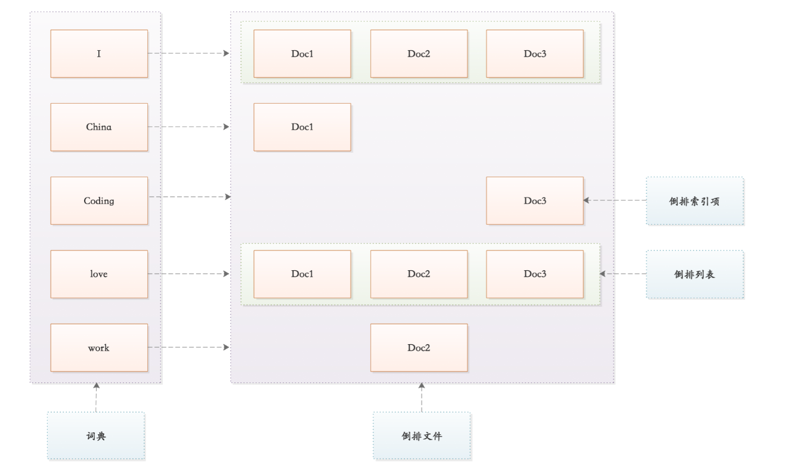

1.  Postings List (倒排表)​​： 包含包含该词条的所有文档的列表。
2.  ​Term Frequency (TF - 词频)​​： 词条在单个文档中出现的次数。频率越高，通常该文档与该词条的相关性就越高。
3.  ​Document Frequency (DF - 文档频率)​​： 有多少文档包含该词条。包含该词条的文档越多，说明该词条越常见，其重要性就越低。
4.  ​Position​： 词条在文档中出现的位置。用于支持短语查询等。

### **2.2.2 评分算法**

BM25 是一种基于概率信息检索模型的排名函数，用于评估查询（Query）与文档（Document）的相关性。它是对传统 ​TF-IDF​ 算法的优化和改进，解决了 TF-IDF 的两个核心缺陷：

1.  ​词频（TF）饱和问题​： 在 TF-IDF 中，一个词在文档中出现的次数（TF）越多，得分会线性无限增长。BM25 通过引入可调节参数，使 TF 的影响随着次数增加而趋于饱和，更符合实际（例如，出现 10 次与出现 20 次的文档，其相关性差异并不大）。
2.  ​文档长度归一化​： TF-IDF 没有考虑文档长度。一个词在短文档中出现 5 次远比在长文档中出现 5 次更具重要性。BM25 将文档长度纳入计算公式，实现了更公平的跨文档比较。

BM25 在 ES 中的实现并非一个孤立的函数，而是深度集成在其分布式架构和倒排索引中的。

1.  ​插件式相似度模块 (Pluggable Similarity)​​：
2.  BM25 在 ES 中是以一种可配置的 similarity 模块存在的。你可以在索引映射中为不同字段指定不同的相似度算法（或不同参数的 BM25）。
3.  示例： 为 title 字段和 content 字段设置不同的 b 参数，因为标题短，正文长，可能需要不同的长度归一化策略。
4.  ​数据来源：倒排索引与列式存储​：
5.  ​f(q\_i, D) (TF)​​ 和 ​n(q\_i) (DF)​ 这些计算 BM25 所需的核心数据，在建立倒排索引时就已经被计算和存储好了。
6.  ​倒排索引 (Inverted Index)​​ 存储了每个词条的 Postings List，其中就包含了该词条在每个文档中的出现频率（TF）。
7.  ​文档频率 (DF)​​ 也被存储在倒排索引中（每个词条的 Doc Count）。
8.  ​文档长度 |D|​ 和 ​平均文档长度 avgdl： 这些统计信息由 ES 在后台维护和存储（例如在 \_stats 中可用）。
9.  ​分布式计算​：
10.  搜索是分布式的。当协调节点接收到查询后，会将查询转发给所有相关的分片（Shard）。
11.  ​每个分片独立地在本地计算其包含文档的 BM25 得分。这是因为每个分片都拥有计算所需的所有本地数据（本地倒排索引、本地文档长度等）。
12.  协调节点收集所有分片返回的Top N结果后，再进行一次全局归并排序，最终返回给客户端。​BM25 评分是在分片级别完成的。

下图详细展示了从一个搜索请求发出到返回 BM25 评分结果的完整过程：

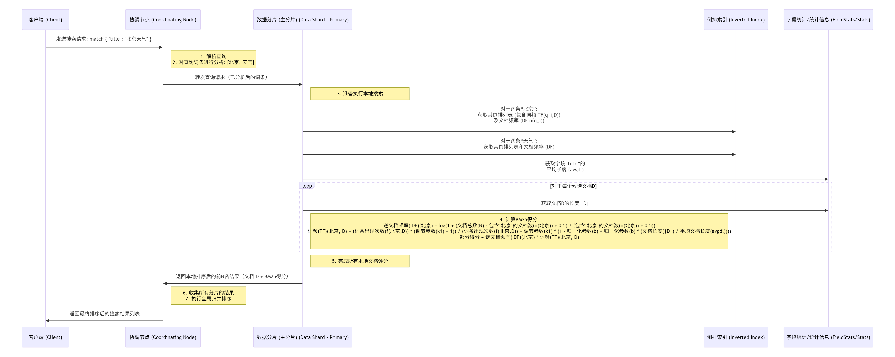

流程步骤详解：​​

1.  ​查询接收与分析​： 协调节点接收请求，并将查询字符串交由分析器处理，得到词条列表 \[北京, 天气\]。
2.  ​查询分发​： 协调节点将包含词条列表的查询请求转发给持有目标索引数据的所有相关分片。
3.  ​本地检索​： 每个数据分片接收到请求后，从其倒排索引中查找每个词条的 Posting List，获取计算BM25所需的初始数据：​词频 (TF)​​ 和 ​文档频率 (DF)​。
4.  ​获取统计信息​： 分片从内部的统计信息存储中获取计算BM25所需的全局数据：​平均字段长度 (avgdl)​​ 和单个文档的长度 (|D|)。
5.  ​本地评分​： 分片遍历所有可能匹配的文档，使用获取到的 TF、DF、|D|、avgdl 以及预先配置的 k1 和 b 参数，为每个文档计算针对该查询的 BM25 得分。这是一个核心计算循环。
6.  ​结果返回​： 每个分片独立完成评分后，将自己分片内排名前 N 的结果（文档ID和得分）返回给协调节点。
7.  ​全局排序​： 协调节点收集所有分片返回的结果后，基于 BM25 得分进行一次全局排序，选出整个集群中得分最高的前 N 个结果。
8.  ​最终返回​： 协调节点将最终排序后的结果列表返回给客户端。如果需要获取完整的文档内容（\_source），它会再根据文档ID向相关分片发起第二次请求。

## **03 ES 索引全文搜索深度实战**

官方地址：[https://www.elastic.co/guide/en/elasticsearch/reference/8.17/full-text-queries.html](https://www.elastic.co/guide/en/elasticsearch/reference/8.17/full-text-queries.html)

## **3.1 Full Text 全文搜索案例**

今天的案例还是以航班数据为主，前面已经提过：

静静等待成功，如果有报错，请检查机器磁盘是否已满：

我们先来查看下 kibana\_sample\_data\_flights 的 mapping 信息：

\# 查询 ES 索引全文搜索 mapping

GET kibana\_sample\_data\_flights/\_mapping

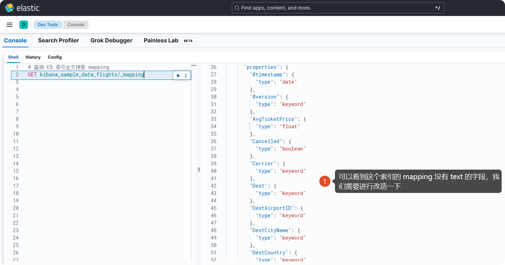

这里我们需要对该索引进行改造，使其部分字段符合 text 类型。

\# ES 索引全文搜索 mapping

PUT kibana\_sample\_data\_flights\_fulltext

{

"mappings": {

"dynamic": "true",

"date\_detection": false,

"numeric\_detection": false,

"properties": {

"@timestamp": {

"type": "date"

},

"@version": {

"type": "keyword"

},

"AvgTicketPrice": {

"type": "float"

},

"Cancelled": {

"type": "boolean"

},

"Carrier": {

"type": "text",

"fields": {

"keyword": {

"type": "keyword",

"ignore\_above": 256

}

}

},

"Dest": {

"type": "text",

"fields": {

"keyword": {

"type": "keyword",

"ignore\_above": 256

}

}

},

"DestAirportID": {

"type": "text",

"fields": {

"keyword": {

"type": "keyword",

"ignore\_above": 256

}

}

},

"DestCityName": {

"type": "text",

"fields": {

"keyword": {

"type": "keyword",

"ignore\_above": 256

}

}

},

"DestCountry": {

"type": "text",

"fields": {

"keyword": {

"type": "keyword",

"ignore\_above": 256

}

}

},

"DestLocation": {

"properties": {

"lat": {

"type": "keyword",

"ignore\_above": 256

},

"lon": {

"type": "keyword",

"ignore\_above": 256

}

}

},

"DestRegion": {

"type": "text",

"fields": {

"keyword": {

"type": "keyword",

"ignore\_above": 256

}

}

},

"DestWeather": {

"type": "text",

"fields": {

"keyword": {

"type": "keyword",

"ignore\_above": 256

}

}

},

"DistanceKilometers": {

"type": "float"

},

"DistanceMiles": {

"type": "float"

},

"FlightDelay": {

"type": "boolean"

},

"FlightDelayMin": {

"type": "float"

},

"FlightDelayType": {

"type": "text",

"fields": {

"keyword": {

"type": "keyword",

"ignore\_above": 256

}

}

},

"FlightNum": {

"type": "text",

"fields": {

"keyword": {

"type": "keyword",

"ignore\_above": 256

}

}

},

"FlightTimeHour": {

"type": "float"

},

"FlightTimeMin": {

"type": "float"

},

"Origin": {

"type": "text",

"fields": {

"keyword": {

"type": "keyword",

"ignore\_above": 256

}

}

},

"OriginAirportID": {

"type": "text",

"fields": {

"keyword": {

"type": "keyword",

"ignore\_above": 256

}

}

},

"OriginCityName": {

"type": "text",

"fields": {

"keyword": {

"type": "keyword",

"ignore\_above": 256

}

}

},

"OriginCountry": {

"type": "text",

"fields": {

"keyword": {

"type": "keyword",

"ignore\_above": 256

}

}

},

"OriginLocation": {

"properties": {

"lat": {

"type": "keyword",

"ignore\_above": 256

},

"lon": {

"type": "keyword",

"ignore\_above": 256

}

}

},

"OriginRegion": {

"type": "text",

"fields": {

"keyword": {

"type": "keyword",

"ignore\_above": 256

}

}

},

"OriginWeather": {

"type": "text",

"fields": {

"keyword": {

"type": "keyword",

"ignore\_above": 256

}

}

},

"dayOfWeek": {

"type": "float"

},

"event": {

"properties": {

"created": {

"type": "date"

},

"dataset": {

"type": "keyword"

},

"ingested": {

"type": "date"

}

}

},

"tags": {

"type": "keyword"

},

"timestamp": {

"type": "date"

}

}

}

}

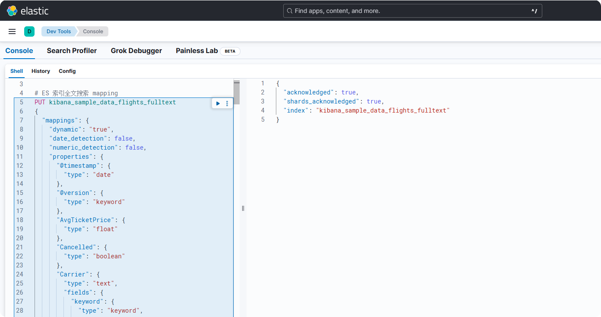

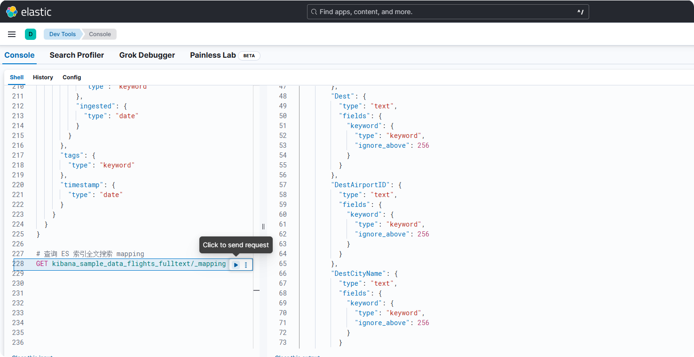

\# 先重建新全文搜索索引

POST \_reindex

{

"source": {

"index": "kibana\_sample\_data\_flights"

},

"dest": {

"index": "kibana\_sample\_data\_flights\_fulltext"

}

}

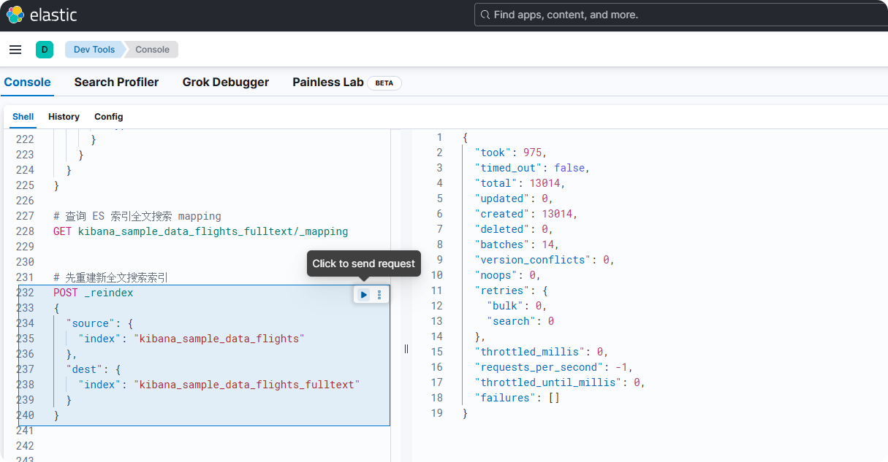

## **3.2 Full Text 全文搜索深度实战**

### **3.2.1 match\_all**

match\_all 查询的特殊性​：它不需要计算相关性得分（所有文档的\_score都为1.0），但需要获取所有文档（除非使用分页参数限制）。

下面示例查询的目标是：​不分页的查询所有航班的数据。

\# 查询所有数据

GET kibana\_sample\_data\_flights\_fulltext/\_search

{

"track\_total\_hits": false,

"query": {

"match\_all": {}

}

}

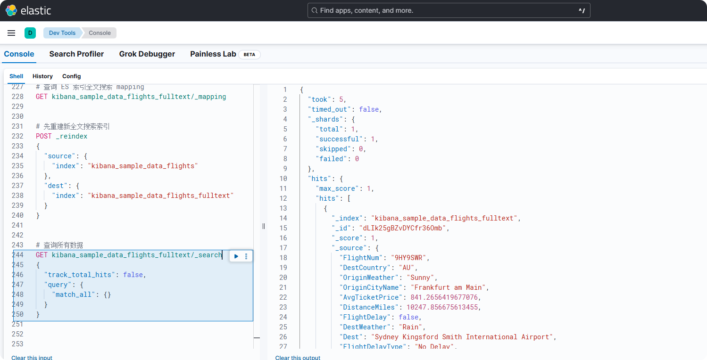

### **执行流程：**

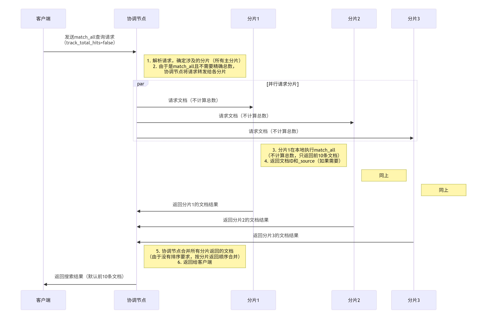

详细步骤说明：

1.  ​客户端发送请求​：客户端向 ES 集群中的某个节点（协调节点）发送搜索请求。
2.  ​协调节点处理​：协调节点解析请求，确定需要查询的索引分片（这里是索引的所有主分片）。由于 track\_total\_hits 为 false，协调节点不会要求分片返回精确的匹配总数（分片也不会计算总数）。同时查询是 match\_all，所以每个分片都会返回其存储的文档（默认返回前10条，除非指定 size）。
3.  ​分片执行查询​：每个分片独立执行 match\_all 查询。由于不需要计算总数，分片只需获取请求的文档（默认前10条）并返回。注意：分片返回的文档包含 \_source 字段（除非在请求中指定 \_source: false）。
4.  ​协调节点收集结果​：协调节点收集所有分片返回的文档。由于 match\_all 查询默认不排序（按 \_score 排序，但所有文档的\_score 都是1.0，所以实际上按分片返回的顺序合并），协调节点只是将各个分片返回的文档合并到一个列表中。
5.  ​返回结果给客户端​：协调节点将合并后的结果返回给客户端。结果中只包含每个分片返回的文档（默认前 10 条，因为分片返回的是各自的前 10 条，所以总文档数可能超过 10 条？实际上，每个分片返回的是该分片上匹配的前 10 条，然后协调节点从所有分片返回的文档中再取前 10 条？这里需要澄清）。

> 注意：实际上，当有多个分片时，协调节点会从每个分片获取前 size（默认为10）个文档，然后合并这些文档（如果有排序则进行全局排序），然后取前 size 个文档返回。由于 match\_all 的得分都是1.0，所以没有全局排序的必要，但默认情况下，ES 会按分片返回的顺序合并（即分片 0 的文档，然后是分片1，分片2...），然后取前 size 个。
> 
> 但是，由于我们没有指定排序，默认按 \_score 降序，而 \_score 都是1.0，所以接下来会按内部 \_id 升序（默认的降级排序）。实际上协调节点会收集所有分片返回的文档（每个分片返回前10条），然后在这些文档中再取前10条（因为全局可能超过 10 条）。所以最终返回的文档可能来自不同的分片。

关于分页：

在这个示例 match\_all 查询中，分页是通过 from 和 size 参数控制的。在这个例子中我们没有指定，所以使用默认值（from = 0, size = 10）。协调节点会向每个分片请求 from+size 条文档（这里每个分片请求 0 + 10 = 10 条），然后协调节点收集所有分片返回的 10 条文档，合并后取前 10 条。如果指定了 from = 100, size = 10，那么协调节点会向每个分片请求 110 条文档（100+10），然后合并所有分片返回的 110 条文档，再跳过前 100 条，取接下来的 10 条。

但是，由于我们设置了track\_total\_hits=false，协调节点不会计算匹配的总文档数（即不关心总共有多少文档），所以分页时只能获取到文档，但不知道总数。

下面示例是带分页的 match\_all:

\# 查询所有数据，带分页

GET kibana\_sample\_data\_flights\_fulltext/\_search

{

"track\_total\_hits": false,

"from": 10, // 起始偏移量（从10开始）

"size": 20, // 每页条数

"query": {

"match\_all": {

}

}

}

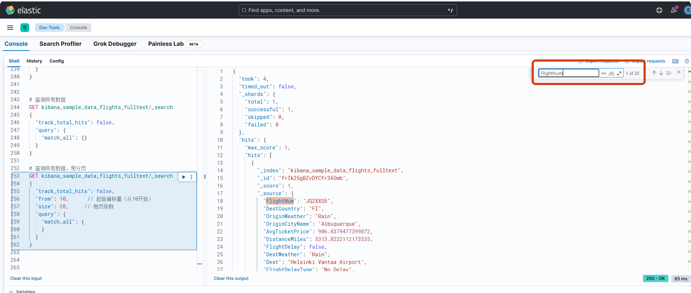

### **3.2.2 match（匹配查询）**

这是最常用的全文搜索，匹配查询可以处理全文本、精确字段（日期、数字等）。

  
下面示例的查询目标是检索 目的地机场 Dest字段为 "Vienna International Airport"​​ 的所有航班记录。核心需求是匹配机场名称，同时获取完整的命中文档数（track\_total\_hits = true）。

\# match 查询匹配数据

GET kibana\_sample\_data\_flights\_fulltext/\_search

{

"track\_total\_hits": true, // 关键参数：要求精确计数

"query": {

"bool": { // 布尔查询：用于组合多个查询条件

"must": \[ // 必须满足的子句（逻辑AND）

{

"match": { // 匹配查询

"Dest": "Vienna International Airport" // 要匹配的完整短语

}

}

\]

}

}

}

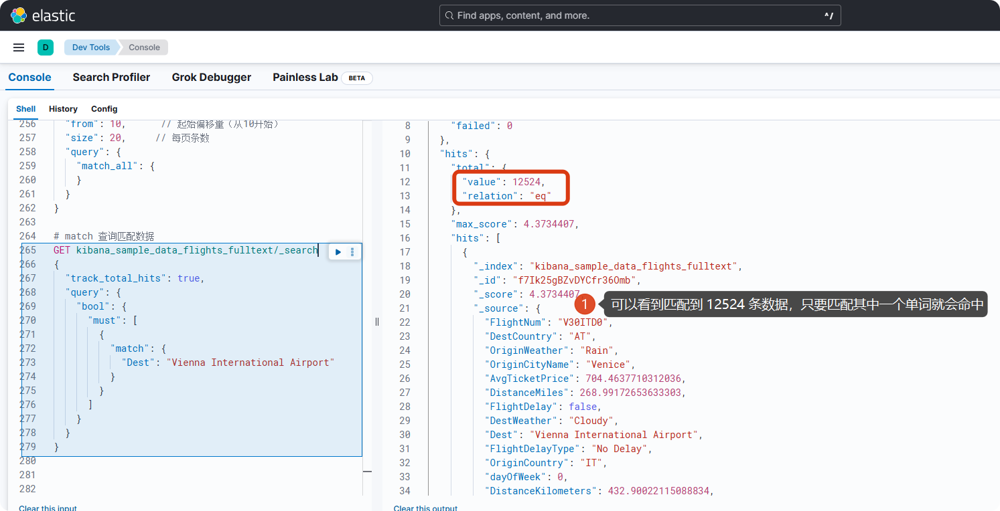

#### 关键字段含义：

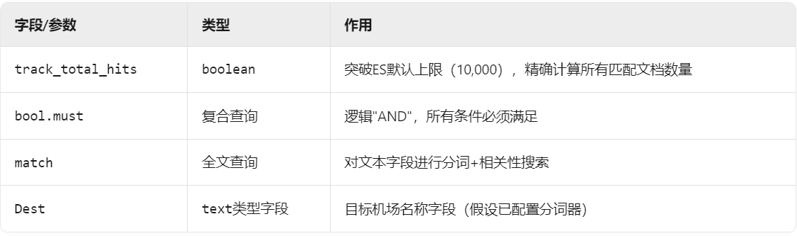

### **执行流程：**

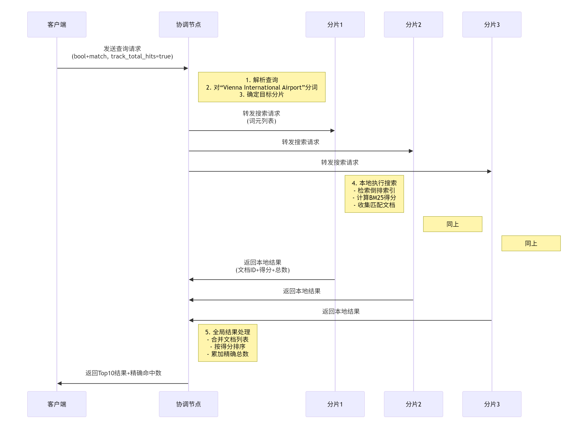

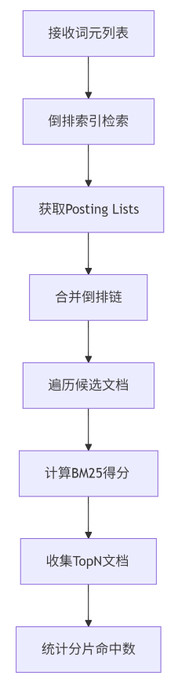

详细步骤说明：

1.  解析查询：协调节点接收请求，分析语法结构（这里是 bool+match 组合），并提取关键参数（如track\_total\_hits）。
2.  分词处理：对查询文本 "Vienna International Airport" 使用字段配置的分析器（如standard会拆为\["vienna", "international", "airport"\]）进行分词，生成词元列表。这是全文搜索的基础。
3.  分片路由：根据索引分片分布，确定需要参与查询的目标分片（1/2/3），这一步涉及集群状态和路由计算。
4.  请求分发：协调节点将词元列表并行转发给所有相关分片（主分片或副本）。
5.  分片本地搜索：每个分片独立工作：
6.  检索倒排索引：根据词元查找对应的倒排表（Posting List），获取包含这些词元的文档ID列表。
7.  计算BM25得分：对匹配文档计算相关性评分（考虑词频TF、逆文档频率IDF、字段长度等）。
8.  收集结果：按得分排序并准备TopN结果和本地命中统计。
9.  结果返回：各分片将本地结果（文档ID、得分、分片级命中数）返回给协调节点。
10.  全局归并：协调节点核心工作：
11.  合并列表：收集所有分片结果。
12.  排序：按全局得分重新排序（可能使用优先级队列）。
13.  统计总数：累加所有分片的命中数（因track\_total\_hits=true需精确值）。
14.  最终返回：将全局排序后的Top10结果和精确总数返回客户端。

在进行全文本字段检索的时候， match 提供了 operator 和 minimum\_should\_match 参数：

1.  operator，参数值可以为 "or" 或者 "and" 来控制检索词项间的关系，默认值为 "or"。
2.  minimum\_should\_match，可以指定词项的最少匹配个数，其值可以指定为某个具体的数字，但因为我们无法预估检索内容的词项数量，一般将其设置为一个百分比。

\# match 查询匹配数据 至少有 75% 的词项匹配上的文档才会返回

GET kibana\_sample\_data\_flights\_fulltext/\_search

{

"track\_total\_hits": true, // 关键参数：要求精确计数

"query": {

"bool": { // 布尔查询：用于组合多个查询条件

"must": \[ // 必须满足的子句（逻辑AND）

{

"match": { // 匹配查询

"Dest": { // 目标字段

"query": "Vienna International Airport", // 要匹配的完整短语

"operator": "or",

"minimum\_should\_match": "75%"

}

}

}

\]

}

}

}

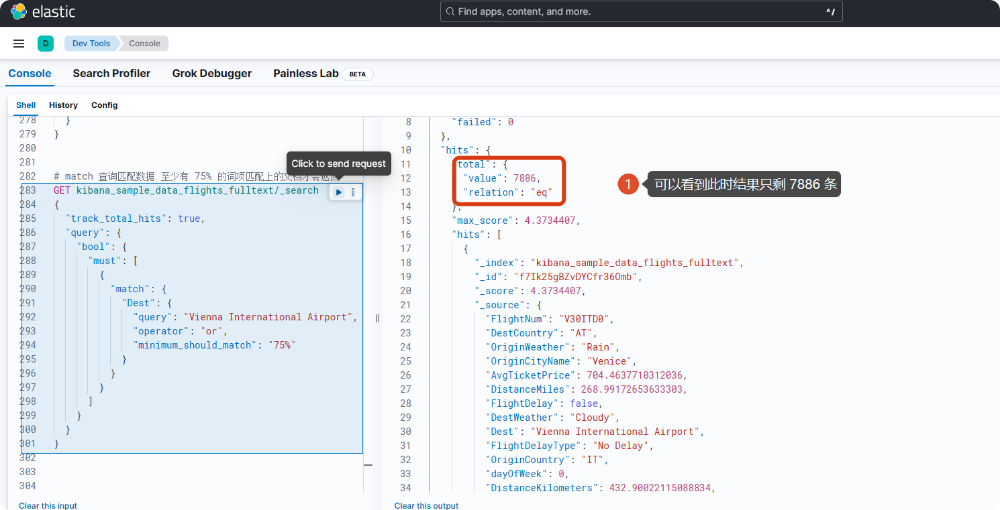

### **3.2.3 match\_phrase（短语匹配）**

简单来说，短语匹配会将检索内容进行分词，这些词语必须全部出现在被检索内容中，并且顺序必须一致，默认情况下这些词都必须连续。

下面示例查询的目标是：​精确检索目的地机场名称（Dest 字段）为完整短语 "Vienna International Airport" 的所有航班记录。

与普通的 match 查询不同，match\_phrase 要求：

1.  ​所有词条都必须出现​（"Vienna", "International", "Airport"）
2.  ​词条必须按照查询中指定的顺序连续出现​
3.  ​词条之间的位置（position）必须连续

​

这非常适合搜索像机场名称、人名、地址等需要保持词汇顺序和完整性的文本。

\# match\_phrase 短语查询匹配数据

GET kibana\_sample\_data\_flights\_fulltext/\_search

{

"track\_total\_hits": true, // 关键参数：要求精确计数

"query": {

"bool": { // 布尔查询：用于组合多个查询条件

"must": \[ // 必须满足的子句（逻辑AND）

{

"match\_phrase": { // 短语查询：核心查询类型

"Dest": {

"query": "Vienna International Airport" // 要匹配的完整短语

}

}

}

\]

}

}

}

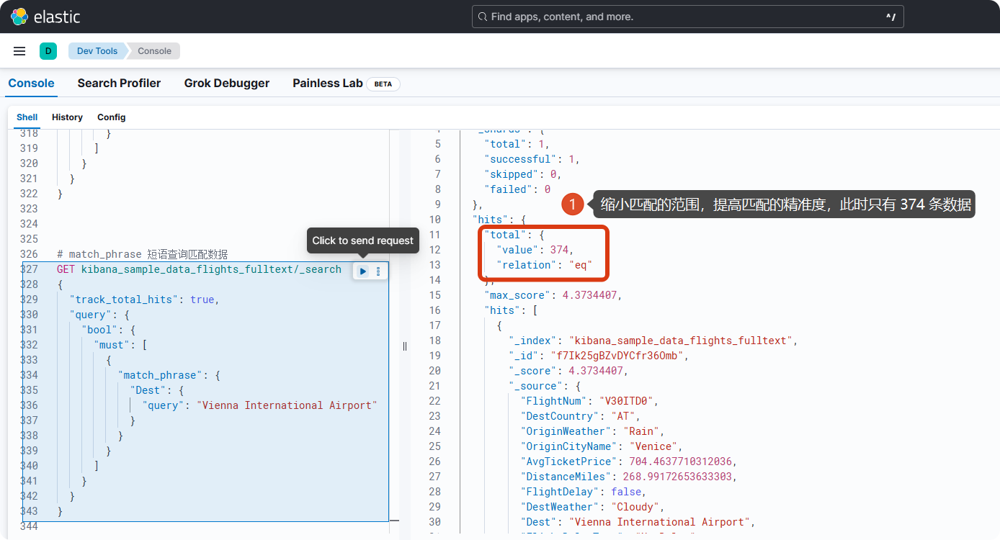

关键字段含义：

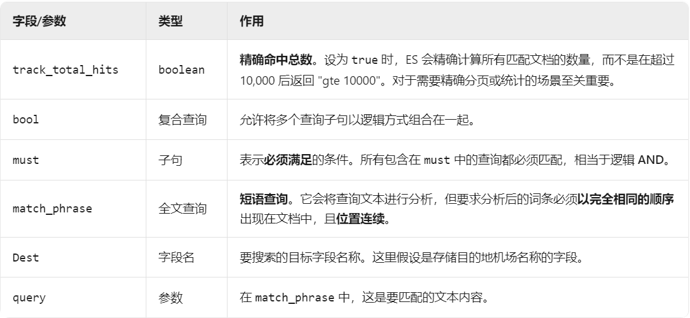

match\_phrase 查询的底层执行与普通 match 查询有显著不同，核心区别在于「**位置信息（positions）**」**​**​ 的利用。

1.  ​倒排索引的增强数据结构​：
2.  不仅存储 词条 -> 文档 的映射，还存储每个词条在文档中的位置（position）​​ 和偏移量（offset）​。
3.  例如，文档中 "Vienna International Airport" 的倒排索引记录可能包含：
4.  "vienna" -> \[Doc1: (position: 5)\]
5.  "international" -> \[Doc1: (position: 6)\]
6.  "airport" -> \[Doc1: (position: 7)\]
7.  ​短语查询的执行原理​：
8.  ​步骤 1：分析查询文本​：将 "Vienna International Airport" 分析为词条列表 \["vienna", "international", "airport"\]。
9.  ​步骤 2：查找首个词条​：在倒排索引中查找 "vienna"，获取包含它的文档列表（Doc A, Doc B, Doc C...）。
10.  ​步骤 3：验证后续词条的位置​：对于每个包含 "vienna" 的文档，检查在 位置+1 处是否是 "international"，在 位置+2 处是否是 "airport"。
11.  ​步骤 4：滑动窗口（Slop）​​：默认 slop=0，要求绝对连续。如果设置 slop（如 slop=1），则允许词条之间有最多 1 个其他词条的间隔。
12.  ​分布式执行​：
13.  与普通查询一样，协调节点将短语查询分发给所有相关分片。
14.  ​每个分片独立地在本地执行上述位置感知的短语匹配。
15.  分片返回本地匹配的文档和得分给协调节点。
16.  协调节点进行全局归并、排序，并计算精确总数（因为 track\_total\_hits=true）。

### **执行流程：**

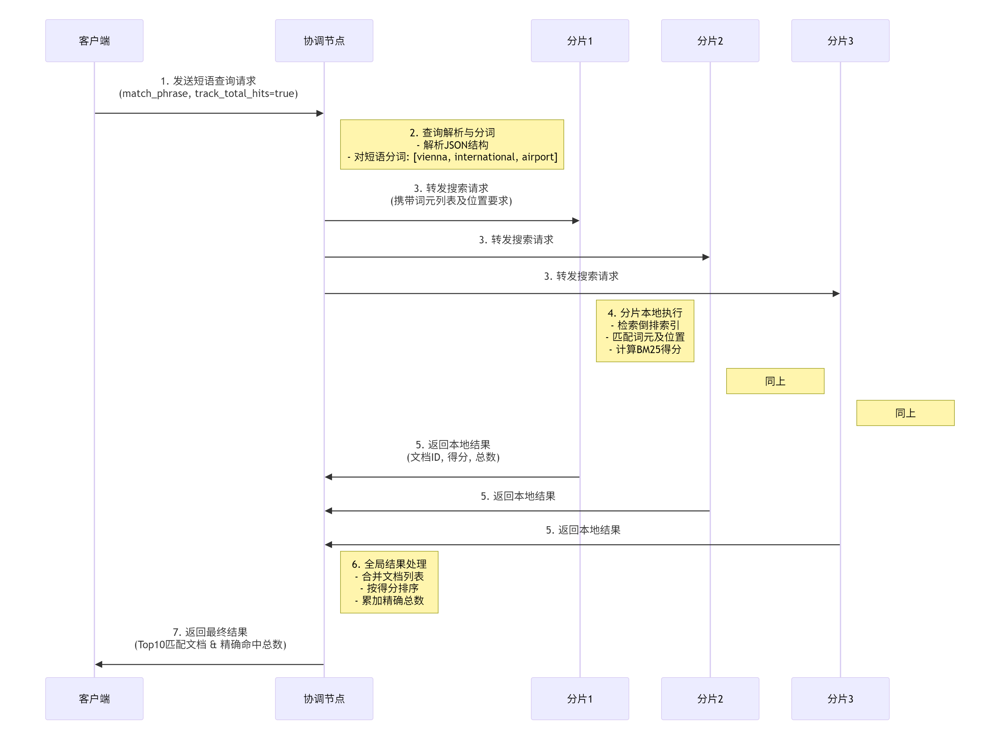

详细步骤说明：

1.  ​请求发起：客户端向 Elasticsearch 集群的某个节点（自动成为协调节点）发送 HTTP 请求，请求体中包含完整的 JSON 查询。
2.  ​协调节点处理
3.  ​解析查询​：协调节点解析 JSON，识别出这是一个 bool 查询中包含一个 match\_phrase 子查询，且要求精确计数。
4.  ​文本分析​：将查询短语 "Vienna International Airport" 发送给目标字段 Dest 配置的分析器（如 standard 分析器），得到词条列表 \["vienna", "international", "airport"\]。
5.  ​确定分片​：根据索引的分片路由规则，确定需要将查询请求发送到哪些分片（Shard）。
6.  ​并行查询：协调节点并行地向所有相关分片（Primary 或 Replica）发送查询请求。请求中包含了分析后的词元列表以及这是一个需要检查词条位置的短语查询指令。
7.  ​分片本地执行 - 核心阶段​ 每个分片接收到请求后，在自己的倒排索引中独立执行搜索：
8.  ​查找词元​：依次在倒排索引中查找 vienna，international，airport。
9.  ​位置匹配​：对于包含 vienna 的文档，检查其位置（position），然后查看下一个位置（position+1）的词元是否是 international，再下一个位置（position+2）的词元是否是 airport。这是一个需要遍历和比对的过程。
10.  ​评分​：对成功匹配短语的文档，计算其 BM25 相关性得分。
11.  ​收集结果​：准备匹配文档的 ID、得分以及本分片的匹配总数。
12.  ​结果返回：各分片将本地计算出的结果（一个文档和得分的列表，以及本分片的命中数）返回给协调节点。
13.  ​全局归并 - 协调节点接收所有分片的结果：
14.  ​合并列表​：将所有分片返回的文档列表合并。
15.  ​排序​：根据文档的 BM25 得分进行全局降序排序。
16.  ​精确计数​：因为 track\_total\_hits: true，协调节点会将所有分片返回的本地命中数相加，得到整个索引的精确命中总数。
17.  ​截取​：根据默认的 size（通常为10）取出排名最高的文档。
18.  ​最终响应：协调节点将最终排序后的结果列表、精确的命中总数以及其他元信息（如耗时）组装成 HTTP响应，返回给客户端。

\# match\_phrase 短语查询匹配数据,间隔参数

GET kibana\_sample\_data\_flights\_fulltext/\_search

{

"track\_total\_hits": true,

"query": {

"bool": {

"must": \[

{

"match\_phrase": {

"Dest": {

"query": "Vienna Airport International ",

"slop": 1

}

}

}

\]

}

}

}

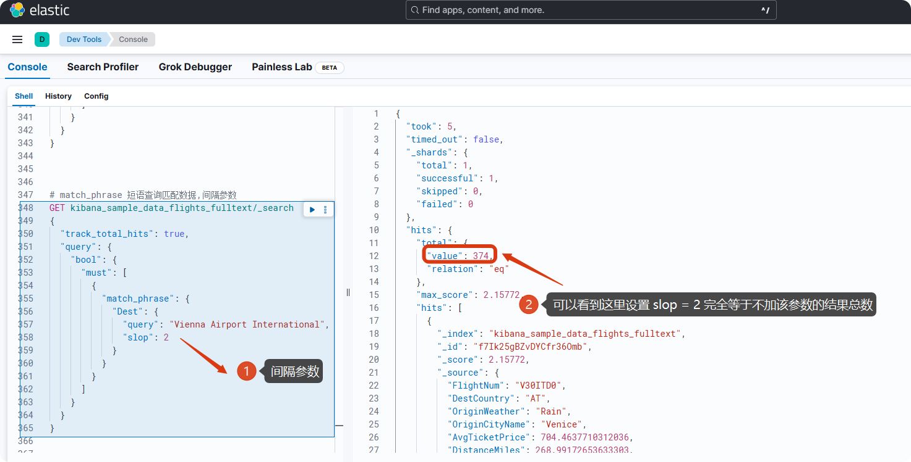

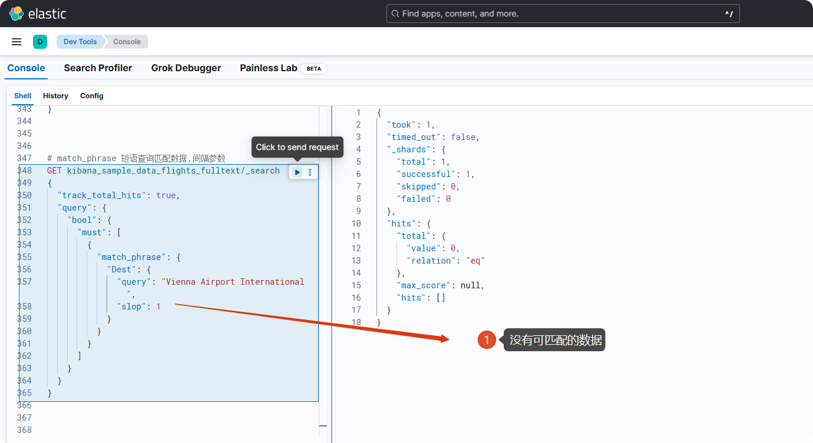

这是一个非常经典且重要的 match\_phrase 查询问题，我们来深入解析为什么 slop: 2 可以匹配，而 0 或 1 却不行。

### **核心原因：**

根本原因在于：​该示例查询的词序与文档中实际的词序不一致，而 slop 参数定义了允许词条移动的最大距离来弥补这种不一致。​​

查询中的词序是 "Vienna Airport International"，而结果集文档 \_source 中实际的词序是 "Vienna International Airport"。"Airport" 和 "International" 这两个词的位置是颠倒的。

### **1、文本分析**

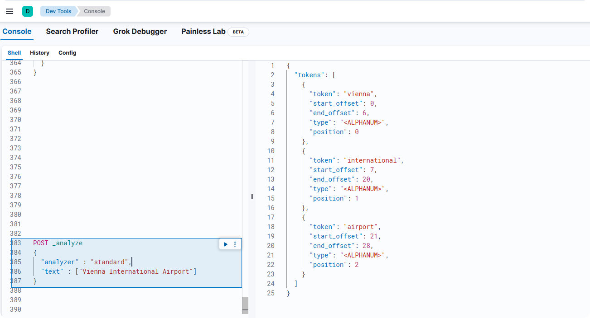

如图 \_analyze API 结果所示，文本 "Vienna International Airport" 被 standard 分析器处理后的结果是：词条在文档中的位置是固定的：vienna(0) -> international(1) -> airport(2)。

### **2、查询分析**

当前示例中查询 "Vienna Airport International" 也会被同样的分析器处理，生成如下词条序列：

请注意，在查询中，airport 的位置是 1，international 的位置是 2。

### **3、工作原理**

match\_phrase 要求文档必须包含查询中所有的词条，并且词条在文档中的位置顺序必须与查询中的位置顺序完全一致。

​slop 参数的作用：它定义了为了完成匹配，允许查询词条在文档中「**移动**」的总距离。它可以理解为一种「**容错距离**」。

### **4、场景模拟**

现在我们来看三种情况，判断文档中的位置序列 \[0: vienna, 1: international, 2: airport\] 是否能匹配查询的位置序列 \[0: vienna, 1: airport, 2: international\]。

为了让查询序列匹配文档序列，airport 和 international 这两个词条需要“交换位置”。

### **情况一、slop:0 （默认，最严格）**

1.  ​要求​：文档中的词条位置必须与查询中的词条位置绝对一致。
2.  ​匹配过程​：
3.  查询期望在位置 1 找到 airport -> 但文档在位置 1 是 international -> ​不匹配。
4.  查询期望在位置 2 找到 international -> 但文档在位置 2 是 airport -> ​不匹配。
5.  ​结论​：​匹配失败。因为词序完全对不上。

### **情况二、slop:1**

1.  ​要求​：允许词条总共“移动” ​1​ 个位置的距离。
2.  ​匹配过程（尝试）​​：
3.  让文档中的 airport (pos=2) 向前移动 1 位到 pos=1，以满足查询要求。移动距离=1。
4.  但此时 international (pos=1) 需要向后移动 1 位到 pos=2，以满足查询要求。移动距离=1。
5.  ​总移动距离 = 1 + 1 = 2​ > slop: 1 -> ​失败。
6.  ​结论​：​匹配失败。交换两个词条的最小移动距离是 2，slop: 1 提供的容错度不够。

### **情况三、slop:2**

1.  ​要求​：允许词条总共“移动” ​2​ 个位置的距离。
2.  ​匹配过程​：
3.  让文档中的 airport (pos=2) 向前移动 1 位到 pos=1。移动距离=1。
4.  让文档中的 international (pos=1) 向后移动 1 位到 pos=2。移动距离=1。
5.  ​总移动距离 = 1 + 1 = 2​ <= slop: 2 -> ​成功匹配！​​
6.  ​结论​：​匹配成功。slop: 2 提供了足够的容错度来完成词序的交换。文档 \[vienna, international, airport\] 最终可以匹配查询 \[vienna, airport, international\]。

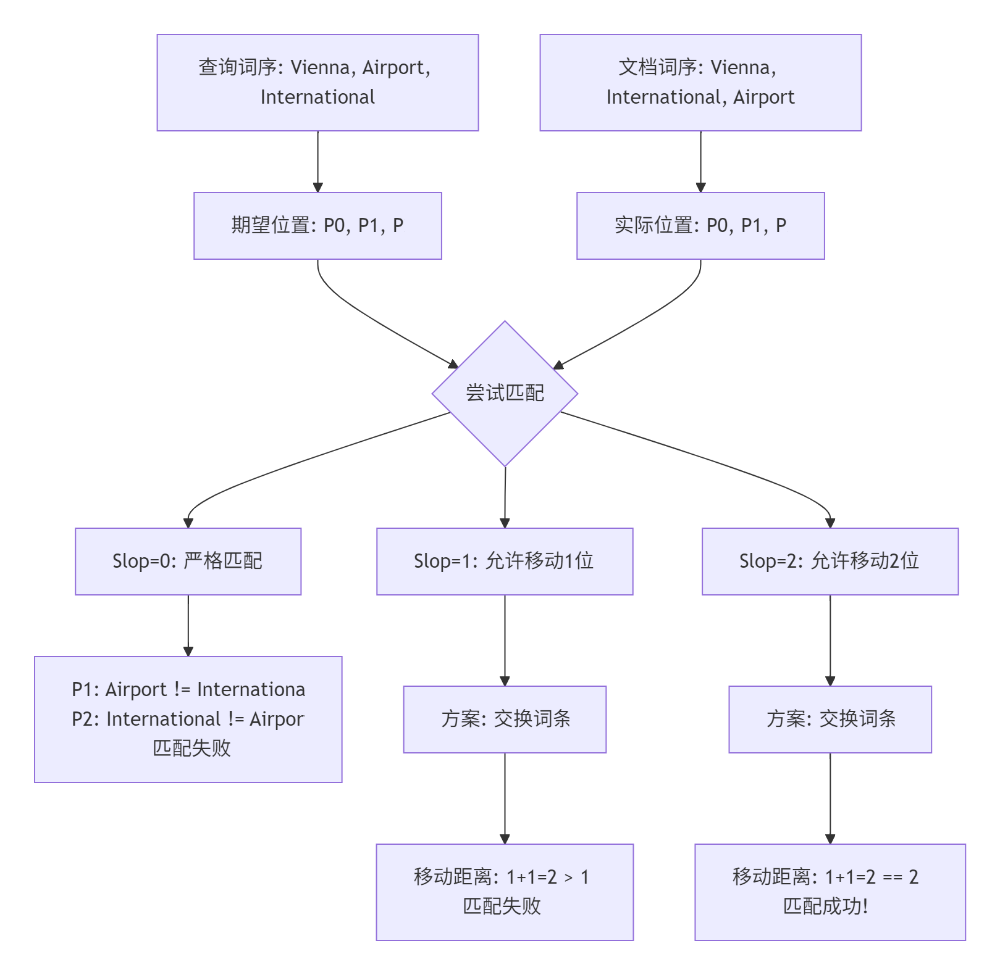

### **3.2.4 match\_phrase\_prefix（短语前缀匹配）**

match\_phrase\_prefix 与 match\_phrase 类似，但最后一个词项会作为前缀，并且匹配这个词项开头的任何词语。可以使用 max\_expansions 参数来控制最后一个词项的匹配数量，此参数默认值为 50。

一般来说 match\_phrase\_prefix 可以实现比较粗糙的「**自动建议**」功能，但要实现「**自动建议**」的功能，可以使用 Suggest API（我们后续的内容将会介绍）。

下面示例查询的目标是：​实现一个「**即时搜索**」功能。用户可能只输入了机场名称的前几个词（如 "Sydney Kingsford Smith"），但希望系统能「**自动补全并匹配**」到完整的机场名称（如 "Sydney Kingsford Smith International Airport"）。

与 match\_phrase 不同，match\_phrase\_prefix 的独特之处在于它只要求「**最后一个词条**」是「**前缀匹配**」，而之前的词条仍需满足「**短语匹配**」的要求（包括顺序和可配置的间隔）。

\# match\_phrase\_prefix 短语前缀查询匹配数据

GET kibana\_sample\_data\_flights\_fulltext/\_search

{

"track\_total\_hits": true,

"query": {

"bool": {

"must": \[

{

"match\_phrase\_prefix": {

"Dest": {

"query": "Sydney Kingsford Smith International Airport",

"slop": 2,

"max\_expansions": 2 // 参数是分片级别的, 每个分片最多匹配 2 个,如果有 3 个分片的话，最多返回 6 个匹配的文档, 我这里是单分片，基本不生效

}

}

}

\]

}

}

}

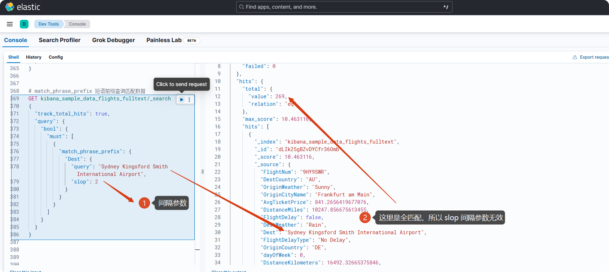

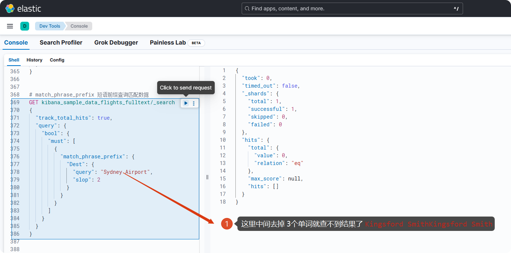

关键字段含义：

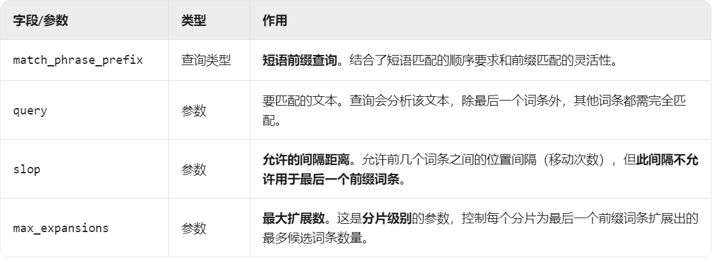​

max\_expansions ：​​

1.  这是一个分片级别的安全阀值，用于防止单个分片因一个非常常见的前缀（如 "a\*"）而产生巨大的性能开销。
2.  如果集群有 3 个分片，且每个分片都达到 max\_expansions: 2 的限制，那么协调节点最终可能会收到最多 3 \* 2 = 6 个不同的扩展词条来进行最终匹配。
3.  在我单分片测试环境中，该参数的效果确实不明显，因为它主要用于控制多分片集群中的资源使用。

### **执行流程：**

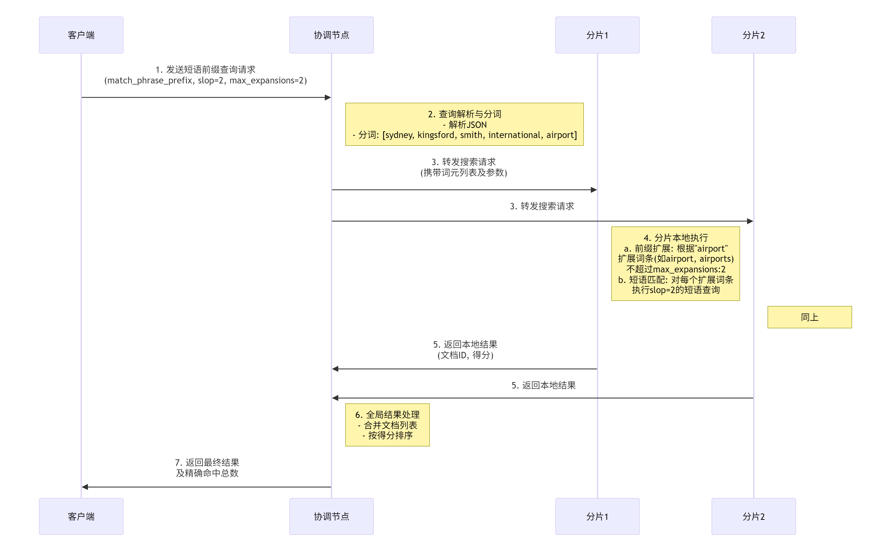

详细步骤说明：

1.  ​请求发起：客户端向协调节点发送查询请求。
2.  ​协调节点处理
3.  ​解析查询​：协调节点解析 JSON，识别出这是一个 match\_phrase\_prefix 查询。
4.  ​文本分析​：使用 Dest 字段配置的分析器处理查询字符串，得到词条列表 \["sydney", "kingsford", "smith", "international", "airport"\]。
5.  ​确定分片​：根据索引的分片路由规则，确定需要将查询请求发送到哪些分片。
6.  ​并行查询​​：协调节点并行地向所有相关分片发送查询请求。请求中包含了分析后的词元列表以及 slop 和 max\_expansions 参数。
7.  ​分片本地执行 (第4步) - 核心阶段​ 每个分片接收到请求后，在自己的倒排索引中独立执行两阶段搜索：
8.  ​阶段A：前缀扩展​
9.  在倒排索引的词典（Term Dictionary）中查找所有以 "airport" 开头的词条。
10.  例如，可能找到 airport 和 airports。
11.  收集过程在找到 max\_expansions: 2 个词条后停止。
12.  ​阶段B：短语匹配​
13.  对于每一个扩展出来的词条（如 airport），构造一个新的短语查询："sydney kingsford smith international airport"（slop=2）。
14.  执行这个短语查询（过程与普通的 match\_phrase 完全相同），寻找匹配的文档。
15.  对下一个扩展词条（如 airports）重复此过程："sydney kingsford smith international airports"（slop=2）。
16.  收集所有匹配的文档及其得分。
17.  ​结果返回：各分片将本地匹配的结果（文档ID和得分列表）返回给协调节点。
18.  ​全局归并 协调节点接收所有分片的结果：
19.  ​合并列表​：将所有分片返回的文档列表合并。
20.  ​排序​：根据文档的 BM25 得分进行全局降序排序。
21.  ​精确计数​：因为 track\_total\_hits: true，协调节点会计算所有匹配文档的精确数量。
22.  ​最终响应：协调节点将最终排序后的结果列表、精确的命中总数以及其他元信息返回给客户端。

### **3.2.5 muliti\_match（多字段匹配）**

multi-match 构建在 match 查询的基础上，可以允许在多个字段上执行相同的查询。

\# multi\_match 多字段查询匹配数据

GET kibana\_sample\_data\_flights\_fulltext/\_search

{

"track\_total\_hits": true,

"query": {

"bool": {

"must": \[

{

"multi\_match": {

"query": "Sydney Kingsford",

"fields": \[

"Dest"

\]

}

}

\]

}

}

}

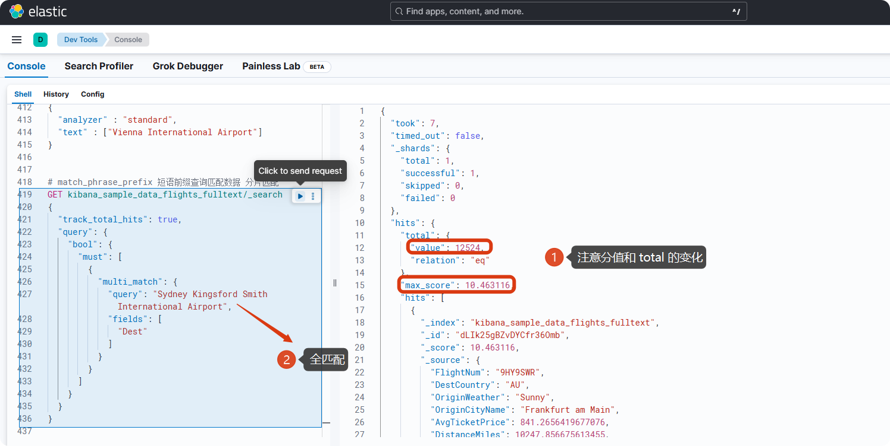

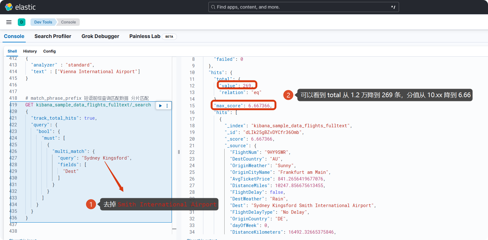

multi-match 还提供了多种类型来设置其执行的方式：

1.  best\_fields: 默认的类型，会执行 match 查询并且将所有与查询匹配的文档作为结果返回，但是只使用评分最高的字段的评分来作为评分结果返回。
2.  most\_fields: 会执行 match 查询并且将所有与查询匹配的文档作为结果返回，并将所有匹配字段的评分加起来作为评分结果。
3.  phrase: 在 fields 中的每个字段上均执行 match\_phrase 查询，并将最佳匹配字段的评分作为结果返回。
4.  phrase\_prefix: 在 fields 中的字段上均执行 match\_phrase\_prefix 查询，并将最佳匹配字段的评分作为结果返回。
5.  cross\_fields：它将所有字段当成一个大字段，并在每个字段中查找每个词。例如当需要查询英文人名的时候，可以将 first\_name 和 last\_name 两个字段组合起来当作 full\_name 来查询。
6.  bool\_prefix：在每个字段上创建一个 match\_bool\_prefix 查询，并且合并每个字段的评分作为评分结果。

这里来看下前两个 type，其他的 type 请参考官网：[https://www.elastic.co/guide/en/elasticsearch/reference/8.17/query-dsl-multi-match-query.html](https://www.elastic.co/guide/en/elasticsearch/reference/8.17/query-dsl-multi-match-query.html)

\# multi\_match 多字段查询匹配数据，best\_fields

GET kibana\_sample\_data\_flights\_fulltext/\_search

{

"track\_total\_hits": true,

"query": {

"bool": {

"must": \[

{

"multi\_match": {

"query": "Sydney Kingsford",

"fields": \[

"Dest",

"Origin"

\],

"type": "best\_fields"

}

}

\]

}

}

}

\# multi\_match 多字段查询匹配数据，most\_fields

GET kibana\_sample\_data\_flights\_fulltext/\_search

{

"track\_total\_hits": true,

"query": {

"bool": {

"must": \[

{

"multi\_match": {

"query": "Sydney Kingsford",

"fields": \[

"Dest",

"Origin"

\],

"type": "most\_fields"

}

}

\]

}

}

}

  
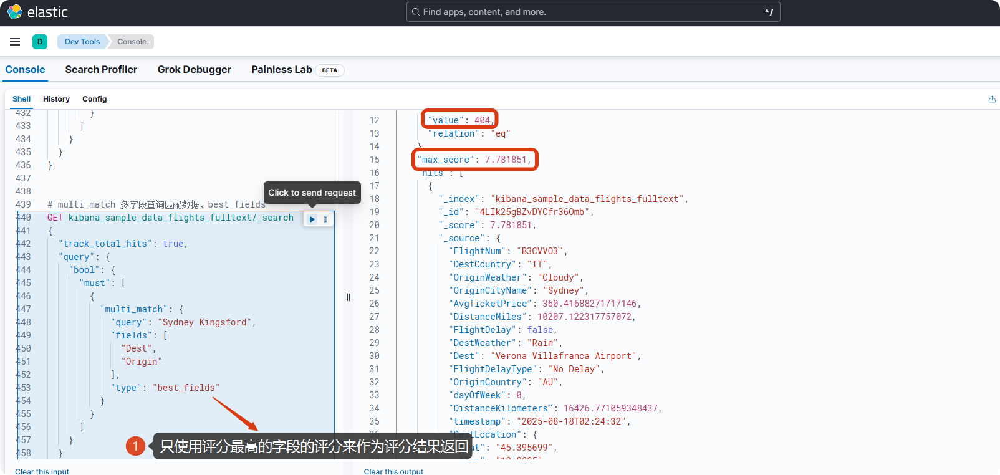

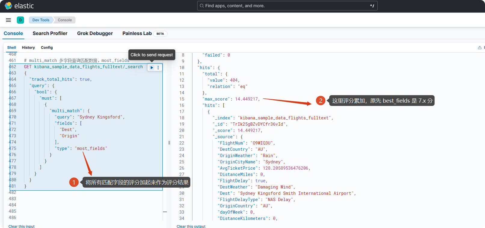

下面示例查询的目标是：​在多个字段（Dest 和 Origin）中同时搜索“Sydney Kingsford”这个词组，并找出最相关的结果。​​

这种查询非常适合「**不确定用户输入内容会出现在哪个字段**」的场景。例如，用户可能输入了一个机场名，但它既可能是目的地，也可能是出发地。

multi\_match 查询能够智能地在多个字段中查找，并综合判断文档的相关性。

\# multi\_match 多字段查询匹配数据，best\_fields tie\_breaker

GET kibana\_sample\_data\_flights\_fulltext/\_search

{

"track\_total\_hits": true,

"query": {

"bool": {

"must": \[

{

"multi\_match": {

"query": "Sydney Kingsford",

"fields": \[

"Dest",

"Origin"

\],

"type": "best\_fields",

"tie\_breaker": 0.3

}

}

\]

}

}

}

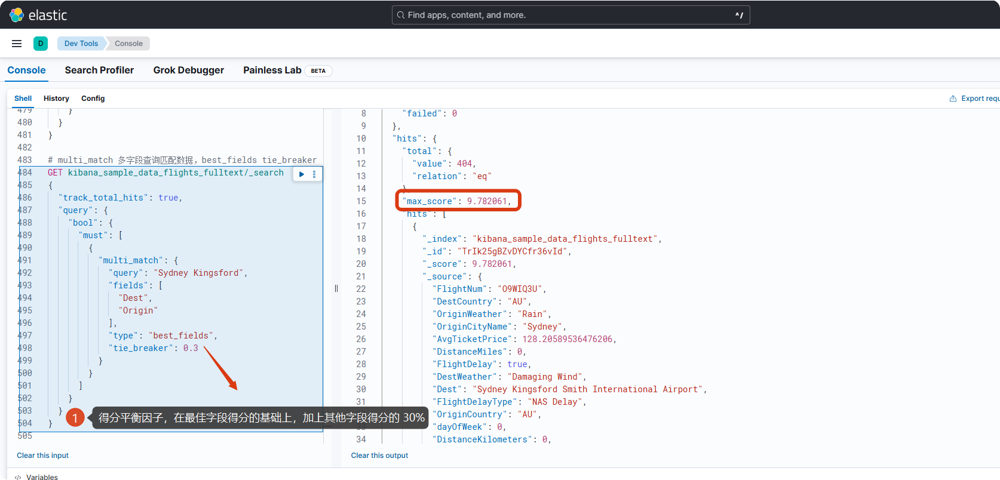

#### 关键字段含义：

这是该查询最核心的部分。其评分逻辑可以概括为：​文档的最终得分 = 最佳字段的得分 + (其他匹配字段的得分 \* tie\_breaker)​​

1.  ​best\_fields（最佳字段）策略：
2.  ​核心思想​：一个文档的得分由匹配度最高的那个字段决定。ES 会先在每个字段上单独执行 match 查询，然后取所有字段中的最高分作为文档的基础得分。
3.  ​适用场景​：适合查询词只会在一个字段中出现的情况（例如，“Sydney Kingsford”要么在 Dest 中，要么在 Origin 中，不太可能同时出现在两个字段里）。目标是找到至少有一个字段匹配得很好的文档。
4.  ​tie\_breaker（平衡因子）参数​：
5.  ​问题​：纯 best\_fields 策略有一个缺点：如果一个文档的两个字段都匹配了，但分数都不如另一个文档的一个字段匹配得分高，那么这个有两个匹配字段的文档可能会被排在后面，这有时不符合直觉。
6.  ​解决方案​：tie\_breaker 用于引入其他匹配字段的贡献。
7.  ​计算公式​：最终得分 = 最佳字段得分 + (∑其他匹配字段得分) \* tie\_breaker
8.  ​取值​：tie\_breaker 是一个介于 0 和 1 之间的浮点数。
9.  tie\_breaker = 0（默认）：​完全忽略其他字段的得分。退化为纯最佳字段策略。
10.  tie\_breaker = 1：将所有匹配字段的得分相加。
11.  tie\_breaker = 0.3（本例）：在最佳字段得分的基础上，​加上其他字段得分的 30%​。这是一种平衡，既让最佳字段占主导，又适当考虑了其他字段的匹配贡献。

multi\_match 查询的底层执行本质上是将一个查询分散到多个字段上执行，然后根据指定的 type 策略合并评分结果。

### **执行流程：**

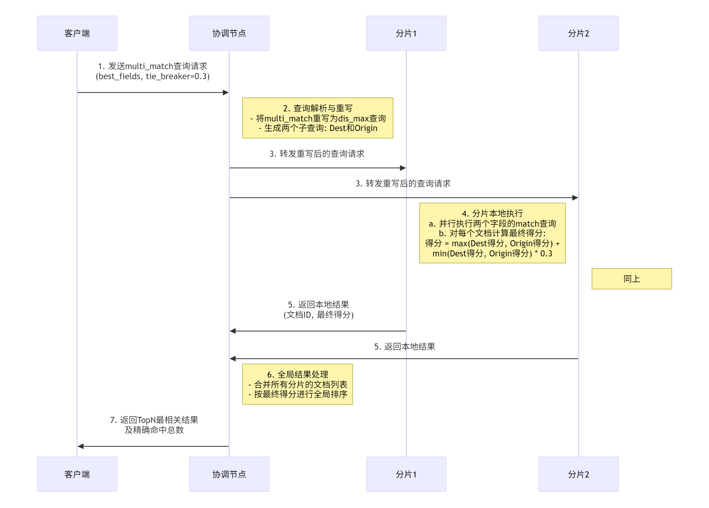

1.  请求发起：客户端向协调节点发送 multi\_match 查询请求。
2.  ​协调节点处理
3.  ​解析查询​：协调节点解析 JSON，识别出这是一个 multi\_match 查询，类型为 best\_fields，并包含 tie\_breaker 参数。
4.  ​查询重写​：将 multi\_match 查询重写为一个等价的 dis\_max 查询，生成两个子查询（分别针对 Dest 和 Origin 字段）。
5.  ​确定分片​：根据索引的分片路由规则，确定需要将查询请求发送到哪些分片。
6.  ​并行查询：​​协调节点并行地向所有相关分片发送重写后的 dis\_max 查询请求。
7.  ​分片本地执行 - 核心阶段​ 每个分片接收到请求后，在自己的倒排索引中独立执行以下操作：
8.  ​并行字段查询​：同时执行 Dest 字段和 Origin 字段的 match 查询，得到两份初步的文档得分列表。
9.  ​计算最终得分​：对于每一个文档，计算其在此次搜索中的最终得分。
10.  如果文档只在 Dest 字段匹配，得分 = Dest\_score
11.  如果文档只在 Origin 字段匹配，得分 = Origin\_score
12.  如果文档在两个字段都匹配，得分 = max(Dest\_score, Origin\_score) + min(Dest\_score, Origin\_score) \* 0.3
13.  ​收集结果​：准备匹配文档的 ID 和计算出的最终得分。
14.  ​结果返回：各分片将本地计算出的结果（文档ID和最终得分列表）返回给协调节点。
15.  ​全局归并 协调节点接收所有分片的结果：
16.  ​合并列表​：将所有分片返回的文档列表合并。
17.  ​排序​：根据文档的最终得分进行全局降序排序。
18.  ​精确计数​：因为 track\_total\_hits: true，协调节点会计算所有匹配文档的精确数量。
19.  ​最终响应：协调节点将最终排序后的结果列表、精确的命中总数以及其他元信息返回给客户端。

通过这个流程，ES multi\_match 查询提供了一种强大而灵活的方式，让用户无需手动构建复杂的 bool 查询，就能轻松实现跨字段搜索。

### **最佳实践建议：**​​

1.  ​best\_fields​：当查询词预计只会在一个字段中匹配得很好时使用（这是默认且最常见的情况）。
2.  ​most\_fields​：当查询词可能在多个字段中出现，且希望综合这些字段的匹配程度时使用（例如，在不同的分析器处理过的字段中搜索）。
3.  ​cross\_fields​：将多个字段视为一个大字段来处理，非常适合处理英文人名、地址等可能被拆分到不同字段的信息。
4.  ​谨慎调整 tie\_breaker：通常使用默认值或一个较小的值（如 0.1~0.4）即可，主要目的是打破相同最佳得分的文档之间的僵局，而不是大幅改变排名。

### **3.2.6 match\_bool\_prefix（布尔前缀匹配）**

下面示例查询的目标是：​实现一个高效的「**搜索即输入**」功能。用户可能正在输入一个很长的机场名称（如 "Sydney Kingsford Smith International Airport"），但只输入了一部分。

match\_bool\_prefix 查询会匹配已经输入完成的词条（作为精确匹配），同时对「**搜索即输入最后一个词条进行前缀匹配**」，以提供即时性的搜索结果。

\# match\_bool\_prefix bool 前缀查询匹配数据

GET kibana\_sample\_data\_flights\_fulltext/\_search

{

"track\_total\_hits": true,

"query": {

"bool": {

"must": \[

{

"match\_bool\_prefix": {

"Dest": {

"query": "Sydney Kingsford Smith International Airport"

}

}

}

\]

}

}

}

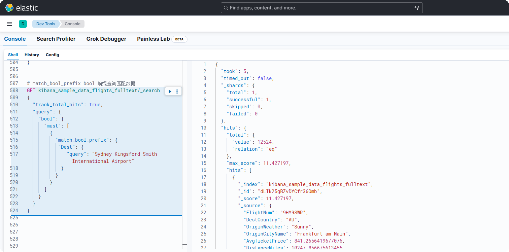

​match\_bool\_prefix 的独特行为：​

1.  ​文本分析​：首先，查询文本 "Sydney Kingsford Smith International Airport" 被分析器​ standard 处理，生成一个词条Token 列表。假设分析结果为：\["sydney", "kingsford", "smith", "international", "airport"\]。
2.  ​查询构造​：基于这些词条，ES 会在内部自动将查询重写为一个 bool 查询：
3.  must 子句：对除最后一个词条外的所有词条​（sydney, kingsford, smith, international）进行 term ​精确匹配。这些词条必须出现，且顺序无关（但通常因分析顺序而一致）。
4.  should 子句：对最后一个词条​（airport）进行 prefix ​前缀匹配。文档中该字段的值只要以 airport 开头（如 airport, airports）就能匹配。

match\_bool\_prefix 的底层设计非常巧妙，它结合了精确匹配的性能优势和前缀匹配的灵活性。它在内部大致会被重写为如下结构：

{

"query": {

"bool": {

"must": \[ // 必须精确匹配前面所有词条

{ "term": { "Dest": "sydney" }},

{ "term": { "Dest": "kingsford" }},

{ "term": { "Dest": "smith" }},

{ "term": { "Dest": "international" }}

\],

"should": \[ // 对最后一个词条进行前缀匹配，用于加分

{ "prefix": { "Dest": "airport" }}

\]

}

}

}

执行优先级​：

1.  must 子句是强制性的。文档必须包含 sydney, kingsford, smith, international 这些完整的词条，否则会被立刻过滤掉。这极大地缩小了候选集，提升了效率。
2.  should 子句是加分项。匹配前缀的文档会获得一个固定的分数提升，从而在结果中排名更靠前。

### **执行流程：**

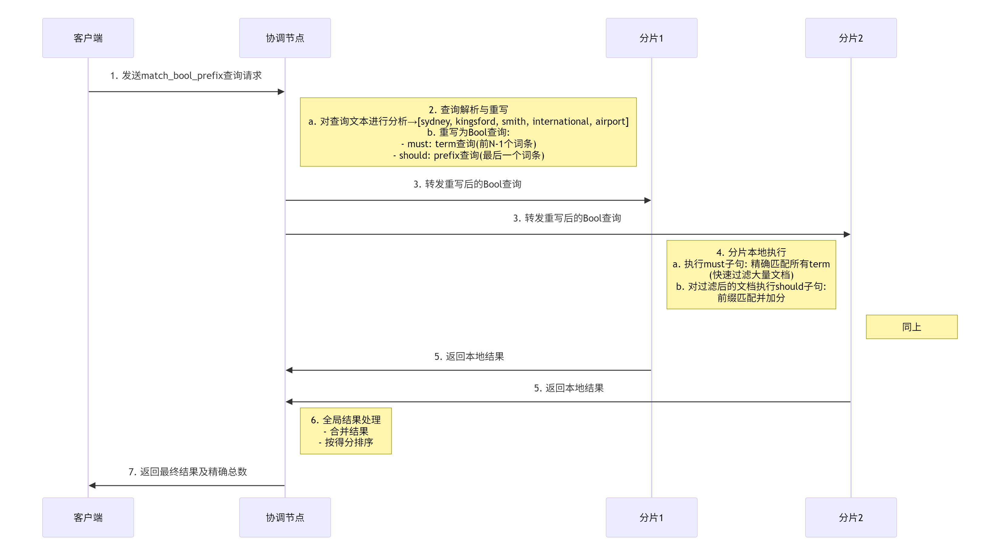

详细步骤说明：

1.  ​请求发起：客户端向协调节点发送 match\_bool\_prefix 查询请求。
2.  ​协调节点处理 - 关键阶段​
3.  ​解析查询​：协调节点解析 JSON，识别出这是一个 match\_bool\_prefix 查询。
4.  ​文本分析​：将查询字符串 "Sydney Kingsford Smith International Airport" 发送给 Dest 字段配置的分析器（如 standard 分析器），得到词条列表 \["sydney", "kingsford", "smith", "international", "airport"\]。​这一步与您图片中 \_analyze 部分展示的过程完全一致。
5.  ​查询重写​：将查询重写为一个 bool 查询。将前4个词条（sydney, kingsford, smith, international）构建为 must 子句中的 term 查询，将最后一个词条（airport）构建为 should 子句中的 prefix 查询。
6.  ​确定分片​：根据索引的分片路由规则，确定目标分片。
7.  ​并行查询：协调节点将重写后、结构更复杂的 bool 查询并行地分发给所有相关分片。
8.  ​分片本地执行 - 核心阶段​ 每个分片接收到重写后的 bool 查询，在自己的倒排索引中独立执行：
9.  ​阶段A: 精确过滤（must子句）​​
10.  依次执行 term 查询：Dest: "sydney"、Dest: "kingsford"、Dest: "smith"、Dest: "international"。
11.  这个过程非常高效，因为它直接利用倒排索引定位文档，快速过滤掉不包含这些完整词条的文档， drastically 缩小了候选文档集。
12.  ​阶段B: 前缀匹配与评分（should子句）​​
13.  对经过 must 子句过滤后剩余的小部分文档，执行 prefix 查询：Dest: "airport\*"。
14.  遍历这些文档的 Dest 字段值，检查是否有以 "airport" 开头的词条。
15.  为匹配的文档提供一个固定的分数提升（prefix 查询不计算相关性得分，只贡献一个常量分数）。
16.  ​结果返回：各分片将本地匹配的文档及其得分返回给协调节点。
17.  ​全局归并 协调节点收集所有分片的结果：
18.  ​合并列表​：将所有分片返回的文档列表合并。
19.  ​排序​：根据文档的得分（主要由 must 子句的匹配程度决定，should 子句用于微调排名）进行全局排序。
20.  ​精确计数​：因为 track\_total\_hits: true，协调节点会计算所有匹配文档的精确数量。
21.  ​最终响应：协调节点将最终排序后的结果列表、精确的命中总数返回给客户端。

match\_bool\_prefix 是一个非常实用且高效的查询，其设计精髓在于：

1.  ​两阶段过滤​：先用精确匹配快速过滤出最相关的候选集，再用前缀匹配进行微调。这种设计使其性能通常优于直接在长文本上执行通配符查询。
2.  ​即时搜索​：完美支持了自动补全和即时搜索的场景，用户在输入过程中就能看到结果。
3.  ​相关性保障​：要求前面的词条必须完全匹配，确保了结果的基础相关性，最后一个词条的前缀匹配则提供了灵活性。

###   
**3.2.7 combind\_fields（跨字段统计匹配）**

下面查询的目标是：​将多个字段（Dest 和 Origin）视为一个统一的文本域，在其中执行搜索，并智能地计算文档的相关性得分。​​

与 multi\_match 查询不同，combined\_fields 不是为了找到在「**某一个字段**」上匹配得最好的文档，而是为了找到「**在所有字段的组合中**」整体匹配得最好的文档。它解决了 multi\_match 在评分时可能遇到的不公平问题。

​搜索“Sydney Kingsford Smith”这个短语，要求这三个词「**都必须出现 operator: and**」，但可以出现在 Dest（目的地）或 Origin（出发地）字段中的任意一个，或者分散在两个字段中。最终目标是找到最相关的航班记录，无论这个机场名称是作为起点还是终点被记录的。

\# combined\_fields 合并查询匹配数据 and

GET kibana\_sample\_data\_flights\_fulltext/\_search

{

"track\_total\_hits": true,

"query": {

"bool": {

"must": \[

{

"combined\_fields": {

"query": "Sydney Kingsford Smith",

"fields": \[

"Dest",

"Origin"

\],

"operator": "and"

}

}

\]

}

}

}

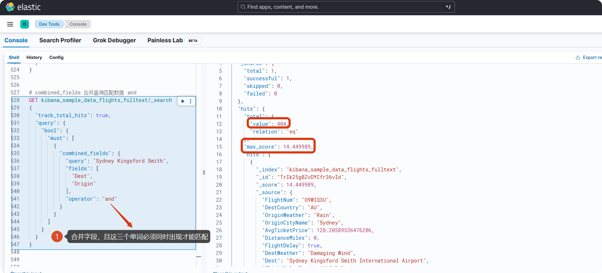

关键字段含义：

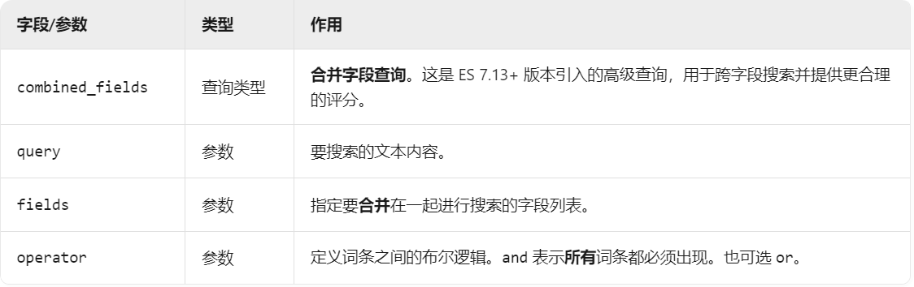

combined\_fields 查询的底层设计非常精巧，其核心在于「**跨字段统计信息计算**」，以实现更公平的评分。

1.  ​统一词条集合​：
2.  combined\_fields 将指定字段（Dest, Origin）中的所有词条视为一个统一的集合。
3.  计算 ​词频（TF）​​ 时，它统计的是词条在该文档的所有指定字段中出现的总次数。
4.  计算 ​逆文档频率（IDF）​​ 时，它基于词条在所有指定字段中出现的文档频率，而不是在单个字段中的频率。
5.  ​BM25 评分优化​：
6.  使用上述统一的 TF 和 IDF 值，代入 BM25 公式进行计算。
7.  文档长度归一化时，它使用所有指定字段的总词条数作为文档长度，而不是单个字段的长度。这避免了长字段或短字段带来的评分偏差。
8.  ​执行过程​：
9.  查询字符串 "Sydney Kingsford Smith" 被分析为词条：\["sydney", "kingsford", "smith"\]。
10.  对于每个文档，ES 检查这些词条是否出现在 Dest 或 Origin 字段中（因为 operator: "and"，所以必须全部出现）。
11.  评分时，ES 计算：
12.  TF("sydney") = "sydney" 在文档的 Dest 和 Origin 字段中出现的总次数。
13.  IDF("sydney") = 包含 "sydney" 的文档数（在 Dest 或 Origin 字段中出现都算）。

combined\_fields 与 multi\_match 对比，假设有如下两个文档：

1.  ​文档A​：Dest: "Sydney", Origin: "Kingsford Smith" （词条分散在两个字段）
2.  ​文档B​：Dest: "Sydney Kingsford Smith", Origin: "" （词条集中在一个字段）
3.  ​multi\_match + best\_fields​：可能会给文档B更高的分数，因为它的 Dest 字段匹配得非常完美，完全忽略了 Origin 字段为空的事实。
4.  ​combined\_fields​：会认为文档A和文档B是同等相关的。因为它将所有字段的词条合并成一个大的词条集合来计算统计信息。两个文档都包含了所有三个词条，因此它们的基础相关性是相同的。

### **执行流程：**

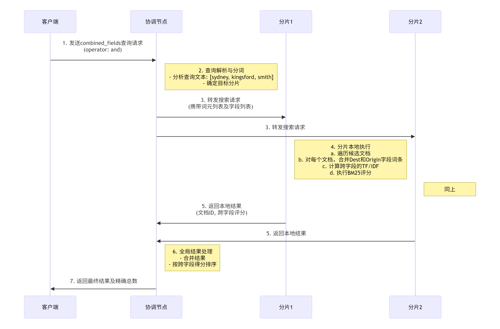

详细步骤说明：

1.  ​请求发起：客户端向协调节点发送 combined\_fields 查询请求。
2.  ​协调节点处理​​
3.  ​解析查询​：协调节点解析 JSON，识别出这是一个 combined\_fields 查询，并提取 fields 列表和 operator 参数。
4.  ​文本分析​：将查询字符串 "Sydney Kingsford Smith" 发送给分析器，得到词条列表 \["sydney", "kingsford", "smith"\]。
5.  ​确定分片​：根据索引的分片路由规则，确定需要将查询请求发送到哪些分片。
6.  ​并行查询​​：协调节点并行地向所有相关分片发送查询请求。请求中包含了分析后的词元列表、要合并的字段列表（\["Dest", "Origin"\]）以及操作符（and）。
7.  ​分片本地执行 - 核心阶段​ 每个分片接收到请求后，在自己的倒排索引中独立执行搜索，这个过程与普通查询有本质区别：
8.  ​阶段A: 匹配验证​：根据 operator: "and"，查找同时包含 sydney、kingsford 和 smith 这三个词条的文档。一个词条出现在 Dest 字段，另一个出现在 Origin 字段，也是符合条件的。
9.  ​阶段B: 跨字段评分（核心）​​：对于匹配的文档，不再按字段单独计算评分，而是：
10.  ​合并统计​：将文档的 Dest 和 Origin 字段的词条合并成一个虚拟的大字段。
11.  ​计算统一TF​：统计每个查询词条在这个“虚拟大字段”中出现的总次数。例如，TF("sydney") = (sydney在Dest中的次数) + (sydney在Origin中的次数)。
12.  ​计算统一IDF​：使用跨字段的文档频率。例如，IDF("sydney") 基于在所有文档的 Dest 或 Origin 字段中出现过 "sydney" 的文档总数来计算。
13.  ​应用BM25​：使用这些统一的 TF 和 IDF 值，代入 BM25 公式计算该文档的最终相关性得分。
14.  ​结果返回：各分片将本地匹配的文档及其跨字段评分返回给协调节点。
15.  ​全局归并 协调节点收集所有分片的结果：
16.  ​合并列表​：将所有分片返回的文档列表合并。
17.  ​排序​：根据文档的跨字段得分进行全局降序排序。由于评分机制是统一的，因此排序结果比 multi\_match 更公平。
18.  ​精确计数​：因为 track\_total\_hits: true，协调节点会计算所有匹配文档的精确数量。
19.  ​最终响应：协调节点将最终排序后的结果列表、精确的命中总数返回给客户端。

combined\_fields 查询是 ES 提供的一种更智能、更公平的多字段搜索解决方案。

它的核心优势在于：

1.  ​公平评分​：通过跨字段计算 TF 和 IDF，避免了因词条分散在不同字段而受到评分惩罚的问题，解决了 multi\_match + best\_fields 或 most\_fields 的固有缺陷。
2.  ​语义搜索​：更符合用户意图。用户搜索一个概念（如机场名），并不关心它具体存储在哪个字段，只关心文档是否包含这个信息。combined\_fields 完美地满足了这一需求。
3.  ​简化查询​：无需再为评分策略（best\_fields vs most\_fields）或平衡因子（tie\_breaker）而烦恼，提供了一个更直接的跨字段搜索方式。

### **3.2.8 query\_string（字符串表达式查询匹配）**

此查询的核心目标是：​在 Dest（目的地）字段中，搜索同时包含完整短语 "Sydney Kingsford" 和 "Smith International Airport" 的航班记录。​​

这是一个逻辑 AND 操作，要求两个短语都必须精确出现在 Dest 字段中。

\# query\_string 字符串表达式查询匹配数据 and 搜索Dest字段中包含"Sydney Kingsford"和"Smith International Airport"的文档

GET kibana\_sample\_data\_flights\_fulltext/\_search

{

"track\_total\_hits": true,

"query": {

"bool": {

"must": \[

{

"query\_string": {

"query": "(Sydney Kingsford) and (Smith International Airport)",

"default\_field": "Dest"

}

}

\]

}

}

}

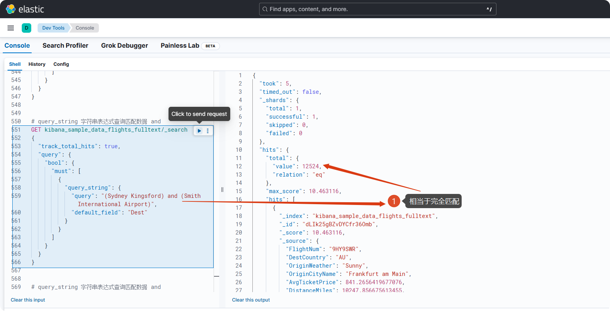

关键字段含义：

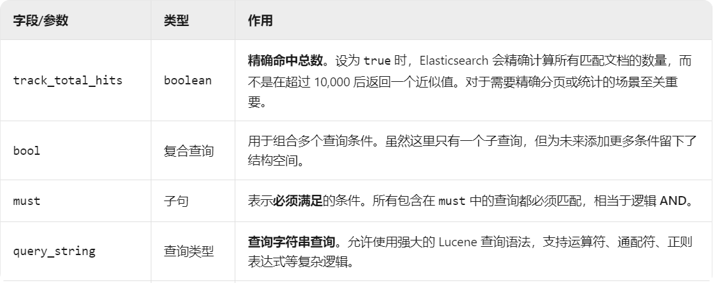

### **执行流程：**

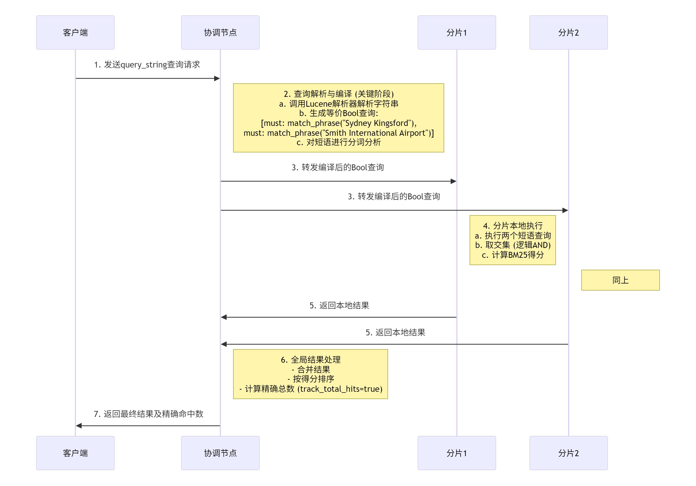

详细步骤说明：

1.  ​请求发起：客户端向协调节点发送搜索请求，请求体中包含 query\_string 查询。
2.  ​协调节点处理 - 最关键的阶段​
3.  ​查询解析与编译​：协调节点识别出 query\_string 类型，并调用 Lucene 查询解析器对其中的字符串进行编译。这个过程会将用户输入的字符串转换为 ES 内部抽象的查询结构（一个包含两个 match\_phrase 子查询的 bool 查询）。
4.  ​文本分析​：将编译后得到的两个短语 "Sydney Kingsford" 和 "Smith International Airport" 分别发送给 Dest 字段配置的分析器（如 standard 分析器），进行分词并获取词条的位置信息。​此过程与您图片右侧 \_analyze API 的演示完全一致。
5.  ​确定分片​：根据索引的分片路由规则，确定需要将查询请求发送到哪些分片。
6.  ​并行查询：协调节点将编译和分析后生成的内部查询结构​（而不是原始的查询字符串）分发给所有相关分片。
7.  ​分片本地执行 每个分片接收到的是标准的 bool 查询，因此其本地执行过程与普通查询无异：
8.  在本地倒排索引中独立执行两个 match\_phrase 查询。
9.  由于两个查询在 must 子句中，因此取它们的交集，只保留同时匹配两个短语的文档。
10.  为这些文档计算 BM25 相关性得分。
11.  ​结果返回：各分片将本地匹配的文档及其得分返回给协调节点。
12.  ​全局归并 协调节点收集所有分片的结果：
13.  ​合并列表​：将所有分片返回的文档列表合并。
14.  ​排序​：根据文档的得分进行全局降序排序。
15.  ​精确计数​：因为 track\_total\_hits: true，协调节点会精确计算所有匹配文档的总数。
16.  ​最终响应：协调节点将最终排序后的结果列表、精确的命中总数以及其他元信息返回给客户端。

下面示例查询的目标是：搜索航班数据，要求同时满足两个条件：

1.  ​目的地（Dest）​​ 字段包含短语 "Sydney Kingsford"（即词条 "Sydney" 和 "Kingsford" 必须按顺序紧密相邻出现）。
2.  ​出发地（Origin）​​ 字段包含精确词条 "Frankfurt"。

这是一个多字段查询，使用 query\_string 查询类型，通过 Lucene 语法指定字段和搜索条件，逻辑操作符 and 表示两个条件必须同时满足。查询旨在找到从 Frankfurt 出发前往 Sydney Kingsford 机场的航班记录。

\# query\_string 字符串表达式查询匹配数据 and 搜索Dest字段中包含"Sydney Kingsford"且Origin字段中包含"Frankfurt"的文档

GET kibana\_sample\_data\_flights\_fulltext/\_search

{

"track\_total\_hits": true,

"query": {

"bool": {

"must": \[

{

"query\_string": {

"query": "Dest:(Sydney Kingsford) and Origin:(Frankfurt)"

}

}

\]

}

}

}

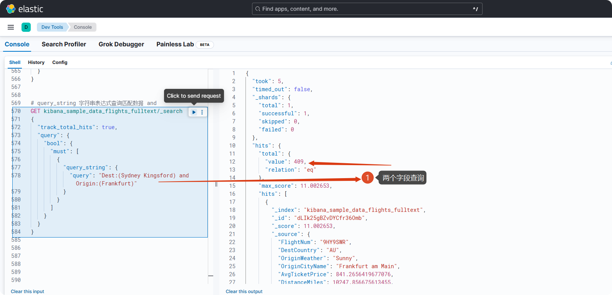

### **执行流程：**

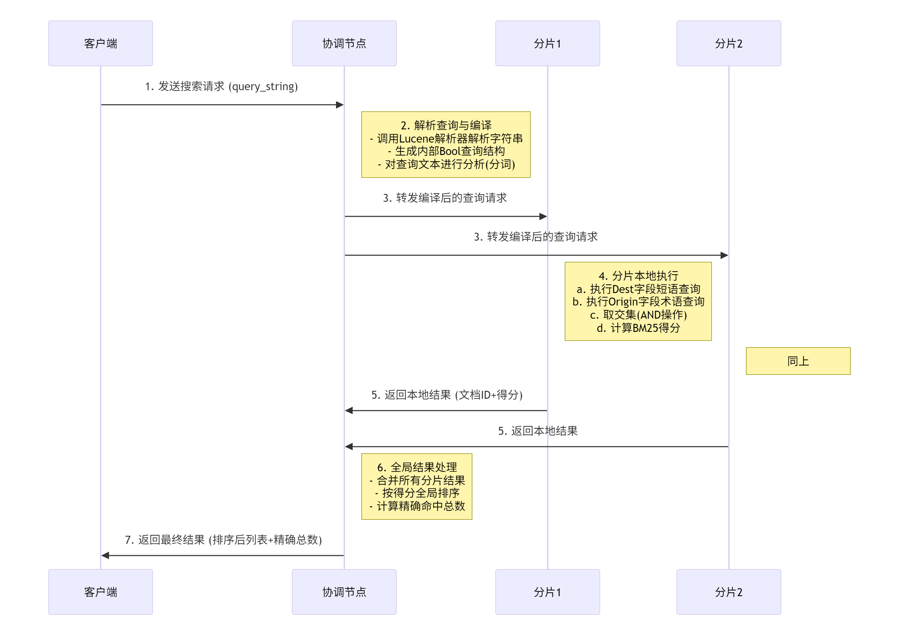

下面示例查询的目标：搜索所有 FlightDelayMin 字段值在 90 到 100 之间（包括 90 和 100）的航班记录。FlightDelayMin 字段可能表示航班延误的分钟数，因此这个查询用于查找延误时间在特定范围内的航班。

\# query\_string 字符串表达式查询匹配数据 范围 搜索FlightDelayMin字段在90到100之间的文档

GET kibana\_sample\_data\_flights\_fulltext/\_search

{

"track\_total\_hits": true,

"query": {

"bool": {

"must": \[

{

"query\_string": {

"query": "FlightDelayMin:\[90 TO 100\]",

"auto\_generate\_synonyms\_phrase\_query": false

}

}

\]

}

}

}

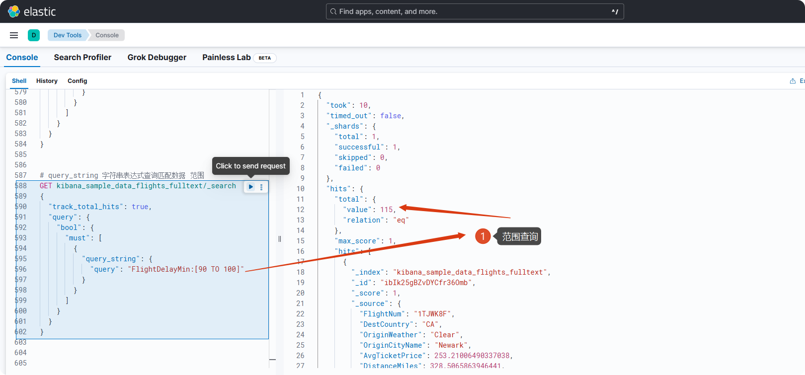

### **执行流程：**

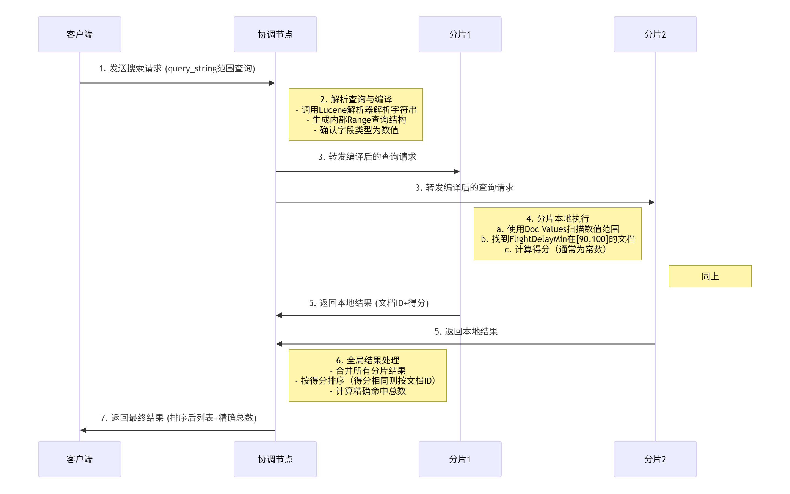

### **3.2.9 simple\_query\_string（字符串表达式查询匹配）**

下面示例查询的目标是：​在航班数据的 Dest（目的地）字段中，搜索必须同时包含 "Macdonald-Cartier" 和 "International" 这两个词的机场记录。​

​

​关键点解析：​​

1.  ​\+ 操作符​：在 simple\_query\_string 语法中，+ 表示"必须包含"，相当于逻辑 ​AND。
2.  查询 "Macdonald-Cartier + International" 表示：文档的 Dest 字段必须同时存在 "Macdonald-Cartier" 和 "International" 这两个词条。
3.  这很可能是为了搜索全名为 "Ottawa Macdonald-Cartier International Airport" 的机场，但用户不确定完整的名称或顺序，因此使用这种方式来确保匹配包含这两个关键部分的机场。

\# simple\_query\_string 字符串表达式查询匹配数据

GET kibana\_sample\_data\_flights\_fulltext/\_search

{

"track\_total\_hits": true,

"query": {

"bool": {

"must": \[

{

"simple\_query\_string": {

"query": "Macdonald-Cartier + International",

"fields": \[

"Dest"

\]

}

}

\]

}

}

}

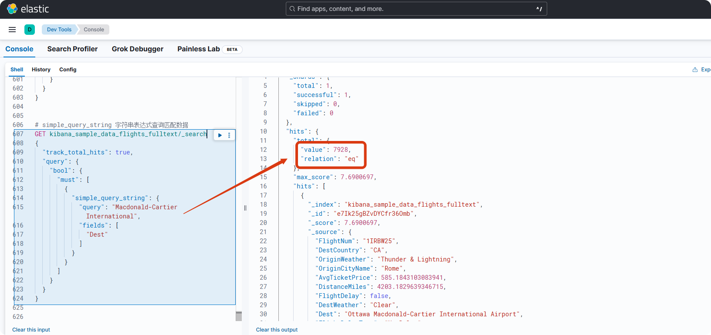

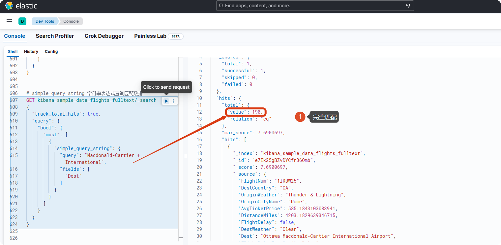

关键字段含义：

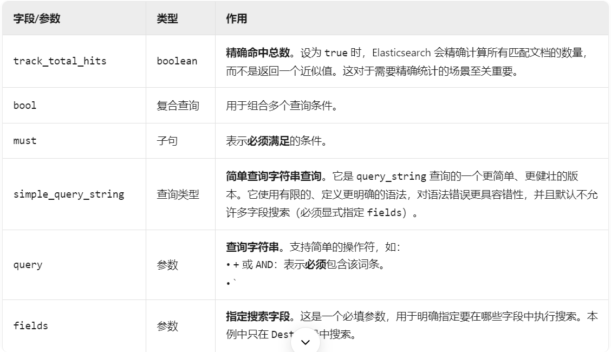

与 query\_string 的关键区别：​​

1.  ​更简单​：不支持复杂的 Lucene 语法（如范围查询 \[ \]、通配符 ?、模糊搜索 ~、提升权重 ^ 等）。
2.  ​更安全​：对语法错误更具容错性，不会因为简单的语法错误（如未闭合的引号）而抛出异常。
3.  ​更明确​：必须通过 fields 参数显式指定要搜索的字段，避免了意外在多个字段上搜索的风险。

simple\_query\_string 查询的底层设计与 query\_string 类似，但更简化，其核心同样在于「**跨字解析器（Parser）**」**​**。

​查询解析与编译​：

1.  协调节点接收到查询后，使用一个更简单、更容错的解析器来处理查询字符串。
2.  解析器会识别出操作符 +，并将查询 "Macdonald-Cartier + International" 编译成一个等价的内部 bool 查询，结构如下：

{

"bool": {

"must": \[

{ "term": { "Dest": "macdonald-cartier" }}, // 注意：文本已被分析器处理

{ "term": { "Dest": "international" }}

\]

}

}

1.  请注意，查询文本会经过分析器处理（如转为小写、分词），因此最终执行的是针对分析后词条的查询。

### **执行流程：**

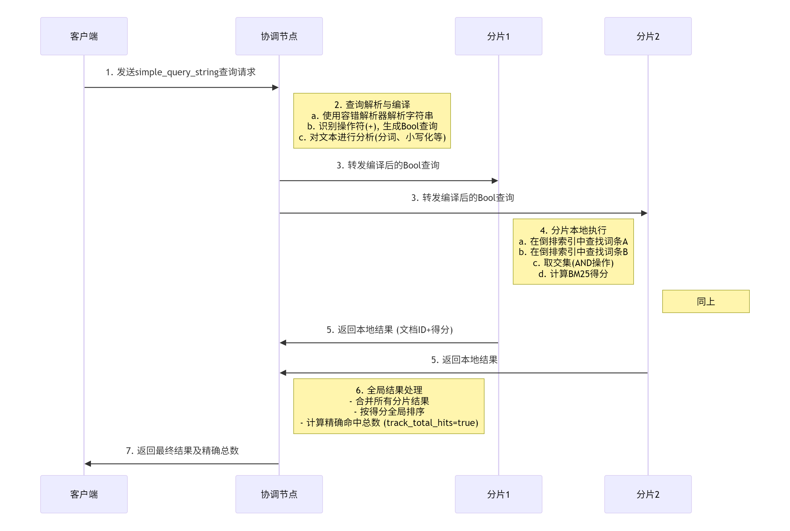

详细步骤说明：

1.  ​请求发起：客户端向协调节点发送搜索请求。
2.  ​协调节点处理 - 关键阶段​
3.  ​解析查询​：协调节点识别出 simple\_query\_string 类型，并使用其专用的、容错性更强的解析器来解析查询字符串 "Macdonald-Cartier + International"。
4.  ​查询编译​：解析器识别出 + 操作符，从而将查询编译成一个包含两个 must 子句的内部 bool 查询。
5.  ​文本分析​：将词条 "Macdonald-Cartier" 和 "International" 分别发送给 Dest 字段配置的分析器进行处理，得到分析后的词条（如 macdonald-cartier, international）。
6.  ​确定分片​：根据索引的分片路由规则，确定目标分片。
7.  ​并行查询：​​协调节点将编译和分析后生成的内部 bool 查询结构分发给所有相关分片。
8.  ​分片本地执行 每个分片接收到的是标准的 bool term 查询，其在本地执行过程非常高效：
9.  在 Dest 字段的倒排索引中，精确查找包含词条 macdonald-cartier 的所有文档。
10.  在 Dest 字段的倒排索引中，精确查找包含词条 international 的所有文档。
11.  取两个结果集的交集（逻辑 AND），得到最终匹配的文档。
12.  为这些文档计算 BM25 相关性得分。
13.  ​结果返回：各分片将本地匹配的文档及其得分返回给协调节点。
14.  ​全局归并​​ 协调节点收集所有分片的结果：
15.  ​合并列表​：将所有分片返回的文档列表合并。
16.  ​排序​：根据文档的 BM25 得分进行全局降序排序。
17.  ​精确计数​：因为 track\_total\_hits: true，协调节点会精确计算所有匹配文档的总数。
18.  ​最终响应：协调节点将最终排序后的结果列表、精确的命中总数返回给客户端。

综上 simple\_query\_string 查询是 query\_string 的一个更安全、更简单的变体，非常适合从用户输入中构建查询，因为它能更好地处理语法错误和意外输入。

1.  ​优点​：语法简单、容错性强、安全性高（需要显式指定字段）。
2.  ​缺点​：功能有限，不支持复杂的搜索操作。

### **3.2.10 intervals（精确匹配）**

下面示例查询的目标是：​在 Dest（目的地）字段中，执行一个极其精确的、基于词条位置和顺序的匹配查询。

**​**​

具体来说，它要查找同时满足以下两个条件的航班目的地：

1.  ​第一个条件（必须按顺序紧密出现）​​：必须包含完整且连续的短语 "Ottawa Macdonald-Cartier"。"max\_gaps" : 0 和 "ordered" : true 确保了这两个词必须紧挨着出现，且顺序必须是 "Ottawa" 后面紧跟 "Macdonald-Cartier"。
2.  ​第二个条件（二选一）​​：在第一个条件匹配之后，​紧接着必须出现 ​​"International"​​ 或 ​​"Airport"​​ 中的任意一个词。

​这个查询精确匹配像 ​**​**"Ottawa Macdonald-Cartier International Airport"​​ 这样的完整机场名称。它确保了名称的核心部分（"Ottawa Macdonald-Cartier"）必须完整且顺序正确，并且后面必须跟着机场名称常见的后缀（"International" 或 "Airport"）。

\# intervals 精确匹配数据

GET kibana\_sample\_data\_flights\_fulltext/\_search

{

"query": {

"intervals" : {

"Dest" : {

"all\_of" : {

"ordered" : true,

"intervals" : \[

{

"match" : {

"query" : "Ottawa Macdonald-Cartier",

"max\_gaps" : 0,

"ordered" : true

}

},

{

"any\_of" : {

"intervals" : \[

{ "match" : { "query" : "International" } },

{ "match" : { "query" : "Airport" } }

\]

}

}

\]

}

}

}

}

}

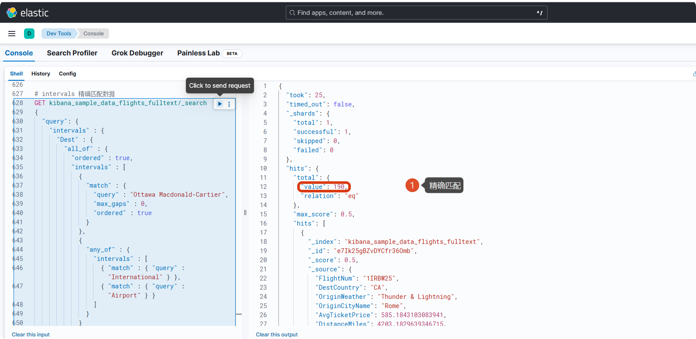

关键字段含义：

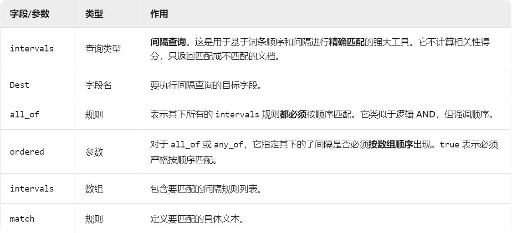

这个查询定义了一个规则：在 Dest 字段中，必须先出现一个紧密相邻、顺序正确的短语 "Ottawa Macdonald-Cartier" (max\_gaps: 0, ordered: true)，然后紧接着必须出现其中一个词条："International" 或 "Airport" (any\_of)。

intervals 查询的底层设计与传统查询截然不同，其核心在于利用倒排索引中的位置信息进行模式匹配。例如，文档 "Ottawa Macdonald-Cartier International Airport" 的位置信息可能是：

1.  ottawa -> pos: 0
2.  macdonald-cartier -> pos: 1
3.  international -> pos: 2
4.  airport -> pos: 3

### **执行流程：**

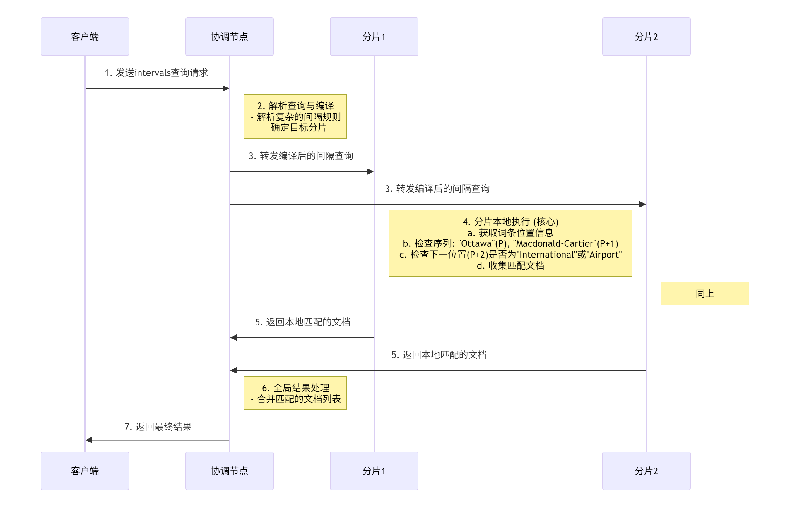

详细步骤说明：

1.  ​请求发起：客户端向协调节点发送搜索请求。
2.  ​协调节点处理
3.  ​解析查询​：协调节点解析 JSON，识别出这是一个复杂的 intervals 查询。
4.  ​编译规则​：将 JSON 结构编译成内部的位置匹配规则。
5.  ​确定分片​：根据索引的分片路由规则，确定目标分片。
6.  ​并行查询：协调节点将编译好的间隔查询规则分发给所有相关分片。
7.  ​分片本地执行 - 最核心、最耗资源的阶段​ 每个分片接收到请求后，在自己的倒排索引中独立执行以下操作：
8.  ​定位词条​：首先，在倒排索引中找到查询中涉及的所有词条（ottawa, macdonald-cartier, international, airport）的倒排表。
9.  ​遍历候选文档​：遍历可能包含这些词条的文档。
10.  ​获取位置信息​：对于每个候选文档，从倒排索引中获取这些词条在该文档 Dest 字段中的具体位置。
11.  ​执行模式匹配​：根据编译好的规则，检查位置序列是否符合要求。对于本例：
12.  检查是否存在一个位置 P，该位置是词条 ottawa。
13.  检查位置 P+1 是否是词条 macdonald-cartier。（满足 max\_gaps: 0）
14.  检查位置 P+2 是否是词条 international ​或​ airport。（满足 any\_of）
15.  只有完全符合这一序列规则的文档才会被选中。
16.  ​结果返回：各分片将本地匹配的文档列表返回给协调节点。因为 intervals 查询主要用于过滤，所以通常不计算得分或返回固定得分。
17.  ​全局归并 协调节点收集所有分片的结果：
18.  ​合并列表​：将所有分片返回的文档列表合并。
19.  由于查询是精确匹配，通常不需要排序。
20.  ​最终响应：协调节点将最终匹配的文档列表返回给客户端。

intervals 查询是 ES 提供的一种极其强大的「**精确匹配工具**」，它超越了简单的关键词匹配，进入了「**模式匹配**」和「**语法分析**」的领域。

1.  ​优势​：提供了无与伦比的匹配精度控制，可以定义复杂的词条顺序和间隔规则。非常适合匹配固定短语、 idioms、专有名词或任何对词序和邻近度有严格要求的场景。
2.  ​代价​：性能开销相对较大，因为它需要获取和处理大量的词条位置数据。应谨慎使用，避免在大数据集上执行非常复杂的间隔规则。

## **3.3 Full Text 全文搜索性能分析**

上一大节，我们对 Full Text 全文搜索进行了案例深度实战，这节我们来看下如何对其进行性能分析。

### **3.3.1 explain 分值计算过程分析**

\# explain 分值计算过程分析

GET kibana\_sample\_data\_flights\_fulltext/\_search

{

"track\_total\_hits": true,

"size": 1,

"explain": true,

"query": {

"bool": {

"must": \[

{

"multi\_match": {

"query": "Sydney Kingsford",

"fields": \[

"Dest",

"Origin"

\],

"type": "best\_fields"

}

}

\]

}

}

}

\# 结果

{

"took": 4,

"timed\_out": false,

"\_shards": {

"total": 1,

"successful": 1,

"skipped": 0,

"failed": 0

},

"hits": {

"total": {

"value": 404,

"relation": "eq"

},

"max\_score": 7.781851,

"hits": \[

{

\*\*\*

},

"\_explanation": {

"value": 7.781851,

"description": "max of:",

"details": \[

{

"value": 7.781851,

"description": "sum of:",

"details": \[

{

"value": 3.8909254,

"description": "weight(Origin:sydney in 108) \[PerFieldSimilarity\], result of:",

"details": \[

{

"value": 3.8909254,

"description": "score(freq=1.0), computed as boost \* idf \* tf from:",

"details": \[

{

"value": 2.2,

"description": "boost",

"details": \[\]

},

{

"value": 4.4665613,

"description": "idf, computed as log(1 + (N - n + 0.5) / (n + 0.5)) from:",

"details": \[

{

"value": 149,

"description": "n, number of documents containing term",

"details": \[\]

},

{

"value": 13014,

"description": "N, total number of documents with field",

"details": \[\]

}

\]

},

{

"value": 0.3959651,

"description": "tf, computed as freq / (freq + k1 \* (1 - b + b \* dl / avgdl)) from:",

"details": \[

{

"value": 1,

"description": "freq, occurrences of term within document",

"details": \[\]

},

{

"value": 1.2,

"description": "k1, term saturation parameter",

"details": \[\]

},

{

"value": 0.75,

"description": "b, length normalization parameter",

"details": \[\]

},

{

"value": 5,

"description": "dl, length of field",

"details": \[\]

},

{

"value": 3.6720455,

"description": "avgdl, average length of field",

"details": \[\]

}

\]

}

\]

}

\]

},

{

"value": 3.8909254,

"description": "weight(Origin:kingsford in 108) \[PerFieldSimilarity\], result of:",

"details": \[

{

"value": 3.8909254,

"description": "score(freq=1.0), computed as boost \* idf \* tf from:",

"details": \[

{

"value": 2.2,

"description": "boost",

"details": \[\]

},

{

"value": 4.4665613,

"description": "idf, computed as log(1 + (N - n + 0.5) / (n + 0.5)) from:",

"details": \[

{

"value": 149,

"description": "n, number of documents containing term",

"details": \[\]

},

{

"value": 13014,

"description": "N, total number of documents with field",

"details": \[\]

}

\]

},

{

"value": 0.3959651,

"description": "tf, computed as freq / (freq + k1 \* (1 - b + b \* dl / avgdl)) from:",

"details": \[

{

"value": 1,

"description": "freq, occurrences of term within document",

"details": \[\]

},

{

"value": 1.2,

"description": "k1, term saturation parameter",

"details": \[\]

},

{

"value": 0.75,

"description": "b, length normalization parameter",

"details": \[\]

},

{

"value": 5,

"description": "dl, length of field",

"details": \[\]

},

{

"value": 3.6720455,

"description": "avgdl, average length of field",

"details": \[\]

}

\]

}

\]

}

\]

}

\]

}

\]

}

}

\]

}

}

\_explanation 部分揭示了 Elasticsearch 如何计算相关性得分 (\_score)。它使用的是 ​BM25 (Best Matching 25)**​**​ 算法，这是 TF-IDF 算法的一个现代、更优的替代品。

以下是核心组成部分的含义：

1.  value: 7.781851
2.  ​含义​：文档的最终相关性得分。
3.  ​description: "max of:"
4.  ​含义​：由于使用了 best\_fields 类型的 multi\_match，ES 会分别计算两个字段的得分，然后取最大值。这里显示 max of，但下面的细节其实是 sum of，这是因为在 best\_fields 策略下，ES 先计算了每个字段内词条的分数和，然后再在字段间取最大值。本例中两个字段的得分和恰好相同。
5.  ​description: "sum of:"
6.  ​含义​：在一个字段（本例中是 Origin 字段）内，该字段的最终得分是匹配到的所有词条得分之和。这里“sydney”和“kingsford”都匹配到了，所以是两者得分相加。
7.  ​weight(Origin:sydney in 108) \[PerFieldSimilarity\]
8.  ​含义​：词条 sydney 在字段 Origin 中的得分计算详情。108 是包含该词条的文档的内部ID。
9.  ​score(freq=1.0), computed as boost \* idf \* tf
10.  ​含义​：BM25 分数的计算公式，即 得分 = 权重提升 \* 逆文档频率 \* 词条频率。
11.  ​boost (权重提升因子 = 2.2)​：字段级别的权重加成。默认是 2.2。你可以通过在 mapping 或查询中设置 boost 来影响得分。
12.  ​idf (逆文档频率 = 4.4665613)​：衡量词条的稀有程度。越常见的词，重要性越低。
13.  N, total number of documents with field (13014)：索引中拥有 Origin 字段的文档总数。
14.  n, number of documents containing term (149)：包含词条 “sydney” 的文档数量。
15.  idf = log(1 + (N - n + 0.5) / (n + 0.5))：代入公式计算得出。因为“Sydney”作为一个城市名并不常见，所以 IDF 值很高。
16.  tf (词条频率 = 0.3959651)：衡量词条在单个文档的特定字段中出现的频率。出现次数越多，分数越高，但会受到归一化抑制。
17.  freq, occurrences of term within document (1)：该文档的 Origin 字段中，“sydney”出现了 1 次。
18.  k1, term saturation parameter (1.2)：控制词频饱和度的参数。值越大，词频的影响越大。
19.  b, length normalization parameter (0.75)：控制字段长度归一化的参数。值越大，长字段的惩罚越大。
20.  dl, length of field (5)：该文档 Origin 字段的词条数量（“Sydney”、“Kingsford”、“Smith”、“International”、“Airport”共5个词）。
21.  avgdl, average length of field (3.6720455)：索引中所有文档 Origin 字段的平均词条长度。
22.  tf = freq / (freq + k1 \* (1 - b + b \* dl / avgdl))：代入公式计算得出。因为该字段长度 (5) 大于平均长度 (3.67)，所以 TF 分数受到了一定的抑制。

词条 “kingsford” 的计算过程与 “sydney” 完全一致，因此得分也是 3.89。两者相加，Origin 字段的总得分为 7.78。由于 Dest 字段没有匹配任何词条，得分为 0，所以最终文档得分就是 Origin 字段的得分 7.78。

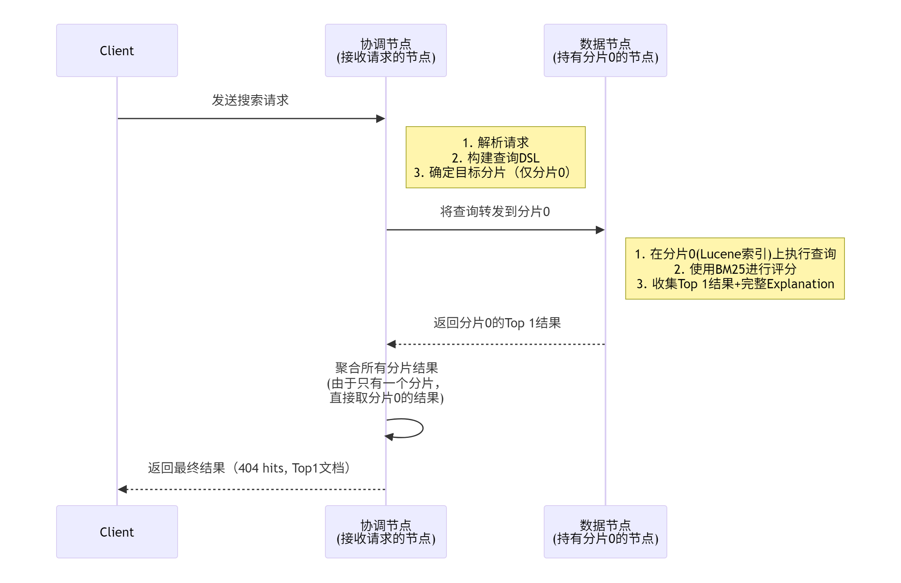

#### 详细步骤说明：

1.  ​客户端请求​：应用程序（如 Kibana）向 Elasticsearch 集群中的某个节点发送 HTTP POST 请求，请求中包含查询 DSL（JSON 主体）。
2.  ​协调节点接收与解析​：
3.  接收请求的节点成为 ​协调节点 (Coordinating Node)​。
4.  协调节点解析查询 JSON，验证语法，并确定需要查询哪些索引和分片。本例中，目标索引只有一个分片（分片 0）。
5.  ​查询分片​：协调节点将搜索请求转发给持有该分片主副本或副副本的 ​数据节点 (Data Node)​。在本例中，协调节点和数据节点是同一个。
6.  ​分片执行查询（核心步骤）​​：
7.  数据节点收到请求后，在其本地存储的 ​Lucene 索引（分片）​​ 上执行查询。这个过程分为两个阶段：
8.  ​Query Phase（查询阶段）​​：
9.  对 Origin 和 Dest 字段的倒排索引进行查找，找到所有包含 “sydney” 或 “kingsford” 的文档。
10.  对每个匹配的文档，使用 BM25 算法计算相关性得分 (\_score)。因为设置了 "explain": true，所以会进行非常详细的分数计算记录。
11.  根据得分排序，选取排名最高的 size（这里是 1）个文档的 ID 和分数。由于设置了 "track\_total\_hits": true，它也会精确计算匹配的总命中数（404）。
12.  ​Fetch Phase（获取阶段）​​：
13.  协调节点从每个分片获取到 Top 1 的文档 ID 和分数后，会向数据节点发起第二次请求，获取这些文档 ID 的完整源数据（\_source）和解释信息（explanation）。
14.  ​结果聚合与返回​：
15.  协调节点接收到来自所有相关分片（本例中只有分片 0）的结果。
16.  它将所有结果聚合到一个全局排序列表中。由于我们只查询了一个分片且只要一个结果，这个过程很简单。
17.  协调节点将最终排序后的结果列表（包括 hits、total、\_source、\_explanation 等）返回给客户端。

### **3.3.2 profile 查询执行计划**

\# profile 查询执行计划

GET kibana\_sample\_data\_flights\_fulltext/\_search

{

"track\_total\_hits": true,

"size": 1,

"profile": true,

"query": {

"bool": {

"must": \[

{

"multi\_match": {

"query": "Sydney Kingsford",

"fields": \[

"Dest",

"Origin"

\],

"type": "best\_fields"

}

}

\]

}

}

}

\# 结果

{

"took": 33,

"timed\_out": false,

"\_shards": {

"total": 1,

"successful": 1,

"skipped": 0,

"failed": 0

},

"hits": {

"total": {

"value": 404,

"relation": "eq"

},

"max\_score": 7.781851,

"hits": \[

{

\*\*\*

}

\]

},

"profile": {

"shards": \[

{

"id": "\[nUSQHj-mRbytSTCci8xMwA\]\[kibana\_sample\_data\_flights\_fulltext\]\[0\]",

"node\_id": "nUSQHj-mRbytSTCci8xMwA",

"shard\_id": 0,

"index": "kibana\_sample\_data\_flights\_fulltext",

"cluster": "(local)",

"searches": \[

{

"query": \[

{

"type": "DisjunctionMaxQuery",

"description": "((Origin:sydney Origin:kingsford) | (Dest:sydney Dest:kingsford))",

"time\_in\_nanos": 3442996,

"breakdown": {

"set\_min\_competitive\_score\_count": 0,

"match\_count": 0,

"shallow\_advance\_count": 0,

"set\_min\_competitive\_score": 0,

"next\_doc": 500479,

"match": 0,

"next\_doc\_count": 405,

"score\_count": 404,

"compute\_max\_score\_count": 0,

"compute\_max\_score": 0,

"advance": 0,

"advance\_count": 0,

"count\_weight\_count": 0,

"score": 471285,

"build\_scorer\_count": 2,

"create\_weight": 745786,

"shallow\_advance": 0,

"count\_weight": 0,

"create\_weight\_count": 1,

"build\_scorer": 1725446

},

"children": \[

{

"type": "BooleanQuery",

"description": "Origin:sydney Origin:kingsford",

"time\_in\_nanos": 1592446,

"breakdown": {

"set\_min\_competitive\_score\_count": 0,

"match\_count": 0,

"shallow\_advance\_count": 0,

"set\_min\_competitive\_score": 0,

"next\_doc": 167245,

"match": 0,

"next\_doc\_count": 150,

"score\_count": 149,

"compute\_max\_score\_count": 0,

"compute\_max\_score": 0,

"advance": 0,

"advance\_count": 0,

"count\_weight\_count": 0,

"score": 125059,

"build\_scorer\_count": 2,

"create\_weight": 592392,

"shallow\_advance": 0,

"count\_weight": 0,

"create\_weight\_count": 1,

"build\_scorer": 707750

},

"children": \[

{

"type": "TermQuery",

"description": "Origin:sydney",

"time\_in\_nanos": 295830,

"breakdown": {

"set\_min\_competitive\_score\_count": 0,

"match\_count": 0,

"shallow\_advance\_count": 0,

"set\_min\_competitive\_score": 0,

"next\_doc": 40687,

"match": 0,

"next\_doc\_count": 150,

"score\_count": 149,

"compute\_max\_score\_count": 0,

"compute\_max\_score": 0,

"advance": 0,

"advance\_count": 0,

"count\_weight\_count": 0,

"score": 33567,

"build\_scorer\_count": 3,

"create\_weight": 135615,

"shallow\_advance": 0,

"count\_weight": 0,

"create\_weight\_count": 1,

"build\_scorer": 85961

}

},

{

"type": "TermQuery",

"description": "Origin:kingsford",

"time\_in\_nanos": 148918,

"breakdown": {

"set\_min\_competitive\_score\_count": 0,

"match\_count": 0,

"shallow\_advance\_count": 0,

"set\_min\_competitive\_score": 0,

"next\_doc": 30390,

"match": 0,

"next\_doc\_count": 150,

"score\_count": 149,

"compute\_max\_score\_count": 0,

"compute\_max\_score": 0,

"advance": 0,

"advance\_count": 0,

"count\_weight\_count": 0,

"score": 26733,

"build\_scorer\_count": 3,

"create\_weight": 76819,

"shallow\_advance": 0,

"count\_weight": 0,

"create\_weight\_count": 1,

"build\_scorer": 14976

}

}

\]

},

{

"type": "BooleanQuery",

"description": "Dest:sydney Dest:kingsford",

"time\_in\_nanos": 594372,

"breakdown": {

"set\_min\_competitive\_score\_count": 0,

"match\_count": 0,

"shallow\_advance\_count": 0,

"set\_min\_competitive\_score": 0,

"next\_doc": 222946,

"match": 0,

"next\_doc\_count": 270,

"score\_count": 269,

"compute\_max\_score\_count": 0,

"compute\_max\_score": 0,

"advance": 0,

"advance\_count": 0,

"count\_weight\_count": 0,

"score": 234959,

"build\_scorer\_count": 2,

"create\_weight": 96296,

"shallow\_advance": 0,

"count\_weight": 0,

"create\_weight\_count": 1,

"build\_scorer": 40171

},

"children": \[

{

"type": "TermQuery",

"description": "Dest:sydney",

"time\_in\_nanos": 186002,

"breakdown": {

"set\_min\_competitive\_score\_count": 0,

"match\_count": 0,

"shallow\_advance\_count": 0,

"set\_min\_competitive\_score": 0,

"next\_doc": 72311,

"match": 0,

"next\_doc\_count": 270,

"score\_count": 269,

"compute\_max\_score\_count": 0,

"compute\_max\_score": 0,

"advance": 0,

"advance\_count": 0,

"count\_weight\_count": 0,

"score": 68330,

"build\_scorer\_count": 3,

"create\_weight": 32518,

"shallow\_advance": 0,

"count\_weight": 0,

"create\_weight\_count": 1,

"build\_scorer": 12843

}

},

{

"type": "TermQuery",

"description": "Dest:kingsford",

"time\_in\_nanos": 126520,

"breakdown": {

"set\_min\_competitive\_score\_count": 0,

"match\_count": 0,

"shallow\_advance\_count": 0,

"set\_min\_competitive\_score": 0,

"next\_doc": 41723,

"match": 0,

"next\_doc\_count": 270,

"score\_count": 269,

"compute\_max\_score\_count": 0,

"compute\_max\_score": 0,

"advance": 0,

"advance\_count": 0,

"count\_weight\_count": 0,

"score": 50899,

"build\_scorer\_count": 3,

"create\_weight": 24495,

"shallow\_advance": 0,

"count\_weight": 0,

"create\_weight\_count": 1,

"build\_scorer": 9403

}

}

\]

}

\]

}

\],

"rewrite\_time": 72114,

"collector": \[

{

"name": "QueryPhaseCollector",

"reason": "search\_query\_phase",

"time\_in\_nanos": 1098690,

"children": \[

{

"name": "SimpleTopScoreDocCollector",

"reason": "search\_top\_hits",

"time\_in\_nanos": 690718

}

\]

}

\]

}

\],

"aggregations": \[\],

"fetch": {

"type": "fetch",

"description": "",

"time\_in\_nanos": 3353591,

"breakdown": {

"load\_stored\_fields": 805908,

"load\_source": 7447,

"load\_stored\_fields\_count": 1,

"next\_reader\_count": 1,

"load\_source\_count": 1,

"next\_reader": 850494

},

"debug": {

"stored\_fields": \[

"\_id",

"\_routing",

"\_source"

\]

},

"children": \[

{

"type": "FetchFieldsPhase",

"description": "",

"time\_in\_nanos": 23144,

"breakdown": {

"process\_count": 1,

"process": 8843,

"next\_reader": 14301,

"next\_reader\_count": 1

}

},

{

"type": "FetchSourcePhase",

"description": "",

"time\_in\_nanos": 4238,

"breakdown": {

"process\_count": 1,

"process": 3660,

"next\_reader": 578,

"next\_reader\_count": 1

},

"debug": {

"fast\_path": 1

}

},

{

"type": "StoredFieldsPhase",

"description": "",

"time\_in\_nanos": 6500,

"breakdown": {

"process\_count": 1,

"process": 2916,

"next\_reader": 3584,

"next\_reader\_count": 1

}

}

\]

}

}

\]

}

}

profile 输出是一个性能剖析报告，它揭示了查询在底层 Lucene 中的执行细节。专注于分析查询如何执行，并详细展示每个步骤的耗时，用于性能分析和调试。

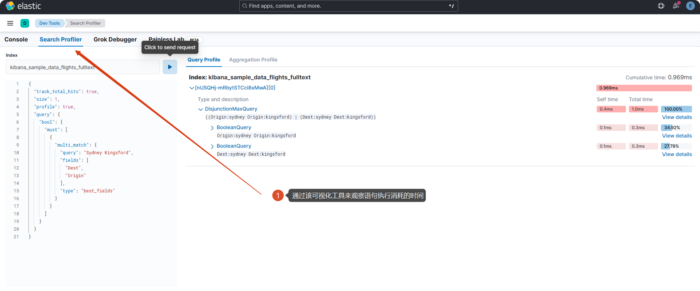

整体结构分为 3 部分：

1.  took: 33：整个请求耗时 33 毫秒。
2.  shards: 显示分片信息，表明查询只在 1 个分片上执行。
3.  profile: 剖析结果的核心部分。

#### profile.shards\[\] 剖析详情：

1.  ​id, node\_id, shard\_id
2.  ​含义​：指示 profiling 信息来自哪个节点的哪个分片。
3.  searches
4.  ​含义​：表明这是一个搜索请求（相对于聚合请求而言）。其内部包含了 query 和 collector 两部分。
5.  ​query (查询树)​
6.  ​含义​：以树形结构详细描述了 Lucene 是如何执行查询的，并包含了每个节点的耗时分解 (breakdown)。
7.  type: DisjunctionMaxQuery
8.  ​含义​：这就是 multi\_match 与 best\_fields 在 Lucense 底层被转换成的查询类型。Disjunction Max Query 会执行所有子查询，但文档的得分取自所有子查询中的最高分，这正是 best\_fields 的语义。
9.  ​description: "((Origin:sydney Origin:kingsford) | (Dest:sydney Dest:kingsford))"
10.  ​含义​：非常清晰地展示了查询逻辑。它由两个大的 BooleanQuery 子查询组成，用 | (OR) 连接，表示取两者中的最大值。
11.  breakdown：该节点的耗时明细。
12.  create\_weight: 创建权重对象的时间，这是一个初始化步骤。
13.  build\_scorer: 构建计分器的时间，计分器用于迭代和评分匹配的文档。
14.  next\_doc: 迭代到下一个匹配文档所花费的时间。next\_doc\_count: 405 表明此查询迭代了 405 次。
15.  score: 为文档计算分数所花费的时间。score\_count: 404 表明为 404 个文档计算了分数。
16.  ​children：DisjunctionMaxQuery 的两个子节点。
17.  ​BooleanQuery: "Origin:sydney Origin:kingsford"
18.  ​含义​：在 Origin 字段上搜索 "sydney" OR "kingsford"。这是一个布尔查询，默认情况下词条之间是 SHOULD (或) 的关系。
19.  children：该布尔查询的两个 TermQuery 子节点，分别对应两个词条。
20.  ​BooleanQuery: "Dest:sydney Dest:kingsford"
21.  ​含义​：在 Dest 字段上搜索 "sydney" OR "kingsford"。逻辑同上。
22.  breakdown 通用字段解释：
23.  create\_weight / create\_weight\_count: 初始化查询对象的耗时和次数。
24.  build\_scorer / build\_scorer\_count: 构建计分器（用于迭代和评分文档）的耗时和次数。
25.  next\_doc / next\_doc\_count: 获取下一个匹配文档ID的耗时和总次数。​这是衡量查询效率的关键指标，次数越少通常性能越好。
26.  score / score\_count: 计算文档相关性的耗时和总次数。
27.  advance / advance\_count: 跳转到某个文档ID的耗时和次数（比 next\_doc 更复杂）。
28.  collector (收集器)​
29.  ​含义​：收集器负责收集、排序和筛选查询返回的结果。
30.  SimpleTopScoreDocCollector: 这是最常用的收集器，用于收集按分数排序的 Top N 个结果（由 size: 1 指定）。
31.  time\_in\_nanos: 显示了收集结果所花费的总时间。
32.  ​fetch (获取阶段)
33.  ​含义​：查询阶段（Query Phase）结束后，需要从存储中获取排名前 N 的文档的完整数据（\_source），这个阶段就是获取阶段。
34.  breakdown:
35.  load\_stored\_fields: 加载存储字段（如 \_id, \_routing）的耗时。
36.  load\_source: 加载源数据 \_source 的耗时。
37.  next\_reader: 切换到下一个索引段（Segment）的耗时。

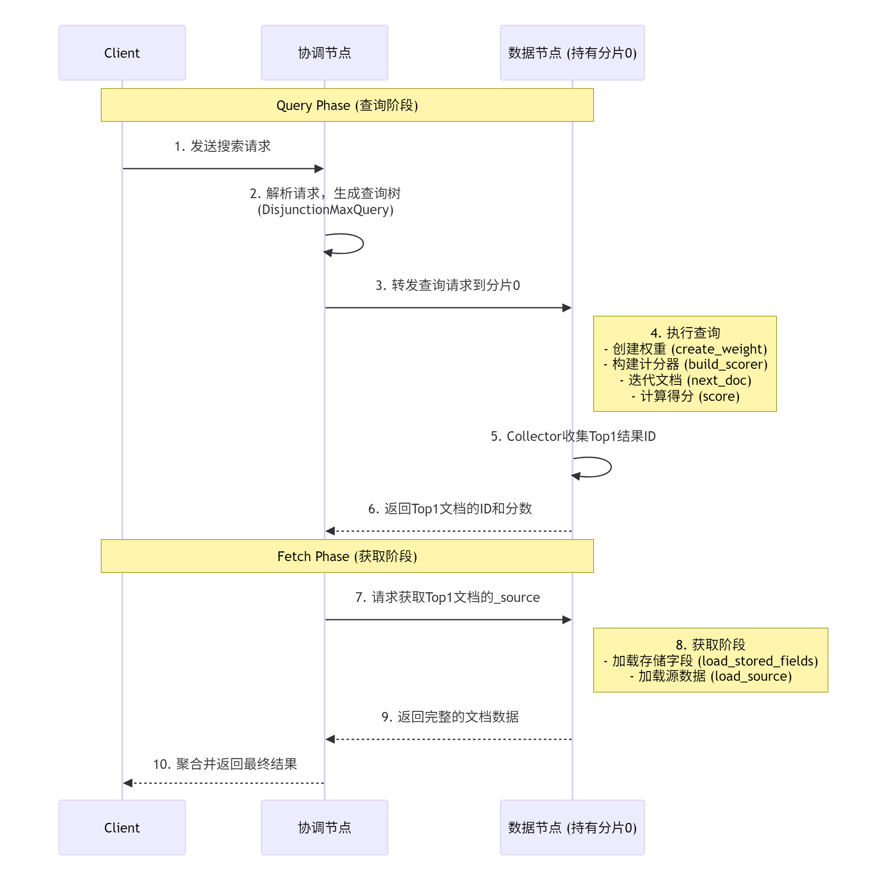

#### 详细步骤说明：

1.  ​客户端请求​：客户端向 Elasticsearch 集群发送 HTTP 请求，请求体中包含查询 DSL 和 "profile": true 参数。
2.  ​协调节点接收与解析​：
3.  接收请求的节点成为协调节点。
4.  协调节点解析查询 JSON，确定目标索引和分片（本例中为分片 0）。
5.  ​关键​：协调节点将 multi\_match 查询重写（rewrite）为底层的 DisjunctionMaxQuery，并构建好查询树。profile 结果中的 "rewrite\_time": 72114 纳秒记录了这个过程的耗时。
6.  ​查询分片​：协调节点将优化后的查询请求转发给持有分片 0 的数据节点。
7.  ​分片执行查询（Query Phase）​​：
8.  数据节点在其本地 Lucene 索引上执行查询。
9.  ​create\_weight​：初始化查询对象，计算权重（如 IDF）。
10.  build\_scorer：为每个子查询（如 TermQuery）构建计分器。计分器是一个迭代器，可以高效地返回匹配的文档及其分数。
11.  next\_doc：计分器不断迭代，找到下一个匹配的文档 ID。DisjunctionMaxQuery 会驱动两个 BooleanQuery 子查询同时进行迭代和评分。
12.  score：为匹配的文档计算相关性得分。profile 显示此过程对 404 个文档进行了评分。
13.  ​collector​：SimpleTopScoreDocCollector 收集器在后台工作，不断维护一个大小为 size (1) 的优先级队列，只保留分数最高的文档 ID。
14.  ​返回查询结果​：数据节点将查询阶段的成果（Top 1 的文档 ID 和分数，以及总命中数 404）返回给协调节点。
15.  ​获取阶段（Fetch Phase）​​：
16.  协调节点收到所有分片的查询结果后，发起第二次请求，向数据节点获取排名前 N 的文档的完整数据（\_source）。
17.  数据节点接收到 fetch 请求后，根据文档 ID，从存储中加载源数据​ (load\_source) 和其他存储字段。
18.  此阶段在 profile 中单独列为 fetch 部分，耗时 3.35ms。
19.  ​结果返回​：数据节点将获取到的完整文档数据返回给协调节点，协调节点将其组装成最终响应，并附上详细的 profile 信息，返回给客户端。

## **04 IK 中文分词器深度实战**

通过前面的学习，我们知道存储到 ES 中的数据大致可以分为以下两种：

1.  全文本，例如商品标题、商品简介、商品内容、商品详情等；
2.  精确值，例如实体 ID、时间 等。

在对这两类值进行查询的时候，「**精确值类型**」会比较它们的二进制值，其结果只有相等或者不相等。而对「**全文本类型**」进行等值比较是不太现实的，通常只会比较两个文本「**是否相似**」。要比较两个全文本类型是否相似是用「**相关性评分**」来进行评估的。

要得到「**相关性评分**」，就需要对全文本进行「**分词**」处理，然后得到统计数据才能进行评估。在 ES 中，负责处理文本分词的是「**分词器**」，在正式实战「**中文分词器**」之前，我们先来了解下什么是「**分词**」和 「**分词器**」。

## **4.1 分词与分词器**

「**分词**」是将「**全文本**」转换为一系列「**单词**」的过程，这些单词称为 term 或者 token。

「**分词**」是通过「**分词器**」（Analyzer） 来实现的，比如用于中文分词的 IK 分词器等。ES 内置了一些常用的分词器，如果不能满足你的需求，你可以安装第三方的分词器或者定制化你自己的分词器。

它发生在两个阶段：

1.  ​索引时（Indexing）​​：当文档被创建或更新时，对文本字段的内容进行分析。
2.  ​搜索时（Searching）​​：对查询字符串进行分析（通常使用与索引时相同的分析器）。

​目标​：确保查询词条与索引中的词条形式匹配，从而找到相关文档。

## **4.2 分词器组成**

一个分词器是一个包装器，它将三个底层模块按顺序组合成一个完整的处理管道（Pipeline），分词器主要由以下三部分组成：

1.  字符过滤器（Character Filters）​​ （0个或多个）
2.  ​作用​：在文本被送入分词器之前，对原始文本进行预处理。
3.  ​操作​：添加、删除或更改字符。例如：去除 HTML 标签（<b> -> ）、将 & 转换为 and、移除拼音符号等。
4.  ​常见内置过滤器​：html\_strip（去除HTML）、mapping（字符映射）、pattern\_replace（模式替换）。
5.  ​分词器（Tokenizer）​​ （有且仅有1个）
6.  ​作用​：接收字符过滤器处理后的文本流，将其切分成独立的词条。这是整个分析过程的核心。
7.  ​操作​：决定文本如何在何处被分割。例如：在空格处切分、根据标点符号切分、或使用更复杂的算法。
8.  ​常见内置分词器​：standard（标准分词）、keyword（不分词）、whitespace（按空格分）、pattern（按正则分）。
9.  ​词条过滤器（Token Filters）​​ （0个或多个）
10.  ​作用​：接收分词器产生的词条流，对每个词条进行再处理。
11.  ​操作​：可以修改、添加或删除词条。例如：转为小写、删除停用词（a, an, the）、添加同义词、提取词干等。
12.  ​常见内置过滤器​：lowercase（转小写）、stop（去除停用词）、synonym（添加同义词）、stemmer（词干提取）。

整个流程：原始文本 -> ​字符过滤器​ -> 纯净文本 -> ​分词器​ -> 词条流 -> ​词条过滤器​ -> 最终词条

需要进行分词的文本依次通过 Character Filter、Tokenizer、Token Filter，最后得出切分后的词项。如下图就是分词器工作的流程：

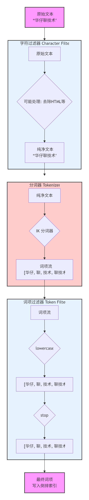

## **4.3 ES 内置的分词器**

ES 提供了许多开箱即用的分词器，以下是最核心的几个：

1.  Standard Analyzer ： 这个是默认的分词器，使用 Unicode 文本分割算法，将文本按单词切分并且转为小写。
2.  Simple Analyzer ： 按照非字母切分并且进行小写处理。
3.  Stop Analyzer ： 与 Simple Analyzer 类似，但增加了停用词过滤（如 a、an、and、are、as、at、be、but 等）。
4.  Whitespace Analyzer ： 使用空格对文本进行切分，并不进行小写转换。
5.  Pattern Analyzer ： 使用正则表达式切分，默认使用 \\W+ (非字符分隔)。支持小写转换和停用词删除。
6.  Keyword Analyzer ： 不进行分词。
7.  Language Analyzer ： 提供了多种常见语言的分词器。如 Irish、Italian、Latvian 等。
8.  Customer Analyzer：自定义分词器。

\_analyze API 是一个非常有用的工具，它可以帮助我们查看分词器是如何工作的。[\_analyze](https://www.elastic.co/docs/manage-data/data-store/text-analysis/test-an-analyzer) API 提供了 3 种方式来查看分词器是如何工作的。

### **4.3.1 \_analyze 分词分析**

使用 \_analyze API 时可以直接指定 Analyzer 来进行测试，示例如下：

GET \_analyze

{

"analyzer": "standard",

"text": "Indira Gandhi International Airport"

}

  
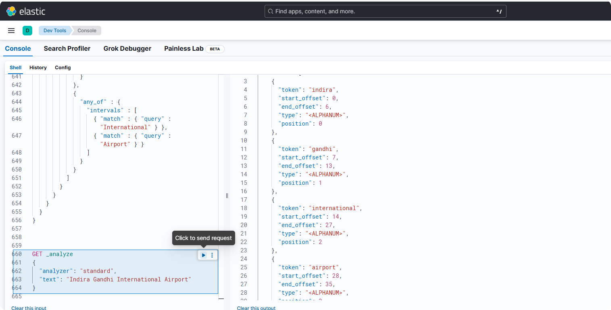

如上示例可以看到它将 text 的内容用 standard 分词器进行分词，text 的内容按单词进行了切分并且单词都转为了小写。

###   
**4.3.2 指定索引分词分析**

对指定的索引进行测试，示例如下：

\# 指定索引分词分析

GET kibana\_sample\_data\_flights\_fulltext/\_analyze

{

"field": "Dest",

"text": "Ottawa Macdonald-Cartier International Airport"

}

  
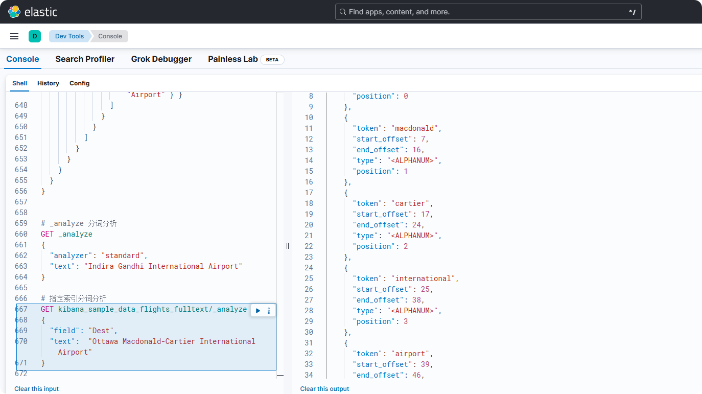

### **4.3.3 \_analyze 组合分词分析**

组合 tokenizer、filters、character filters 进行测试，示例如下：

\# 组合 tokenizer、filter、char\_filter 分词分析

GET \_analyze

{

"tokenizer": "standard", # 指定一个tokenizer

"filter": \[ "lowercase", "asciifolding" \], # 可以组合多个token filter

"char\_filter": \["html\_strip"\], // 可以指定零个Character Filter

"text": "<html>Ottawa Macdonald-Cartier International Airport</html>"

}

  
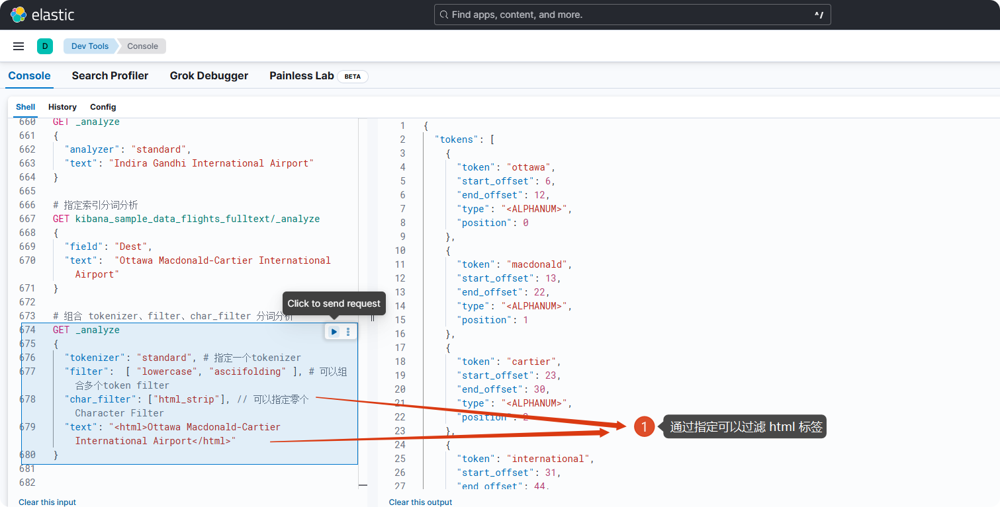

从上面的示例可以看到，tokenizer 使用了 standard 而 token filter 使用了 lowercase 和 asciifolding 来对 text 的内容进行切分。用户可以组合一个 tokenizer、零个或多个 token filter、零个或多个 character filter。

Standard Analyzer 是 ES 默认的分词器，它会将输入的内容按词切分，并且将切分后的词进行小写转换，默认情况下停用词（Stop Word）过滤功能是关闭的。

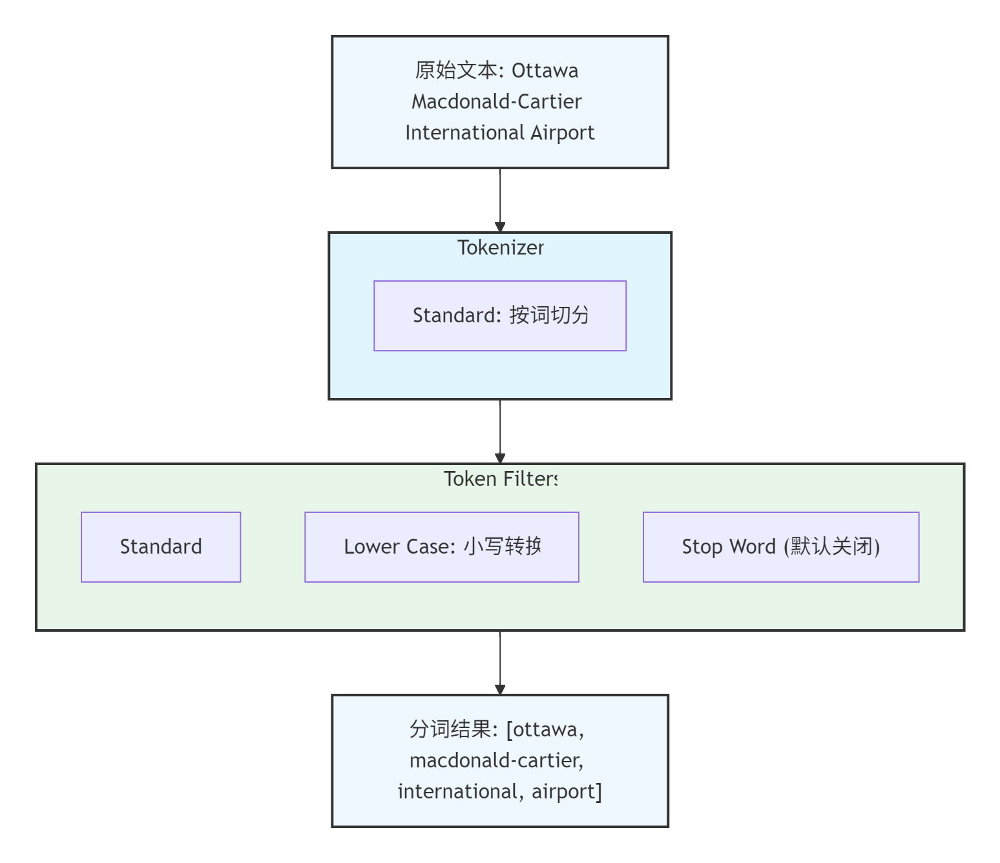

## **4.4 IK 中文分词器实战**

中文分词不像英文分词那样可以简单地以空格来分隔，而是要分成有含义的词汇，但相同的词汇在不同的语境下有不同的含义。

社区中有很多优秀的分词器，这里列出几个日常用得比较多的。

1.  [analysis-icu](https://github.com/elastic/elasticsearch/tree/main/plugins/analysis-icu)：这是官方的插件，其将 Lucene ICU module 融入了 ES 中，使用 ICU 函数库来提供处理 Unicode 的工具。
2.  [IK](https://github.com/infinilabs/analysis-ik)：支持自定义词典和词典热更新。
3.  [THULAC](https://github.com/microbun/elasticsearch-thulac-plugin): 其安装和使用官方文档中有详细的说明。

这里我们只来实战 IK 中文分词器，另外两个如果感兴趣可以自行实战。

### **4.4.1 docker 部署 IK 中文分词器**

[【ES 入门实战第二篇】云服务器部署 ES 8.x + Kibana 8.x 单节点运行环境、安装注意事项](https://articles.zsxq.com/id_w9wwm2qzwdks.html)，在 ES 专栏第二篇，我们就在云服务器上通过 docker 部署 ES + Kibana。

今天我们需要在 ES 内部通过 docker 部署 IK 中文分词器。

### **4.4.1.1 下载 IK 中文分词器**

直接去 [https://release.infinilabs.com/analysis-ik/stable/](https://release.infinilabs.com/analysis-ik/stable/) 下载后，拷贝在关联的目录下即可，至于文件夹名称，不是很重要。

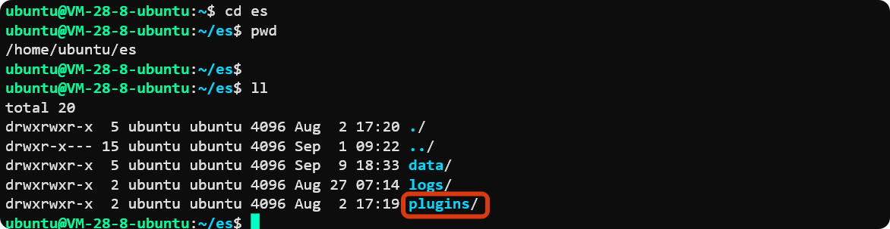

之前将映射目录指定到这个位置，我们就将对应版本的 IK 分词器下载到这个目录中的 plugins：

  
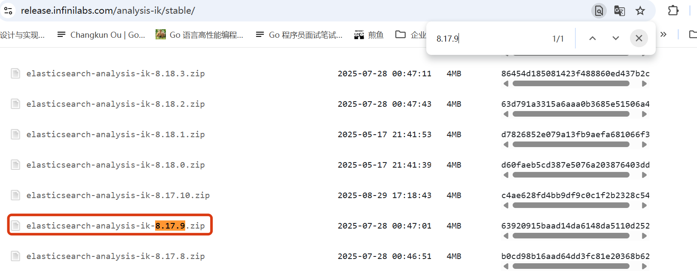

\# 下载

wget https://release.infinilabs.com/analysis-ik/stable/elasticsearch-analysis-ik-8.17.9.zip

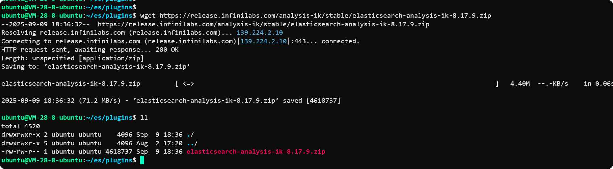

### **4.4.1.2 解压 IK 中文分词器**

\# 解压

unzip elasticsearch-analysis-ik-8.17.9.zip -d elasticsearch-analysis-ik-8.17.9

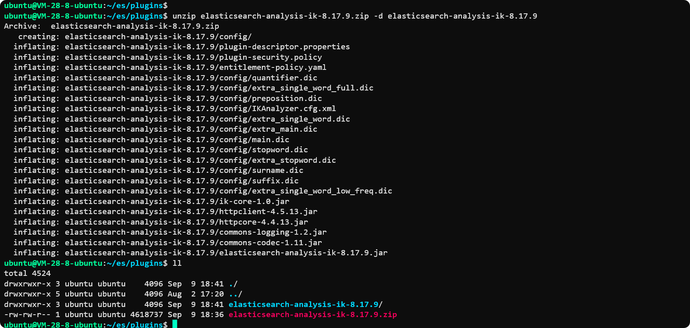

### **4.4.1.3 复制 IK 中文分词器到 ES 容器**

将解压好的 elasticsearch-analysis-ik-8.17.9 文件夹复制到 Docker 容器的 Elasticsearch plugins 目录下。

\# 将解压后的插件目录复制到容器内

sudo docker cp elasticsearch-analysis-ik-8.17.9 8db0d1a58e99:/usr/share/elasticsearch/plugins/

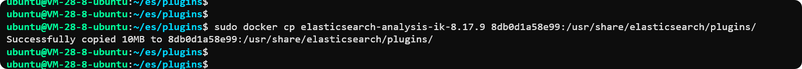

### **4.4.1.4 重启 ES 容器**

为了让插件生效，需要重启 ES docker 容器，在重启之前，需要将前面的 elasticsearch-analysis-ik-8.17.9.zip 删除，否则重启会报错，启动不成功。

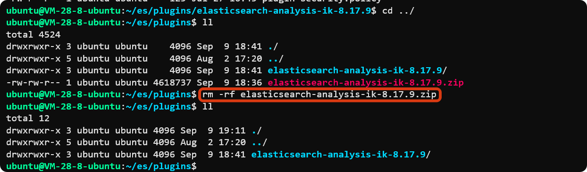

\# 重启 docker 容器

sudo docker restart 8db0d1a58e99

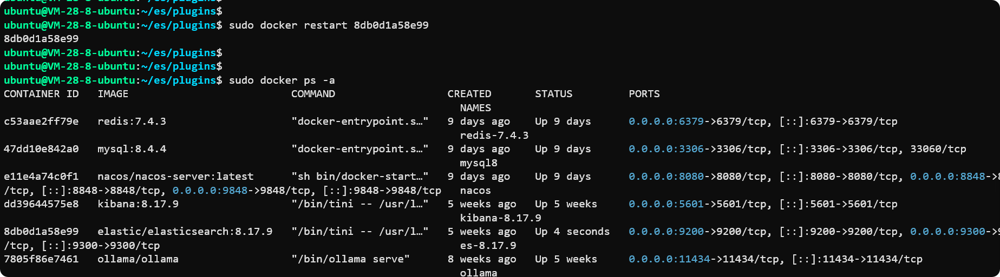

### **4.4.1.5 验证安装 IK 中文分词器**

等待容器重启后，执行列表命进行验证。

\# 验证安装

sudo docker exec 8db0d1a58e99 /usr/share/elasticsearch/bin/elasticsearch-plugin list

如果你是集群的话，需要在每个节点执行完上述指令后，需要重启容器服务才能使插件生效。IK 有两种模式：ik\_max\_word 和 ik\_smart，我们分别来测试下。

下面示例查询的目标是：​使用 IK 中文分词器的两种不同分词策略，对同一段中文文本进行分词处理，并对比它们的分词结果差异。​​

1.  ​第一个查询​：使用 ik\_max\_word（最细粒度拆分）模式，旨在获取尽可能多的分词组合，最大化召回率。
2.  ​第二个查询​：使用 ik\_smart（最粗粒度拆分）模式，旨在获取最语义明确的分词结果，提高搜索精度。

这两种策略的对比是 IK 分词器最核心的功能，常用于「**索引时**」使用 ik\_max\_word（保证更多匹配可能），​「**搜索时**」搜索时使用 ik\_smart（提供更准确的结果）。

\# 验证 IK 中文分词器 ik\_max\_word

POST \_analyze

{

"analyzer": "ik\_max\_word",

"text": "华仔聊技术 是一位深耕互联网技术领域的分享者，从公开信息中了解到，他拥有超过十多年的职场经验，自2010年毕业后便一直在北京从事互联网相关工作，特别是在多家头部互联网教育公司负责中后台技术研发和架构工作。他曾非科班出身，大学也并非名校，但通过短期计算机培训和个人不懈努力，逐渐爱上编程，并在职业生涯中不断学习成长，成为技术实力扎实的资深工程师。华仔热衷于技术总结和输出，致力于分享高质量的技术文章，帮助更多人成长。他目前正在推进一个社区美食电商项目，该项目基于主流Java技术栈构建，旨在打造高并发的实战级电商平台。"

}

\# 验证 IK 中文分词器 ik\_smart

POST \_analyze

{

"analyzer": "ik\_smart",

"text": "华仔聊技术 是一位深耕互联网技术领域的分享者，从公开信息中了解到，他拥有超过十多年的职场经验，自2010年毕业后便一直在北京从事互联网相关工作，特别是在多家头部互联网教育公司负责中后台技术研发和架构工作。他曾非科班出身，大学也并非名校，但通过短期计算机培训和个人不懈努力，逐渐爱上编程，并在职业生涯中不断学习成长，成为技术实力扎实的资深工程师。华仔热衷于技术总结和输出，致力于分享高质量的技术文章，帮助更多人成长。他目前正在推进一个社区美食电商项目，该项目基于主流Java技术栈构建，旨在打造高并发的实战级电商平台。"

}

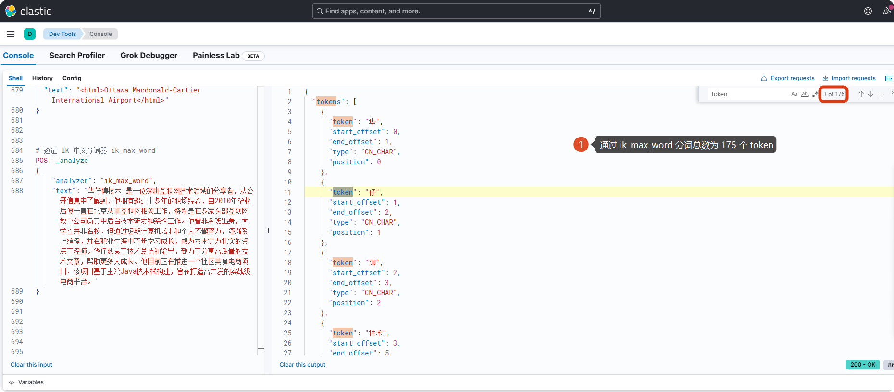

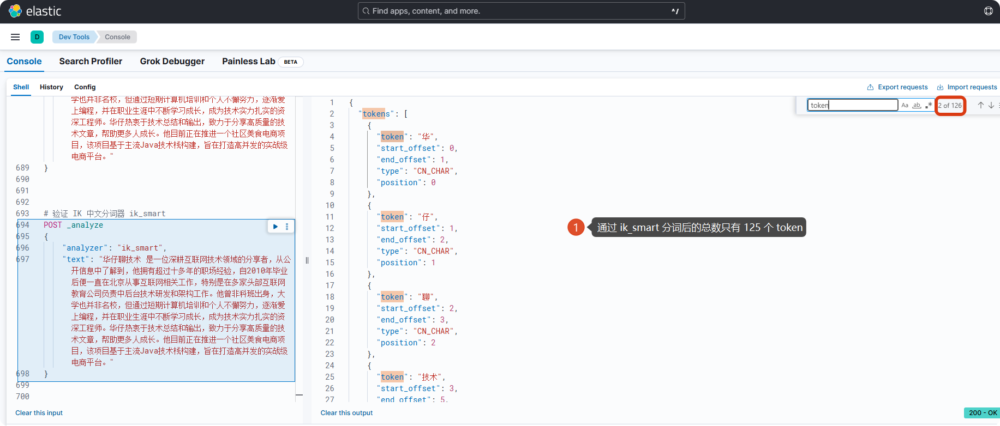

关键字段含义：

### **4.4.2 IK 中文分词器底层架构设计**

IK 分词器的核心是一个基于词典的分词系统，其架构包含以下关键组件：

1.  核心词典体系
2.  ​主词典 (main.dic)​​：包含最常见的中文词语（约27万词条）
3.  ​量词词典 (quantifier.dic)​​：包含中文量词
4.  ​停用词词典 (stopword.dic)​​：包含需要过滤的无意义词
5.  ​扩展词典 (extra\_\*.dic)​​：用户自定义的补充词典
6.  分词算法原理
7.  ​正向最大匹配算法​：从右向左尽可能匹配最长的词
8.  ​逆向最大匹配算法​：从左向右尽可能匹配最长的词
9.  ​歧义处理算法​：基于规则和统计解决分词歧义
10.  两种模式的差异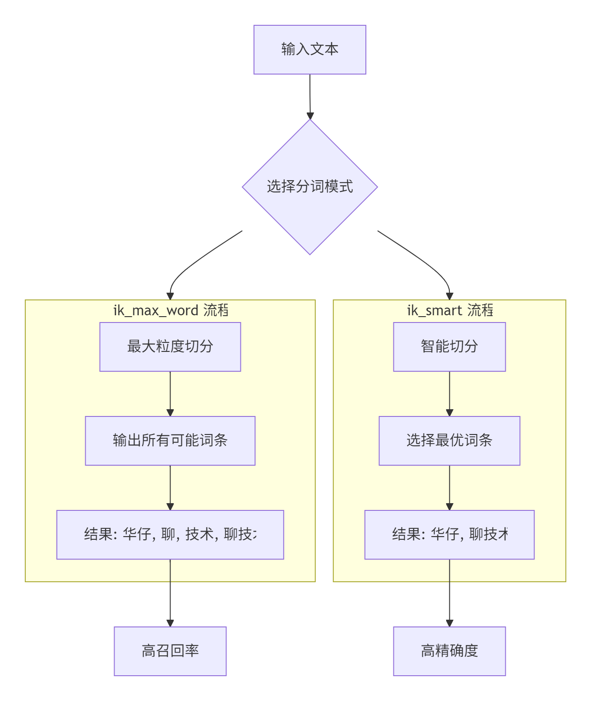

IK 分词器处理文本的完整执行流程：

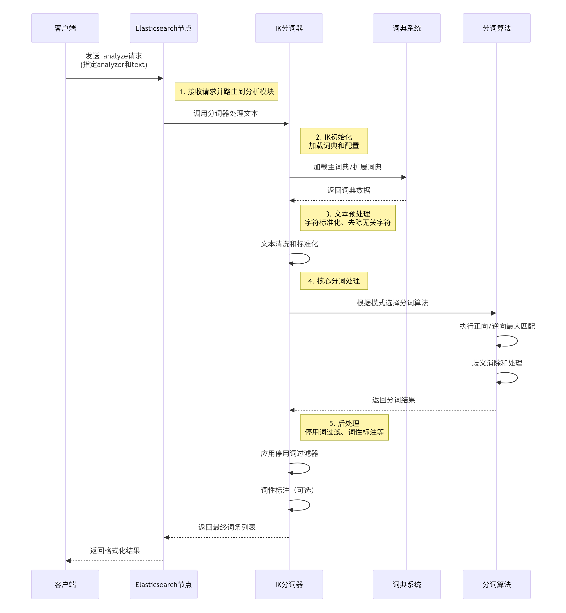

详细步骤说明：

1.  ​请求接收与路由​
2.  客户端向 Elasticsearch 发送 \_analyze API 请求。
3.  Elasticsearch 接收请求并根据 analyzer 参数路由到相应的分词器。
4.  ​IK 分词器初始化​
5.  加载主词典（main.dic）和扩展词典（extra\_\*.dic）。
6.  读取配置文件（IKAnalyzer.cfg.xml）确定词典路径和设置。
7.  初始化分词算法所需的数据结构。
8.  ​文本预处理​
9.  字符编码标准化（统一转为 UTF-8 处理）。
10.  去除特殊字符和无关内容。
11.  文本规范化处理。
12.  ​核心分词处理​（最关键阶段）
13.  ​对于 ik\_max\_word​：
14.  使用正向最大匹配算法扫描文本。
15.  使用逆向最大匹配算法二次扫描。
16.  合并所有可能的切分组合。
17.  保留所有可能的词条（如"技术"和"聊技术"都保留）。
18.  ​对于 ik\_smart​：
19.  使用正向最大匹配算法扫描文本。
20.  应用歧义消除算法选择最优切分。
21.  只保留最语义明确的词条（如只保留"聊技术"）。
22.  ​后处理阶段​
23.  ​停用词过滤​：移除"的"、"了"、"是"等无意义词。
24.  ​词性标注​：为每个词条标注词性（名词、动词等）。
25.  ​结果组装​：将最终词条封装为标准格式。
26.  ​结果返回​
27.  将分词结果以 JSON 格式返回给客户端。
28.  包含每个词条的详细信息：词文本、起始位置、结束位置、词性等。

通过这两个查询的对比，可以清晰地看到：

1.  ​ik\_max\_word​ 会「**产生更多**」、「**更细粒度**」的词条，适合提高召回率​（Recall）。
2.  ​ik\_smart​ 会「**产生更少**」、「**更精确**」的词条，适合提高精确度​（Precision）。

这种差异使得 IK 分词器能够适应不同的搜索场景需求，是中文全文搜索中不可或缺的核心工具。在实际应用中，通常采用「**索引用 ik\_max\_word，搜索用 ik\_smart**」的策略来平衡召回率和精确度。