从今天之后的一段时间内，华仔会带着大家一起来从零开始对 ElasticStack 矩阵产品进行深入剖析和项目运维实战，希望大家学完之后可以用到自己的工作中。

这是第十二篇，本篇我将带着大家进行「**ES 索引 Terms 分桶聚合查询深度实战**」。

文章汇总位置：[https://wx.zsxq.com/dweb2/index/columns/51122554151214](https://wx.zsxq.com/dweb2/index/columns/51122554151214)

## **01 前言**

在上篇中 [ES 入门实战第十一篇】ES 索引多条件复杂组合查询深度实战](https://articles.zsxq.com/id_lp19kwfjgsrq.html)，带着大家进行「**ES 索引多条件复杂组合查询深度实战**」。

今天我们来进行「**ES 索引 Terms 分桶聚合查询深度实战**」。

##   
**02 Terms 常用分桶聚合原理**

## **2.1 Terms 分桶聚合概念**

分桶聚合将数据集中的文档（Documents）按照特定的规则进行分类，划分到不同的「**桶（Bucket)**」中，以便进行后续的统计和分析。

可以把它想象成一个「**数据分拣**」的过程，首先举一个生活中的例子，这个是京东的搜索界面，在搜索框中输入“华为”进行搜索，就会得到如上界面，搜索框就是我们常用的搜索功能，而下面这些，比如分类、热点、操作系统、CPU 类型等是根据 ES 的聚合分析获得的相关结果。

ES 除了搜索以外，还提供针对 ES 数据进行统计分析的功能，也就是聚合，它的特点是「**实时性非常高**」，所有的计算结果都是即时返回的，而 Hadoop 等大数据系统得到一个统计结果需要一天的时间，一般都是 T + 1 级别的。

通过聚合，我们会得到一个数据的概览，是分析和总结全套的数据，而不是寻找单个文档，比如海淀区和东城区的客房数量，不同价格区间，可预订的经济型酒店和商务型酒店的数量，这样可以帮助我们过滤搜索的结果，这样的优点是「**性能高**」，只需要一条语句，就可以从 ES 得到分析结果，无需再客户端自己去实现分析逻辑。

执行聚合后，您得到的不是原始数据，而是各个桶的统计信息（如每个价格区间的商品数量）。

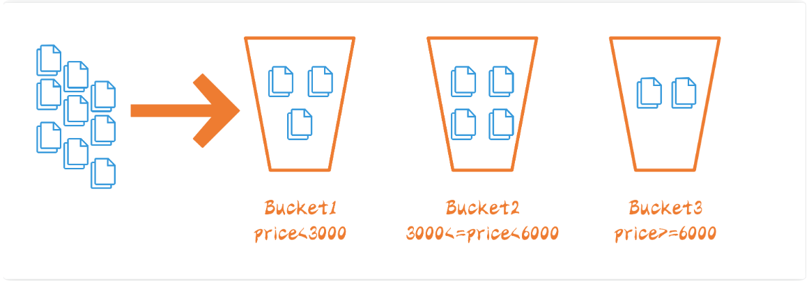

### **2.1.1 功能类比 group by**

分桶聚合的功能与传统关系型数据库（如MySQL）中的 GROUP BY 语句非常相似，都是对数据进行分组。

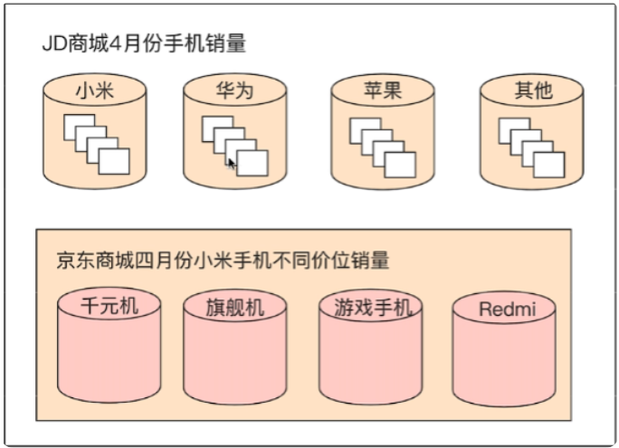

进而引入了两个概念：

1.  桶（Buckets） 满足特定条件的文档的集合。
2.  指标（Metrics） 对桶内的文档进行统计计算。

所以 ElasticSearch 包含 4 种聚合（Aggregation)方式：

1.  桶聚合（Bucket Aggregation) ：一些列满足特定条件的文档的集合- 本篇重点讲解内容
2.  指标聚合（Metric Aggregation)：指标分析类型，一些数学运算，可以对文档字段进行统计分析，比如计算最大值、最小值、平均值等 - 后续单独篇章讲解
3.  管道聚合（Pipline Aggregation) ：管道分析类型，对其他聚合结果进行二次聚合- 后续单独篇章讲解，聚合管道化，简单而言就是上一个聚合的结果成为下个聚合的输入
4.  矩阵分析聚合（Matrix Aggregation）：矩阵分析类型，支持对多个字段的操作并提供一个结果矩阵

> PS: 指标聚合和桶聚合很多情况下是组合在一起使用的，其实你也可以看到，桶聚合本质上是一种特殊的指标聚合，它的聚合指标就是数据的条数 count

### **2.1.2 Terms 底层实现基础**

Terms 聚合的高性能并非魔法，而是基于一系列精妙的工程设计。

### **2.1.2.1 基石 doc\_values （列式存储）**

这是所有聚合操作性能的根基。与传统数据库的行式存储（一整行数据存储在一起）不同，ES 默认会为每个非 text 类型的字段创建 doc\_values。

1.  ​工作原理​：doc\_values 是一种按列存储的数据结构。它将所有文档中某个字段的值单独存储在一组连续的内存/磁盘空间中。
2.  ​优势​：当进行聚合时，ES 不需要加载整个原始的 \_source JSON，而是可以直接快速遍历高度压缩、紧密排列的 doc\_values 列来获取所有文档的该字段值，​极大降低了 I/O 开销和内存使用。

### **2.1.2.2 灵魂：Global Ordinals（全局序数）**

这是 Terms 聚合高效的核心秘诀。

1.  ​问题​：字符串（Keyword）类型的值比较和排序远比数字昂贵。如何快速对“北京”、“上海”、“广州”这些值进行分组？
2.  ​解决方案​：构建全局序数映射（Build Global Ordinals）​​：在分片（Shard）级别，ES 会将所有唯一的字段值排序并分配一个数字 ID（序数）。
3.  例如：
4.  "beijing" -> 1
5.  "shanghai" -> 2
6.  "guangzhou" -> 3
7.  ​使用序数操作​：接下来的聚合操作（分组、排序）全部使用这个数字 ID 来进行。数字的比较、排序和哈希速度远快于字符串。
8.  ​映射回原值​：最终返回结果时，再将数字 ID 映射回原始的字符串值。

> ​性能提示​：全局序数通常在每次段（Segment）合并后或刷新（Refresh）后构建。在频繁写入的索引上，这可能会带来一些开销。对于聚合频繁但写入不频繁的索引，可以设置 eager\_global\_ordinals: true 来在刷新时立即构建，以换取更快的查询速度。

比如当对 price 字段进行聚合时，ES 不需要加载整个文档（可能包含 title, description 等无关字段），而可以直接从 doc\_values 中快速读取所有文档的 price 值。这极大地提高了聚合查询的速度并降低了内存开销。

### **2.1.3 Terms 主要应用场景**

分桶聚合是分析和统计的利器，广泛应用于：

1.  ​分组统计​：统计每个部门有多少员工、每个品牌有多少种商品、每个错误代码出现的次数等。
2.  ​分组数据再统计​：先按部门分桶，然后在每个桶内再计算平均工资（嵌套使用指标聚合 Metric Aggregation，如avg）。
3.  ​大数据分析​：与Kibana等数据可视化平台结合，是构建仪表盘（Dashboard）、图表（Chart）的基础。
4.  ​业务系统实时统计​：为后台系统提供实时的数据分组分析能力，如实时销售数据看板。

### **2.1.4 Terms 分桶聚合执行流程**

分桶先来看下 ES 跟 MySQL 聚合区别：

1.  ​Elasticsearch (列式)​: 采用 ​​「**扫描，逐步创建分桶**」的方式。这是一个动态的、按需的过程。
2.  ​MySQL (行式)​: 采用 ​​「**扫描，全部分桶**」的方式。这通常需要先将所有相关数据行加载到临时空间，再进行分组计算。

如图展示了 Terms 聚合在单个分片内的核心执行步骤，特别是其「**逐步创建与填充分桶**」的动态过程：

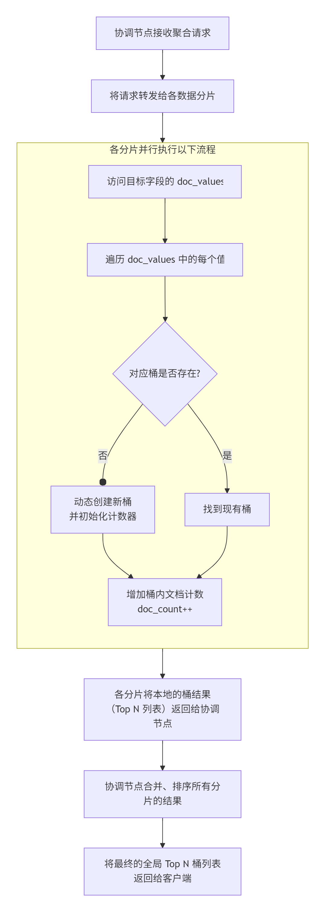

执行流程如下：

1.  ​协调节点接收请求​：客户端向 ES 集群的某个节点（充当协调节点，Coordinating Node）发送搜索请求，其中包含 terms 聚合定义。
2.  ​分发请求​：协调节点将请求转发给索引（Index）的每个相关分片（Primary Shard 或 Replica Shard）。
3.  ​分片本地执行（核心流程）​​：
4.  ​访问 doc\_values​：每个分片接收到请求后，​不会去加载完整的文档源（\_source）​，而是直接访问目标聚合字段的 doc\_values（列式存储结构）。这是高性能的基石。
5.  ​动态扫描与分桶​：分片顺序扫描​ doc\_values 中的该字段值。
6.  对于遇到的每一个值（如 "electronics"），它会在内存中检查是否已经存在一个以该值为键（Key）的“桶”。
7.  ​如果桶不存在​：则立即动态创建一个新桶，并将这个值的计数器 (doc\_count) 初始化为 1。这对应了您图片中的 ​​“创建分组 Bucket”​。
8.  ​如果桶已存在​：则找到这个现有的桶，将其计数器加 1。这对应了您图片中的 ​​“填充分组 Bucket”​。
9.  ​构建本地结果​：扫描完本分片的所有 doc\_values 后，每个分片在内存中得到了一个针对本分片数据的桶集合。分片会根据排序规则（默认按 doc\_count 降序）计算出本分片的 Top N 个桶。
10.  ​结果汇聚与合并​：
11.  各分片将各自的 Top N 桶结果返回给协调节点。
12.  协调节点接收所有分片的结果后，进行全局合并​：将所有分片返回的桶进行汇总，重新计算全局的 doc\_count，并排序出最终的全局 Top N 结果。
13.  ​返回最终结果​：协调节点将最终的聚合结果返回给客户端。

## **03 Terms 常用分桶聚合深度实战**

官方地址：[https://www.elastic.co/guide/en/elasticsearch/reference/8.17/search-aggregations.html](https://www.elastic.co/guide/en/elasticsearch/reference/8.17/search-aggregations.html)

## **3.1 Terms 分桶案例**

今天的案例还是以航班数据为主，前面已经提过：

  

静静等待成功，如果有报错，请检查机器磁盘是否已满：

这里创建一个新的索引来作为今天的案例库。

PUT kibana\_sample\_data\_flights\_terms

{

"mappings": {

"dynamic": true // 允许动态添加新字段

}

}

\# 先重建新索引

POST \_reindex

{

"source": {

"index": "kibana\_sample\_data\_flights"

},

"dest": {

"index": "kibana\_sample\_data\_flights\_terms"

}

}

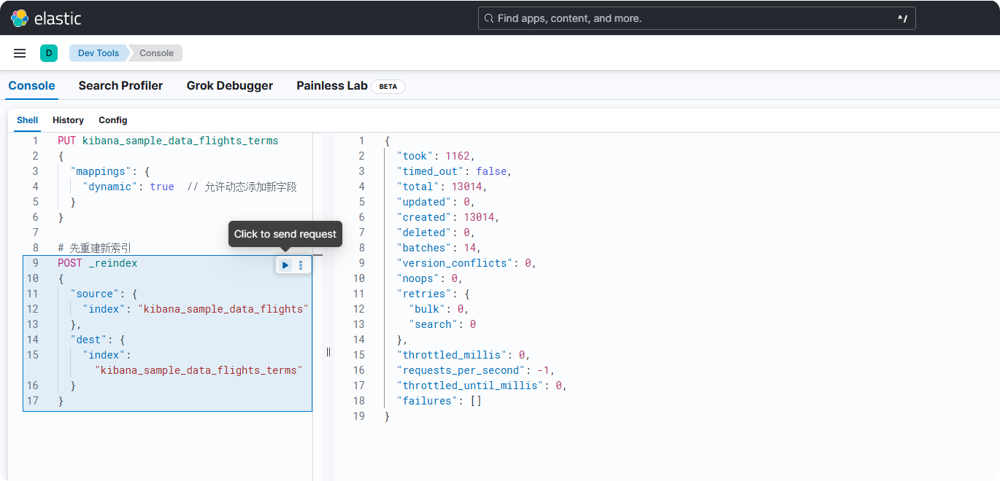

## **3.2 Terms 常用分桶聚合函数**

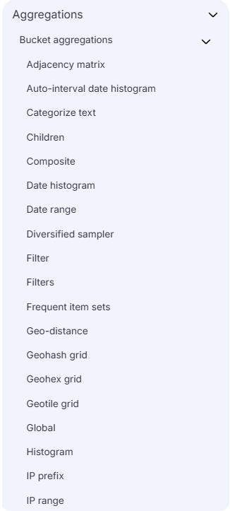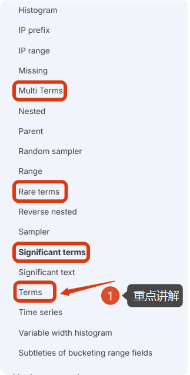

根据 Bucket 的分桶策略，常见的 Bucket 聚合分析如下：

1.  Terms：直接按照 term 来分桶，如果是 text 类型，则按照分词后的结果分桶
2.  Range：指定数值的范围来设定分桶规则
3.  Date Range：指定日期的范围来设定分桶规则
4.  Histogram：直方图，以固定间隔的策略来分割数据
5.  Date Histogram：针对日期的直方图或者柱状图，是时序数据分析中常用的聚合分析类型

## **3.3 Terms 常用分桶聚合深度实战**

### **3.3.1 Terms 词项分桶聚合**

1.  基于词项 terms 创建分桶。
2.  数据类型必须是 keyword 类型，不可以是 text。
3.  分桶聚合同时可以查询多个索引。

### **3.3.1.1 单分片 Terms 词项分桶聚合**

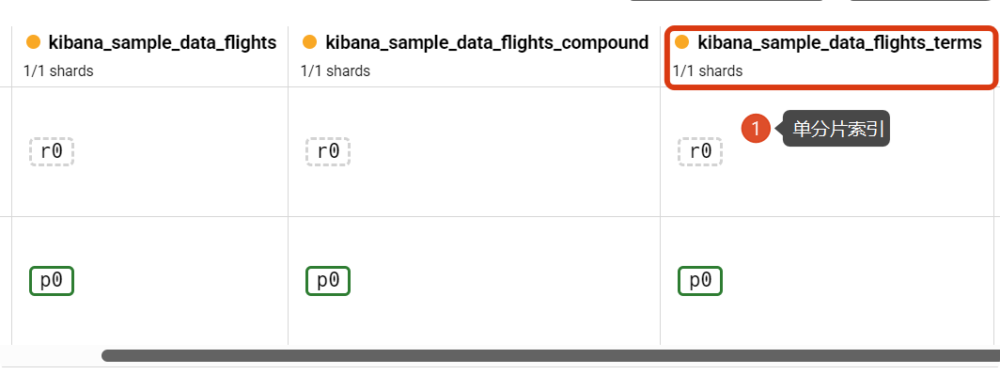

下面示例查询的目标是：​对航班数据中的出发国家（OriginCountry）进行分组统计，并返回航班数量排名前20的国家。

\# terms 聚合查询

GET kibana\_sample\_data\_flights\_terms/\_search

{

"track\_total\_hits": true, // 精确计算匹配文档总数（即使超过1万）

"size": 0, // 不返回原始文档，仅返回聚合结果

"aggs": { // 聚合查询

"terms\_OriginCountry": { // 用户自定义聚合名称（结果中作为key）

"terms": { // 聚合类型为词项分桶

"field": "OriginCountry", // 对航班起飞机场国家字段分组

"size": 20 // 返回出现频率最高的前20个国家

}

}

}

}

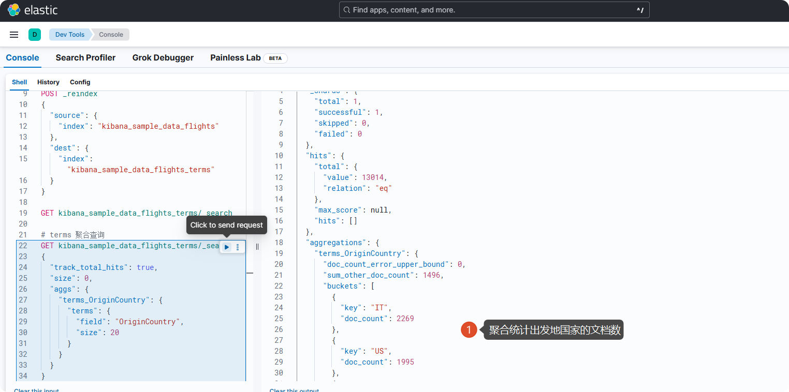

查询目标分解：​

1.  ​数据分组统计​
2.  按航班出发国家（OriginCountry）字段分组，形成多个"桶"（Bucket）。
3.  每个桶包含：​国家名称​ + ​该国家的航班数量。
4.  ​聚焦关键结果​
5.  "size": 20：仅返回航班数量最多的前20个国家（按文档计数降序排序）。
6.  ​精确总量计算​
7.  "track\_total\_hits": true：确保精确统计匹配文档总数（即使超过10,000条）。
8.  ​优化性能​
9.  "size": 0：不返回原始文档，减少网络传输和解析开销。

关于 terms 聚合查询分为三个阶段，如图：

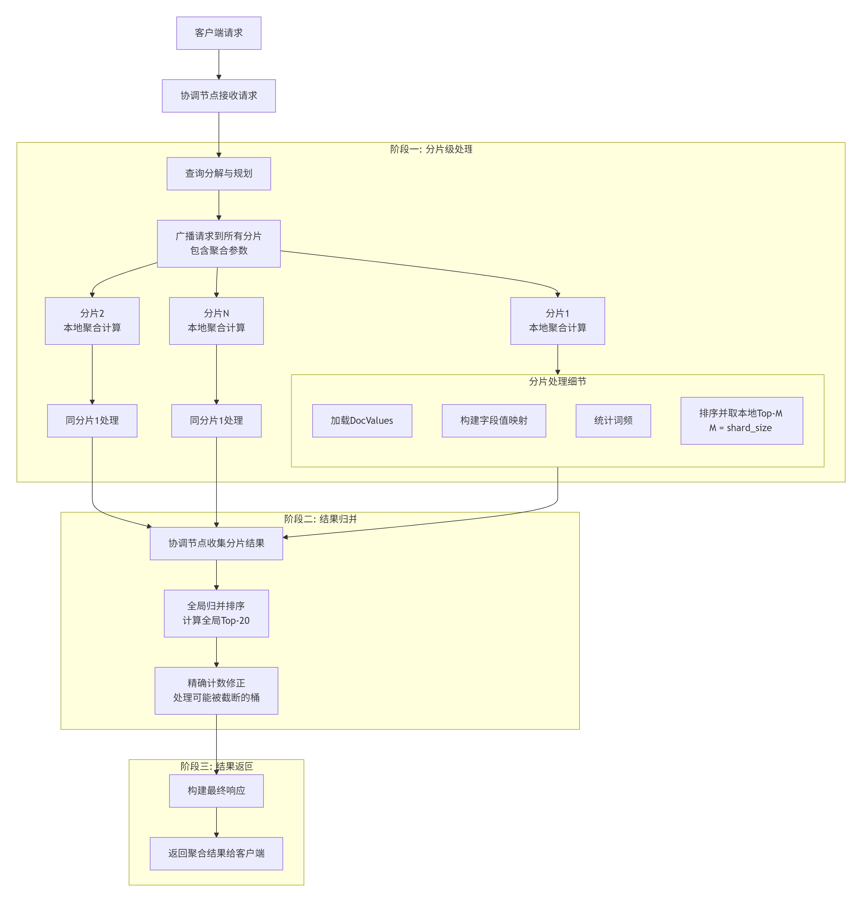

**执行流程：**

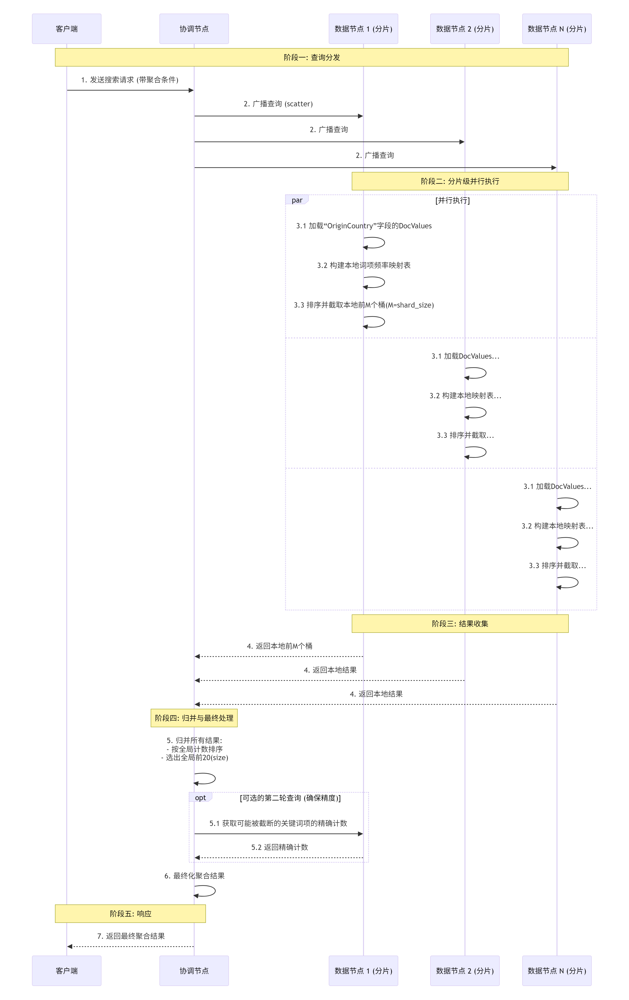

1.  查询分发 (Query Dissemination)​:
2.  ​客户端​ 将聚合请求发送到 ​协调节点。
3.  ​协调节点​将查询广播 (Broadcast/Scatter)​​ 到持有目标索引分片的各个数据节点。
4.  ​分片级执行 (Shard-Level Execution)​:
5.  各数据节点​ ​并行地​ 在自己管理的分片上执行相同的操作：
6.  ​从磁盘加载目标字段 (OriginCountry) 的 ​DocValues​ (列式存储数据结构)。
7.  遍历 DocValues，构建一个本地的词频统计映射 (Term Frequency Map)。
8.  根据词频进行排序，并截取出本地分片的前 ​M​ 个桶（M = shard\_size，通常大于客户端要求的 size）。
9.  ​结果收集 (Response Gathering)​: 各数据节点​ 将计算出的本地 Top M 桶列表返回给协调节点。
10.  ​归并与最终处理 (Reduce & Finalize)​:
11.  ​协调节点​ 接收所有分片的局部结果。
12.  ​5​: 将所有局部结果进行归并 (Merge)​​：合并统计值，进行全局排序，并筛选出最终的全局 ​Top 20​ (size)。
13.  ​5.1 (可选)​: 为了保证高精度，如果协调节点怀疑某个重要的桶因为在其所在分片的排名低于 M 而被截断了，它可能会向该分片发起第二轮查询以获取其精确的统计值。
14.  ​6​: 协调节点完成最终计算。
15.  ​响应 (Response)​: 协调节点​ 将最终的聚合结果返回给客户端。

这个查询的设计体现的几个核心架构理念：

1.  分布式优先设计​
2.  ​分片自治​：每个分片独立执行本地聚合计算，最大化并行处理能力
3.  ​Scatter-Gather 模式​：协调节点广播请求 → 分片并行计算 → 结果归并
4.  ​数据本地性​：计算任务被推送到数据所在节点，减少数据传输
5.  分层处理策略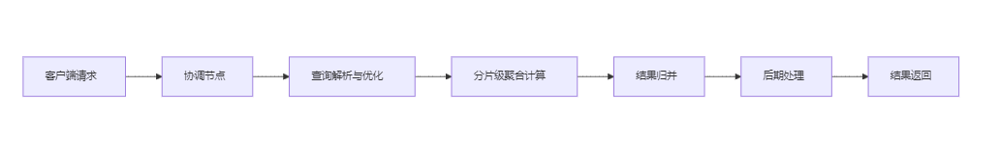
6.  资源优化机制
7.  精准资源控制​：
8.  size=20：限制结果集大小
9.  shard\_size(隐式)：控制分片计算量（默认size\*1.5+10=40）
10.  ​内存保护​：
11.  Circuit Breaker 防止 OOM
12.  Doc Values列式存储减少内存占用
13.  精确性与性能平衡
14.  track\_total\_hits=true：确保文档总数精确
15.  分片级Top-M计算 + 全局归并：在准确性和性能间取得平衡
16.  可选的二次查询：处理分片截断导致的精度问题
17.  列式存储优化
18.  Doc Values核心作用​：列式存储加速聚合、避免倒排索引解压开销、支持高效排序和过滤

另外，这里可以限制每个分桶满足的数据，相当于过滤条件，如下：

\# terms 聚合查询 限制分桶满足的数据

GET kibana\_sample\_data\_flights\_terms/\_search

{

"track\_total\_hits": true,

"size": 0,

"aggs": {

"terms\_OriginCountry": {

"terms": {

"field": "OriginCountry",

"size": 20,

"min\_doc\_count": 200

}

}

}

}

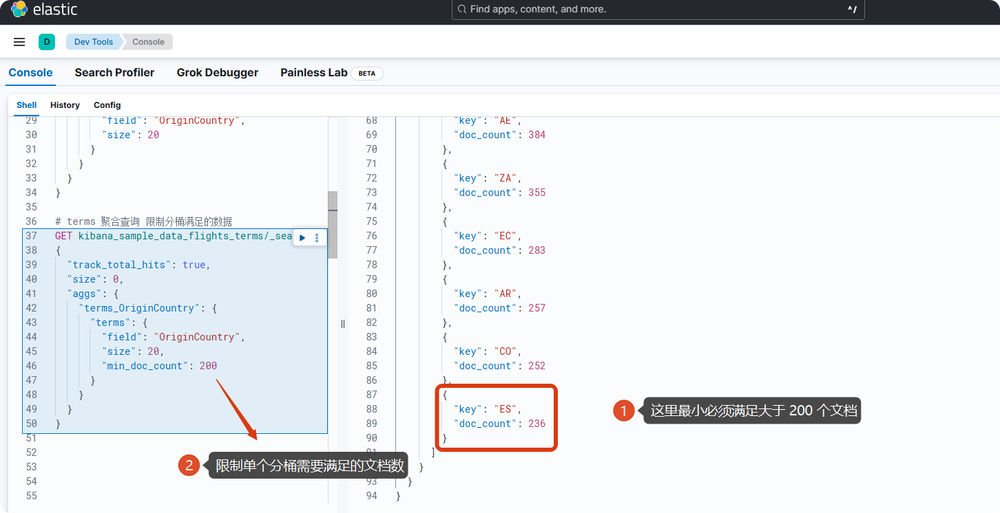

### **3.3.1.2 多分片 Terms 词项分桶聚合**

上一小节的示例是基于单分片 terms 分桶聚合的，这里我们演示一个多分片 terms 分桶聚合示例，对于多分片索引来说，如果数据倾斜严重的话 terms 分桶聚合结果就可能会不准确。

\# 3个分片的索引

PUT kibana\_sample\_data\_flights\_terms\_3shards

{

"settings": {

"number\_of\_shards": 3

},

"mappings": {

"dynamic": true // 允许动态添加新字段

}

}

\# 先重建新索引

POST \_reindex

{

"source": {

"index": "kibana\_sample\_data\_flights"

},

"dest": {

"index": "kibana\_sample\_data\_flights\_terms\_3shards"

}

}

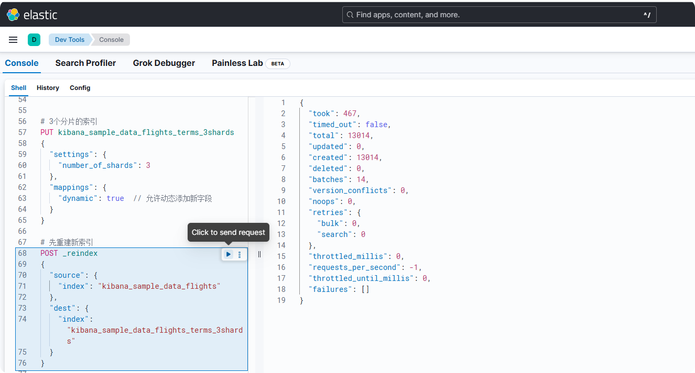

查看分片文档数情况，这里会用到前面讲解的[集群管理 API](https://articles.zsxq.com/id_ofmwcnm3kf3t.html)：

\# 查询分片数据分布情况

GET /\_cat/shards/kibana\_sample\_data\_flights\_terms\_3shards?v

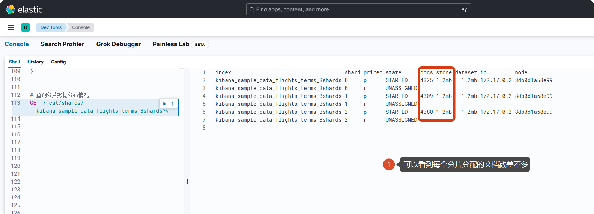

\# 多索引 terms 聚合查询

GET kibana\_sample\_data\_flights\_terms\_3shards/\_search

{

"track\_total\_hits": true, // 精确计算匹配文档总数（即使超过1万）

"size": 0, // 不返回原始文档，仅返回聚合结果

"aggs": { // 聚合查询

"terms\_OriginCountry": { // 用户自定义聚合名称（结果中作为key）

"terms": { // 聚合类型为词项分桶

"field": "OriginCountry", // 对航班起飞机场国家字段分组

"size": 20, // 返回出现频率最高的前20个国家

"min\_doc\_count": 200, // 全局最小文档数阈值（桶中至少200文档）

"shard\_size": 40 // 每个分片本地计算的桶数量

}

}

}

}

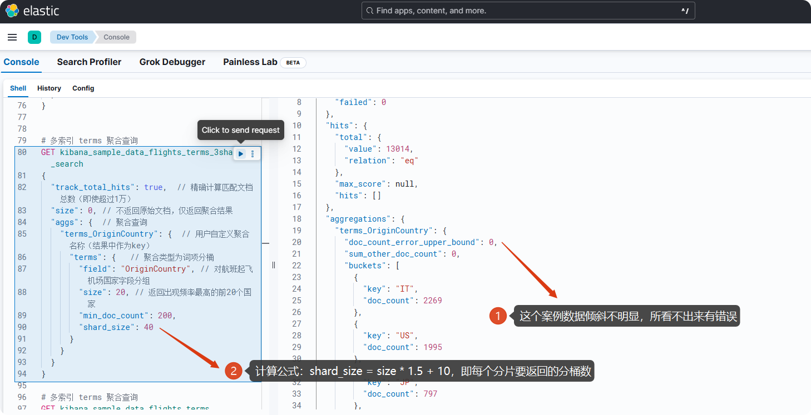

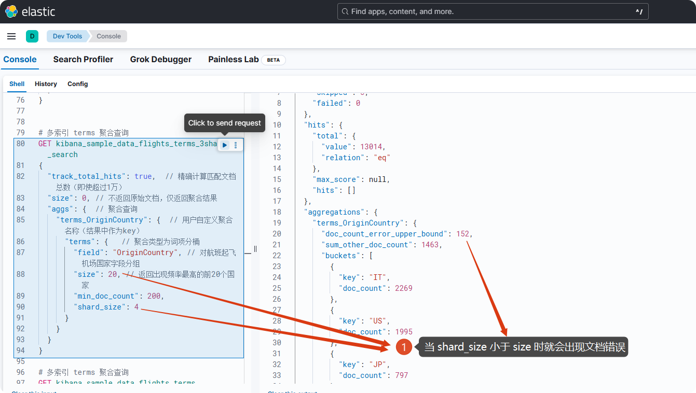

shard\_size 参数：

1.  ​作用​：控制每个分片本地返回的桶数量。
2.  ​取值依据​：应大于等于size参数值（推荐：size × 1.5 + 10）。
3.  ​影响​：
4.  增大→提高准确性但增加资源消耗。
5.  减小→提高速度但可能降低精度。

关键点：

1.  DocValues是列式存储，用于排序和聚合，它比倒排索引更适合聚合操作。
2.  分布式聚合的准确性：分片返回的term数量（shard\_size）要大于最终需要返回的term数量（size），这样可以减少一些在分片分布不均造成的误差（但并不能完全避免，尤其当数据倾斜严重时）。
3.  协调节点需要合并多个分片的结果，这个过程可能会消耗大量内存，尤其是当分片数多且shard\_size设置较大时。

> 注意：在这个查询中，我们设置了shard\_size = 40，因此每个分片会返回 40 个桶的数据。然后协调节点会合并所有分片的桶，然后取全局的前 20 个桶。

### **执行流程：**

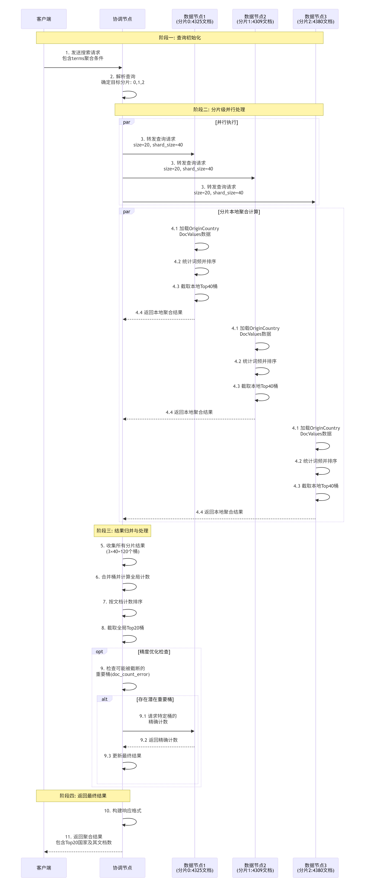

### **shard\_size 双重角色**

### **shard\_size 调优模型**

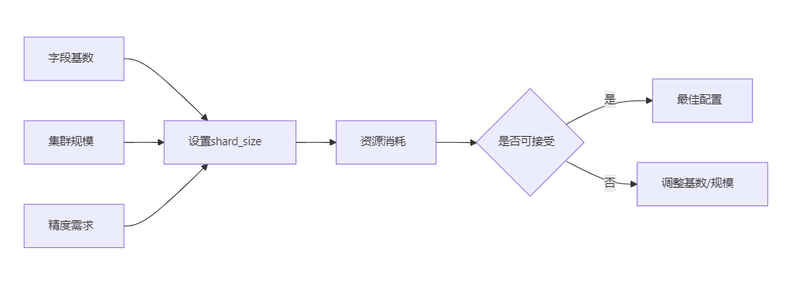

最佳配置指南：

1.  ​常规场景​：shard\_size = size × 1.5 + 10
2.  ​高基数字段​（>10k唯一值）：shard\_size = size × 2 ~ 3
3.  ​数据倾斜场景​：结合min\_doc\_count过滤小桶

### **3.3.1.3 多索引 Terms 词项分桶聚合**

ES 除了支持单索引 terms 分桶聚合之外，还支持同时多索引 terms 分桶聚合，可以看下面的示例，同样的​对航班数据中的出发国家（OriginCountry）进行分组统计，并返回航班数量排名前20的国家。

\# 多索引 terms 聚合查询

GET kibana\_sample\_data\_flights\_terms,kibana\_sample\_data\_flights\_terms\_3shards/\_search

{

"track\_total\_hits": true, // 精确计算匹配文档总数（即使超过1万）

"size": 0, // 不返回原始文档，仅返回聚合结果

"aggs": { // 聚合查询

"terms\_OriginCountry": { // 用户自定义聚合名称（结果中作为key）

"terms": { // 聚合类型为词项分桶

"field": "OriginCountry", // 对航班起飞机场国家字段分组

"size": 20, // 返回出现频率最高的前20个国家

"shard\_size": 40, // 每个分片本地计算的桶数量

"min\_doc\_count": 200,// 全局最小文档数阈值（桶中至少200文档）

"shard\_min\_doc\_count": 200 // 分片级最小文档数阈值

}

}

}

}

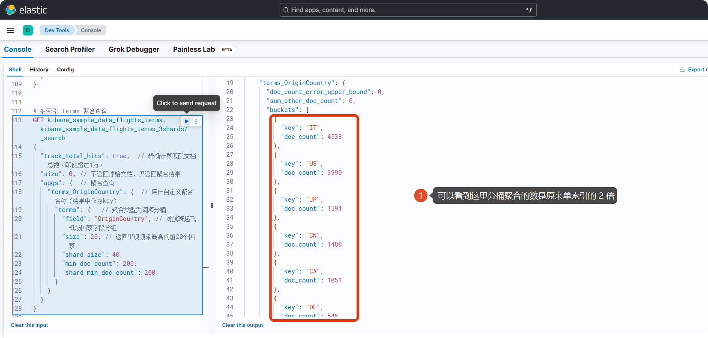

如果想要出现错误，如下：

\# 多索引 terms 聚合查询

GET kibana\_sample\_data\_flights\_terms,kibana\_sample\_data\_flights\_terms\_3shards/\_search

{

"track\_total\_hits": true, // 精确计算匹配文档总数（即使超过1万）

"size": 0, // 不返回原始文档，仅返回聚合结果

"aggs": { // 聚合查询

"terms\_OriginCountry": { // 用户自定义聚合名称（结果中作为key）

"terms": { // 聚合类型为词项分桶

"field": "OriginCountry", // 对航班起飞机场国家字段分组

"size": 20, // 返回出现频率最高的前20个国家

"shard\_size": 30, // 每个分片本地计算的桶数量

"min\_doc\_count": 200, // 全局最小文档数阈值（桶中至少200文档）

"shard\_min\_doc\_count": 100 // 分片级最小文档数阈值

}

}

}

}

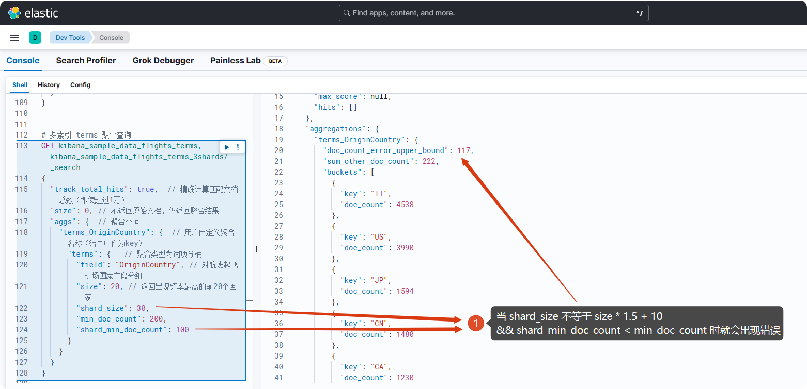

### **执行流程：**

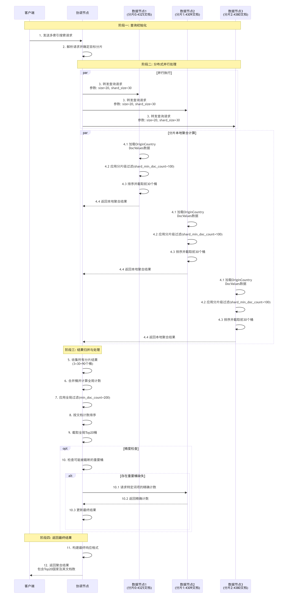

分层过滤设计：

1.  ​分片级过滤​ (shard\_min\_doc\_count=100)：在各分片本地应用，减少网络传输
2.  ​全局过滤​ (min\_doc\_count=200)：在协调节点归并后应用，确保最终结果质量

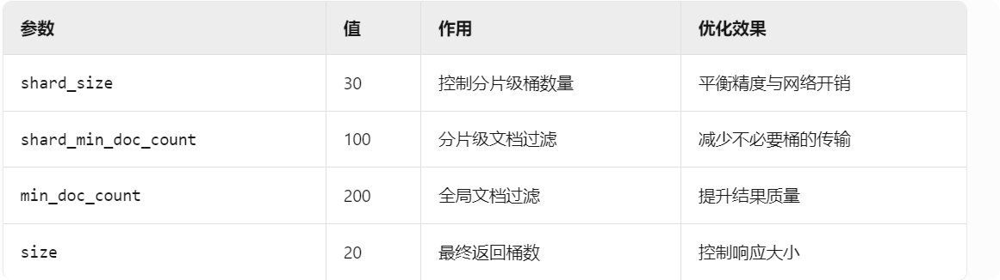

这个多索引terms聚合查询展示了ES 强大的分布式处理能力：

1.  ​并行处理​：同时查询多个索引的所有分片
2.  ​分层优化​：分片级和全局级双重过滤提升效率
3.  ​精度控制​：通过参数平衡结果准确性和性能
4.  ​扩展性​：轻松支持大规模数据集的聚合分析

通过合理配置 shard\_size、shard\_min\_doc\_count 和 min\_doc\_count 参数，可以在精度、性能和资源消耗之间找到最佳平衡点，满足不同场景的聚合需求。

### **3.3.2 Terms 词项分桶数量设置**

官方文档地址：[https://www.elastic.co/guide/en/elasticsearch/reference/8.17/search-settings.html#search-settings-max-buckets](https://www.elastic.co/guide/en/elasticsearch/reference/8.17/search-settings.html#search-settings-max-buckets)

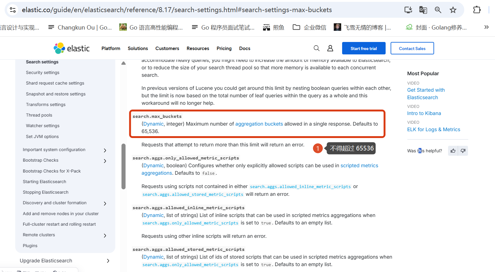

这是 ES 为分桶聚合设置的一个安全限制，我们来实操下：

GET /\_cluster/settings

\# 设置分桶聚合的最大桶数为 10

PUT /\_cluster/settings

{

"transient": {

"search.max\_buckets": 10

}

}

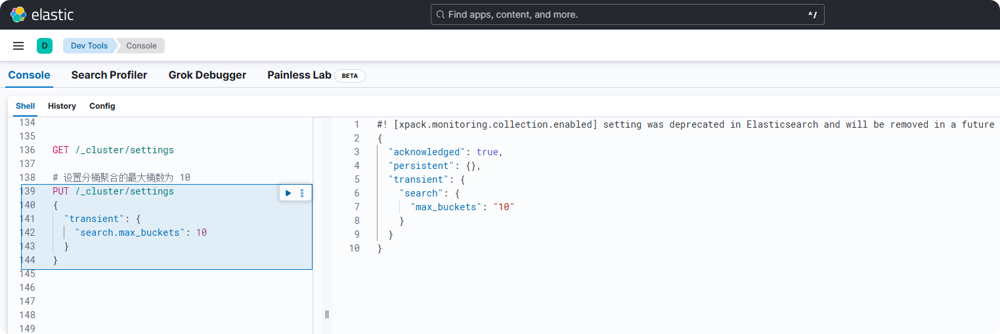

\# 多索引 terms 聚合查询

GET kibana\_sample\_data\_flights\_terms,kibana\_sample\_data\_flights\_terms\_3shards/\_search

{

"track\_total\_hits": true, // 精确计算匹配文档总数（即使超过1万）

"size": 0, // 不返回原始文档，仅返回聚合结果

"aggs": { // 聚合查询

"terms\_OriginCountry": { // 用户自定义聚合名称（结果中作为key）

"terms": { // 聚合类型为词项分桶

"field": "OriginCountry", // 对航班起飞机场国家字段分组

"size": 20, // 返回出现频率最高的前20个国家

"shard\_size": 30,

"min\_doc\_count": 200,

"shard\_min\_doc\_count": 100

}

}

}

}

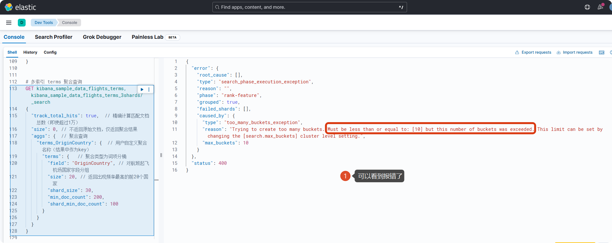

### **3.3.3 Terms 词项分桶结果排序**

ES 分桶聚合的结果集默认是按照「**\_count 倒序**」的，我们可以根据自己的业务场景需求来设置不同的「**排序规则**」。

\# 单索引 terms 聚合查询并排序

GET kibana\_sample\_data\_flights\_terms/\_search

{

"track\_total\_hits": true, // 精确计算匹配文档总数（即使超过1万）

"size": 0, // 不返回原始文档，仅返回聚合结果

"aggs": { // 聚合查询

"terms\_OriginCountry": { // 用户自定义聚合名称（结果中作为key）

"terms": { // 聚合类型为词项分桶

"field": "OriginCountry", // 对航班起飞机场国家字段分组

"size": 10, // 返回出现频率最高的前20个国家

"min\_doc\_count": 200,

"order" : {

"\_key" : "desc" // asc 正序 desc 倒序

}

}

}

}

}

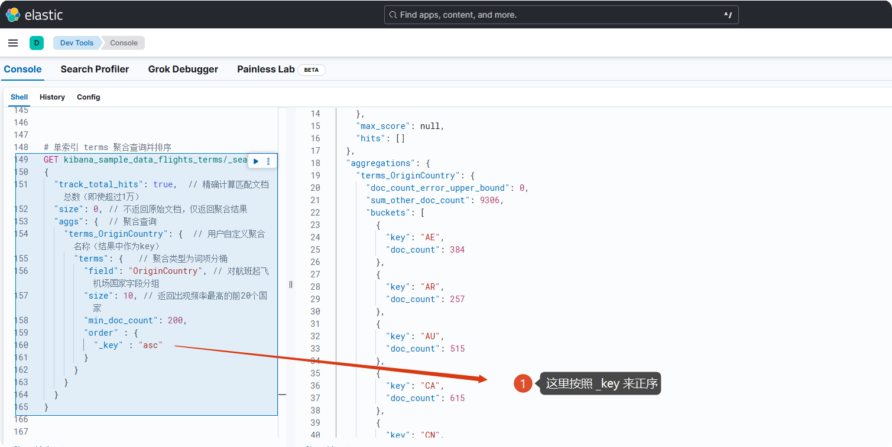

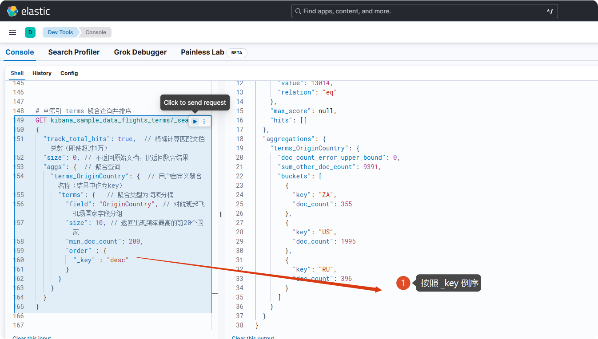

### **3.3.4 Terms 词项分桶嵌套**

ES 分桶聚合除了单个聚合查询之外，还支持 「**层次嵌套**」和 「**平行嵌套**」，类似 MySQL 中的多个 group by。另外这里「**最大嵌套**」建议不超过 3 层。

###   
**3.3.4.1 Terms 词项分桶平行嵌套**

\# 单索引 terms 聚合平行嵌套查询

GET kibana\_sample\_data\_flights\_terms/\_search

{

"track\_total\_hits": true, // 精确计算匹配文档总数（即使超过1万）

"size": 0, // 不返回原始文档，仅返回聚合结果

"aggs": { // 聚合查询

"terms\_OriginCountry": { // 用户自定义聚合名称（结果中作为key）

"terms": { // 聚合类型为词项分桶

"field": "OriginCountry", // 对航班起飞机场国家字段分组

"size": 10, // 返回出现频率最高的前20个国家

"min\_doc\_count": 200

}

},

"terms\_DestCountry": { // 用户自定义聚合名称（结果中作为key）

"terms": { // 聚合类型为词项分桶

"field": "DestCountry", // 对航班落地机场国家字段分组

"size": 10, // 返回出现频率最高的前20个国家

"min\_doc\_count": 200

}

}

}

}

###   
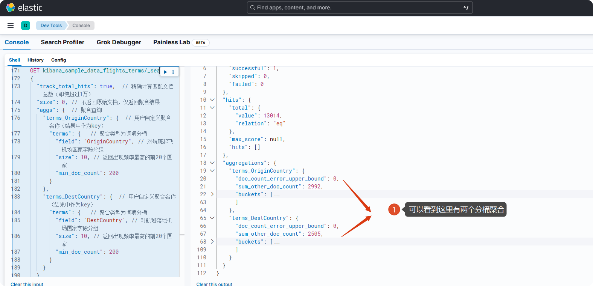

### **3.3.4.2 Terms 词项分桶层次嵌套**

\# 单索引 terms 聚合层次嵌套查询

GET kibana\_sample\_data\_flights\_terms/\_search

{

"track\_total\_hits": true, // 精确计算匹配文档总数（即使超过1万）

"size": 0, // 不返回原始文档，仅返回聚合结果

"aggs": { // 聚合查询

"terms\_OriginCountry": { // 用户自定义聚合名称（结果中作为key）

"terms": { // 聚合类型为词项分桶

"field": "OriginCountry", // 对航班起飞机场国家字段分组

"size": 10, // 返回出现频率最高的前20个国家

"min\_doc\_count": 200

},

"aggs": { // 嵌套聚合查询

"terms\_DestCountry": { // 用户自定义聚合名称（结果中作为key）

"terms": { // 聚合类型为词项分桶

"field": "DestCountry", // 对航班落地机场国家字段分组

"size": 10, // 返回出现频率最高的前20个国家

"min\_doc\_count": 200

}

}

}

}

}

}

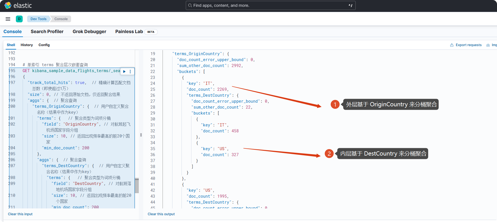

### **执行流程：**

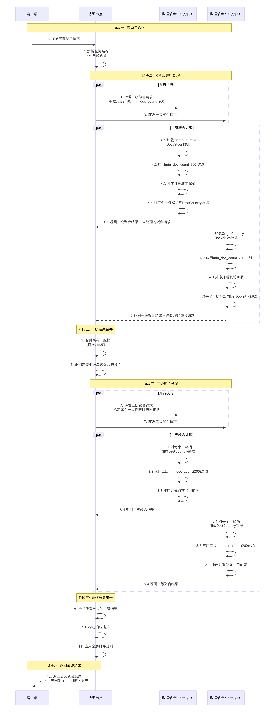

### **3.3.5 Terms 词项分桶脚本应用**

除了上面这些，terms 还支持脚本处理，如下示例的查询目标是：按 timestamp 字段的星期几（星期名称）进行分桶聚合。

\# 获取星期几的 terms 分桶聚合

GET kibana\_sample\_data\_flights\_terms/\_search

{

"track\_total\_hits": true,

"size": 0,

"aggs": {

"terms\_timestamp\_dayofweek": {

"terms": {

"script": {

"source":"""

doc\['timestamp'\].value.dayofweekEnum.getDisplayName(TextStyle.FULL, Locale.ROOT)

""",

"lang": "painless"

},

"size": 10

}

}

}

}

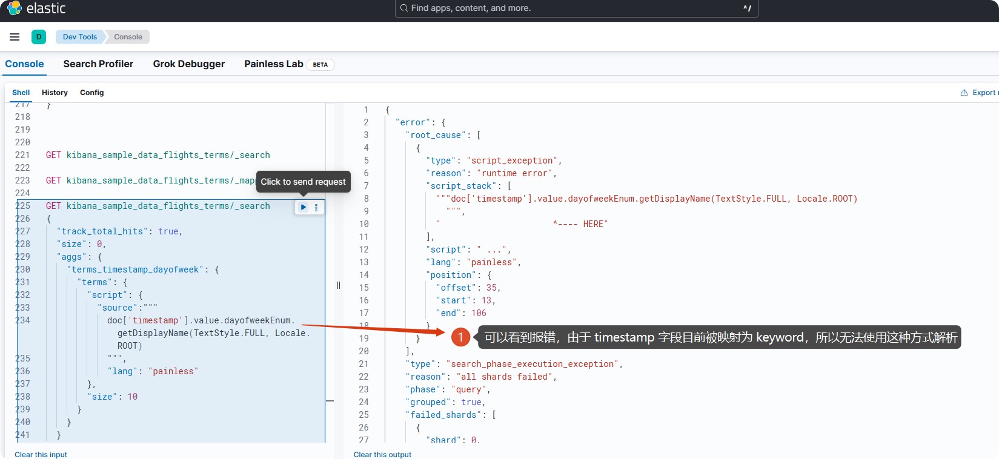

由于 timestamp 字段是字符串类型，我们需要在脚本中将其解析为日期对象，然后提取星期几的全名（如"Monday"）。

可以通过修改 mapping 字段类型来重新映射数据，这里就不搞了，我们来通过解析字符串的形式获取星期：

\# 获取星期几的 terms 分桶聚合

GET kibana\_sample\_data\_flights\_terms/\_search

{

"size": 0,

"aggs": {

"terms\_timestamp\_dayofweek": {

"terms": {

"script": {

"source": """

// 解析字符串为日期

def formatter = DateTimeFormatter.ofPattern("yyyy-MM-dd'T'HH:mm:ss");

def date = LocalDateTime.parse(doc\['timestamp'\].value, formatter);

// 获取星期几全名

date.getDayOfWeek().getDisplayName(

java.time.format.TextStyle.FULL,

java.util.Locale.ROOT

)

""",

"lang": "painless"

},

"size": 10

}

}

}

}

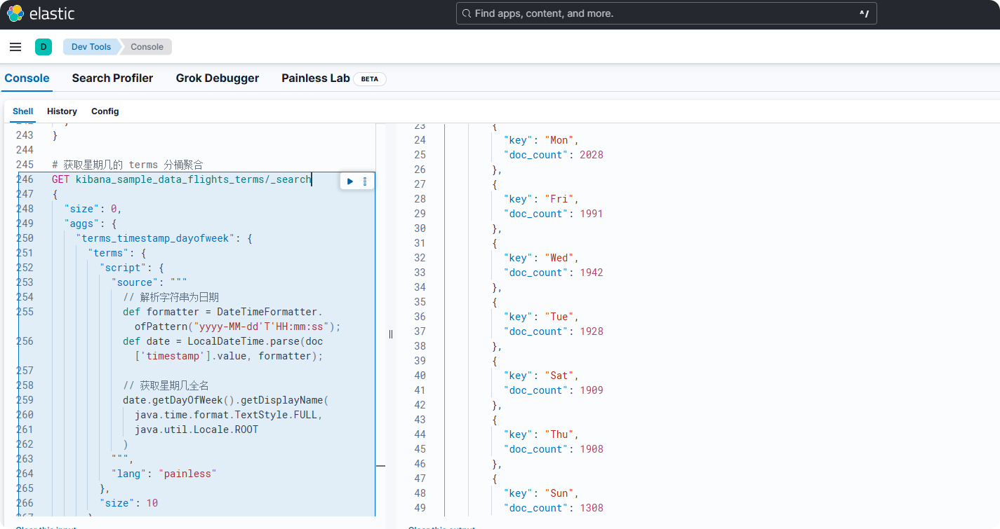

### **执行流程：**

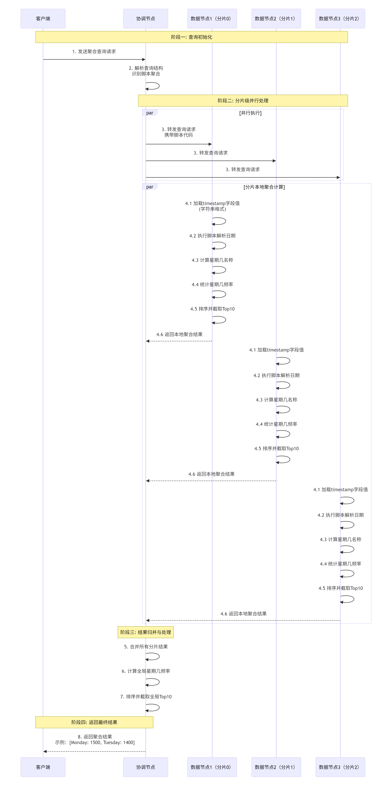

脚本执行引擎：

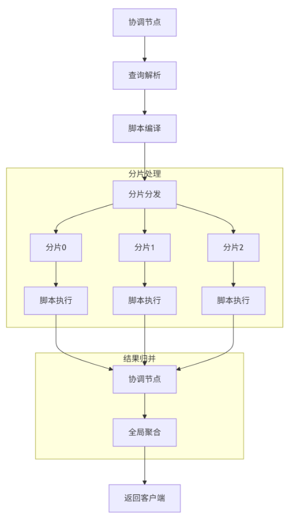

1.  ​Painless VM​：每个分片有自己的脚本执行环境
2.  ​脚本编译​：首次执行时编译脚本，后续使用缓存
3.  ​字段值访问​：通过 doc\['timestamp'\].value 获取字段值
4.  ​JVM 安全沙箱​：限制脚本访问权限，确保集群安全

这个日期脚本聚合查询展示了ES 强大的灵活性和扩展性：

1.  ​动态计算​：在查询时实时计算星期几信息
2.  ​分布式处理​：脚本在分片级并行执行
3.  ​灵活转换​：将日期字符串转换为业务友好的名称
4.  ​复杂分析​：支持任意复杂的业务逻辑计算

其实这里我们还可以这么搞。

1、预处理数据​：在索引前添加星期几字段

\# 预处理数据​：在索引前添加星期几字段

PUT \_ingest/pipeline/kibana\_sample\_data\_flights\_terms\_add\_dayofweek

{

"processors": \[

{

"script": {

"source": """

ctx.day\_of\_week = ctx.timestamp.dayOfWeek.getDisplayName(

TextStyle.FULL, Locale.ROOT

)

"""

}

}

\]

}

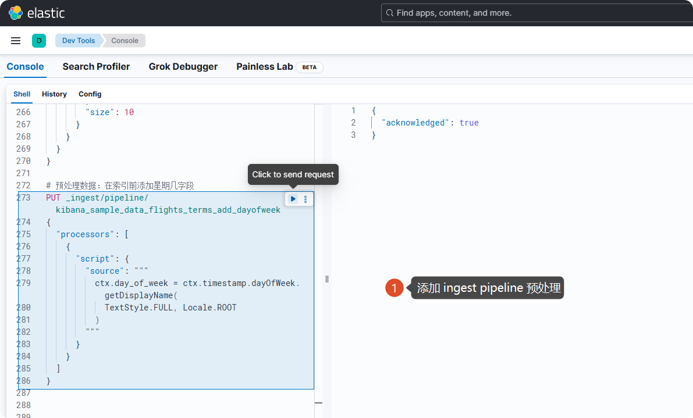

\# 使用运行时字段​计算星期几

GET kibana\_sample\_data\_flights\_terms/\_search

{

"runtime\_mappings": {

"day\_of\_week": {

"type": "keyword",

"script": """

def formatter = DateTimeFormatter.ofPattern("yyyy-MM-dd'T'HH:mm:ss");

def date = LocalDateTime.parse(params.\_source.timestamp, formatter);

emit(date.getDayOfWeek().getDisplayName(

TextStyle.FULL, Locale.ROOT

))

"""

}

},

"aggs": {

"day\_of\_week\_terms": {

"terms": {

"field": "day\_of\_week",

"size": 10

}

}

},

"size": 0

}

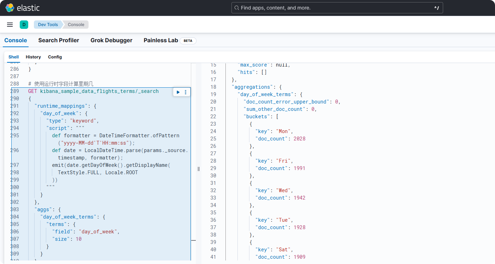

### **3.3.6 Terms 词项分桶键值过滤**

如果想在结果集中「**包含**」或者「**不包含**」某些元素的话可以这么做，还是以上面的示例：

\# 单索引 terms 聚合查询 include 过滤

GET kibana\_sample\_data\_flights\_terms/\_search

{

"track\_total\_hits": true, // 精确计算匹配文档总数（即使超过1万）

"size": 0, // 不返回原始文档，仅返回聚合结果

"aggs": { // 聚合查询

"terms\_OriginCountry": { // 用户自定义聚合名称（结果中作为key）

"terms": { // 聚合类型为词项分桶

"field": "OriginCountry", // 对航班起飞机场国家字段分组

"size": 10, // 返回出现频率最高的前20个国家

"min\_doc\_count": 200,

"include": "C.\*"

}

}

}

}

\# 单索引 terms 聚合查询 exclude 过滤

GET kibana\_sample\_data\_flights\_terms/\_search

{

"track\_total\_hits": true, // 精确计算匹配文档总数（即使超过1万）

"size": 0, // 不返回原始文档，仅返回聚合结果

"aggs": { // 聚合查询

"terms\_OriginCountry": { // 用户自定义聚合名称（结果中作为key）

"terms": { // 聚合类型为词项分桶

"field": "OriginCountry", // 对航班起飞机场国家字段分组

"size": 10, // 返回出现频率最高的前20个国家

"min\_doc\_count": 200,

"exclude": "C.\*"

}

}

}

}

  
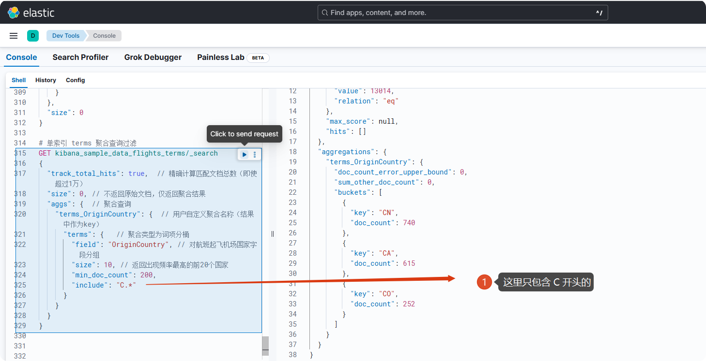

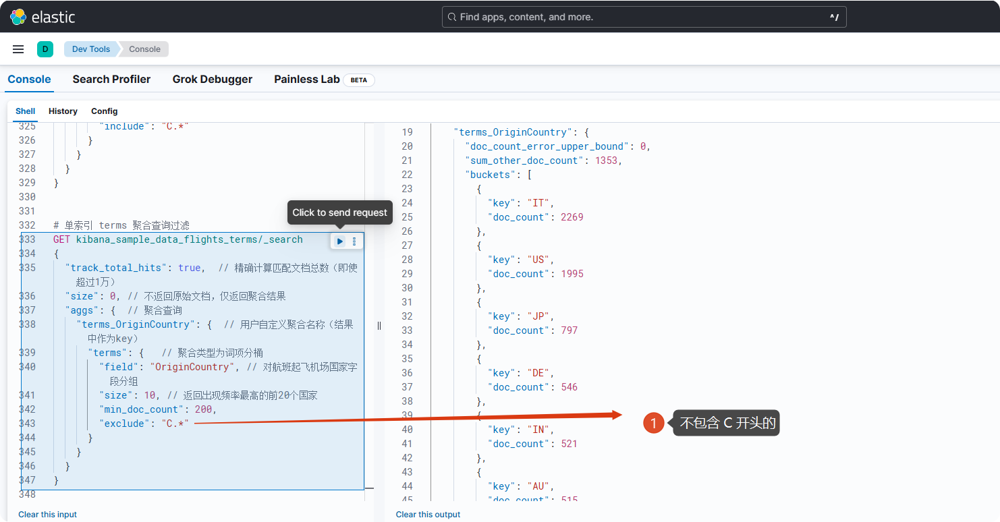

### **3.3.7 Terms 词项分桶分区统计**

当我们索引数据量很大比如亿级别，此时做 terms 分桶聚合会很慢，我们可以通过「**分区**」进行多线程执行。

\# 单索引 terms 聚合查询 include 分区统计

GET kibana\_sample\_data\_flights\_terms/\_search

{

"track\_total\_hits": true, // 精确计算匹配文档总数（即使超过1万）

"size": 0, // 不返回原始文档，仅返回聚合结果

"aggs": { // 聚合查询

"terms\_OriginCountry": { // 用户自定义聚合名称（结果中作为key）

"terms": { // 聚合类型为词项分桶

"field": "OriginCountry", // 对航班起飞机场国家字段分组

"size": 10, // 返回出现频率最高的前20个国家

"min\_doc\_count": 200,

"include": {

"partition": 2, // 当前获取第2分区（0-based）

"num\_partitions": 4 // 总共分为4个分区

}

}

}

}

}

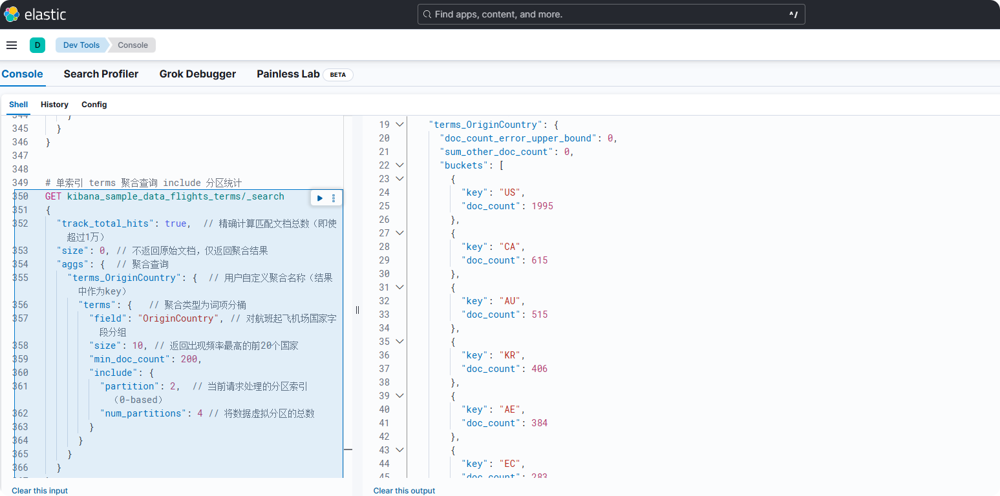

分区参数详解：

1.  ​num\_partitions​：将数据虚拟分区的总数（这里是4）
2.  ​partition​：当前请求处理的分区索引​（这里是2，范围0-3）
3.  ​工作机制​：
4.  根据 num\_partitions=4 将所有 OriginCountry 值分成 4 组
5.  通过 hash(term) % num\_partitions 计算分组
6.  仅处理落在第 2 分区的数据

### **执行流程：**

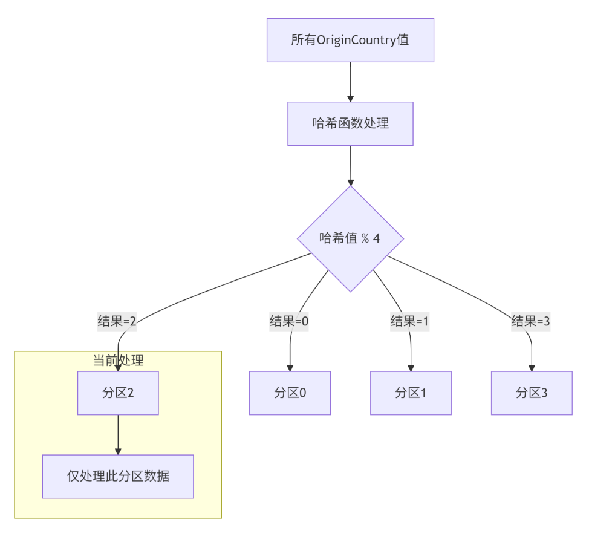

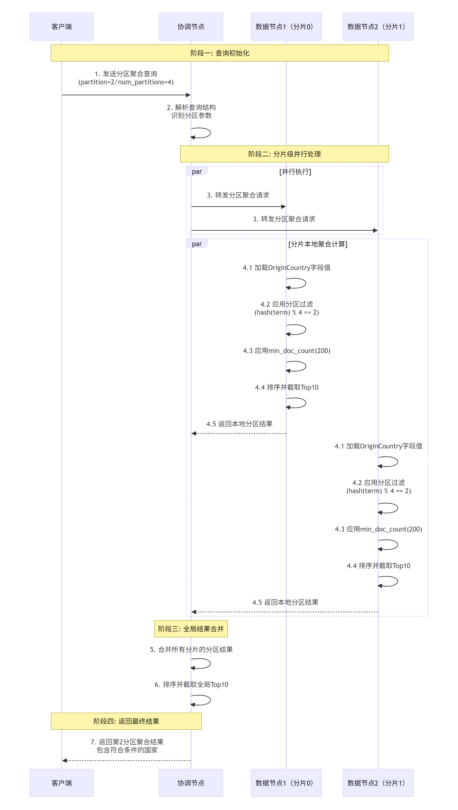

### **3.3.8 Terms 词项分桶全局序号**

在 ES 中，全局序号是一种优化技术，主要用于关键字（keyword）字段或文本（text）字段的聚合（前提是这些字段被设置为可聚合，如 text 字段需要启用 fielddata）。

全局序号是在分片级别构建的，但为了在分布式环境下保证一致性，需要协调节点进行全局序号的构建（在搜索之前）。全局序号一旦构建，就可以在整个聚合过程中使用，从而提升性能。

全局序号（Global Ordinals）​​：

1.  字段值的全局唯一数字映射
2.  在搜索前预加载到内存
3.  用数字ID代替原始值进行聚合

其核心思想是将字符串值映射为唯一的、连续的整数（序号），然后在聚合操作中使用这些整数代替原始字符串。这样做的好处是：

1.  ​减少内存占用​：整数比字符串占用更少内存。
2.  ​提高处理速度​：整数的比较和操作比字符串快。
3.  ​优化缓存​：序号可以更有效地利用CPU缓存。

\# 单索引 terms 聚合全局序号查询

GET kibana\_sample\_data\_flights\_terms/\_search

{

"size": 0,

"aggs": {

"origin\_country": {

"terms": {

"field": "OriginCountry",

"size": 10,

"execution\_hint": "global\_ordinals" // 强制使用全局序号策略进行聚合计算

}

}

}

}

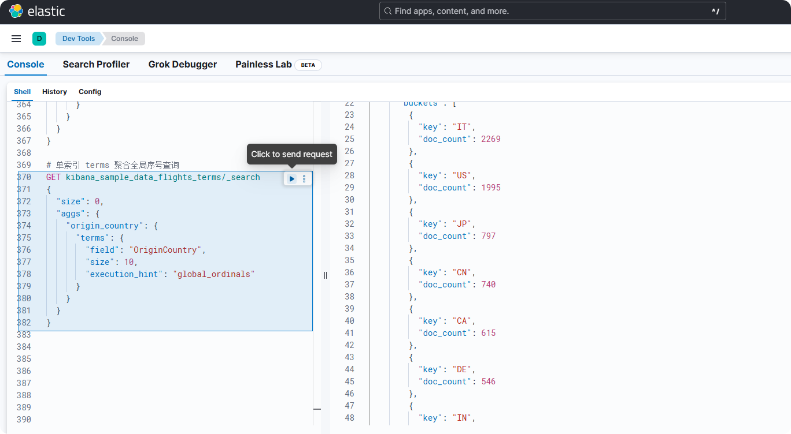

全局序号聚合的执行过程可以分为以下几个阶段：

1.  ​构建全局序号映射​：将字段的唯一值映射为整数序号。这个映射在分片级别创建，但需要协调节点确保全局一致性。
2.  ​收集文档并映射到序号​：每个分片处理文档时，将字段值转换为对应的序号。
3.  ​按序号聚合​：对序号进行聚合（计数、求和等）。
4.  ​将序号转换回原始值​：聚合结果中的序号需要转换回原始字符串值以便返回给用户。

### **执行流程：**

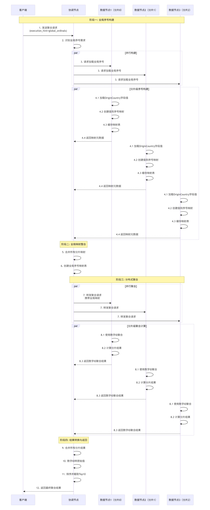

全局序号工作原理：

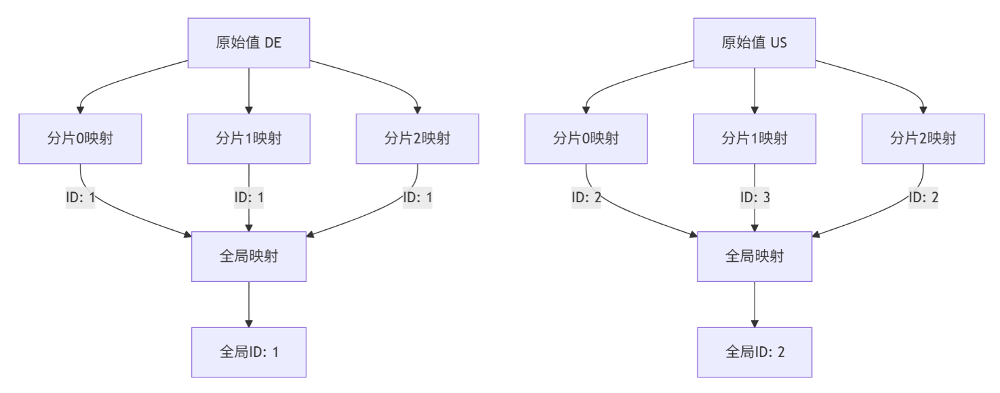

### **3.3.9 Terms 词项分桶广度优先、深度优先**

### **3.3.9.1 Terms 词项分桶广度优先**

\# 单索引 terms 聚合广度优先查询

GET kibana\_sample\_data\_flights\_terms/\_search

{

"size": 0, // 不返回任何文档，只返回聚合结果

"aggs": {

"origin\_country": { // 第一个聚合的名称（用户自定义）

"terms": {

"field": "OriginCountry", // 对字段OriginCountry进行分组

"size": 10, // 返回前10个分组（按文档数从多到少）

"collect\_mode": "breadth\_first" // 使用广度优先模式（影响嵌套聚合的执行顺序）

},

"aggs": { // 添加子聚合才能真正体现模式差异 在origin\_country聚合下的子聚合

"avg\_price": { // 子聚合的名称（用户自定义）

"avg": {"field": "AvgTicketPrice"} // 对AvgTicketPrice字段求平均值

}

}

}

}

}

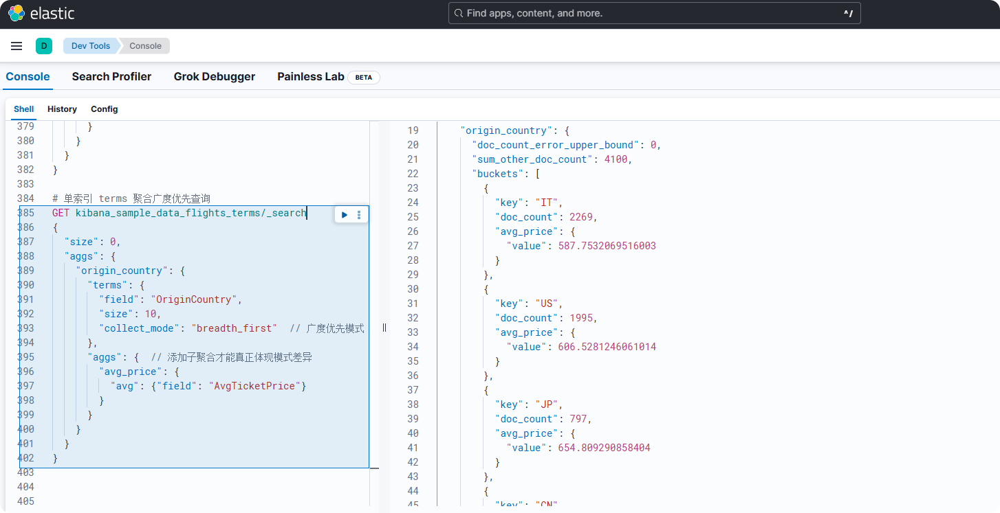

广度优先模式：

1.  首先，在每个分片上，只计算顶层的terms聚合（即按OriginCountry分组并计数），然后根据文档计数排序并截取前10个桶（注意：这里只取前10个桶，不计算子聚合）。
2.  然后，只对这前10个桶执行子聚合（计算平均价格）。

这种模式可以显著减少子聚合的计算量，尤其是在顶层聚合的桶很多，但只需要返回前几个桶的情况下。

注意事项：

1.  广度优先模式只影响包含子聚合的情况。如果没有子聚合，那么广度优先和深度优先没有区别。
2.  广度优先模式可能会因为每个分片只返回部分桶而导致全局Top桶的遗漏（尤其是当数据分布不均匀时）。可以通过设置shard\_size参数（大于size）来缓解，默认情况下shard\_size = (size \* 1.5 + 10)。

### **执行流程：**

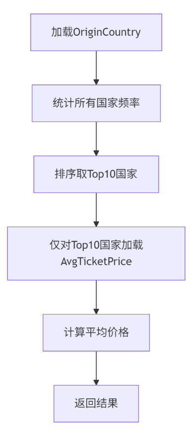

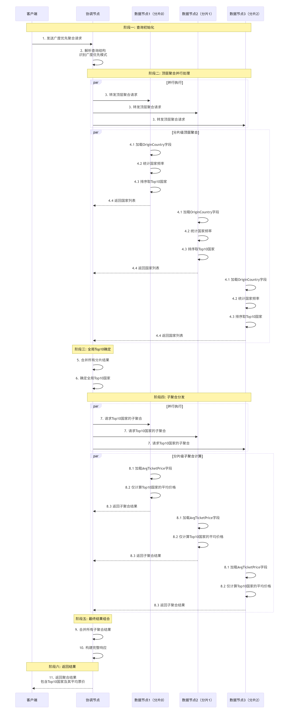

广度优先核心优势：

1.  ​资源高效​：显著减少内存和CPU消耗
2.  ​响应快速​：缩短复杂聚合的响应时间
3.  ​可扩展性​：适合大规模数据集
4.  ​聚焦重点​：只计算关键结果的子聚合

最佳实践建议：

1.  ​适用场景​：
2.  多层嵌套聚合（≥3层）
3.  只需Top结果的场景
4.  高基数字段聚合
5.  ​参数优化​：

"shard\_size": "size \* 2 + 10",

"execution\_hint": "map",

"show\_term\_doc\_count\_error": true

1.  ​监控指标​：
2.  定期检查search.max\_buckets使用
3.  监控indices.breaker.agg\_limit
4.  跟踪query\_time和memory\_size
5.  ​混合策略​：
6.  顶层使用广度优先
7.  关键子聚合用深度优先
8.  结合运行时字段优化

### **3.3.9.2 Terms 词项分桶深度优先**

\# 单索引 terms 聚合深度优先查询

GET kibana\_sample\_data\_flights\_terms/\_search

{

"size": 0, // 不返回原始文档

"aggs": {

"origin\_country": { // 一级聚合名称（按出发国家分组）

"terms": {

"field": "OriginCountry",

"size": 10,

"collect\_mode": "depth\_first" // 深度优先模式

},

"aggs": { // 添加子聚合才能真正体现模式差异

"dest\_country": {

"terms": {

"field": "DestCountry",

"size": 9 // 返回前9个目的国，为什么是 9 ，因为前面设置了最大分桶数为 100，这里必须小于 10

}

}

}

}

}

}

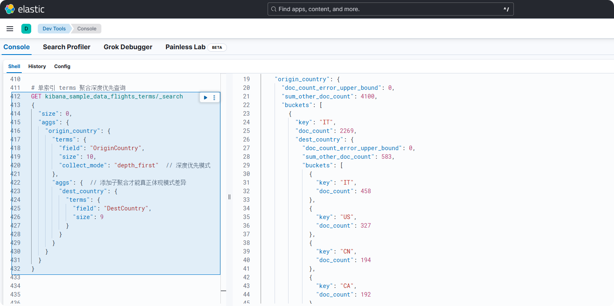

深度优先（depth\_first）意味着ES会先完全构建每个OriginCountry桶的子聚合（即DestCountry分桶），然后再处理下一个OriginCountry桶。

这种模式可能会消耗更多内存，因为它在进行下一级聚合之前会完成当前桶的所有子聚合。

### **执行流程：**

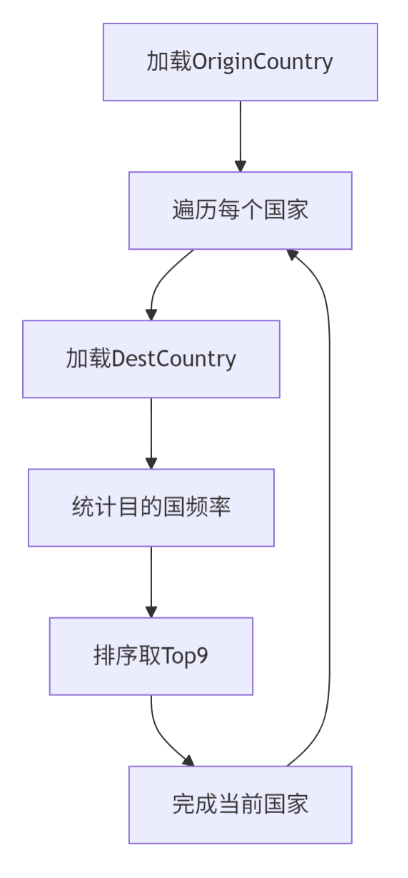

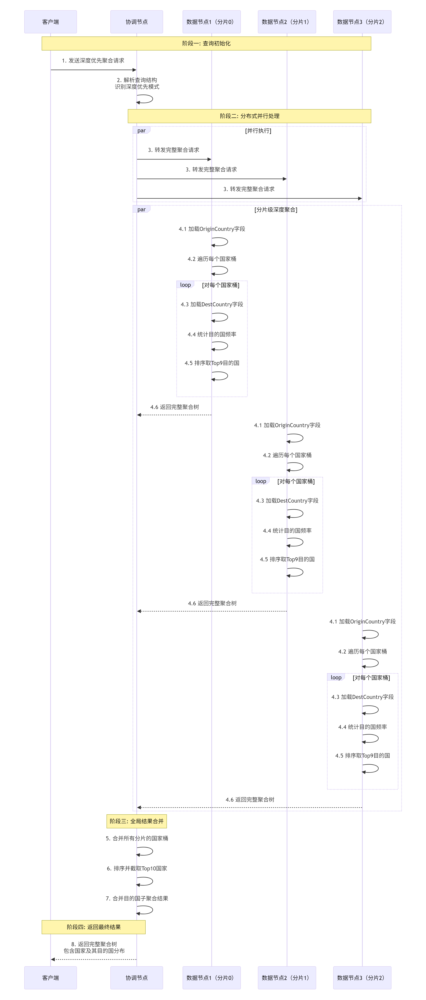

深度优先聚合是 ES 处理复杂嵌套聚合的核心策略：

1.  ​核心优势​：
2.  提供完整聚合树
3.  保证结果精确性
4.  支持复杂排序需求
5.  ​适用场景​：
6.  小规模数据集（<10万文档）
7.  需要完整子聚合树的业务
8.  子聚合结果影响父桶排序
9.  ​最佳实践​：
10.  结合全局序号优化高基数字段
11.  合理设置shard\_size减少误差
12.  监控内存使用防止OOM
13.  对深层嵌套使用混合策略

### **3.3.10 Terms 词项分桶异步查询**

适用场景推荐

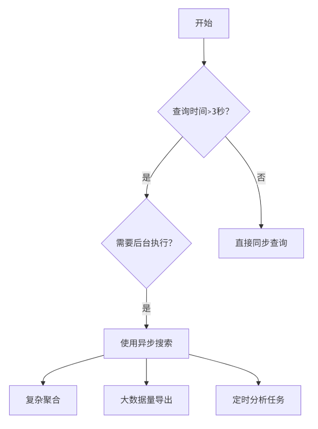

由于我们这个索引数据量比较少，执行速度太快了，所以我们这里为了模拟效果，添加了一个等待时间：-1ms，这意味着不会等待查询完成，而是立即返回一个异步任务ID。

POST /kibana\_sample\_data\_flights\_terms/\_async\_search?wait\_for\_completion\_timeout=\-1ms

{

"track\_total\_hits": true, // 精确计算匹配文档总数（即使超过1万）

"size": 0, // 不返回原始文档，仅返回聚合结果

"aggs": { // 聚合查询

"terms\_OriginCountry": { // 用户自定义聚合名称（结果中作为key）

"terms": { // 聚合类型为词项分桶

"field": "OriginCountry", // 对航班起飞机场国家字段分组

"size": 100, // 返回出现频率最高的前20个国家

"min\_doc\_count": 200

}

}

}

}

\# 根据任务id查询结果

GET \_async\_search/FmgxeGFHSnctU2g2bFN3VGpoY21GYUEfblVTUUhqLW1SYnl0U1RDY2k4eE13QTo4MzUxMDQzNA

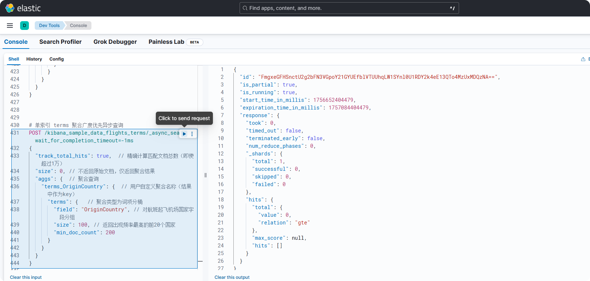

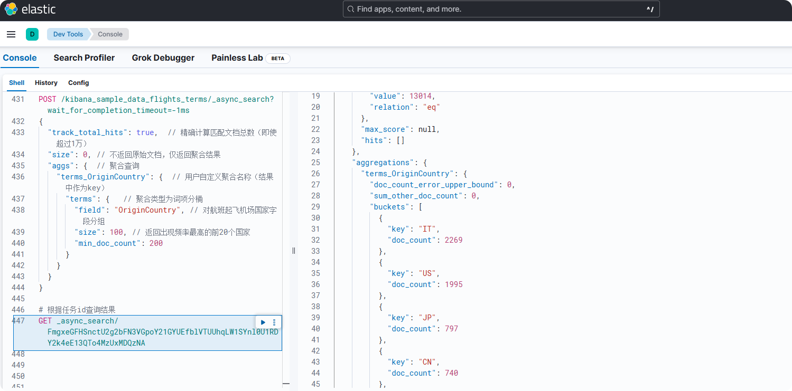

任务创建阶段

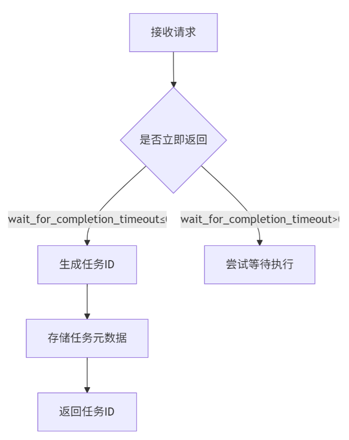

### **执行流程：**

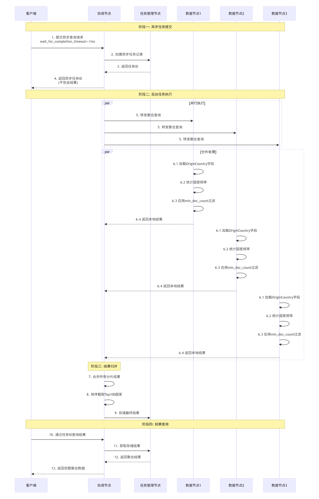

核心组件功能

异步搜索参数详解

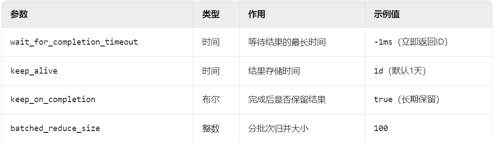

### **3.3.11 Terms 词项分桶与分组明细数据**

这是一个我认为非常有用的功能，当我们需要对分桶聚合结果中的 每组中排名靠前的明细数据，就可以按照如下来做。

这个示例查询的目标是：获取航班数超过200的出发国家（最多100个国家），并且每个国家显示5个示例文档（只包含Origin相关的字段）

\# 单索引 terms 聚合分桶与分组明细数据查询

GET /kibana\_sample\_data\_flights\_terms/\_search

{

"track\_total\_hits": true, // 精确计算匹配文档总数（即使超过1万）

"size": 0, // 不返回原始文档，仅返回聚合结果

"aggs": { // 聚合查询

"terms\_OriginCountry": { // 用户自定义聚合名称（结果中作为key）

"terms": { // 聚合类型为词项分桶

"field": "OriginCountry", // 对航班起飞机场国家字段分组

"size": 100, // 返回出现频率最高的前20个国家

"min\_doc\_count": 200

},

"aggs": {

"top\_hits\_source": {

"top\_hits": {

"size": 5

}

}

}

}

}

}

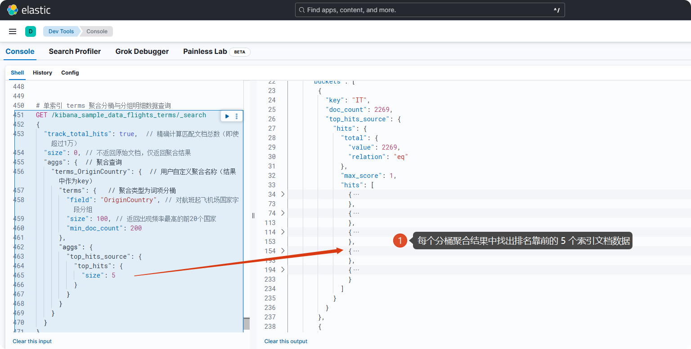

\# 单索引 terms 聚合分桶与分组明细数据查询

GET /kibana\_sample\_data\_flights\_terms/\_search

{

"track\_total\_hits": true, // 精确计算匹配文档总数（即使超过1万）

"size": 0, // 不返回原始文档，仅返回聚合结果

"aggs": { // 聚合查询

"terms\_OriginCountry": { // 用户自定义聚合名称（结果中作为key）

"terms": { // 聚合类型为词项分桶

"field": "OriginCountry", // 对航班起飞机场国家字段分组

"size": 100, // 返回出现频率最高的前20个国家

"min\_doc\_count": 200

},

"aggs": {

"top\_hits\_source": {

"top\_hits": {

"size": 5,

"\_source": {

"include": "Origin\*"

}

}

}

}

}

}

}

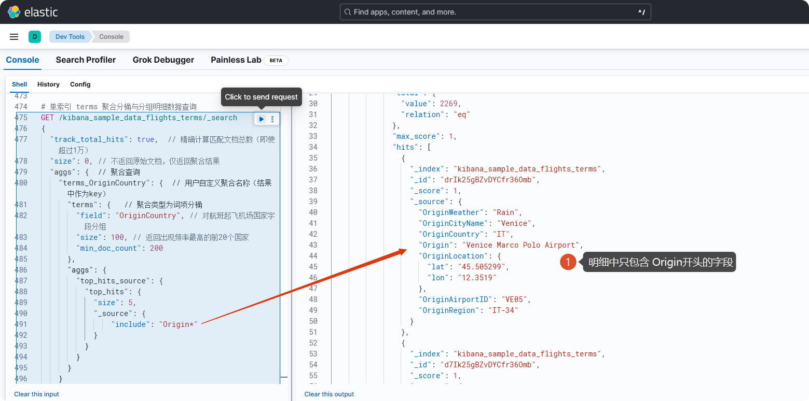

### **执行流程：**

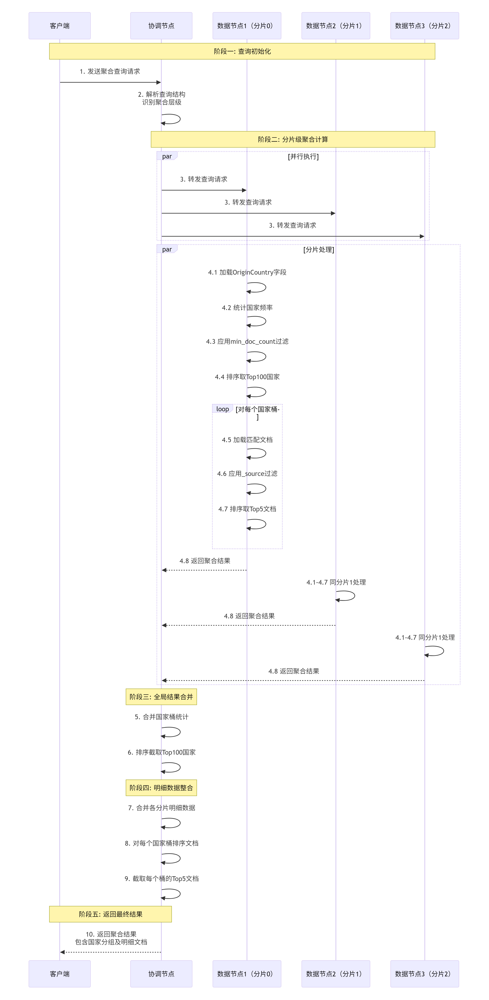

### **3.3.12 Rare Terms 稀有词项分桶**

关于这个就不展开，自行查看官方文档：[https://www.elastic.co/guide/en/elasticsearch/reference/8.17/search-aggregations-bucket-rare-terms-aggregation.html](https://www.elastic.co/guide/en/elasticsearch/reference/8.17/search-aggregations-bucket-rare-terms-aggregation.html)

### **3.3.12 Multi Terms 词项分桶**

关于这个就不展开，自行查看官方文档：[https://www.elastic.co/guide/en/elasticsearch/reference/8.17/search-aggregations-bucket-multi-terms-aggregation.html](https://www.elastic.co/guide/en/elasticsearch/reference/8.17/search-aggregations-bucket-multi-terms-aggregation.html)

### **3.3.13 Significant Terms 词项分桶**

关于这个就不展开，自行查看官方文档：[https://www.elastic.co/guide/en/elasticsearch/reference/8.17/search-aggregations-bucket-significantterms-aggregation.html](https://www.elastic.co/guide/en/elasticsearch/reference/8.17/search-aggregations-bucket-significantterms-aggregation.html)

## **3.4 Terms 特殊分桶聚合深度实战**

这部分，我们来深度实战下文章开头梳理的：

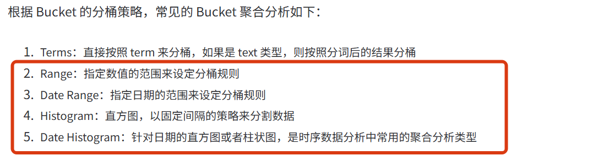

### **3.4.1 Histogram 直方图**

ES 中的直方图（Histogram）是一种用于数据可视化和分析的图形表示方式，它主要用于展示数据的分布情况。直方图通过将一系列连续的数据值分组到一系列区间（称为“桶”或“bins”）中来展示数据的分布，每个区间的高度代表了该区间内数据点的数量。

虽然 ES 本身不直接提供“直方图”类型的可视化图表，它专门设计了 Histogram 字段类型并通过聚合（Aggregations）功能来处理和分析数据，你可以通过聚合的结果来创建直方图。

1.  数据会按照直方图的方式分桶聚合。
2.  直方图直接按照一定的间隔。
3.  基于数值的直方图分桶。
4.  基于日期的直方图分桶。

其实 ES 内部已经实现了很多关于图表类的示例，这里我们拿航班飞行数据来举例：

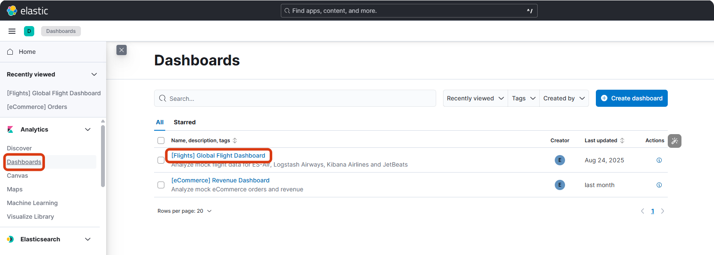

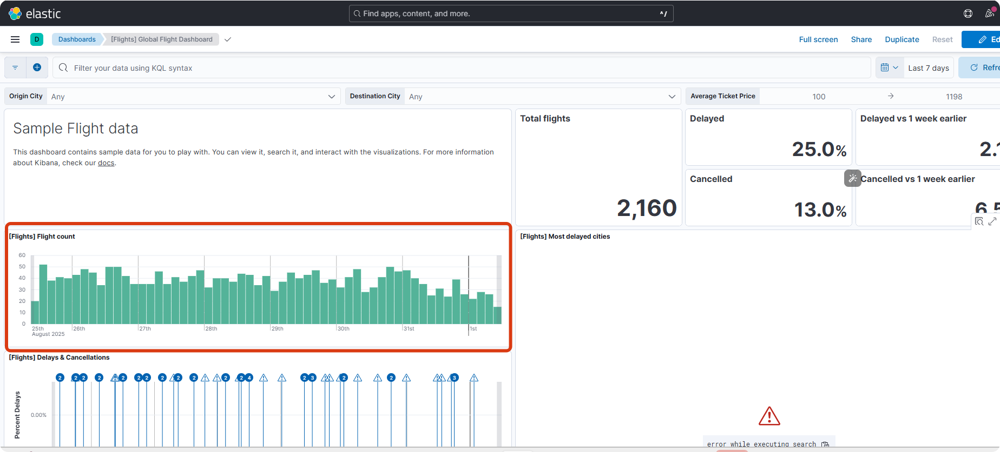

官方文档：[https://www.elastic.co/guide/en/elasticsearch/reference/8.17/search-aggregations-bucket-histogram-aggregation.html](https://www.elastic.co/guide/en/elasticsearch/reference/8.17/search-aggregations-bucket-histogram-aggregation.html)

我们还是基于 kibana\_sample\_data\_flights\_terms 索引来模拟实现下这个功能：

\# 单索引 histogram 直方图聚合分桶

GET kibana\_sample\_data\_flights\_terms/\_search

{

"size": 0, // 不返回原始文档，仅返回聚合结果

"aggs": { // 聚合查询

"Histogram\_FlightTimeMin": { // 用户自定义聚合名称（结果中作为key）

"histogram": { // 聚合类型为直方图

"field": "FlightTimeMin", // 分析飞行时间字段（单位：分钟）

"interval": 60, // 分桶间隔（60分钟）

"keyed": true // 返回带键值对格式的结果

}

}

}

}

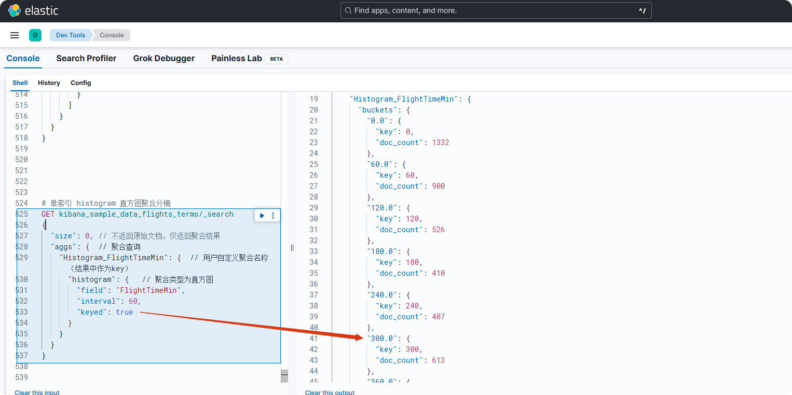

示例关键参数解析：

1.  ​interval: 60​：
2.  每个桶的宽度为60分钟
3.  将连续数值离散化为桶（如0-60分钟、60-120分钟等）
4.  ​keyed: true：
5.  返回结果为键值对形式（而非数组）
6.  桶键作为key，桶数据作为value
7.  提高结果可读性和访问效率
8.  ​field: "FlightTimeMin"​：
9.  表示航班飞行时间（单位：分钟）
10.  必须为数值类型（integer, long, double等）

简单的验证下结果是否准确：

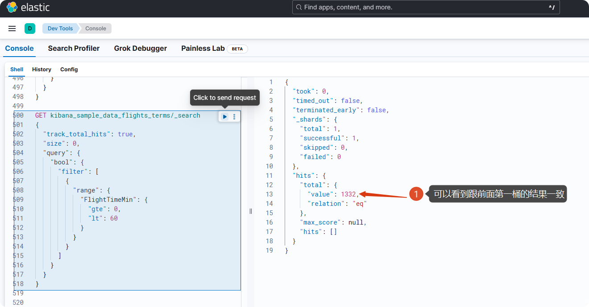

### **执行流程：**

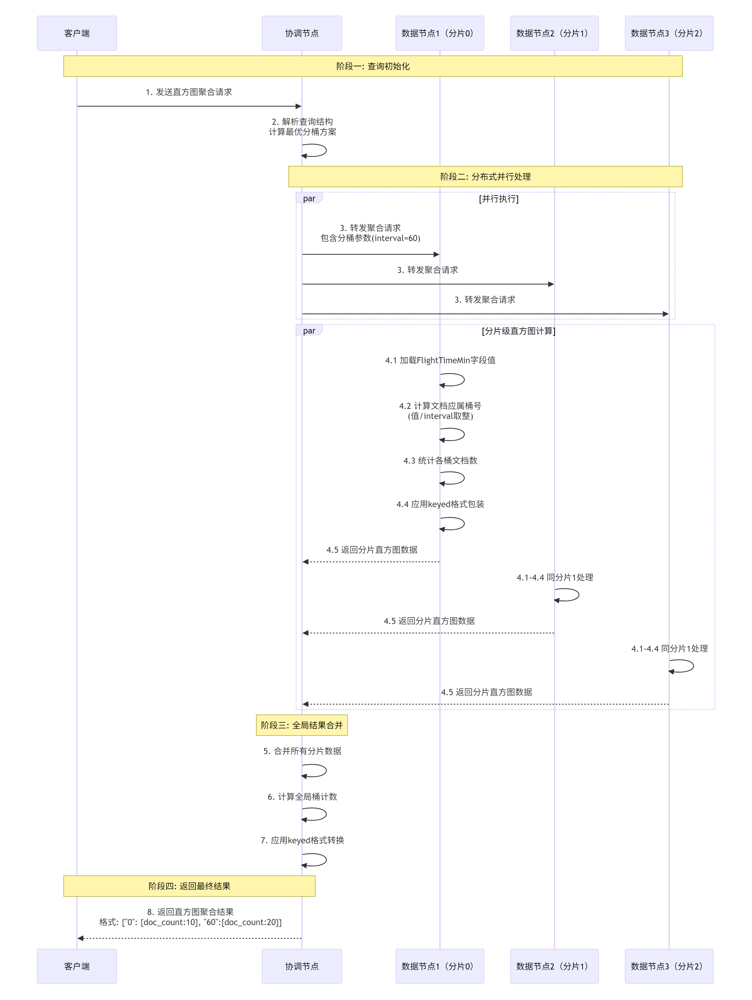

ES 直方图聚合提供强大的数值分布分析能力：

1.  ​核心价值​：
2.  数值型字段的离散化处理
3.  直观展示数据分布特征
4.  支持多维度组合分析
5.  ​适用场景​：
6.  飞行时长分布分析
7.  票价区间统计
8.  航班距离分段
9.  客户消费水平分析
10.  ​最佳实践​：
11.  合理设置 interval 平衡精度和性能
12.  使用 keyed=true 提高结果可读性
13.  结合 min\_doc\_count 过滤噪点
14.  添加 extended\_bounds 保证范围完整

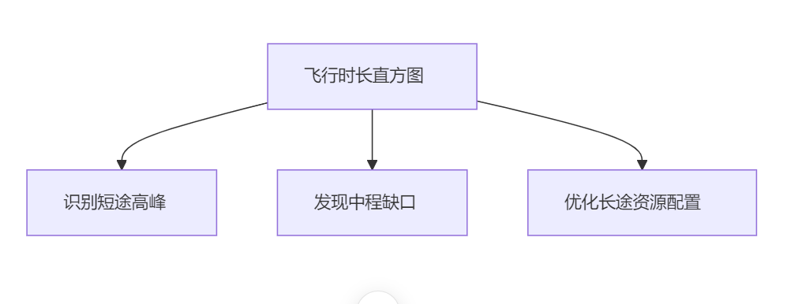

\# 单索引 histogram 直方图聚合分桶 保证范围

GET kibana\_sample\_data\_flights\_terms/\_search

{

"size": 0, // 不返回原始文档，仅返回聚合结果

"aggs": { // 聚合查询

"Histogram\_FlightTimeMin": { // 用户自定义聚合名称（结果中作为key）

"histogram": { // 聚合类型为直方图

"field": "FlightTimeMin",

"interval": 60,

"keyed": true,

"extended\_bounds" : {

"min" : 1000,

"max": 2000

}

}

}

}

}

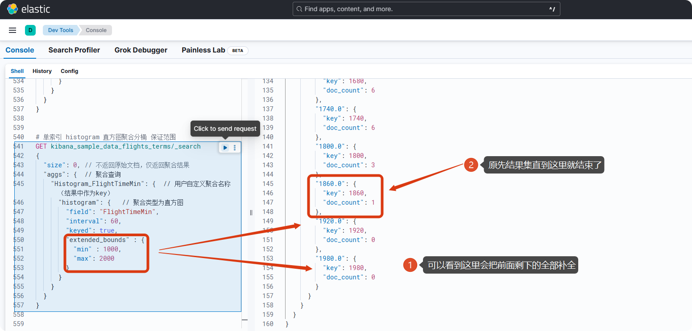

另外也可以通过 hard\_bounds 来过滤一些不需要的数据：

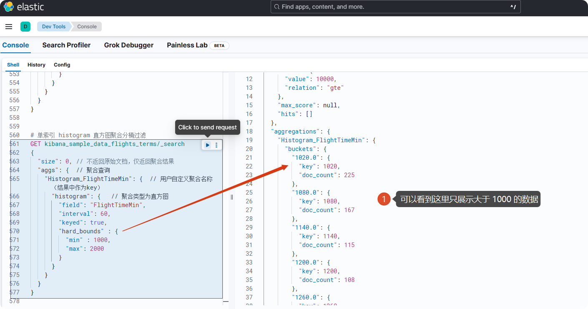

### **3.4.2 Date Histogram 直方图**

基于日期的直方图，这个功能非常有用。

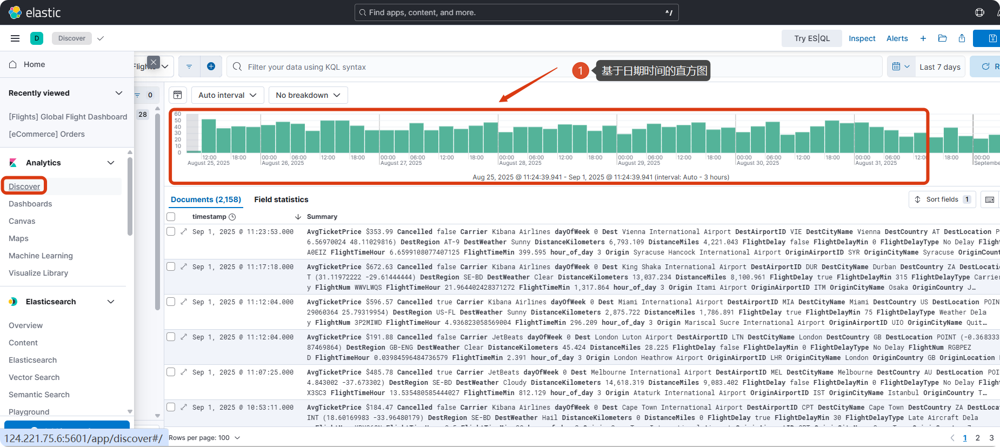

官方文档：[https://www.elastic.co/guide/en/elasticsearch/reference/8.17/search-aggregations-bucket-datehistogram-aggregation.html](https://www.elastic.co/guide/en/elasticsearch/reference/8.17/search-aggregations-bucket-datehistogram-aggregation.html)

\# 航班日期直方图 动态 mapping

PUT kibana\_sample\_data\_flights\_terms\_date

{

"mappings": {

"dynamic": true, // 允许动态添加新字段

"properties": {

"timestamp": {

"type": "date", // 正确定义为date类型

"format": "strict\_date\_optional\_time"

}

}

}

}

\# 先重建新索引

POST \_reindex

{

"source": {

"index": "kibana\_sample\_data\_flights"

},

"dest": {

"index": "kibana\_sample\_data\_flights\_terms\_date"

}

}

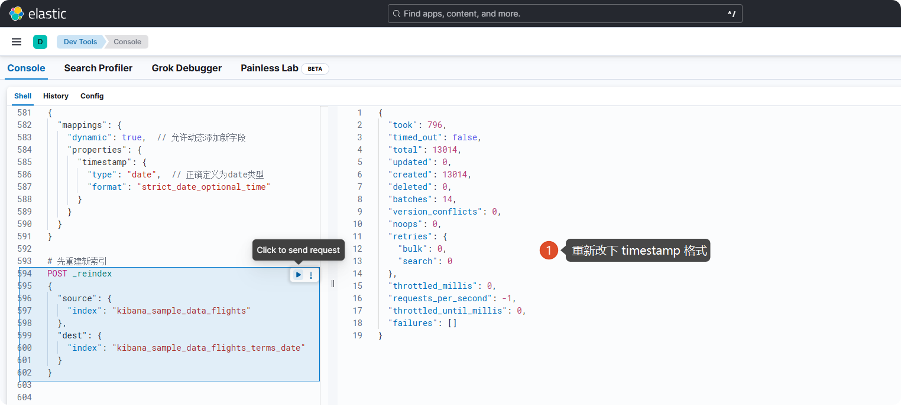

\# 单索引 date histogram 直方图聚合分桶

GET kibana\_sample\_data\_flights\_terms\_date/\_search

{

"track\_total\_hits": true,

"size": 0, // 不返回原始文档，仅返回聚合结果

"aggs": { // 聚合查询

"Date\_Histogram\_timestamp": { // 用户自定义聚合名称（结果中作为key）

"date\_histogram": { // 聚合类型为日期直方图

"field": "timestamp",

"calendar\_interval": "month"

}

}

}

}

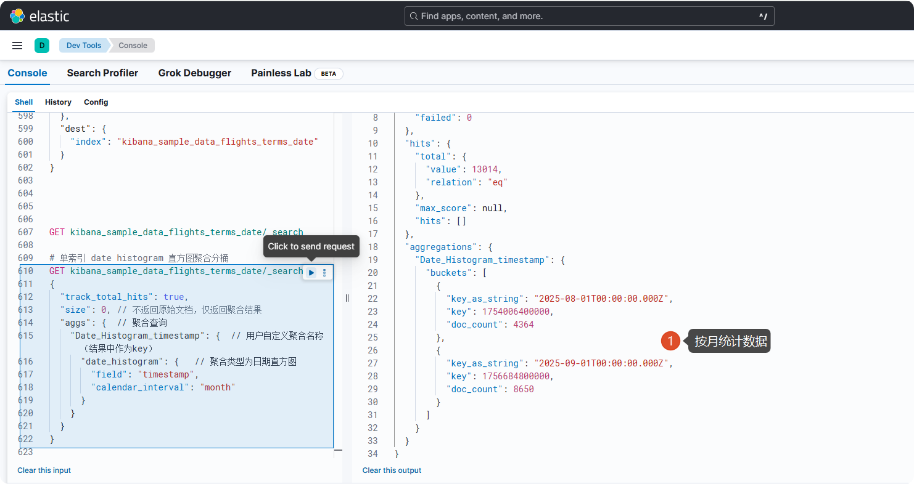

示例关键参数解析：

1.  ​calendar\_interval: "month"​：
2.  按自然月分桶（考虑月份天数差异）
3.  与固定间隔不同，处理了2月天数变化等情况
4.  支持值：minute, hour, day, week, month, quarter, year
5.  ​field: "timestamp"：
6.  日期类型字段，存储航班起降时间
7.  必须定义为 date 类型，这里重新定义了 mapping 结构。

###   
**执行流程：**

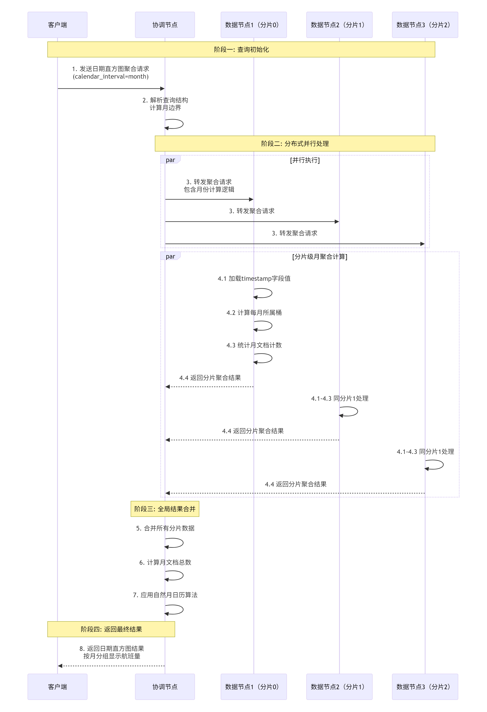

另外这里还支持自定义时间，比如：

\# 单索引 date histogram 直方图自定义时间聚合分桶

GET kibana\_sample\_data\_flights\_terms\_date/\_search

{

"track\_total\_hits": true,

"size": 0, // 不返回原始文档，仅返回聚合结果

"aggs": { // 聚合查询

"Date\_Histogram\_timestamp": { // 用户自定义聚合名称（结果中作为key）

"date\_histogram": { // 聚合类型为日期直方图

"field": "timestamp",

"fixed\_interval": "3d",

"format" : "yyyy-MM-dd"

}

}

}

}

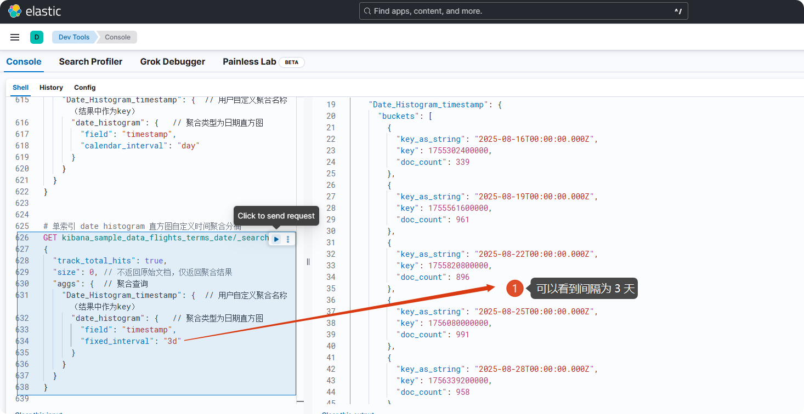

也可以格式化时间：

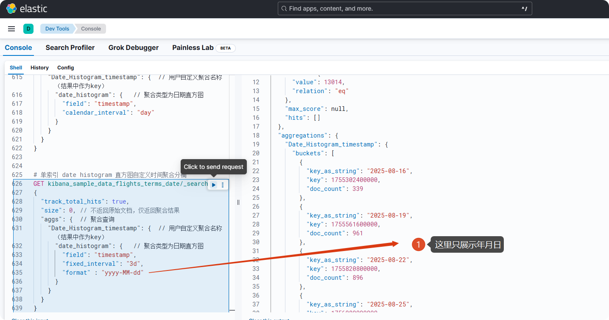

### **3.4.3 Auto Date Histogram 直方图**

这个就比较简单了，我们来看下：

\# 单索引 auto date histogram 直方图自定义时间聚合分桶

GET kibana\_sample\_data\_flights\_terms\_date/\_search

{

"track\_total\_hits": true,

"size": 0, // 不返回原始文档，仅返回聚合结果

"aggs": { // 聚合查询

"Date\_Histogram\_timestamp": { // 用户自定义聚合名称（结果中作为key）

"auto\_date\_histogram": { // 聚合类型为日期直方图

"field": "timestamp",

"buckets": 10 // 期望桶数量（约10个）

}

}

}

}

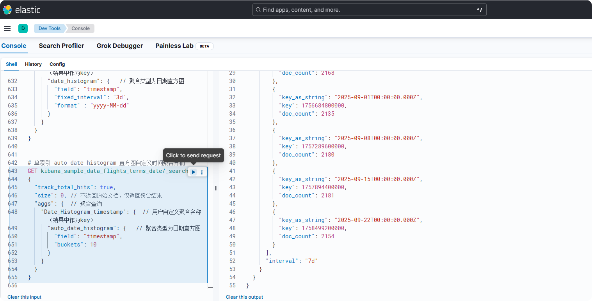

示例关键参数解析：

1.  ​buckets: 10​：
2.  期望分成的桶数量约10个
3.  实际桶数可能小于或等于该值
4.  ES 自动计算最佳时间间隔
5.  ​auto\_date\_histogram：
6.  自动选择合适的日历间隔
7.  支持间隔：秒、分、时、天、月、年
8.  基于字段的时间范围和文档分布

###   
**执行流程：**

  
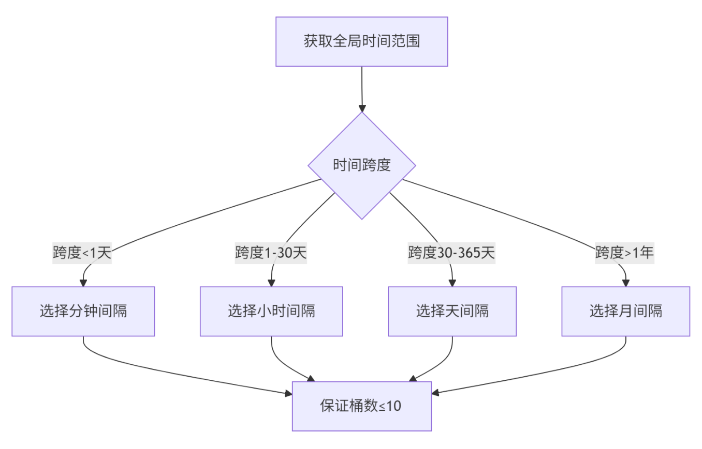

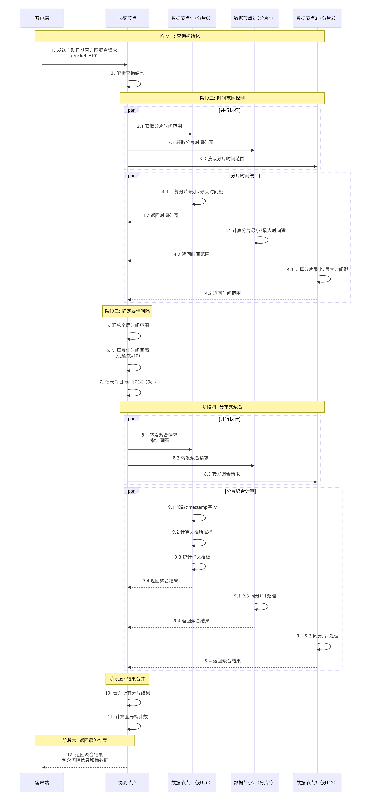

间隔精确控制：

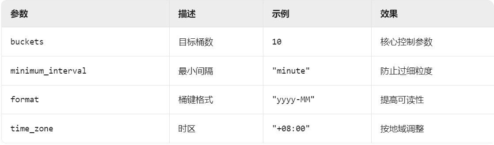

// 感兴趣可以自行测试

"auto\_date\_histogram": {

"field": "timestamp",

"buckets": 10,

"minimum\_interval": "day", // 最细到按天

"format": "yyyy-MM-dd", // 日期格式

"time\_zone": "Asia/Shanghai" // 北京时间

}

与传统直方图对比：

### **3.4.4 Range 聚合**

它基于数值类型，自定义设置范围，支持脚本，类似于直方图。我们来简单看下：

\# 单索引 range 聚合分桶

GET kibana\_sample\_data\_flights\_terms\_date/\_search

{

"track\_total\_hits": true,

"size": 0, // 不返回原始文档，仅返回聚合结果

"aggs": { // 聚合查询

"Range\_FlightTimeMin": { // 用户自定义聚合名称（结果中作为key）

"range": { // 聚合类型为 range

"field": "FlightTimeMin",

"ranges": \[

{

"to": 100

},

{

"from": 100,

"to": 200

},

{

"from": 1000

}

\]

}

}

}

}

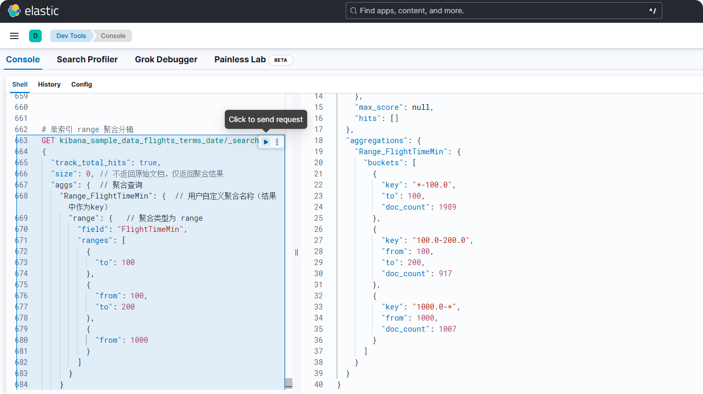

\# 单索引 range 聚合分桶

GET kibana\_sample\_data\_flights\_terms\_date/\_search

{

"track\_total\_hits": true,

"size": 0, // 不返回原始文档，仅返回聚合结果

"aggs": { // 聚合查询

"Range\_FlightTimeMin": { // 用户自定义聚合名称（结果中作为key）

"range": { // 聚合类型为 range

"field": "FlightTimeMin",

"ranges": \[

{

"key": "1H",

"to": 60

},

{

"key": "1H~2H",

"from": 60,

"to": 120

},

{

"key": "10H",

"from": 600

}

\]

}

}

}

}

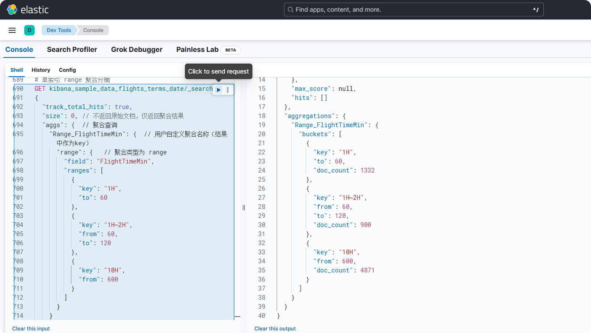

### **执行流程：**

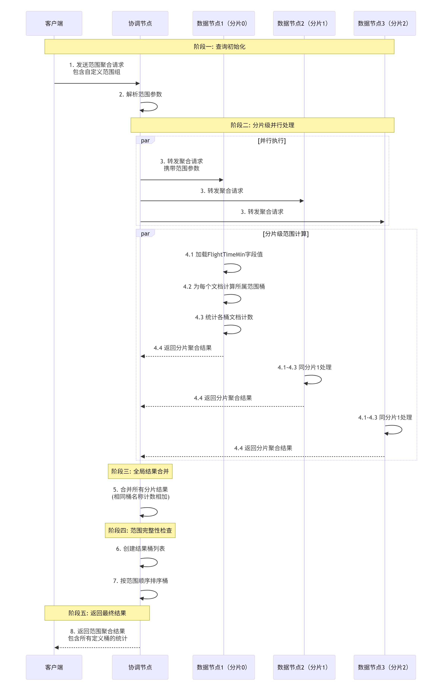

### **3.4.5 Date Range 聚合**

\# 单索引 date range 聚合分桶

GET kibana\_sample\_data\_flights\_terms\_date/\_search

{

"track\_total\_hits": true,

"size": 0, // 不返回原始文档，仅返回聚合结果

"aggs": { // 聚合查询

"date\_range\_timestamp": { // 用户自定义聚合名称（结果中作为key）

"date\_range": { // 聚合类型为 date\_range

"field": "timestamp",

"ranges": \[

{

"to": "now-60d/d"

},

{

"from": "now-10d/d",

"to": "now"

}

\],

"format": "yyyy-MM-dd"

}

}

}

}

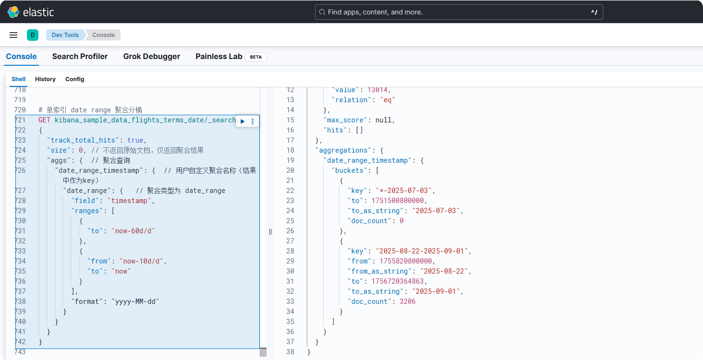

关键参数解析：

1.  ​ranges：日期范围数组
2.  to: "now-60d/d"：表示从最早时间到60天前（不包括60天前）
3.  from: "now-10d/d", to: "now"：表示从10天前到当前时间（不包括当前时间）
4.  ​日期格式​：
5.  "format": "yyyy-MM-dd"：桶键返回格式（如2025-01-15）
6.  支持所有Java DateTimeFormatter格式
7.  ​范围逻辑​：
8.  第一桶：(-∞, now-60d)
9.  第二桶：\[now-10d, now)
10.  ​注意​：now-60d到now-10d之间的数据未被覆盖

### **执行流程：**

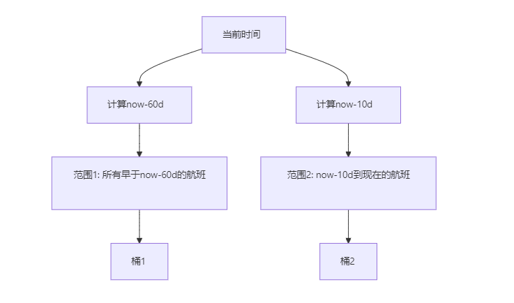

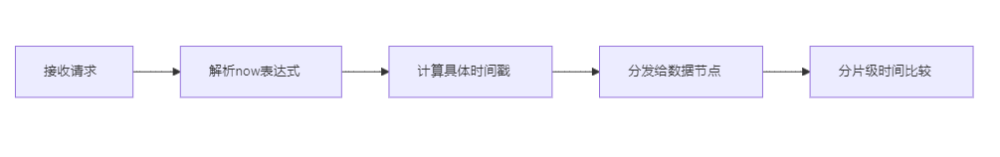

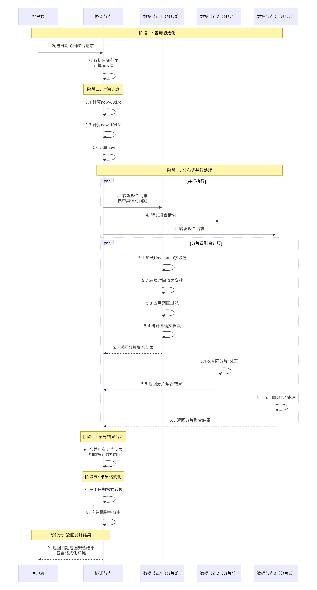