从今天之后的一段时间内，华仔会带着大家一起来从零开始对 ElasticStack 矩阵产品进行深入剖析和项目运维实战，希望大家学完之后可以用到自己的工作中。

这是第十五篇，本篇我将带着大家进行「**ES 索引 Pipeline 管道二次聚合统计深度实战**」。

文章汇总位置：[https://wx.zsxq.com/dweb2/index/columns/51122554151214](https://wx.zsxq.com/dweb2/index/columns/51122554151214)

## **01 前言**

在上篇中 [【ES 入门实战第十四篇】ES 索引 Suggest、自动补全、拼写错误、模糊查询、高亮显示深度实战](https://articles.zsxq.com/id_grof89ux9j9w.html)，带着大家进行「**ES 索引 Suggest、自动补全、拼写错误、模糊查询、高亮显示深度实战**」。

今天我们来进行「**ES 索引 Pipeline 管道二次聚合统计深度实战**」。

##   
**02 Pipeline 管道聚合基础知识**

在正式开始实战 Pipeline 聚合统计之前，我们先来了解下 Pipeline 聚合的基础知识。

## **2.1 Pipeline 管道聚合概念**

Pipeline 聚合是一种特殊的聚合，又称管道聚合，其独特之处在于：​它不直接对原始文档字段进行计算，而是以其他聚合的结果作为输入，进行「**二次聚合**」。

1.  每个数据聚合阶段是一个环节，多个环节串联一起来，形成一个管道模型，上一个环节的聚合结果是下一个环节的输入数据。
2.  基于Bucket分桶聚合，必须要有bucket分桶，且属于第一层级。
3.  二次聚合统计必须是数值类。

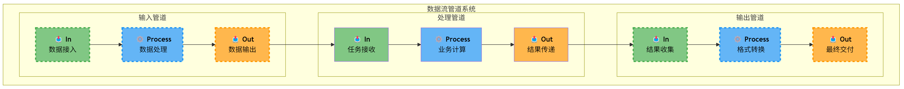

## **2.2 Pipeline 管道聚合与基础聚合的区别**

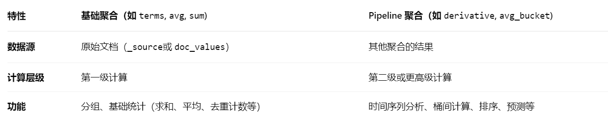

## **2.3 Pipeline 管道聚合分类**

Pipeline 聚合分为两类：

1.  父级（Parent）Pipeline 聚合​：
2.  这类聚合的输出是将结果嵌入到现有聚合的结果桶中。
3.  为每个桶提供一个子聚合。
4.  ​示例​：avg\_bucket可以计算一个聚合中多个桶的平均值。它们计算的是同一父聚合下，相邻桶之间的变化。
5.  ​兄弟（Sibling） Pipeline 聚合​：
6.  这类聚合的输出是与现有聚合结果同级，会生成新的聚合结果。
7.  计算的是所有桶的总体指标。
8.  ​示例​：avg\_bucket（桶平均值），max\_bucket（桶最大值），stats\_bucket（桶统计信息）。max\_bucket可以找到另一个聚合中所有桶的最大值。

## **2.4 Pipeline 管道聚合执行流程**

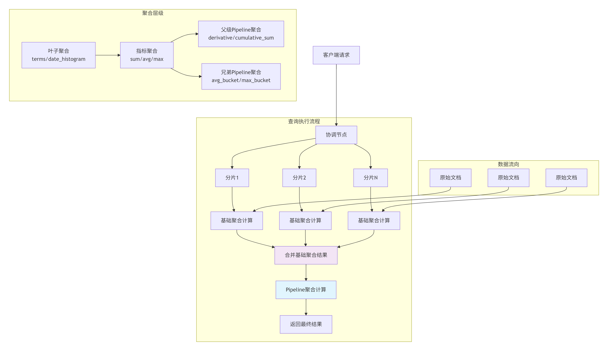

1.  客户端发送请求​：客户端向Elasticsearch协调节点发送搜索请求，请求中包含管道聚合。
2.  ​协调节点接收请求​：协调节点解析请求，并将请求转发给索引的各个分片。
3.  ​分片执行本地聚合​：每个分片执行查询和基础聚合（如terms、date\_histogram等），但不会执行管道聚合。分片将基础聚合的结果返回给协调节点。
4.  ​协调节点合并分片结果​：协调节点合并来自各个分片的基础聚合结果。例如，对于terms聚合，协调节点会将相同term的桶合并。
5.  ​协调节点执行管道聚合​：在合并后的基础聚合结果上，协调节点执行管道聚合计算（如求导、平均桶等）。
6.  ​返回最终结果​：协调节点将最终结果返回给客户端。

关键点解析：​

1.  分层处理​：基础聚合在分片级别并行执行，Pipeline 聚合在协调节点串行执行。
2.  ​数据流向​：原始数据 → 分片基础聚合 → 协调节点合并 → Pipeline 计算。
3.  ​内存消耗​：Pipeline 聚合阶段所有桶数据需要在协调节点内存中处理。

  
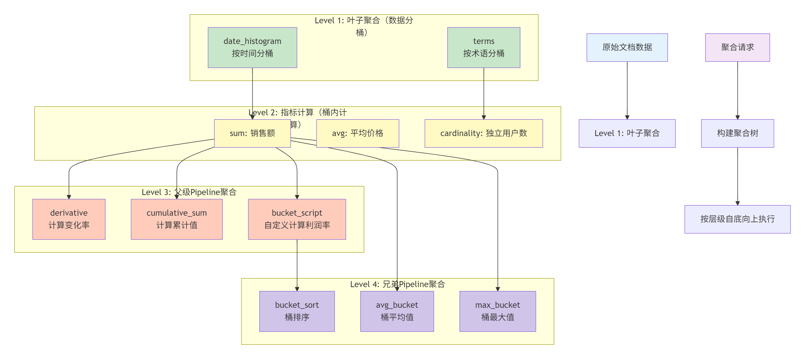

上图展示了ES 中聚合查询的执行流程，特别是Pipeline聚合在整体聚合中的位置和依赖关系。

整体采用分层架构，从原始数据开始，经过多个层级的聚合处理，最终得到结果。强调了「**自底向上**」的执行顺序。

底层流程：

1.  起点：原始文档数据和聚合请求。
2.  Level 1: 叶子聚合（如date\_histogram、terms），负责对原始数据进行分桶，形成初始的桶集合。
3.  Level 2: 指标计算（如sum、avg、cardinality），对每个桶中的文档进行计算，得到每个桶的指标值。
4.  Level 3: 父级Pipeline聚合（如derivative、cumulative\_sum、bucket\_script），它们依赖于Level 2的指标计算结果，并在同一个父聚合的桶内进行二次计算。
5.  Level 4: 兄弟Pipeline聚合（如avg\_bucket、max\_bucket、bucket\_sort），它们对同一层级的所有桶的指标结果进行跨桶计算或排序。

关键点：

1.  执行顺序是自底向上：必须先完成叶子聚合和指标计算，才能进行Pipeline聚合。
2.  父级Pipeline聚合和兄弟Pipeline聚合的区别：父级Pipeline聚合的结果会嵌入到每个桶中，而兄弟Pipeline聚合会生成一个新的聚合结果。

## **2.5 Pipeline 管道聚合函数**

官方文档地址：[https://www.elastic.co/guide/en/elasticsearch/reference/8.17/search-aggregations-pipeline.html](https://www.elastic.co/guide/en/elasticsearch/reference/8.17/search-aggregations-pipeline.html)

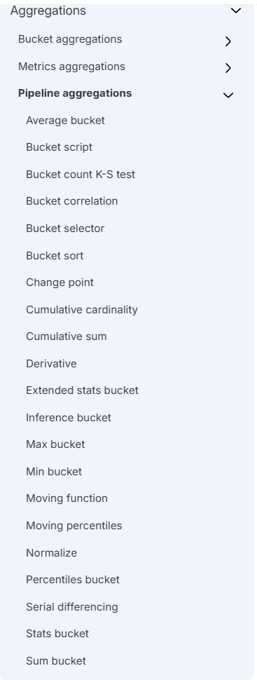

1.  导数（Derivative）​​：计算一个聚合的导数。
2.  ​累积和（Cumulative Sum）​​：计算一个聚合的累积和。
3.  ​移动平均（Moving Average）​​：计算一个聚合的移动平均。
4.  ​桶脚本（Bucket Script）​​：对多个聚合的结果进行脚本运算。
5.  ​桶选择器（Bucket Selector）​​：根据脚本条件选择桶。
6.  ​平均桶（Average Bucket）​​：计算多个桶的平均值。
7.  ​最大桶（Max Bucket）​​：找到多个桶中的最大值。
8.  ​最小桶（Min Bucket）​​：找到多个桶中的最小值。
9.  ​总和桶（Sum Bucket）​​：计算多个桶的总和。
10.  ​统计桶（Stats Bucket）​​：计算多个桶的统计信息（最小值、最大值、平均值、总和、计数）。
11.  ​扩展统计桶（Extended Stats Bucket）​​：提供更多的统计信息（方差、标准差等）。

## **2.6 Pipeline 管道聚合案例**

今天的案例还是以航班数据为主，前面已经提过：

静静等待成功，如果有报错，请检查机器磁盘是否已满：

我们先来查看下 kibana\_sample\_data\_flights 的 mapping 信息：

\# 查询 ES 索引全文搜索 mapping

GET kibana\_sample\_data\_flights/\_mapping

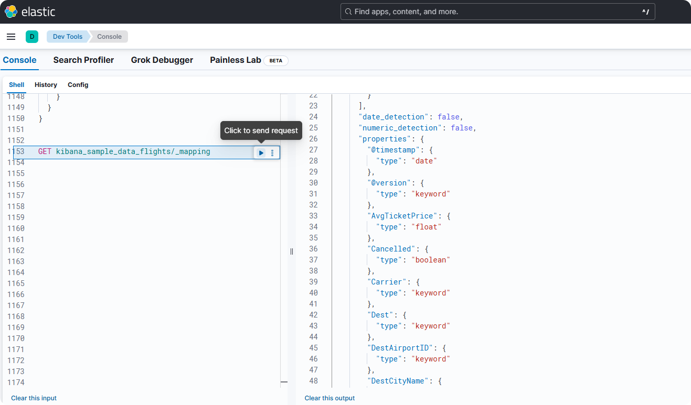

## **03 Pipeline 管道聚合深度实战**

## **3.1 Pipeline 管道聚合入门示例**

### **3.1.1 查询核心目标**

下面示例查询的目标是：​通过四层聚合架构，分析航班数据中各个目的地机场（DestAirportID）的票价分布情况，并找出所有机场中的最高平均票价（AvgTicketPrice）的机场及具体的价格。

\# Pipeline 管道聚合入门示例-分析航班数据中各个目的地机场的票价分布情况，并找出所有机场中的最高票价

GET kibana\_sample\_data\_flights/\_search

{

"size": 0,

"track\_total\_hits": true,

"aggs": {

"DestAirportID\_terms": {

"terms": {

"field": "DestAirportID",

"size": 100,

"execution\_hint": "map"

},

"aggs": {

"AvgTicketPrice\_max": {

"max": {

"field": "AvgTicketPrice"

}

}

}

},

"pipeline\_max\_bucket":{

"max\_bucket": {

"buckets\_path": "DestAirportID\_terms>AvgTicketPrice\_max"

}

}

}

}

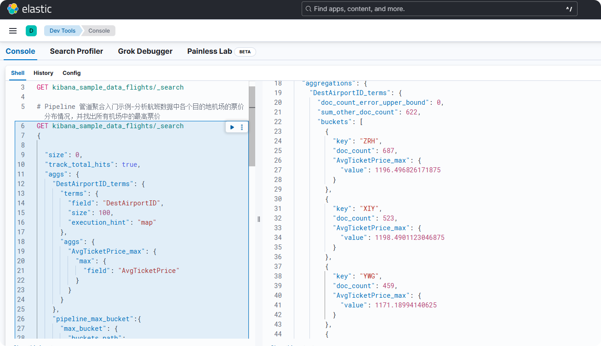

响应字段详细含义解析:

{

"took": 8, // 总耗时8毫秒

"timed\_out": false, // 未超时

"\_shards": { // 分片执行情况

"total": 1, // 1个分片

"successful": 1, // 全部成功

"skipped": 0, // 无跳过

"failed": 0 // 无失败

},

"hits": { // 命中结果

"total": {

"value": 13014, // 总文档数13014

"relation": "eq" // 精确计数

},

"max\_score": null, // 聚合查询无评分

"hits": \[\] // 不返回具体文档

},

"aggregations": { // 聚合结果

"DestAirportID\_terms": { // Level 1+2聚合结果

"doc\_count\_error\_upper\_bound": 0, // 最大文档计数误差

"sum\_other\_doc\_count": 622, // 未返回桶的文档总数

"buckets": \[ // 返回的桶列表

{

"key": "ZRH", // 机场代码

"doc\_count": 687, // 该机场航班数量

"AvgTicketPrice\_max": { // Level 2聚合结果

"value": 1196.496826171875 // 该机场最高票价

}

},

// ... 其他机场数据

\]

},

"pipeline\_max\_bucket": { // Level 4聚合结果

"value": 1198.4901123046875 // 所有机场中的最高票价

}

}

}

​具体分析维度​：

1.  ​Level 1（叶子聚合）​​：按目的地机场ID（DestAirportID）进行分组。
2.  ​Level 2（指标计算）​​：计算每个机场的最高机票价格。
3.  ​Level 4（兄弟Pipeline聚合）​​：找出所有机场中的最高票价。

​

业务价值​：

1.  识别票价最高的目的地机场
2.  分析各机场的票价分布特征
3.  为航线定价策略提供数据支持

### **3.1.2 底层架构设计**

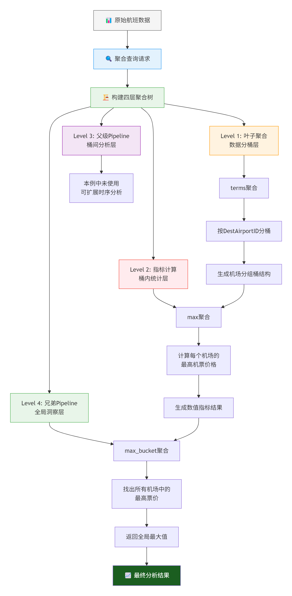

### **3.1.2.1 执行流程**

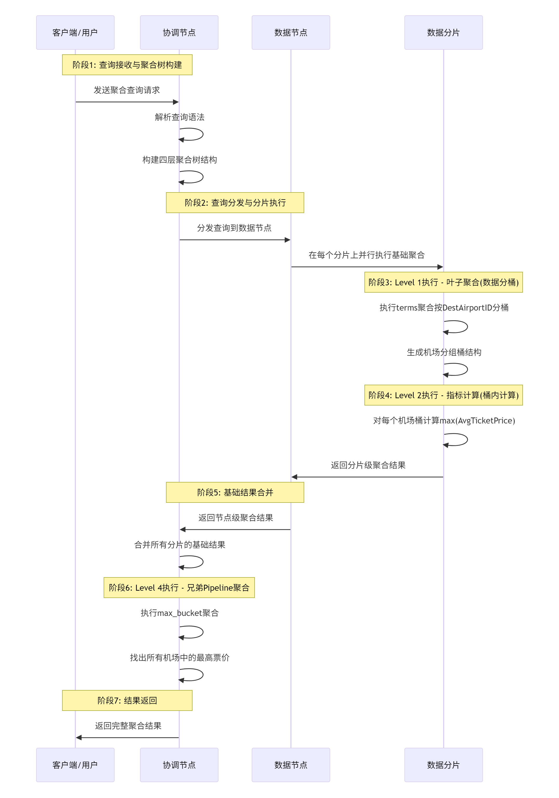

1.  用户发送聚合查询到协调节点。
2.  协调节点解析查询，构建聚合树（包括四个层级）。
3.  协调节点将查询分发到数据节点，数据节点进一步分发到分片。
4.  分片执行Level 1和Level 2的聚合（叶子聚合和指标计算），因为这两层可以在分片级别并行执行。
5.  分片将结果返回给数据节点，数据节点返回给协调节点。
6.  协调节点合并来自各个分片的结果，然后执行Level 3和Level 4的聚合（父级Pipeline和兄弟Pipeline），因为这两层需要全局数据，只能在协调节点执行。
7.  协调节点将最终结果返回给用户。

其中各层级详细执行说明：

### **1、Level 1：叶子聚合（数据分桶）**

执行位置​：各数据分片（并行执行）。

​核心功能​：数据分桶和基础分组。

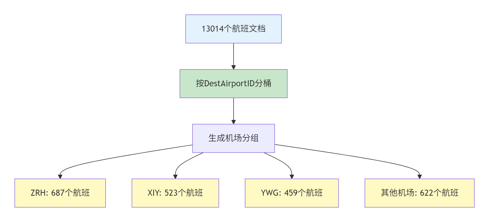

### **2、Level 2：指标计算（桶内统计）**

执行位置​：各数据分片（并行执行）。

​核心功能​：桶内指标计算和统计分析。

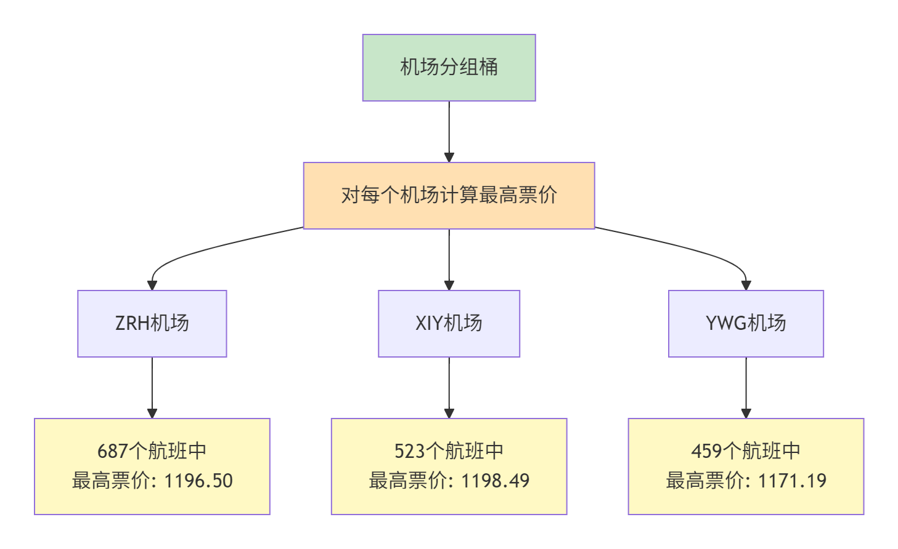

### **3、Level 4：兄弟 PipeLine 聚合（全局洞察）**

执行位置​：协调节点（集中执行）。

​核心功能​：找出全局最大值逻辑计算。

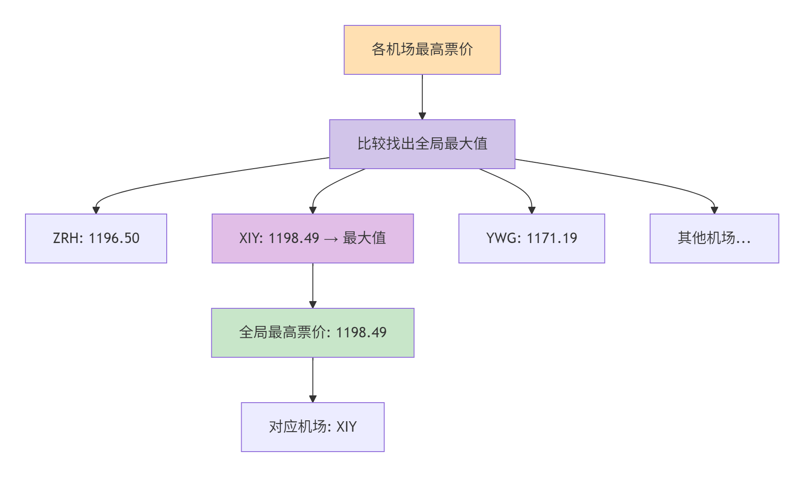

## **3.2 Pipeline 管道聚合父子关系实例**

### **3.2.1 查询核心目标**

下面示例查询的目标是：​通过四层聚合架构，对航班数据按时间维度进行多层级分析，包括基础统计和累计值计算。

\# Pipeline 管道聚合父子关系示例-对航班数据按时间维度进行多层级分析，包括基础统计和累计值计算

GET kibana\_sample\_data\_flights/\_search

{

"size": 0,

"track\_total\_hits": true,

"aggs": {

"timestamp\_date\_histogram": {

"date\_histogram": {

"field": "timestamp",

"calendar\_interval": "month"

},

"aggs": {

"AvgTicketPrice\_stats": {

"stats": {

"field": "AvgTicketPrice"

}

},

"pipeline\_sum\_bucket":{

"cumulative\_sum": {

"buckets\_path": "AvgTicketPrice\_stats.sum"

}

}

}

}

}

}

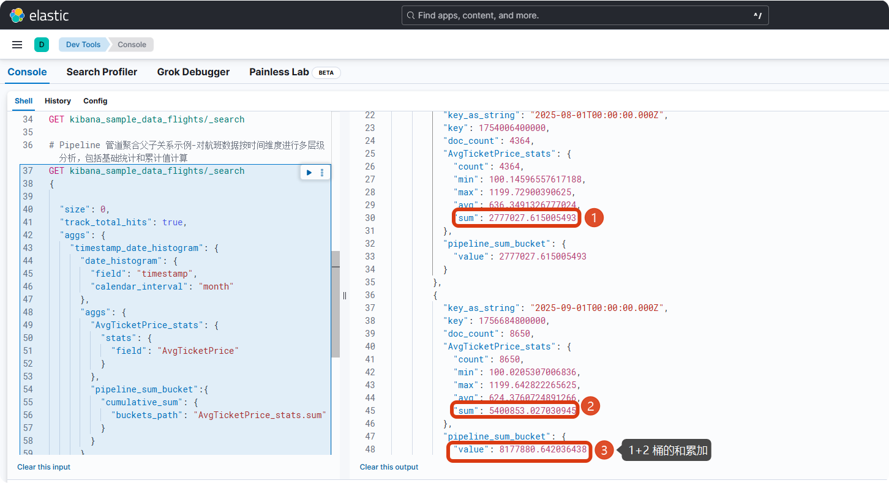

响应字段详细含义解析:

{

"took": 11, // 总耗时11毫秒

"timed\_out": false, // 未超时

"\_shards": { // 分片执行情况

"total": 1, // 1个分片

"successful": 1, // 全部成功

"skipped": 0, // 无跳过

"failed": 0 // 无失败

},

"hits": { // 命中结果

"total": {

"value": 13014, // 总文档数13014

"relation": "eq" // 精确计数

},

"max\_score": null, // 聚合查询无评分

"hits": \[\] // 不返回具体文档

},

"aggregations": { // 聚合结果

"timestamp\_date\_histogram": { // Level 1聚合结果

"buckets": \[ // 时间桶列表

{

"key\_as\_string": "2025-08-01T00:00:00.000Z", // 时间桶键(字符串)

"key": 1754006400000, // 时间桶键(时间戳)

"doc\_count": 4364, // 该月文档数量

"AvgTicketPrice\_stats": { // Level 2聚合结果

"count": 4364, // 票价数据点数

"min": 100.14596557617188, // 最低票价

"max": 1199.72900390625, // 最高票价

"avg": 636.3491326777024, // 平均票价

"sum": 2777027.615005493 // 票价总和

},

"pipeline\_sum\_bucket": { // Level 3聚合结果

"value": 2777027.615005493 // 累计票价总和(当月)

}

},

{

"key\_as\_string": "2025-09-01T00:00:00.000Z",

"key": 1756684800000,

"doc\_count": 8650,

"AvgTicketPrice\_stats": {

"count": 8650,

"min": 100.0205307006836,

"max": 1199.642822265625,

"avg": 624.3760724891266,

"sum": 5400853.027030945

},

"pipeline\_sum\_bucket": {

"value": 8177880.642036438 // 累计票价总和(前两个月总和)

}

}

\]

}

}

}

具体分析维度​：

1.  ​Level 1（叶子聚合）​​：使用date\_histogram按月份对航班数据进行时间分桶
2.  ​Level 2（指标计算）​​：使用stats聚合计算每个月的票价统计信息
3.  ​Level 3（父级Pipeline聚合）​​：使用cumulative\_sum计算票价的累计总和

​业务价值​：

1.  分析机票价格随时间的变化趋势
2.  计算累计收入指标，用于业务增长分析
3.  识别价格波动的季节性规律

### **3.2.2 底层架构设计**

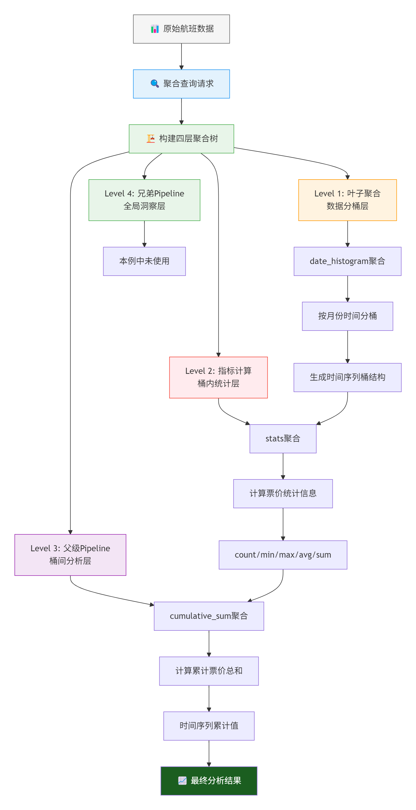

### **3.2.2.1 执行流程**

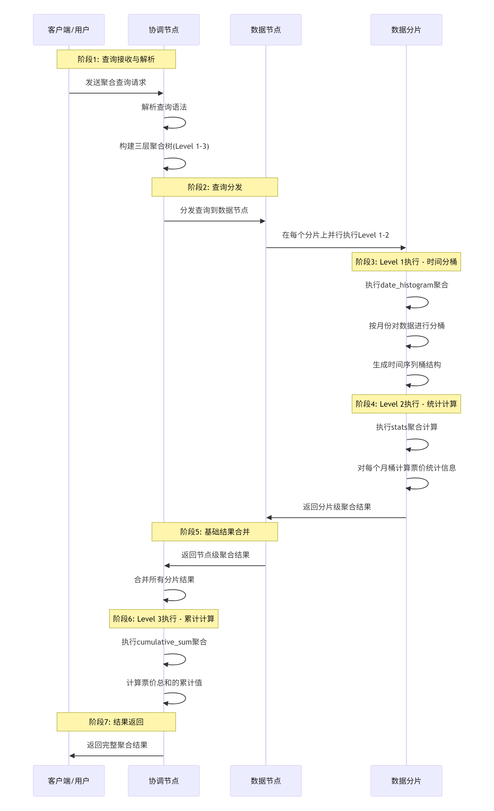

1.  客户端发送查询到协调节点。
2.  协调节点解析查询，构建聚合树（包括Level 1、Level 2和Level 3）。
3.  协调节点将查询分发到数据节点（数据节点再分发到分片）。
4.  每个分片执行Level 1和Level 2的聚合（因为Level 3是Pipeline聚合，不在分片执行）。
5.  分片将结果返回给数据节点，数据节点返回给协调节点。
6.  协调节点合并所有分片的Level 1和Level 2结果。
7.  协调节点执行Level 3的Pipeline聚合（cumulative\_sum）。
8.  协调节点将结果返回给客户端。

其中各层级详细执行说明：

### **1、Level 1：叶子聚合（时间分桶）**

执行位置​：各数据分片（并行执行）。

​核心功能​：数据分桶和基础分组。

### **2、Level 2：指标计算（统计信息）**

执行位置​：各数据分片（并行执行）。

​核心功能​：桶内指标计算和统计分析。

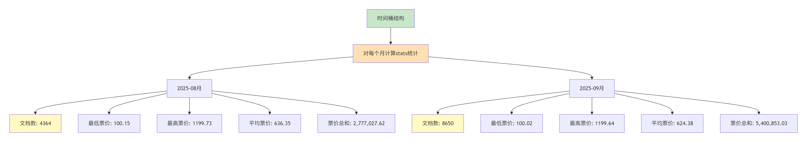

### **3、Level 3：父级 Pipeline 聚合（累计计算）**

执行位置​：协调节点（集中执行）。

​核心功能​：累计业务逻辑计算。

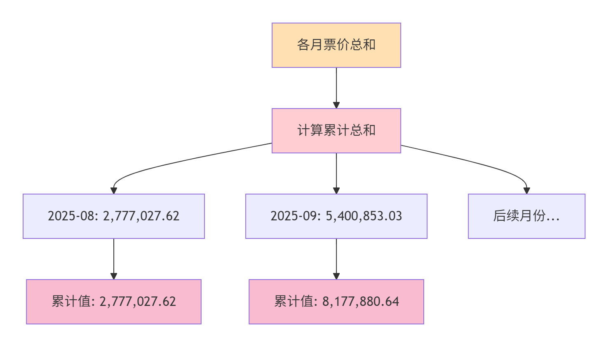

## **3.3 Pipeline 管道聚合兄弟关系实例**

### **3.3.1 查询核心目标**

下面示例查询的目标是：​通过四层聚合架构，实现"按月份和目的地机场统计航班数据，并计算最高总票价"的复杂分析需求。

\# Pipeline 管道聚合兄弟关系示例-实现"按月份和目的地机场统计航班数据，并计算最高总票价"的复杂分析需求。

GET kibana\_sample\_data\_flights/\_search

{

"size": 0,

"track\_total\_hits": true,

"aggs": {

"timestamp\_date\_histogram": {

"date\_histogram": {

"field": "timestamp",

"calendar\_interval": "month"

},

"aggs": {

"DestAirportID\_terms": {

"terms": {

"field": "DestAirportID",

"size": 10

},

"aggs": {

"AvgTicketPrice\_stats": {

"stats": {

"field": "AvgTicketPrice"

}

}

}

},

"pipeline\_level1": {

"max\_bucket": {

"buckets\_path": "DestAirportID\_terms>AvgTicketPrice\_stats.sum"

}

}

}

},

"pipeline\_level2": {

"max\_bucket": {

"buckets\_path": "timestamp\_date\_histogram>pipeline\_level1"

}

}

}

}

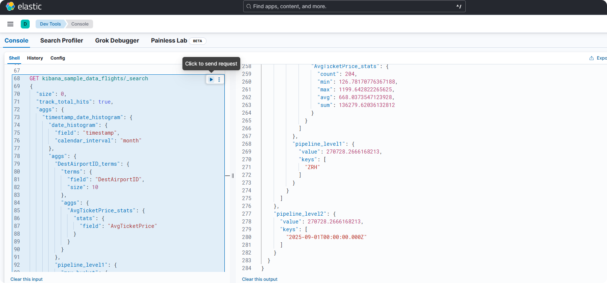

响应字段详细含义解析:

{

"took": 1, // 总耗时1毫秒

"timed\_out": false, // 未超时

"\_shards": { // 分片执行情况

"total": 1, // 1个分片

"successful": 1, // 全部成功

"skipped": 0, // 无跳过

"failed": 0 // 无失败

},

"hits": { // 命中结果

"total": {

"value": 13014, // 总文档数13014

"relation": "eq" // 精确计数

},

"max\_score": null, // 聚合查询无评分

"hits": \[\] // 不返回具体文档

},

"aggregations": { // 聚合结果

"timestamp\_date\_histogram": { // Level 1聚合结果

"buckets": \[ // 时间桶列表

{

"key\_as\_string": "2025-08-01T00:00:00.000Z", // 时间桶键

"key": 1754006400000, // 时间戳

"doc\_count": 4364, // 该月总文档数

"DestAirportID\_terms": { // Level 1子聚合-机场分组

"doc\_count\_error\_upper\_bound": 0, // 文档计数误差上限

"sum\_other\_doc\_count": 2970, // 未返回机场的文档数

"buckets": \[ // 机场桶列表

{

"key": "ZRH", // 机场代码

"doc\_count": 220, // 该机场文档数

"AvgTicketPrice\_stats": { // Level 2聚合结果

"count": 220, // 票价数据点数

"min": 105.11331939697266, // 最低票价

"max": 1187.61083984375, // 最高票价

"avg": 561.6270760969683, // 平均票价

"sum": 123557.95674133301 // 总票价(关键指标)

}

},

// ... 其他机场数据

\]

},

"pipeline\_level1": { // Level 3聚合结果

"value": 123557.95674133301, // 该月最高总票价

"keys": \["ZRH"\] // 对应机场代码

}

},

{

"key\_as\_string": "2025-09-01T00:00:00.000Z",

"key": 1756684800000,

"doc\_count": 8650,

"DestAirportID\_terms": {

"doc\_count\_error\_upper\_bound": 0,

"sum\_other\_doc\_count": 5900,

"buckets": \[

{

"key": "ZRH",

"doc\_count": 467,

"AvgTicketPrice\_stats": {

"count": 467,

"min": 101.3473129272461,

"max": 1196.496826171875,

"avg": 579.7179156677115,

"sum": 270728.2666168213 // 9月ZRH机场总票价

}

},

// ... 其他机场数据

\]

},

"pipeline\_level1": {

"value": 270728.2666168213, // 9月最高总票价

"keys": \["ZRH"\] // 对应机场代码

}

}

\]

},

"pipeline\_level2": { // Level 4聚合结果

"value": 270728.2666168213, // 所有月份中的最高总票价

"keys": \["2025-09-01T00:00:00.000Z"\] // 对应月份

}

}

}

具体分析维度​：

1.  ​Level 1（叶子聚合）​​：date\_histogram按月份分桶 + terms按目的地机场分组。
2.  ​Level 2（指标计算）​​：stats聚合计算每个机场的票价统计信息。
3.  ​Level 3（父级Pipeline聚合）​​：max\_bucket找出每月各机场中的最高总票价。
4.  ​Level 4（兄弟Pipeline聚合）​​：max\_bucket找出所有月份中的最高总票价。

​

业务价值​：

1.  识别每月哪个机场的总收入最高。
2.  找出历史最高收入的月份和机场组合。
3.  分析不同机场在不同月份的收入表现。

### **3.3.2 底层架构设计**

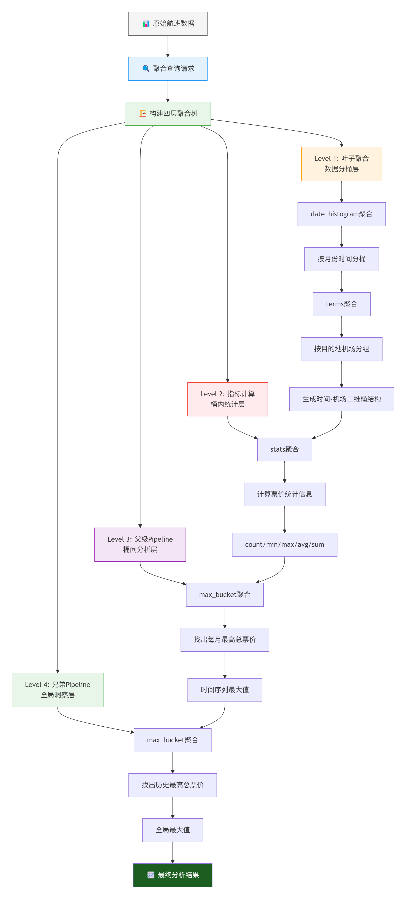

### **3.2.2.1 执行流程**

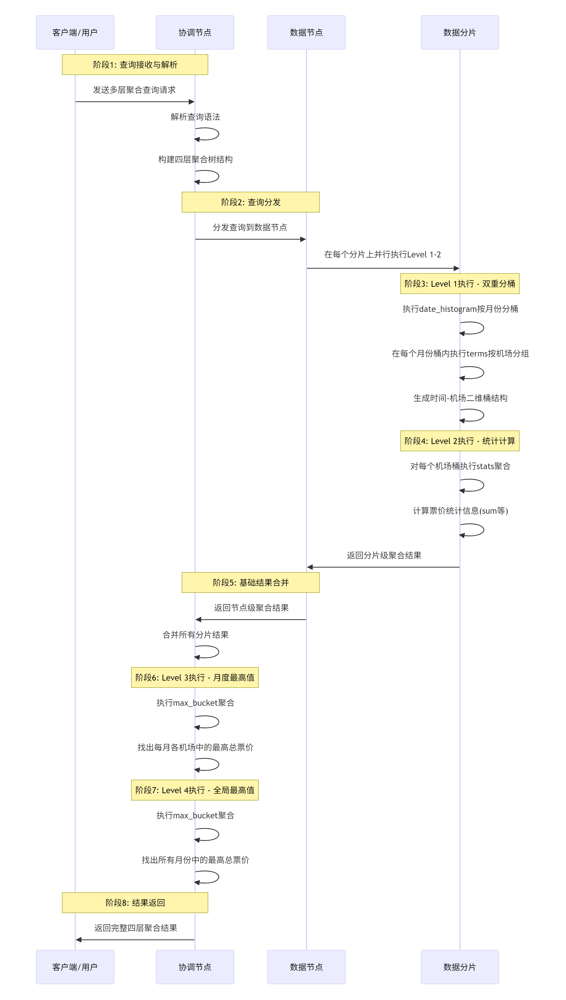

1.  用户发送聚合查询到协调节点。
2.  协调节点解析查询，构建聚合树（包括四个层级）。
3.  协调节点将查询分发到各数据节点（分片）。
4.  各分片并行执行Level 1和Level 2的聚合（即date\_histogram和terms以及stats聚合）。
5.  各分片将结果返回给协调节点。
6.  协调节点合并各分片的结果，得到完整的Level 1和Level 2聚合结果。
7.  协调节点执行Level 3聚合（即每个月份桶内的pipeline\_level1聚合）。
8.  协调节点执行Level 4聚合（即最外层的pipeline\_level2聚合）。
9.  协调节点将最终结果返回给用户。

其中各层级详细执行说明：

### **1、Level 1：叶子聚合（双重分桶）**

执行位置​：各数据分片（并行执行）。

​核心功能​：双重分桶和基础分组。

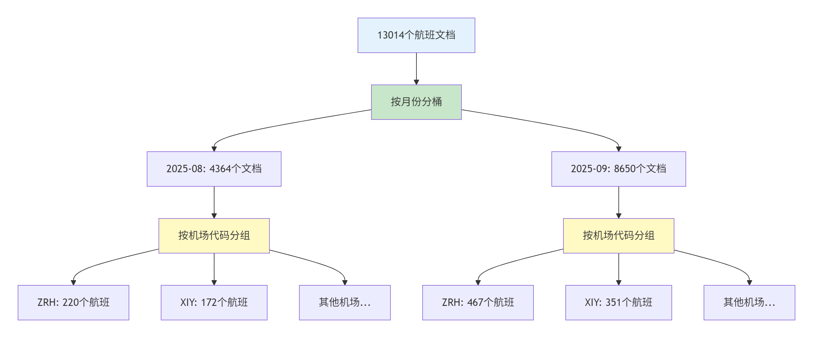

### **2、Level 2：指标计算（统计信息）**

执行位置​：各数据分片（并行执行）。

​核心功能​：桶内指标计算和统计分析。

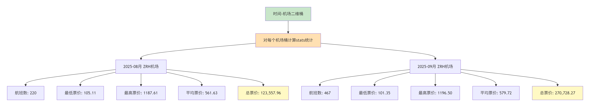

### **3、Level 3：父级 Pipeline 聚合（月度最高值）**

执行位置​：协调节点（集中执行）。

​核心功能​：月度业务逻辑计算。

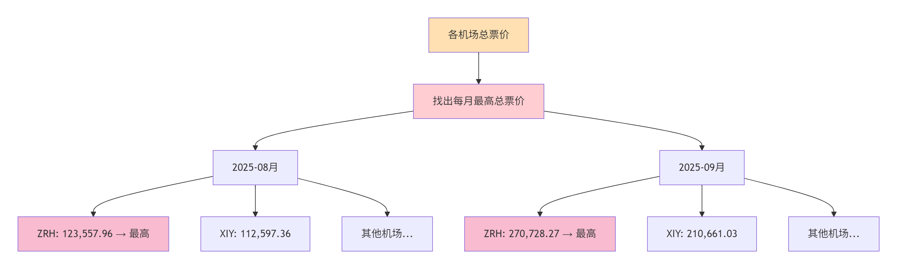

### **4、Level 4：兄弟 Pipeline 聚合（全局最高值）**

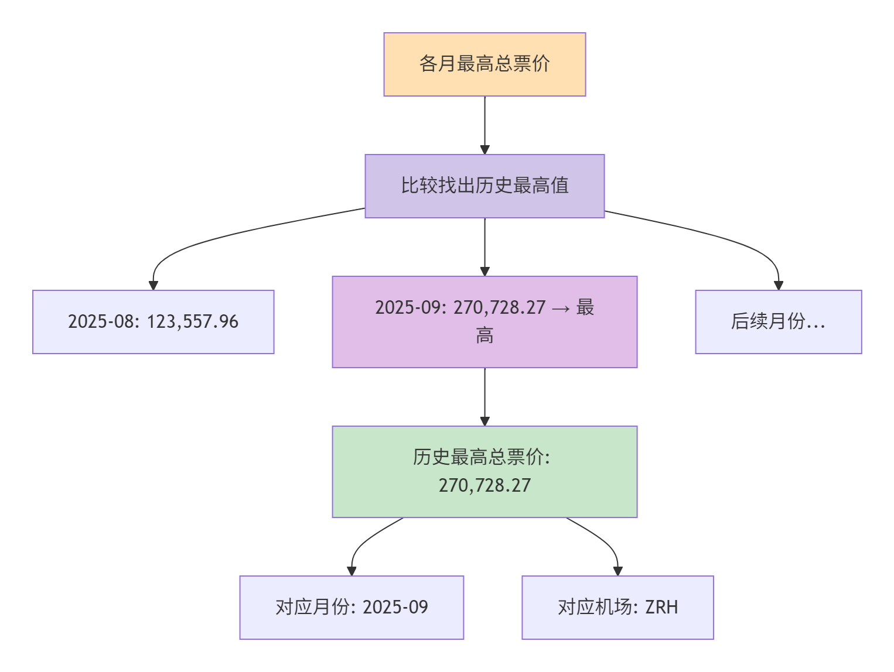

## **3.4 Pipeline 管道累计聚合实例**

### **3.4.1 查询核心目标**

下面示例查询的目标是：​通过四层聚合架构，分析航班数据中目的地机场随时间的变化趋势，特别是统计不同目的地机场的数量及其累计增长情况。

\# Pipeline 管道聚合累计统计示例-分析航班数据中目的地机场随时间的变化趋势，特别是统计不同目的地机场的数量及其累计增长情况。

GET kibana\_sample\_data\_flights/\_search

{

"size": 0,

"track\_total\_hits": true,

"aggs": {

"timestamp\_date\_histogram": {

"date\_histogram": {

"field": "timestamp",

"calendar\_interval": "month"

},

"aggs": {

"DestAirportID\_cardinality": {

"cardinality": {

"field": "DestAirportID"

}

},

"pipeline\_cumulative\_cardinality": {

"cumulative\_cardinality": {

"buckets\_path": "DestAirportID\_cardinality"

}

}

}

}

}

}

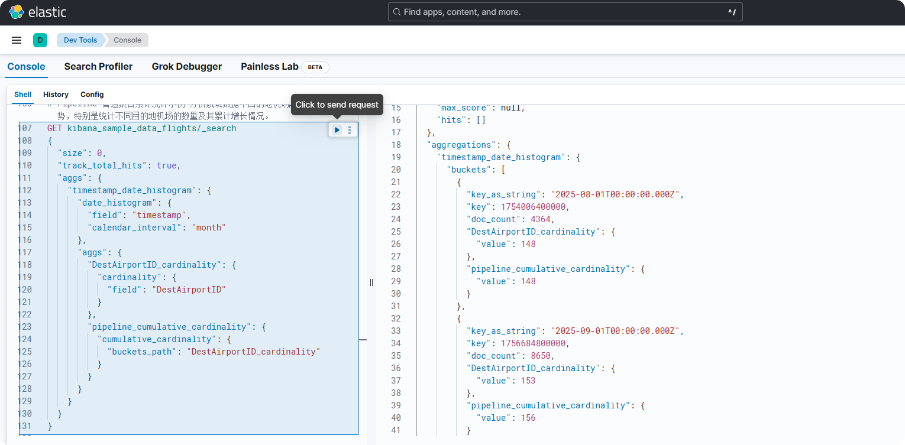

响应字段详细含义解析:

{

"took": 17, // 总耗时17毫秒

"timed\_out": false, // 未超时

"\_shards": { // 分片执行情况

"total": 1, // 1个分片

"successful": 1, // 全部成功

"skipped": 0, // 无跳过

"failed": 0 // 无失败

},

"hits": { // 命中结果

"total": {

"value": 13014, // 总文档数13014

"relation": "eq" // 精确计数

},

"max\_score": null, // 聚合查询无评分

"hits": \[\] // 不返回具体文档

},

"aggregations": { // 聚合结果

"timestamp\_date\_histogram": { // Level 1聚合结果

"buckets": \[ // 时间桶列表

{

"key\_as\_string": "2025-08-01T00:00:00.000Z", // 时间桶键(字符串)

"key": 1754006400000, // 时间桶键(时间戳)

"doc\_count": 4364, // 该月航班数量

"DestAirportID\_cardinality": { // Level 2聚合结果

"value": 148 // 该月不同目的地机场数量

},

"pipeline\_cumulative\_cardinality": { // Level 3聚合结果

"value": 148 // 累计不同目的地机场数量

}

},

{

"key\_as\_string": "2025-09-01T00:00:00.000Z",

"key": 1756684800000,

"doc\_count": 8650,

"DestAirportID\_cardinality": {

"value": 153 // 9月不同目的地机场数量

},

"pipeline\_cumulative\_cardinality": {

"value": 156 // 累计不同目的地机场数量

}

}

\]

}

}

}

具体分析维度​：

1.  ​Level 1（叶子聚合）​​：使用date\_histogram按月份对航班数据进行时间分桶。
2.  ​Level 2（指标计算）​​：使用cardinality聚合计算每月不同的目的地机场数量。
3.  ​Level 3（父子Pipeline聚合）​​：使用cumulative\_cardinality计算累计不同的目的地机场数量。

​

业务价值​：

1.  •
2.  分析航空公司航线网络的扩张情况
3.  监控新航线的开通情况
4.  评估航线网络的覆盖范围随时间的变化
5.  为航线规划提供数据支持

### **3.4.2 底层架构设计**

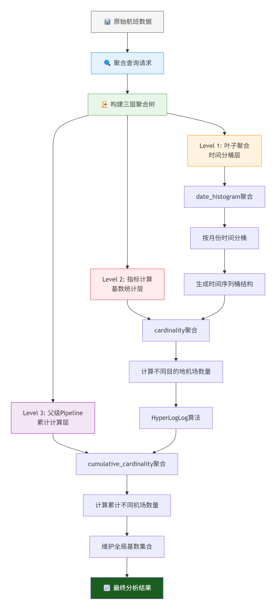

### **3.4.2.1 执行流程**

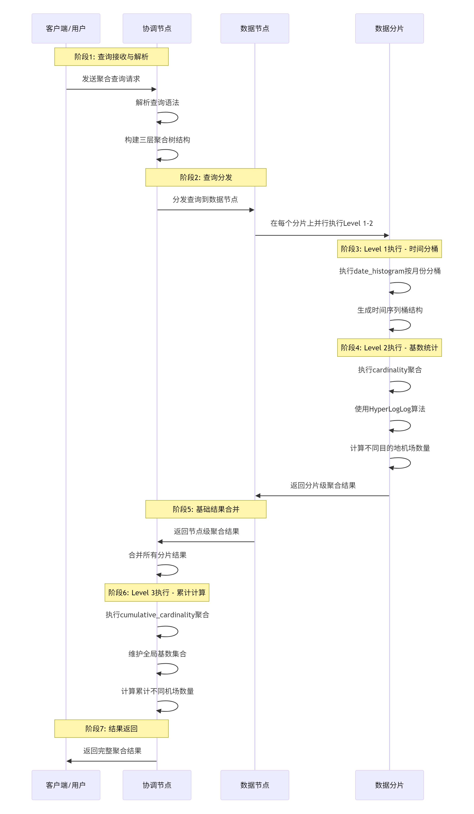

1.  用户发送聚合查询到协调节点。协调节点接收并解析查询，构建聚合树（包括四个层级）。
2.  协调节点将查询分发到数据节点，数据节点进一步分发到分片。
3.  分片执行Level 1的聚合（叶子聚合，如时间分桶）。
4.  分片执行Level 2的聚合（指标计算，如基数统计）。
5.  分片将结果返回给数据节点，数据节点返回给协调节点。协调节点合并来自各个分片的结果。
6.  协调节点执行Level 3的聚合（父级Pipeline，如累计计算）和Level 4的聚合（兄弟Pipeline），因为这两层需要全局数据，只能在协调节点执行。
7.  协调节点将最终结果返回给用户。

其中各层级详细执行说明：

### **1、Level 1：叶子聚合（时间分桶）**

执行位置​：各数据分片（并行执行）。

​核心功能​：时间分桶和基础分组。

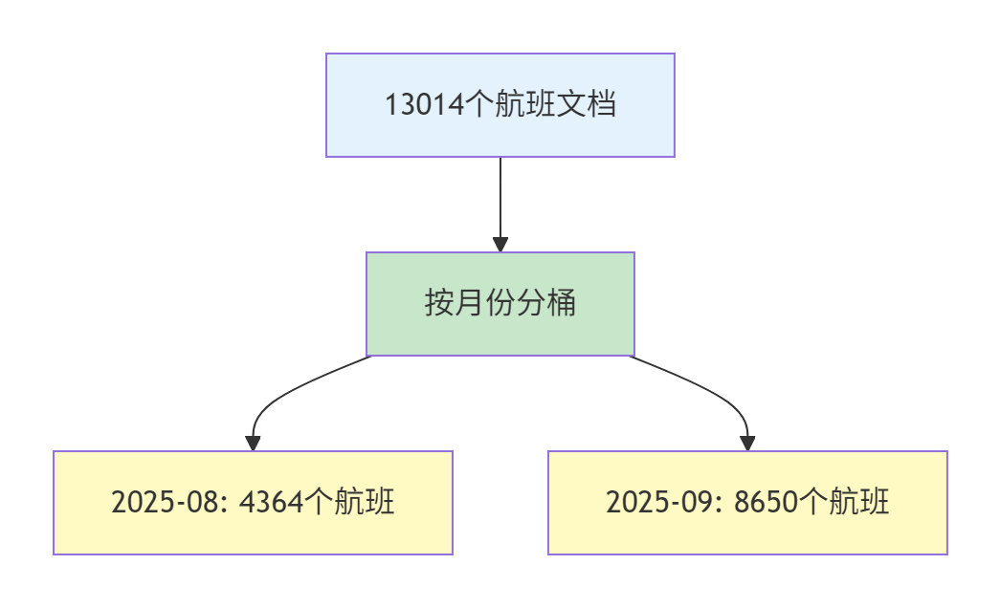

### **2、Level 2：指标计算（基数统计）**

执行位置​：各数据分片（并行执行）。

​核心功能​：桶内指标计算和统计分析。

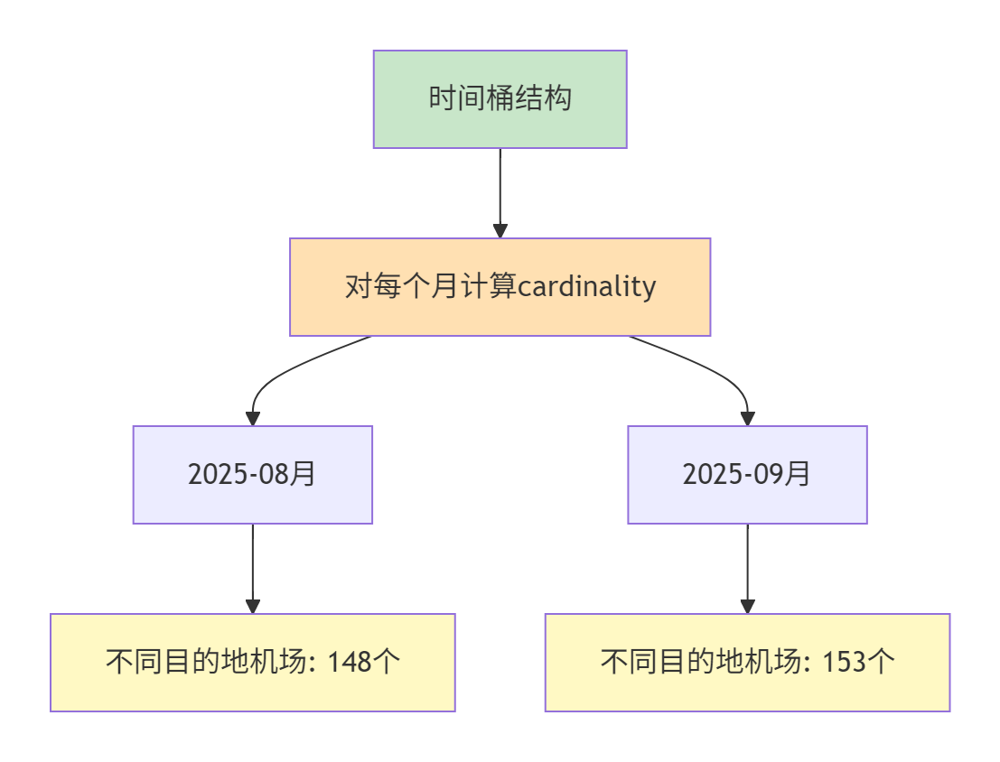

### **3、Level 3：父级 Pipeline 聚合（累计计算）**

执行位置​：协调节点（集中执行）。

​核心功能​：累计业务逻辑计算。

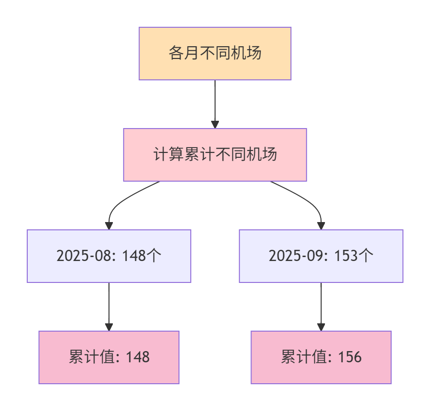

### **3.4.2.2 基数计算原理分析**

### **1、hyperLogLog 算法原理**

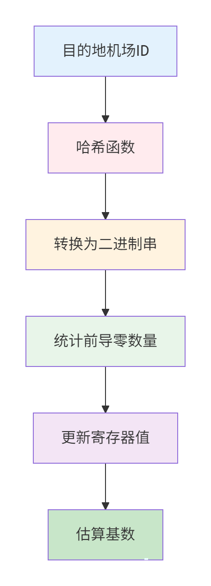

### **2、累计计数计算原理**

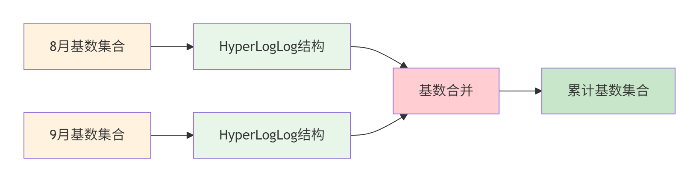

## **3.5 Pipeline 管道滑动窗口聚合实例**

实战之前，先来看下滑动窗口的基本概念：

1.  基于一定的窗口函数，计算窗口内的数据值。
2.  在大数据分析场景中，经常出现如Flink/Spark中所谓的实时计算。

### **3.5.1 查询核心目标**

下面示例查询的目标是：​通过三层聚合架构，分析航班数据中机票价格随时间的变化趋势，并计算移动总和来观察价格波动的短期趋势。

\# Pipeline 管道聚合滑动窗口示例-分析航班数据中机票价格随时间的变化趋势，并计算移动总和来观察价格波动的短期趋势。

GET kibana\_sample\_data\_flights/\_search

{

"size": 0,

"track\_total\_hits": true,

"aggs": {

"timestamp\_date\_histogram": {

"date\_histogram": {

"field": "timestamp",

"calendar\_interval": "month"

},

"aggs": {

"AvgTicketPrice\_stats": {

"stats": {

"field": "AvgTicketPrice"

}

},

"pipeline\_moving\_fn": {

"moving\_fn": {

"window": 2,

"script": "MovingFunctions.sum(values)",

"buckets\_path": "AvgTicketPrice\_stats.sum"

}

}

}

}

}

}

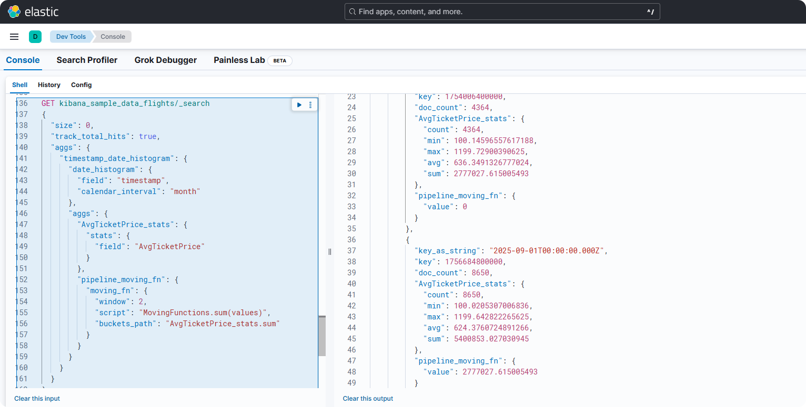

响应字段详细含义解析:

{

"took": 2, // 总耗时2毫秒

"timed\_out": false, // 未超时

"\_shards": { // 分片执行情况

"total": 1, // 1个分片

"successful": 1, // 全部成功

"skipped": 0, // 无跳过

"failed": 0 // 无失败

},

"hits": { // 命中结果

"total": {

"value": 13014, // 总文档数13014

"relation": "eq" // 精确计数

},

"max\_score": null, // 聚合查询无评分

"hits": \[\] // 不返回具体文档

},

"aggregations": { // 聚合结果

"timestamp\_date\_histogram": { // Level 1聚合结果

"buckets": \[ // 时间桶列表

{

"key\_as\_string": "2025-08-01T00:00:00.000Z", // 时间桶键(字符串)

"key": 1754006400000, // 时间桶键(时间戳)

"doc\_count": 4364, // 该月航班数量

"AvgTicketPrice\_stats": { // Level 2聚合结果

"count": 4364, // 票价数据点数

"min": 100.14596557617188, // 最低票价

"max": 1199.72900390625, // 最高票价

"avg": 636.3491326777024, // 平均票价

"sum": 2777027.615005493 // 票价总和(关键指标)

},

"pipeline\_moving\_fn": { // Level 3聚合结果

"value": 0 // 移动总和(窗口不足时返回0)

}

},

{

"key\_as\_string": "2025-09-01T00:00:00.000Z",

"key": 1756684800000,

"doc\_count": 8650,

"AvgTicketPrice\_stats": {

"count": 8650,

"min": 100.0205307006836,

"max": 1199.642822265625,

"avg": 624.3760724891266,

"sum": 5400853.027030945 // 9月票价总和

},

"pipeline\_moving\_fn": {

"value": 2777027.615005493 // 移动总和(8月+9月总和)

}

}

\]

}

}

}

具体分析维度​：

1.  ​Level 1（叶子聚合）​​：date\_histogram按月份对航班数据进行时间分桶。
2.  ​Level 2（指标计算）​​：使用stats聚合计算每个月的票价统计信息。
3.  ​Level 3（父级Pipeline聚合）​​：使用moving\_fn计算票价的移动总和。

​

业务价值​：

1.  分析机票价格的月度变化趋势。
2.  计算移动总和以观察价格短期波动。
3.  识别价格变化的季节性规律。
4.  为票价策略调整提供数据支持。

###   
**3.5.2 底层架构设计**

  
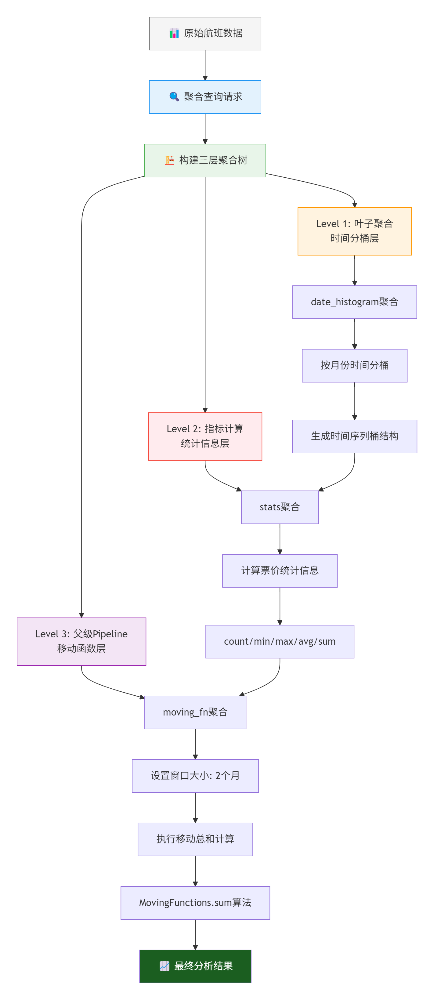

### **3.5.2.1 执行流程**

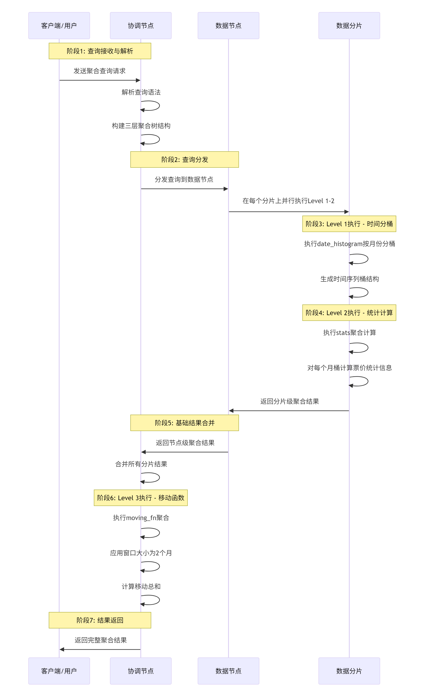

1.  用户发送聚合查询到协调节点。
2.  协调节点解析查询，构建聚合树（包括四个层级）。
3.  协调节点将查询分发到各数据节点（分片）。
4.  各分片并行执行Level 1和Level 2的聚合（即date\_histogram和 stats聚合）。
5.  各分片将结果返回给协调节点。
6.  协调节点合并各分片的结果，得到完整的Level 1和Level 2聚合结果。
7.  协调节点执行Level 3聚合（即移动函数聚合）。
8.  协调节点将最终结果返回给用户。

> 注意：由于moving\_fn是父级Pipeline聚合，它依赖于前一桶的结果，因此必须在协调节点执行。

其中各层级详细执行说明：

### **1、Level 1：叶子聚合（时间分桶）**

执行位置​：各数据分片（并行执行）。

​核心功能​：时间分桶和基础分组。

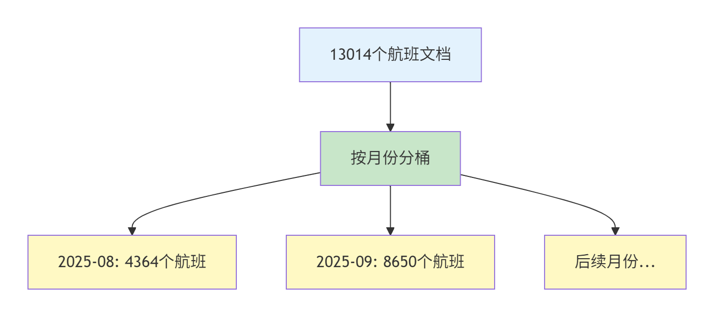

### **2、Level 2：指标计算（统计信息）**

执行位置​：各数据分片（并行执行）。

​核心功能​：桶内指标计算和统计分析。

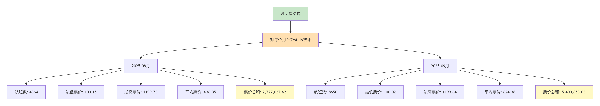

### **3、Level 3：父级 Pipeline 聚合（移动函数）**

执行位置​：协调节点（集中执行）。

​核心功能​：移动函数逻辑计算。

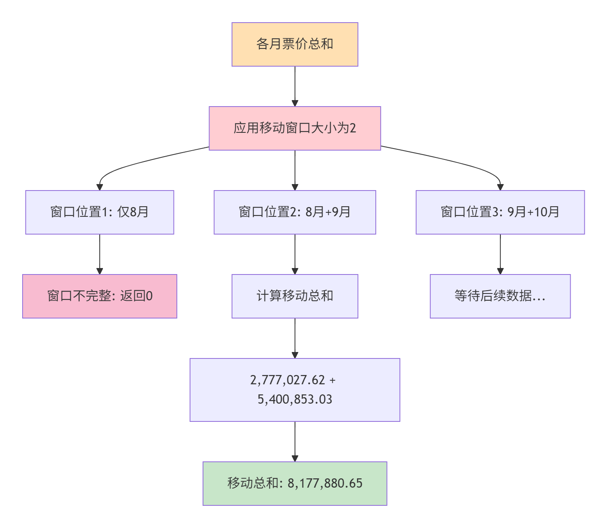

### **3.5.2.2 移动总和计算原理**

### **1、窗口为2 的移动总和计算**

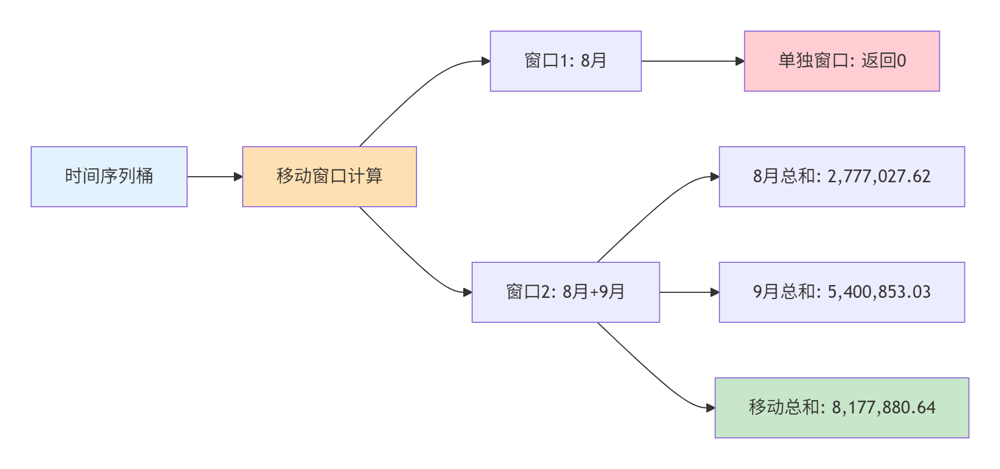

### **2、移动函数执行流程**

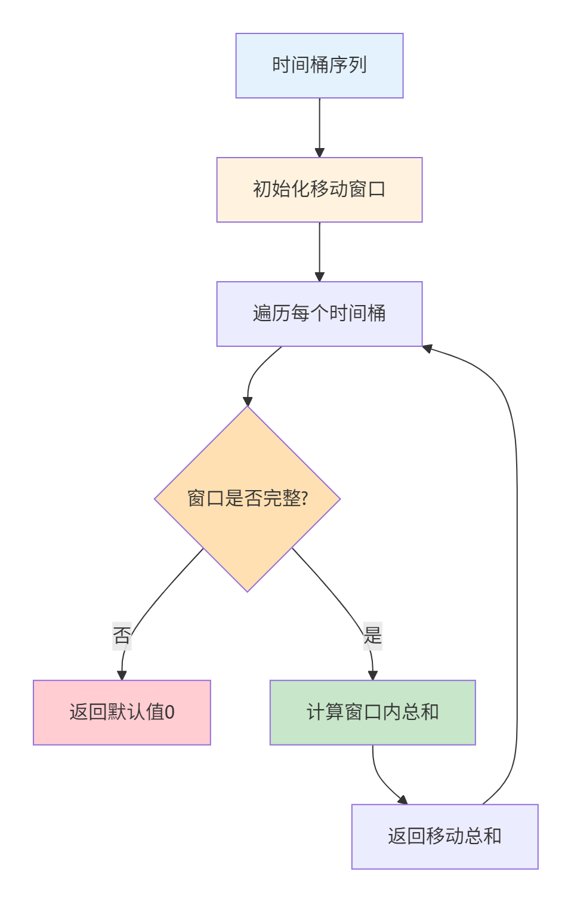

## **3.6 Pipeline 管道差值聚合实例**

### **3.6.1 查询核心目标**

下面示例查询的目标是：​通过三层聚合架构，分析航班数据中机票价格总和的月度变化情况，特别关注相邻月份之间的差异变化

\# Pipeline 管道聚合差值示例-分析航班数据中机票价格总和的月度变化情况，特别关注相邻月份之间的差异变化。

GET kibana\_sample\_data\_flights/\_search

{

"size": 0,

"track\_total\_hits": true,

"aggs": {

"timestamp\_date\_histogram": {

"date\_histogram": {

"field": "timestamp",

"calendar\_interval": "month"

},

"aggs": {

"AvgTicketPrice\_stats": {

"stats": {

"field": "AvgTicketPrice"

}

},

"pipeline\_serial\_diff": {

"serial\_diff": {

"lag": 1,

"buckets\_path": "AvgTicketPrice\_stats.sum",

"gap\_policy": "insert\_zeros"

}

}

}

}

}

}

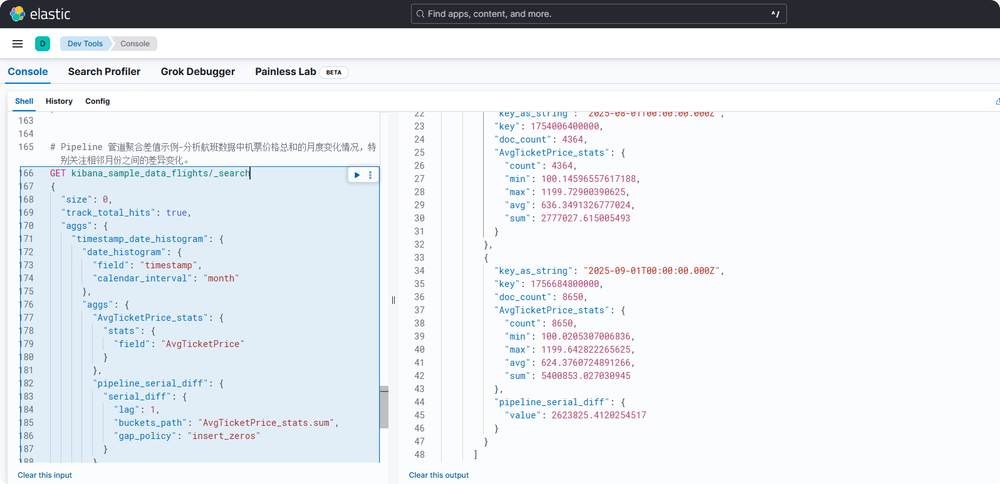

响应字段详细含义解析:

{

"took": 3, // 总耗时3毫秒

"timed\_out": false, // 未超时

"\_shards": { // 分片执行情况

"total": 1, // 1个分片

"successful": 1, // 全部成功

"skipped": 0, // 无跳过

"failed": 0 // 无失败

},

"hits": { // 命中结果

"total": {

"value": 13014, // 总文档数13014

"relation": "eq" // 精确计数

},

"max\_score": null, // 聚合查询无评分

"hits": \[\] // 不返回具体文档

},

"aggregations": { // 聚合结果

"timestamp\_date\_histogram": { // Level 1聚合结果

"buckets": \[ // 时间桶列表

{

"key\_as\_string": "2025-08-01T00:00:00.000Z", // 时间桶键

"key": 1754006400000, // 时间戳

"doc\_count": 4364, // 该月航班数量

"AvgTicketPrice\_stats": { // Level 2聚合结果

"count": 4364, // 票价数据点数

"min": 100.14596557617188, // 最低票价

"max": 1199.72900390625, // 最高票价

"avg": 636.3491326777024, // 平均票价

"sum": 2777027.615005493 // 票价总和(关键指标)

}

// 注意：第一个桶没有serial\_diff结果，因为lag=1需要前一个桶的数据

},

{

"key\_as\_string": "2025-09-01T00:00:00.000Z",

"key": 1756684800000,

"doc\_count": 8650,

"AvgTicketPrice\_stats": {

"count": 8650,

"min": 100.0205307006836,

"max": 1199.642822265625,

"avg": 624.3760724891266,

"sum": 5400853.027030945 // 9月票价总和

},

"pipeline\_serial\_diff": { // Level 3聚合结果

"value": 2623825.4120254517 // 序列差异值(9月-8月)

}

}

\]

}

}

}

具体分析维度​：

1.  ​Level 1（叶子聚合）​​：使用date\_histogram按月份对航班数据进行时间分桶。
2.  ​Level 2（指标计算）​​：使用stats聚合计算每个月的票价统计信息。
3.  ​Level 3（父级Pipeline聚合）​​：使用serial\_diff计算相邻月份总和的差异。

​

业务价值​：

1.  分析机票收入月度变化趋势。
2.  识别收入增长的波动情况。
3.  监控业务增长的稳定性。
4.  为收入预测和业务规划提供数据支持。

### **3.6.2 底层架构设计**

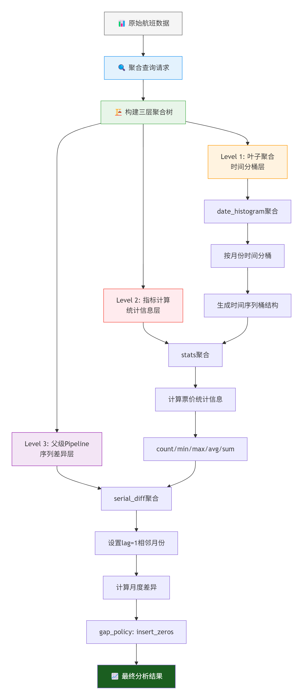

### **3.6.2.1 执行流程**

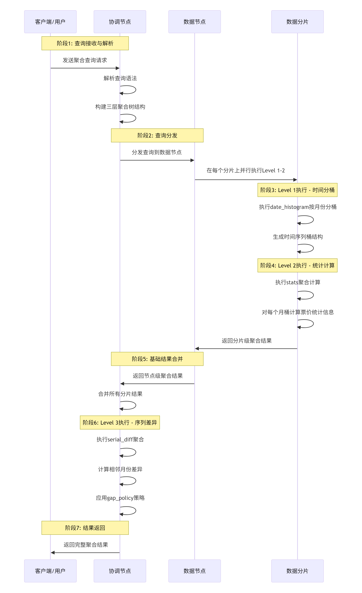

1.  用户发送聚合查询到协调节点。
2.  协调节点解析查询，构建三层聚合树（Level 1: date\_histogram, Level 2: stats, Level 3: serial\_diff）。
3.  协调节点将查询分发到数据节点，数据节点进一步分发到分片。
4.  分片并行执行Level 1和Level 2的聚合（date\_histogram和stats）。
5.  分片将结果返回给数据节点，数据节点返回给协调节点。
6.  协调节点合并所有分片的结果，然后执行Level 3的聚合（serial\_diff），因为需要全局数据。
7.  协调节点将最终结果返回给用户。

> 注意：由于serial\_diff是父级Pipeline聚合，它需要在协调节点上执行，因为它依赖于前一个桶的数据。

其中各层级详细执行说明：

### **1、Level 1：叶子聚合（时间分桶）**

执行位置​：各数据分片（并行执行）。

​核心功能​：数据分桶和基础分组。

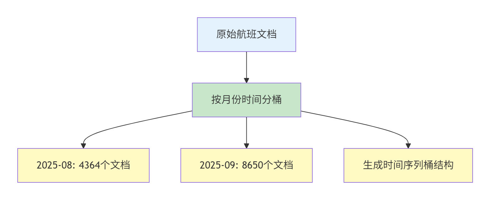

### **2、Level 2：指标计算（统计信息）**

执行位置​：各数据分片（并行执行）。

​核心功能​：桶内指标计算和统计分析。

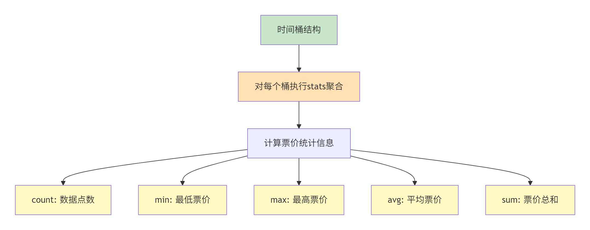

### **3、Level 3：父级 Pipeline 聚合（序列差异）**

执行位置​：协调节点（集中执行）。

​核心功能​：桶间关系分析和时序差异计算。

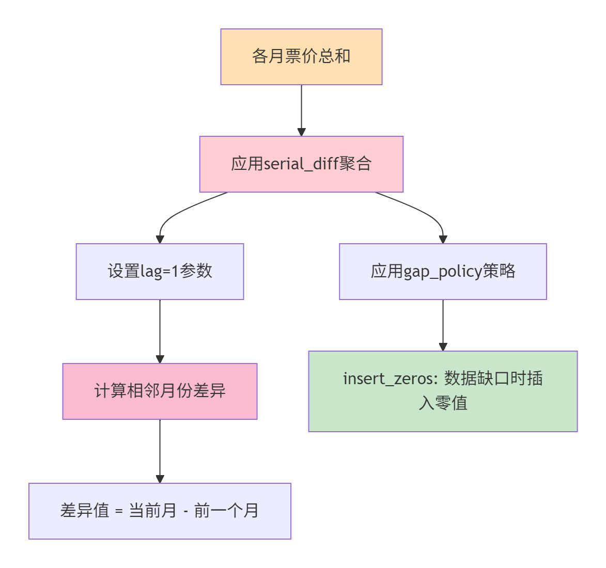

### **3.6.2.2 序列差异计算原理**

### **1、serial\_diff 聚合工作原理**

### **2、serial\_diff 聚合具体计算过程**

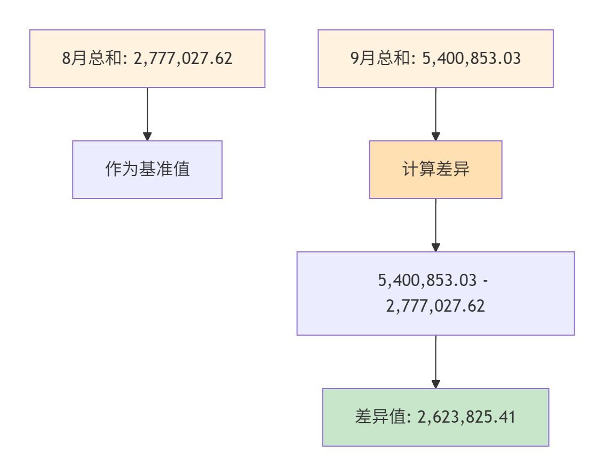

## **3.7 Pipeline 管道聚合 Script 实例**

### **3.7.1 查询核心目标**

下面示例查询的目标是：​通过三层聚合架构，分析航班数据中机票价格总和的月度变化情况，特别关注相邻月份之间的差异变化。

\# Pipeline 管道聚合script示例-对航班数据按月份分组统计票价信息，并使用脚本计算对统计结果进行自定义转换。

GET kibana\_sample\_data\_flights/\_search

{

"size": 0,

"track\_total\_hits": true,

"aggs": {

"timestamp\_date\_histogram": {

"date\_histogram": {

"field": "timestamp",

"calendar\_interval": "month"

},

"aggs": {

"AvgTicketPrice\_stats": {

"stats": {

"field": "AvgTicketPrice"

}

},

"pipeline\_script": {

"bucket\_script": {

"buckets\_path": {

"sum": "AvgTicketPrice\_stats.sum"

},

"script": """

params.sum \* 100;

""",

"gap\_policy": "skip"

}

}

}

}

}

}

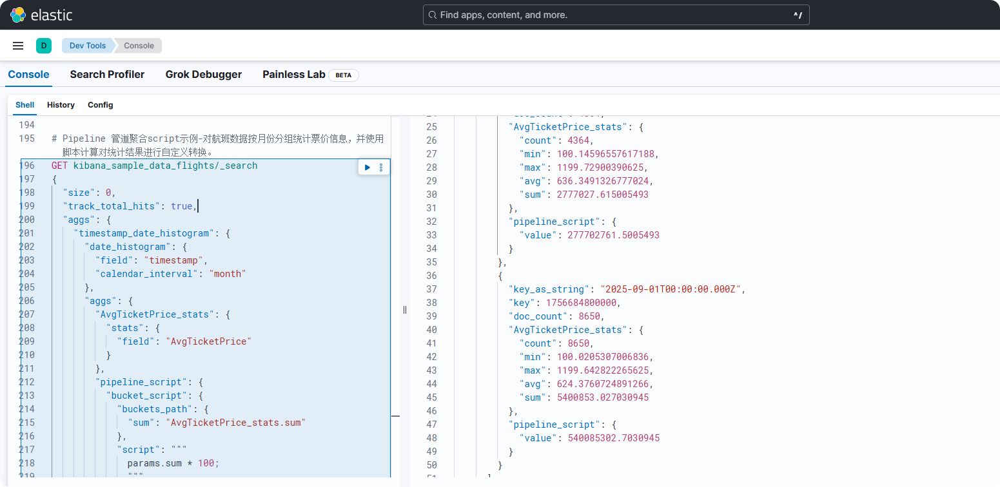

响应字段详细含义解析:

{

"took": 29, // 总耗时29毫秒

"timed\_out": false, // 未超时

"\_shards": { // 分片执行情况

"total": 1, // 1个分片

"successful": 1, // 全部成功

"skipped": 0, // 无跳过

"failed": 0 // 无失败

},

"hits": { // 命中结果

"total": {

"value": 13014, // 总文档数13014

"relation": "eq" // 精确计数

},

"max\_score": null, // 聚合查询无评分

"hits": \[\] // 不返回具体文档

},

"aggregations": { // 聚合结果

"timestamp\_date\_histogram": { // Level 1聚合结果

"buckets": \[ // 时间桶列表

{

"key\_as\_string": "2025-08-01T00:00:00.000Z", // 时间桶键(字符串)

"key": 1754006400000, // 时间桶键(时间戳)

"doc\_count": 4364, // 该月航班数量

"AvgTicketPrice\_stats": { // Level 2聚合结果

"count": 4364, // 票价数据点数

"min": 100.14596557617188, // 最低票价

"max": 1199.72900390625, // 最高票价

"avg": 636.3491326777024, // 平均票价

"sum": 2777027.615005493 // 票价总和(原始值)

},

"pipeline\_script": { // Level 3聚合结果

"value": 277702761.5005493 // 脚本计算结果(sum \* 100)

}

},

{

"key\_as\_string": "2025-09-01T00:00:00.000Z",

"key": 1756684800000,

"doc\_count": 8650,

"AvgTicketPrice\_stats": {

"count": 8650,

"min": 100.0205307006836,

"max": 1199.642822265625,

"avg": 624.3760724891266,

"sum": 5400853.027030945 // 9月票价总和

},

"pipeline\_script": {

"value": 540085302.7030945 // 脚本计算结果(sum \* 100)

}

}

\]

}

}

}

具体分析维度​：

1.  ​Level 1（叶子聚合）​​：使用date\_histogram按月份对航班数据进行时间分桶。
2.  ​Level 2（指标计算）​​：使用stats聚合计算每个月的票价统计信息。
3.  ​Level 3（父级Pipeline聚合）​​：使用bucket\_script对票价总和进行自定义计算（乘以100）。

​

业务价值​：

1.  分析机票价格的月度分布情况。
2.  对原始数据进行标准化转换（放大100倍）。
3.  为数据可视化和报表生成提供预处理数据。
4.  支持自定义业务逻辑的数据转换。

### **3.7.2 底层架构设计**

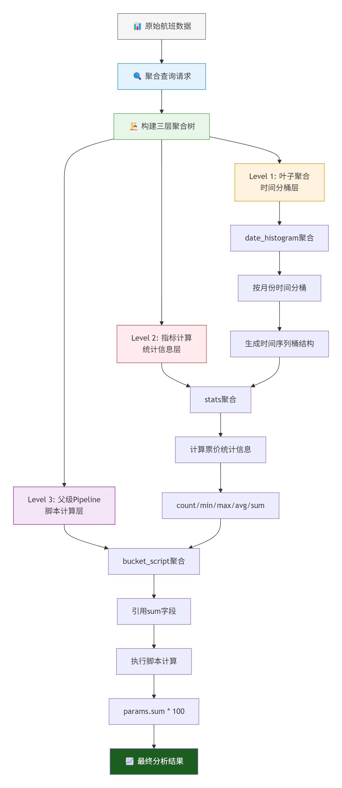

### **3.7.2.1 执行流程**

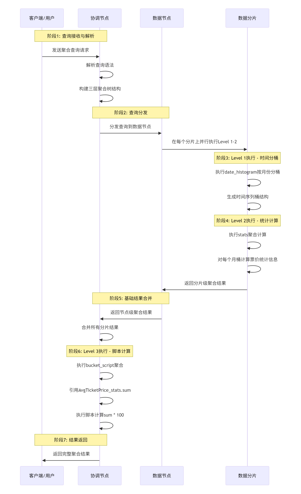

1.  用户发送聚合查询到协调节点。
2.  协调节点解析查询，构建三层聚合树（Level 1: date\_histogram, Level 2: stats, Level 3: script）。
3.  协调节点将查询分发到数据节点，数据节点进一步分发到分片。
4.  分片并行执行Level 1和Level 2的聚合（date\_histogram和stats）。
5.  分片将结果返回给数据节点，数据节点返回给协调节点。
6.  协调节点合并所有分片的结果，然后执行Level 3的聚合（script），因为需要全局数据。
7.  协调节点将最终结果返回给用户。

其中各层级详细执行说明：

### **1、Level 1：叶子聚合（时间分桶）**

执行位置​：各数据分片（并行执行）。

​核心功能​：数据分桶和基础分组。

### **2、Level 2：指标计算（统计信息）**

执行位置​：各数据分片（并行执行）。

​核心功能​：桶内指标计算和统计分析。

### **3、Level 3：父级 Pipeline 聚合（脚本计算）**

执行位置​：协调节点（集中执行）。

​核心功能​：自定义数据转换和业务逻辑计算。

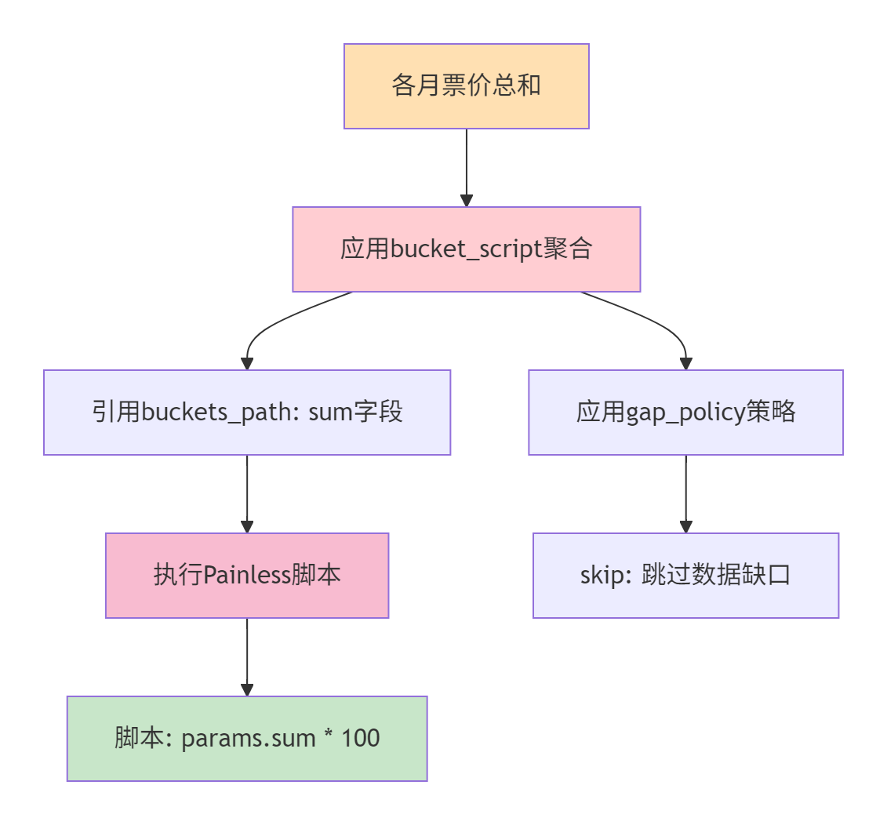

### **3.7.2.2 脚本计算原理分析**

### **1、bucket\_script 聚合工作原理**

### **2、具体计算过程**

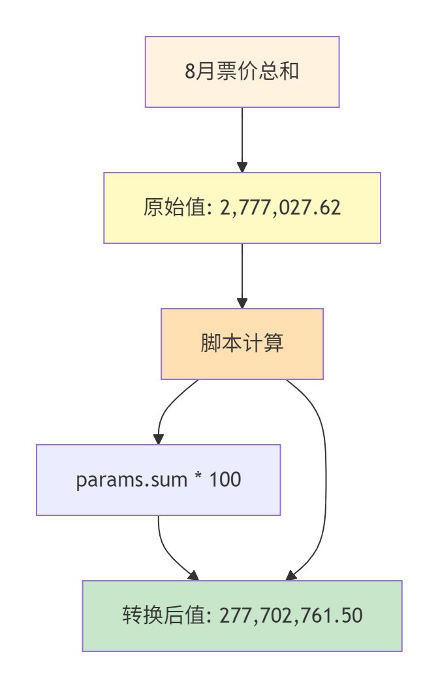

## **3.8 Pipeline 管道聚合 Selector 分桶实例**

### **3.8.1 查询核心目标**

下面示例查询的目标是：​通过三层聚合架构，对航班数据按月份分组统计票价信息，并使用桶选择器筛选出符合特定条件的月份数据。

\# Pipeline 管道聚合selector示例-对航班数据按月份分组统计票价信息，并使用桶选择器筛选出符合特定条件的月份数据。

GET kibana\_sample\_data\_flights/\_search

{

"size": 0,

"track\_total\_hits": true,

"aggs": {

"timestamp\_date\_histogram": {

"date\_histogram": {

"field": "timestamp",

"calendar\_interval": "month"

},

"aggs": {

"AvgTicketPrice\_stats": {

"stats": {

"field": "AvgTicketPrice"

}

},

"pipeline\_selector": {

"bucket\_selector": {

"buckets\_path": {

"sum": "AvgTicketPrice\_stats.sum"

},

"script": """

params.sum > 0;

""",

"gap\_policy": "insert\_zeros"

}

}

}

}

}

}

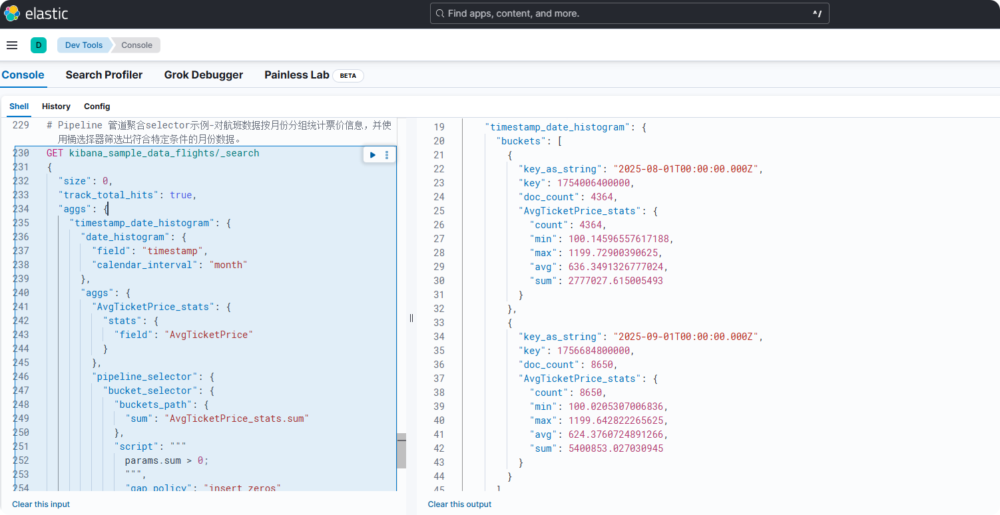

响应字段详细含义解析:

{

"took": 13, // 总耗时13毫秒

"timed\_out": false, // 未超时

"\_shards": { // 分片执行情况

"total": 1, // 1个分片

"successful": 1, // 全部成功

"skipped": 0, // 无跳过

"failed": 0 // 无失败

},

"hits": { // 命中结果

"total": {

"value": 13014, // 总文档数13014

"relation": "eq" // 精确计数

},

"max\_score": null, // 聚合查询无评分

"hits": \[\] // 不返回具体文档

},

"aggregations": { // 聚合结果

"timestamp\_date\_histogram": { // Level 1聚合结果

"buckets": \[ // 时间桶列表（已筛选）

{

"key\_as\_string": "2025-08-01T00:00:00.000Z", // 时间桶键(字符串)

"key": 1754006400000, // 时间桶键(时间戳)

"doc\_count": 4364, // 该月航班数量

"AvgTicketPrice\_stats": { // Level 2聚合结果

"count": 4364, // 票价数据点数

"min": 100.14596557617188, // 最低票价

"max": 1199.72900390625, // 最高票价

"avg": 636.3491326777024, // 平均票价

"sum": 2777027.615005493 // 票价总和（满足筛选条件）

}

// 注意：pipeline\_selector不返回具体值，只用于过滤

},

{

"key\_as\_string": "2025-09-01T00:00:00.000Z",

"key": 1756684800000,

"doc\_count": 8650,

"AvgTicketPrice\_stats": {

"count": 8650,

"min": 100.0205307006836,

"max": 1199.642822265625,

"avg": 624.3760724891266,

"sum": 5400853.027030945 // 票价总和（满足筛选条件）

}

}

\]

}

}

}

具体分析维度​：

1.  ​Level 1（叶子聚合）​​：使用date\_histogram按月份对航班数据进行时间分桶。
2.  ​Level 2（指标计算）​​：使用stats聚合计算每个月的票价统计信息。
3.  ​Level 3（父级Pipeline聚合）​​：使用bucket\_selector筛选票价总和大于0的月份。

​

业务价值​：

1.  分析机票价格的月度分布情况。
2.  筛选出有实际业务数据的月份（排除空数据）。
3.  为后续分析提供高质量的数据集。
4.  支持动态数据过滤和条件筛选。

### **3.8.2 底层架构设计**

### **3.8.2.1 执行流程**

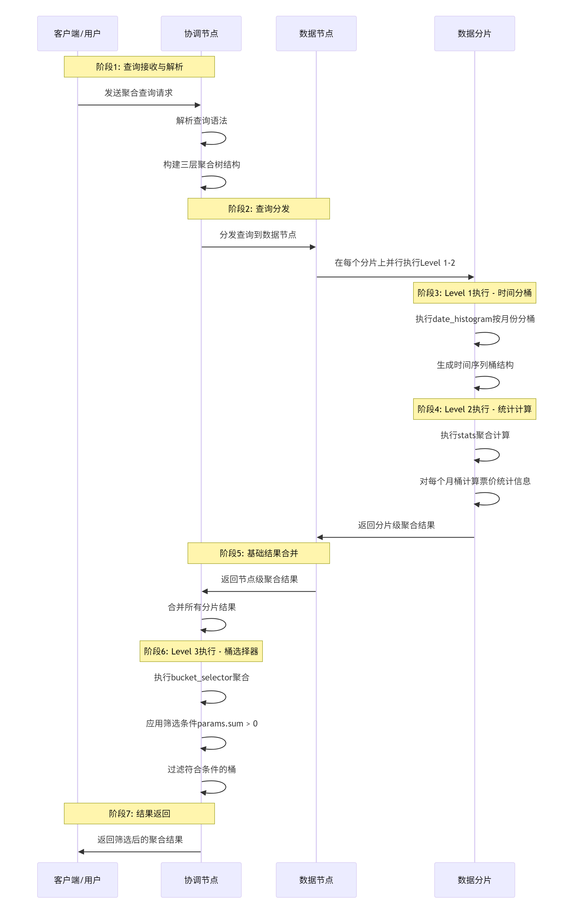

1.  用户发送聚合查询到协调节点。
2.  协调节点解析查询，构建三层聚合树（Level 1: date\_histogram, Level 2: stats, Level 3: script）。
3.  协调节点将查询分发到数据节点，数据节点进一步分发到分片。
4.  分片并行执行Level 1和Level 2的聚合（date\_histogram和stats）。
5.  分片将结果返回给数据节点，数据节点返回给协调节点。
6.  协调节点合并所有分片的结果，然后执行Level 3的聚合（selector），因为需要全局数据。
7.  协调节点将最终结果返回给用户。

其中各层级详细执行说明：

### **1、Level 1：叶子聚合（时间分桶）**

执行位置​：各数据分片（并行执行）。

核心功能​：数据分桶和基础分组。

### **2、Level 2：指标计算（统计信息）**

执行位置​：各数据分片（并行执行）。

核心功能​：桶内指标计算和统计分析。

### **3、Level 3：父级 Pipeline 聚合（分桶筛选器）**

执行位置​：协调节点（集中执行）。

​核心功能​：基于条件的数据筛选和过滤。

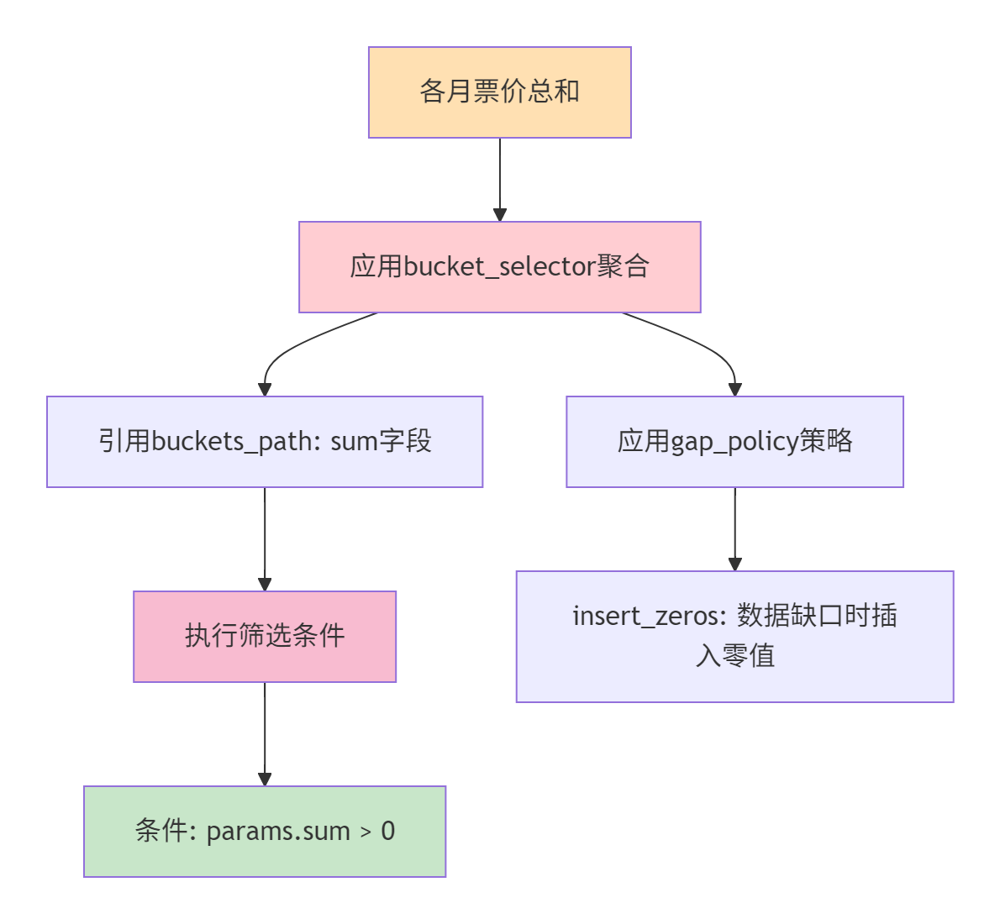

### **3.8.2.2 分桶选择器原理分析**

### **1、bucket\_selector 聚合工作原理**

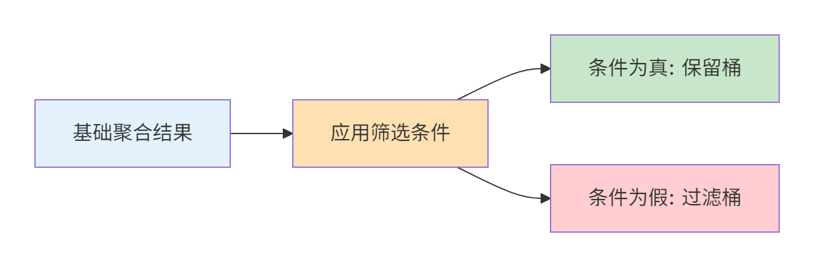

### **2、具体筛选过程**

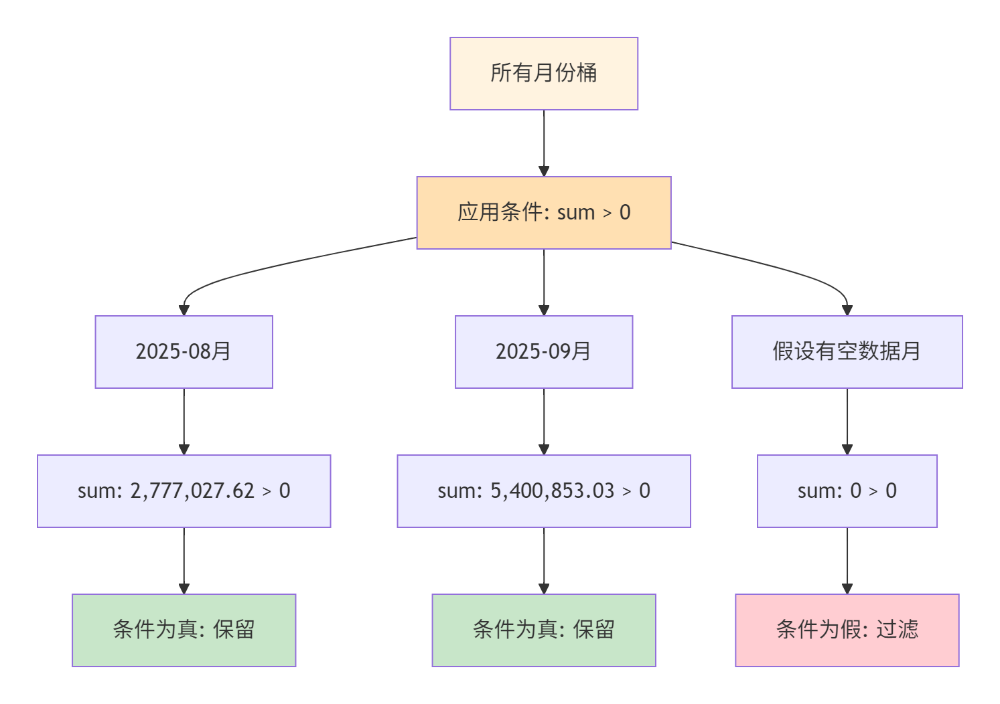

## **3.9 Pipeline 管道聚合 Sort 分桶实例**

### **3.9.1 查询核心目标**

下面示例查询的目标是：​通过三层聚合架构，对航班数据按月份分组统计票价信息，并按票价总和进行降序排序。

\# Pipeline 管道聚合sort示例-对航班数据按月份分组统计票价信息，并按票价总和进行降序排序。

GET kibana\_sample\_data\_flights/\_search

{

"size": 0,

"track\_total\_hits": true,

"aggs": {

"timestamp\_date\_histogram": {

"date\_histogram": {

"field": "timestamp",

"calendar\_interval": "month"

},

"aggs": {

"AvgTicketPrice\_stats": {

"stats": {

"field": "AvgTicketPrice"

}

},

"pipeline\_sort": {

"bucket\_sort": {

"sort": \[

{

"AvgTicketPrice\_stats.sum" : {

"order": "desc"

}

}

\]

}

}

}

}

}

}

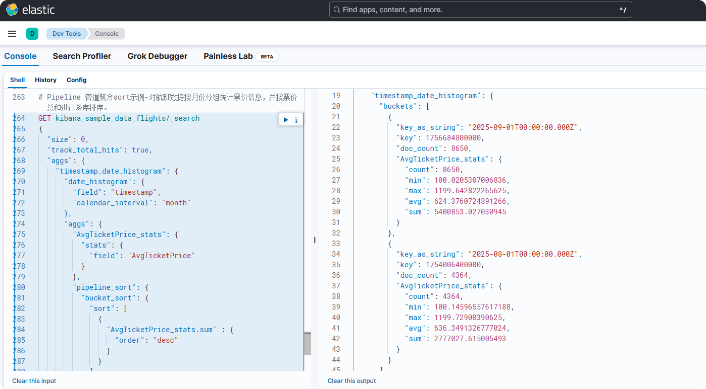

响应字段详细含义解析:

{

"took": 2, // 总耗时2毫秒

"timed\_out": false, // 未超时

"\_shards": { // 分片执行情况

"total": 1, // 1个分片

"successful": 1, // 全部成功

"skipped": 0, // 无跳过

"failed": 0 // 无失败

},

"hits": { // 命中结果

"total": {

"value": 13014, // 总文档数13014

"relation": "eq" // 精确计数

},

"max\_score": null, // 聚合查询无评分

"hits": \[\] // 不返回具体文档

},

"aggregations": { // 聚合结果

"timestamp\_date\_histogram": { // Level 1聚合结果

"buckets": \[ // 时间桶列表（已排序）

{

"key\_as\_string": "2025-09-01T00:00:00.000Z", // 时间桶键(字符串)

"key": 1756684800000, // 时间桶键(时间戳)

"doc\_count": 8650, // 该月航班数量

"AvgTicketPrice\_stats": { // Level 2聚合结果

"count": 8650, // 票价数据点数

"min": 100.0205307006836, // 最低票价

"max": 1199.642822265625, // 最高票价

"avg": 624.3760724891266, // 平均票价

"sum": 5400853.027030945 // 票价总和（最高，排第一位）

}

},

{

"key\_as\_string": "2025-08-01T00:00:00.000Z",

"key": 1754006400000,

"doc\_count": 4364,

"AvgTicketPrice\_stats": {

"count": 4364,

"min": 100.14596557617188,

"max": 1199.72900390625,

"avg": 636.3491326777024,

"sum": 2777027.615005493 // 票价总和（较低，排第二位）

}

}

\]

}

}

}

具体分析维度​：

1.  ​Level 1（叶子聚合）​​：使用date\_histogram按月份对航班数据进行时间分桶。
2.  ​Level 2（指标计算）​​：使用stats聚合计算每个月的票价统计信息。
3.  ​Level 3（父级Pipeline聚合）​​：使用bucket\_sort对结果桶按票价总和进行排序。

​

业务价值​：

1.  分析机票价格的月度分布情况。
2.  识别收入最高的月份。
3.  支持数据结果的灵活排序和展示。
4.  为业务决策提供有序的数据视图。

### **3.9.2 底层架构设计**

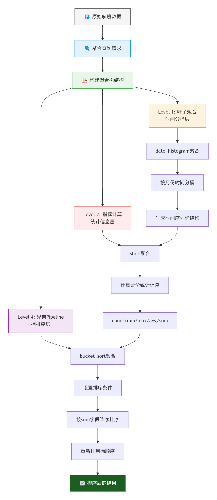

### **3.9.2.1 执行流程**

1.  用户发送聚合查询到协调节点。
2.  协调节点解析查询，构建三层聚合树（Level 1: date\_histogram, Level 2: stats, Level 3: script）。
3.  协调节点将查询分发到数据节点，数据节点进一步分发到分片。
4.  分片并行执行Level 1和Level 2的聚合（date\_histogram和stats）。
5.  分片将结果返回给数据节点，数据节点返回给协调节点。
6.  协调节点合并所有分片的结果，然后执行Level 3的聚合（sort），因为需要全局数据。
7.  协调节点将最终结果返回给用户。

其中各层级详细执行说明：

### **1、Level 1：叶子聚合（时间分桶）**

执行位置​：各数据分片（并行执行）。

核心功能​：数据分桶和基础分组。

### **2、Level 2：指标计算（统计信息）**

执行位置​：各数据分片（并行执行）。

核心功能​：桶内指标计算和统计分析。

### **3、Level 4：兄弟 Pipeline 聚合（桶排序）**

执行位置​：协调节点（集中执行）。

​核心功能​：基于指定字段的桶排序。

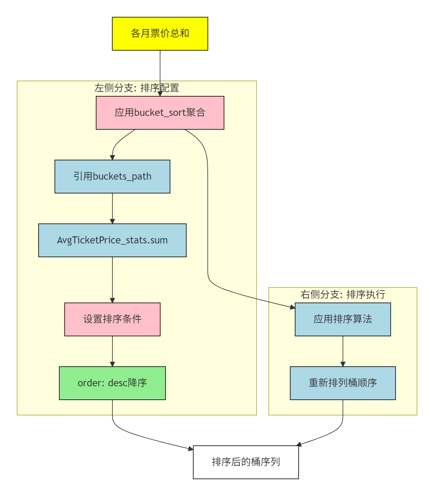

### **3.9.2.2 分桶排序原理分析**

### **1、bucket\_sort 聚合工作原理**

### **2、具体排序过程**

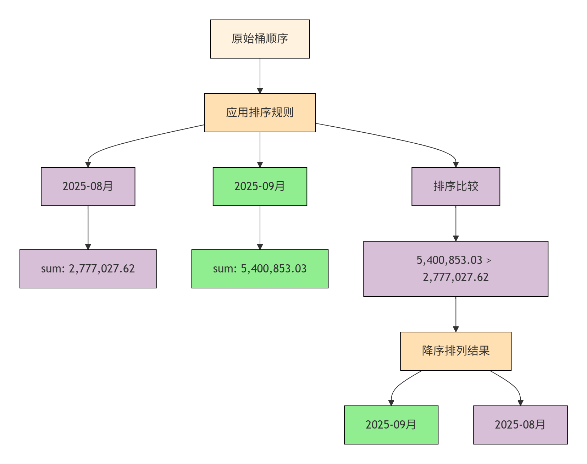