从今天之后的一段时间内，华仔会带着大家一起来从零开始对 ElasticStack 矩阵产品进行深入剖析和项目运维实战，希望大家学完之后可以用到自己的工作中。

这是第十八篇，本篇我将带着大家进行「**ES 8.x 使用 Rollup && Transform 处理海量数据深度实战及避坑指南**」。

文章汇总位置：[https://wx.zsxq.com/dweb2/index/columns/51122554151214](https://wx.zsxq.com/dweb2/index/columns/51122554151214)

## **01 前言**

在上篇中 [【ES 入门实战第十七篇】ES 使用 Script 实现复杂需求深度实战](https://articles.zsxq.com/id_fkkaruuxon56.html)，带着大家进行「**ES 使用 Script 实现复杂需求深度实战**」。

今天我们来进行「**ES 8.x 使用 Rollup && Transform处理海量数据深度实战及避坑指南**」。

##   
**02 Rollup 基础知识**

## **2.1 什么是 Rollup**

Rollup 是 ES 提供的一种「**数据汇总**」、「**预聚合**」、「**降精度**」的功能。自 ES 「**6.3**」 版本发布以来，Rollup 已经成为 ES的核心功能之一。在随后的版本中，ES不断增强和完善了 Rollup 的功能，如支持更多的聚合函数、更灵活的 Rollup 配置选项等。

它允许你将大规模的历史明细等「**高精度**」、「**细粒度**」的数据（通常是与时间相关的序列数据），在后台按照预设的规则进行周期性的「**卷起**」处理，将「**高粒度**」的原始数据聚合成「**低粒度**」、「**存储空间更小**」的汇总数据。之后你可以归档或删除昂贵的原始数据，并转而查询这些体积小得多的 Rollup 索引，以满足宏观趋势分析的需求。

简单来说就是：ES Rollup功能是针对「**时序数据**」设计的「**智能汇总机制**」，它通过将高精度历史数据压缩为低精度摘要，有效解决了长期存储海量时序数据带来的成本问题。

这项功能特别适合处理传感器数据、日志数据、监控指标等具有明显时间特征的业务场景。

> 需要注意的是：统计分桶汇总只能往前，已经产生的历史分桶数据是不会更新的。
> 
> 比如 2025-10 本月的统计数据是1000，当后续有新数据产生也属于 2025-10 这个分桶，也不会被统计到。

其核心思想：用存储空间和查询灵活性换取巨大的存储成本节约和查询性能提升。即「**智能汇总机制用空间换时间，用精度换性能**」。

## **2.2 Rollup 核心价值**

1.  大幅降低存储成本
2.  Rollup 索引只存储预先聚合后的摘要数据，其体积通常比原始索引小 ​90% - 99%**​**。它们只存储聚合后的结果而不是每一条原始文档，这使得长期存储历史数据变得经济可行。
3.  显著提升查询性能
4.  对于汇总类聚合查询（如过去一年的月平均销售额），在体积小得多的 Rollup 索引上执行，比在全量原始数据上执行要快得多。
5.  实现数据生命周期管理
6.  热层 (Hot)： 存储原始数据，支持高频写入和任意查询。通常保留近期数据。
7.  温/冷层 (Warm/Cold)： 存储 Rollup 摘要数据，支持中低频的汇总查询。通常保留中长期历史数据。
8.  通过这种分层存储，在保证关键业务查询能力的同时，优化了整体集群的资源和成本。
9.  无缝的查询体验​
10.  使用 Rollup API 进行查询时，其语法与普通的 ES 聚合查询几乎完全一致。系统会自动判断该去原始索引还是 Rollup 索引中获取数据，对用户/应用透明。

## **2.3 Rollup 应用场景**

ES的 rollup 功能可以将原始数据按照一定的规则进行聚合，生成预先计算的摘要数据（即 rollup 数据）。

这种摘要数据可以用于各种场景，例如：

1.  场景1：大量历史数据的存储与查询。当数据量庞大且增长迅速时，通过 Rollup 功能可以降低存储成本和查询延迟。
2.  场景2：时间序列数据分析。Rollup 功能特别适用于时间序列数据，可以将数据聚合成不同的时间粒度，方便进行各种时间范围的分析。
3.  场景3：数据归档。通过 Rollup 功能，可以将不再需要实时查询的数据归档，从而降低存储和计算资源的消耗。

在电商场景下，可以使用Rollup API来进行如下操作：

1.  电商场景1：统计销售数据，电商网站可以使用Rollup API来聚合销售数据，如订单量、销售额、商品销售量等，以便于分析和报告。
2.  电商场景2：聚合用户数据，通过Rollup API可以统计用户行为数据，如用户浏览商品数量、购买行为、退货情况等，以便于进行用户画像、用户行为分析等。
3.  电商场景3：聚合库存数据，通过Rollup API可以聚合库存数据，如库存量、商品入库量、出库量等，以便于管理库存、优化进销存等。
4.  电商场景4：聚合搜索数据，通过Rollup API可以聚合搜索数据，如用户搜索关键字、搜索次数等，以便于进行搜索引擎优化、推荐算法优化等。

## **2.4 Rollup 工作原理**

Rollup 的工作原理可以分为两个核心阶段：​「**作业执行（数据预处理）**」​ 和「**查询路由**」。

### **2.4.1 阶段一：Rollup 作业执行（数据预处理）**

这是一个周期性的后台 ETL 任务 （提取、转换、加载），其工作流程如下图所示：

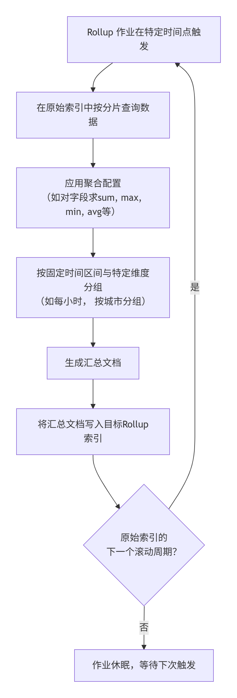

关键说明：​​

1.  ​配置（Job Configuration）：​​ 在创建 Rollup 任务时，你需要定义：
2.  源索引 ​index\_pattern: 匹配哪些原始索引（如 raw-data-\*）。
3.  ​目标索引 Rollup Index: 汇总数据写入的目标索引（如 rollup-data-hourly）。
4.  ​Cron 定时器-滚动间隔: 任务执行的频率（如每小时一次）。
5.  ​Page Size: 每次批量处理的文档数。
6.  ​Groups（分组条件）​: 定义汇总的维度。
7.  date\_histogram: 按时间间隔分组（如每小时），这是必选项。
8.  terms: 按某个关键词字段的唯一值分组（如 hostname, city）。
9.  histogram: 按数值范围分组（如 将响应时间每 100ms 分一桶）。
10.  ​Metrics（聚合指标）​: 定义对哪些数值字段进行何种聚合计算。
11.  sum, min, max, avg等（例如：对 bytes\_sent字段求和、求平均值）。
12.  执行 Rollup Job：
13.  Rollup 作业的核心是执行一个「**groupby**」操作。ES 会启动一个后台任务，根据 Job 的配置，周期性地读取源索引中尚未被滚转的新数据。
14.  对读取到的这批数据，按照配置的 group\_by 和 metrics 进行聚合计算。
15.  将聚合计算后的结果文档写入到目标 Rollup 索引中。

### **2.4.2 阶段二：Rollup 查询路由**

当用户查询 Rollup 数据时，用户无需直接查询 Rollup 索引，而是使用 Rollup Search API 来查询最初定义的源索引模式。

其过程如下图所示：

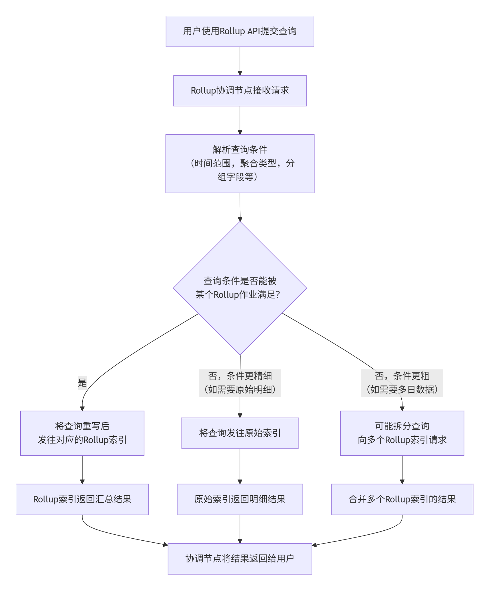

关键说明：​​

1.  查询能力：​​ Rollup 索引只能满足「**特定类型**」的查询，主要是：
2.  聚合查询（metric和 bucket聚合）。
3.  与分组字段相关的条件查询。
4.  它不能返回原始文档（\_searchAPI），也不能进行「**高亮**」、「**排序**」（非分组字段）等操作。
5.  ​查询路由：
6.  用户向 \_rollup\_search 端点发起查询，并指定「**原始索引模式**」。
7.  ES 协调节点（Coordinating Node）的 Rollup 模块会解析这个查询。
8.  查询重写：
9.  模块会检查查询中的「**聚合**」和「**条件**」，判断其是否能被某个已存在的 Rollup Job 所满足。
10.  例如： 你查询“过去一年的月销售额总和”。这个查询可以被一个配置了 date\_histogram（按月）和 sum(sales\_amount) 的 Rollup Job 完全满足。
11.  如果可以满足，ES会将查询 「**重写**」并下发到对应的、体积更小的 Rollup 索引上执行。
12.  结果返回：
13.  Rollup 索引返回「**聚合结果**」，与直接查询原始索引得到的结果格式完全一致。对用户和应用来说是透明的。

## **2.5 Rollup 底层架构设计**

Rollup 功能在 ES集群中的架构涉及两个特殊的节点角色和内部任务处理机制。

### **2.5.1节点角色与分工**

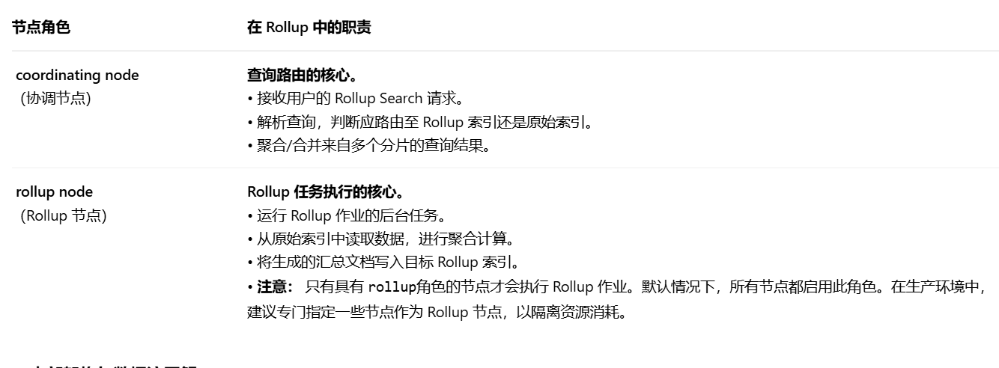

### **2.5.2 内部架构与数据流交互**

下图清晰地展示了 Rollup 的架构设计与数据流交互：

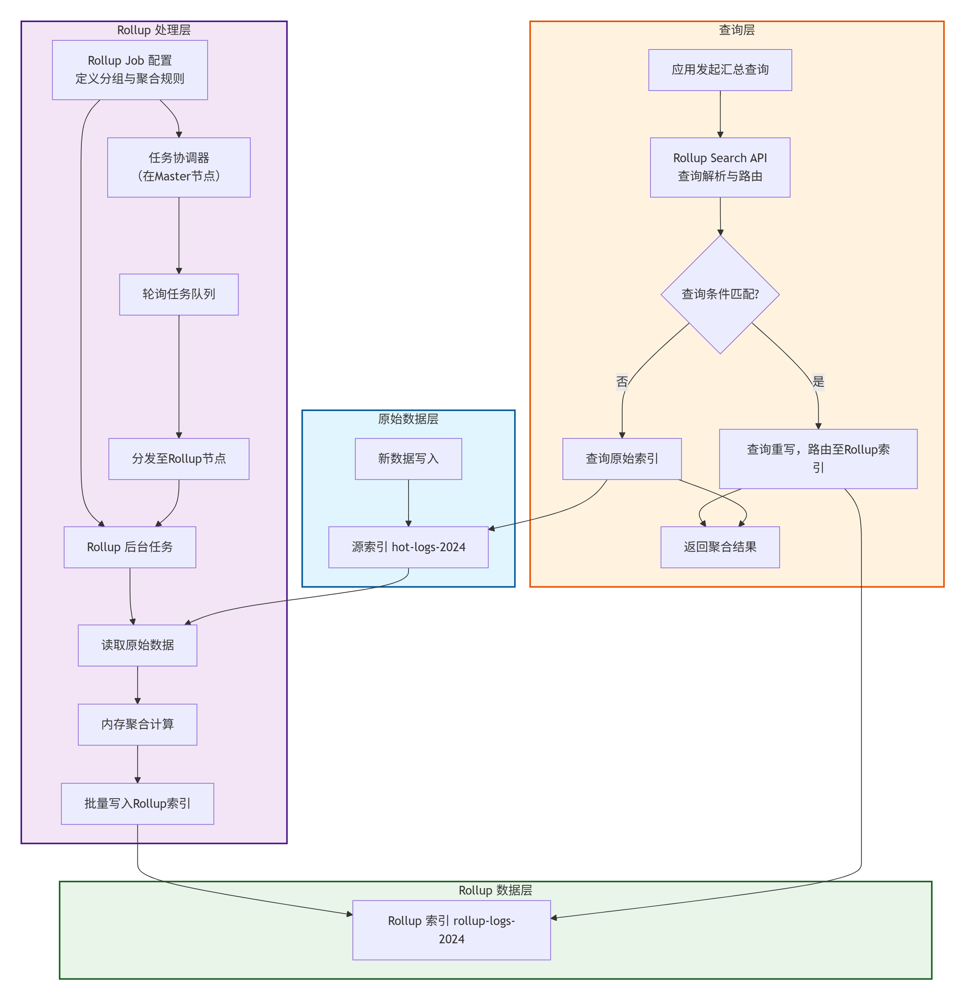

1.  数据处理流水线（写路径 / 数据压缩）​​：此路径的目标是将海量的「**原始明细数据**」压缩成体积小得多的「**预聚合数据**」，对应图中从左至右（原始数据层 → Rollup处理层 → Rollup数据层）的数据流。
2.  ​第1层：原始数据层
3.  ​起点​：应用程序持续产生新的日志、指标等明细数据。
4.  ​存储​：这些高粒度的原始数据被写入到 ES的源索引中，例如 hot-logs-2024。此索引存储成本高，但包含最完整的数据细节。
5.  ​第2层：Rollup 处理层- 核心​：这是 Rollup 的 「**加工中心**」，它是一个由配置驱动的后台任务系统。
6.  ​任务配置​：用户首先需要创建一个 ​Rollup Job，明确指定以下规则：
7.  ​源索引​：对哪个索引（如 hot-logs-2024）进行汇总。
8.  ​目标索引​：汇总数据存到哪里（如 rollup-logs-2024）。
9.  ​分组规则​：
10.  date\_histogram：按时间分桶，如按“每小时”分组。这是必需项。
11.  terms：按字段唯一值分组，如按“城市”、“产品ID”分组。
12.  histogram：按数值范围分组，如将“响应时间”每100ms分为一桶。
13.  ​聚合指标​：对哪些数值字段进行何种计算，如对“销售额”求 sum，对“响应时间”求 avg、max、min。
14.  ​执行周期​：任务运行的频率，如每小时执行一次。
15.  ​任务调度与执行​：
16.  ​协调器​：Job 配置由 Master 节点上的任务协调器管理，它会定期轮询任务队列。
17.  ​任务分发​：协调器将任务分发给集群中具有 rollup角色的数据节点。
18.  ​数据处理​：Rollup 节点执行任务，包含三个关键步骤：
19.  ​读取原始数据​：从指定的源索引中读取一个时间窗口内的原始数据。
20.  ​内存聚合计算​：在内存中，按照 Job 配置的「**分组**」和「**聚合规则**」进行运算。例如，计算每个城市每小时的销售总额。
21.  ​批量写入​：将计算好的聚合结果批量写入到目标 Rollup 索引中。
22.  ​第3层：Rollup 数据层
23.  ​结果存储​：存储 Rollup 任务生成的聚合结果，即 Rollup 索引（如 rollup-logs-2024）。
24.  ​核心价值​：这个索引只存储分组后的聚合结果，数据量通常比原始索引小 ​1-2个数量级​（减少90%-99%），从而实现了存储成本的大幅降低。
25.  ​查询路由流程（读路径 / 查询）​​：此路径处理用户的聚合查询请求，系统会智能判断是去高效的 Rollup 索引还是回退到原始索引查询，对应图中下上（查询层 ↔ 数据层）的查询流。
26.  ​第4层：查询层
27.  ​查询发起​：应用程序发起一个「**聚合查询**」请求（例如，查询过去30天每个城市的日均销售额）。
28.  ​API 与路由​：请求发送到 ​Rollup Search API。协调节点接收请求后，会进行查询解析与路由判断。
29.  ​智能决策​：系统核心的查询条件匹配逻辑开始工作。它会检查：
30.  查询的聚合类型​（如 sum、date\_histogram）是否在 Rollup Job 中有定义。
31.  查询的分组字段​（如 城市）是否在 Rollup Job 的配置中。
32.  查询的时间范围是否被 Rollup 数据覆盖。
33.  ​路由执行​：
34.  ​情况一：匹配成功（是）​​：查询可以被 Rollup 索引完全满足。系统会将查询重写，然后直接发给 Rollup 索引执行。由于 Rollup 索引体积小，​查询速度极快。
35.  ​情况二：匹配失败（否）​​：查询条件超出了 Rollup Job 的配置范围（例如，需要查询原始秒级数据）。系统会自动降级，将查询发往原始索引执行，​保证结果的正确性。
36.  ​返回结果​：无论走哪条路径，最终都会将聚合结果返回给应用程序。这个过程对应用是透明的。

## **2.6 Rollup 官方文档**

官方文档地址：[https://www.elastic.co/guide/en/elasticsearch/reference/8.17/data-rollup-transform.html](https://www.elastic.co/guide/en/elasticsearch/reference/8.17/data-rollup-transform.html)

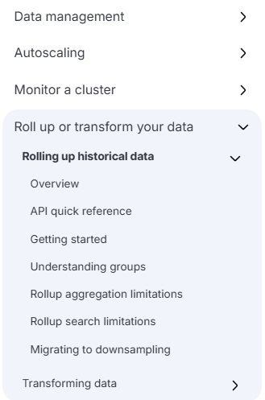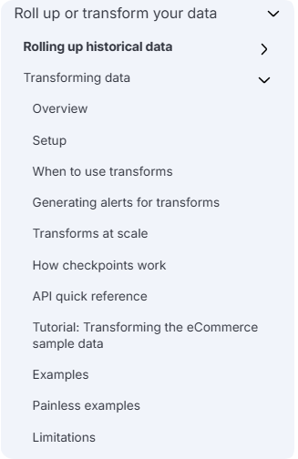

### **2.6.1 Rollup API**

api 文档：[https://www.elastic.co/guide/en/elasticsearch/reference/8.17/rollup-api-quickref.html](https://www.elastic.co/guide/en/elasticsearch/reference/8.17/rollup-api-quickref.html)

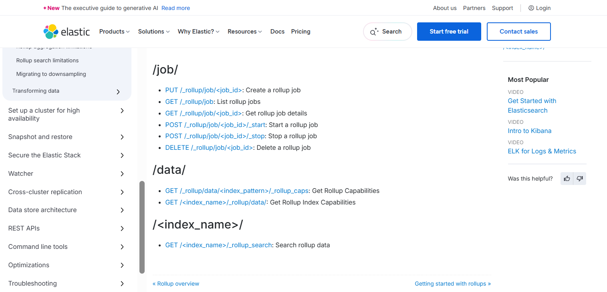

## **2.7 Rollup 案例**

今天的案例我们以自带的电商数据为主：

  

  
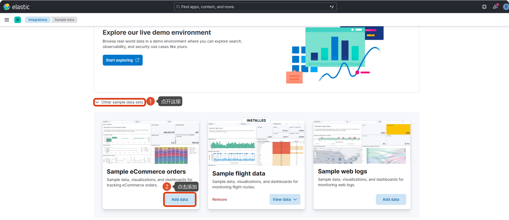

静静等待成功，如果有报错，请检查机器磁盘是否已满：

  
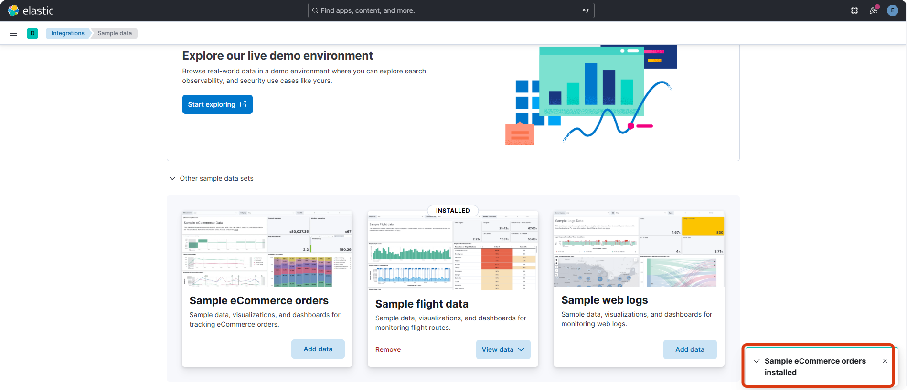

我们先来查看下 kibana\_sample\_data\_ecommerce的 mapping 信息：

\# 查询 ES 索引 mapping

GET kibana\_sample\_data\_ecommerce/\_mapping

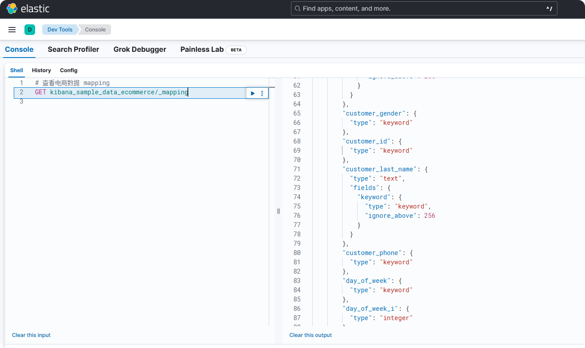

## **03 Rollup海量数据处理深度实战**

为了测试海量数据，这里基于kibana\_sample\_data\_ecommerce 这个索引来造 1000 万+数据，目前该索引只有 4675 条数据。

## **3.1 基于 Python 脚本制造海量数据**

### **3.1.1 创建新的索引**

首先创建一个新的索引来作为本次的示例。

\# 创建新数据索引作为 rollup 示例

PUT kibana\_sample\_data\_ecommerce\_bigdata

{

"mappings": {

"dynamic": "strict",

"dynamic\_templates": \[

{

"strings\_as\_keywords": {

"match\_mapping\_type": "string",

"mapping": {

"ignore\_above": 256,

"type": "keyword"

}

}

},

{

"numbers\_as\_floats": {

"match\_mapping\_type": "long",

"mapping": {

"type": "float"

}

}

}

\],

"date\_detection": false,

"numeric\_detection": false,

"properties": {

"@timestamp": {

"type": "date"

},

"@version": {

"type": "keyword"

},

"category": {

"type": "text",

"fields": {

"keyword": {

"type": "keyword"

}

}

},

"currency": {

"type": "keyword"

},

"customer\_birth\_date": {

"type": "date"

},

"customer\_first\_name": {

"type": "text",

"fields": {

"keyword": {

"type": "keyword",

"ignore\_above": 256

}

}

},

"customer\_full\_name": {

"type": "text",

"fields": {

"keyword": {

"type": "keyword",

"ignore\_above": 256

}

}

},

"customer\_gender": {

"type": "keyword"

},

"customer\_id": {

"type": "keyword"

},

"customer\_last\_name": {

"type": "text",

"fields": {

"keyword": {

"type": "keyword",

"ignore\_above": 256

}

}

},

"customer\_phone": {

"type": "keyword"

},

"day\_of\_week": {

"type": "keyword"

},

"day\_of\_week\_i": {

"type": "integer"

},

"email": {

"type": "keyword"

},

"event": {

"properties": {

"created": {

"type": "date"

},

"dataset": {

"type": "keyword"

},

"ingested": {

"type": "date"

}

}

},

"geoip": {

"properties": {

"city\_name": {

"type": "keyword"

},

"continent\_name": {

"type": "keyword"

},

"country\_iso\_code": {

"type": "keyword"

},

"location": {

"type": "geo\_point"

},

"region\_name": {

"type": "keyword"

}

}

},

"manufacturer": {

"type": "text",

"fields": {

"keyword": {

"type": "keyword"

}

}

},

"order\_date": {

"type": "date"

},

"order\_id": {

"type": "keyword"

},

"products": {

"properties": {

"\_id": {

"type": "text",

"fields": {

"keyword": {

"type": "keyword",

"ignore\_above": 256

}

}

},

"base\_price": {

"type": "half\_float"

},

"base\_unit\_price": {

"type": "half\_float"

},

"category": {

"type": "text",

"fields": {

"keyword": {

"type": "keyword"

}

}

},

"created\_on": {

"type": "date"

},

"discount\_amount": {

"type": "half\_float"

},

"discount\_percentage": {

"type": "half\_float"

},

"manufacturer": {

"type": "text",

"fields": {

"keyword": {

"type": "keyword"

}

}

},

"min\_price": {

"type": "half\_float"

},

"price": {

"type": "half\_float"

},

"product\_id": {

"type": "long"

},

"product\_name": {

"type": "text",

"fields": {

"keyword": {

"type": "keyword"

}

},

"analyzer": "english"

},

"quantity": {

"type": "integer"

},

"sku": {

"type": "keyword"

},

"tax\_amount": {

"type": "half\_float"

},

"taxful\_price": {

"type": "half\_float"

},

"taxless\_price": {

"type": "half\_float"

},

"unit\_discount\_amount": {

"type": "half\_float"

}

}

},

"sku": {

"type": "keyword"

},

"tags": {

"type": "keyword"

},

"taxful\_total\_price": {

"type": "half\_float"

},

"taxless\_total\_price": {

"type": "half\_float"

},

"total\_quantity": {

"type": "integer"

},

"total\_unique\_products": {

"type": "integer"

},

"type": {

"type": "keyword"

},

"user": {

"type": "keyword"

}

}

}

}

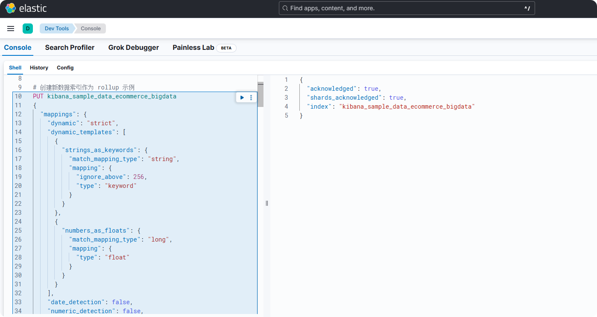

### **3.1.2 构建 python 环境**

先检查下是否安装 python 及 pip：

python3 --version

pip --version

如果不存在，先安装这两个：

sudo apt install python3

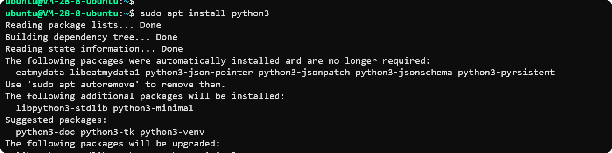

sudo apt install python3-pip

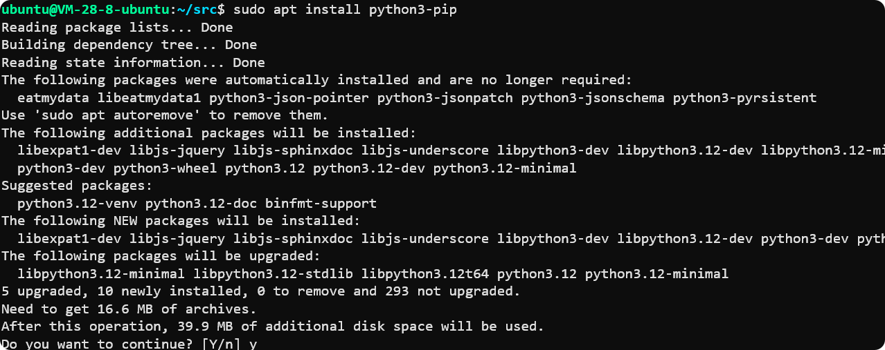

再次检查下 python 及 pip：

接着安装下 python elasticsearch 客户端，目前匹配到的版本是 8.17.2，我们服务端版本是 8.17.9：

pip3 install elasticsearch==8.17.2 --break-system-packages

\# 或则

pip3 install elasticsearch==8.17.2

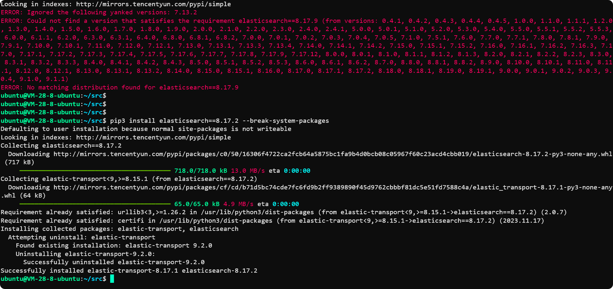

### **3.1.3 编写 python 脚本**

from elasticsearch import Elasticsearch, helpers

import uuid

import random

from datetime import datetime, timedelta

import time

import os

import gc

import tracemalloc

import sys

\# 创建 Elasticsearch 客户端（兼容性配置）

es = Elasticsearch(

\["http://localhost:9200"\],

basic\_auth=('elastic', 'elastic'),

headers={"Accept": "application/json"} \# 使用简单的 JSON 头

)

\# 内存监控

tracemalloc.start()

def memory\_usage():

"""获取当前内存使用情况"""

current, peak = tracemalloc.get\_traced\_memory()

return current / 10\*\*6 \# 转换为 MB

def generate\_data():

try:

\# 获取原始文档数量

count\_response = es.count(

index="kibana\_sample\_data\_ecommerce",

body={} \# 空查询

)

doc\_count = count\_response\['count'\]

print(f"原始索引中有 {doc\_count} 条文档")

\# 计算每个文档需要生成的副本数

target\_total = 40000000

copies\_per\_doc = target\_total // doc\_count

print(f"每个文档需要生成 {copies\_per\_doc} 个副本")

\# 内存控制参数

MAX\_MEMORY\_MB = 8000 \# 最大内存限制 8G

MEMORY\_CHECK\_INTERVAL = 10000 \# 每处理多少文档检查一次内存

\# 使用滚动API批量处理

batch\_size = 200 \# 减小批次大小以控制内存

actions = \[\]

total\_generated = 0

start\_time = time.time()

last\_memory\_check = 0

\# 初始化滚动 - 增加滚动时间到10分钟

response = es.search(

index="kibana\_sample\_data\_ecommerce",

scroll="30m", \# 增加滚动时间到10分钟

size=batch\_size,

body={"query": {"match\_all": {}}}

)

scroll\_id = response\['\_scroll\_id'\]

hits = response\['hits'\]\['hits'\]

while hits:

for doc in hits:

source\_doc = doc\['\_source'\]

for \_ in range(copies\_per\_doc):

if total\_generated >= target\_total:

break

\# 创建修改后的文档

new\_doc = modify\_document(source\_doc.copy())

\# 添加到批量操作

actions.append({

"\_op\_type": "index",

"\_index": "kibana\_sample\_data\_ecommerce\_bigdata",

"\_id": str(uuid.uuid4()),

"\_source": new\_doc

})

total\_generated += 1

\# 定期检查内存使用

if total\_generated - last\_memory\_check >= MEMORY\_CHECK\_INTERVAL:

current\_mem = memory\_usage()

print(f"已生成: {total\_generated}/{target\_total} | 内存使用: {current\_mem:.2f} MB")

last\_memory\_check = total\_generated

\# 如果内存接近上限，强制垃圾回收

if current\_mem > MAX\_MEMORY\_MB \* 0.8:

print("内存接近上限，执行垃圾回收...")

gc.collect()

current\_mem = memory\_usage()

print(f"垃圾回收后内存: {current\_mem:.2f} MB")

\# 如果内存仍然过高，提前提交批量操作

if current\_mem > MAX\_MEMORY\_MB \* 0.9:

print("内存仍然过高，提前提交批量操作...")

if actions:

helpers.bulk(es, actions)

actions = \[\]

print(f"已提交 {len(actions)} 个文档")

gc.collect()

current\_mem = memory\_usage()

print(f"提交后内存: {current\_mem:.2f} MB")

\# 提交批量操作

if actions:

try:

helpers.bulk(es, actions)

actions = \[\]

print(f"已提交一批文档，当前进度: {total\_generated}/{target\_total}")

\# 提交后强制垃圾回收

gc.collect()

current\_mem = memory\_usage()

print(f"提交后内存: {current\_mem:.2f} MB")

except Exception as e:

print(f"批量提交失败: {e}")

\# 失败后重试或记录错误

try:

\# 获取下一批文档 - 增加滚动时间到10分钟

response = es.scroll(scroll\_id=scroll\_id, scroll="10m")

scroll\_id = response\['\_scroll\_id'\]

hits = response\['hits'\]\['hits'\]

except Exception as e:

print(f"滚动请求失败: {e}")

\# 滚动上下文可能已过期，重新初始化滚动

print("重新初始化滚动上下文...")

response = es.search(

index="kibana\_sample\_data\_ecommerce",

scroll="10m",

size=batch\_size,

body={"query": {"match\_all": {}}}

)

scroll\_id = response\['\_scroll\_id'\]

hits = response\['hits'\]\['hits'\]

\# 如果内存仍然过高，减小下一批的大小

current\_mem = memory\_usage()

if current\_mem > MAX\_MEMORY\_MB \* 0.7:

new\_batch\_size = max(10, batch\_size // 2)

print(f"内存过高 ({current\_mem:.2f} MB)，减小批次大小: {batch\_size} -> {new\_batch\_size}")

batch\_size = new\_batch\_size

print(f"最终生成: {total\_generated} 条文档")

print(f"总耗时: {time.time() - start\_time:.2f} 秒")

except Exception as e:

print(f"生成文档过程中出错: {e}")

import traceback

traceback.print\_exc()

finally:

tracemalloc.stop()

def modify\_document(doc):

"""修改文档以避免重复"""

\# 修改订单ID

doc\['order\_id'\] = f"order\_{uuid.uuid4()}"

\# 修改客户ID

doc\['customer\_id'\] = f"customer\_{random.randint(100000, 999999)}"

\# 修改时间戳

if '@timestamp' in doc:

try:

if isinstance(doc\['@timestamp'\], str):

if 'T' in doc\['@timestamp'\]:

\# 尝试解析ISO格式时间字符串

original\_time = datetime.fromisoformat(doc\['@timestamp'\].replace('Z', '+00:00'))

else:

\# 可能是时间戳数字

original\_time = datetime.utcfromtimestamp(float(doc\['@timestamp'\]) / 1000)

else:

\# 如果已经是日期对象，直接使用

original\_time = doc\['@timestamp'\]

\# 计算随机偏移

random\_days = random.randint(-365, 365)

new\_time = original\_time + timedelta(days=random\_days)

doc\['@timestamp'\] = new\_time.isoformat() + 'Z'

except:

\# 如果时间解析失败，使用当前时间

doc\['@timestamp'\] = datetime.utcnow().isoformat() + 'Z'

\# 修改邮箱

if 'email' in doc:

doc\['email'\] = f"user\_{random.randint(1000000, 9999999)}@example.com"

\# 修改价格

if 'taxful\_total\_price' in doc:

try:

price = float(doc\['taxful\_total\_price'\])

doc\['taxful\_total\_price'\] = round(price \* random.uniform(0.5, 2.0), 2)

except:

doc\['taxful\_total\_price'\] = round(random.uniform(10.0, 1000.0), 2)

return doc

\# 执行生成

if \_\_name\_\_ == "\_\_main\_\_":

generate\_data()

执行效果如下：

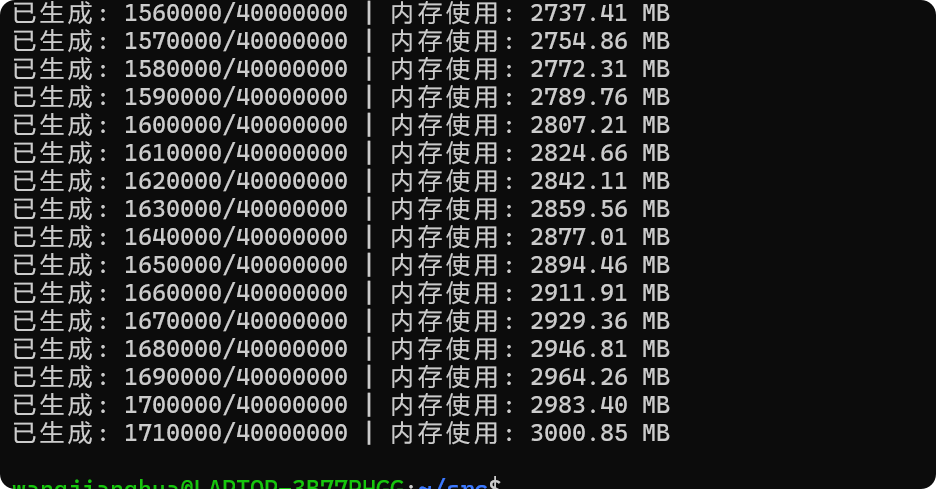

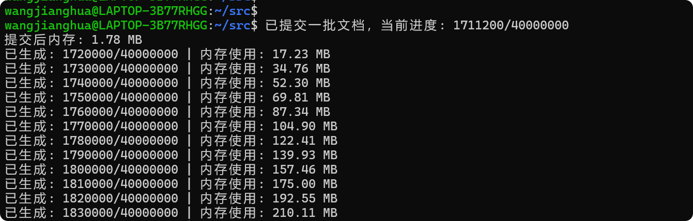

代码总共写了 4000 万，这里就不搞这么多了，总计 1200 万+ 数据：

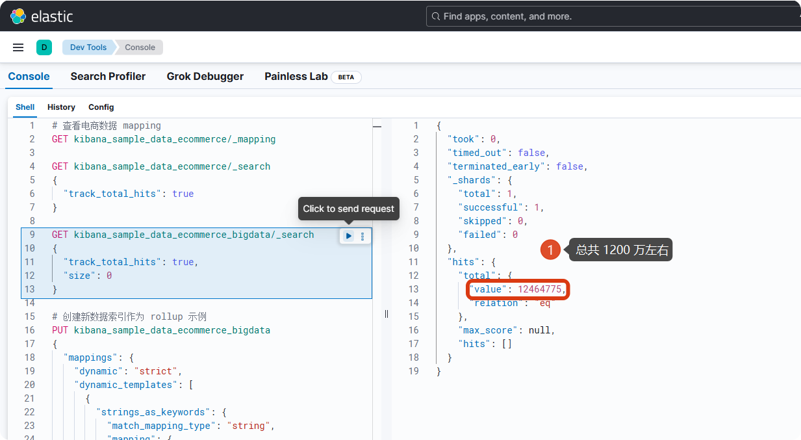

占用空间 3.6 G：

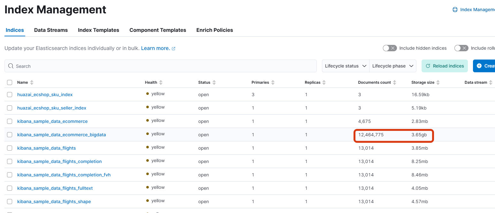

## **3.2 RollUp 案例实战**

Rollup 允许用户在实时运行时间之外预先定义聚合任务，这些任务将执行后的聚合结果数据写入到新创建的特定索引中。

在这个新的索引中，数据已经被预先聚合，这使得查询和分析操作更加快速和高效。接下来我们通过案例实操来展示下整个 RollUp 任务的执行流程。

###   
**3.2.1 创建 RollUp 任务**

可以看到 RollUp 功能在 ES 8.11.0 之后版本已经被下线无法执行。建议使用 Downsampling（降采样） 来替代 Rollup。

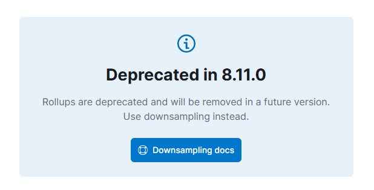

我们换到比 ES 8.11.0 版本低的版本中执行：

\# 创建 RollUp 任务

PUT \_rollup/job/ecommerce\_rollup

{

"index\_pattern": "kibana\_sample\_data\_ecommerce\_bigdata",

"rollup\_index": "kibana\_sample\_data\_ecommerce\_bigdata\_rollup",

"cron": "0 \*/2 \* \* \* ?",

"page\_size": 1000,

"groups": {

"date\_histogram": {

"field": "order\_date",

"fixed\_interval": "1d",

"delay": "1m",

"time\_zone": "UTC"

},

"terms": {

"fields": \[

"products.product\_name.keyword"

\]

}

},

"metrics": \[

{

"field": "taxless\_total\_price",

"metrics": \[

"min",

"max",

"sum"

\]

},

{

"field": "products.price",

"metrics": \[

"sum"

\]

},

{

"field": "products.quantity",

"metrics": \[

"sum"

\]

}

\]

}

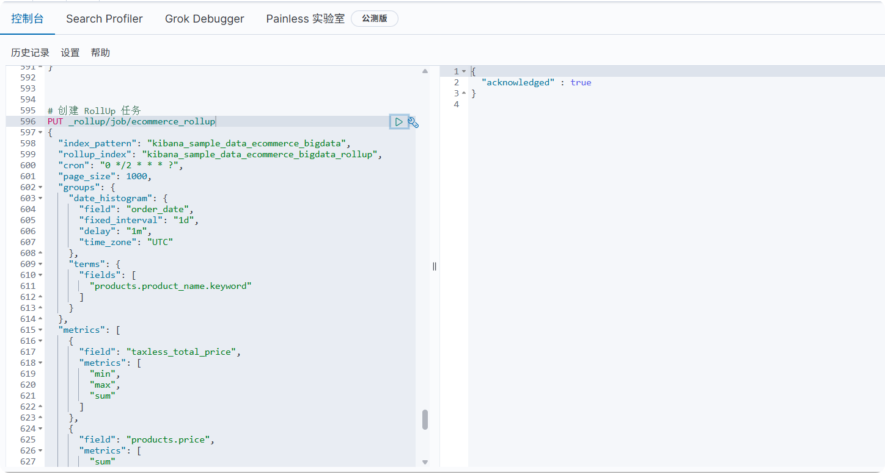

以下是核心参数的简明扼要解释：

1.  index\_pattern：指定要对哪个原始数据索引进行汇总。
2.  rollup\_index：存储汇总数据的新索引名称。
3.  cron：定义 Rollup 作业执行的时间表，本例中表示每两小时执行一次。
4.  page\_size：定义每次处理的文档数量，用于控制内存占用和批处理速度。
5.  groups：定义聚合和分组设置。
6.  date\_histogram：基于时间字段的固定间隔分组设置。
7.  field：要进行时间分组的字段。
8.  fixed\_interval：时间分组的固定间隔，本例中为 1 天。
9.  delay：允许一定的延迟以处理潜在的延迟数据，本例中为 1 分钟。
10.  time\_zone：时间字段的时区。
11.  terms：基于词条的分组设置。
12.  \-fields：要进行词条分组的字段列表。
13.  metrics：定义要计算的度量。
14.  field：要进行度量计算的字段。
15.  metrics：应用于该字段的聚合操作列表，如最小值（min）、最大值（max）和求和（sum）等。

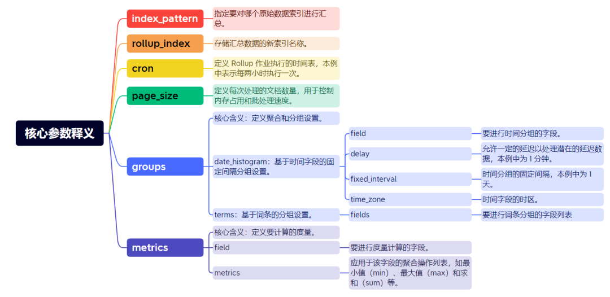

创建完毕后，Kibana 呈现如下图所示，我想说明的是，创建了不代表启动了，所以上面的 status 是 stopped 状态。

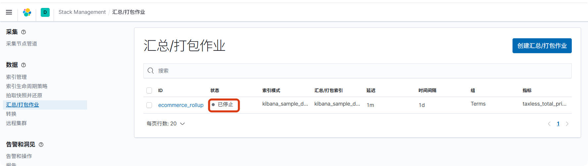

### **3.2.2 启动 RollUp 任务**

\# 启动 rollup 任务

POST \_rollup/job/ecommerce\_rollup/\_start

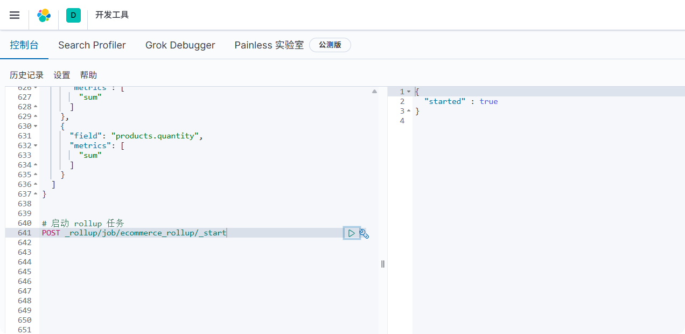

再次查看任务状态：

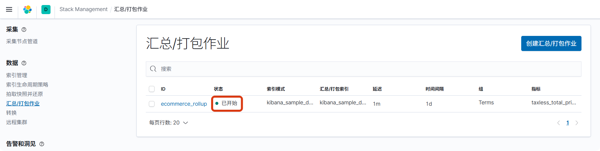

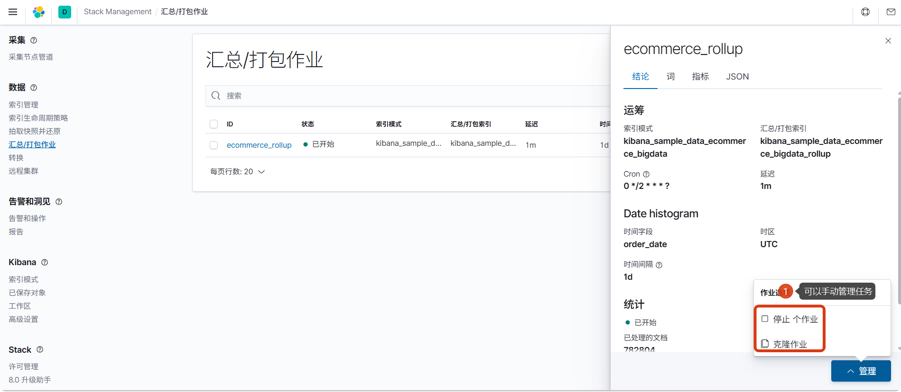

### **3.2.3 查询 RollUp 检索与聚合数据**

GET kibana\_sample\_data\_ecommerce\_bigdata\_rollup/\_search

{

"size": 0,

"aggs": {

"max\_aggs": {

"max": {

"field": "taxless\_total\_price.max.value"

}

},

"sum\_aggs": {

"sum": {

"field": "products.price.sum.value"

}

}

}

}

上述聚合的结果如下图所示:

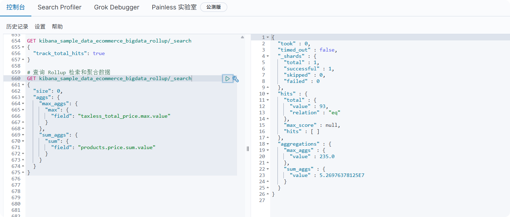

### **3.3 RollUp 实战避坑**

1.  避免过度聚合：在创建 Rollup 任务时，要确保聚合的粒度适中，以免丢失过多的原始数据信息。选择合适的聚合字段和时间间隔，以满足业务需求。
2.  留意数据延迟：Rollup 任务通常会配置一定的延迟时间，以防止正在写入的数据被立即聚合。因此，在查询 Rollup 数据时，请注意可能存在的数据延迟。
3.  指标类型兼容性：在 Rollup 任务中，不同类型的指标（如 count、sum、avg、max、min 等）可以应用于相应的字段。在查询 Rollup 数据时，务必确保使用兼容的指标类型。注意权限控制。
4.  创建和管理 Rollup 任务需要特定的权限：请确保您的用户具有足够的权限来创建、修改、删除和执行 Rollup 任务。
5.  监控 Rollup 任务。
6.  创建 Rollup 任务后，需要定期监控其运行状态，确保数据正常聚合。可以使用 Elasticsearch 监控功能来查看任务的运行状况。

## **3.3 Transform案例实战**

8.11之后的新版建议我们使用 Transform 来代替 RollUp。Transform 实现效果跟 RollUp 差不多，只不过比 RollUp 要更加智能一些。

### **3.3.1 Transform 官方文档**

官方文档地址：[https://www.elastic.co/guide/en/elasticsearch/reference/8.17/transform-api-quickref.html](https://www.elastic.co/guide/en/elasticsearch/reference/8.17/transform-api-quickref.html)

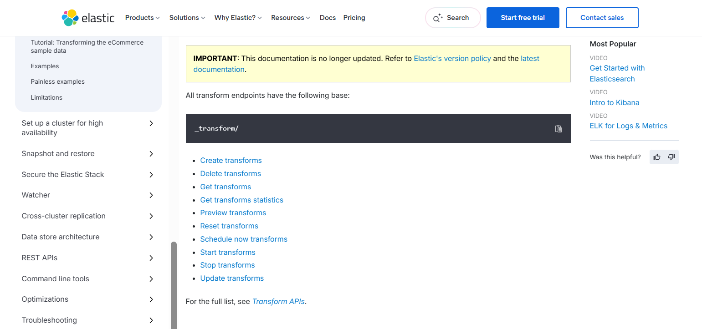

### **3.3.2 创建 Transform 任务**

这个 Transform 任务的核心目标是：​将原始电商订单数据转化为多维度的业务分析摘要数据。

具体包括：

1.  ​时间维度分析​：按小时统计销售数据
2.  ​产品维度分析​：按产品名称聚合销售指标
3.  ​客户维度分析​：按客户ID分析购买行为
4.  ​关键业务指标计算​：销售额、订单量、商品数量等核心指标

\# 创建 transform 任务

PUT \_transform/ecommerce\_bigdata\_transform

{

"source": {

"index": "kibana\_sample\_data\_ecommerce\_bigdata"

},

"dest": {

"index": "kibana\_sample\_data\_ecommerce\_bigdata\_transform"

},

"pivot": {

"group\_by": {

"order\_date": {

"date\_histogram": {

"field": "order\_date",

"fixed\_interval": "1h"

}

},

"product\_name": {

"terms": {

"field": "products.product\_name.keyword"

}

},

"customer\_segment": {

"terms": {

"field": "customer\_id"

}

}

},

"aggregations": {

"total\_sales": {

"sum": {

"field": "taxless\_total\_price"

}

},

"max\_sale": {

"max": {

"field": "taxless\_total\_price"

}

},

"min\_sale": {

"min": {

"field": "taxless\_total\_price"

}

},

"avg\_sale": {

"avg": {

"field": "taxless\_total\_price"

}

},

"order\_count": {

"value\_count": {

"field": "order\_id"

}

},

"total\_quantity": {

"sum": {

"field": "products.quantity"

}

},

"total\_revenue": {

"sum": {

"field": "products.price"

}

}

}

},

"settings": {

"max\_page\_search\_size": 10000,

"docs\_per\_second": 1000

},

"sync": {

"time": {

"field": "order\_date",

"delay": "30s"

}

}

}

字段含义详解：

### **1、 transform 字段配置**

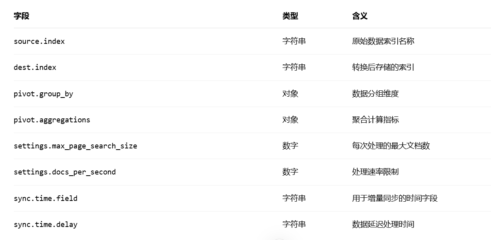

### **2、 分组字段配置**

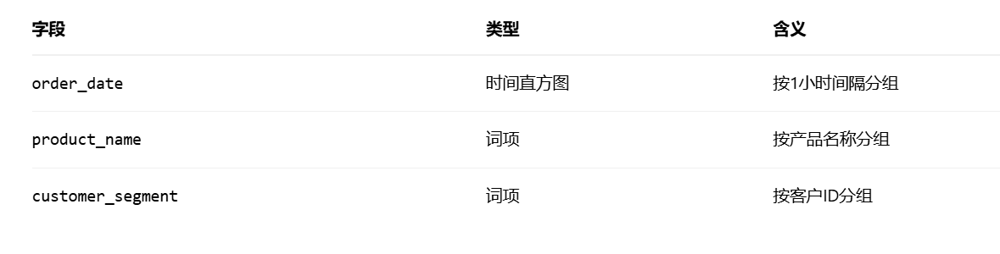

### **3、 聚合字段配置**

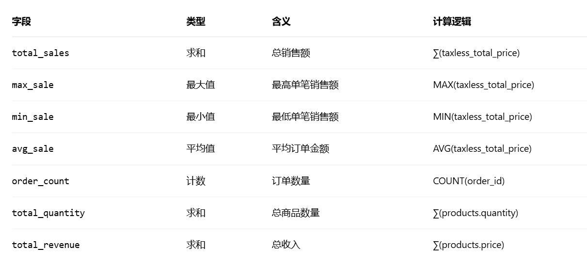

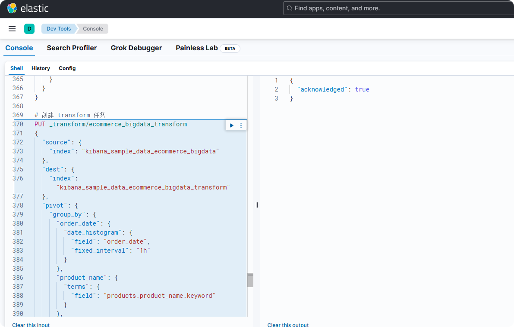

### **2、核心处理流程**

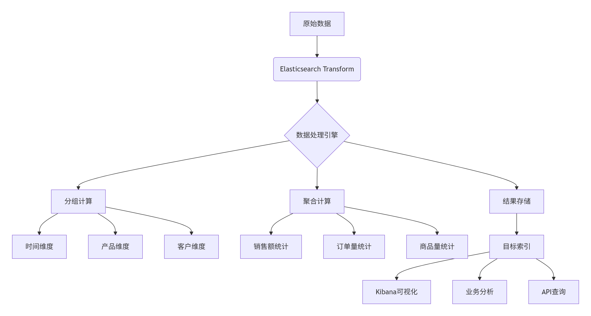

### **3.3.3 查看 Transform 任务统计信息**

\# 查看 transform 任务统计信息

GET \_transform/ecommerce\_bigdata\_transform/\_stats

\# 结果

{

"count": 1,

"transforms": \[

{

"id": "ecommerce\_bigdata\_transform",

"state": "stopped",

"stats": {

"pages\_processed": 0,

"documents\_processed": 0,

"documents\_indexed": 0,

"documents\_deleted": 0,

"trigger\_count": 0,

"index\_time\_in\_ms": 0,

"index\_total": 0,

"index\_failures": 0,

"search\_time\_in\_ms": 0,

"search\_total": 0,

"search\_failures": 0,

"processing\_time\_in\_ms": 0,

"processing\_total": 0,

"delete\_time\_in\_ms": 0,

"exponential\_avg\_checkpoint\_duration\_ms": 0,

"exponential\_avg\_documents\_indexed": 0,

"exponential\_avg\_documents\_processed": 0

},

"checkpointing": {

"last": {

"checkpoint": 0

},

"operations\_behind": 12464775

},

"health": {

"status": "green"

}

}

\]

}

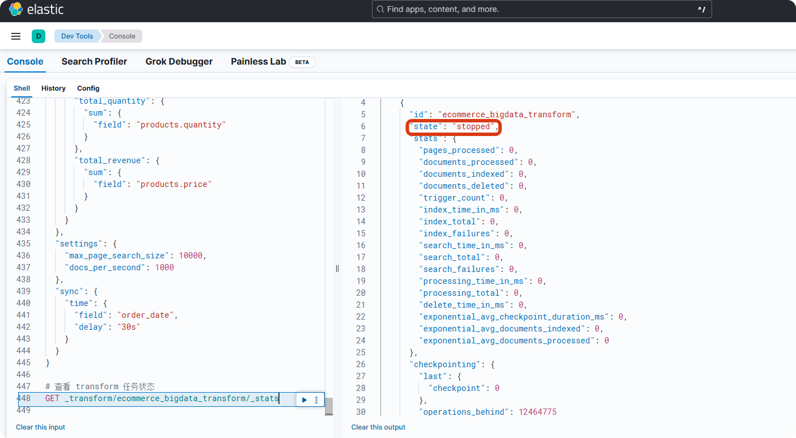

### **3.3.4 启动 Transform 任务**

创建成功后，启动Transform：

\# 启动 transform 任务

POST \_transform/ecommerce\_bigdata\_transform/\_start

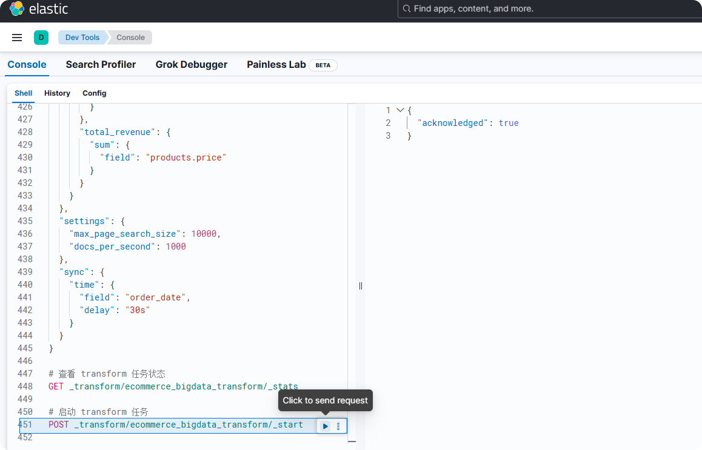

启动后再次查看任务统计信息：

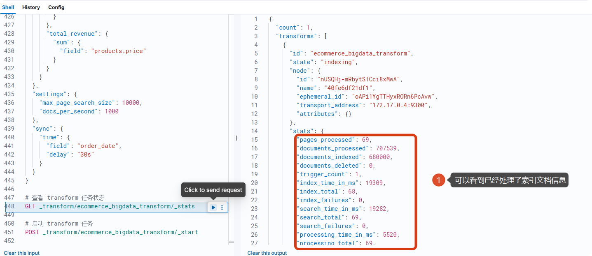

### **3.3.5 检查 Transform 任务状态**

\# 检查Transform状态

GET \_transform/ecommerce\_bigdata\_transform

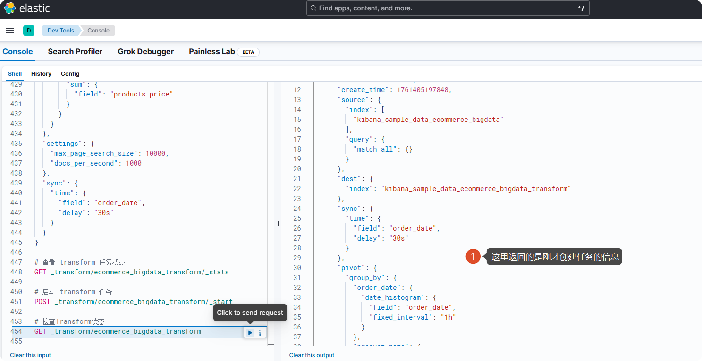

### **3.3.6 查看 Transform 生成的索引信息**

\# 查看Transform生成的索引数据

GET kibana\_sample\_data\_ecommerce\_bigdata\_transform/\_search

{

"track\_total\_hits": true,

"size": 10,

"sort": \[

{

"order\_date": "desc"

}

\]

}

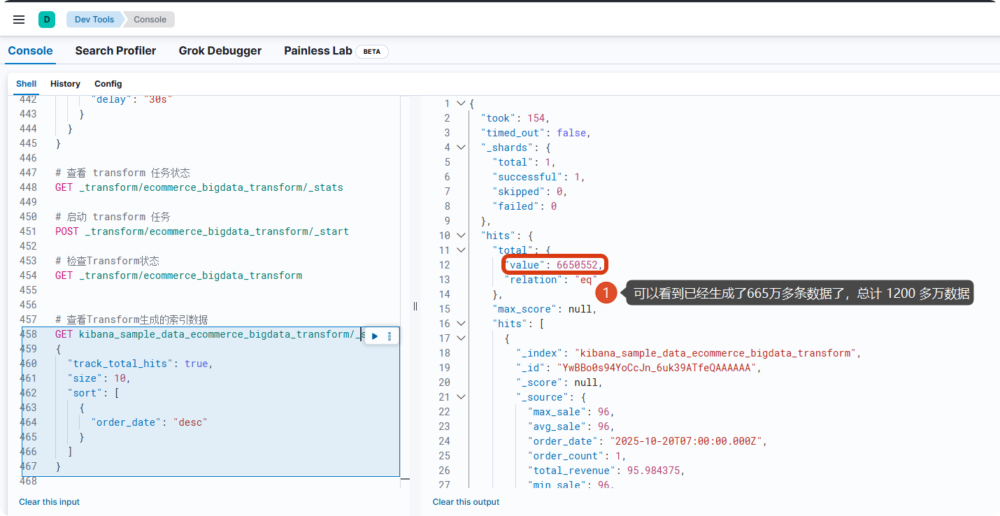

最终统计信息如下：

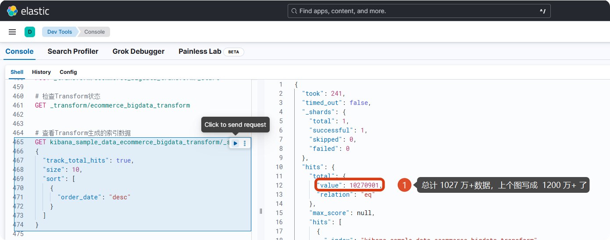

### **3.3.7 对 Transform 结果聚合分析**

\# 对Transform结果进行聚合分析

GET kibana\_sample\_data\_ecommerce\_bigdata\_transform/\_search

{

"size": 0,

"aggs": {

"total\_revenue\_by\_product": {

"terms": {

"field": "product\_name"

},

"aggs": {

"total\_revenue": {

"sum": {

"field": "total\_revenue"

}

}

}

}

}

}

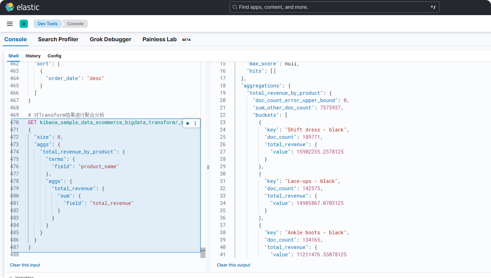

最终聚合数据如下：

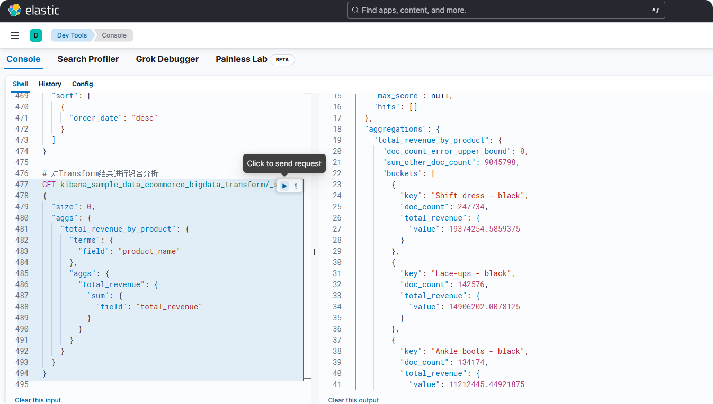

### **3.3.8 Transform 架构总结**

下图清晰的展示了 Transform 数据处理的全流程：

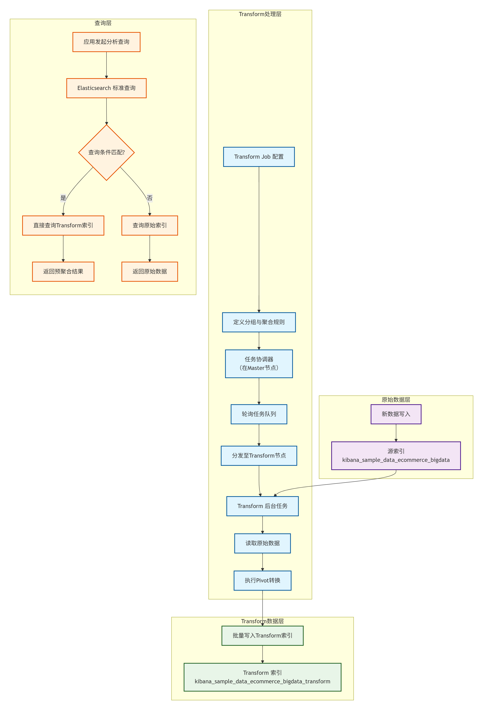

1.  Transform 处理层
2.  ​Transform Job 配置​：定义数据转换规则（分组字段、聚合指标）
3.  ​任务协调器​：Master节点上的调度中心，管理任务分配
4.  ​Transform 后台任务​：工作节点执行的实际数据处理任务
5.  ​Pivot转换​：核心的数据透视表生成逻辑
6.  ​原始数据层​
7.  ​新数据写入​：持续接收新的电商交易数据
8.  ​源索引​：存储原始明细数据的Elasticsearch索引
9.  Transform 数据层
10.  ​批量写入​：将转换后的摘要数据写入目标索引
11.  ​Transform索引​：存储预聚合结果的优化索引
12.  查询层
13.  ​分析查询​：业务应用发起的分析请求
14.  ​查询路由​：智能判断使用Transform索引还是原始索引
15.  ​结果返回​：快速返回预计算的聚合结果

整体核心时序流程图：

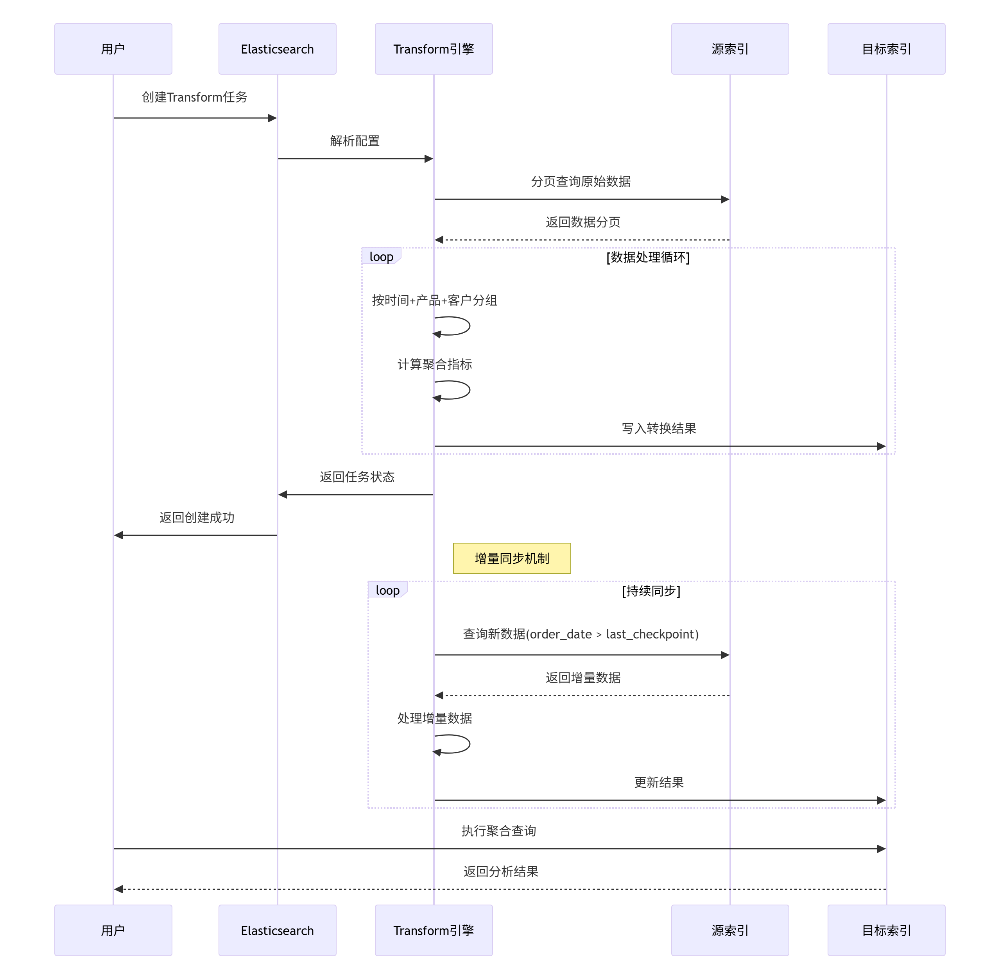

执行流程详解：

1.  ​任务创建阶段​：
2.  用户提交Transform配置
3.  ES解析配置并初始化任务
4.  创建目标索引映射
5.  ​全量处理阶段​：
6.  分页读取源索引数据（每页10,000文档）
7.  按小时+产品+客户三重分组
8.  计算7个聚合指标
9.  写入目标索引
10.  ​增量同步阶段​：
11.  每30秒检查新数据（基于order\_date）
12.  只处理最新数据
13.  更新目标索引中的聚合结果
14.  ​查询使用阶段​：
15.  用户直接查询目标索引
16.  快速获取预聚合结果
17.  支持复杂二次聚合（如产品收入排名）

从聚合结果可以看出：

1.  ​最畅销产品​：
2.  黑色连衣裙（Shift dress - black）：销售额最高（19,374,254）
3.  黑色系带鞋（Lace-ups - black）：销售额第二（14,906,202）
4.  ​产品分布​：
5.  前10名产品贡献了主要收入
6.  长尾产品数量众多（9,045,798个其他产品）
7.  ​业务洞察​：
8.  黑色系产品最受欢迎（前4名都是黑色）
9.  鞋类和连衣裙是主力品类
10.  可考虑增加黑色系产品库存

Transform vs Rollup 核心差异:

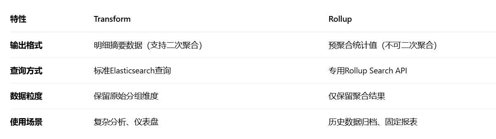