从今天之后的一段时间内，华仔会带着大家一起来从零开始对 ElasticStack 矩阵产品进行深入剖析和项目运维实战，希望大家学完之后可以用到自己的工作中。

这是第十六篇，本篇我将带着大家进行「**ES 索引 GEO深度实战**」。

文章汇总位置：[https://wx.zsxq.com/dweb2/index/columns/51122554151214](https://wx.zsxq.com/dweb2/index/columns/51122554151214)

## **01 前言**

在上篇中 [【ES 入门实战第十五篇】ES 索引 Pipeline 管道二次聚合统计深度实战](https://articles.zsxq.com/id_mf7o1ma31ww4.html)，带着大家进行「**ES 索引 Pipeline 管道二次聚合统计深度实战**」。

今天我们来进行「**ES 索引 GEO深度实战**」，之前有球友留言让安排一下 GEO 的实操案例，这篇就来展开一下。

  

##   
**02 GEO基础知识**

在正式开始实战 GEO 之前，我们先来了解下 GEO的基础知识。

##   
**2.1 GEO概念**

地理信息检索是 ES 的重要特性之一，ES geo主要用于地理信息的存储和搜索。

在实际应用场景中，凡是涉及线下业务、O2O业务多少都会遇到地理信息搜索需求，例如：搜索附近的KTV、搜索附近的餐馆并且按距离排序、地理围栏技术。

ES中涉及地理信息存储的核心概念有两个：

1.  坐标点（geo\_point）：使用的是经纬度的坐标点，可以计算落在某个矩形内的点、以某个点为半径（圆）的点、排序、聚合等操作。
2.  地理形状（geo\_shape）:表示是一个复杂的图形，使用的是GeoJSON的格式来表示复杂的图形。比如：要表示一个图书馆的坐标位置，如果图书馆占的位置比较大，用一个点表示可能就不准了，就可以使用geo\_shape来表示

地理信息搜索主要从数学几何角度去处理，主要有下面几种方式：

1.  按坐标点之间的距离搜索。
2.  坐标点和几何图形之间的包含关系，例如：在地图上画一个圈圈，把包含在这个圈圈内的坐标点找出来。
3.  几何图形之间的关系（包含、交集），例如：在地图上面两个多边形图形交集部分。

## **2.2 坐标点 geo\_point**

ES中最常用的地理信息存储方式，通过坐标点表示一个地理位置，通常指的就是经度和维度。

例如：

1.  一家餐馆的经纬度、外卖小哥当前的经纬度、消费者家庭地址的经纬度。
2.  经纬度在地图上就是一个点（point），ES通过geo\_point类型存储经纬度。

Geo Point 允许你将数据存储为纬度和经度坐标对。 当你要针对点之间的距离过滤数据、在边界框内搜索或使用聚合时，请使用此字段类型。

你可以指定许多超出本文范围的功能和选项。 在这里介绍几个，但你可以在 ES 的文档中查看「**地理边界框**」、「**地理距离**」和「**地理聚合**」的选项。

1.  基于Geo的地理位置范围查询
2.  基于Geo范围内到中心点距离的聚合统计
3.  加入到相关性得分计算中
4.  基于Geo地理位置信息到中心点距离的排序

### **2.2.1 geo\_point 字段类型**

geo\_point 类型的字段接受经纬度对，可以使用：

1.  在 [bounding box](https://www.elastic.co/guide/en/elasticsearch/reference/current/query-dsl-geo-bounding-box-query.html)、中心点一定 [distance](https://www.elastic.co/guide/en/elasticsearch/reference/current/query-dsl-geo-distance-query.html) 内、 [polygon](https://www.elastic.co/guide/en/elasticsearch/reference/current/query-dsl-geo-polygon-query.html) 内或 [geo\_shape 查询](https://www.elastic.co/guide/en/elasticsearch/reference/current/query-dsl-geo-shape-query.html)内查找地理点。
2.  在[地理上](https://www.elastic.co/guide/en/elasticsearch/reference/current/search-aggregations-bucket-geohashgrid-aggregation.html)或按距中心点的[距离](https://www.elastic.co/guide/en/elasticsearch/reference/current/search-aggregations-bucket-geodistance-aggregation.html)聚合文档。
3.  将距离整合到文档的[相关性分数中](https://www.elastic.co/guide/en/elasticsearch/reference/current/query-dsl-function-score-query.html)。
4.  按距离对文档进行[排序](https://www.elastic.co/guide/en/elasticsearch/reference/current/sort-search-results.html#geo-sorting)。

###   
**2.2.2 geo\_point 字段类型支持的参数**

1.  ignore\_malformed：默认false，写入文档时遇到不符合规范的地理位置信息字段值会抛出异常，如果为true，则会忽略。如果设置了script字段，该字段将不能使用
2.  ignore\_z\_value：默认true，三维空间信息将被记录，但是只有经纬度的值能被索引，如果为false，写入文档时如果有超过二维的信息，抛出异常拒绝文档写入
3.  index：是否可以被索引，默认true，如果为false，未建立索引的字段将不能被检索
4.  null\_value：默认值为null，如果设置为null，则意味着该字段是不存在的，如果使用了script，则该字段不可被设置
5.  on\_script\_error：只有设置了script 字段的时候才可以设置该字段，定义使用脚步发生错误时如何处理，默认fail，拒绝整个文档，但是会继续，在元数据字段中注册该字段
6.  script：脚本字段，如果设置了该值，将索引该脚本执行之后的结果，如果在写文档的时候给该字段设置了值，文档将会被拒绝。脚本的格式与运行时相同，应该是一对(lat,lon)双值的形

### **2.2.3 基于坐标点搜索**

当我们在业务系统中将相关的经纬度（坐标点）数据存储下来后，就需要对这些坐标点进行搜索。

ES中根据坐标点搜索的方式如下：

1.  geo\_bounding\_box：在地图上画一个矩形，凡是被矩形包含的坐标点，对应的文档都会搜索出来。
2.  geo\_distance：给出一个坐标点和距离，搜索出这个距离范围内的相关文档。
3.  geo\_polygon：在地图上画一个多边形，凡是被这个图形包含的坐标点，对应的文档都会被搜索出来。

## **2.3 地理形状 geo\_shape**

有时候，单纯使用经纬度表达地理信息是不够的，例如：一所大学占地几千平方米，如果仅使用经纬度这种坐标点表示学校的位置，既不够准确，也无法满足所有业务需求，在地图上一个大学的范围通常都是不规则的多边形，能够代表学校的坐标点有成千上万个，到底使用哪个坐标点代表学校？

我们先看下面业务场景：

1.  当学生进入大学校园，才可以登录校园网，校外不允许登录。
2.  当客户进入商场的时候，就给是会员的客户发短信，推送优惠券。
3.  共享单车，只能在指定的区域停车，否则罚款。

上面业务场景涉及一个关键问题，我们如何在地图上标识一个区域，这个区域可以是一个大学校园、一个商场、一个停车的区域。

对几何形状进行索引和查询（矩形和多边形），当索引的数据和查询包含除了点以外的形状时应该使用ES中geo\_shape类型，以图形的方式存储地理信息，而不仅仅是一个经纬度坐标点。

geo\_shape类型支持的图形包括：点、线、多边形、圆等等，通过geo\_shape我们可以存储一个图形，用来表示一个地理信息。

> 提示：在几何图形上面，一个几何图形也是由无数个坐标点组成，因此geo\_shape的图形也是有多个经纬度组成。

### **2.3.1 geo\_shape 字段类型**

geo\_shape 数据类型有助于对任意地理形状（例如矩形和多边形）进行索引和搜索。 当被索引的数据或被执行的查询包含形状而不仅仅是点时，应该使用它。

你可以使用 [geo\_shape 查询](https://www.elastic.co/guide/en/elasticsearch/reference/current/query-dsl-geo-shape-query.html) 使用此类型查询文档。

### **2.3.2 geo\_shape 字段类型支持的参数**

geo\_shape 映射将GeoJSON几何对象映射到geo\_shape，要是用该映射类型，必须显式的设置，这句话意思就是我们使用该数据类型的时候必须明确指定索引类型。

1.  orientation
2.  可选参数，WKT多边形的默认方向，默认right 逆时针，left 顺时针。
3.  如果要指定right 可以使用如下值设置
4.  right
5.  counterclockwise
6.  ccw
7.  如果要指定LEFT可以使用如下值设置
8.  left
9.  clockwise
10.  cw

> WKT(Well-known text)是一种文本标记语言，用于表示矢量几何对象、空间参照系统及空间参照系统之间的转换

1.  ignore\_malformed：默认 false，如果是不符合GeoJSON或者WKT的格式抛出异常，如果为true，则忽略。
2.  ignore\_z\_value：默认 true，三维空间信息将被记录，但是只有经纬度的值能被索引，如果为false，写入文档时如果有超过二维的信息，抛出异常拒绝文档写入。
3.  Coerce：默认false，如果为true，如果是非封闭的多边形将自动闭合形成封闭的多边形。

### **2.3.3 基于地理形状的搜索**

ES中如果我们存储的数据是geo\_shape类型，那么只能通过geo\_shape类型进行图形搜索。

下面是常用的地理形状搜索：

1.  交集：两个geo\_shape图形重叠的话，就匹配成功（默认方式）。
2.  不重叠：两个geo\_shape图形不重叠的话，就匹配成功。
3.  包含： 一个geo\_shape图形包含另外一个图形，就匹配成功。

基于地理形状，我们很容易实现地理围栏技术。例如: 共享单车必须在指定位置停车的例子，在地图上画一个区域代表停车区域，如果共享单车的坐标落入这个停车区域停车就是合法的，否则违规。

## **2.4 GEO 相关函数**

官方文档地址：[https://www.elastic.co/guide/en/elasticsearch/reference/8.17/geo-queries.html](https://www.elastic.co/guide/en/elasticsearch/reference/8.17/geo-queries.html)

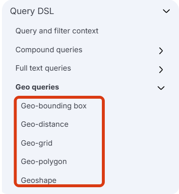

1.  geo\_bounding\_box：查找落在矩形区域内的点。
2.  geo\_distance：查找距离某个点一定距离范围内的点。
3.  geo\_grid：基于 Geohash 将地理点分组到网格中，用于热力图等。
4.  geo\_polygon：查找落在多边形区域内的点。
5.  geo\_shape：用于更复杂的地理形状（如线、多边形等）之间的关系查询（如相交、包含等）。

地理位置形状信息可以使用GeoJSON或者WKT表示，下面是GeoJSON，WKT与ES中类型的对应关系：

  
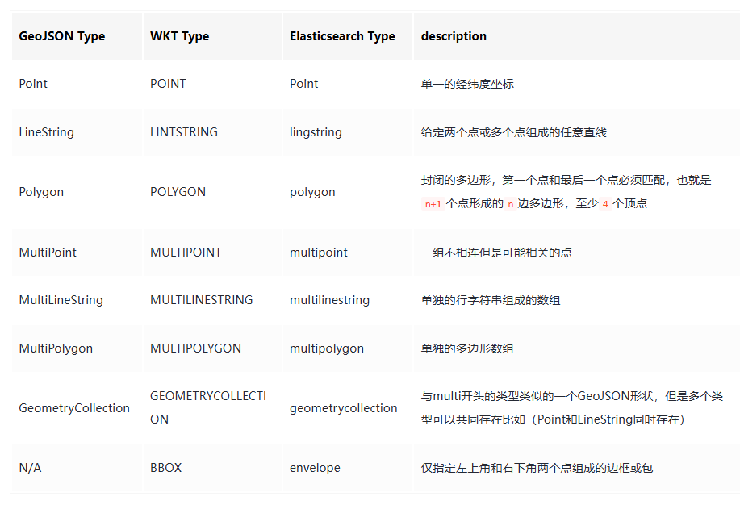

对于所有的类型都应该有子类型和字段坐标，在GeoJSON、WKT以及ES中，坐标信息都是(经度，纬度)，这与很多的地理信息API是不同的，地图地理信息API通常使用(纬度，经度)，这一点是需要注意的一个地方。

## **2.5 GEO 案例**

今天的案例还是以航班数据为主，前面已经提过：

静静等待成功，如果有报错，请检查机器磁盘是否已满：

在进行任何地理查询或聚合之前，​必须确保 OriginLocation和 DestLocation字段被映射为 geo\_point类型。我们先来查看下 kibana\_sample\_data\_flights 的 mapping 信息：

\# 查询 ES 索引全文搜索 mapping

GET kibana\_sample\_data\_flights/\_mapping

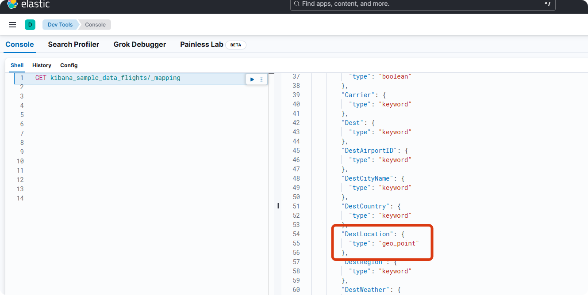

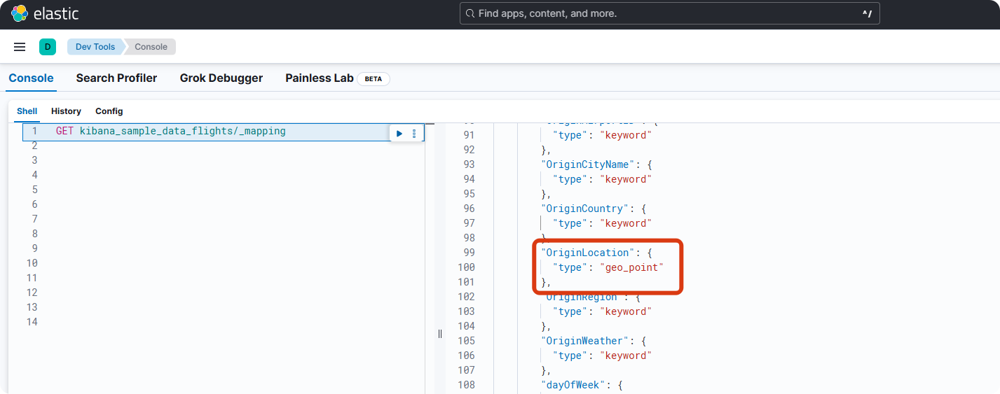

## **03 GEO深度实战**

## **3.1 GEO 地理边界框过滤**

### **3.1.1 查询核心目标**

下面示例查询的目标是：​查找所有出发地机场位于美国西海岸特定矩形区域内的航班。

具体范围是：

1.  ​左上角​：纬度 49.0°N，经度 -125.0°W（加拿大温哥华附近）。
2.  ​右下角​：纬度 32.0°N，经度 -114.0°W（美国亚利桑那州附近）。

这个矩形覆盖了美国西海岸主要区域，包括华盛顿州、俄勒冈州和加利福尼亚州等。

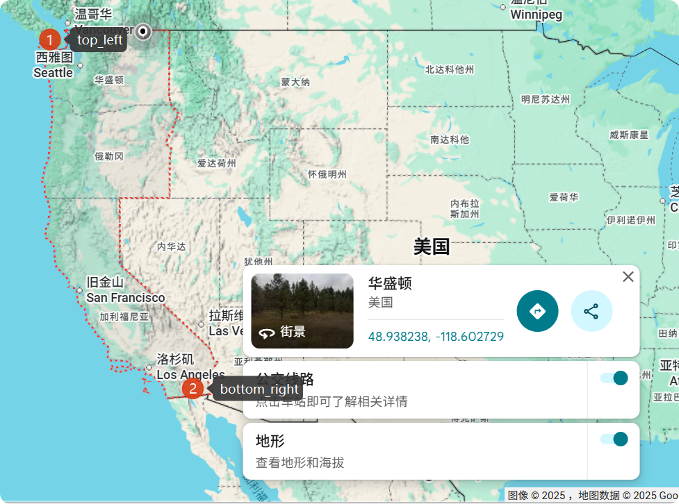

\# geo 地理边界框过滤-查找所有出发地机场位于美国西海岸特定矩形区域内的航班。

GET kibana\_sample\_data\_flights/\_search

{

"size": 2,

"query": {

"bool": {

"filter": \[

{

"geo\_bounding\_box": {

"OriginLocation": {

"top\_left": {

"lat": 49.0,

"lon": \-125.0

},

"bottom\_right": {

"lat": 32.0,

"lon": \-114.0

}

}

}

}

\]

}

}

}

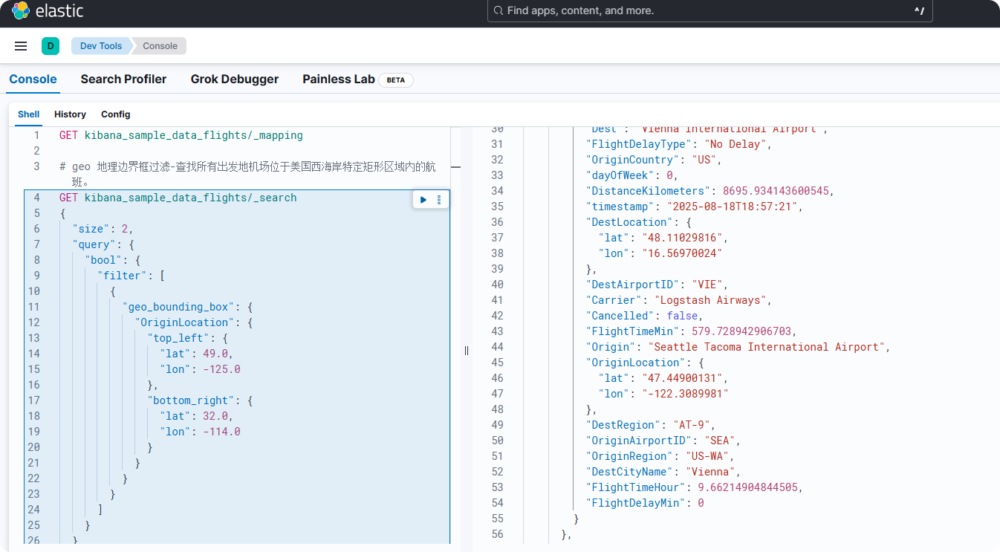

#### 业务价值：

1.  ​区域航班监控​：实时监控美国西海岸主要机场的航班起降情况。
2.  ​航线规划​：分析西海岸出发航班的航线分布和目的地偏好。
3.  ​资源调配​：帮助航空公司优化西海岸地区的航班调度和资源配置。
4.  ​市场分析​：了解西海岸出发航班的票价、载客率等商业指标。
5.  ​异常检测​：监控西海岸航班的准点率和异常情况。

### **3.1.2 底层架构设计**

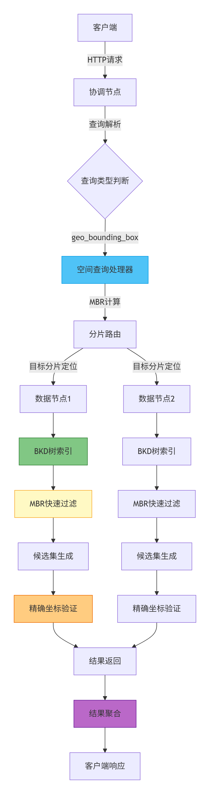

### **3.1.3 执行流程**

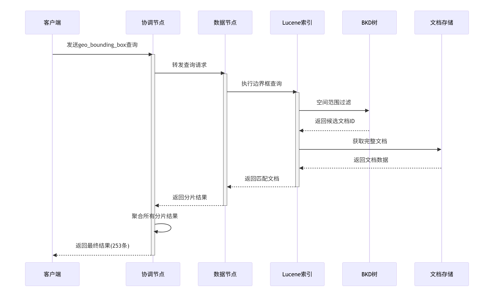

执行流程详细步骤：

1.  ​客户端发送请求​：客户端向协调节点（CN）发送一个搜索请求，请求中包含一个地理边界框过滤器。
2.  ​协调节点解析请求​：
3.  解析索引名称（kibana\_sample\_data\_flights）
4.  确定该索引的分片分布情况（假设有3个主分片，分布在3个数据节点上）
5.  将查询请求转发给所有相关分片（因为边界框查询需要扫描所有分片）
6.  ​数据节点执行查询（并行）​​：
7.  每个数据节点收到请求后，在本地分片上执行查询。
8.  使用BKD树（空间索引）快速查找落在边界框内的文档。
9.  由于是filter上下文，不计算相关度分数，只收集匹配的文档ID。
10.  每个数据节点返回匹配的文档ID和需要的字段（由于size=2，但此时每个分片返回的是自己分片上的匹配文档，协调节点最后会合并）。
11.  ​协调节点合并结果​：
12.  协调节点收集所有分片的匹配文档，合并总数为253条。
13.  由于请求中指定了size=2，所以只取前2条文档（这里没有指定排序，默认按文档索引顺序）。
14.  协调节点根据文档ID去对应的数据节点获取这2条文档的详细内容（\_source字段）。
15.  ​返回最终结果​：
16.  协调节点将最终结果（包括2条文档的详细内容和总数253）返回给客户端。

## **3.2 GEO查找距离范围实例**

以给定位置作圆点，画一个给定距离的圆，以匹配圆范围内的文档数据，下面用例子来说明这个圆形过滤。

### **3.2.1 查询核心目标**

下面示例查询的目标是：查找所有目的地机场距离悉尼歌剧院（坐标：纬度-33.856778，经度151.215278）200公里范围内的航班。

这是一个典型的「**附近地点搜索**」场景，使用geo\_distance查询实现查找特定地理点周围的航班目的地。

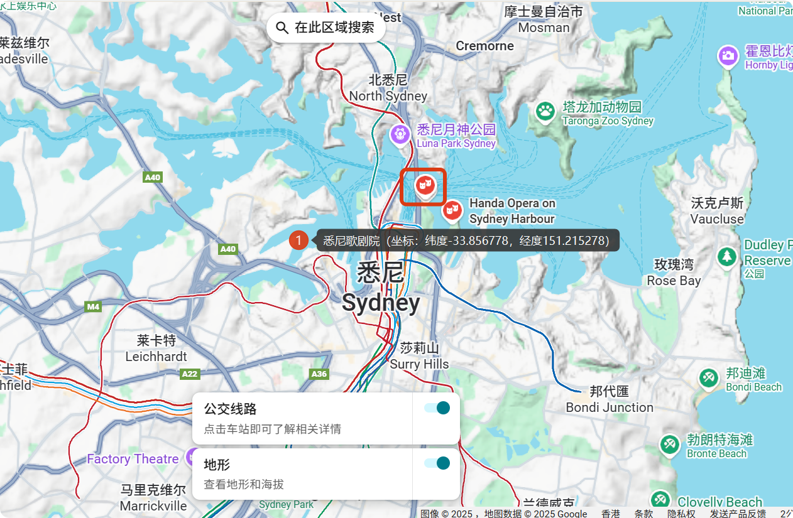

\# geo 查找距离某个点一定范围内的航班

GET kibana\_sample\_data\_flights/\_search

{

"size": 2,

"query": {

"bool": {

"filter": \[

{

"geo\_distance": {

"ignore\_unmapped":true,

"\_name":"geo\_distance\_query",

"distance": "200km", // 以指定的点为圆心，以distance的值为半径画圆，匹配圆内的地点信息数据，距离单位默认米(m),其他距离单位可以参考官网

"DestLocation": {

"lat": \-33.856778,

"lon": 151.215278

}

}

}

\]

}

}

}

过滤查询可以接收的参数说明：

1.  distance：以指定的点为圆心，以distance的值为半径画圆，匹配圆内的地点信息数据，距离单位默认米(m),其他距离单位可以参考官网。
2.  \_nam：该查询语句的名称
3.  validation\_method：是否接受错误的地点坐标信息
4.  STRICT 默认值，抛出异常
5.  COERCE 尝试修正错误坐标信息为正确的坐标
6.  IGNORE\_MALFORMED 允许无效的错误的地点坐标信息

geo\_distance的过滤请求可以「**匹配**」一篇文档中的「**多个地点值**」，「**只要有**」一个地点值匹配，该文档就会被返回。

  
ignore\_unmapped字段的值设置为true，查询时：

1.  如果字段不匹配，会忽略报错，返回空文档。
2.  如果设置为false，遇到不匹配的字段会抛出异常。

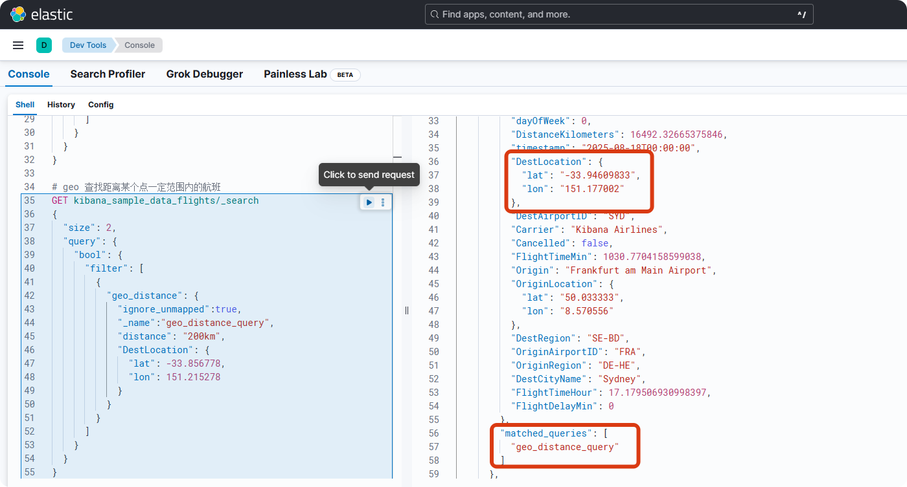

#### 业务价值：

1.  ​机场服务范围分析​：确定哪些航班服务于悉尼大都会区。
2.  ​地面交通规划​：帮助旅客评估从机场到市中心的交通方案。
3.  ​区域航班监控​：监控悉尼周边机场的航班活动。
4.  ​资源调配​：优化机场接驳服务资源配置。
5.  ​旅行规划​：为旅客提供悉尼周边机场的航班选择。

### **3.2.2 底层架构设计**

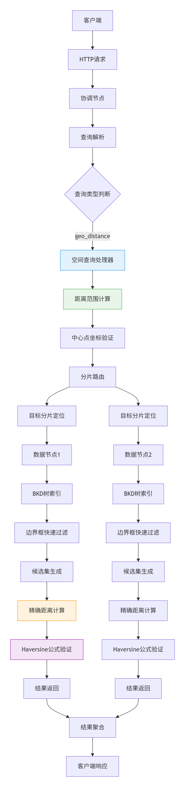

### **3.2.3 执行流程**

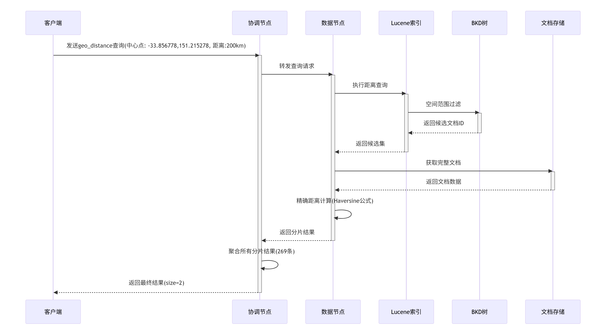

执行流程详细步骤：

1.  客户端请求阶段
2.  ​客户端发送查询​：指定中心点坐标(-33.856778,151.215278)和搜索半径(200km)
3.  ​协调节点接收​：验证参数有效性，计算初始边界框
4.  分布式处理阶段
5.  ​协调节点转发​：将查询分发到包含目标数据的数据节点
6.  ​数据节点处理​：
7.  加载Lucene索引
8.  使用BKD树进行空间范围过滤
9.  获取候选文档ID集合
10.  ​文档数据获取​：从文档存储中检索完整文档
11.  精确计算阶段
12.  ​距离计算​：对每个候选文档使用Haversine公式计算实际距离
13.  ​距离验证​：检查计算结果是否≤200km
14.  ​结果返回​：数据节点返回符合条件的文档
15.  结果聚合阶段
16.  ​协调节点聚合​：收集所有分片结果(共269条)
17.  ​分页处理​：应用size=2参数，只返回前2条文档
18.  ​响应构建​：添加元数据(took=16ms)和结果集

## **3.3 GEO距离排序实例**

### **3.3.1 查询核心目标**

下面示例查询的目标是：查找所有航班，并按出发机场（OriginLocation）距离法兰克福市中心（坐标：50.110924, 8.682127）的距离由近到远排序。

这是一个典型的地理距离排序场景，用于查找距离特定地点最近的航班出发地。

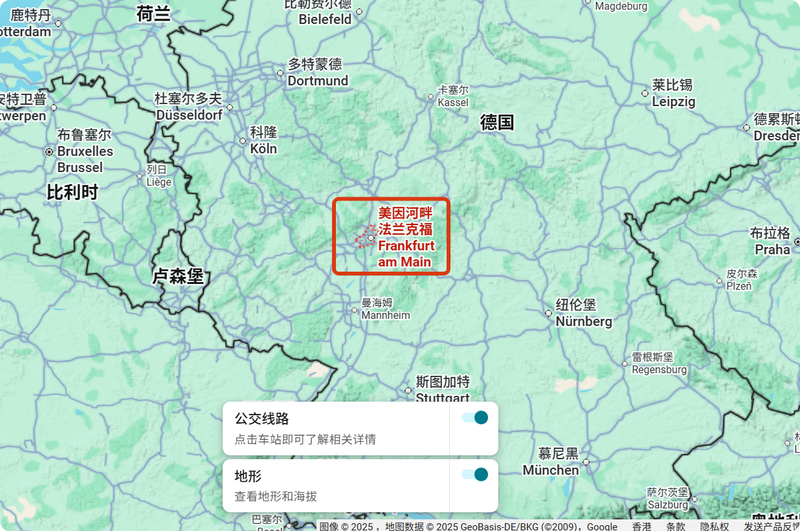

\# geo 按距离某个点的距离排序

GET kibana\_sample\_data\_flights/\_search

{

"size": 2,

"sort": \[

{

"\_geo\_distance": {

"OriginLocation": {

"lat": 50.110924,

"lon": 8.682127

},

"order": "asc", // 升序 asc还是降序 desc

"unit": "km", // 距离单位聚合 unit 支持mi(miles),in(inches),yd(yards),km(kilometers),cm(centimeters),mm(millimeters),m(meters)

"distance\_type": "arc" // 指定聚合计算方式，精确度。arc：默认，精确度高 plane：精确度低，距离仅时推荐使用，比如5km内。

// 计算距离的方式，也就是distance生效的方式，默认是上述所说的为圆也就是弧形计算(arc)，另一个可选值是平面的(plane)，效率比arc快，但是精度有所损失，尤其是distance的值很大时或者两极处。plane比喻地球是平的，在赤道附近时精度是最佳的，靠近两级时精度略有损失。比如想找附近5km的地点，然后找到了5.2km的地点，这个误差取决于我们是否可以接受

}

}

\],

"query": {

"match\_all": {} // 可以替换为其他查询条件

}

}

关键字段含义解析：

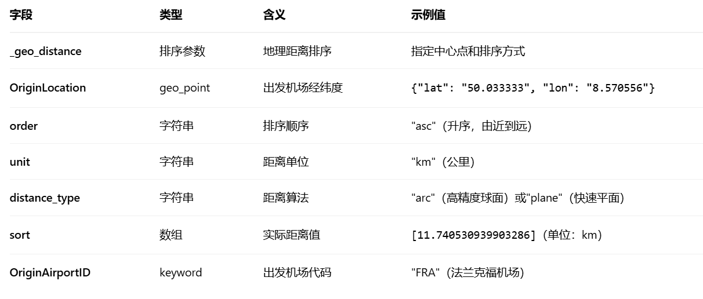

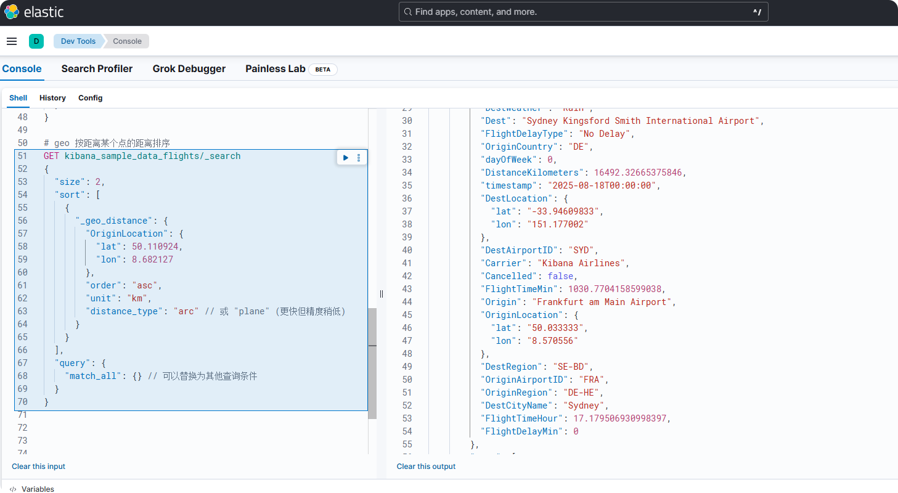

业务价值：

1.  ​最近机场查找​：帮助旅客查找距离法兰克福市中心最近的出发机场。
2.  ​航线优化​：为航空公司提供机场辐射范围分析。
3.  ​资源调配​：辅助机场规划地面交通服务。
4.  ​旅行规划​：帮助旅客选择最便捷的出发机场。
5.  ​市场分析​：研究不同距离机场的航班票价特征。

### **3.3.2 底层架构设计**

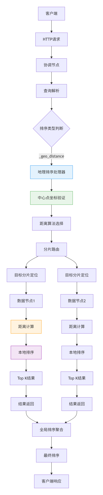

### **3.3.3 执行流程**

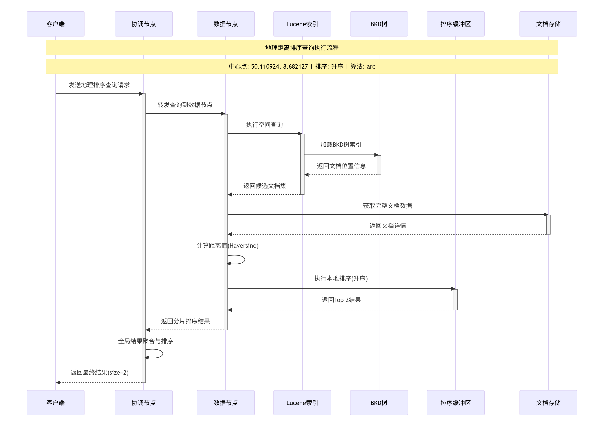

执行流程详细步骤：

1.  阶段1：查询请求与分发
2.  ​客户端发送请求​
3.  指定地理排序参数：\_geo\_distance
4.  中心点坐标：50.110924, 8.682127（法兰克福市中心）
5.  排序顺序：asc（由近到远）
6.  距离单位：km
7.  算法类型：arc（高精度球面算法）
8.  ​协调节点处理​
9.  解析查询参数
10.  验证坐标有效性
11.  确定目标数据分片
12.  分发查询到相关数据节点
13.  阶段2：数据节点处理
14.  ​空间索引查询​
15.  加载Lucene索引
16.  通过BKD树进行空间范围筛选
17.  获取候选文档位置信息
18.  ​文档数据获取​
19.  从文档存储中检索完整文档
20.  包含机场坐标、航班信息等
21.  ​距离计算与排序​
22.  使用Haversine公式计算球面距离
23.  在排序缓冲区进行本地Top N排序
24.  维护最小堆优化排序性能
25.  阶段3：结果聚合与返回
26.  ​全局结果处理​
27.  协调节点收集各分片Top N结果
28.  执行最终全局排序
29.  应用分页参数(size=2)
30.  ​响应构建​
31.  包含实际距离值(sort字段)
32.  添加执行元数据(took=22ms)
33.  返回排序后的文档列表

## **3.4 GEO地理聚合实例**

### **3.4.1 查询核心目标**

下面示例查询的目标是：分析全球不同地理区域的航班平均票价分布。

具体来说：

1.  ​空间分桶​：将全球划分为多个地理网格（Geohash精度5，约4.9km×4.9km）。
2.  ​票价分析​：计算每个网格内航班的平均票价。
3.  ​热点识别​：发现高票价和低票价的区域分布模式。

\# geo 地理聚合 - 按平均票价分桶

GET kibana\_sample\_data\_flights/\_search

{

"size": 0,

"aggs": {

"destination\_heatmap": {

"geohash\_grid": {

"field": "DestLocation",

"precision": 5 // 网格精度（1-12，数值越大格子越小越精确）

},

"aggs": {

"avg\_price": {

"avg": {

"field": "AvgTicketPrice"

}

}

}

}

}

}

关键字段含义解析：

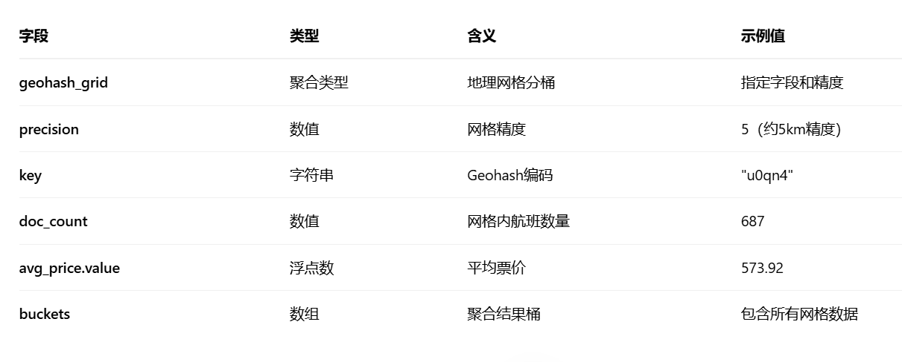

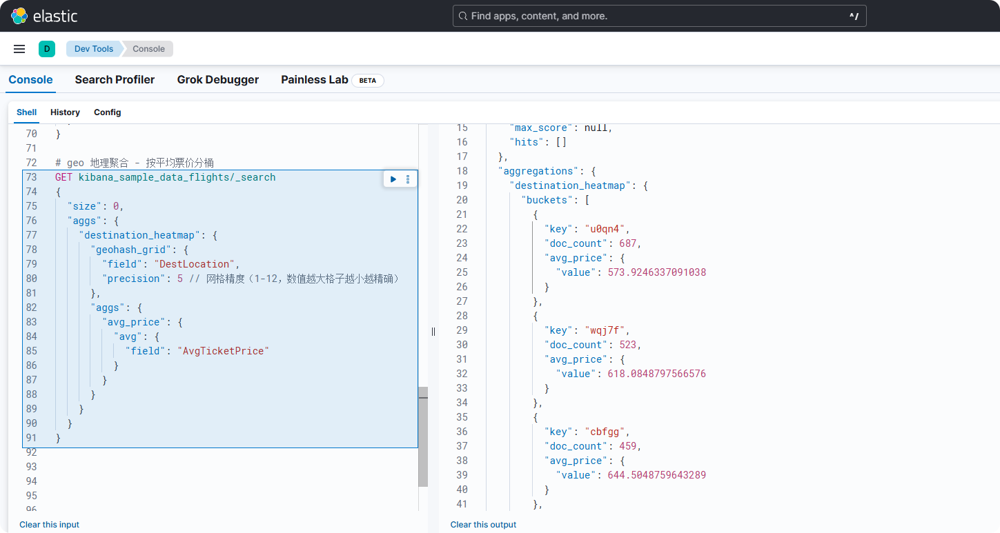

业务价值：

1.  ​票价区域分析​：识别高消费区域和性价比区域
2.  ​航线定价优化​：为不同区域的航线制定差异化定价策略
3.  ​市场潜力挖掘​：发现潜在的高价值航线区域
4.  ​竞争分析​：比较不同航空公司在各区域的票价水平

### **3.4.2 底层架构设计**

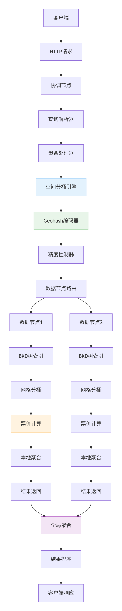

### **3.4.3 执行流程**

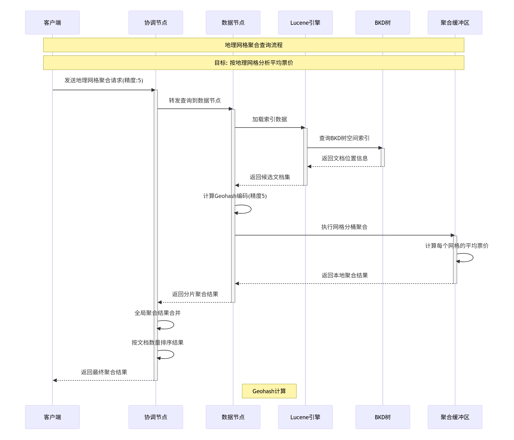

1.  阶段1：查询请求与分发
2.  ​客户端发送请求​
3.  聚合类型：geohash\_grid
4.  目标字段：DestLocation
5.  网格精度：5（约5km×5km）
6.  子聚合：计算AvgTicketPrice的平均值
7.  ​协调节点处理​
8.  解析聚合参数
9.  验证字段映射（确保DestLocation是geo\_point类型）
10.  确定目标数据分片
11.  生成分布式执行计划
12.  阶段2：数据节点处理
13.  ​空间索引查询​
14.  加载Lucene索引
15.  通过BKD树快速访问空间数据
16.  获取所有文档的地理坐标
17.  网格分桶聚合​
18.  按Geohash值将文档分组到不同网格
19.  对每个网格内的文档计算平均票价
20.  使用增量算法避免内存溢出：
21.  阶段3：全局结果处理
22.  ​结果聚合与排序​
23.  协调节点合并所有分片结果
24.  对相同Geohash的桶进行合并：
25.  响应构建​
26.  按doc\_count降序排列结果
27.  构建标准的聚合响应格式
28.  添加执行元数据（took=10ms）

## **3.5 GEO 计算中心点和边界实例**

### **3.5.1 查询核心目标**

下面示例查询的目标是：分析航班目的地（DestLocation）的地理分布特征。

具体包括：

1.  ​地理质心计算​：所有目的地机场的平均位置。
2.  ​地理边界框计算​：所有目的地机场的分布范围（最小边界矩形）。

\# geo 地理聚合-质心与边界框计算

GET kibana\_sample\_data\_flights/\_search

{

"size": 0,

"aggs": {

"destination\_centroid": {

"geo\_centroid": {

"field": "DestLocation"

}

},

"destination\_bounds": {

"geo\_bounds": {

"field": "DestLocation"

}

}

}

}

关键字段含义解析：

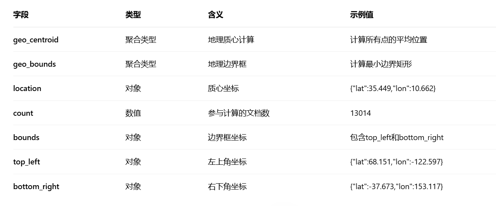

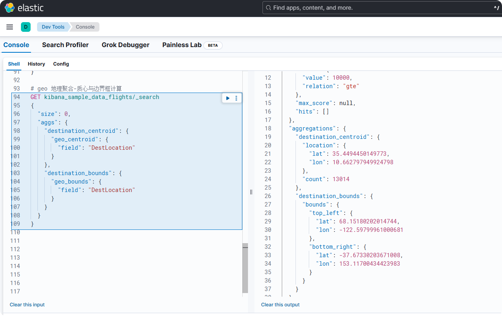

业务价值:

1.  ​中心位置分析​：识别航班目的地的中心聚集区域
2.  ​分布范围分析​：了解航班目的地的全球分布范围
3.  ​网络覆盖评估​：评估航空公司的航线网络覆盖情况
4.  ​资源规划​：为机场建设和航线规划提供地理参考

### **3.5.2 底层架构设计**

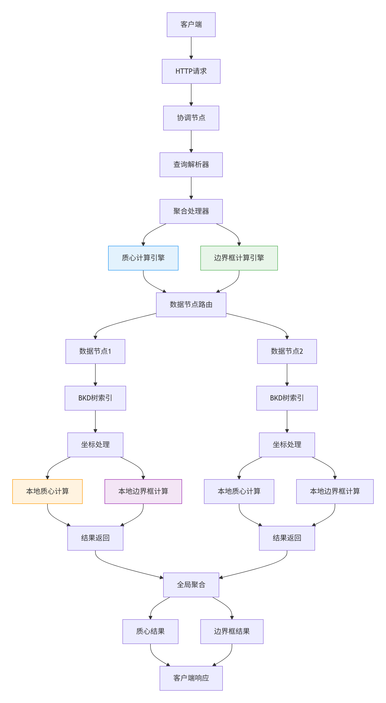

### **3.5.3 执行流程**

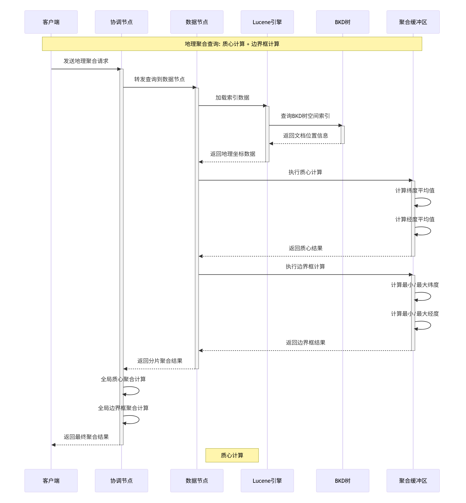

执行流程详细步骤：

1.  阶段1：查询请求与分发
2.  ​客户端发送请求​
3.  聚合类型：geo\_centroid（计算地理质心）+ geo\_bounds（计算地理边界框）
4.  目标字段：DestLocation
5.  查询范围：所有航班目的地
6.  ​协调节点处理​
7.  解析聚合参数
8.  验证字段映射类型（确保是geo\_point）
9.  确定目标数据分片
10.  生成分布式执行计划
11.  阶段2：数据节点处理
12.  ​空间索引查询​
13.  加载Lucene索引
14.  通过BKD树访问空间数据
15.  获取所有文档的地理坐标
16.  质心计算（本地）​
17.  增量计算纬度和经度总和
18.  记录文档数量
19.  ​边界框计算（本地）​
20.  跟踪最小/最大纬度和经度
21.  阶段3：全局聚合处理
22.  ​全局质心计算
23.  全局边界框计算

## **3.6 GEO 多边形区域过滤实例**

这个示例需要重新创建一个新的索引，相关字段需要修改为 geo\_shape 类型，才能使用。

### **3.6.1 创建mapping**

这里将 OriginLocation、DestLocation 字段类型设置为 geo\_shape。

\# 创建 geo\_shape 类型 mapping

PUT /kibana\_sample\_data\_flights\_shape

{

"mappings": {

"dynamic": "strict",

"dynamic\_templates": \[

{

"strings\_as\_keywords": {

"match\_mapping\_type": "string",

"mapping": {

"ignore\_above": 256,

"type": "keyword"

}

}

},

{

"numbers\_as\_floats": {

"match\_mapping\_type": "long",

"mapping": {

"type": "float"

}

}

}

\],

"date\_detection": false,

"numeric\_detection": false,

"properties": {

"@timestamp": {

"type": "date"

},

"@version": {

"type": "keyword"

},

"AvgTicketPrice": {

"type": "float"

},

"Cancelled": {

"type": "boolean"

},

"Carrier": {

"type": "keyword"

},

"Dest": {

"type": "keyword"

},

"DestAirportID": {

"type": "keyword"

},

"DestCityName": {

"type": "keyword"

},

"DestCountry": {

"type": "keyword"

},

"DestLocation": {

"type": "geo\_shape"

},

"DestRegion": {

"type": "keyword"

},

"DestWeather": {

"type": "keyword"

},

"DistanceKilometers": {

"type": "float"

},

"DistanceMiles": {

"type": "float"

},

"FlightDelay": {

"type": "boolean"

},

"FlightDelayMin": {

"type": "integer"

},

"FlightDelayType": {

"type": "keyword"

},

"FlightNum": {

"type": "keyword"

},

"FlightTimeHour": {

"type": "keyword"

},

"FlightTimeMin": {

"type": "float"

},

"Origin": {

"type": "keyword"

},

"OriginAirportID": {

"type": "keyword"

},

"OriginCityName": {

"type": "keyword"

},

"OriginCountry": {

"type": "keyword"

},

"OriginLocation": {

"type": "geo\_shape"

},

"OriginRegion": {

"type": "keyword"

},

"OriginWeather": {

"type": "keyword"

},

"dayOfWeek": {

"type": "integer"

},

"event": {

"properties": {

"created": {

"type": "date"

},

"dataset": {

"type": "keyword"

},

"ingested": {

"type": "date"

}

}

},

"tags": {

"type": "keyword"

},

"timestamp": {

"type": "date"

}

}

}

}

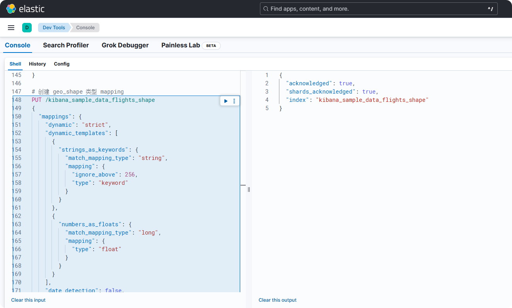

### **3.6.2 创建预处理管道**

下面我们通过 painless 脚本来实现 geo\_point 到 geo\_shape 的数据转换。

\# geo\_shape 创建预处理管道

PUT \_ingest/pipeline/convert\_geo\_point\_to\_shape

{

"processors": \[

{

"script": {

"lang": "painless",

"source": """

// 转换 DestLocation

if (ctx.DestLocation != null) {

try {

double lat = Double.parseDouble(ctx.DestLocation.lat.toString());

double lon = Double.parseDouble(ctx.DestLocation.lon.toString());

ctx.DestLocation = \[

'type': 'point',

'coordinates': \[lon, lat\]

\];

} catch (Exception e) {

ctx.remove('DestLocation');

}

}

// 转换 OriginLocation

if (ctx.OriginLocation != null) {

try {

double lat = Double.parseDouble(ctx.OriginLocation.lat.toString());

double lon = Double.parseDouble(ctx.OriginLocation.lon.toString());

ctx.OriginLocation = \[

'type': 'point',

'coordinates': \[lon, lat\]

\];

} catch (Exception e) {

ctx.remove('OriginLocation');

}

}

"""

}

}

\]

}

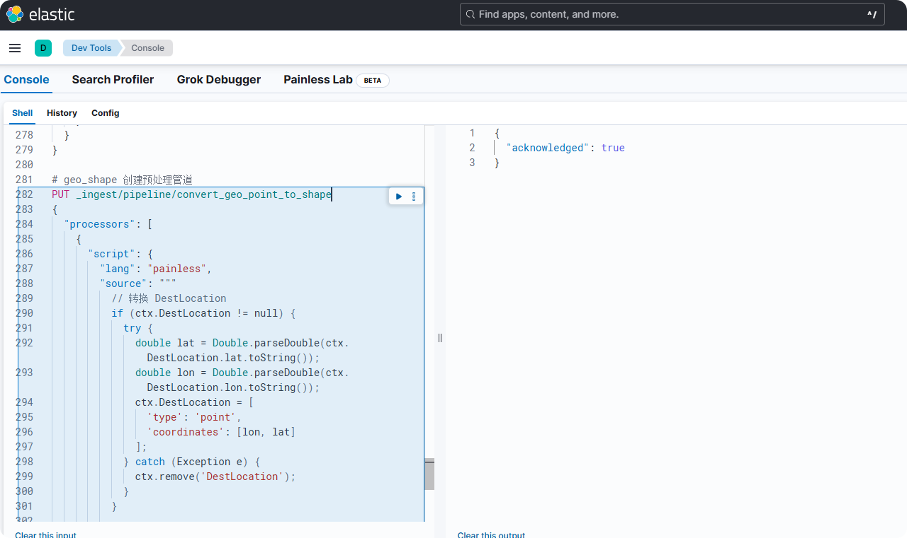

### **3.6.3 重建索引**

接着使用刚刚创建的预处理管道来进行索引重建：

\# 基于 pipeline 进行 geo\_shape 重建索引

POST \_reindex

{

"source": {

"index": "kibana\_sample\_data\_flights"

},

"dest": {

"index": "kibana\_sample\_data\_flights\_shape",

"pipeline": "convert\_geo\_point\_to\_shape"

}

}

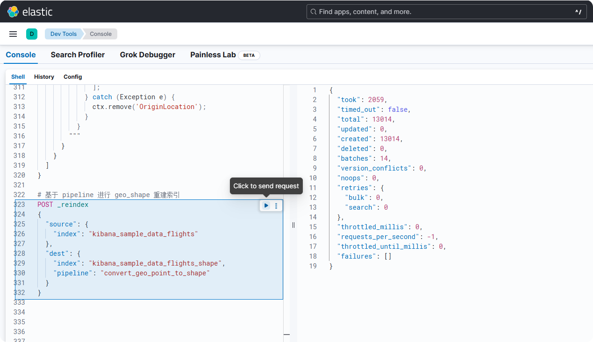

### **3.6.4 验证数据**

我们来验证下数据是否正确生成：

\# 验证数据转换

GET kibana\_sample\_data\_flights\_shape/\_search

{

"size": 1,

"\_source": \["DestLocation", "OriginLocation"\]

}

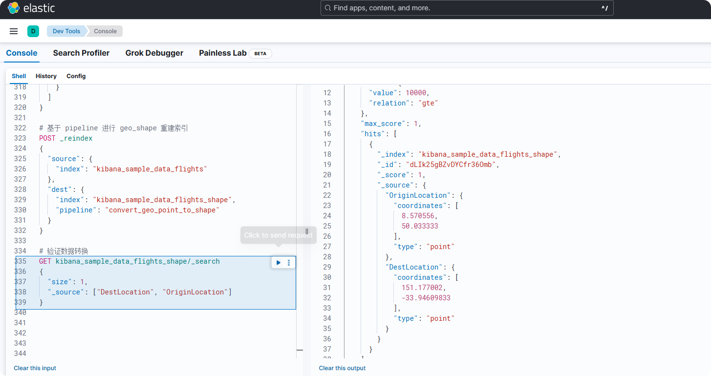

### **3.6.5示例查询核心目标**

下面示例查询的目标是：查找目的地机场位于特定地理区域内的航班​。

1.  ​欧洲地区查询​：
2.  目标：查找目的地机场在欧洲大陆的航班
3.  区域范围：多边形覆盖欧洲主要地区（35°N-60°N，-10°W-25°E）
4.  ​北美地区查询​：
5.  目标：查找目的地机场在北美大陆的航班
6.  区域范围：多边形覆盖北美主要地区（25°N-50°N，-130°W--60°W）

\# geo\_shape 查询欧洲地区的航班

GET kibana\_sample\_data\_flights\_shape/\_search

{

"size": 2,

"query": {

"bool": {

"filter": \[

{

"geo\_shape": {

"DestLocation": {

"shape": {

"type": "polygon",

"coordinates": \[

\[

\[-10.0, 60.0\], // 西北欧

\[25.0, 60.0\], // 东北欧

\[25.0, 35.0\], // 东南欧

\[-10.0, 35.0\], // 西南欧

\[-10.0, 60.0\] // 闭合

\]

\]

},

"relation": "within"

}

}

}

\]

}

}

}

\# geo\_shape 查询北美地区的航班

GET kibana\_sample\_data\_flights\_shape/\_search

{

"size": 2,

"query": {

"bool": {

"filter": \[

{

"geo\_shape": {

"DestLocation": {

"shape": {

"type": "polygon",

"coordinates": \[

\[

\[-130.0, 50.0\], // 西北美

\[-60.0, 50.0\], // 东北美

\[-60.0, 25.0\], // 东南美

\[-130.0, 25.0\], // 西南美

\[-130.0, 50.0\] // 闭合

\]

\]

},

"relation": "within"

}

}

}

\]

}

}

}

  
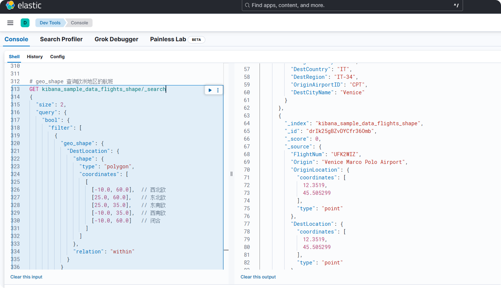

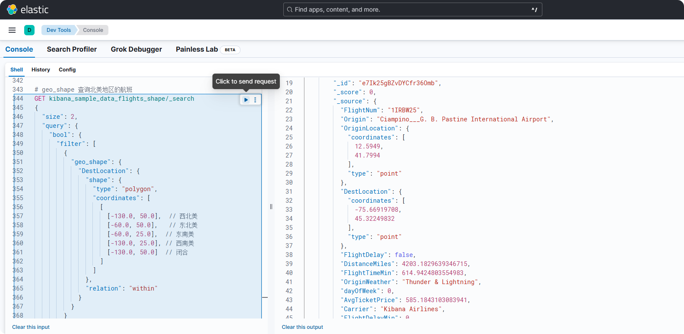

业务价值：

1.  ​区域航班分析​：研究特定区域的航班分布
2.  ​航线规划​：分析航空公司区域航线网络
3.  ​市场研究​：了解不同区域的票价特征
4.  ​资源调配​：辅助机场和航空公司优化资源配置

### **3.6.5.1 底层架构设计**

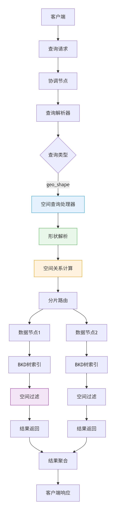

### **3.6.5.2 执行流程**

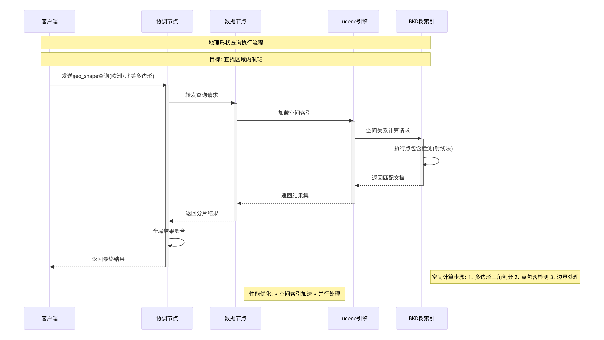

执行流程详细步骤：

1.  阶段1：查询准备
2.  ​客户端请求​：
3.  指定地理区域（多边形坐标）
4.  设置空间关系（within）
5.  定义返回结果数量（size=2）
6.  ​协调节点处理​：
7.  解析多边形坐标
8.  计算最小边界框（MBR）
9.  确定目标数据分片
10.  生成分布式执行计划
11.  阶段2：分布式空间计算
12.  ​空间索引查询​：
13.  加载BKD树空间索引
14.  使用MBR快速筛选候选点
15.  ​精确点包含检测​：
16.  使用射线法算法
17.  ​结果收集​：
18.  收集匹配文档
19.  应用size参数限制
20.  返回分片级别结果
21.  阶段3：结果处理
22.  ​全局聚合​：
23.  协调节点合并所有分片结果
24.  按相关性排序（本例无评分）
25.  应用最终size参数
26.  ​响应构建​：
27.  添加执行元数据（took=5ms）
28.  包含分片信息
29.  返回匹配文档