从今天之后的一段时间内，华仔会带着大家一起来从零开始对 ElasticStack 矩阵产品进行深入剖析和项目运维实战，希望大家学完之后可以用到自己的工作中。

这是第十四篇，本篇我将带着大家进行「**ES 索引 Suggest、自动补全、拼写错误、模糊查询、高亮显示深度实战**」。

文章汇总位置：[https://wx.zsxq.com/dweb2/index/columns/51122554151214](https://wx.zsxq.com/dweb2/index/columns/51122554151214)

## **01 前言**

在上篇中 [【ES 入门实战第十三篇】ES 索引全文搜索及 IK 中文分词器深度实战](https://articles.zsxq.com/id_r7r243m5nw8q.html)，带着大家进行「**ES 索引全文搜索及 IK 中文分词器深度实战**」。

今天我们来进行「**ES 索引 Suggest、自动补全、拼写错误、模糊查询、高亮显示深度实战**」。

##   
**02 ES 索引推荐搜索 Suggest API 实战**

关于小红书电商的 suggest 实战：[【电商实战项目第四十四篇】华仔电商实战项目商品中心服务Elasticsearch 10W商品搜索及suggest接口开发](https://articles.zsxq.com/id_76xgx3mkx3z4.html)

## **2.1 核心基础概念**

### **2.1.1 Suggest**

​目标​：处理用户输入的搜索词错误或提供替代/补充建议。简单来说，Suggester 会将输入的文本分解为 token，然后在索引里查找相似的 Term。

根据使用场景的不同，ES 提供了以下 4 种 Suggester：

  
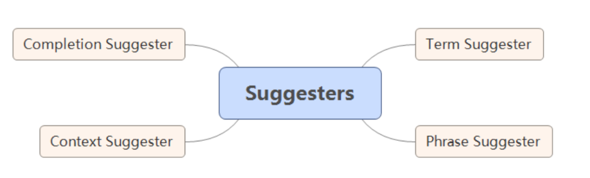

1.  Term Suggester：基于单词的纠错补全，它使用编辑距离（Levenshtein Distance）算法为查询中的单个词提供相似词建议。例如将 filight 纠正为 flight。
2.  Phrase Suggester：基于短语的纠错补全，在 Term Suggester 基础上构建，用于对整个短语提供纠正建议。它会考虑短语中词项的上下文和词频，给出更自然的整体建议。例如将 filight to beijin 纠正为 flight to beijing。
3.  Completion Suggester：专为自动补全（Auto-Completion）​​ 设计，输入词语的前半部分自动补全单词。它并非用于纠正错误，而是提供前缀匹配。其底层依赖内存中的有限状态转换器（FST）​​ 数据结构，实现极速的查询响应。
4.  Context Suggester：基于上下文的补全提示，可以实现上下文感知推荐。

### **2.1.2 模糊查询 Fuzzy Query**

​目标​：在标准查询中容忍用户输入的拼写错误，确保「**搜错也能搜到**」。

​原理​：基于编辑距离，允许查询词项与目标词项之间存在指定数量的字符差异（增、删、改、换位）。例如，设置 fuzziness: "AUTO"，查询 kunming 可以匹配到 Kunming。

### **2.1.3 高亮显示 Highlighting**

​目标​：在返回的搜索结果中，明确标识出哪些文本片段与查询条件匹配，提升用户体验。

​原理​：从原始文档（\_source）或存储的字段中提取内容，定位匹配词元的位置，并用预定义的标签（如 <em>）包裹它们。

### **2.1.4 核心区别 Suggest VS Fuzzy Query**

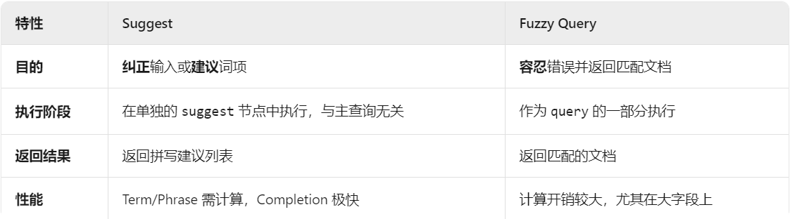

## **2.2 使用场景**

1.  ​搜索框自动补全​：用户输入 "Lo"，下拉框立即提示 "London", "Los Angeles"。 -> ​Completion Suggester​
2.  ​​您是不是要找？​​：用户输入 "flighht to beijin"，系统提示 "Did you mean: flight to beijing?"。 -> ​Phrase Suggester​
3.  ​容错搜索​：即使用户输入 "madrid"（小写）或 "madrid"（拼写错误），依然能搜到目的地为 "Madrid" 的航班。 -> ​Fuzzy Query​
4.  ​结果预览​：在搜索结果列表中，目的地和出发地城市名中匹配的关键词被高亮显示，让用户快速确认结果相关性。 -> ​Highlighting

## **2.3 推荐搜索案例**

官方地址：[https://www.elastic.co/guide/en/elasticsearch/reference/8.17/search-suggesters.html](https://www.elastic.co/guide/en/elasticsearch/reference/8.17/search-suggesters.html)

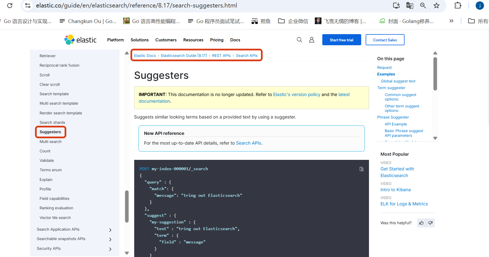

也可以看这个最新的文档：[https://www.elastic.co/docs/reference/elasticsearch/rest-apis/search-suggesters](https://www.elastic.co/docs/reference/elasticsearch/rest-apis/search-suggesters)

随着航班业务的运营，我们想要改善用户的搜索体验。具体的需求是当用户在搜索框输入部分内容后，出现对应航班的推荐选项，让用户可以快速选择。

  
今天的案例还是以航班数据为主，前面已经提过：

静静等待成功，如果有报错，请检查机器磁盘是否已满：

我们先来查看下 kibana\_sample\_data\_flights 的 mapping 信息：

\# 查询 ES 索引全文搜索 mapping

GET kibana\_sample\_data\_flights/\_mapping

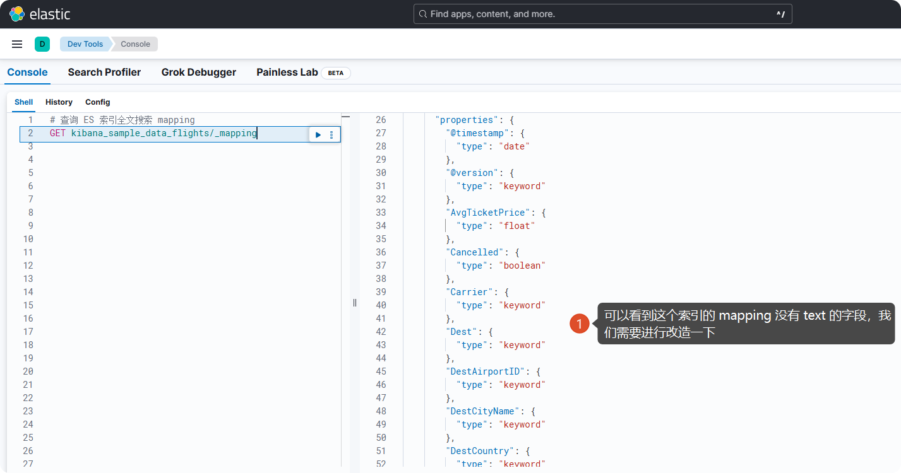

这里我们还是直接使用上篇的索引，使其部分字段符合 text 类型。

##   
**2.4 Term Suggester 纠错补全实战**

Term Suggester 提供了基于单词的「**纠错**」、「**补全**」功能，其工作原理是基于「**编辑距离**」（edit distance）来运作的，编辑距离的核心思想是一个词需要改变多少个字符就可以和另一个词一致。所以如果一个词转化为原词所需要改动的字符数越少，它越有可能是最佳匹配。

例如，flaght 和 flight，为了把 flaght 转变为 flight 需要改变一个字符 'a'，所以其编辑距离为 1。

Term Suggester 会先将输入的文本切分为一个个单词 token，然后根据每个单词提供建议，所以其不会考虑输入文本间各个单词的关系。

Term Suggester API 提供了很多的参数：

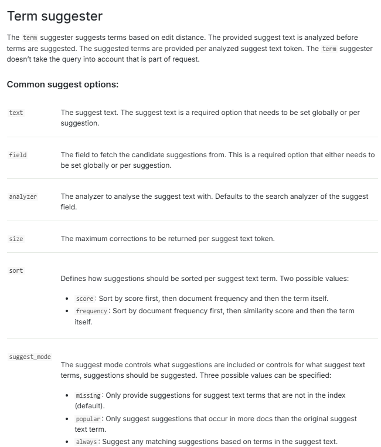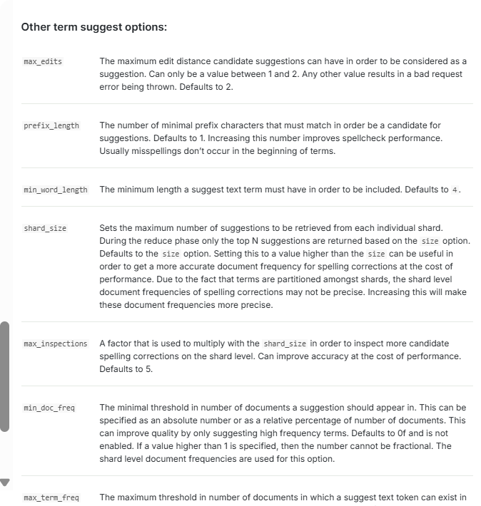

比较常用的有以下几个：

1.  text：指定了需要产生建议的文本，一般是用户的输入内容，例子中是："kernel architture"。
2.  field：指定从文档的哪个字段中获取建议，上例中，我们从书名（name）字段中获取建议。
3.  suggest\_mode：设置建议的模式。其值有以下几个选项：
4.  missing：如果索引中存在就不进行建议，默认的选项。上例中使用的是此选项，所以可以看到返回的结果中 "kernel" 这个词是没有建议的。
5.  popular：推荐出现频率更高的词。
6.  always：不管是否存在，都进行建议。
7.  analyzer：指定分词器来对输入文本进行分词，默认与 field 指定的字段设置的分词器一致。
8.  size：为每个单词提供的最大建议数量。
9.  sort：建议结果排序的方式，有以下两个选项：
10.  score：先按相似性得分排序，然后按文档频率排序，最后按词项本身（字母顺序的等）排序。
11.  frequency：先按文档频率排序，然后按相似性得分排序，最后按词项本身排序。

下面示例查询的目标是：

1.  ​执行常规搜索​：通过 match 查询查找 Dest 字段包含 "Sydney Kingsford Smith International Airport" 的航班记录
2.  ​提供拼写纠正建议​：使用 Term Suggester 分析输入文本，为索引中不存在的词项提供拼写纠正建议
3.  ​优化性能​：通过 size:0 不返回文档内容，track\_total\_hits 仅统计匹配总数，聚焦建议功能

\# Term Suggester 自动纠错

GET kibana\_sample\_data\_flights\_fulltext/\_search

{

"size": 0,

"track\_total\_hits": true,

"query": {

"match": {

"Dest": "Sydney Kingsford Smith International Airport"

}

},

"suggest": {

"my\_suggest": {

"text": "Sydney Kingsford Smith International Airport",

"term": {

"suggest\_mode": "missing",

"field": "Dest"

}

}

}

}

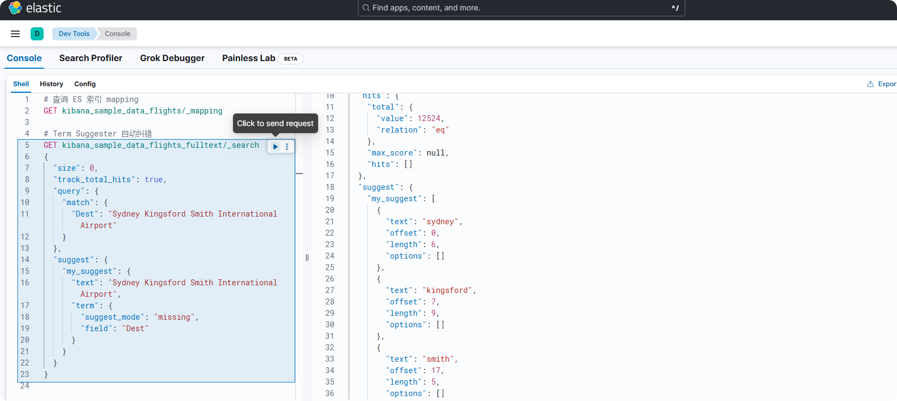

关键字段含义：

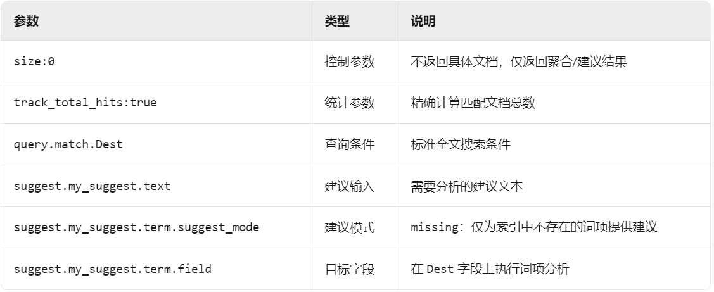

### **执行流程：**

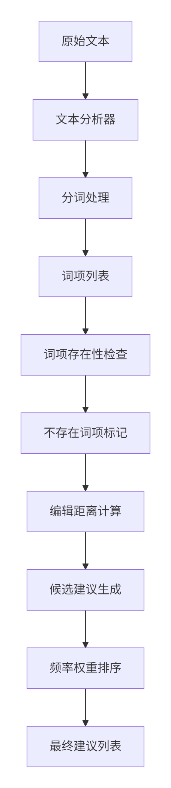

#### 关键技术组件：

1.  ​基于倒排索引词项字典​：直接使用索引中的词项集合
2.  ​内存计算模型​：在内存中快速计算编辑距离
3.  ​Levenshtein算法​：计算词项间的最小编辑距离
4.  ​频率优先原则​：优先返回高频词项作为建议

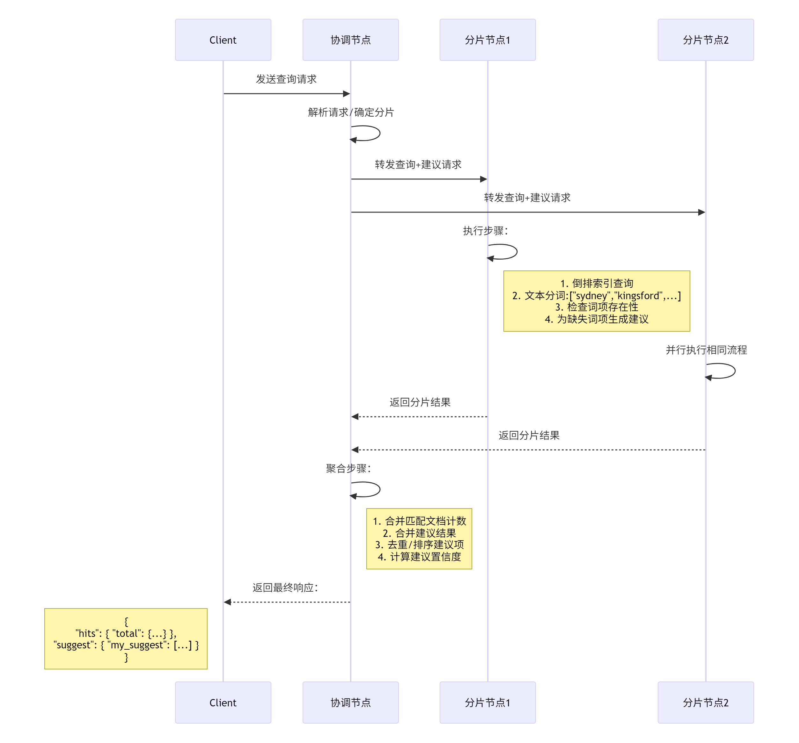

详细流程步骤说明：

1.  阶段1：查询分发
2.  客户端发送请求到协调节点
3.  协调节点解析查询参数：
4.  识别 kibana\_sample\_data\_flights\_fulltext 索引
5.  确定涉及的分片（基于路由算法）
6.  并行向所有相关分片发送请求副本
7.  阶段2：分片执行
8.  每个分片并行执行：
9.  ​A. 查询执行​
10.  解析 match 查询："Sydney Kingsford Smith International Airport"
11.  使用字段分析器处理文本（标准分词器）
12.  在倒排索引中检索包含这些词项的文档
13.  计算匹配文档总数（不获取具体内容）
14.  ​B. 建议生成​
15.  对输入文本进行相同分词处理
16.  对每个词项检查存在性（倒排索引词项字典）
17.  对缺失词项生成建议（如"kingsford"可能不在索引）：
18.  计算候选词项（编辑距离≤2）
19.  从索引词典中筛选相似词（如"kingford", "kingswood"）
20.  计算频率权重和编辑距离得分
21.  阶段3：结果聚合
22.  协调节点：
23.  合并各分片的 total\_hits 计数
24.  聚合建议结果：
25.  去重合并相同建议项
26.  按综合得分排序（频率×相似度）
27.  计算建议置信度（最高得分项）
28.  构建最终响应结构
29.  阶段4：响应返回
30.  返回结构化的JSON响应，包含：
31.  匹配文档总数（如142个航班）
32.  针对缺失词项的建议列表（如"kingsford"→"kingford"）

从返回结果中可以看出，对于每个词语的建议结果，放在了 "options" 数组中。如果一个词语有多个建议，那么将按照 sort 参数指定的方式进行排序。示例中，由于都是有存在的，并且 suggest\_mode 为 "missing"，所以不进行建议，其 option 都是空的。

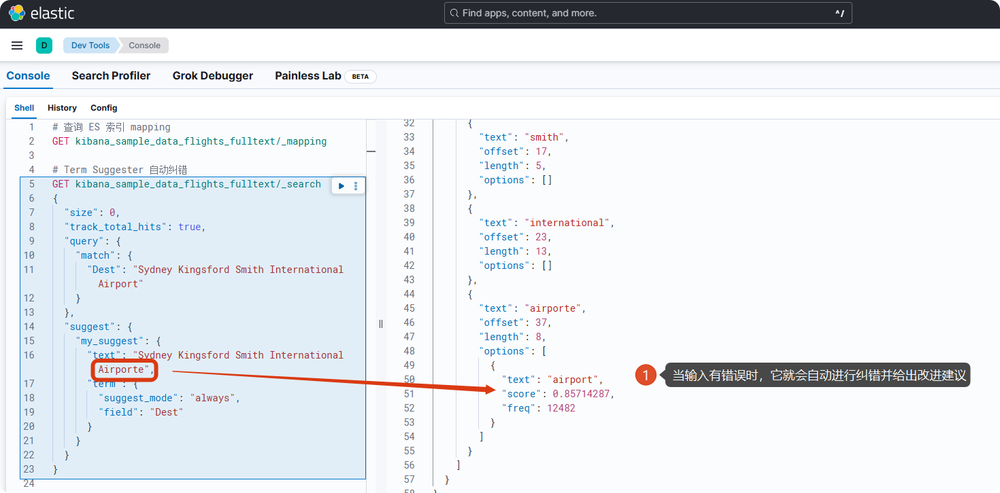

## **2.5 Phrase Suggester 纠错补全实战**

Term Suggester 产生的建议是基于「**每个单词**」的，如果想要针对整个短语或者一句话做建议，Term Suggester 就有点无能为力了。

此时可以使用 Phrase Suggester API 获取与用户输入文本相似的内容。Phrase Suggester 在 Term Suggester 的基础上增加了一些额外的逻辑，因为是「**短语形式**」的建议，所以会考量多个 term 间的关系，比如「**相邻程度**」、「**词频**」等。

Phrase Suggester 可用的参数也比较多：

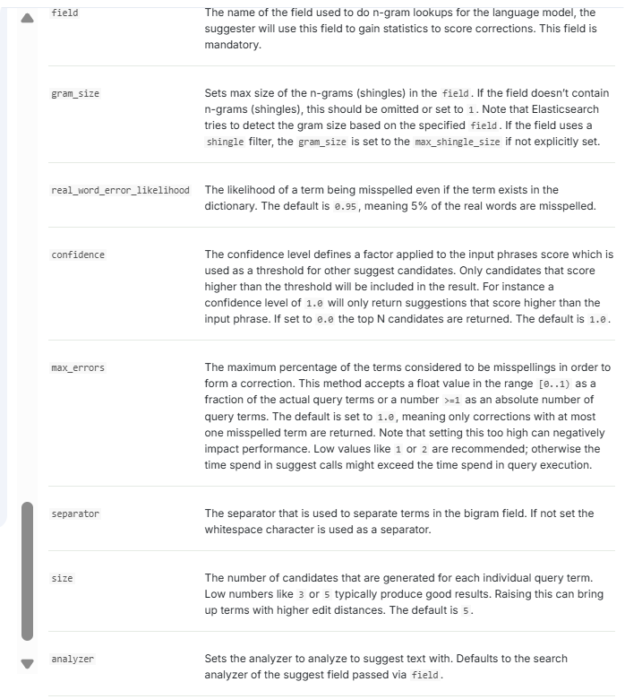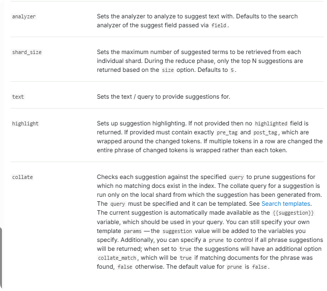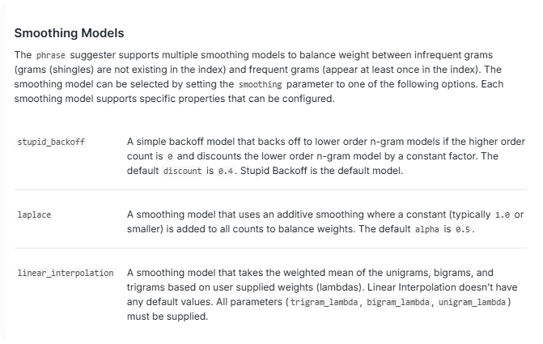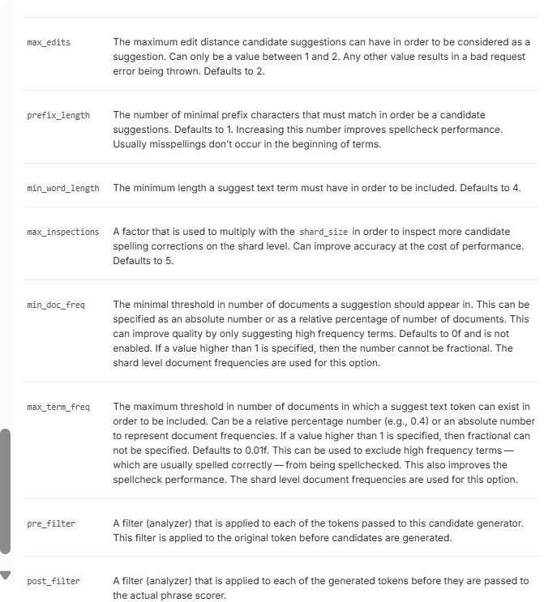

下面介绍几个用得比较多的参数选项：

1.  max\_error：指定最多可以拼写错误的词语的个数。
2.  confidence：其作用是用来控制返回结果条数的。如果用户输入的数据（短语）得分为 N，那么返回结果的得分需要大于 N \* confidence。confidence 默认值为 1.0。
3.  highlight：高亮被修改后的词语。

下面示例查询的目标是：

1.  ​短语级拼写纠错​：对输入短语 "Frankfurt am Main Airprot" 进行智能纠正
2.  ​高亮显示差异​：在返回的建议中用 <em> 标签标记突出显示被修改的部分
3.  ​容错搜索​：即使输入包含拼写错误（"Airprot"），仍能返回正确结果
4.  上下文感知​：基于整个短语的语义关系提供建议，而非单个单词

\# Phrase Suggester 自动纠错

GET kibana\_sample\_data\_flights\_fulltext/\_search

{

"size": 1,

"track\_total\_hits": true,

"suggest": {

"my\_suggest": {

"text": "Frankfurt am Main Airprot",

"phrase": {

"field": "Origin",

"highlight": {

"pre\_tag": "<em>",

"post\_tag": "</em>"

}

}

}

}

}

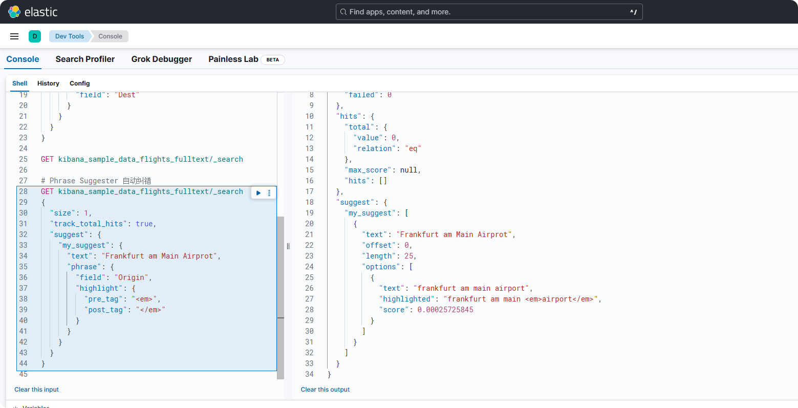

关键字段含义：

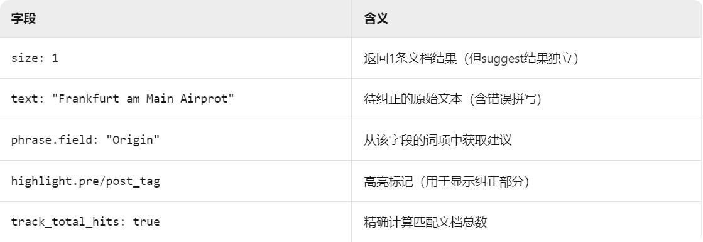

### **执行流程：**

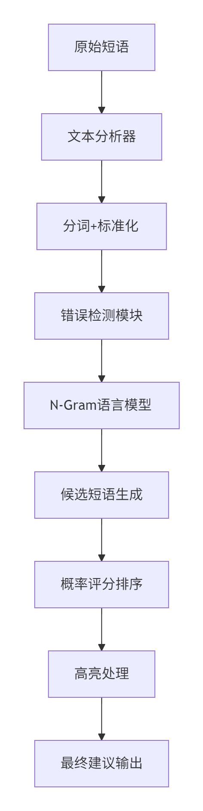

#### 关键技术组件：

1.  ​基于统计语言模型​：使用二元/三元语法（bigram/trigram）分析词项共现概率
2.  ​上下文感知​：考虑词项间的顺序和关联性
3.  ​Shannon拼写检查算法​：通过概率模型评估短语合理性
4.  ​高亮机制​：对比原始输入与建议短语的差异

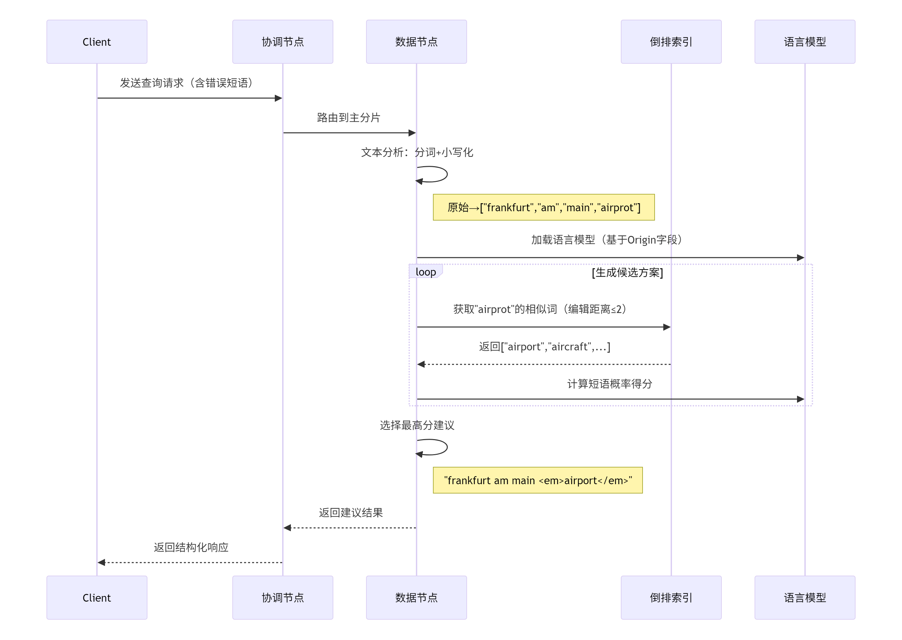

详细执行步骤说明：

1.  阶段1：查询解析（协调节点）
2.  接收客户端请求
3.  识别 suggest 部分为 Phrase Suggester 类型
4.  确定目标分片（基于索引路由）
5.  阶段2：文本预处理（数据节点）
6.  通过字段分析器处理输入文本

\# 原始输入

text = "Frankfurt am Main Airprot"

\# 分析后词项

tokens = \["frankfurt", "am", "main", "airprot"\] # 小写化+分词

1.  阶段3：候选生成（核心流程）
2.  对每个词项生成候选集合（聚焦错误词项）：
3.  识别非常用词项："airprot"（低频/不存在）
4.  计算编辑距离候选（最大距离默认为2）：airprot → airport (距离=1), aircraft (距离=3)
5.  构建候选短语矩阵：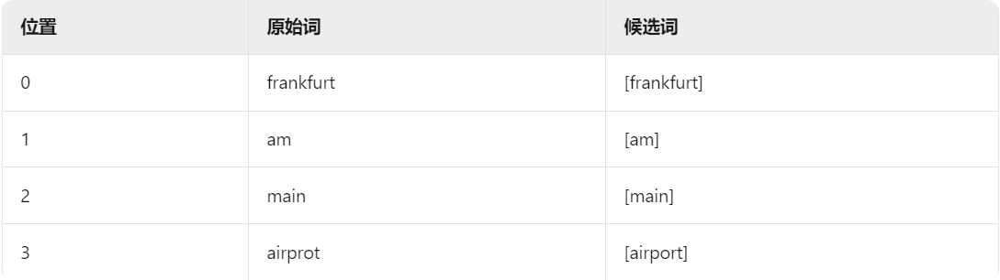
6.  阶段4：语言模型评分
7.  使用二元语法模型计算短语概率：P(phrase) = P(w1) \* P(w2|w1) \* P(w3|w2) \* ...
8.  计算各候选短语得分：
9.  frankfurt am main airprot：概率≈0（"airprot"不存在）
10.  frankfurt am main airport：高概率（真实存在）
11.  阶段5：结果生成与高亮
12.  选择最高分建议："frankfurt am main airport"。
13.  对比原始输入生成高亮。
14.  返回结构化结果。

## **2.6 Completion Suggester 自动补全实战**

Completion Suggester 提供了「**自动补全**」的功能，其应用场景是用户每输入一个字符就需要返回匹配的结果给用户。

在「**并发量大**」、「**用户输入速度快**」的时候，对服务的吞吐量来说是个不小的挑战。所以 Completion Suggester 不能像上面的 Suggester API 那样简单通过「**倒排索引**」来实现，必须通过某些更高效的数据结构和算法才能满足需求。

Completion Suggester 在实现的时候会将 「**analyze**」后的数据进行编码，构建为「**FST**」并且和索引存放在一起。「**FST**」（finite-state transducer）是一种高效的前缀查询索引，由于「**FST**」天生为前缀查询而生，所以其非常适合实现自动补全的功能。

ES 会将整个「**FST**」加载到内存中，所以在使用「**FST**」进行前缀查询的时候效率是非常高效的。在使用 [Completion Suggester](http://completion%20suggester/) 前需要定义 [Mapping](http://mapping/)，对应的字段需要使用 ["type": "completion"](http://%22type%22:%20%22completion%22/)。

来看下该 suggester api 的 mapping，很简单只需要在原有基础上，新增一个字段来实现 suggest 即可。

###   
**2.6.1 创建包含 completion 字段的新索引**

\# ES 索引自动补全 mapping

PUT kibana\_sample\_data\_flights\_completion

{

"mappings": {

"dynamic": "true",

"date\_detection": false,

"numeric\_detection": false,

"properties": {

"@timestamp": {

"type": "date"

},

"@version": {

"type": "keyword"

},

"AvgTicketPrice": {

"type": "float"

},

"Cancelled": {

"type": "boolean"

},

"Carrier": {

"type": "text",

"fields": {

"keyword": {

"type": "keyword",

"ignore\_above": 256

}

}

},

"Dest": {

"type": "text",

"fields": {

"keyword": {

"type": "keyword",

"ignore\_above": 256

}

}

},

"DestCompletion": {

"type": "completion",

"analyzer": "simple",

"preserve\_separators": true,

"preserve\_position\_increments": true,

"max\_input\_length": 50

},

"DestAirportID": {

"type": "text",

"fields": {

"keyword": {

"type": "keyword",

"ignore\_above": 256

}

}

},

"DestCityName": {

"type": "text",

"fields": {

"keyword": {

"type": "keyword",

"ignore\_above": 256

}

}

},

"DestCountry": {

"type": "text",

"fields": {

"keyword": {

"type": "keyword",

"ignore\_above": 256

}

}

},

"DestLocation": {

"properties": {

"lat": {

"type": "keyword",

"ignore\_above": 256

},

"lon": {

"type": "keyword",

"ignore\_above": 256

}

}

},

"DestRegion": {

"type": "text",

"fields": {

"keyword": {

"type": "keyword",

"ignore\_above": 256

}

}

},

"DestWeather": {

"type": "text",

"fields": {

"keyword": {

"type": "keyword",

"ignore\_above": 256

}

}

},

"DistanceKilometers": {

"type": "float"

},

"DistanceMiles": {

"type": "float"

},

"FlightDelay": {

"type": "boolean"

},

"FlightDelayMin": {

"type": "float"

},

"FlightDelayType": {

"type": "text",

"fields": {

"keyword": {

"type": "keyword",

"ignore\_above": 256

}

}

},

"FlightNum": {

"type": "text",

"fields": {

"keyword": {

"type": "keyword",

"ignore\_above": 256

}

}

},

"FlightTimeHour": {

"type": "float"

},

"FlightTimeMin": {

"type": "float"

},

"Origin": {

"type": "text",

"fields": {

"keyword": {

"type": "keyword",

"ignore\_above": 256

}

}

},

"OriginAirportID": {

"type": "text",

"fields": {

"keyword": {

"type": "keyword",

"ignore\_above": 256

}

}

},

"OriginCityName": {

"type": "text",

"fields": {

"keyword": {

"type": "keyword",

"ignore\_above": 256

}

}

},

"OriginCountry": {

"type": "text",

"fields": {

"keyword": {

"type": "keyword",

"ignore\_above": 256

}

}

},

"OriginLocation": {

"properties": {

"lat": {

"type": "keyword",

"ignore\_above": 256

},

"lon": {

"type": "keyword",

"ignore\_above": 256

}

}

},

"OriginRegion": {

"type": "text",

"fields": {

"keyword": {

"type": "keyword",

"ignore\_above": 256

}

}

},

"OriginWeather": {

"type": "text",

"fields": {

"keyword": {

"type": "keyword",

"ignore\_above": 256

}

}

},

"dayOfWeek": {

"type": "float"

},

"event": {

"properties": {

"created": {

"type": "date"

},

"dataset": {

"type": "keyword"

},

"ingested": {

"type": "date"

}

}

},

"tags": {

"type": "keyword"

},

"timestamp": {

"type": "date"

}

}

}

}

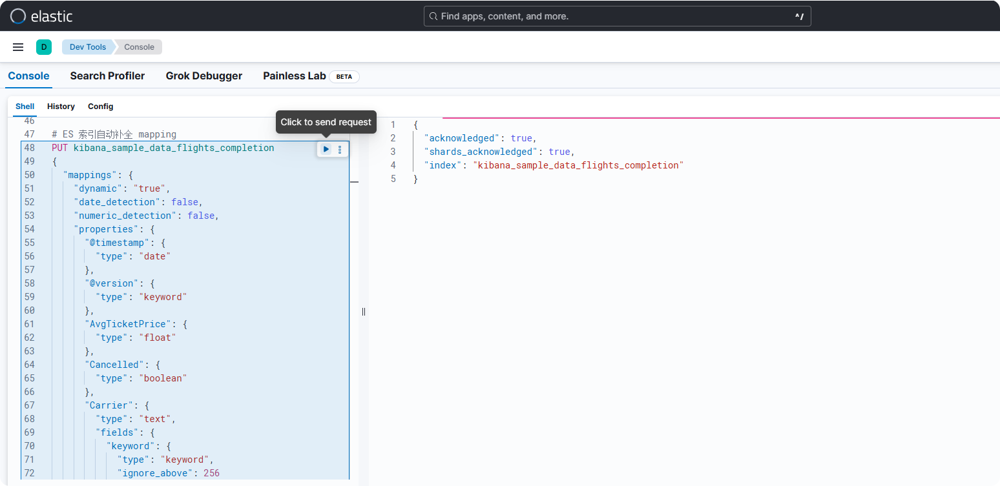

### **2.6.2 使用 Reindex 复制数据并填充 completion 字段**

\# 使用 Reindex 复制数据并通过脚本填充 completion 字段

POST \_reindex

{

"source": {

"index": "kibana\_sample\_data\_flights\_fulltext"

},

"dest": {

"index": "kibana\_sample\_data\_flights\_completion"

},

"script": {

"source": """

// 从原始 Dest 字段复制值到新字段

ctx.\_source.DestCompletion = ctx.\_source.Dest;

""",

"lang": "painless"

}

}

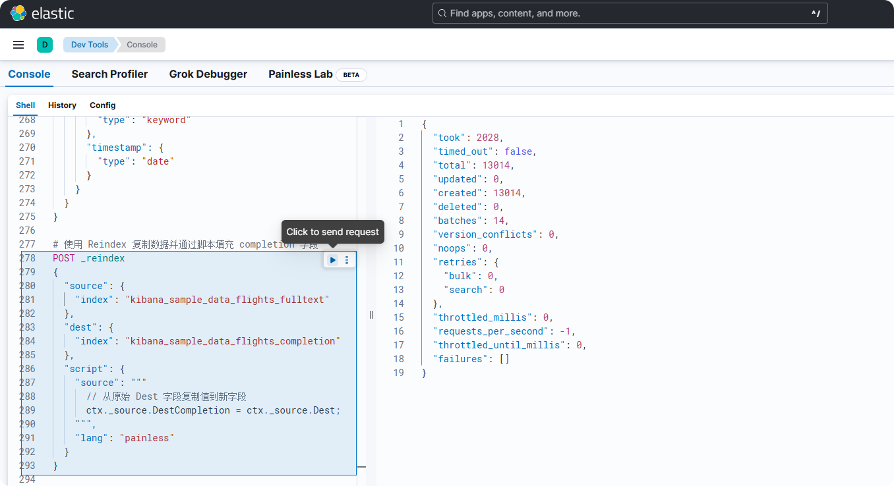

### **2.6.3 验证数据**

\# 验证 completion 迁移数据

GET kibana\_sample\_data\_flights\_completion/\_search

{

"size": 1,

"\_source": \["Dest", "DestCompletion"\]

}

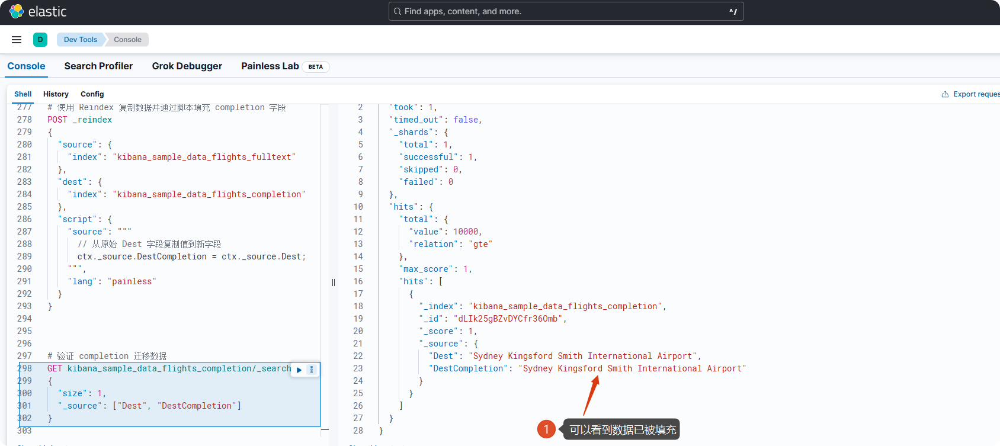

### **2.6.4 completion 示例**

如上，新增 "DestCompletion" 字段做 Completion Suggester 测试, 其类型为 "completion"。在测试数据准备好后，可以执行下面 Completion Suggester 的示例。

  
下面示例查询的目标是：​实现机场目的地名称的实时自动补全功能。当用户输入 "Xi'an Xianyang" 时，系统应立即返回以该文本开头的机场名称建议，用于搜索框的下拉提示功能。

\# Completion Suggester 自动补全

GET kibana\_sample\_data\_flights\_completion/\_search

{

"size": 0,

"track\_total\_hits": true,

"\_source": \["Dest", "DestCompletion"\],

"suggest": {

"my\_suggest": {

"prefix": "Xi'an Xianyang",

"completion": {

"field": "DestCompletion"

}

}

}

}

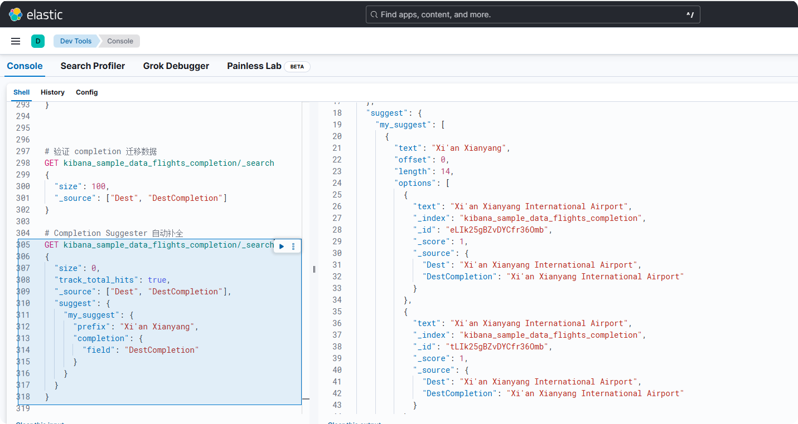

关键字段含义：

  
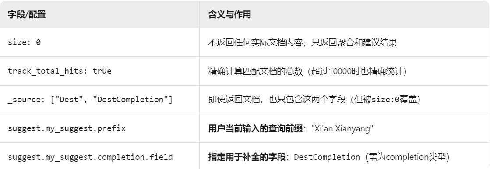

**执行流程：**

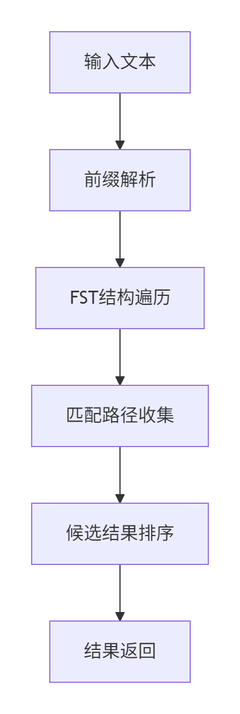

关键技术组件：

1.  ​FST（有限状态转换器）​​
2.  ​内存存储​：整个数据结构常驻内存，实现极速响应
3.  ​前缀共享​：高效压缩存储，共享相同前缀的字符串
4.  ​快速遍历​：通过状态机模型实现毫秒级查找
5.  ​索引期处理​
6.  为 completion 类型字段单独构建 FST 结构
7.  支持多输入（input）和权重（weight）设置
8.  ​查询期处理​
9.  纯内存操作，不涉及磁盘 I/O
10.  直接遍历 FST 获取所有匹配前缀的候选项

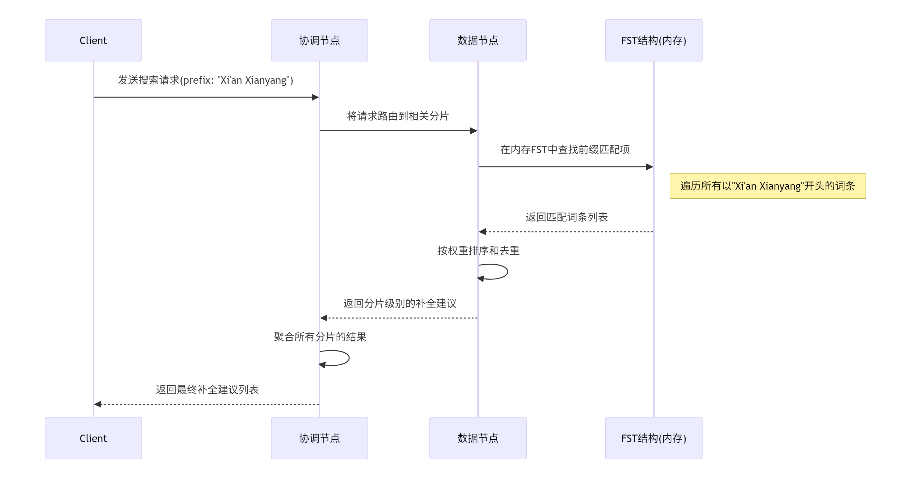

详细执行步骤说明：

1.  阶段1：查询解析与路由
2.  协调节点接收查询请求
3.  解析请求结构，识别出 completion suggester
4.  将请求路由到包含 kibana\_sample\_data\_flights\_completion 索引的所有相关分片
5.  阶段2：FST遍历（核心阶段）
6.  数据节点接收请求后，直接访问内存中的 FST 结构
7.  阶段3：结果处理与排序
8.  收集所有匹配前缀的候选词条
9.  按权重（如有设置）进行排序
10.  应用 skip\_duplicates: true（如果设置）进行去重
11.  阶段4：结果聚合与返回
12.  协调节点收集所有分片的结果
13.  进行全局排序和去重
14.  返回最终响应

​

> 需要注意的是，Completion Suggester 在索引数据的时候经过了 analyze 阶段，所以使用不同的 analyzer（分词器） 会造成构建 FST 的数据不同，例如某些词（is、at 等停用词）被去除、某些词被转换（大小写等）。由于构建的数据不同，可能会影响查询匹配的结果。

典型应用场景：

1.  ​搜索框自动补全​：用户输入过程中实时显示建议
2.  ​地址表单填充​：快速输入城市、机场名称
3.  ​产品搜索​：电商网站的商品名称补全
4.  ​标签系统​：标签输入的自动提示

## **2.7 Context Suggester 上下文感知实战**

[Context Suggester](http://context%20suggester/) 是 [Completion Suggester](http://completion%20suggester%20/) 的扩展，可以实现「**上下文感知推荐**」。

比如当我们在搜索航班目的地查询 "Sydn" 的时候，可以返回 Sydney 相关的航班信息。 要实现这个功能，可以在文档中加入分类信息，帮助我们做精准推荐。

ES 支持两种类型的上下文：

1.  Category：任意字符串的分类。
2.  Geo：地理位置信息。

具体示例可以参考官方的：[https://www.elastic.co/guide/en/elasticsearch/reference/8.17/search-suggesters.html#context-suggester](https://www.elastic.co/guide/en/elasticsearch/reference/7.13/search-suggesters.html#context-suggester)

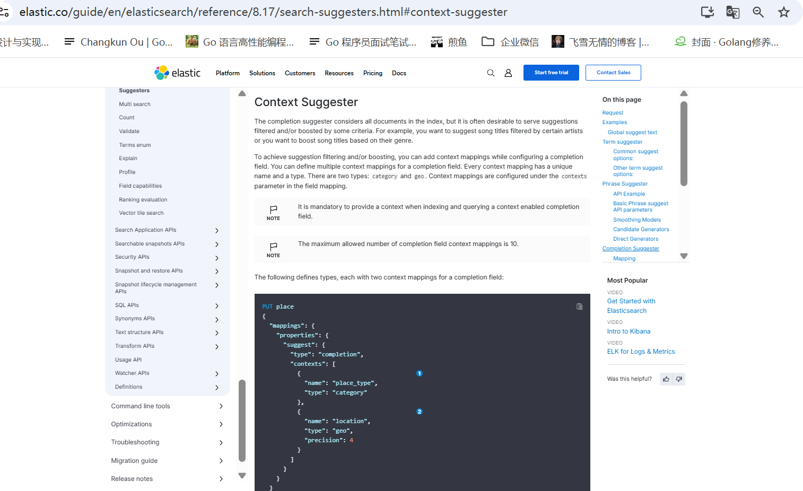

### **2.7.1 创建包含 completion 字段的新索引**

下面我们看看如何基于任意字符串的分类来做上下文推荐。同样，在使用 [Context Suggester](http://context%20suggester/) 前，首先要创建 Mapping，然后在数据中加入相关的 Context 信息。

根据「**机场类型**」、「**位置**」、「**服务**」三种维度提供精准的搜索建议，在航班数据中实现高度智能化的上下文感知自动补全功能，如下设计了一个支持「**机场类型**」、「**位置**」、「**服务**」三种维度的上下文感知 mapping：

#删除原来的 completion 索引

DELETE kibana\_sample\_data\_flights\_completion

\# ES 索引上下文感知推荐 mapping

PUT kibana\_sample\_data\_flights\_completion

{

"mappings": {

"dynamic": "true",

"date\_detection": false,

"numeric\_detection": false,

"properties": {

"@timestamp": {

"type": "date"

},

"@version": {

"type": "keyword"

},

"AvgTicketPrice": {

"type": "float"

},

"Cancelled": {

"type": "boolean"

},

"Carrier": {

"type": "text",

"fields": {

"keyword": {

"type": "keyword",

"ignore\_above": 256

}

}

},

"Dest": {

"type": "text",

"fields": {

"keyword": {

"type": "keyword",

"ignore\_above": 256

}

}

},

"DestCompletion": {

"type": "completion",

"analyzer": "standard",

"preserve\_separators": true,

"preserve\_position\_increments": true,

"max\_input\_length": 100,

"contexts": \[

{

"name": "airport\_type",

"type": "category",

"path": "meta.airport\_type"

},

{

"name": "location",

"type": "geo",

"precision": 5

},

{

"name": "services",

"type": "category",

"path": "meta.services"

}

\]

},

"DestAirportID": {

"type": "text",

"fields": {

"keyword": {

"type": "keyword",

"ignore\_above": 256

}

}

},

"DestCityName": {

"type": "text",

"fields": {

"keyword": {

"type": "keyword",

"ignore\_above": 256

}

}

},

"DestCountry": {

"type": "text",

"fields": {

"keyword": {

"type": "keyword",

"ignore\_above": 256

}

}

},

"DestLocation": {

"properties": {

"lat": {

"type": "keyword",

"ignore\_above": 256

},

"lon": {

"type": "keyword",

"ignore\_above": 256

}

}

},

"DestRegion": {

"type": "text",

"fields": {

"keyword": {

"type": "keyword",

"ignore\_above": 256

}

}

},

"DestWeather": {

"type": "text",

"fields": {

"keyword": {

"type": "keyword",

"ignore\_above": 256

}

}

},

"DistanceKilometers": {

"type": "float"

},

"DistanceMiles": {

"type": "float"

},

"FlightDelay": {

"type": "boolean"

},

"FlightDelayMin": {

"type": "float"

},

"FlightDelayType": {

"type": "text",

"fields": {

"keyword": {

"type": "keyword",

"ignore\_above": 256

}

}

},

"FlightNum": {

"type": "text",

"fields": {

"keyword": {

"type": "keyword",

"ignore\_above": 256

}

}

},

"FlightTimeHour": {

"type": "float"

},

"FlightTimeMin": {

"type": "float"

},

"Origin": {

"type": "text",

"fields": {

"keyword": {

"type": "keyword",

"ignore\_above": 256

}

}

},

"OriginAirportID": {

"type": "text",

"fields": {

"keyword": {

"type": "keyword",

"ignore\_above": 256

}

}

},

"OriginCityName": {

"type": "text",

"fields": {

"keyword": {

"type": "keyword",

"ignore\_above": 256

}

}

},

"OriginCountry": {

"type": "text",

"fields": {

"keyword": {

"type": "keyword",

"ignore\_above": 256

}

}

},

"OriginLocation": {

"properties": {

"lat": {

"type": "keyword",

"ignore\_above": 256

},

"lon": {

"type": "keyword",

"ignore\_above": 256

}

}

},

"OriginRegion": {

"type": "text",

"fields": {

"keyword": {

"type": "keyword",

"ignore\_above": 256

}

}

},

"OriginWeather": {

"type": "text",

"fields": {

"keyword": {

"type": "keyword",

"ignore\_above": 256

}

}

},

"dayOfWeek": {

"type": "float"

},

"event": {

"properties": {

"created": {

"type": "date"

},

"dataset": {

"type": "keyword"

},

"ingested": {

"type": "date"

}

}

},

"tags": {

"type": "keyword"

},

"timestamp": {

"type": "date"

}

}

}

}

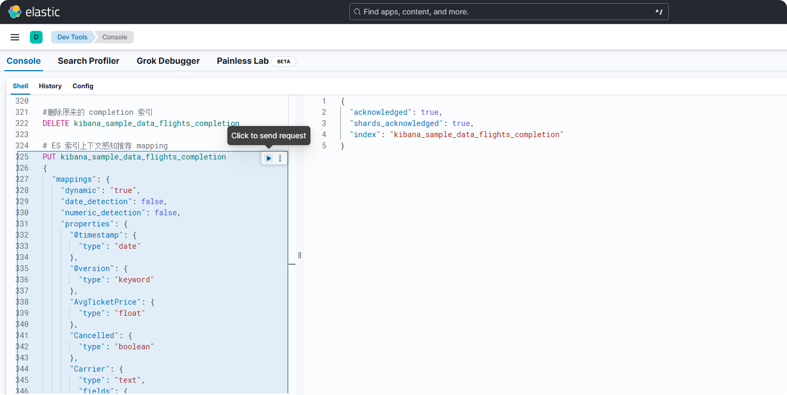

如上 Mapping 主要改进点：

1.  机场类型上下文 (airport\_type)
2.  使用 category 类型上下文
3.  通过 path 指向 meta.airport\_type 字段
4.  支持的值示例: international, domestic, regional, military, private
5.  位置上下文 (location)
6.  使用 geo 类型上下文
7.  直接从 DestLocation 字段获取坐标数据
8.  设置精度为 5（约 1km 精度）
9.  服务上下文 (services)
10.  使用 category 类型上下文
11.  支持多值服务类型
12.  通过 path 指向 meta.services 字段
13.  支持的值示例: duty\_free, lounges, hotel, rental\_car, wi\_fi

### **2.7.2 使用 Reindex 复制数据填充 completion 字段并设置类型**

\# 使用 Reindex 复制数据并通过脚本填充 completion 字段并设置分类

POST \_reindex

{

"source": {

"index": "kibana\_sample\_data\_flights\_fulltext"

},

"dest": {

"index": "kibana\_sample\_data\_flights\_completion"

},

"script": {

"source": """

// 1. 确保 meta 对象存在

if (ctx.\_source.meta == null) {

ctx.\_source.meta = \[:\];

}

// 2. 确定机场类型

String airportType = "domestic";

if (ctx.\_source.Dest != null) {

String dest = ctx.\_source.Dest.toLowerCase();

if (dest.contains("international")) {

airportType = "international";

} else if (dest.contains("regional")) {

airportType = "regional";

} else if (dest.contains("military") || dest.contains("air force")) {

airportType = "military";

} else if (dest.contains("private") || dest.contains("executive")) {

airportType = "private";

}

}

ctx.\_source.meta.airport\_type = airportType;

// 3. 确定服务类型

def services = \[\];

services.add("wi\_fi");

if (airportType == "international" || airportType == "regional") {

services.add("duty\_free");

services.add("lounges");

}

// 修复城市名称检查逻辑

def majorCities = \["London", "New York", "Tokyo", "Dubai", "Singapore"\];

if (ctx.\_source.DestCityName != null && majorCities.contains(ctx.\_source.DestCityName)) {

services.add("hotel");

services.add("rental\_car");

}

ctx.\_source.meta.services = services;

// 4. 构建DestCompletion字段

def completionEntries = \[\];

if (ctx.\_source.Dest != null) {

completionEntries.add(\[

"input": ctx.\_source.Dest,

"weight": 100,

"contexts": \[

"airport\_type": airportType,

"location": ctx.\_source.DestLocation,

"services": services

\]

\]);

}

if (ctx.\_source.DestAirportID != null) {

completionEntries.add(\[

"input": ctx.\_source.DestAirportID,

"weight": 80,

"contexts": \[

"airport\_type": airportType,

"location": ctx.\_source.DestLocation,

"services": services

\]

\]);

}

if (ctx.\_source.DestCityName != null) {

completionEntries.add(\[

"input": ctx.\_source.DestCityName,

"weight": 60,

"contexts": \[

"airport\_type": airportType,

"location": ctx.\_source.DestLocation,

"services": services

\]

\]);

}

ctx.\_source.DestCompletion = completionEntries;

""",

"lang": "painless"

}

}

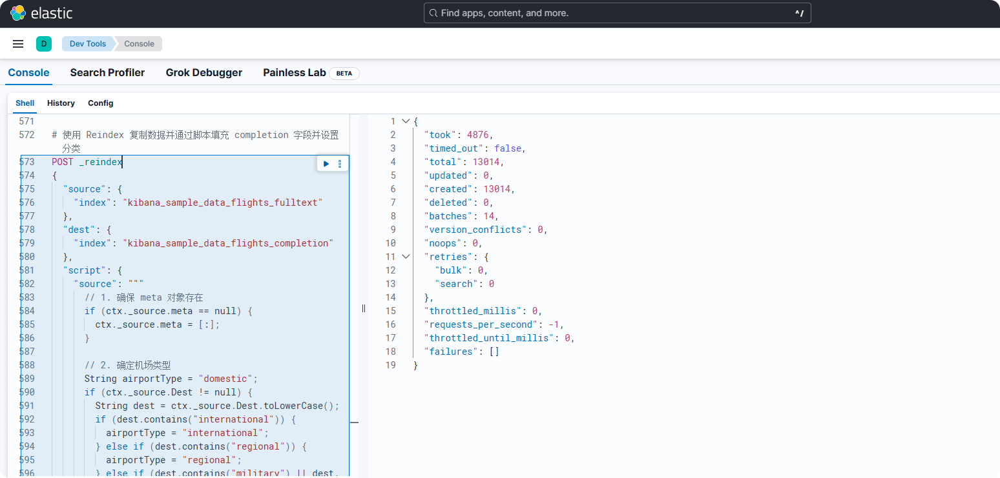

### **2.7.3 验证数据**

\# 验证 completion 迁移数据

GET kibana\_sample\_data\_flights\_completion/\_search

{

"size": 2,

"\_source": \["Dest", "DestCompletion"\]

}

\# 结果

{

"took": 1,

"timed\_out": false,

"\_shards": {

"total": 1,

"successful": 1,

"skipped": 0,

"failed": 0

},

"hits": {

"total": {

"value": 10000,

"relation": "gte"

},

"max\_score": 1,

"hits": \[

{

"\_index": "kibana\_sample\_data\_flights\_completion",

"\_id": "dLIk25gBZvDYCfr36Omb",

"\_score": 1,

"\_source": {

"Dest": "Sydney Kingsford Smith International Airport",

"DestCompletion": \[

{

"input": "Sydney Kingsford Smith International Airport",

"weight": 100,

"contexts": {

"airport\_type": "international",

"location": {

"lon": "151.177002",

"lat": "-33.94609833"

},

"services": \[

"wi\_fi",

"duty\_free",

"lounges"

\]

}

},

{

"input": "SYD",

"weight": 80,

"contexts": {

"airport\_type": "international",

"location": {

"lon": "151.177002",

"lat": "-33.94609833"

},

"services": \[

"wi\_fi",

"duty\_free",

"lounges"

\]

}

},

{

"input": "Sydney",

"weight": 60,

"contexts": {

"airport\_type": "international",

"location": {

"lon": "151.177002",

"lat": "-33.94609833"

},

"services": \[

"wi\_fi",

"duty\_free",

"lounges"

\]

}

}

\]

}

},

{

"\_index": "kibana\_sample\_data\_flights\_completion",

"\_id": "dbIk25gBZvDYCfr36Omb",

"\_score": 1,

"\_source": {

"Dest": "Venice Marco Polo Airport",

"DestCompletion": \[

{

"input": "Venice Marco Polo Airport",

"weight": 100,

"contexts": {

"airport\_type": "domestic",

"location": {

"lon": "12.3519",

"lat": "45.505299"

},

"services": \[

"wi\_fi"

\]

}

},

{

"input": "VE05",

"weight": 80,

"contexts": {

"airport\_type": "domestic",

"location": {

"lon": "12.3519",

"lat": "45.505299"

},

"services": \[

"wi\_fi"

\]

}

},

{

"input": "Venice",

"weight": 60,

"contexts": {

"airport\_type": "domestic",

"location": {

"lon": "12.3519",

"lat": "45.505299"

},

"services": \[

"wi\_fi"

\]

}

}

\]

}

}

\]

}

}

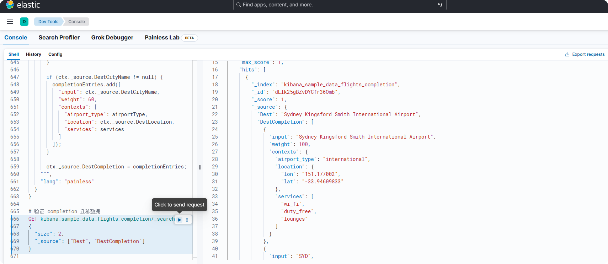

### **2.7.4 completion + 上下文感知示例**

下面示例查询的目标是：​在航班数据中实现智能化的多维度上下文感知自动补全。

具体包括：

1.  ​前缀匹配​：查找所有以 "Sydney" 开头的机场名称
2.  ​多维度过滤​：同时应用三个上下文条件：
3.  ​机场类型​：只返回国际机场（international）
4.  ​地理位置​：优先返回靠近指定坐标（-33.94609833, 151.177002）的机场
5.  ​服务设施​：必须提供贵宾室（lounges）和免税店（duty\_free）服务
6.  ​结果优化​：返回最多5个最相关的结果，按综合评分排序

\# 多上下文感知 completion 联合查询

GET kibana\_sample\_data\_flights\_completion/\_search

{

"size": 0,

"track\_total\_hits": true,

"\_source": \["Dest", "DestCompletion"\],

"suggest": {

"airport-suggest": {

"prefix": "Sydney",

"completion": {

"field": "DestCompletion",

"contexts": {

"airport\_type": "international",

"location": {

"lat": \-33.94609833,

"lon": 151.177002

},

"services": \["lounges", "duty\_free"\]

},

"size": 5

}

}

}

}

\# 结果

{

"took": 4,

"timed\_out": false,

"\_shards": {

"total": 1,

"successful": 1,

"skipped": 0,

"failed": 0

},

"hits": {

"total": {

"value": 0,

"relation": "eq"

},

"max\_score": null,

"hits": \[\]

},

"suggest": {

"airport-suggest": \[

{

"text": "Sydney",

"offset": 0,

"length": 6,

"options": \[

{

"text": "Sydney Kingsford Smith International Airport",

"\_index": "kibana\_sample\_data\_flights\_completion",

"\_id": "dLIk25gBZvDYCfr36Omb",

"\_score": 100,

"\_source": {

"Dest": "Sydney Kingsford Smith International Airport",

"DestCompletion": \[

{

"input": "Sydney Kingsford Smith International Airport",

"weight": 100,

"contexts": {

"airport\_type": "international",

"location": {

"lon": "151.177002",

"lat": "-33.94609833"

},

"services": \[

"wi\_fi",

"duty\_free",

"lounges"

\]

}

},

{

"input": "SYD",

"weight": 80,

"contexts": {

"airport\_type": "international",

"location": {

"lon": "151.177002",

"lat": "-33.94609833"

},

"services": \[

"wi\_fi",

"duty\_free",

"lounges"

\]

}

},

{

"input": "Sydney",

"weight": 60,

"contexts": {

"airport\_type": "international",

"location": {

"lon": "151.177002",

"lat": "-33.94609833"

},

"services": \[

"wi\_fi",

"duty\_free",

"lounges"

\]

}

}

\]

},

"contexts": {

"airport\_type": \[

"international"

\]

}

},

\*\*\*\*

\]

}

\]

}

}

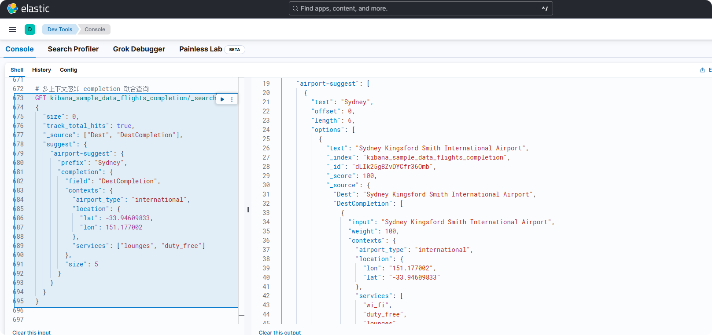

关键字段含义：

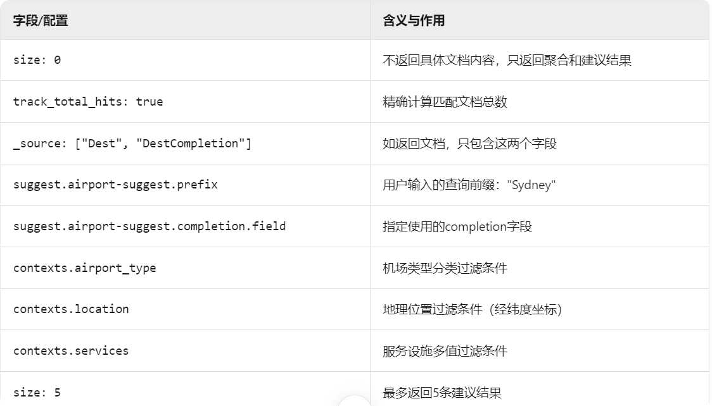

### **执行流程：**

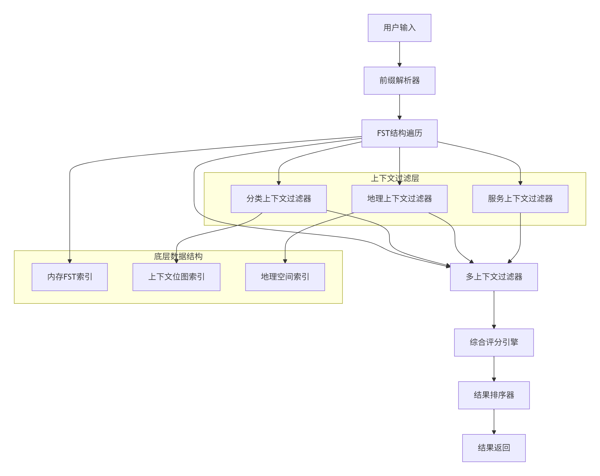

核心组件说明：

1.  ​FST (有限状态转换器)​​
2.  内存中的前缀索引结构，支持极速前缀匹配
3.  存储所有补全建议的输入文本
4.  ​多上下文过滤器​
5.  ​分类上下文​：基于位图的机场类型快速过滤
6.  ​地理上下文​：基于地理坐标的距离计算和过滤
7.  ​服务上下文​：多值服务的联合过滤
8.  ​评分排序引擎​
9.  权重（weight）优先排序
10.  上下文匹配度评分
11.  地理位置距离评分
12.  输入匹配度评分

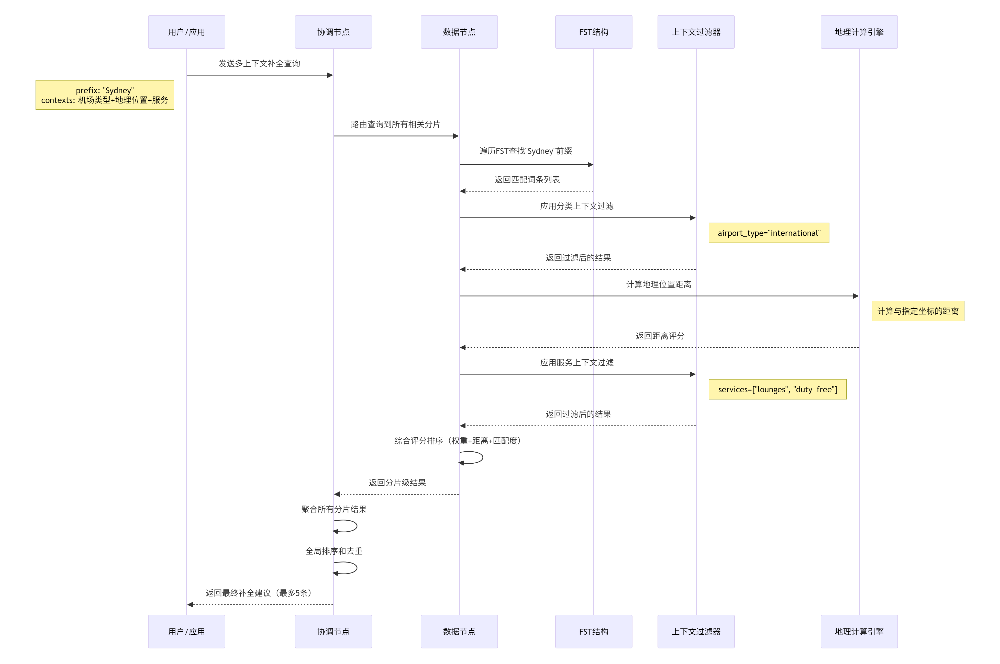

详细的流程步骤说明：

1.  阶段一：查询解析与路由（协调节点）
2.  ​请求接收​：协调节点接收包含多上下文参数的补全查询
3.  ​查询解析​：解析前缀和多个上下文过滤条件
4.  ​分片路由​：基于索引分片配置确定需要查询的所有相关分片
5.  ​请求分发​：向所有相关数据节点发送并行查询请求
6.  阶段二：FST 遍历与前缀匹配（数据节点）
7.  ​内存检索​：在内存中的 FST 结构进行 "Sydney" 前缀匹配
8.  候选收集​：收集所有以 "Sydney" 开头的候选建议
9.  阶段三：多上下文过滤（核心处理）
10.  ​分类上下文过滤​：基于位图的机场类型过滤
11.  地理上下文处理​：计算每个候选机场与目标坐标的距离
12.  服务上下文过滤​：多值服务的联合过滤
13.  阶段四：综合评分与排序
14.  ​权重评分​：基于预先设置的 weight 字段值
15.  ​距离评分​：基于地理距离的 inverse 评分（距离越近评分越高）
16.  ​匹配度评分​：计算输入前缀与建议文本的匹配程度
17.  ​综合评分​：加权计算最终评分
18.  ​结果排序​：按综合评分降序排序
19.  阶段五：结果聚合与返回
20.  ​分片结果聚合​：协调节点收集所有分片的结果
21.  ​全局排序​：对所有分片返回的结果进行全局排序
22.  ​数量限制​：应用 size:5 参数，只返回前 5 个结果
23.  ​响应构建​：构建最终的返回 JSON 结构
24.  ​结果返回​：向客户端返回补全建议

典型应用场景：

1.  ​智能旅行规划​：为用户推荐符合特定要求的机场
2.  ​商务旅行服务​：优先推荐有贵宾室和免税店的大型国际机场
3.  ​地理位置服务​：查找附近符合特定条件的机场
4.  ​多条件筛选​：复杂条件下的快速机场搜索

## **2.8 ES 索引高亮 HighLight 深度实战**

前面的示例简单的暂时了结果集如何高亮显示，接下来我们来看下高亮的一些高级功能。

官方地址：[https://www.elastic.co/guide/en/elasticsearch/reference/8.17/highlighting.html](https://www.elastic.co/guide/en/elasticsearch/reference/8.17/highlighting.html)

### **2.8.1 高亮匹配类型**

关于高亮匹配类型目前有 3 种，用来决定如何从文档中提取和匹配文本片段：

1.  plain：标准高亮器。将文本分解为单个词条，并基于查询中的每个词条进行高亮。适用场景：简单的 term 或 match 查  
    询。
2.  优点​：简单可靠，内存开销低。
3.  ​缺点​：对于复杂的布尔查询或短语查询，可能无法准确高亮所有相关部分。
4.  fvh (Fast Vector Highlighter)​：快速向量高亮器。需要字段映射中设置 "term\_vector": "with\_positions\_offsets"，性能更高，功能更丰富。适用场景：复杂查询、需要多字段匹配或需要突出显示短语。  
    
5.  ​优点​：精度高，支持复杂的多字段查询和短语高亮。
6.  ​缺点​：索引体积会增大（因为需要存储位置信息），写入性能略有下降。
7.  unified：统一高亮器。Elasticsearch 默认的高亮器，结合了 plain 和 fvh 的优点，无需特殊配置。适用场景：大多数场景，是目前的推荐选择。
8.  优点​：无需特殊映射配置，兼具准确性和性能，支持所有查询类型。
9.  ​缺点​：在极其复杂的查询下，可能不如 fvh 精确。

### **2.8.1.1 使用默认高亮匹配类型**

下面示例查询的目标是：​在航班数据中搜索出发地（Origin）包含 "Frankfurt" 的航班，并在结果中高亮显示匹配的文本。

具体包括：

1.  ​精确匹配​：查找所有Origin字段包含"Frankfurt"的航班
2.  ​高亮显示​：在返回结果中，将匹配的"Frankfurt"文本用<strong>标签包裹
3.  ​结果控制​：只返回1条文档（size:1），但精确计算匹配总数（track\_total\_hits:true）

\# highlight 高亮显示 默认类型 unified

GET kibana\_sample\_data\_flights\_fulltext/\_search

{

"size": 1,

"track\_total\_hits": true,

"query": {

"match": {

"Origin": "Frankfurt"

}

},

"highlight": {

"fields": {

"Origin": {

"pre\_tags": \["<strong>"\],

"post\_tags": \["</strong>"\],

"type": "unified" // 显式指定，但默认即是此类型

}

}

}

}

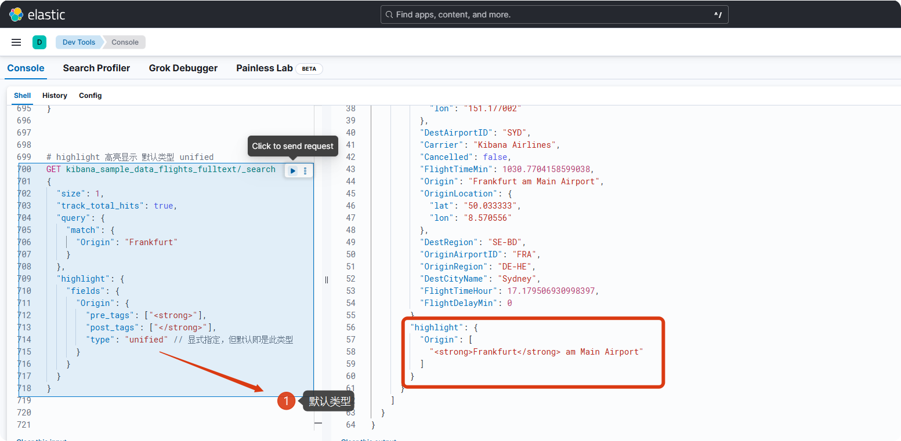

关键字段含义：

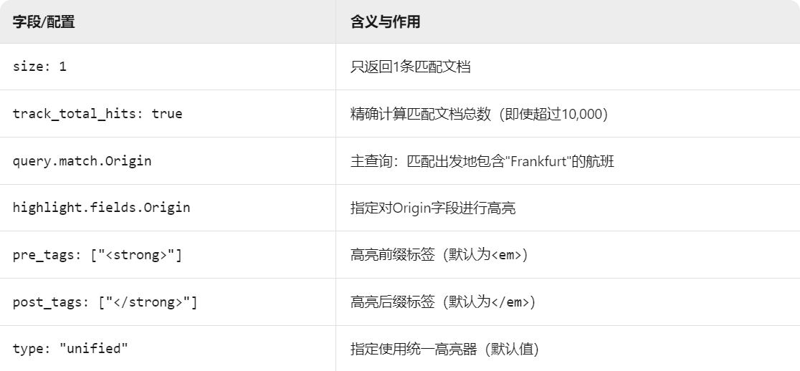

### **执行流程：**

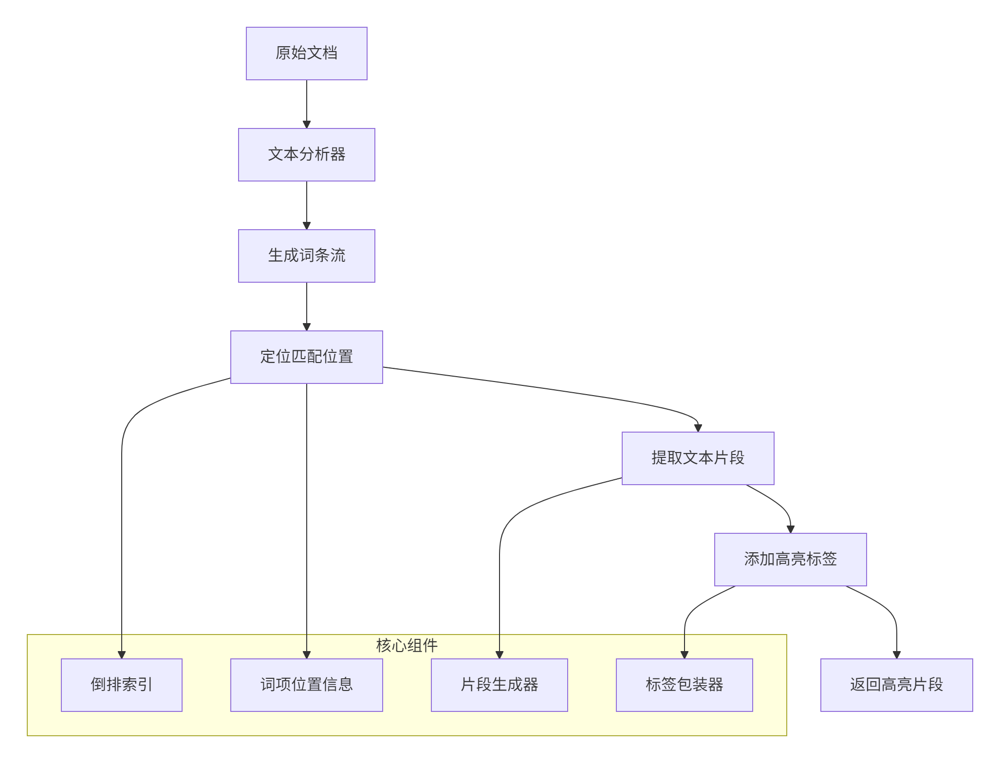

关键技术特点：

1.  ​倒排索引利用​：直接使用倒排索引中的词项位置信息
2.  ​片段智能生成​：基于 BM25 算法选择最相关片段
3.  ​多字段支持​：同时处理多个字段的高亮请求
4.  ​查询类型感知​：理解不同查询类型的匹配逻辑

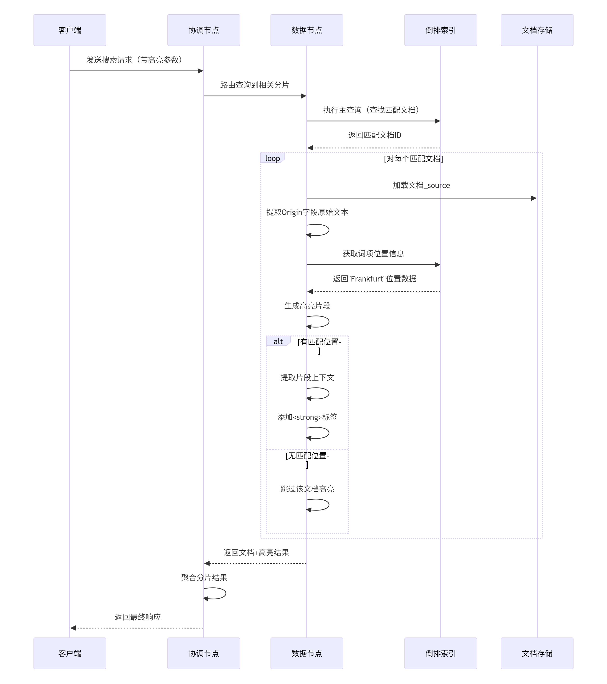

详细执行步骤说明：

1.  阶段一：查询解析与路由（协调节点）
2.  ​请求接收​：协调节点接收包含高亮参数的搜索请求
3.  ​查询解析​：
4.  解析主查询（match查询）
5.  解析高亮参数（字段、标签、类型）
6.  ​分片路由​：确定包含目标数据的分片
7.  ​请求分发​：向相关数据节点发送查询请求
8.  阶段二：文档匹配（数据节点）
9.  ​倒排索引查询​：在倒排索引中查找包含"Frankfurt"的文档
10.  ​文档评分​：计算匹配文档的相关性得分（BM25算法）
11.  ​结果收集​：收集匹配文档ID和评分
12.  阶段三：高亮处理（核心流程）
13.  ​文档加载​：从\_source加载匹配文档的原始数据
14.  ​位置信息获取​：从倒排索引获取匹配词项的位置
15.  ​片段生成​：基于位置信息提取文本片段
16.  ​片段选择​：如果生成多个片段，选择最相关的（基于BM25）
17.  阶段四：结果组装与返回
18.  ​文档组装​：将高亮片段添加到文档结果中
19.  ​分片结果返回​：数据节点返回处理后的文档
20.  ​结果聚合​：协调节点聚合所有分片结果
21.  ​最终响应​：返回给客户端

Unified Highlighter 核心优势：

1.  ​无需特殊映射​：不像 fvh 需要 term\_vector
2.  ​高效内存使用​：比 plain 高亮器更节省内存
3.  ​智能片段选择​：基于相关性选择最佳片段
4.  ​支持复杂查询​：理解 bool、phrase 等查询类型

### **2.8.1.2 使用 plain 高亮匹配类型**

\# highlight 高亮显示 置顶类型 plain

GET kibana\_sample\_data\_flights\_fulltext/\_search

{

"size": 1,

"query": {

"match": {

"Origin": "Frankfurt"

}

},

"highlight": {

"fields": {

"Origin": {

"pre\_tags": \["<strong>"\],

"post\_tags": \["</strong>"\],

"type": "plain" // 显式指定plain高亮器

}

}

}

}

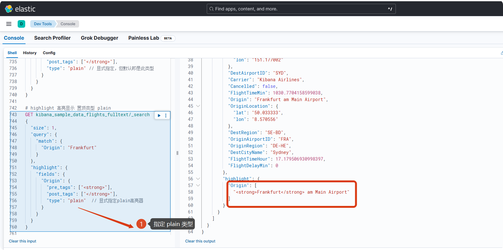

关键字段含义：

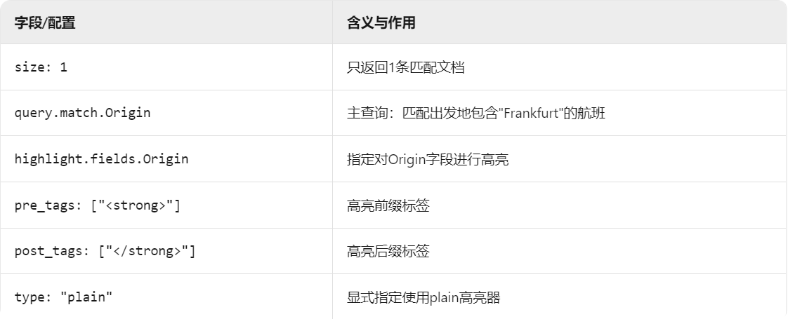

### **执行流程：**

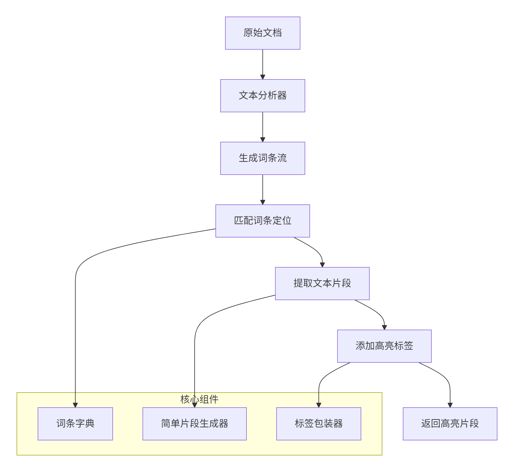

关键技术特点：

1.  ​简单直接​：基于词条匹配，不依赖位置信息
2.  ​内存高效​：不需要额外存储位置信息
3.  ​快速响应​：处理简单查询时性能优异
4.  ​局限性​：无法处理复杂查询和短语匹配

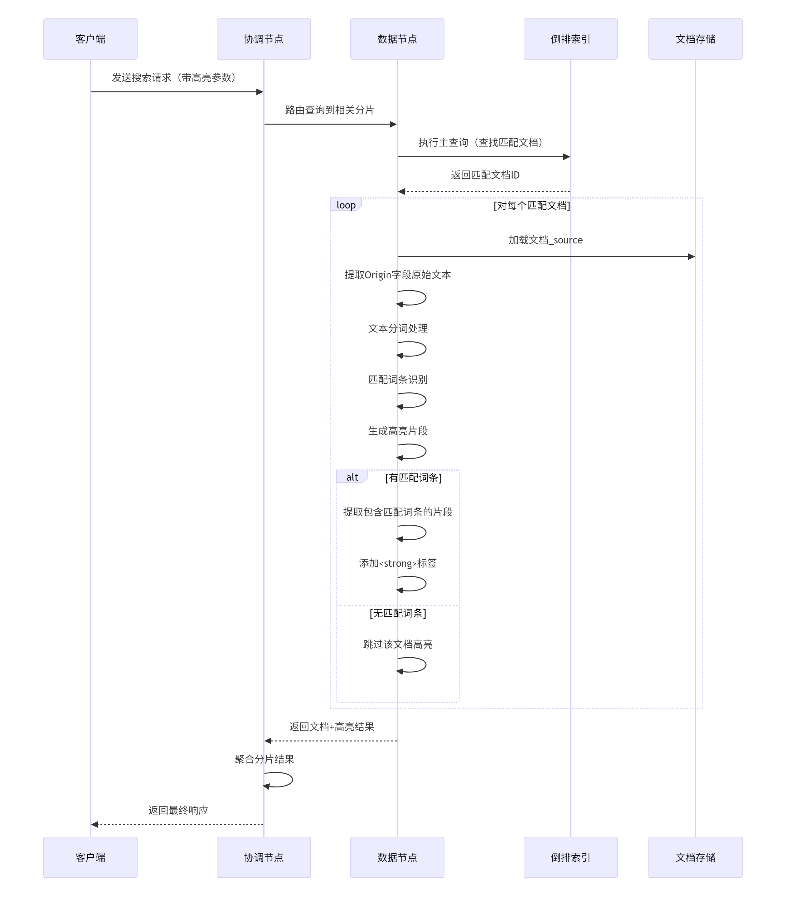

详细执行步骤说明：

1.  阶段一：查询解析与路由（协调节点）
2.  ​请求接收​：协调节点接收包含高亮参数的搜索请求
3.  ​查询解析​：
4.  解析主查询（match查询）
5.  解析高亮参数（字段、标签、类型）
6.  ​分片路由​：确定包含目标数据的分片
7.  ​请求分发​：向相关数据节点发送查询请求
8.  阶段二：文档匹配（数据节点）
9.  ​倒排索引查询​：在倒排索引中查找包含"Frankfurt"的文档
10.  ​文档评分​：计算匹配文档的相关性得分
11.  ​结果收集​：收集匹配文档ID和评分
12.  阶段三：高亮处理（核心流程）
13.  ​文档加载​：从\_source加载匹配文档的原始数据
14.  ​文本分析​：使用字段分析器处理文本
15.  ​词条匹配​：识别匹配查询词条的位置
16.  片段生成​：基于匹配词条提取文本片段
17.  阶段四：结果组装与返回
18.  ​文档组装​：将高亮片段添加到文档结果中
19.  分片结果返回​：数据节点返回处理后的文档
20.  ​结果聚合​：协调节点聚合所有分片结果
21.  ​最终响应​：返回给客户端

Plain vs Unified Highlighter 对比:

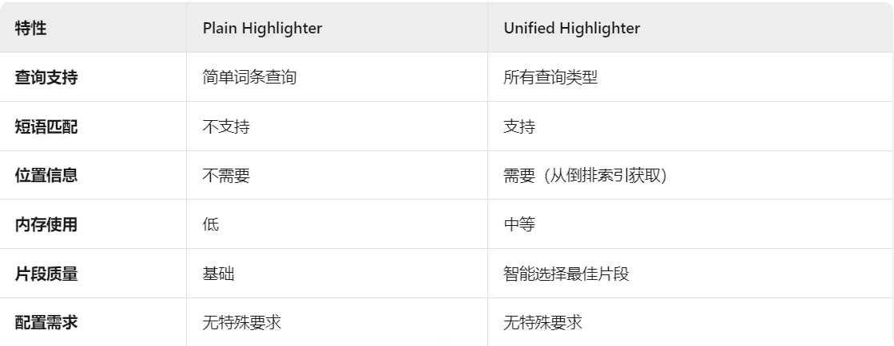

典型适用场景

1.  ​简单查询​：当查询只包含简单词条匹配时
2.  ​资源受限环境​：内存资源有限的情况下
3.  ​不需要短语匹配​：当不需要精确匹配短语时
4.  ​快速原型开发​：快速实现基本高亮功能

### **2.8.1.3 使用 fvh 高亮匹配类型**

该类型需要确保映射中包含 term\_vector 设置，所以我们需要对索引进行改造：

\# ES 索引上下文感知推荐高亮显示 mapping fvh

PUT kibana\_sample\_data\_flights\_completion\_fvh

{

"mappings": {

"dynamic": "true",

"date\_detection": false,

"numeric\_detection": false,

"properties": {

"@timestamp": {

"type": "date"

},

"@version": {

"type": "keyword"

},

"AvgTicketPrice": {

"type": "float"

},

"Cancelled": {

"type": "boolean"

},

"Carrier": {

"type": "text",

"fields": {

"keyword": {

"type": "keyword",

"ignore\_above": 256

}

}

},

"Dest": {

"type": "text",

"term\_vector": "with\_positions\_offsets",

"fields": {

"keyword": {

"type": "keyword",

"ignore\_above": 256

}

}

},

"DestCompletion": {

"type": "completion",

"analyzer": "standard",

"preserve\_separators": true,

"preserve\_position\_increments": true,

"max\_input\_length": 100,

"contexts": \[

{

"name": "airport\_type",

"type": "category",

"path": "meta.airport\_type"

},

{

"name": "location",

"type": "geo",

"precision": 5

},

{

"name": "services",

"type": "category",

"path": "meta.services"

}

\]

},

"DestAirportID": {

"type": "text",

"fields": {

"keyword": {

"type": "keyword",

"ignore\_above": 256

}

}

},

"DestCityName": {

"type": "text",

"fields": {

"keyword": {

"type": "keyword",

"ignore\_above": 256

}

}

},

"DestCountry": {

"type": "text",

"fields": {

"keyword": {

"type": "keyword",

"ignore\_above": 256

}

}

},

"DestLocation": {

"properties": {

"lat": {

"type": "keyword",

"ignore\_above": 256

},

"lon": {

"type": "keyword",

"ignore\_above": 256

}

}

},

"DestRegion": {

"type": "text",

"fields": {

"keyword": {

"type": "keyword",

"ignore\_above": 256

}

}

},

"DestWeather": {

"type": "text",

"fields": {

"keyword": {

"type": "keyword",

"ignore\_above": 256

}

}

},

"DistanceKilometers": {

"type": "float"

},

"DistanceMiles": {

"type": "float"

},

"FlightDelay": {

"type": "boolean"

},

"FlightDelayMin": {

"type": "float"

},

"FlightDelayType": {

"type": "text",

"fields": {

"keyword": {

"type": "keyword",

"ignore\_above": 256

}

}

},

"FlightNum": {

"type": "text",

"fields": {

"keyword": {

"type": "keyword",

"ignore\_above": 256

}

}

},

"FlightTimeHour": {

"type": "float"

},

"FlightTimeMin": {

"type": "float"

},

"Origin": {

"type": "text",

"fields": {

"keyword": {

"type": "keyword",

"ignore\_above": 256

}

}

},

"OriginAirportID": {

"type": "text",

"fields": {

"keyword": {

"type": "keyword",

"ignore\_above": 256

}

}

},

"OriginCityName": {

"type": "text",

"fields": {

"keyword": {

"type": "keyword",

"ignore\_above": 256

}

}

},

"OriginCountry": {

"type": "text",

"fields": {

"keyword": {

"type": "keyword",

"ignore\_above": 256

}

}

},

"OriginLocation": {

"properties": {

"lat": {

"type": "keyword",

"ignore\_above": 256

},

"lon": {

"type": "keyword",

"ignore\_above": 256

}

}

},

"OriginRegion": {

"type": "text",

"fields": {

"keyword": {

"type": "keyword",

"ignore\_above": 256

}

}

},

"OriginWeather": {

"type": "text",

"fields": {

"keyword": {

"type": "keyword",

"ignore\_above": 256

}

}

},

"dayOfWeek": {

"type": "float"

},

"event": {

"properties": {

"created": {

"type": "date"

},

"dataset": {

"type": "keyword"

},

"ingested": {

"type": "date"

}

}

},

"tags": {

"type": "keyword"

},

"timestamp": {

"type": "date"

}

}

}

}

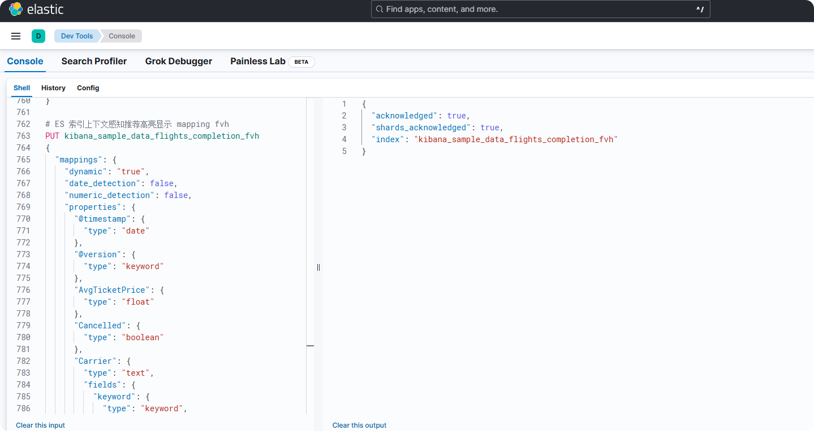

\# 使用 Reindex 复制数据 fvh

POST \_reindex

{

"source": {

"index": "kibana\_sample\_data\_flights\_completion"

},

"dest": {

"index": "kibana\_sample\_data\_flights\_completion\_fvh"

}

}

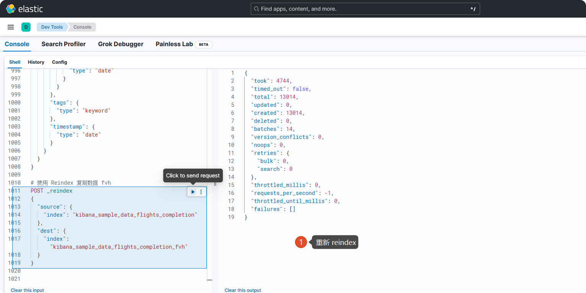

下面示例查询的目标是：​使用高性能的 fvh 高亮器在航班数据中精确匹配短语"Frankfurt am Main"，并在结果中高亮显示匹配的文本。

具体包括：

1.  ​短语匹配​：精确查找Origin字段包含完整短语"Frankfurt am Main"的航班
2.  ​高亮显示​：使用FVH高亮器将匹配的短语用<strong>标签包裹
3.  ​结果控制​：只返回1条文档（size:1）
4.  ​精确位置​：确保高亮精确匹配整个短语，而不是单个词

// highlight 高亮显示 置顶类型 fvh

GET kibana\_sample\_data\_flights\_completion\_fvh/\_search

{

"size": 1,

"\_source": \["Dest", "DestCompletion"\],

"query": {

"match\_phrase": {

"Dest": "Frankfurt am Main"

}

},

"highlight": {

"fields": {

"Dest": {

"pre\_tags": \["<strong>"\],

"post\_tags": \["</strong>"\],

"type": "fvh", // 显式指定fvh高亮器

"phrase\_limit": 50 // 控制匹配短语的数量

}

}

}

}

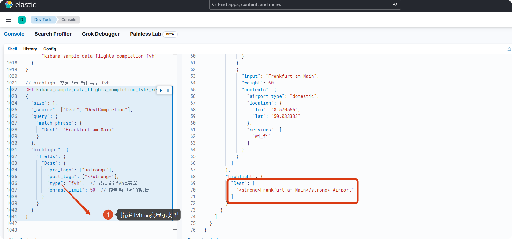

关键字段含义：

  
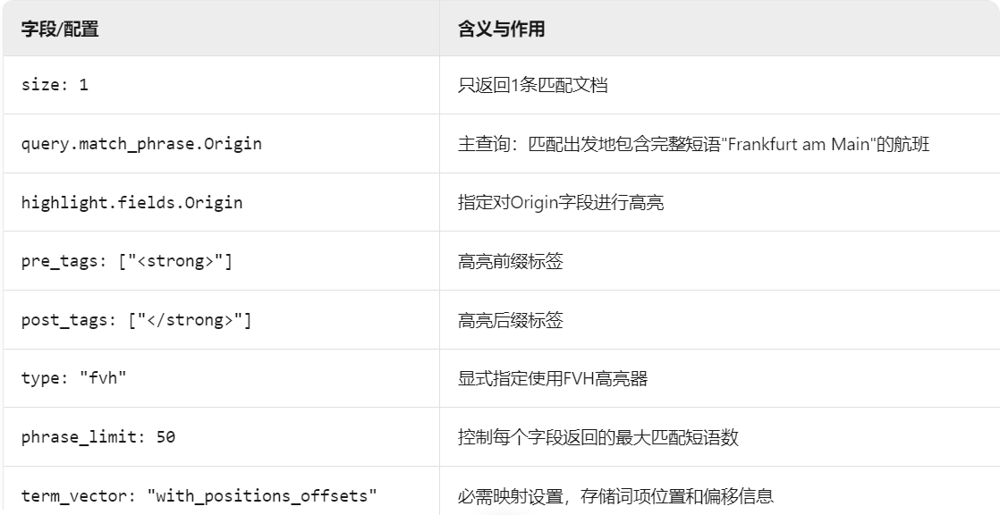

### **执行流程：**

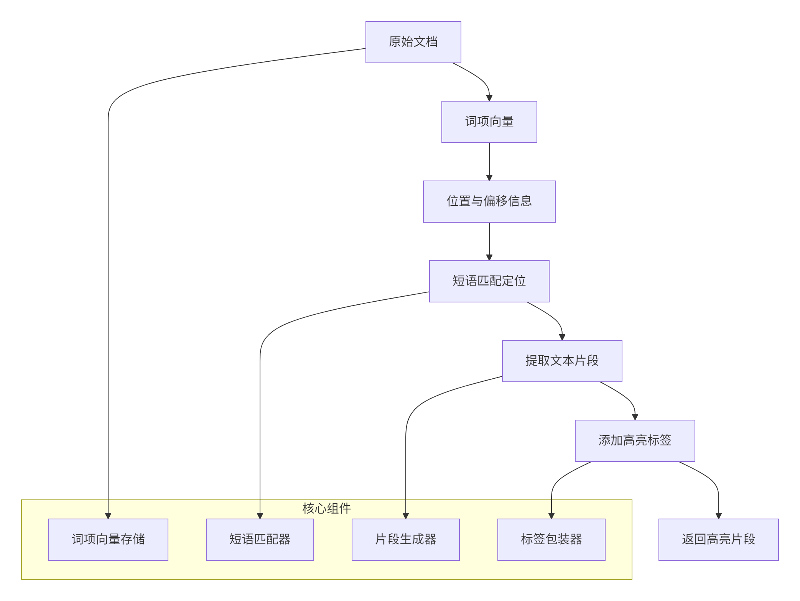

关键技术特点：

1.  ​精确位置​：基于存储的位置和偏移信息进行精确高亮
2.  ​短语支持​：特别适合短语查询的高亮显示
3.  ​高性能​：快速访问预计算的词项向量
4.  ​功能丰富​：支持多种高级高亮选项
5.  ​存储开销​：需要额外存储位置信息，增加索引大小

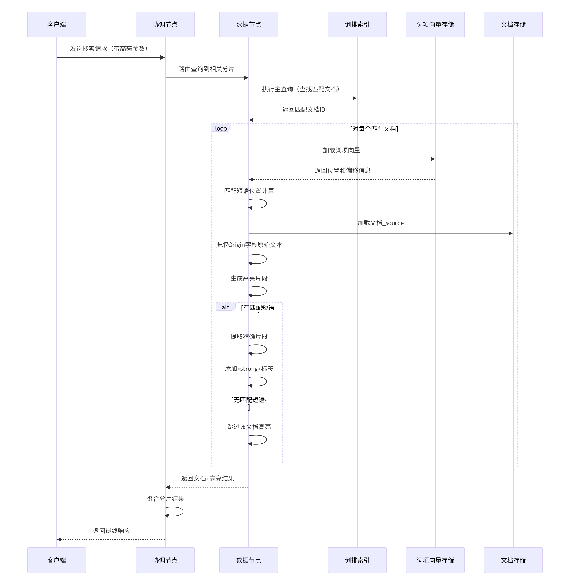

详细执行步骤说明：

1.  阶段一：查询解析与路由（协调节点）
2.  ​请求接收​：协调节点接收包含高亮参数的搜索请求
3.  ​查询解析​：
4.  解析主查询（match\_phrase查询）
5.  解析高亮参数（字段、标签、类型）
6.  ​分片路由​：确定包含目标数据的分片
7.  ​请求分发​：向相关数据节点发送查询请求
8.  阶段二：文档匹配（数据节点）
9.  ​倒排索引查询​：在倒排索引中查找包含完整短语"Frankfurt am Main"的文档
10.  ​文档评分​：计算匹配文档的相关性得分
11.  ​结果收集​：收集匹配文档ID和评分
12.  阶段三：高亮处理（核心流程）
13.  ​词项向量加载​：从词项向量存储加载位置和偏移信息
14.  短语匹配定位​：识别完整短语的位置
15.  片段生成​：基于短语位置提取文本片段
16.  阶段四：结果组装和返回
17.  ​文档组装​：将高亮片段添加到文档结果中
18.  分片结果返回​：数据节点返回处理后的文档
19.  ​结果聚合​：协调节点聚合所有分片结果
20.  ​最终响应​：返回给客户端

FVH Highlighter 核心优势：

1.  ​短语高亮​：精确高亮整个短语，而非单个词
2.  ​位置精确​：基于存储的位置信息，确保高亮准确
3.  ​性能优化​：对复杂查询高亮性能更好
4.  ​高级功能​：支持多种高亮选项：
5.  boundary\_scanner：控制片段边界
6.  boundary\_chars：定义边界字符
7.  fragment\_offset：控制片段偏移
8.  no\_match\_size：无匹配时返回的文本长度

FVH vs Unified Highlighter 对比：

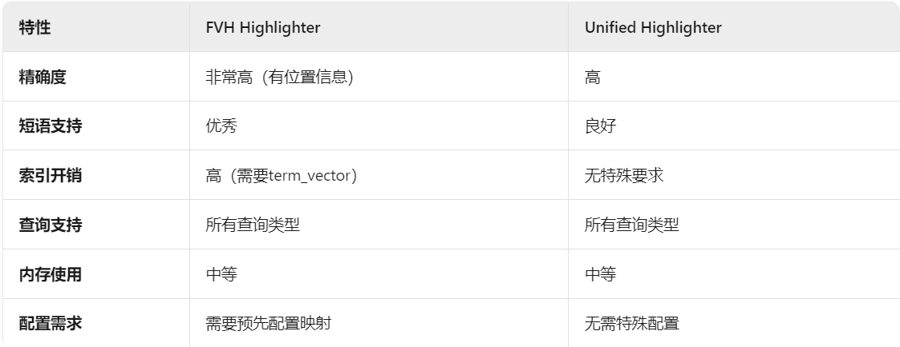

典型适用场景：

1.  ​精确短语高亮​：需要高亮完整短语而非单个词
2.  ​复杂查询高亮​：对复杂布尔查询的高亮支持更好
3.  ​大文档高亮​：处理大文档时性能更优
4.  ​需要高级高亮选项​：如边界控制、片段偏移等

### **2.8.2 多关键字高亮控制**

我们可以控制以下内容：

1.  控制高亮标记片段展示数量
2.  控制高亮标记片段展示顺序

下面示例查询的目标是：​在航班数据中搜索4个城市名称（Frankfurt、Paris、London、Amsterdam），控制高亮片段的展示数量和顺序。

具体包括：

1.  ​多字段搜索​：在 Dest、DestCityName 四个字段中搜索
2.  ​高亮控制​：
3.  对 Origin 和 Dest 字段返回最多 3 个高亮片段
4.  对 OriginCityName 和 DestCityName 字段返回最多 2 个高亮片段
5.  所有高亮片段按相关性分值排序
6.  ​结果优化​：返回 5 个最相关的文档

// highlight 高亮显示 多关键字

GET kibana\_sample\_data\_flights\_fulltext/\_search

{

"size": 5,

"query": {

"multi\_match": {

"query": "Frankfurt Paris London Amsterdam",

"fields": \["Origin", "Dest", "OriginCityName", "DestCityName"\],

"type": "best\_fields"

}

},

"highlight": {

"fields": {

"Dest": {

"number\_of\_fragments": 3,

"order": "score",

"pre\_tags": \["<mark>"\],

"post\_tags": \["</mark>"\],

"fragment\_size": 100

},

"DestCityName": {

"number\_of\_fragments": 2,

"order": "score",

"pre\_tags": \["<mark>"\],

"post\_tags": \["</mark>"\]

}

}

}

}

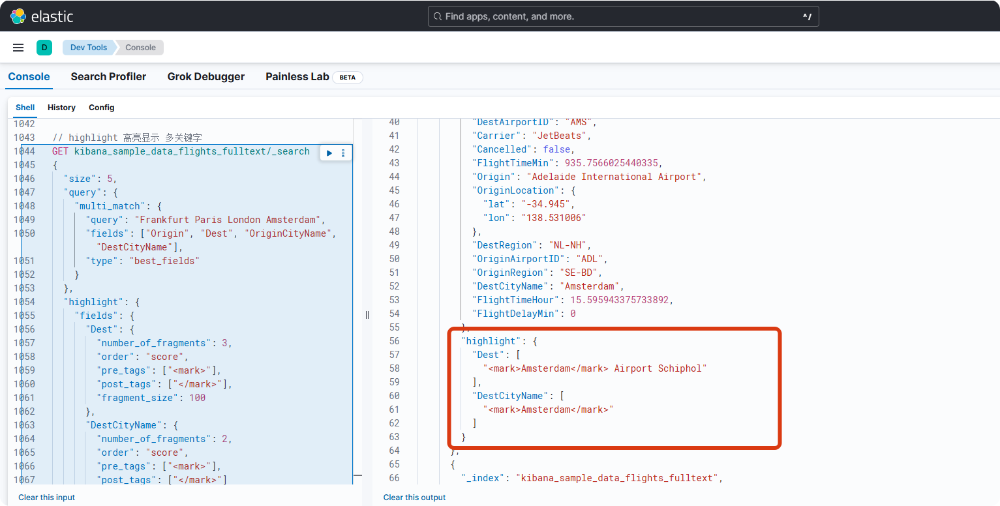

关键字段含义：

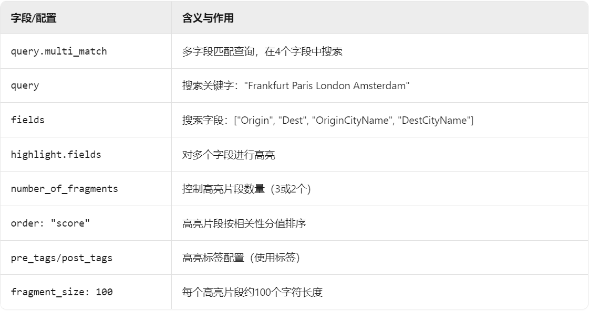

### **执行流程：**

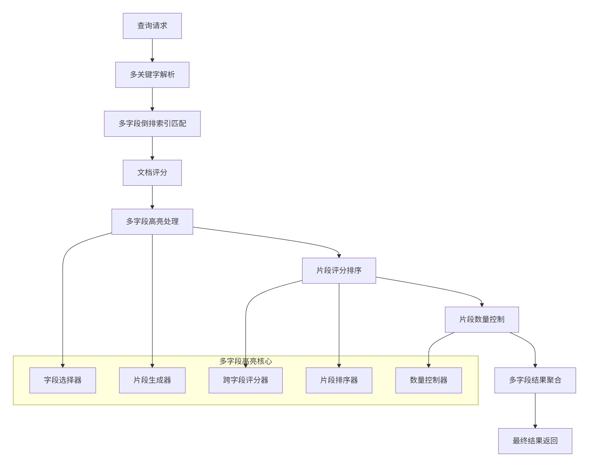

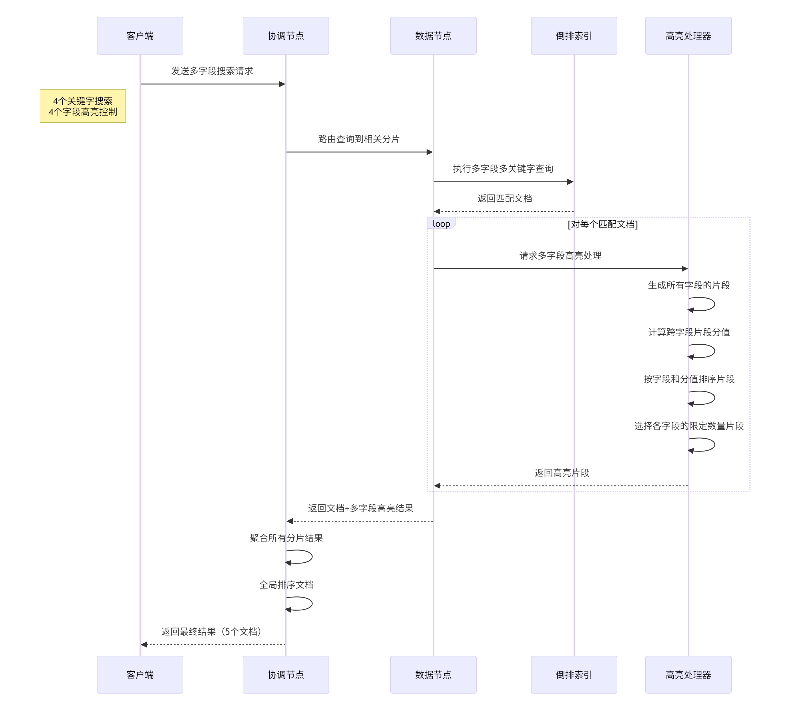

详细执行步骤说明：

1.  阶段一：查询解析与路由（协调节点）
2.  ​请求接收​：协调节点接收包含多字段高亮参数的搜索请求
3.  ​查询解析​：
4.  解析multi\_match查询，识别4个搜索关键字和4个目标字段
5.  解析各字段的高亮参数（不同的number\_of\_fragments设置）
6.  ​分片路由​：基于索引分片配置确定需要查询的所有相关分片
7.  ​请求分发​：向所有相关数据节点发送并行查询请求
8.  阶段二：文档匹配与评分（数据节点）
9.  ​多字段倒排索引查询​：在4个字段的倒排索引中查找匹配文档
10.  跨字段评分​：使用BM25算法计算每个匹配文档的综合相关性分值
11.  ​结果收集​：收集匹配文档ID和评分，按分值排序
12.  阶段三：多字段高亮处理（核心流程）
13.  ​多字段文本提取​：从匹配文档的\_source中提取4个字段的原始内容
14.  ​多字段片段生成​：为每个字段生成包含关键字的文本片段
15.  跨字段片段评分​：计算每个片段的相关性分值，考虑字段权重
16.  按字段排序和选择​：为每个字段选择限定数量的最高分片段
17.  阶段四：结果组装和返回
18.  ​多字段结果组装​：将各字段的高亮片段添加到文档结果中
19.  分片结果返回​：数据节点返回处理后的文档
20.  ​全局结果聚合​：协调节点聚合所有分片结果，按文档分值全局排序
21.  ​最终响应​：返回前5个最相关的文档给客户端