从今天之后的一段时间内，华仔会带着大家一起来从零开始对 ElasticStack 矩阵产品进行深入剖析和项目运维实战，希望大家学完之后可以用到自己的工作中。

这是第十篇，本篇我将带着大家进行「**ES 索引数据加工 ETL 利器之 Ingest 深度实战**」。

文章汇总位置：[https://wx.zsxq.com/dweb2/index/columns/51122554151214](https://wx.zsxq.com/dweb2/index/columns/51122554151214)

## **01 前言**

在上篇中 [【ES 入门实战第九篇】ES 索引重建之 Reindex 深度实战及性能调优](https://articles.zsxq.com/id_uhm2m67sttpb.html)，带着大家进行「**ES 索引重建之 Reindex 深度实战及性能调优**」。

今天我们来进行「**ES 索引数据加工 ETL 利器之 Ingest 深度实战**」。

## **02 ES 索引数据加工 ETL 利器介绍**

## **2.1 什么是 ES 索引数据加工之 Ingest**

ES Ingest​ 是一个强大而精巧的内置 ETL 工具，它通过 ​Pipeline​ 和 ​Processor​ 的模型，让用户能在数据写入阶段就完成清洗、转换、富化等一系列操作，最终将规整、有价值的数据直接存入索引，为后续的高效搜索和分析奠定了坚实的基础。它非常适合处理实时流式数据，是构建简洁、高效数据平台的重要利器。

Ingest 不是一个外部服务，而是 ES 集群内部的一个轻量级、低延迟的数据预处理层。它通常运行在协调节点（Coordinating Node）​​ 或专用的钻取节点（Ingest Node）​​ 上，这意味着您无需部署和维护像 Logstash 这样的额外服务来完成数据预处理。数据处理逻辑（Pipeline）的定义、执行和管理全部在 ES 集群内部完成，极大地简化了架构和运维复杂度。

1.  无外部依赖​：所有处理都在 ES 集群内完成，无需配置和维护额外服务。
2.  ​资源消耗低​：处理逻辑简单直接，通常只占用少量的 CPU 和内存资源。
3.  ​延迟极低​：在数据写入的同一网络往返中完成处理，延迟通常在毫秒级，非常适合实时数据流。

所谓 ETL 是 Extract（提取）、Transform（转换）、Load（加载）的缩写，是数据仓库领域的核心概念。

1.  Extract​：数据来自写入 ES 的请求。
2.  ​Transform​：在 Ingest Pipeline 中通过一系列处理器（Processor）完成转换。这正是它强大的地方。
3.  ​Load​：最终写入目标索引。

它实现了 ETL 的核心流程，但无需笨重的传统 ETL 工具，配置更灵活，延迟极低（毫秒级）。

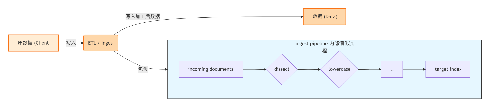

## **2.2 ES 索引数据加工之 Ingest 应用场景**

上图涵盖了 Ingest 的核心应用场景：

### **2.2.1 数据写入/更新**

这是 Ingest 最基础和最常用的两大场景，覆盖了数据的全生命周期：

1.  ​数据写入 (insert)​​：这是最核心的场景。在数据被 index 或 create 操作写入之前，通过预定义的 Pipeline 自动完成清洗、转换、富化。
2.  例如，在写入日志数据前，自动提取 timestamp、解析 user\_agent、转换字段类型。
3.  ​数据更新 (update)​​：通过 Update By Query API 调用 Ingest Pipeline，对已存在于索引中的文档进行批量更新。
4.  例如，修复错误的数据格式、为历史数据添加新的衍生字段。

### **2.2.2 基于 enrich 策略构建大宽表索引**

这是 Ingest 非常强大的一个高级功能。通过 ​Enrich Processor，可以在写入主文档时，「**自动关联**」查询另一个已有的「**参考索引**」（如用户信息表、产品信息表），并将查询结果关联字段​整合到主文档中，从而构建一个包含大量关联信息的「**大宽表**」索引。

1.  ​优势​：避免了在查询时进行昂贵的关联查询（Join），以空间换时间，极大地提升了检索性能。
2.  ​场景​：在写入订单数据时，自动根据 user\_id 去“用户索引”中查询出用户的 level, region 等信息，并直接写入订单文档中。

由于篇幅问题，这部分的实战我们后续会单独展开。

### **2.2.3 共享处理数据加工**

Ingest Pipeline 一旦在集群中创建就成为一个全局共享的资源，这意味着：

1.  ​一致性​：不同的写入源（不同的应用程序、Logstash、Filebeat 等）都可以通过指定相同的 Pipeline 名称，来确保数据经过完全一致的处理逻辑，保证了数据规范性。
2.  ​可维护性​：数据处理逻辑（Pipeline 配置）只需在 ES 集群中维护一份。需要修改时，只需更新该 Pipeline，所有使用它的写入操作会自动生效，无需修改每个数据源的代码。

### **2.2.4 索引重建**

当您需要调整索引的映射（mapping）或分片策略时，重建索引是标准操作。Ingest Pipeline 在该过程中赋予了数据转换的能力，使得重建不仅是简单的拷贝，更是一次数据结构和内容的升级机会。

在使用 \_reindex API 将数据从一个索引迁移到另一个索引时可以指定 Pipeline，在写入新索引前对数据进行处理和改造。这常用于索引映射的版本升级或数据结构优化。

## **03 ES 索引数据加工之 Ingest 基础应用实战**

接下来我们先来看下 Ingest 的基础应用实战。

## **3.1 添加 kibana sample flight 案例数据**

在开始实操之前，我们先来添加下案例索引数据，今天我们准备的案例数据是 Sample eCommerce orders，添加方式：

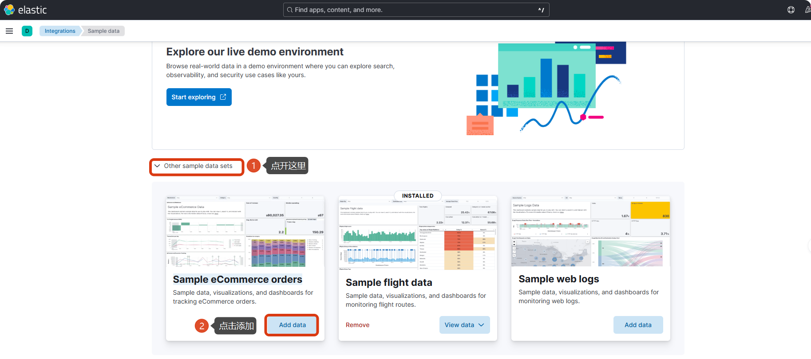

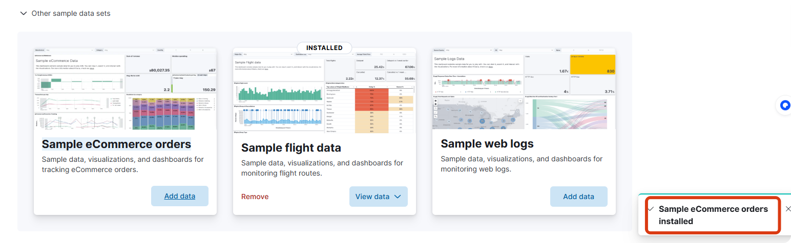

## **3.2 ES 索引数据加工之 Ingest 内置数据处理器**

官方文档链接：[https://www.elastic.co/guide/en/elasticsearch/reference/8.17/ingest.html](https://www.elastic.co/guide/en/elasticsearch/reference/8.17/ingest.html)

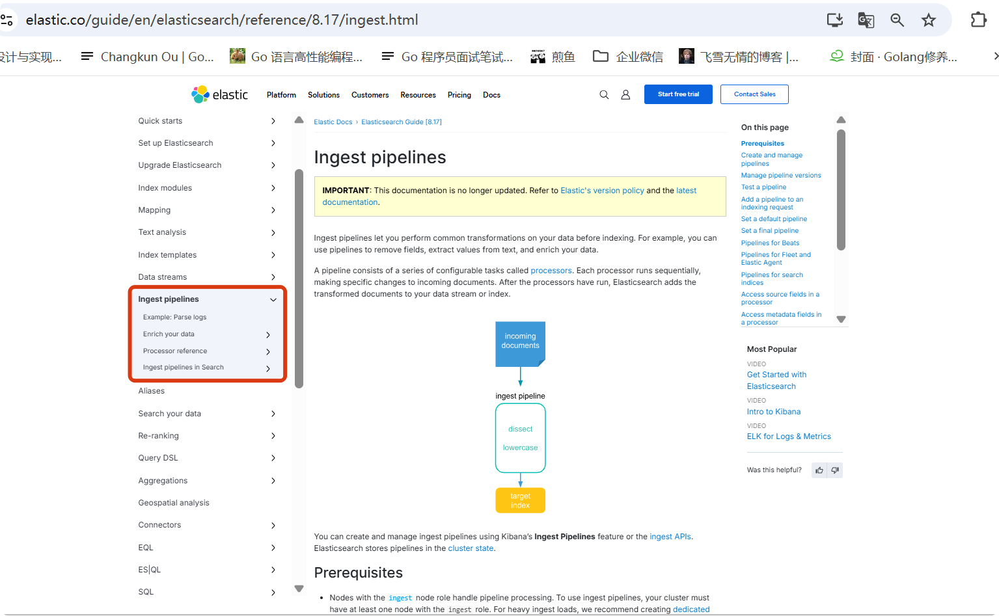

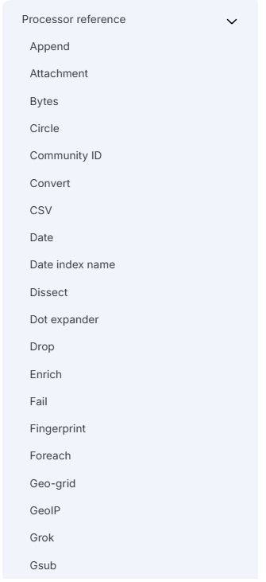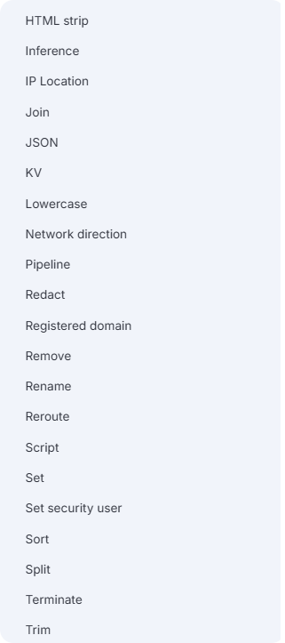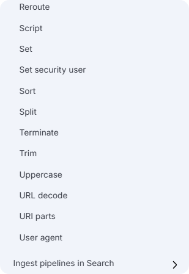

如图可以看到，常用处理器已经内置好了，但是动态脚本处理器还需要自己去编写处理器。

### **3.2.1 查看 Ingest-Pipeline**

GET \_ingest/pipeline

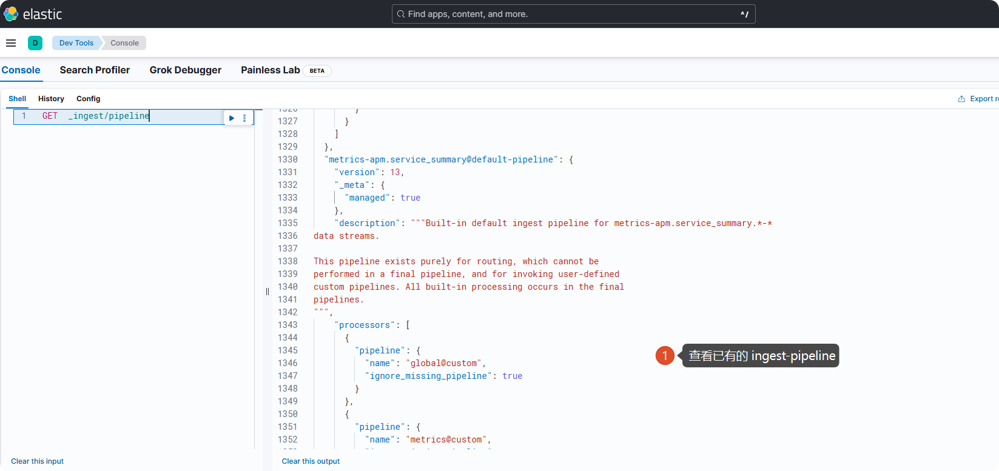

可以看到获取的结果集就是 ES 集群中当前定义的所有 ​Ingest Pipeline 的配置清单，这个庞大的 JSON 对象包含了非常丰富的信息，是了解集群数据预处理能力的核心视图，这里简单的来介绍下，方便理解：

### **1、结构概览**

结果集是一个 JSON 对象，其最外层的每个 ​Key​ 都是一个 ​Pipeline 的名称。例如 synthetics-browser-1.3.0, logs@default-pipeline, traces-apm@pipeline 等。

每个 Pipeline 名称对应的 ​Value​ 是一个完整的 Pipeline 定义对象，包含了该管道的所有配置信息。

### **2、核心组成部分**

每一个 Pipeline 定义都包含以下几个核心部分：

1.  processors (处理器数组)​​：这是 Pipeline 的心脏。它定义了一个有序的处理器列表，数据会依次流经这些处理器并被加工。您会看到很多管道都大量使用了这个处理器。它的作用是调用另一个管道，实现了管道的模块化和嵌套组合。例如：

{ "pipeline": {

"name": "global@custom", // 调用名为 'global@custom' 的管道

"ignore\_missing\_pipeline": true // 如果指定的管道不存在，则忽略错误继续执行

}

}

1.  其他处理器​：如 set（设置字段）, script（执行脚本）, remove（删除字段）, geoip（IP地址解析）, user\_agent（解析UA）等。例如在 search-default-ingestion 中看到的 attachment, gsub, trim 等。
2.  \_meta (元数据)​：这部分描述了管道的管理属性。
3.  "managed": true：表示此管道是被托管的，通常由 Elasticsearch 本身、Fleet、Integrations 或 Elastic Agent 自动创建和管理。​谨慎手动修改这类管道，因为更新或升级后可能会被覆盖。
4.  "managed\_by": "fleet" / "managed\_by": "Search"：明确指出了该管道的管理方是谁（如 Fleet 服务器、Enterprise Search 服务等）。
5.  "package": { "name": "synthetics" }：指明了该管道属于哪个集成包（Integration Package）。
6.  "description"：提供了管道用途的人类可读描述。
7.  version (版本号)​​：管道的版本号。当管道被更新时，这个版本号会递增。这有助于追踪和管理配置的变更。
8.  ​description (描述)​​：管道的详细文本描述，说明其设计目的和功能。
9.  ​on\_failure (失败处理策略)​：（并非所有管道都有）它定义了当管道中的某个处理器执行失败时该怎么办。通常用于错误记录和清理，例如：

"on\_failure": \[

{

"append": {

"field": "\_ingestion\_errors",

"value": "Processor 'attachment' failed: {{ \_ingest.on\_failure\_message }}"

}

}

\]

### **3、结果集分类**

这个配置清单展示了 ES 不同功能模块创建的管道，可以分为以下几类：

1.  ​Synthetics（综合监控）相关管道​ (e.g., synthetics-browser-1.3.0, synthetics-http-1.3.0)
2.  ​用途​：处理来自 ​Heartbeat​ 等综合监控工具的数据。
3.  ​模式​：采用“责任链”模式，依次调用范围从广到窄的管道：
4.  global@custom -> synthetics@custom -> synthetics-synthetics.integration@custom -> synthetics-\[dataset\]@custom。
5.  ​设计理念​：提供了极大的灵活性。你可以在 global@custom 中定义所有数据通用的处理逻辑，在 synthetics-http@custom 中专门定义处理 HTTP 检查数据的逻辑。
6.  ​APM（应用性能监控）相关管道​ (e.g., traces-apm@default-pipeline, metrics-apm@app@default-pipeline, apm@pipeline)
7.  ​用途​：处理来自 ​APM Server​ 的链路追踪（traces）、指标（metrics）、日志（logs）数据。
8.  ​特点​：包含复杂的业务逻辑，如：
9.  ​路由 (reroute)​: 将数据路由到不同的数据集（dataset）。
10.  ​富化 (geoip, user\_agent)​: 添加地理位置和用户代理信息。
11.  ​脚本处理: 进行复杂的数据转换和计算。
12.  ​通用日志和指标管道​ (e.g., logs@default-pipeline, metrics-apm@app@default-pipeline)
13.  ​用途​：处理通用的日志和指标数据。
14.  ​常见操作​：确保 @timestamp 存在、调用用户自定义管道 (logs@custom)。
15.  ​Search 和 Enterprise Search 管道​ (e.g., search-default-ingestion, ent-search-generic-ingestion)
16.  ​用途​：在处理搜索引擎和企业搜索内容摄入时，用于文档内容的预处理。
17.  ​高级功能​：包括文本提取（attachment 处理器）、文本清理（gsub, trim）、错误处理等。
18.  ​Fleet 代理管道​ (e.g., .fleet\_final\_pipeline-1)
19.  ​用途​：这是由 ​Fleet​ 管理的 Elastic Agent 发送的所有数据的最终管道（final pipeline）​。
20.  ​核心任务​：添加安全相关信息、进行代理身份验证和验证（agent\_id\_status）、执行最终的数据清理。这是整个托管数据流的最后一道关卡。

### **4、总结与建议**

这个结果集展示了集群中一个强大而复杂的数据预处理生态系统。这些管道协同工作，在数据被索引之前自动完成了清洗、转换、富化、路由等大量繁重的工作。

1.  ​对于使用者​：不需要手动调用这些管道，当使用 ​Fleet​ 和 ​集成（Integrations）​​ 时，Elastic Agent 会自动为相应的数据流选择并应用正确的管道。这是 Elastic Stack ​​“开箱即用”​​ 体验的核心所在。
2.  ​对于开发者/运维​：理解这个清单有助于你：
3.  ​调试数据​：当数据不符合预期时，知道是哪个管道在处理它。
4.  ​自定义处理​：遵循 @custom 管道的设计模式，在不修改官方管道的前提下，添加你自己的处理逻辑。
5.  ​掌控全局​：了解数据在入库前经历了哪些变化。

### **3.2.2 创建 Ingest-Pipeline**

PUT \_ingest/pipeline/kibana\_sample\_data\_ecommerce

{

"description": "ecommerce 数据加工 ingest",

"processors": \[

{

// 增加一个字段

"set": {

"field": "tag",

"value": "EUR\_order"

},

// 删除一个字段

"remove": {

"field": "email"

}

}

\]

}

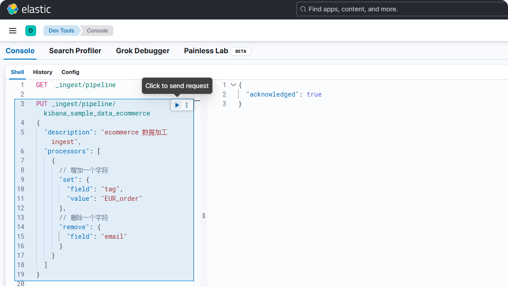

\# 查看 ingest-pipeline

GET \_ingest/pipeline/kibana\_sample\_data\_ecommerce

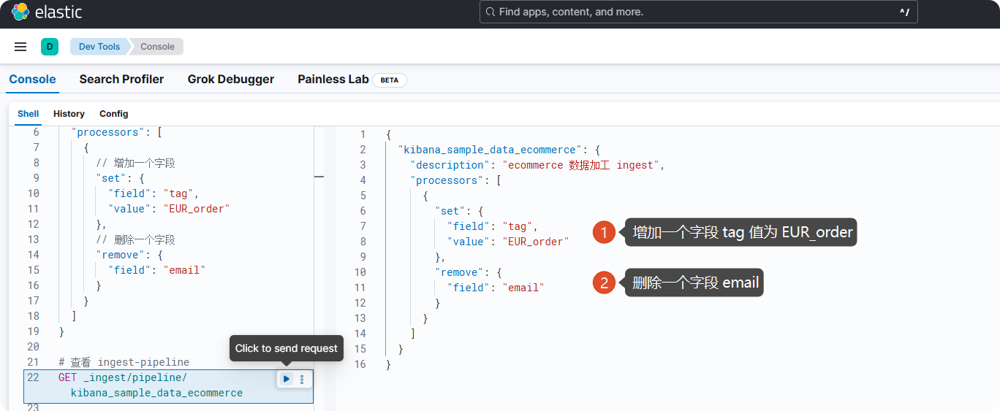

### **3.2.3 模拟运行 Ingest-Pipeline**

\# 模拟测试

POST \_ingest/pipeline/kibana\_sample\_data\_ecommerce/\_simulate

{

"docs": \[

{

"\_source": {

"category": \[

"Men's Shoes1",

"Men's Clothing1",

"Women's Accessories1",

"Men's Accessories1"

\],

"currency": "EUR",

"customer\_first\_name": "Sultan Al1",

"customer\_full\_name": "Sultan Al Boone1",

"customer\_gender": "MALE1",

"customer\_id": 19,

"customer\_last\_name": "Boone1",

"customer\_phone": "",

"day\_of\_week": "Saturday1",

"day\_of\_week\_i": 5,

"email": "sultan al@boone-family.zzz1",

"manufacturer": \[

"Angeldale",

"Oceanavigations",

"Microlutions"

\],

"order\_date": "2025-09-13T08:28:19+00:00",

"order\_id": 716724,

"products": \[

{

"base\_price": 11.99,

"discount\_percentage": 0,

"quantity": 1,

"manufacturer": "Oceanavigations",

"tax\_amount": 0,

"product\_id": 15290,

"category": "Men's Accessories",

"sku": "ZO0308503085",

"taxless\_price": 11.99,

"unit\_discount\_amount": 0,

"min\_price": 6.11,

"\_id": "sold\_product\_716724\_15290",

"discount\_amount": 0,

"created\_on": "2016-12-31T08:28:19+00:00",

"product\_name": "Hat - light grey multicolor",

"price": 11.99,

"taxful\_price": 11.99,

"base\_unit\_price": 11.99

}

\],

"sku": \[

"ZO0687606876",

"ZO0290502905",

"ZO0126701267",

"ZO0308503085"

\],

"taxful\_total\_price": 173.96,

"taxless\_total\_price": 173.96,

"total\_quantity": 4,

"total\_unique\_products": 4,

"type": "order",

"user": "sultan",

"geoip": {

"country\_iso\_code": "AE",

"location": {

"lon": 54.4,

"lat": 24.5

},

"region\_name": "Abu Dhabi",

"continent\_name": "Asia",

"city\_name": "Abu Dhabi"

},

"event": {

"dataset": "sample\_ecommerce"

}

}

}

\]

}

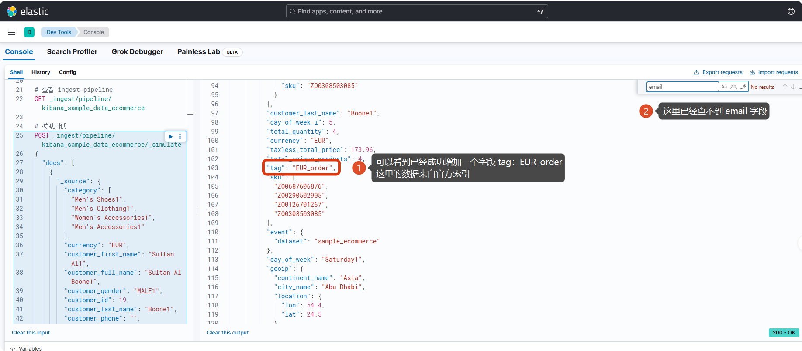

1.  目标管道​：kibana\_sample\_data\_ecommerce。
2.  ​测试数据​：包含一个完整的电商订单文档（模拟数据）。
3.  ​目的​：在不实际写入索引的情况下，验证管道对数据的处理效果。
4.  这里只是增加一个字段和删除字段，当然也可以重命名字段、解析字段等

### **3.2.4 数据写入**

PUT kibana\_sample\_data\_ecommerce1

{

"mappings": {

"dynamic": true // 允许动态字段

}

}

POST kibana\_sample\_data\_ecommerce1/\_doc/Yrdf4ZgBZvDYCfr3zx7P?pipeline=kibana\_sample\_data\_ecommerce

{

"category": \[

"Men's Shoes",

"Men's Clothing",

"Women's Accessories",

"Men's Accessories"

\],

"currency": "EUR",

"customer\_first\_name": "Sultan Al",

"customer\_full\_name": "Sultan Al Boone",

"customer\_gender": "MALE",

"customer\_id": 19,

"customer\_last\_name": "Boone",

"customer\_phone": "",

"day\_of\_week": "Saturday",

"day\_of\_week\_i": 5,

"email": "sultan al@boone-family.zzz",

"manufacturer": \[

"Angeldale",

"Oceanavigations",

"Microlutions"

\],

"order\_date": "2025-09-13T08:28:19+00:00",

"order\_id": 716724,

"products": \[

{

"base\_price": 79.99,

"discount\_percentage": 0,

"quantity": 1,

"manufacturer": "Angeldale",

"tax\_amount": 0,

"product\_id": 23975,

"category": "Men's Shoes",

"sku": "ZO0687606876",

"taxless\_price": 79.99,

"unit\_discount\_amount": 0,

"min\_price": 42.39,

"\_id": "sold\_product\_716724\_23975",

"discount\_amount": 0,

"created\_on": "2016-12-31T08:28:19+00:00",

"product\_name": "Winter boots - cognac",

"price": 79.99,

"taxful\_price": 79.99,

"base\_unit\_price": 79.99

}

\],

"sku": \[

"ZO0687606876",

"ZO0290502905",

"ZO0126701267",

"ZO0308503085"

\],

"taxful\_total\_price": 173.96,

"taxless\_total\_price": 173.96,

"total\_quantity": 4,

"total\_unique\_products": 4,

"type": "order",

"user": "sultan",

"geoip": {

"country\_iso\_code": "AE",

"location": {

"lon": 54.4,

"lat": 24.5

},

"region\_name": "Abu Dhabi",

"continent\_name": "Asia",

"city\_name": "Abu Dhabi"

},

"event": {

"dataset": "sample\_ecommerce"

}

}

\# 查看处理结果GET kibana\_sample\_data\_ecommerce1/\_search

{

"query": {

"term": {

"\_id" : "Yrdf4ZgBZvDYCfr3zx7P"

}

}

}

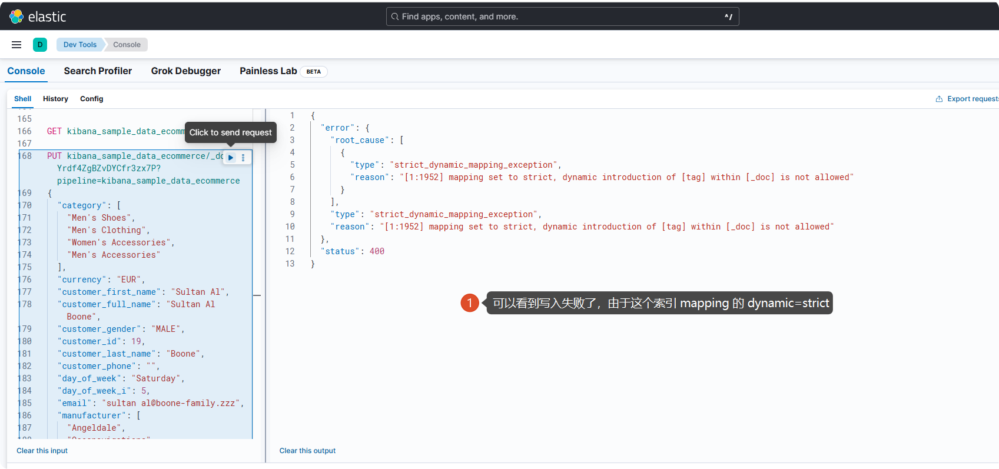

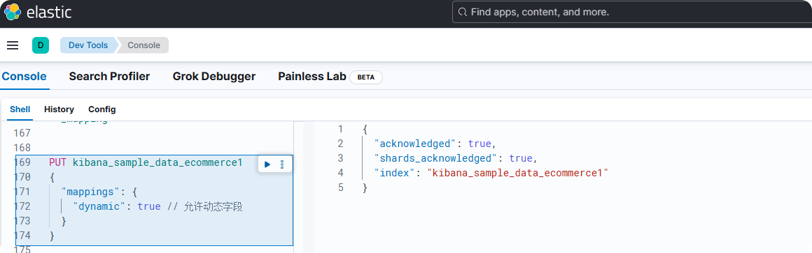

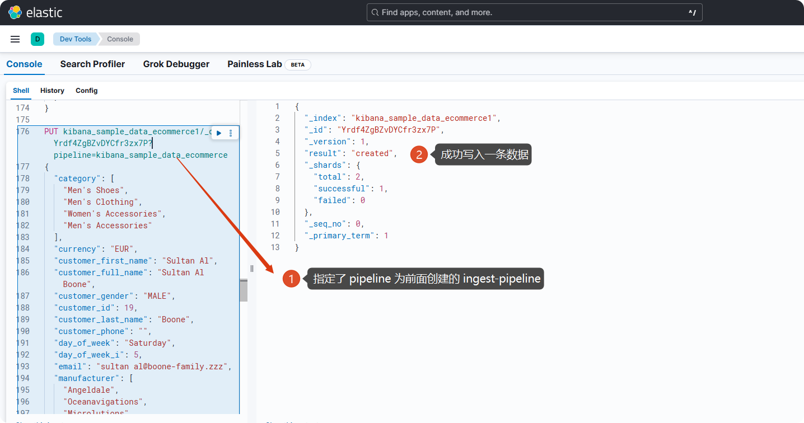

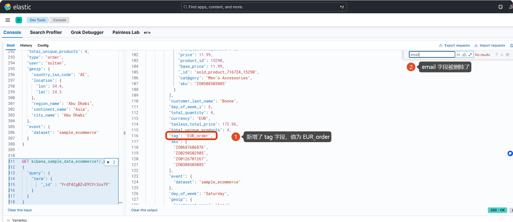

我们来看下其底层设计思想，管道写入操作内部流程图：

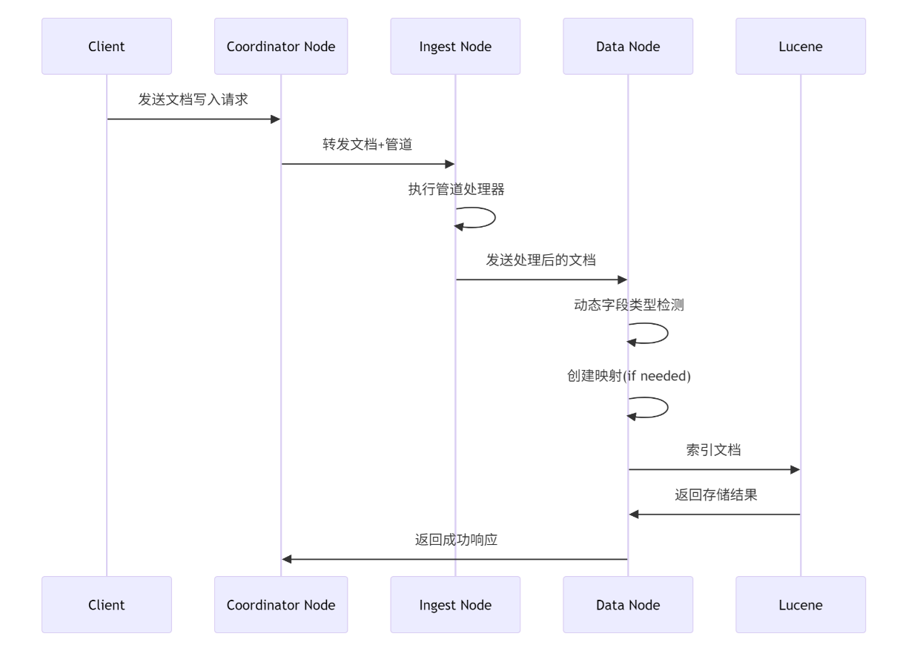

### **3.2.5 数据更新**

POST kibana\_sample\_data\_ecommerce1/\_update\_by\_query?pipeline=kibana\_sample\_data\_ecommerce

PUT \_ingest/pipeline/kibana\_sample\_data\_ecommerce

{

"description": "ecommerce 数据加工 ingest",

"processors": \[

{

// 增加一个字段

"set": {

"field": "tag",

"value": "EUR\_order"

},

// 删除一个字段

"remove": {

"field": "email",

"ignore\_missing": true, // 修复1：忽略缺失字段

"if": "ctx.email != null" // 修复2：条件执行

}

}

\]

}

GET kibana\_sample\_data\_ecommerce1/\_search?version=true

可以看到执行报错了，在 \_update\_by\_query 操作中，管道处理器会先于更新操作执行，管道先删除了 email 字段，后续操作尝试访问已被删除的字段导致错误：

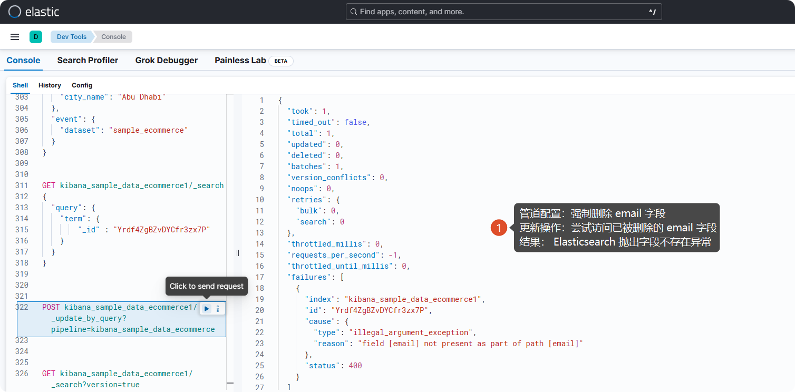

我们来修改下前面创建的管道配置：

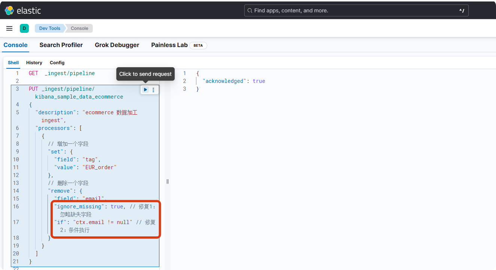

再来测试更新：

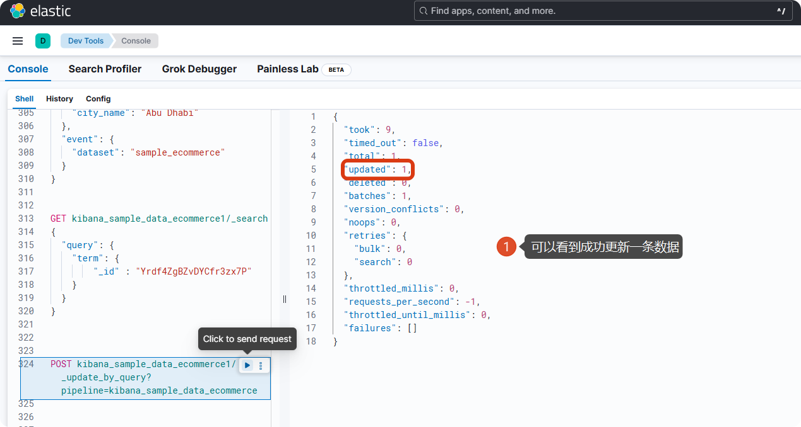

查看版本号：

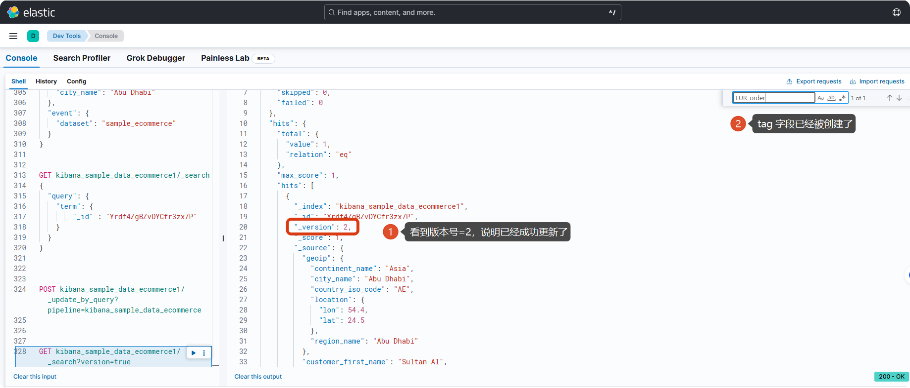

我们来看下其底层设计思想，管道更新操作内部流程图：

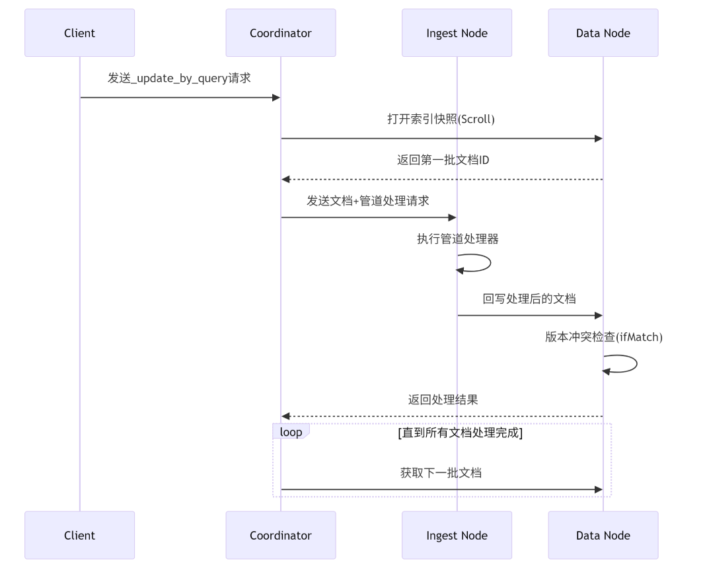

1.  快照隔离​：使用 \_scroll API 创建索引快照，确保更新过程中数据一致性。
2.  ​批处理​：默认每批处理 1000 个文档（可通过 scroll\_size 调整）。
3.  ​版本控制​：使用 if\_seq\_no 和 if\_primary\_term 防止并发写入冲突。
4.  ​管道执行​：在协调节点或专用钻取节点执行处理器。

创建管道配置流程图：

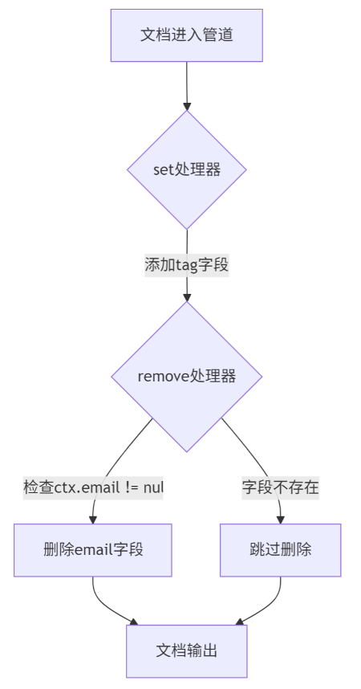

1.  条件执行​：if 参数使用 Painless 脚本语言实现运行时判断。
2.  ​安全删除​：ignore\_missing=true 防止字段不存在时报错。
3.  ​原子操作​：整个处理器链在内存中完成，保证原子性。

### **3.2.6 索引重建**

[【ES 入门实战第九篇】ES 索引重建之 Reindex 深度实战及性能调优](https://articles.zsxq.com/id_uhm2m67sttpb.html) 上篇我们已经实战过了，不熟悉的可以点击查看进行实操。

\# 通过 ingest pipeline 来重建索引

POST \_reindex

{

"source": {

"index": "kibana\_sample\_data\_ecommerce"

},

"dest": {

"index": "kibana\_sample\_data\_ecommerce1",

"pipeline": "kibana\_sample\_data\_ecommerce"

}

}

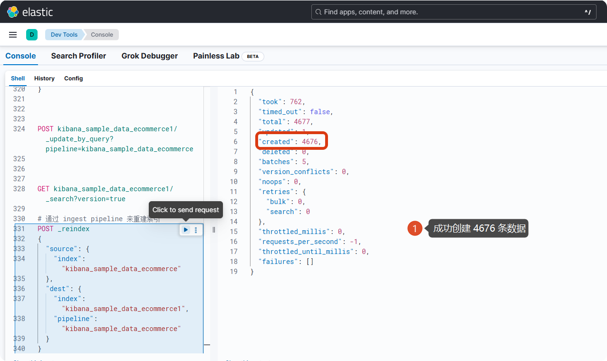

GET kibana\_sample\_data\_ecommerce1/\_search?version=true

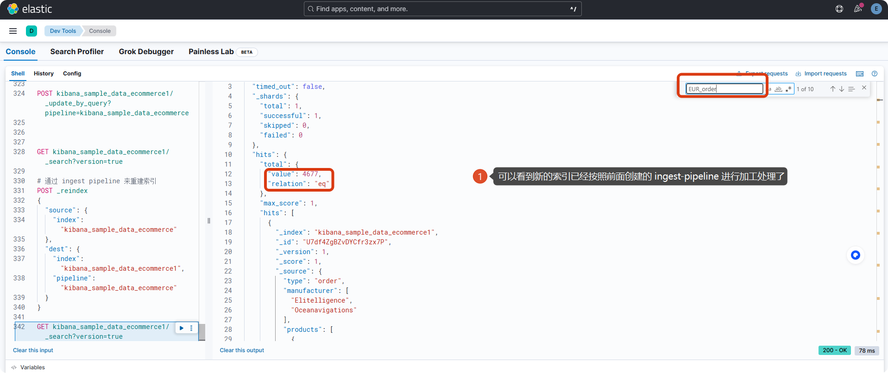

我们来看下其底层设计思想，ES 索引重建操作内部流程图：

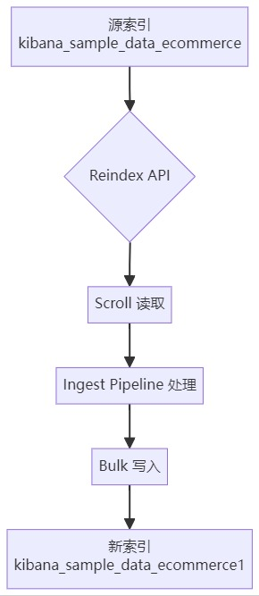

增加管道处理后的重新索引操作流程：

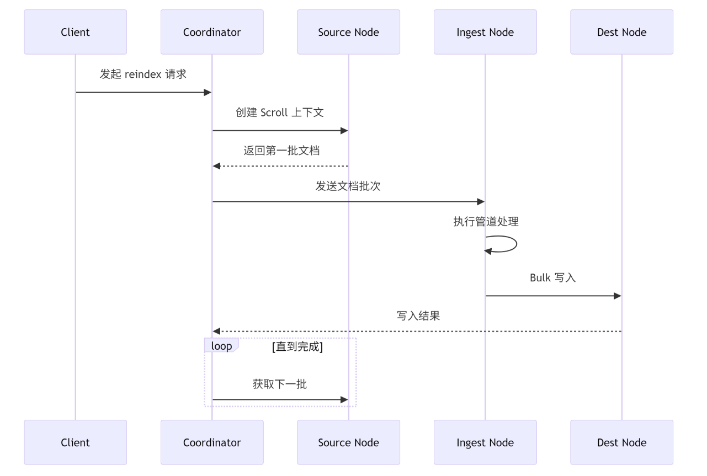

### **3.2.7 Ingest 数据上下文访问**

这是一个非常重要的功能，我们来看下。

### **3.2.7.1 Meta 元数据访问**

1.  索引元数据（Index Metadata）
2.  ​包含字段​：\_index、\_id、\_routing 等。
3.  ​访问方式​：使用 {{\_index}}、{{\_id}}、{{\_routing}} 模板表达式。
4.  ​应用场景​：在数据处理过程中动态获取文档的索引名称、ID或路由信息。
5.  Ingest 处理元数据（Ingest Metadata）
6.  ​包含字段​：\_ingest.timestamp（管道执行时间戳）。
7.  ​访问方式​：使用 {{\_ingest.timestamp}} 模板表达式。
8.  ​应用场景​：记录数据经过管道处理的准确时间。

假设这样的场景，采集端写的索引名称为 A，但是我想在写入 ES 前修改索引名称为 B，是可以通过 pipeline 来完成的：

PUT \_ingest/pipeline/kibana\_sample\_data\_ecommerce\_context

{

"description": "ecommerce 数据处理 ingest",

"processors": \[

{

"set": {

"field": "meta.index", // 存储索引名称到新字段

"value": "{{\_index}}" // 获取当前索引名

}

},

{

"set": {

"field": "meta.routing", // 存储路由信息到新字段

"value": "{{\_routing}}" // 获取文档的路由值

}

},

{

"set": {

"field": "meta.timestamp", // 存储处理时间戳

"value": "{{\_ingest.timestamp}}" // 获取管道处理时间

}

}

\]

}

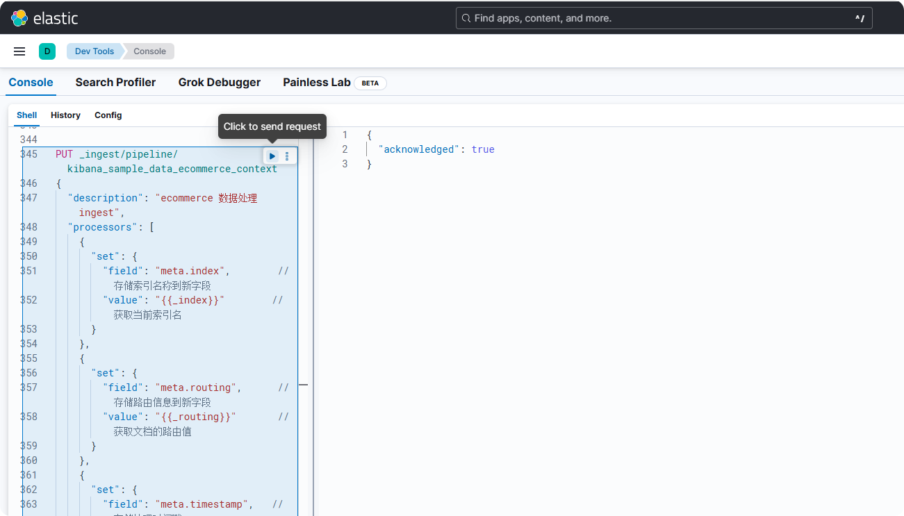

通过模拟器来测试：

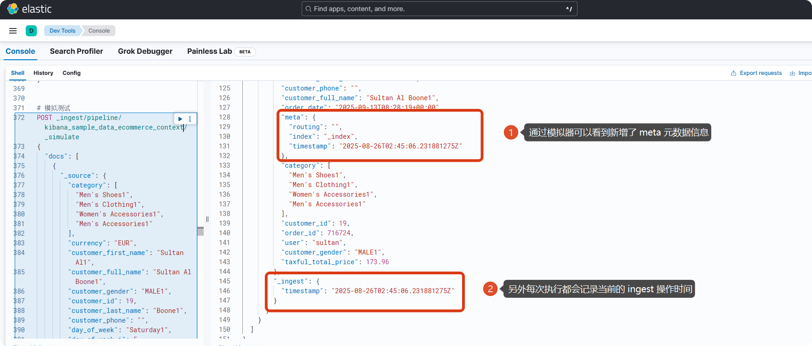

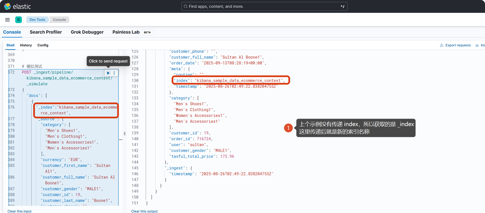

### **3.2.7.2 Source 数据源访问**

1.  访问字段名称​：获取文档中的字段名
2.  ​访问字段数据​：读取文档中字段的具体值
3.  ​运用 {{source}} 语法​：使用模板表达式动态引用源数据

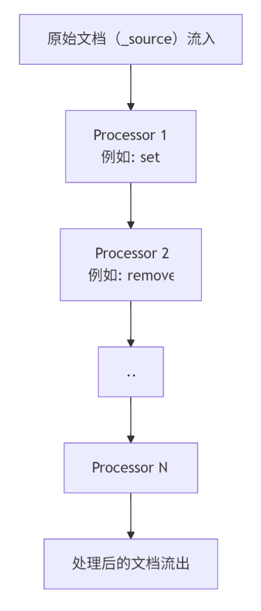

PUT \_ingest/pipeline/kibana\_sample\_data\_ecommerce\_source

{

"description": "ecommerce 数据处理 source ingest",

"processors": \[

{

"set": {

"field": "geoip\_point.lon",

"value": "{{\_source.geoip.location.lon}}"

}

},

{

"set": {

"field": "geoip\_point.lon",

"value": "{{\_source.geoip.location.lat}}"

}

}

\]

}

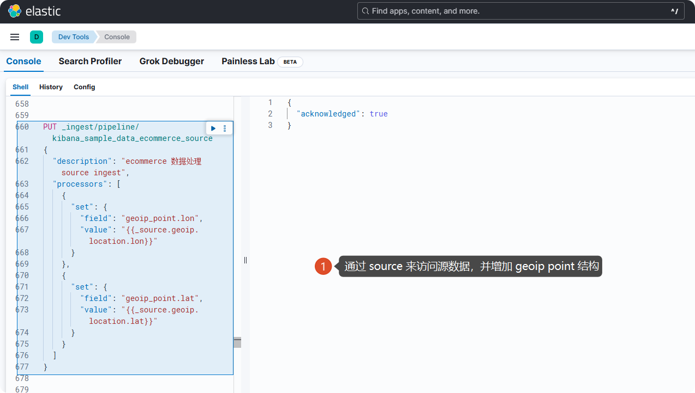

通过模拟器来测试：

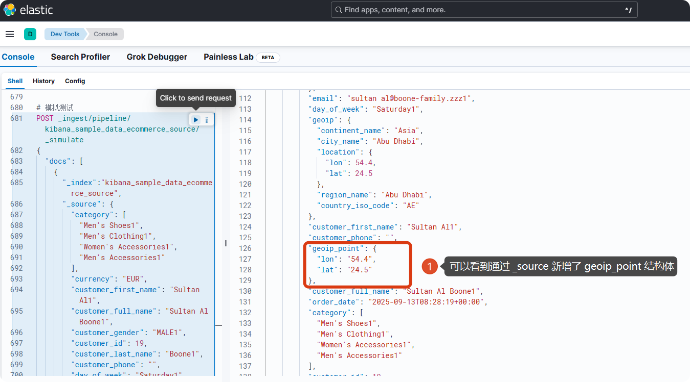

## **04 ES 索引数据加工之 Ingest 高级应用实战**

接下来我们来看下 Ingest 的高级应用实战。

## **4.1 IF 逻辑判断**

这种算比较简洁的实现脚本的处理逻辑，其实前面已经实操过：

PUT \_ingest/pipeline/kibana\_sample\_data\_ecommerce

{

"description": "ecommerce 数据加工 ingest",

"processors": \[

{

// 增加一个字段

"set": {

"field": "tag",

"value": "EUR\_order"

},

// 删除一个字段

"remove": {

"field": "email",

"ignore\_missing": true, // 修复1：忽略缺失字段

"if": "ctx.email != null" // 修复2：条件执行

}

}

\]

}

从上图得出，当 email 值不为空时才删除这个字段。

## **4.2 OnFailure 执行失败拦截**

PUT \_ingest/pipeline/kibana\_sample\_data\_ecommerce

{

"description": "ecommerce 数据加工 ingest",

"processors": \[

{

// 增加一个字段

"set": {

"field": "tag",

"value": "EUR\_order"

},

// 删除一个字段

"remove": {

"field": "email2",

"ignore\_failure": false, // 不忽略失败，执行 on\_failure

"on\_failure": \[{

"remove": {

"field": "email"

}

}\]

}

}

\]

}

执行 remove 处理器​：

1.  ​主要操作​：尝试删除字段 email2。
2.  ​错误处理​：由于 ignore\_failure 设置为 false，如果 email2 字段不存在，操作会失败。失败后，会触发 on\_failure 块。
3.  ​回退操作​：在 on\_failure 块中，另一个 remove 处理器会尝试删除字段 email。这意味着如果 email2 不存在，则删除 email 作为备选方案。

错误处理与容错机制​

1.  ​on\_failure 块：这是管道设计的强大功能。当处理器失败时（如字段不存在），可以执行备用操作。在当前管道中，如果删除 email2 失败，则尝试删除 email。
2.  ​ignore\_failure 参数​：设置为 false 时，失败会触发 on\_failure；如果设置为 true，则忽略失败并继续执行后续处理器。这提供了灵活的故障恢复策略。

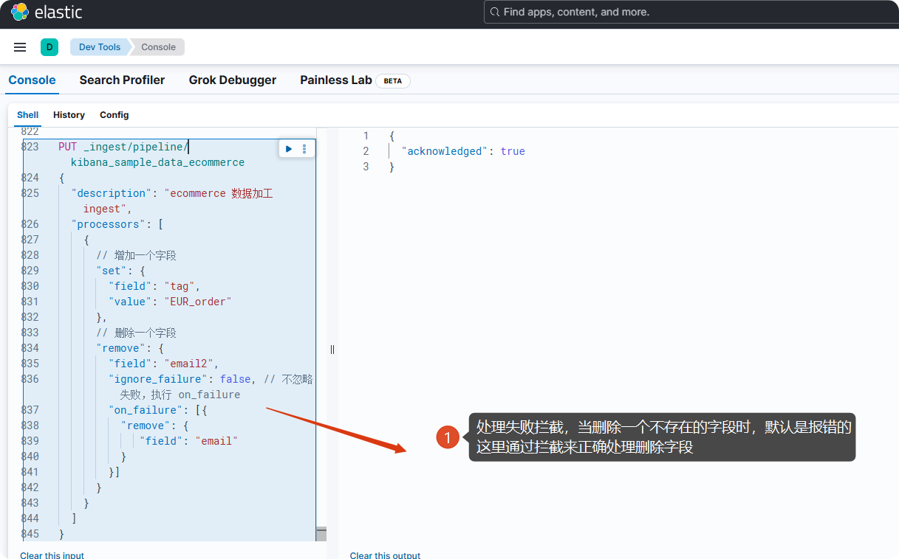

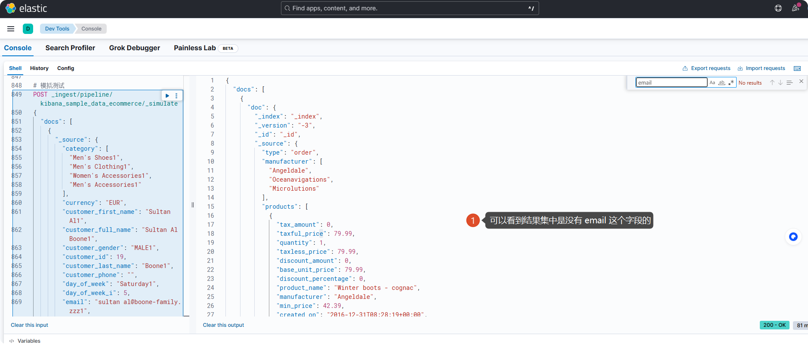

## **4.3 Pipeline 多管道与 Script 脚本执行**

复用已经创建好的 ingest pipeline，按照顺序进行编排和数据处理加工，它通过模块化和编排的设计，将简单的处理器组合成强大、灵活且易于维护的数据处理流水线，非常适合处理像骑行轨迹数据这类包含多个复杂转换步骤的场景。

这里我们还是以 kibana\_sample\_data\_ecommerce 为例，模拟一个电商数据处理场景，通过父管道协调调用两个子管道，分别处理不同的业务逻辑。

我们将创建三个管道，其结构和数据流如下所示：

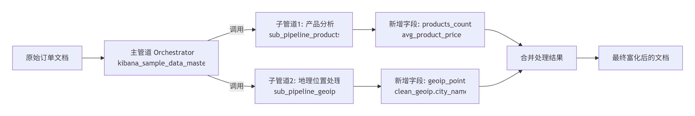

### **4.3.1 创建子管道：处理商品信息**

sub\_pipeline\_products：这个管道专注于分析订单中的产品列表。

PUT \_ingest/pipeline/sub\_pipeline\_ecommerce\_products

{

"description": "子管道：处理产品信息，计算订单商品总数和平均价格",

"processors": \[

{

"set": {

"field": "products\_count",

"value": "{{products.size}}"

}

},

{

"script": {

"source": """

// 计算所有产品的平均价格

double total = 0;

for (product in ctx.products) {

total += product.price;

}

ctx.avg\_product\_price = total / ctx.products.size();

"""

}

}

\]

}

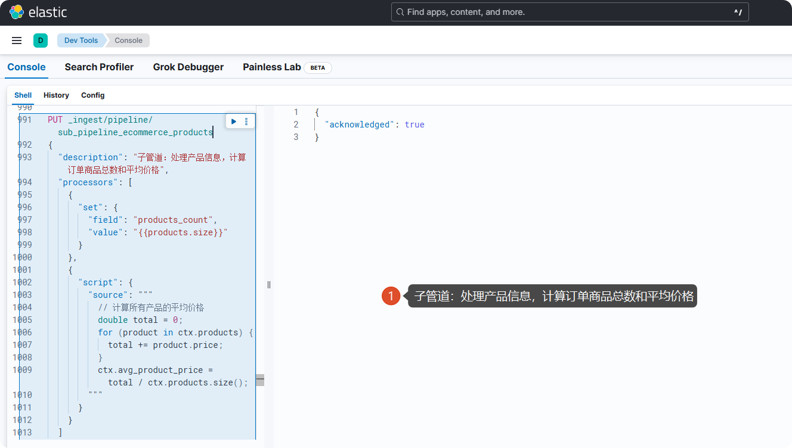

### **4.3.2 创建子管道：处理地理位置信息**

sub\_pipeline\_geoip：这个管道专注于清洗和富化地理位置信息。

PUT \_ingest/pipeline/sub\_pipeline\_ecommerce\_geoip

{

"description": "子管道：处理地理位置信息，创建geo\_point和清洗城市名",

"processors": \[

{

"set": {

"field": "geoip\_point",

"value": "{{geoip.location.lat}},{{geoip.location.lon}}"

}

},

{

"set": {

"field": "clean\_geoip.city\_name",

"value": "{{geoip.city\_name}}",

"if": "ctx.geoip?.city\_name != null"

}

},

{

"remove": {

"field": "geoip",

"ignore\_missing": true

}

}

\]

}

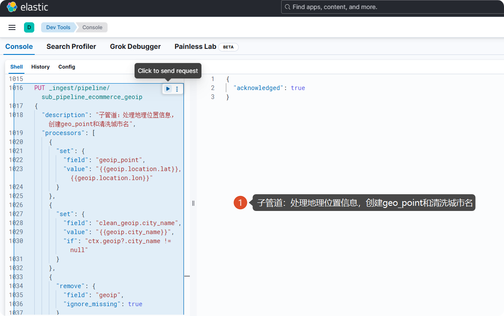

### **4.3.3 创建主管道：协调执行**

kibana\_sample\_data\_master：这是核心的编排管道​，它不处理具体逻辑，只负责按顺序调用子管道。

PUT \_ingest/pipeline/kibana\_sample\_data\_master

{

"description": "主管道：编排执行产品处理和地理位置处理",

"processors": \[

{

"pipeline": {

"name": "sub\_pipeline\_ecommerce\_products"

}

},

{

"pipeline": {

"name": "sub\_pipeline\_ecommerce\_geoip"

}

}

\]

}

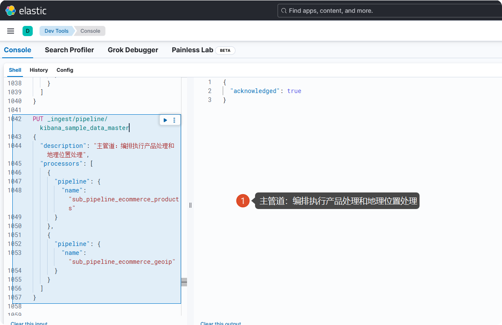

### **4.3.4 执行测试**

可以通过以下命令测试这个多管道系统：

\# 1. 使用\_simulate API模拟测试

POST \_ingest/pipeline/kibana\_sample\_data\_master/\_simulate

{

"docs": \[

{

"\_source": {

"category": \[

"Men's Shoes1",

"Men's Clothing1",

"Women's Accessories1",

"Men's Accessories1"

\],

"currency": "EUR",

"customer\_first\_name": "Sultan Al1",

"customer\_full\_name": "Sultan Al Boone1",

"customer\_gender": "MALE1",

"customer\_id": 19,

"customer\_last\_name": "Boone1",

"customer\_phone": "",

"day\_of\_week": "Saturday1",

"day\_of\_week\_i": 5,

"email": "sultan al@boone-family.zzz1",

"manufacturer": \[

"Angeldale",

"Oceanavigations",

"Microlutions"

\],

"order\_date": "2025-09-13T08:28:19+00:00",

"order\_id": 716724,

"products": \[

{

"base\_price": 79.99,

"discount\_percentage": 0,

"quantity": 1,

"manufacturer": "Angeldale",

"tax\_amount": 0,

"product\_id": 23975,

"category": "Men's Shoes",

"sku": "ZO0687606876",

"taxless\_price": 79.99,

"unit\_discount\_amount": 0,

"min\_price": 42.39,

"\_id": "sold\_product\_716724\_23975",

"discount\_amount": 0,

"created\_on": "2016-12-31T08:28:19+00:00",

"product\_name": "Winter boots - cognac",

"price": 79.99,

"taxful\_price": 79.99,

"base\_unit\_price": 79.99

},

{

"base\_price": 59.99,

"discount\_percentage": 0,

"quantity": 1,

"manufacturer": "Oceanavigations",

"tax\_amount": 0,

"product\_id": 6338,

"category": "Men's Clothing",

"sku": "ZO0290502905",

"taxless\_price": 59.99,

"unit\_discount\_amount": 0,

"min\_price": 32.99,

"\_id": "sold\_product\_716724\_6338",

"discount\_amount": 0,

"created\_on": "2016-12-31T08:28:19+00:00",

"product\_name": "Trenchcoat - black",

"price": 59.99,

"taxful\_price": 59.99,

"base\_unit\_price": 59.99

},

{

"base\_price": 21.99,

"discount\_percentage": 0,

"quantity": 1,

"manufacturer": "Microlutions",

"tax\_amount": 0,

"product\_id": 14116,

"category": "Women's Accessories",

"sku": "ZO0126701267",

"taxless\_price": 21.99,

"unit\_discount\_amount": 0,

"min\_price": 10.34,

"\_id": "sold\_product\_716724\_14116",

"discount\_amount": 0,

"created\_on": "2016-12-31T08:28:19+00:00",

"product\_name": "Watch - black",

"price": 21.99,

"taxful\_price": 21.99,

"base\_unit\_price": 21.99

},

{

"base\_price": 11.99,

"discount\_percentage": 0,

"quantity": 1,

"manufacturer": "Oceanavigations",

"tax\_amount": 0,

"product\_id": 15290,

"category": "Men's Accessories",

"sku": "ZO0308503085",

"taxless\_price": 11.99,

"unit\_discount\_amount": 0,

"min\_price": 6.11,

"\_id": "sold\_product\_716724\_15290",

"discount\_amount": 0,

"created\_on": "2016-12-31T08:28:19+00:00",

"product\_name": "Hat - light grey multicolor",

"price": 11.99,

"taxful\_price": 11.99,

"base\_unit\_price": 11.99

}

\],

"sku": \[

"ZO0687606876",

"ZO0290502905",

"ZO0126701267",

"ZO0308503085"

\],

"taxful\_total\_price": 173.96,

"taxless\_total\_price": 173.96,

"total\_quantity": 4,

"total\_unique\_products": 4,

"type": "order",

"user": "sultan",

"geoip": {

"country\_iso\_code": "AE",

"location": {

"lon": 54.4,

"lat": 24.5

},

"region\_name": "Abu Dhabi",

"continent\_name": "Asia",

"city\_name": "Abu Dhabi"

},

"event": {

"dataset": "sample\_ecommerce"

}

}

}

\]

}

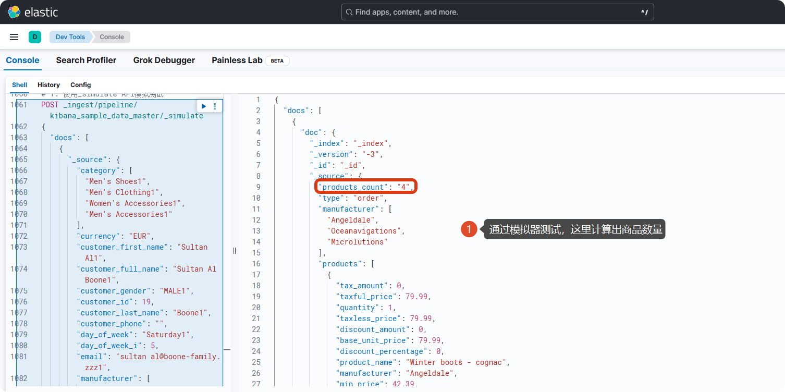

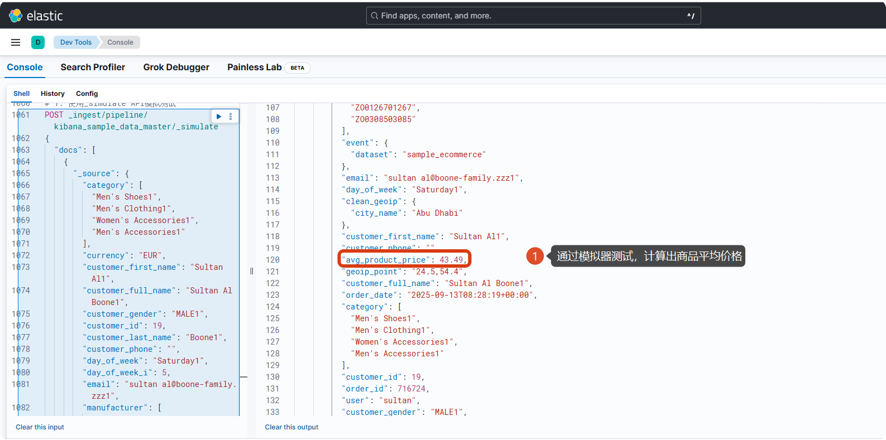

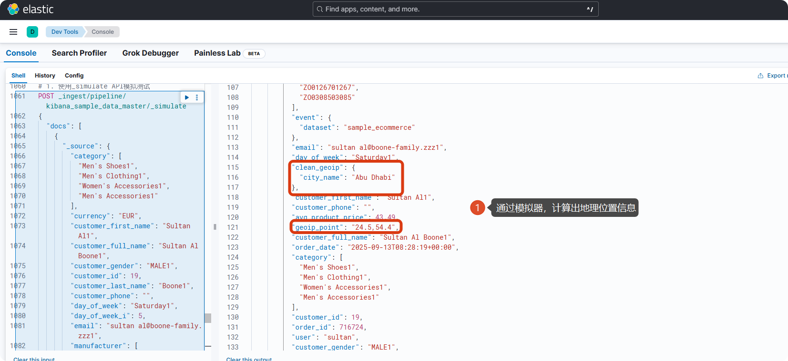

## **4.4 Ingest 索引默认配置**

在索引创建时设置默认的 pipeline。

PUT kibana\_sample\_data\_ecommerce\_with\_default\_pipeline

{

"settings": {

"default\_pipeline": "sub\_pipeline\_ecommerce\_products", // 指定默认管道

"final\_pipeline": "sub\_pipeline\_ecommerce\_geoip" // 按需设置

},

"mappings": {

"dynamic": true // 允许动态字段

}

}

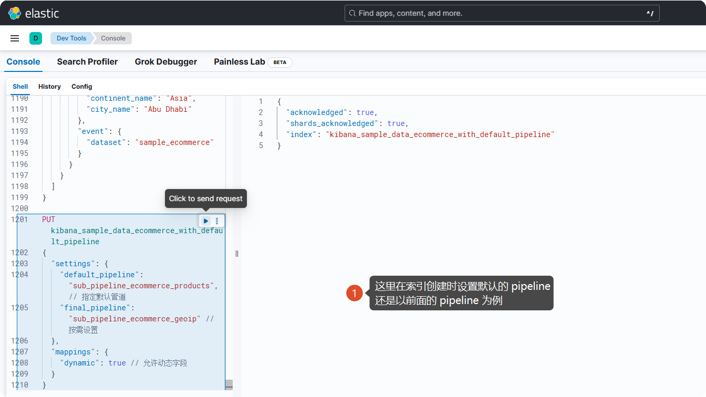

写入数据：

POST kibana\_sample\_data\_ecommerce\_with\_default\_pipeline/\_doc

{

"category": \[

"Women's Clothing"

\],

"currency": "EUR",

"customer\_first\_name": "Mary",

"customer\_full\_name": "Mary Bailey",

"customer\_gender": "FEMALE",

"customer\_id": 20,

"customer\_last\_name": "Bailey",

"customer\_phone": "",

"day\_of\_week": "Sunday",

"day\_of\_week\_i": 6,

"email": "mary@bailey-family.zzz",

"manufacturer": \[

"Champion Arts",

"Pyramidustries"

\],

"order\_date": "2025-09-07T21:59:02+00:00",

"order\_id": 584021,

"products": \[

{

"base\_price": 24.99,

"discount\_percentage": 0,

"quantity": 1,

"manufacturer": "Champion Arts",

"tax\_amount": 0,

"product\_id": 11238,

"category": "Women's Clothing",

"sku": "ZO0489604896",

"taxless\_price": 24.99,

"unit\_discount\_amount": 0,

"min\_price": 11.75,

"\_id": "sold\_product\_584021\_11238",

"discount\_amount": 0,

"created\_on": "2016-12-25T21:59:02+00:00",

"product\_name": "Denim dress - black denim",

"price": 24.99,

"taxful\_price": 24.99,

"base\_unit\_price": 24.99

},

{

"base\_price": 28.99,

"discount\_percentage": 0,

"quantity": 1,

"manufacturer": "Pyramidustries",

"tax\_amount": 0,

"product\_id": 20149,

"category": "Women's Clothing",

"sku": "ZO0185501855",

"taxless\_price": 28.99,

"unit\_discount\_amount": 0,

"min\_price": 15.65,

"\_id": "sold\_product\_584021\_20149",

"discount\_amount": 0,

"created\_on": "2016-12-25T21:59:02+00:00",

"product\_name": "Shorts - black",

"price": 28.99,

"taxful\_price": 28.99,

"base\_unit\_price": 28.99

}

\],

"sku": \[

"ZO0489604896",

"ZO0185501855"

\],

"taxful\_total\_price": 53.98,

"taxless\_total\_price": 53.98,

"total\_quantity": 2,

"total\_unique\_products": 2,

"type": "order",

"user": "mary",

"geoip": {

"country\_iso\_code": "AE",

"location": {

"lon": 55.3,

"lat": 25.3

},

"region\_name": "Dubai",

"continent\_name": "Asia",

"city\_name": "Dubai"

},

"event": {

"dataset": "sample\_ecommerce"

}

}

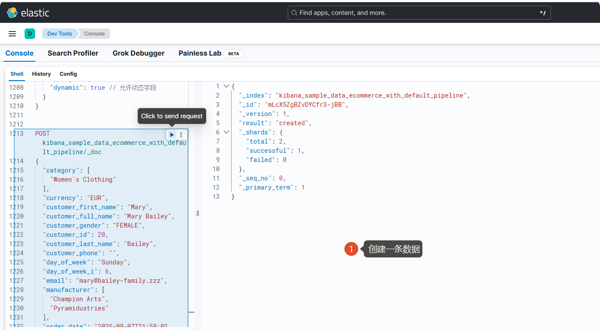

查看数据：

GET kibana\_sample\_data\_ecommerce\_with\_default\_pipeline/\_search

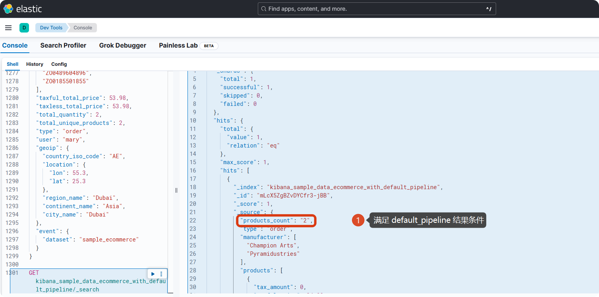

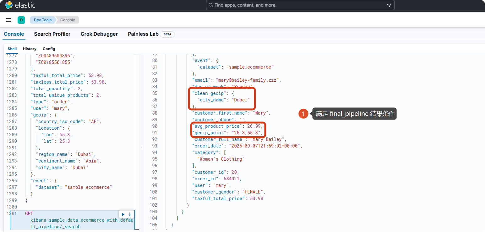

## **4.5 Ingest 数据处理专用节点配置**

默认，所有的 ES 节点都具备 ingest 能力，需要人为去关闭并设置专职节点。也就是指导用户如何从默认所有节点都具备 Ingest 能力的集群中，配置出专用的 Ingest 数据处理节点。

### **4.5.1 专业 Ingest 节点的 ES 配置**

在一个名为 ingest-node-1 的节点上，其配置文件 elasticsearch.yml 应只包含 ingest 角色：

\# ingest-node-1 的 elasticsearch.yml 配置

\# - 角色设置为专用的 ingest 节点

node.roles: \[ ingest \]

\# - 通用配置

cluster.name: my-production-cluster

node.name: ingest-node-1

network.host: 192.168.1.20

discovery.seed\_hosts: \["master-node-1:9300"\]

cluster.initial\_master\_nodes: \["master-node-1"\]

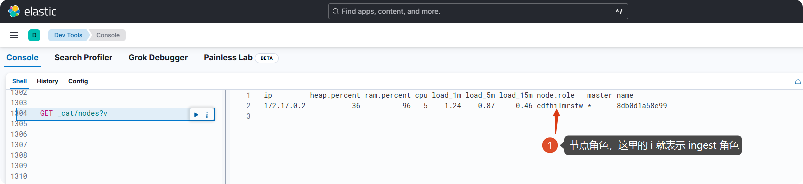

### **4.5.2 其他节点的 ES 配置（关闭 Ingest 能力）**

在这些节点的角色列表 node.roles 中，​不包含​ ingest 角色，即关闭了其默认的 Ingest 能力。

\# master-node-1 的配置 (主节点 + 数据节点)

node.roles: \[ master, data \] \# 注意：这里没有 'ingest'

\# data-node-1 的配置 (纯数据节点)

node.roles: \[ data \] \# 注意：这里没有 'ingest'

专用 Ingest 节点架构配置图​：

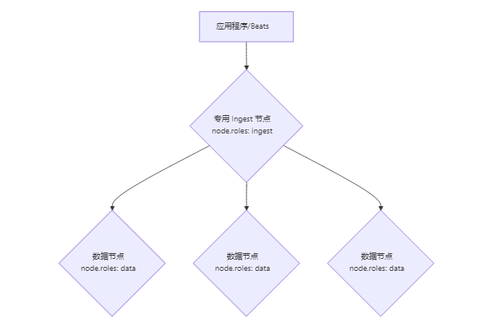

这种架构的优势在于：​​

1.  ​资源隔离与性能​：
2.  ​专用 Ingst 节点​：专注于执行 Pipelines 中的处理器（如 grok、script、geoip），消耗 CPU 和内存。这可以防止繁重的数据处理操作影响数据节点的写入和查询性能。
3.  ​数据节点​：专注于数据的索引、搜索和存储，资源不会被数据处理任务抢占。
4.  ​弹性扩展​：
5.  当数据处理成为瓶颈时，您可以轻松地添加更多的 ingest 节点来水平扩展数据处理能力，而无需增加昂贵的数据节点。
6.  ​高可用性​：
7.  可以配置多个专用 Ingest 节点。客户端（如 Logstash、Filebeat）或应用程序可以将请求负载均衡到多个 Ingest 节点上，避免单点故障。

### **4.5.3 总结**

这里概括下 Elasticsearch 节点角色的配置哲学：「**默认全能，按需专用**」**​**。

1.  ​开发/测试环境​：使用默认配置（所有节点角色齐全）最简单。
2.  ​生产环境​：采用上述示例配置，​设置专职的 Ingest 节点，是提升集群稳定性、性能和扩展性的最佳实践。