从今天之后的一段时间内，华仔会带着大家一起来从零开始对 ElasticStack 矩阵产品进行深入剖析和项目运维实战，希望大家学完之后可以用到自己的工作中。

这是第四篇，本篇我将带着大家进行「**ES 索引文档 Document 写入、查询、更新、删除、批量操作深度实战**」。

文章汇总位置：[https://wx.zsxq.com/dweb2/index/columns/51122554151214](https://wx.zsxq.com/dweb2/index/columns/51122554151214)

## **01 前言**

在上篇中 [【ES 入门实战第三篇】ES 索引创建规范及索引数据模型设计避坑指南](https://articles.zsxq.com/id_nvp4z5fnvc62.html)，带着大家进行实战「**ES 索引创建规范及索引数据模型设计避坑指南**」。

今天我们来进行「**ES 索引文档 Document 写入、查询、更新、删除、批量操作深度实战**」。

##   
**02 ES 索引文档深度实战**

## **2.1 ES 索引文档深度实战**

关于 ES 索引文档 document 的接口有如下：

1.  新建文档：提供了索引文档（Index doc）和创建文档（create doc）两种方式。
2.  通过文档 ID 获取文档，通过 Get API 来获取文档内容。
3.  批量获取文档，使用 MGET API 来批量获取文档。
4.  更新文档，使用 Update API 来更新文档。
5.  删除文档，使用 Delete API 来删除文档。
6.  批量操作文档，使用 Bulk API 来批量操作文档。

接下来重点实战这些接口操作，今天我们就以「**小红书商品**」为例子来介绍上面的 API 吧。

### **2.1.1 创建索引**

现阶段「**小红书商品**」的模型只需要记录商品的一些基础信息即可，所以我们可以定义如下 Mapping，并且创建索引：

PUT /huazai\_ecshop\_sku\_index

{

"settings":{

"number\_of\_shards" : 3,

"number\_of\_replicas":1

},

"mappings":{

"properties":{

"skuId": {

"type" :"integer"

},

"skuName" : {

"type" : "text"

},

"category":{

"type" :"keyword"

},

"brand":{

"type" :"keyword"

},

"price":{

"type":"integer"

},

"vipPrice":{

"type":"integer"

},

"mainUrl" :{

"type":"keyword",

"index": false

},

"skuStatus" : {

"type":"integer"

},

"createTime":{

"type": "date",

"format": "yyyy-MM-dd HH:mm:ss"

},

"updateTime":{

"type": "date",

"format": "yyyy-MM-dd HH:mm:ss"

}

}

}

}

可以看到商品 sku 索引大概有 10 个字段，这里会去除一些跟搜索无关的字段。

1.  settings：这里需要设置跟「**分片**」、「**副本**」相关的配置。我这里设置为 3 个分片、每个分片 1 个副本。
2.  mappings：这里对应数据库中 sku 商品表的字段。

索引创建：

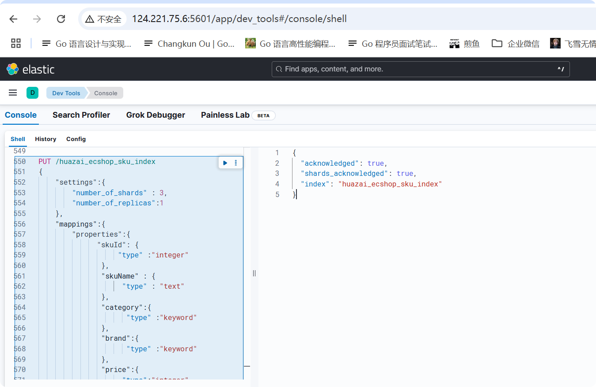

查看已创建的索引：

  
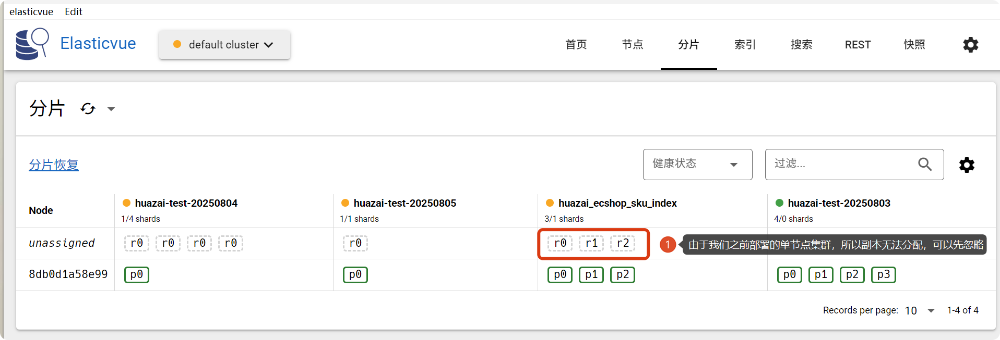

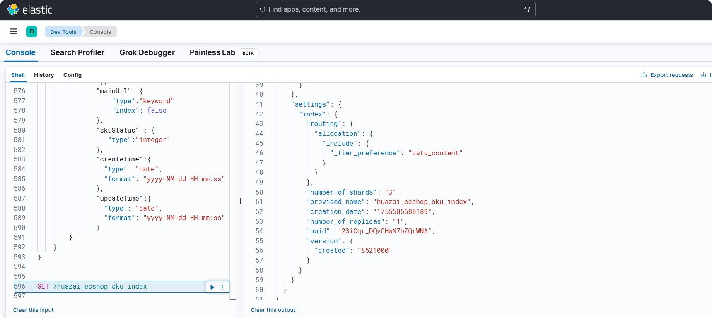

如果你之前创建过 sku 索引的话，这里再次创建会报错，所以你需要先将之前的索引删除，然后再重新创建。在 Kibana 执行以下示例可以删除索引：

  
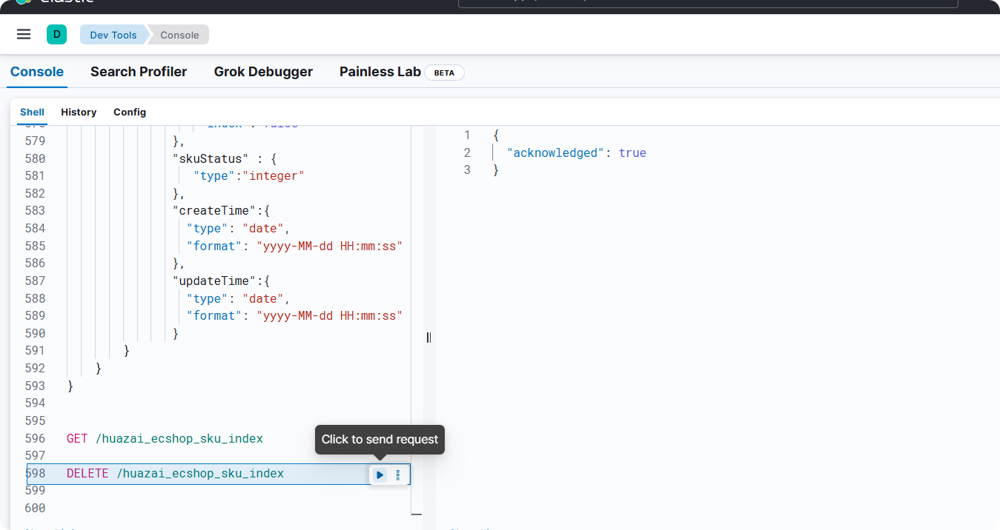

如上所示，acknowledged 为 true，则删除成功，如果返回的 http 状态码为 404，则说明这个索引本身不存在。

ok，在准备好索引后，我们开始学习文档基本操作的 API。

### **2.1.2 新建文档**

这天商家进了一批商品准备售卖，后台管理员需要把这些商品录入到 ES 中，ES 提供了两种创建文档的方式：

1.  使用 Index API 索引文档。
2.  使用 Create API 创建文档。

### **2.1.2.1 使用 Index API 索引文档**

\# 使用 Index API 索引文档

PUT /huazai\_ecshop\_sku\_index/\_doc/1

{

"skuId": 40019,

"skuName": "男童加厚羽绒服 儿童中长款90白鸭绒外套韩版冬装童装小虎宝儿",

"category": "童装会场",

"brand": "羽绒服",

"price": 719,

"vipPrice": 624,

"mainUrl": "http://img12.360buyimg.com/n1/s450x450\_jfs/t1/198920/1/50667/47720/6736c429Fc2f747c8/4cadbe7a136fdb39.jpg.avif",

"skuStatus": 1,

"createTime": "2025-08-18 12:42:42",

"updateTime": "2025-08-18 12:42:42"

}

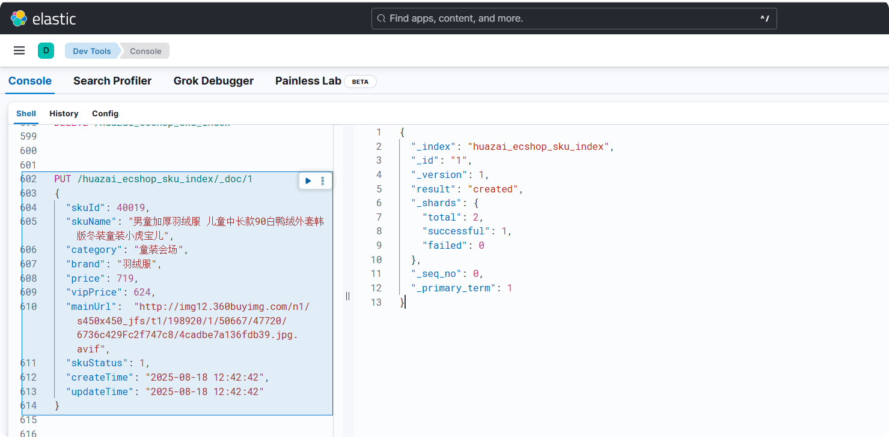

如上示例，可以看到索引一个文档是比较简单的，将 Mapping 中对应的字段做成 Json Object 对应的 Key 即可，并且上面的例子中我们指定文档 ID 为 1，如果不指定 ES 会自动创建文档 ID。

> 需要说明的是，从 ES 7.0 版本后 type 统一为 \_doc。

如果索引的文档已经存在，会发生什么情况？

1.  可以在不改变文档 ID 的情况下多次执行上面的索引文档的语句，可以发现系统并不会报错，而是将返回结果中 "\_version" 字段的值自加。
2.  其实在索引一个文档的时候，如果文档 ID 已经存在，会先删除旧文档，然后再写入新文档的内容，并且增加文档版本号。

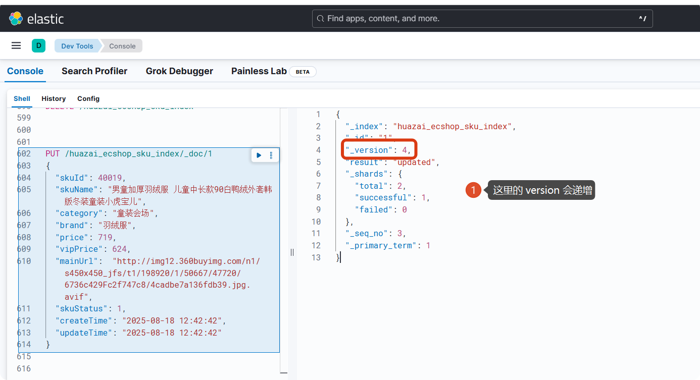

### **2.1.2.2 使用 Create API 索引文档**

而使用 Create API 创建文档有两种写法：PUT 和 POST 方式，我们分别来看下：

\# 使用 PUT 的方式创建文档

PUT huazai\_ecshop\_sku\_index/\_create/2

{

"skuId": 40092,

"skuName": "唐狮冬装外套女连帽羽绒服女宽松中长款羽绒服女学生韩版羽绒服女",

"category": "女装商场同款",

"brand": "羽绒服",

"price": 829,

"vipPrice": 741,

"mainUrl": "http://img12.360buyimg.com/n1/s450x450\_jfs/t1/198920/1/50667/47720/6736c429Fc2f747c8/4cadbe7a136fdb39.jpg.avif",

"skuStatus": 1,

"createTime": "2025-08-18 12:42:42",

"updateTime": "2025-08-18 12:42:42"

}

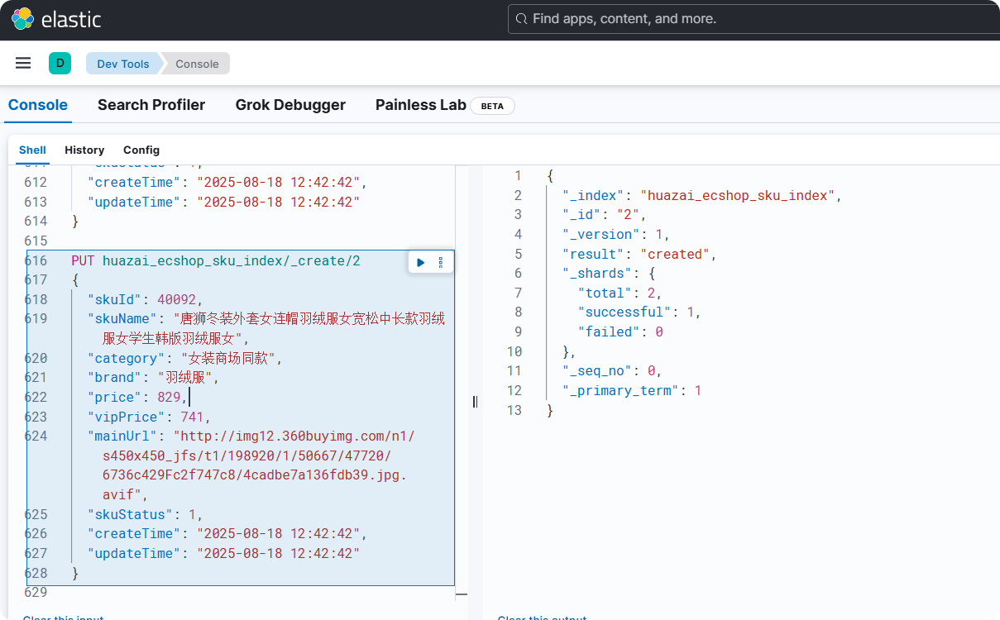

\# 使用 POST 的方式，不需要指定文档 ID， 系统自动生成

POST huazai\_ecshop\_sku\_index/\_doc

{

"skuId": 40092,

"skuName": "唐狮冬装外套女连帽羽绒服女宽松中长款羽绒服女学生韩版羽绒服女",

"category": "女装商场同款",

"brand": "羽绒服",

"price": 829,

"vipPrice": 741,

"mainUrl": "http://img12.360buyimg.com/n1/s450x450\_jfs/t1/198920/1/50667/47720/6736c429Fc2f747c8/4cadbe7a136fdb39.jpg.avif",

"skuStatus": 1,

"createTime": "2025-08-18 12:42:42",

"updateTime": "2025-08-18 12:42:42"

}

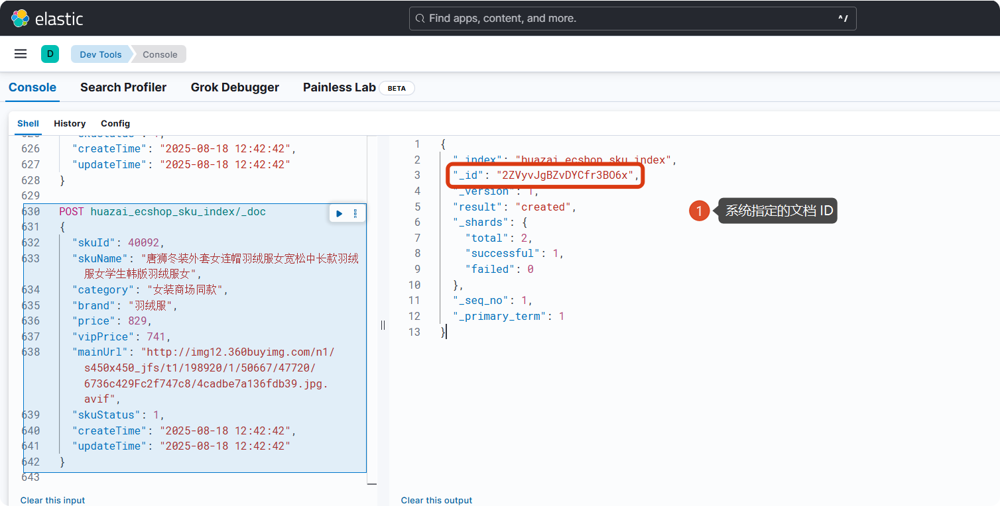

如上示例：

1.  使用 PUT 的方式创建文档需要指定文档的 ID，如果文档 ID 已经存在，则返回 http 状态码为 409 的错误。
2.  使用 POST 的方式创建文档时候，则不需要指定文档 ID，系统会自动创建，在返回结果中可以看到，新创建的文档的 ID 为 '2ZVyvJgBZvDYCfr3BO6x'。

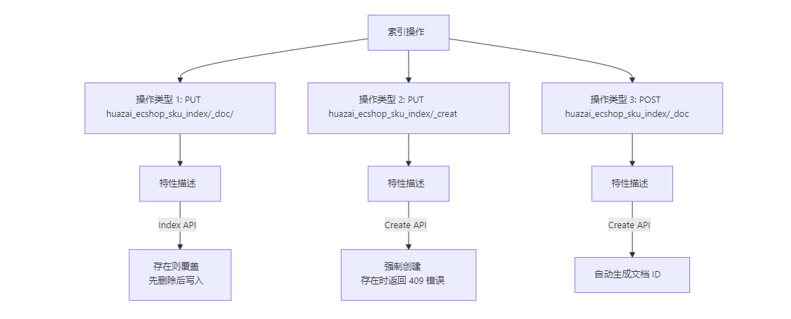

新建文档三种写法总结：

1.  当你有更新文档内容的需求，推荐使用第一种方式。
2.  当写入文档时有唯一性校验需求的话，推荐使用第二种方式。
3.  当需要系统为你创建文档 ID，推荐使用第三种方式。

相比第一种来说，第三种写入效率会更高，只需创建即可，而不需要检查是否存在，进行后续的删除工作。

### **2.1.3 获取文档**

当用户需要通过商品 ID 获取商品信息的时候，可以使用 ES 提供的 GET API 来获取文档内容。

  
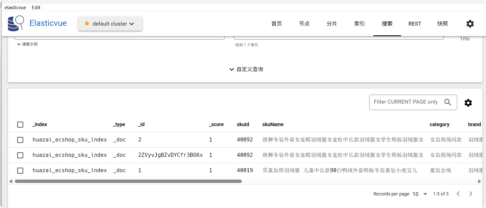

这里获取文档有两种方式：

1.  只获取一个文档内容。
2.  同时获取多个文档的内容。

### **2.1.3.1 使用 GET API 获取单个文档**

通过商品 ID 获取商品信息时可以使用 GET API 来实现，如下：

\# 使用 GET API 获取单个文档的内容

GET huazai\_ecshop\_sku\_index/\_doc/1

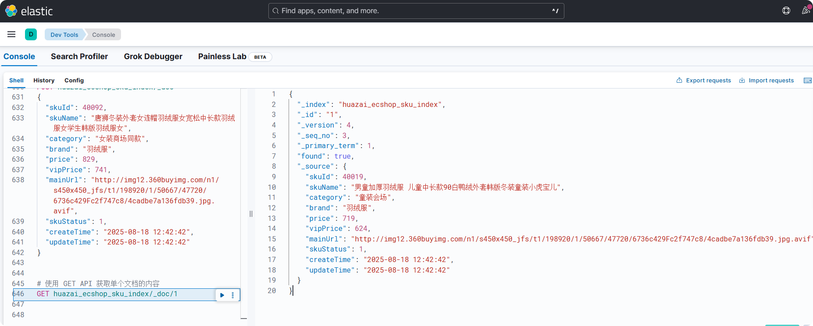

GET API 是非常简单的，使用时只需要指定文档 ID 即可。文档的原生内容保存在 "\_source" 字段中，其他字段是这个文档的元数据。

如果成功，返回的是 http 状态码为 200，如果文档不存在则 http 状态码为 404，并且 found 字段为 false。

GET API 提供了多个参数，更多的信息可以参考[官方文档](https://www.elastic.co/guide/en/elasticsearch/reference/8.17/docs-get.html)，下面是几个比较常用的：

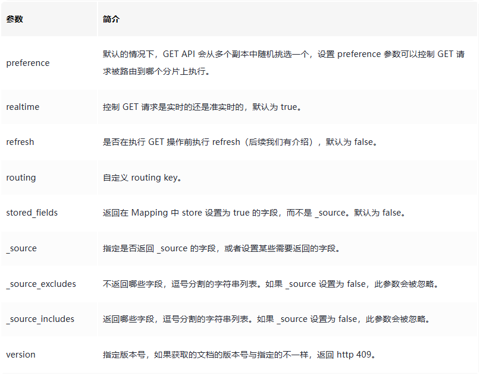

### **2.1.3.2 使用 MGET API 获取多个文档**

当我们需要通过多个文档 ID 同时获取它们的信息时，如果使用 GET API 的话，需要发起多个请求，这样做效率比较低下。

此时你可以使用 ES 提供的 MGET API 来解决这个需求，MGET API 的请求格式有 3 种，如下：

\# 1、在 body 中指定 index

GET /\_mget

{

"docs": \[

{ "\_index": "huazai\_ecshop\_sku\_index", "\_id": "1" },

{ "\_index": "huazai\_ecshop\_sku\_index", "\_id": "2" }

\]

}

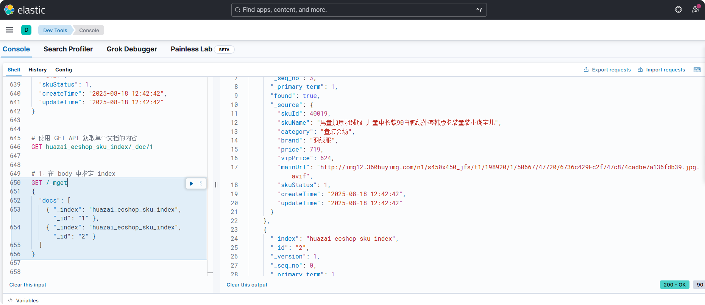

\# 2、直接指定 index

GET /huazai\_ecshop\_sku\_index/\_mget

{

"docs": \[

{

"\_id": "1"

},

{

"\_id": "2"

}

\]

}

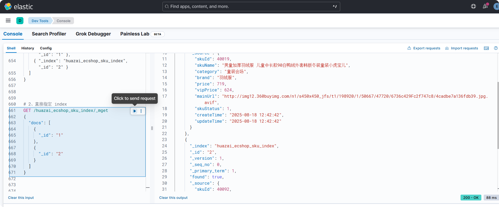

\# 3、简写方式

GET /huazai\_ecshop\_sku\_index/\_mget

{

"ids" : \["1", "2"\]

}

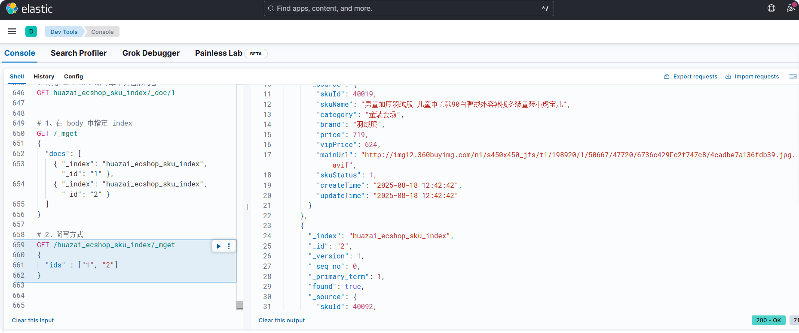

1.  如果在 body 中指定 index，可以获取多个索引中的文档数据，比较灵活。
2.  使用直接指定 index 的方式只能获取指定索引中的文档。

更多的 MGET API 使用例子可以参考[官方文档](https://www.elastic.co/guide/en/elasticsearch/reference/8.17/docs-multi-get.html)。同样如果对应的文档找不到，found 字段为 false。

###   
**2.1.4 更新文档**

有时候发现一些商品的信息有误，需要进行修改，ES 提供了 Update API 来更新文档信息，我们可以通过这个接口来更新书本的信息。

更新一个文档，需要指定文档的 ID 和需要更新的字段与其对应的值。如下：

\# 更新文档

POST huazai\_ecshop\_sku\_index/\_update/1

{

"doc": {

"skuName":"2025 款男童加厚羽绒服 儿童中长款90白鸭绒外套韩版冬装童装小虎宝儿",

"price": "709",

"vipPrice": "609"

}

}

更新前内容：

  
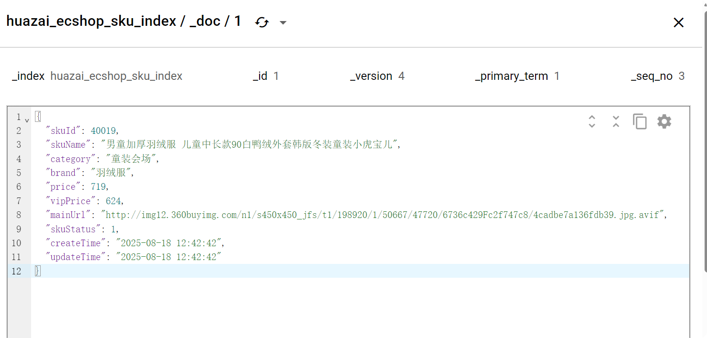

更新后内容：

  
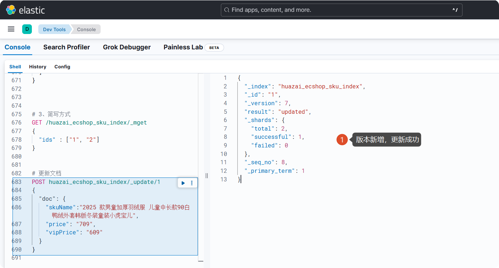

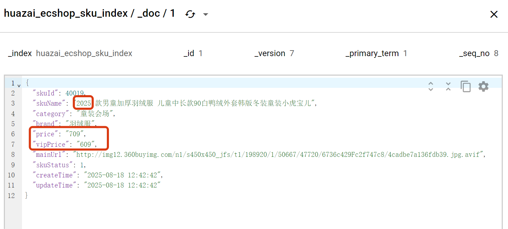

这个示例更新了文档 1 的 skuName、price、vipPrice 三个字段。如返回结果所示，版本号会增加，"result" 字段为 updated。

上面提到过，索引文档的方式也有更新数据的效果，那它跟文档更新接口有啥区别呢？

其实索引文档的更新效果是先删除数据，然后再写入新数据。「**索引文档方式会覆盖整个旧数据**」，使其无法实现只更新某些字段的需求**。**

除了使用指定 ID 的方式来更新数据外，还可以用 [update\_by\_query](http://update_by_query%20/) 的方式：

POST huazai\_ecshop\_sku\_index/\_update\_by\_query

{

"query": {

"term": {

"skuId": {

"value": 40019

}

}

},

"script": {

"source": "ctx.\_source.skuName='2025 款男童加厚羽绒服 儿童中长款90白鸭绒外套韩版冬装童装小虎宝儿1'",

"lang": "painless"

}

}

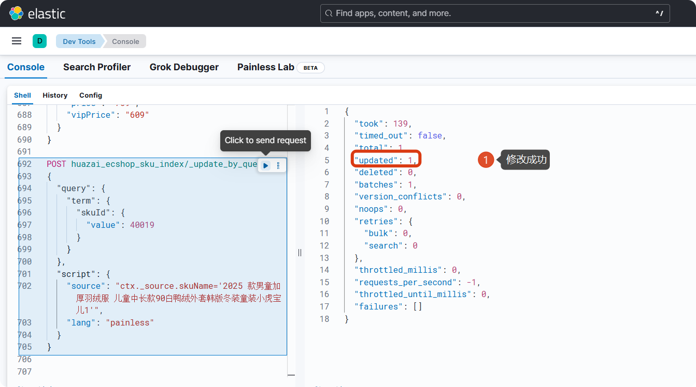

该示例将 skuId 为 40019 的文档的 skuName 字段进行了更新，可以使用 DSL 中 script 字段来指定一段脚本。脚本中 'ctx.\_source' 可以拿到匹配的文档的数据，所以 ctx.\_source.skuName='2025 款男童加厚羽绒服 儿童中长款90白鸭绒外套韩版冬装童装小虎宝儿1' 的意思是将匹配文档的 'skuName' 字段的数据设置为 '2025 款男童加厚羽绒服 儿童中长款90白鸭绒外套韩版冬装童装小虎宝儿1'。

> 需要注意的是，如果 query 中匹配的文档数量巨大，那么这个接口在 kibana 中执行的时候可能会发生超时的错误，当然你可以在请求中使用 timeout 参数，但是这个不是解决问题的有效方案。

此时建议你使用「**异步方式**」进行处理，并且控制需要更新的数据量，如下：

POST huazai\_ecshop\_sku\_index/\_update\_by\_query?wait\_for\_completion=false

{

"query": {

"term": {

"skuId": {

"value": 40019

}

}

},

"script": {

"source": "ctx.\_source.skuName='2025 款男童加厚羽绒服 儿童中长款90白鸭绒外套韩版冬装童装小虎宝儿2'",

"lang": "painless"

}

}

\# 结果

{

"task": "nUSQHj-mRbytSTCci8xMwA:46249330"

}

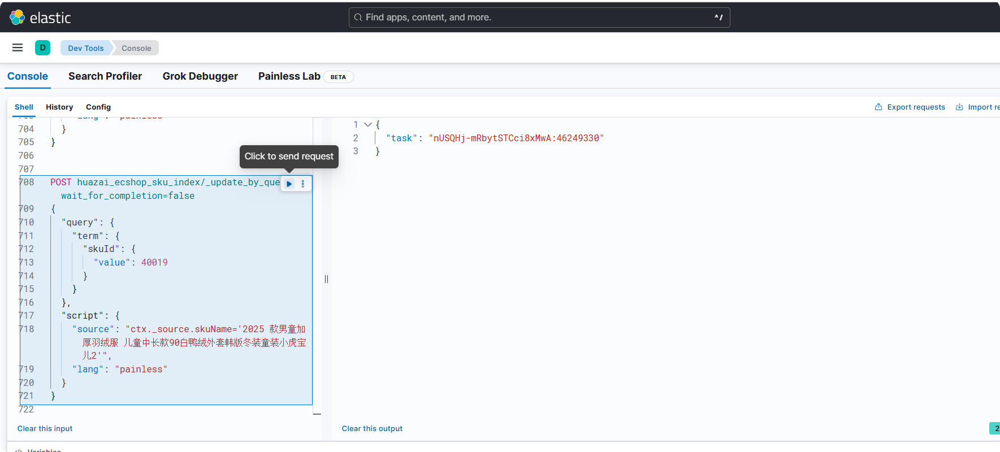

此时执行完异步方式返回了一个 task id，然后可以用这个 task id 查询任务的执行情况：

GET /\_tasks/nUSQHj-mRbytSTCci8xMwA:46249330

\# 结果

{

"completed": true,

"task": {

"node": "nUSQHj-mRbytSTCci8xMwA",

"id": 46249330,

"type": "transport",

"action": "indices:data/write/update/byquery",

"status": {

"total": 1,

"updated": 1,

"created": 0,

"deleted": 0,

"batches": 1,

"version\_conflicts": 0,

"noops": 0,

"retries": {

"bulk": 0,

"search": 0

},

"throttled\_millis": 0,

"requests\_per\_second": -1,

"throttled\_until\_millis": 0

},

"description": "update-by-query \[huazai\_ecshop\_sku\_index\] updated with Script{type=inline, lang='painless', idOrCode='ctx.\_source.skuName='2025 款男童加厚羽绒服 儿童中长款90白鸭绒外套韩版冬装童装小虎宝儿2'', options={}, params={}}",

"start\_time\_in\_millis": 1755526325380,

"running\_time\_in\_nanos": 18655555,

"cancellable": true,

"cancelled": false,

"headers": {

"trace.id": "00b5c79471b5a8afa13f7be26cfb45ce"

}

},

"response": {

"took": 18,

"timed\_out": false,

"total": 1,

"updated": 1,

"created": 0,

"deleted": 0,

"batches": 1,

"version\_conflicts": 0,

"noops": 0,

"retries": {

"bulk": 0,

"search": 0

},

"throttled": "0s",

"throttled\_millis": 0,

"requests\_per\_second": -1,

"throttled\_until": "0s",

"throttled\_until\_millis": 0,

"failures": \[\]

}

}

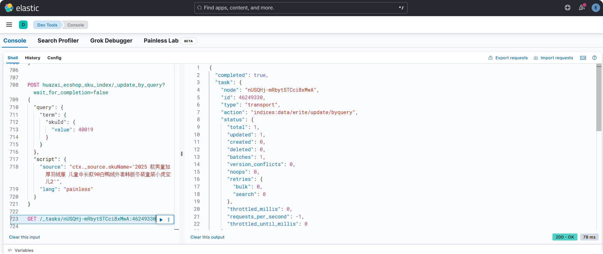

\_update\_by\_query 的接口参数有很多，更详细的使用示例请参考[官方文档](https://www.elastic.co/guide/en/elasticsearch/reference/8.17/docs-update-by-query.html)。

### **2.1.5 删除文档**

当商品不需要时，我们对其进行删除。ES 提供了 Delete API 来删除一个文档，删除一个文档是非常简单的，只需要指定索引和文档 ID 即可。

如下：

\# 删除文档 2ZVyvJgBZvDYCfr3BO6x

DELETE huazai\_ecshop\_sku\_index/\_doc/2ZVyvJgBZvDYCfr3BO6x

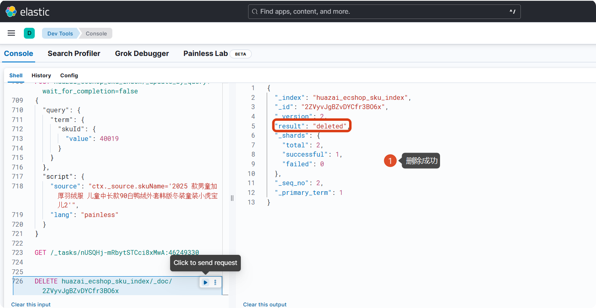

如果文档存在则删除成功，"result" 字段为 "deleted"。如果文档本身不存在，则返回 http 的状态码为 404。

除了指定文档 ID 进行文档删除外，我们还可以使用 Delete By Query API 进行查询删除，还拿前面删除的 ID 进行实操。

\# 使用 Delete By Query API 删除文档

POST /huazai\_ecshop\_sku\_index/\_delete\_by\_query

{

"query": {

"term": {

"\_id": "2ZVyvJgBZvDYCfr3BO6x"

}

}

}

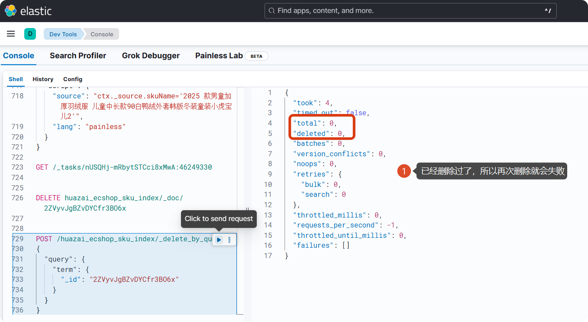

在这个返回结果中，"deleted" 字段为 0，即删除了 0 个文档表示删除失败。

### **2.1.6 批量操作文档**

当我们需要写入多个文档的时候，我们可以使用 Bulk API 来批量处理文档以提高执行效率。

Bulk API 支持在一次调用中操作不同的索引，可以在 Body 中指定索引也可以在 URI 中指定索引。同时支持以下 4 种类型的操作：

1.  Index
2.  Create
3.  Update
4.  Delete

Bulk API 的格式是用换行符分隔 JSON 的结构，第一行指定操作类型和元数据（索引、文档id等），紧接着的一行是这个操作的内容，其格式如下：

\# 在 Bulk API 中同时使用多种操作类型的实例

POST \_bulk

{ "index" : { "\_index" : "huazai\_ecshop\_sku\_index", "\_id" : "1" } }

{ "skuId": 40019, "skuName": "2025 款男童加厚羽绒服 儿童中长款90白鸭绒外套韩版冬装童装小虎宝儿2"}

{ "delete" : { "\_index" : "huazai\_ecshop\_sku\_index", "\_id" : "2ZVyvJgBZvDYCfr3BO6x" } }

{ "create" : { "\_index" : "huazai\_ecshop\_sku\_index", "\_id" : "3" } }

{

"skuName": "2025 秋季新款骆驼女鞋 休闲松糕厚底帆布鞋简约舒适韩版高帮鞋",

"createTime": "2025-08-18 22:22:22",

"price": "519",

"vipPrice": "429",

"skuStatus": 1,

"updateTime": "2025-08-18 12:42:42",

"category": "女鞋会场",

"brand": "骆驼",

"skuId": 40021,

"mainUrl": "http://img12.360buyimg.com/n1/s450x450\_jfs/t1/198920/1/50667/47720/6736c429Fc2f747c8/4cadbe7a136fdb39.jpg.avif"

}

{ "update" : {"\_index" : "huazai\_ecshop\_sku\_index", "\_id" : "2"} }

{ "doc" : {"skuName" : "唐狮冬装外套女连帽羽绒服女宽松中长款羽绒服女学生韩版羽绒服女2"} } \# 结果

{

"errors": false,

"took": 0,

"items": \[

{

"index": {

"\_index": "huazai\_ecshop\_sku\_index",

"\_id": "1",

"\_version": 10,

"result": "updated",

"\_shards": {

"total": 2,

"successful": 1,

"failed": 0

},

"\_seq\_no": 11,

"\_primary\_term": 1,

"status": 200

}

},

{

"delete": {

"\_index": "huazai\_ecshop\_sku\_index",

"\_id": "2ZVyvJgBZvDYCfr3BO6x",

"\_version": 1,

"result": "not\_found",

"\_shards": {

"total": 2,

"successful": 1,

"failed": 0

},

"\_seq\_no": 3,

"\_primary\_term": 1,

"status": 404

}

},

{

"create": {

"\_index": "huazai\_ecshop\_sku\_index",

"\_id": "3",

"\_version": 1,

"result": "created",

"\_shards": {

"total": 2,

"successful": 1,

"failed": 0

},

"\_seq\_no": 4,

"\_primary\_term": 1,

"status": 201

}

},

{

"update": {

"\_index": "huazai\_ecshop\_sku\_index",

"\_id": "2",

"\_version": 2,

"result": "updated",

"\_shards": {

"total": 2,

"successful": 1,

"failed": 0

},

"\_seq\_no": 5,

"\_primary\_term": 1,

"status": 200

}

}

\]

}

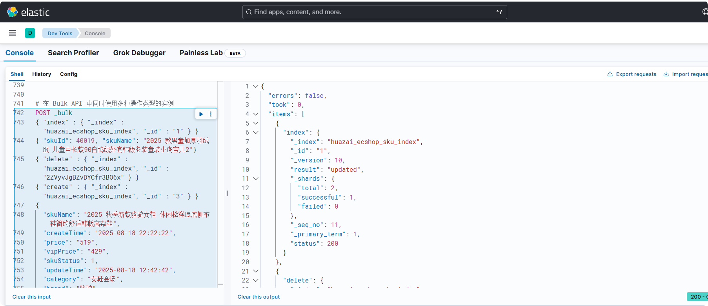

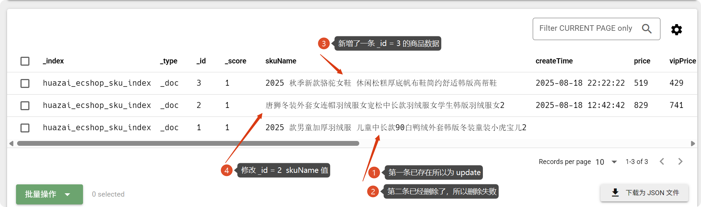

如上这样一个请求中有多个操作，返回结果中会对每个操作有相应的执行结果。如果其中一条操作失败，是不会影响其他操作的执行。

更详细 Bulk API 使用方式，可以参考[官方文档](https://www.elastic.co/guide/en/elasticsearch/reference/8.17/docs-bulk.html)。