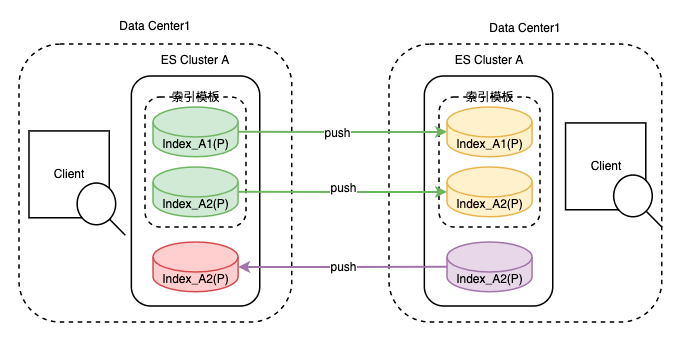
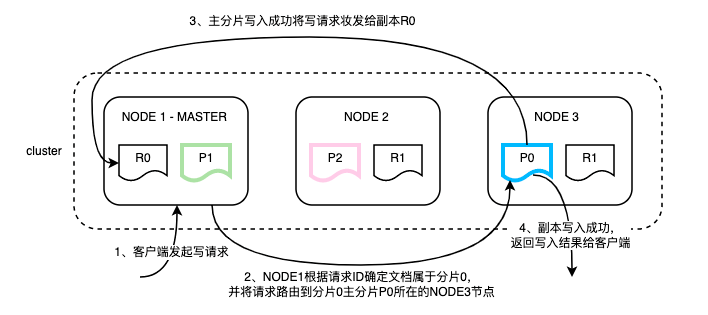
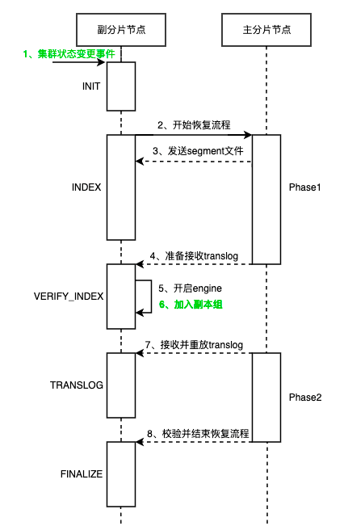
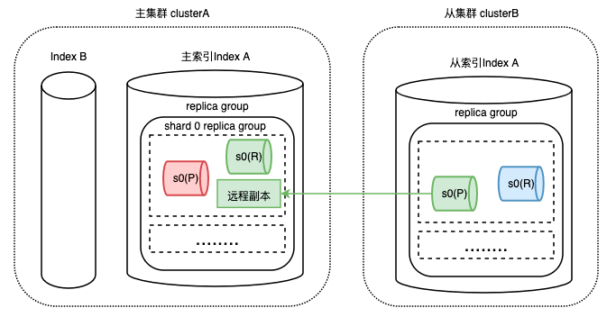
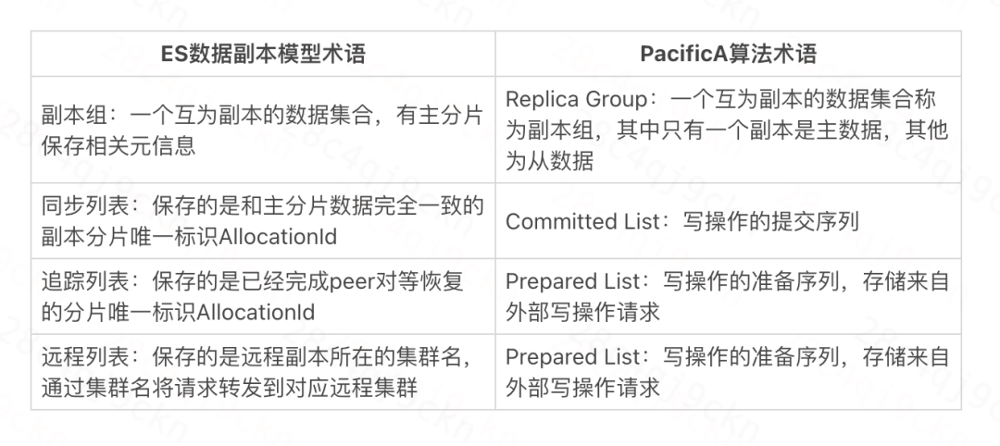
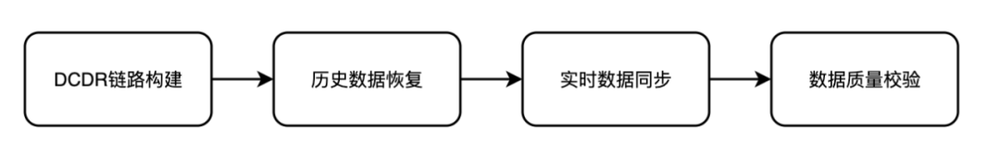
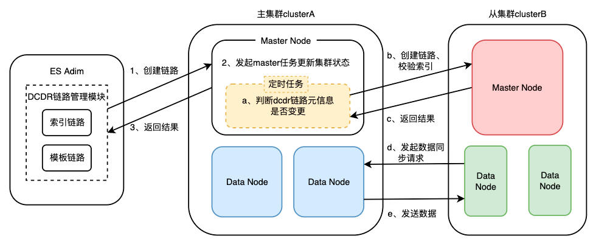
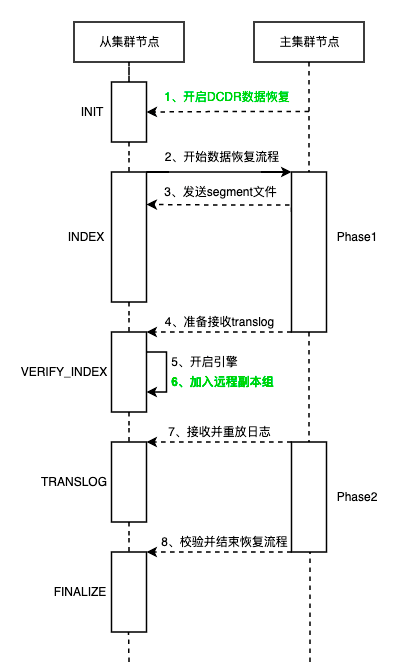
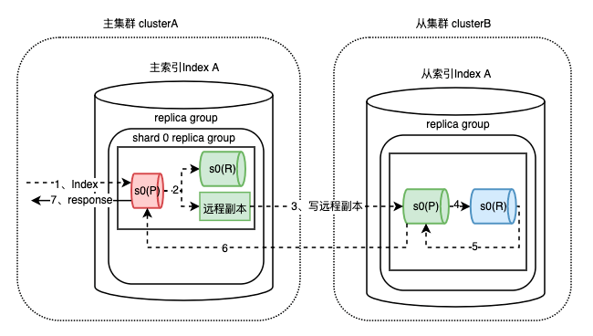
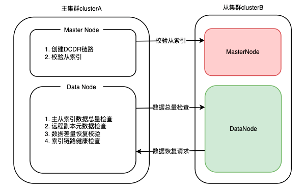

大家好，我是**华仔**, 又跟大家见面了。

今天分享一篇关于 Elasticsearch 索引性能优化的干货文章，下面是正文。

Elasticsearch 是一个基于 Lucene 构建的开源、分布式、RESTful 接口的全文搜索引擎，其每个字段均可被索引，且能够横向扩展至数以百计的服务器存储以及处理TB级的数据，其可以在极短的时间内存储、搜索和分析大量的数据。

滴滴 ES 发展至今，承接了公司绝大部分端上检索和日志场景，包括地图 POI 检索、订单检索、客服、内搜及把脉ELK 场景等。

近几年围绕稳定性、成本、效率和数据安全这几个方向持续探索：

1.  滴滴ES有很多在线P0级检索场景，为了提升集群稳定性，我们自研了跨数据中心复制能力，实现多机房数据写入强一致性，并配合管控平台让ES支持多活能力；
2.  为了提升查询性能和解决查询毛刺问题，我们在7.6版本上原地升级支持JDK 17；
3.  ES日志场景每天写入量在5PB-10PB量级，写入压力和业务成本压力大，为了提升ES的写入性能，我们让ES支持ZSTD压缩算法；
4.  由于ES索引里包含很多敏感数据，我们又完善了ES的安全认证能力。

基于以上探索，我们总结了一定的经验，现分成4篇文章详细介绍。本篇文章介绍滴滴ES如何实现索引的跨数据中心复制从而保证索引的高可用。

滴滴跨数据中心复制能力 - Didi Cross Datacenter Replication，由滴滴自研，简称DCDR，它能够将数据从一个 Elasticsearch 集群原生复制到另一个 Elasticsearch 集群。如图所示，DCDR工作在索引模板或索引层面，采用主从索引设计模型，由Leader索引主动将数据push到Follower索引，从而保证了主从索引数据的强一致性。

DCDR跨数据中心复制能力图

DCDR在滴滴内部的主要生产应用如下：

1.  **灾难恢复（DR）/高可用性（HA）****：**如果主集群发生故障，能够通过切换主从集群快速恢复，从而实现异地多活；
2.  **索引迁移****：**索引可以在不同集群间迁移，保证集群间的数据均衡，同时实现索引在集群级别的分级保障；
3.  **主从查询隔离****：**由于主从索引的强一致性保证，配合自研ES Admin管控平台，不同业务方可以查询不同的集群，避免相互之间的查询影响。

## **01 背景与目标**

原生的Elasticsearch提供了集群内部的高可用，能够保证集群内部的数据可靠性。但这种高可用无法满足对可靠性有进一步需求的用户。原生Elasticsearch主要有以下痛点：

1.  对于数据中心级别故障无法实现快速恢复
2.  数据在集群间搬迁成本很高，需借助外部工具来完成多个复杂操作

最初，滴滴内部应对跨数据中心的高可用，借助了外部同步平台将数据双写到不同集群来实现。该方式依赖较重，不支持历史数据同步，并且无法保证主从索引数据的强一致性。

随着外部平台的收敛，双写的方式已经无法使用。ES 官方在6.7.0版本提供了跨集群数据复制功能，该功能需付费且只能保证主从索引数据的最终一致性。滴滴内部核心业务，如POI检索（滴滴APP上下车地点检索服务）、订单检索业务，都要求主从索引数据强一致性。

为解决上述问题，满足业务方诉求，滴滴ES团队决定自研跨数据中心复制能力，即上文的DCDR。

DCDR在设计时主要有以下几个目标：

1.  保证主从数据的强一致性
2.  保证高可用性，快速实现灾难恢复
3.  实现不停机跨集群索引迁移
4.  可靠的版本升级（Elasticsearch的Rolling upgrades和Full cluster restart upgrade方案都无法做到升级后回滚）

## **02 技术基础**

DCDR功能支持将远程集群中的索引复制到本地集群，在复制过程中需要考虑两个重点：实时数据的同步、历史数据的同步。实时数据同步依赖ES写入机制，数据同步依赖ES副本恢复机制。因此，在介绍DCDR的方案设计以及实现细节之前，对这两个流程简单概述：

## **2.1 基础写入机制**

ES 写入是先写主分片，主分片写完后再将请求并行转发到副本，副本处理完再由主分片返回写入结果，具体流程如下：（注：本文中Si代表ES具体分片，P代表主分片，R代表副本）

## **2.2 副本恢复流程**

为了保证数据副本的一致性，副本的数据需要恢复到和主分片一致才能正常对外提供服务。ES的副本恢复是分片级别的，分为主分片恢复流程和副分片恢复流程。由于ES的副本恢复流程极为复杂，并且DCDR的数据恢复过程中仅与副分片恢复流程相关，因此这里只简单地介绍下副分片恢复流程。

副本recovery的目标是要将本地数据恢复到和主分片一致，主流程分为两个阶段：

1.  阶段一是主分片给副本发送segment文件（存储的是已经落盘并解析后的具体数据）。
2.  阶段二是主分片向副本发送translog日志（未落盘的数据，类似mysql 的WAL Log），两阶段结束后副本的恢复流程就结束了。

具体流程如下图：

## **03 方案设计**

## **3.1 设计思想**

**DCDR 的核心思想是将索引对应分片看做主索引对应分片的一个原创副本来处理****。**如下图，从索引的shard0主分片，会被当做主索引shard0主分片的一个远程副本。

为了让大家更好地理解这个思路，简单介绍下远程副本：远程副本是由ES数据副本模型延伸而来，由主索引的主分片保存远程副本相关元数据，在实现上借鉴了微软的PacificA算法。该设计思想符合ES数据副本模型，能够极大程度地复用ES副本逻辑，降低开发难度，减少对开源ES内核的侵入。

以下是该算法的部分核心术语和ES数据副本模型的对应关系：

## **3.2 具体方案设计**

DCDR是跨集群数据复制能力，实现该功能的第一步就是需要明确哪些索引模板或者索引需要进行数据的跨集群复制，也就是需要建立起DCDR链路。其次，DCDR的从索引作为一个远程副本，需要恢复到和主索引的数据一致才能正常提供服务，即历史数据恢复。从索引的数据恢复到和主索引一致，当主索引新增数据时，数据该如何写入从索引，即实时数据同步。经过以上环节，从索引就能够正常提供服务，那么如何保证数据的可靠性呢？这就涉及到了主从索引数据质量校验。

基于以上思考，整个DCDR的方案设计上分为四个主流程：

### **3.2.1 DCDR 链路构建**

ES集群是基于集群状态驱动的，因此DCDR链路构建的本质就是改变集群状态，并在对应机器上应用新的集群状态。滴滴内部的ES使用方式是索引模板形式（一组拥有相同前缀的索引集合），因此在链路设计上需要支持模板链路和索引链路。DCDR链路集群元信息通过ES cluster state自定义metaData实现，链路拥有统一的命名规则，并且区分模板和索引，主要信息展示如下：

模板链路：

{

"templates": {

"templateA\_to\_ClusterA": {

"name": "IndexA\_to\_ClusterA", // dcdr模板链路名

"template": "templateA", // 索引模板名

"replica\_cluster": "ClusterA" // 从集群名称

}

}

}

索引链路：

{

"Index\_202206/Index\_202206(ClusterA)": {

"primary\_index": "Index\_202206", // 主索引名称

"replica\_index": "Index\_202206", // 从索引名称

"replica\_cluster": "ClusterA", // 从集群名称

"replication\_state": true // 链路状态

}

}

ES集群对外提供了DCDR链路创建API，通过API将链路元信息更新到集群状态中，DCDR相关模块通过订阅集群状态变更事件，从而进入数据同步流程。如下图：

有个设计细节需要注意：

**Q: 主从索引名是一致的，那么主从索引的位移标识 UUID （集群建索引后自动生成的随机字符串）要怎么处理呢？**

1.  综合考虑开发难度和源码侵入问题，主从索引的索引名和UUID都保持一致。
2.  在从索引创建时透传主索引的UUID到从集群，从索引在创建索引时不再自动生成UUID，解决从索引创建UUID不一致问题。
3.  由于ES墓地会暂时保存被删除的索引，因此在从索引创建时扫描ES墓地并删除UUID相同的索引，解决从索引删除后无法重建问题。

### **3.2.2 历史数据恢复**

历史数据恢复方案在设计上借鉴了ES副本恢复策略。DCDR从索引的副本恢复同样是分片级别的，也需要进行segement和translog的复制环节。历史数据恢复发生的条件：

1.  新建DCDR链路，从索引需要根据主索引进行历史数据恢复；
2.  从索引分片数据写入失败，主索引定时任务重建DCDR链路。

从索引作为远程副本在历史数据恢复方面和ES的副本恢复流程基本是一致的，主要区别（图中绿色标记）在于第1步的数据恢复触发条件，以及第6步加入的副本组不同。同时要注意以下设计细节：

**Q: 怎么触发历史数据的恢复？**

1.  ES的副本恢复是由集群状态变更事件驱动的，从索引的恢复是跨集群的，因此只能依靠主集群的RPC调用触发从集群的DCDR历史数据恢复。

**Q: ES 分片恢复是个很耗时的阶段，如何提高从索引的分片恢复效率，使得从索引能够快速提供服务？**

1.  从索引只需要恢复自身的主分片数据，之后DCDR从索引历史数据恢复结束，从索引就能正常接收主索引的写请求了。从索引自身的副本恢复依赖于从集群的ES副本机制即可。这样能够极大地降低DCDR链路历史数据恢复时间。

**Q: 从索引什么时候可以正常接收主索引的写请求呢？**

1.  ES副本会在主分片phase1结束，副本启动Engine后加入主分片副本组，开始接收主分片的写请求。从索引的恢复也是类似的，从索引的主分片作为主索引对应主分片的远程副本，也会在主索引主分片phase1结束后，自身Engine启动后，由主索引的对应主分片加入远程副本组，开始接收写请求。
2.  远程副本组的实现是在ES的ReplicationGroup类中增加一个远程的prepared list。

**Q: DCDR 历史数据恢复过程中，主索引的主分片能否迁移？**

1.  分片搬迁是集群均衡的一种手段，由于DCDR的恢复是跨集群的，无法通过集群状态变更快速地感知到分片迁移并进行处理。因此，主分片不能迁移。在DCDR数据恢复过程中，会通过加锁的方式防止主分片迁移。

### **3.2.3 实时数据同步**

实时数据同步指的是历史数据同步完成后，增量数据如何同步到从索引。根据前文的ES写入流程可知，ES写入是先写主分片，之后再将写请求同步转发到副本上。基于滴滴内部业务场景考虑，需要异地多活的业务数据写入量一般不大，远未达到ES的写入瓶颈，并且一些核心业务对数据一致性有强依赖。

因此，DCDR在实时数据同步上采用主分片写入成功，将数据同步转发给副本以及远程副本这一方案。该方案牺牲一定的数据写入性能，从而保证了数据的强一致性。

实时数据同步策略采用的是将写请求转发到远程副本实现的，仍然有许多细节需要考虑：

**Q: 远程副本写入失败怎么办？**

1.  ES副本写入失败的处理策略是将副本从同步副本组移除，并重新执行Recovery。远程副本写入失败的处理策略和ES副本写入失败处理策略类似，是将远程副本从主索引主分片的远程副本组中移除，主索引将不再转发写请求到从索引，由从索引的定时检查机制重新执行数据恢复流程。

**Q: 从索引的 seq\_num (每条请求递增的唯一 ID，用来加快副本恢复流程的)如何保证主从一致？**

1.  从索引的分片采用了自定义的Engine，该Engine能够直接接收主索引传过来的seq\_num，不再生成seq\_num值。

**Q: 主从 mapping 如何保证一致？要更新 mapping 时怎么处理？**

1.  新建DCDR链路时会将主索引的mapping拷贝到从集群，并新建从索引，保证链路新建时主从索引的mapping是一致的。
2.  DCDR的设计思想是远程副本策略，是将写请求直接转发给从索引。因此，后期如果出现需要更新mapping的字段，会由主从集群各自的master去执行master任务去更新mapping即可（主从master mapping更新处理策略一致）。

### **3.2.4 主从索引数据质量校验**

数据质量校验环节是从索引数据可靠性的保障。它会定时检查集群状态中的DCDR元信息是否和当前链路运行状态一致，根据结果对链路进行相应的操作。当主从索引数据差距过大或链路异常时，主集群会主动断开链路，并通知从索引进行差量数据恢复。

ES集群中，MasterNode负责管控集群元数据，因此在设计校验任务时，主要用于链路元数据创建及检查从索引是否存在；DataNode负责数据存储，因此用于判断主从分片是否需要进行数据恢复。

### **3.2.5 其他**

经过以上4个环节就能将数据从一个 Elasticsearch 集群原生复制到另一个 Elasticsearch 集群，搭配上主从切换策略，就能在保证数据强一致性的前提下实现跨集群高可用。对于不停机跨集群索引迁移这一目标，我们通过DCDR将数据同步到目的端集群，等待存量数据恢复完成，再进行一次主从切换。对于可靠的版本升级这一目标，我们通过DCDR复制待升级版本数据到备用集群，当版本升级异常时能够快速切换集群。

## **04 总结**

目前滴滴ES共有6个DCDR从集群，建立的DCDR模板链路400+，DCDR索引链路2000+，涵盖了POI、dos\_order、soda等滴滴核心业务。目前ES仍然存在查询毛刺、查询相互影响、分片恢复、写入性能等方面问题，后续我们会在这些方面重点发力，更好的助力业务发展。

原文链接：[https://mp.weixin.qq.com/s/qZaQfQq4Rwq5kmKKVGwOAQ](https://mp.weixin.qq.com/s/qZaQfQq4Rwq5kmKKVGwOAQ)