大家好，我是**华仔**, 又跟大家见面了。

从今天开始，我们开始对 RocketMQ 进行相关实现原理进行剖析，今天是第七篇，我们来聊聊 RocketMQ 「**Broker**」高性能读写机制，深度剖析下其内部底层原理设计思想，**下面进入正题**。

  
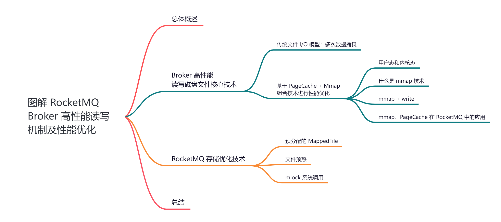

##   
**01 总体概述**

对于 RocketMQ 来说，「**Broker**」是非常核心的组件之一。主要负责消息的「**存储**」、「**投递**」和「**查询**」以及保证「**服务高可用**」 。

那么 「**Broker**」是基于什么机制来进行存储？为什么要设计成这样？如何支撑高性能读写的，里面又用到了哪些高大上的技术？

带着这些疑问，我们就来和你聊一聊 RocketMQ「**Broker**」高性能读写机制背后的深度思考和实现原理。

## **02 Broker 高性能读写磁盘文件核心技术**

今天我给大家介绍一个非常关键的技术，其实在 Kafka「**Broker**」端也经常被用到。很多人可能都不太熟悉，它就是「**mmap**」，在 RocketMQ 「**Broker**」中就是大量的使用「**mmap**」技术去实现底层「**CommitLog**」这种磁盘文件的高并发读写的。

我知道，在 Kafka 中， Broker 对通过「**os cache**」机制来进行性能优化的，对于 RocketMQ 来说，也是使用同样的技术来进行性能优化的，因为直接写入「**os cache**」即「**PageCache**」，后续等操作系统内核中的刷新线程异步把「**PageCache**」中的数据刷入磁盘文件即可。

这里我们使用「**演进**」的方式来剖析为什么要使用「**mmap**」技术。

## **2.1 传统文件 I/O 模型：多次数据拷贝**

这里我们来试想下，如果 RocketMQ 在没有使用「**mmap**」技术时，就是使用传统文件 I/O 模型操作去进行磁盘文件的读写，那么此时存在什么样的性能问题？

熟悉文件 I/O 模型操作的同学应该都知道，这种情况下会出现「**多次数据拷贝**」的问题。

比如，我们此时有一个程序，需要对磁盘文件发起 I/O 操作「**读取数据**」到用户空间，其顺序如下：

1.  首先从磁盘上把数据读取到内核 I/O 缓冲区里去。
2.  然后再从内核 I/O 缓冲区里读取到用户空间里去。
3.  最后我们才能拿到这个文件里的数据。

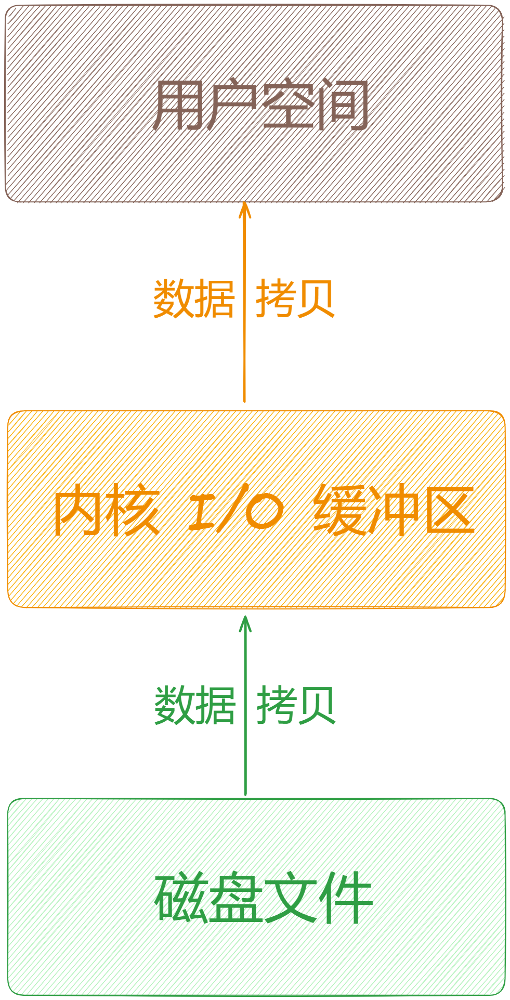

根据上图可以得出：为了读取磁盘文件里的数据，是不是已经发生了「**两次数据拷贝**」？

没错，这个就是传统方式下的文件 I/O 模型操作的弊端，必然涉及到两次数据拷贝操作，对磁盘读写性能是有影响的。

如果此时我们需要「**写入数据**」到磁盘文件里去呢？

过程跟上面的类似，如下：

1.  首先把数据写入到用户空间里去。
2.  然后从用户空间将数据拷贝进入内核 I/O 缓冲区。
3.  最后将数据从内核 I/O 缓冲区拷贝进入磁盘文件里去。

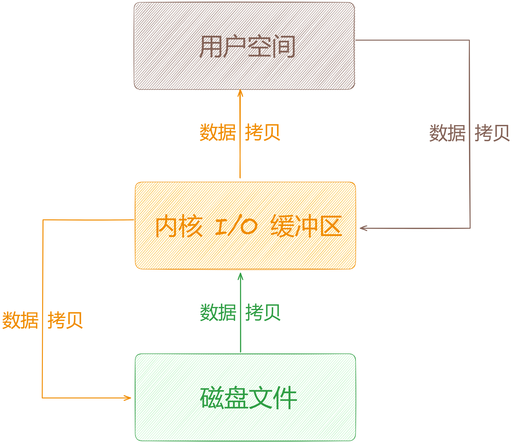

根据上图可以得出：为了将数据写入到磁盘文件的过程中，是不是再一次发生了「**两次数据拷贝**」？

没错，这就是传统方式下的文件 I/O 模型操作的问题，有「**4 次数据拷贝**」的问题。

## **2.2 基于 PageCache + Mmap 组合技术进行性能优化**

随着技术的不断进步，计算机的速度越来越快。但是「**磁盘文件 I/O**」操作的速度往往让欲哭无泪，和内存中的读取速度一直有着指数级的差距。

「**CPU**」、「**内存**」、「**I/O**」三者之间速度差异很大。对于高并发，低延迟的系统来说，「**磁盘文件 I/O**」操作往往最先成为系统的瓶颈。为了减少其影响，往往会引入「**缓存**」来提升性能。但是由于内存空间有限，往往只能保存部分数据，并且数据需要持久化，所以「**磁盘文件 I/O**」仍然不可避免。

无论是从 HDD 到 SSD 的硬件提升，还是从阻塞 I/O （BIO）到非阻塞 I/O （NIO）的软件提升都使得「**磁盘文件 I/O**」效率得到了很大的提升，但是相比内存读取速度仍然有着接近巨大的差距。

今天我将介绍一种更加高效的 I/O 解决方案：「**mmap**」，即内存映射文件 memory mapped file。

## **2.2.1 用户态和内核态**

为了安全，操作系统将虚拟内存划分为两个模块，即「**用户态**」和「**内核态**」。它们之间是相互隔离的，即使用户程序崩溃了也不会影响系统的运行。

简单来说，「**用户态**」是用户程序代码运行的地方，而「**内核态**」则是所有进程共享的空间。当进行数据读写操作时，往往需要进行「**用户空间**」和「**内核空间**」的交互。

## **2.2.2 什么是 mmap 技术**

「**mmap**」是一种「**内存映射文件**」的方法，即将一个文件或者其它对象映射到进程的地址空间，实现文件磁盘地址和进程虚拟地址空间中一段虚拟地址的一一对映关系。

对文件进行「**mmap**」后，会在进程的「**虚拟内存分配地址空间**」，创建与磁盘的映射关系。 实现这样的映射后，就可以以「**指针**」的方式「**读写操作映射**」的虚拟内存，系统则会自动回写磁盘。相反内核空间对这段区域的修改也直接反映到用户空间，从而可以实现不同进程间的数据共享。与传统文件 I/O 模型相比，**减少了一次用户态拷贝到内核态的操作**。

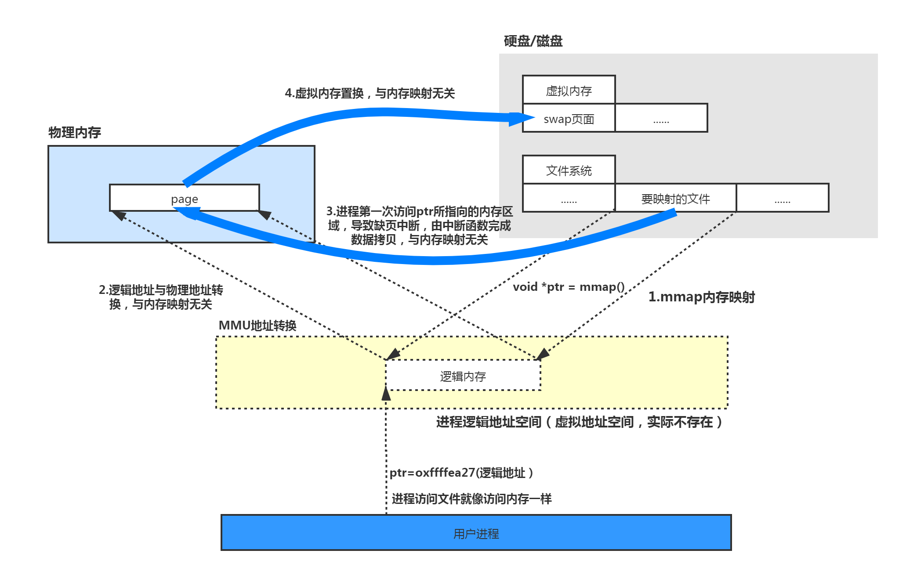

（图片来自网络）

## **2.2.3 mmap + write**

「**mmap**」主要实现方式是将「**读缓冲区**」的地址和「**用户缓冲区**」的地址进行映射，「**内核缓冲区**」和「**用户缓冲区**」共享，从而减少了从「**读缓冲区**」到「**用户缓冲区**」的一次 CPU 拷贝。

原先是 Read + Write 操作是「**4 次上下文切换**」和 「**4 次数据拷贝**」 。

使用「**mmap**」技术流程图如下：

  
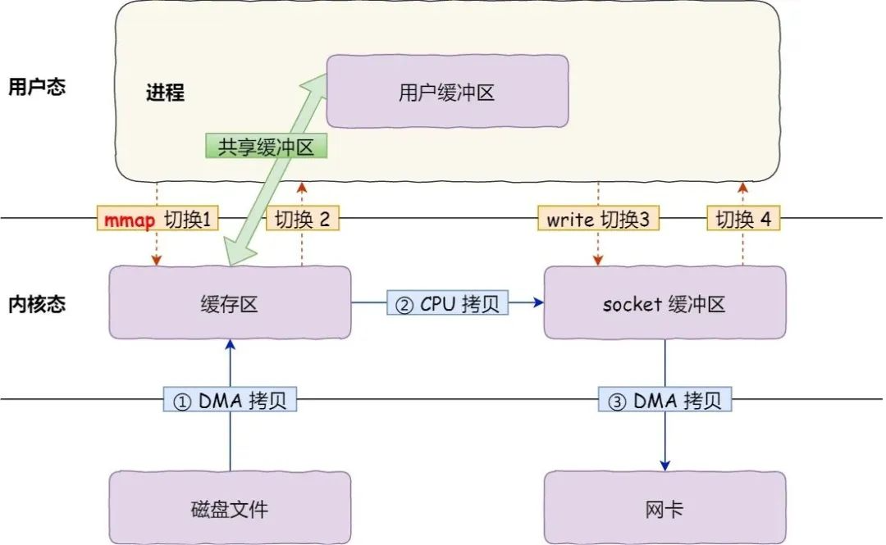

（图片来自网络）

具体过程如下：

1.  应用进程调用了mmap()后，DMA 会把磁盘的数据拷贝到内核的缓冲区里，应用进程跟操作系统内核「共享」这个缓冲区。
2.  应用进程再调用write()，操作系统直接将内核缓冲区的数据拷贝到 socket 缓冲区中，这一切都发生在内核态，由 CPU 来搬运数据。
3.  最后，把内核的 socket 缓冲区里的数据，拷贝到网卡的缓冲区里，这个过程是由 DMA 搬运的。

我们可以看到，通过使用mmap()来代替read()， 可以减少一次数据拷贝的过程。但仍然需要通过 CPU 把内核缓冲区的数据拷贝到 socket 缓冲区里，且仍然需要 4 次上下文切换，因为系统调用还是 2 次。

使用「**mmap**」技术之后是 「**1 次映射**」+ 「**3 次数据拷贝**」+ 「**4 次上下文切换**」。

## **2.2.4 mmap、PageCache 在 RocketMQ 中的应用**

接着我们来看一下，在 RocketMQ 中如何利用「**mmap**」技术配合「**PageCache**」技术进行文件读写优化的呢？

首先，RocketMQ 底层对「**CommitLog**」 、「**ConsumeQueue**」之类的磁盘文件的读写操作，基本上都会采用「**mmap**」技术来实现。

关于这些「**CommitLog**」 、「**ConsumeQueue**」组件的细节，这里就不展开了，会在后面单独篇章剖析。

如果具体到代码层面，就是基于 JDK NIO 包下的 [MappedByteBuffer#map()](http://mappedbytebuffer/#map\(\)) 函数，来将磁盘文件 「**CommitLog**」文件，或者「**ConsumeQueue**」文件映射到内存里来。

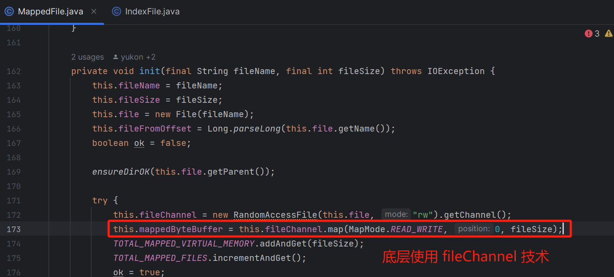

[MappedByteBuffer](http://mappedbytebuffer/#map\(\)) 继承自 [ByteBuffer](http://bytebuffer/)，其内部维护了一个逻辑地址变量 [address](http://address/)。在建立映射关系时，

[MappedByteBuffer](http://mappedbytebuffer/) 利用了 JDK NIO 的 [FileChannel](http://filechannel%20/) 类提供的 map() 方法把文件对象映射到虚拟内存。

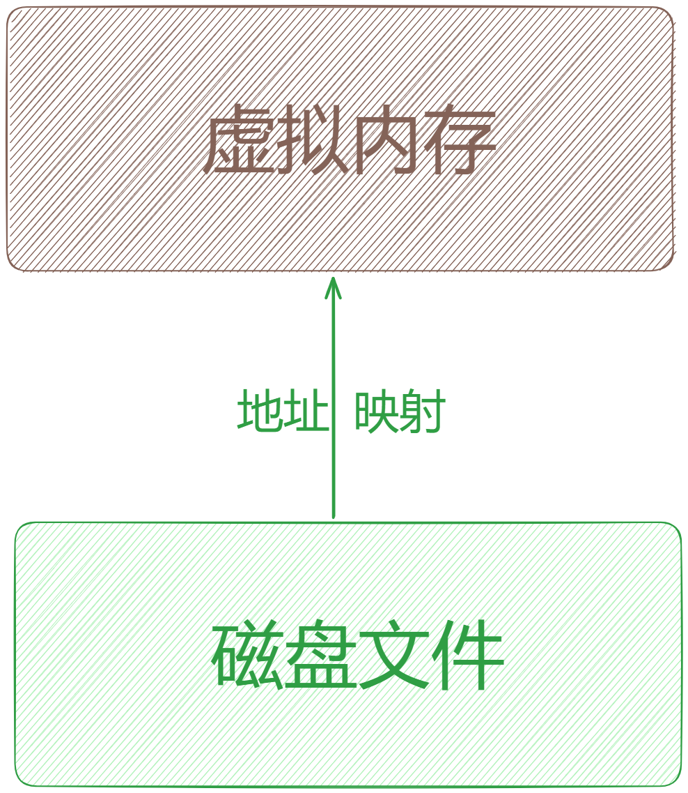

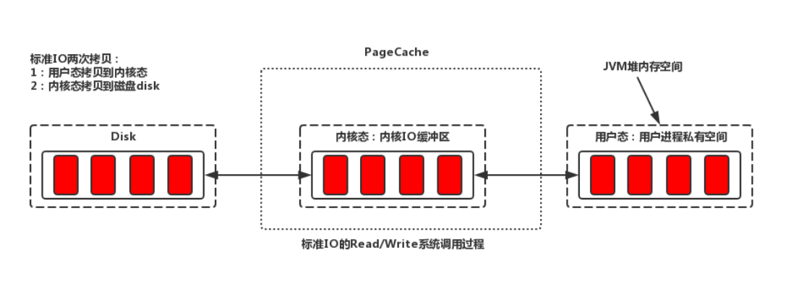

（图片来自网络 传统模式）

需要注意的是：「**mmap**」技术在进行文件映射的时候，一般有大小限制，在「**1.5 ~ 2 GB**」之间。所以RocketMQ 才让「**CommitLog**」单个文件在「**1 GB**」，「**ConsumeQueue**」文件在「**5.72 MB**」不会太大。

通过限制 RocketMQ 底层文件的大小，就可以在进行文件读写的时候很方便的进行「**内存映射**」了。

所以，RocketMQ 默认的「**CommitLog**」文件大小为「**1 G**」，即将「**1 G**」的文件映射到物理内存上。但 「**mmap**」初始化时只是将文件磁盘地址和进程虚拟地址做了个映射，并没有真正的将整个文件都映射到内存中，当程序真正访问这片内存时产生缺页异常，这时候才会将文件的内容拷贝到「**PageCache**」里。

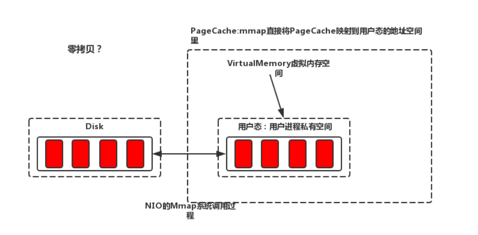

（图片来自网络 mmap 模式）

接下来就可以对这个已经映射到内存里的磁盘文件进行读写操作了，比如要写入消息到「**CommitLog**」文件，你先把一个「**CommitLog**」文件通过 [MappedByteBuffer](http://mappedbytebuffer/) 的 map() 函数映射其地址到你的虚拟内存地址。

接着就可以对这个 [MappedByteBuffer](http://mappedbytebuffer/) 执行写入操作了，写入的时候他会直接进入 [PageCache](http://pagecache/) 中，然后过一段时间之后，由操作系统 os 的线程异步刷入磁盘中，如下：

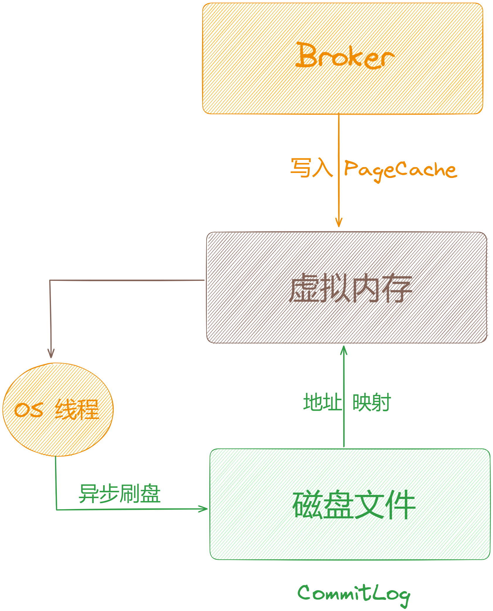

「**PageCache**」是操作系统对文件的缓存，用于加速对文件的读写。程序对文件进行顺序读写的速度几乎接近于内存的读写访问，这里的主要原因就是在于操作系统使用「**PageCache**」机制对读写访问操作进行了性能优化，将一部分的内存用作「**PageCache**」。

如果一次读取文件时出现未命中「**PageCache**」的情况，操作系统从物理磁盘上访问读取文件的同时，会顺序对其他相邻块的数据文件进行预读取。这样只要下次访问的文件已经被加载至「**PageCache**」时，读取操作的速度基本等于访问内存。

订阅消费消息时（对「**CommitLog**」操作是随机读取），由于「**PageCache**」的局部性热点原理且整体情况下还是从旧到新的有序读，因此大部分情况下消息还是可以直接从「**PageCache**」中读取，不会产生太多的缺页（Page Fault）中断而从磁盘读取。

「**PageCache**」机制也不是完全无缺点的，当遇到操作系统进行「**脏页回写**」，「**内存回收**」，「**内存 Swap**」等情况时，就会引起较大的消息读写延迟。

## **03 RocketMQ 存储优化技术**

对于上面这些情况，RocketMQ 采用了多种优化技术，比如「**内存预分配**」，「**文件预热**」，「**mlock 系统调用**」等，来保证在最大可能地发挥「**PageCache**」机制优点的同时，尽可能地减少其缺点带来的消息读写延迟。

## **3.1 预分配的 MappedFile**

如果一开始只是做个映射，而到具体写消息时才将文件的部分页加载到「**PageCache**」，那效率将会是多么的低下。所以底层「**MappedFile**」组件在初始化时是由单独的线程「**AllocateMappedFileService**」来实现的，就是对应的生产消费模型。

RocketMQ 在初始化「**MappedFile**」时做了内存预热，事先向「**PageCache**」中写入一些数据，flush 到磁盘，使整个文件都加载到「**PageCache**」中。

在调用 [CommitLog#putMessage()](http://commitlog/#putMessage\(\)) 方法消息写入过程中，「**CommitLog**」会先从「**MappedFileQueue**」队列中获取一个「**MappedFile**」，如果没有就新建一个。

这里「**MappedFile**」的创建过程是将构建好的一个「**AllocateRequest**」请求添加至队列中，后台运行的「**AllocateMappedFileService**」服务线程（在Broker启动时，该线程就会创建并运行），会不停地 run，只要请求队列里存在请求，就会去执行「**MappedFile**」映射文件的创建和预分配工作，分配的时候有两种策略：

1.  一种是使用「**mmap**」的方式来构建「**MappedFile**」实例。
2.  一种是从「**TransientStorePool**」堆外内存池中获取相应的「**DirectByteBuffer**」来构建「**MappedFile**」。并且在创建分配完下个「**MappedFile**」后，还会将下下个「**MappedFile**」预先创建并保存至请求队列中等待下次获取时直接返回。

RocketMQ 中预分配「**MappedFile**」的设计非常巧妙，下次获取时候直接返回就可以不用等待「**MappedFile**」创建分配所产生的时间延迟。

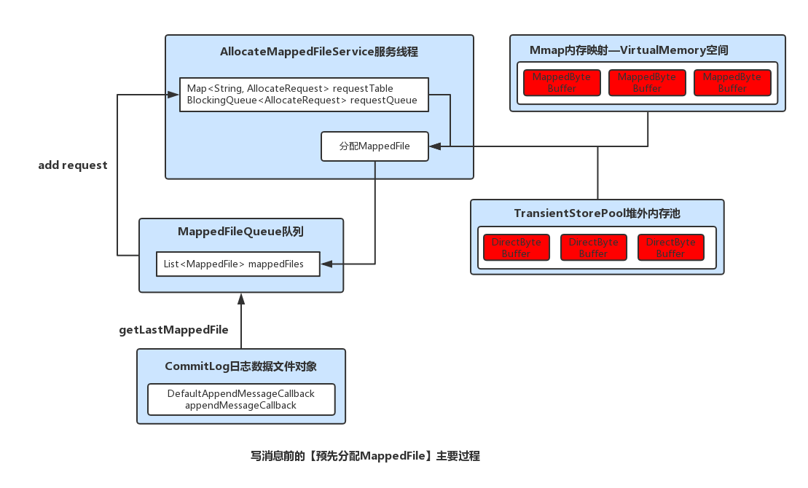

（图片来自网络）

## **3.2 文件预热**

预热的目的主要有两点：

1.  由于仅分配内存并进行 mlock 系统调用后并不会为程序完全锁定这些内存，因为其中的分页可能是写时复制的。因此就有必要对每个内存页面中写入一个假的值。其中，RocketMQ 是在创建并分配「**MappedFile**」的过程中，预先写入一些随机值至 mmap 映射出的内存空间里。
2.  调用 mmap 进行内存映射后，OS 只是建立虚拟内存地址至物理地址的映射表，而实际并没有加载任何文件至内存中。程序要访问数据时 OS 会检查该部分的分页是否已经在内存中，如果不在，则发出一次缺页中断。这里，可以想象下 1G 的「**CommitLog**」需要发生多少次缺页中断，才能使得对应的数据才能完全加载至物理内存中。

RocketMQ 的做法是在做「**Mmap**」内存映射的同时进行「**madvise**」系统调用，目的是使 OS 做一次内存映射后对应的文件数据尽可能多的预加载至内存中，从而达到「**内存预热**」的效果。

## **3.3 mlock 系统调用**

1.  OS 在内存充足的情况下，会将文件加载到「**PageCache**」提高文件的读写效率，但是当内存不够用时，OS 会将「**PageCache**」回收掉。试想如果「**MappedFile**」对应的「**PageCache**」被 OS 回收，那就又产生缺页异常再次从磁盘加载到「**PageCache**」，会对系统性能产生很大的影响。
2.  将进程使用的部分或者全部的地址空间锁定在物理内存中，防止其被交换到「**swap**」空间。对于 RocketMQ这种的高吞吐量的分布式消息队列来说，追求的是消息读写低延迟，那么肯定希望尽可能地多使用物理内存，提高数据读写访问的操作效率。

RocketMQ 在创建完「**MappedFile**」并且内存预热完成后调用了 c 的 mlock 函数将这片内存锁定了。

## **04 总结**

这里，我们一起来总结一下这篇文章的重点。

1、从「**RocketMQ**」架构中抛出了「**Broker**」高性能读写机制背后的深度思考和实现原理。

2、接着带你剖析了「**Broker**」高性能读写磁盘文件核心技术：「**Mmap**」+ 「**PageCache**」。

2、最后带你剖析了「**RocketMQ**」存储优化技术。

下篇我们来深度剖析「**Broker 基于 Raft 协议的主从架构设计**」，大家期待，我们下期见。