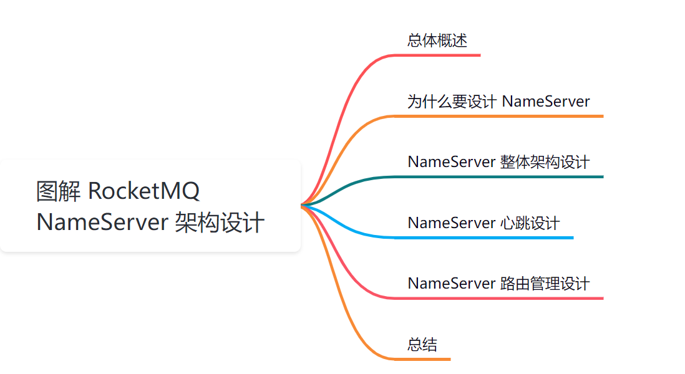
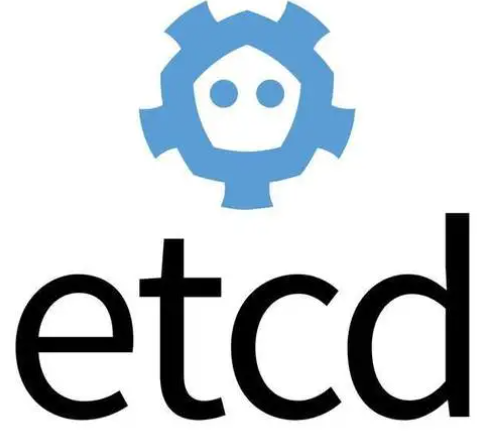
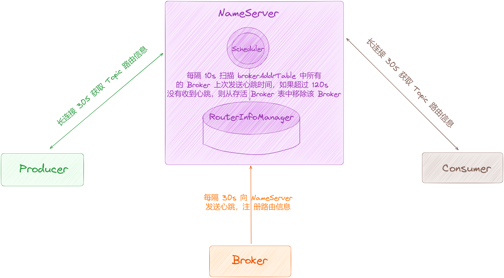
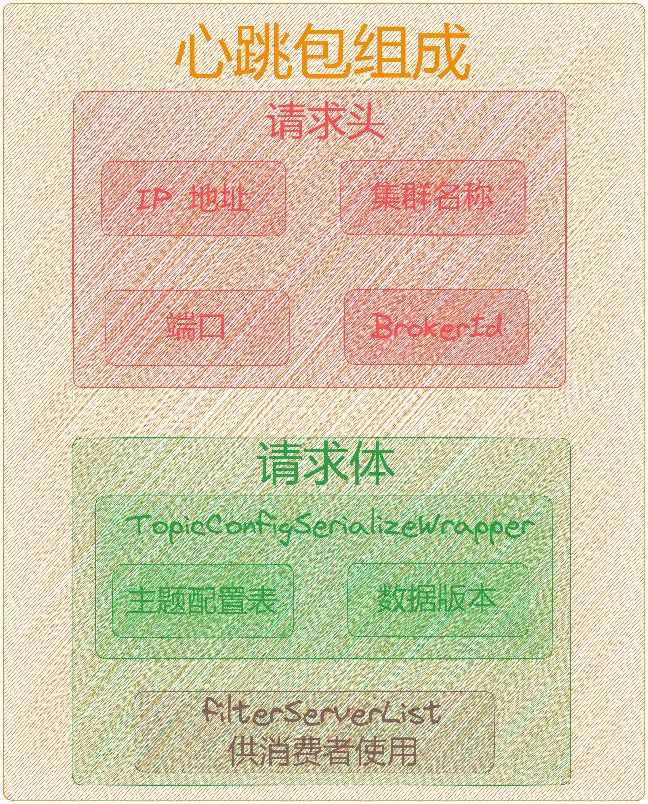
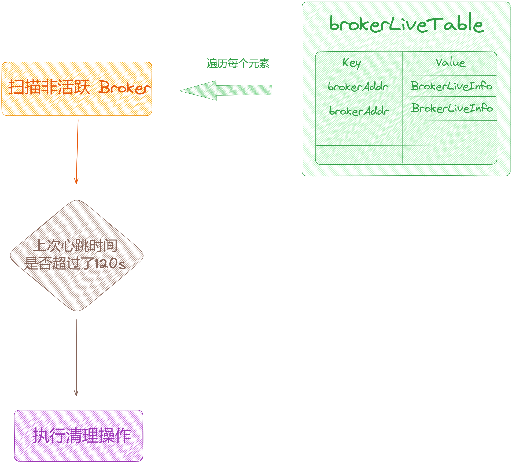
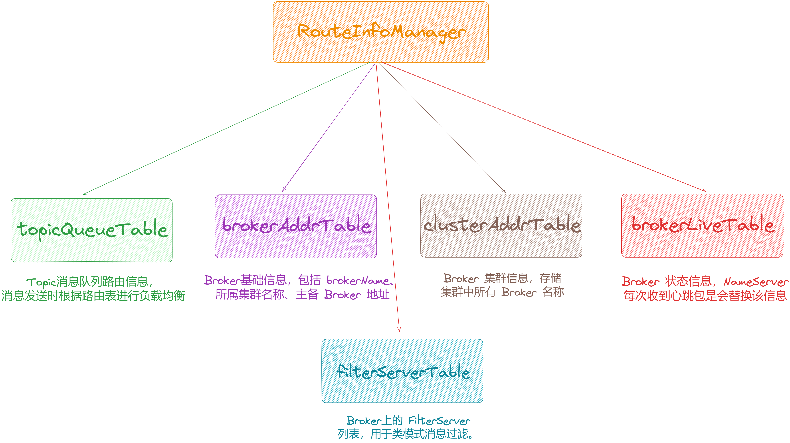
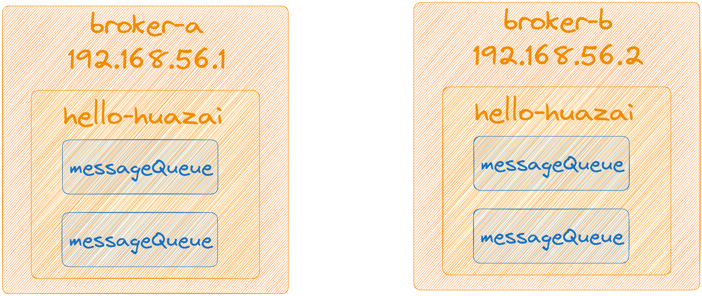

大家好，我是**华仔**, 又跟大家见面了。

从今天开始，我们开始对 RocketMQ 进行相关实现原理进行剖析，今天是第三篇，我们来聊聊 RocketMQ 「**NameServer**」 的架构设计，深度剖析下其内部底层原理设计思想，**下面进入正题**。

## **01 总体概述**

「**NameServer**」是专门为 RocketMQ 设计的「**轻量级名字服务**」，它主要用来实现「**服务发现**」的，其具有「**简单**」、「**相互独立**」、「**可集群横向扩展**」、「**无状态**」，「**节点间互不通信**」等特点。

它是组成 RocketMQ 的重要组件之一，是除了 Broker 之外另一个需要部署的服务，关于安装部署，可以点击：

[【入门实战系列第三篇】RocketMQ 安装入门实战](https://articles.zsxq.com/id_o92x7jv3p0tu.html)

不知道你是否会有这样的问题：

1.  RocketMQ 的 Topic 分布在不同的 Broker 节点上，作为消息的「**生产者**」和「**消费者**」，如何知道要从哪个 Broker 节点去生产或者消费消息呢？
2.  如果此时连接的 Broker 宕机了，如何在不重启的情况下感知到？

那么「**NameServer**」就是为了解决这些问题设计的，接下来我们就来深度剖析下其架构设计和原理。

## **02 为什么要设计 NameServer**

目前市面上可以作为「**注册中心/服务发现**」的组件有很多，比如：「**ETCD**」、「**Consul**」、「**Zookeeper**」、「**Nacos**」等：

既然上面这些都可以实现「**注册中心/服务发现**」功能，为什么 RocketMQ 还要自己开发一个 「**NameServer**」呢？笔者认为大概有以下原因：

1.  根据「**CAP**」理论，同时最多只能满足两个点，而 Zookeeper 满足的是 CP，也就是说 Zookeeper 并不能保证服务的「**可用性**」，Zookeeper 在进行选举的时候，整个选举的时间太长，期间整个集群都处于不可用的状态，而这对于一个注册中心来说肯定是不能接受的，作为服务发现来说就应该是为可用性而设计。
2.  首先 RocketMQ 的架构设计决定了需要一个「**轻量级元数据服务器**」，只需保持「**最终一致性**」，而不需要像 Zookeeper、ETCD 那样的「**强一致性**」方案，所以无需再依赖另一个中间件，从而可以减少整体的维护成本。
3.  另外「**NameServer**」通常也是「**集群**」的方式部署，彼此之间是「**相互独立**」，「**互不通信**」，Broker 会向每个 「**NameServer**」注册自己的路由信息，所以每个「**NameServer**」都保存一份完整的路由信息，即使某台「**NameServer**」挂掉，Broker 仍然可以向其它「**NameServer**」同步路由信息，所以客户端仍然可以动态感知到 Broker 的路由信息。

## **03 NameServer 整体架构设计**

「**NameServer**」是⼀个非常简单的 「**Topic 路由注册中心**」，其角色类似 Kafka、Dubbo 中的 Zookeeper ，支持 Broker 的「**动态注册与发现**」。

主要包含两个功能：

1.  **Broker 管理**：NameServer 接收来自 Broker 集群的注册信息并且保存下来作为「**路由信息**」的基本数据。然后提供「**心跳检测机制**」用来检查 Broker 是否还存活。
2.  **路由信息管理**：每个 NameServer 将保存 Broker 集群的整个路由信息和用来客户端查询的队列信息。然后 Producer 端和 Conumser 端通过 NameServer 就知道整个 Broker 集群的路由信息，从而进行消息的生产和消费。

> RocketMQ 5.0 版本之后 NameServer 同时也可以作为 Controller 模块的一个容器，Controller 模块内嵌到NameServer 中。

通过上图可以看出，RocketMQ 整个架构上主要分为四部分： 「**Broker**」、「**Producer**」、「**Consumer**」、「**NameServer**」，其他三个都会与 「**NameServer**」进行通信，整个流程如下：

## **2.1 NameServer 启动**

启动「**NameServer**」服务，监听 TCP 端口， 其集群多节点之间互不通信，然后等待 「**Broker**」、「**Producer**」、「**Consumer**」连上来。

## **2.2 Broker 启动**

启动「**Broker**」服务，此时会每隔 30 秒向所有的 NameServer 发送心跳命令，进行注册「**路由信息**」，「**NameServer**」接收到来自「**Broker**」心跳请求之后，保存「**路由信息**」到本地内存中，将注册成功结果返回给 Broker 服务。

## **2.3 Producer 发送消息**

当「**Producer**」启动之后，会随机的选择「**NameServer**」集群中的其中⼀个「**NameServer**」建立长连接，并从 「**NameServer**」中获取当前发送的 Topic 存在哪些 Broker 上，轮询从队列列表中选择⼀个队列，然后与队列所在的 Broker 建立长连接从而向 Broker 发消息。

### **2.3.1 Producer 与 NameServer 关系**

1.  **连接**：单个 Producer 和一台 NameServer 保持长连接，如果该 NameServer 挂掉，生产者会自动连接下一个 NameServer，直到有可用连接为止，并能自动重连。
2.  **心跳**：与 NameServer 没有心跳。
3.  **轮询时间**：默认情况下，生产者每隔 30 秒从 NameServer 获取所有 Topic 的最新队列情况，这意味着某个 Broker 如果宕机，生产者最多要 30 秒才能感知，在此期间发往该 Broker 的消息发送失败。

### **2.3.2 Producer 与 Broker 关系**

1.  **连接**：单个生产者和该生产者关联的所有 Broker 保持长连接。

## **2.4 Consumer 订阅消息**

「**Consumer**」跟 「**Producer**」类似，也是跟其中⼀台 「**NameServer**」建立长连接，获取当前订阅 Topic 存在哪些 Broker 上，然后直接跟 Broker 建立连接并准备开始消费消息。

### **2.4.1 Consumer 与 NameServer 关系**

1.  **连接**：单个 Consumer 和一台 NameServer 保持长连接，如果该 NameServer 挂掉，消费者会自动连接下一个 NameServer，直到有可用连接为止，并能自动重连。
2.  **心跳**：与 NameServer 没有心跳
3.  **轮询时间**：默认情况下，消费者每隔 30 秒从 NameServer 获取所有 Topic 的最新队列情况，这意味着某个 Broker 如果宕机，客户端最多要 30 秒才能感知。

### **2.4.2 Consumer 与 Broker 关系**

1.  **连接**：单个消费者和该消费者关联的所有 Broker 保持长连接。

### **2.4.3 Consumer 负载均衡**

集群消费模式下，一个消费组集群的多台机器共同消费一个 Topic 的多个队列，一个队列只会被一个消费者消费。如果某个消费者挂掉，分组内其它消费者会接替挂掉的消费者继续消费。

## **04 NameServer 心跳设计**

如图所示，可以看到 「**Consumer**」、「**Producer**」、「**Broker**」均隔每 30s 向 「**NameServer**」发起一次请求，在「**NameServer**」内部中也会启动定时器用来「**定期扫描**」和 「**更新**」内部数据。

## **4.1 Broker 发起心跳**

1.  每隔 30s 向 「**NameServer**」集群的每台节点都发送心跳包，包含自身 Topic 队列的路由信息。
2.  当有 Topic 改动「**创建/更新**」，Broker 会立即发送 Topic 增量信息到 「**NameServer**」，同时触发 「**NameServer**」的数据版本号发生变更。
3.  心跳包组成部分：「**请求头**」、「**请求体**」。

## **4.2 NameServer 处理请求**

1.  将「**路由信息**」保存在内存中。它只会被其他模块调用，「**Broker 注册**」、「**客户端拉取**」，并不会主动调用其他模块。
2.  启动一个「**定时任务线程**」，每隔「**10s**」扫描 「**brokerLiveTable**」中所有的 Broker 上次发送心跳时间，如果超过「**120s**」没有收到心跳，则从存活 Broker 表中移除该 Broker。

## **05 NameServer 路由管理设计**

前面说过了 Broker 节点在启动的时向所有 「**NameServer**」进行注册。

消息生产者 Producer 在发送消息之前先从「**NameServer**」获取 Broker 服务器地址列表然后根据「**负载均衡**」算法从列表中选择一台服务器进行发送。

「**NameServer**」与每台「**Broker**」保持「**长连接**」，并且每间隔「**30s**」通过心跳检测「**Broker**」是否存活，如果「**120s**」秒内没收到 「**Broker**」的上报消息，在「**NameServer**」内部中会每隔「**10s**」扫描一次Broker 列表，移除不活跃的 Broker)，那么就认为检测到 Broker 宕机，则从「**路由注册表**」中删除。

但是路由变化不会马上通知消息生产者。这样设计的目的是为了降低「**NameServer**」实现的复杂度，在消息发送端提供「**容错机制**」保证消息发送的可用性。

「**NameServer**」本身的高可用是通过部署多台「**NameServer**」来实现，但彼此之间不通讯，也就是「**NameServer**」服务器之间在某一个时刻的数据并不完全相同，但这对消息发送并不会造成任何影响，这也是「**NameServer**」设计的一个亮点。**总之，RocketMQ 设计追求简单高效，这也是为了高可用放弃强一致性的表现吧**。

总结，「**NameServer**」的主要作用是为消息的生产者和消息消费者提供关于主题 Topic 的路由信息，那么 「**NameServer**」需要存储路由的基础信息，还要管理 Broker 节点，包括「**路由注册**」、「**路由删除**」、「**路由发现**」。

通过对源码的研读，「**NameServer**」的路由关系都保存在「**RouteInfoManager**」中的 4 个 HashMap 中，「**路由注册**」、「**路由删除**」、「**路由发现**」基本都是操作这 4 个 HashMap，这里不多对源码进行剖析，会放到源码系列中。

假如说我们搭建了如下「**双主双从**」的集群，集群名字为「**rocketmq-cluster**」 。

ip 架构模式

192.168.56.1 Master1

192.168.56.2 Master2

192.168.56.3 Slave1

192.168.56.4 Slave2

相关配置如下：

master1

\# 所属集群名字

brokerClusterName=rocketmq-cluster

\# broker名字

brokerName=broker-a

\# 0 表示 Master, 大于0 表示 Slave

brokerId=0

master2

\# 所属集群名字

brokerClusterName=rocketmq-cluster

\# broker名字

brokerName=broker-b

\# 0 表示 Master, 大于0 表示 Slave

brokerId=0

slave1

\# 所属集群名字

brokerClusterName=rocketmq-cluster

\# broker名字

brokerName=broker-a

\# 0 表示 Master, 大于0 表示 Slave

brokerId=1

slave2

\# 所属集群名字

brokerClusterName=rocketmq-cluster

\# broker名字

brokerName=broker-b

\# 0 表示 Master, 大于0 表示 Slave

brokerId=1

假如说我们在「**rocketmq-cluster**」集群的「**broker-a**」和「**broker-b**」上创建一个 topic，名字为 hello-huazai，「**读写队列**」都默认为「**4**」个，消息的分布情况如下图所示：

那么上面 4 个 HashMap 对应的值为：

## **topicQueueTable**

{

"hello-huazai": \[

{

"brokerName": "broker-a",

"readQueueNums": 4,

"writeQueueNums": 4,

"perm": 6,

"topicSynFlag": 0

},

{

"brokerName": "broker-b",

"readQueueNums": 4,

"writeQueueNums": 4,

"perm": 6,

"topicSynFlag": 0

}

\]

}

## **brokerAddrTable**

{

"broker-a": {

"cluster": "rocketmq-cluster",

"brokerName": "broker-a",

"brokerAddrs": {

"0": "192.168.56.1:10912",

"1": "192.168.56.3:10912"

}

},

"broker-b": {

"cluster": "rocketmq-cluster",

"brokerName": "broker-a",

"brokerAddrs": {

"0": "192.168.56.2:10912",

"1": "192.168.56.4:10912"

}

}

}

## **clusterAddrTable**

{

"rocketmq-cluster": \[

"broker-a",

"broker-a"

\]

}

## **brokerLiveTable**

{

"192.168.56.1:10912": {

"lastUpdateTimestamp": 1698394578378,

"haServerAddr": ""

},

"192.168.56.2:10912": {

"lastUpdateTimestamp": 1698398886278,

"haServerAddr": ""

},

"192.168.56.3:10912": {

"lastUpdateTimestamp": 1698398872578,

"haServerAddr": ""

},

"192.168.56.4:10912": {

"lastUpdateTimestamp": 1698398864578,

"haServerAddr": ""

}

}

## **06 5.0 相对 4.0 的 NameServer 改进**

「**NameServer**」在 RocketMQ 5.0 的版本做了很多的优化工作：

1.  broker 注册线程池和客户端路由获取线程池隔离。
2.  当前「**NameServer**」会用同一个线程池和队列去处理所有的客户端路由请求，服务端注册请求等，并且队列的大小和线程数都是不可配置的，如果其中一个类型的请求打爆线程池，将会影响到所有请求。将线程池进行了隔离，将最重要要的客户端路由请求单独隔离出来，队列的大小和线程数均是可配置的。线程池之间的请求处理相互隔离，不受影响。
3.  Topic 路由缓存的优化
4.  当前「**NameServer**」当客户端发送路由请求时，会利用 topicQueueTable 和 brokerAddrTable 来构造出最终的路由信息TopicRouteData，这里涉及了在读锁中遍历 broker，有一定的 cpu 耗费。通过构造TopicRoute 的缓存 topicRouteDataMap，直接在客户端请求时返回 TopicRoute，而额外的代价是在 broker请求、下线，删除topic 等行为时同时操作 topicRouteDataMap。
5.  批量注销 Broker
6.  增加 BatchUnRegisterService，异步化批量处理 broker 下线，加速 broker 下线流程。

[RIP-29](https://link.juejin.cn/?target=https%3A%2F%2Fgithub.com%2Fapache%2Frocketmq%2Fwiki%2FRIP-29-Optimize-RocketMQ-NameServer) 是「**NameServer**」的改进增强。

## **07 优化联想**

生产者和消费者连接「**NameServer**」获取路由信息都是随机的，从给定的「**NameServer**」列表中打散列表随机选择一个「**NameServer**」进行连接获取数据。这种情况存在如下弊端：

1.  「**NameServer**」部署的较好的机器无法发挥机器的所有性能，而性能较差的机器可能连接很多导致服务宕机。
2.  不能够指定「**NameServer**」进行连接(只配置一个「**NameServer**」地址除外)。

所以考虑在客户端(生产者和消费者)增加选择连接「**NameServer**」的策略模式，由开发者自己选择或者实现策略来选择「**NameServer**」进行连接。可以考虑一下策略模式：

1.  随机策略：随机一个「**NameServer**」进行连接(当前的模式)。
2.  指定策略：指定一个特定的「**NameServer**」进行连接。
3.  轮询策略：当前应用中的客户端自行在给定的「**NameServer**」。
4.  「**NameServer**」最小客户端连接数策略：获取当前「**NameServer**」中客户端连接数最小的进行连接。

## **08总结**

这里，我们一起来总结一下这篇文章的重点。

1、带你剖析了「**RocketMQ**」为什么要设计「**NameServer**」。

2、接着带你剖析了「**NameServer**」整体架构设计以及「**心跳设计**」。

2、最后带你剖析了「**NameServer**」的路由管理设计。

下篇我们来深度剖析「**Broker 主从架构与集群模式管理**」，大家期待，我们下期见。