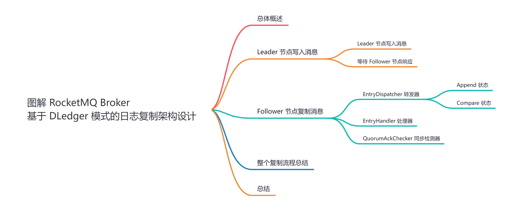
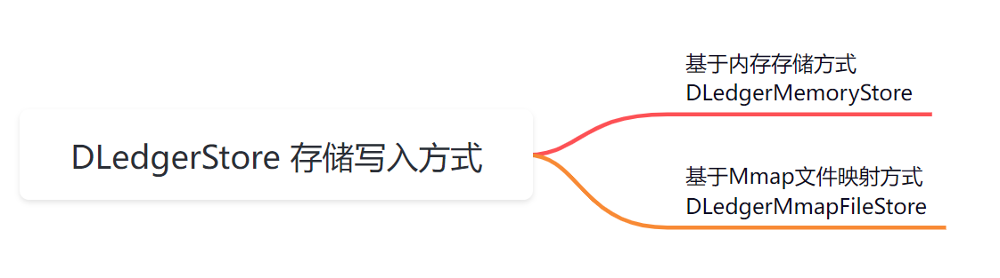
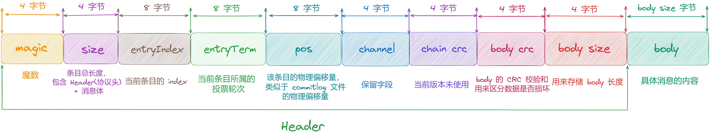
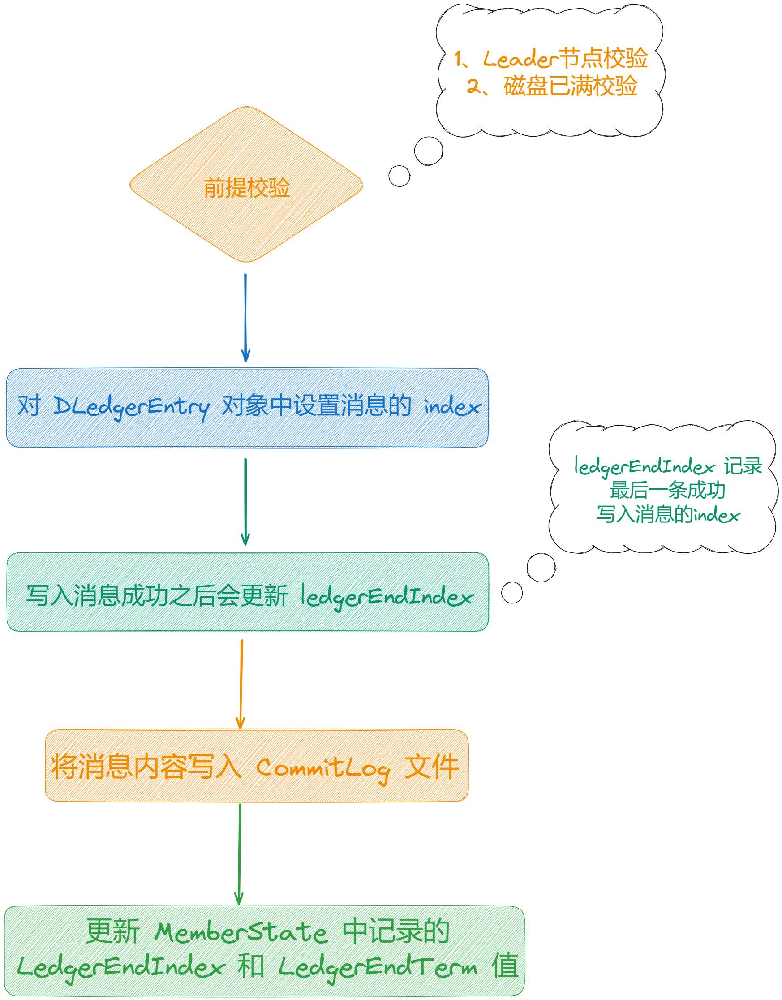
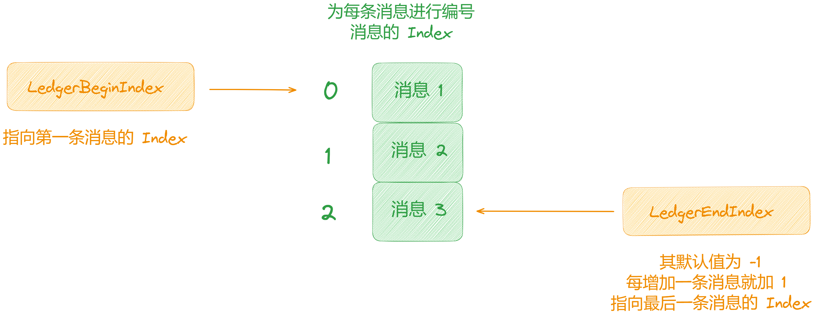
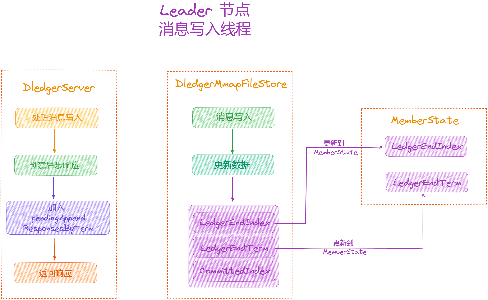
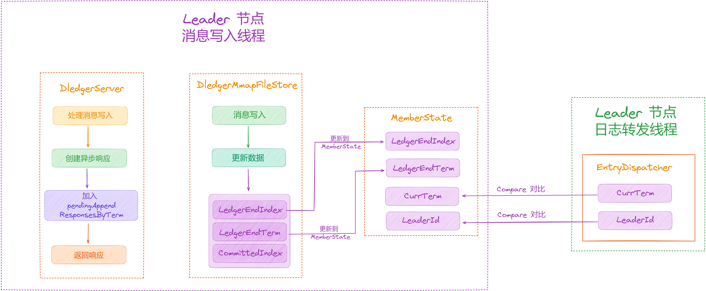
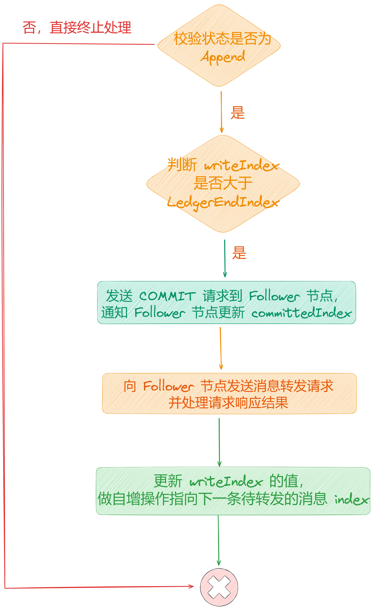
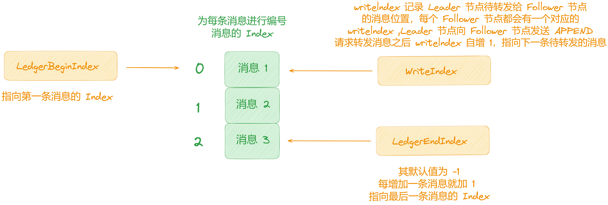
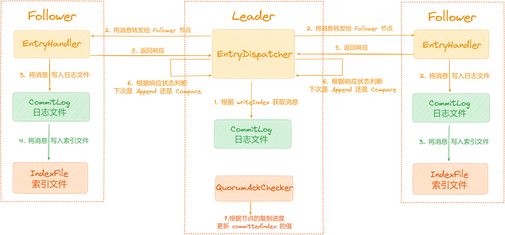

大家好，我是**华仔**, 又跟大家见面了。

从今天开始，我们开始对 RocketMQ 进行相关实现原理进行剖析，今天是第九篇，我们来聊聊 RocketMQ 「**Broker**」基于「**DLedger**」模式下的日志复制架构设计，深度剖析下其内部底层原理设计思想，**下面进入正题**。

  

##   
**01 总体概述**

在 [【原理分析系列第八篇】图解 RocketMQ Broker 基于 DLedger 主从架构设计](https://articles.zsxq.com/id_dbexv86zfhzp.html) 这篇中，我们了解到 RocketMQ 在开启「**DLedger**」模式时会使用「**DLedgerCommitLog**」，其他情况会使用「**CommitLog**」来管理消息的存储。

在「**DLedger**」模式下，会进行「**Leader 选举**」，当完成选举后，消息写入时「**Leader 节点**」还需要将消息转发给「**Follower 节点**」，有超过半的节点响应成功，消息才算写入成功。

接下来我们分别来看下「**Leader 节点**」如何写入消息，以及「**Follower 节点**」是如何复制 「**Leader 节点**」消息的。

##   
**02 Leader 节点写入消息**

如果你读过「**DLedger**」源码的话，可以知道 RocketMQ 「**DLedger**」的存储实现思路与 RocketMQ 原本的存储实现思路类似，在「**DLedger**」模式下总共有两种写入方式，如下图所示：

其中「**DLedgerStore**」是存储抽象类，「**DLedgerMmapFileStore**」基于内存实现的日志存储，「**DLedgerMemoryStore**」基于文件内存映射机制的存储实现。

对于 RocketMQ 本身存储部分主要包含「**存储映射文件**」、「**消息存储格式**」、「**刷盘**」、「**文件加载与文件恢复**」、「**过期文件删除**」等。

在 RocketMQ 中使用「**MappedFile**」来表示「**一个物理理文件**」，而在「**DLedger**」中使用 「**DefaultMmapFile**」来表示「**一个物理文件**」。

在 RocketMQ 中使用「**MappedFile**」来表示「**多个物理理文件**」(逻辑上连续)，而在「**DLedger**」中则使用「**MmapFileList**」。

在 RocketMQ 中使用「**DefaultMessageStore**」来封装「**存储逻辑**」，而在「**DLedger**」中则使用「**DLedgerMmapFileStore**」来封装「**存储逻辑**」。

在 RocketMQ 中使用「**FlushCommitLogService**」来实现 「**CommitLog**」文件的刷盘，而在「**DLedger**」中则使用「**DLedgerMmapFileStore FlushDataService**」来实现 「**CommitLog**」文件的刷盘。

在 RocketMQ 中使用「**DefaultMessageStore CleanCommitLogService**」来实现 「**CommitLog**」过期文件的删除 ，而在「**DLedger**」中则使用「**DLedgerMmapFileStore CleanSpaceService**」来实现 「**CommitLog**」过期文件的删除。

下面我将以「**DLedgerMmapFileStore**」方式为例，来剖析下其消息写入流程，这里不讲源码，具体源码细节会在源码系列中再次进行剖析。

## **2.1 Leader 节点写入消息**

首先 「**Leader 节点**」在写入消息前，会对消息进行构建「**DLedgerEntry**」对象，后续「**本地消息写入**」以及「**转发给 Follower 节点**」都会使用这个对象，其数据存储结构图如下：

  

整个写入流程简化如下：

1.  首先对「**Leader 节点**」和「**磁盘已满**」进行校验。
2.  接着对「**DLedgerEntry**」对象中设置消息的 index 值为「**ledgerEndIndex + 1**」即为每条消息进行了编号 ，这里的「**LedgerEndIndex**」初始值为 「**\- 1**」，后续新增一条消息 「**ledgerEndIndex**」的值也会增 1，「**LedgerEndIndex**」是随着消息的增加而递增的，「**写入成功**」之后会更新「**LedgerEndIndex**」的值，「**LedgerEndIndex**」记录「**最后一条成功写入消息的 index**」。
3.  接着将消息内容写入「**CommitLog**」 文件。
4.  更新「**MemberState**」 中记录的 「**LedgerEndIndex**」 和 「**LedgerEndTerm**」的值。

  

## **2.2 等待 Follower 节点响应**

当消息写入「**Leader 节点**」之后，「**Leader 节点**」需要向「**Follower 节点**」转发日志，这个过程是「**异步处理**」的，会「**开启一个线程**」来进行消息转发，所以这里会先为「**每隔请求**」创建「**异步响应对象**」。

整个处理流程如下：

1.  如果集群中「**只有一个节点**」，设置「**处理状态设置为完成**」并返回响应即可。
2.  如果集群中「**有多个节点**」，由于日志转发是异步进行的，所以会先创建响应对象「**AppendFuture**」，并将创建的对象加入到「**pendingAppendResponsesByTerm**」中，「**pendingAppendResponsesByTerm**」的数据就是在这里加入的，之后有「**另外一个线程**」会处理消息转发，当消息转发成功之后会从这里取出响应对象，并将其「**处理状态设置为完成**」。

## **03 Follower 节点复制消息**

「**Leader 节点**」消息转发与「**Follower 节点**」的处理是「**单独开启线程异步进行**」的，大概有以下几个线程参与：

1.  「**EntryDispatcher 转发器**」：该线程运行在「**Leader 节点**」，用于「**Leader 节点**」向「**Follower 节点**」转发日志，「**Leader 节点**」会为每个「**Follower 节点**」创建一个「**EntryDispatcher**」转发器，一个「**EntryDispatcher**」负责一个节点的日志转发，多个节点之间是并行处理的。
2.  「**EntryHandler 处理器**」：该线程运行在「**Follower 节点**」，用于「**Follower 节点**」处理「**Leader 节点**」发送的日志。
3.  「**QuorumAckChecker 同步检测器**」：该线程运行在「**Leader 节点**」，用于「**Leader 节点**」等待「**Follower 节点**」同步。

下面重点剖析下这三个线程所做的事情。

## **3.1 EntryDispatcher 转发器**

先来看下第一个线程，顾名思义，从名字上可以看出它是用来「**Leader 节点日志转发**」的。它会启动一个线程，用于向「**Follower 节点**」转发日志，这里会做两件事情：

1.  校验节点的角色是否是 Leader 节点。
2.  对消息的转发类型进行判断，有以下两种状态：
3.  APPEND：用来消息追加，用于向 Follower 节点转发消息。
4.  COMPARE：用来消息对比，一般出现在数据不一致的情况下，需要与 Follower 节点的日志进行对比。

在「**EntryDispatcher 转发器**」中会记录向当前的 Term 与 Leader ID，当出现下面三种条件之一情况下都会任务集群可能发生了变化，数据处于「**不一致状态**」，此时会将推送类型更改为「**COMPARE**」。

1.  EntryDispatcher 记录的 Term 与 MemberState 中记录的不一致。
2.  EntryDispatcher 记录的 LeaderId 为空。
3.  EntryDispatcher 记录的 LeaderId 与 MemberState 中记录的不一致。

## **3.1.1 Append 状态**

在「**Append 状态**」下，「**Leader 节点**」将消息转发给「**Follower 节点**」进行同步，「**Leader 节点**」的发送逻辑如下：

  

1.  校验类型是否是「**Append**」，如果否则「**终止处理**」。
2.  判断「**writeIndex**」是否大于「**LedgerEndIndex**」 ，如果大于会发送「**COMMIT**」请求到 Follower 节点，通知 Follower 节点更新「**committedIndex**」 。
3.  「**writeIndex**」为待转发消息的 Index，默认值为 -1。
4.  转发日志的时候使用了一个计数器「**writeIndex**」来记录待转发消息的 index，每次根据「**writeIndex**」的值从日志中取出消息进行转发，转发成后自增更新「**writeIndex**」的值指向下一条数据。
5.  向 Follower 节点发送消息转发请求并处理请求响应结果。
6.  更新「**writeIndex**」的值，做自增操作指向下一条待转发的消息 index。

## **3.1.2 Compare 状态**

当出现数据不一致的情况时，日志转发状态会被置为「**Compare**」，然后「**Leader 节点**」会发送「**Compare**」请求，通知「**Follower 节点**」进行消息对比，找到数据不一致的那条消息的 index。

判断数据不一致的条件如下，「**满足以下之一**」就会被认为「**数据不一致**」：

1.  Leader 节点检查当前「**Term**」与「**memberState**」记录时会发现不一致或者「**LeaderId**」为空或者「**LeaderId**」与「**memberState**」记录的「**LeaderId**」不一致。
2.  Follower 节点在处理消息「**Append**」请求在进行校验的时候发现数据出现了「**不一致**」，会在请求的响应中设置「**不一致**」的状态「**INCONSISTENT\_STATE**」通知 Leader 节点。

## **3.2 EntryHandler 处理器**

「**EntryDispatcher 处理器**」用于「**Follower 节点**」处理「**Leader 节点**」发送的消息请求，主要有四种请求类型，分别为「**Append**」、「**Compare**」、「**Truncate**」、「**Commit**」。

关于这四类型请求，这里就不展开介绍了，会在源码部分详细剖析。

## **3.3 QuorumAckChecker 同步检测器**

「**QuorumAckChecker 同步检测器**」用于「**Leader 节点**」等待「**Follower 节点**」复制日志数据完毕的。「**Leader 节点**」在某个消息的写入得到集群中大多数「**Follower 节点**」的响应之后，会更新 「**committedIndex**」的值，另外「**Follower 节点**」在收到「**Leader 节点**」的「**Append**」或者「**Commit**」请求的时候，也会将请求中设置的「**Leader 节点**」的「**committedIndex**」更新到本地。之后 Broker 停止或者FLUSH 的时候，会将「**LedgerEndIndex**」和「**committedIndex**」写入到「**CheckPoint**」文件进行持久化。

说明下这两个 Index 的作用，如下：

1.  「**LedgerEndIndex**」：Leader 节点或者 Follower 节点最后一条成功写入的消息的 index。
2.  「**committedIndex**」：如果某条消息转发给 Follower 节点之后得到了「**集群中大多数节点的响应成功**」，将对应的 index 记在「**committedIndex**」表示该 index 之前的消息都「**已提交**」，已提交的消息才可以被消费者消费，Leader 节点会将值设置在「**Append**」请求中发送给 Follower 节点进行更新或者发送「**Commit**」请求进行更新。

## **2.3 整个复制流程总结**

  

## **03 总结**

这里，我们一起来总结一下这篇文章的重点。

1、从「**RocketMQ**」架构中抛出了「**DLedger**」模式中「**Leader 节点**」如何写入消息，以及「**Follower 节点**」是如何复制 「**Leader 节点**」消息的。

2、接着带你剖析了「**DLedger**」模式中「**Leader 节点写入消息**」以及 「**Follower 节点复制消息**」的整个流程。

下篇我们来深度剖析「**RocketMQ 5.0 新特性**」，大家期待，我们下期见。