大家好，我是**华仔**, 又跟大家见面了。

今天是第二十二篇，我们来聊聊 RocketMQ 5.x 版本中「**分层存储 Tieredstore 实现原理**」，深度剖析下其内部底层原理设计思想，**下面进入正题**。

本文基于 RocketMQ 最新版本 [5.3.1](https://github.com/apache/rocketmq/tree/rocketmq-all-5.3.1) 内容讲解，这里只讲原理实现，不讲源码剖析，会在下篇中进行深度剖析源码实现。

##   
**01 总体概述**

RocketMQ 诞生于 2012 年，存储节点采用 [shared-nothing](http://shared-nothing/) 的架构读写自己的本地磁盘，单节点上不同 topic 的消息数据会顺序追加写 [CommitLog](http://commitlog/) 再异步构建多种索引，这种架构的**高水平扩展能力和易维护性带来了非常强的竞争力。**

随着存储技术的发展和各种百 G 网络的普及，RocketMQ 存储层的瓶颈逐渐显现:

1.  一方面是数据量的膨胀远快于单体硬件。
2.  另一方面存储介质速度和单位容量价格始终存在矛盾。

在云原生和 Serverless 的技术趋势下，只有通过技术架构的演进才能彻底解决单机磁盘存储空间上限的问题，同时带来更灵活的弹性与成本的下降，做到 「**鱼和熊掌兼得**」。

在设计分级存储时，希望能在以下方面做出一些技术优势：

1.  实时：RocketMQ 在消息场景下往往是「**一写多读**」的，热数据会被缓存在内存中，如果能做到 “准实时” 而非选用基于时间或容量的淘汰算法将数据转储，可以减小数据复制的开销，利于缩短故障恢复的 RTO。读取时产生冷读请求被重定向，数据取回不需要“解冻时间”，且流量会被严格限制以防止对热数据写入的影响。
2.  弹性：shared-nothing 架构虽然简单，缩容或替换节点的场景下待下线节点的数据无法被其他节点读取，节点需要保持相当长时间只读时间，待消费者消费完全部数据，或者执行复杂的迁移流程才能缩容，这种「**扩容很快，缩容很慢**」的形态一点都不云原生，更长久的消息保存能力也会放大这个问题。分级存储设计如果能通过 shared-disk (共享存储) 的方式让在线节点实现代理读取下线节点的数据，既能节约成本也能简化运维。
3.  差异化：廉价介质随机读写能力较差，类 LSM 的结构都需要大量的 compation 来压缩回收空间。在满足针对不同 topic 设置不同的生命周期（消息保留时间，TTL）等业务需求的前提下，结合消息系统数据不可变和有序的特点，RocketMQ 自身需要尽量少的做格式 “规整” 来避免反复合并的写放大，节约计算资源。
4.  竞争力：分级存储还应考虑归档压缩，数据导出，列式存储和交互式查询分析能力等高阶技术演进。

因此，RocketMQ 5.x 的演进目标之一是「**云原生化**」，在云原生和 Serverless 的浪潮下，需要解决 RocketMQ 「**存储层**」存在的四个问题。

1.  数据量膨胀过快，单体硬件无法支撑。
2.  存储的低成本和速度无法兼得。
3.  消息仅支持保留固定的时间。
4.  Topic 的数据与 Broker 绑定，无法迁移。比如在 Broker 缩容的场景下，被削减的 Broker 上的历史数据无法保留。

## **02 分层存储演进过程**

RocketMQ 5.1 中提出了分级存储的方案（[RIP-57](https://github.com/apache/rocketmq/wiki/RIP-57-Tiered-storage-for-RocketMQ)），但当时的版本还未达到生产可用。

[RIP-65](https://github.com/apache/rocketmq/wiki/RIP-65-Tiered-Storage-Optimization) 对之前的分级存储实现进行了重构，修改了「**模型抽象**」、「**线程模式**」、「**元数据管理**」和「**索引文件**」的实现，提升了「**分层存储**」的代码可读性。

[ISSUE #7878](https://github.com/apache/rocketmq/issues/7878) 又对分级存储的代码进行了大量重构，修复已知问题，提升性能，减少资源利用率。

经过几次重构，当前的「**分层存储**」基本已经属于可用的状态。不过官方只提供了「**内存**」和「**本地文件**」两种「**分层存储**」文件段的实现，其他存储介质分级存储的实现需要用户自行扩展来实现。

RocketMQ「**分层存储**」目的在「**不影响热数据读写**」的前提下将数据卸载到其他存储介质中，适用于两种场景：

1.  冷热数据分离：RocketMQ 新近产生的消息会缓存在 page cache 中，我们称之为「**热数据**」；当缓存超过了内存的容量就会有热数据被换出成为「**冷数据**」。如果有少许消费者尝试消费冷数据就会从硬盘中重新加载冷数据到 page cache，这会导致读写 IO 竞争并挤压 page cache 的空间。而将冷数据的读取链路切换为多级存储就可以避免这个问题
2.  延长消息保留时间：将消息卸载到更大更便宜的存储介质中，可以用较低的成本实现更长的消息保存时间。同时多级存储支持为 topic 指定不同的消息保留时间，可以根据业务需要灵活配置消息 TTL。

  
RocketMQ 多级存储对比 Kafka 和 Pulsar 的实现最大的不同是我们使用准实时的方式上传消息，而不是等一个 [CommitLog](http://commitlog%20/) 写满后再上传，主要基于以下几点考虑：

1.  「**均摊成本**」：RocketMQ 多级存储需要将全局 [CommitLog](http://commitlog%20/) 转换为 topic 维度并重新构建消息索引，一次性处理整个 [CommitLog](http://commitlog%20/) 文件会带来性能毛刺。
2.  「**对小规格实例更友好**」：小规格实例往往配置较小的内存，这意味着热数据会更快换出成为冷数据，等待 [CommitLog](http://commitlog/) 写满再上传本身就有冷读风险。采取准实时上传的方式既能规避消息上传时的冷读风险，又能尽快使得冷数据可以从多级存储读取。

## **03 分层存储实现原理**

在剖析「**分层存储 Tieredstore 实现原理**」之前，我们先来看下如何使用 「**分层存储**」。

「**分层存储**」在设计上希望降低用户心智负担：用户无需变更客户端就能实现无感切换冷热数据读写链路，通过简单的修改服务端配置即可具备多级存储的能力，只需以下两步：

1.  修改 Broker 配置，指定使用 [org.apache.rocketmq.tieredstore.TieredMessageStore](http://org.apache.rocketmq.tieredstore.tieredmessagestore/) 作为 [messageStorePlugIn](http://messagestoreplugin/)。
2.  配置你想使用的储存介质，以卸载消息到其他硬盘为例：配置 [tieredBackendServiceProvider](http://tieredbackendserviceprovider%20/) 为 [org.apache.rocketmq.tieredstore.provider.posix.PosixFileSegment](http://org.apache.rocketmq.tieredstore.provider.posix.posixfilesegment/)，同时指定新储存的文件路径：[tieredStoreFilepath](http://tieredstorefilepath/)。

> 可选项：支持修改 tieredMetadataServiceProvider 切换元数据存储的实现，默认是基于 json 的文件存储

  
更多使用说明和配置项可以在 GitHub 上查看「**分层存储**」的 [README](https://github.com/apache/rocketmq/blob/develop/tieredstore/README.md) 介绍。

##   
**3.1 Broker 配置**

要测试「**分层存储**」，需要在 [broker.conf](http://broker.conf/) 中添加如下配置：

\# tiered

messageStorePlugIn=org.apache.rocketmq.tieredstore.TieredMessageStore

tieredBackendServiceProvider=org.apache.rocketmq.tieredstore.provider.PosixFileSegment

\# 路径自己根据情况配置

tieredStoreFilePath=c:\\\\data\\\\rocketmq\\\\node\\\\tieredstore

tieredStorageLevel=FORCE

「**分层存储**」各个配置的含义表如下：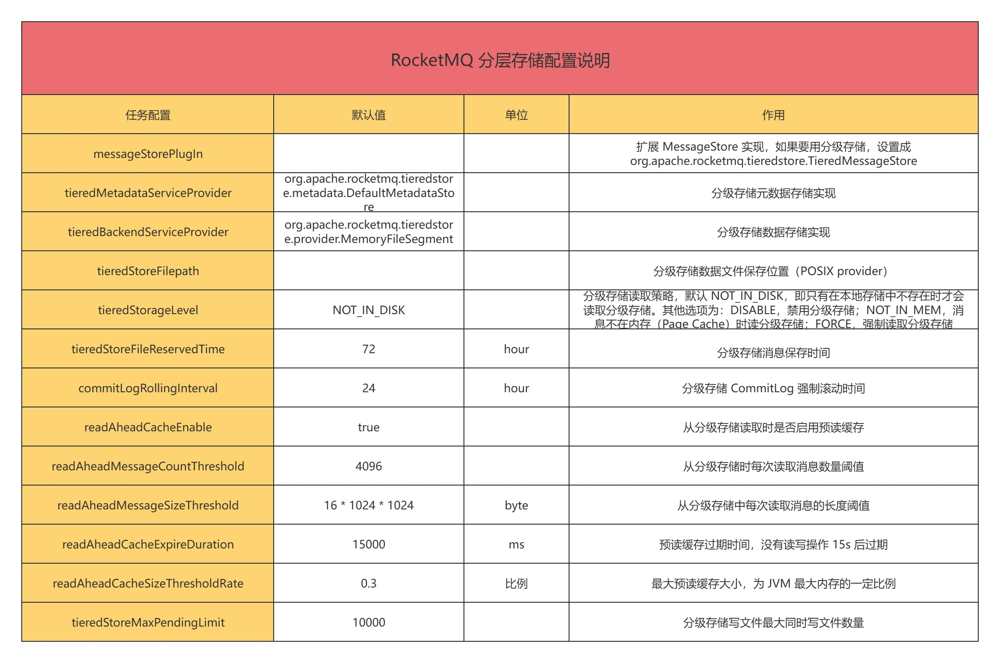

目前 RocketMQ 源码中内置了两种分级存储 FileSegment 的实现:

1.  [MemoryFileSegment](https://github.com/apache/rocketmq/blob/rocketmq-all-5.3.1/tieredstore/src/main/java/org/apache/rocketmq/tieredstore/provider/MemoryFileSegment.java)：使用内存作为二级存储。
2.  [PosixFileSegment](https://github.com/apache/rocketmq/blob/rocketmq-all-5.3.1/tieredstore/src/main/java/org/apache/rocketmq/tieredstore/provider/PosixFileSegment.java)：使用磁盘文件作为二级存储。

他们都是实验性的，这里我们选择 [PosixFileSegment](http://posixfilesegment/)。要实现其他存储介质的分级存储，只需要扩展 [FileSegment](http://filesegment%20/) 实现一个新的 [FileSegment](http://filesegment%20/) 类即可。

##   
**3.2 数据组织结构**

对启用了「**分层存储**」的 Broker 进行压测，等待一段时间后「**分层存储**」目录中的文件如下：

/e/data/rocketmq/node/tieredstore

\`-- \[ 0\] 212d6b50\_DefaultCluster

\`-- \[ 0\] broker-a

| \`-- \[ 0\] rmq\_sys\_INDEX

| \`-- \[ 0\] 0

| \`-- \[ 0\] INDEX

| \`-- \[572M\] cfcd208400000000000000000000

\`-- \[ 0\] topic-tiered

|-- \[ 0\] 0

| |-- \[ 0\] COMMIT\_LOG

| | |-- \[1024M\] 1f329fef00000000001073741775

| | |-- \[1024M\] cfcd208400000000000000000000

| | \`-- \[707M\] dcb86ff200000000002147483550

| \`-- \[ 0\] CONSUME\_QUEUE

| |-- \[ 60M\] 40d473e300000000000104857600

| \`-- \[100M\] cfcd208400000000000000000000

|-- \[ 0\] 1

| |-- \[ 0\] COMMIT\_LOG

| | |-- \[1024M\] 1f329fef00000000001073741775

| | |-- \[1024M\] cfcd208400000000000000000000

| | \`-- \[707M\] dcb86ff200000000002147483550

| \`-- \[ 0\] CONSUME\_QUEUE

| |-- \[ 60M\] 40d473e300000000000104857600

| \`-- \[100M\] cfcd208400000000000000000000

|-- \[ 0\] 2

| |-- \[ 0\] COMMIT\_LOG

| | |-- \[1024M\] 1f329fef00000000001073741775

| | |-- \[1024M\] cfcd208400000000000000000000

| | \`-- \[707M\] dcb86ff200000000002147483550

| \`-- \[ 0\] CONSUME\_QUEUE

| |-- \[ 60M\] 40d473e300000000000104857600

| \`-- \[100M\] cfcd208400000000000000000000

\`-- \[ 0\] 3

|-- \[ 0\] COMMIT\_LOG

| |-- \[1024M\] 1f329fef00000000001073741775

| |-- \[1024M\] cfcd208400000000000000000000

| \`-- \[707M\] dcb86ff200000000002147483550

\`-- \[ 0\] CONSUME\_QUEUE

|-- \[ 60M\] 40d473e300000000000104857600

\`-- \[100M\] cfcd208400000000000000000000

其中索引文件单独存放，每个 Topic 的队列都单独有 [CommitLog](http://commitlog%20/) 和 [ConsumeQueue](http://consumequeue/)：

1.  [CommitLog](http://commitlog%20/) 为消息数据，与本地存储不同，每个 Topic 的队列都拆分单独一组的 [CommitLog](http://commitlog%20/) 文件，每个文件 1G。
2.  [ConsumeQueue](http://consumequeue%20/) 为消费索引。
3.  [INDEX](http://index%20/) 为索引文件，单独目录存放。

##   
**3.3 分层存储底层原理剖析**

我们知道，几乎所有的「**分布式文件系统**」或者「**对象存储**」都提供了「**对象一旦复制成功，即可立即读取**」的强一致语义，就像 CAP 理论中的描述“[Every read receives the most recent write or an error](http://every%20read%20receives%20the%20most%20recent%20write%20or%20an%20error/)”保证了「**分布式存储系统多副本之间的一致性**」。

常见的分布式文件系统有阿里盘古，HDFS，GlusterFS，Ceph 等。对象存储有 Amazon S3，Aliyun OSS，Azure Blob Storage，Google Cloud Storage，OpenStack Swift 等。

他们的简单对比如下：

1.  API 支持：选用对象存储作为后端，通常无法像 HDFS 一样提供充分的 POSIX 能力支持，对于非 KV 型的操作往往存在一定性能问题，例如列出大量对象时需要数十秒，而在分布式文件系统中这类操作只需要毫秒甚至微秒。如果选用对象存储作为后端，弱化的 API 语义要求消息系统本身能够有序管理好这些对象的元数据。
2.  容量与水平扩展：对于云产品或者大规模企业的存储底座来说，以 HDFS 为例，当集群节点超过数百台，文件达到数亿量级以上时，NameNode 会产生性能瓶颈。一旦底层存储由于容量可用区等因素出现多套存储集群，这种 “本质复杂度” 在一定程度上削弱了 shared-disk 的架构简单性，并将这种复杂度向上传递给应用，影响消息产品本身的多租，迁移，容灾设计。典型的情况就是大型企业为了减少爆炸半径，往往会部署多套 K8s 并定制上层的 Cluster Federation（联邦）。
3.  成本：以国内云厂商官网公开的典型目录价为例：
4.  本地磁盘，无副本 0.06-0.08 元/GB/月
5.  云盘，SSD 1元/GB/月，高效云盘 0.35 元/GB/月
6.  对象存储单 AZ 版 0.12 元/GB/月，多 AZ 版本 0.15 元/GB/月，低频 0.08 元/GB/月
7.  分布式文件系统，如盘古 HDFS 接口，支持进一步转冷和 EC。
8.  生态链：对象存储和类 HDFS 都有足够多的经过生产验证的工具，监控报警层面对象存储的支持更产品化。

### **3.3.1 分层存储技术架构选型**

在「**分层存储**」的方案中一个重要的选择是「**直写**」还是「**转写**」。

  
多年来 RocketMQ 运行在「**本地存储**」的系统中，本地磁盘通常 IOPS 较高，成本较低但可靠性较差，大规模的生产实践中遇到的问题包括但不限于「**垂直扩容较难**」，「**坏盘**」，「**宿主机故障**」等。

1.  直写：用高可用的存储或分布式文件系统直接替换「**本地块存储**」，其优点是「**池化存储**」。
2.  例如使用云盘多点挂载（分布式块存储形态，透明 rdma）或者直写分布式文件系统（下文简称 DFS）作为存储后端，此时主备节点可以共享存储，broker 的高可用中的数据流同步简化为只同步位点，在很大程度上减化了 RocketMQ 高可用的实现。
3.  转写：热数据使用容量小的「**本地块存储**」高速介质先顺序写，压缩之后转储到更廉价的存储系统中。其优点是「**降低冷数据**」的长期存储成本。
4.  对于大部分数据密集型应用，出于故障恢复的考虑必须「**实时写日志**」，意味着无法对数据很好的进行「**攒批压缩**」，如果仅使用廉价介质，会带来更高的延迟以及更多的内存使用，无法满足生产需要。

  
其中「**直写**」的目的是「**池化存储**」，「**转写**」的目的是「**降低数据的长期保存成本**」，最理想的终态可以是两者的结合，RocketMQ 自己来做「**数据转冷**」。因为消息系统自身对如何更好的「**压缩数据**」和「**加速读取**」的细节更了解，在「**数据转冷**」的过程中能够做一些消息系统内部的格式变化来加速冷数据的读取，减少 I/O 次数、配置不同的 TTL 等。

  
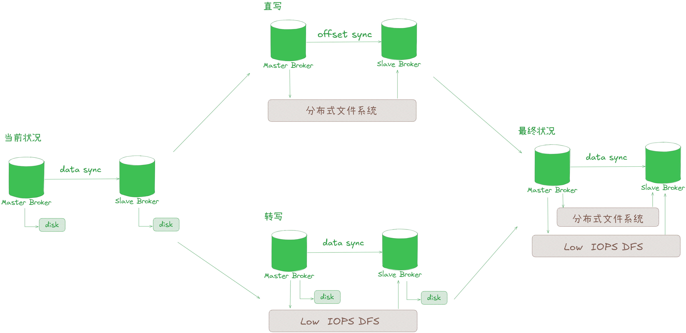

那么「**分层存储**」是一个最终的完美解决方案吗？

其实理想很美好，让我们来看一组典型生产场景的数据。RocketMQ 在使用「**块存储**」时，存储节点存储成本大约会占到 30%-50%。开启「**分层存储**」时，由于数据转储会产生一定的计算开销，主要包括「**数据复制**」，「**数据编解码**」，「**CRC 校验**」等，不同场景下计算成本会上升 10%-40%，通过换算我们发现「**存储节点**」的总体拥有成本节约了 30% 左右。

目前的「**分层存储**」方案考虑到商业和开源技术架构的一致性，选择先实现「**转写**」模式。「**热数据**」的存储成本中随着存储空间显著减小，这能够更直接的降低「**存储成本**」，在我们充分处理好当前的「**转写**」逻辑时再将「**热数据**」的 「**WAL 机制**」和「**索引**」构建移植过来，实现基于分布式系统的「**直写**」技术，这种分阶段迭代会更加简明高效，这个阶段我们更加关注通用性和可用性。

具体包括以下一些考虑：

1.  「**成本**」：将大部分冷数据卸载到更便宜的存储系统中后，热数据的存储成本可以显著减小，更直接的降低存储成本。
2.  「**可移植性**」：直写分布式文件系统通常需要依赖特定 SDK，配合 RDMA 等技术来降低延迟，对应用不完全透明，运维、人力、技术复杂度都有一定上升。保留成熟的本地存储，只需要实现与其他存储后端的适配层就可以轻松切换多种存储后端，不针对 IaaS 做深度绑定在可移植性上会有一定优势。
3.  「**延迟与性能**」：直写模式下存储紧密结合，应用层 ha 的简化也能降低延迟（写多数派成功才被消费者可见）。通常分布式文件系统跨可用区部署，消息写多数派成功才能被消费，存在跨可用区的延迟。无论是直接写云盘或者本地磁盘（同区域）的延迟会小于跨可用区的延迟，其存储延迟在热数据读写收发链路的情况下也不是瓶颈。
4.  「**可用性**」： 存储后端往往都有复杂的容错和故障转移策略，直写与转写模式在公有云下可用性都满足诉求。考虑到转写模式下系统是弱依赖二级存储的，更适合开源与非公共云场景。

我们为什么不进一步压缩块存储的磁盘容量，做到几乎极致的成本呢？

事实上，在「**分层存储**」的场景下，一味的追求过小的本地磁盘容量价值不大。其主要有以下原因：

1.  「**故障冗余**」，消息队列作为基础设施中重要的一环，稳定性高于一切。对象存储本身可用性较高，如果遇到网络波动等问题时，使用对象存储作为主存储，**非常容易产生反压导致热数据无法写入，而热数据通常属于在线生产业务，这对于可用性的影响是致命的**。
2.  「**过小的本地磁盘**」，在价格上没有明显的优势**。**众所周知，云计算是注重普惠和公平的，如果选用 50G 左右的块存储，又需要等价 150G 的 ESSD 级别的块存储能提供的 IOPS，则其单位成本几乎是普通块存储的数倍。
3.  本地磁盘容量充足的情况下，上传时能够更好的通过 「**攒批**」来减少对象存储的请求费用。读取时能够对“温热” 数据提供更低的延迟和节约读取成本。
4.  仅使用对象存储，难以对齐 RocketMQ 当前已经存在的丰富特性**，**例如用于问题排查的随机消息索引，定时消息特性等，如果为了节约少量成本，极大的削弱基础设施的能力，反向要求业务方自建复杂的中间件体系是得不偿失的。

### **3.3.2 分层存储数据模型实现**

### **3.3.2.1 模型与抽象**

RocketMQ 本地存储数据模型如下：

1.  MappedFile：单个真实文件的句柄，也可以理解为 handle 或者说 fd，通过 mmap 实现内存映射文件。是一个 AppendOnly 的定长字节流语义的 Stream，支持字节粒度的追加写、随机读。每个 MappedFile 拥有自己的类型，写位点，创建更新时间等元数据。
2.  MappedFileQueue：可以看做是零个或多个定长 MappedFile 组成的链表，提供了流的无边界语义。Queue 中最多只有最后一个文件可以是 Unseal 的状态（可写）。前面的文件都必须都是 Sealed 状态（只读），Seal 操作完成后 MappedFile 是 immutable（不可变）的。
3.  CommitLog：MappedFileQueue 的封装，每个 “格子” 存储一条序列化的消息到无界的流中。
4.  ConsumeQueue：顺序索引，指向 CommitLog 中消息在 FileQueue 中的偏移量（offset）。

关于这几个组件的源码剖析如下：

[【Broker端源码分析系列第十八篇】图解 RocketMQ 源码之 Broker 端三大底层存储文件剖析](https://articles.zsxq.com/id_nwm33ku2srs5.html)

[【Broker端源码分析系列第十九篇】图解 RocketMQ 源码之 Broker 端CommitLog存储架构设计剖析](https://articles.zsxq.com/id_k1dlpc0wpe8p.html)

[【Broker端源码分析系列第二十篇】图解 RocketMQ 源码之Broker端MappedFile底层架构设计剖析](https://articles.zsxq.com/id_o1mnfdtpq25o.html)

[【Broker端源码分析系列第二十七篇】图解 RocketMQ 源码之Broker端 ConsumeQueue 架构设计](https://articles.zsxq.com/id_wfu6wxlbedo6.html)

底层存储结构拆解图如下：

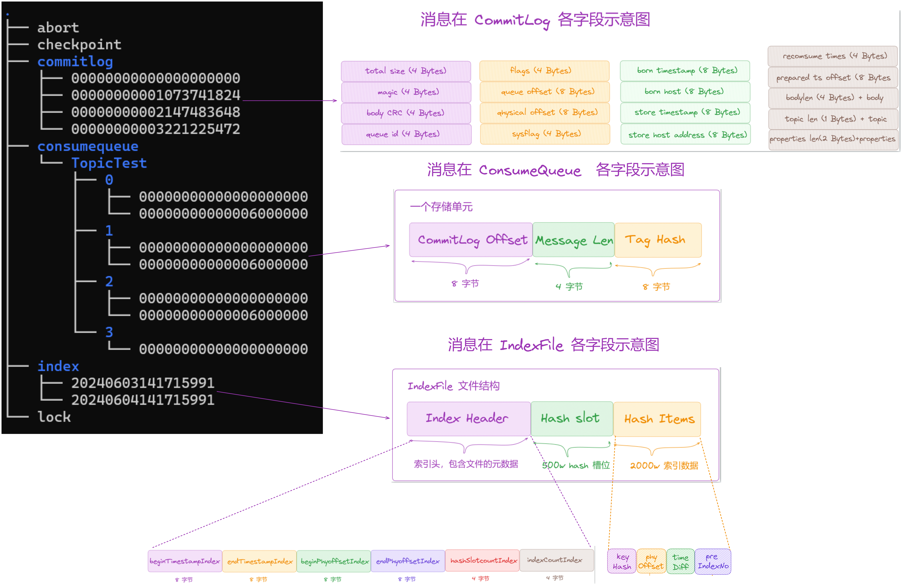

底层存储数据流转图如下：

  
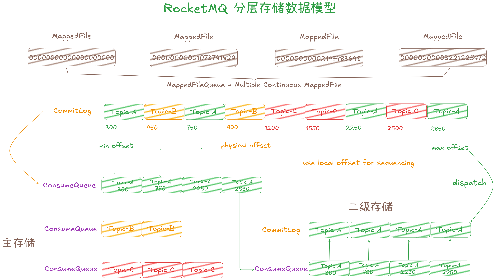

RocketMQ 「**分层存储**」提供的数据模型和本地模型类似，改变了 [CommitLog](http://commitlog%20/) 和 [ConsumeQueue](http://consumequeue%20/) 的概念：

1.  TieredFileSegment：和 MappedFile 类似，描述一个分层存储系统中文件的句柄。
2.  TieredFlatFile：和 MappedFileQueue 类似。
3.  TieredCommitLog 和本地 CommitLog 混合写不同，按照单个 Topic 单个队列的粒度拆分多条 CommitLog。
4.  TieredConsumeQueue 指向 TieredCommitLog 偏移量的一个索引，是严格连续递增的。实际索引的位置会从指向的 CommitLog 的位置改为 TieredCommitLog 的偏移量。
5.  CompositeFlatFile：组合 TieredCommitLog 和 TieredConsumeQueue 对象，并提供概念的封装。

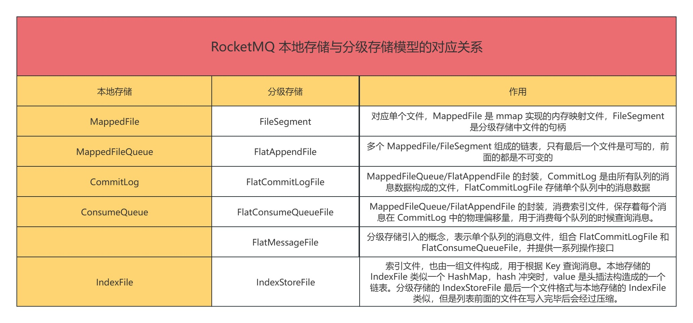

### **3.3.2.2 消息上传流程**

RocketMQ 的存储实现了一个 [Pipeline](http://pipeline/)，类似于拦截器链，Netty 的 handler 链，读写请求会经过这个 [Pipeline](http://pipeline%20/) 的多个处理器。

RocketMQ「**分层存储**」的消息上传是由 [Dispatch](http://dispatch/) 机制触发的：[Dispatcher](http://dispatcher%20/) 的概念是指为写入的数据「**构建索引**」，在「**分层存储**」模块初始化时，会创建 [TieredDispatcher](http://tiered%20dispatcher/) 注册为 [CommitLog](http://commitlog%20/) 的 [dispatcher](http://dispatcher%20/) 链的一个处理器。这样每当有消息发送到 Broker 会调用 [TieredDispatcher](http://tiered%20dispatcher/) 进行消息分发。[TieredDispatcher](http://tiered%20dispatcher/) 将该消息写入到 [upload buffer](http://upload%20buffer/) 后立即返回成功。整个 [dispatch](http://dispatch/) 流程中不会有任何阻塞逻辑，确保不会影响本地 [ConsumeQueue](http://consumequeue/) 的构建。

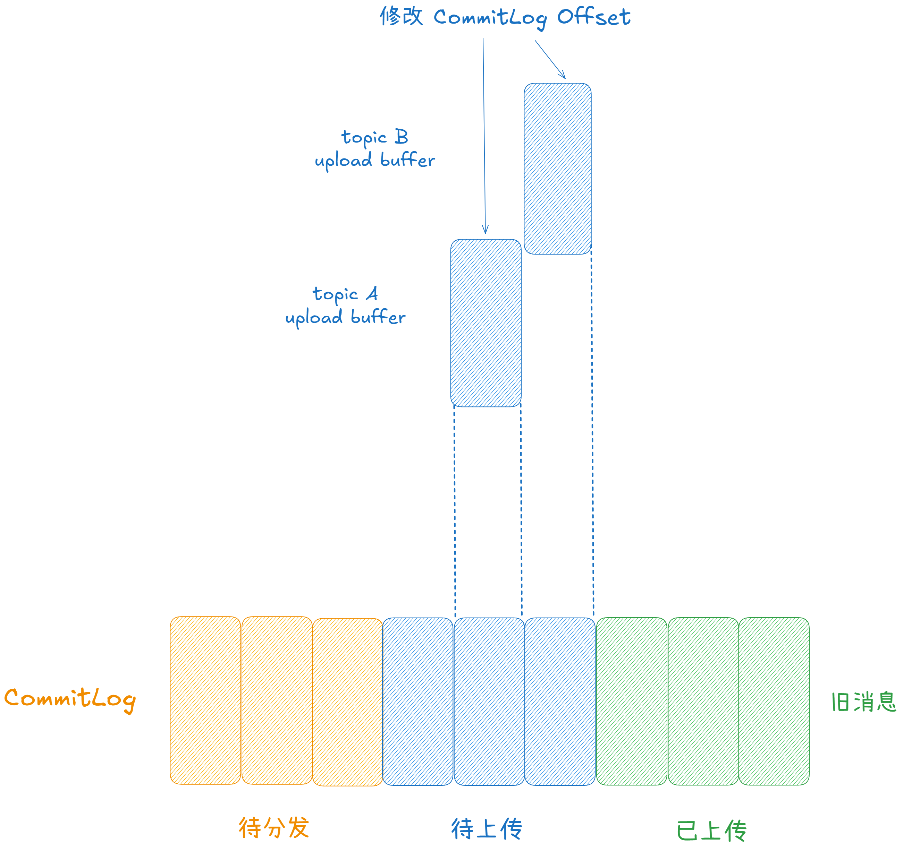

[TieredDispatcher](http://tiereddispatcher%20/) 写入 [upload buffer](http://upload%20buffer/) 的内容仅为消息的引用，不会将消息的 body 读入内存。因为「**分层存储**」以 [queue](http://queue%20/) 维度来构建 [CommitLog](http://commitlog/)，此时需要重新生成 [commitLog offset](http://commitlog%20offset%20/) 字段。

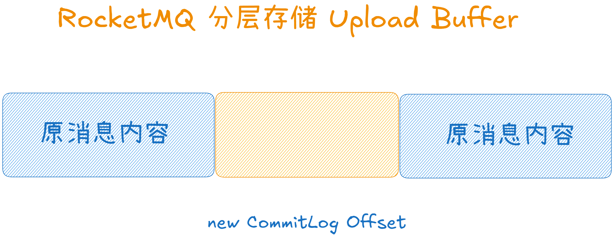

触发 [upload buffer](http://upload%20buffer/) 上传时读取到每条消息的 [commitLog offset](http://commitlog%20offset/) 字段时采用拼接的方式将新的 [offset](http://offset%20/) 嵌入到原消息中。

下面我们来追踪单条消息进入存储层的流程：

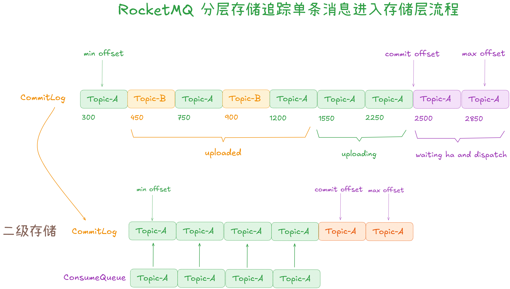

1.  消息被「**顺序追加**」到本地 [commitLog](http://commitlog%20/) 并更新本地 [max offset](http://max%20offset/)（图中粉色部分），为了防止宕机时多副本产生「**读摆动**」，多副本中多数派的最小位点会作为「**低水位**」被确认，这个位点被称为 [commit offset](http://commit%20offset/)（图中 2500 为止）。换句话说，[commit offset](http://commit%20offset/) 与 [max offset](http://max%20offset/) 之间的数据是正在等待多副本同步的。
2.  当 [commit offset >= message offset](http://commit%20offset%20=%20message%20offset/) 之后，消息会被上传到「**二级存储**」的 [commitLog](http://commitlog%20/) 中（绿色部分）并更新这个队列的 [max offset](http://max%20offset/)。
3.  消息的索引会被追加到这个队列的 [consume queue](http://consume%20queue/) 中并更新 [consume queue](http://consume%20queue/) 中的 [max offset](http://max%20offset/)。
4.  一旦 [commitLog](http://commitlog%20/) 中缓存大小超过阈值或者等待达到一定时间，消息的缓存将被上传至 [commitLog](http://commitlog/)，之后才会将索引信息提交，这里有一个隐含的数据依赖机制：使索引数据晚于原始数据更新。这个机制保证了所有 [consume queue](http://consume%20queue/) 索引中的数据都能在 [commitLog](http://commitlog/) 中找到。宕机场景下，分层存储中的 [commitLog](http://commitlog/) 可能会重复构建，此时没有 [consume queue](http://consume%20queue/) 指向这段数据。由于文件本身还是被使用 Queue 的模型管理的，使得整段数据在达到 TTL 时能被回收，此时并不会产生数据流的「**泄漏**」。
5.  当索引上传完成的时候，更新「**分层存储**」中的 [commit offset](http://commit%20offset/)（棕色部分被提交）。
6.  系统重启或者宕机时，会选择多个 [dispatcher](http://dispatcher%20/) 的最小位点向 [max offset](http://max%20offset/) 重新分发，确保数据不丢失。

在实际执行中，上传部分由「**三组线程**」协同来完成这项工作的，如下图：

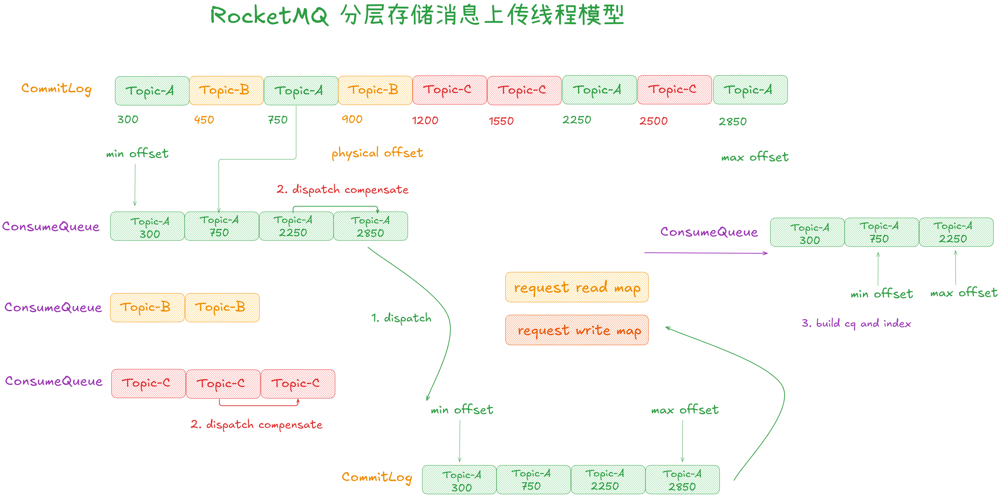

1.  「**store dispatch 线程**」：由于该线程负责本地 [comsumequeue](http://comsumequeue%20/) 的分发，不能长时间阻塞该线程，否则会影响消息进入本地存储的“可见性延迟”。因此 [store dispatch](http://store%20dispatch/) 每次只会尝试对拆分后的文件短暂加锁，如果加锁成功，将消息数据放入拆分后的 [commitLog](http://commitlog%20/) 文件的缓冲区则立即退出，该操作不会阻塞。如果获取锁失败则立即返回。
2.  「**store compensate 线程组**」: 负责对本地 [comsumequeue](http://comsumequeue/) 进行定时扫描，当写入压力较高时，步骤 1 可能获取锁失败，这个环节会批量的将落后的数据放入 [commitLog](http://commitlog/) 中。原始数据被放入后会将 [dispatch request](http://dispatch%20request/) 放入 [write map](http://write%20map/)。
3.  「**build cq index 线程**」: [write map](http://write%20map/) 和 [read map](http://read%20map%20/) 是一个双缓冲队列的设计，该线程负责将 [read map](http://read%20map/) 中的数据构建 [comsumequeue](http://comsumequeue/) 并上传。如果 [read map](http://read%20map/) 为空，则交换缓冲区，这个双缓冲队列在多个线程共享访问时减少了互斥和竞争操作。

各类存储系统的「**缓冲攒批**」策略大同小异，而线上的 topic 写入流量往往是存在「**热点**」的，根据经典的二八原则，RocketMQ 「**分层存储**」模块目前采用了「**达到一定数据量**」，「**达到一定时间**」两者取「**其小**」的合并方式。

这种方式简单可靠，对于大流量的 topic 很容易就可以达到「**批次最小数量**」，对于流量较低的 topic 也不会占用过多的内存，从而减少了对象存储的请求数，其开销主要包括 [restful](http://restful%20/) 协议请求头，签名和传输等。「**攒批**」的逻辑仍然存在较大的优化空间，例如 IOT，数据分片同步等各个 topic 流量较为平均的场景使用类似「**滑动窗口**」的加权平均算法，或者基于信任值的流量控制策略可以更好的权衡延迟和吞吐。

### **3.3.2.3 消息上传进度控制**

每个队列都会有两个关键位点控制上传进度：

1.  [dispatch offset](http://dispatch%20offset/)：已经写入缓存但是未上传的消息位点。
2.  [commit offset](http://commit%20offset/)：已上传的消息位点。

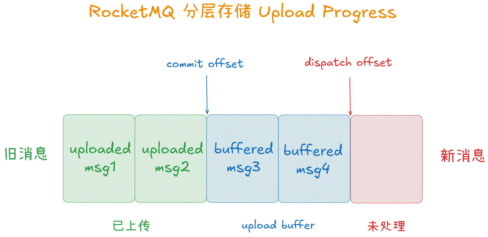

对比消费者来说，[dispatch offset](http://dispatch%20offset/) 相当于拉取消息的位点，[commit offset](http://commit%20offset/) 相当于确认消费的位点。[commit offset](http://commit%20offset/) 到 [dispatch offset](http://dispatch%20offset/) 之间的部分相当于已拉取但还未消费的消息。

### **3.3.2.4 随机索引重排**

各种业务场景下，我们总是选择通过「**读写扩散**」, 选择通过格式的变化，将数据额外转储到一份性能更好或者更廉价的存储，或者通过读扩散减少数据冗余（减少索引提高了平均查询代价）。

RocketMQ 会先在「**内存中**」构建基于 hash 的持久化索引文件 [IndexFile](http://indexfile/)（非 AppendOnly），再通过 [mmap](http://mmap%20/) 异步的将数据持久化到磁盘。这个文件是为了支持用户通过 key，消息 ID 等信息来追踪一条消息。

对于单条消息会先计算 [hash(topic#key) % slot\_num](http://hash\(topic/#key\)%20%%20slot_num) 选择 [hash slot](http://hash%20slot/) (黄色部分) 作为随机索引的指针，对象索引本身会附加到 [index item](http://index%20item/) 中，[hash slot](http://hash%20slot/) 使用「**哈希拉链**」的方式解决冲突，这样便形成了一条当前 slot 按照时间存入的倒序的链表。但是不难发现查询时需要多次随机读取链表节点。

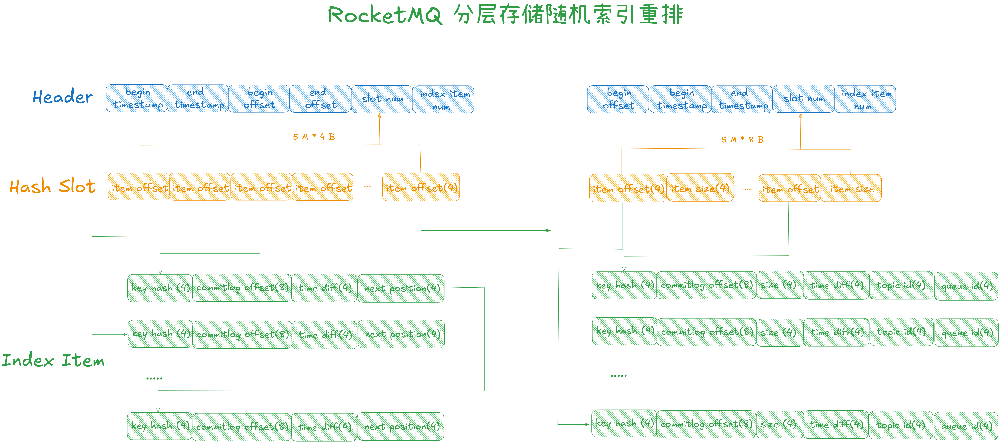

由于冷存储的 IOPS 代价是非常昂贵的，在设计上我们希望可以面向查询进行优化。新的文件结构类似于维护没有 GC 和只有一次 compation 的 LSM 树，数据结构的调整如下：

1.  等待本地一个 [IndexFile](http://indexfile%20/) 完全写满，规避修改操作，在高 IOPS 的存储介质上异步 [compation](http://compation/)，完成后删除原来的文件。
2.  从冷存储查询延迟高，而单次返回的数据量大小（不太大的场景）并不会明显改变延迟。[compation](http://compation%20/) 时优化数据结构，做到用一次查询连续的一段数据替换多次随机点查。
3.  [hash slot](http://hash%20slot/) 的指向的 [List<IndexItem>](http://listindexitem/) 是连续的，查询时可以根据 [hash slot](http://hash%20slot/) 中的 [item offset](http://item%20offset%20/) 和 [item size](http://item%20size/) 一次取出所有 [hashcode](http://hashcode%20/) 相同的记录并在内存中过滤。

### **3.3.2.5 消息读取流程**

先来看下读策略流程。

读取是写入的逆过程，优先从哪里取回想要的数据必然存在很多的工程考虑与权衡。如图所示，近期的数据被缓存在内存中，稍久远的数据存在与「**内存**」和「**二级存储**」上，更久远的数据仅存在于「**二级存储**」。当被访问的数据存在于内存中，由于内存的速度快速存储介质，直接将这部分数据通过网络写会给客户端即可。如果被访问的数据如图中 request 的指向，存在于本地磁盘又存在于「**二级存储**」，此时应该根据一二级存储的特性综合权衡请求落到哪一层。

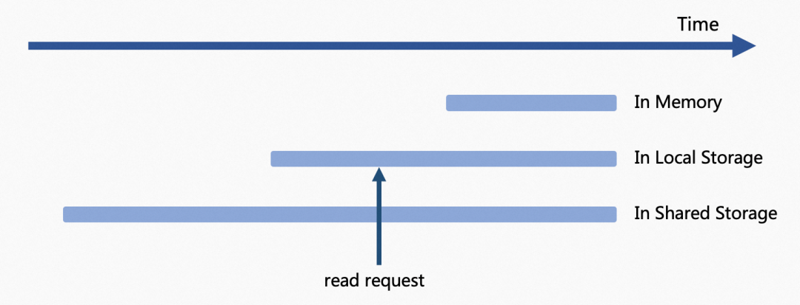

有两种典型的想法：

1.  数据存储被视为多级缓存，越上层的介质随机读写速度快，请求优先向上层存储进行查询，当内存中不存在了就查询本地磁盘，如果还不存在才向二级存储查询。
2.  由于在转冷时主动对数据做了 compation，从二级存储读取的数据是连续的，此时可以把更宝贵一级存储的 IOPS 留给在线业务。

RocketMQ 的「**分层存储**」将这个选择抽象为了读取策略，通过请求中的逻辑位点（[queue offset](http://queue%20offset/)）判断数据是否从多级存储不同区间中读取消息，根据配置（[tieredStorageLevel](http://tieredstoragelevel/)）有以下四种策略：

1.  DISABLE：禁止从多级存储中读取消息，可能是数据源不支持。
2.  NOT\_IN\_DISK：不在一级存储 [DefaultMessageStore](http://defaultmessagestore/) 的的消息都会从多级存储中读取。
3.  NOT\_IN\_MEM：不在内存 page cache 中的消息即冷数据从多级存储读取。
4.  FORCE：强制所有消息从多级存储中读取，目前仅供测试使用。

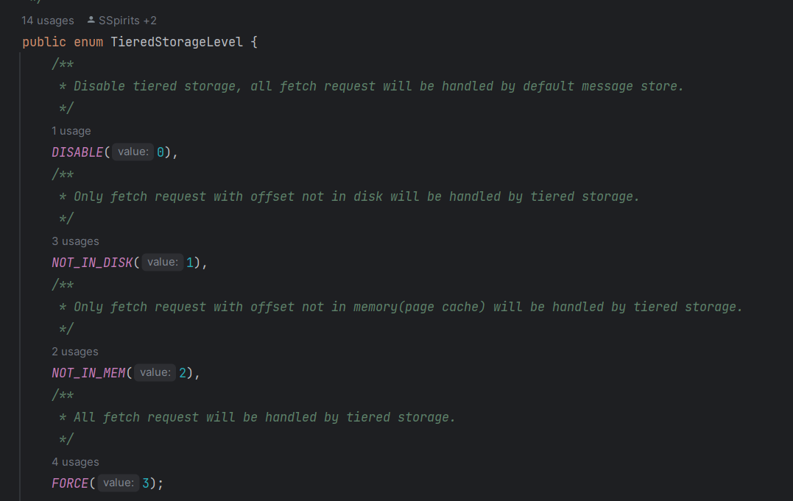

接着再来看下预读缓存。

[TieredMessageFetcher](http://tieredmessagefetcher%20/) 是 RocketMQ 「**分层存储**」中取回数据的具体实现。为了加速从「**二级存储**」读取的速度和减少整体上对「**二级存储**」请求数，采用了「**预读缓存**」的设计：

即 [TieredMessageFetcher](http://tieredmessagefetcher%20/) 读取消息时会预读更多的消息数据暂存在「**预读缓存**」中，「**预读缓存**」的设计参考了 TCP Tahoe 拥塞控制算法，每次预读的消息量类似拥塞窗口采用加法增、乘法减的流量控制机制。

1.  加法增：从最小窗口开始，每次增加等同于客户端 batchSize 的消息量。
2.  乘法减：当缓存的消息超过了缓存过期时间仍未被全部拉取，此时一般是客户端缓存满，消息数据反压到服务端，在清理缓存的同时会将下次预读消息量减半。
3.  此外，在客户端消费速度较快时，向二级存储读取的消息量较大，此时会使用分段策略并发取回数据。

预读缓存支持在读取消息量较大时分片并发请求，以取得更大带宽和更小的延迟某个 topic 消息的预读缓存由消费这个 topic 的所有 group 共享，缓存失效策略为：

1.  所有订阅这个 topic 的 group 都访问了缓存。
2.  到达缓存过期时间。

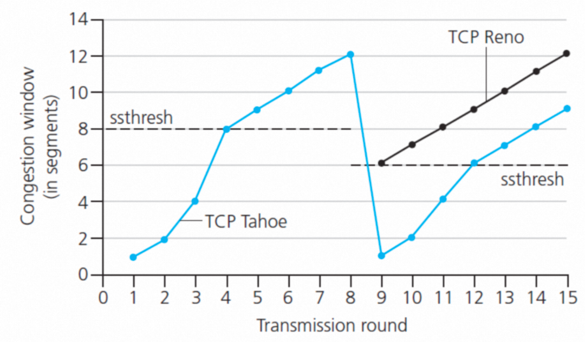

### **3.3.2.6 故障恢复**

前面介绍消息上传进度由 [commit offset](http://commit%20offset/) 和 [dispatch offset](http://dispatch%20offset/) 来控制。「**分层存储**」会为每个 topic、queue、fileSegment 创建元数据并持久化这两种位点。当 Broker 重启后会从元数据中恢复，继续从 [commit offset](http://commit%20offset/) 开始上传消息，之前缓存的消息会重新上传并不会丢失。

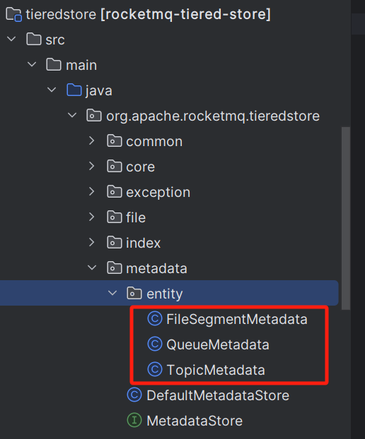

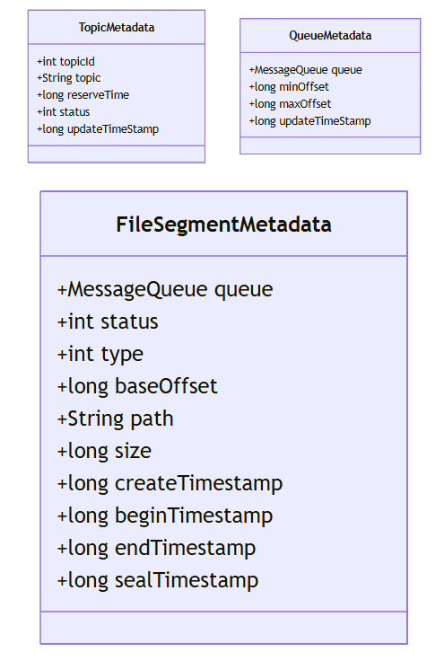

### **3.3.2.7 定时消息的分层存储**

除了普通消息，RocketMQ 支持设置未来几十天的长定时消息，而这部分数据严重挤占了「**热数据**」的存储空间。

RocketMQ 实现了基于「**本地文件系统**」的时间轮，整体设计如左侧所示。

单节点上所有的定时消息会先写入 [rmq\_sys\_wheel\_timer](http://rmq_sys_wheel_timer%20/) 的系统 topic，进入「**时间轮**」，出队后这些消息的 topic 会被还原为真实的业务 topic。

「**从磁盘读取数据**」和「**将消息索引放入时间轮**」这两个动作涉及到 I/O 与计算，为了减少这两个阶段的「**锁竞争**」引入了 [Enqueue](http://enqueue%20/) 作为中转的「**等待队列**」，[EnqueuGet](http://enqueuget%20/) 和 [EnqueuePut](http://enqueueput%20/) 分别负责写入和读取数据，这个设计简单可靠。

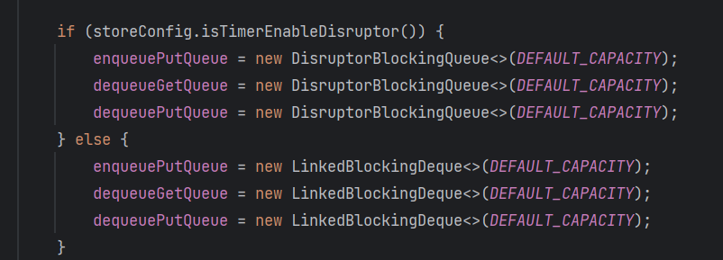

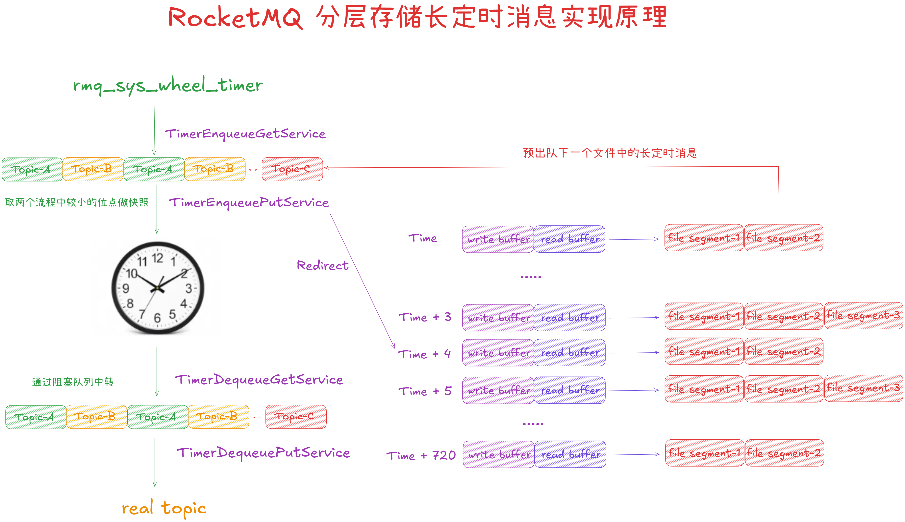

所有的消息都会进入时间轮，这也是挤占存储空间的根本原因。

1.  写入时，RocketMQ 的「**分层存储**」定时消息针对 [EnqueuePut](http://enqueueput/) 做了一个分流，对于大于当前时间数小时的消息会被写入到基于「**分层存储**」的 [IndexFile](http://indexfile/) 文件中，我们维护了一个 [ConcurrentSkipListMap<Long /\* timestamp \*/, IndexFile> timeStoreTable；](http://concurrentskiplistmaplong%20/*%20timestamp%20*/,%20IndexFile%20timeStoreTable%EF%BC%9B) 每间隔 1 小时，设置一个 [IndexFile](http://indexfile/) ，对于 T+n 至 T+n+1 的定时消息，会先被混合追加到 T+n 所对应的文件中。
2.  读取时，当前时间 + 1 小时的消息将被提前出队，这些消息又会重新进入本地 [TimerStore](http://timerstore/) 的系统 topic 中。此时由于定时时间都是将来一小段时间的，他们不再会进入时间轮的结构中。

在这个设计上有一些工程性的考虑：

1.  [timerStoreTable](http://timerstoretable%20/) 中的 Key 很多，会不会让「**分层存储**」上的数据碎片化？分布式文件系统底层一般使用类 LSM 结构，RocketMQ 只关心 LBA 结构（逻辑块地址），可以通过优化 [Enqueue](http://enqueue%20/) 的 buffer 让写分级存储时数据达到攒批的效果。
2.  可靠的位点，[Enqueue](http://enqueue%20/) 的「**时间轮**」和 [timerStoreTable](http://timerstoretable%20/) 可以共用一个 [commit offset](http://commit%20offset/)。对于单条消息来说，只要它进入时间轮或者被上传成功，我们就认为一条消息已经持久化了。由于更新到二级存储本身需要一些攒批缓冲的过程，会延迟 [commit offset](http://commit%20offset/) 的更新，但是这个缓冲时间是可控的。
3.  我们发现偶尔本地存储转储到「**二级存储**」会较慢，使用双缓冲队列实现读写分离（如图片中绿色部分）此时消息被放入写缓存，随后转入读缓存队列，最后进入上传流程。

参考资料：

1.  [Tiered storage README](https://github.com/apache/rocketmq/blob/develop/tieredstore/README.md)
2.  [RIP 57 Tiered storage for RocketMQ](https://github.com/apache/rocketmq/wiki/RIP-57-Tiered-storage-for-RocketMQ)
3.  [RIP 65 Tiered Storage Optimization](https://github.com/apache/rocketmq/wiki/RIP-65-Tiered-Storage-Optimization)
4.  [Refactoring and improving Tiered Storage Implementation](https://github.com/apache/rocketmq/issues/6633)
5.  [\[RIP-65\] Support efficient random index for massive messages](https://github.com/apache/rocketmq/issues/7545)
6.  [\[Enhancement\] Performance Improvement and Bug Fixes for the Tiered Storage Module](https://github.com/apache/rocketmq/issues/7878)