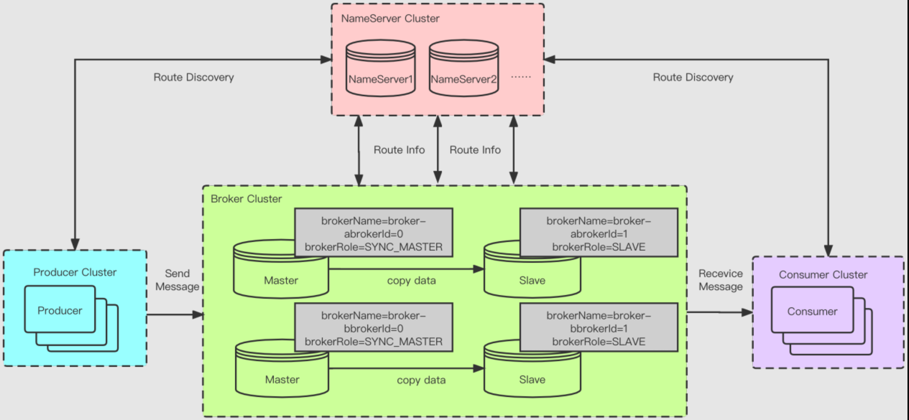
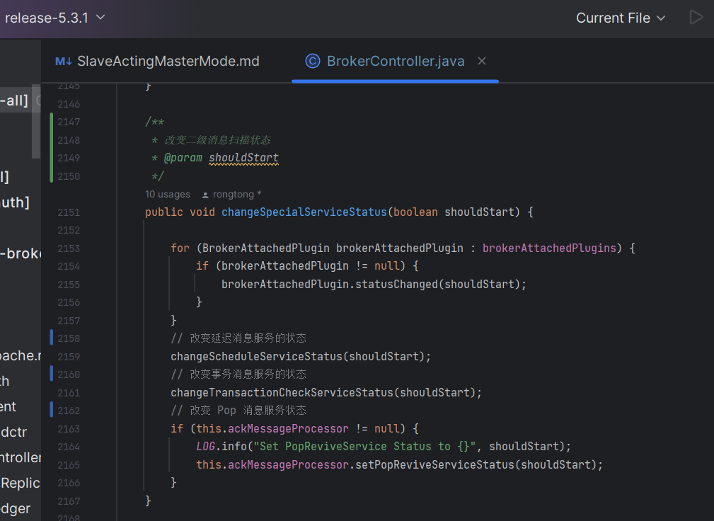
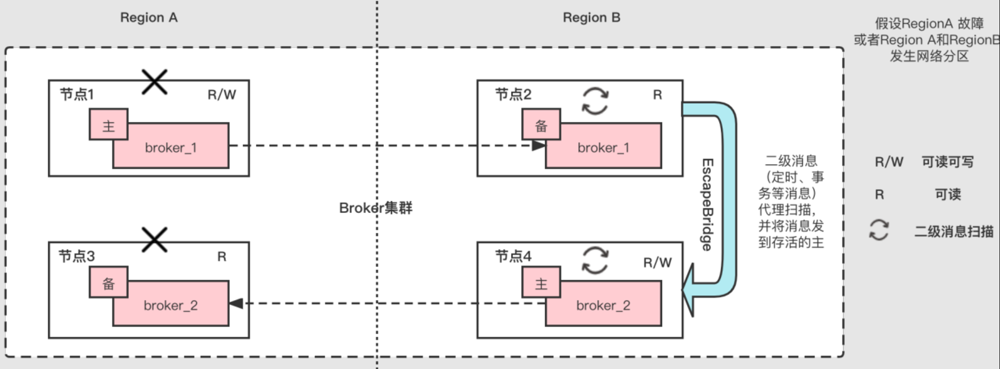
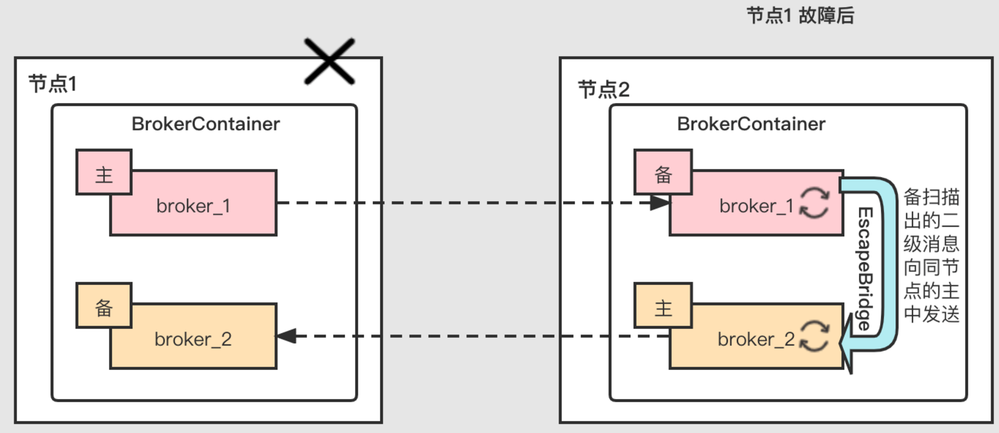
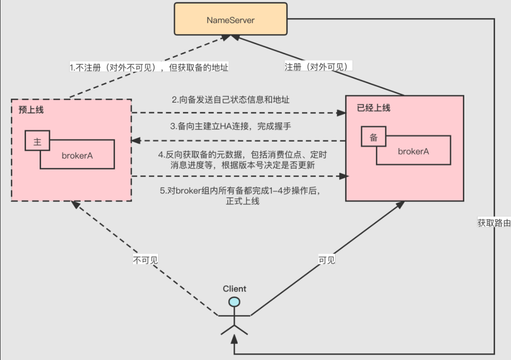

大家好，我是**华仔**, 又跟大家见面了。

今天是第二十五篇，我们来聊聊 RocketMQ 5.x Slave Acting Master 模式实现原理，深度剖析下其内部设计思想，**下面进入正题**。

## **01 总体概述**

我们知道在 RocketMQ Master-Slave 冷备部署方式下，即使一个 Master 节点掉线，发送端仍然可以向其他Master 节点发送消息，但对于消费端而言，如果开启「**备读**」，Consumer 会自动重连到对应的 Slave 节点，且不会出现「**消费停滞**」的情况。

如下图所示：

但是该部署架构方式下会存在以下问题：

1.  一些仅限于在 Master 节点上进行操作的功能将无法进行，包括且不限于：
2.  [searchOffset](http://searchoffset/)。
3.  [maxOffset](http://maxoffset/)。
4.  [minOffset](http://minoffset/)。
5.  [earliestMsgStoreTime](http://earliestmsgstoretime/)。
6.  [endTransaction](http://endtransaction/)。
7.  所有锁 MQ 相关操作，包括 [lock](http://lock/)，[unlock](http://unlock/)，[lockBatch](http://lockbatch/)，[unlockAll](http://unlockall/)。
8.  具体影响为：
9.  （1）、客户端无法获取位于该副本组的mq的锁，故当本地锁过期后，将无法消费该组的顺序消息。
10.  （2）、客户端无法主动结束处于半状态的事务消息，只能等待broker回查事务状态。
11.  （3）、Admin tools 或控制中依赖查询 offset 及 [earliestMsgStoreTime](http://earliestmsgstoretime%20/) 等操作在该组上无法生效。
12.  故障 Broker 组上的二级消息消费将会中断，该类消息特点依赖 Master Broker 上的线程扫描 [CommitLog](http://commitlog%20/) 上的特殊Topic，并将满足要求的消息投放回 [CommitLog](http://commitlog/)，如果 Master Broker 下线，会出现二级消息的消费延迟或丢失。具体会影响到当前版本的延迟消息消费、事务消息消费、Pop 消费。
13.  没有元数据的反向同步。Master 重新被人工拉起后，容易造成元数据的回退，如 Master 上线后将落后的消费位点同步给备，该组 broker 的消费位点回退，造成大量消费重复。

而对于 [DLedger（Raft）](http://xn--%20rocketmq%20broker%20%20dledger%20-1018adb4112wqycn9cx17bo4fnvag56cms0bcyj961qspaw6du581a7x7c0ygdqrgp1o2ouahpb/)架构模式来说，其可以通过「**选主**」一定程度上规避上述存在的问题，但可以看到DLedger 模式下当前需要强制「**三副本及以上**」才行。

## **02 新方案提出**

针对上述两种方案中存在的问题，RocketMQ 官方提出一个新的方案，即：「**Slave 代理 Master 模式**」，用来作为 Master-Slave 部署模式的升级。

在原先 Master-Slave 部署模式下，通过「**Slave 代理 Master**」、「**轻量级心跳**」、「**副本组信息获取**」、「**Broker 预上线机制**」、「**二级消息逃逸**」等方式，当同组 Master 发生故障时，Slave 将承担更加重要的作用，包括：

1.  当 Master 下线后，「**该组中 BrokerID 最小**」的 Slave 会承担「**备读**」以及一些客户端和管控会访问，但却只能在 Master 节点上完成的任务。包括且不限于 [searchOffset](http://searchoffset/)、[maxOffset](http://maxoffset/)、[minOffset](http://minoffset/)、[earliestMsgStoreTime](http://earliestmsgstoretime/)、[endTransaction](http://endtransaction/) 以及所有锁 MQ 相关操作 [lock](http://lock/)，[unlock](http://unlock/)，[lockBatch](http://lockbatch/)，[unlockAll](http://unlockall/)。
2.  当 Master 下线后，故障 Broker 组上的二级消息消费将不会中断，由该组中该组中 brokerId 最小的 Slave 承担起该任务，定时消息、Pop 消息、事务消息等仍然可以正常运行。
3.  当 Master 下线后，在「**Slave 代理 Master**」一段时间后，然后当 Master 再次上线后，通过「**预上线机制**」，Master 会自动完成「**元数据**」的反向同步后再上线，不会出现「**元数据回退**」，造成「**消息大量重复消费**」或「**二级消息大量重放**」。

## **03 新架构模式**

## **3.1 Slave Acting Master**

Master 下线后 Slave 能正常消费，且在不修改客户端代码情况下只能在 Master 完成的操作源自于 Namesrv 对代理 Master 的支持。

此处「**Slave 代理 Master**」指的是，当副本组处于「**无主状态**」时，Namesrv 将把 brokerId 最小的存活 Slave视为「**代理 Master**」，具体表现为在构建 [TopicRouteData](http://topicroutedata%20/) 时，将该 Slave 的 brokerId 替换为 0，并将[brokerPermission](http://brokerpermission/) 修改为 4（[Read-Only](http://read-only/)），从而使得该 Slave 在客户端视图中充当「**只读模式**」的 Master 的角色。

此外，当 Master 节点下线后，brokerId 最小的 Slave 会承担起「**二级消息**」的扫描和「**重新投递功能**」，这也是「**代理**」的一部分。

## **3.2 轻量级心跳**

如上文所述，brokerId 最小的存活 Slave 在 Master 故障后开启「**自动代理**」Master 模式，因此需要一种机制，这个机制需要保证：

1.  Nameserver 能及时发现 broker 上下线并完成路由替换以及下线 broker 的路由剔除。
2.  Broker 能及时感知到同组 Broker 的上下线情况。

针对第一点，Nameserver 原本就存在「**判活机制**」，定时会扫描不活跃的 broker 使其下线，而原本 broker 与Nameserver 的「**心跳**」则依赖于 [registerBroker](http://registerbroker/) 操作，而这个操作涉及到 topic 信息上报，过于「**重**」，而且注册间隔过于长，因此需要一个轻量级的「**心跳机制**」，RocketMQ 5.0 版本在 Nameserver 和 broker 间新增[BrokerHeartbeat](http://brokerheartbeat/) 请求，broker 会定时向 Nameserver 发送心跳，如果 Nameserver「**定时任务**」扫描发现超过「**心跳超时时间**」仍未收到该 broker 的心跳，将 [unregister](http://unregister%20/) 该 broker。

[registerBroker](http://registerbroker%20/) 时会完成「**心跳超时时间**」的设置，并且注册时如果发现 broker 组内最小 brokerId 发生变化，将反向通知该组所有 broker，并在路由获取时将最小 brokerId 的 Slave 路由替换使其充当「**只读模式**」的 Master的角色。

针对第二点，通过两个机制来及时感知同组 broker 上下线情况，第一点是上文中介绍的当 Nameserver 发现该broker 组内最小 brokerId 发生变化，反向通知该组所有 broker。第二点是 broker 自身会有「**定时任务**」，向Nameserver 同步本 broker 组存活 broker 的信息，RocketMQ 5.0 会新增 [GetBrokerMemberGroup](http://getbrokermembergroup/) 请求来完成该工作。

Slave Broker 发现自己是该组中最小的 brokerId，将会开启「**代理模式**」，而一旦 Master Broker 重新上线，Slave Broker 同样会通过 Nameserver 反向通知或自身定时任务同步同组 broker 的信息感知到，并自动结束代理模式。

## **3.3 二级消息逃逸**

代理模式开启后，brokerId 最小的 Slave 会承担起「**二级消息**」的扫描和重新投递功能。

二级消息一般分为「**两个阶段**」，发送或者消费时会发送到一个特殊 topic 中，后台会有「**线程扫码**」，最终的满足要求的消息会被重新投递到 [CommitLog](http://commitlog%20/) 中。

我们可以让 brokerId 最小的 Slave 进行扫描，但如果扫描之后的消息重新投递到本 [CommitLog](http://commitlog/)，那将会破坏Slave 不可写的语义，造成 [CommitLog](http://commitlog/) 分叉。因此 RocketMQ 5.0 提出一种「**逃逸机制**」，将重放的「**二级消息**」远程或本地投放到其他 Master 的 [CommitLog](http://commitlog/) 中。

### **3.3.1 远程逃逸**

如上图所示，假设 [Region A](http://region%20a/) 发生故障，[Region B](http://region%20b/) 中的节点 2 将会承担「**二级消息**」的扫描任务，同时将最终的满足要求的消息通过 [EscapeBridge](http://escapebridge%20/) 远程发送到当前 Broker 集群中仍然存活的 Master 上。

### **3.3.2 本地逃逸**

「**本地逃逸**」需要在 [BrokerContainer](http://brokercontainer/) 下进行，如果 [BrokerContainer](http://brokercontainer/) 中存在存活的 Master，会优先向同进程的[Master CommitLog](http://master%20commitlog/) 中逃逸，避免远程 RPC。

## **3.4 各类二级消息变化**

### **3.4.1 延迟消息**

当 Slave 代理 Master 时，[ScheduleMessageService](http://schedulemessageservice/) 将启动，时间到期的延迟消息将通过 [EscapeBridge](http://escapebridge/) 优先往本地 Master 逃逸，如果没有则向远程的 Master 逃逸。

该 broker 上存量的时间未到期的消息将会被逃逸到存活的其他 Master 上，数据量上如果该 broker 上有大量的延迟消息未到期，远程逃逸会造成集群内部会有较大数据流转，但基本可控。

### **3.4.2 POP 消息**

1.  CK/ACK 拼 key 的时候增加 brokerName 属性。这样每个 broker 能在扫描自身 commitLog 的 revive topic 时抵消其他broker 的 CK/ACK 消息。
2.  Slave 上的 CK/ACK 消息将被逃逸到其他指定的 Master A 上（需要同一个 Master，否则 CK/ACK 无法抵消，造成消息重复），Master A 扫描自身 CommitLog revive 消息并进行抵消，如果超时则将根据 CK 消息中的信息向 Slave 拉取消息（如果本地有则拉取本地，否则远程拉取），然后投放到本地的 retry topic 中。

数据量上，如果是「**远程投递或拉取**」，且有消费者大量通过「**Pop 消息存量的 Slave 消息**」，并且长时间不 ACK，则在集群内部会有较大数据流转。

## **3.5 预上线机制**

当 Master Broker 下线后，Slave Broker 将承担「**备读**」的作用，并对「**二级消息**」进行代理，因此 Slave Broker 中的部分元数据包括「**消费位点**」、「**定时消息进度**」等会比下线的 Master Broker 更加超前。如果 Master Broker 重新上线，Slave Broker 元数据将被 Master Broker 覆盖，该组 Broker 元数据将「**发生回退**」，可能造成大量消息重复。

因此，需要一套「**预上线机制**」来完成元数据的反向同步。需要为 [consumerOffset](http://consumeroffset/) 和 [delayOffset](http://delayoffset/) 等元数据增加版本号（[DataVersion](http://dataversion/)）的概念，并且为了防止「**版本号**」更新太频繁，增加「**更新步长**」的概念，比如对于「**消费位点**」来说，默认每更新位点超过 500 次，版本号增加到下一个版本。

如上图所示，Master Broker 启动前会进行「**预上线**」，再「**预上线**」之前，对外不可见（Broker 会有 [isIsolated](http://isisolated/)标记自己的状态，当其为 true 时，不会像 Nameserver 注册和发送心跳），因此也不会对外提供服务，「**二级消息**」的扫描流程也不会进行启动，具体预上线机制如下：

1.  Master Broker 向 NameServer 获取 Slave Broker 地址（[GetBrokerMemberGroup](http://getbrokermembergroup/) 请求），但不注册。
2.  Master Broker 向 Slave Broker 发送自己的状态信息和地址。
3.  Slave Broker 得到 Master Broker 地址后和状态信息后，建立 HA 连接，并完成握手，进入 Transfer 状态。
4.  Master Broker 再完成握手后，反向获取备的元数据，包括消费位点、定时消息进度等，根据版本号决定是否更新。
5.  Master Broker 对 broker 组内所有 Slave Broker 都完成 1-4 步操作后，正式上线，向 NameServer 注册，正式对外提供服务。

## **3.6 锁 Quorum**

当 Slave 代理 Master 时，外部看到的是「**只读**」的 Master，因此「**顺序消息**」仍然可以对「**队列上锁**」，消费不会中断。但当真的 Master 重新上线后，在一定的时间差内可能会造成多个 consumer 锁定同一个队列，比如一个consumer 仍然锁着代理的备某一个队列，一个 consumer 锁刚上线的主的同一队列，造成「**顺序消息**」的乱序和重复。

因此在 lock 操作时要求，需锁 broker 副本组的大多数成员（[quorum](http://quorum/) 原则）均成功才算锁成功。但「**两副本**」下达不到 [quorum](http://quorum%20/) 的原则，所以提供了 [lockInStrictMode](http://lockinstrictmode/) 参数，表示消费端消费「**顺序消息**」锁队列时是否使用「**严格模式**」。「**严格模式**」即对单个队列而言，需锁副本组的大多数成员（[quorum](http://quorum/) 原则）均成功才算锁成功，非严格模式即锁任意一副本成功就算锁成功，该参数默认为 false。当对消息顺序性高于可用性时，需将该参数设置为 false。

## **04** **配置更新**

## **4.1 NameServer**

1.  [scanNotActiveBrokerInterval](http://scannotactivebrokerinterval/)：扫描不活跃 broker 间隔，每次扫描将判断 broker 心跳是否超时，默认 5s。
2.  [supportActingMaster](http://supportactingmaster/)：nameserver 端是否支持 Slave 代理 Master 模式，开启后，副本组在无 master 状态下，[brokerId==1](http://brokerid==1/) 的 slave 将在 [TopicRoute](http://topicroute/) 中被替换成 master（即 brokerId=0），并以只读模式对客户端提供服务，默认为false。

## **4.2 Broker**

1.  [enableSlaveActingMaster](http://enableslaveactingmaster/)：broker 端开启 slave 代理 master 模式总开关，默认为 false。
2.  [enableRemoteEscape](http://enableremoteescape/)：是否允许远程逃逸，默认为 false。
3.  [brokerHeartbeatInterval](http://brokerheartbeatinterval/)：broker 向 nameserver 发送心跳间隔（不同于注册间隔），默认 1s。
4.  [brokerNotActiveTimeoutMillis](http://brokernotactivetimeoutmillis/)：broker 不活跃超时时间，超过此时间 nameserver 仍未收到 broker 心跳，则判定broker 下线，默认10s。
5.  [sendHeartbeatTimeoutMillis](http://sendheartbeattimeoutmillis/)：broker 发送心跳请求超时时间，默认1s。
6.  [lockInStrictMode](http://lockinstrictmode/)：消费端消费顺序消息锁队列时是否使用严格模式，默认为 false，上文已介绍。
7.  [skipPreOnline](http://skippreonline/)：broker 跳过预上线流程，默认为 false。
8.  [compatibleWithOldNameSrv](http://compatiblewitholdnamesrv/)：是否以兼容模式访问旧 nameserver，默认为 true。

## **05** **兼容性方案**

新版 nameserver 和旧版 broker：新版 nameserver 可以完全兼容旧版 broker，无兼容问题。

旧版 nameserver 和新版 Broker：新版 Broker 开启 Slave 代理 Master，会向 Nameserver 发送 [BROKER\_HEARTBEAT](http://broker_heartbeat/) 以及 [GET\_BROKER\_MEMBER\_GROUP](http://get_broker_member_group/) 请求，但由于旧版本 nameserver 无法处理这些请求。

因此需要在 [brokerConfig](http://brokerconfig/) 中配置 [compatibleWithOldNameSrv=true](http://compatiblewitholdnamesrv=true/)，开启对旧版 nameserver 的兼容模式，在该模式下，broker 的一些新增 RPC 将通过复用原有 [RequestCode](http://requestcode/) 实现，具体为：

1.  新增轻量级心跳将通过复用 [QUERY\_DATA\_VERSION](http://query_data_version%20/) 实现。
2.  新增获取 [BrokerMemberGroup](http://brokermembergroup/) 数据将通过复用 [GET\_ROUTEINFO\_BY\_TOPIC](http://get_routeinfo_by_topic/) 实现，具体实现方式是每个 broker 都会新增 [rmq\_sys\_{brokerName}](http://rmq_sys_{brokername}/) 的系统 topic，通过获取该系统 topic 的路由来获取该副本组的存活信息。
3.  但旧版 nameserver 无法提供代理功能，Slave 代理 Master 的功能将无法生效，但不影响其他功能。
4.  客户端对新旧版本的 nameserver 和 broker 均无兼容性问题。

参考文档：[原 RIP](https://github.com/apache/rocketmq/wiki/RIP-32-Slave-Acting-Master-Mode)