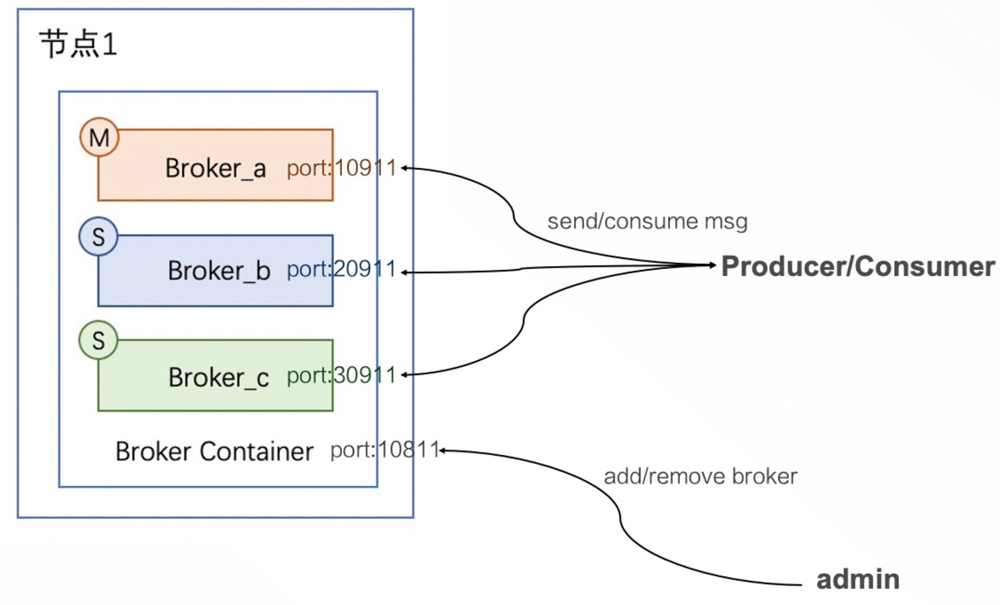
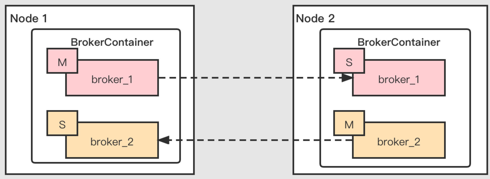
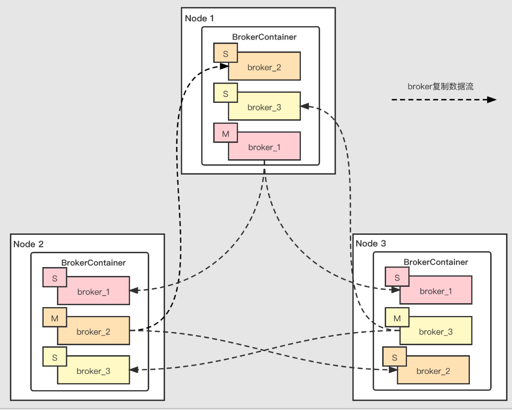
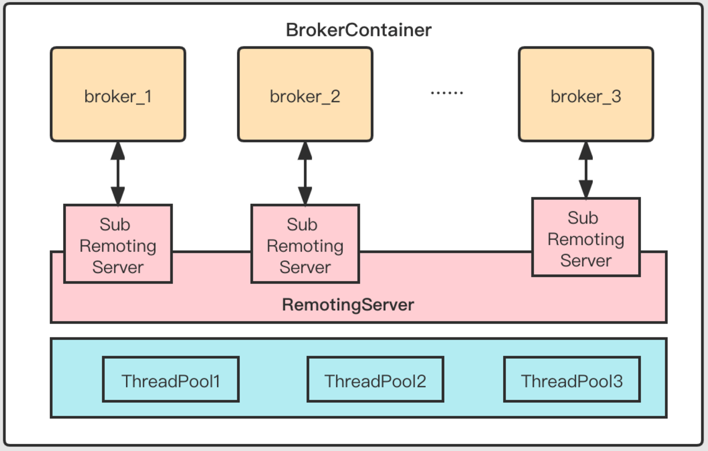
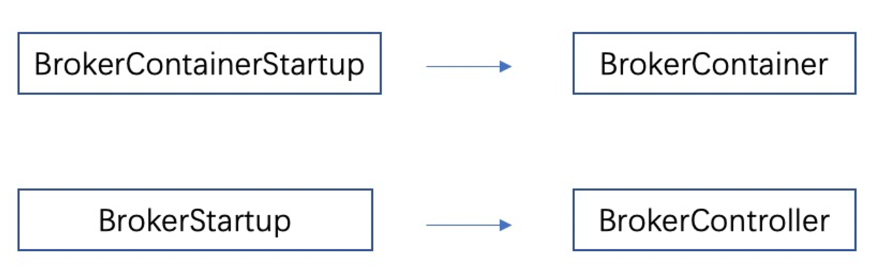
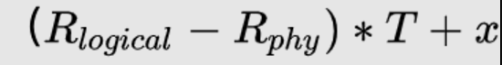
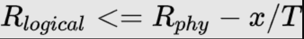

大家好，我是**华仔**, 又跟大家见面了。

今天是第二十六篇，我们来聊聊 RocketMQ 5.x BrokerContainer 模式实现原理，深度剖析下其内部设计思想，**下面进入正题**。

##   
**01 总体概述**

在 RocketMQ 4.x 版本中，一个进程只有一个 broker，通常会以主备或者 [DLedger（Raft）](http://dledger\(raft\)/)的形式部署，但是一个进程中只有一个 broker，而 Slave 一般只承担「**冷备**」或「**热备**」的作用，节点之间角色的不对等导致 Slave 节点资源没有充分被利用。

因此在 RocketMQ 5.x 版本中，提供一种新的模式 [BrokerContainer](http://brokercontainer/)，在一个 [BrokerContainer](http://brokercontainer/) 进程中可以加入多个 Broker（[Master Broker](http://master%20broker/)、[Slave Broker](http://slave%20broker/)、[DLedger Broker](http://dledger%20broker/)），来提高单个节点的资源利用率，并且可以通过各种形式的交叉部署来实现节点之间的对等部署。

该特性的优点包括：

1.  一个 [BrokerContainer](http://brokercontainer/) 进程中可以加入多个 broker，通过进程内混部来提高单个节点的资源利用率。
2.  通过各种形式的交叉部署来实现节点之间的对等部署，增强单节点的高可用能力。
3.  利用 [BrokerContainer](http://brokercontainer/) 可以实现单进程内多 [CommitLog](http://commitlog%20/) 写入，也可以实现单机的多磁盘写入。
4.  [BrokerContainer](http://brokercontainer/) 中的 [CommitLog](http://commitlog/) 天然隔离的，不同的 [CommitLog](http://commitlog/)（broker）可以采取不同作用，比如可以用来比如创建单独的 broker 做不同 TTL 的 [CommitLog](http://commitlog/)。

##   
**02 新架构**

## **2.1 单进程模式**

相比于原来一个 Broker 一个进程，RocketMQ 5.0 将增加 [BrokerContainer](http://brokercontainer/) 概念，一个 [BrokerContainer](http://brokercontainer/) 可以存放多个 Broker，每个 Broker 拥有不同的端口，但它们共享同一个传输 [remoting](http://remoting/) 层，而每一个 broker 在功能上是完全独立的，[BrokerContainer](http://brokercontainer%20/) 也拥有自己端口，在运行时可以通过 admin 命令来增加或减少 Broker。

## **2.2 对等部署模式**

在 [BrokerContainer](http://brokercontainer%20/) 模式下，可以通过各种形式的交叉部署完成节点的对等部署。

### **2.2.1 二副本对等部署**

二副本对等部署情况下，每个节点都会有一主一备，资源利用率均等。另外假设图中 Node1 宕机，由于 Node2 的[broker\_2](http://broker_2/) 可读可写，[broker\_1](http://broker_1/) 可以备读，因此普通消息的收发不会收到影响，单节点的高可用能力得到了增强。

### **2.2.2 三副本对等部署**

三副本对等部署情况下，每个节点都会有一主两备，资源利用率均等。此外，和二副本一样，任意一个节点的宕机也不会影响到普通消息的收发。

## **2.3 传输层共享**

[BrokerContainer](http://brokercontainer/) 中的所有 broker 共享同一个传输层，就像 RocketMQ 客户端中同进程的 Consumer 和Producer 共享同一个传输层一样。

这里为 [NettyRemotingServer](http://nettyremotingserver/) 提供 [SubRemotingServer](http://subremotingserver/) 支持，通过为一个 [RemotingServer](http://remotingserver/) 绑定另一个端口即可生成 [SubRemotingServer](http://subremotingserver/)，其共享 [NettyRemotingServer](http://nettyremotingserver/) 的 Netty 实例、计算资源、以及协议栈等，但拥有不同的端口以及 [ProcessorTable](http://processortable/)。

另外同一个 [BrokerContainer](http://brokercontainer/) 中的所有的 broker 也会共享同一个 [BrokerOutAPI](http://brokeroutapi/)（[RemotingClient](http://remotingclient/)）。

## **03 启动方式与配置**

像 Broker 启动利用 [BrokerStartup](http://brokerstartup/) 一样，使用 [BrokerContainerStartup](http://brokercontainerstartup/) 来启动 [BrokerContainer](http://brokercontainer/)。我们可以通过两种方式向 [BrokerContainer](http://brokercontainer/) 中增加 broker，一种是通过启动时通过在配置文件中指定

[BrokerContainer](http://brokercontainer/) 配置文件内容主要是 Netty 网络层参数（由于传输层共享），[BrokerContainer](http://brokercontainer/) 的监听端口、namesrv 配置，以及最重要的 [brokerConfigPaths](http://brokerconfigpaths/) 参数，[brokerConfigPaths](http://brokerconfigpaths/) 是指需要向 [BrokerContainer](http://brokercontainer/) 内添加的 [brokerConfig](http://brokerconfig/) 路径，多个 config 间用“:”分隔，不指定则只启动 [BrokerConainer](http://brokerconainer/)，具体 broker 可通过[mqadmin](http://mqadmin%20/) 工具添加。

broker-container.conf（[distribution/conf/container/broker-container.conf](http://distribution/conf/container/broker-container.conf)）:

#配置端口，用于接收mqadmin命令

listenPort=10811

#指定namesrv

namesrvAddr=127.0.0.1:9876

#或指定自动获取namesrv

fetchNamesrvAddrByAddressServer=true

#指定要向BrokerContainer内添加的brokerConfig路径，多个config间用“:”分隔；

#不指定则只启动BrokerConainer，具体broker可通过mqadmin工具添加

brokerConfigPaths=/home/admin/broker-a.conf:/home/admin/broker-b.conf

broker 的配置和以前一样，但在 [BrokerContainer](http://brokercontainer/) 模式下 broker 配置文件中下 Netty 网络层参数和 nameserver参数不生效，均使用 [BrokerContainer](http://brokercontainer/) 的配置参数。

完成配置文件后，可以以如下命令启动：

sh mqbrokercontainer -c broker-container.conf

[mqbrokercontainer](http://mqbrokercontainer%20/) 脚本路径为 [distribution/bin/mqbrokercontainer](http://distribution/bin/mqbrokercontainer)。

## **04 运行时增加或减少 Broker**

当 [BrokerContainer](http://brokercontainer/) 进程启动后，也可以通过 Admin 命令来增加或减少 Broker。

AddBrokerCommand：

usage: mqadmin addBroker -b <arg> -c <arg> \[-h\] \[-n <arg>\]

\-b,--brokerConfigPath <arg> Broker config path

\-c,--brokerContainerAddr <arg> Broker container address

\-h,--help Print help

\-n,--namesrvAddr <arg> Name server address list, eg: 192.168.0.1:9876;192.168.0.2:9876

RemoveBroker Command：

usage: mqadmin removeBroker -b <arg> -c <arg> \[-h\] \[-n <arg>\]

\-b,--brokerIdentity <arg> Information to identify a broker: clusterName:brokerName:brokerId

\-c,--brokerContainerAddr <arg> Broker container address

\-h,--help Print help

\-n,--namesrvAddr <arg> Name server address list, eg: 192.168.0.1:9876;192.168.0.2:9876

## **05 存储变化**

[storePathRootDir](http://storepathrootdir/)，[storePathCommitLog](http://storepathcommitlog/) 路径依然为 [MessageStoreConfig](http://messagestoreconfig/) 中配置值，需要注意的是同一个[brokerContainer](http://brokercontainer/) 中的 broker 不能使用相同的 [storePathRootDir](http://storepathrootdir/)，[storePathCommitLog](http://storepathcommitlog/)，否则不同的 broker占用同一个存储目录，发生数据混乱。

在文件删除策略上，仍然单个 Broker 的视角来进行删除，但 [MessageStoreConfig](http://messagestoreconfig/) 新增 [replicasPerDiskPartition](http://replicasperdiskpartition/) 参数和 [logicalDiskSpaceCleanForciblyThreshold](http://logicaldiskspacecleanforciblythreshold/)。

[replicasPerDiskPartition](http://replicasperdiskpartition/) 表示同一磁盘分区上有多少个副本，即该 broker 的存储目录所在的磁盘分区被几个broker 共享，默认值为1。

该配置用于计算当同一节点上的多个 broker共享同一磁盘分区时，各 broker 的磁盘配额

[e.g. replicasPerDiskPartition==2](http://e.g.%20replicasperdiskpartition==2/) 且 broker 所在磁盘空间为 1T 时，则该 broker 磁盘配额为 512G，该 broker的逻辑磁盘空间利用率基于 512G 的空间进行计算。

[logicalDiskSpaceCleanForciblyThreshold](http://logicaldiskspacecleanforciblythreshold/)，该值只在 [replicasPerDiskPartition](http://replicasperdiskpartition/) 大于1时生效，表示逻辑磁盘空间强制清理阈值，默认为 0.80（80%）， 逻辑磁盘空间利用率为该 broker 在自身磁盘配额内的空间利用率，物理磁盘空间利用率为该磁盘分区总空间利用率。

由于在 [BrokerContainer](http://brokercontainer/) 实现中，考虑计算效率的情况下，仅统计了[commitLog+consumeQueue（+ BCQ）+indexFile](http://commitlog+consumequeue\(+%20bcq\)+indexfile/) 作为 broker 的存储空间占用，其余文件如元数据、消费进度、磁盘脏数据等未统计在内，故在多个broker 存储空间达到动态平衡时，各 broker 所占空间可能有相差，以一个 [BrokerContainer](http://brokercontainer/) 中有两个 broker 为例，两 broker 存储空间差异可表示为：

其中，[R\_logical](http://r_logical/) 为 [logicalDiskSpaceCleanForciblyThreshold](http://logicaldiskspacecleanforciblythreshold/)，[R\_phy](http://r_phy/) 为 [diskSpaceCleanForciblyRatio](http://diskspacecleanforciblyratio/)，T 为磁盘分区总空间，x 为除上述计算的 broker 存储空间外的其他文件所占磁盘总空间比例。

可见，当

可保证 [BrokerContainer](http://brokercontainer/) 各 Broker 存储空间在达到动态平衡时相差无几。

假设 broker 获取到的配额是 500g（根据 [replicasPerDiskPartition](http://replicasperdiskpartition/) 计算获得），[logicalDiskSpaceCleanForciblyThreshold](http://logicaldiskspacecleanforciblythreshold/) 为默认值 0.8，则默认 [commitLog+consumeQueue（+ BCQ）+indexFile](http://commitlog+consumequeue\(+%20bcq\)+indexfile/) 总量超过 400g 就会强制清理文件。

其他清理阈值（[diskSpaceCleanForciblyRatio](http://diskspacecleanforciblyratio/)、[diskSpaceWarningLevelRatio](http://diskspacewarninglevelratio/)），文件保存时间（[fileReservedTime](http://filereservedtime/)）等逻辑与之前保持一致。

> 注意：当以普通 broker 方式启动而非 brokerContainer 启动时，且 replicasPerDiskPartition=1（默认值）时，清理逻辑与之前完全一致。 replicasPerDiskPartition>1 时，逻辑磁盘空间强制清理阈值logicalDiskSpaceCleanForciblyThreshold 将会生效。

## **06 日志变化**

在 [BrokerContainer](http://brokercontainer/) 模式下日志的默认输出路径将发生变化，具体为：

{user.home}/logs/rocketmqlogs/${brokerCanonicalName}/

其中 [brokerCanonicalName](http://brokercanonicalname%20/) 为 [{BrokerClusterName\_BrokerName\_BrokerId}](http://%20{brokerclustername_brokername_brokerid}/)。