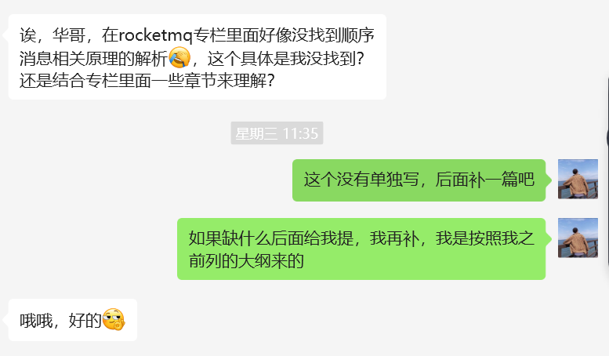
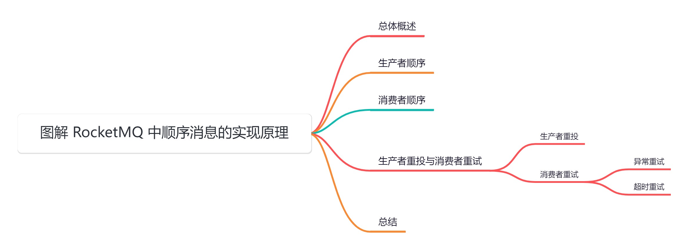
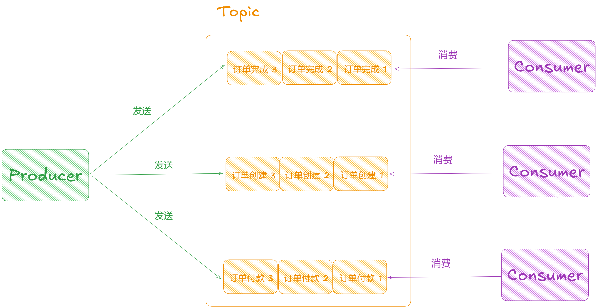
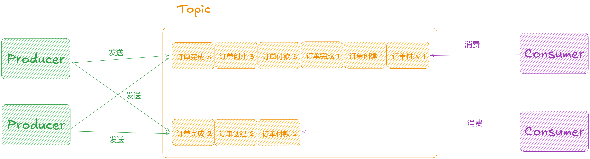
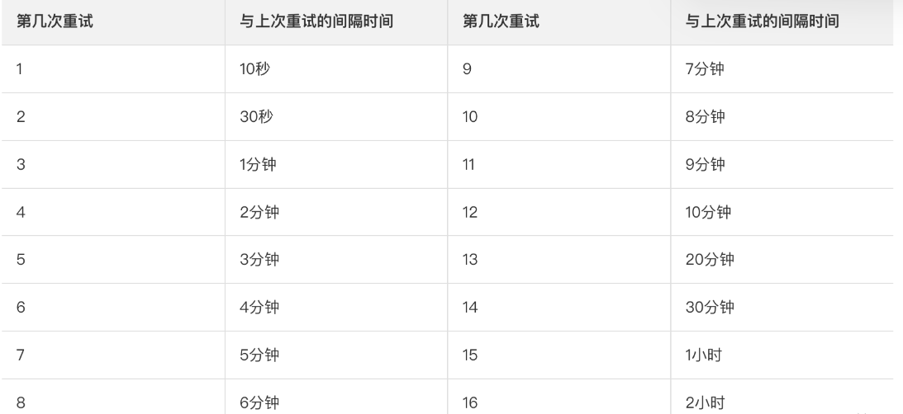

大家好，我是**华仔**, 又跟大家见面了。

从今天开始，我们开始对 RocketMQ 进行相关实现原理进行剖析，今天是第二十篇，我们来聊聊 RocketMQ 中「**顺序消息的实现原理**」，深度剖析下其内部底层原理设计思想，**下面进入正题**。

应球友的要求，这里补一篇原理：

## **01 总体概述**

在 RocketMQ 实际使用中，业务经常会有这样的需求，要保证一定的顺序性。消息有序指的是一类消息消费时，能按照发送的顺序来进行消费。

比如以下这种场景：

一个订单产生了三条消息分别是「**订单创建**」、「**订单付款**」、「**订单完成**」。消费时也要按照这个顺序消费才有意义，但是同时订单之间是可以「**并行消费**」的，在 RocketMQ 中可以严格的保证消息有序。

顺序消息分为「**全局顺序消息**」与「**局部顺序消息**」，「**全局顺序消息**」是指某个 Topic 下的所有消息都要保证顺序；「**局部顺序消息**」只要保证每一组消息被顺序消费即可。

如果想要实现「**全局顺序消息**」，很简单，只能使用一个队列 queue，以及单个生产者，但这样会严重影响性能。

因此「**顺序消息**」通常只是「**局部顺序消息**」，就上面的例子来说，我们不用管「**不同订单 ID 的消息**」之间的总体消费顺序，只需要保证「**相同订单 ID 的消息**」能按照「**订单创建**」、「**订单付款**」、「**订单完成**」这个顺序消费就可以了。

## **02 生产者顺序**

先来看下如何实现生产者消息有序存储，我们知道 RocketMQ 中生产者生产的消息会放置在某个队列中，基于队列「**先进先出**」的特性天然的可以保证入队的消息顺序和拉取的消息顺序是一致的，因此我们只需要保证一组相同的消息按照给定的顺序存入同一个队列中，就能保证生产者有序存储。

在普通发送消息的模式下，生产者会采用「**轮询**」方式将消费均匀的分发到「**不同队列**」中，然后被不同的消费者消费，因为一组消息在不同的队列，此时就无法使用 RocketMQ 带来的队列有序特性来保证「**消息有序性了**」。

要解决这个问题也不是很难，设想下 RocketMQ 是支持生产者在投放消息的时候「**自定义投放策略**」，此时可以实现一个[MessageQueueSelector](http://messagequeueselector/) 接口，使用 Hash 取模的方法来保证「**同一个订单**」在「**同一个队列**」中就行了，即通过 [订单ID % 队列数量](http://%E8%AE%A2%E5%8D%95ID%%E9%98%9F%E5%88%97%E6%95%B0%E9%87%8F) 得到该 ID 的订单所投放的队列在队列列表中的「**索引**」[ShardingKey](http://shardingkey%20/)，然后该订单的所有消息都会被投放到该队列中。

生产者发送消息的方法中就有一些添加队列选择器的方法，保证消息发送顺序。

比如当前只有两个队列时，那么订单 ID 为 1,2,3 的三组消息中，1、3 组消息存放于第一个队列，而 2 组消息存放于第二个队列，如下图是一种消息可能的消息存放顺序：

根据上图可以得知，这种方法可以实现一组消息被顺序的存放，不同组的消息之间的顺序无法保证，这就是部分顺序。

另外，需要注意的是：「**顺序消息**」必须使用「**同步发送**」的方式才能保证生产者发送的消息有序。实际上，采用「**队列选择器**」[MessageQueueSelector](http://messagequeueselector/) 的方法不能保证消息的「**严格顺序**」，我们的目的是将消息发送到「**同一个队列**」中，如果此时某个 Broker 挂了，那么队列就会减少一部分，如果还继续采用「**取余**」的方式进行投递，将可能导致「**同一个业务**」中的「**不同消息**」被发送到「**不同队列**」中，短暂的造成「**部分消息无序**」。同样的，如果增加了服务器，也会短暂的造成「**部分消息无序**」。

具体可以参考官方文档：

4.x : [https://rocketmq.apache.org/zh/docs/4.x/producer/03message2](https://rocketmq.apache.org/zh/docs/4.x/producer/03message2)

5.x：[https://rocketmq.apache.org/zh/docs/featureBehavior/03fifomessage](https://rocketmq.apache.org/zh/docs/featureBehavior/03fifomessage)

## **03 消费者顺序**

生产者有序存储实现了，那么该如何实现消费者有序消费呢？

RockerMQ 的 [MessageListener](http://messagelistener%20/) 回调函数提供了两种「**消费模式**」，有序消费模式 [MessageListenerOrderly](http://messagelistenerorderly/) 和并发消费模式 [MessageListenerConcurrently](http://messagelistenerconcurrently/)。

在消费的时候，还需要保证消费者注册 [MessageListenerOrderly](http://messagelistenerorderly/) 类型的回调接口实现「**顺序消费**」，如果消费者采用 [Concurrently](http://concurrently/) 并行消费，则仍然不能保证「**消息消费顺序**」。

实际上，每一个消费者的的「**消费端**」都是采用「**线程池**」实现「**多线程消费**」的模式，即消费端是多线程消费。虽然 [MessageListenerOrderly](http://messagelistenerorderly/) 被称为有序消费模式，但是仍然是使用的「**线程池**」去消费消息。

[MessageListenerConcurrently](http://messagelistenerconcurrently/) 是拉取到新消息之后就提交到「**线程池**」去消费，而 [MessageListenerOrderly](http://messagelistenerorderly/) 则是通过「**加分布式锁**」和「**本地锁**」来保证同时只有「**一个线程**」去消费一个队列上的数据。

具体的源码实现可以查看：[【消费者源码分析系列第八篇】图解 RocketMQ 源码之消费者普通消费全流程剖析](https://articles.zsxq.com/id_lf0x558ptx15.html)

目前来说，消费者使用 [MessageListenerOrderly](http://messagelistenerorderly/) 顺序消费需要注意以下两个问题：

1.  使用了很多的锁，降低了吞吐量。
2.  前一个消息消费阻塞时后面消息都会被阻塞。如果遇到消费失败的消息，会自动对当前消息进行重试（每次间隔时间为 1秒），无法自动跳过，重试最大次数是 [Integer.MAX\_VALUE](http://integer.max_value/)，这将导致当前队列消费暂停，因此通常需要设定有一个最大消费次数，以及处理好所有可能的异常情况。

## **04 生产者重投与消费者重试**

针对上面第二个问题，我们再来看下生产者与消费者的重试机制。

## **4.1 生产者重投**

生产者在发送消息时：

1.  「**同步消息**」失败后会进行「**重投**」。
2.  「**异步消息**」失败后会进行「**重试**」。
3.  [oneway](http://oneway%20/) 没有任何保证。

「**消息重投机制**」可以保证消息尽可能发送成功、不丢失，但可能会造成「**消息重复**」。「**消息重复**」在 RocketMQ 中是无法避免的问题，但消息重复在一般情况下不会发生，当出现「**消息量大**」、「**网络抖动**」时消息重复就会是大概率事件。另外，当生产者主动重发、consumer Rebalance 变化时也会导致「**消息重复**」。

生产者属性可以设置消息重试策略：

1.  [retryTimesWhenSendFailed](http://retrytimeswhensendfailed/)：同步发送失败重投次数，默认为 2，因此生产者会最多尝试发送[retryTimesWhenSendFailed + 1](http://retrytimeswhensendfailed%20+%201/) 次。
2.  不会选择上次失败的 broker，尝试向其他 broker 发送，最大程度保证消息不丢。
3.  超过重投次数，抛出异常，由客户端保证消息不丢。
4.  当出现 [RemotingException](http://remotingexception/)、[MQClientException](http://mqclientexception/) 和部分 [MQBrokerException](http://mqbrokerexception/) 时会重投，如果因为超时，那么便不再重试。
5.  [retryTimesWhenSendAsyncFailed](http://retrytimeswhensendasyncfailed/)：异步发送失败重试次数，默认为 2，异步重试不会选择其他 broker，仅在同一个broker 上做重试，不保证消息不丢。如果因为超时，那么便不再重试。
6.  [retryAnotherBrokerWhenNotStoreOK](http://retryanotherbrokerwhennotstoreok/)：消息刷盘（主或备）超时或 slave不可用（返回状态非 [SEND\_OK](http://send_ok/)），是否尝试发送到其他 broker，默认 false。对于非常重要的消息时可以开启。

此时有两个注意点：

1.  如果同步发送模式失败，则轮转到下一个 Broker，如果异步发送模式失败，则只会在当前 Broker 进行重试。
2.  发送消息超时时间默认 3000 毫秒，如果因为超时，那么不再尝试重试。

##   
**4.2 消费者重试**

当 [Consumer](http://consumer%20/) 消费消息失败后，要提供一种「**重试机制**」，此时消息至少需要再消费一次。通常引起消息「**消费重试**」有两种情况：「**异常重试**」和「**超时重试**」。

需要注意的是 Consumer 在「**广播模式**」重试机制会失效。

### **4.2.1 异常重试**

当 [Consumer](http://xn--consumer%20-rb12a/) 端逻辑出现了异常，导致没有返回 [SUCCESS](http://success/) 状态，那么 Broker 就会在一段时间后「**尝试重试**」。

RocketMQ 会为每个消费组都设置一个 Topic 名称为 [%RETRY%+consumerGroup](http://%RETRY%+consumerGroup) 的重试队列（这里需要注意的是，这个 Topic 的重试队列是针对「**消费者组**」，而不是针对每个 Topic 设置的），用来暂时保存因为各种异常而导致 [Consumer](http://consumer%20/) 端无法消费的消息，每个 [Consumer](http://consumer%20/) 实例在启动的时候就默认订阅了该消费组的重试队列 Topic。

考虑到异常恢复起来需要一些时间，会为「**重试队列**」设置「**多个重试级别**」，每个「**重试级别**」都有与之对应的「**重新投递延时**」，重试次数越多投递延时就越大（实际上就是配置的延时队列的级别 Level）。

RocketMQ 对于重试消息的处理是先保存至 Topic 名称为 [SCHEDULE\_TOPIC\_XXXX](http://schedule_topic_xxxx/) 的延迟队列中，后台定时任务按照对应的时间进行 [Delay](http://delay/) 后重新保存至 [%RETRY%+consumerGroup](http://%RETRY%+consumerGroup) 的重试队列中。

关于延迟消息的源码可以点击：[【Broker端源码分析系列第三十篇】图解 RocketMQ 源码之 Broker 端延迟消息架构设计剖析](https://articles.zsxq.com/id_7ox9ujcnmshf.html)

### **4.2.1.1 并发消费重试**

并发消费可通过客户端参数 [DefaultMQPushConsumer.maxReconsumeTimes](http://defaultmqpushconsumer.maxreconsumetimes/) 设置最大重试次数，[maxReconsumeTimes](http://maxreconsumetimes/) 有效值范围是 [\[-1 – 16\]](http://%20%5B-1%20%E2%80%93%2016%5D) 之间。

[maxReconsumeTimes](http://maxreconsumetimes/) 默认值为-1，对于并发消费模式：-1 就等于 16。即并发消费默认最大重试 16 次，达到最大次数，消息将会发送至死信队列，不再重试。

重试时，延迟等级的控制可以通过 [MessageListenerConcurrently#consumeMessage](http://messagelistenerconcurrently/#consumeMessage) 方法的[ConsumeConcurrentlyContext](http://consumeconcurrentlycontext/) 参数指定重试策略，通过配置[ConsumeConcurrentlyContext.delayLevelWhenNextConsume](http://consumeconcurrentlycontext.delaylevelwhennextconsume/) 属性的值指定等级策略：

1.  等于 -1：不重试，直接发往死信队列。
2.  等于 0：默认值，延迟等级 broker 端控制的，默认从延迟等级 level3 开始，后续每次重试都是 [3 + 当前重试次数](http://xn--3%20+%20-c47mo98h5bos8puj4hgqra/)。
3.  大于 0，由 client 端控制，传入多少延迟等级就是多少。

如果 [Consumer](http://consumer/) 端逻辑出现异常，实际上重试太多次也没有很大的意义，因此可以指定最大的重试次数，达到一定次数之后就返回 [SUCCESS](http://success/)，不再重试，对于失败的消息记录到数据库的表中，后续人工处理。

默认的并发消费默认延迟间隔：

### **4.2.1.2 顺序消费重试**

顺序消费同样是通过客户端参数 [DefaultMQPushConsumer.maxReconsumeTimes](http://defaultmqpushconsumer.maxreconsumetimes/) 设置最大重试次数，超过最大重试次数，消息将被转移到死信队列，范围是 [\[-1 – 16\]](http://%5B-1%20%E2%80%93%2016%5D) 之间。

[maxReconsumeTimes](http://maxreconsumetimes/) 默认值为-1，对于顺序消费模式： -1 就代表着 [Integer.MAX\_VALUE](http://integer.max_value/)，表示无限次本地立即重试消费。这里的重试不再会将消息发往 broker 重试队列，只在在本地重试。

顺序消费的重试由于不再需要 Broker 控制，那么重试的间隔时间也是通过本地参数控制的，可通过[MessageListenerOrderly#consumeMessage](http://messagelistenerorderly/#consumeMessage) 方法的 [ConsumeOrderlyContext](http://consumeorderlycontext/) 参数指定重试策略，通过配置[ConsumeOrderlyContext.suspendCurrentQueueTimeMillis](http://consumeorderlycontext.suspendcurrentqueuetimemillis/) 属性指定间隔时间，参数取值范围 [\[10～30000 ms\]](http://%5B10%EF%BD%9E30000%5D)，默认值 -1，表示 [1000ms](http://1000ms/)，即 1 秒重试一次。

### **4.2.2 超时重试**

[Consumer](http://consumer%20/) 端的一次消费超时时间为 [15](http://15min/) 分钟，可通过 [DefaultMQPushConsumer.consumeTimeout](http://defaultmqpushconsumer.consumetimeout/) 属性配置。

### **4.2.2.1 并发消费重试**

[ConsumeMessageConcurrentlyService#start](http://consumemessageconcurrentlyservice/#start) 方法将会通过 [cleanExpireMsgExecutors](http://cleanexpiremsgexecutors/) 定时任务清理过期的消息，启动后 [15min](http://15min/) 开始执行，后每 [15min](http://15min/) 执行一次，这里的 [15min](http://15min/) 是 RocketMQ 最大的默认超时时间，可通过[DefaultMQPushConsumer#consumeTimeout](http://defaultmqpushconsumer/#consumeTimeout) 属性设置。

通过一个定时任务，每隔 [15min](http://15min/) 检测一次，当消息消费时间超过 [15min](http://15min/) 时，将该消息算作消费失败，并且将该消息通过 [sendMessageBack](http://sendmessageback/) 发回 Broker 延迟 topic，将在给定延迟时间（固定 [level 3](http://level%203/)，即延迟 [10s](http://10s/)）之后发回进行重试消费或者发往死信队列。

### **4.2.2.2 顺序消费重试**

对于顺序消费，实际上无论超时多久，无论在你的业务逻辑中卡多久，都不会单纯的因为 [15min](http://15min/) 的消费超时而重试。这也是为了保证顺序性的妥协，无论执行多久，程序终会返回最终结果，只需要根据返回的状态执行对应的逻辑即可。

具体的源码实现可以查看：[【消费者源码分析系列第八篇】图解 RocketMQ 源码之消费者普通消费全流程剖析](https://articles.zsxq.com/id_lf0x558ptx15.html)