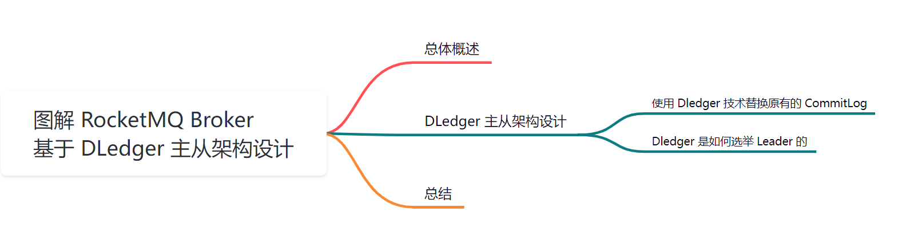
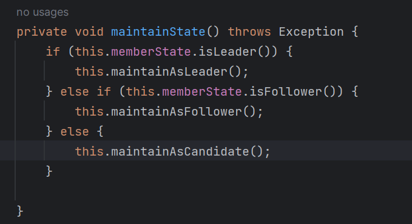
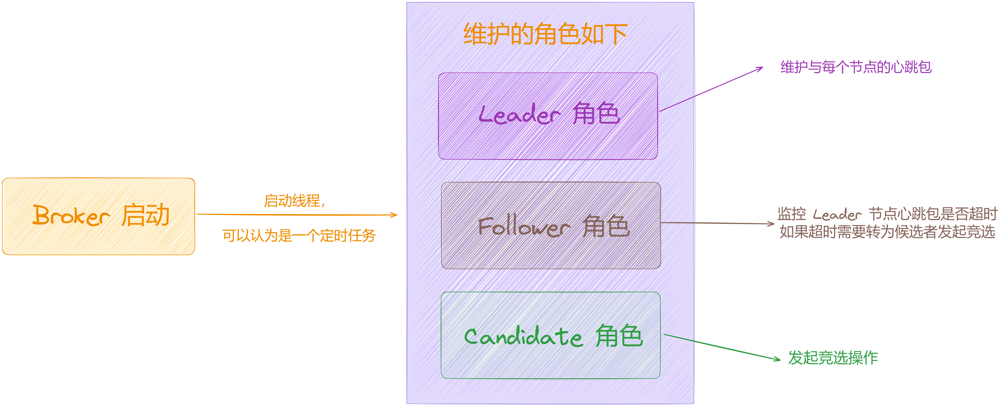
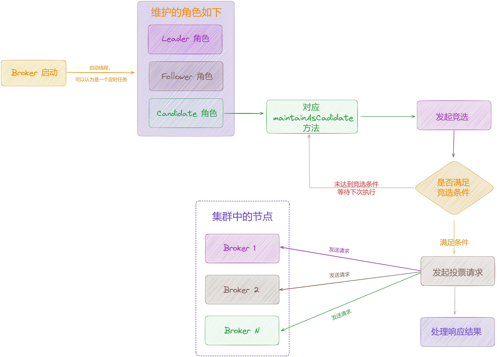
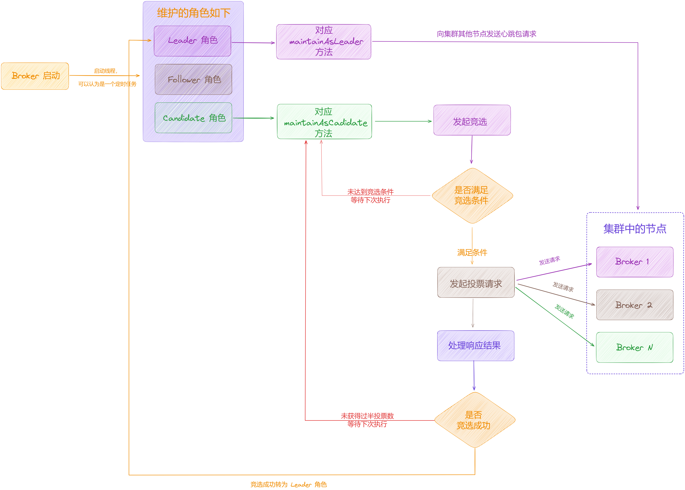

大家好，我是**华仔**, 又跟大家见面了。

从今天开始，我们开始对 RocketMQ 进行相关实现原理进行剖析，今天是第八篇，我们来聊聊 RocketMQ 「**Broker**」基于「**DLedger**」模式下的主从架构设计，深度剖析下其内部底层原理设计思想，**下面进入正题**。

  

## **01 总体概述**

在 RocketMQ 4.5 版本之前，采用的是「**Master/Slave 主从架构**」进行集群部署，一组 Broker 中有一个 「**master**」，0或者多个「**slave**」。「**slave**」通过同步复制或异步复制方式去同步 「**master**」的数据。「**Master/Slave 主从架构**」部署模式，提供了一定的高可用性。

但这样的部署模式有一定缺陷。比如故障转移方面，如果「**master 节点**」挂掉，不能自动在集群中选举出「**新的 master 节点**」，需要人工介入。

因此，我们希望能有一个新的多副本架构，去解决这个问题。新的多副本架构首先需要解决「**自动故障转移即自动选主**」的问题。大概方案基本可以分为两种：

1.  依赖 zookeeper 或者 etcd 组件，该方案会引入了重量级外部组件，加重部署，运维和故障诊断成本，目前 Kafka 2.8 版本之前是基于 Zookeeper 协助来完成的，但是维护 Kafka 集群还需要维护 zookeeper 集群，并且 zookeeper 集群故障会影响到 Kafka 集群。
2.  利用 raft 协议来完成自动选主，raft 协议相比前者的优点，是它不需要引入外部组件，自动选主逻辑集成到各个节点的进程中，节点之间通过通信就可以完成选主。

因此 RocketMQ 在 4.5 版本之后选择用「**raft 协议**」来解决这个问题，而「**DLedger**」就是一个基于「**raft 协议**」的「**commitLog**」存储库，也是 RocketMQ 实现新的高可用多副本架构的关键。

## **02 DLedger 主从架构设计**

先来看下什么是「**DLedger**」技术。

##   
**2.1 使用 Dledger 技术替换原有的 CommitLog**

这里我们要知道「**DLedger**」到底是个什么东西，实际上「**DLedger**」是内部实现了一套「**commitLog**」机制，如果启用了它，在接收到数据后首先就是写入自己的「**commitLog**」。

因此，引入「**DLedger**」技术，其实就是使用「**DLedger**」的「**commitLog**」来替换掉 Broker 原有的「**commitLog**」。然后 Broker 可以基于「**DLedger**」的「**commitLog**」，把消息的位置信息保存到「**ConsumeQueue**」中。

简单聊完「**DLedger**」技术是什么，接下来我们来聊聊它是如何实现主从自动切换的。

## **2.2 Dledger 是如何选举 Leader 的**

其实它是通过「**raft 协议**」来实现选主的，我们先来看下「**raft 协议**」的设计。

Raft 协议是分布式系统中的一种 「**共识算法**」，用于在集群中「**选举 Leader**」管理集群。Raft 协议中有以下三个角色：

1.  **Leader 领导者角色**：集群中的领导者，负责管理集群。
2.  **Candidate 候选者角色**：具有竞选 Leader 资格的角色，如果集群需要选举 Leader，节点需要先转为候选者角色才可以发起竞选。
3.  **Follower 追随者角色**：Leader 的跟随者，接收和处理来自 Leader 的消息，与 Leader 之间保持通信，如果通信超时或者其他原因导致节点与 Leader 之间通信失败，节点会认为集群中没有 Leader，就会转为候选者发起竞选，推荐自己成为Leader。

另外 Raft 协议中还有一个「**Term 任期**」的概念，任期会随着每一轮选举发生变化，一般是单调递增，比如说集群中当前的任期为 1，此时某个节点发现集群中没有「**Leader**」，开始发起竞选，此时任期编号就会增加为 2 表示进行了新一轮的选举。通常情况下会为「**Term**」较大的那个节点进行投票，当某个节点收到了过半「**Quorum**」的投票数（一般是集群中的节点数/2 + 1），将会被选举为「**Leader**」。

当 RocketMQ 在开启「**DLedger**」组件时，使用 [DLedgerCommitLog](http://dledgercommitlog/)，其他情况使用的是 [CommitLog](http://commitlog/) 来管理消息的存储。

Broker 启动后，会开启一个「**线程**」一直循环，是一个「**定时任务**」，不断的维护每个角色的处理逻辑，根据 Raft 协议得知节点有三种角色，所以对应三种处理逻辑：

1.  **Leader 领导者角色**：Leader 节点需要定时向 Follower 节点发送心跳包保持通信，以便在 Leader 节点出现故障的时候，Follower 节点可以判断，源码处理逻辑在 [maintainAsLeader](http://maintainasleader/) 方法中。
2.  **Follower 追随者角色**：监控收到 Leader 节点心跳包的时间，超过一定时间内未收到会认为 Leader 节点发生故障，需要转换为 Candidate 角色发起 Leader 节点选举，源码处理逻辑在 [maintainAsFollower](http://maintainasfollower/) 方法中。
3.  **Candidate 候选者角色**：在Candidate角色会发起竞选，源码处理逻辑在 [maintainAsCandidate](http://maintainascandidate/) 方法中。

默认在初始状态下，每个节点的角色为「**Candidate**」 ，所以会进入到「**Candidate**」 的处理逻辑中，在这里会触发一次选举。

## **2.2.1 发起投票请求**

当前节点会对自己维护的集群中所有节点进行遍历，然后向每一个节点发送投票竞选请求，流程如下：

  

##   
**2.2.2 其他节点处理投票请求**

集群中其他节点收到投票请求后，会先进行校验，判断「**发起请求的节点**」是否在「**维护的集群节点集合**」中，然后判断两类 [Term](http://term/) 大小，如下：

1.  对比「**请求中携带**」的 [LedgerEndTerm](http://ledgerendterm/) 与「**当前节点记录**」的 [LedgerEndTerm](http://ledgerendterm/)。
2.  如果小则说明请求的 [LedgerEndTerm](http://ledgerendterm/) 比较落后，则拒绝投票，返回状态[REJECT\_EXPIRED\_LEDGER\_TERM](http://reject_expired_ledger_term/)。
3.  如果相等但请求的 [LedgerEndIndex](http://ledgerendindex/) 小于当前节点维护的 [LedgerEndIndex](http://ledgerendindex/) 则说明发起请求的节点日志比较落后，则拒绝投票，返回状态 [REJECT\_SMALL\_LEDGER\_END\_INDEX](http://reject_small_ledger_end_index/)。
4.  对比「**请求中**」的 [Term](http://term/) 与「**当前节点**」的 [Term](http://term/) 大小。
5.  如果小则说明请求中的 [Term](http://term/) 比较落后，则拒绝投票返回状态为 [REJECT\_EXPIRED\_LEDGER\_TERM](http://reject_expired_ledger_term/)。
6.  如果相等但「**当前节点还未投票**」或者「**刚好投票给发起请求的节点**」，进入下一步；如果已经投票给某个Leader，拒绝投票返回 [REJECT\_ALREADY\_HAS\_LEADER](http://reject_already_has_leader/)，除此之外其他情况返回[REJECT\_ALREADY\_VOTED](http://reject_already_voted/)。
7.  如果大于则说明当前节点的 [Term](http://term/) 过小已经落后于最新的 [Term](http://term/) ，当前节点会转为「**Candidate**」角色，立刻发起选举，此时返回响应 [REJECT\_TERM\_NOT\_READY](http://reject_term_not_ready/) 表示当前节点还未准备好进行投票。
8.  如果请求中的 [Term](http://term/) 小于当前节点的 [LedgerEndTerm](http://ledgerendterm/)，则拒绝投票，返回 [REJECT\_TERM\_SMALL\_THAN\_LEDGER](http://reject_term_small_than_ledger/)。
9.  最后投票给发起请求的节点，返回 [ACCEPT](http://accept/) 接受投票状态。

## **2.2.3 发起节点处理投票响应结果**

当发起节点向集群中每个节点发起投票请求之后，会等待每个请求返回响应，根据响应状态做如下处理：

1.  响应状态是 [ACCEPT](http://accept/)：表示同意投票给当前节点。
2.  响应状态是 [REJECT\_ALREADY\_VOTED](http://reject_already_voted/) 或者 [REJECT\_TAKING\_LEADERSHIP](http://reject_taking_leadership/)：表示拒绝投票给当前节点。
3.  响应状态是 [REJECT\_ALREADY\_HAS\_LEADER](http://reject_already_has_leader/)：表示已经投票给了其他节点。
4.  响应状态是 [REJECT\_EXPIRED\_VOTE\_TERM](http://reject_expired_vote_term/)：表示返回响应的节点的 Term 比当前节点的大，判断返回的那个 Term 是否大于当前节点记录的最大 Term 的值，如果是对 knownMaxTermInGroup 进行更新，记录集群中已知最大的那个 Term。
5.  响应状态是 [REJECT\_SMALL\_LEDGER\_END\_INDEX](http://reject_small_ledger_end_index/)：表示返回响应节点的 LedgerEndIndex 比当前节点的大。
6.  响应状态是 [REJECT\_TERM\_NOT\_READY](http://reject_term_not_ready/)：表示有节点还未准备好进行投票。

经过以上逻辑处理之后，会等待一段时间「**通常是 2000 + 随机数**」毫秒，然后再判断「**本次选举**」是否成功，当收到的投票数过半，才能真正「**竞选成功**」，其他情况下需要等到当前节点到达下一次发起选举的时间，重新发起竞选。

## **2.2.4 成为 Leader 角色**

当节点收到集群中大多数投票后表示「**竞选成功**」，会将自己转为「**Leader 角色**」。

在开头的时候，我们说过在 Broker 启动时，会「**开启一个线程**」不断维护「**每个角色**」的处理逻辑，对于「**Leader 角色**」来说需要向「**Follower 节点**」发送心跳包保持通信，所以在成为「**Leader**」之后，下次执行就会进入到「**Leader 角色**」的处理逻辑，会判断「**上次发送心跳的时间**」是否大于「**心跳发送间隔**」，如果超过了就会向其他节点发送心跳包。

## **2.2.5 发送心跳包**

Broker 节点会向除自己以外的其他节点发送「**心跳请求**」，在心跳请求中会设置本次选举的相关信息，包括「**组信息**」、「**当前节点ID**」、「**目标节点ID**」、「**LeaderID**」、「**当前的 Term**」。

## **2.2.6 响应心跳包请求**

当心跳包返回响应之后，「**Leader 节点**」会对返回响应状态进行判断：

1.  [SUCCESS](http://success/)：表示成功，记录心跳发送成功的节点个数。
2.  [EXPIRED\_TERM](http://expired_term/)：表示当前节点的 Term 已过期落后于其他节点，将较大的那个 Term 记录在 maxTerm 中。
3.  [INCONSISTENT\_LEADER](http://inconsistent_leader/)：将 inconsistLeader 置为 true。
4.  [TERM\_NOT\_READY](http://term_not_ready/)：表示有节点还未准备好，也就是 Term 较小，此时记录未准备节点的数量。

因此「**Leader 节点**」在向其他节点发送了心跳包之后，如果「**收到过半的响应**」，只需更新跳包发送成功的时间，否则会在特定情况下再次发送心跳包进行确认，其他情况当前「**Leader 角色**」都会转为「**Candidate 角色**」，重新发起竞选操作。

## **2.2.7 成为 Follower 角色**

当某节点收到「**心跳包**」并「**同意**」发起选举的节点成为「**Leader 节点**」时，该节点会转为「**Follower 角色**」，在下次维护角色的处理逻辑时会进入到「**Follower 角色**」的处理方法中。

它首先会判断上次收到「**Leader 节点**」心跳包的时间「**是否超过了两倍**」的发送心跳间隔，如果超过则判断当前节点是否是「**Follower**」并且上次收到心跳包的时间大于「**最大心跳时间 \* 每次发送心跳的时间间隔**」，如果成立就会转为「**Candidate 角色**」等待发起竞选，也就是说如果「**Follower 节点**」长时间未收到「**Leader 节点**」的心跳请求，会认为「**Leader 节点**」出现了故障，会转为「**Candidate 角色**」，在「**Candidate 角色**」下会重新发竞选进行「**Leader 选举**」。

## **03 总结**

这里，我们一起来总结一下这篇文章的重点。

1、从「**RocketMQ 原有主从架构**」的缺点抛出了「**主从如何自动切换**」。

2、接着带你剖析了「**DLedger**」主从架构设计：「**使用** **DLedger CommitLog 替换原有 CommitLog**」+ 「**DLedger 如何进行 Leader 选举**」。

下篇我们来深度剖析「**Broker 基于 DLedger 模式的日志复制架构设计**」，大家期待，我们下期见。