大家好，我是**华仔**, 又跟大家见面了。

从今天开始，我们开始对 RocketMQ 进行相关实现原理进行剖析，今天是第六篇，我们来聊聊 RocketMQ 「**Topic**」数据分片机制全流程，深度剖析下其内部底层原理设计思想，**下面进入正题**。

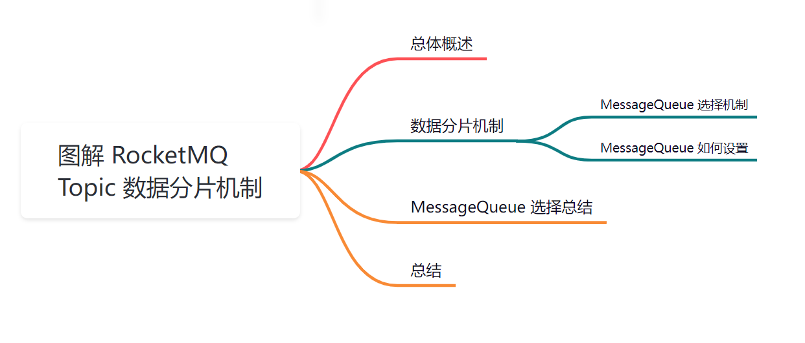

##   
**01 总体概述**

在消息中间系统中，都有一个关键的数据模型和概念，那就是「**Topic**」，跟 Kafka 类似，「**Topic**」对于 RocketMQ 来说，也是一个「**逻辑概念**」而不是「**物理概念**」，即逻辑上是一个大的数据集合。

当生产者往 RocketMQ 消息中间件的一个「**Topic**」写入消息时，实际上数据是写入到「**Broker**」中的，那么 「**Topic**」->「**Broker**」之间的关系是如何关联的呢？

  
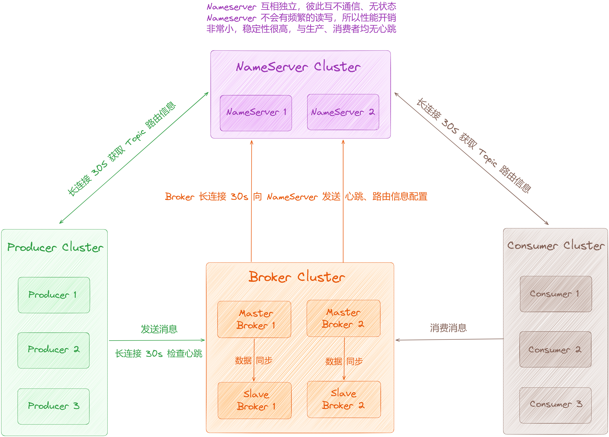

如图，你可以试想下，此时集群有很多组「**Broker**」，那么当消费者写入消息时，是都写入一个「**Broker**」里面呢？还是写入到不同的 「**Broker**」里面呢？

如果 Producer 端将消息都写入到一个「**Broker**」里面去，这个对于数据量很大的话肯定是会有问题的，会放不下的，跟 Kafka 类似即「**Topic 单分区**」这样，无法充分体现其性能。

那么 Producer 端势必会将消息写入分散存储到不同的「**Broker**」里面去，也就是说会充分利用多台「**Broker**」机器来承载 Producer 端生产出来的大量消息，从而实现消息的「**数据分片**」存储机制。这样每台「**Broker**」服务器上存储的消息数据都是一个「**数据分片**」，也就是说每台「**Broker**」服务器上存储的数据是不同的，将这些 Broker 存储的消息全部加起来就是全部的数据 。

  
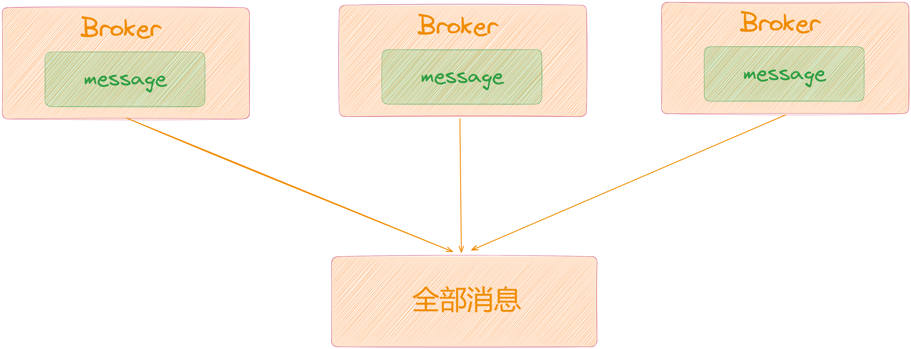

通过上面的方式实现了 「**Topic**」->「**Broker**」从虚到实的关联，这样就会引入一个很关键的概念「**数据分片**」。

## **02 数据分片机制**

那么什么是数据分片呢，用官方的概念就是 [队列（MessageQueue）](https://rocketmq.apache.org/zh/docs/domainModel/03messagequeue)，与 Kafka 中的「**分区**」概念类似。

「**Topic**」是 RocketMQ 中消息传输和存储的「**顶层容器**」，用于标识同一类业务逻辑的消息。而 「**MessageQueue**」是 RocketMQ 中消息存储和传输的「**实际容器**」，也是 RocketMQ 消息的「**最小存储单元**」，可以把它理解成对底层存储的「**抽象**」。

RocketMQ 的所有「**Topic**」都是由多个「**MessageQueue**」组成，以此实现队列数量的水平拆分和队列内部的流式存储。同一个「**Topic**」下的消息最终会分散存储在各个「**Broker**」上，**一方面能够最大程度进行容灾，另一方面能够防止数据倾斜**。此时「**鸡蛋就不在一个篮子里了**」，数据被较为均匀地分散出去，出现数据倾斜的概率也大大降低了。

既然有「**MessageQueue**」，那么消息是如何进行选择的呢？

## **2.1 MessageQueue 选择机制**

MessageQueue 选择有两种方式，「**启用 Broker 故障延迟机制**」、「**不启用 Broker 故障延迟机制**」，默认请情况是不启用。

所谓「**故障延迟机制**」，是指发送消息时，若某个队列对应的「**Broker**」宕机了，在默认机制下很可能下⼀次选择的队列还是在已经宕机的「**Broker**」，没有办法规避故障的「**Broker**」，因此消息发送很可能会再次失败，重试发送造成了不必要的性能损失。

因此「**Producer**」端提供了「**故障延迟机制**」来规避故障的 Broker 。

  
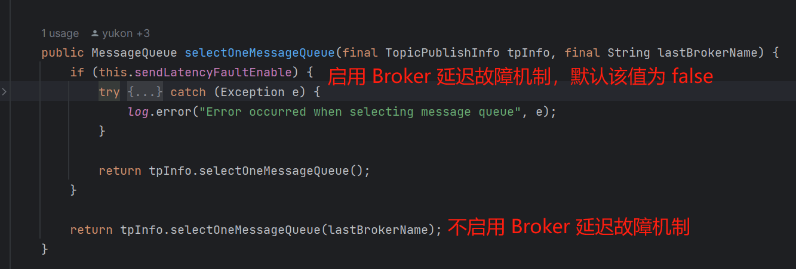

## **2.1.1 不启用 Broker 延迟故障机制**

刚开始的时候，会先计算一个随机值，假如此时为 5，然后对 MessageQueue 队列个数进行取模为 1，然后就对第二个 MessageQueue 对应的「**Broker**」进行发送数据。

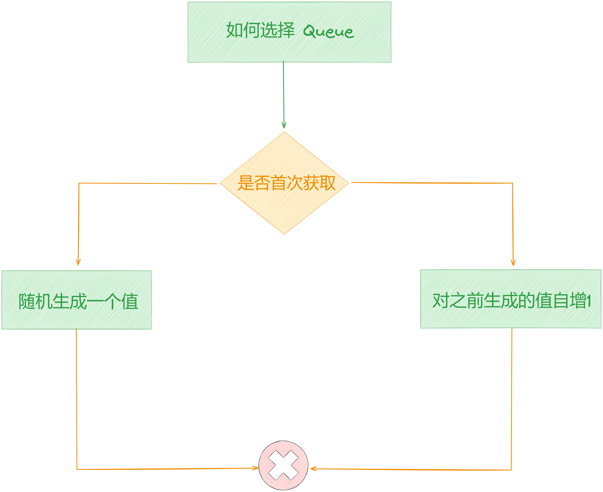

针对下一条消息，随机值会加 1，取模后为 2，即对第三个 MessageQueue 对应的「**Broker**」进行发送数据。以此类推，简单的说，就是轮询的方式。

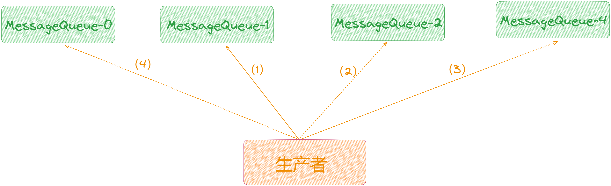

由于 Broker 在运行的过程中很可能会出现问题，假如 MessageQueue-0 对应的「**Broker**」为「**broker-a**」，MessageQueue-1 也是「**broker-a**」。

那发送给 MessageQueue-0 的「**broker-a**」失败的时候，会把「**broker-a**」记录下来。重试的时候会继续迭代，此时会轮询到 MessageQueue-1，一看 broker 也是「**broker-a**」，那就会继续往下轮询，接着去找 MessageQueue-2，通过 MessageQueue-2 进行发送消息。

这样的机制，就会避免重试到同一个「**Broker**」，减低失败的可能性。

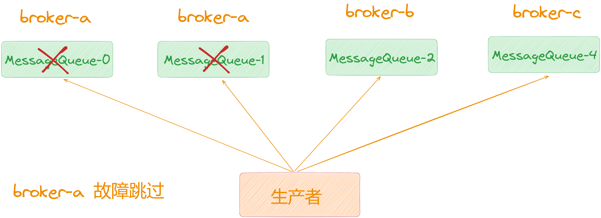

## **2.1.2 启用 Broker 延迟故障机制**

当 MQ 发送消息的时候会记录该消息发送的时间，如果「**broker-a**」是 「**50**」毫秒，那下次发送就可以直接发，如果是「**550**」毫秒，那需要等 「**30**」秒后才可以发给「**broker-a**」，规则同下表。

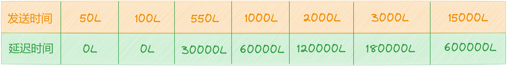

假如此时是 800 毫秒呢，通过上表可以看出它是介于 550 L 到 1000 L 之间，所以算 550 L 这个档，也就是延迟 30 秒。

如果是「**Broker**」故障等导致失败，则会直接当作 3 万毫秒，相当于 600 秒内不能发送这个 「**Broker**」。

在这种机制下，每次发送消息的时候也是通过轮询的，但是轮询拿出一个 MessageQueue，就会去判断这个「**broker-a**」是否在延迟时间内，如果还需要等待，那就继续轮询下一个 MessageQueue。

如果都在延迟时间内，那就找一个相对可用的，如果也没有相对可用的，那就继续轮询，直接返回对应的MessageQueue。

## **2.2 MessageQueue 如何设置**

说到设置，当创建主题时，可以指定 [writeQueueNums](http://writequeuenums/)（写队列的个数）、[readQueueNums](http://readqueuenums/)（读队列的个数）。生产者发送消息时，使用写队列的个数返回路由信息；消费者消费消息时，使用读队列的个数返回路由信息。在物理文件层面，只有写队列才会创建文件。

默认「**读**」、「**写**」队列的个数都是「**16**」，如下图所示：

  
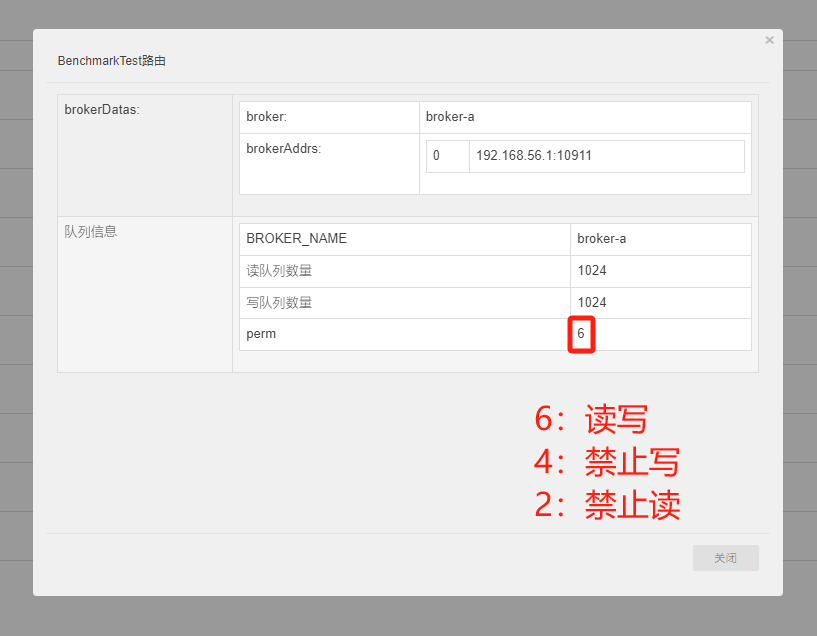

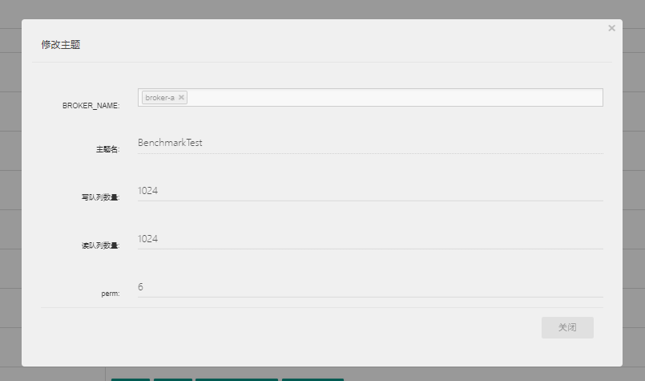

## **03 MessageQueue 选择总结**

首先我们需要明白「**MessageQueue**」，一个「**Topic**」内可以有多个「**MessageQueue**」，也就是队列用来存放消息的。可以在创建「**Topic**」的时候指定「**MessageQueue**」的数量。

假如我们现在有一个「**Topic**」，并为它指定了 4 个 「**MessageQueue**」，此时来看看在「**Broker**」集群下是怎么分布的。

通过上面的剖析，我们知道「**MessageQueue**」本质上就是一个「**数据分片机制**」，在这个机制中假如你一个Topic 有 10 万条数据，然后有 4 个「**MessageQueue**」，此时大致每个「**MessageQueue**」就会存 2.5 万个消息。

了解了消息在「**Broker**」上是如何存储的，那么此时生产者是如何知道将消息写入哪个 「**MessageQueue**」呢？

此时生产者会跟「**NameServer**」 进行通信获取「**Topic**」的数据信息，所以生产者就会知道「**Topic**」中有多少个「**MessageQueue**」，哪些「**MessageQueue**」在哪个「**Broker**」上。

而消息发送到哪个「**MessageQueue**」上，默认情况下是轮询均衡的发送到各 「**MessageQueue**」上的。

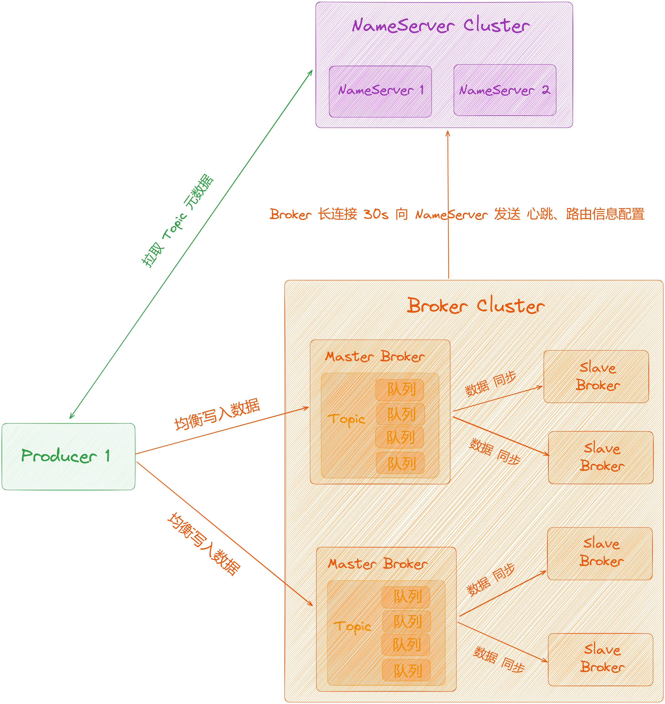

假如现在某个「**Master Broker**」 挂了，此时会等待其他「**slave**」切换为「**master**」，但这个时间段这组 「**Broker**」就没有「**master**」提供写操作了。那么此时消息发送到「**master**」就会失败。

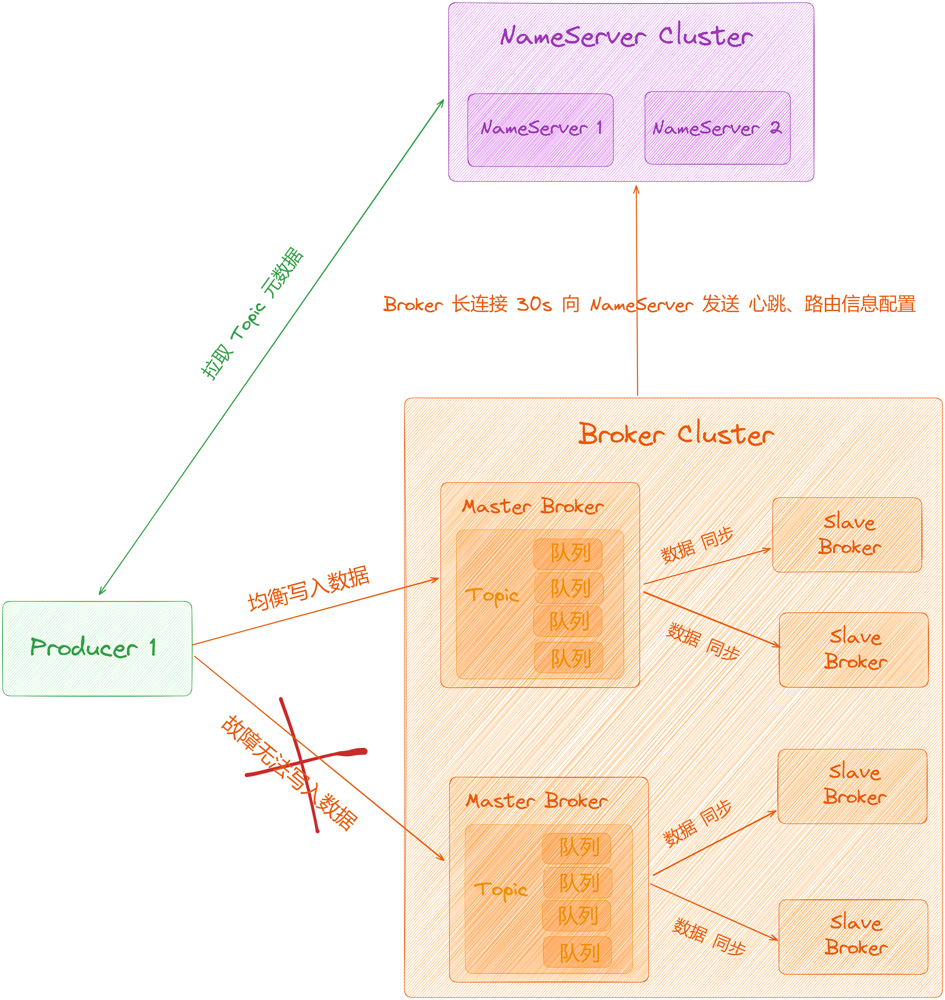

## **04 总结**

这里，我们一起来总结一下这篇文章的重点。

1、从「**RocketMQ**」架构图中抛出了「**Producer**」端消息发送时发起到 Topic 中，在 Broker 端是如何进行存储的。

2、接着带你剖析了「**数据分片机制**」以及「**MessageQueue**」选择以及如何设置。

2、最后带你剖析了「**MessageQueue**」选择全流程。

下篇我们来深度剖析「**Broker 高并发读写机制以及性能优化**」，大家期待，我们下期见。