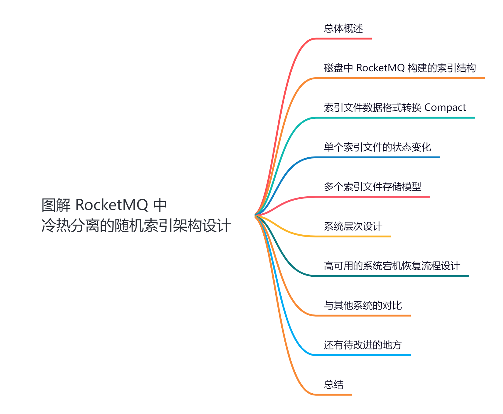
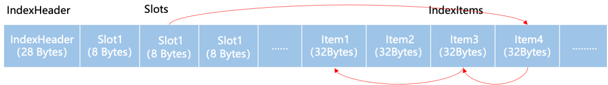
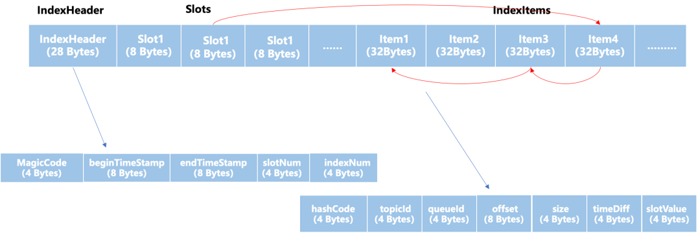
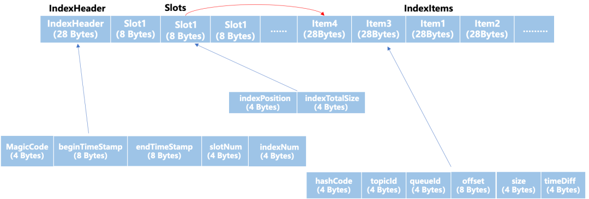
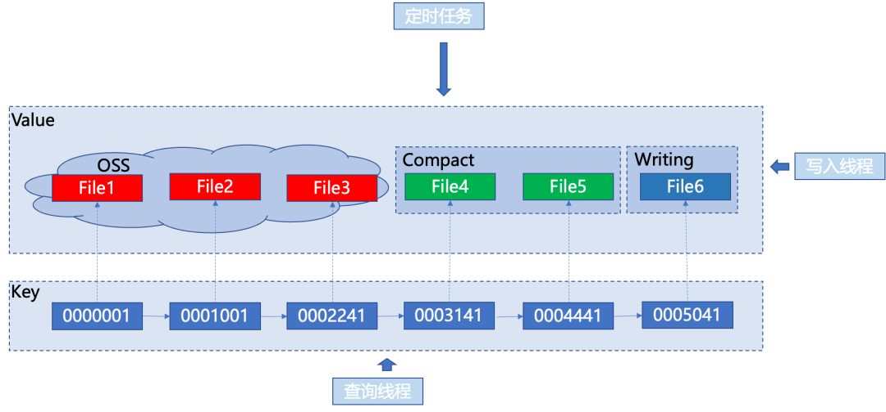
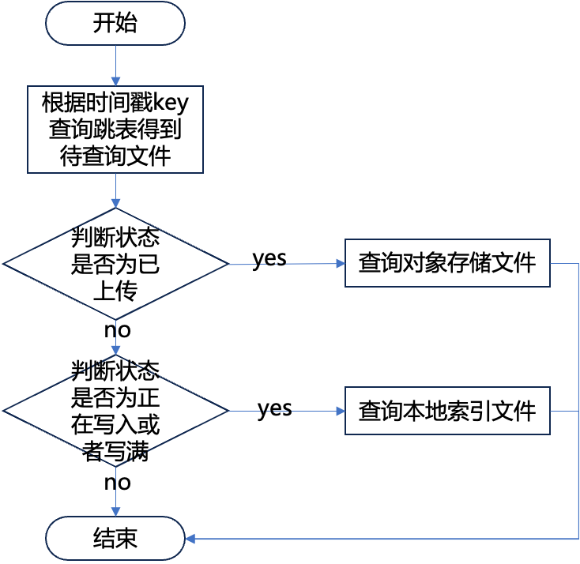
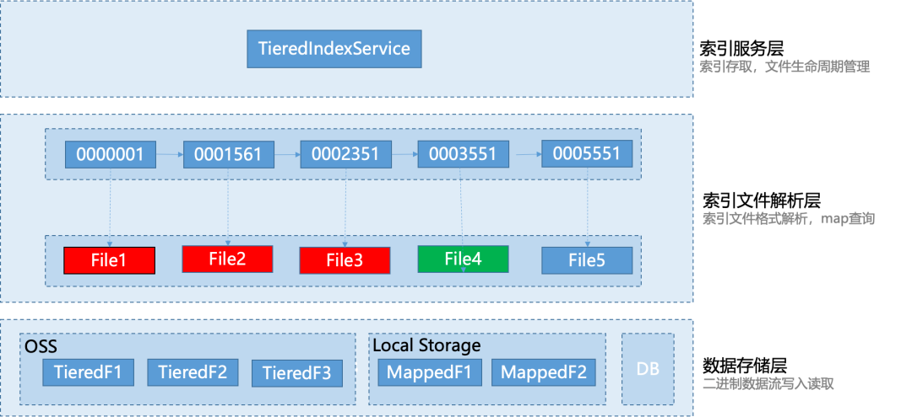

大家好，我是**华仔**, 又跟大家见面了。

从今天开始，我们开始对 RocketMQ 进行相关实现原理进行剖析，今天是第十篇，我们来聊聊 RocketMQ 中「**冷热分离**」的「**随机索引**」架构设计，深度剖析下其内部底层原理设计思想，**下面进入正题**。

  

## **01 总体概述**

RocketMQ 广泛使用于各类业务场景中，在实际生产场景中，用户通常会选择「**消息ID**」或者「**特定业务 Key**」（例如学号，订单号）来查询和定位特定的一批消息，进而定位分布式系统中的复杂问题。传统方案下，消息索引的存储是基于数据库系统或者基于本地文件系统实现的，受限于磁盘容量，很难满足海量数据的写入诉求。

在云原生场景下，「**对象存储**」能够为用户提供弹性和按量付费的能力，有效降低存储成本，但对「**随机读写**」的支持不够友好。RocketMQ 的「**队列模型**」中写入的数据是按「**时间近似有序**」的，对于「**随机索引**」热数据实现了 non-stop write 的特性，同时支持「**冷热分离**」，使用「**异步规整**」的方式冷数据转移到更廉价存储系统中。

## **02 磁盘中 RocketMQ 构建的索引结构**

索引是一种以「**空间换时间**」的支持「**快速存储**」和「**查找**」的高效数据结构，我们来看看 RocketMQ 的索引文件的结构设计。

RocketMQ 的「**索引文件结构**」采用「**三段式**」结构基于「**头插法**」的 「**HashTable**」设计的。该索引文件存储结构具有「**查询速度快**」、「**占用空间小**」、「**易于维护**」等特点，但是随着数据量的增加，本地索引文件数量也会不断增加。

分别为：「**索引头部 IndexHeader**」、「**索引槽 Slots**」、「**索引条目 IndexItems**」，如下图所示：

索引文件结构

Hash 冲突的索引通过「**单向链表**」进行连接，索引条目采取「**文件末尾追加写入**」的方式提升写入性能：

1.  索引头部（IndexHeader）包含了该索引文件的元数据信息，其中包括了 MagicCode 用来判断文件的起始位置。开始时间戳（startTimeStamp）和结束时间戳（endTimeStamp）表示了索引存储的时间区间范围。然后还包括了该文件已经使用的索引槽数量（hashSlotCount）和已经存储的索引数量（indexCount）。
2.  索引槽（Slots）为固定数量，其中存储了产生哈希冲突的索引索引的头节点所在的位置，通过哈希映射得到哈希值，然后哈希值对索引槽（Slots）数量进行取余得到索引具体的槽的位置，可以看作链表的头节点。
3.  索引条目（IndexItems）存储了每个索引具体存储的数据，消息队列发送的消息最后都存储在一个特定 topic 的一个队列的一个叫做 CommitLog 的文件中，因此每个索引条目都包含了 topicId，QueueId，Offset，Size 等信息来定位到实际消息在 CommitLog 中的存储位置。

IndexItems

## **03 索引文件数据格式转换 Compact**

在 RocketMQ 中，由于「**索引模块**」是一个「**写多读极少零更新**」的结构，因此为了降低系统整体的平均操作代价，「**单次读**」有一些「**读放大**」的开销是可以接受的。

假设消息索引写入时间开销需要 t1，平均每条消息索引在经过 t2 之后被查询，格式转换时间开销为 t\_compact，通常 t\_compact 远远小于 t2，因此 t\_compact 可以在 t2 时间内「**异步完成**」，格式转换前消息索引查询时间为 t\_before，格式转换后的消息索引平均查询时间开销为 t\_after，格式转换后消息索引平均查询时间开销小于格式转换后查询时间开销 t\_before < t\_after，那么不进行格式转换数据存储查询时间开销大于进行了格式转换后存储查询时间开销 。

t1 + t2 + t\_before > t1 + t2 + t\_after。

RocketMQ 索引文件使用基于「**头插法**」实现的开链的「**HashTable**」，在索引写入时可以「**顺序写入**」。然而，在进行指定 key 查询时，由于使用的是「**单向链表**」，对 key 进行 hash 到指定 slot 并获取到「**链表头节点**」，然后根据「**链表头节点**」遍历「**单向链表**」属于「**随机 IO**」查询，对象存储类似于机械硬盘的特性，读取 20 Bytes 和读取数 KB 时间几乎相同，多次随机 IO 会造成较大的时间开销，因此在较多 Hash 冲突时可能存在严重的数据读放大问题。

为了减少对象存储文件的随机查询访问次数，「**多级存储**」异步对索引文件数据格式转换，格式转换后的索引文件可以一次性取回大块数据，可以极大的减少对对象存储文件的 IO 访问次数。

具体地，「**随机索引异步重排机制**」包括以下步骤：

1\. 将本地索引文件按照映射后的 slot 槽为单位进行分组，每组包含一定数量的索引项。

2\. 对相同的组按照顺序写入新的索引文件，同一个槽对应的组的索引项在物理地址空间上是连续的数组。

3\. 在需要查询时，根据要查询的 key 的 hash 值，映射到指定的槽，然后槽的位置存储了数组的首地址，通过遍历数组，确定需要查询索引。

通过这种方式，可以「**大大减少**」在对象存储中进行的「**随机查询**」操作，从而提高查询效率，降低时间开销。同时，由于本地索引文件需要进行格式转换和分组，因此也需要一定的计算和存储资源。

*格式转换前*

重排后的索引文件，将「**物理地址不连续**」的链表重新排列成了「**物理地址连续**」的数组，每个 SlotItem 的 8 个字节，前 4 个字节用来记录「**数组的首地址**」，后 4 个字节用于记录「**数组的长度**」。这样的格式转换有以下几个好处。

1.  这样后续对索引的读取从链表的随机 IO 变成了数组顺序 IO。降低了随机 IO 带来的时间开销。
2.  可以利用空间局部性，增加内存 pageCache 的缓存命中率。

## **04 单个索引文件的状态变化**

单个索引文件生命周期

「**单个索引文件**」的容量是有限的。当有许多索引进行写入时，一个索引文件达到了能够存储的最大索引数量后，需要新建一个索引文件继续写入。因此一个文件「**从创建到销毁**」都会经历「**新建文件**」，「**Compact 文件**」，「**上传成为对象存储文件**」，「**过期销毁**」等阶段。

当一个“「**正在写入文件**」“ 状态的索引文件完全写满后，需要将其标记为“「**Compact 文件**」”状态。Compact 文件状态意味着该文件已经不再需要被写入并且已经 Compact 完成，但是仍然需要被保留以便后续上传到对象存储。此时，可以通过将该文件上传到对象存储系统进行存储，并将其标记为“「**对象存储文件**」”状态。因此也对应了文件的三种状态，「**unsealed**」、「**compacted**」、「**upload**」。

## **05 多个索引文件存储模型**

为了实现 Non-Stop Write 的特性，提高索引的写入性能，设计划分了三种不同的线程进行相互协作。他们分别为「**写入线程**」，「**索引查询线程**」和「**后台定时任务线程**」。他们各自负责不同的任务，并且通过读写锁来保证并发条件下正确性。消息队列是一个按时间近似有序的存储系统，不同的索引文件存储了不同时间段的索引，因此可以按照时间的近似有序性来管理多个文件。采用跳表数据结构进行管理，可以很方便的支持快速的定位查找和区间查询。

1.**写入线程**是非阻塞的，它的职责是将索引写入到队列尾部的处于正在写入状态的文件。当一个文件写满后，该线程会自动在队列尾部新建一个文件，并切换到下一个文件进行写入。为了提高写入效率，该线程在将索引写入文件时还负责将索引缓存在内存中，当缓存达到一定数量后再将其批量写入到文件中，以减少磁盘 IO 次数。

2.**索引查询线程**可以查询处于不同状态的索引文件具体查询策略如下：

1.  对于处于正在写入状态的文件，查询线程需要等待写入线程将索引写入完成后才能进行查询；对于已经写满的文件，查询线程可以直接对其进行查询；对于已经 Compact 的文件，查询线程也直接从本地文件进行查询。
2.  对于上传到对象存储的文件，可以直接从对象存储中读取其数据，对 Compact 后格式的索引文件进行查询。

3.**后台定时任务线程**主要负责对正在处于写入状态的文件并且已经写满的文件进行 Compact 操作。在进行 Compact 操作时，该线程需要先获取对应文件的读写锁，以避免其他线程对该文件的并发访问。Compact 完成后切换该文件的状态为 Compact 完成，然后需要将 Compact 过的文件上传到对象存储成为对象存储文件，上传完将文件状态切换成已上传状态。在上传过程中，该线程需要释放对该文件的读写锁。

## **06 系统层次设计**

为了提高系统的可扩展性和方便编写单元测试，整个索引服务采用了「**层次设计**」的思想，自顶向下，分别设计了「**索引服务层**」、「**索引文件解析层**」和「**数据存储层**」。不同的层负责处理不同的任务，层与层之间解耦合，上层只依赖下层提供的服务。

1.  **索引服务层****：**该层为 RocketMQ 提供消息索引服务，它的职责是负责消息索引的存储和查询，同时负责索引文件的生命周期管理，包括创建索引文件、Compact 文件、上传文件，销毁文件等。
2.  **索引文件解析层****：**该层主要针对单个处于不同状态的索引文件进行格式解析，同时提供单个文件的 KV 查询和存储服务。具体而言，该层负责读取索引文件中的数据，并将其解析为可读格式，以供上层调用。
3.  **数据存储层****：**该层负责二进制流数据的写入和读取，支持不同类型的存储方式，包括对象存储、本地磁盘文件、或者数据库文件等。具体而言，该层将数据存储在本地磁盘或对象存储中或数据库文件。在读取数据时，该层负责从本地磁盘或对象存储中获取数据，并将其转换为二进制流数据返回给调用方。

通过采用「**层次设计**」的思想，将整个索引服务划分为三个不同的层次，使得系统具有良好的可扩展性和可维护性，方便后续升级和维护。同时，各层次之间解耦合，职责明确，方便进行单元测试和维护。

## **07 高可用的系统宕机恢复流程设计**

由于索引文件有不同的状态，通过「**跳表**」的数据结构进行管理和维护，在系统宕机状态下，需要对处于不同状态的索引文件进行恢复。为此，我们采用了「**分类分文件夹**」进行管理，通过「**文件夹名称**」来对「**不同状态**」的索引文件进行管理和记录。

在进行「**宕机恢复**」时，我们采用了以下流程设计：

1\. 在系统重新启动后，读取存储在系统中的文件夹名称列表，该列表中包含了所有处于不同状态的索引文件所对应的文件夹名称。

2\. 通过文件夹名称列表，依次读取每个文件夹下的索引文件，并将这些索引文件加载到内存中，重新构建跳表。

3\. 根据文件夹名称以及其对应的索引文件，恢复当前文件所处的状态。例如，如果文件夹名称为 “writing”，则表示该文件夹下的索引文件正处于写入状态，需要根据写入状态进行相应的处理。

## **08 与其他系统的对比**

「**Rocksdb**」是基于「**Google LevelDB**」研发的高性能 kv 持久化存储引擎。RocksDB 使用 Log-Structured Merge（LSM）trees 作为基本的数据存储结构。当数据写入 RocksDB 的时候，首先会写入到内存中的 「**MemTable**」并持久化到磁盘上的 「**Write-Ahead-Log（WAL）**」文件上。

每当「**MemTable**」缓存数据量达到预设值，「**MemTable**」与「**WAL**」 将会转为不可变状态，同时分配新的 「**MemTable**」与「**WAL**」用于后续写入，接着对不可变 MemTable 中相同 key 进行 (merge)，LSM tree 有多个层级 (Level)，每个层级由多个「**SSTable**」组成，最新的「**SSTable**」都会放置在最底层，下层的「**SSTable**」通过异步压缩（Compaction）操作创建。

每层的「**SSTable**」总大小由配置参数决定，当 L 层数据大小超出预设值，会选择 L 层的「**SSTable**」与 「**L + 1**」层的「**SSTable**」重叠部分合并，通过重复这一过程优化数据的读性能，但 Compaction 这个动作会带来较大的读写放大。

「**MySQL InnoDB**」是一种事务型存储引擎。它提供了高性能、高可靠性和高并发性的特性，底层采用 B+ 树进行实现，数据文件本身就是索引文件。为了解决宕机时数据丢失的问题，InnoDB 采用了「**RedoLog**」同步记录写行为。因为「**RedoLog**」是顺序写入，因此写入的效率很高，数据将会先写入缓存和「**RedoLog**」中。

最后数据会异步再从「**RedoLog**」写入 B+ 树中。由于 B+ 树的层次结构导致能够支持的索引数量是有上限的，例如单表超过数亿级别的记录时就会产生显著的性能下降。同时 B+ 树叶子结点的分裂与合并也会带来较多的读写开销。

「**RocketMQ**」本身是一个「**写多读极少零更新**」并且按「**时间近似有序**」的存储系统。因此 RocketMQ 可以按照时间简单高效地进行「**冷热分离存储**」。也支持异步的文件格式转换来降低系统整体时间开销。

## **09 还有待改进的地方**

当前的索引设计简单可靠，但还有一些设计上的不足之处。

例如：当前通常消息队列通过「**key**」查询消息时，还会有一个「**maxCount**」参数，由于对「**不同的索引文件**」查询时并发的，当前系统的实现存在缺陷，可能需要「**查询完所有的索引文件**」，然后对结果进行「**汇总**」，判断是否达到「**maxCount**」参数指定的索引数量。

当存在较多的索引文件时，这样可能存在潜在的「**大量查询**」带来多余的时间开销。因此一个合理的解决方式是我们需要一个「**多线程全局计数器**」，当满足「**maxCount**」时，可以停止对后续多余的索引文件进行查询。这里涉及到多线程访问时可能出现的线程安全问题。

本消息队列多级存储索引模块提供 kv 数据查询和存储，可以对「**索引条目 indexItem**」进行重新设计，可以使本系统迁移到其他系统，为其他系统提供索引服务。只需要新增一个类将 **indexItem** 作为父类继承，重写相关函数，添加自定义字段，就可以实现对其他系统提供索引服务。

### **参考文档：**

\[1\]Zhang, H., Wu, X., & Freedman, M. J. (2008). PacificA: Replication in Log-Based Distributed Storage Systems. \[Online\]. Available:

*[https://www.microsoft.com/en-us/research/wp-content/uploads/2008/02/tr-2008-25.pdf](https://www.microsoft.com/en-us/research/wp-content/uploads/2008/02/tr-2008-25.pdf)*

\[2\]Facebook. (n.d.). RocksDB Compactions. \[Online\]. Available:*[https://github.com/facebook/rocksdb/wiki/Compaction](https://github.com/facebook/rocksdb/wiki/Compaction)*

\[3\]Oracle Corporation. (n.d.). "Inside InnoDB: The InnoDB Storage Engine" - Official MySQL Documentation. \[Online\]. Available:*[https://dev.mysql.com/doc/refman/8.0/en/innodb-internals.html](https://dev.mysql.com/doc/refman/8.0/en/innodb-internals.html)*

原文链接：[https://mp.weixin.qq.com/s/F0aHD9UTF4YBzIKCwrWwmw](https://mp.weixin.qq.com/s/F0aHD9UTF4YBzIKCwrWwmw)