大家好，我是**华仔**, 又跟大家见面了。

从今天开始，我们开始对 RocketMQ 进行相关实现原理进行剖析，今天是第十七篇，我们来聊聊 RocketMQ「**4.9.7 版本性能压测**」，深度剖析下其内部底层原理设计思想，**下面进入正题**。

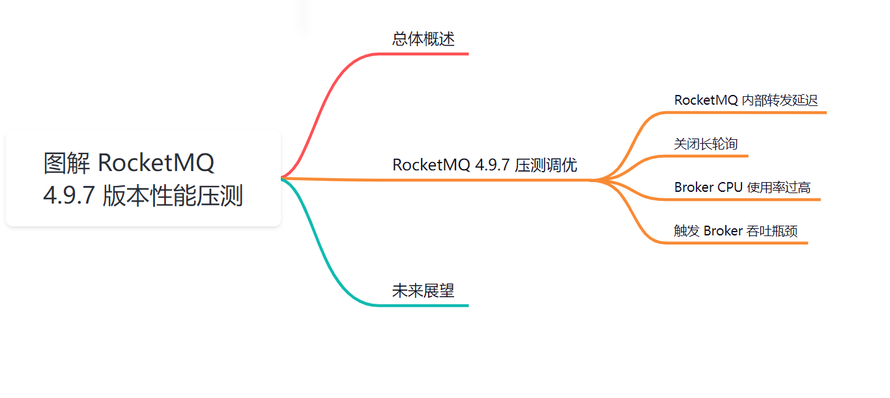

##   
**01 总体概述**

随着公司“降本增效”理念逐步深入落实贯彻，消息中间件与运维团队今年备战“双十一”的基本原则：不增加新的资源投入情况下，确保今年“双十一”平稳进行。

为了应对“双十一”，必须对现有集群的性能进行摸底，故为此搭建了一个4主4从的集群，48C/256G/SSD磁盘，200个主体、400个消费组同时运行，发现集群的总TPS达到28W后集群就出现了Commitlog文件转发延迟，出现拐点，压测结束，压测情况如下图所示：

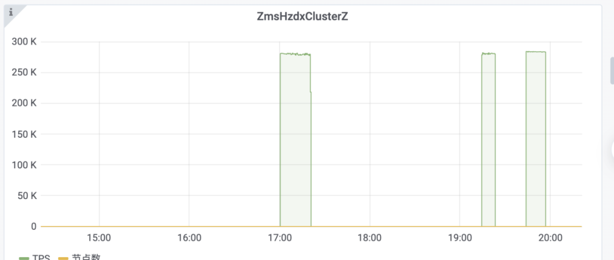

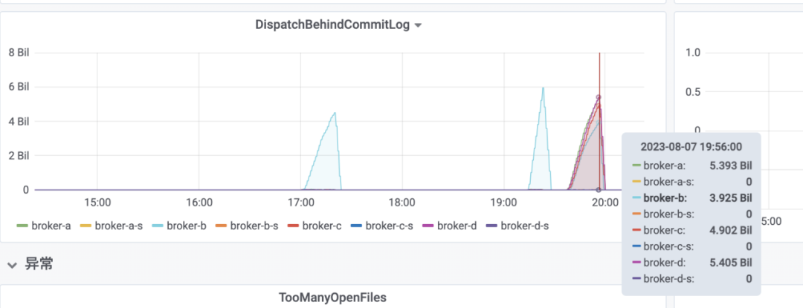

经过初步压测，「**4.8.0 版本**」下 RocketMQ Broker 单节点在「**CPU**」、「**内存**」、「**磁盘**」都空闲的情况下单节点 TPS 才 「**7W**」，资源浪费实在太严重，无法满足“双十一”的诉求。

通过阅读官方 RocketMQ 版本的变更日志，我们发现 RocketMQ 后续版本进行了大量的性能优化，故决定对新版本进行性能压测。

## **02 RocketMQ 4.9.7 压测调优**

## **2.1 RocketMQ 内部转发延迟**

我们将压测环境的 RocketMQ 版本升级到 4.9.7，不做任何参数调整的情况下，使用「**200 个 Topic**」，「**400 个消费组**」采用等比例发送「**256b**」、「**512b**」、「**1k**」、「**4k**」、「**1M**」的消息，TPS 可以持续达到「**23W/TPS**」，性能提升十分显著，为此通读 RocketMQ 4.9.2 到 4.9.7 版本的更新日志，发现官方性能调优的核心要点如下：

1\. 优化锁的粒度，将一些耗时长的代码并且可并行运行的代码从锁中移除，提升并发度。

2.优化 Commitlog 转发 ConsumeQueue 的性能，主要的优化手段是将 FileChannel 调整为 MappedByteBuffer。

将压测模式切换到固定大小「**1k**」再次压测时发现当 TPS 达到 「**13W/TPS**」 时又出现了内部转发消息延迟。

RocketMQ 4.8.0、4.9.7 在写入「**TPS**」过大后容易出现内部转发延迟，这在生产实践时是不可接受的，因为会造成消息消费处理不及时，为此简单分析了 RocketMQ 内部转发机制，如下图所示：

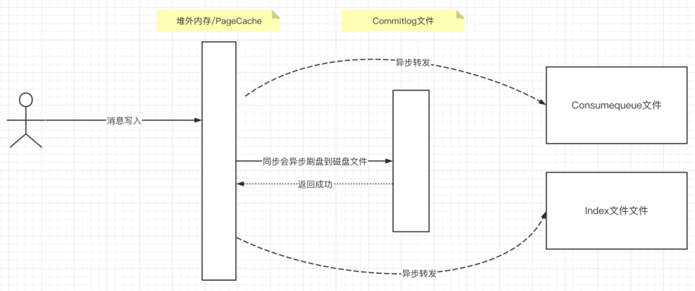

当消息写入到「**PageCache**」或「**FileChannel**」后，就会「**异步转发**」到「**ConsumeQueue**」、「**Index 索引文件**」，在 RocketMQ 整个转发过程是由「**ReputMessageService**」线程承载，该线程会根据需要转发的「**Offset**」，解析出一条消息，然后依次将消息转发到消息消费队列「**ConsumeQueue**」、「**Index 索引文件**」，即整个过程是一条消息一条消息串行转发，当海量消息需要转发时该过程会出现性能瓶颈。

「**ReputMessageService**」线程转发机制如下图所示：

  
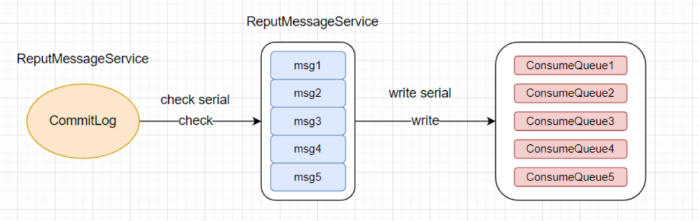

针对这个问题能否进行优化呢？

上述过程中的所涉及到的各个子步骤能否进行多线程改造呢？

带着这个问题翻看了 RocketMQ 5.x 的更新记录，发现官方已经对其进行了优化，具体优化方案如下图所示：

  
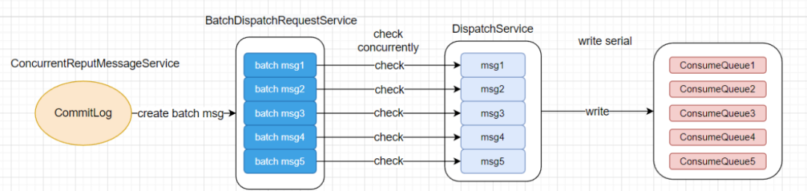

  
主要的核心优化点如下：

1.  发送者向 broker 发送消息。
2.  broker 写入消息到 CommitLog。
3.  ConcurrentReputMessageService线程按顺序扫描CommitLog消息，并将它们拆分为大约4MB的Batch CommitloLog消息，然后为每个Batch CommitLog分配一个有序编号。
4.  BatchDispatchRequestService线程池中的线程会并发检查CommitLog消息，检查成功后按照排序号放入集合的相应位置。
5.  DispatchService线程按顺序取出选中的CommitLog消息，将CommitLog消息转换为ConsumeQueue消息，并将其写入ConsumeQueue。

于是决定将 RocketMQ 相关的 PR 从 5.x 合并到 4.9.7 版本，再次压测，在 TPS 达到「**20W/TPS**」时会出现消息转发延迟，相比之前「**13W**」左右 TPS 就出现，情况有了明显改进，但后续经过我们的压测发现 RocketMQ 单节点的上线应该可以在「**25W/TPS**」左右，故需要继续进行调优。

## **2.2 关闭长轮询**

在对「**ConcurrentReputMessageService**」 进行多线程并发处理后有了显著提升，但还是无法跟上 Broker 单节点承载的上限，故需要继续对进行优化。

为此在压测期间使用 arthas 工具分析线程栈，查看当前负载最高的线程的线程栈：

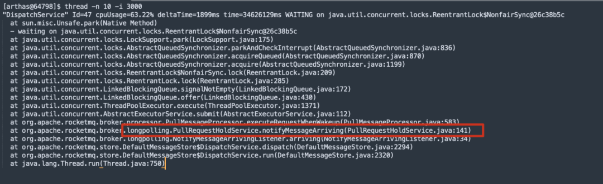

结合 RocketMQ 源码分析，如果开启了长轮询，当把「**CommitLog**」文件中的消息转发到「**ConsumeQueue**」后会「**立即通知消息拉取线程**」，告知已有新的消息达到，从而「**唤醒消息拉取线程**」，及时将消息传送到消费者。

但是「**Dispatch**」线程实在是太宝贵了，这个会影响整个消息从「**CommitLog**」转发到「**ConsumeQueue**」，那是否可以关闭长轮询机制呢？

接下来从源码级别深入介绍一下 「**RocketMQ 长轮询机制**」。

长轮询是客户端向服务端拉取消息时服务端第一次未查询到新的消息时触发挂起操作，代码的入口：

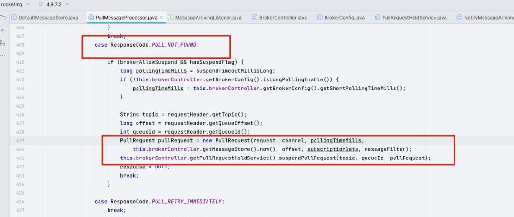

**关键点：未查询到消息，即没有新消息需要消费时。**

**上述代码的关键要点：**

**第一阶段：**

1.  如果开启长轮询(longPollingEnable=true)，则 [pollingTimeoutMills](http://pollingtimeoutmills/) 为 20s，取自消息拉取客户端[brokerSuspendMaxTimeMillis](http://brokersuspendmaxtimemillis/) 属性。
2.  如果未开启长轮询，则 [pollingTimeoutMills](http://pollingtimeoutmills/) 为 1s
3.  然后构建 [PullRequest](http://pullrequest/) 对象（包含本次拉取超时时间），通过调用 [PullRequestHoldService](http://pullrequestholdservice/) 线程的 [suspendPullRequest](http://suspendpullrequest/)方将其放入到中的任务队列，**放入队列后，并不会阻塞拉取线程处理其他拉取任务。**

**第二阶段：**[PullRequestHoldService](http://pullrequestholdservice/) 线程负责通知。

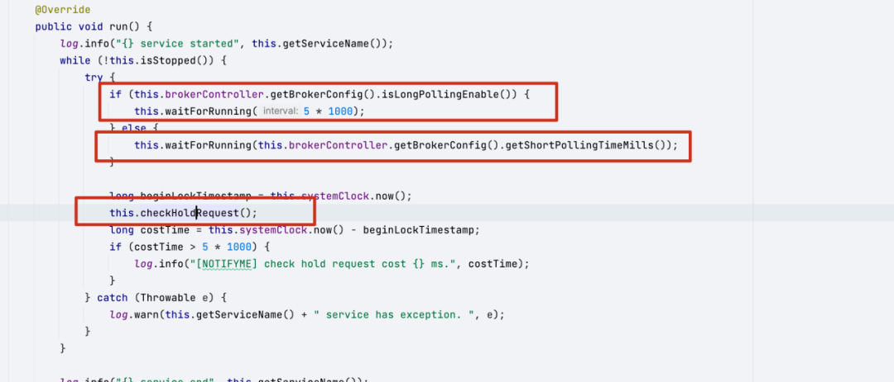

**关键点：**如果开启长轮询，[PullRequestHoldService](http://pullrequestholdservice/) 线程会间隔 5s 做一次检查，然后调用 [checkHoldRequest](http://checkholdrequest/)。

**在检测的过程中，如果没有新消息到达Broker并且超过了设置的超时时间后会从队列中拉出来，再投递到拉取线程中进行消息拉取，但这次拉取，就不会再走上面的挂起流程，意味着没有拉到消息，就返回给客户端本次未拉取消息。**

上面貌似一看，难道长轮询的检测频率是 5s，那岂不是还没有短轮询那么及时，答案当然是否定的，**因为当消息发送到 Broker 后将其转发到消息消费队列后会实时再通知，如下代码所示**：

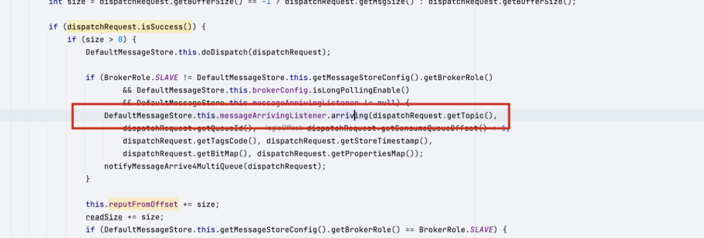

故虽然 [PullRequestHoldService](http://pullrequestholdservice/) 是每 5s 检测一下，但只要消息一转发就会通知消息消费拉取线程告知有新消息到达从而唤醒消息消费拉取线程。

从这些可以看出，当由于未拉取到消息而阻塞后，长轮询能更加及时将消息推送给消息消费者，**但缺点也非常明显，会浪费 Dispatch 线程的CPU时间，影响转发效率。**

**综合来看，只有当拉取不到新消息时才会触发长轮询机制，而且消息量越多反而不受影响，故生产环境建议关闭长轮询。**

## **2.3 Broker CPU 使用率过高**

在基准压测过程中发现在最高吞吐时 broker 主节点线程 cpu 维持在 60-70% 左右，RocketMQ 是基于字节的零拷贝，为什么会有这么大的 CPU 占用呢？

通过监控 broker CPU 线程使用情况，发现大约有 20-25% 的 CPU 消耗在 JSON 序列化与反序列化。通过线程追踪发现问题就出现在 RocketMQ broker 在序列化存储消息时，会将消息头序列化，消息头默认的序列化方式是JSON 类型，它通过 fastjson 的 [JSON.toJSONString](http://json.tojsonstring/) 方式实现，Broker 接收到的所有消息都需要经过序列化的步骤，对应 broker 这个操作带来的 CPU 开销是比较大的。

**部分序列化代码：**

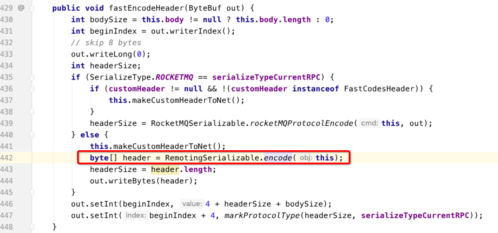

Broker 一共支持两种序列化方式：[JSON、ROCKETMQ](http://xn--jsonrocketmq-cc3k/)，相对于 JSON，ROCKETMQ 使用自定义序列化格式来实现，接下来我们对这两种序列化方式使用同样用例对比压测，得出的结果如下：

1.  消息的 header 使用 JSON 序列，使用 JSON 格式序列化消息 Header，CPU 占整个 Broker CPU 比率为9%左右，对应消息反序列化 CPU 使用率为 13%。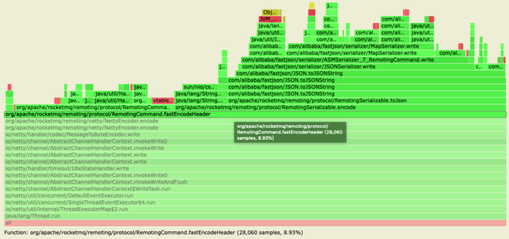
2.  使用 ROCKETMQ 序列化，使用 ROCKETMQ 格式将消息 Header 序列化，CPU 使用率降为 3.2% 左右，反序列化 CPU 使用率为降温 7%。CPU 使用率整体下降 11% 左右，同时单 Broker 吞吐增加 8% 左右。

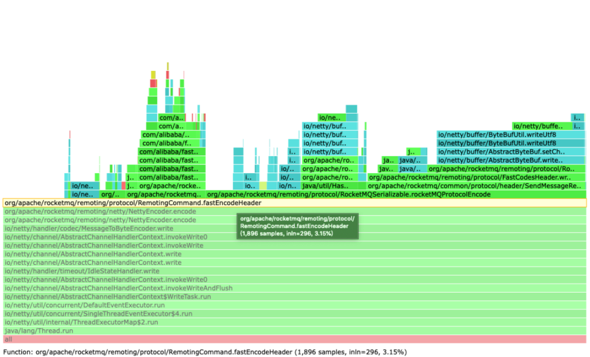

为什么 ROCKMET 的序列化方式比 JSON 高，这得益于 ROCKETMQ 序列化消息简单高效的实现方式。

首先约定 ROCKETMQ 存储数据含义和长度，通过组装报文拼接为字节数组，在反序列化时使用同样的解析顺序，依次根据数据长度读取字节，再转换为对应类型的值，序列化数据结构如下：

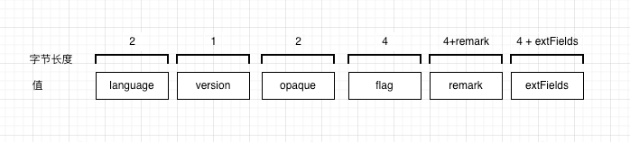

这种序列化方式只有在 RocketMQ 4.x 支持，低于这个版本的客户端会在消费时，会出现消息无法解析的情况

启用 ROCKETMQ 序列化方式，在 RocketMQ broker 启动参数加上如下参数：

Drocketmq.serialize.type=ROCKETMQ

## **2.4 触发 Broker 吞吐瓶颈**

在压测后期，发现无论是加大发送线程，还是调整 Broker 配置（工作线程、内存，序列化方式等），Broker 单节点的写入 TPS 也无法突破 25 W。持续加大压测线程，会导致客户端的RT值升高，但是节点吞吐没有提升。

基于对 RocketMQ broker 消息持久化线程模型分析，Broker 消息是单线程刷盘之后写入到最新的「**CommitLog**」文件，为了保证数据一致性和顺序性，会在刷盘加锁，导致所有消息写入时都需要等待锁释放，消息投递、转换、以及分发都是并发处理，但是写「**CommitLog**」是单线程，这导致消息 Broker 写入 TPS 受限于「**CommitLog**」单条消息写入性能。

**消息持久化线程模型：**

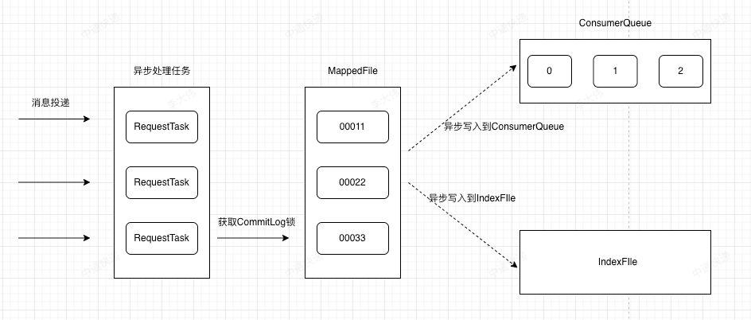

在 RocketMQ-4.9.7 对刷盘逻辑进行优化，减少锁的范围，但是瓶颈点依然是单线程获取锁。在压测过程中，监听锁内代码执行平均时间为：0.004-0.005 ms之间，可以估算出理想情况下，单 broker 的最大 tps 为：1s/0.005 至 1s/0.006ms，即 tps：20w-25w，此 TPS 在当前压测场景即为单 broker 最大吞吐的上限。

##   
**03 未来展望**

降本增效与中间件稳定性治理是中间件领域两个重要的议题。

RocketMQ4.9.7 目前已经将单线程内存写入模式发挥到了极致，单节点写入 TPS 可以在 20-25 W，内存写入的速度已经到了瓶颈，后续的性能突破点主要是放在多「**CommitLog**」目录并行写入。

另外，为了降低磁盘存储的高额成本，平台将借鉴目前大厂在云原生领域的探索成果，尝试考虑引入 S3 分级存储机制，为进一步提升资源的利用效率，降低使用成本而不懈努力。

原文链接：[https://mp.weixin.qq.com/s/qHHyFU7Clzp0fHSaVxMGXQ](https://mp.weixin.qq.com/s/qHHyFU7Clzp0fHSaVxMGXQ)