大家好，我是**华仔**, 又跟大家见面了。

从今天开始，我们开始对 RocketMQ 进行相关实现原理进行剖析，今天是第十三篇，我们来聊聊 RocketMQ「**Consumer 架构设计**」，深度剖析下其内部底层原理设计思想。

  
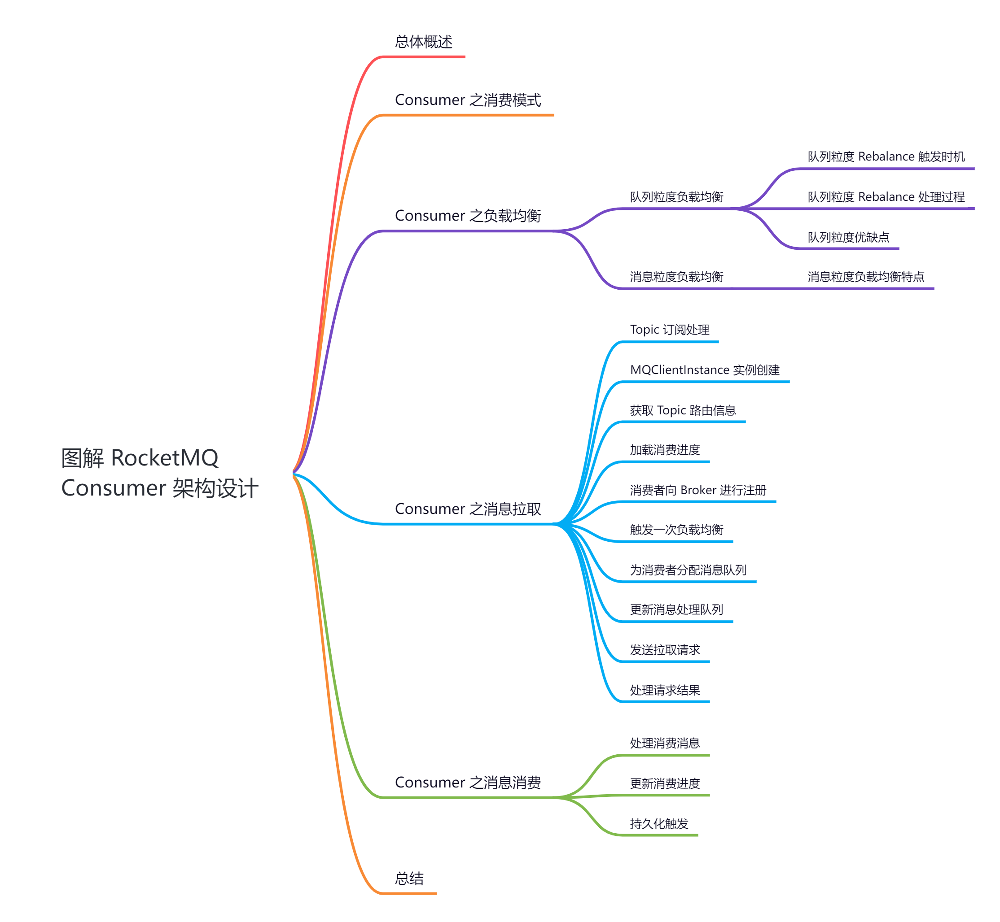

## **01 总体概述**

**在 RocketMQ 中，我们把消费消息的一方称为 Consumer 即 消费者，它是 RocketMQ 的核心组件之一，它的主要功能是将 Producer 端生产的消息进行消费处理，完成消费任务。**那么这些 Producer 产生的消息是怎么被 Consumer 消费的呢？又是基于何种消费方式进行消费，分区分配策略都有哪些，消费者组以及重平衡机制是如何处理的，偏移量如何提交和存储？接下来会逐一讲解说明。

## **02 Consumer 之消费模式**

我们知道消息队列一般有两种实现方式：

1.  Push(推模式)
2.  Pull(拉模式)

那么 RocketMQ Consumer 究竟采用哪种方式进行消费的呢？**不过与 Kafka 不同的是，RocketMQ Consumer 两种方式都支持，**我们都了解在 RocketMQ「**5.0**」之前，消费有两种方式可以从 Broker 获取消息，分别为「**Pull 模式**」和 「**Push 模式**」。

1.  **Pull 模式**：消费者需要不断的从阻塞队列中获取数据，如果没有数据就等待，这个阻塞队列中的数据由「**消息拉取线程**」从Broker 拉取消息之后加入的，因此 Pull 模式下消费需要不断主动从 Broker 拉取消息。
2.  **Push 模式**：需要注册「**消息监听器**」，当有消息到达时会通过「**回调函数**」进行消息消费，从表面上看就像是 Broker 主动推送给消费者一样，底层依旧是消费者从 Broker 拉取数据然后「**触发回调函数**」进行消息消费，只不过不需要像 Pull 模式一样不断判断是否有消息到来而已。

## **03 Consumer 之负载均衡**

对于「**集群模式**」来说，消费者负载均衡指的是为「**消费者组**」下的每个「**消费者**」分配订阅主题下的「**消费队列**」，分配了消费队列消费者就可以知道去消费哪个消费队列上面的消息。

对于「**广播模式**」来说，所有的消息队列可以被消费组下的每个消费者消费，也就是说不涉及负载均衡，而「**集群模式**」一个消息队列同一时间只能分配给组内的一个消费者进行消费。

RocketMQ「**5.0**」以前是按照「**队列粒度**」进行负载均衡的，「**5.0**」以后提供了按「**消息粒度**」进行负载均衡。

## **3.1 队列粒度负载均衡**

对于 4.x/3.x 的版本来说，包括 [DefaultPushConsumer](http://defaultpushconsumer/)、[DefaultPullConsumer](http://defaultpullconsumer/)、[LitePullConsumer](http://litepullconsumer%20/) 等，默认且仅能使用「**队列粒度**」负载均衡策略。

「**队列粒度**」负载均衡策略中，同一消费者组内的多个消费者将按照「**队列粒度**」消费消息，每个队列「**只能**」被其中一个消费者消费。

  
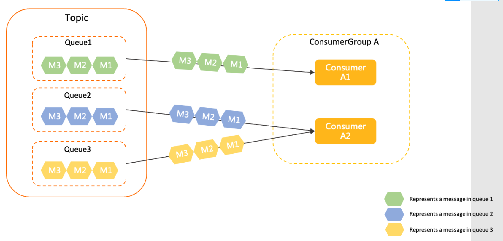

注：图片来自RocketMQ官方文档

「**队列粒度**」负载均衡是在「**每个消费端**」进行的，并不是由「**某个节点**」统一进行负载均衡之后将分配结果通知到每个消费者。

消费者增加或者减少会影响消息队列的分配，所以「**Broker 端**」需要感知消费者的上下线情况，消费者在启动时会向所有的「**Broker 端**」发送「**心跳包**」进行注册，通知「**Broker 端**」消费者上线，下线的时候也会向「**Broker 端**」发送「**取消注册**」的请求，「**Broker 端**」会维护消费者信息的注册信息，在消费者发生变更时会通知消费者进行负载均衡。

## **3.1.1 队列粒度 Rebalance 触发时机**

Rebalance 触发的时机有以下几点：

1.  「**消费者启动时触发**」
2.  消费者在启动时会进行一次负载均衡，为自己分配消息队列。
3.  「**Broker 发现消费组变更时触发**」

> 当处于下面两种情况之一时会被判断为消费组发生了变化，需要进行负载均衡：
> 
> 1、当某个消费组内有新的消费者向 Broker 端进行了注册，比如某个消费组原来有两个消费者，现在新增了一个消费者，新增的消费者启动时会向 Broker 发送注册请求。
> 
> 2、当消费组订阅的主题信息发生了变化，比如消费组新增订阅了某个主题或者取消某个主题的订阅，会被判定为为主题订阅信息发生了变化。
> 
> 被判定为变化之后，会触发变更事件，向该消费者下的所有消费者发送发送变更请求，通知组下每个消费者进行负载均衡。

1.  「**Broker 收到消费者下线时触发**」
2.  如果有消费者向 Broker 端发送 [UNREGISTER\_CLIENT](http://unregister_client/) 取消注册请求，并且开启了允许通知变更，会触发变更事件，Broker 端会通知该消费者组下的所有消费者进行一次负载均衡。
3.  「**消费者定时触发**」
4.  消费者本身也会定时执行负载均衡，默认是 20s 执行一次。

## **3.1.2 队列粒度 Rebalance 处理过程**

「**消费者启动时**」，会立刻触发一次负载均衡，为消费者分配消息队列。为了保证消费者拿到的主题路由信息是最新的，消费者会向 NameServer 集群发送请求，更新每一个主题的路由信息，保证路由信息是最新的。

具体的见 **4.7 节**

## **3.1.3 队列粒度优缺点**

## **优点**

在「**流式处理场景下有优势**」，能够保证同一队列的消息被相同的消费者处理，对于批量处理、聚合处理更友好。

## **缺点**

1.  队列粒度负载均衡策略分配粒度较大，不够灵活。
2.  队列粒度负载均衡策略保证同一个队列仅被一个消费者处理，在消费者数量、队列数量发生变化时，可能会出现短暂的队列分配结果不一致，从而导致少量消息被重复处理。
3.  如果队列数量和消费者数量不均衡时，可能会出现部分消费者空闲或者部分消费者分配到的消息队列过多的情况。

## **3.2 消息粒度负载均衡**

在RocketMQ「**5.0**」版本之后，增加了消息粒度负载均衡策略，对于 [PushConsumer](http://pushconsumer/) 和 [SimpleConsumer](http://simpleconsumer/) 类型的消费者，默认且仅使用消息粒度负载均衡策略。

消息粒度负载均衡策略中，同一消费组内的多个消费者将按照消息粒度平均分摊主题中的所有消息，即同一个队列中的消息，可被平均分配给组内多个消费者共同消费。

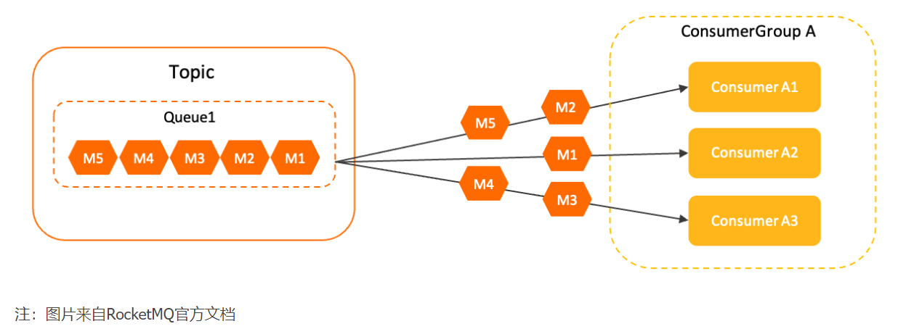

  
在消息粒度负载均衡策略中，「**同一个消费组内多个消费者**」将按照给「**消息粒度**」平均分摊主题中的所有消息，即同一个队列中的消息被平均分配给组内多个消费者共同消费。

该策略可以保证同一个队列的消息可以被组内多个消费者共同处理，但是该策略使用的「**消息分配算法**」是「**随机**」的，是「**不能指定消息**」被「**哪一个特定**」的消费者处理。

当消费者获取到某条消息后，服务端会对「**该消息加锁**」，保证该消息对其他消费者不可见，直到消息消费成功或者超时，所以多个消费者同时消费同一个消息队列中的消息，服务端也可以「**保证消息不会被多个消费者重复消息**」。

## **3.2.1 消息粒度负载均衡特点**

1.  **消费分摊均衡可以更均匀的分摊消息**：不会像队列粒度负载均衡一样，出现分配不平衡的情况。
2.  **对非对等消费者更加友好**：如果网络机房延迟、消费者物理资源规格不一致等原因，按照队列分配消息，可能出现部分消费者堆积、部分消费者空闲的情况，本质还是分摊更均匀。
3.  **队列分配运维更加方便**：队列粒度负载均衡需要保证队列数量大于等于消费者数量，以免某些消费者获取不到队列出现空闲的情况，消息粒度负载均衡无需关注队列的数量。

## **04 Consumer 之消息拉取**

RocketMQ 消息消费是以「**消费组**」为单位，有两种消费模式：

1.  广播模式：同一个消息队列可以分配给组内的每个消费者，每条消息可以被组内的消费者进行消费。 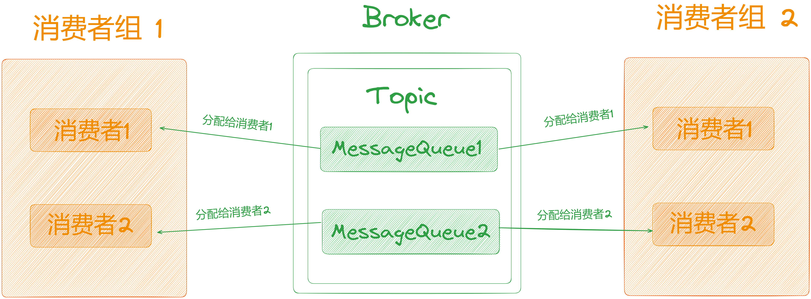
2.  集群模式：同一个消费组下，一个消息队列同一时间只能分配给组内的一个消费者，即一条消息只能被组内的一个消费者进行消费。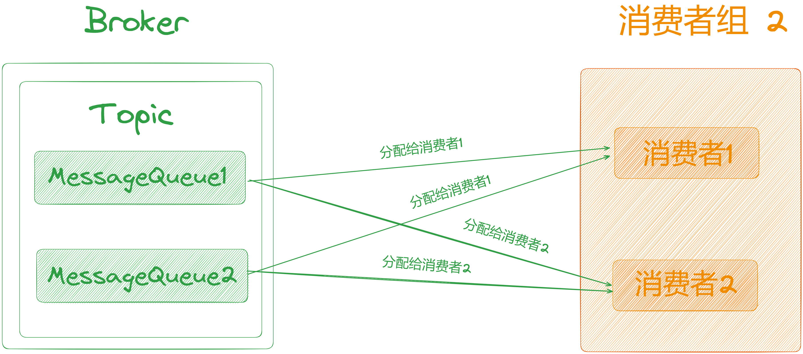

在实际生产环境中，使用「**集群模式**」的情况比较多，接下来以「**集群模式下的 Push 模式**」来看一下消息的拉取的整个过程。

首先消费者在启动的时候主要做了以下几件事情，这里分小节来剖析。

## **4.1 Topic 订阅处理**

本小节开头说了，RocketMQ 消费者是以「**消费者组**」为单位，启用消费者时，需要先设置「**消费者组名称**」以及「**要订阅的 Topic 信息**」。

@RunWith(MockitoJUnitRunner.class)

public class DefaultMQPushConsumerTest {

@Mock

private MQClientAPIImpl mQClientAPIImpl;

private static DefaultMQPushConsumer pushConsumer;

@Before

public void init() throws Exception {

...

// 消费者组名称

String consumerGroup \= "testGroup";

// 实例化 DefaultMQPushConsumer

pushConsumer = new DefaultMQPushConsumer(consumerGroup);

pushConsumer.setNamesrvAddr("localhost:9876");

...

// 设置订阅的主题

pushConsumer.subscribe("test", "\*");

// 启动消费者

pushConsumer.start();

}

}

1.  消费者启动的时候，首先会获取订阅的Topic信息。
2.  一个消费者可以订阅多个 Topic，所以消费者使用一个 Map 结构存储订阅的 Topic 信息，其中 key 为 Topic名称，value 为对应的表达式。
3.  随后遍历每一个订阅的 Topic，然后将其封装为 [SubscriptionData](http://subscriptiondata/) 对象，并加入到负载均衡对象[RebalanceImpl](http://rebalanceimpl/) 中，等待进行负载均衡。

## **4.2 MQClientInstance 实例创建**

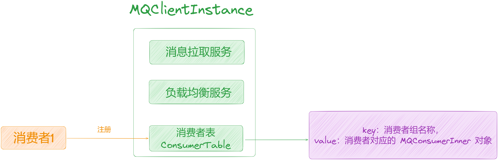

如上图所示，在「**MQClientInstance**」初始化中有以下几个服务：

1.  消息拉取服务：其实现类为 [PullMessageService](http://pullmessageservice/)，用来从 Broker 端拉取消息的服务。
2.  负载均衡服务：其实现类为 [RebalanceService](http://rebalanceservice/)，用来进行负载均衡，为每个消费者分配对应的消费队列。
3.  消费者列表 consumerTable：记录该实例上的所有消费者信息，key 为消费者组名称，value 为消费者对应的[MQConsumerInner](http://mqconsumerinner/) 对象，每一个消费者启动的时候会向这里注册，将自己加入到 consumerTable 中。

这里需要我们注意的是： 该实例是以 [clientId](http://clientid/) 为单位创建的，也就是说「**相同的 ClientID 共用一个MQClientInstance 实例**」。

那么 [clientId](http://clientid/) 有以下部分组成：

1.  服务器的IP。
2.  实例名称 instanceName。
3.  单元名称 unitName（不为空的时候才拼接）。

最终拼接的clientId字符串为：服务器IP + @ + 实例名称 + @ + 单元名称。

对于在同一个服务器上，如果「**实例名称**」和「**单元名称**」也相同的话，所有的消费者会「**共用**」一个 「**MQClientInstance**」实例。

因此「**MQClientInstance**」启动的时候会把「**消息拉取服务**」和「**负载均衡服务**」启动对应的线程。

## **4.3 获取 Topic 路由信息**

上面已经获取到了当前消费者订阅的 Topic 信息，所以此时就需要「**知道这些 Topic 的分布情况**」，即这些 Topic分布在哪些Broker 上。

在前面的文章中我们已经了解到 Broker 会定时向「**NameServer**」发送心跳包进行注册，来上报自己负责的 Topic 信息。所以此时消费者会向「**NameServer**」发送请求，从「**NameServer**」中拉取最新的 Topic 的路由信息缓存在本地。

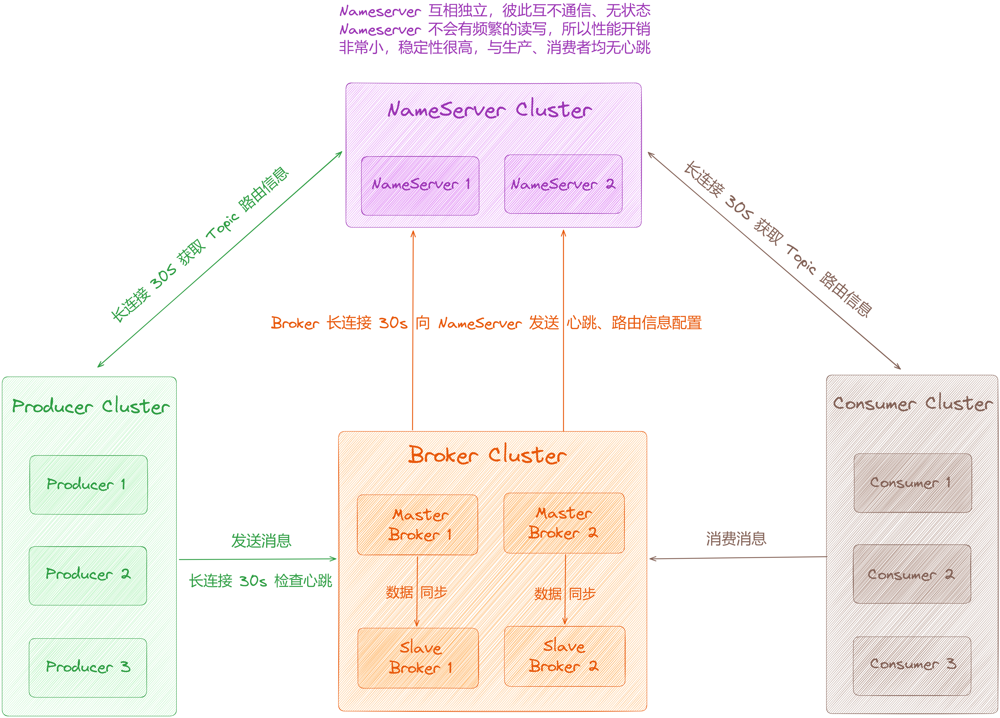

## **4.4 加载消费进度**

当消费者在进行消费的时候，首先要知道应该从「**哪个位置**」开始拉取消息，会在 [OffsetStore](http://offsetstore/) 类中记录这些数据，不同的模式对应的实现类不同，如下：

1.  集群模式：消息的消费进度保存在 Broker 中，由 Broker 来记录每个消费队列的消费进度，对应实现类为[RemoteBrokerOffsetStore](http://remotebrokeroffsetstore/)。
2.  广播模式：消息的消费进度保存在消费者端，对应实现类为 [LocalFileOffsetStore](http://localfileoffsetstore/)。

此处我们只关注「**集群模式**」，加载消费进度时，会进入 [RemoteBrokerOffsetStore#load](http://remotebrokeroffsetstore/#load) 方法，但是该方法不会做任何事情，因为集群模式下需要从 Broker 端进行获取。在负载均衡分配了消息队列，进行消息拉取的时候再向Broker 发送请求获取消费进度。

## **4.5 消费者向 Broker 进行注册**

我们都知道影响消息队列分配的有两种情况：

1.  消费者增加
2.  消费者减少

因此 Broker 需要感知「**消费者上下线**」情况，消费者在启动时会向所有的 Broker 端「**发送心跳包进行注册**」，通知 Broker 端消费者上线。

当 Broker 端「**收到消费者发送心跳包**」之后，会从请求中解析相关信息，将该消费者注册到 Broker 端维护的消费者列表 [consumerTable](http://consumertable/) 中，里面记录了该消费组下所有消费者的 Channel 信息，如下图：

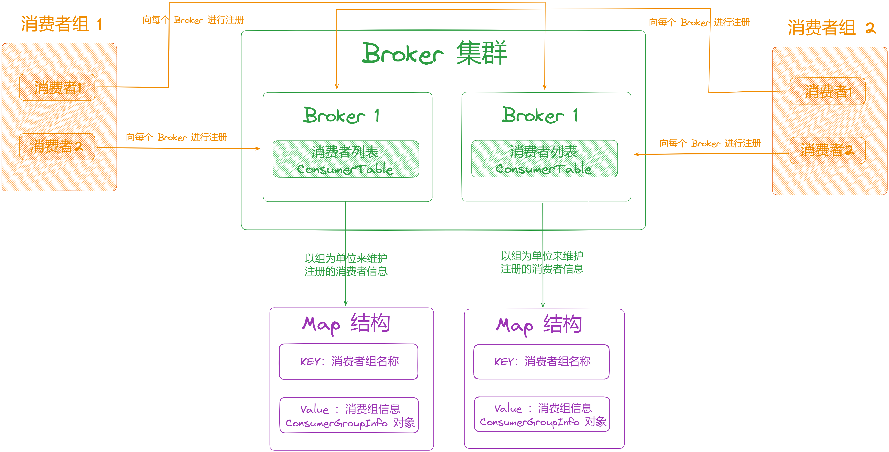

## **4.6 触发一次负载均衡**

在消费者启动的最后一步，会立即触发一次负载均衡，为消费者分配消息队列。

负载均衡是通过消费者启动时创建的「**MQClientInstance**」实例来实现的（[doRebalance](http://dorebalance/)方法），它的处理逻辑如下：

1.  「**MQClientInstance**」中有一个消费者列表「**consumerTable**」，用来存放该实例上注册的所有消费者对象，Key为组名称，Value为消费者「**MQConsumerInner**」对象，会遍历所有的消费者对该实例上注册的每一个消费者进行负载均衡。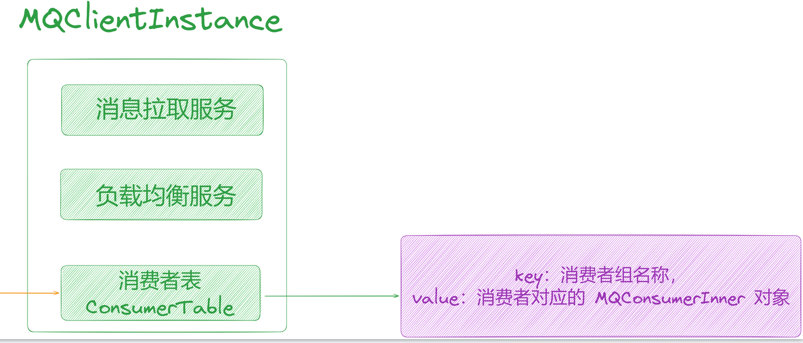
2.  对于每一个消费者，需要获取其订阅的所有 Topic 信息，然后再对每一个 Topic 进行负载均衡，由于消费者订阅的 Topic 信息被封装为了 [SubscriptionData](http://subscriptiondata/) 对象中，所以只需要获取所有的 [SubscriptionData](http://subscriptiondata/) 对象进行遍历，开始为每一个消费者分配消息队列。

## **4.7 为消费者分配消息队列**

这里我们关注集群模式下的分配，整个处理逻辑大概如下：

1.  首先根据 Topic 获取对应所有消费队列「**MessageQueue**」对象。消费者在启动时会向「**NameServer**」发送请求获取 Topic 的路由信息，并从中解析每个主题对应的消息队列，放入负载均衡对象的「**topicSubscribeInfoTable**」变量中并从中获取主题对应的消息队列即可。
2.  根据「**主题信息**」和「**消费者组名称**」，查找订阅了该主题的所有消费者的ID：
3.  **根据主题选取 Broker**：从「**NameServer**」中拉取的主题路由信息中可以找到每个主题分布在哪些 Broker上，从中随机选取一个 Broker。
4.  **向 Broker 发送请求**：根据上一步得到的 Broker，向该 Broker 发送请求查找订阅了该 Topic 的所有消费者的ID。
5.  如果 Topic 对应的消息队列集合和获取到的消费者 ID 都不为空，对消息队列集合和消费 ID 集合进行排序。
6.  获取分配策略，根据具体的分配策略，为当前的消费者分配对应的消费队列，RocketMQ 默认提供了以下几种分配策略：
7.  [AllocateMessageQueueAveragely](http://allocatemessagequeueaveragely/)：平均分配策略，根据消息队列的数量和消费者的个数计算每个消费者分配的队列个数。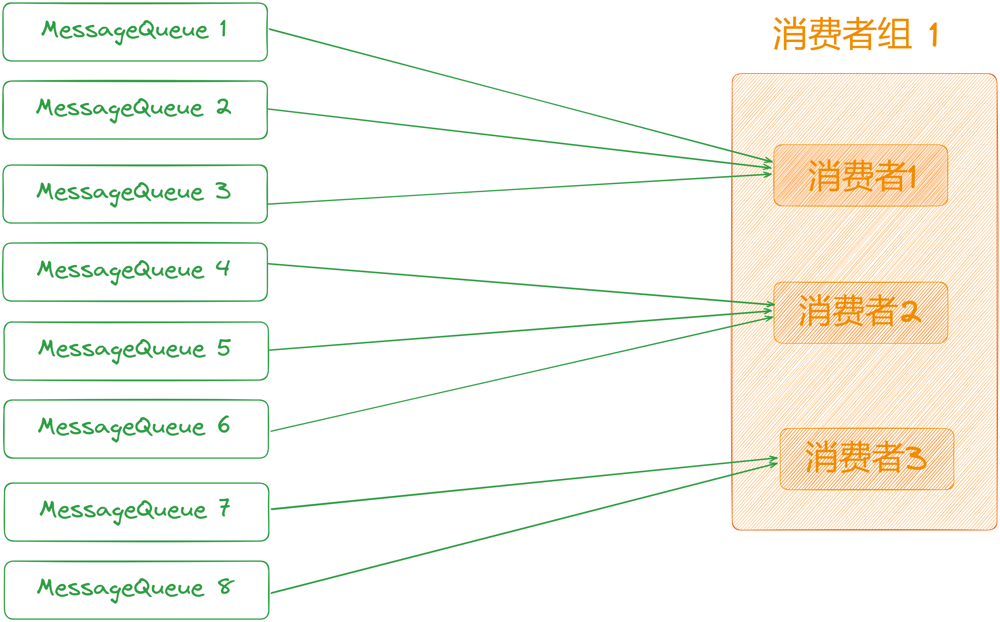
8.  [AllocateMessageQueueAveragelyByCircle](http://allocatemessagequeueaveragelybycircle/)：平均轮询分配策略，将消息队列逐个分发给每个消费者。

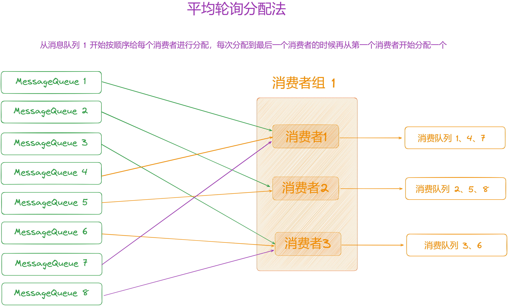

1.  [AllocateMessageQueueConsistentHash](http://allocatemessagequeueconsistenthash/)：根据一致性 hash 算法进行分配。
2.  [AllocateMessageQueueByConfig](http://allocatemessagequeuebyconfig/)：根据配置，为每一个消费者配置固定的消息队列 。
3.  [AllocateMessageQueueByMachineRoom](http://allocatemessagequeuebymachineroom/)：分配指定机房下的消息队列给消费者。
4.  [AllocateMachineRoomNearby](http://allocatemachineroomnearby/)：优先分配给同机房的消费者。

5\. 根据最新分配的消息队列，更新当前消费者负责的消息处理队列。

## **4.8 更新消息处理队列**

每个消息队列「**MessageQueue**」对应一个处理队列「**ProcessQueue**」，使用它来记录的信息进行消息拉取。

分配给当前消费者的所有消息队列，由一个 Map 存储「**processQueueTable**」。

  
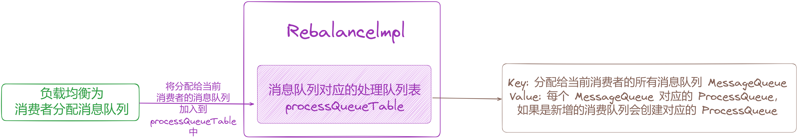

由于负载均衡之后，消费者负责的消息队列可能发生变化，所以需要更新当前消费者负责的消息队列，它主要是拿负载均衡后重新分配给当前消费的消息队列集合与上一次记录的分配信息做对比，有以下两种情况：

1.  某个消息队列之前分配给了当前消费者，但本次没有，说明此队列不再由当前消费者消负责，需要进行删除，此时将该消息队列对应的处理队列中的 dropped 状态置为 true 即可。
2.  某个消费者之前未分配给当前消费者，但是本次负载均衡之后分配给了当前消费者，需要进行新增，会新建一个处理队列（ProcessQueue）加入到processQueueTable中。

对于情况2，由于是新增分配的消息队列，消费者还需要知道从哪个位置开始拉取消息，所以需要通过 [OffsetStore](http://offsetstore/)来获取存储的消费进度，也就是上次消费到哪条消息了，然后判断本次从哪条消息开始拉取。

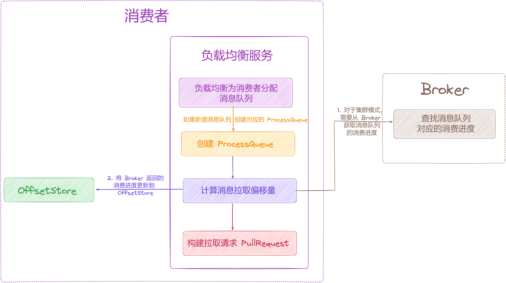

## **4.9 发送拉取请求**

消息拉取服务中，使用了一个阻塞队列，阻塞队列中存放的是消息拉取请求「**PullRequest**」对象，如果有消息拉取请求到来，就会从阻塞队列中取出对应的请求进行处理，从 Broker 拉取消息。

  
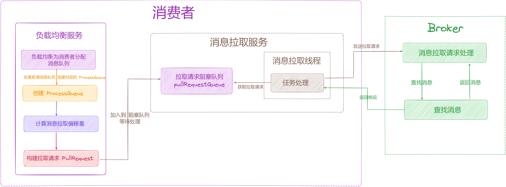

## **4.10 处理请求结果**

这一步比较简单，当消费者收到 Broker 返回的响应后，主要有以下三个状态进行处理：

1.  **FOUND**：消息拉取请求成功，此时从响应中获取 Broker 返回的下一次拉取偏移量的值，更新到拉取请求中。
2.  **NO\_MATCHED\_MSG**：没有匹配的消息，使用 Broker 返回的下一次拉取偏移量的值作为新的拉取消息偏移量，然后将拉取请求加入阻塞队列中立刻进行下一次进行拉取。
3.  **OFFSET\_ILLEGAL**：拉取偏移量不合法，此时使用 Broker 返回的下一次拉取偏移量的值，更新到消费者记录的消息拉取偏移量 offsetStore 中，并持久化保存，然后将当前的拉取请求中的处理队列状态置为 dorp 并删除处理队列，等待下一次重新构建拉取请求进行处理。

## **05 Consumer 之消息消费**

消费者从 Broker 拉取到消息之后，会将消息提交到「**线程池**」中进行消费，RocketMQ 消息消费是「**批量进行**」的，如果一批消息的个数小于预先设置的批量消费大小，直接构建消费请求「**ConsumeRequest**」将消费请求提交到线程池处理，否则需要「**分批构建进行提交**」。

在消息被提交到「**线程池**」后进行处理时，**会调用消息监听器的 consumeMessage 进行消息消费**，它返回消息的消费结果状态，状态有两种分别为 [CONSUME\_SUCCESS](http://consume_success/) 和 [RECONSUME\_LATER](http://reconsume_later/)：

1.  [CONSUME\_SUCCESS](http://consume_success/)：表示消息消费成功。
2.  [RECONSUME\_LATER](http://reconsume_later/)：表示消费失败，稍后延迟重新进行消费。

在消息消费完毕之后，会根据「**ConsumeMessage**」方法返回的结果状态进行处理，对 ackIndex 的值进行设置，ackIndex 的值用于在下一步中处理消费失败的消息。

前面可知消费结果状态有以下两种：

1.  [CONSUME\_SUCCESS](http://consume_success/)：消息消费成功，此时 ackIndex 设置为消费的总消息个数 - 1，表示消息都消费成功。
2.  [RECONSUME\_LATER](http://reconsume_later/)：消息消费失败，延迟进行消费，此时 ackIndex 值为 -1。

## **5.1 处理消费消息**

## **5.1.1 广播模式**

广播模式下，如果消息消费失败，只将失败的消息打印出来不做其他处理。

## **5.1.2 集群模式**

for 循环处理，上面可知 [ackIndex](http://ackindex/) 有两种情况：

1.  消费成功：ackIndex 值为消息大小 - 1，此时 ackIndex + 1 的值等于消息的个数大小，不满足 for 循环的执行条件，相当于消息都消费成功，不需要进行失败的消息处理。
2.  延迟消费：ackIndex 值为 -1，此时 ackIndex+1 为 0，满足 for 循环的执行条件，从第一条消息开始遍历到最后一条消息，向 Broker 发送 [CONSUMER\_SEND\_MSG\_BACK](http://consumer_send_msg_back/) 请求，如果发送成功 Broker 会根据「**延迟等级**」，放入不同的「**延迟队列**」中，到达「**延迟时间**」后，消费者将会重新进行拉取，如果发送失败，消费次数加 1，并加入到失败消息列表中，稍后重新提交到消息消费线程池进行处理。

## **5.1.3 小结**

消费者在消息消费失败的时候，会向 Broker 发送「**CONSUMER\_SEND\_MSG\_BACK**

」请求，在请求处理中会判断「**消息的消费次数**」是否大于「**最大的消费次数**」，如果「**超过**」最大消费次数，会将消息投递到「**死信队列**」中。

如果「**未达到**」最大的消费次数，会「**重新生成一条消息**」，使用「**重试主题（%RETRY% + 消费组名称）**」，从中「**随机选取一个队列**」稍后进行投递，同时也会设置对应的延迟级别，设置「**延迟级别**」之后，在消息存储之前会对「**延迟级别**」进行判断，如果需要延迟消费，会使用 RocketMQ 默认创建的「**SCHEDULE\_TOPIC\_XXXX**」 主题，先根据延迟级别将消息投递到对应的延迟队列中，然后由一个「**定时任务**」去检测这个主题下的消息，当消息到达延迟的时间后，再将消息取出投递到「**原本主题下**」的消息队列中，即将消息投递到「**原重试队列**」中，之后的流程就与普通消息的存储一致，将消息存入「**CommitLog**」中，再创建对应的「**ConsumeQueue**」数据，消费者就可以拉取到消息重新进行消费。

##   
**5.2 更新消费进度**

等上面处理完毕后，接着从「**处理队列**」中「**移除消息**」并返回「**拉取消息的偏移量**」，然后「**更新拉取偏移量**」，即消费进度。

## **5.2.1 广播模式**

广播模式下消费进度保存在「**每个消费者端**」。在该模式下使用了一个「**ConcurrentMap**」 类型的变量「**offsetTable**」存储每个消息队列对应的拉取偏移量，KEY 为消息队列，VALUE 为该消息队列对应的拉取偏移量。

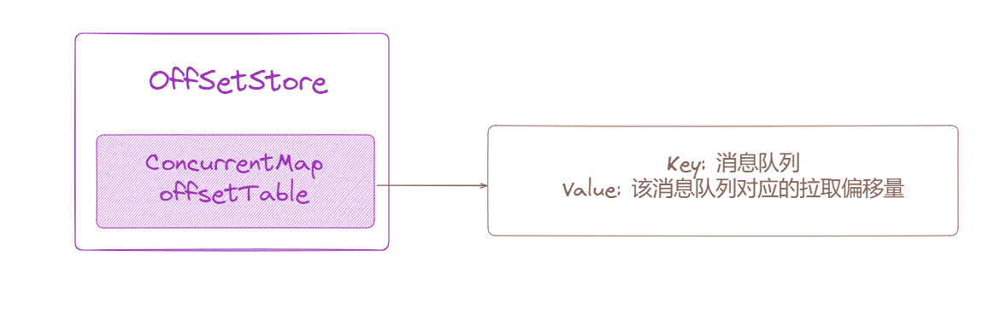

在更新拉取进度的时候，对「**offsetTable**」中的值进行更新，需要注意这里只是更新了「**offsetTable**」中的数据，**并没有持久化到磁盘**。

## **5.2.2 集群模式**

集群模式下消费进度保存在「**Broker 端**」。该模式更新进度与广播模式下的更新类似，都是只更新了「**offsetTable**」中的数据。

## **5.3 持久化触发**

消费者在启动的时候注册了「**定时任务**」，定时将消息拉取进度进行持久化。

1.  广播模式，将每个消息队列对应的拉取偏移量持久化到「**本地文件**」。
2.  集群模式，其拉取进度保存在「**Broker 端**」，所以需要向「**Broker 端**」发送请求进行持久化，在 RocketMQ 的存储目录中有一个对应的文件，叫 [consumerOffset.json](http://consumeroffset.json/)，里面的「**offsetTable**」中保存了每个消息队列的消费进度，持久化时会将消费进度写入这个文件。

{

"offsetTable":{

"HuazaiTopic@"HuazaiTopicGroup":{ // 主题名称@消费者组名称

0:0, // 每个消息队列对应的消费进度，Key 中的 0 表示队列 0，value 中的 0 表示消息在ConsumeQueue 中的逻辑偏移量

1:1,

2:1,

3:0

}

}

}

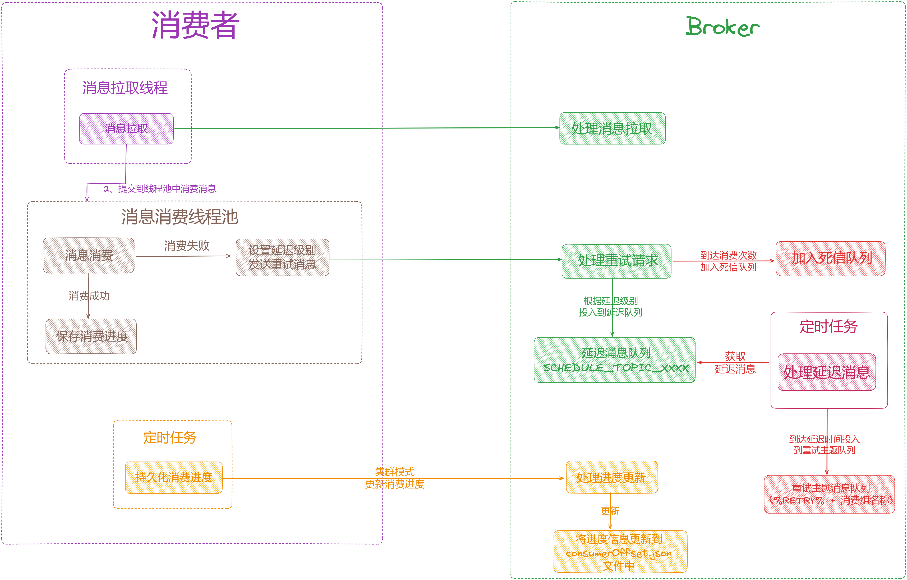

## **06 总结**

这里，我们一起来总结一下这篇文章的重点。

RocketMQ 消费者架构设计得非常精巧，本文从几个方向深度剖析了「**消费者架构**」：

1.  消费模式之 pull 和 push。
2.  消费负载均衡之队列粒度和消息粒度。
3.  消息拉取全流程。
4.  消息消费全流程。

下篇我们来深度剖析「**图解 RocketMQ 事务消息架构设计**」，大家期待，我们下期见。