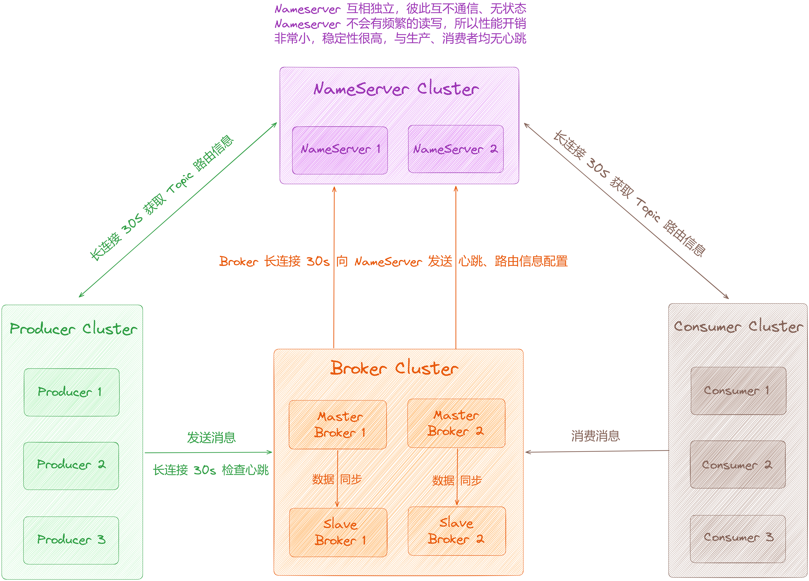
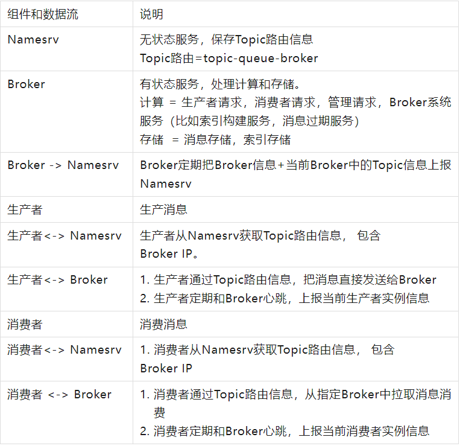
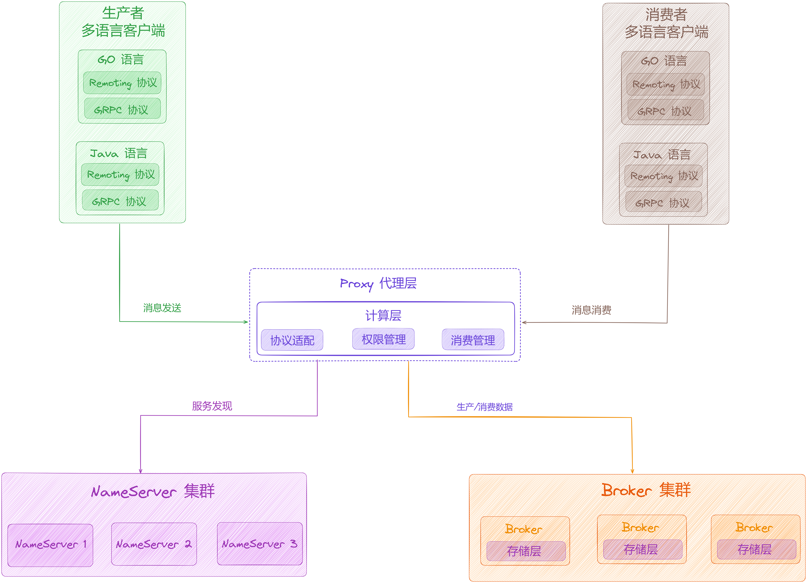
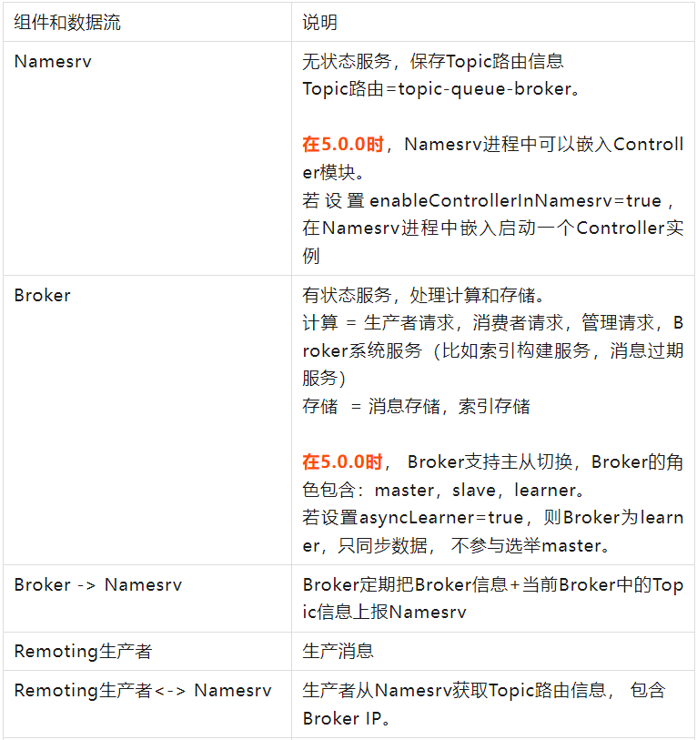
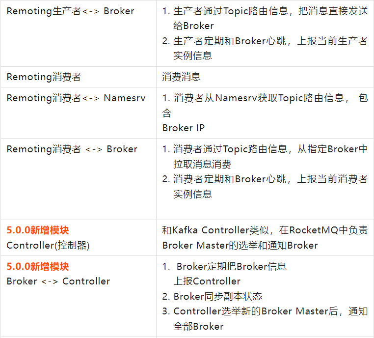
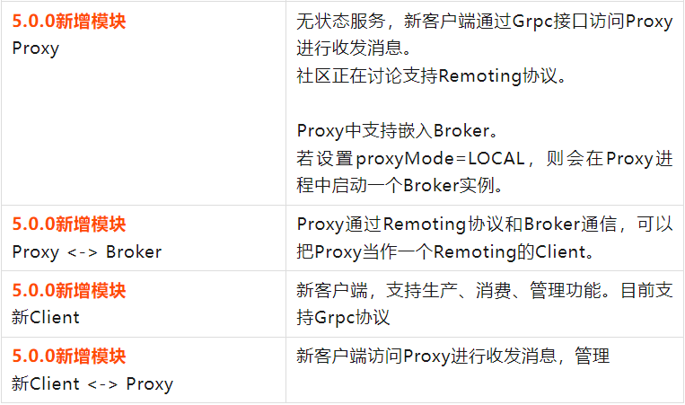

大家好，我是**华仔**, 又跟大家见面了。

从今天开始，我们开始对 RocketMQ 进行相关实现原理进行剖析，今天是第十九篇，我们来聊聊 RocketMQ「**4.9.x 与 5.x 架构设计对比**」，深度剖析下其内部底层原理设计思想，**下面进入正题**。

##   
**01 4.9.x 架构图**

在 4.9.X 版本中每个组件和组件之间的通信简单说明如下：

  

## **02 5.x 架构图**

[【原理分析系列第十篇】图解 RocketMQ 5.0 新特性揭秘](https://articles.zsxq.com/id_bao1t7qkziwp.html) 具体可以看这里。

在 5.x 版本中每个组件和组件之间的通信简单说明如下：

