大家好，我是**华仔**, 又跟大家见面了。

从今天开始，我们开始对 RocketMQ 进行相关实现原理进行剖析，今天是第十二篇，我们来聊聊 RocketMQ「**存储架构设计**」，深度剖析下其内部底层原理设计思想。

  
**RocketMQ 又是基于什么机制来存储？为什么要设计成这样？它解决了什么问题？又是如何解决的？里面又用到了哪些高大上的技术？**

带着这些疑问，我们就来和你聊一聊 RocketMQ 存储架构设计背后的深度思考和实现原理，**下面进入正题**。

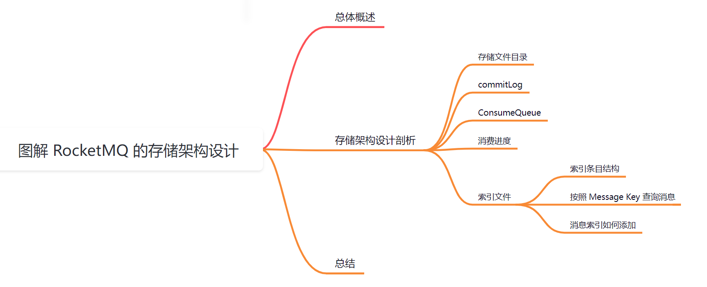

##   
**01 总体概述**

对于 Kafka 来说，它的存储架构是基于「**主题**」+ 「**分区**」+ 「**副本**」+「**分段**」+ 「**索引**」的结构，如下：

  
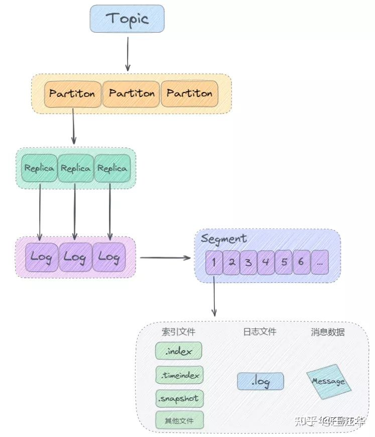

今天我们来深度剖析下 RocketMQ 的底层存储架构，看看它跟 Kafka 的存储架构究竟有什么区别？

## **02 存储架构设计剖析**

这里先来回顾下 RocketMQ 的整体架构设计，如下图：

从上图得出其整体架构中包含四种角色：

1.  **Producer** ：消息的生产者，它会通过 MQ 的负载均衡模块选择对应的 Broker 集群队列进行消息投递，投递的过程⽀持快速失败重试并且低延迟。
2.  **Consumer** ：消息的消费者，支持两种模式对消息进行消费： push (推) 以及 pull (拉)。
3.  **NameServer** ：它是⼀个非常简单的 「**Topic 路由注册中心**」，其角色类似 Kafka、Dubbo 中的 Zookeeper ，支持 Broker 的「**动态注册与发现**」。
4.  **BrokerServer**：与 Kafka 类似，「**Broker**」是 RocketMQ 的核心，大部分「**重量级**」的工作都是由 「**Broker**」来完成的，主要包括「**接收 Producer 发来的消息**」、「**处理 Consumer 消费的消息**」、「**消息的持久化存储**」、「**消息的 HA 机制**」、「**消息查询**」以及「**服务高可用**」等 。

接下来我们重点来剖析下 BrokerServer的消息存储模型。

## **2.1 存储文件目录**

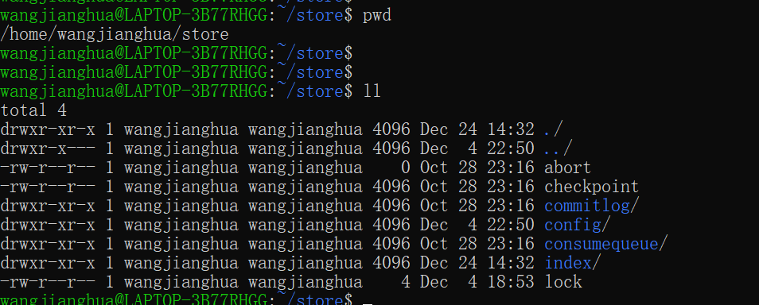

从这个目录结构图可以得出消息存储和这三个文件关系紧密：

1.  数据存储文件 commitlog：消息主体以及元数据的存储主体。
2.  消息消费队列 consumequeue：引⼊目的主要是提高消息消费的性能。
3.  索引⽂件 index：提供了⼀种可以通过 key 或时间区间来查询消息。

在 RocketMQ 中，底层采用的是「**混合型**」的存储结构，Broker 单个实例下所有的队列共用⼀个 commitLog 来存储。

生产者发送消息到 Broker 端，然后 Broker 端使用同步或者异步的方式对消息进行刷盘持久化，保存到 「**commitLog**」文件中。

只要消息被刷盘持久化到磁盘⽂件「**commitLog**」中，那么生产者发送的消息就「**不会丢失**」。

Broker 端的后台服务线程会不停地分发请求并异步构建「**consumequeue 消费队列**」 和 「**index 索引文件**」。

## **2.2 commitLog**

生产者向 Broker 发送的消息，会以「**顺序写**」的方式，都会写入到数据文件中，这里我们称之为「**commitLog**」文件，「**commitLog**」文件的根目录由配置参数 「**storePathRootDir**」来决定，默认每一个「**commitLog**」的文件大小为 1G，如果文件写满会新建一个「**commitLog**」文件，以该文件中第一条消息的偏移量为文件名，小于 20 位用 0 补齐：

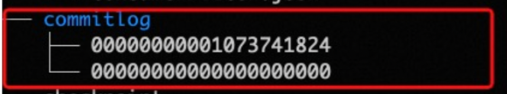

比如第一个文件中第一条消息的偏移量为 0，那么第一个文件的名称为 00000000000000000000，当这个文件存满之后，需要重新建立一个 「**commitLog**」文件，一个文件大小为 1 G，

1GB = 1024\*1024\*1024 = 1073741824 Bytes，所以下一个文件就会被命名为 00000000001073741824，起始偏移量为 1073741824，以此类推。

## **2.2.1 消息数据格式**

「**commitLog**」中存储的每条消息的数据格式如下：

1.  消息总长度：占4个字节；
2.  魔数：占4个字节；
3.  消息体CRC校验和：占4个字节；
4.  队列ID：占4个字节；
5.  标识：占4个字节；
6.  队列的偏移量：占8个字节；
7.  消息在文件的物理偏移量：占8个字节；
8.  系统标识：占4个字节；
9.  发送消息的时间戳：占8个字节；
10.  发送消息的主机地址：占8个字节；
11.  存储时间戳：占8个字节；
12.  存储消息的主机地址：占8个字节；
13.  消息的重试次数：占4个字节；
14.  事务相关偏移量：占8个字节；
15.  消息内容的长度：占4个字节；
16.  消息内容：由于消息内容不固定，所以长度不固定；
17.  主题名称的长度：占1个字节；
18.  主题名称内容：长度不固定；
19.  消息属性长度：占2个字节；
20.  消息属性内容：长度不固定；

RocketMQ 一般会保存一个物理偏移量 offSet，从「**commitLog**」中获取消息内容。

  
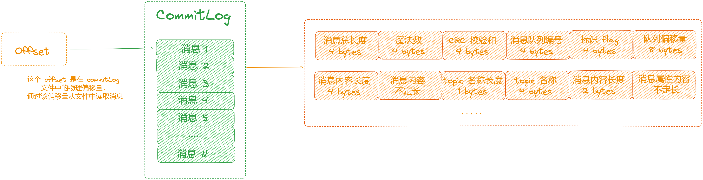

为什么要这么设计呢？

其实呢，RocketMQ 是经过阿里高并发，大数据量的洗礼之后的产物。它摒弃和解决了 Kafka 在这种在线业务中的遇到的一些问题。

这样设计有以下三点优势：

1.  同 Kafka 类似，顺序写。**磁盘的顺序I/O性能要强于内存的随机I/O性能。**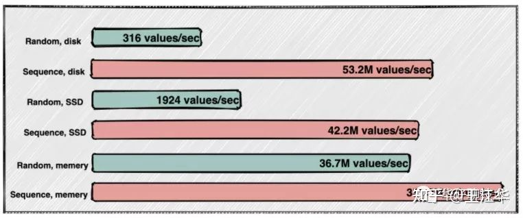
2.  快速进行消息定位
3.  因为消息是⼀条⼀条写入到 「**commitLog**」文件 ，写入完成后，我们可以得到这条消息的物理偏移量。每条消息的物理偏移量是唯⼀的， 「**commitLog**」文件名是递增的，可以根据消息的物理偏移量通过二分查找，定位消息位于那个文件中，并获取到消息实体数据。
4.  通过消息 offsetMsgId 查询消息数据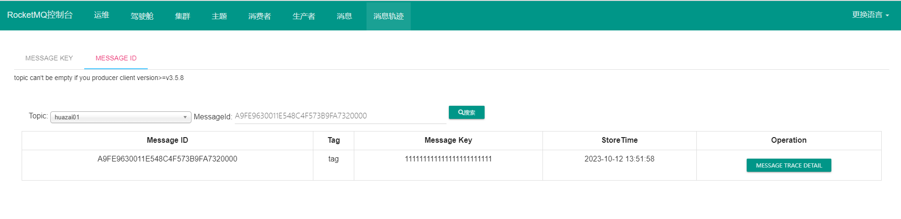

这里的消息 offsetMsgId 是由 Broker 服务端在写入消息时生成的 ，该消息编号包含两个部分：

1.  Broker 服务端 ip + port 8个字节。
2.  commitlog 物理偏移量 8个字节 。

所以我们可以通过消息 offsetMsgId ，定位到 Broker 的 ip 地址 + 端口 ，再传递物理偏移量参数 ，即可定位该消息具体数据。

## **2.3 ConsumeQueue**

为什么要设计这个「**ConsumeQueue**」呢，先来看看 RocketMQ 的「**发布订阅模型**」。

  
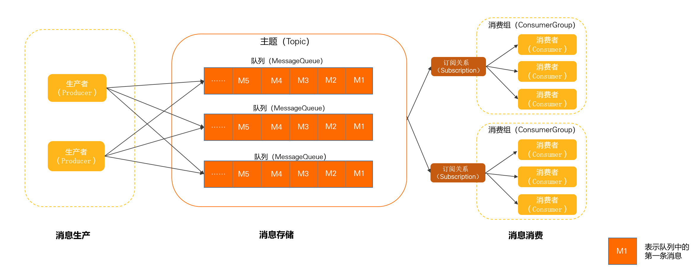

大家试想一下光有个「**commitLog**」文件是否可以满足需求吗？

可以试想一下，RocketMQ 在消息存储的时候都将消息顺序写入「**commitLog**」文件，如果想根据 「**Topic**」对消息进行查找，需要扫描所有「**commitLog**」文件，这种方式性能低下，因此 RocketMQ 又设计了「**ConsumeQueue**」 存储消息的逻辑偏移量，offset 逻辑偏移量从 0 开始编号，进行递增，消息写入「**commitLog**」以后，会构建对应的 「**ConsumeQueue**」文件。

在 RocketMQ 的存储文件目录下，有一个「**ConsumeQueue**」文件夹，它是按 Topic 进行分组，每个 Topic 一个文件夹，Topic 文件夹内是该 Topic 的所有消息队列，以消息队列 ID 命名文件夹，每个消息队列都有自己对应的「**ConsumeQueue**」 文件。

  
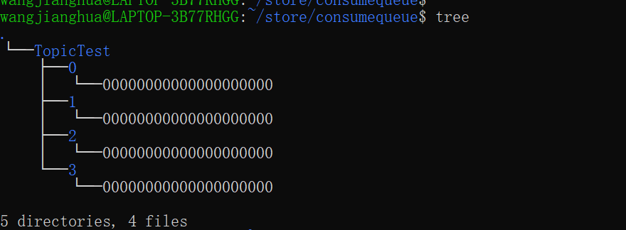

可以看到，「**ConsumeQueue**」文件是按照主题存储，每个主题下有不同的队列，图中 TopicTest 有 4 个队列 。

在每个队列⽬录下 ，存储「**ConsumeQueue**」文件，每个「**ConsumeQueue**」文件也是顺序写入的，其存储的每条数据大小是固定的，总共 20 个字节，数据格式如下：

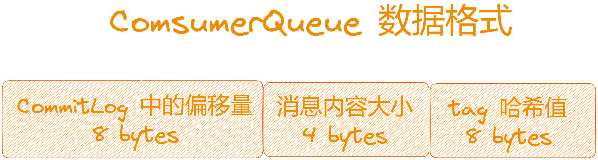

1.  消息在 CommitLog 文件的偏移量，占用 8 个字节。
2.  消息大小，占用 4 个字节。
3.  消息 Tag 的 hashcode 值，用于 tag 过滤，占用8个字节。

每个「**ConsumeQueue**」文件包含 30 万个条目，每个条目大小是 20 个字节，每个文件的大小是 30 万 \* 20 = 60万字节，每个文件大小约 5.72 M 。和「**commitLog**」文件类似，「**ConsumeQueue**」文件的名称也是以偏移量来命名的，可以通过消息的逻辑偏移量定位消息位于哪⼀个⽂件⾥。其写入流程如下图所示：

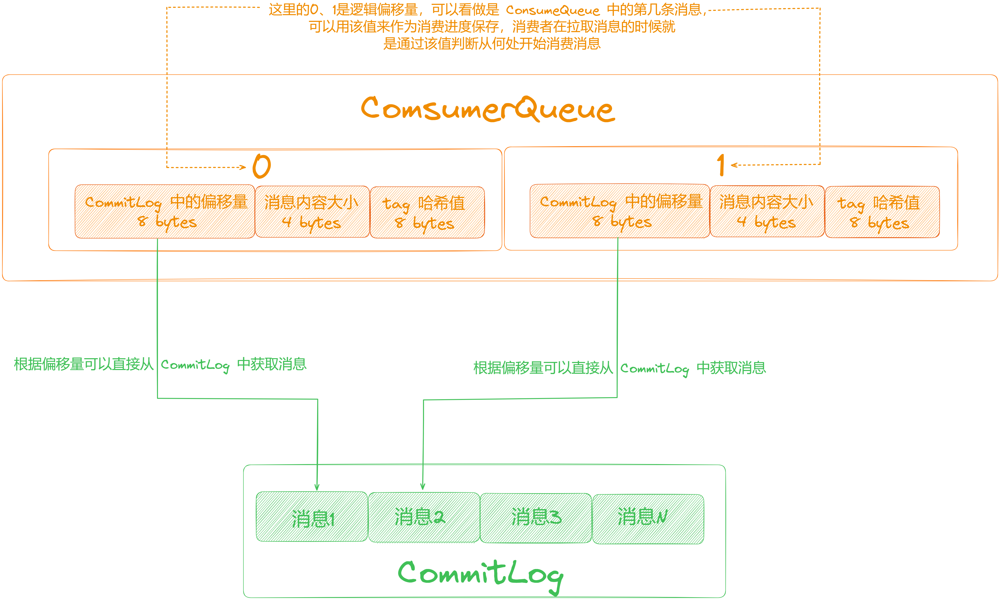

综上可以得出「**ConsumeQueue**」是按照 「**主题-队列**」的方式进行存储的，是不是跟本小节开始图中展示的 RocketMQ 的「**发布订阅模型**」不谋而合呢？

当有了「**ConsumeQueue**」之后，消费者从「**Broker**」端获取订阅消息数据时，就不用去遍历整个「**commitLog**」文件了，此时只需要根据逻辑偏移量 Offset 从「**ConsumeQueue**」文件中查询消息偏移量，最后通过定位到「**commitLog**」文件， 获取真正的消息数据。

通过这样的设计在简化消费查询逻辑的同时又提高了系统的性能和可扩展性，可谓一举两得。

## **2.4 消费进度**

上一节聊了消费者在拉取消息进行消费的时候，就是通过这个「**ConsumeQueue**」实现的，消费者在向 Broker 发送消息拉取请求之前，需要知道应该从「**哪条消息**」开始消费。

1.  对于广播模式，消息的消费进度保存在「**消费者端本地**」。
2.  对于集群模式，消息的消费进度保存在「**Broker**」中，所以拉取某个消息队列的消息之前，会向 Broker 发送请求，获取该消息队列的消费进度，消费进度在 RocketMQ 的存储目录中有一个对应的文件，叫 [consumerOffset.json](http://consumeroffset.json/)，里面的 offsetTable 中保存了每个消息队列的消费进度，这个消费进度值对应的就是 ConsumeQueue 中的逻辑偏移量，它由定时任务定时进行持久化。

{

"offsetTable":{

// 主题名称@消费者组名称

"TestTopic@TestTopicGroup":{

0:0, // 每个消息队列对应的消费进度，Key 中的 0 表示队列 0，value中的 0 表示消息在ConsumeQueue 中的逻辑偏移量

1:1,

2:1,

3:0

}

}

}

当拿到消息队列对应的消费进度时，就可以根据这个值从 Broker 拉取消息，Broker 收到请求后，会根据这个值从 「**ConsumeQueue**」中获取此条消息在「**commitLog**」文件中的物理偏移量，根据物理偏移量再从「**commitLog**」中获取消息内容返回给消费者。

整个查询流程如下图所示：

  
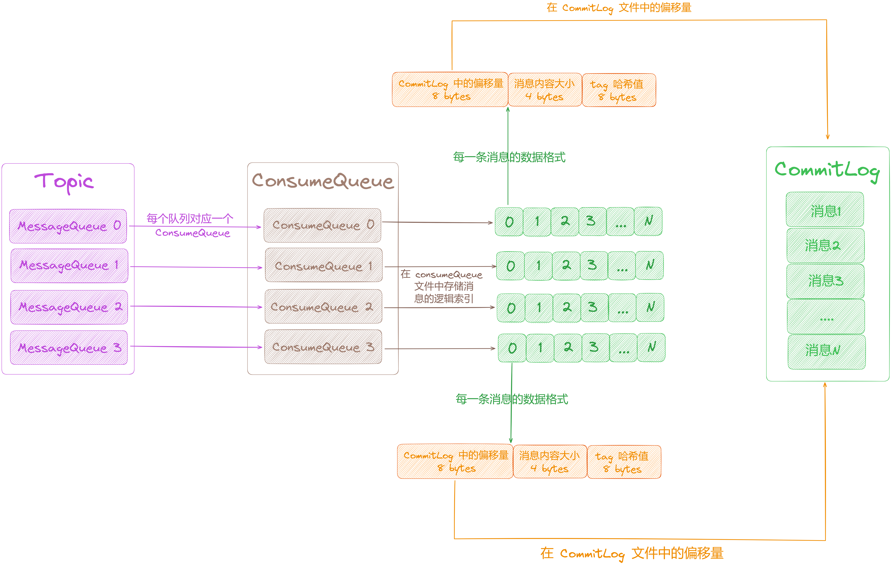

1.  当消息顺序写入「**commitLog**」文件之后会构建对应的「**ConsumeQueue**」文件。
2.  如上图所示：每个消息队列「**MessageQueue**」都会有一个对应的「**ConsumeQueue**」文件，「**ConsumeQueue**」文件中的「**offset**」记录的是消息的逻辑索引，从 0 开始编号进行递增，比如现在存入了 5 条消息，那么对应的「**offset**」分别为0、1、2、3、4。
3.  当消费者在消费的时候会先拿到消费进度「**offset**」，然后根据「**offset**」从「**ConsumeQueue**」文件中获取数据，里面记录了消息在「**commitLog**」文件中的物理偏移量，之后就可以从「**commitLog**」中获取消息内容。
4.  当消费者消费完成后会保存该消费进度，对于「**集群模式**」来说，消费进度会保存在「**Broker**」端，Broker 会定时将消费进度进行持久化，如果是消费者刚启动，会向 Broker 发起请求获取之前记录的消费进度。

## **2.5 索引文件**

跟 Kafka 类似，在 RocketMQ 的存储架构中，也设计了索引文件用来快速进行定位消息。支持根据 Key 对消息进行查找，在发送消息的时候可以设置一个唯一 Keys 值用来标识这条消息，之后就可以根据这个 Keys 值对消息进行查找。

> 注意：这里的 Keys 是由服务端给每条消息创建哈希索引，由于是哈希索引请务必保证 key 尽可能唯⼀，这样可以避免潜在的哈希冲突，设置后就可以在 Console 根据 Topic、Keys 来查询消息，例如订单号等。

如下图:

  
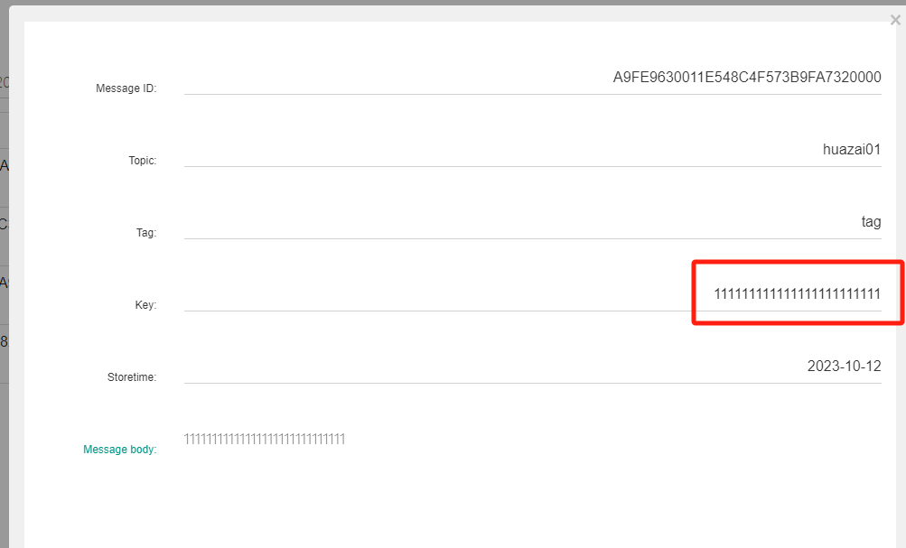

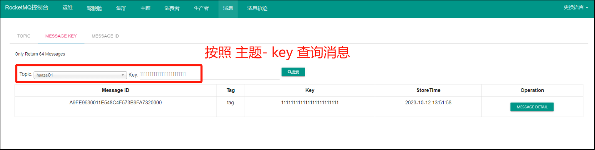

Message msg \= new Message(topic, RandomUtils.getStringByUUID().getBytes());

// 订单Id

String orderId \= "202312270987643";

msg.setKeys(orderId);

  
该查询最终是通过 [$HOME/store/index/indexFile](http://$home/store/index/indexFile) 进行索引实现的快速查询。当然，这个 indexFile 中的索引数据是在包含了 key 的消息被发送到 Broker 时写入的。如果消息中没有包含 key，则不会写入。

## **2.5.1 索引条目结构**

在每个 Broker中都会包含一组「**indexFile**」，每个「**indexFile**」都是以一个时间戳命名的（被创建时的时间戳）。而「**indexFile**」文件的大小是固定的，单个「**indexFile**」文件大小约为「**400 M**」，一个「**indexFile**」文件大约可以保存「**2000 W**」个消息的索引，「**indexFile**」的底层存储设计为在文件系统中实现「**HashMap**」结构，所以RocketMQ 的索引文件其底层实现为 hash 索引。

「**indexFile**」文件由三部分构成：

1.  indexHeader 索引头。
2.  slots 槽位。
3.  indexes 索引数据。

每个「**indexFile**」文件中包含「**500W**」个「**slot**」槽，每个「**slot**」槽含有 4 个字节。而每个「**slot**」槽又可能会挂载很多的「**index**」索引单元，每个索引单元「**20**」个字节。

> 总大小：indexHeader的size + （slots的size）500w + (索引单元的size) \* 2000w = 40 + 4 \* 500w + 202000w = 420000040个字节大小 = 400M

「**IndexFile**」的文件结构如下：

### **2.5.1.1 Index Header**

index header 记录「**indexFile**」文件的整体信息，占 40 个字节，如下图：

1.  beginTimestamp：当前「**indexFile**」文件中第一条消息的存储时间。
2.  endTimestamp：当前「**indexFile**」文件中最后一条消息存储时间。
3.  beginPhyoffset：当前「**indexFile**」文件中第一条消息在「**commitLog**」中的偏移量。
4.  endPhyoffset：当前「**indexFile**」文件中最后一条消息在「**commitLog**」中的偏移量。
5.  hashSlotCount：已经使用的「**hash**」槽的个数。
6.  indexCount：索引项中记录的所有消息索引总数。

### **2.5.1.2 Hash Slot**

RocketMQ 在每个「**indexFile**」文件中划分了「**500W**」个 hash 槽，在向文件中添加消息索引的时候，会取出消息的 Keys 计算 hash 值，然后对 hash 槽总数取余，来判断应该放到哪个 hash 槽。

> 实际上这个 Keys 会使用 Topic + "#" + key 进行拼装做为 IndexFile 文件的 Key 。

「**indexFile**」中最复杂的是「**Slots**」与「**indexes**」间的关系。在实际存储时，「**indexes**」是在「**Slots**」后面的，示意图如下：

  
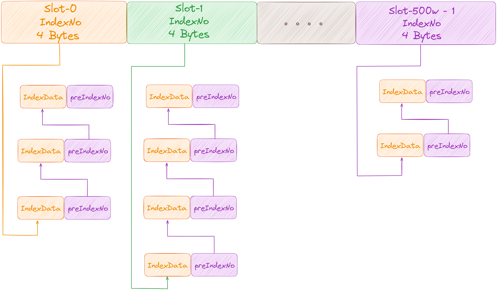

> 这里简单的解释下上图中的含义。
> 
> 1、通过 key的 hash 值 % 500w 计算出 slot 槽位，然后将该 slot 值修改为该 index 索引单元的 indexNo。
> 
> 2、根据这个 indexNo 可以计算出该 index 单元在 indexFile 中的位置。不过该取模结果的重复率是很高的，为了解决该问题，在每个 index 索引单元中增加了 preIndexNo（拉链法），用于指定该 slot 中当前 index 索引单元的前一个 index 索引单元。而 slot 中始终存放的是其下最新的 index 索引单元的 indexNo，这样的话，只要找到了 slot 就可以找到其最新的 index 索引单元，而通过这个 index 索引单元就可以找到其之前的所有 index 索引单元。
> 
> 3、indexNo 是一个在 indexFile 中的流水号，从 0 开始依次递增。即在一个 indexFile 中所有 indexNo 是以此递增的。indexNo 在 index 索引单元中是没有体现的，其是通过 indexes 中依次数出来的。

### **2.5.1.3 索引条目 Index Item**

索引项中记录每个 Key 的索引信息，默认 20 个字节，有以下 4 个部分组成：

  

1.  keyHash：消息的 key 计算出来的的 hashcode 值。
2.  phyOffset：消息在「**CommitLog**」中的物理偏移量。
3.  timeDiff：当前key对应消息的存储时间与当前 indexFile 创建时间 (beginTimestamp：当前 indexFile 文件中第一条消息的存储时间)的时间差。
4.  preIndexNo：当哈希冲突的时候，用来指向上一个索引，可以看做当哈希冲突的时候，使用一个链表将该哈希槽下的所有元素串起来，使用头插法增加新的元素。

## **2.5.2 按照 Message Key 查询消息**

按照「**Message Key**」查询消息，主要是基于 RocketMQ 的 IndexFile 索引文件来实现的。RocketMQ 的索引文件逻辑结构，类似 JDK 中 HashMap 的实现。索引文件的具体结构如下：

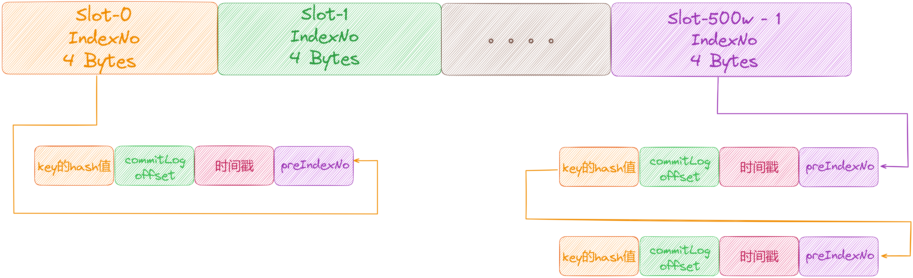

## **2.5.3 消息索引如何添加**

假如现在有一条消息，它的 Key 为 1，哈希槽的个数为 10，这里简化一下计算，直接用 1 对哈希槽个数取余，得到值为 0，那么这条消息将落入哈希槽 0 的位置，然后会在索引项区域建立该消息的索引信息：

  
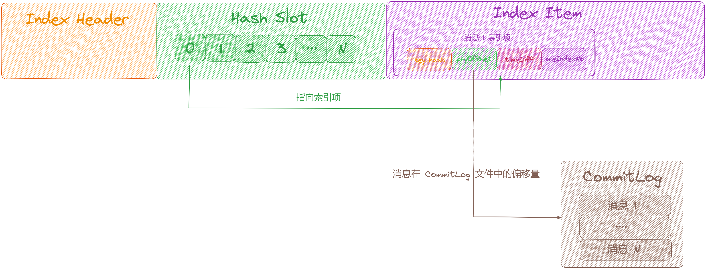

如果新增一条消息 2，它的 Key 值为 2，用 2 对哈希槽个数取余，依旧得到哈希槽 0，此时产生「**哈希冲突**」，将哈希槽 0 处存储的值改为消息 2 的索引项，并将消息 2 索引项中的 「**preIndexNoy**」指向消息 1 的索引项，形成一个链表：

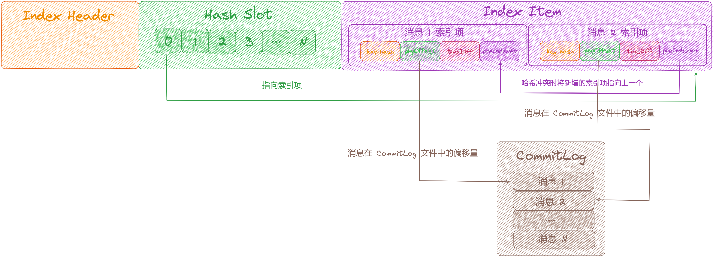

## **03 总结**

这里，我们一起来总结一下这篇文章的重点。

RocketMQ 存储模型设计得非常精巧，本文从三个方向深度剖析了「**RocketMQ 5.0**」架构新特性：

1.  完美适配消息队列发布订阅模型 。
2.  数据文件「**CommitLog**」、消息队列文件「**ConsumeQueue**」、索引文件「**IndexFile**」各司其职 ，同时以数据文件为核心，异步构建消费队列文件以及索引文件这种模式，非常容易扩展到主从复制的架构。
3.  充分考虑业务的查询场景，⽀持消息 key ，消息 offsetMsgId 查询消息数据。也⽀持消费者通过 tag 来订阅主题下的不同消息，提升了消费者的灵活性。

下篇我们来深度剖析「**图解 RocketMQ Consumer 架构设计**」，大家期待，我们下期见。