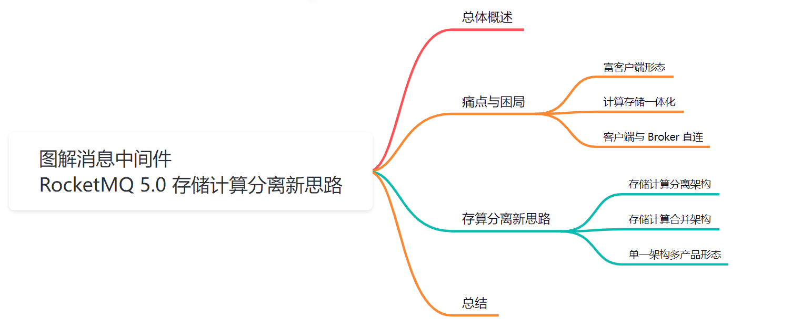
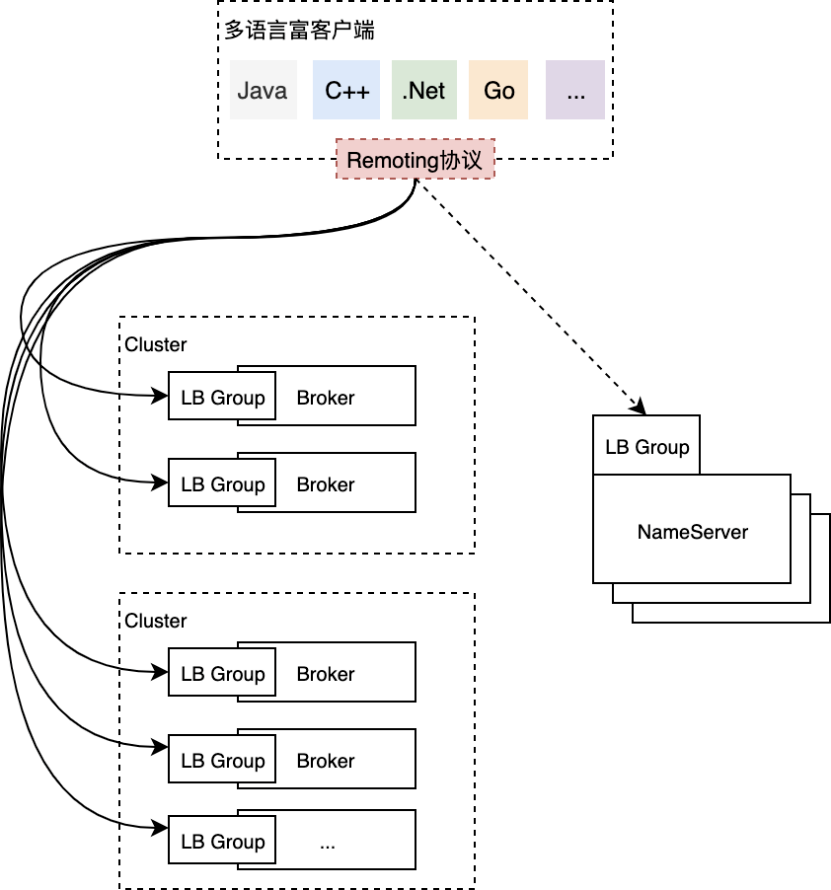
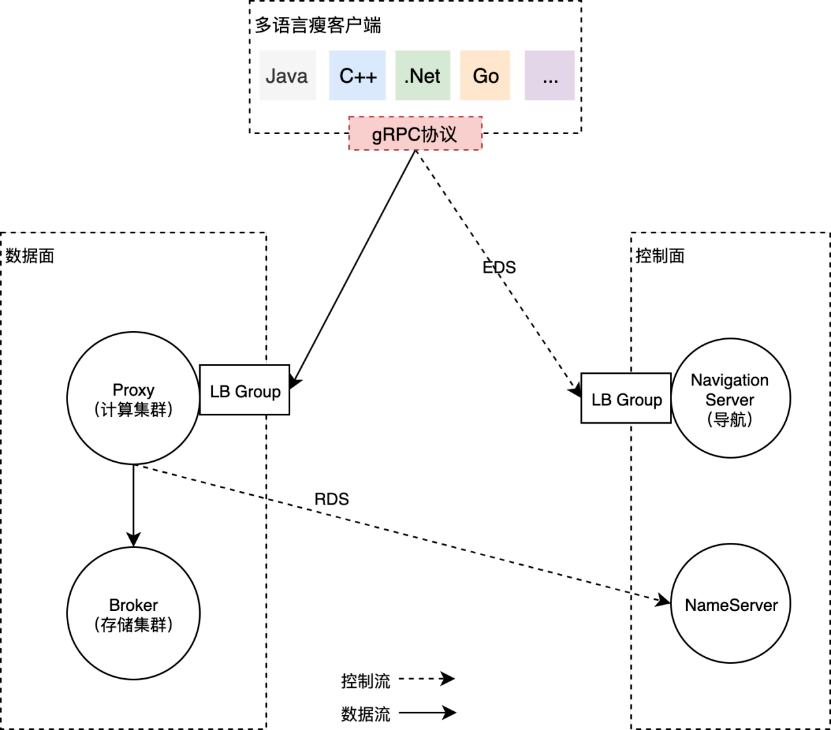
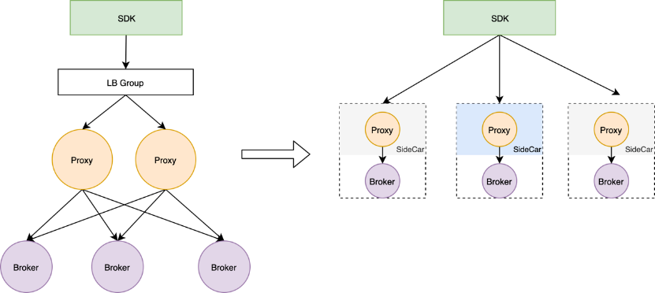
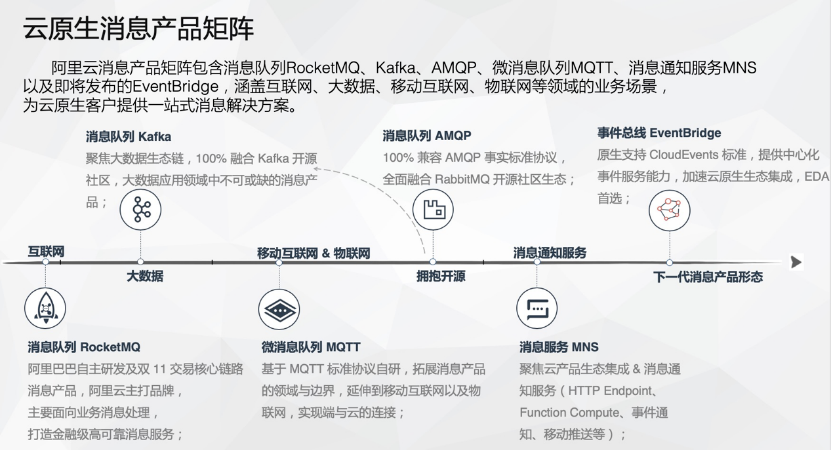
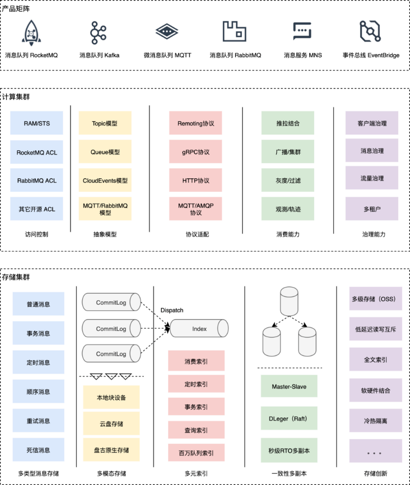

大家好，我是**华仔**, 又跟大家见面了。

从今天开始，我们开始对 RocketMQ 进行相关实现原理进行剖析，今天是第十五篇，我们来聊聊 RocketMQ「事务消息架构设计」，深度剖析下其内部底层原理设计思想。

  

##   
**01 总体概述**

Apache RocketMQ 自 2012 年开源以来，因其具备架构简单、业务功能丰富、极强的可扩展性等特点被广泛采用。

RocketMQ 在阿里巴巴集团内部有着数千台的集群规模，每天十万亿消息流转的规模。

在阿里云上，RocketMQ 的商业化产品也以弹性云服务的形式为全球数万个用户提供企业级的消息解决方案，被广泛应用于「**互联网**」、「**大数据**」、「**移动互联网**」、「**物联网**」领域的业务场景，成为了业务开发的首选消息中间件。

尽管消息中间件 RocketMQ 在阿里巴巴和开源社区已经走过了十多个年头，但在云原生浩浩荡荡的浪潮下，我们开始对 RocketMQ 的架构有了一些新的思考。

## **02 痛点与困局**

阿里巴巴有大规模实践 RocketMQ 的生产经验，自 RocketMQ 2016 年对外商业化以来，一直延续跟集团消息中间件相同的架构，为云上的客户提供全托管的消息服务。

发展至今，消息队列 RocketMQ 在云上已经具备相当大的业务规模。随着业务的发展，这套极简的分布式架构在云原生环境下逐渐显露出了一些不足，比如，「**运维成本增加**」、「**效率降低**」。

集团消息中间件通过存储计算一体化的部署架构，为集团电商业务提供了「**高性能**」、「**低延迟**」、「**低成本**」的消息服务。随着云的进化，变得更有弹性。云原生时代对效率有更高的要求，我们也迎来了对云上消息架构进行云原生化改造的契机。

上图是目前 RocketMQ 在云上部署的一个简化版架构（仅包含最核心的组件），这套部署架构近年来在云上遇到的主要痛点如下：

## **2.1 富客户端形态**

RocketMQ 的用户需要借助官方提供的 SDK 使用云上的服务，这是一个比较重量级的富客户端，提供了诸如「**顺序消费**」、「**广播消费**」、「**消费者负载均衡**」、「**消息缓存**」、「**消息重试**」、「**位点管理**」、「**推拉结合**」、「**流控**」、「**诊断**」、「**故障转移**」、「**异常节点隔离**」等一系列企业级特性。

RocketMQ 的富客户端极大地降低了集团内客户的接入成本，一站式助力集团客户构建高韧性、高性能的消息驱动应用，但云上的富客户端有一些不足：

1.  富客户端跟云原生的技术栈不匹配，比如很难跟 Service Mesh 结合，也跟 Dapr 这类新兴的云原生应用框架不兼容，消费者物理资源耗费比较大，对 Serverless 弹性也不是很友好；
2.  多语言客户端对齐困难，在云上对多语言的诉求是非常强烈的，但富客户端逻辑复杂，团队无充足的人力保障多语言客户端的质量，为此云上诞生了基于 GraalVM 和 HTTP 协议的多语言 SDK，但都有其局限性；
3.  客户端不是完全无状态，存在内存状态，重启的时候会触发重平衡，导致消费抖动、延迟。这种重平衡的设计满足了性能上的需求，但对于敏感型业务，这些抖动可以说在过去几年贡献了很多的工单；
4.  分区级别的消费粒度，客户端负载均衡的粒度在分区，一个分区无法同时被多个消费者消费，在慢消费者场景影响非常大，无法通过扩容分担慢消费者的压力。

## **2.2 计算存储一体化**

Broker 是 RocketMQ 最核心的节点，承担了服务端所有的计算和存储逻辑，其核心能力为：

1.  **计算****：**鉴权与签名、商业化计量、资源管理、客户端连接管理、消费者管控治理、客户端 RPC 处理、消息编解码处理等。
2.  **存储****：**基于分区的 WAL 存储，多类型索引（普通、定时、事务等），核心的收、发、查询能力，多副本复制能力等。

计算存储一体化的 Broker 具备以下优点：部署结构简单，开源用户可以开箱即用；部署节点少，低成本支持集团双十一万亿级的消息规模；数据就近处理，无中间环节，性能高，延迟低。

但一体化的 Broker 在云环境也有其局限性：

1.  **业务迭代效率低****：**发布单元为 Broker，即使调整了一行计量逻辑，需要全量发布数千台 Broker 节点才能全网生效，导致业务创新和迭代的速度慢。
2.  **稳定性风险高****：**计算存储一体，但大多数业务需求都是针对计算逻辑，存储节点相对稳定，频繁的低价值发布带来了稳定性风险和运维成本；每一次因计算逻辑的修改带来的发布将引起缓存重建、消费延迟、客户端异常感知等问题。
3.  **资源利用率低****：**Broker 是磁盘 IO 和内存密集型应用，对计算资源的消耗相对较低，但两者一体后扩缩容也是一体的，无法将计算和存储节点单独做 Serverless 弹性，整体 Broker 集群资源利用率偏低。
4.  **管控链路复杂****：**因为数据和状态完全分布式存储在 Broker 上，管控节点需要与每个 Broker 进行通信，比如一个查询操作需要命中多个 Broker 并将结果进行聚合等，导致管控链路的逻辑复杂。

## **2.3 客户端与 Broker 直连**

RocketMQ 当前的用户通过客户端直接与 Broker 进行通信，链路是最短化的，运维简单、延迟低，但这样的设计无法很灵活地适配网络极其复杂的云环境，网络上有经典网络、VPC 网络、公网，部署环境上有 OXS 区、售卖区，为客户暴露每一个 Broker 节点带来了运维上的负担：

1.  Broker 对客户端不透明，客户端感知每个 Broker 节点，Broker 的运维动作在客户端往往有明显的感知；
2.  Broker 直接对外提供服务，需要为每个 Broker 申请 VIP，包含 Classic VIP、VPC VIP 甚至公网 IP，线上运维了数千个 VIP。每个 Broker 数个 VIP，运维代价高的同时，很长一段时间 VIP 的手动申请阻碍了 RocketMQ 的自动化部署；
3.  无法支持多接入点，Broker 通过 NameServer 暴露给用户，只能暴露一个接入点，用户一般只能在经典网络、VPC 网络以及公网接入点中三选一。

基于这个大背景，阿里云消息团队对 RocketMQ 在云上进行了云原生架构升级专项，实践存储计算分离的新架构，同时引入基于 gRPC 的全新多语言解决方案，来加速消息中间件的云原生化。

## **03 存算分离新思路**

如何在云上实践存算分离，如何探索出一个适合 RocketMQ 三位一体的新架构，是 RocketMQ 进行云原生架构升级主要考虑的点，这里面有很多现实因素的考量：

1.  RocketMQ 在阿里集团已经充分验证了其架构优秀的特征，是否需要适配云的需求进行存算分离？由此带来的延迟、额外的成本是否能覆盖新架构带来的新价值？
2.  阿里云上多款消息产品已经是存算分离的架构形态，比如消息队列 RabbitMQ、消息服务 MNS，新的架构怎么与这些产品架构进行融合？

对于第一个问题，实践的结果已经告诉我们架构简单的优异性，但在云上遇到的痛点又告诉我们存算分离势在必行，可见存储与计算要不要分离，并不是一个非此即彼的选择，架构上的选择是否能都要呢？对于这个问题，我们的解法是存储计算需要做到可分可合：

1.  「分」有两层解释，首先代表了模块和职责的分明，属于计算的逻辑应该封闭在计算模块，属于存储的逻辑应该下沉到存储模块；第二层是计算和存储要支持分开部署，计算完全采用无状态的部署方式，存储是有状态的方式，来很好地解决在云上多租户场景面临的种种问题。
2.  「合」的前提是从代码设计上要先分开，至于是分开部署还是合并部署完全是业务的选择，新的架构必须要支持合并的部署形态，满足吞吐型的业务场景。比如，阿里集团内部超大规模的消息流场景；又比如小规模单租户场景，不需要服务化的场景，合并部署可以快速将 RocketMQ 投产。

对于第二个问题，在阿里云上有多个自研的不同协议标准的消息服务，如何通过单一架构支持多产品形态至关重要，将 RocketMQ 的核心业务消息的能力无缝复制到多个产品，放大业务价值。

总而言之，架构层面的核心理念是以存储计算架构分离为切入点，进一步探索单一架构多产品形态，以降低消息子产品的重复建设，最终也需要实现存储与计算可分可合的部署形态，同时满足云上的运维灵活性以及部署简单、高性能的需求。

**3.1 存储计算分离架构**

RocketMQ 5.0 在架构上的第一个升级便是存储计算分离改造，通过引入无状态的 Proxy 集群来承担计算职责，原 Broker 节点会逐步演化为以存储为核心的有状态集群，同时会重新研发一批多语言的瘦客户端来解决富客户端带来的诸多问题。

上图是一个存储计算分离架构的简图，图中借用了 Service Mesh 关于控制和数据面的划分思想以及 xDS 的概念来描述，架构中各个组件的职责分别为：

1.  **多语言瘦客户端****，**基于 gRPC 协议重新打造的一批多语言客户端，采取 gRPC 的主要考虑其在云原生时代的标准性、兼容性以及多语言传输层代码的生成能力。
2.  **导航服务（Navigation Server）****，**通过 LB Group 暴露给客户端，客户端通过导航服务获取数据面的接入点信息（Endpoint），随后通过计算集群 Proxy 的 LB Group 进行消息的收发。通过 EDS 来暴露 Proxy 的接入点信息与通过 DNS 解析的负载均衡进行路由相比而言，可以作出更智能与更精细的租户及流量控制、负载均衡决策等。
3.  **NameServer****，**RocketMQ 中原有的核心组件，主要提供用于存储的 Broker 集群发现（CDS）、存储单元Topic 的路由发现（RDS）等，为运维控制台组件、用户控制台组件、计算集群 Proxy 提供xDS服务。
4.  **Proxy****，**重新研发的无状态计算集群，数据流量的入口，提供鉴权与签名、商业化计量、资源管理、客户端连接管理、消费者管控治理、客户端RPC处理、消息编解码处理、流量控制、多协议支持等。
5.  **Broker****，**原 Broker 模块的存储部分独立为新的存储节点，专注提供极具竞争力的高性能、低延迟的存储服务，存储计算分离后也更易加速存储能力的创新。原 Broker 模块的计算部分逐渐上移到 Proxy集群当中。
6.  **LB Group****，**根据用户的需求提供 Classic VIP、VPC VIP、Internet VIP、Single Tunnel、PrivateLink 等多样化的接入能力。

存储计算分离带来的额外成本主要是延迟和成本。

1.  **关于延迟****，**存储和计算节点从本地方法调用转换为远程调用后，无可避免地增加了延迟，一般是毫秒级别，在阿里云上即使是跨 AZ 的网络通信，延迟一般在 2ms 以内，这种量级的延迟增加对大多数业务来讲是完全可以接受的。
2.  **关于成本****，**存算的分开，导致网络传输层面，序列化和反序列化层面不可避免需要更多的 CPU 资源。但另一方面，存储和计算一个属于磁盘 IO、内存密集型，一个是 CPU 密集型，拆开后可以更好地设计规格，更好地利用碎片化资源，更容易提高资源利用率，利用云的弹性能力，成本反而可以降低。

简而言之，在云上环境，云服务形态的 RocketMQ 非常适合存储计算分离架构。

## **3.2 存储计算合并架构**

但从本质来讲，存储计算分离与就近计算和就近存储的理念是冲突的。存储计算一体化的架构在云上带来了困扰，本质还是因为云上是一个多租户的环境，存储计算一体化在多租户的场景下灵活性不够。但很多场景往往都是小规格单租户，其实更适合存储计算一体化。

1.  **开源场景****，**开源用户更加期望 RocketMQ 是一款开箱即用、部署简单的消息中间件，存储计算分离架构会带来一定的复杂度，影响开源生态的建设。
2.  **集团场景****，**数千台物理机的规模，存储计算分离将带来额外的机器成本。
3.  **专有云场景****，**很多专有云可能节点数量有限，更倾向于采用一体化的架构。

为了云外云内都能统一技术方案，我们更加期望的一种架构是存储与计算可分可合的部署形态，分开部署时计算节点完全无状态，运维迭代极其简单，合并部署时跟原架构体验保持一致。

但无论采用什么样的部署架构，存储和计算的分离都是一种良好的模块化设计方式，在编程层面的分开是必须要进行的。

如上图所示，左边是云上一个分离部署的形态，右边是合并部署的形态，合并部署时计算节点可以作为存储节点的 SideCar，采用网格的思想进行部署，也可以将计算和存储揉进同一个进程进行部署。实际上，我们在实践的过程中，通过对代码进行充分设计，Proxy 节点可以通过构造器构造出「Local」和「Cluster」部署两种形态，分别对应合并部署和分离部署的两种架构形态。

## **3.3 单一架构多产品形态**

《云原生时代消息中间件的演进路线》一文中提到，阿里云消息团队目前有业界最丰富的消息产品矩阵，包括消息队列 RocketMQ、消息队列 Kafka、微消息队列 MQTT、消息队列 AMQP、消息服务 MNS、事件总线 EventBridge。

丰富的产品矩阵是团队多年来践行多样性和标准化演进路线的结果，所有的消息子产品目前都构建在 RocketMQ 存储内核之上，非常具备统一架构的前提。

通过单一的存储计算分离架构，支持多产品的业务形态，是云原生消息探索的一个重要方向。这种单一架构多产品形态会带来诸多好处，比如计算节点共建，通过模型抽象支持多业务模型，多通信协议，释放重复建设的人力。通过存储节点并池，各产品打通内部存储节点，形成资源池合并，统一运维和管控，有助于降低成本、提高效率，加速存储创新，孵化消息中台。

如上图所示，单一架构多产品形态的核心先统一存储和计算，并进一步统一管控和运维，真正做到一套架构支撑多个云产品。

1.  存储集群足够抽象，满足通用的消息存取需求。
2.  计算集群多合一，足够的模块化，可插拔，满足多产品部署带来不同权限体系、不同协议、不同抽象模型等的需求。

## **04 总结**

目前，阿里云消息队列 RocketMQ 实践存储计算彻底分离的架构还处于第一个过渡阶段，未来的路还很长，我们会投入至少 1 年的时间在公有云环境全面落地存储计算分离架构，让消息服务更弹性、更云原生，让团队提高效率，加速业务创新。

我们期望新的架构能稳定服务于未来至少 5 年的业务增长，同时，存算可分可合的部署架构也能够非常好地支撑不同规模开源用户的个性化需求，让 Apache RocketMQ 开源社区能够整体收益于存算计算可分可合架构的新形态。（正文完）

原文链接：[https://mp.weixin.qq.com/s?\_\_biz=MzkyMDE0NTYxNQ==&mid=2247516327&idx=1&sn=f04da75834a1cac3668a047a4e3b0464&chksm=c1959b07f6e21211c4b63aad852373b6f20a89739bd55051bf81e4c6ce3386647b7c75b79374&token=1297064545&lang=zh\_CN#rd](https://mp.weixin.qq.com/s?__biz=MzkyMDE0NTYxNQ==&mid=2247516327&idx=1&sn=f04da75834a1cac3668a047a4e3b0464&chksm=c1959b07f6e21211c4b63aad852373b6f20a89739bd55051bf81e4c6ce3386647b7c75b79374&token=1297064545&lang=zh_CN#rd)