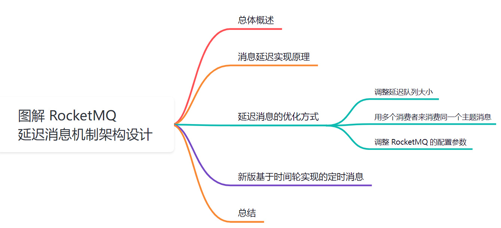
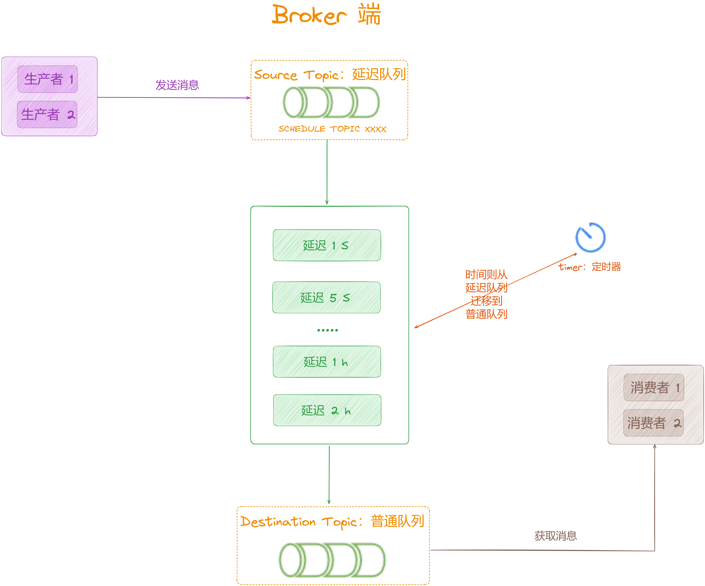
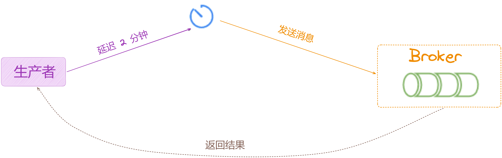

## 【原理分析系列第十六篇】图解 RocketMQ 延迟消息机制架构设计

大家好，我是**华仔**, 又跟大家见面了。

从今天开始，我们开始对 RocketMQ 进行相关实现原理进行剖析，今天是第十六篇，我们来聊聊 RocketMQ 「**延迟消息机制架构设计**」，深度剖析下其内部底层原理设计思想，**下面进入正题**。

  

##   
**01 总体概述**

在互联网的实际业务场景中，消息的「**延迟处理**」是非常必要的。这样业务场景也很多，比如：

1.  在金融交易系统中，某些交易的确认可能需要一段时间才能完成。
2.  在物流跟踪系统中，某些货物的运输状态需要一段时间才能更新。

而消息 MQ 中间件具备了使用消息的「**延迟处理**」来保证信息及时性的能力。

这边举两个具体的例子：

1.  火车票订购，提交了订单就把车票给占位了，这时候可以发送一个延时确认的消息，15m 未付款，就要把该车票释放，这样其他人就可以购买了。
2.  购买电影票，可以发送一个核销检查消息，在电影开场前15分钟就无法退票了。

既然消息「**延迟处理**」的使用场景这么常见，那我们就要详细来分析下怎么使用 RocketMQ 来实现 。

## **02 消息延迟实现原理**

RocketMQ的消息延时处理是通过预定义的消息延时级别和延时队列来实现的。在发送消息时，生产者可以设置一个延时级别，该消息将会被延迟一段时间后才能被消费者消费。

RocketMQ 默认提供了 18 个延时级别，每个级别对应不同的延迟时间。

所以延时时间并不是随意指定的，RocketMQ 源码中指定的 18 种等级如下：

// org/apache/rocketmq/store/config/MessageStoreConfig.java 的第 137 行

private String messageDelayLevel \= "1s 5s 10s 30s 1m 2m 3m 4m 5m 6m 7m 8m 9m 10m 20m 30m 1h 2h";

1.  RocketMQ 开源 4.x 版本是不支持任意时间延时，需设置固定的延时等级，从 1s 到 2h 分别对应着等级 1 到 18，对于云端 RocketMQ 是支持任意时间延迟的。
2.  可以使用 [setDelayTimeLevel(int level)](http://setdelaytimelevel\(int%20level\)/) 方法设置延时等级，level 从 0 开始。

在 RocketMQ 中，每个「**Broker**」都设置了一个「**延迟队列**」，用来存储「**延迟消息**」。当消息的延时时间到达时，该消息将会被自动转移到普通的消息队列中，等待消费者的消费。

这种方式可以有效地避免因为网络延迟或者消费者处理速度慢而导致消息的延迟。

  

## **03 消息延迟处理实战**

使用 RocketMQ 的消息「**延迟处理**」非常简单。在发送消息时，生产者只需要设置一个「**延迟级别**」，然后将消息发送到 RocketMQ 就完事了，示例代码如下：

public class DelayProducerApplicationDemo {

public static void main(String\[\] args) throws InterruptedException, RemotingException, MQClientException, MQBrokerException , UnsupportedEncodingException {

// 1、创建生产者producer，并指定生产者组名为 example\_huazai\_group\_name

DefaultMQProducer producer \= new DefaultMQProducer("example\_huazai\_group\_name");

// 2、指定NameServer的地址，以获取Broker路由地址

producer.setNamesrvAddr("localhost:9876");

// 3、启动生产者producer

producer.start();

// 4、创建消息，并指定Topic，Tag和消息体

Message msg \= new Message("scheduledTopic","scheduledTopicKey", "试一试延迟 2m 发送的消息".getBytes("UTF-8"));

// 5、设置延时等级5,对应2m,所以这个消息在2分钟之后发送

msg.setDelayTimeLevel(5);

// 6、发送消息到一个Broker

SendResult sendResult \= producer.send(msg);

// 7、通过sendResult返回消息是否成功送达

System.out.printf("%s%n", sendResult);

// 8、如果不再发送消息，关闭生产者Producer

producer.shutdown();

}

}

生产者延迟消息流程如下：

1.  首先创建了一个生产者。
2.  然后指定了 NameServer 的地址，并启动了生产者。
3.  接着创建了一个延时级别为 5 的消息，即该消息将会被延迟 2 分钟后才能发送并被消费者消费。
4.  最后发送该消息，并关闭生产者。

## **04 延迟消息的优化方式**

虽然 RocketMQ 的消息「**延迟处理**」功能已经非常强大，但是在实际业务场景中，我们可能还需要根据自己的业务需求进行一些优化，如下：

1.  **调整延迟队列大小**：在 RocketMQ 中，每个 Broker 都只有一个延时队列，队列太小可能导致一些延时消息被丢弃。可以根据实际需求调整延时队列的大小。
2.  **用多个消费者来消费同一个主题消息**：在 RocketMQ 中，可能有批量执行被设置了同样的延迟时间，这个就存在了一些风险，类似缓存的批量过期一样，可能会击穿数据库。如果只有一个消费者来消费该主题的消息，可能会导致该消费者的处理速度不够快，从而影响到消息的及时性。我们可以根据实际需求增加消费者数量，以提高消息的处理速度。
3.  **调整 RocketMQ 的配置参数**：RocketMQ提供了一些配置参数，可以用来调整其性能和可靠性。我们可以根据实际需求调整这些参数，以优化消息的延时处理效果。

总之，RocketMQ 的消息延时处理功能非常强大，可以满足许多实际应用场景的需求。在实际应用中，我们可以根据自己的业务需求进行一些优化，以进一步提高消息的及时性和可靠性。

## **05 新版基于时间轮实现的定时消息**

这里可以看下君哥之前写的文章：[https://mp.weixin.qq.com/s/I91QRel-7CraP7zCRh0ISw](http://xn--,rocketmq%20-8x4sk7codz76o24m9b486g30ab2rsa9363aqad4486bu6dwa4186bbzr949aov9fuurb1km8t9c/)

## **06 总结**

这里，我们一起来总结一下这篇文章的重点。

1、从「**实际生产业务场景**」中抛出了「**延迟消息处理**」的实际例子。

2、接着带你剖析了「**RocketMQ**」延迟消息的实现原理以及示例实战。

3、接着带你剖析了「**RocketMQ**」延迟消息的优化方式。

4、最后带你剖析了「**RocketMQ**」时间轮算法实现的定时消息。

下篇我们来深度剖析「**RocketMQ ACL 机制架构****设计**」，大家期待，我们下期见。

![](data:image/png;base64,iVBORw0KGgoAAAANSUhEUgAAAQAAAAEACAYAAABccqhmAAAQAElEQVR4AeydjZLkNg6D97v3f+dctH2+sUi4zZHtbv8gFcUmDYIUlELVqGaT//zjv6yAFXisAv/547+sgBV4rAI2gMcevTduBf78sQH43wIr8FAF2rZtAE0FLyvwUAVsAA89eG/bCjQFbABNBS8r8FAFbAAPPXhv+9kKTLu3AUxK+GkFHqiADeCBh+4tW4FJgbIBAH/g+2safI8n5P0oXuhxFQz0NfCKt9TCiwNeT8V1dA5eveH9c885IPfak7/KBf0cqg56DHwnVrOpXNkAVLFzVsAKXE+B+cQ2gLkafrcCD1PABvCwA/d2rcBcARvAXA2/W4GHKbDJAP75558/R66jz0LNfnTPPfkhXzApfqjhVG3MVTWD3BPWc7Ffi1VPGOOC9TrQmDbLyFLz75n7zUwRu8kAIpljK2AFrqWADeBa5+VprcCuCtgAdpXTZFbgWgrYAK51Xp7WCgwroAp3NwDQFyjwPq+GG83B+17w+l7ljxc28KqHn6fiinUthp8aeL2r2tEcvDjh59n6xgU/36H+ruaK3CpWdSoHtVlUj5iDzKV6xroWK9yeOcizwXpuzxka1+4G0Ei9rIAVuIYCNoBrnJOntAKHKGADOERWk1qBcymwNM0tDaD9DFdZsP4zF2RMhbthlOgtv9eq8itczFVngqxH5Gox9DjF33BxKZzKQc8PRKrd4zjH7g2+QHhLA/iCjm5pBS6pgA3gksfmoa3APgrYAPbR0SxW4LQKvBvMBvBOHX+zAjdX4BYGAAz958qqZxsvf2CsH9TrqrNFHNR6jNZFLVocuVrc8vPVcqML8p7m3NM79LgpP39WZ5jXTO/V2ivhbmEAVxLcs1qBMylgAzjTaXgWK7CzAmt0NoA1hfzdCtxYARvAjQ/XW7MCawrsbgDThclvn2uDvvv+214TXnFO3+ZPWL9cmuPfvaueKgd9T8ix6qO4FK6SU1wqB3m2iIN1TKz5bRz3BLWeUMP9dp53+DhrNX7HOfJtdwMYGcI1VsAK7K9AhdEGUFHJGCtwUwVsADc9WG/LClQUsAFUVDLGCtxUgU0GAPnyBPbLVTWHvqeqgx4DyP+nAazjIGO29FS18VJIYbbkoN/DFq7R2rjHFkM/F9TPqTJH6xFXpa5hoJ+t5SoL+jrYN1YzVHObDKDaxDgrYAXOqYAN4Jzn4qmswEcUsAF8RGY3sQLnVMAGcM5z8VRWYFiB3xSWDSBenHwrrmwO8iVLpa5h1L5afmQpLqjNBj1O9YceAyiYzMXZJEgkgfRHrwWslIIaF4zh4h5bXBpsA6j1OMOqbqFsAFVC46yAFbiOAjaA65yVJ7UCuytgA9hdUhNage8p8NvONoDfKma8FbiRArsbAOQLG+hzVf2grwMdV/kiDjQf9PlYtyVWF0SKT+FiTtWpHPT7gVqsuI7OxT1uidWskPeucCoXZ4HMBTmnuKCGU7V75nY3gD2HM5cVsALHKmADOFZfs1uBjykw0sgGMKKaa6zATRT4igFA/vkHci7+zLUUj56F4hvlgjy/4oIaLtZCrqvOX8XFnt+IIe9zdA6ocZ1ZH+j3MKrFUt1XDGBpGOetgBX4rAI2gM/q7W5W4BAFRkltAKPKuc4K3EABG8ANDtFbsAKjCpQNAPrLCGC0p/xPcSkyIP3JM8g5VRtz6qIH9uNS/HGGb8Wwvs/q/FVcZa9buGBsT9WekPmhzykulYO+DvR/5kxpFvkUZkuubABbmrjWCliB4xTYwmwD2KKea63AxRWwAVz8AD2+FdiigA1gi3qutQIXV2CTAUDtcqNykRExS3FFb1ULtVkVP+RaGMup2VQOen6FUbOqXKUW+n5Qv6hSPaHnq2AABZMXwWpPgMTC+7xsKpKxp4CUU5BnUsXQ4yKmxdBjgJYurU0GUOpgkBWwAqdVwAZw2qPxYFbgeAVsAMdr7A5W4LQK2ABOezQezAq8V2CPr5sMIF6KtBjoLmLUkNBjoB63HnGpHpUc5L6Ru8UVroarLMUF63NU66q40VkVv8qN8lfqGqbSs4JZ4lK10J+TwlRzrW9c1dqIizwtjpileJMBLJE6bwWswDUUsAFc45w8pRU4RAEbwCGymtQKHKvAXuw2gL2UNI8VuKACZQNoFwtxQX8pAgxLELmXYqC7ZIT8G2uwjmn8o8O22rgg94RaTs0Bfa3CqFycq8UKB+v80GMARSX/eDfQnZMs3DkJfc+297igx4COY52Kdx5f0sW+CgR5DwqncmUDUMXOWQErcG0FbADXPj9P/0AF9tyyDWBPNc1lBS6mQNkAIP+cEX8+UfEWPaDWM/ZQc8AYV+OOfFDjinVLcesxshTfCE+rgdqeGjYuWK+NNS2uzg+Zv9WPLNVT5Ua4Ww3kWRU/ZFyrX1uQ6xT/Gs/0vWwAU4GfVsAK3EcBG8B9ztI7eYACe2/RBrC3ouazAhdSwAZwocPyqFZgbwXKBqAuGiBfSFQGVFyqTuEg94Q+V+VSOOi5IMeq7iw5yPMqHSvzQuaCnFNckHGwnlNcan7IXBGnuKo5yPywnqvyKxxkfoWLORirazxlA2hgLytgBb6nwBGdbQBHqGpOK3ARBWwAFzkoj2kFjlDABnCEqua0AhdRoGwAULtogIyDPqe0gR4DOo4XPS1WfEfmWs+4QM8L63k1a+RXGMjcsa7FUMM17HypnvPv795j7Tvs/BvkWSPXUgx9rcJBjwEdq9pKbr6X6R1yjwpXw8CrFl7PiXPt2Worq2wAFTJjrIAVuJYCNoBrnZentQK7KmAD2FVOk1mBaylgA7jWeXnaBypw5JbLBrB26TB9j8NO+fkTXhca8POMdS2e10zv8FMDr/fp2/RstXHBCwvvn7GuGk+9509VO//+7l3Vxpyqh7y/WFeNFb+qhWN7QuZXs8WcmlXlYt1SHGsVLmJavAUXayFrATnX+lZW2QAqZMZYAStwLQVsANc6L09rBXZVwAawq5wmswL7KnA0mw3gaIXNbwVOrMAmA4D1ywdYxyzpA2O1kOviZcpSvDTLPA+Zf/59elc9pm/zJ2Q+6HNz/PQOPQby/yOhzTDh50/ItTCWaz3imvdq75C5W/7IBbWeUMPFPUKtTu0xcrUYxvlUj0pukwFUGhhjBazAeRWwAZz3bDzZwxX4xPZtAJ9Q2T2swEkVsAGc9GA8lhX4hAKbDKBdXKwttQlVswUXa6v88PlLF6j1jHuAXBcxLYYaLmqm4sZXWbDeU/FDroOcG61VdSqn9gi1ORRfzMF+XJG7xWr+lq+sTQZQaWCMFbACv1fgUxU2gE8p7T5W4IQK2ABOeCgeyQp8SoGyAcB+P8dAjQvGcZBroc99SuR5H/XzmsrNa5beod8PIKHAH+iXBIYk9DWg41C2KVRaVHOxcbUO8r4il4oV/xacqo051RPG5m/cZQNoYC8rYAWOV+CTHWwAn1TbvazAyRSwAZzsQDyOFfikAjaAT6rtXlbgZArsbgDQX0ioS4uqBqpW5Sp8o3WKu8oFvRaAoksXdKBxsjgkq7OFMhkqrmpOEhaSQNKjUPYXEmf7myz8I9YtxZEK8qyQc7HuXTzyTc1b5dndAKqNjbMCVuD7CtgAvn8GnsAKfE0BG8DXpHdjK/B9BWwA3z8DT2AF/irwjX8cbgAwfikCuRZyLgq35VIkclVjWJ+rccEYTu1J5aDG32ZZW7Afl5q1moM8B6zn1vb37jvsxw/rXMC7cQ77drgBHDa5ia2AFdisgA1gs4QmsALXVcAGcN2z8+Q3UuBbW7EBfEt597UCJ1BgdwOoXOyofVfqljCRDxj+bbLIpWLI/Go2VTuKU1zVnOpZySl+yHtXuKNzlfmhNitknOKPe1KYai5ytVjVQj9bw+25djeAPYczlxWwAscqYAM4Vl+zW4FVBb4JsAF8U333tgJfVsAG8OUDcHsr8E0FygZQuaCA/sICdFzdMOT6am3EQeZSe1K5yKViyPx746DvofirOTiOC3puoDqWxKkzAdJFL/Q5RQY9Bur/Q1XFF3OQ+SNmKYaxWhira3OUDaCBvayAFdhXgW+z2QC+fQLubwW+qIAN4Iviu7UV+LYCZQOAsZ8z1M9v1U2P1qo6lYO8J8i5WHv0/FX+Lbgz7Amy1lDLxfmrsdIMck+Fq+TUHJW6JUzkW8KN5ssGMNrAdVbACmgFzpC1AZzhFDyDFfiSAjaALwnvtlbgDArYAM5wCp7BCnxJgbIBxMuIalzdF+SLGKjlKj0gc6k6tS+FizlVB7mnwqncKH+sazHkOWA912rjglyn5o85yHWRu8WxrsUtX1nQ91A1jS8uhYOeC0gwYPWXkUBjEtmGRNxPi6t0ZQOoEhpnBazAdRSwAVznrDypFdhdARvA7pKa0ApcRwEbwHXOypPeRIEzbWOTAYC+4ICf/JbNtsuMuBRfBaPqqjn42Q8gy4B0IRTnajFknCJs2PmqYBpe4VSuYeergml4hYO8J+hzqk7loK+D7/xpvbbXuNS8MRdrWhwxLW75ymrYI9cmAzhyMHNbAStwvAI2gOM1dgcrcFoFbACnPRoPdkcFzrYnG8DZTsTzWIEPKlA2ANjvckZdfqg9Q+6pcDEHtbrqHAoXc3GG38SwPi9kDORcnGsphr5W4aDHAHJbqjbmVGHEtFjhgHTBqnCtfr4qmDl+/q5qY26On96hNmvkajHkWljPtdrRVTaA0QauswJW4LwK2ADOezae7GYKnHE7NoAznopnsgIfUsAG8CGh3cYKnFGBTQYA+YJiugyZnls2PXHMn1v4Yi3k+SNGxZDr5jNO76pW5Sb8/Al9D1WnctDXgY5VbSU3n3F6V3XQ952w86eqm3+f3hUOen6oxYpL5SDzTfNMT8gYxbUlN/V694TxOTYZwJaNudYKPEmBs+7VBnDWk/FcVuADCtgAPiCyW1iBsypQNoB3P4PMv0H+eQT6nBJjzjG9Q18H+k+GQY+r8k995k9VG3Nz/PQO/Qyg4wk/f0LGzr8vvce5WqywLR9XxEFthsjTYlivhYxptZUVZ21xpa6KgfHZqj0quLavuCDPBn2uwr2EKRvAEoHzVsAKvFfgzF9tAGc+Hc9mBQ5WwAZwsMCmtwJnVsAGcObT8WxW4GAFDjeAeKnRYugvMQC5zYaNSwErGFWnckD6k2ewnosztFjxV3Mw1hNyXZslLuhx8XuLoceAjhs2Luix8XuLlRbQ1wEKJnONc74UCEjnO6+Z3iu1ChNzSzHkOSDnpnl++1zqG/OHG0Bs6NgKWIHzKGADOM9ZeBIr8HEFbAAfl9wNrcB5FLABnOcsPMnNFLjCdjYZAORLi7hpWMe0Gsg4qOVa/dqCGtdvL1smPGR+NRPUcBPvuyfUuCDjIq+atZqDzF+tPRIX97gUQ55/CbuWV/tRNaM4yLNCzil+ldtkAIrQOStgBa6jgA3gOmflSa3A7grYAHaX1IRW4M+fq2hgA7jKSXlOK3CAAmUDgHzRoC43Ym7LzJFrKYZ+NtVTOUL5WgAACDBJREFU1SqcykHPDzlW/Ftyao5KTvVUddDvQWGqXBUc9P0A1bKcUz2B9Ft+sJ5TXGoQ6LkURnFBXwf6j7UrPuhrFb/KKS6VKxuAKnbOCliBaytgA7j2+Xn6EypwpZFsAFc6Lc9qBXZWwAaws6CmswJXUmCTAUB/QQE5roqhLjIg80HOxdq9e0a+2K/FEdNiyLPCWK7xVRZk/kpdFdP2GhfknhGjYqjVQcZBzsU9qJ4RsxRD5o98S7Wjecg9R7mqdZsMoNrEOCvwFAWutk8bwNVOzPNagR0VsAHsKKaprMDVFLABXO3EPK8V2FGB3Q1gz4uSyLUUj+oB+dJF9Rjlr3JVcUfPEfkh6wM5p+aHHhe5W1ypAxq0tCIfkH4zMGJaDBmnGkKPi5gWQ4+B+m/9tfq1BZkfcm6NZ/q+uwFMxH5aAStwfgVsAOc/I09oBQ5TwAZwmLQmtgLnV2CTAbSfn+KKW47fWxwxSzHkn21gPdd6xAW5LmJaDOu4pXljHjJXxHwihvU5IGOaHnFV592rLvK8i6Hfg5oVegygYKUc8P87Bni9q/kUGbzw8PNUuEqu2lNxbTIAReicFbAC11HABnCds/KkVmB3BWwAu0tqQitwHQVsANc5K096UgWuPNYmA4CfCwx4vUcx4JWHn2f10kLhKjn46QWvd1UXZ22xwsGLA17PhosLXt/g5xkxLa7wQ/7lkVa751JzxBz87AVe72oGeH2D5edoHaBKZS7Or2JZKJKVWoUB0sUg5JxoKVOxhwLBOP8mA1DDOGcFrMB1FLABXOesPKkV2F0BG8DukprwSQpcfa82gKufoOe3AhsUKBtAvIxocaVvw8Wl6iBfZMBYTvGrHGR+havMHzEtVlzVHPSzqbrWY3RFPuj7Qb6IbL1iXTWGzK9qW4+4oFYb+WCsrvFArq3MFTG/iVvfuKCfI35vserR8pVVNoAKmTFWwApcSwEbwLXOy9OeSIE7jGIDuMMpeg9WYFABG8CgcC6zAndQYHcDgP7SAnKshFMXGdVc5FN1EdPiKg76PbTauKDHABGyGKs5Yg4o/YYZjOHUcJC54lwtVrUx13CVBbln5FqKoa+t9PsNJvZVtRGzFEM/KyChsYcCAenfDYVTud0NQDVxzgrcTYG77McGcJeT9D6swIACNoAB0VxiBe6igA3gLifpfViBAQXKBgBjFw3xEqPF1Tkh94Sci3ywjmk1kHGQcw07X5AxbV9xzWumd8i107f5E3rc/NsV3vfUorrfSs8ql8LB60xg+1Pxqxz0vRRmS65sAFuauNYKWIFzKmADOOe5eCor8BEFbAAfkdlNrMA5FSgbQPz5qhpv2fZoD1VXnaNSW8G0flVcw8YVa+P3FkdMi1s+rpYfWZHnNzGM/exanRN6fsixmhe24eac1VkVbs7zzfeyAXxzSPe2AlbgGAVsAMfoalYrcAkFbACXOCYPaQWOUcAGcIyuZr2hAnfcUtkAIF+ewOdzlUOAPFelroqBzA+13FkuhKCfd8veVW3cp8JsyUX+Fkc+6PcIRMjfGEh/mq7xxfUXvPIPyFwrJW8/j8zwljB8LBtAqHNoBazADRSwAdzgEL0FKzCqgA1gVDnXPUqBu27WBnDXk/W+rEBBgU0GEC8o9o4L8/+FxL5/k+EfkC9nYl2LYR0XqBfDxhcXZH7IuUgaeVocMb+JW/18/aY2Yuc80zvkPUGfm7DzZ+ReiqHngvz/MViqjfl5/+k9YqrxVD9/VmsruDnv9F6pW8JsMoAlUuetgBW4hgI2gGuck6f8ogJ3bm0DuPPpem9WYEUBG8CKQP5sBe6swO4GAPlyBtZze4o8XY6sPVVPVQP9/AqjuKCvg3xR1bgqtQpTzUGeA9ZzW/jbvtYW5BmqPRU39HwKo3LQ1wGlMYD0G4RQy5UaFEFqT8XSP7sbQLWxcVbgCgrcfUYbwN1P2PuzAm8UsAG8EcefrMDdFbAB3P2EvT8r8EaBWxgA9Bcvb/bbfYK+DnQcL1kg4yJmKYax2m7wN4Hq+wb+60+KX+Wg36dqpOoUbs8c9HPB8sXsSF+1J5VT3AoHeV5Yzyl+lbuFAaiNOWcFrMC6AjaAdY2MsAK3VcAGcNuj9caswLoCNoB1jYx4oAJP2bIN4MCThnxZo9rBOg4yBnJO8avLpUpOcakc5DkiP2RMlQtyLeRc7Kn4t+Qiv4ohz7WlZ6xVPVUu1i3FNoAlZZy3Ag9QwAbwgEP2Fq3AkgI2gCVlnH+sAk/a+O4GoH4eqeS2iB75YfznsMjVYuj5Wi4u6DGA3FKsW4qB7k+aSTKRhL4OdBxLIePUbLFuKYaeT3FBjwGW6IbyQKch1H/pB3ItrOfUPqvDQ+av1o7idjeA0UFcZwWswOcVsAF8XnN3tAKnUcAGcJqj8CBnUOBpM9gAnnbi3q8VmCmwyQAgX1rAfrnZnL96rV7EKBzk+SPuV8MEMGR+yLlQVg7jrC1WxdD3VBiVg74O9MVa6ztfkOsU/7xmelc4lYO+RwUDfQ28YlU7zTM9Faaamzjmz0otvOaD988KV8NsMoBG4GUFrMB1FbABXPfsPPnOCjyRzgbwxFP3nq3A/xSwAfxPCD+swBMVKBvA/LLim+9HH5LaW6WnqvtGTs06OkeVS+FirjpDrGtxtfZoXJtlvlS/+fffviu+0Vy1d9kAqoTGWYErKvDUmW0ATz1579sK/KuADeBfEfy3FXiqAjaAp568920F/lXABvCvCP772Qo8efc2gCefvvf+eAVsAI//V8ACPFkBG8CTT997f7wCNoDH/yvwbAGevvv/AgAA//8/4GJgAAAABklEQVQDANVxrTtYeQsiAAAAAElFTkSuQmCC)

扫码加入星球

查看更多优质内容

https://wx.zsxq.com/mweb/views/joingroup/join\_group.html?group\_id=51122554151214