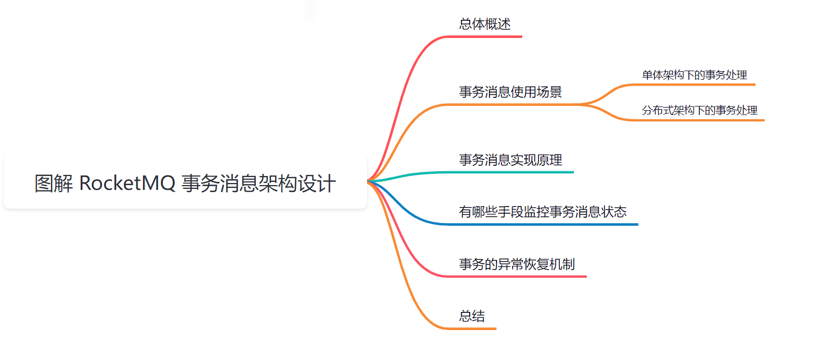
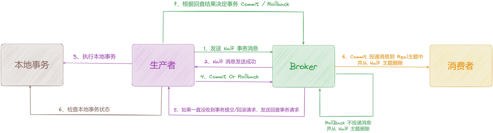
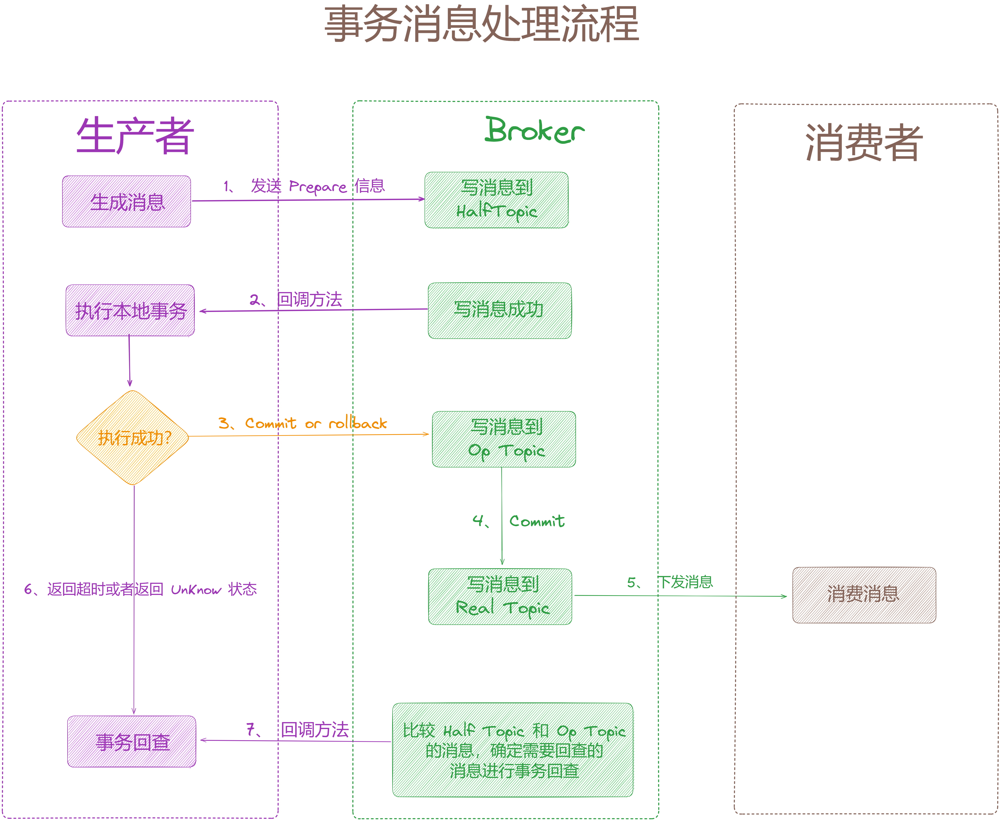

大家好，我是**华仔**, 又跟大家见面了。

从今天开始，我们开始对 RocketMQ 进行相关实现原理进行剖析，今天是第十四篇，我们来聊聊 RocketMQ「**事务消息架构设计**」，深度剖析下其内部底层原理设计思想。

##   
**01 总体概述**

在 RocketMQ 4.3.0 版本后，开放了事务消息这一特性，对于分布式事务而言，最常说的还是「**二阶段提交协议**」，那么 RocketMQ 的事务消息又是怎么一回事呢，本文主要带着以下几个问题来探究一下 RocketMQ 的事务消息的架构设计：

1.  事务消息是如何实现的？
2.  有哪些手段来监控事务消息的状态？
3.  事务消息的异常恢复机制是如何设计的？

## **02 事务消息使用场景**

## **2.1 单体架构下的事务处理**

在单体系统的开发过程中，假如某个场景下需要对数据库的多张表进行操作，为了保证数据的一致性，一般会使用事务，将所有的操作全部提交或者在出错的时候全部回滚。

这里以创建订单为例，假设下单后需要做两个操作：

1.  在订单表生成订单。
2.  在积分表添加本次订单增加的积分记录。

在单体架构下只需使用 [@Transactional](http://transactional/) 开启事务，就可以保证数据的一致性：

@Transactional

public void order() {

String orderId \= UUID.randomUUID().toString();

// 生成订单

orderService.createOrder(orderId);

// 增加积分

creditService.addCredits(orderId);

}

然而现在越来越多系统开始使用「**分布式架构**」，在分布式架构下，「**订单系统**」和「**积分系统**」可能是两个独立的服务，此时就不能使用上述的方法开启事务了，因为它们不处于同一个事务中，在出错的情况下无法进行全部回滚，只能对当前服务的事务进行回滚，所以就有可能出现订单生成成功但是积分服务增加积分失败的情况（也可能相反），此时「**数据处于不一致**」的状态。

## **2.2 分布式架构下的事务处理**

分布式架构下如果需要保证事务的一致性，需要使用「**分布式事务**」，分布式事务的实现方式有多种，这里我们先看通过 RocketMQ 事务的实现方式。

同样以下单流程为例，在分布式架构下的处理流程如下：

1.  订单服务生成订单。
2.  发送订单生成的MQ消息，积分服务订阅消息，有新的订单生成之后消费消息，增加对应的积分记录。

### **2.2.1 普通 MQ 消息存在的问题**

如果使用 [@Transactional + 发送普通MQ](http://xn--transactional%20+%20mq-1q41bp14yehrkvsa/) 的方式，看下存在的问题：

1.  假如订单创建成功，MQ 消息发送成功，但是 order 方法在返回的前一刻，「**服务突然宕机**」，由于开启了事务，事务还未提交（待方法结束后才会正常提交），所以订单表并未生成记录，但是 MQ 却已经发送成功并且被积分服务消费，此时就会存在订单未创建但是积分记录增加的情况。
2.  假如先发送 MQ 消息再创建订单呢，此时问题就更明显了，如果 MQ 消息发送成功，创建订单失败，那么同样处于不一致的状态

@Transactionalpublic void order() {

String orderId \= UUID.randomUUID().toString();

// 创建订单Order order = orderService.createOrder(orderDTO.getOrderId());

// 发送订单创建的MQ消息

sendOrderMessge(order);

return;

}

解决上述问题的方式就是使用 RocketMQ 事务消息。

### **2.2.2 RocketMQ 事务消息使用**

使用事务消息需要实现自定义的事务监听器，[TransactionListener](http://transactionlistener/) 提供了「**本地事务执行**」和「**状态回查**」的接口，[executeLocalTransaction](http://executelocaltransaction/) 方法用于执行我们的「**本地事务**」，[checkLocalTransaction](http://checklocaltransaction/) 是一种「**补偿机制**」，在异常情况下如果未收到事务的提交请求，会调用此方法进行事务状态查询，以此决定是否将事务进行提交/回滚：

public interface TransactionListener {

/\*\*

\* 执行本地事务

\*

\* @param msg Half(prepare) message half消息

\* @param arg Custom business parameter

\* @return Transaction state

\*/

LocalTransactionState executeLocalTransaction(final Message msg, final Object arg);

/\*\*

\* 本地事务状态回查

\*

\* @param msg Check message

\* @return Transaction state

\*/

LocalTransactionState checkLocalTransaction(final MessageExt msg);

}

这里我们实现自定义的事务监听器 [OrderTransactionListenerImpl](http://ordertransactionlistenerimpl/):

1.  executeLocalTransaction 方法中创建订单，如果创建成功返回 [COMMIT\_MESSAGE](http://commit_message/)，如果出现异常返回[ROLLBACK\_MESSAGE](http://rollback_message/)。
2.  checkLocalTransaction 方法中回查事务状态，根据消息体中的订单ID查询订单是否已经创建，如果创建成功提交事务，如果未获取到认为失败，此时回滚事务。

public class OrderTransactionListenerImpl implements TransactionListener {

@Autowiredprivate OrderService orderService;

@Overridepublic LocalTransactionState executeLocalTransaction(Message msg, Object arg) {

try {

String body \= new String(msg.getBody(), Charset.forName("UTF-8"));

OrderDTO orderDTO \= JSON.parseObject(body, OrderDTO.class);

// 模拟生成订单

orderService.createOrder(orderDTO.getOrderId());

} catch (Exception e) {

// 出现异常，返回回滚状态return LocalTransactionState.ROLLBACK\_MESSAGE;

}

// 创建成功，返回提交状态return LocalTransactionState.COMMIT\_MESSAGE;

}

@Overridepublic LocalTransactionState checkLocalTransaction(MessageExt msg) {

String body \= new String(msg.getBody(), Charset.forName("UTF-8"));

OrderDTO orderDTO \= JSON.parseObject(body, OrderDTO.class);

try {

// 根据订单ID查询订单是否存在Order order = orderService.getOrderByOrderId(orderDTO.getOrderId());

if (null != order) {

return LocalTransactionState.COMMIT\_MESSAGE;

}

} catch (Exception e) {

return LocalTransactionState.ROLLBACK\_MESSAGE;

}

return LocalTransactionState.ROLLBACK\_MESSAGE;

}

}

接下来看如何发送事务消息，事务消息对应的生产者为 [TransactionMQProducer](http://transactionmqproducer/)，创建 [TransactionMQProducer](http://transactionmqproducer/) 之后，设置上一步自定义的事务监听器 [OrderTransactionListenerImpl](http://ordertransactionlistenerimpl/)，然后将订单ID放入消息体中， 调用 [sendMessageInTransaction](http://%20sendmessageintransaction/) 发送事务消息：

public class TransactionProducer {

public static void main(String\[\] args) throws MQClientException, InterruptedException {

// 创建下单事务监听器TransactionListener transactionListener = new OrderTransactionListenerImpl();

// 创建生产者TransactionMQProducer producer = new TransactionMQProducer("order\_group");

// 事务状态回查线程池ExecutorService executorService = new ThreadPoolExecutor(2, 5, 100, TimeUnit.SECONDS, new ArrayBlockingQueue<Runnable>(2000), new ThreadFactory() {

@Overridepublic Thread newThread(Runnable r) {

Thread thread \= new Thread(r);

thread.setName("client-transaction-msg-check-thread");

return thread;

}

});

// 设置线程池

producer.setExecutorService(executorService);

// 设置事务监听器

producer.setTransactionListener(transactionListener);

// 启动生产者

producer.start();

try {

// 创建订单消息OrderDTO orderDTO = new OrderDTO();

// 模拟生成订单唯一标识

orderDTO.setOrderId(UUID.randomUUID().toString());

// 转为字节数组byte\[\] msgBody = JSON.toJSONString(orderDTO).getBytes(RemotingHelper.DEFAULT\_CHARSET);

// 构建消息Message msg = new Message("ORDER\_TOPIC", msgBody);

// 调用sendMessageInTransaction发送事务消息SendResult sendResult = producer.sendMessageInTransaction(msg, null);

System.out.printf(sendResult.toString());

Thread.sleep(10);

} catch (MQClientException | UnsupportedEncodingException e) {

e.printStackTrace();

}

for (int i \= 0; i < 100000; i++) {

Thread.sleep(1000);

}

producer.shutdown();

}

}

事务的执行流程：

1.  在订单服务下单后，向Borker发送生成订单的事务消息，投递到ORDER\_TOPIC主题中
2.  Broker收到事务消息之后，不会直接投递到ORDER\_TOPIC主题中，而是先放在另外一个主题中，也叫half主题，half主题对消费者不可见
3.  half主题加入消息成功之后，会回调事务监听器的的executeLocalTransaction方法，执行本地事务，也就是订单创建，如果创建成功返回COMMIT状态，如果出现异常返回ROLLBACK状态
4.  根据上一步的返回状态，进行结束事务的处理
5.  提交：从half主题中删除消息，然后将消息投送到ORDER\_TOPIC主题中，积分服务订阅ORDER\_TOPIC主题进行消费，生成积分记录
6.  回滚：从half主题中删除消息即可
7.  如果本地事务返回的执行结果状态由于网络原因或者其他原因未能成功的发送给Broker，Broker未收到事务的执行结果，在补偿机制定时检查half主题中消息的事务执行状态时，会回调事务监听器checkLocalTransaction的接口，进行状态回查，判断订单是否创建成功，然后进行结束事务的处理

使用事务消息不会存在订单创建失败但是消息发送成功的情况，不过你可能还有一个疑问，假如订单创建成功了，消息已经投送到队列中，但是积分服务在消费的时候失败了，这样数据还是处于不一致的状态，个人感觉，积分服务可以在失败的时候进行重试或者进行一些其他的补偿机制来保证积分记录成功的生成，在极端情况下积分记录依旧没有生成，此时可能就要人工接入处理了。

## **03 事务消息实现原理**

RocketMQ 作为一款消息中间件，主要作用就是「**对各个业务系统进行解耦**」，以及对「**对海量消息进行削峰填谷**」的作用。

而对于「**事务消息**」，主要是通过消息的「**异步处理**」，可以保证「**本地事务**」和「**消息发送同时成功或者失败**」，从而保证数据的「**最终一致性**」，这里我们先看看一条事务消息从诞生到结束的整个时间线流程图，如下：

1.  首先，生产者发送消息到 broker 端，此时该消息是「**prepare**」消息，且事务消息的发送是「**同步发送**」的方式。
2.  broker 接收到消息后，会将该消息进行转换，所有的事务消息统一写入「**Half Topic**」，该 Topic 默认是「**RMQ\_SYS\_TRANS\_HALF\_TOPIC**」，写入成功后会给生产者返回成功状态。
3.  本地生产获取到该消息的事务 Id，进行本地事务处理。
4.  本地事务执行成功提交 Commit，失败则提交 Rollback ，超时提交或提交 Unknow 状态则会触发 broker 的事务回查。
5.  若提交了 Commit 或 Rollback 状态，Broker 则会将该消息写入到「**Op Topic**」，该 Topic 默认是「**RMQ\_SYS\_TRANS\_OP\_HALF\_TOPIC**」，该 Topic 的作用主要记录已经 Commit 或 Rollback 的 prepare 消息，Broker 利用 Half Topic 和 Op Topic 计算出需要回查的事务消息。
6.  如果是 commit 消息，broker 还会将消息从 Half 取出来存储到真正的Topic里，从而消费者可以正常进行消费。
7.  如果是 Rollback 则不进行其他操作。
8.  如果本地事务执行超时或返回了 Unknow 状态，则 broker 会进行事务回查。若生产者执行本地事务超过 6s 则进行第一次事务回查，总共回查 15 次，后续回查间隔时间是 60s，broker 在每次回查时会将消息再在 Half Topic 写一次。回查次数和时间间隔都是可配置的。
9.  执行事务回查时，生产者可以获取到事务 Id，检查该事务在本地执行情况，返回状态同第一次执行本地事务一样。

从上面整个流程中可以看到事务消息其实只是保证了「**生产者发送消息成功与本地执行事务的成功的一致性**」，消费者在消费事务消息时，broker 处理事务消息的消费与普通消息是一样的，若消费不成功，则 broker 会「**重复投递该消息 16 次**」，若仍然不成功则需要人工介入。

事务消息的成功投递是需要经历三个 Topic 的，分别是：

1.  **Half Topic**：用于记录所有的 prepare 消息， 对应队列 「**RMQ\_SYS\_TRANS\_HALF\_TOPIC**」。
2.  **Op Half Topic**：记录已经提交了状态的 prepare 消息，对应队列 「**RMQ\_SYS\_TRANS\_OP\_HALF\_TOPIC**」 。
3.  **Real Topic**：事务消息真正的 Topic，在 Commit 后会才会将消息写入该 Topic，从而进行消息的投递。

理解清楚事务消息在这三个 Topic 的流转就基本理解清楚了 RocketMQ 的事务消息的处理。

## **04 有哪些手段监控事务消息状态**

通过上面的文章，可以大致了解事务消息的实现，我们可以知道，事务消息主要有三个状态：

1.  **UNKNOW 状态**：表示事务消息未确定，可能是业务方执行本地事务逻辑时间耗时过长或者网络原因等引起的，该状态会导致broker对事务消息进行回查，默认回查总次数是15次，第一次回查间隔时间是6s，后续每次间隔60s,
2.  **ROLLBACK 状态**：该状态表示该事务消息被回滚，因为本地事务逻辑执行失败导致
3.  **COMMIT 状态**：表示事务消息被提交，会被正确分发给消费者。

那么监控事务消息时，主要是查看该事务消息是否是处于我们想要的状态，而在事务消息生产者发送 prepare 消息成功后只能拿到一个 [transactionId](http://transactionid/)，该id不是的 RocketMQ 消息存储的物理 offset 地址，RocketMQ 只有在准备写入 [commitlog](http://commitlog/) 文件时才会生成真正的 msgId，而这里可以获取的 [transactionId](http://transactionid/) 和 msgId 都是客户端生成的一个消息的唯一标识符，我们在这里称为 [uniqId](http://uniqid/)，在 broker 端，会把该 [uniqId](http://uniqid/) 作为一个 [msgKey](http://msgkey/) 写入消息，所以可以通过该 uniqId 来查找 uniqId 的一些状态。

## **05 事务的异常恢复机制**

事务消息的异常状态主要有：

1.  生产者提交 prepare 消息到 broker 成功，但是当前生产者实例宕机了。
2.  事务消息会根据 producerGroup 搜寻其他的生产者实例进行回查，所以 transactionId 务必保存在中央存储中，并且事务消息的 pid 不能跟其他消息的 pid 混用。
3.  生产者提交 prepare 消息到 broker 失败，可能是因为提交的 broker 已宕机。
4.  当前实例会搜寻其他的可用的 broker-master 进行提交，因为只有提交 prepare 消息后才会执行本地事务，所以没有影响，注意生产者报的是超时异常时，是不会进行重发的。
5.  生产者提交 prepare 消息到 broker 成功，执行本地事务逻辑成功，但是 broker 宕机了未确定事务状态。
6.  因为返回状态是 oneway 方式，此时如果消费者未收到消息，需要用手段确定该事务消息的状态，尽快将broker 重启，broker 重启后会通过回查完成事务消息。
7.  生产者提交 prepare 消息到 broker 成功，但是在进行事务回查的过程中 broker 宕机了，未确定事务状态。
8.  同3，尽快重启 broker。

## **06 总结**

本文从事务消息的场景出发，剖析了 RocketMQ 事务消息的使用场景、RocketMQ 事务消息的底层实现原理等等，具体的实现细节会在源码中再进行剖析。

下篇我们来深度剖析「**图解 RocketMQ 消息轨迹架构设计**」，大家期待，我们下期见。