大家好，我是**华仔**, 又跟大家见面了。

从今天开始，我们开始对 RocketMQ 进行相关实现原理进行剖析，今天是第十篇，我们来聊聊 RocketMQ「**5.0 版本的新特性**」的架构设计，深度剖析下其内部底层原理设计思想，**下面进入正题**。

  
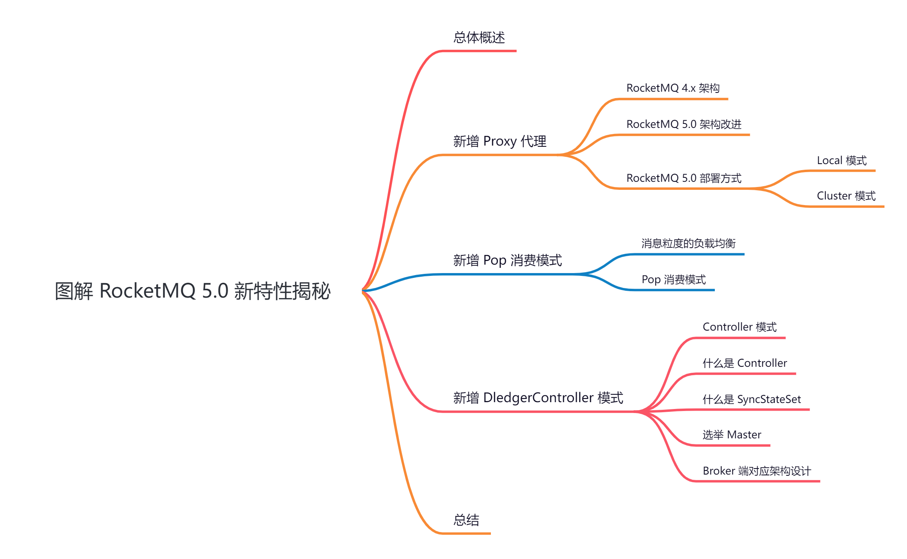

##   
**01 总体概述**

关于 RocketMQ「**5.0**」版本已经发布一段时间了，这里我们来挨个剖析下 RocketMQ「**5.0**」都有哪些新特性。

废话不多说，马上开始正题。

## **02 新增 Proxy 代理**

RocketMQ「**5.0**」架构上最大的变化就是为了更好的向「**云原生**」生态演进，提高资源利用和弹性能力。因此 RocketMQ 在「**5.0**」进行了架构的调整与升级，先来看新特性之一，增加了「**Proxy 代理层**」。

## **2.1 RocketMQ 4.x 架构**

RocketMQ「**5.0**」以前使用「**自定义 Remoting 协议**」底层基于「**Netty**」进行网络通信，计算存储是一体的，都在「**Broker**」中，生产者和消费者从「**NameServer**」中拉取到路由信息，之后直接与「**Broker**」交互进行消息的生产与消费，其架构图如下：

  
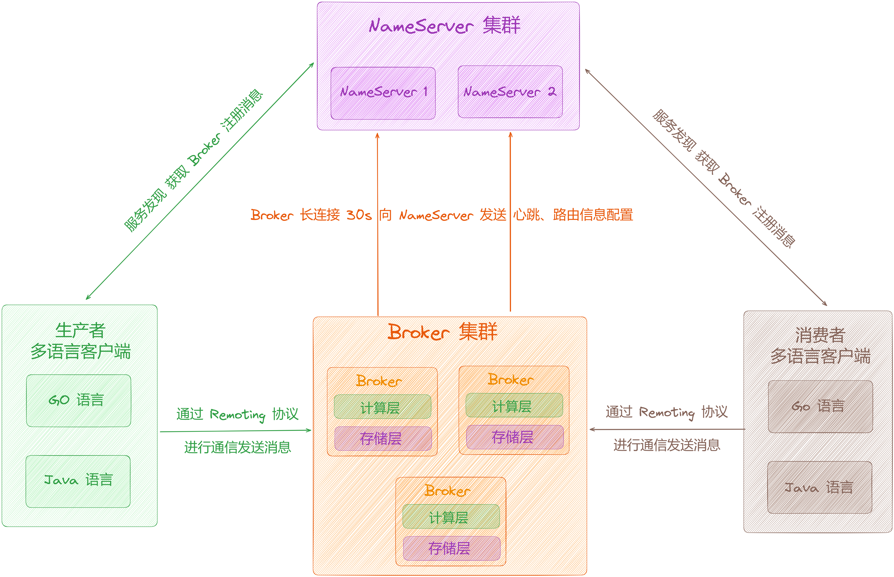

从上图可以看出存在以下问题：

1.  计算层和存储层没有进行分离，都在 Broker 中，不利于在云原生环境下实现「**弹性调度**」。
2.  Remoting 协议是「**私有协议**」，每支持一种新的语言，一些基础的工作（比如网络通信、编解码）都需要重新开发，开发和维护成本高。

## **2.2 RocketMQ 5.0 架构改进**

RocketMQ「**5.0**」以后引入了「**弹性无状态**」的代理模式，对 Broker 的职责进行了拆分，将「**客户端协议适配**」、「**权限管理**」、「**消费管理**」等计算逻辑进行抽离放入了「**Proxy 代理层**」。那么 Broker 就会只专注数据存储，以便更好的适应云原生环境，实现资源弹性调度。且 5.0 以后增加了「**GRPC 协议**」支持，它是 Google 开源的高性能 RPC 框架，基于 Protobuf 序列化。

  
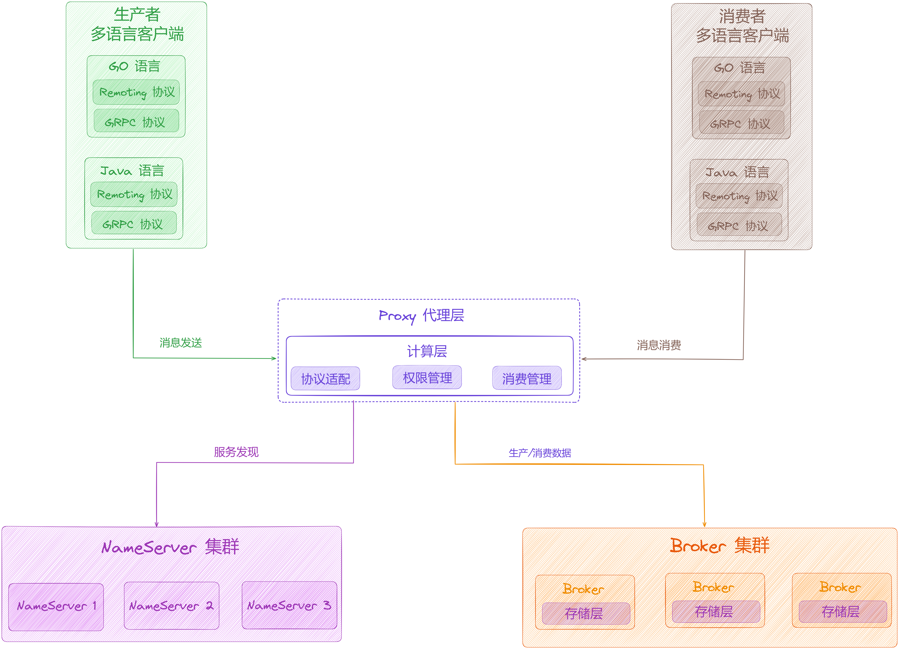

  
从上面架构来看，当增加「**Proxy 代理层**」后，生产者和消费者不再直接与「**Broker**」通信，而是与「**Proxy 代理层**」通信，「**Proxy 代理层**」再与「**NameServer**」和「**Broker**」交互进行消息的发送和消费，如果需要提高计算层的能力，只需要增加「**Proxy 代理层**」，如果需要提高存储层的能力，增加「**Broker**」的部署即可。

另外「**GRPC 协议**」是公有协议，底层已经实现了「**网络通信**」、「**编解码**」等基础框架，提供了各个语言的开发库，使用非常轻便，在 RocketMQ 新增语言支持时可以省去「**重复繁杂**」的工作。

## **2.3 RocketMQ 5.0 部署方式**

在 RocketMQ「**5.0**」版本中分为「**Local 模式**」和「**Cluster 模式**」。

### **2.3.1 Local 模式**

Broker 和 Proxy 代理层「**一起部署的**」，部署时需要在原有的 Broker 配置上增加「**Proxy**」相关的配置，该模式可以实现 5.0 之前版本的架构效果。

  
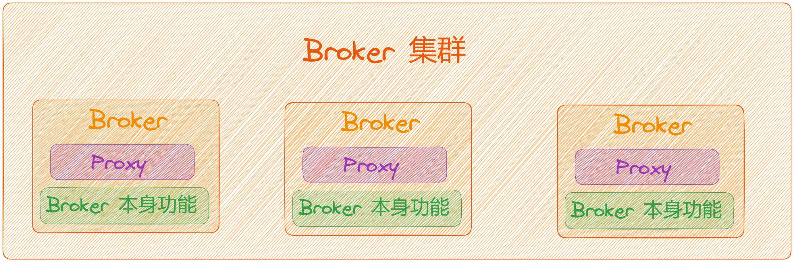

### **2.3.2 Cluster 模式**

Broker 和 Proxy 代理层是分别「**独立部署的**」，是实现存储和计算分离的部署方式。

  
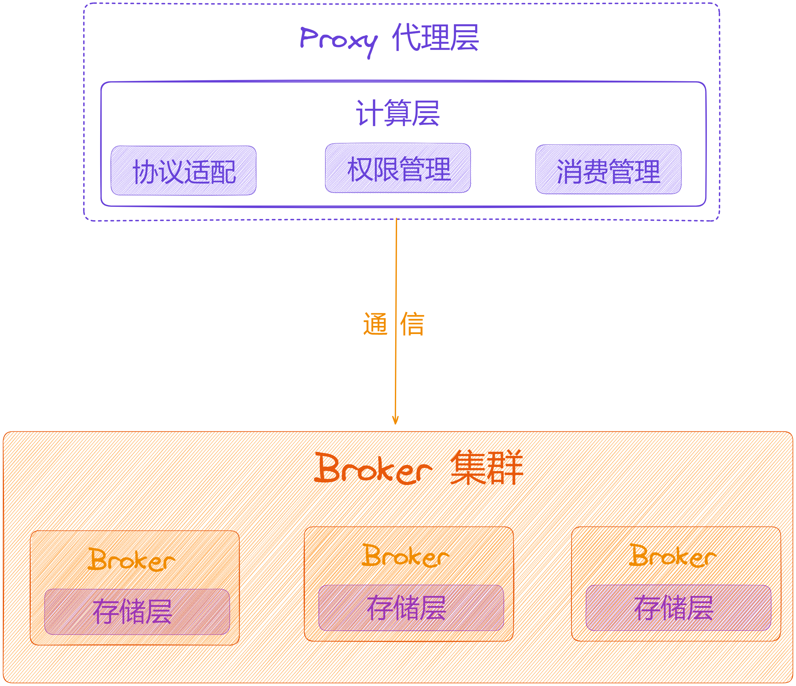

## **03 新增 Pop 消费模式**

聊完「**Proxy 代理层**」的架构设计后，我们来聊聊「**Pop 消费模式**」是什么，它做了哪些改进。

我们都了解在 RocketMQ「**5.0**」之前，消费有两种方式可以从 Broker 获取消息，分别为「**Pull 模式**」和 「**Push 模式**」。

1.  **Pull 模式**：消费者需要不断的从阻塞队列中获取数据，如果没有数据就等待，这个阻塞队列中的数据由「**消息拉取线程**」从Broker 拉取消息之后加入的，因此 Pull 模式下消费需要不断主动从 Broker 拉取消息。
2.  **Push 模式**：需要注册「**消息监听器**」，当有消息到达时会通过「**回调函数**」进行消息消费，从表面上看就像是 Broker 主动推送给消费者一样，底层依旧是消费者从 Broker 拉取数据然后「**触发回调函数**」进行消息消费，只不过不需要像 Pull 模式一样不断判断是否有消息到来而已。

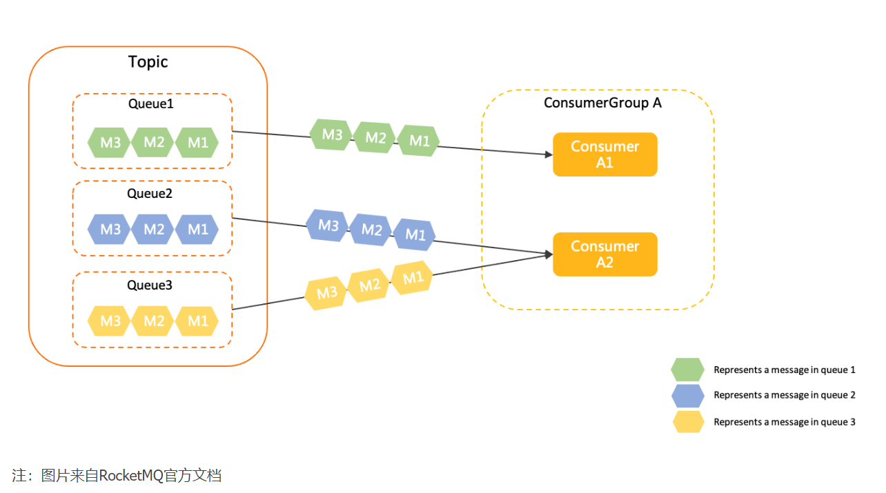

不管是「**Pull 模式**」还是「**Push 模式**」，在集群模式下，一个消息队列只能分配给「**同一个消费组内**」的「**某一个消费者**」进行消费，所以需要进行「**Rebalance 负载均衡**」为每个消费者分配消息队列之后才可以进行消息消费。

在 RocketMQ「**5.0**」以前「**Rebalance 负载均衡**」是以「**消息队列**」为维度为每个消费者分配的，一个消息队列只能分给「**同一个消费组内一个消费者**」消费，所以会存在以下问题：

1.  消息队列只能分给组内一个消费者消费，也就无法通过「**扩容消费者**」的数量来提升消费能力。
2.  除了保持「**Rebalance 负载均衡**」还有「**消费位点管理**」等功能，如果新增一种语言的支持，就需要重新实现一遍对应的业务逻辑代码。
3.  当「**消息队列数量**」与「**消费者数量**」比例不均衡时，可能会导致「**某些消费者没有队列可分配**」或者「**Rebalance 负载均衡**」某些消费者承担过多的消息队列，分配不均匀。
4.  当某个消费者 hang 住时，会导致分配到该消费者的消息队列中的消息无法消费，导致消息积压。

在 RocketMQ「**5.0**」版本增加了「**Pop 消费模式**」，将「**负载均衡**」、「**消费位点管理**」等功能放到了 Broker 端，减少客户端的负担，使其变得轻量级，并且 5.0 之后支持「**消息粒度**」的「**负载均衡**」。

## **3.1 消息粒度的负载均衡**

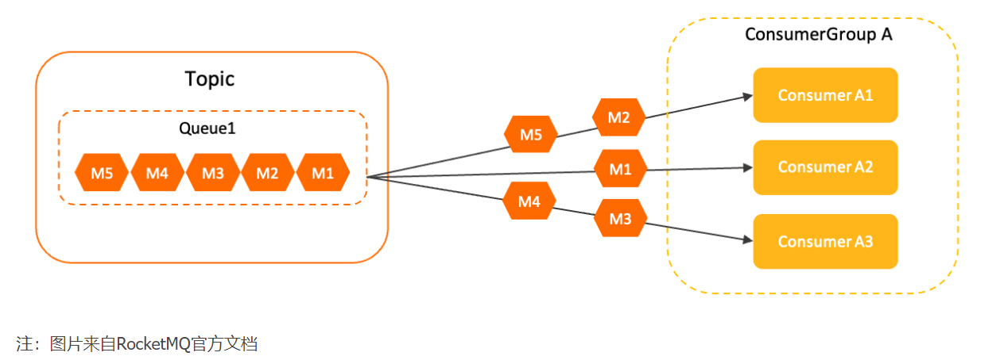

在消息粒度负载均衡策略中，「**同一个消费组内多个消费者**」将按照给「**消息粒度**」平均分摊主题中的所有消息，即同一个队列中的消息被平均分配给组内多个消费者共同消费。

该策略可以保证同一个队列的消息可以被组内多个消费者共同处理，但是该策略使用的「**消息分配算法**」是「**随机**」的，是「**不能指定消息**」被「**哪一个特定**」的消费者处理。

当消费者获取到某条消息后，服务端会对「**该消息加锁**」，保证该消息对其他消费者不可见，直到消息消费成功或者超时，所以多个消费者同时消费同一个消息队列中的消息，服务端也可以「**保证消息不会被多个消费者重复消息**」。

因此，该策略适用于绝大多数在线处理的业务场景，对于 [PushConsumer](http://pushconsumer/) 和 [SimpleConsumer](http://simpleconsumer/) 类型的消费者，默认且仅使用消息粒度负载均衡策略。

##   
**3.2 Pop 消费模式**

首先消费者向服务端 Broker 发送「**Pop 请求**」，Broker 端收到请求后以「**Pop 模式**」获取消息，之后返回给消费者，当消费成功之后，向 Broker 发送「**ACK 请求**」确认消息消费成功。

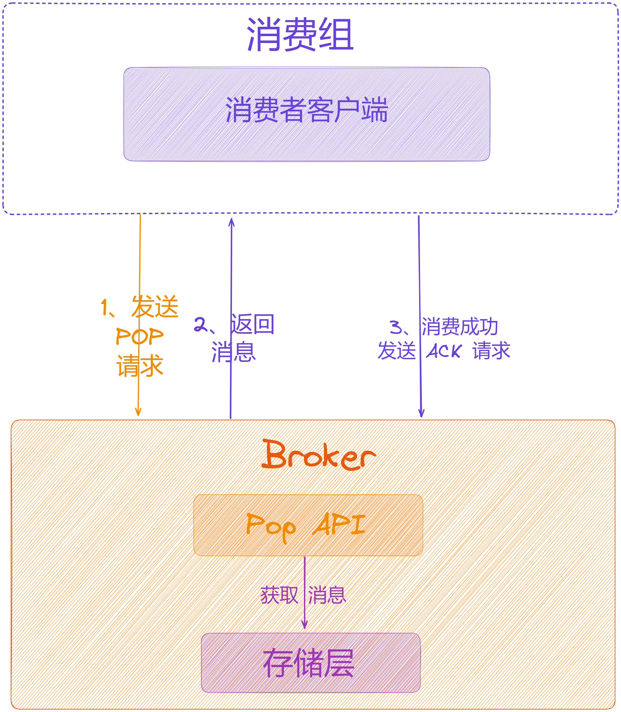

当「**Pop 出一条消息**」之后，这条消息就会在一段时间内「**不可见**」，在这个时间段内，这条消息不会再被「**Pop 出来**」，如果在这个期间未能收到该消息的「**ACK 请求**」，过了这个不可见的时间之后，消息就会「**恢复可见状态**」，重新被消费。

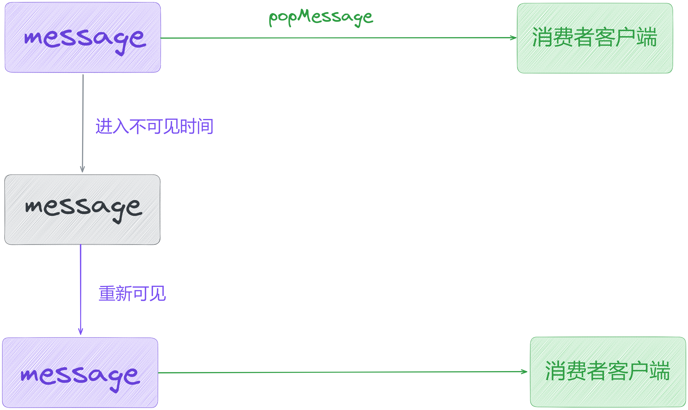

「**Pop**」的消费位点由 Broker 端来「**保存**」和「**控制**」的，并且「**Pop**」模式可以使「**多个消费者消费同一个消息队列**」的消息，消费者不再需要在「**本地做负载均衡**」分配消息队列，只需要调用服务端提供的「**Pop**」接口获取消息进行消费即可，即便某个消费者hang住，其他消费者依旧可以继续消费队列中的数据，不会造成消息堆积。

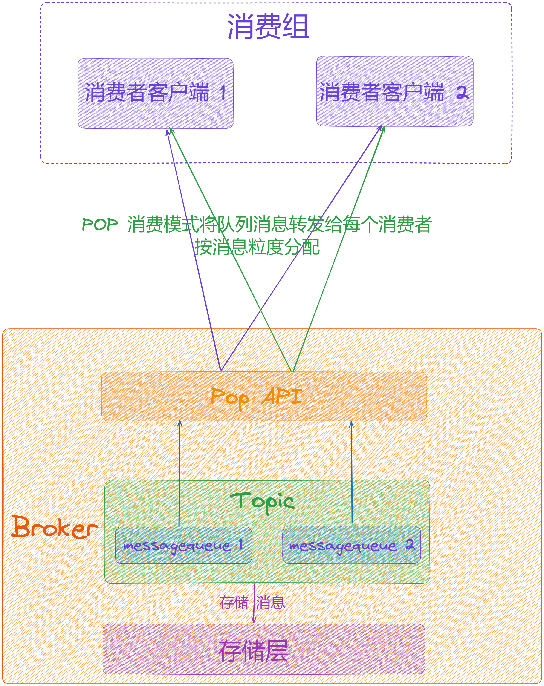

## **04 新增 DledgerController 模式**

在 RocketMQ 5.0 以前，有两种集群部署模式，分别为「**主从模式（Master-Slave 模式）**」和 「**Dledger 模式**」。

关于主从模式：[【原理分析系列第四篇】图解 RocketMQ Broker 主从同步与集群模式原理](https://articles.zsxq.com/id_x09mz42l01r3.html)

关于 Dledger ：[【原理分析系列第八篇】图解 RocketMQ Broker 基于 DLedger 主从架构设计](https://articles.zsxq.com/id_dbexv86zfhzp.html)

关于 Dledger 日志复制：[【原理分析系列第九篇】图解 RocketMQ Broker 基于 DLedger 模式的日志复制架构设计](https://articles.zsxq.com/id_uuh00d7w2oko.html)

## **4.1 Controller 模式**

为了解决如上问题，在 RocketMQ「**5.0**」以后推出了 Controller模式，它的特点如下：

1.  在主从部署模式下就具有「**自动切换 Master**」的能力，在 5.0 之前需要使用 DLedger 模式才可以。
2.  可以利用RocketMQ原生存储复制能力，并统一RocketMQ的存储和复制能力；

RocketMQ「**5.0**」对「**Broker 选主**」相关的功能进行了抽离，放在「**Controller**」中，实现了在「**主从部署**」模式下就可以自动切换 Master，「**Controller**」可以独立部署也可以嵌入在「**NameServer**」中部署。

独立部署下的 Controller：

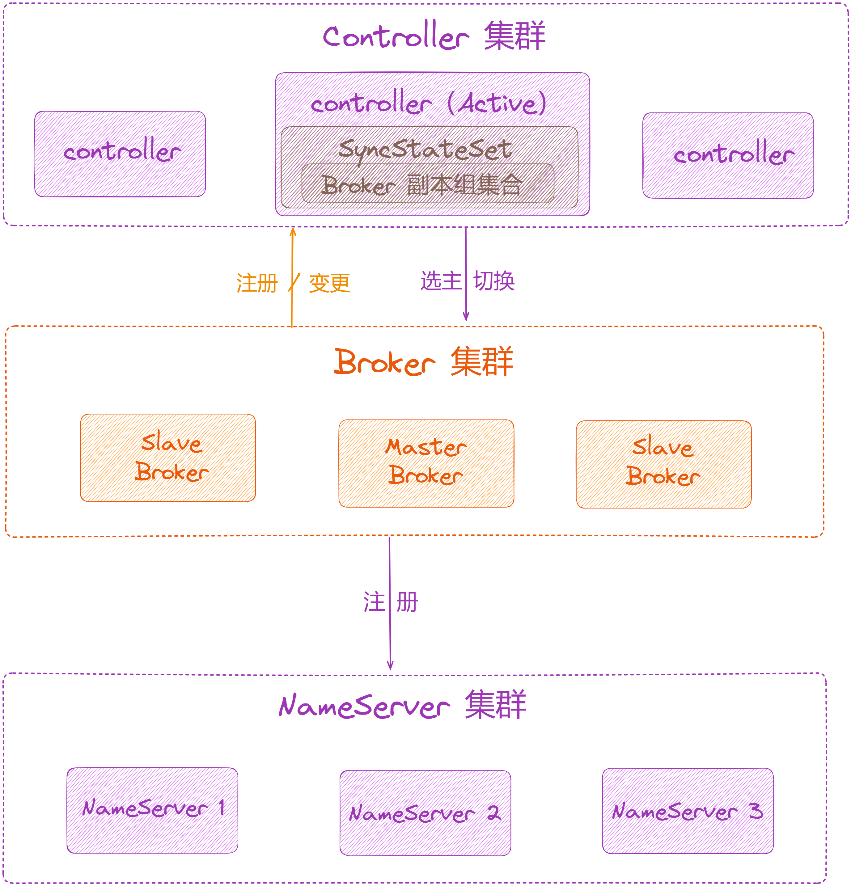

嵌入 NameServer 中的部署图如下：

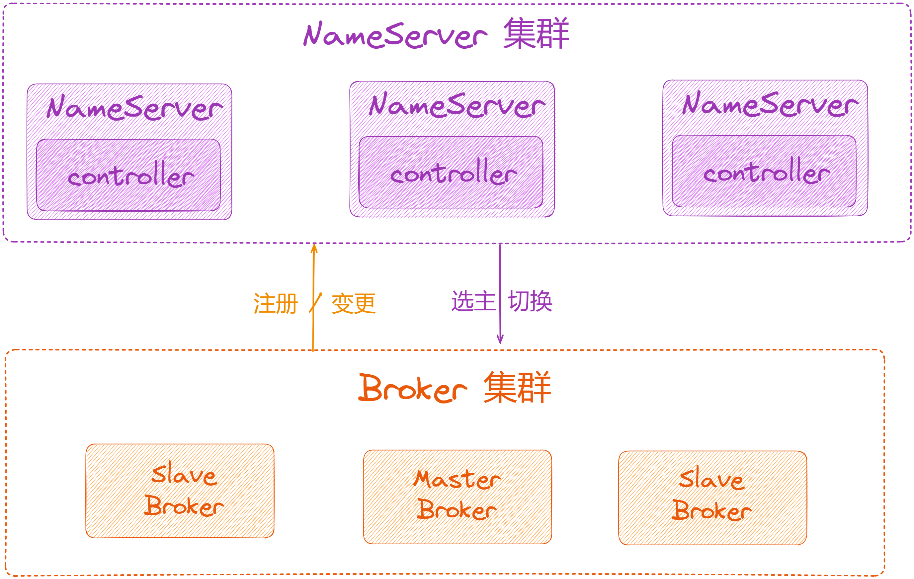

官方文档：[https://rocketmq.apache.org/zh/docs/deploymentOperations/03autofailover/](https://rocketmq.apache.org/zh/docs/deploymentOperations/03autofailover/)

## **4.2 什么是 Controller**

「**Controller**」也称为「**Controller**」控制器，一般集群中部署多个「**Controller**」，类似于 Kafka ，也是使用「**Raft 算法**」选举出一个「**Active Dledger Controller**」作为主控制器，它主要用来管理一个 「**SyncStateSet**」集合，该集合中「**存储着一组可以跟上 Master 进度的 Broker 阶段集合**（类似 Kafka 中的 ISR 列表），如果「**Controller**」发现某个「**Master Broker**」下线时，会从集合中选出「**新的 Master Broker**」并切换，「**Controller**」可以单独部署可以嵌在「**NameServer**」中部署。

## **4.3 什么是 SyncStateSet**

「**SyncStateSet**」中维护了一个 Broker 副本组集合，包含当前「**Master Broker**」和对应的 「**Slave Broker**」，需要注意在集合内的节点都是跟上「**Master**」进度的节点。

在节更变动时，由「**Master Broker**」向「**Controller**」控制器发起变更请求，更新「**Controller**」中的「**SyncStateSet**」数据，在选举「**Master**」的时候，「**Controller**」只需从这个列表中选出一个节点成为新的「**Master**」即可。

节点变更分为「**Shrink**」操作和「**Expand**」操作，都是需要「**Master Broker**」来发起，它会通过「**定时任务**」以及在数据同步过程中判断是否需要进行「**Shrink**」或「**Expand**」。

## **4.4 选举 Master**

不管是 Controller 独立部署，还是嵌入到 NameServer 中部署，「**Controller**」都会监听每个「**Broker**」的连接，「**Broker**」 会定期向「**Controller**」发送「**心跳包**」，「**Controller**」会定时扫描，如果某个 「**Broker**」心跳包发送超时，会认为这个「**Broker**」已经失效，此时会判断「**Broker**」是否是「**Master 角色**」，如果是「**Master 角色**」就需要从该组的「**SyncStateSet**」中重新选出一个节点作为 「**Master 角色**」。

选举「**Master**」的方式比较简单，从该组的「**SyncStateSet**」中，挑选一个「**心跳包发送正常的 Slave 成为新的 Maste 节点**」即可，并将「**结果通知**」到该组所有的「**Broker**」，每个「**Broker**」也会定时向「**Controller**」发送请求获取「**主备信息**」。

## **4.5 Broker 端对应架构设计**

在原先「**主从架构**」部署模式下，需要配置「**brokerRole**」和「**brokerId**」，也就是「**手动分配 Master**」和「**Slave**」。

在「**Controller**」模式下，这两个参数会失效，不需要再进行配置，「**brokerRole**」和「**brokerId**」由「**Controller**」来分配。该模式下增加了「**controllerAddr**」参数，Broker 在启动时，需要配置这个参数，设置每个「**Controller**」的地址：

#controllerAddr：controller的地址，多个controller中间用分号隔开。

controllerAddr = 127.0.0.1:9876;127.0.0.1:9877;127.0.0.1:9878;127.0.0.1:9879

在「**Broker**」中配置了每个「**Controller**」的地址，当「**Broker**」启动时，会先向「**Controller**」注册，并获取「**brokerRole**」和「**brokerId**」，通过角色关系可以知道自己是 Master 还是 Slave，之后再向 NameServer 注册。

Broker 可以通过任意一个「**Controller**」获取「**Active Controller**」节点的IP，后台也会有一个「**定时任务**」，定时更新「**Active Controller**」节点的IP。

初始化时，「**第一个 Broker**」在向「**Controller**」注册的时候，此时并没有该 Broker 组的「**SyncStateSet**」，所以「**Active Controller**」会将第一个向其发送请求共识的「**Broker**」设置为「**Master**」，之后该组的其他节点会设置为「**Slave**」，「**Master**」节点的 brokerId 为 0，「**Slave**」节点从 1 开始编号，往后递增。

由于「**Controller**」控制每个节点的角色，所以每个「**Broker**」也会定时向「**Controller**」发送请求获取主备信息，以便在角色发生变化的时候可以及时更新。

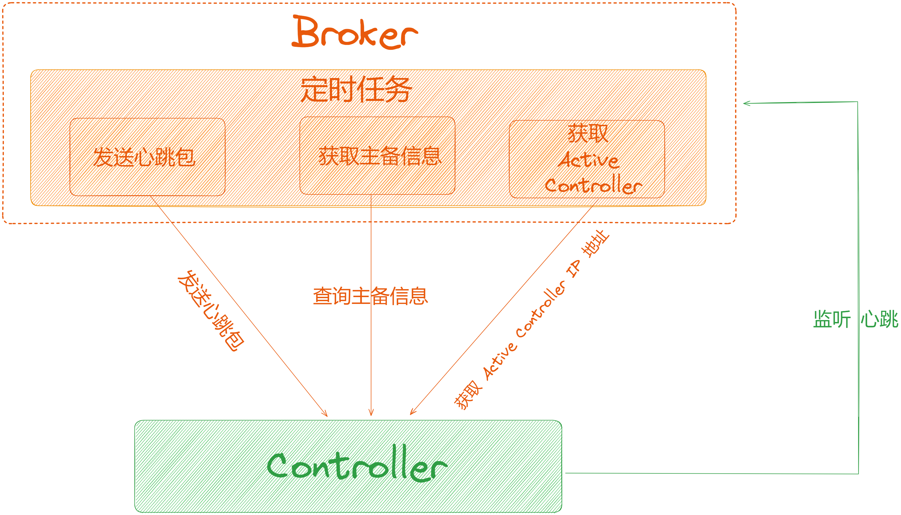

## **05 总结**

这里，我们一起来总结一下这篇文章的重点。

本文从三个方向深度剖析了「**RocketMQ 5.0**」架构新特性，包括「**新增 Proxy 代理**」、「**新增 POP 消费模式**」、「**新增 DledgerController 模式**」。

下篇我们来深度剖析「**图解 RocketMQ 三高架构**」，大家期待，我们下期见。