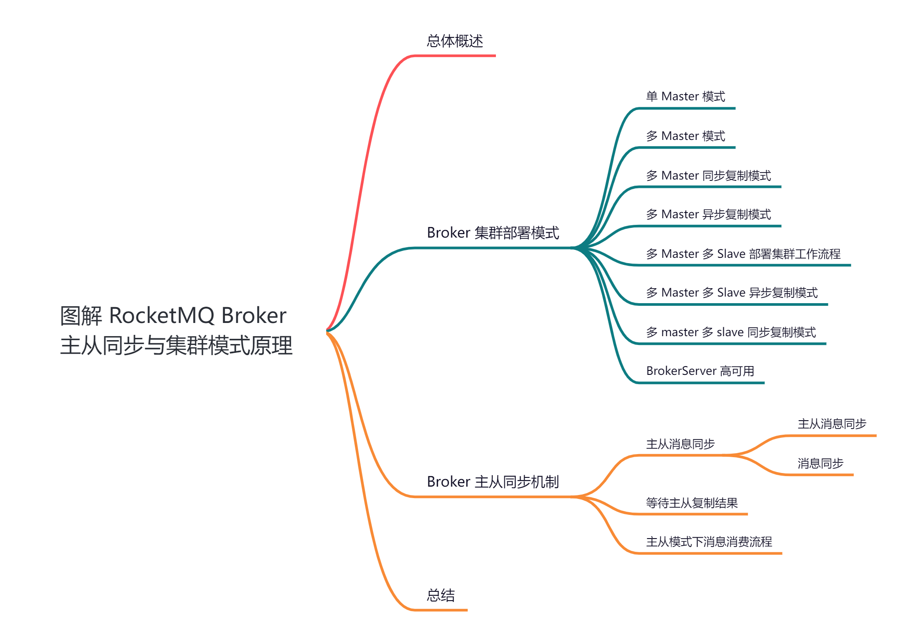
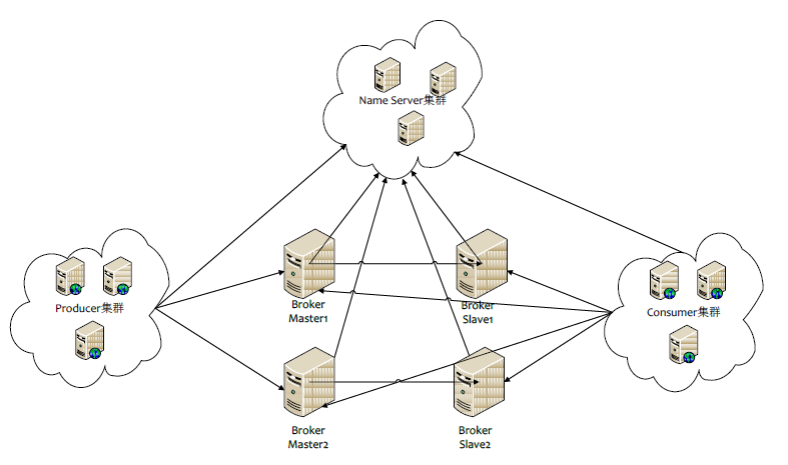
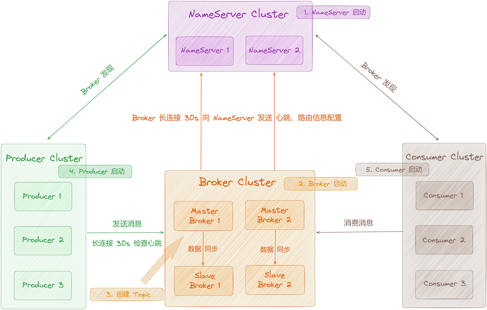
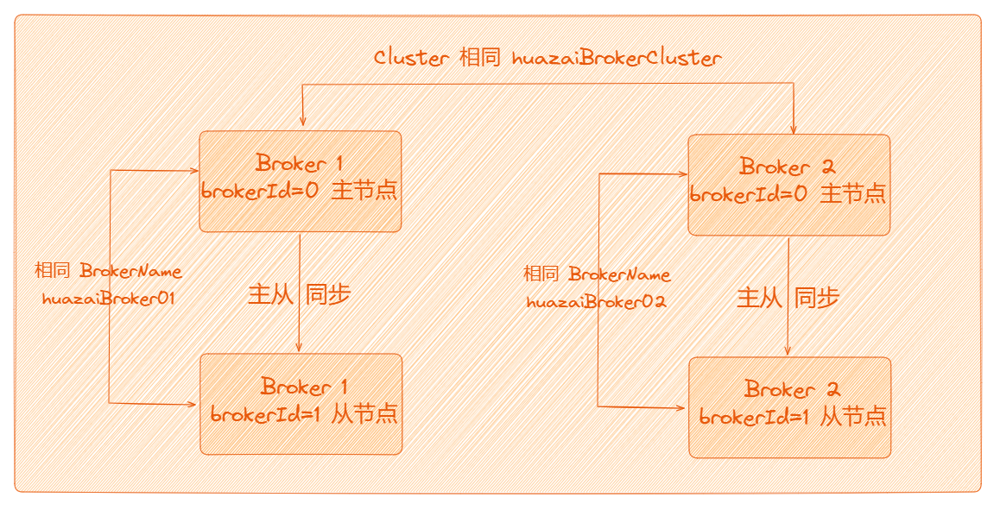
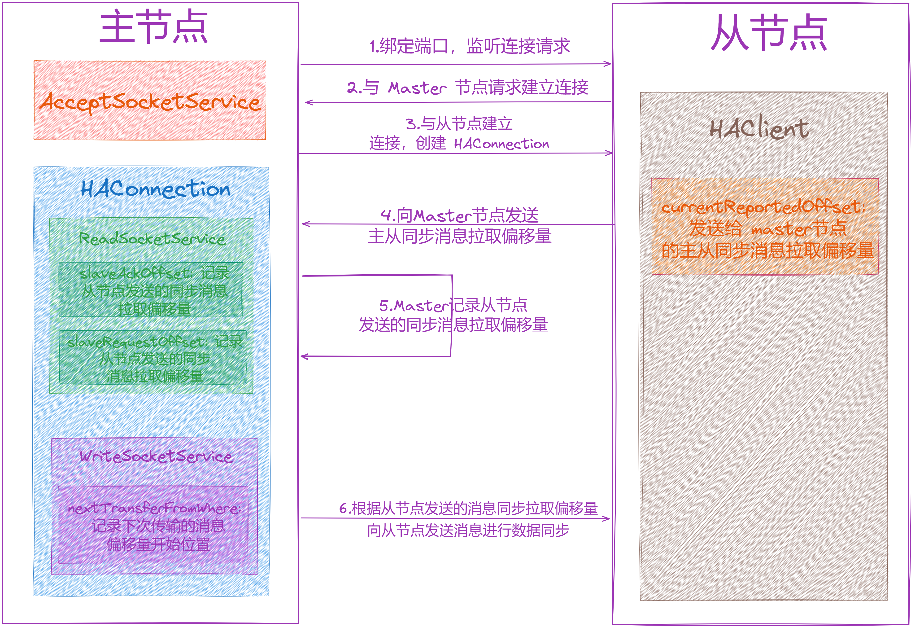
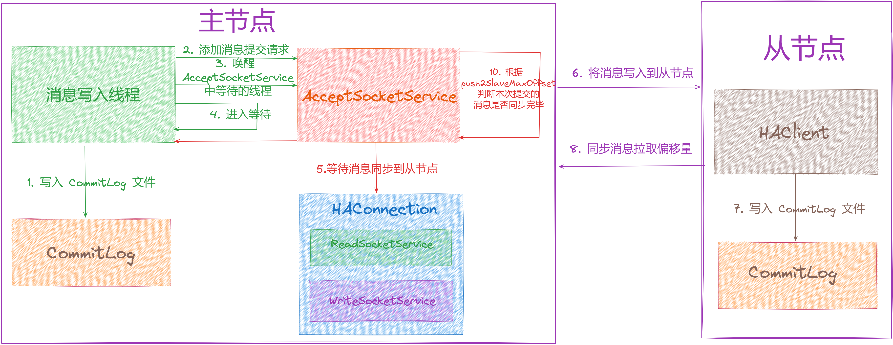
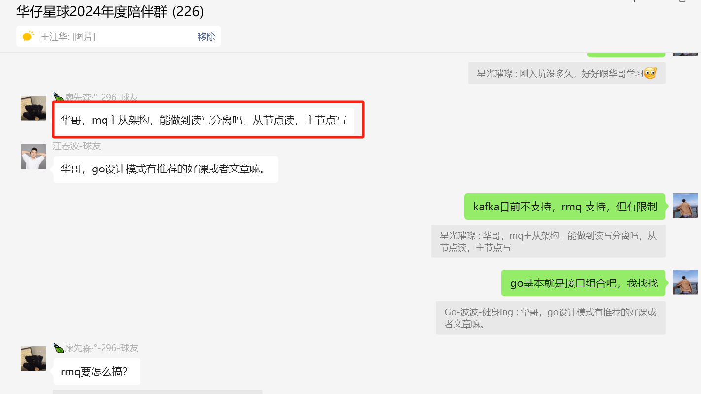

大家好，我是**华仔**, 又跟大家见面了。

从今天开始，我们开始对 RocketMQ 进行相关实现原理进行剖析，今天是第四篇，我们来聊聊 RocketMQ 「**Broker**」 的主从架构与集群模式原理，深度剖析下其内部底层原理设计思想，**下面进入正题**。

  

## **01 总体概述**

与 Kafka 类似，「**Broker**」是 RocketMQ 的核心，大部分「**重量级**」的工作都是由 「**Broker**」来完成的，主要包括「**接收 Producer 发来的消息**」、「**处理 Consumer 消费的消息**」、「**消息的持久化存储**」、「**消息的 HA 机制**」、「**消息查询**」以及「**服务高可用**」等 。

## **02 Broker 集群部署模式**

RocketMQ 的 Broker 有以下三种集群部署方式：

1.单台 Master 部署；

2.多台 Master 部署；

3.多 Master 多 Slave 部署；

## **2.1 单 Master 模式**

单 master 也就是只有一个 master 节点，如果该 master 节点挂掉了，会导致整个服务不可用，线上不建议使用，适合个人学习使用。

## **2.2 多 Master 模式**

多个 master 节点组成集群，单个 master 节点宕机或者重启对应用没有影响。

和 kafka 不一样，RocketMQ 中并没有 master「**选举功能**」，在 RocketMQ 集群中，1 台机器只能要么是Master，要么是 Slave，这个在初始的机器配置就定死了的。

早期 RocketMQ 版本不会像 kafka 那样存在 master 动态选举，所以通过配置多个 master 节点来保证 RocketMQ 的高可用。

我们来看下该模式下的优缺点：

1.  优点：高可用，该模式是所有模式中「**性能最高**」的。
2.  缺点：可能会有少量消息丢失（配置相关），单台机器重启或宕机期间，该机器下未被消费的消息在机器恢复前不可订阅，影响消息实时性。

> 注意：使用同步刷盘可以保证消息不丢失，同时 Topic 相对应的 queue 应该分布在集群中各个 master 节点，而不是只在某个 master 节点上，否则该节点宕机会对订阅该 topic 的应用造成影响。

## **2.3 多 Master 同步/异步复制模式**

多 master 模式根据 Master 和 Slave 之间的数据同步方式可以分为：

1.  多 master 多 slave 异步复制模式
2.  多 master 多 slave 同步复制模式

总体来说，RocketMQ 集群部署模式为四种，下面是第三种方式的部署方式架构图：

当采用多 Master 方式时，Master 与 Master 之间是「**不需要知道彼此**」的，这样的设计思想直接降低了 Broker实现的复杂性。

看到这里你是否有所疑惑？你可以想象一下，如果 Master 与 Master 之间「**需要知道彼此**」的存在，此时需要在维护一个 Master 列表，而且必然涉及到「**Master 注册发现**」和「**活跃 Master 数量变更**」等很多状态更新问题，所以最简单最可靠的做法就是 Master 只做好自己的事情「**与 Slave 进行数据同步**」即可。

通过这样的设计，在分布式环境中，当某台 Master 宕机或上线，不会对其他 Master 造成任何影响。

那么我们如何才能知道集群中有多少台 Master 和 Slave 呢？

这就是我们上一篇剖析的结果 [【原理分析系列第三篇】图解 RocketMQ NameServer 架构设计](https://articles.zsxq.com/id_plt5q5i603r3.html)，没错就是那个大名鼎鼎的「**NameServer**」。

这里再回顾下「**NameServer**」的功能，大概有以下 4 类：

1.  NameServer 承担了「**注册中心**」的职能。
2.  NameServer 用来保存「**活跃 broker 列表**」，包括 Master 和 Slave。
3.  NameServer 用来保存所有 topic 和该 topic 所有队列的列表。
4.  NameServer 用来保存所有 broker 的「**Filter 列表**」。

## **2.4 多 Master 多 Slave 部署集群工作流程**

1.  NameServer 是一个几乎无状态节点，可集群部署，节点之间无任何信息同步。
2.  Broker 部署相对复杂，Broker 分为 Master 与 Slave，一个 Master 可以对应多个 Slave，但是一个 Slave 只能对应一个 Master，Master 与 Slave 的对应关系通过指定「**相同的 BrokerName**」，「**不同的 BrokerId**」来定义，BrokerId 为 0 表示 Master，非 0 表示 Slave。Master 也可以部署多个。每个 Broker 与 NameServer 集群中的所有节点建立长连接，定时注册 Topic 信息到所有 NameServer。

> 注意：当前RocketMQ版本在部署架构上支持一Master多Slave，但只有BrokerId=1的从服务器才
> 
> 会参与消息的读负载。

1.  Producer 与 NameServer 集群中的其中一个节点（随机选择）建立「**长连接**」，定期从 NameServer 获取「**Topic 路由信息**」，并向提供 Topic 服务的 Master 建立长连接，且定时向 Master 「**发送心跳**」。Producer完全无状态，可集群部署。
2.  Consumer 与 NameServer 集群中的其中一个节点（随机选择）建立长连接，定期从 NameServer 获取 Topic 路由信息，并向提供 Topic 服务的 Master、Slave 建立长连接，且定时向 Master、Slave 发送心跳。
3.  Consumer 既可以从 Master 订阅消息，也可以从 Slave 订阅消息，消费者在向 Master 拉取消息时，Master服务器会根据拉取偏移量与最大偏移量的距离（判断是否读老消息，产生读 I/O），以及从服务器是否可读等因素建议下一次是从 Master 还是 Slave 拉取。

## **2.3.1 多 Master 多 Slave 异步复制模式**

在多 master 模式的基础上，每个 master 节点都有至少一个对应的 slave。master 节点「**可读可写**」，但是 slave 「**只能读不可写**」，类似于 MYSQL 的主备模式。

其优缺点如下：

1.  优点： 在 master 宕机时，消费者可以从 slave 读取消息，消息的实时性不会受影响，性能几乎和多 master 一样。
2.  缺点：使用「**异步复制**」的同步方式有可能会有「**消息丢失**」消息丢失的问题。

RocketMQ 天生对集群的支持非常友好，天然支持「**高可用**」，它可以支持「**多主多从**」的部署架构，这也是和

Kafka 区别之一，Kafka 的分区副本可以看成「**一主多从**」。

其中 Master 的broker id = 0，Slave 的 broker id > 0。这有点类似于 MYSQL 的主从概念，当 master 挂了以后，slave 仍然可以提供「**读服务**」，但是由于有多主的存在，当一个 master 挂了以后，可以写到其他的 master上。

## **2.3.2 多 master 多 slave 同步复制模式**

同多 master 多 slave 异步复制模式类似，区别在于 master 和 slave 之间的数据同步方式。

其优缺点如下：

1.  优点：同步双写的同步模式能保证数据不丢失。
2.  缺点：发送单个消息「**RT 会略长**」，性能相比异步复制「**低 10%**」左右。

刷盘策略：同步刷盘和异步刷盘，它指的是节点自身数据是同步还是异步存储。

> 注意：要保证数据可靠，需采用同步刷盘和同步双写的方式，但性能会较其他方式低。

## **2.5 BrokerServer 高可用**

RocketMQ 是通过 Master 和 Slave 的配合达到 BrokerServer 模块的高可用。一个 Master 可以配置多个 Slave，同时也支持配置多个 Master-Slave 组。

当其中一个 Master 出现问题时：

1.  由于 Slave 只负责读，当 Master 不可用，它对应的 Slave 仍能保证消息被正常消费。
2.  由于配置多组 Master-Slave 组，其他的 Master-Slave 组也会保证消息的正常发送和消费。

老版本的 RocketMQ 不支持把 Slave 自动转成 Master，如果机器资源不足， 需要把 Slave 转成 Master，则

要「**手动停止**」Slave 角色的 Broker，「**更改配置文件**」，用新的配置文件启动 Broker。

新版本（4.5）的 RocketMQ，支持 Slave 自动转成 Master。RocketMQ 「**dledger**」使用了Raft 协议，保证所有节点数据最终一致性，同时保证了集群的可用性。

关于「**dledger**」我们会在后面单篇剖析，这里就不介绍了，下面我们先介绍原来的主从同步的机制。

## **03 Broker 主从同步机制**

上面说了，RocketMQ 支持「**集群部署**」来保证高可用。它基于「**主从模式**」，将节点分为 Master、Slave 两个角色，集群中可以有多个 Master 节点，一个 Master 节点可以有多个 Slave 节点。「**Master 节点**」负责接收生产者发送的写入请求，将消息写入「**CommitLog**」文件，「**Slave 节点**」会与「**Master 节点**」建立连接，从 「**Master 节点**」同步消息数据，消费者可以从 Master 节点拉取消息，也可以从 Slave 节点拉取消息。

RocketMQ 主从模式下，是通过 Slave 节点主动向 Master 节点发送请求通知主节点进行数据同步的。

## **3.1 主从消息同步**

## **3.1.1 建立连接**

### **主节点监听连接事件**

「**主从节点**」传输数据，那么肯定会先「**建立连接**」，所以「**主节点**」在启动的时候，会开启一个端口 [haListenPort](http://halistenport/) 用于监听「**从节点**」的连接请求「**注册了 ACCEPT 连接事件监听**」，默认端口是「**10912**」，当然也可以通过配置修改 [haListenPort](http://halistenport/) 的值使用其他端口。

在端口绑定之后，「**主节点**」会专门开启一个「**线程**」，用于「**监听到从节点的连接事件**」，如果「**从节点**」发起了连接请求，会与「**从节点**」建立连接，与「**从节点**」的连接信息会封装在 [HAConnection](http://haconnection/) 类中，主节点和从节点的数据同步逻辑也在 [HAConnection](http://haconnection/) 中。

### **从节点发起连接事件**

「**从节点**」在启动时会向「**主节点**」发起连接请求，上面说过「**主节点**」会监听「**从节点**」的连接请求，所以此时主从节点的连接建立完成，待完成后「**从节点**」会在连接上注册「**READ 可读事件监听**」，处理连接上的可读事件。

## **3.1.2 消息同步**

### **主节点处理从节点请求**

这里可以分两种事件：「**READ 可读事件即处理从节点发送过来的请求**」、「**WRITE 可写事件即向从节点发送请求**」，整个逻辑如下：

1.  先来看「**读事件**」，上面说到「**从节点**」会定时向「**主节点**」汇报消息同步的进度，「**主节点**」会开启一个「**线程**」专门处理监听到的「**可读事件**」，也就是处理「**从节点**」发来的请求，处理逻辑在 [ReadSocketService](http://readsocketservice/) 中，可以先自行阅读。
2.  再来看「**写事件**」，「**主节点**」也会开启了一个「**线程**」来处理网络中的写事件，**主节点向从节点发送同步消息数据的处理**，它也会开启一个循环，只要主节点未停止服务，就不断进行处理。
3.  最后再来看下「**从节点收到消息的处理结果**」，「**从节点**」会监听到网络中的可读数据，收到消息后将消息写入自己的「**CommitLog**」中。

主从同步流程如下：

### **从节点处理主从同步**

从节点处理主从同步的逻辑主要在 [HAClient](http://haclient/) 中，它内部会开启了一个「**线程**」处理主从同步，只要 Slave 节点未停止，就会不断循环处理，逻辑如下：

1.  「**从节点**」会定时向「**主节点**」上报消息同步的偏移量，所以每次循环开始都会判断是否需要向主节点「**发送消息同步偏移量**」，如果已经有一段时间内没有向主节点上报，此时就会向主节点「**发送消息同步偏移量**」，告诉主节点现在同步到哪条消息了。
2.  等待与「**主节点**」建立的连接上产生「**READ 可读事件**」。
3.  处理「**READ 可读事件**」，主要是判断「**主节点**」是否发来了数据，如果「**主节点**」发送了数据，就要从网络中读取数据，将读取到的消息内容写到「**从节点**」自己的 「**CommitLog**」。

## **3.2 等待主从复制结果**

这里分为两种同步方式：「**同步复制 SYNC\_MASTER**」、「**异步复制 ASYNC\_MASTER**」。

1.  先来看下「**同步复制**」，当消息写入「**主节点**」之后，需要等待「**从节点**」也写入完毕才能返回成功。
2.  再来看下「**异步复制**」，当消息写入「**主节点**」之后即可返回成功，「**主从同步**」数据异步进行，不需要等待「**从节点**」写入完毕即可返回成功。

当「**主从同步**」开始之后，如果有新的消息写入主节点的「**CommitLog**」，如果 Master 节点配置的是「**同步复制 SYNC\_MASTER**」，在消息写入主节点之后还需要等待「**从节点**」同步完毕，「**主节点**」会开启一个数据同步线程，专门来判断数据是否同步完毕。

首先消息在写入「**CommitLog**」之后会构建一个消息提交请求 「**GroupCommitRequest**」，请求中会携带本次消息写入之后的「**偏移量**」，将其提交到一个集合「**requestsRead**」中，这个线程可以称为「**主线程**」，然后主线程会「**唤醒**」数据同步线程来判断数据是否同步完毕，之后「**主线程**」进入等待状态。

## **3.3 主从模式下消息消费流程**

在「**主从模式**」下，消费者向 Broker 发送拉取消息请求后，Broker 对拉取请求进行处理时会设置一个 broker ID，建议消费者下次从 Broker 拉取消息，接下来会看下 Broker 根据什么条件决定返回哪个 Broker ID 的。

这个是星球球友前几天在群里问过的一个问题，这里简单总结下。

Broker 在处理消费者拉取请求时，获取消息后会在返回结果中设置一个是否建议从 Slave 节点拉取值放在[isSuggestPullingFromSlave](http://issuggestpullingfromslave/) 这个变量中，这个值的判断方式如下：

long diff \= maxOffsetPy - maxPhyOffsetPulling;

long memory \= (long) (StoreUtil.TOTAL\_PHYSICAL\_MEMORY\_SIZE

\* (this.messageStoreConfig.getAccessMessageInMemoryMaxRatio() / 100.0));

getResult.setSuggestPullingFromSlave(diff > memory);

1.  maxOffsetPy：表示当前最大物理偏移量。
2.  maxPhyOffsetPulling： 表示本次消息拉取最大物理偏移量。
3.  diff：当前 Broker 的 CommitLog 最大偏移量减去本次拉取消息的最大物理偏移量，表示剩余未拉取的消息。
4.  memory：消息在 PageCache 中的总大小，计算方式是总物理内存 \* 消息存储在内存中的阀值（默认为40）/100，也就是说 MQ 会缓存一部分消息在操作系统的 PageCache 中，加速访问。

如果 diff 大于 memory 的值，表示未拉取的消息过多，已经超出了 PageCache 缓存的数据的大小，还需要从磁盘中获取消息，所以此时会建议下次从 Slave 节点拉取，将 [isSuggestPullingFromSlave](http://issuggestpullingfromslave/) 的值置为 true，否则为false。

## **04 总结**

这里，我们一起来总结一下这篇文章的重点。

1、带你剖析了「**RocketMQ**」为什么要设计「**Broker**」以及 「**Broker**」的作用和功能。

2、接着带你剖析了「**Broker**」的几种集群部署方式。

2、最后带你剖析了「**Broker**」主从同步机制的实现原理和流程。

下篇我们来深度剖析「**Broker 注册到 NameServer 全流程**」，大家期待，我们下期见。